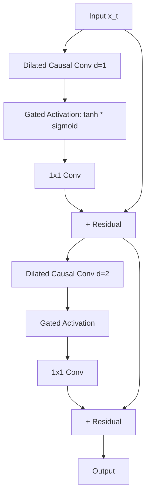
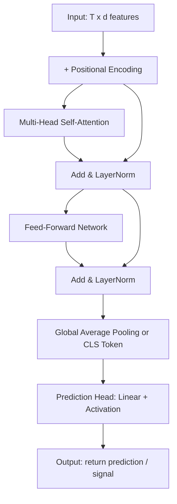
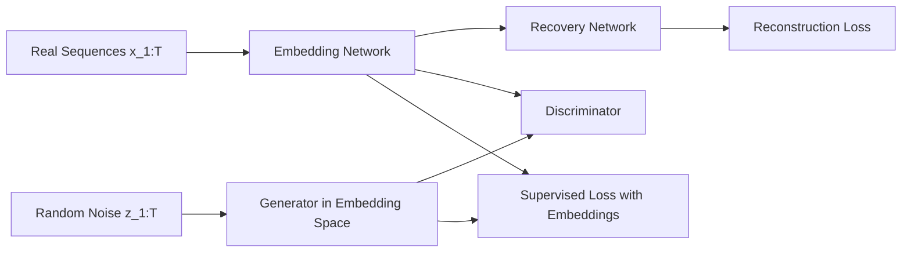
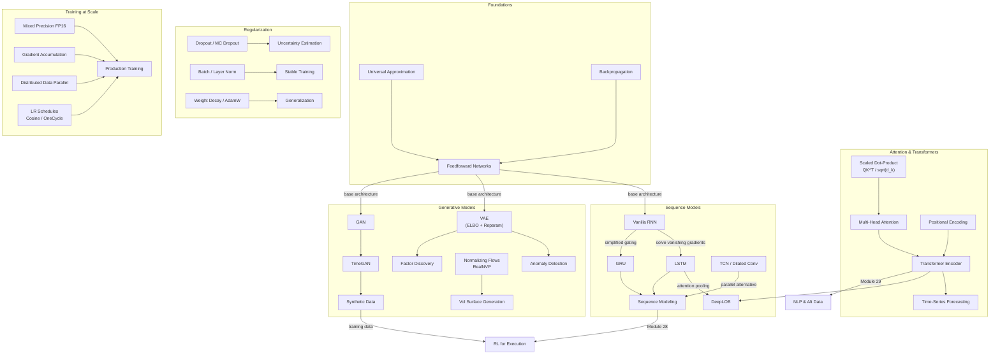

# Module 27: Deep Learning & Neural Networks in Finance

> **Prerequisites:** Modules 06 (Probability & Statistics), 09 (Optimization), 26 (Machine Learning Foundations)
> **Builds toward:** Modules 28 (Reinforcement Learning for Execution), 29 (NLP & Alternative Data)

---

## Table of Contents

1. [Feedforward Networks & Universal Approximation](#1-feedforward-networks--universal-approximation)
2. [Regularization Techniques](#2-regularization-techniques)
3. [Recurrent Neural Networks](#3-recurrent-neural-networks)
4. [Long Short-Term Memory (LSTM)](#4-long-short-term-memory-lstm)
5. [Gated Recurrent Unit (GRU)](#5-gated-recurrent-unit-gru)
6. [Temporal Convolutional Networks (TCN)](#6-temporal-convolutional-networks-tcn)
7. [Transformer Architecture](#7-transformer-architecture)
8. [Attention for Limit Order Books](#8-attention-for-limit-order-books)
9. [Autoencoders & Variational Autoencoders](#9-autoencoders--variational-autoencoders)
10. [Normalizing Flows](#10-normalizing-flows)
11. [Generative Adversarial Networks](#11-generative-adversarial-networks)
12. [Training at Scale](#12-training-at-scale)
13. [Production Python Implementations](#13-production-python-implementations)
14. [Exercises](#14-exercises)
15. [Summary & Concept Map](#15-summary--concept-map)

---

## 1. Feedforward Networks & Universal Approximation

### 1.1 Architecture

A feedforward neural network (FNN) maps inputs $\mathbf{x} \in \mathbb{R}^d$ to outputs $\hat{\mathbf{y}} \in \mathbb{R}^k$ through $L$ layers of affine transformations and nonlinear activations:

$$
\mathbf{h}^{(0)} = \mathbf{x}, \qquad \mathbf{z}^{(l)} = \mathbf{W}^{(l)} \mathbf{h}^{(l-1)} + \mathbf{b}^{(l)}, \qquad \mathbf{h}^{(l)} = \sigma(\mathbf{z}^{(l)}), \qquad l = 1, \ldots, L
$$

where $\mathbf{W}^{(l)} \in \mathbb{R}^{n_l \times n_{l-1}}$ are weight matrices, $\mathbf{b}^{(l)} \in \mathbb{R}^{n_l}$ are bias vectors, and $\sigma(\cdot)$ is a pointwise nonlinear activation function.

### 1.2 Universal Approximation Theorem

**Theorem (Cybenko, 1989; Hornik, 1991).** Let $\sigma: \mathbb{R} \to \mathbb{R}$ be a nonconstant, bounded, and continuous function (e.g., sigmoid). For any continuous function $f: [0,1]^d \to \mathbb{R}$ and any $\epsilon > 0$, there exist $N \in \mathbb{N}$, weights $\{w_i, \mathbf{v}_i, b_i\}_{i=1}^N$ such that the function:

$$
F(\mathbf{x}) = \sum_{i=1}^{N} w_i \, \sigma\!\left(\mathbf{v}_i^\top \mathbf{x} + b_i\right)
$$

satisfies $\sup_{\mathbf{x} \in [0,1]^d} |f(\mathbf{x}) - F(\mathbf{x})| < \epsilon$.

**Interpretation for finance:** Any continuous pricing function, risk surface, or return-generating process can be approximated to arbitrary precision by a sufficiently wide single-hidden-layer network. The theorem guarantees *existence* but not learnability---it says nothing about the width required or whether gradient-based optimization will find the solution.

The modern extension by Lu et al. (2017) shows that ReLU networks of bounded width but arbitrary depth are also universal approximators, with width $\geq d + 1$ sufficient.

### 1.3 Backpropagation Derivation

Given a loss $\mathcal{L}(\hat{\mathbf{y}}, \mathbf{y})$, we compute gradients via the chain rule on a computational graph. Define $\boldsymbol{\delta}^{(l)} = \frac{\partial \mathcal{L}}{\partial \mathbf{z}^{(l)}}$ as the error signal at layer $l$.

**Output layer** ($l = L$): For MSE loss with identity output activation:

$$
\boldsymbol{\delta}^{(L)} = \frac{\partial \mathcal{L}}{\partial \mathbf{z}^{(L)}} = \hat{\mathbf{y}} - \mathbf{y}
$$

**Hidden layers** (backward pass): By the chain rule:

$$
\boldsymbol{\delta}^{(l)} = \frac{\partial \mathcal{L}}{\partial \mathbf{z}^{(l)}} = \left(\mathbf{W}^{(l+1)\top} \boldsymbol{\delta}^{(l+1)}\right) \odot \sigma'(\mathbf{z}^{(l)})
$$

where $\odot$ denotes elementwise multiplication.

**Parameter gradients:**

$$
\frac{\partial \mathcal{L}}{\partial \mathbf{W}^{(l)}} = \boldsymbol{\delta}^{(l)} \, \mathbf{h}^{(l-1)\top}, \qquad \frac{\partial \mathcal{L}}{\partial \mathbf{b}^{(l)}} = \boldsymbol{\delta}^{(l)}
$$

Over a minibatch of size $B$, we average: $\nabla_{\mathbf{W}^{(l)}} \mathcal{L} = \frac{1}{B} \sum_{i=1}^B \boldsymbol{\delta}_i^{(l)} \mathbf{h}_i^{(l-1)\top}$.

### 1.4 Activation Functions

| Activation | Definition | Derivative | Properties |
|---|---|---|---|
| **ReLU** | $\sigma(z) = \max(0, z)$ | $\sigma'(z) = \mathbb{1}[z > 0]$ | Sparse, avoids vanishing gradient for $z > 0$, dead neurons |
| **GELU** | $\sigma(z) = z \cdot \Phi(z)$ | $\sigma'(z) = \Phi(z) + z \phi(z)$ | Smooth approximation of ReLU, used in Transformers |
| **SiLU (Swish)** | $\sigma(z) = z \cdot \text{sigmoid}(z)$ | $\sigma'(z) = \sigma(z) + \text{sigmoid}(z)(1 - \sigma(z))$ | Self-gated, non-monotonic, strong empirical performance |

where $\Phi(z)$ is the standard normal CDF and $\phi(z)$ is the standard normal PDF.

**Why GELU in finance?** Financial return distributions exhibit heavy tails and asymmetry. GELU's smooth, probabilistic gating adapts naturally to the non-Gaussian structure, outperforming ReLU in empirical studies on return prediction tasks.

```cpp
// C++ activation functions with SIMD-friendly implementations
#include <cmath>
#include <algorithm>
#include <vector>

namespace activations {

inline double relu(double z) { return std::max(0.0, z); }
inline double relu_grad(double z) { return z > 0.0 ? 1.0 : 0.0; }

inline double gelu(double z) {
    // Approximation: 0.5 * z * (1 + tanh(sqrt(2/pi) * (z + 0.044715 * z^3)))
    constexpr double c = 0.7978845608028654;   // sqrt(2/pi)
    constexpr double k = 0.044715;
    double inner = c * (z + k * z * z * z);
    return 0.5 * z * (1.0 + std::tanh(inner));
}

inline double silu(double z) {
    return z / (1.0 + std::exp(-z));
}

// Vectorized application over a contiguous buffer
void apply_relu(double* data, size_t n) {
    for (size_t i = 0; i < n; ++i)
        data[i] = relu(data[i]);
}

void apply_gelu(double* data, size_t n) {
    for (size_t i = 0; i < n; ++i)
        data[i] = gelu(data[i]);
}

} // namespace activations
```

---

## 2. Regularization Techniques

### 2.1 Dropout as Approximate Bayesian Inference

**Dropout** (Srivastava et al., 2014) randomly zeroes each hidden unit with probability $p$ during training. For hidden vector $\mathbf{h}$:

$$
\tilde{\mathbf{h}} = \mathbf{h} \odot \mathbf{m}, \qquad m_j \sim \text{Bernoulli}(1 - p)
$$

At test time, we scale: $\mathbf{h}_{\text{test}} = (1-p) \cdot \mathbf{h}$ (or equivalently use inverted dropout during training).

**Bayesian interpretation (Gal & Ghahramani, 2016):** Dropout training minimizes the KL divergence between an approximate variational distribution $q(\boldsymbol{\omega})$ and the true posterior $p(\boldsymbol{\omega} | \mathcal{D})$:

$$
\mathcal{L}_{\text{dropout}} = -\frac{1}{N} \sum_{i=1}^N \log p(\mathbf{y}_i | f^{\boldsymbol{\omega}}(\mathbf{x}_i)) + \frac{1}{N} \text{KL}\!\left(q(\boldsymbol{\omega}) \| p(\boldsymbol{\omega})\right)
$$

The variational distribution $q(\mathbf{W}^{(l)})$ places mass on matrices of the form $\mathbf{W}^{(l)} = \mathbf{M}^{(l)} \cdot \text{diag}(\mathbf{m}^{(l)})$ where $\mathbf{m}^{(l)}$ are Bernoulli random vectors. At inference, running $T$ forward passes with dropout active and averaging yields **MC Dropout** uncertainty estimates:

$$
\mathbb{E}[y^*] \approx \frac{1}{T} \sum_{t=1}^T f^{\hat{\boldsymbol{\omega}}_t}(\mathbf{x}^*), \qquad \text{Var}[y^*] \approx \frac{1}{T} \sum_{t=1}^T \left(f^{\hat{\boldsymbol{\omega}}_t}(\mathbf{x}^*)\right)^2 - \left(\mathbb{E}[y^*]\right)^2
$$

**Application:** MC Dropout gives calibrated uncertainty on return predictions, enabling position sizing proportional to model confidence---crucial for risk management.

### 2.2 Batch Normalization

**Forward pass.** Given a minibatch $\{z_i\}_{i=1}^B$ at a particular layer dimension:

$$
\mu_B = \frac{1}{B} \sum_{i=1}^B z_i, \qquad \sigma_B^2 = \frac{1}{B} \sum_{i=1}^B (z_i - \mu_B)^2
$$

$$
\hat{z}_i = \frac{z_i - \mu_B}{\sqrt{\sigma_B^2 + \epsilon}}, \qquad y_i = \gamma \hat{z}_i + \beta
$$

where $\gamma, \beta$ are learnable scale and shift parameters, and $\epsilon \sim 10^{-5}$ prevents division by zero.

**Backward pass derivation.** Let $\frac{\partial \mathcal{L}}{\partial y_i} = \delta_i^y$ be the incoming gradient. Then:

$$
\frac{\partial \mathcal{L}}{\partial \gamma} = \sum_{i=1}^B \delta_i^y \hat{z}_i, \qquad \frac{\partial \mathcal{L}}{\partial \beta} = \sum_{i=1}^B \delta_i^y
$$

$$
\frac{\partial \mathcal{L}}{\partial \hat{z}_i} = \delta_i^y \cdot \gamma
$$

$$
\frac{\partial \mathcal{L}}{\partial \sigma_B^2} = \sum_{i=1}^B \frac{\partial \mathcal{L}}{\partial \hat{z}_i} \cdot (z_i - \mu_B) \cdot \left(-\frac{1}{2}\right)(\sigma_B^2 + \epsilon)^{-3/2}
$$

$$
\frac{\partial \mathcal{L}}{\partial \mu_B} = \sum_{i=1}^B \frac{\partial \mathcal{L}}{\partial \hat{z}_i} \cdot \frac{-1}{\sqrt{\sigma_B^2 + \epsilon}} + \frac{\partial \mathcal{L}}{\partial \sigma_B^2} \cdot \frac{-2}{B} \sum_{i=1}^B (z_i - \mu_B)
$$

$$
\frac{\partial \mathcal{L}}{\partial z_i} = \frac{\partial \mathcal{L}}{\partial \hat{z}_i} \cdot \frac{1}{\sqrt{\sigma_B^2 + \epsilon}} + \frac{\partial \mathcal{L}}{\partial \sigma_B^2} \cdot \frac{2(z_i - \mu_B)}{B} + \frac{\partial \mathcal{L}}{\partial \mu_B} \cdot \frac{1}{B}
$$

**Layer Normalization** normalizes across features rather than across the batch, making it suitable for sequence models where batch statistics are unreliable:

$$
\mu_i = \frac{1}{d} \sum_{j=1}^d z_{ij}, \qquad \sigma_i^2 = \frac{1}{d} \sum_{j=1}^d (z_{ij} - \mu_i)^2
$$

### 2.3 Weight Decay and Early Stopping

**L2 regularization (weight decay)** adds $\frac{\lambda}{2}\|\mathbf{W}\|_F^2$ to the loss. With SGD, the update becomes:

$$
\mathbf{W} \leftarrow (1 - \eta \lambda) \mathbf{W} - \eta \nabla_{\mathbf{W}} \mathcal{L}
$$

**Decoupled weight decay** (AdamW) separates the regularization from the adaptive gradient:

$$
\mathbf{W} \leftarrow (1 - \lambda) \mathbf{W} - \eta \frac{\hat{\mathbf{m}}_t}{\sqrt{\hat{\mathbf{v}}_t} + \epsilon}
$$

This distinction is critical: standard L2 regularization in Adam interacts with the adaptive learning rate, reducing its effectiveness.

**Early stopping** monitors validation loss and halts training when it has not improved for $P$ consecutive epochs (patience). Theoretically, early stopping is equivalent to L2 regularization in linear models (Bishop, 1995).

---

## 3. Recurrent Neural Networks

### 3.1 Vanilla RNN

The vanilla RNN processes a sequence $(\mathbf{x}_1, \ldots, \mathbf{x}_T)$ by maintaining a hidden state:

$$
\mathbf{h}_t = \tanh\!\left(\mathbf{W}_{hh} \mathbf{h}_{t-1} + \mathbf{W}_{xh} \mathbf{x}_t + \mathbf{b}_h\right)
$$

$$
\hat{\mathbf{y}}_t = \mathbf{W}_{hy} \mathbf{h}_t + \mathbf{b}_y
$$

### 3.2 Vanishing and Exploding Gradients

**Derivation from Jacobian products.** The gradient of the loss at time $T$ with respect to $\mathbf{h}_t$ is:

$$
\frac{\partial \mathcal{L}_T}{\partial \mathbf{h}_t} = \frac{\partial \mathcal{L}_T}{\partial \mathbf{h}_T} \prod_{k=t+1}^{T} \frac{\partial \mathbf{h}_k}{\partial \mathbf{h}_{k-1}}
$$

Each Jacobian factor is:

$$
\frac{\partial \mathbf{h}_k}{\partial \mathbf{h}_{k-1}} = \text{diag}\!\left(\sigma'(\mathbf{z}_k)\right) \cdot \mathbf{W}_{hh}
$$

where $\sigma'(\mathbf{z}_k) = 1 - \mathbf{h}_k^2$ for $\tanh$. The product of $T - t$ such matrices gives:

$$
\prod_{k=t+1}^{T} \frac{\partial \mathbf{h}_k}{\partial \mathbf{h}_{k-1}} = \prod_{k=t+1}^{T} \text{diag}\!\left(\sigma'(\mathbf{z}_k)\right) \cdot \mathbf{W}_{hh}
$$

Let $\lambda_{\max}$ be the largest singular value of $\mathbf{W}_{hh}$. Since $|\sigma'(z)| \leq 1$ for $\tanh$:

- If $\lambda_{\max} < 1$: the product decays exponentially as $\mathcal{O}(\lambda_{\max}^{T-t})$ --- **vanishing gradients**
- If $\lambda_{\max} > 1$ and $\sigma'$ is close to 1: the product grows exponentially --- **exploding gradients**

### 3.3 Gradient Clipping

**Gradient norm clipping** rescales the gradient when its norm exceeds a threshold $\theta$:

$$
\hat{\mathbf{g}} = \begin{cases} \mathbf{g} & \text{if } \|\mathbf{g}\| \leq \theta \\ \frac{\theta}{\|\mathbf{g}\|} \mathbf{g} & \text{otherwise} \end{cases}
$$

This prevents catastrophic parameter updates from exploding gradients while preserving gradient direction.

```cpp
// C++ gradient clipping
#include <cmath>
#include <vector>

struct GradientClipper {
    double max_norm;

    explicit GradientClipper(double threshold) : max_norm(threshold) {}

    void clip(std::vector<double>& grad) const {
        double norm_sq = 0.0;
        for (double g : grad) norm_sq += g * g;
        double norm = std::sqrt(norm_sq);

        if (norm > max_norm) {
            double scale = max_norm / norm;
            for (double& g : grad) g *= scale;
        }
    }
};
```

---

## 4. Long Short-Term Memory (LSTM)

### 4.1 Gate Mechanism

The LSTM (Hochreiter & Schmidhuber, 1997) introduces a **cell state** $\mathbf{c}_t$ with three gates controlling information flow:

**Forget gate:** decides what to erase from cell state:

$$
\mathbf{f}_t = \sigma\!\left(\mathbf{W}_f [\mathbf{h}_{t-1}; \mathbf{x}_t] + \mathbf{b}_f\right)
$$

**Input gate:** decides what new information to store:

$$
\mathbf{i}_t = \sigma\!\left(\mathbf{W}_i [\mathbf{h}_{t-1}; \mathbf{x}_t] + \mathbf{b}_i\right)
$$

$$
\tilde{\mathbf{c}}_t = \tanh\!\left(\mathbf{W}_c [\mathbf{h}_{t-1}; \mathbf{x}_t] + \mathbf{b}_c\right)
$$

**Cell state update:**

$$
\mathbf{c}_t = \mathbf{f}_t \odot \mathbf{c}_{t-1} + \mathbf{i}_t \odot \tilde{\mathbf{c}}_t
$$

**Output gate:** decides what to expose:

$$
\mathbf{o}_t = \sigma\!\left(\mathbf{W}_o [\mathbf{h}_{t-1}; \mathbf{x}_t] + \mathbf{b}_o\right)
$$

$$
\mathbf{h}_t = \mathbf{o}_t \odot \tanh(\mathbf{c}_t)
$$

### 4.2 Gradient Flow Through Cell State

The key insight of LSTM is the *additive* cell state update. The gradient of $\mathcal{L}$ with respect to $\mathbf{c}_t$ flows as:

$$
\frac{\partial \mathcal{L}}{\partial \mathbf{c}_{t-1}} = \frac{\partial \mathcal{L}}{\partial \mathbf{c}_t} \odot \mathbf{f}_t + \text{(terms from gates)}
$$

Expanding, for cell state at time $t'< t$:

$$
\frac{\partial \mathbf{c}_t}{\partial \mathbf{c}_{t'}} = \prod_{k=t'+1}^{t} \mathbf{f}_k + \text{(cross terms)}
$$

The product $\prod_{k} \mathbf{f}_k$ involves *elementwise* products of sigmoid outputs in $[0,1]$, not matrix products. When forget gates are near 1 (the common initialization strategy: $\mathbf{b}_f \sim \text{Uniform}(1, 3)$), gradients flow nearly unattenuated, solving the vanishing gradient problem.

### 4.3 Peephole Connections

Peephole LSTM (Gers & Schmidhuber, 2000) allows gates to directly observe the cell state:

$$
\mathbf{f}_t = \sigma\!\left(\mathbf{W}_f [\mathbf{h}_{t-1}; \mathbf{x}_t] + \mathbf{W}_{pf} \odot \mathbf{c}_{t-1} + \mathbf{b}_f\right)
$$

$$
\mathbf{i}_t = \sigma\!\left(\mathbf{W}_i [\mathbf{h}_{t-1}; \mathbf{x}_t] + \mathbf{W}_{pi} \odot \mathbf{c}_{t-1} + \mathbf{b}_i\right)
$$

$$
\mathbf{o}_t = \sigma\!\left(\mathbf{W}_o [\mathbf{h}_{t-1}; \mathbf{x}_t] + \mathbf{W}_{po} \odot \mathbf{c}_t + \mathbf{b}_o\right)
$$

The diagonal weight matrices $\mathbf{W}_{pf}, \mathbf{W}_{pi}, \mathbf{W}_{po}$ give each cell direct access to its own state when computing gate activations. This is particularly useful in financial time series where the magnitude of accumulated information (cell state) directly informs gating decisions---for instance, tracking cumulative signed volume.

---

## 5. Gated Recurrent Unit (GRU)

The GRU (Cho et al., 2014) merges the cell state and hidden state, using two gates instead of three:

**Reset gate:**

$$
\mathbf{r}_t = \sigma\!\left(\mathbf{W}_r [\mathbf{h}_{t-1}; \mathbf{x}_t] + \mathbf{b}_r\right)
$$

**Update gate:**

$$
\mathbf{z}_t = \sigma\!\left(\mathbf{W}_z [\mathbf{h}_{t-1}; \mathbf{x}_t] + \mathbf{b}_z\right)
$$

**Candidate activation:**

$$
\tilde{\mathbf{h}}_t = \tanh\!\left(\mathbf{W}_h [\mathbf{r}_t \odot \mathbf{h}_{t-1}; \mathbf{x}_t] + \mathbf{b}_h\right)
$$

**Hidden state update:**

$$
\mathbf{h}_t = (1 - \mathbf{z}_t) \odot \mathbf{h}_{t-1} + \mathbf{z}_t \odot \tilde{\mathbf{h}}_t
$$

**LSTM vs GRU comparison:**

| Aspect | LSTM | GRU |
|---|---|---|
| Parameters | $4 \times (n_h^2 + n_h \cdot n_x + n_h)$ | $3 \times (n_h^2 + n_h \cdot n_x + n_h)$ |
| Gates | 3 (forget, input, output) | 2 (reset, update) |
| Cell state | Separate $\mathbf{c}_t$ | Merged into $\mathbf{h}_t$ |
| Long-range memory | Better theoretical guarantees | Comparable in practice for moderate $T$ |
| Training speed | Slower (more parameters) | Faster (25% fewer parameters) |

In financial applications, GRU is often preferred for real-time inference (e.g., intraday signal generation) due to lower latency, while LSTM is chosen for tasks requiring very long memory (e.g., regime detection across months).

---

## 6. Temporal Convolutional Networks (TCN)

### 6.1 Causal Convolutions

A **causal convolution** at time $t$ depends only on elements at time $t$ and earlier, ensuring no future information leakage:

$$
(\mathbf{f} *_{\text{causal}} \mathbf{x})_t = \sum_{k=0}^{K-1} f_k \cdot x_{t-k}
$$

where $K$ is the kernel size. This is equivalent to a standard 1D convolution with left-padding of size $K - 1$.

### 6.2 Dilated Convolutions

**Dilated convolutions** (also called *atrous* convolutions) introduce gaps in the kernel:

$$
(\mathbf{f} *_d \mathbf{x})_t = \sum_{k=0}^{K-1} f_k \cdot x_{t - d \cdot k}
$$

where $d$ is the dilation factor. By stacking layers with exponentially increasing dilation $d = 1, 2, 4, 8, \ldots, 2^{L-1}$, the **receptive field** grows exponentially with depth:

$$
R = 1 + (K - 1) \sum_{l=0}^{L-1} 2^l = 1 + (K-1)(2^L - 1)
$$

For $K = 3$ and $L = 10$ layers: $R = 1 + 2 \times 1023 = 2047$ time steps.

### 6.3 WaveNet Architecture

The WaveNet-style TCN uses a residual block structure:



Each block applies gated activation:

$$
\mathbf{z}_t = \tanh(\mathbf{W}_f * \mathbf{x}_t) \odot \sigma(\mathbf{W}_g * \mathbf{x}_t)
$$

**Finance application:** TCNs are well-suited for multi-step-ahead volatility forecasting. Their parallelizable structure (unlike sequential RNNs) allows efficient GPU utilization on large tick datasets. The exponential receptive field captures both microstructure effects (milliseconds) and intraday patterns (hours) simultaneously.

---

## 7. Transformer Architecture

### 7.1 Scaled Dot-Product Attention

**Derivation.** Given queries $\mathbf{Q} \in \mathbb{R}^{n \times d_k}$, keys $\mathbf{K} \in \mathbb{R}^{m \times d_k}$, and values $\mathbf{V} \in \mathbb{R}^{m \times d_v}$:

$$
\text{Attention}(\mathbf{Q}, \mathbf{K}, \mathbf{V}) = \text{softmax}\!\left(\frac{\mathbf{Q}\mathbf{K}^\top}{\sqrt{d_k}}\right) \mathbf{V}
$$

**Why $\sqrt{d_k}$?** Assume $q_i, k_j \sim \mathcal{N}(0, 1)$ independently. Then $\mathbf{q}^\top \mathbf{k} = \sum_{i=1}^{d_k} q_i k_i$ has mean 0 and variance $d_k$. Without scaling, for large $d_k$, the dot products have large magnitude, pushing softmax into regions of extremely small gradients (near-one-hot outputs). Dividing by $\sqrt{d_k}$ normalizes the variance to 1:

$$
\text{Var}\!\left(\frac{\mathbf{q}^\top \mathbf{k}}{\sqrt{d_k}}\right) = \frac{d_k}{d_k} = 1
$$

This keeps softmax in a regime where gradients are informative.

**Attention weights:**

$$
\alpha_{ij} = \frac{\exp\!\left(\frac{\mathbf{q}_i^\top \mathbf{k}_j}{\sqrt{d_k}}\right)}{\sum_{l=1}^m \exp\!\left(\frac{\mathbf{q}_i^\top \mathbf{k}_l}{\sqrt{d_k}}\right)}
$$

The output for query $i$ is a weighted combination: $\mathbf{o}_i = \sum_{j=1}^m \alpha_{ij} \mathbf{v}_j$.

### 7.2 Multi-Head Attention

Instead of a single attention function, project queries, keys, and values $h$ times:

$$
\text{head}_i = \text{Attention}(\mathbf{Q}\mathbf{W}_i^Q, \mathbf{K}\mathbf{W}_i^K, \mathbf{V}\mathbf{W}_i^V)
$$

$$
\text{MultiHead}(\mathbf{Q}, \mathbf{K}, \mathbf{V}) = \text{Concat}(\text{head}_1, \ldots, \text{head}_h) \mathbf{W}^O
$$

where $\mathbf{W}_i^Q \in \mathbb{R}^{d_{\text{model}} \times d_k}$, $\mathbf{W}_i^K \in \mathbb{R}^{d_{\text{model}} \times d_k}$, $\mathbf{W}_i^V \in \mathbb{R}^{d_{\text{model}} \times d_v}$, $\mathbf{W}^O \in \mathbb{R}^{hd_v \times d_{\text{model}}}$.

Typically $d_k = d_v = d_{\text{model}} / h$, so multi-head attention has the same total cost as single-head with full dimensionality.

### 7.3 Positional Encoding

**Sinusoidal encoding** (Vaswani et al., 2017):

$$
\text{PE}(t, 2i) = \sin\!\left(\frac{t}{10000^{2i/d_{\text{model}}}}\right), \qquad \text{PE}(t, 2i+1) = \cos\!\left(\frac{t}{10000^{2i/d_{\text{model}}}}\right)
$$

This encoding has the property that $\text{PE}(t + \Delta t)$ can be expressed as a linear function of $\text{PE}(t)$, allowing the model to learn relative positions.

**Learned positional embeddings** simply treat positions as trainable vectors $\mathbf{p}_t \in \mathbb{R}^{d_{\text{model}}}$. For fixed-length financial time series (e.g., 252 trading days), learned embeddings can capture calendar effects directly.

### 7.4 Transformer for Time Series

The standard Transformer encoder block for financial time series:



For **causal** time series, we apply a mask to the attention matrix:

$$
\text{Mask}_{ij} = \begin{cases} 0 & \text{if } j \leq i \\ -\infty & \text{if } j > i \end{cases}
$$

This ensures that the prediction at time $t$ depends only on information up to time $t$.

---

## 8. Attention for Limit Order Books

### 8.1 DeepLOB Architecture

**DeepLOB** (Zhang et al., 2019) combines convolutional feature extraction with attention for limit order book (LOB) prediction. The input is a tensor $\mathbf{X} \in \mathbb{R}^{T \times 4L}$ representing $T$ snapshots of $L$ price levels (price, volume for bid and ask at each level).

**Architecture stages:**

1. **Inception module:** Parallel 1D convolutions with kernel sizes $\{1, 3, 5\}$ across the feature dimension, capturing patterns at different LOB depth scales.

2. **Convolutional blocks:** Two blocks of Conv1D + LeakyReLU + BatchNorm operating along the time axis, learning temporal microstructure patterns.

3. **LSTM layer:** Captures sequential dependencies in the extracted features.

4. **Attention mechanism:** Computes attention weights over LSTM hidden states:

$$
e_t = \mathbf{v}^\top \tanh(\mathbf{W}_a \mathbf{h}_t + \mathbf{b}_a), \qquad \alpha_t = \frac{\exp(e_t)}{\sum_{t'} \exp(e_{t'})}
$$

$$
\mathbf{c} = \sum_{t=1}^T \alpha_t \mathbf{h}_t
$$

5. **Classification head:** Maps the context vector $\mathbf{c}$ to a 3-class (up/stationary/down) prediction.

### 8.2 Multi-Horizon Prediction

For multi-horizon prediction at horizons $\{h_1, h_2, \ldots, h_H\}$ (e.g., 10, 20, 50, 100 ticks):

$$
\hat{\mathbf{y}}^{(h)} = \text{softmax}\!\left(\mathbf{W}^{(h)} \mathbf{c} + \mathbf{b}^{(h)}\right), \quad h \in \{h_1, \ldots, h_H\}
$$

The total loss is a weighted sum:

$$
\mathcal{L} = \sum_{h=1}^H \lambda_h \mathcal{L}_{\text{CE}}^{(h)}
$$

where $\lambda_h$ are horizon-specific weights (typically decreasing with $h$ to emphasize short-term accuracy for execution).

---

## 9. Autoencoders & Variational Autoencoders

### 9.1 Vanilla Autoencoder

An autoencoder learns a compressed representation by training an encoder $\mathbf{z} = f_\phi(\mathbf{x})$ and decoder $\hat{\mathbf{x}} = g_\theta(\mathbf{z})$ to minimize reconstruction loss:

$$
\mathcal{L}_{\text{AE}} = \|\mathbf{x} - g_\theta(f_\phi(\mathbf{x}))\|^2
$$

For anomaly detection in returns, points with high reconstruction error are flagged as anomalous (unusual market regimes, data quality issues, or extreme tail events).

### 9.2 Variational Autoencoder (VAE)

**Derive the ELBO.** The goal is to maximize the marginal log-likelihood $\log p_\theta(\mathbf{x})$. Since direct computation is intractable, we introduce a variational distribution $q_\phi(\mathbf{z}|\mathbf{x})$:

$$
\log p_\theta(\mathbf{x}) = \log \int p_\theta(\mathbf{x}|\mathbf{z}) p(\mathbf{z}) \, d\mathbf{z}
$$

$$
= \log \int \frac{q_\phi(\mathbf{z}|\mathbf{x})}{q_\phi(\mathbf{z}|\mathbf{x})} p_\theta(\mathbf{x}|\mathbf{z}) p(\mathbf{z}) \, d\mathbf{z}
$$

$$
= \log \mathbb{E}_{q_\phi(\mathbf{z}|\mathbf{x})} \left[\frac{p_\theta(\mathbf{x}|\mathbf{z}) p(\mathbf{z})}{q_\phi(\mathbf{z}|\mathbf{x})}\right]
$$

By Jensen's inequality ($\log$ is concave):

$$
\log p_\theta(\mathbf{x}) \geq \mathbb{E}_{q_\phi(\mathbf{z}|\mathbf{x})} \left[\log \frac{p_\theta(\mathbf{x}|\mathbf{z}) p(\mathbf{z})}{q_\phi(\mathbf{z}|\mathbf{x})}\right]
$$

$$
= \underbrace{\mathbb{E}_{q_\phi(\mathbf{z}|\mathbf{x})} [\log p_\theta(\mathbf{x}|\mathbf{z})]}_{\text{Reconstruction}} - \underbrace{\text{KL}\!\left(q_\phi(\mathbf{z}|\mathbf{x}) \| p(\mathbf{z})\right)}_{\text{Regularization}} \equiv \text{ELBO}
$$

Equivalently, the gap between the marginal likelihood and the ELBO is exactly:

$$
\log p_\theta(\mathbf{x}) - \text{ELBO} = \text{KL}(q_\phi(\mathbf{z}|\mathbf{x}) \| p_\theta(\mathbf{z}|\mathbf{x})) \geq 0
$$

**Reparameterization trick.** To backpropagate through the stochastic sampling $\mathbf{z} \sim q_\phi(\mathbf{z}|\mathbf{x}) = \mathcal{N}(\boldsymbol{\mu}_\phi(\mathbf{x}), \text{diag}(\boldsymbol{\sigma}_\phi^2(\mathbf{x})))$, we reparameterize:

$$
\mathbf{z} = \boldsymbol{\mu}_\phi(\mathbf{x}) + \boldsymbol{\sigma}_\phi(\mathbf{x}) \odot \boldsymbol{\epsilon}, \qquad \boldsymbol{\epsilon} \sim \mathcal{N}(\mathbf{0}, \mathbf{I})
$$

Now $\mathbf{z}$ is a deterministic differentiable function of $\phi$ given $\boldsymbol{\epsilon}$, enabling standard backpropagation.

**KL term in closed form** (for Gaussian $q$ and standard normal prior):

$$
\text{KL}(q_\phi \| p) = -\frac{1}{2} \sum_{j=1}^{d_z} \left(1 + \log \sigma_j^2 - \mu_j^2 - \sigma_j^2\right)
$$

### 9.3 Anomaly Detection in Returns

For a cross-section of $N$ assets with feature vector $\mathbf{x}_t^{(n)}$ at time $t$, train a VAE on normal market conditions. The **anomaly score** is:

$$
a_t^{(n)} = -\text{ELBO}(\mathbf{x}_t^{(n)}) = -\mathbb{E}_{q_\phi}[\log p_\theta(\mathbf{x}_t^{(n)}|\mathbf{z})] + \text{KL}(q_\phi(\mathbf{z}|\mathbf{x}_t^{(n)}) \| p(\mathbf{z}))
$$

High anomaly scores indicate unusual cross-sectional return patterns---useful for detecting market stress, contagion, or data errors.

---

## 10. Normalizing Flows

### 10.1 Change-of-Variables Formula

Given an invertible, differentiable transformation $\mathbf{z} = f(\mathbf{x})$ where $\mathbf{x} \sim p_X(\mathbf{x})$:

$$
p_Z(\mathbf{z}) = p_X(f^{-1}(\mathbf{z})) \left|\det \frac{\partial f^{-1}}{\partial \mathbf{z}}\right| = p_X(\mathbf{x}) \left|\det \frac{\partial f}{\partial \mathbf{x}}\right|^{-1}
$$

A **normalizing flow** composes $K$ invertible transforms:

$$
\mathbf{z}_K = f_K \circ f_{K-1} \circ \cdots \circ f_1(\mathbf{z}_0), \qquad \mathbf{z}_0 \sim p_0(\mathbf{z}_0) = \mathcal{N}(\mathbf{0}, \mathbf{I})
$$

$$
\log p(\mathbf{x}) = \log p_0(\mathbf{z}_0) - \sum_{k=1}^K \log \left|\det \frac{\partial f_k}{\partial \mathbf{z}_{k-1}}\right|
$$

### 10.2 RealNVP (Real-valued Non-Volume Preserving)

RealNVP uses **affine coupling layers**. Split input $\mathbf{z}$ into $(\mathbf{z}_{1:d}, \mathbf{z}_{d+1:D})$:

$$
\mathbf{y}_{1:d} = \mathbf{z}_{1:d}
$$

$$
\mathbf{y}_{d+1:D} = \mathbf{z}_{d+1:D} \odot \exp(s(\mathbf{z}_{1:d})) + t(\mathbf{z}_{1:d})
$$

where $s(\cdot)$ and $t(\cdot)$ are arbitrary neural networks (scale and translation). The Jacobian is triangular with determinant:

$$
\det \frac{\partial \mathbf{y}}{\partial \mathbf{z}} = \exp\!\left(\sum_{j=d+1}^D s_j(\mathbf{z}_{1:d})\right)
$$

This is $\mathcal{O}(D)$ to compute, making training efficient.

### 10.3 Application to Volatility Surface Generation

A normalizing flow can learn the distribution over implied volatility surfaces $\boldsymbol{\Sigma} \in \mathbb{R}^{M \times K}$ (moneyness $\times$ tenor grid). Given historical surfaces, the flow models $p(\boldsymbol{\Sigma})$ and enables:

- **Sampling** realistic vol surfaces for scenario generation
- **Density estimation** for detecting anomalous surfaces
- **Conditional generation** $p(\boldsymbol{\Sigma} | \text{macro state})$ for stress testing

This is superior to PCA-based approaches because flows capture non-Gaussian, nonlinear dependencies in the surface dynamics.

---

## 11. Generative Adversarial Networks

### 11.1 Generator and Discriminator

The GAN framework trains two networks in a minimax game:

$$
\min_G \max_D \; \mathbb{E}_{\mathbf{x} \sim p_{\text{data}}}[\log D(\mathbf{x})] + \mathbb{E}_{\mathbf{z} \sim p_z}[\log(1 - D(G(\mathbf{z})))]
$$

**Generator** $G: \mathbb{R}^{d_z} \to \mathbb{R}^d$ maps noise to synthetic data. **Discriminator** $D: \mathbb{R}^d \to [0,1]$ classifies real vs. fake.

### 11.2 Training Dynamics

At the Nash equilibrium, $D^*(\mathbf{x}) = \frac{p_{\text{data}}(\mathbf{x})}{p_{\text{data}}(\mathbf{x}) + p_G(\mathbf{x})} = \frac{1}{2}$ when $p_G = p_{\text{data}}$.

Substituting $D^*$ into the generator's objective:

$$
\mathcal{L}_G = 2 \cdot \text{JSD}(p_{\text{data}} \| p_G) - \log 4
$$

where JSD is the Jensen-Shannon Divergence. In practice, training is unstable due to:

- **Mode collapse:** $G$ learns to produce a single sample that fools $D$
- **Vanishing gradients:** When $D$ is too good, $\log(1 - D(G(\mathbf{z}))) \to 0$ everywhere
- **Oscillation:** Parameters cycle without converging

Practical fixes: Wasserstein GAN (WGAN-GP) replaces JSD with the Wasserstein distance and uses gradient penalty.

### 11.3 Synthetic Financial Data

**Challenges:** Financial time series exhibit temporal dependencies, heavy tails, volatility clustering, and cross-sectional correlation structure. Naive GANs fail to capture these.

### 11.4 TimeGAN

**TimeGAN** (Yoon et al., 2019) combines autoencoding with adversarial training in a learned embedding space:



The four components and losses:

1. **Embedding/Recovery:** $\mathcal{L}_R = \mathbb{E}\left[\|\mathbf{x}_{1:T} - \tilde{\mathbf{x}}_{1:T}\|^2\right]$
2. **Supervised:** $\mathcal{L}_S = \mathbb{E}\left[\|\mathbf{h}_t - g_S(\mathbf{h}_{t-1}, \mathbf{x}_t)\|^2\right]$ (next-step prediction in embedding space)
3. **Adversarial:** standard GAN loss in embedding space
4. **Combined:** $\min_{E,R,G} \max_D \; \eta \mathcal{L}_S + \mathcal{L}_R + \mathcal{L}_{\text{GAN}}$

**Finance use cases:** Generating synthetic order flow data for backtesting execution algorithms, augmenting training data for rare market regimes, privacy-preserving data sharing between institutions.

---

## 12. Training at Scale

### 12.1 Mixed Precision Training

Mixed precision uses FP16 for forward/backward passes and FP32 for weight updates:

$$
\mathbf{W}_{\text{FP32}} \leftarrow \mathbf{W}_{\text{FP32}} - \eta \cdot \text{cast\_FP32}(\nabla \mathcal{L}_{\text{FP16}})
$$

**Loss scaling** prevents gradient underflow in FP16: multiply the loss by a scale factor $S$, compute gradients (which are also scaled by $S$), then divide by $S$ before the update. Dynamic loss scaling starts with a large $S$ and halves it when NaN/Inf gradients are detected.

### 12.2 Gradient Accumulation

When the desired batch size $B$ exceeds GPU memory, accumulate gradients over $A$ micro-batches of size $B/A$:

$$
\nabla \mathcal{L}_{\text{effective}} = \frac{1}{A} \sum_{a=1}^A \nabla \mathcal{L}_a
$$

Update parameters only after $A$ accumulation steps. This is mathematically equivalent to training with batch size $B$.

### 12.3 Distributed Data Parallel (DDP)

DDP replicates the model on $G$ GPUs. Each GPU processes $B/G$ samples, computes local gradients, and synchronizes via **all-reduce**:

$$
\nabla \mathcal{L} = \frac{1}{G} \sum_{g=1}^G \nabla \mathcal{L}_g
$$

The ring all-reduce algorithm communicates $2(G-1)/G$ times the gradient size, achieving near-linear scaling.

### 12.4 Learning Rate Schedules

**Cosine annealing:**

$$
\eta_t = \eta_{\min} + \frac{1}{2}(\eta_{\max} - \eta_{\min})\left(1 + \cos\!\left(\frac{t}{T} \pi\right)\right)
$$

**OneCycleLR** (Smith & Topin, 2019): Ramps learning rate from $\eta_{\min}$ to $\eta_{\max}$ over 30% of training, then anneals to $\eta_{\min}/10^4$. Simultaneously, momentum decreases during warmup and increases during decay (inverse relationship).

```cpp
// C++ cosine annealing scheduler
#include <cmath>

class CosineScheduler {
    double eta_min_, eta_max_;
    int total_steps_;
    int warmup_steps_;
public:
    CosineScheduler(double eta_min, double eta_max, int total, int warmup = 0)
        : eta_min_(eta_min), eta_max_(eta_max),
          total_steps_(total), warmup_steps_(warmup) {}

    double get_lr(int step) const {
        if (step < warmup_steps_) {
            // Linear warmup
            return eta_min_ + (eta_max_ - eta_min_) *
                   static_cast<double>(step) / warmup_steps_;
        }
        int decay_step = step - warmup_steps_;
        int decay_total = total_steps_ - warmup_steps_;
        double progress = static_cast<double>(decay_step) / decay_total;
        return eta_min_ + 0.5 * (eta_max_ - eta_min_) *
               (1.0 + std::cos(M_PI * progress));
    }
};
```

---

## 13. Production Python Implementations

### 13.1 LSTM Return Predictor

```python
"""
LSTM-based multi-step return predictor with MC Dropout uncertainty.
Production-ready with proper data handling, normalization, and evaluation.
"""

import numpy as np
import torch
import torch.nn as nn
from torch.utils.data import Dataset, DataLoader
from typing import Tuple, Optional
import warnings


class FinancialTimeSeriesDataset(Dataset):
    """Dataset for sequential financial features with multi-step targets."""

    def __init__(
        self,
        features: np.ndarray,     # (T, d) array of features
        returns: np.ndarray,      # (T,) array of forward returns
        seq_len: int = 60,
        horizons: Tuple[int, ...] = (1, 5, 20),
    ):
        self.features = torch.tensor(features, dtype=torch.float32)
        self.returns = torch.tensor(returns, dtype=torch.float32)
        self.seq_len = seq_len
        self.horizons = horizons
        self.max_horizon = max(horizons)
        self.valid_len = len(features) - seq_len - self.max_horizon + 1

        if self.valid_len <= 0:
            raise ValueError(
                f"Not enough data: {len(features)} samples for "
                f"seq_len={seq_len}, max_horizon={self.max_horizon}"
            )

    def __len__(self) -> int:
        return self.valid_len

    def __getitem__(self, idx: int) -> Tuple[torch.Tensor, torch.Tensor]:
        x = self.features[idx : idx + self.seq_len]
        targets = []
        for h in self.horizons:
            end = idx + self.seq_len + h
            # Cumulative return over horizon h
            target = self.returns[idx + self.seq_len : end].sum()
            targets.append(target)
        return x, torch.tensor(targets, dtype=torch.float32)


class LSTMReturnPredictor(nn.Module):
    """
    LSTM model for return prediction with MC Dropout uncertainty.

    Architecture:
        Input -> LayerNorm -> LSTM(2 layers) -> Dropout ->
        Attention Pool -> FC -> Multi-horizon output
    """

    def __init__(
        self,
        input_dim: int,
        hidden_dim: int = 128,
        num_layers: int = 2,
        num_horizons: int = 3,
        dropout: float = 0.3,
    ):
        super().__init__()
        self.input_norm = nn.LayerNorm(input_dim)
        self.lstm = nn.LSTM(
            input_size=input_dim,
            hidden_size=hidden_dim,
            num_layers=num_layers,
            batch_first=True,
            dropout=dropout if num_layers > 1 else 0.0,
        )
        self.dropout = nn.Dropout(dropout)

        # Attention pooling over time steps
        self.attn_query = nn.Linear(hidden_dim, 1, bias=False)

        # Prediction heads (one per horizon)
        self.heads = nn.ModuleList([
            nn.Sequential(
                nn.Linear(hidden_dim, hidden_dim // 2),
                nn.GELU(),
                nn.Dropout(dropout),
                nn.Linear(hidden_dim // 2, 1),
            )
            for _ in range(num_horizons)
        ])

        # Initialize forget gate bias high for long-range memory
        for name, param in self.lstm.named_parameters():
            if "bias" in name:
                n = param.size(0)
                param.data[n // 4 : n // 2].fill_(2.0)

    def forward(
        self, x: torch.Tensor
    ) -> torch.Tensor:
        """
        Args:
            x: (batch, seq_len, input_dim)
        Returns:
            predictions: (batch, num_horizons)
        """
        x = self.input_norm(x)
        lstm_out, _ = self.lstm(x)  # (batch, seq_len, hidden_dim)
        lstm_out = self.dropout(lstm_out)

        # Attention pooling
        attn_scores = self.attn_query(lstm_out).squeeze(-1)  # (batch, seq_len)
        attn_weights = torch.softmax(attn_scores, dim=-1)     # (batch, seq_len)
        context = torch.bmm(
            attn_weights.unsqueeze(1), lstm_out
        ).squeeze(1)  # (batch, hidden_dim)

        # Multi-horizon predictions
        preds = [head(context) for head in self.heads]
        return torch.cat(preds, dim=-1)  # (batch, num_horizons)

    @torch.no_grad()
    def predict_with_uncertainty(
        self,
        x: torch.Tensor,
        n_samples: int = 100,
    ) -> Tuple[torch.Tensor, torch.Tensor]:
        """MC Dropout uncertainty estimation."""
        self.train()  # Keep dropout active
        predictions = torch.stack(
            [self.forward(x) for _ in range(n_samples)], dim=0
        )
        mean = predictions.mean(dim=0)
        std = predictions.std(dim=0)
        self.eval()
        return mean, std


def train_lstm_predictor(
    train_features: np.ndarray,
    train_returns: np.ndarray,
    val_features: np.ndarray,
    val_returns: np.ndarray,
    input_dim: int,
    hidden_dim: int = 128,
    seq_len: int = 60,
    horizons: Tuple[int, ...] = (1, 5, 20),
    batch_size: int = 256,
    max_epochs: int = 100,
    patience: int = 10,
    lr: float = 1e-3,
    weight_decay: float = 1e-4,
    device: str = "cuda",
) -> LSTMReturnPredictor:
    """Full training loop with early stopping and cosine LR schedule."""

    train_ds = FinancialTimeSeriesDataset(
        train_features, train_returns, seq_len, horizons
    )
    val_ds = FinancialTimeSeriesDataset(
        val_features, val_returns, seq_len, horizons
    )
    train_dl = DataLoader(
        train_ds, batch_size=batch_size, shuffle=True, num_workers=4,
        pin_memory=True, drop_last=True,
    )
    val_dl = DataLoader(
        val_ds, batch_size=batch_size * 2, shuffle=False, num_workers=4,
        pin_memory=True,
    )

    model = LSTMReturnPredictor(
        input_dim=input_dim,
        hidden_dim=hidden_dim,
        num_horizons=len(horizons),
    ).to(device)

    optimizer = torch.optim.AdamW(
        model.parameters(), lr=lr, weight_decay=weight_decay
    )
    scheduler = torch.optim.lr_scheduler.CosineAnnealingLR(
        optimizer, T_max=max_epochs
    )
    criterion = nn.HuberLoss(delta=1.0)  # Robust to outlier returns

    best_val_loss = float("inf")
    epochs_no_improve = 0
    best_state = None

    for epoch in range(max_epochs):
        # --- Training ---
        model.train()
        train_loss = 0.0
        for x_batch, y_batch in train_dl:
            x_batch = x_batch.to(device, non_blocking=True)
            y_batch = y_batch.to(device, non_blocking=True)

            pred = model(x_batch)
            loss = criterion(pred, y_batch)

            optimizer.zero_grad(set_to_none=True)
            loss.backward()
            torch.nn.utils.clip_grad_norm_(model.parameters(), max_norm=1.0)
            optimizer.step()
            train_loss += loss.item() * x_batch.size(0)

        train_loss /= len(train_ds)

        # --- Validation ---
        model.eval()
        val_loss = 0.0
        with torch.no_grad():
            for x_batch, y_batch in val_dl:
                x_batch = x_batch.to(device, non_blocking=True)
                y_batch = y_batch.to(device, non_blocking=True)
                pred = model(x_batch)
                val_loss += criterion(pred, y_batch).item() * x_batch.size(0)
        val_loss /= len(val_ds)

        scheduler.step()

        # --- Early stopping ---
        if val_loss < best_val_loss:
            best_val_loss = val_loss
            best_state = {k: v.cpu().clone() for k, v in model.state_dict().items()}
            epochs_no_improve = 0
        else:
            epochs_no_improve += 1
            if epochs_no_improve >= patience:
                break

    model.load_state_dict(best_state)
    return model
```

### 13.2 Transformer for Time Series

```python
"""
Transformer encoder for financial time series prediction.
Supports causal masking, learned positional encoding, and multi-horizon output.
"""

import math
import torch
import torch.nn as nn
from typing import Optional, Tuple


class LearnedPositionalEncoding(nn.Module):
    """Learnable positional embeddings for fixed-length sequences."""

    def __init__(self, max_len: int, d_model: int):
        super().__init__()
        self.pe = nn.Parameter(torch.randn(1, max_len, d_model) * 0.02)

    def forward(self, x: torch.Tensor) -> torch.Tensor:
        return x + self.pe[:, : x.size(1)]


class SinusoidalPositionalEncoding(nn.Module):
    """Fixed sinusoidal positional encoding (Vaswani et al., 2017)."""

    def __init__(self, max_len: int, d_model: int):
        super().__init__()
        pe = torch.zeros(max_len, d_model)
        position = torch.arange(0, max_len, dtype=torch.float32).unsqueeze(1)
        div_term = torch.exp(
            torch.arange(0, d_model, 2, dtype=torch.float32)
            * (-math.log(10000.0) / d_model)
        )
        pe[:, 0::2] = torch.sin(position * div_term)
        pe[:, 1::2] = torch.cos(position * div_term)
        self.register_buffer("pe", pe.unsqueeze(0))

    def forward(self, x: torch.Tensor) -> torch.Tensor:
        return x + self.pe[:, : x.size(1)]


class TimeSeriesTransformer(nn.Module):
    """
    Transformer encoder for financial time-series.

    Architecture:
        Input Projection -> Positional Encoding ->
        N x (Multi-Head Attention + FFN with Pre-Norm) ->
        Global pooling -> Multi-horizon prediction heads
    """

    def __init__(
        self,
        input_dim: int,
        d_model: int = 128,
        nhead: int = 8,
        num_layers: int = 4,
        dim_feedforward: int = 512,
        dropout: float = 0.1,
        max_len: int = 252,
        num_horizons: int = 3,
        causal: bool = True,
        pos_encoding: str = "sinusoidal",
    ):
        super().__init__()
        self.causal = causal
        self.d_model = d_model

        # Input projection
        self.input_proj = nn.Sequential(
            nn.Linear(input_dim, d_model),
            nn.GELU(),
            nn.Dropout(dropout),
        )

        # Positional encoding
        if pos_encoding == "sinusoidal":
            self.pos_enc = SinusoidalPositionalEncoding(max_len, d_model)
        else:
            self.pos_enc = LearnedPositionalEncoding(max_len, d_model)

        # Transformer encoder with Pre-LN (more stable training)
        encoder_layer = nn.TransformerEncoderLayer(
            d_model=d_model,
            nhead=nhead,
            dim_feedforward=dim_feedforward,
            dropout=dropout,
            activation="gelu",
            batch_first=True,
            norm_first=True,  # Pre-LN: LayerNorm before attention
        )
        self.encoder = nn.TransformerEncoder(
            encoder_layer, num_layers=num_layers
        )
        self.final_norm = nn.LayerNorm(d_model)

        # Prediction heads
        self.heads = nn.ModuleList([
            nn.Sequential(
                nn.Linear(d_model, d_model // 2),
                nn.GELU(),
                nn.Dropout(dropout),
                nn.Linear(d_model // 2, 1),
            )
            for _ in range(num_horizons)
        ])

    def _generate_causal_mask(self, sz: int, device: torch.device) -> torch.Tensor:
        """Upper-triangular causal mask (True = masked)."""
        mask = torch.triu(torch.ones(sz, sz, device=device), diagonal=1).bool()
        return mask

    def forward(self, x: torch.Tensor) -> torch.Tensor:
        """
        Args:
            x: (batch, seq_len, input_dim)
        Returns:
            (batch, num_horizons)
        """
        batch_size, seq_len, _ = x.shape

        # Project to model dimension
        h = self.input_proj(x)  # (batch, seq_len, d_model)
        h = self.pos_enc(h)

        # Causal mask
        mask = None
        if self.causal:
            mask = self._generate_causal_mask(seq_len, x.device)

        # Transformer encoding
        h = self.encoder(h, mask=mask)  # (batch, seq_len, d_model)
        h = self.final_norm(h)

        # Use last time step (causal: contains all information)
        h_last = h[:, -1, :]  # (batch, d_model)

        # Multi-horizon output
        preds = [head(h_last) for head in self.heads]
        return torch.cat(preds, dim=-1)
```

### 13.3 VAE for Factor Discovery

```python
"""
Variational Autoencoder for discovering latent factors in cross-sectional returns.
Encodes the cross-section at each time step into a latent factor space.
"""

import torch
import torch.nn as nn
import torch.nn.functional as F
from typing import Tuple


class ReturnVAE(nn.Module):
    """
    VAE for cross-sectional return modeling and factor discovery.

    Encoder maps N-asset return cross-section to d_z latent factors.
    Decoder reconstructs returns from latent factors (factor model).
    """

    def __init__(
        self,
        n_assets: int,
        d_latent: int = 8,
        hidden_dims: Tuple[int, ...] = (256, 128, 64),
        beta: float = 1.0,
    ):
        super().__init__()
        self.n_assets = n_assets
        self.d_latent = d_latent
        self.beta = beta  # KL weight (beta-VAE)

        # --- Encoder ---
        encoder_layers = []
        in_dim = n_assets
        for h_dim in hidden_dims:
            encoder_layers.extend([
                nn.Linear(in_dim, h_dim),
                nn.BatchNorm1d(h_dim),
                nn.GELU(),
                nn.Dropout(0.2),
            ])
            in_dim = h_dim
        self.encoder = nn.Sequential(*encoder_layers)
        self.fc_mu = nn.Linear(hidden_dims[-1], d_latent)
        self.fc_logvar = nn.Linear(hidden_dims[-1], d_latent)

        # --- Decoder ---
        decoder_layers = []
        rev_dims = list(reversed(hidden_dims))
        in_dim = d_latent
        for h_dim in rev_dims:
            decoder_layers.extend([
                nn.Linear(in_dim, h_dim),
                nn.BatchNorm1d(h_dim),
                nn.GELU(),
                nn.Dropout(0.2),
            ])
            in_dim = h_dim
        decoder_layers.append(nn.Linear(rev_dims[-1], n_assets))
        self.decoder = nn.Sequential(*decoder_layers)

    def encode(self, x: torch.Tensor) -> Tuple[torch.Tensor, torch.Tensor]:
        h = self.encoder(x)
        return self.fc_mu(h), self.fc_logvar(h)

    def reparameterize(
        self, mu: torch.Tensor, logvar: torch.Tensor
    ) -> torch.Tensor:
        """Reparameterization trick: z = mu + sigma * epsilon."""
        std = torch.exp(0.5 * logvar)
        eps = torch.randn_like(std)
        return mu + std * eps

    def decode(self, z: torch.Tensor) -> torch.Tensor:
        return self.decoder(z)

    def forward(
        self, x: torch.Tensor
    ) -> Tuple[torch.Tensor, torch.Tensor, torch.Tensor]:
        mu, logvar = self.encode(x)
        z = self.reparameterize(mu, logvar)
        x_recon = self.decode(z)
        return x_recon, mu, logvar

    def loss_function(
        self,
        x: torch.Tensor,
        x_recon: torch.Tensor,
        mu: torch.Tensor,
        logvar: torch.Tensor,
    ) -> Tuple[torch.Tensor, torch.Tensor, torch.Tensor]:
        """
        ELBO loss = Reconstruction + beta * KL divergence.
        """
        recon_loss = F.mse_loss(x_recon, x, reduction="mean")

        # KL(q(z|x) || N(0,I)) in closed form
        kl_loss = -0.5 * torch.mean(
            1 + logvar - mu.pow(2) - logvar.exp()
        )

        total_loss = recon_loss + self.beta * kl_loss
        return total_loss, recon_loss, kl_loss

    @torch.no_grad()
    def get_factors(self, x: torch.Tensor) -> torch.Tensor:
        """Extract latent factors (posterior mean) for analysis."""
        self.eval()
        mu, _ = self.encode(x)
        return mu

    @torch.no_grad()
    def anomaly_score(self, x: torch.Tensor) -> torch.Tensor:
        """Negative ELBO as anomaly score."""
        self.eval()
        x_recon, mu, logvar = self.forward(x)
        recon = F.mse_loss(x_recon, x, reduction="none").sum(dim=-1)
        kl = -0.5 * (1 + logvar - mu.pow(2) - logvar.exp()).sum(dim=-1)
        return recon + kl
```

### 13.4 DeepLOB Implementation

```python
"""
DeepLOB: Deep convolutional neural network for limit order book mid-price prediction.
Based on Zhang et al. (2019) with attention mechanism.
"""

import torch
import torch.nn as nn
import torch.nn.functional as F
from typing import Tuple


class InceptionModule(nn.Module):
    """Multi-scale feature extraction across LOB depth levels."""

    def __init__(self, in_channels: int, out_channels: int):
        super().__init__()
        assert out_channels % 3 == 0, "out_channels must be divisible by 3"
        branch_ch = out_channels // 3

        self.branch1 = nn.Sequential(
            nn.Conv2d(in_channels, branch_ch, kernel_size=(1, 1)),
            nn.LeakyReLU(0.01),
            nn.BatchNorm2d(branch_ch),
        )
        self.branch3 = nn.Sequential(
            nn.Conv2d(in_channels, branch_ch, kernel_size=(1, 3), padding=(0, 1)),
            nn.LeakyReLU(0.01),
            nn.BatchNorm2d(branch_ch),
        )
        self.branch5 = nn.Sequential(
            nn.Conv2d(in_channels, branch_ch, kernel_size=(1, 5), padding=(0, 2)),
            nn.LeakyReLU(0.01),
            nn.BatchNorm2d(branch_ch),
        )

    def forward(self, x: torch.Tensor) -> torch.Tensor:
        return torch.cat(
            [self.branch1(x), self.branch3(x), self.branch5(x)], dim=1
        )


class DeepLOB(nn.Module):
    """
    DeepLOB architecture for mid-price movement prediction.

    Input: (batch, seq_len, n_features) where n_features = 4 * n_levels
           [ask_price_1, ask_vol_1, bid_price_1, bid_vol_1, ..., ask_price_L, ...]

    Output: (batch, 3) logits for {down, stationary, up}
    """

    def __init__(
        self,
        seq_len: int = 100,
        n_levels: int = 10,
        hidden_dim: int = 64,
        num_classes: int = 3,
    ):
        super().__init__()
        self.seq_len = seq_len
        self.n_features = 4 * n_levels  # price + volume for bid and ask

        # --- Convolutional Feature Extraction ---
        # Inception module: multi-scale across LOB features
        self.inception = InceptionModule(in_channels=1, out_channels=30)

        # Temporal convolution blocks
        self.conv_block1 = nn.Sequential(
            nn.Conv2d(30, 32, kernel_size=(3, 1), padding=(1, 0)),
            nn.LeakyReLU(0.01),
            nn.BatchNorm2d(32),
        )
        self.conv_block2 = nn.Sequential(
            nn.Conv2d(32, 32, kernel_size=(3, 1), padding=(1, 0)),
            nn.LeakyReLU(0.01),
            nn.BatchNorm2d(32),
        )

        # Pool across feature dimension to get (batch, 32, seq_len, 1)
        self.pool = nn.AdaptiveAvgPool2d((seq_len, 1))

        # --- Recurrent Layer ---
        self.lstm = nn.LSTM(
            input_size=32,
            hidden_size=hidden_dim,
            num_layers=1,
            batch_first=True,
        )

        # --- Attention ---
        self.attn_linear = nn.Linear(hidden_dim, 1, bias=False)

        # --- Classifier ---
        self.classifier = nn.Linear(hidden_dim, num_classes)

    def forward(self, x: torch.Tensor) -> torch.Tensor:
        """
        Args:
            x: (batch, seq_len, n_features) LOB snapshots
        Returns:
            (batch, num_classes) classification logits
        """
        batch_size = x.size(0)

        # Reshape to (batch, 1, seq_len, n_features) for 2D conv
        x = x.unsqueeze(1)

        # Inception + Conv blocks
        x = self.inception(x)          # (batch, 30, seq_len, n_features)
        x = self.conv_block1(x)        # (batch, 32, seq_len, n_features)
        x = self.conv_block2(x)        # (batch, 32, seq_len, n_features)
        x = self.pool(x)               # (batch, 32, seq_len, 1)

        # Reshape for LSTM: (batch, seq_len, 32)
        x = x.squeeze(-1).permute(0, 2, 1)

        # LSTM
        lstm_out, _ = self.lstm(x)     # (batch, seq_len, hidden_dim)

        # Attention pooling
        attn_scores = self.attn_linear(lstm_out).squeeze(-1)  # (batch, seq_len)
        attn_weights = F.softmax(attn_scores, dim=-1)
        context = torch.bmm(
            attn_weights.unsqueeze(1), lstm_out
        ).squeeze(1)  # (batch, hidden_dim)

        # Classification
        logits = self.classifier(context)
        return logits

    def predict_proba(self, x: torch.Tensor) -> torch.Tensor:
        """Return class probabilities."""
        with torch.no_grad():
            self.eval()
            return F.softmax(self.forward(x), dim=-1)
```

---

## 14. Exercises

### Conceptual

**Exercise 27.1.** Prove that the receptive field of a TCN with kernel size $K$, dilation factors $d_l = 2^{l-1}$, and $L$ layers is $R = 1 + (K-1)(2^L - 1)$. For a financial dataset sampled at 100ms, how many layers with $K = 3$ are needed to capture a 1-hour lookback?

**Exercise 27.2.** Starting from the ELBO derivation, show that when $q_\phi(\mathbf{z}|\mathbf{x}) = p_\theta(\mathbf{z}|\mathbf{x})$ (exact posterior), the ELBO equals $\log p_\theta(\mathbf{x})$ exactly. What does this imply about the quality of the learned generative model?

**Exercise 27.3.** Explain why the scaling factor $\sqrt{d_k}$ in the Transformer attention mechanism is necessary. Compute the variance of the dot product $\mathbf{q}^\top \mathbf{k}$ under the assumption that $q_i, k_j \sim \mathcal{N}(0, 1)$ are independent.

### Computational

**Exercise 27.4.** Implement batch normalization forward and backward passes from scratch (no autograd). Verify your backward pass against PyTorch's autograd numerically using finite differences.

```python
# Starter code
def batchnorm_forward(x, gamma, beta, eps=1e-5):
    """
    Args:
        x: (N, D) input
        gamma: (D,) scale
        beta: (D,) shift
    Returns:
        out: (N, D), cache: tuple for backward
    """
    # TODO: implement
    pass

def batchnorm_backward(dout, cache):
    """
    Args:
        dout: (N, D) upstream gradient
        cache: from forward pass
    Returns:
        dx, dgamma, dbeta
    """
    # TODO: implement
    pass
```

**Exercise 27.5.** Train the `LSTMReturnPredictor` from Section 13.1 on simulated AR(1)-GARCH(1,1) data. Compare MC Dropout uncertainty intervals against analytical confidence intervals from the known data-generating process.

**Exercise 27.6.** Implement a simplified TimeGAN with LSTM generator and discriminator. Generate synthetic daily return series for 5 correlated assets. Evaluate using: (a) autocorrelation of returns, (b) autocorrelation of squared returns (volatility clustering), (c) cross-correlations, (d) marginal distribution moments (skewness, kurtosis).

### Research

**Exercise 27.7.** Replicate the core result of DeepLOB on FI-2010 benchmark data. Then replace the LSTM+Attention module with a Transformer encoder. Compare classification accuracy, training time, and inference latency. Discuss the trade-offs for live trading.

**Exercise 27.8.** Build a normalizing flow (RealNVP) to model the joint distribution of implied volatilities across a moneyness-tenor grid. Train on historical SPX options data. Evaluate: (a) log-likelihood on held-out surfaces, (b) quality of generated surfaces (no-arbitrage violations), (c) conditional generation under market stress scenarios.

---

## 15. Summary & Concept Map

### Key Takeaways

1. **Feedforward networks** are universal approximators, but architecture choice and regularization determine practical learnability. Backpropagation computes exact gradients via the chain rule on computational graphs.

2. **Dropout as approximate Bayesian inference** provides calibrated uncertainty estimates (MC Dropout), critical for position sizing in financial applications.

3. **LSTMs** solve the vanishing gradient problem through additive cell state updates, with gradient flow governed by elementwise (not matrix) products of forget gates.

4. **GRUs** offer a parameter-efficient alternative with comparable performance for moderate sequence lengths, preferred for latency-sensitive applications.

5. **TCNs** provide parallelizable sequence modeling with exponentially growing receptive fields through dilated causal convolutions.

6. **Transformers** use scaled dot-product attention ($\mathbf{Q}\mathbf{K}^\top / \sqrt{d_k}$) to capture arbitrary-range dependencies without sequential computation, making them dominant for many financial prediction tasks.

7. **VAEs** provide principled generative modeling and anomaly detection via the ELBO framework, with the reparameterization trick enabling gradient-based learning.

8. **Normalizing flows** offer exact likelihood computation through invertible transforms, ideal for density estimation on financial surfaces.

9. **GANs and TimeGAN** generate realistic synthetic financial data that preserves temporal dynamics, enabling data augmentation and privacy-preserving sharing.

10. **Scaling** via mixed precision, gradient accumulation, and distributed training is essential for production financial deep learning systems.

### Concept Map



---

**Previous:** [Module 26: Machine Learning Foundations](../Foundations/26_ml_foundations.md)

*Next: [Module 28 — Reinforcement Learning for Execution](../Advanced_Alpha/28_rl_execution.md)*
