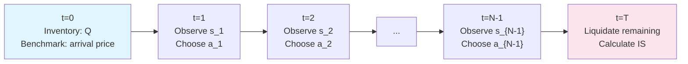
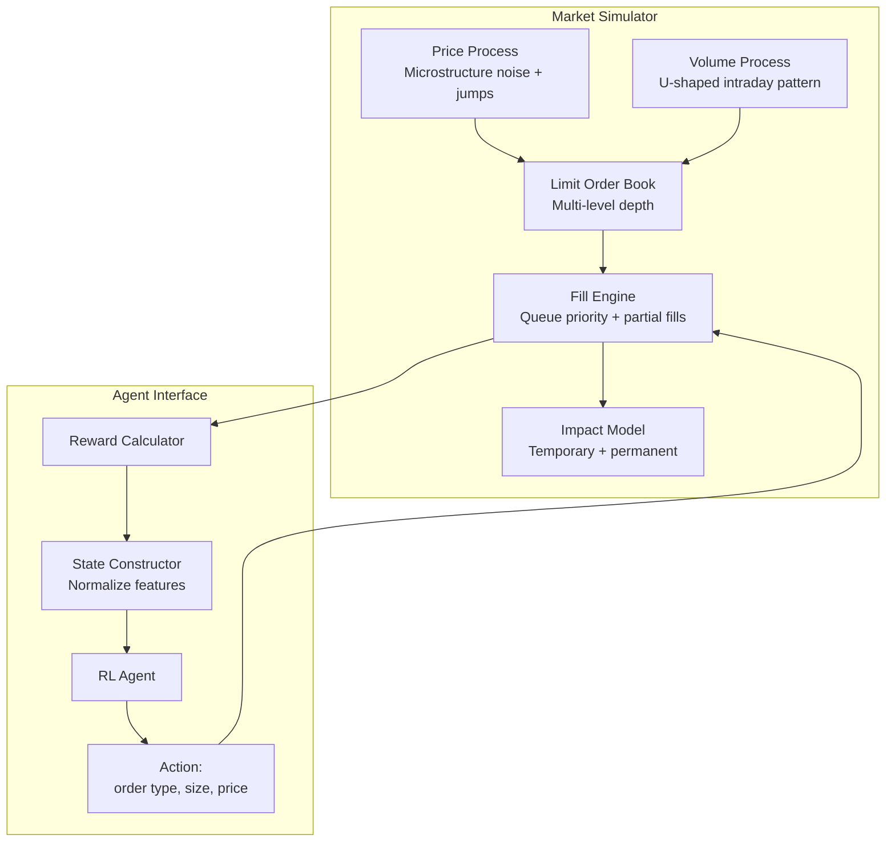
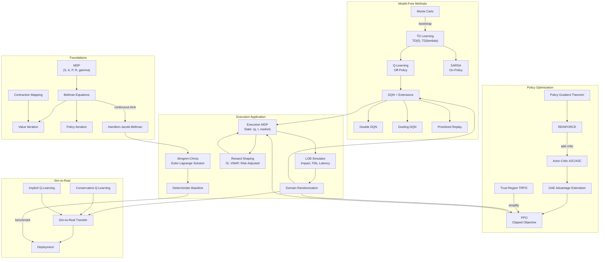

# Module 28: Reinforcement Learning for Execution

> **Prerequisites:** Modules 06 (Probability & Statistics), 26 (Machine Learning Foundations), 23 (Market Microstructure), 31 (Execution Algorithms)
> **Builds toward:** Module 30 (Portfolio Construction with ML)

---

## Table of Contents

1. [Markov Decision Processes](#1-markov-decision-processes)
2. [Dynamic Programming](#2-dynamic-programming)
3. [Bellman Equations and the HJB Connection](#3-bellman-equations-and-the-hjb-connection)
4. [Monte Carlo Methods](#4-monte-carlo-methods)
5. [Temporal Difference Learning](#5-temporal-difference-learning)
6. [Q-Learning and SARSA](#6-q-learning-and-sarsa)
7. [Deep Q-Networks (DQN)](#7-deep-q-networks-dqn)
8. [Policy Gradient Methods](#8-policy-gradient-methods)
9. [Actor-Critic Methods](#9-actor-critic-methods)
10. [Proximal Policy Optimization (PPO)](#10-proximal-policy-optimization-ppo)
11. [Execution as an RL Problem](#11-execution-as-an-rl-problem)
12. [Almgren-Chriss Baseline](#12-almgren-chriss-baseline)
13. [Reward Shaping](#13-reward-shaping)
14. [Simulation Environment](#14-simulation-environment)
15. [Sim-to-Real Transfer](#15-sim-to-real-transfer)
16. [Production Python Implementations](#16-production-python-implementations)
17. [Exercises](#17-exercises)
18. [Summary & Concept Map](#18-summary--concept-map)

---

## 1. Markov Decision Processes

### 1.1 Formal Definition

A **Markov Decision Process** (MDP) is a tuple $(\mathcal{S}, \mathcal{A}, P, R, \gamma)$:

- **State space** $\mathcal{S}$: The set of all possible states $s \in \mathcal{S}$.
- **Action space** $\mathcal{A}$: The set of all possible actions $a \in \mathcal{A}$.
- **Transition kernel** $P: \mathcal{S} \times \mathcal{A} \times \mathcal{S} \to [0,1]$: $P(s'|s,a) = \Pr(s_{t+1} = s' | s_t = s, a_t = a)$.
- **Reward function** $R: \mathcal{S} \times \mathcal{A} \to \mathbb{R}$: $R(s,a) = \mathbb{E}[r_t | s_t = s, a_t = a]$.
- **Discount factor** $\gamma \in [0, 1)$: Determines the present value of future rewards.

### 1.2 The Markov Property

The transition kernel encodes the Markov property---the future is conditionally independent of the past given the present:

$$
\Pr(s_{t+1} | s_t, a_t, s_{t-1}, a_{t-1}, \ldots, s_0, a_0) = \Pr(s_{t+1} | s_t, a_t) = P(s_{t+1} | s_t, a_t)
$$

**Execution context:** The Markov property requires that the state $s_t$ encode all relevant information. For trade execution, this means the state must capture not just the current market snapshot but also the agent's remaining inventory, elapsed time, and any relevant microstructure features (queue position, recent order flow). Missing state variables violate the Markov assumption and degrade policy quality.

### 1.3 Policies and Value Functions

A **policy** $\pi: \mathcal{S} \to \Delta(\mathcal{A})$ maps states to distributions over actions (deterministic: $\pi(s) = a$; stochastic: $\pi(a|s)$).

The **state-value function** under policy $\pi$:

$$
V^\pi(s) = \mathbb{E}_\pi\left[\sum_{t=0}^{\infty} \gamma^t r_t \;\middle|\; s_0 = s\right]
$$

The **action-value function**:

$$
Q^\pi(s, a) = \mathbb{E}_\pi\left[\sum_{t=0}^{\infty} \gamma^t r_t \;\middle|\; s_0 = s, a_0 = a\right]
$$

The **advantage function**:

$$
A^\pi(s, a) = Q^\pi(s, a) - V^\pi(s)
$$

which measures how much better action $a$ is compared to the policy's average action from state $s$.

---

## 2. Dynamic Programming

### 2.1 Value Iteration

**Bellman Optimality Equation.** The optimal value function satisfies:

$$
V^*(s) = \max_{a \in \mathcal{A}} \left[R(s, a) + \gamma \sum_{s' \in \mathcal{S}} P(s'|s, a) \, V^*(s')\right]
$$

**Derivation.** The optimal policy satisfies $\pi^*(s) = \arg\max_a Q^*(s,a)$ and by definition:

$$
Q^*(s,a) = R(s,a) + \gamma \sum_{s'} P(s'|s,a) V^*(s')
$$

$$
V^*(s) = \max_a Q^*(s,a) = \max_a \left[R(s,a) + \gamma \sum_{s'} P(s'|s,a) \max_{a'} Q^*(s',a')\right]
$$

**Value Iteration Algorithm:** Iteratively apply the Bellman optimality operator $\mathcal{T}$:

$$
V_{k+1}(s) = \mathcal{T}[V_k](s) = \max_{a} \left[R(s,a) + \gamma \sum_{s'} P(s'|s,a) V_k(s')\right]
$$

### 2.2 Policy Iteration

1. **Policy evaluation:** Solve $V^\pi(s) = R(s, \pi(s)) + \gamma \sum_{s'} P(s'|s,\pi(s)) V^\pi(s')$ for current policy $\pi$.
2. **Policy improvement:** $\pi'(s) = \arg\max_a \left[R(s,a) + \gamma \sum_{s'} P(s'|s,a) V^\pi(s')\right]$.
3. Repeat until $\pi' = \pi$ (convergence guaranteed in finite MDPs).

### 2.3 Contraction Mapping Theorem (Proof Sketch)

**Theorem.** The Bellman optimality operator $\mathcal{T}$ is a $\gamma$-contraction in the supremum norm: for any $V_1, V_2$,

$$
\|\mathcal{T}[V_1] - \mathcal{T}[V_2]\|_\infty \leq \gamma \|V_1 - V_2\|_\infty
$$

**Proof sketch.** For any state $s$:

$$
|\mathcal{T}[V_1](s) - \mathcal{T}[V_2](s)| = \left|\max_a \left[R(s,a) + \gamma \sum_{s'} P V_1(s')\right] - \max_a \left[R(s,a) + \gamma \sum_{s'} P V_2(s')\right]\right|
$$

Using $|\max_a f(a) - \max_a g(a)| \leq \max_a |f(a) - g(a)|$:

$$
\leq \max_a \gamma \left|\sum_{s'} P(s'|s,a)[V_1(s') - V_2(s')]\right| \leq \gamma \|V_1 - V_2\|_\infty
$$

since $\sum_{s'} P(s'|s,a) = 1$. By the Banach fixed-point theorem, $\mathcal{T}$ has a unique fixed point $V^*$, and iterates converge at rate $\gamma^k$.

```cpp
// C++ Value Iteration for finite MDP
#include <vector>
#include <algorithm>
#include <cmath>
#include <limits>

struct MDP {
    int n_states;
    int n_actions;
    // P[s][a][s'] = transition probability
    std::vector<std::vector<std::vector<double>>> P;
    // R[s][a] = expected reward
    std::vector<std::vector<double>> R;
    double gamma;
};

struct ValueIterationResult {
    std::vector<double> V;
    std::vector<int> policy;
    int iterations;
};

ValueIterationResult value_iteration(
    const MDP& mdp,
    double tol = 1e-8,
    int max_iter = 10000
) {
    const int S = mdp.n_states;
    const int A = mdp.n_actions;
    std::vector<double> V(S, 0.0);
    std::vector<double> V_new(S, 0.0);
    std::vector<int> policy(S, 0);

    int iter = 0;
    for (; iter < max_iter; ++iter) {
        double max_delta = 0.0;

        for (int s = 0; s < S; ++s) {
            double best_val = -std::numeric_limits<double>::infinity();
            int best_a = 0;

            for (int a = 0; a < A; ++a) {
                double q_sa = mdp.R[s][a];
                for (int sp = 0; sp < S; ++sp) {
                    q_sa += mdp.gamma * mdp.P[s][a][sp] * V[sp];
                }
                if (q_sa > best_val) {
                    best_val = q_sa;
                    best_a = a;
                }
            }
            V_new[s] = best_val;
            policy[s] = best_a;
            max_delta = std::max(max_delta, std::abs(V_new[s] - V[s]));
        }

        std::swap(V, V_new);
        if (max_delta < tol) { ++iter; break; }
    }

    return {V, policy, iter};
}
```

---

## 3. Bellman Equations and the HJB Connection

### 3.1 Discrete-Time Bellman

The Bellman equation for $Q^\pi$:

$$
Q^\pi(s, a) = R(s, a) + \gamma \sum_{s'} P(s'|s, a) \sum_{a'} \pi(a'|s') Q^\pi(s', a')
$$

### 3.2 Continuous-Time: Hamilton-Jacobi-Bellman

In continuous time, the state evolves as a controlled diffusion:

$$
d\mathbf{X}_t = \boldsymbol{\mu}(\mathbf{X}_t, a_t) \, dt + \boldsymbol{\sigma}(\mathbf{X}_t, a_t) \, d\mathbf{W}_t
$$

The HJB equation for the value function $V(t, \mathbf{x})$:

$$
0 = \max_a \left[\frac{\partial V}{\partial t} + \boldsymbol{\mu}^\top \nabla_\mathbf{x} V + \frac{1}{2} \text{tr}\!\left(\boldsymbol{\sigma}\boldsymbol{\sigma}^\top \nabla_\mathbf{x}^2 V\right) + r(\mathbf{x}, a)\right]
$$

**Relationship:** The discrete-time Bellman equation with time step $\Delta t \to 0$ converges to the HJB equation. Specifically, setting $\gamma = e^{-\rho \Delta t}$ and expanding the Bellman equation to first order in $\Delta t$ (using Ito's lemma for the expectation of $V$ at the next time step) recovers the HJB. This connection is fundamental: classical optimal execution (Almgren-Chriss) solves the HJB, while RL methods solve the discrete Bellman---they are two sides of the same problem.

---

## 4. Monte Carlo Methods

### 4.1 First-Visit vs. Every-Visit

**First-visit MC:** For each episode, use only the first occurrence of state $s$ to estimate $V^\pi(s)$:

$$
V^\pi(s) \approx \frac{1}{N(s)} \sum_{i=1}^{N(s)} G_i^{(s)}
$$

where $G_i^{(s)} = \sum_{k=0}^{T_i - t_i} \gamma^k r_{t_i + k}$ is the return from the first visit to $s$ in episode $i$.

**Every-visit MC:** Uses all visits to $s$ within each episode. Both are unbiased and consistent, but first-visit has slightly lower bias for finite samples.

### 4.2 Importance Sampling for Off-Policy

To evaluate policy $\pi$ using data from behavior policy $b$:

$$
V^\pi(s) = \mathbb{E}_b\left[\prod_{k=t}^{T-1} \frac{\pi(a_k | s_k)}{b(a_k | s_k)} \cdot G_t\right]
$$

The importance sampling ratio $\rho_{t:T-1} = \prod_{k=t}^{T-1} \frac{\pi(a_k|s_k)}{b(a_k|s_k)}$ can have extremely high variance. **Weighted importance sampling** reduces variance:

$$
V^\pi(s) \approx \frac{\sum_{i} \rho_i G_i}{\sum_{i} \rho_i}
$$

This introduces bias but dramatically reduces variance---essential for financial applications where episodes are expensive (real trading data).

---

## 5. Temporal Difference Learning

### 5.1 TD(0)

**Derivation from MC + bootstrapping.** MC updates use the full return $G_t$. TD(0) replaces future returns with the current value estimate:

$$
G_t = r_t + \gamma r_{t+1} + \gamma^2 r_{t+2} + \cdots \approx r_t + \gamma V(s_{t+1})
$$

The **TD update**:

$$
V(s_t) \leftarrow V(s_t) + \alpha \underbrace{\left[r_t + \gamma V(s_{t+1}) - V(s_t)\right]}_{\delta_t \text{ (TD error)}}
$$

TD(0) is biased (bootstraps from an estimated value) but has lower variance than MC. It converges to the correct value under standard stochastic approximation conditions.

### 5.2 TD($\lambda$) and Eligibility Traces

**$\lambda$-return** blends $n$-step returns for all $n$:

$$
G_t^\lambda = (1 - \lambda) \sum_{n=1}^{T-t-1} \lambda^{n-1} G_t^{(n)} + \lambda^{T-t-1} G_t
$$

where $G_t^{(n)} = \sum_{k=0}^{n-1} \gamma^k r_{t+k} + \gamma^n V(s_{t+n})$ is the $n$-step return.

- $\lambda = 0$: TD(0) (fully bootstrapped)
- $\lambda = 1$: Monte Carlo (no bootstrapping)

**Eligibility traces** provide an efficient online implementation. For each state, maintain a trace:

$$
e_t(s) = \gamma \lambda \, e_{t-1}(s) + \mathbb{1}[s_t = s]
$$

Update all states simultaneously: $V(s) \leftarrow V(s) + \alpha \delta_t e_t(s)$.

The trace $e_t(s)$ decays exponentially with rate $\gamma\lambda$, assigning credit to recently visited states---a direct analogy to how market impact decays over time.

### 5.3 TD Error and the Advantage

The TD error $\delta_t = r_t + \gamma V(s_{t+1}) - V(s_t)$ is an unbiased estimate of the advantage $A^\pi(s_t, a_t)$ when $V \approx V^\pi$. This connection is fundamental to actor-critic methods.

---

## 6. Q-Learning and SARSA

### 6.1 Q-Learning (Off-Policy)

$$
Q(s_t, a_t) \leftarrow Q(s_t, a_t) + \alpha \left[r_t + \gamma \max_{a'} Q(s_{t+1}, a') - Q(s_t, a_t)\right]
$$

Q-learning is **off-policy**: the update uses $\max_{a'}$ (the greedy action) regardless of the action actually taken. This allows learning the optimal policy while following an exploratory behavior policy.

### 6.2 SARSA (On-Policy)

$$
Q(s_t, a_t) \leftarrow Q(s_t, a_t) + \alpha \left[r_t + \gamma Q(s_{t+1}, a_{t+1}) - Q(s_t, a_t)\right]
$$

SARSA uses the next action $a_{t+1}$ actually taken (under $\epsilon$-greedy). It learns the value of the policy being followed, including exploration. For execution, SARSA learns a more conservative policy since it accounts for future exploration mistakes.

### 6.3 $\epsilon$-Greedy Exploration

$$
a_t = \begin{cases} \arg\max_a Q(s_t, a) & \text{with probability } 1 - \epsilon \\ \text{uniform random action} & \text{with probability } \epsilon \end{cases}
$$

Common schedules: linear decay $\epsilon_t = \max(\epsilon_{\min}, \epsilon_0 - t / T_{\text{decay}})$, or exponential $\epsilon_t = \epsilon_0 \cdot \beta^t$.

### 6.4 Convergence Conditions

Q-learning converges to $Q^*$ with probability 1 under:
1. All state-action pairs are visited infinitely often.
2. Learning rates satisfy: $\sum_t \alpha_t = \infty$ and $\sum_t \alpha_t^2 < \infty$.
3. Rewards are bounded.

In practice, with function approximation (neural networks), these conditions are violated---hence the need for techniques in the next section.

---

## 7. Deep Q-Networks (DQN)

### 7.1 Experience Replay

Store transitions $(s_t, a_t, r_t, s_{t+1})$ in a replay buffer $\mathcal{D}$ of fixed capacity $N$. Sample uniformly random minibatches for training. This breaks temporal correlations and improves data efficiency.

### 7.2 Target Networks

Maintain a separate target network $Q_{\bar{\theta}}$ updated slowly:

$$
\bar{\theta} \leftarrow \tau \theta + (1 - \tau) \bar{\theta}, \qquad \tau \ll 1 \text{ (soft update)}
$$

The DQN loss:

$$
\mathcal{L}(\theta) = \mathbb{E}_{(s,a,r,s') \sim \mathcal{D}}\left[\left(r + \gamma \max_{a'} Q_{\bar{\theta}}(s', a') - Q_\theta(s, a)\right)^2\right]
$$

Target networks reduce oscillation by decoupling the action selection from the value being updated toward.

### 7.3 Double DQN

Standard DQN overestimates Q-values because $\max_a Q(s', a)$ uses the same network for both selection and evaluation. **Double DQN** decouples:

$$
y = r + \gamma Q_{\bar{\theta}}\!\left(s', \arg\max_{a'} Q_\theta(s', a')\right)
$$

Select the best action with $Q_\theta$ (online network), evaluate it with $Q_{\bar{\theta}}$ (target network).

### 7.4 Dueling DQN

Decompose the Q-function into value and advantage streams:

$$
Q_\theta(s, a) = V_\theta(s) + A_\theta(s, a) - \frac{1}{|\mathcal{A}|} \sum_{a'} A_\theta(s, a')
$$

The subtraction ensures identifiability: $A$ has zero mean. This architecture is beneficial for execution because many states have similar values regardless of action (e.g., when inventory is nearly liquidated).

### 7.5 Prioritized Experience Replay

Sample transitions with probability proportional to their TD error magnitude:

$$
P(i) = \frac{|\delta_i|^\alpha + \epsilon}{\sum_j |\delta_j|^\alpha + \epsilon}
$$

where $\alpha$ controls prioritization strength. Correct for the bias with importance sampling weights:

$$
w_i = \left(\frac{1}{N \cdot P(i)}\right)^\beta
$$

where $\beta$ is annealed from $\beta_0$ to 1 over training.

```cpp
// C++ Prioritized Replay Buffer using a sum tree
#include <vector>
#include <random>
#include <cmath>
#include <algorithm>

class SumTree {
    int capacity_;
    std::vector<double> tree_;
    std::vector<int> data_idx_;
    int write_pos_;
    int size_;

public:
    explicit SumTree(int capacity)
        : capacity_(capacity),
          tree_(2 * capacity, 0.0),
          data_idx_(capacity, 0),
          write_pos_(0), size_(0) {}

    void update(int idx, double priority) {
        int tree_idx = idx + capacity_;
        double delta = priority - tree_[tree_idx];
        tree_[tree_idx] = priority;
        while (tree_idx > 1) {
            tree_idx /= 2;
            tree_[tree_idx] += delta;
        }
    }

    int add(double priority) {
        int idx = write_pos_;
        update(idx, priority);
        write_pos_ = (write_pos_ + 1) % capacity_;
        size_ = std::min(size_ + 1, capacity_);
        return idx;
    }

    int sample(double value) const {
        int idx = 1;
        while (idx < capacity_) {
            int left = 2 * idx;
            if (value <= tree_[left]) {
                idx = left;
            } else {
                value -= tree_[left];
                idx = left + 1;
            }
        }
        return idx - capacity_;
    }

    double total() const { return tree_[1]; }
    double get(int idx) const { return tree_[idx + capacity_]; }
    int size() const { return size_; }
};
```

---

## 8. Policy Gradient Methods

### 8.1 The Policy Gradient Theorem

**Theorem (Sutton et al., 1999).** For a parameterized stochastic policy $\pi_\theta(a|s)$ and objective $J(\theta) = \mathbb{E}_{\pi_\theta}\left[\sum_t \gamma^t r_t\right]$:

$$
\nabla_\theta J(\theta) = \mathbb{E}_{\pi_\theta}\left[\sum_{t=0}^T \nabla_\theta \log \pi_\theta(a_t | s_t) \cdot Q^{\pi_\theta}(s_t, a_t)\right]
$$

**Derivation.** Start with:

$$
J(\theta) = \sum_s d^{\pi_\theta}(s) \sum_a \pi_\theta(a|s) Q^{\pi_\theta}(s,a)
$$

where $d^{\pi_\theta}(s)$ is the stationary state distribution. Taking the gradient (and using the log-derivative trick $\nabla \pi = \pi \nabla \log \pi$):

$$
\nabla_\theta J = \sum_s d^{\pi_\theta}(s) \sum_a \nabla_\theta \pi_\theta(a|s) Q^{\pi_\theta}(s,a) + \underbrace{\text{terms involving } \nabla d^{\pi_\theta}}_{\text{accounted for by } d^{\pi_\theta}}
$$

The key insight (proven in Sutton et al.) is that the terms involving $\nabla d^{\pi_\theta}$ are already captured when sampling from the stationary distribution:

$$
= \mathbb{E}_{s \sim d^{\pi_\theta}, a \sim \pi_\theta}\left[\nabla_\theta \log \pi_\theta(a|s) \cdot Q^{\pi_\theta}(s, a)\right]
$$

### 8.2 REINFORCE

The simplest policy gradient algorithm uses sampled returns as estimates of $Q$:

$$
\nabla_\theta J \approx \frac{1}{N} \sum_{i=1}^N \sum_{t=0}^{T_i} \nabla_\theta \log \pi_\theta(a_t^{(i)} | s_t^{(i)}) \cdot G_t^{(i)}
$$

where $G_t^{(i)} = \sum_{k=t}^{T_i} \gamma^{k-t} r_k^{(i)}$ is the return-to-go.

### 8.3 Baseline Subtraction for Variance Reduction

The policy gradient remains unbiased when subtracting any function $b(s_t)$ (baseline) from $Q$:

$$
\nabla_\theta J = \mathbb{E}\left[\nabla_\theta \log \pi_\theta(a_t|s_t) (Q^{\pi_\theta}(s_t, a_t) - b(s_t))\right]
$$

**Proof of unbiasedness:**

$$
\mathbb{E}_{a \sim \pi_\theta}\left[\nabla_\theta \log \pi_\theta(a|s) \cdot b(s)\right] = b(s) \sum_a \nabla_\theta \pi_\theta(a|s) = b(s) \nabla_\theta \underbrace{\sum_a \pi_\theta(a|s)}_{=1} = 0
$$

The optimal baseline is $b^*(s) = \frac{\mathbb{E}\left[\|\nabla \log \pi\|^2 Q\right]}{\mathbb{E}\left[\|\nabla \log \pi\|^2\right]}$, but in practice $b(s) \approx V^\pi(s)$ is used, yielding the advantage $A^\pi(s,a)$.

---

## 9. Actor-Critic Methods

### 9.1 A2C (Advantage Actor-Critic)

Combines a policy network (actor) and a value network (critic):

**Critic update** (minimize TD error):

$$
\mathcal{L}_{\text{critic}} = \frac{1}{2} \sum_t \left(r_t + \gamma V_\phi(s_{t+1}) - V_\phi(s_t)\right)^2
$$

**Actor update** (policy gradient with advantage):

$$
\nabla_\theta J \approx \sum_t \nabla_\theta \log \pi_\theta(a_t|s_t) \hat{A}_t
$$

where $\hat{A}_t = r_t + \gamma V_\phi(s_{t+1}) - V_\phi(s_t)$ is the advantage estimated from the critic.

### 9.2 A3C (Asynchronous Advantage Actor-Critic)

Multiple workers run in parallel, each with a local copy of the network. Workers asynchronously push gradients to a shared parameter server. This provides natural exploration diversity (different workers explore different regions of state space) and allows linear scaling with the number of workers.

### 9.3 Generalized Advantage Estimation (GAE)

**Derive the GAE formula.** Define the $k$-step advantage estimator:

$$
\hat{A}_t^{(k)} = \sum_{l=0}^{k-1} \gamma^l \delta_{t+l}, \qquad \delta_t = r_t + \gamma V_\phi(s_{t+1}) - V_\phi(s_t)
$$

GAE is the exponentially weighted average over all $k$-step estimators:

$$
\hat{A}_t^{\text{GAE}(\gamma, \lambda)} = (1 - \lambda) \sum_{k=1}^{\infty} \lambda^{k-1} \hat{A}_t^{(k)}
$$

Expanding and simplifying (using the geometric series):

$$
= (1 - \lambda) \left[\hat{A}_t^{(1)} + \lambda \hat{A}_t^{(2)} + \lambda^2 \hat{A}_t^{(3)} + \cdots\right]
$$

$$
= (1-\lambda)\left[\delta_t + \lambda(\delta_t + \gamma\delta_{t+1}) + \lambda^2(\delta_t + \gamma\delta_{t+1} + \gamma^2\delta_{t+2}) + \cdots\right]
$$

Collecting terms for each $\delta_{t+l}$, the coefficient of $\delta_{t+l}$ is:

$$
(1-\lambda) \sum_{k=l}^{\infty} \lambda^k \gamma^l = (1-\lambda) \frac{\lambda^l}{1-\lambda} \gamma^l = (\gamma\lambda)^l
$$

Therefore:

$$
\boxed{\hat{A}_t^{\text{GAE}(\gamma, \lambda)} = \sum_{l=0}^{\infty} (\gamma \lambda)^l \delta_{t+l}}
$$

- $\lambda = 0$: $\hat{A}_t = \delta_t$ (high bias, low variance)
- $\lambda = 1$: $\hat{A}_t = G_t - V(s_t)$ (MC advantage, low bias, high variance)

In practice, $\lambda \in [0.9, 0.99]$ provides a good bias-variance trade-off. For execution, $\lambda = 0.95$ is typical.

---

## 10. Proximal Policy Optimization (PPO)

### 10.1 Trust Region Motivation

TRPO constrains the KL divergence between old and new policies:

$$
\max_\theta \; \mathbb{E}\left[\frac{\pi_\theta(a|s)}{\pi_{\theta_{\text{old}}}(a|s)} \hat{A}_t\right] \quad \text{s.t.} \quad \mathbb{E}\left[\text{KL}(\pi_{\theta_{\text{old}}} \| \pi_\theta)\right] \leq \delta
$$

This prevents catastrophic policy updates but requires computing the KL constraint (second-order optimization). PPO approximates this with a simpler clipped objective.

### 10.2 Clipped Objective (Derivation)

Define the probability ratio:

$$
r_t(\theta) = \frac{\pi_\theta(a_t | s_t)}{\pi_{\theta_{\text{old}}}(a_t | s_t)}
$$

The unconstrained surrogate objective is $L^{\text{CPI}} = \mathbb{E}[r_t(\theta) \hat{A}_t]$. To prevent $r_t$ from deviating too far from 1, PPO clips:

$$
L^{\text{CLIP}}(\theta) = \mathbb{E}\left[\min\!\left(r_t(\theta) \hat{A}_t, \; \text{clip}(r_t(\theta), 1-\epsilon, 1+\epsilon) \hat{A}_t\right)\right]
$$

**Analysis by cases:**

- **If $\hat{A}_t > 0$** (good action): We want to increase $\pi_\theta(a_t|s_t)$, so $r_t$ increases. The clip prevents $r_t > 1 + \epsilon$, bounding the update.
    $$
    L = \min(r_t \hat{A}_t, (1+\epsilon) \hat{A}_t) = \begin{cases} r_t \hat{A}_t & \text{if } r_t \leq 1+\epsilon \\ (1+\epsilon) \hat{A}_t & \text{if } r_t > 1+\epsilon \end{cases}
    $$

- **If $\hat{A}_t < 0$** (bad action): We want to decrease $\pi_\theta(a_t|s_t)$, so $r_t$ decreases. The clip prevents $r_t < 1 - \epsilon$.
    $$
    L = \min(r_t \hat{A}_t, (1-\epsilon) \hat{A}_t) = \begin{cases} r_t \hat{A}_t & \text{if } r_t \geq 1-\epsilon \\ (1-\epsilon) \hat{A}_t & \text{if } r_t < 1-\epsilon \end{cases}
    $$

The total PPO loss combines the clipped surrogate, value function loss, and entropy bonus:

$$
\mathcal{L}^{\text{PPO}} = -L^{\text{CLIP}} + c_1 \mathcal{L}^{\text{VF}} - c_2 H[\pi_\theta]
$$

where $H[\pi_\theta] = -\sum_a \pi_\theta(a|s) \log \pi_\theta(a|s)$ encourages exploration. Typical values: $\epsilon = 0.2$, $c_1 = 0.5$, $c_2 = 0.01$.

---

## 11. Execution as an RL Problem

### 11.1 Problem Formulation

An institution needs to execute a large order (e.g., sell $Q$ shares) over a fixed time horizon $[0, T]$. The goal is to minimize execution cost while managing risk.

### 11.2 State Space

$$
s_t = \left(q_t, \; \frac{t}{T}, \; \mathbf{m}_t, \; p_t^{\text{queue}}\right)
$$

| Component | Description | Dimension |
|---|---|---|
| $q_t$ | Remaining inventory (normalized by $Q$) | 1 |
| $t/T$ | Elapsed time fraction | 1 |
| $\mathbf{m}_t$ | Market state features | $d_m$ |
| $p_t^{\text{queue}}$ | Queue position of existing orders | $L$ |

**Market state features** $\mathbf{m}_t$ may include:
- Mid-price returns over multiple horizons
- Bid-ask spread (normalized)
- Order imbalance at top $L$ levels
- Volume clock (proportion of expected daily volume traded)
- Recent trade flow imbalance (signed volume)
- Realized volatility (rolling window)
- Lagged own impact estimates

### 11.3 Action Space

| Design | Actions | Description |
|---|---|---|
| **Discrete** | $a_t \in \{0, 1, \ldots, K\}$ | Number of lots to trade this period |
| **Continuous** | $a_t \in [0, a_{\max}]$ | Fraction of remaining inventory to trade |
| **Aggressiveness** | $a_t \in \{-L, \ldots, 0, \ldots, +L\}$ | Price level relative to mid (negative = passive, positive = aggressive) |
| **Multi-dimensional** | $(v_t, p_t)$ | Volume and price simultaneously |

### 11.4 Episode Structure



At terminal time $T$, any remaining inventory is liquidated at market price (with full impact), providing a strong incentive to complete execution before the deadline.

---

## 12. Almgren-Chriss Baseline

### 12.1 Model Setup

The Almgren-Chriss (2001) framework assumes:

- **Arithmetic price dynamics:** $S_t = S_0 + \sigma W_t - g(v_t)$, where $v_t = dq/dt$ is the trading rate
- **Temporary impact:** $\tilde{S}_t = S_t - h(v_t)$ (execution price)
- **Permanent impact:** $g(v) = \gamma_{\text{perm}} \cdot v$ (linear)
- **Temporary impact:** $h(v) = \eta \cdot v$ (linear)

### 12.2 Derive Optimal Trajectory (Euler-Lagrange)

The expected cost of execution with trajectory $q(t)$, where $v(t) = -\dot{q}(t)$:

$$
\mathbb{E}[\text{Cost}] = \int_0^T \left[\gamma_{\text{perm}} v(t)^2 + \eta v(t)^2\right] dt = \int_0^T (\gamma_{\text{perm}} + \eta) \dot{q}(t)^2 \, dt
$$

The **risk** (variance of cost):

$$
\text{Var}[\text{Cost}] = \sigma^2 \int_0^T q(t)^2 \, dt
$$

The mean-variance objective with risk aversion $\lambda_{\text{risk}}$:

$$
\min_{q(\cdot)} \; \underbrace{\int_0^T (\gamma_{\text{perm}} + \eta) \dot{q}(t)^2 \, dt}_{\text{Expected cost}} + \lambda_{\text{risk}} \underbrace{\sigma^2 \int_0^T q(t)^2 \, dt}_{\text{Execution risk}}
$$

subject to $q(0) = Q$ and $q(T) = 0$.

**Euler-Lagrange equation.** Define the Lagrangian:

$$
\mathscr{L}(q, \dot{q}) = (\gamma_{\text{perm}} + \eta) \dot{q}^2 + \lambda_{\text{risk}} \sigma^2 q^2
$$

The Euler-Lagrange equation $\frac{d}{dt}\frac{\partial \mathscr{L}}{\partial \dot{q}} - \frac{\partial \mathscr{L}}{\partial q} = 0$ gives:

$$
2(\gamma_{\text{perm}} + \eta) \ddot{q} - 2\lambda_{\text{risk}} \sigma^2 q = 0
$$

$$
\ddot{q} = \kappa^2 q, \qquad \kappa = \sigma \sqrt{\frac{\lambda_{\text{risk}}}{\gamma_{\text{perm}} + \eta}}
$$

The general solution is $q(t) = A \cosh(\kappa t) + B \sinh(\kappa t)$. Applying boundary conditions $q(0) = Q$ and $q(T) = 0$:

$$
\boxed{q^*(t) = Q \cdot \frac{\sinh(\kappa(T - t))}{\sinh(\kappa T)}}
$$

**Limiting cases:**
- $\lambda_{\text{risk}} \to 0$ ($\kappa \to 0$): $q^*(t) = Q(1 - t/T)$ (TWAP---linear liquidation)
- $\lambda_{\text{risk}} \to \infty$: Immediate liquidation (front-loaded)

### 12.3 Discrete-Time Version

Dividing $[0, T]$ into $N$ periods with $\tau = T/N$:

$$
n_k^* = q_{k-1}^* - q_k^* = Q \cdot \frac{\sinh(\kappa \tau)}{\sinh(\kappa T)} \cdot \cosh\!\left(\kappa\left(T - (k - \tfrac{1}{2})\tau\right)\right)
$$

This is the trade list that the RL agent should aim to improve upon.

---

## 13. Reward Shaping

### 13.1 Implementation Shortfall

The most common reward for execution RL:

$$
r_t = -\underbrace{n_t \cdot (p_t^{\text{exec}} - p_0^{\text{arrival}})}_{\text{Cost of $n_t$ shares executed at $p_t$}}
$$

Total IS: $\text{IS} = \sum_t n_t (p_t^{\text{exec}} - p_0) / (Q \cdot p_0)$ (expressed in basis points).

### 13.2 VWAP Deviation

For VWAP-targeted execution:

$$
r_t = -|p_t^{\text{exec}} - \text{VWAP}_{0:T}| \cdot n_t
$$

The challenge: VWAP is not known until the end of the execution window. A practical approach uses predicted VWAP based on historical volume profiles.

### 13.3 Risk-Adjusted Rewards

Incorporate risk directly into the per-step reward:

$$
r_t = -n_t (p_t^{\text{exec}} - p_0) - \lambda_{\text{risk}} \cdot q_t^2 \cdot \hat{\sigma}_t^2 \cdot \Delta t
$$

The second term penalizes holding large inventory during volatile periods, aligning with the Almgren-Chriss variance penalty.

**Reward shaping theorem (Ng et al., 1999):** Adding a potential-based shaping function $F(s, s') = \gamma \Phi(s') - \Phi(s)$ preserves the optimal policy. A useful potential for execution:

$$
\Phi(s_t) = -\lambda_{\text{risk}} \sigma^2 q_t^2 (T - t)
$$

This encourages the agent to reduce inventory smoothly without changing the optimal policy.

---

## 14. Simulation Environment

### 14.1 Realistic LOB Simulation

A production-quality simulator must model:



### 14.2 Price Process

A realistic price process for simulation:

$$
dS_t = \mu \, dt + \sigma_t \, dW_t^{(1)} + J_t \, dN_t
$$

where $\sigma_t$ follows a stochastic volatility model and $J_t \sim \mathcal{N}(0, \sigma_J^2)$ with $N_t$ a Poisson process (jump arrivals). Add microstructure noise:

$$
S_t^{\text{obs}} = S_t + \xi_t, \qquad \xi_t \sim \mathcal{N}(0, \sigma_\xi^2)
$$

### 14.3 Latency Modeling

Real execution systems face:
- **Order-to-book latency** $\tau_{\text{submit}}$: 50--500 $\mu$s for colocated, 1--50 ms for non-colocated
- **Market data latency** $\tau_{\text{data}}$: Observations are stale by $\tau_{\text{data}}$
- **Processing latency** $\tau_{\text{compute}}$: Model inference time

The effective action delay: $\tau = \tau_{\text{data}} + \tau_{\text{compute}} + \tau_{\text{submit}}$. The state the agent observes is $s_{t - \tau_{\text{data}}}$, and the action executes at $t + \tau_{\text{compute}} + \tau_{\text{submit}}$.

### 14.4 Fill Probability Model

For limit orders at price $p$ with queue position $k$ among $Q_{\text{total}}$ shares at that level:

$$
P(\text{fill} | p, k, Q_{\text{total}}, \Delta t) = P(\text{price crosses } p) + P(\text{price touches } p) \cdot \frac{\max(0, V_{\text{traded}} - k)}{Q_{\text{total}} - k}
$$

where $V_{\text{traded}}$ is the volume traded at price $p$ conditional on the price touching $p$.

---

## 15. Sim-to-Real Transfer

### 15.1 The Sim-to-Real Gap

Policies trained in simulation often fail in real markets because:
- Simulated impact models are misspecified
- Real fill dynamics are more complex (partial fills, queue priority)
- Market participants adapt to the agent's strategy
- Simulation cannot capture all market regimes

### 15.2 Domain Randomization

During training, randomize simulator parameters at the start of each episode:

$$
\theta_{\text{sim}} \sim \mathcal{U}(\theta_{\min}, \theta_{\max})
$$

Parameters to randomize:
- Temporary and permanent impact coefficients
- Spread distribution
- Volatility level
- Volume profile parameters
- Latency distribution

This forces the policy to be robust to model misspecification.

### 15.3 Conservative Q-Learning (CQL)

CQL (Kumar et al., 2020) addresses offline RL by adding a penalty for Q-values of out-of-distribution actions:

$$
\mathcal{L}_{\text{CQL}}(\theta) = \alpha \left(\mathbb{E}_{a \sim \mu(a|s)}\left[Q_\theta(s, a)\right] - \mathbb{E}_{a \sim \hat{\pi}_\beta(a|s)}\left[Q_\theta(s, a)\right]\right) + \mathcal{L}_{\text{TD}}(\theta)
$$

where $\mu$ is a distribution that maximizes Q-values (e.g., uniform or policy) and $\hat{\pi}_\beta$ is the empirical behavior policy from the dataset. This pushes down Q-values for actions not seen in the data, preventing overestimation of untested strategies.

### 15.4 Implicit Q-Learning (IQL)

IQL (Kostrikov et al., 2022) avoids querying Q-values for out-of-distribution actions entirely by using expectile regression:

$$
\mathcal{L}_V(\psi) = \mathbb{E}_{(s,a) \sim \mathcal{D}}\left[L_\tau^2(Q_{\bar{\theta}}(s,a) - V_\psi(s))\right]
$$

where $L_\tau^2(u) = |\tau - \mathbb{1}(u < 0)| u^2$ is the asymmetric squared loss. With $\tau$ close to 1, $V_\psi$ approximates $\max_a Q(s,a)$ without explicitly computing the max.

This is particularly attractive for execution because historical trade data can be used directly without needing a simulator at all.

---

## 16. Production Python Implementations

### 16.1 Gym-Style Trading Environment

```python
"""
Gym-compatible execution environment with realistic market simulation.
Supports both discrete and continuous action spaces.
"""

import numpy as np
from dataclasses import dataclass, field
from typing import Tuple, Optional, Dict, Any


@dataclass
class ExecutionConfig:
    """Configuration for the execution environment."""
    total_shares: int = 100_000        # Total shares to execute
    n_steps: int = 50                  # Number of decision points
    max_time_hours: float = 6.5        # Trading session length
    sigma_daily: float = 0.02          # Daily volatility
    temp_impact_coeff: float = 1e-4    # Temporary impact eta
    perm_impact_coeff: float = 5e-5    # Permanent impact gamma
    spread_bps: float = 2.0            # Half-spread in basis points
    initial_price: float = 100.0       # Starting price
    risk_aversion: float = 1e-6        # Lambda for risk penalty
    latency_ms: float = 1.0            # Latency in milliseconds
    domain_randomize: bool = False     # Enable domain randomization


class ExecutionEnv:
    """
    RL environment for optimal trade execution.

    State: [inventory_frac, time_frac, spread, volatility,
            price_return, volume_imbalance, momentum_5, momentum_20]
    Action: fraction of remaining inventory to execute [0, 1]
    Reward: -implementation_shortfall - risk_penalty
    """

    def __init__(self, config: Optional[ExecutionConfig] = None):
        self.config = config or ExecutionConfig()
        self.dt = self.config.max_time_hours / self.config.n_steps
        self.sigma_step = (
            self.config.sigma_daily
            * np.sqrt(self.dt / 6.5)  # Scale to step size
        )

        # State and action dimensions
        self.state_dim = 8
        self.action_dim = 1  # Continuous: fraction to trade

        self._rng = np.random.default_rng()
        self.reset()

    def reset(
        self, seed: Optional[int] = None
    ) -> Tuple[np.ndarray, Dict[str, Any]]:
        """Reset environment to start of new execution episode."""
        if seed is not None:
            self._rng = np.random.default_rng(seed)

        cfg = self.config

        # Domain randomization
        if cfg.domain_randomize:
            self._temp_impact = cfg.temp_impact_coeff * self._rng.uniform(0.5, 2.0)
            self._perm_impact = cfg.perm_impact_coeff * self._rng.uniform(0.5, 2.0)
            self._sigma_step = self.sigma_step * self._rng.uniform(0.7, 1.5)
            self._spread_bps = cfg.spread_bps * self._rng.uniform(0.5, 3.0)
        else:
            self._temp_impact = cfg.temp_impact_coeff
            self._perm_impact = cfg.perm_impact_coeff
            self._sigma_step = self.sigma_step
            self._spread_bps = cfg.spread_bps

        # Initialize state variables
        self.price = cfg.initial_price
        self.arrival_price = cfg.initial_price
        self.inventory = cfg.total_shares
        self.step_count = 0
        self.total_cost = 0.0
        self.shares_executed = 0

        # Market state features
        self._price_history = [self.price]
        self._volume_imbalance = 0.0

        state = self._get_state()
        info = {"arrival_price": self.arrival_price}
        return state, info

    def _get_state(self) -> np.ndarray:
        """Construct normalized state vector."""
        cfg = self.config
        inv_frac = self.inventory / cfg.total_shares
        time_frac = self.step_count / cfg.n_steps
        spread_norm = self._spread_bps / 10.0  # Normalize

        # Realized volatility (rolling)
        if len(self._price_history) >= 2:
            returns = np.diff(np.log(self._price_history[-20:]))
            vol = np.std(returns) if len(returns) > 1 else self._sigma_step
        else:
            vol = self._sigma_step

        # Price return since arrival
        price_ret = (self.price - self.arrival_price) / self.arrival_price

        # Momentum features
        if len(self._price_history) >= 6:
            mom5 = (self._price_history[-1] / self._price_history[-5] - 1)
        else:
            mom5 = 0.0

        if len(self._price_history) >= 21:
            mom20 = (self._price_history[-1] / self._price_history[-20] - 1)
        else:
            mom20 = 0.0

        return np.array([
            inv_frac,
            time_frac,
            spread_norm,
            vol / self._sigma_step,  # Normalized volatility
            price_ret,
            self._volume_imbalance,
            mom5 * 100,  # Scale for network
            mom20 * 100,
        ], dtype=np.float32)

    def step(
        self, action: np.ndarray
    ) -> Tuple[np.ndarray, float, bool, bool, Dict[str, Any]]:
        """
        Execute one step.

        Args:
            action: [0, 1] fraction of remaining inventory to trade

        Returns:
            state, reward, terminated, truncated, info
        """
        cfg = self.config

        # Clip action to valid range
        trade_frac = float(np.clip(action, 0.0, 1.0))
        shares_to_trade = int(trade_frac * self.inventory)

        # Ensure we liquidate everything on the last step
        if self.step_count == cfg.n_steps - 1:
            shares_to_trade = self.inventory

        # --- Market dynamics ---
        # Price evolution (random walk + own permanent impact)
        price_innovation = self._rng.normal(0, self._sigma_step) * self.price
        permanent_impact = -self._perm_impact * shares_to_trade * self.price
        self.price += price_innovation + permanent_impact

        # Execution price (mid + temporary impact + half spread)
        temporary_impact = self._temp_impact * shares_to_trade * self.price
        half_spread = self._spread_bps * 1e-4 * self.price
        exec_price = self.price + temporary_impact + half_spread  # Selling

        # Cost (for selling: we receive exec_price, cost = arrival - exec)
        step_cost = shares_to_trade * (self.arrival_price - exec_price)
        self.total_cost += step_cost

        # Update state
        self.inventory -= shares_to_trade
        self.shares_executed += shares_to_trade
        self.step_count += 1
        self._price_history.append(self.price)

        # Simulated volume imbalance (mean-reverting)
        self._volume_imbalance = (
            0.8 * self._volume_imbalance
            + 0.2 * self._rng.normal(0, 0.5)
        )

        # --- Reward ---
        # Negative IS (per-step cost in bps)
        is_bps = step_cost / (cfg.total_shares * self.arrival_price) * 1e4
        risk_penalty = (
            cfg.risk_aversion
            * (self.inventory ** 2)
            * (self._sigma_step * self.price) ** 2
            * self.dt
        )
        reward = -is_bps - risk_penalty

        # Termination
        terminated = self.inventory <= 0
        truncated = self.step_count >= cfg.n_steps

        # Force liquidation if truncated
        if truncated and self.inventory > 0:
            forced_cost = self.inventory * self._temp_impact * 3 * self.price
            self.total_cost += forced_cost
            reward -= forced_cost / (cfg.total_shares * self.arrival_price) * 1e4
            self.inventory = 0
            terminated = True

        info = {
            "shares_traded": shares_to_trade,
            "exec_price": exec_price,
            "step_is_bps": is_bps,
            "total_is_bps": self.total_cost / (cfg.total_shares * self.arrival_price) * 1e4,
            "inventory_remaining": self.inventory,
        }

        return self._get_state(), reward, terminated, truncated, info

    def almgren_chriss_trajectory(self) -> np.ndarray:
        """Compute the optimal AC trajectory for comparison."""
        cfg = self.config
        kappa = self._sigma_step * np.sqrt(
            cfg.risk_aversion / (self._perm_impact + self._temp_impact)
        )
        times = np.linspace(0, cfg.max_time_hours, cfg.n_steps + 1)
        T = cfg.max_time_hours

        if kappa * T < 1e-10:
            # TWAP limit
            trajectory = cfg.total_shares * (1 - times / T)
        else:
            trajectory = cfg.total_shares * np.sinh(kappa * (T - times)) / np.sinh(kappa * T)

        # Convert to per-step trade sizes
        trade_sizes = -np.diff(trajectory)
        return trade_sizes
```

### 16.2 DQN Execution Agent

```python
"""
Double Dueling DQN agent for discrete execution.
Includes prioritized replay, target network, and gradient clipping.
"""

import numpy as np
import torch
import torch.nn as nn
import torch.nn.functional as F
from collections import deque
from typing import Tuple, Optional
import random


class DuelingQNetwork(nn.Module):
    """Dueling architecture: separate value and advantage streams."""

    def __init__(
        self,
        state_dim: int,
        n_actions: int,
        hidden_dim: int = 256,
    ):
        super().__init__()
        self.feature = nn.Sequential(
            nn.Linear(state_dim, hidden_dim),
            nn.LayerNorm(hidden_dim),
            nn.GELU(),
            nn.Linear(hidden_dim, hidden_dim),
            nn.LayerNorm(hidden_dim),
            nn.GELU(),
        )
        self.value_stream = nn.Sequential(
            nn.Linear(hidden_dim, hidden_dim // 2),
            nn.GELU(),
            nn.Linear(hidden_dim // 2, 1),
        )
        self.advantage_stream = nn.Sequential(
            nn.Linear(hidden_dim, hidden_dim // 2),
            nn.GELU(),
            nn.Linear(hidden_dim // 2, n_actions),
        )

    def forward(self, state: torch.Tensor) -> torch.Tensor:
        features = self.feature(state)
        value = self.value_stream(features)          # (batch, 1)
        advantage = self.advantage_stream(features)  # (batch, n_actions)
        # Subtract mean advantage for identifiability
        q = value + advantage - advantage.mean(dim=-1, keepdim=True)
        return q


class PrioritizedReplayBuffer:
    """Proportional prioritized experience replay."""

    def __init__(self, capacity: int, alpha: float = 0.6):
        self.capacity = capacity
        self.alpha = alpha
        self.buffer = []
        self.priorities = np.zeros(capacity, dtype=np.float64)
        self.pos = 0
        self.size = 0

    def push(
        self,
        state: np.ndarray,
        action: int,
        reward: float,
        next_state: np.ndarray,
        done: bool,
    ):
        max_prio = self.priorities[:self.size].max() if self.size > 0 else 1.0
        if self.size < self.capacity:
            self.buffer.append((state, action, reward, next_state, done))
        else:
            self.buffer[self.pos] = (state, action, reward, next_state, done)
        self.priorities[self.pos] = max_prio
        self.pos = (self.pos + 1) % self.capacity
        self.size = min(self.size + 1, self.capacity)

    def sample(
        self, batch_size: int, beta: float = 0.4
    ) -> Tuple:
        priorities = self.priorities[:self.size] ** self.alpha
        probs = priorities / priorities.sum()

        indices = np.random.choice(self.size, batch_size, p=probs)
        weights = (self.size * probs[indices]) ** (-beta)
        weights /= weights.max()

        batch = [self.buffer[idx] for idx in indices]
        states, actions, rewards, next_states, dones = zip(*batch)

        return (
            np.array(states, dtype=np.float32),
            np.array(actions, dtype=np.int64),
            np.array(rewards, dtype=np.float32),
            np.array(next_states, dtype=np.float32),
            np.array(dones, dtype=np.float32),
            indices,
            np.array(weights, dtype=np.float32),
        )

    def update_priorities(self, indices: np.ndarray, td_errors: np.ndarray):
        for idx, td_err in zip(indices, td_errors):
            self.priorities[idx] = abs(td_err) + 1e-6


class DQNExecutionAgent:
    """
    Double Dueling DQN agent for optimal execution.

    Discrete action space: fraction of remaining inventory to trade.
    Actions: {0%, 5%, 10%, 15%, ..., 100%} of remaining inventory.
    """

    def __init__(
        self,
        state_dim: int = 8,
        n_actions: int = 21,       # 0% to 100% in 5% increments
        hidden_dim: int = 256,
        lr: float = 3e-4,
        gamma: float = 0.99,
        tau: float = 0.005,        # Soft update rate
        buffer_size: int = 200_000,
        batch_size: int = 256,
        epsilon_start: float = 1.0,
        epsilon_end: float = 0.01,
        epsilon_decay: int = 50_000,
        device: str = "cuda",
    ):
        self.n_actions = n_actions
        self.gamma = gamma
        self.tau = tau
        self.batch_size = batch_size
        self.device = torch.device(device if torch.cuda.is_available() else "cpu")

        # Networks
        self.q_net = DuelingQNetwork(state_dim, n_actions, hidden_dim).to(self.device)
        self.target_net = DuelingQNetwork(state_dim, n_actions, hidden_dim).to(self.device)
        self.target_net.load_state_dict(self.q_net.state_dict())

        self.optimizer = torch.optim.AdamW(
            self.q_net.parameters(), lr=lr, weight_decay=1e-5
        )

        # Replay buffer
        self.replay = PrioritizedReplayBuffer(buffer_size)

        # Exploration
        self.epsilon_start = epsilon_start
        self.epsilon_end = epsilon_end
        self.epsilon_decay = epsilon_decay
        self.steps_done = 0

    @property
    def epsilon(self) -> float:
        return self.epsilon_end + (self.epsilon_start - self.epsilon_end) * \
               np.exp(-self.steps_done / self.epsilon_decay)

    def action_to_fraction(self, action: int) -> float:
        """Map discrete action to trade fraction."""
        return action / (self.n_actions - 1)

    def select_action(self, state: np.ndarray, eval_mode: bool = False) -> int:
        """Epsilon-greedy action selection."""
        if not eval_mode and random.random() < self.epsilon:
            return random.randrange(self.n_actions)

        with torch.no_grad():
            state_t = torch.tensor(
                state, dtype=torch.float32, device=self.device
            ).unsqueeze(0)
            q_values = self.q_net(state_t)
            return q_values.argmax(dim=-1).item()

    def train_step(self, beta: float = 0.4) -> Optional[float]:
        """One training step with Double DQN update."""
        if self.replay.size < self.batch_size:
            return None

        states, actions, rewards, next_states, dones, indices, weights = \
            self.replay.sample(self.batch_size, beta)

        states_t = torch.tensor(states, device=self.device)
        actions_t = torch.tensor(actions, device=self.device).unsqueeze(-1)
        rewards_t = torch.tensor(rewards, device=self.device)
        next_states_t = torch.tensor(next_states, device=self.device)
        dones_t = torch.tensor(dones, device=self.device)
        weights_t = torch.tensor(weights, device=self.device)

        # Current Q-values
        q_values = self.q_net(states_t).gather(1, actions_t).squeeze(-1)

        # Double DQN: select action with online net, evaluate with target
        with torch.no_grad():
            next_actions = self.q_net(next_states_t).argmax(dim=-1, keepdim=True)
            next_q = self.target_net(next_states_t).gather(1, next_actions).squeeze(-1)
            target_q = rewards_t + (1 - dones_t) * self.gamma * next_q

        # Weighted Huber loss
        td_errors = target_q - q_values
        loss = (weights_t * F.huber_loss(
            q_values, target_q, reduction="none", delta=1.0
        )).mean()

        self.optimizer.zero_grad(set_to_none=True)
        loss.backward()
        torch.nn.utils.clip_grad_norm_(self.q_net.parameters(), max_norm=10.0)
        self.optimizer.step()

        # Update priorities
        self.replay.update_priorities(indices, td_errors.detach().cpu().numpy())

        # Soft update target network
        for p, tp in zip(self.q_net.parameters(), self.target_net.parameters()):
            tp.data.mul_(1 - self.tau).add_(p.data * self.tau)

        self.steps_done += 1
        return loss.item()
```

### 16.3 PPO Execution Agent

```python
"""
PPO agent for continuous-action execution.
Uses GAE for advantage estimation and supports continuous action spaces.
"""

import numpy as np
import torch
import torch.nn as nn
import torch.nn.functional as F
from torch.distributions import Beta
from typing import List, Tuple, Dict


class ActorCriticNetwork(nn.Module):
    """
    Shared-backbone actor-critic for continuous execution actions.
    Uses Beta distribution for [0, 1] bounded actions.
    """

    def __init__(
        self,
        state_dim: int = 8,
        hidden_dim: int = 256,
        n_layers: int = 3,
    ):
        super().__init__()

        # Shared feature backbone
        layers = []
        in_dim = state_dim
        for _ in range(n_layers - 1):
            layers.extend([
                nn.Linear(in_dim, hidden_dim),
                nn.LayerNorm(hidden_dim),
                nn.GELU(),
            ])
            in_dim = hidden_dim
        self.backbone = nn.Sequential(*layers)

        # Actor head: Beta distribution parameters (alpha, beta > 0)
        self.actor_alpha = nn.Sequential(
            nn.Linear(hidden_dim, hidden_dim // 2),
            nn.GELU(),
            nn.Linear(hidden_dim // 2, 1),
            nn.Softplus(),  # Ensure positive
        )
        self.actor_beta = nn.Sequential(
            nn.Linear(hidden_dim, hidden_dim // 2),
            nn.GELU(),
            nn.Linear(hidden_dim // 2, 1),
            nn.Softplus(),
        )

        # Critic head: state value V(s)
        self.critic = nn.Sequential(
            nn.Linear(hidden_dim, hidden_dim // 2),
            nn.GELU(),
            nn.Linear(hidden_dim // 2, 1),
        )

        # Initialize with small outputs
        for head in [self.actor_alpha, self.actor_beta]:
            nn.init.constant_(head[-2].bias, 1.0)

    def forward(
        self, state: torch.Tensor
    ) -> Tuple[Beta, torch.Tensor]:
        features = self.backbone(state)

        # Beta distribution: alpha, beta > 1 gives unimodal
        alpha = self.actor_alpha(features) + 1.0  # Shift to > 1
        beta_param = self.actor_beta(features) + 1.0

        dist = Beta(alpha.squeeze(-1), beta_param.squeeze(-1))
        value = self.critic(features).squeeze(-1)

        return dist, value

    def get_action(
        self, state: torch.Tensor, deterministic: bool = False
    ) -> Tuple[torch.Tensor, torch.Tensor, torch.Tensor]:
        dist, value = self(state)
        if deterministic:
            action = dist.mean
        else:
            action = dist.sample()

        log_prob = dist.log_prob(action.clamp(1e-6, 1 - 1e-6))
        return action, log_prob, value


class RolloutBuffer:
    """Storage for PPO rollout data."""

    def __init__(self):
        self.states: List[np.ndarray] = []
        self.actions: List[float] = []
        self.rewards: List[float] = []
        self.values: List[float] = []
        self.log_probs: List[float] = []
        self.dones: List[bool] = []

    def push(
        self,
        state: np.ndarray,
        action: float,
        reward: float,
        value: float,
        log_prob: float,
        done: bool,
    ):
        self.states.append(state)
        self.actions.append(action)
        self.rewards.append(reward)
        self.values.append(value)
        self.log_probs.append(log_prob)
        self.dones.append(done)

    def compute_gae(
        self, last_value: float, gamma: float = 0.99, lam: float = 0.95
    ) -> Tuple[np.ndarray, np.ndarray]:
        """Compute GAE advantages and returns-to-go."""
        T = len(self.rewards)
        advantages = np.zeros(T, dtype=np.float32)
        gae = 0.0

        for t in reversed(range(T)):
            if t == T - 1:
                next_value = last_value
                next_done = False
            else:
                next_value = self.values[t + 1]
                next_done = self.dones[t + 1]

            delta = (
                self.rewards[t]
                + gamma * next_value * (1 - next_done)
                - self.values[t]
            )
            gae = delta + gamma * lam * (1 - next_done) * gae
            advantages[t] = gae

        returns = advantages + np.array(self.values, dtype=np.float32)
        return advantages, returns

    def get_tensors(
        self, device: torch.device
    ) -> Tuple[torch.Tensor, ...]:
        return (
            torch.tensor(np.array(self.states), dtype=torch.float32, device=device),
            torch.tensor(np.array(self.actions), dtype=torch.float32, device=device),
            torch.tensor(np.array(self.log_probs), dtype=torch.float32, device=device),
        )

    def clear(self):
        self.states.clear()
        self.actions.clear()
        self.rewards.clear()
        self.values.clear()
        self.log_probs.clear()
        self.dones.clear()


class PPOExecutionAgent:
    """
    PPO agent for optimal trade execution.

    Continuous action: fraction of remaining inventory to execute [0, 1].
    Uses Beta distribution policy, GAE advantage estimation.
    """

    def __init__(
        self,
        state_dim: int = 8,
        hidden_dim: int = 256,
        lr: float = 3e-4,
        gamma: float = 0.99,
        gae_lambda: float = 0.95,
        clip_epsilon: float = 0.2,
        entropy_coeff: float = 0.01,
        value_coeff: float = 0.5,
        max_grad_norm: float = 0.5,
        n_epochs: int = 10,
        batch_size: int = 64,
        device: str = "cuda",
    ):
        self.gamma = gamma
        self.gae_lambda = gae_lambda
        self.clip_epsilon = clip_epsilon
        self.entropy_coeff = entropy_coeff
        self.value_coeff = value_coeff
        self.max_grad_norm = max_grad_norm
        self.n_epochs = n_epochs
        self.batch_size = batch_size
        self.device = torch.device(device if torch.cuda.is_available() else "cpu")

        self.network = ActorCriticNetwork(
            state_dim, hidden_dim
        ).to(self.device)
        self.optimizer = torch.optim.AdamW(
            self.network.parameters(), lr=lr, weight_decay=1e-5
        )
        self.scheduler = torch.optim.lr_scheduler.CosineAnnealingLR(
            self.optimizer, T_max=1000
        )
        self.buffer = RolloutBuffer()

    @torch.no_grad()
    def select_action(
        self, state: np.ndarray, deterministic: bool = False
    ) -> Tuple[float, float, float]:
        """Select action and return (action, log_prob, value)."""
        state_t = torch.tensor(
            state, dtype=torch.float32, device=self.device
        ).unsqueeze(0)
        action, log_prob, value = self.network.get_action(state_t, deterministic)
        return (
            action.item(),
            log_prob.item(),
            value.item(),
        )

    def update(self, last_value: float) -> Dict[str, float]:
        """PPO update from collected rollout."""
        # Compute GAE
        advantages, returns = self.buffer.compute_gae(
            last_value, self.gamma, self.gae_lambda
        )

        # Normalize advantages
        advantages = (advantages - advantages.mean()) / (advantages.std() + 1e-8)

        states_t, actions_t, old_log_probs_t = self.buffer.get_tensors(self.device)
        advantages_t = torch.tensor(advantages, device=self.device)
        returns_t = torch.tensor(returns, device=self.device)

        total_loss_epoch = 0.0
        policy_loss_epoch = 0.0
        value_loss_epoch = 0.0
        entropy_epoch = 0.0
        n_updates = 0

        for _ in range(self.n_epochs):
            # Shuffle and create minibatches
            indices = np.random.permutation(len(advantages))

            for start in range(0, len(indices), self.batch_size):
                end = start + self.batch_size
                if end > len(indices):
                    continue
                batch_idx = indices[start:end]

                b_states = states_t[batch_idx]
                b_actions = actions_t[batch_idx]
                b_old_log_probs = old_log_probs_t[batch_idx]
                b_advantages = advantages_t[batch_idx]
                b_returns = returns_t[batch_idx]

                # Get current policy distribution and values
                dist, values = self.network(b_states)
                new_log_probs = dist.log_prob(b_actions.clamp(1e-6, 1 - 1e-6))
                entropy = dist.entropy().mean()

                # PPO clipped objective
                ratio = torch.exp(new_log_probs - b_old_log_probs)
                surr1 = ratio * b_advantages
                surr2 = torch.clamp(
                    ratio, 1 - self.clip_epsilon, 1 + self.clip_epsilon
                ) * b_advantages
                policy_loss = -torch.min(surr1, surr2).mean()

                # Value loss (clipped)
                value_loss = F.huber_loss(values, b_returns)

                # Total loss
                loss = (
                    policy_loss
                    + self.value_coeff * value_loss
                    - self.entropy_coeff * entropy
                )

                self.optimizer.zero_grad(set_to_none=True)
                loss.backward()
                torch.nn.utils.clip_grad_norm_(
                    self.network.parameters(), self.max_grad_norm
                )
                self.optimizer.step()

                total_loss_epoch += loss.item()
                policy_loss_epoch += policy_loss.item()
                value_loss_epoch += value_loss.item()
                entropy_epoch += entropy.item()
                n_updates += 1

        self.scheduler.step()
        self.buffer.clear()

        return {
            "total_loss": total_loss_epoch / max(n_updates, 1),
            "policy_loss": policy_loss_epoch / max(n_updates, 1),
            "value_loss": value_loss_epoch / max(n_updates, 1),
            "entropy": entropy_epoch / max(n_updates, 1),
        }


def train_ppo_execution(
    env: "ExecutionEnv",
    agent: PPOExecutionAgent,
    n_episodes: int = 5000,
    rollout_steps: int = 50,
    eval_interval: int = 100,
    eval_episodes: int = 20,
) -> Dict[str, List[float]]:
    """
    Training loop for PPO execution agent.

    Returns:
        Dictionary of training metrics over time.
    """
    metrics = {
        "train_is_bps": [],
        "eval_is_bps": [],
        "eval_is_std": [],
        "policy_loss": [],
        "value_loss": [],
    }

    for episode in range(n_episodes):
        state, _ = env.reset()
        episode_reward = 0.0

        for step in range(rollout_steps):
            action, log_prob, value = agent.select_action(state)
            next_state, reward, terminated, truncated, info = env.step(
                np.array([action])
            )
            done = terminated or truncated

            agent.buffer.push(state, action, reward, value, log_prob, done)
            episode_reward += reward
            state = next_state

            if done:
                break

        # Get last value for GAE
        _, _, last_value = agent.select_action(state)
        if done:
            last_value = 0.0

        # PPO update
        update_info = agent.update(last_value)
        metrics["train_is_bps"].append(info["total_is_bps"])
        metrics["policy_loss"].append(update_info["policy_loss"])
        metrics["value_loss"].append(update_info["value_loss"])

        # Evaluation
        if (episode + 1) % eval_interval == 0:
            eval_costs = []
            for _ in range(eval_episodes):
                state, _ = env.reset()
                for _ in range(rollout_steps):
                    action, _, _ = agent.select_action(state, deterministic=True)
                    state, _, terminated, truncated, info = env.step(
                        np.array([action])
                    )
                    if terminated or truncated:
                        break
                eval_costs.append(info["total_is_bps"])

            mean_is = np.mean(eval_costs)
            std_is = np.std(eval_costs)
            metrics["eval_is_bps"].append(mean_is)
            metrics["eval_is_std"].append(std_is)

    return metrics
```

### 16.4 Almgren-Chriss Baseline Implementation

```python
"""
Almgren-Chriss optimal execution baseline for benchmarking RL agents.
Provides both continuous and discrete-time solutions.
"""

import numpy as np
from dataclasses import dataclass
from typing import Tuple


@dataclass
class AlmgrenChrissParams:
    """Parameters for the Almgren-Chriss model."""
    total_shares: int = 100_000
    n_steps: int = 50
    total_time: float = 6.5           # Hours
    sigma: float = 0.02               # Daily volatility
    eta: float = 1e-4                 # Temporary impact coefficient
    gamma_perm: float = 5e-5          # Permanent impact coefficient
    risk_aversion: float = 1e-6       # Lambda
    initial_price: float = 100.0


class AlmgrenChrissBaseline:
    """
    Closed-form Almgren-Chriss execution strategy.

    Computes the optimal liquidation trajectory that minimizes
    E[cost] + lambda * Var[cost] under linear temporary and
    permanent impact.
    """

    def __init__(self, params: AlmgrenChrissParams):
        self.params = params
        self.dt = params.total_time / params.n_steps

        # Scale volatility to step size
        self.sigma_step = params.sigma * np.sqrt(self.dt / 6.5)

        # Compute kappa
        self.kappa = self.sigma_step * np.sqrt(
            params.risk_aversion / (params.gamma_perm + params.eta)
        )

    def optimal_trajectory(self) -> np.ndarray:
        """
        Continuous-time optimal inventory trajectory.

        Returns:
            q: (n_steps + 1,) array of inventory levels at each time
        """
        p = self.params
        T = p.total_time
        times = np.linspace(0, T, p.n_steps + 1)

        kT = self.kappa * T
        if kT < 1e-10:
            # TWAP limit (risk-neutral)
            trajectory = p.total_shares * (1 - times / T)
        else:
            trajectory = p.total_shares * np.sinh(
                self.kappa * (T - times)
            ) / np.sinh(kT)

        return trajectory

    def optimal_trade_list(self) -> np.ndarray:
        """
        Per-period trade sizes.

        Returns:
            trades: (n_steps,) array of shares to trade each period
        """
        trajectory = self.optimal_trajectory()
        return -np.diff(trajectory)  # Positive = selling

    def expected_cost(self) -> float:
        """
        Expected implementation shortfall in dollars.

        E[IS] = (gamma + eta) * sum(n_k^2) / tau + gamma * Q * sum(n_k * (Q - cumsum))
        """
        p = self.params
        trades = self.optimal_trade_list()

        # Temporary impact cost
        temp_cost = p.eta * np.sum(trades ** 2) * p.initial_price

        # Permanent impact cost
        cumulative = np.cumsum(trades)
        perm_cost = p.gamma_perm * np.sum(trades * cumulative) * p.initial_price

        return temp_cost + perm_cost

    def cost_variance(self) -> float:
        """Variance of the execution cost."""
        p = self.params
        trajectory = self.optimal_trajectory()
        return (
            p.sigma ** 2
            * p.initial_price ** 2
            * np.sum(trajectory[:-1] ** 2)
            * self.dt / 6.5
        )

    def expected_cost_bps(self) -> float:
        """Expected IS in basis points."""
        notional = self.params.total_shares * self.params.initial_price
        return self.expected_cost() / notional * 1e4

    def simulate(
        self,
        n_simulations: int = 10_000,
        seed: Optional[int] = None,
    ) -> Tuple[np.ndarray, np.ndarray]:
        """
        Monte Carlo simulation of the AC strategy.

        Returns:
            costs_bps: (n_simulations,) array of IS in bps
            trajectories: (n_simulations, n_steps + 1) price paths
        """
        rng = np.random.default_rng(seed)
        p = self.params
        trades = self.optimal_trade_list()
        n = p.n_steps

        costs = np.zeros(n_simulations)
        prices = np.zeros((n_simulations, n + 1))
        prices[:, 0] = p.initial_price

        for k in range(n):
            # Price innovation
            dW = rng.normal(0, self.sigma_step, n_simulations)
            prices[:, k + 1] = prices[:, k] * (1 + dW)

            # Permanent impact
            prices[:, k + 1] -= p.gamma_perm * trades[k] * prices[:, k]

            # Execution price = current price + temporary impact + spread
            exec_price = prices[:, k + 1] + p.eta * trades[k] * prices[:, k]

            # Cost (selling: arrival - exec)
            costs += trades[k] * (p.initial_price - exec_price)

        notional = p.total_shares * p.initial_price
        costs_bps = costs / notional * 1e4

        return costs_bps, prices
```

---

## 17. Exercises

### Conceptual

**Exercise 28.1.** Prove that the Bellman optimality operator $\mathcal{T}$ is a $\gamma$-contraction in the $\ell_\infty$ norm. What does this imply about the convergence rate of value iteration? If $\gamma = 0.99$ and you need $\|V_k - V^*\|_\infty < 10^{-6}$, how many iterations are required starting from $V_0 = 0$ and $\|V^*\|_\infty \leq 100$?

**Exercise 28.2.** Derive the GAE formula $\hat{A}_t^{\text{GAE}(\gamma,\lambda)} = \sum_{l=0}^\infty (\gamma\lambda)^l \delta_{t+l}$ from the definition as the exponentially-weighted average of $k$-step advantage estimators. Explain the bias-variance trade-off controlled by $\lambda$.

**Exercise 28.3.** Starting from the Almgren-Chriss mean-variance objective, derive the optimal trajectory $q^*(t) = Q \sinh(\kappa(T-t)) / \sinh(\kappa T)$. Show that the TWAP trajectory is recovered in the risk-neutral limit $\lambda_{\text{risk}} \to 0$.

**Exercise 28.4.** Explain why Double DQN reduces overestimation bias. Consider the simple case where $Q_\theta(s', a) = Q^*(s', a) + \epsilon_a$ with $\epsilon_a \sim \mathcal{N}(0, \sigma^2)$ i.i.d. Compute $\mathbb{E}[\max_a Q_\theta(s', a)]$ and show it exceeds $\max_a Q^*(s', a)$.

### Computational

**Exercise 28.5.** Implement value iteration for a simplified 1D execution problem: $N = 20$ time steps, $K = 10$ inventory levels, 3 actions per step. Compare the resulting policy to the Almgren-Chriss solution.

```python
# Starter code
def build_execution_mdp(n_steps=20, n_inventory=10, n_actions=3):
    """
    Build a tabular MDP for execution.

    State: (time_step, inventory_level)
    Action: number of shares to sell {0, ..., min(action, inventory)}
    """
    # TODO: Define transition probabilities and rewards
    # Return: P[s][a][s'], R[s][a]
    pass

def value_iteration(P, R, gamma=0.99, tol=1e-8):
    """Standard value iteration."""
    # TODO: implement
    pass
```

**Exercise 28.6.** Train the DQN execution agent from Section 16.2 on the `ExecutionEnv`. Compare against (a) TWAP baseline, (b) Almgren-Chriss optimal, (c) PPO agent. Report mean IS (bps), IS standard deviation, and worst 5% IS for each method across 1000 evaluation episodes.

**Exercise 28.7.** Implement Conservative Q-Learning (CQL) for offline execution optimization. Generate a dataset of 10,000 episodes using a noisy Almgren-Chriss policy. Train CQL on this offline dataset and compare to the online DQN agent.

**Exercise 28.8.** Add domain randomization to the `ExecutionEnv` and study robustness. Train a PPO agent with and without randomization. Then evaluate both agents on environments with (a) doubled impact coefficients, (b) halved volatility, (c) 10x latency. Report IS degradation.

### Research

**Exercise 28.9.** Extend the execution environment to handle multiple correlated assets (portfolio execution). The state space includes the full remaining inventory vector and cross-asset features. Train a PPO agent to execute a 10-asset portfolio and compare against independent per-asset Almgren-Chriss solutions.

**Exercise 28.10.** Implement a sim-to-real pipeline: train a PPO agent in simulation, then fine-tune using limited real market data with IQL (offline RL). Design the experiment to measure the value of offline fine-tuning as a function of the amount of real data available.

---

## 18. Summary & Concept Map

### Key Takeaways

1. **MDPs** provide the formal framework for sequential decision-making under uncertainty. The state must satisfy the Markov property---for execution, this requires careful state engineering.

2. **Dynamic programming** (value iteration, policy iteration) gives exact solutions for small problems. The Bellman operator is a $\gamma$-contraction, guaranteeing convergence.

3. **The Bellman-HJB connection** unifies discrete RL and continuous optimal control. Classical execution (Almgren-Chriss) solves HJB; RL solves the discrete Bellman.

4. **TD learning** bridges Monte Carlo (unbiased, high variance) and dynamic programming (biased, low variance). GAE provides a principled interpolation controlled by $\lambda$.

5. **DQN** extends Q-learning to high-dimensional spaces with experience replay, target networks, and dueling architectures. Double DQN corrects overestimation bias.

6. **Policy gradients** (REINFORCE) directly optimize the policy, with the policy gradient theorem as the theoretical foundation. Baseline subtraction is critical for variance reduction.

7. **PPO** provides stable, sample-efficient policy optimization through its clipped surrogate objective, avoiding the second-order computation of TRPO.

8. **Almgren-Chriss** gives the optimal deterministic trajectory derived from the Euler-Lagrange equation. It serves as the natural baseline: RL should improve upon it by adapting to real-time market conditions.

9. **Reward shaping** is crucial for execution RL. The potential-based shaping theorem guarantees that shaped rewards preserve optimal policies.

10. **Sim-to-real transfer** via domain randomization and offline RL (CQL, IQL) addresses the fundamental challenge that simulation is an imperfect model of real markets.

### Concept Map



---

**Previous:** [Module 27: Deep Learning & Neural Networks in Finance](27_deep_learning.md)

*Next: [Module 29 — NLP, Sentiment & LLMs for Finance](../Advanced_Alpha/29_nlp_sentiment_llms.md)*
