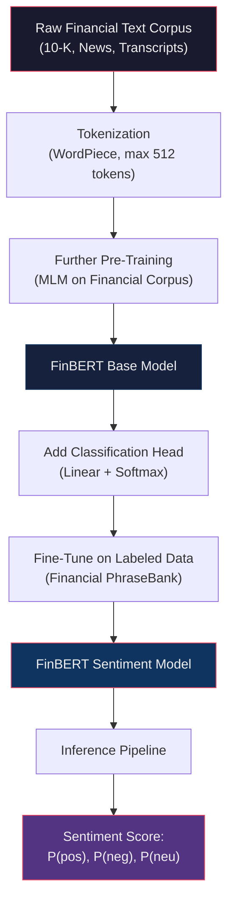
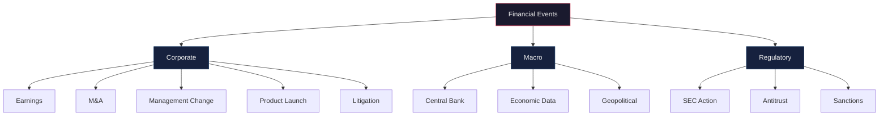
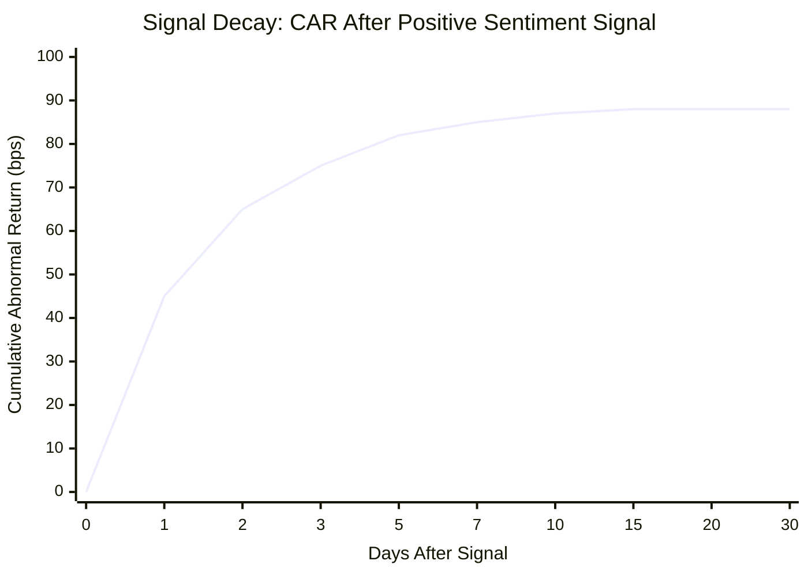
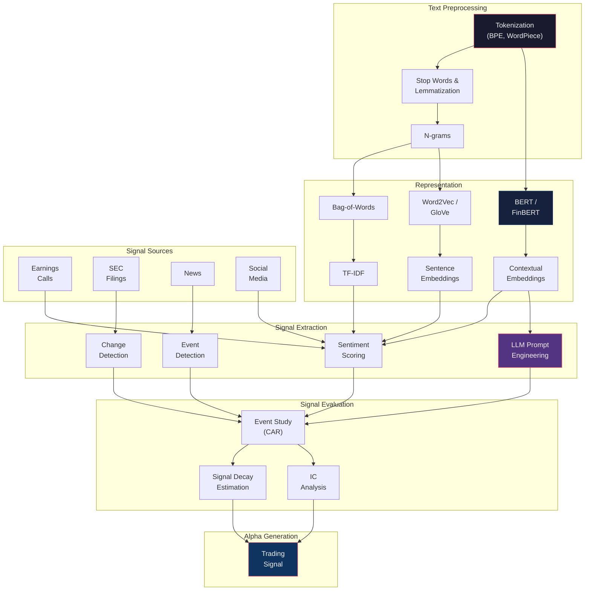

# Module 29: NLP, Sentiment & LLMs for Finance

> **Prerequisites:** Modules 09 (Statistical Foundations), 26 (Alternative Data), 27 (Machine Learning for Alpha)
> **Builds toward:** Modules 30 (HFT Strategies), 34 (Portfolio Construction with Alternative Data)

---

## Table of Contents

1. [Text Preprocessing Fundamentals](#1-text-preprocessing-fundamentals)
2. [Classical NLP for Finance](#2-classical-nlp-for-finance)
3. [Word Embeddings](#3-word-embeddings)
4. [Transformers and BERT](#4-transformers-and-bert)
5. [FinBERT: Domain-Specific Pre-Training](#5-finbert-domain-specific-pre-training)
6. [Large Language Models in Finance](#6-large-language-models-in-finance)
7. [Earnings Call Analysis](#7-earnings-call-analysis)
8. [SEC Filing Analysis](#8-sec-filing-analysis)
9. [News-Based Signals](#9-news-based-signals)
10. [Social Media Signal Extraction](#10-social-media-signal-extraction)
11. [Evaluation Methodology](#11-evaluation-methodology)
12. [Production Python Implementations](#12-production-python-implementations)
13. [Exercises](#13-exercises)
14. [Summary and Concept Map](#14-summary-and-concept-map)

---

## 1. Text Preprocessing Fundamentals

Before any statistical model can ingest textual data, we must convert raw character sequences into structured numerical representations. The quality of preprocessing directly determines the ceiling of any downstream NLP pipeline.

### 1.1 Tokenization

Tokenization is the process of segmenting a text string into discrete units (tokens). Three dominant paradigms exist in modern NLP.

**Whitespace and Rule-Based Tokenization.** The simplest approach splits on whitespace and punctuation boundaries. While fast, it fails on contractions ("don't"), hyphenated terms ("risk-adjusted"), and domain-specific tokens ("10-K", "S&P500").

**Byte Pair Encoding (BPE).** BPE begins with a character-level vocabulary and iteratively merges the most frequent adjacent pair of tokens. Given a corpus, let $V$ be the vocabulary and $f(a, b)$ the frequency of the bigram $(a, b)$:

$$
(a^*, b^*) = \arg\max_{(a,b) \in V \times V} f(a, b)
$$

The selected pair is merged into a new token $ab$, and the vocabulary is updated: $V \leftarrow V \cup \{ab\}$. This process repeats for a predetermined number of merge operations $k$, yielding a subword vocabulary of size $|V_0| + k$, where $V_0$ is the initial character set. GPT-2 and GPT-3 use BPE with vocabulary sizes of approximately 50,257 tokens.

**WordPiece.** Used by BERT, WordPiece selects merges that maximize the likelihood of the training corpus rather than raw frequency. The merge criterion is:

$$
(a^*, b^*) = \arg\max_{(a,b)} \frac{f(ab)}{f(a) \cdot f(b)}
$$

This is equivalent to selecting the pair whose pointwise mutual information (PMI) is highest. WordPiece produces a vocabulary that better captures rare but informative subwords -- critical in finance where tokens like "deleveraging" or "writedown" carry significant semantic weight.

**Practical Consideration for Finance.** Financial text contains ticker symbols (AAPL, MSFT), numerical expressions ($1.2B, 3.5%), abbreviations (EPS, P/E, EBITDA), and regulatory references (Rule 10b-5, Reg FD). A robust tokenizer must handle these without fragmentation.

### 1.2 Stop Words, Stemming, and Lemmatization

**Stop words** are high-frequency, low-information tokens (the, is, at, which). Removal is standard in bag-of-words models but should be applied cautiously: in financial text, "not" and "no" invert sentiment and must be preserved.

**Stemming** applies rule-based suffix stripping. The Porter stemmer maps "diversification" to "diversif" and "diversified" to "diversifi" -- losing the shared root. **Lemmatization** uses morphological analysis to produce valid base forms: both map to "diversify." For financial NLP, lemmatization is preferred because dictionary-based approaches (e.g., Loughran-McDonald) require exact lemma matching.

### 1.3 N-Grams

An $n$-gram is a contiguous sequence of $n$ tokens. Unigrams capture individual word frequency; bigrams capture local context ("interest rate", "short selling", "credit risk"); trigrams capture phrasal patterns ("net present value", "cash flow statement"). The number of possible $n$-grams grows as $|V|^n$, making feature spaces enormous. In practice, we restrict to $n \leq 3$ and apply minimum frequency thresholds.

---

## 2. Classical NLP for Finance

### 2.1 Bag-of-Words (BoW)

The bag-of-words model represents a document $d$ as a vector $\mathbf{x}_d \in \mathbb{R}^{|V|}$ where each component $x_{d,t}$ is the count of term $t$ in document $d$. This discards all ordering information -- "the company acquired the target" and "the target acquired the company" produce identical representations.

Despite this limitation, BoW remains useful as a baseline. For a corpus of $N$ documents with vocabulary size $|V|$, the document-term matrix $\mathbf{X} \in \mathbb{R}^{N \times |V|}$ is typically very sparse, with $>99\%$ zero entries.

### 2.2 TF-IDF: Derivation and Properties

Term Frequency-Inverse Document Frequency re-weights raw counts to emphasize terms that are frequent within a document but rare across the corpus.

**Term Frequency.** For term $t$ in document $d$:

$$
\text{tf}(t, d) = \frac{f_{t,d}}{\sum_{t' \in d} f_{t',d}}
$$

where $f_{t,d}$ is the raw count of $t$ in $d$. The denominator normalizes by document length.

**Inverse Document Frequency.** For term $t$ across a corpus of $N$ documents:

$$
\text{idf}(t) = \log\left(\frac{N}{|\{d \in D : t \in d\}|}\right)
$$

Terms appearing in every document have $\text{idf}(t) = \log(1) = 0$. Terms appearing in a single document have $\text{idf}(t) = \log(N)$.

**TF-IDF Weight.** The combined weight is:

$$
w_{t,d} = \text{tf}(t, d) \times \text{idf}(t)
$$

**Information-Theoretic Interpretation.** The IDF term approximates the negative log-probability of encountering term $t$ in a randomly selected document: $\text{idf}(t) \approx -\log P(t)$. Thus TF-IDF upweights terms with high self-information (surprise value). In a financial context, a word like "restatement" appearing in an earnings release carries far more information than "revenue" because it is rarer across the corpus.

**Smoothed Variant.** To avoid division by zero and reduce the impact of very rare terms:

$$
\text{idf}_{\text{smooth}}(t) = \log\left(\frac{N + 1}{|\{d : t \in d\}| + 1}\right) + 1
$$

### 2.3 Loughran-McDonald Financial Sentiment Dictionary

General-purpose sentiment lexicons (e.g., Harvard GI) perform poorly on financial text. The word "liability" is negative in everyday language but neutral in accounting. Loughran and McDonald (2011) constructed a domain-specific lexicon from 10-K filings, categorizing words into six tone categories:

| Category | Example Words | Count |
|----------|--------------|-------|
| Negative | loss, impairment, adverse, litigation, default | ~2,355 |
| Positive | achieve, attain, efficient, improve, profitable | ~354 |
| Uncertainty | approximate, contingency, risk, uncertain, volatile | ~297 |
| Litigious | claimant, deposition, statute, tribunal, verdict | ~903 |
| Constraining | commitment, obligation, restrict, impede, prohibit | ~184 |
| Strong Modal | always, must, never, shall, will | ~19 |

The **sentiment score** for a document $d$ is typically computed as:

$$
S(d) = \frac{|\text{Positive}(d)| - |\text{Negative}(d)|}{|\text{Total}(d)|}
$$

where $|\text{Positive}(d)|$ and $|\text{Negative}(d)|$ are counts of positive and negative words in the document.

**Limitations.** Dictionary approaches cannot handle negation ("not profitable"), sarcasm, conditional statements ("would be profitable if"), or context-dependent meaning ("short" as in short-selling vs. short-term). These limitations motivate the move to embedding-based and transformer-based approaches.

---

## 3. Word Embeddings

### 3.1 Word2Vec: CBOW and Skip-Gram

Mikolov et al. (2013) introduced two architectures for learning dense vector representations of words from co-occurrence patterns.

**Continuous Bag-of-Words (CBOW)** predicts a target word from its surrounding context. Given context words $\{w_{t-c}, \ldots, w_{t-1}, w_{t+1}, \ldots, w_{t+c}\}$ with window size $c$, CBOW maximizes:

$$
P(w_t \mid w_{t-c}, \ldots, w_{t+c}) = \text{softmax}(\mathbf{W} \cdot \bar{\mathbf{v}}_{\text{context}})
$$

where $\bar{\mathbf{v}}_{\text{context}}$ is the average of context word vectors.

**Skip-Gram** reverses this: given a target word, it predicts context words. The Skip-gram objective is:

$$
\mathcal{L} = \frac{1}{T} \sum_{t=1}^{T} \sum_{\substack{-c \leq j \leq c \\ j \neq 0}} \log P(w_{t+j} \mid w_t)
$$

where $T$ is the corpus length and the conditional probability is defined via softmax over the full vocabulary:

$$
P(w_O \mid w_I) = \frac{\exp(\mathbf{v}_{w_O}'^{\top} \mathbf{v}_{w_I})}{\sum_{w=1}^{|V|} \exp(\mathbf{v}_w'^{\top} \mathbf{v}_{w_I})}
$$

Here $\mathbf{v}_{w_I} \in \mathbb{R}^d$ is the input embedding and $\mathbf{v}_{w_O}' \in \mathbb{R}^d$ is the output embedding. Computing the full softmax is $O(|V|)$ per training example.

**Negative Sampling Approximation.** To make training tractable, we replace the full softmax with negative sampling. For each positive pair $(w_I, w_O)$, we sample $k$ negative words $\{w_1^-, \ldots, w_k^-\}$ from the noise distribution $P_n(w) \propto f(w)^{3/4}$. The objective becomes:

$$
\log \sigma(\mathbf{v}_{w_O}'^{\top} \mathbf{v}_{w_I}) + \sum_{i=1}^{k} \mathbb{E}_{w_i^- \sim P_n} \left[\log \sigma(-\mathbf{v}_{w_i^-}'^{\top} \mathbf{v}_{w_I})\right]
$$

where $\sigma$ is the sigmoid function. This reduces each update to $O(k)$ with $k$ typically 5-20.

### 3.2 GloVe: Global Vectors

Pennington et al. (2014) derive embeddings from the global co-occurrence matrix $\mathbf{X}$, where $X_{ij}$ counts how often word $j$ appears in the context of word $i$. The objective minimizes:

$$
\mathcal{J} = \sum_{i,j=1}^{|V|} f(X_{ij}) \left(\mathbf{v}_i^{\top} \tilde{\mathbf{v}}_j + b_i + \tilde{b}_j - \log X_{ij}\right)^2
$$

where $f(x) = \min\left((x / x_{\max})^{0.75}, 1\right)$ is a weighting function that caps the influence of very frequent co-occurrences.

### 3.3 Financial Domain Adaptation

Pre-trained embeddings (trained on Wikipedia, Common Crawl) encode general semantics but miss financial nuances. "Bull" relates to animals rather than markets; "short" relates to height rather than positions.

**Domain adaptation strategies:**

1. **Fine-tuning:** Initialize with pre-trained vectors, continue training on a financial corpus (10-K filings, earnings transcripts, financial news).
2. **Retrofitting:** Adjust embeddings using a financial knowledge graph, pulling synonyms closer and pushing antonyms apart.
3. **Training from scratch:** On a sufficiently large financial corpus (>1B tokens), train domain-specific embeddings. This requires significant data but yields the best domain alignment.

**Evaluation.** Domain-adapted embeddings should satisfy financial analogies: $\text{vec}(\text{bull}) - \text{vec}(\text{buy}) + \text{vec}(\text{sell}) \approx \text{vec}(\text{bear})$.

---

## 4. Transformers and BERT

### 4.1 The Transformer Architecture (Review)

The transformer (Vaswani et al., 2017) replaces recurrence with self-attention. For input embeddings $\mathbf{X} \in \mathbb{R}^{n \times d}$:

**Scaled Dot-Product Attention:**

$$
\text{Attention}(\mathbf{Q}, \mathbf{K}, \mathbf{V}) = \text{softmax}\left(\frac{\mathbf{Q}\mathbf{K}^{\top}}{\sqrt{d_k}}\right)\mathbf{V}
$$

where $\mathbf{Q} = \mathbf{X}\mathbf{W}^Q$, $\mathbf{K} = \mathbf{X}\mathbf{W}^K$, $\mathbf{V} = \mathbf{X}\mathbf{W}^V$ with learned projections $\mathbf{W}^Q, \mathbf{W}^K \in \mathbb{R}^{d \times d_k}$ and $\mathbf{W}^V \in \mathbb{R}^{d \times d_v}$.

The $\sqrt{d_k}$ scaling prevents the dot products from growing large in magnitude, which would push the softmax into saturated regions with vanishing gradients.

**Multi-Head Attention** runs $h$ parallel attention computations:

$$
\text{MultiHead}(\mathbf{Q}, \mathbf{K}, \mathbf{V}) = \text{Concat}(\text{head}_1, \ldots, \text{head}_h)\mathbf{W}^O
$$

where $\text{head}_i = \text{Attention}(\mathbf{X}\mathbf{W}_i^Q, \mathbf{X}\mathbf{W}_i^K, \mathbf{X}\mathbf{W}_i^V)$.

### 4.2 BERT: Pre-Training Objectives

BERT (Devlin et al., 2019) is an encoder-only transformer pre-trained with two objectives:

**Masked Language Model (MLM).** Randomly mask 15% of input tokens. Of these, 80% are replaced with `[MASK]`, 10% with a random token, and 10% are kept unchanged. The model predicts the original token:

$$
\mathcal{L}_{\text{MLM}} = -\sum_{i \in \mathcal{M}} \log P(w_i \mid \mathbf{w}_{\backslash \mathcal{M}})
$$

where $\mathcal{M}$ is the set of masked positions and $\mathbf{w}_{\backslash \mathcal{M}}$ is the corrupted input.

**Next Sentence Prediction (NSP).** Given sentence pairs $(A, B)$, predict whether $B$ is the actual next sentence or a random sentence. The `[CLS]` token representation is passed through a binary classifier:

$$
P(\text{IsNext} \mid A, B) = \sigma(\mathbf{w}^{\top} \mathbf{h}_{\text{[CLS]}} + b)
$$

### 4.3 Fine-Tuning for Classification

For sentiment classification, we add a classification head on top of the `[CLS]` representation:

$$
P(y \mid \mathbf{x}) = \text{softmax}(\mathbf{W}_c \mathbf{h}_{\text{[CLS]}} + \mathbf{b}_c)
$$

Fine-tuning updates all parameters (pre-trained + classification head) with a small learning rate ($2 \times 10^{-5}$ to $5 \times 10^{-5}$) to avoid catastrophic forgetting.

---

## 5. FinBERT: Domain-Specific Pre-Training

### 5.1 Why Domain-Specific Pre-Training?

General BERT struggles with financial text because:

1. **Vocabulary mismatch:** Financial terms (EBITDA, CDO, amortization) are fragmented into subwords.
2. **Semantic shift:** "Liability" (negative in general English, neutral in finance), "exposure" (negative generally, neutral/technical in finance).
3. **Domain conventions:** Regulatory language, formal tone, numerical heavy text.

### 5.2 FinBERT Architecture and Training

FinBERT (Araci, 2019; Huang et al., 2020) follows a two-stage approach:

**Stage 1: Further Pre-Training.** Initialize with BERT-base weights. Continue MLM pre-training on a large financial corpus:
- Financial news articles (~4.6B tokens)
- 10-K/10-Q filings (~2.5B tokens)
- Earnings call transcripts (~1.2B tokens)

**Stage 2: Fine-Tuning.** Fine-tune on labeled financial sentiment datasets:
- Financial PhraseBank (4,845 sentences, 3-class: positive/negative/neutral)
- Analyst report sentences (custom labeled)

The output is a 3-class sentiment distribution:

$$
P(y \in \{\text{pos}, \text{neg}, \text{neu}\} \mid \mathbf{x}) = \text{softmax}(\mathbf{W}_s \mathbf{h}_{\text{[CLS]}} + \mathbf{b}_s)
$$

### 5.3 FinBERT Fine-Tuning Pipeline



### 5.4 Performance Benchmarks

On the Financial PhraseBank dataset:

| Model | Accuracy | F1 (Weighted) |
|-------|----------|---------------|
| Loughran-McDonald Dictionary | 0.58 | 0.54 |
| BERT-base (no domain pre-training) | 0.86 | 0.85 |
| FinBERT (Araci) | 0.92 | 0.91 |
| FinBERT (Huang et al.) | 0.94 | 0.93 |

The 6-8 percentage point improvement over vanilla BERT justifies the cost of domain pre-training.

---

## 6. Large Language Models in Finance

### 6.1 GPT-Family for Financial Tasks

Large language models (GPT-3.5, GPT-4, Claude, Llama) offer a paradigm shift: instead of training task-specific models, we can leverage general-purpose models through prompting. Key financial applications include:

- **Summarization:** Condensing 50-page 10-K filings into structured summaries.
- **Sentiment scoring:** Classifying text sentiment without labeled training data.
- **Information extraction:** Parsing structured data (revenue figures, guidance) from unstructured text.
- **Reasoning:** Analyzing complex scenarios ("If the Fed raises rates by 50bps, what is the likely impact on bank NIM?").

### 6.2 Prompt Engineering for Sentiment Scoring

**Zero-Shot Prompting.** No examples provided; the model relies entirely on its pre-training knowledge.

```text
Classify the sentiment of the following financial text as POSITIVE, NEGATIVE,
or NEUTRAL. Return only the label.

Text: "The company reported a 15% decline in same-store sales, citing
macroeconomic headwinds and increased competition."

Sentiment:
```

**Few-Shot Prompting.** Provide $k$ labeled examples to calibrate the model's behavior.

```text
Classify financial text sentiment.

Text: "Revenue exceeded analyst expectations by 8%, driven by strong cloud
adoption." -> POSITIVE

Text: "The CEO announced plans to restructure the division, resulting in
2,000 layoffs." -> NEGATIVE

Text: "The board declared a quarterly dividend of $0.25 per share, consistent
with prior quarters." -> NEUTRAL

Text: "Operating margins contracted 200bps due to rising input costs, though
management expects recovery in Q3." ->
```

**Chain-of-Thought (CoT) Prompting.** Forces the model to articulate intermediate reasoning steps before producing a label.

```text
Analyze the sentiment of this financial text step by step:

Text: "Despite a 5% revenue miss, the company raised full-year guidance on
the back of margin expansion and accelerating backlog."

Step 1: Identify positive signals.
Step 2: Identify negative signals.
Step 3: Weigh the relative importance.
Step 4: Assign a sentiment label (POSITIVE, NEGATIVE, NEUTRAL) and a
confidence score from 0 to 1.
```

CoT prompting has been shown to reduce classification errors by 10-20% on ambiguous financial texts where positive and negative signals coexist.

### 6.3 Structured Output Extraction

For systematic trading signals, we need machine-parseable outputs. JSON-mode prompting:

```text
Extract the following from the earnings call transcript. Return valid JSON.

{
  "revenue_actual": <float>,
  "revenue_consensus": <float>,
  "revenue_surprise_pct": <float>,
  "guidance_direction": "raised" | "lowered" | "maintained" | "withdrawn",
  "sentiment_score": <float between -1 and 1>,
  "key_themes": [<list of strings>],
  "management_confidence": "high" | "medium" | "low"
}
```

### 6.4 Evaluating LLM Signals

LLM-generated signals must be evaluated rigorously:

1. **Consistency:** Run the same text $k$ times with temperature $\tau = 0$. Measure agreement rate. Production systems require $>95\%$ consistency.
2. **Calibration:** For confidence scores, verify that when the model says "80% confident positive," approximately 80% of those texts are indeed positive.
3. **Information Coefficient:** Measure rank correlation between LLM sentiment scores and forward returns.
4. **Latency:** GPT-4 inference is ~1-5 seconds per call. For processing 10,000 news articles daily, this requires batching and parallelization.
5. **Cost:** At \$0.01-0.03 per 1K tokens, processing a 10-K filing (~80K tokens) costs ~\$0.80-2.40. Annual cost for a universe of 3,000 stocks filing quarterly: ~$10K-30K.

---

## 7. Earnings Call Analysis

### 7.1 Anatomy of an Earnings Call

An earnings call consists of two structurally distinct sections:

1. **Prepared remarks:** Scripted by management and IR teams. Tone is carefully controlled.
2. **Q&A session:** Analysts ask unscripted questions. Management responses reveal genuine confidence or concern.

The **alpha content** is disproportionately in the Q&A section, precisely because it is harder to script.

### 7.2 Tone Analysis

We compute sentiment scores separately for prepared remarks ($S_{\text{prep}}$) and Q&A ($S_{\text{QA}}$). The **tone gap** is:

$$
\Delta S = S_{\text{prep}} - S_{\text{QA}}
$$

A large positive $\Delta S$ (prepared remarks much more positive than Q&A) signals that management is papering over concerns -- a bearish indicator. Research shows that $\Delta S$ has predictive power for 3-day post-earnings returns.

### 7.3 Deviation from Script

Compare current-quarter prepared remarks to prior-quarter using cosine similarity:

$$
\text{sim}(\mathbf{d}_t, \mathbf{d}_{t-1}) = \frac{\mathbf{d}_t \cdot \mathbf{d}_{t-1}}{\|\mathbf{d}_t\| \|\mathbf{d}_{t-1}\|}
$$

where $\mathbf{d}_t$ is the TF-IDF or embedding representation of quarter $t$'s prepared remarks. A sharp drop in similarity indicates a narrative shift, which often precedes material changes in fundamentals.

### 7.4 Q&A Dynamics and Surprise Metrics

**Question difficulty score:** Use an LLM to classify analyst questions by difficulty (1-5 scale). Track management response length and hedging language as a function of question difficulty.

**Earnings surprise decomposition:**

$$
\text{Surprise}_{\text{total}} = \underbrace{(\text{EPS}_{\text{actual}} - \text{EPS}_{\text{consensus}})}_{\text{Quantitative}} + \underbrace{f(S_{\text{call}}, \Delta S, \text{guidance})}_{\text{Qualitative}}
$$

The qualitative component -- captured through NLP -- explains incremental return variance beyond the quantitative surprise.

---

## 8. SEC Filing Analysis

### 8.1 10-K/10-Q Parsing

SEC filings are structured HTML/SGML documents filed via EDGAR. Key sections for alpha extraction:

| Section | Content | Signal |
|---------|---------|--------|
| Item 1A | Risk Factors | New/removed risks |
| Item 7 | MD&A | Narrative tone, forward-looking statements |
| Item 8 | Financial Statements | Quantitative data |
| Item 1.01 (8-K) | Material Events | Event detection |

**Parsing pipeline:** Raw EDGAR HTML -> BeautifulSoup extraction -> Section identification via regex and heading detection -> Clean text output.

### 8.2 MD&A Section Analysis

Management Discussion and Analysis is the richest source of qualitative signal. We analyze:

1. **Tone change:** $\Delta S_{\text{MD\&A}} = S_t^{\text{MD\&A}} - S_{t-1}^{\text{MD\&A}}$ between consecutive filings.
2. **Forward-looking statement ratio:** Count of forward-looking sentences (containing "expect," "anticipate," "project") divided by total sentences.
3. **Readability:** Fog Index, which correlates with obfuscation of bad news:

$$
\text{Fog} = 0.4 \times \left(\frac{\text{words}}{\text{sentences}} + 100 \times \frac{\text{complex words}}{\text{words}}\right)
$$

### 8.3 Risk Factor Changes Over Time

Compute the cosine similarity of risk factor sections between consecutive filings:

$$
\text{RiskChange}_{t} = 1 - \text{sim}(\mathbf{r}_t, \mathbf{r}_{t-1})
$$

A high $\text{RiskChange}_t$ signals material new risks. Further, we can decompose changes into:
- **Added risks:** Paragraphs in $\mathbf{r}_t$ not present in $\mathbf{r}_{t-1}$
- **Removed risks:** Paragraphs in $\mathbf{r}_{t-1}$ not present in $\mathbf{r}_t$
- **Modified risks:** Paragraphs with cosine similarity $< 0.8$

Research (Cohen et al., 2020) shows that stocks with the highest year-over-year changes in 10-K language underperform by 2-4% annually, after controlling for standard risk factors.

---

## 9. News-Based Signals

### 9.1 Event Detection

Financial events must be detected in real-time from news feeds. A typical taxonomy:



Event detection is typically formulated as multi-label classification: a single article may contain multiple event types (e.g., "Company X reports earnings beat and announces acquisition of Company Y").

### 9.2 Novelty Scoring

Not all news articles contain new information. Many are rehashes, commentary, or aggregation. **Novelty** measures how much new information an article provides relative to the recent information set.

Given article $a_t$ and the set of recent articles $\mathcal{A}_{t-\delta:t}$ within window $\delta$:

$$
\text{Novelty}(a_t) = 1 - \max_{a' \in \mathcal{A}_{t-\delta:t}} \text{sim}(\mathbf{e}_{a_t}, \mathbf{e}_{a'})
$$

where $\mathbf{e}$ denotes embedding representations. Articles with novelty below a threshold $\tau_{\text{nov}}$ are filtered out to avoid double-counting signals.

### 9.3 Signal Decay Modeling

News signals decay over time as information is absorbed by the market. We model this with an exponential decay function:

$$
\alpha(t) = \alpha_0 \cdot e^{-\lambda t}
$$

where $\alpha_0$ is the initial signal strength, $\lambda$ is the decay rate, and $t$ is time since the event.

The **half-life** $t_{1/2}$ -- the time for the signal to decay to half its initial strength -- is:

$$
t_{1/2} = \frac{\ln 2}{\lambda}
$$

**Estimating the half-life from data.** Given a series of events and their subsequent returns, we regress:

$$
r_{i,t+\Delta} = \beta_0 + \beta_1 \cdot S_i \cdot e^{-\lambda \Delta} + \varepsilon_{i,t+\Delta}
$$

where $S_i$ is the sentiment score of event $i$, $\Delta$ is the holding period, and $\lambda$ is estimated via nonlinear least squares. Typical half-lives:

| Event Type | Half-Life |
|------------|-----------|
| Earnings surprise | 3-5 days |
| M&A announcement | 1-2 days |
| Analyst upgrade/downgrade | 5-10 days |
| Macro news (CPI, FOMC) | 0.5-2 days |
| Social media sentiment | 2-6 hours |

---

## 10. Social Media Signal Extraction

### 10.1 Platform Characteristics

| Platform | Signal Type | Latency | Noise Level |
|----------|------------|---------|-------------|
| Twitter/X | Breaking news, opinion | Very low | Very high |
| Reddit (r/wallstreetbets) | Retail sentiment, momentum | Low-Medium | High |
| StockTwits | Ticker-level sentiment | Low | High |
| Seeking Alpha | Detailed analysis | Medium | Medium |

### 10.2 Bot Detection

Social media platforms are polluted by automated accounts that can distort sentiment signals. Detection features include:

1. **Posting frequency:** >50 posts/day flagged as suspicious.
2. **Content entropy:** Bots produce low-entropy, repetitive content.
3. **Account age and activity ratio:** New accounts with high activity are suspicious.
4. **Network analysis:** Bots often form coordinated networks with similar posting patterns.
5. **Linguistic features:** Bots lack hedging language, emotional variation, and natural typo patterns.

A random forest classifier using these features typically achieves >90% bot detection accuracy. Filtering bots improves sentiment signal IC by 30-50%.

### 10.3 Signal Extraction Challenges

**Sarcasm and irony:** "Great, another record loss. Bullish!" requires understanding pragmatics beyond literal meaning.

**Cashtag ambiguity:** $FORD could refer to Ford Motor Company or be a coincidental mention.

**Pump-and-dump schemes:** Coordinated campaigns inflate mentions of micro-cap stocks. Detect via: sudden volume spikes in mentions, concentrated source accounts, lack of fundamental catalysts.

**Sampling bias:** Social media users are not representative of the investor population. Retail-heavy platforms overweight speculative, high-volatility names.

---

## 11. Evaluation Methodology

### 11.1 Event Study Methodology

The gold standard for evaluating news-based signals is the event study. The framework measures **abnormal returns** around events.

**Step 1: Estimate Normal Returns.** Using an estimation window $[T_0, T_1]$ (typically -250 to -30 days before the event), estimate the market model:

$$
R_{i,t} = \alpha_i + \beta_i R_{m,t} + \varepsilon_{i,t}
$$

**Step 2: Compute Abnormal Returns.** In the event window $[\tau_1, \tau_2]$:

$$
AR_{i,t} = R_{i,t} - (\hat{\alpha}_i + \hat{\beta}_i R_{m,t})
$$

**Step 3: Cumulative Abnormal Return (CAR).** Aggregate across the event window:

$$
\text{CAR}_i(\tau_1, \tau_2) = \sum_{t=\tau_1}^{\tau_2} AR_{i,t}
$$

**Step 4: Statistical Significance.** Under the null hypothesis of no abnormal return, the test statistic is:

$$
t_{\text{CAR}} = \frac{\overline{\text{CAR}}(\tau_1, \tau_2)}{\hat{\sigma}_{\text{CAR}} / \sqrt{N}}
$$

where $N$ is the number of events and $\hat{\sigma}_{\text{CAR}}$ is the cross-sectional standard deviation of CARs.

### 11.2 Signal Decay Curves

Plot average CAR as a function of holding period after the signal:



The curve reveals:
- **Speed of incorporation:** How quickly the market absorbs the signal.
- **Steady-state level:** The terminal CAR (information fully priced).
- **Optimal holding period:** The point of diminishing returns.

### 11.3 Information Coefficient Analysis

The **Information Coefficient (IC)** measures the rank correlation between the signal and subsequent returns:

$$
\text{IC}_t = \text{Spearman}\left(\mathbf{s}_t, \mathbf{r}_{t+1}\right)
$$

where $\mathbf{s}_t$ is the cross-sectional vector of sentiment scores and $\mathbf{r}_{t+1}$ is the forward return vector.

A sentiment signal is considered viable if:
- $|\overline{\text{IC}}| > 0.02$ (mean IC above 2%)
- $\text{IC}_{\text{IR}} = \overline{\text{IC}} / \sigma_{\text{IC}} > 0.5$ (IC Information Ratio)
- IC is stable across market regimes (bull/bear/sideways)

---

## 12. Production Python Implementations

### 12.1 TF-IDF Financial Sentiment Pipeline

```python
"""
TF-IDF Financial Sentiment Pipeline
Uses Loughran-McDonald dictionary with TF-IDF weighting.
Production-grade: handles edge cases, logging, and batch processing.
"""

import re
import math
import logging
from collections import Counter, defaultdict
from dataclasses import dataclass, field
from typing import Dict, List, Optional, Tuple

import numpy as np

logger = logging.getLogger(__name__)


@dataclass
class LoughranMcDonaldLexicon:
    """
    Loughran-McDonald financial sentiment lexicon.
    In production, load from the official word lists.
    """
    positive: set = field(default_factory=lambda: {
        "achieve", "attain", "benefit", "best", "boom", "breakthrough",
        "creative", "delight", "efficient", "enhance", "excellent",
        "favorable", "gain", "great", "highest", "improve", "innovation",
        "opportunity", "optimistic", "outperform", "proficiency",
        "profitable", "progress", "prosper", "rebound", "recover",
        "strength", "strong", "succeed", "superior", "surpass", "upturn"
    })
    negative: set = field(default_factory=lambda: {
        "adverse", "against", "bankruptcy", "burden", "catastrophe",
        "cease", "closure", "concern", "decline", "default", "deficit",
        "deteriorate", "difficult", "disappoint", "downturn", "drop",
        "failure", "fraud", "impair", "inability", "inadequate", "lawsuit",
        "layoff", "liability", "liquidate", "litigation", "loss", "misstate",
        "negative", "penalty", "restructure", "risk", "shortage",
        "terminate", "threaten", "underperform", "unfavorable",
        "unprofitable", "violation", "volatile", "weak", "worsen"
    })
    uncertainty: set = field(default_factory=lambda: {
        "almost", "ambiguity", "approximate", "assumption", "believe",
        "conceivable", "conditional", "contingent", "depend", "doubt",
        "estimate", "fluctuate", "indicate", "likelihood", "may",
        "might", "nearly", "pending", "perhaps", "possible", "predict",
        "preliminary", "presume", "probable", "random", "reassess",
        "reconsider", "risk", "roughly", "seem", "suggest", "tentative",
        "uncertain", "unclear", "undetermined", "unpredictable", "variable"
    })


class TFIDFSentimentAnalyzer:
    """
    Computes TF-IDF weighted sentiment scores using the Loughran-McDonald
    financial sentiment dictionary.
    """

    def __init__(self, lexicon: Optional[LoughranMcDonaldLexicon] = None):
        self.lexicon = lexicon or LoughranMcDonaldLexicon()
        self._idf: Dict[str, float] = {}
        self._vocab: set = set()
        self._n_docs: int = 0

    @staticmethod
    def _preprocess(text: str) -> List[str]:
        """Lowercase, remove non-alpha characters, tokenize."""
        text = text.lower()
        text = re.sub(r"[^a-z\s]", " ", text)
        tokens = text.split()
        # Remove very short tokens but keep negation words
        tokens = [t for t in tokens if len(t) > 2 or t in {"no", "not"}]
        return tokens

    def fit(self, corpus: List[str]) -> "TFIDFSentimentAnalyzer":
        """
        Compute IDF weights from a corpus of documents.

        Parameters
        ----------
        corpus : List[str]
            List of raw text documents (e.g., 10-K excerpts, news articles).

        Returns
        -------
        self
        """
        self._n_docs = len(corpus)
        doc_freq: Counter = Counter()

        for doc in corpus:
            tokens = set(self._preprocess(doc))
            self._vocab.update(tokens)
            for token in tokens:
                doc_freq[token] += 1

        # Smoothed IDF: log((N + 1) / (df + 1)) + 1
        self._idf = {
            token: math.log((self._n_docs + 1) / (df + 1)) + 1
            for token, df in doc_freq.items()
        }
        logger.info(
            f"Fitted on {self._n_docs} documents, "
            f"vocabulary size: {len(self._vocab)}"
        )
        return self

    def score_document(self, text: str) -> Dict[str, float]:
        """
        Compute TF-IDF weighted sentiment scores for a single document.

        Returns
        -------
        Dict with keys: 'positive', 'negative', 'uncertainty', 'net_sentiment',
        'subjectivity', 'word_count'.
        """
        tokens = self._preprocess(text)
        if not tokens:
            return {
                "positive": 0.0, "negative": 0.0, "uncertainty": 0.0,
                "net_sentiment": 0.0, "subjectivity": 0.0, "word_count": 0
            }

        # Term frequency (normalized)
        tf_counts = Counter(tokens)
        total = len(tokens)
        tf = {t: c / total for t, c in tf_counts.items()}

        # Handle negation: "not profitable" should flip sentiment
        negation_window = 3
        negated = set()
        for i, token in enumerate(tokens):
            if token in {"not", "no", "never", "neither", "nor", "cannot"}:
                for j in range(i + 1, min(i + negation_window + 1, len(tokens))):
                    negated.add(j)

        # TF-IDF weighted sentiment accumulation
        pos_score = 0.0
        neg_score = 0.0
        unc_score = 0.0

        for i, token in enumerate(tokens):
            tfidf = tf.get(token, 0.0) * self._idf.get(token, 1.0)
            is_negated = i in negated

            if token in self.lexicon.positive:
                if is_negated:
                    neg_score += tfidf  # Negated positive -> negative
                else:
                    pos_score += tfidf
            elif token in self.lexicon.negative:
                if is_negated:
                    pos_score += tfidf  # Negated negative -> positive
                else:
                    neg_score += tfidf

            if token in self.lexicon.uncertainty:
                unc_score += tfidf

        net = pos_score - neg_score
        subjectivity = pos_score + neg_score

        return {
            "positive": round(pos_score, 6),
            "negative": round(neg_score, 6),
            "uncertainty": round(unc_score, 6),
            "net_sentiment": round(net, 6),
            "subjectivity": round(subjectivity, 6),
            "word_count": len(tokens),
        }

    def score_corpus(
        self, documents: List[str]
    ) -> List[Dict[str, float]]:
        """Score a batch of documents."""
        return [self.score_document(doc) for doc in documents]
```

### 12.2 FinBERT Inference Pipeline

```python
"""
FinBERT Sentiment Inference Pipeline
Production-ready: batched inference, GPU support, caching.
"""

from dataclasses import dataclass
from typing import Dict, List, Optional, Tuple

import numpy as np

try:
    import torch
    from transformers import AutoModelForSequenceClassification, AutoTokenizer
    HAS_TRANSFORMERS = True
except ImportError:
    HAS_TRANSFORMERS = False


@dataclass
class SentimentResult:
    """Container for a single sentiment prediction."""
    text: str
    label: str               # "positive", "negative", "neutral"
    score: float              # Confidence of the predicted label
    probabilities: Dict[str, float]  # Full distribution


class FinBERTSentimentPipeline:
    """
    Wraps a FinBERT model for batch sentiment inference.

    Parameters
    ----------
    model_name : str
        HuggingFace model identifier. Default: 'ProsusAI/finbert'.
    device : str
        'cuda', 'cpu', or 'mps'. Auto-detected if None.
    max_length : int
        Maximum sequence length for tokenization.
    batch_size : int
        Number of texts per inference batch.
    """

    LABEL_MAP = {0: "positive", 1: "negative", 2: "neutral"}

    def __init__(
        self,
        model_name: str = "ProsusAI/finbert",
        device: Optional[str] = None,
        max_length: int = 512,
        batch_size: int = 32,
    ):
        if not HAS_TRANSFORMERS:
            raise ImportError(
                "transformers and torch required. "
                "Install via: pip install transformers torch"
            )

        self.max_length = max_length
        self.batch_size = batch_size

        # Device selection
        if device is None:
            if torch.cuda.is_available():
                self.device = torch.device("cuda")
            elif hasattr(torch.backends, "mps") and torch.backends.mps.is_available():
                self.device = torch.device("mps")
            else:
                self.device = torch.device("cpu")
        else:
            self.device = torch.device(device)

        self.tokenizer = AutoTokenizer.from_pretrained(model_name)
        self.model = AutoModelForSequenceClassification.from_pretrained(model_name)
        self.model.to(self.device)
        self.model.eval()

    @torch.no_grad()
    def predict(self, texts: List[str]) -> List[SentimentResult]:
        """
        Run batched sentiment inference.

        Parameters
        ----------
        texts : List[str]
            List of financial text strings.

        Returns
        -------
        List[SentimentResult]
        """
        results: List[SentimentResult] = []

        for start in range(0, len(texts), self.batch_size):
            batch_texts = texts[start : start + self.batch_size]

            encodings = self.tokenizer(
                batch_texts,
                padding=True,
                truncation=True,
                max_length=self.max_length,
                return_tensors="pt",
            ).to(self.device)

            outputs = self.model(**encodings)
            probs = torch.softmax(outputs.logits, dim=-1).cpu().numpy()

            for i, text in enumerate(batch_texts):
                prob_dict = {
                    self.LABEL_MAP[j]: float(probs[i, j])
                    for j in range(len(self.LABEL_MAP))
                }
                label = max(prob_dict, key=prob_dict.get)
                results.append(
                    SentimentResult(
                        text=text[:200],  # Truncate for storage
                        label=label,
                        score=prob_dict[label],
                        probabilities=prob_dict,
                    )
                )

        return results

    def score_with_aggregation(
        self, texts: List[str], weights: Optional[List[float]] = None
    ) -> Dict[str, float]:
        """
        Compute weighted aggregate sentiment across multiple texts.

        Parameters
        ----------
        texts : List[str]
            Multiple text segments (e.g., paragraphs of an earnings call).
        weights : Optional[List[float]]
            Importance weights for each text. Uniform if None.

        Returns
        -------
        Dict with 'sentiment_score' in [-1, 1] and component probabilities.
        """
        results = self.predict(texts)
        if weights is None:
            weights = [1.0 / len(texts)] * len(texts)
        else:
            total_w = sum(weights)
            weights = [w / total_w for w in weights]

        agg_pos = sum(
            w * r.probabilities["positive"] for w, r in zip(weights, results)
        )
        agg_neg = sum(
            w * r.probabilities["negative"] for w, r in zip(weights, results)
        )
        agg_neu = sum(
            w * r.probabilities["neutral"] for w, r in zip(weights, results)
        )

        # Net sentiment score: ranges from -1 (all negative) to +1 (all positive)
        sentiment_score = agg_pos - agg_neg

        return {
            "sentiment_score": round(sentiment_score, 6),
            "positive_prob": round(agg_pos, 6),
            "negative_prob": round(agg_neg, 6),
            "neutral_prob": round(agg_neu, 6),
            "n_segments": len(texts),
        }
```

### 12.3 LLM Prompt Engineering for Sentiment

```python
"""
LLM-Based Sentiment Scoring with Structured Output
Supports zero-shot, few-shot, and chain-of-thought prompting.
"""

import json
import logging
import time
from dataclasses import dataclass
from enum import Enum
from typing import Any, Dict, List, Optional

logger = logging.getLogger(__name__)


class PromptStrategy(Enum):
    ZERO_SHOT = "zero_shot"
    FEW_SHOT = "few_shot"
    CHAIN_OF_THOUGHT = "chain_of_thought"


@dataclass
class LLMSentimentConfig:
    """Configuration for LLM sentiment scoring."""
    model: str = "gpt-4"
    temperature: float = 0.0  # Deterministic for consistency
    max_tokens: int = 500
    strategy: PromptStrategy = PromptStrategy.CHAIN_OF_THOUGHT
    max_retries: int = 3
    retry_delay: float = 1.0


FEW_SHOT_EXAMPLES = [
    {
        "text": (
            "Revenue grew 22% year-over-year, exceeding consensus by 5%, "
            "driven by strong demand in cloud services."
        ),
        "sentiment": "POSITIVE",
        "score": 0.85,
        "reasoning": (
            "Strong revenue growth and consensus beat indicate positive "
            "fundamentals."
        ),
    },
    {
        "text": (
            "The company announced a goodwill impairment charge of $2.1B "
            "and lowered full-year guidance by 15%."
        ),
        "sentiment": "NEGATIVE",
        "score": -0.90,
        "reasoning": (
            "Impairment charge signals asset overvaluation; guidance cut "
            "indicates deteriorating outlook."
        ),
    },
    {
        "text": (
            "Management maintained its dividend and reiterated existing "
            "guidance for the fiscal year."
        ),
        "sentiment": "NEUTRAL",
        "score": 0.05,
        "reasoning": (
            "No new information; maintaining status quo is neither "
            "positive nor negative."
        ),
    },
]


def build_zero_shot_prompt(text: str) -> str:
    return f"""You are a financial sentiment analyst. Classify the sentiment of
the following financial text. Return ONLY a valid JSON object.

Text: "{text}"

Return this exact JSON structure:
{{"sentiment": "POSITIVE" or "NEGATIVE" or "NEUTRAL", "score": <float from -1 to 1>, "confidence": <float from 0 to 1>}}"""


def build_few_shot_prompt(text: str) -> str:
    examples = "\n\n".join(
        f'Text: "{ex["text"]}"\n'
        f'Result: {{"sentiment": "{ex["sentiment"]}", '
        f'"score": {ex["score"]}, "confidence": 0.9}}'
        for ex in FEW_SHOT_EXAMPLES
    )
    return f"""You are a financial sentiment analyst. Classify financial text
sentiment using the Loughran-McDonald framework.

Examples:
{examples}

Now classify:
Text: "{text}"
Result:"""


def build_cot_prompt(text: str) -> str:
    return f"""You are an expert financial sentiment analyst. Analyze the
following text using chain-of-thought reasoning.

Text: "{text}"

Step 1: Identify all positive signals (revenue growth, beats, upgrades, etc.)
Step 2: Identify all negative signals (misses, downgrades, impairments, etc.)
Step 3: Identify uncertainty/hedging language.
Step 4: Weigh the signals considering financial materiality.
Step 5: Provide your final assessment.

Return your analysis as JSON:
{{
  "positive_signals": [<list of strings>],
  "negative_signals": [<list of strings>],
  "uncertainty_signals": [<list of strings>],
  "reasoning": "<1-2 sentence summary>",
  "sentiment": "POSITIVE" | "NEGATIVE" | "NEUTRAL",
  "score": <float from -1.0 to 1.0>,
  "confidence": <float from 0.0 to 1.0>
}}"""


PROMPT_BUILDERS = {
    PromptStrategy.ZERO_SHOT: build_zero_shot_prompt,
    PromptStrategy.FEW_SHOT: build_few_shot_prompt,
    PromptStrategy.CHAIN_OF_THOUGHT: build_cot_prompt,
}


class LLMSentimentScorer:
    """
    Score financial text sentiment using LLM APIs.

    Parameters
    ----------
    config : LLMSentimentConfig
        Configuration object.
    client : Any
        An initialized API client (e.g., openai.OpenAI()).
    """

    def __init__(self, config: LLMSentimentConfig, client: Any):
        self.config = config
        self.client = client
        self._prompt_builder = PROMPT_BUILDERS[config.strategy]

    def score_text(self, text: str) -> Dict[str, Any]:
        """
        Score a single text string.

        Returns
        -------
        Dict with sentiment, score, confidence, and raw LLM response.
        """
        prompt = self._prompt_builder(text)

        for attempt in range(self.config.max_retries):
            try:
                response = self.client.chat.completions.create(
                    model=self.config.model,
                    messages=[{"role": "user", "content": prompt}],
                    temperature=self.config.temperature,
                    max_tokens=self.config.max_tokens,
                )
                raw = response.choices[0].message.content.strip()

                # Parse JSON from response (handle markdown code blocks)
                json_str = raw
                if "```json" in raw:
                    json_str = raw.split("```json")[1].split("```")[0]
                elif "```" in raw:
                    json_str = raw.split("```")[1].split("```")[0]

                result = json.loads(json_str)
                result["raw_response"] = raw
                result["model"] = self.config.model
                result["strategy"] = self.config.strategy.value
                return result

            except (json.JSONDecodeError, IndexError, KeyError) as e:
                logger.warning(
                    f"Parse error on attempt {attempt + 1}: {e}"
                )
                if attempt < self.config.max_retries - 1:
                    time.sleep(self.config.retry_delay * (attempt + 1))

        # Fallback on all retries exhausted
        logger.error(f"All {self.config.max_retries} attempts failed.")
        return {
            "sentiment": "NEUTRAL",
            "score": 0.0,
            "confidence": 0.0,
            "error": "parse_failure",
        }

    def score_batch(
        self, texts: List[str], delay: float = 0.1
    ) -> List[Dict[str, Any]]:
        """
        Score multiple texts with rate limiting.

        Parameters
        ----------
        texts : List[str]
        delay : float
            Seconds between API calls to respect rate limits.
        """
        results = []
        for i, text in enumerate(texts):
            result = self.score_text(text)
            result["index"] = i
            results.append(result)
            if delay > 0 and i < len(texts) - 1:
                time.sleep(delay)
        return results
```

### 12.4 Earnings Call Analyzer

```python
"""
Earnings Call Analyzer
Segments transcripts, computes tone metrics, and detects narrative shifts.
"""

import re
from dataclasses import dataclass, field
from typing import Dict, List, Optional, Tuple

import numpy as np


@dataclass
class CallSegment:
    """A segment of an earnings call transcript."""
    speaker: str
    role: str           # "management", "analyst", "operator"
    section: str        # "prepared_remarks" or "qa"
    text: str
    word_count: int = 0

    def __post_init__(self):
        self.word_count = len(self.text.split())


@dataclass
class EarningsCallMetrics:
    """Aggregated metrics from earnings call analysis."""
    prepared_sentiment: float
    qa_sentiment: float
    tone_gap: float              # prepared - qa
    management_qa_sentiment: float
    analyst_question_sentiment: float
    hedging_ratio: float
    forward_looking_ratio: float
    word_count_prepared: int
    word_count_qa: int
    n_analyst_questions: int
    similarity_to_prior: Optional[float] = None


class EarningsCallAnalyzer:
    """
    Analyzes earnings call transcripts for alpha signals.
    """

    HEDGING_WORDS = {
        "approximately", "around", "assume", "believe", "could",
        "estimate", "expect", "generally", "hope", "intend",
        "likely", "may", "might", "perhaps", "plan", "possible",
        "potentially", "predict", "preliminary", "probably",
        "project", "roughly", "should", "suggest", "think",
        "uncertain", "would",
    }
    FORWARD_LOOKING = {
        "anticipate", "expect", "forecast", "forward", "future",
        "going forward", "guidance", "looking ahead", "next quarter",
        "next year", "outlook", "pipeline", "plan", "project",
        "target", "trajectory", "will",
    }
    QA_MARKERS = [
        r"(?:question|Q)\s*(?:and|&)\s*(?:answer|A)",
        r"Q&A\s+Session",
        r"(?:we|I)\s+(?:will|would)\s+now\s+(?:like\s+to\s+)?(?:open|take)",
        r"operator.*(?:first|next)\s+question",
    ]

    def __init__(self, sentiment_scorer=None):
        """
        Parameters
        ----------
        sentiment_scorer : callable
            A function that takes a string and returns a float in [-1, 1].
            If None, uses a simple dictionary-based scorer.
        """
        self._scorer = sentiment_scorer or self._default_scorer

    @staticmethod
    def _default_scorer(text: str) -> float:
        """Simple Loughran-McDonald based scorer as fallback."""
        positive = {
            "achieve", "beat", "benefit", "best", "exceed", "gain",
            "great", "grew", "growth", "improve", "increase", "momentum",
            "opportunity", "outperform", "profit", "progress",
            "record", "recover", "strength", "strong", "success",
        }
        negative = {
            "challenge", "concern", "decline", "decrease", "deficit",
            "difficult", "disappoint", "down", "drop", "fail", "headwind",
            "impair", "issue", "lag", "loss", "miss", "pressure",
            "problem", "restructure", "risk", "shortfall", "slow",
            "weak", "worsen",
        }
        words = text.lower().split()
        if not words:
            return 0.0
        pos = sum(1 for w in words if w in positive)
        neg = sum(1 for w in words if w in negative)
        return (pos - neg) / len(words)

    def segment_transcript(self, transcript: str) -> List[CallSegment]:
        """
        Split a transcript into speaker-attributed segments.

        Parameters
        ----------
        transcript : str
            Raw earnings call transcript text.

        Returns
        -------
        List[CallSegment]
        """
        # Detect Q&A boundary
        qa_start = len(transcript)
        for pattern in self.QA_MARKERS:
            match = re.search(pattern, transcript, re.IGNORECASE)
            if match and match.start() < qa_start:
                qa_start = match.start()

        # Split by speaker turns (common format: "Speaker Name -- Title")
        speaker_pattern = re.compile(
            r"\n\s*([A-Z][a-zA-Z\s\.\-]+)\s*(?:--|---|-)\s*"
            r"(CEO|CFO|COO|CTO|President|Analyst|VP|Director|"
            r"Managing Director|Operator|[A-Za-z\s]+)\s*\n"
        )

        segments: List[CallSegment] = []
        matches = list(speaker_pattern.finditer(transcript))

        for i, match in enumerate(matches):
            start = match.end()
            end = matches[i + 1].start() if i + 1 < len(matches) else len(transcript)
            text = transcript[start:end].strip()
            if not text:
                continue

            speaker = match.group(1).strip()
            title = match.group(2).strip()
            section = "qa" if match.start() >= qa_start else "prepared_remarks"

            # Classify role
            mgmt_titles = {"CEO", "CFO", "COO", "CTO", "President", "VP", "Director"}
            role = (
                "operator" if "Operator" in title
                else "management" if any(t in title for t in mgmt_titles)
                else "analyst"
            )

            segments.append(CallSegment(
                speaker=speaker, role=role, section=section, text=text
            ))

        # Fallback: if no speaker patterns found, split on Q&A boundary only
        if not segments:
            if qa_start < len(transcript):
                segments.append(CallSegment(
                    speaker="unknown", role="management",
                    section="prepared_remarks",
                    text=transcript[:qa_start].strip()
                ))
                segments.append(CallSegment(
                    speaker="unknown", role="management",
                    section="qa",
                    text=transcript[qa_start:].strip()
                ))
            else:
                segments.append(CallSegment(
                    speaker="unknown", role="management",
                    section="prepared_remarks", text=transcript.strip()
                ))

        return segments

    def analyze(
        self, transcript: str, prior_transcript: Optional[str] = None
    ) -> EarningsCallMetrics:
        """
        Full analysis of an earnings call transcript.

        Parameters
        ----------
        transcript : str
            Current quarter's earnings call transcript.
        prior_transcript : Optional[str]
            Prior quarter's transcript for comparison.

        Returns
        -------
        EarningsCallMetrics
        """
        segments = self.segment_transcript(transcript)

        # Separate segments by section
        prepared = [s for s in segments if s.section == "prepared_remarks"]
        qa = [s for s in segments if s.section == "qa"]

        # Compute sentiment by section
        prep_text = " ".join(s.text for s in prepared)
        qa_text = " ".join(s.text for s in qa)
        prep_sent = self._scorer(prep_text) if prep_text else 0.0
        qa_sent = self._scorer(qa_text) if qa_text else 0.0

        # Management vs analyst sentiment in Q&A
        mgmt_qa = [s for s in qa if s.role == "management"]
        analyst_qa = [s for s in qa if s.role == "analyst"]
        mgmt_qa_text = " ".join(s.text for s in mgmt_qa)
        analyst_qa_text = " ".join(s.text for s in analyst_qa)

        mgmt_qa_sent = self._scorer(mgmt_qa_text) if mgmt_qa_text else 0.0
        analyst_sent = self._scorer(analyst_qa_text) if analyst_qa_text else 0.0

        # Hedging and forward-looking ratios
        all_words = transcript.lower().split()
        n_words = len(all_words)
        hedging_count = sum(1 for w in all_words if w in self.HEDGING_WORDS)
        fl_count = sum(1 for w in all_words if w in self.FORWARD_LOOKING)

        hedging_ratio = hedging_count / max(n_words, 1)
        fl_ratio = fl_count / max(n_words, 1)

        # Cosine similarity to prior quarter
        sim_to_prior = None
        if prior_transcript:
            sim_to_prior = self._cosine_similarity(transcript, prior_transcript)

        return EarningsCallMetrics(
            prepared_sentiment=round(prep_sent, 6),
            qa_sentiment=round(qa_sent, 6),
            tone_gap=round(prep_sent - qa_sent, 6),
            management_qa_sentiment=round(mgmt_qa_sent, 6),
            analyst_question_sentiment=round(analyst_sent, 6),
            hedging_ratio=round(hedging_ratio, 6),
            forward_looking_ratio=round(fl_ratio, 6),
            word_count_prepared=sum(s.word_count for s in prepared),
            word_count_qa=sum(s.word_count for s in qa),
            n_analyst_questions=len(analyst_qa),
            similarity_to_prior=(
                round(sim_to_prior, 6) if sim_to_prior is not None else None
            ),
        )

    @staticmethod
    def _cosine_similarity(text_a: str, text_b: str) -> float:
        """Compute cosine similarity between two texts using word counts."""
        words_a = text_a.lower().split()
        words_b = text_b.lower().split()
        vocab = set(words_a) | set(words_b)

        vec_a = np.array([words_a.count(w) for w in vocab], dtype=float)
        vec_b = np.array([words_b.count(w) for w in vocab], dtype=float)

        dot = np.dot(vec_a, vec_b)
        norm_a = np.linalg.norm(vec_a)
        norm_b = np.linalg.norm(vec_b)
        if norm_a == 0 or norm_b == 0:
            return 0.0
        return float(dot / (norm_a * norm_b))
```

### 12.5 News Event Study

```python
"""
News Event Study Framework
Implements event study methodology for evaluating NLP signal efficacy.
"""

from dataclasses import dataclass
from typing import Dict, List, Optional, Tuple

import numpy as np
from scipy import stats


@dataclass
class EventStudyResult:
    """Results from a single-event study."""
    event_id: str
    ticker: str
    event_date: str
    signal_score: float
    car: float              # Cumulative abnormal return
    car_window: Tuple[int, int]
    abnormal_returns: List[float]


@dataclass
class AggregateEventStudyResult:
    """Cross-sectional aggregate results."""
    n_events: int
    mean_car: float
    std_car: float
    t_stat: float
    p_value: float
    median_car: float
    pct_positive: float     # Fraction of events with positive CAR
    car_by_day: Dict[int, float]  # Average AR by day relative to event


class EventStudyAnalyzer:
    """
    Implements the event study methodology for evaluating
    NLP-based trading signals.

    The market model is estimated over the estimation window:
        R_{i,t} = alpha_i + beta_i * R_{m,t} + epsilon_{i,t}

    Abnormal returns in the event window:
        AR_{i,t} = R_{i,t} - (alpha_hat + beta_hat * R_{m,t})

    Cumulative Abnormal Return:
        CAR_i(tau1, tau2) = sum_{t=tau1}^{tau2} AR_{i,t}
    """

    def __init__(
        self,
        estimation_window: Tuple[int, int] = (-250, -30),
        event_window: Tuple[int, int] = (-1, 5),
    ):
        """
        Parameters
        ----------
        estimation_window : Tuple[int, int]
            (start, end) days relative to event for market model estimation.
        event_window : Tuple[int, int]
            (start, end) days relative to event for abnormal return computation.
        """
        self.estimation_window = estimation_window
        self.event_window = event_window

    def _estimate_market_model(
        self, stock_returns: np.ndarray, market_returns: np.ndarray
    ) -> Tuple[float, float, float]:
        """
        OLS estimation of the market model.

        Returns (alpha, beta, residual_std)
        """
        if len(stock_returns) < 30:
            raise ValueError(
                f"Insufficient observations: {len(stock_returns)} < 30"
            )

        X = np.column_stack([np.ones(len(market_returns)), market_returns])
        # OLS: beta = (X'X)^{-1} X'y
        coeffs = np.linalg.lstsq(X, stock_returns, rcond=None)[0]
        alpha, beta = coeffs[0], coeffs[1]

        residuals = stock_returns - (alpha + beta * market_returns)
        resid_std = np.std(residuals, ddof=2)

        return alpha, beta, resid_std

    def compute_abnormal_returns(
        self,
        stock_returns: np.ndarray,
        market_returns: np.ndarray,
        event_idx: int,
    ) -> np.ndarray:
        """
        Compute abnormal returns around an event.

        Parameters
        ----------
        stock_returns : np.ndarray
            Full time series of stock returns.
        market_returns : np.ndarray
            Full time series of market returns.
        event_idx : int
            Index of the event date in the return arrays.

        Returns
        -------
        np.ndarray of abnormal returns over the event window.
        """
        # Estimation window indices
        est_start = event_idx + self.estimation_window[0]
        est_end = event_idx + self.estimation_window[1]

        if est_start < 0:
            raise ValueError("Insufficient history for estimation window.")

        est_stock = stock_returns[est_start:est_end]
        est_market = market_returns[est_start:est_end]

        alpha, beta, _ = self._estimate_market_model(est_stock, est_market)

        # Event window indices
        evt_start = event_idx + self.event_window[0]
        evt_end = event_idx + self.event_window[1] + 1  # inclusive

        evt_stock = stock_returns[evt_start:evt_end]
        evt_market = market_returns[evt_start:evt_end]

        # Abnormal returns
        expected = alpha + beta * evt_market
        abnormal = evt_stock - expected

        return abnormal

    def run_study(
        self,
        events: List[Dict],
        stock_returns: Dict[str, np.ndarray],
        market_returns: np.ndarray,
    ) -> AggregateEventStudyResult:
        """
        Run a cross-sectional event study.

        Parameters
        ----------
        events : List[Dict]
            Each dict has: 'event_id', 'ticker', 'event_date', 'event_idx',
            'signal_score'.
        stock_returns : Dict[str, np.ndarray]
            Mapping from ticker to return array.
        market_returns : np.ndarray
            Market return array.

        Returns
        -------
        AggregateEventStudyResult
        """
        event_results: List[EventStudyResult] = []
        window_len = self.event_window[1] - self.event_window[0] + 1
        all_ars = np.zeros((0, window_len))

        for event in events:
            ticker = event["ticker"]
            if ticker not in stock_returns:
                continue

            try:
                ar = self.compute_abnormal_returns(
                    stock_returns[ticker], market_returns, event["event_idx"]
                )
                if len(ar) != window_len:
                    continue

                car = float(np.sum(ar))
                event_results.append(EventStudyResult(
                    event_id=event["event_id"],
                    ticker=ticker,
                    event_date=event["event_date"],
                    signal_score=event["signal_score"],
                    car=car,
                    car_window=self.event_window,
                    abnormal_returns=ar.tolist(),
                ))
                all_ars = np.vstack([all_ars, ar.reshape(1, -1)])

            except (ValueError, np.linalg.LinAlgError):
                continue

        if not event_results:
            raise ValueError("No valid events processed.")

        cars = np.array([r.car for r in event_results])
        n = len(cars)
        mean_car = float(np.mean(cars))
        std_car = float(np.std(cars, ddof=1))
        t_stat = mean_car / (std_car / np.sqrt(n)) if std_car > 0 else 0.0
        p_value = float(2 * (1 - stats.t.cdf(abs(t_stat), df=n - 1)))

        # Average AR by day relative to event
        mean_ars = np.mean(all_ars, axis=0)
        car_by_day = {
            self.event_window[0] + i: float(mean_ars[i])
            for i in range(window_len)
        }

        return AggregateEventStudyResult(
            n_events=n,
            mean_car=round(mean_car, 6),
            std_car=round(std_car, 6),
            t_stat=round(t_stat, 4),
            p_value=round(p_value, 6),
            median_car=round(float(np.median(cars)), 6),
            pct_positive=round(float(np.mean(cars > 0)), 4),
            car_by_day=car_by_day,
        )

    @staticmethod
    def compute_signal_decay(
        cars_by_horizon: Dict[int, float],
    ) -> Dict[str, float]:
        """
        Estimate signal decay parameters from CAR at different horizons.

        Fits: CAR(t) = alpha_0 * (1 - exp(-lambda * t))

        Parameters
        ----------
        cars_by_horizon : Dict[int, float]
            Mapping from holding period (days) to average CAR.

        Returns
        -------
        Dict with 'alpha_0' (steady-state CAR), 'lambda' (decay rate),
        'half_life_days'.
        """
        horizons = np.array(sorted(cars_by_horizon.keys()), dtype=float)
        cars = np.array([cars_by_horizon[int(h)] for h in horizons])

        if len(horizons) < 3:
            raise ValueError("Need at least 3 horizon points for decay fit.")

        # Approximate: steady-state alpha_0 ~ max CAR
        alpha_0 = cars[-1] if abs(cars[-1]) > abs(cars[-2]) else cars[-2]

        # Linearize: log(1 - CAR/alpha_0) = -lambda * t
        if abs(alpha_0) < 1e-10:
            return {"alpha_0": 0.0, "lambda": 0.0, "half_life_days": float("inf")}

        ratios = 1.0 - cars / alpha_0
        valid = ratios > 0
        if np.sum(valid) < 2:
            return {
                "alpha_0": float(alpha_0),
                "lambda": 0.0,
                "half_life_days": float("inf"),
            }

        log_ratios = np.log(ratios[valid])
        valid_horizons = horizons[valid]

        # OLS: log(1 - CAR/alpha_0) = -lambda * t
        slope = np.polyfit(valid_horizons, log_ratios, 1)[0]
        lam = -slope
        half_life = np.log(2) / lam if lam > 0 else float("inf")

        return {
            "alpha_0": round(float(alpha_0), 6),
            "lambda": round(float(lam), 6),
            "half_life_days": round(float(half_life), 2),
        }
```

---

## 13. Exercises

### Exercise 29.1: TF-IDF Financial Lexicon Analysis

Build a TF-IDF analyzer on a corpus of 10-K filing excerpts. Compute the IDF of the following terms: "revenue", "restatement", "goodwill", "impairment", "synergy". Explain why the relative IDF values make economic sense. Plot the distribution of net sentiment scores across your corpus and test whether the distribution is significantly non-normal using the Shapiro-Wilk test.

### Exercise 29.2: Word Embedding Financial Analogies

Using pre-trained GloVe or Word2Vec embeddings fine-tuned on financial text, evaluate the following analogies using vector arithmetic:

1. $\text{bull} - \text{buy} + \text{sell} = ?$ (Expected: bear)
2. $\text{stock} - \text{equity} + \text{debt} = ?$ (Expected: bond)
3. $\text{CEO} - \text{company} + \text{country} = ?$ (Expected: president or prime minister)

Report the top-5 nearest neighbors for each. Discuss failures and what they reveal about the embedding space.

### Exercise 29.3: FinBERT vs. LLM Sentiment Comparison

Take 100 sentences from the Financial PhraseBank dataset. Score each using: (a) Loughran-McDonald dictionary, (b) FinBERT, (c) GPT-4 zero-shot, (d) GPT-4 chain-of-thought. Compute inter-method agreement (Cohen's kappa). For the cases where methods disagree, analyze the linguistic features that cause divergence. Which method has the highest correlation with subsequent stock returns?

### Exercise 29.4: Earnings Call Tone Gap Signal

Using a dataset of at least 500 earnings call transcripts with corresponding stock returns:

1. Segment each transcript into prepared remarks and Q&A.
2. Compute the tone gap $\Delta S = S_{\text{prep}} - S_{\text{QA}}$ for each call.
3. Sort stocks into quintiles by tone gap.
4. Compute the average 5-day post-earnings return for each quintile.
5. Test whether the long-short portfolio (Q1 minus Q5) has a statistically significant return.
6. Estimate the signal half-life using the methodology from Section 9.3.

### Exercise 29.5: SEC Filing Change Detection

For a universe of 50 stocks over 5 years:

1. Parse the Risk Factors section (Item 1A) from each annual 10-K filing.
2. Compute year-over-year cosine similarity of the TF-IDF representations.
3. Identify the top-10 "most changed" filings each year.
4. Run an event study around the filing date. Do high-change filings exhibit negative abnormal returns?
5. Construct a long-short portfolio: long stocks with stable risk factors, short stocks with high changes. Evaluate the strategy's Sharpe ratio.

### Exercise 29.6: News Signal Decay Estimation

Collect a dataset of 1,000+ company-specific news articles with timestamps and corresponding minute-by-minute stock returns. For each article:

1. Score sentiment using FinBERT.
2. Compute abnormal returns at horizons $\Delta \in \{5\text{min}, 15\text{min}, 1\text{hr}, 4\text{hr}, 1\text{day}, 3\text{day}, 5\text{day}\}$.
3. Fit the exponential decay model $\text{CAR}(\Delta) = \alpha_0(1 - e^{-\lambda \Delta})$.
4. Report the estimated half-life. Does it differ by event type (earnings vs. M&A vs. analyst action)?
5. Propose an optimal holding period strategy based on your decay estimates.

---

## 14. Summary and Concept Map

### Key Takeaways

1. **Text preprocessing** is foundational: subword tokenization (BPE, WordPiece) handles financial vocabulary better than word-level approaches.
2. **TF-IDF with domain lexicons** (Loughran-McDonald) provides a strong, interpretable baseline for financial sentiment. The IDF component naturally upweights informative terms.
3. **Word embeddings** (Word2Vec, GloVe) capture semantic relationships but require domain adaptation for financial applications.
4. **FinBERT** achieves state-of-the-art performance on financial sentiment by combining BERT's language understanding with domain-specific pre-training.
5. **LLMs** (GPT-4, Claude) enable zero-shot and few-shot sentiment analysis, eliminating the need for labeled training data. Chain-of-thought prompting improves accuracy on ambiguous texts.
6. **Earnings call analysis** reveals alpha in the tone gap between scripted remarks and unscripted Q&A.
7. **SEC filing changes** -- measured via cosine similarity of risk factor sections -- predict negative returns.
8. **News signals decay exponentially**, with half-lives ranging from hours (social media) to days (earnings surprises). Optimal holding periods should match the estimated half-life.
9. **Event study methodology** (abnormal returns, CAR, cross-sectional t-tests) is the standard for evaluating NLP signal efficacy.
10. **Information Coefficient** and its stability across regimes determine whether an NLP signal is production-viable.

### Concept Map



---

*Next: [Module 30 — High-Frequency Trading Strategies](../Advanced_Alpha/30_hft_strategies.md)*
