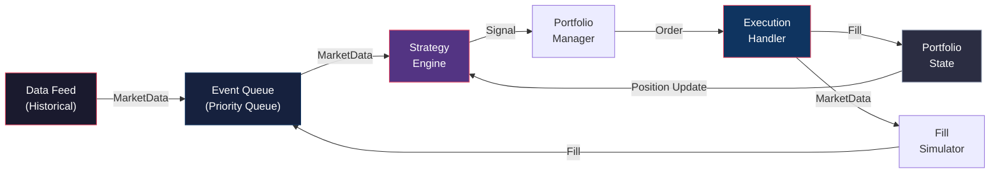
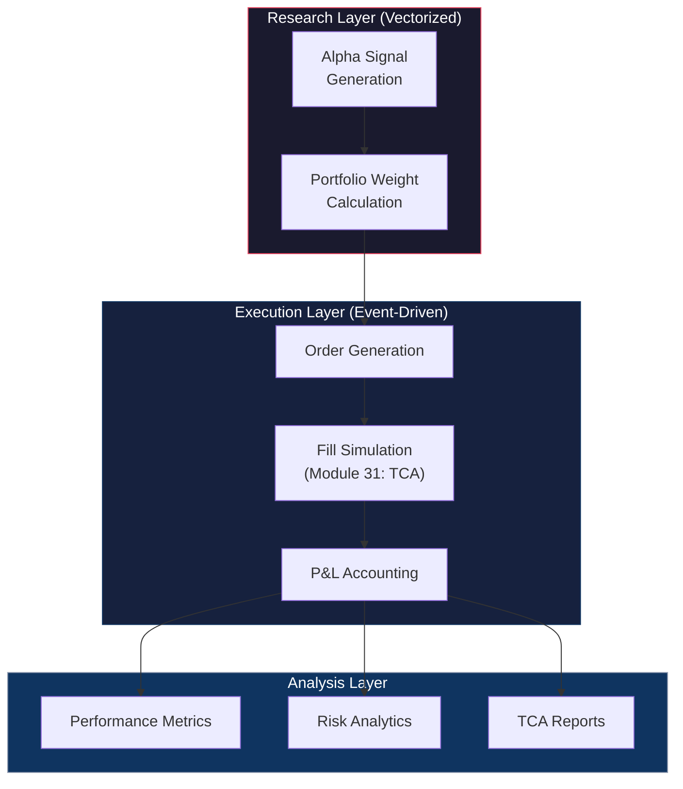
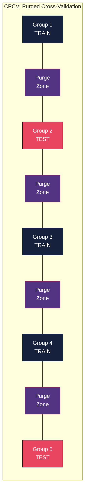
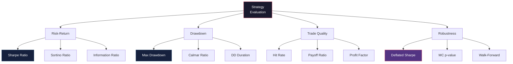
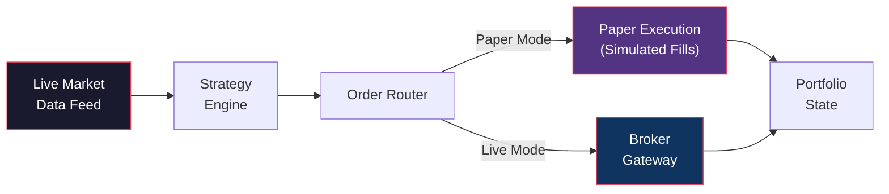
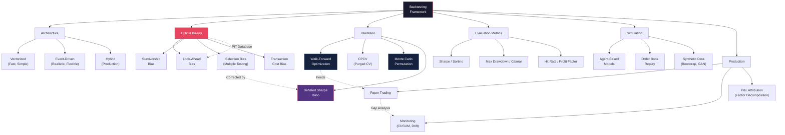

# Module 32: Backtesting Frameworks & Simulation

> **Prerequisites:** Module 09 (Time Series Foundations), Module 24 (Portfolio Optimization), Module 31 (TCA & Optimal Execution)
> **Builds Toward:** Module 33 (Strategy Risk Management), Module 34 (Live Trading Infrastructure)
> **Estimated Length:** ~8,500 words

---

## Table of Contents

1. [Backtesting Architectures](#1-backtesting-architectures)
2. [Critical Biases](#2-critical-biases)
3. [Point-in-Time Databases](#3-point-in-time-databases)
4. [Walk-Forward Optimization](#4-walk-forward-optimization)
5. [Monte Carlo Permutation Tests](#5-monte-carlo-permutation-tests)
6. [Deflated Sharpe Ratio](#6-deflated-sharpe-ratio)
7. [Strategy Evaluation Metrics](#7-strategy-evaluation-metrics)
8. [Simulation Techniques](#8-simulation-techniques)
9. [Paper Trading](#9-paper-trading)
10. [Production Monitoring](#10-production-monitoring)
11. [Python Implementations](#11-python-implementations)
12. [C++ High-Performance Event Backtester](#12-c-high-performance-event-backtester)
13. [Exercises](#13-exercises)
14. [Summary & Concept Map](#14-summary--concept-map)

---

## 1. Backtesting Architectures

A backtesting framework replays historical data to simulate strategy performance. The architecture fundamentally determines the tradeoff between computational speed, simulation realism, and development complexity. Two paradigms dominate: **vectorized** and **event-driven**.

### 1.1 Vectorized Backtesting

Vectorized backtesting operates on entire arrays of historical data simultaneously, exploiting NumPy/Pandas operations for speed. The strategy logic is expressed as matrix operations on price/signal matrices.

**Workflow:**
1. Load all historical prices into a matrix $\mathbf{P} \in \mathbb{R}^{T \times N}$ (T timestamps, N assets)
2. Compute signal matrix $\mathbf{S} = f(\mathbf{P})$ using vectorized operations
3. Compute position matrix $\mathbf{W} = g(\mathbf{S})$ (portfolio weights over time)
4. Compute returns: $\mathbf{r}_{\text{strat}} = \sum_{i} W_{t,i} \cdot r_{t+1,i}$ via element-wise multiplication and summation
5. Apply transaction cost model: $\mathbf{r}_{\text{net}} = \mathbf{r}_{\text{strat}} - c \cdot |\Delta \mathbf{W}|$

**Advantages:** 100--1000x faster than event-driven for simple strategies; trivial to parallelize across assets; minimal boilerplate code.

**Disadvantages:** Difficult to model realistic execution (partial fills, queue priority, latency); look-ahead bias is easy to introduce accidentally (Pandas alignment); cannot model portfolio-level constraints that depend on intra-bar state; poor fit for strategies with path-dependent logic (stop-losses, dynamic hedging).

### 1.2 Event-Driven Backtesting

Event-driven architectures process data sequentially, one event at a time, mimicking the actual information flow in live trading.

**Core event types:**

| Event | Description | Handler |
|-------|-------------|---------|
| `MarketData` | New bar, tick, or quote arrives | Strategy receives data, generates signals |
| `Signal` | Strategy produces a trading signal | Portfolio manager evaluates position sizing |
| `Order` | Order submitted to execution | Execution handler routes and simulates fills |
| `Fill` | Order is (partially) filled | Portfolio updates positions, P&L |
| `Timer` | Scheduled callback (e.g., rebalance) | Strategy-specific logic |



**Advantages:** Realistic simulation of execution mechanics (slippage, partial fills, latency modeling); natural separation of concerns; same code can run in backtest and live modes (modular data feed); complex order types (bracket, OCO, iceberg) are straightforward.

**Disadvantages:** 100--1000x slower than vectorized; more complex to implement; Python overhead for tight loops (C++ typically needed for tick-level simulation).

### 1.3 Hybrid Architecture

Production-grade systems often use a hybrid: **vectorized signal generation** (fast alpha research) feeding into an **event-driven execution simulator** (realistic cost modeling). This gives the best of both worlds:



---

## 2. Critical Biases

Backtesting is an exercise in *counterfactual reasoning*: "What would have happened if we had traded this strategy?" Every deviation from reality introduces bias. The four most dangerous biases, in order of severity, are:

### 2.1 Look-Ahead Bias

**Definition:** Using information at time $t$ that was not actually available until time $t + \Delta t$.

**Common causes:**
- Using revised/restated financial data instead of as-originally-reported
- Pandas `fillna(method='bfill')` back-filling NaN values with future data
- Computing signals on the full dataset (e.g., z-scoring with full-sample mean)
- Using close prices for signals that would have been computed before the close
- Corporate action adjustments applied retroactively

**Detection methods:**
1. **Lag test:** Introduce an artificial 1-day lag to all data. If performance collapses, look-ahead bias is likely present.
2. **Marginal information test:** Compare strategy performance using data available at time $t$ vs. using information from $t+1$. The difference attributable to future data should be zero.
3. **Timestamp audit:** Log every data access with its as-of timestamp. Verify no signal computation accesses data with timestamp > signal timestamp.

### 2.2 Survivorship Bias

**Definition:** Backtesting only on assets that survived to the present, excluding delisted, bankrupt, or merged companies.

**Magnitude:** Survivorship bias inflates annual equity returns by approximately 1--2% per year in U.S. equities (Elton, Gruber, Blake 1996). For small-cap and distressed strategies, the effect can be 3--5% annually.

**Mitigation:**
- Use **survivorship-bias-free databases** that include delisted securities with their full price history up to delisting
- Reconstruct the tradeable universe **as of each rebalance date** using point-in-time membership data (e.g., which stocks were in the S&P 500 on January 15, 2015?)
- Model delisting returns explicitly: assign a terminal return at delisting (typically -30% for involuntary delistings, 0% for mergers at last price)

### 2.3 Selection Bias (Multiple Testing)

**Definition:** The bias introduced by testing many strategies and reporting only the best-performing one. If you test $K$ strategies, the best one will appear to have skill even if all are random.

Under the null hypothesis (all strategies have zero alpha), the expected maximum Sharpe ratio among $K$ independent strategies is approximately:

$$
E\left[\max_{k=1}^{K} \hat{SR}_k\right] \approx \sqrt{2 \ln K} \cdot \left(1 - \frac{\gamma_{\text{EM}}}{2\ln K}\right)
$$

where $\gamma_{\text{EM}} \approx 0.5772$ is the Euler-Mascheroni constant. For $K = 1000$ trials:

$$
E[\max \hat{SR}] \approx \sqrt{2 \ln 1000} \approx 3.72
$$

This means a Sharpe ratio of 3.7 is *expected by chance* if you test 1000 strategies. The **Deflated Sharpe Ratio** (Section 6) formally adjusts for this.

### 2.4 Transaction Cost Bias

**Definition:** Assuming unrealistically favorable execution (no slippage, unlimited liquidity, zero market impact).

**Common manifestations:**
- Trading at the closing price without spread cost
- Ignoring market impact for large positions (Module 31 square-root law)
- Assuming unlimited short availability
- Ignoring borrow costs for short positions
- Not modeling partial fills or rejected orders

**Correction:** Apply the full TCA framework from Module 31. At minimum, include half-spread costs and a participation-rate-dependent impact model. For strategies trading more than 1% of daily volume, market impact typically exceeds all other costs combined.

---

## 3. Point-in-Time Databases

A **point-in-time (PIT) database** stores data exactly as it was known at each historical moment, preserving the original publication dates and values before any subsequent revisions.

### 3.1 As-Reported vs. Restated Data

Fundamental data (earnings, revenue, balance sheet items) is frequently restated after initial publication. The difference matters enormously:

| Metric | As-Reported EPS | Restated EPS | Difference |
|--------|-----------------|--------------|------------|
| Q1 2024 (reported Apr 15) | \$2.15 | \$2.15 | 0% |
| Q1 2024 (restated Jul 30) | \$2.15 | \$2.08 | -3.3% |
| Q1 2024 (annual restatement) | \$2.15 | \$1.97 | -8.4% |

Using restated data in a backtest implicitly gives the strategy access to future corrections, inflating apparent returns for value/quality strategies by 50--200 basis points annually (Piotroski & So, 2012).

### 3.2 Vintage-Based Storage

A PIT database uses **vintage-based storage**: each fact is stored with its *knowledge date* (when it was first available) and *effective date* (the period it describes).

$$
\text{PIT}(x, t_{\text{query}}) = \text{latest}(\{v : (v, t_{\text{known}}) \in \text{DB}(x) \text{ and } t_{\text{known}} \leq t_{\text{query}}\})
$$

This function returns the most recent value of variable $x$ that was *known* as of query time $t_{\text{query}}$. Implementation typically uses a bitemporal schema with two time axes:

```text
Table: fundamental_data
| symbol | metric     | period  | value | known_date | superseded_date |
|--------|------------|---------|-------|------------|-----------------|
| AAPL   | EPS        | Q1-2024 | 2.15  | 2024-04-15 | 2024-07-30      |
| AAPL   | EPS        | Q1-2024 | 2.08  | 2024-07-30 | NULL            |
```

Querying as of 2024-05-01 returns EPS = 2.15; querying as of 2024-08-01 returns EPS = 2.08.

---

## 4. Walk-Forward Optimization

**Walk-forward optimization (WFO)** is the standard methodology for out-of-sample strategy validation. It prevents overfitting by ensuring that parameter selection always uses only past data.

### 4.1 Expanding Window

The training window grows over time while the test window advances:

$$
\text{Train}_k = [t_0, t_0 + k \cdot \Delta], \quad \text{Test}_k = [t_0 + k\Delta, t_0 + (k+1)\Delta]
$$

for $k = 1, 2, \ldots, K$. The training set expands with each fold, incorporating all available history. This mimics the actual information accumulation of a live strategy.

### 4.2 Rolling Window

A fixed-length training window slides forward:

$$
\text{Train}_k = [t_0 + (k-1)\Delta, t_0 + (k-1)\Delta + W], \quad \text{Test}_k = [t_0 + (k-1)\Delta + W, t_0 + k\Delta + W]
$$

where $W$ is the fixed training window length. This is appropriate when the data-generating process is non-stationary and older data is less relevant (regime changes).

### 4.3 Anchored Walk-Forward

A hybrid: the training window expands but has a minimum length. The anchor point is fixed, but the model is re-estimated at each step with all data from the anchor to the current point. This balances the desire for more data (expanding) with the risk of stale regimes (rolling).

### 4.4 Combinatorial Purged Cross-Validation (CPCV)

Standard k-fold cross-validation is invalid for time series because train-test contamination occurs at fold boundaries (autocorrelated features leak information). **CPCV** (de Prado, 2018) addresses this:

1. Divide the dataset into $N$ groups
2. For each combination of $N - k$ training groups and $k$ test groups (there are $\binom{N}{k}$ such combinations):
   a. **Purge:** Remove training observations within an embargo window of any test observation
   b. **Embargo:** After purging, further remove a buffer of $h$ observations after each test boundary
3. Test on the $k$ held-out groups
4. Aggregate results across all $\binom{N}{k}$ combinations

The purge width should equal the maximum label horizon (e.g., if signals predict 5-day returns, purge 5 days on each side of the train-test boundary).



---

## 5. Monte Carlo Permutation Tests

To assess whether a strategy's performance is genuinely attributable to the signal rather than luck, we use **permutation tests**. The key insight is that under the null hypothesis of no signal, the *mapping* from signals to returns is arbitrary.

### 5.1 Methodology: Shuffle Signals, Not Returns

**Critical distinction:** We shuffle the *signal-return mapping*, not the return series itself. Shuffling returns destroys the autocorrelation and volatility clustering structure of the data, generating an unrealistically easy null. Instead:

1. Compute the strategy's original performance metric $\hat{M}$ (e.g., Sharpe ratio)
2. For $b = 1, \ldots, B$ permutations:
   a. Randomly permute the signal vector $\mathbf{s}$ across time (breaking the signal-return link)
   b. Compute the strategy's performance $M_b$ using the permuted signals with the *original* return series
3. The **permutation p-value** is:

$$
p = \frac{1 + \#\{b : M_b \geq \hat{M}\}}{1 + B}
$$

The "+1" in numerator and denominator is the standard finite-sample correction ensuring the p-value is never exactly zero.

### 5.2 Sharpe Ratio p-Value Under the Null

Under the null hypothesis of zero expected return, the Sharpe ratio of a strategy with $T$ observations has the asymptotic distribution (Lo, 2002):

$$
\hat{SR} \sim \mathcal{N}\left(0, \frac{1}{T}\left(1 + \frac{\hat{\mu}_3}{\hat{\mu}_2^{3/2}}\hat{SR} + \frac{\hat{\mu}_4 - 1}{4\hat{\mu}_2^2}\hat{SR}^2\right)\right)
$$

where $\hat{\mu}_3$ and $\hat{\mu}_4$ are the sample skewness and kurtosis. For an i.i.d. return series, this simplifies to $\text{Var}[\hat{SR}] \approx (1 + \hat{SR}^2/2)/T$. The permutation test provides a non-parametric alternative that is robust to any return distribution.

### 5.3 Block Permutation for Dependent Data

When signals have serial correlation, simple permutation destroys this structure. **Block permutation** (or circular block bootstrap) preserves local signal autocorrelation:

1. Choose block length $l$ (e.g., using the automatic bandwidth selector of Politis & White)
2. Divide the signal series into $\lceil T/l \rceil$ non-overlapping blocks
3. Randomly permute the blocks (or sample with replacement for bootstrap)
4. Concatenate to form the permuted signal series

---

## 6. Deflated Sharpe Ratio

The **Deflated Sharpe Ratio (DSR)** of Bailey and Lopez de Prado (2014) adjusts a strategy's Sharpe ratio for the number of trials conducted during the research process.

### 6.1 Derivation

Suppose we have tested $K$ strategies (including all variations, parameter sweeps, and discarded ideas). The observed maximum Sharpe ratio $\hat{SR}_{\max}$ is biased upward. Under the null that all $K$ strategies have true $SR = 0$:

$$
E\left[\hat{SR}_{\max}\right] \approx SR_0 = \sqrt{V[\hat{SR}]} \cdot \left((1 - \gamma_{\text{EM}}) \cdot \Phi^{-1}\left(1 - \frac{1}{K}\right) + \gamma_{\text{EM}} \cdot \Phi^{-1}\left(1 - \frac{1}{K \cdot e}\right)\right)
$$

where $\gamma_{\text{EM}} \approx 0.5772$ and $V[\hat{SR}]$ is the variance of the Sharpe ratio estimator.

A simpler and widely-used approximation, which follows from extreme value theory applied to the maximum of $K$ standard normals:

$$
E[\hat{SR}_{\max}] \approx SR_0 \approx \sqrt{V[\hat{SR}]} \cdot \left(\sqrt{2\ln K} - \frac{\ln(\pi) + \ln(\ln K)}{2\sqrt{2\ln K}}\right)
$$

The **DSR** is the probability that the observed $\hat{SR}$ exceeds $SR_0$, i.e., the probability that the strategy's performance is not explained by selection bias:

$$
\boxed{DSR = \Phi\left(\frac{(\hat{SR} - SR_0)\sqrt{T-1}}{\sqrt{1 - \hat{\gamma}_3 \cdot \hat{SR} + \frac{\hat{\gamma}_4 - 1}{4}\hat{SR}^2}}\right)}
$$

where:
- $\hat{SR}$ = observed annualized Sharpe ratio of the selected strategy
- $SR_0$ = expected maximum Sharpe under the null (depends on $K$)
- $T$ = number of return observations
- $\hat{\gamma}_3$ = skewness of strategy returns
- $\hat{\gamma}_4$ = kurtosis of strategy returns

### 6.2 Interpretation

| DSR | Interpretation |
|-----|----------------|
| > 95% | Strong evidence of genuine skill after accounting for multiple testing |
| 80--95% | Moderate evidence; consider out-of-sample validation |
| 50--80% | Weak evidence; likely a false positive from extensive search |
| < 50% | Performance fully explained by selection bias |

### 6.3 Practical Application

The key challenge is estimating $K$---the *total* number of trials, including:
- Explicit parameter combinations tested
- Informal "eyeball" tests (looking at data and adjusting)
- Strategies tested by team members working on the same dataset
- Related strategies in published literature

A conservative rule: if you spent $D$ days researching, $K \approx D \times 10$ (assuming ~10 variations per day).

---

## 7. Strategy Evaluation Metrics

A comprehensive evaluation requires multiple metrics capturing different aspects of risk-adjusted performance. No single metric is sufficient.

### 7.1 Core Risk-Return Metrics

**Sharpe Ratio:**
$$
SR = \frac{E[r_p - r_f]}{\sigma(r_p - r_f)} \approx \frac{\bar{r} - r_f}{\hat{\sigma}}
$$

Annualization: $SR_{\text{annual}} = SR_{\text{daily}} \times \sqrt{252}$. Assumes return stationarity and normality (both typically violated).

**Sortino Ratio:**
$$
\text{Sortino} = \frac{\bar{r} - r_f}{\sigma_{\text{down}}}, \quad \sigma_{\text{down}} = \sqrt{\frac{1}{T}\sum_{t: r_t < r_f}(r_t - r_f)^2}
$$

Uses only downside volatility, appropriate for strategies with asymmetric return distributions.

**Calmar Ratio:**
$$
\text{Calmar} = \frac{\text{CAGR}}{\text{Max Drawdown}}
$$

Penalizes severe drawdowns. Highly sensitive to the single worst drawdown event.

**Information Ratio:**
$$
IR = \frac{E[r_p - r_b]}{\sigma(r_p - r_b)}
$$

Measures excess return per unit of tracking error relative to a benchmark $r_b$.

### 7.2 Drawdown Metrics

**Maximum Drawdown:**
$$
\text{MDD} = \max_{t \in [0,T]} \left[\max_{s \in [0,t]} P_s - P_t\right] / \max_{s \in [0,t]} P_s
$$

**Average Drawdown:** Mean of all peak-to-trough drawdowns, less sensitive to a single extreme event.

**Drawdown Duration:** Time from peak to recovery. Long durations (even with small magnitude) are psychologically devastating and trigger investor redemptions.

### 7.3 Trade-Level Metrics

| Metric | Formula | Good Value |
|--------|---------|------------|
| **Hit Rate** | $\text{Wins} / \text{Total Trades}$ | > 50% (for mean-reversion); > 35% (for trend) |
| **Payoff Ratio** | $\text{Avg Win} / \text{Avg Loss}$ | > 1.5 (trend); > 0.8 (mean-reversion) |
| **Profit Factor** | $\text{Gross Profit} / \text{Gross Loss}$ | > 1.5 |
| **Tail Ratio** | $\text{P95 of returns} / \|P5\text{ of returns}\|$ | > 1.0 (right-skewed P&L) |
| **Win/Loss Streak** | Max consecutive wins/losses | Context-dependent |

### 7.4 The Metrics Constellation

No single metric captures strategy quality. The following constellation provides a comprehensive view:



---

## 8. Simulation Techniques

When historical data is insufficient (limited history, rare events, new markets), simulation generates synthetic environments for strategy testing.

### 8.1 Agent-Based Market Simulators

Agent-based models (ABMs) populate a simulated market with heterogeneous agents:

- **Fundamentalists:** Trade toward perceived fair value, mean-revert prices
- **Trend followers:** Buy recent winners, amplify momentum
- **Market makers:** Post limit orders around fair value, earn spread
- **Noise traders:** Random order flow, provide liquidity
- **Institutional executors:** Large block orders with impact (Module 31)

The emergent price dynamics exhibit realistic features: fat tails, volatility clustering, long memory in absolute returns, and flash crashes. ABMs are particularly useful for testing execution algorithms (Module 31) against realistic order flow.

### 8.2 Order Book Replay

**Order book replay** feeds historical L3 (order-by-order) data through a matching engine simulator:

1. Reconstruct the full order book state at each message
2. Insert the strategy's orders into the book alongside historical orders
3. Apply matching rules (price-time priority, pro-rata) to determine fills
4. Handle the **counterfactual problem**: the strategy's orders would have changed the book state, affecting subsequent fills

**Realistic fill modeling considerations:**
- **Queue position:** A limit order placed now enters at the back of the queue. It is not filled until all preceding orders at the same price are filled (or cancelled).
- **Adverse selection:** Limit orders that fill quickly tend to be adversely selected (the market moved through your price).
- **Latency:** Account for network latency between signal generation and order receipt at the exchange.

### 8.3 Synthetic Data Generation

**Block Bootstrap:** Sample contiguous blocks of length $l$ from historical returns with replacement. Preserves local autocorrelation and volatility clustering while generating novel sequences.

Given historical returns $\{r_1, \ldots, r_T\}$ and block length $l$:

$$
r^*_{(b-1)l+j} = r_{I_b + j - 1}, \quad j = 1, \ldots, l, \quad b = 1, \ldots, \lceil T'/l \rceil
$$

where $I_b$ are i.i.d. uniform on $\{1, \ldots, T - l + 1\}$.

**Stationary Bootstrap** (Politis & Romano): Use random block lengths drawn from $\text{Geom}(p)$ with $E[l] = 1/p$. This produces stationary synthetic series.

**GAN-Based Synthetic Data:** Generative Adversarial Networks can learn the full joint distribution of multi-asset returns, including non-linear dependencies, fat tails, and cross-asset structure. The generator $G(z; \theta_G)$ maps noise $z \sim \mathcal{N}(0, I)$ to synthetic return vectors. The discriminator $D(r; \theta_D)$ distinguishes real from synthetic. Training follows the minimax objective:

$$
\min_{\theta_G}\max_{\theta_D} \; E_{r \sim p_{\text{data}}}[\log D(r)] + E_{z \sim p_z}[\log(1 - D(G(z)))]
$$

Conditional GANs (cGANs) can generate returns conditioned on regime labels, volatility states, or macro variables.

---

## 9. Paper Trading

**Paper trading** (or simulated live trading) bridges the gap between backtest and production. The strategy runs in real-time against live market data, but orders are simulated rather than sent to exchanges.

### 9.1 Architecture

The paper trading system uses the same code path as production, with a simulated execution handler replacing the real broker connection:



### 9.2 Sources of Backtest-to-Live Gap

Even with careful backtesting and paper trading, a **performance gap** exists between backtest and live trading:

| Source | Typical Impact | Mitigation |
|--------|---------------|------------|
| **Data quality** | 50--200 bps | Use production-grade data in backtest |
| **Execution slippage** | 20--100 bps | Module 31 TCA integration |
| **Market impact** | 10--500 bps | Square-root impact model, participation caps |
| **Infrastructure latency** | 1--50 bps (HFT); <5 bps (daily) | Co-location, FPGA (for HFT only) |
| **Overfitting** | 100--500 bps | WFO, DSR, permutation tests |
| **Regime change** | 0--1000+ bps | Regime detection, adaptive parameters |

**Rule of thumb:** Expect live performance to be 30--50% of backtested performance for a well-constructed backtest, and 10--20% of a naive backtest.

---

## 10. Production Monitoring

Once a strategy is live, continuous monitoring detects performance degradation, regime changes, and operational issues.

### 10.1 Strategy Drift Detection

**CUSUM (Cumulative Sum) test:** Detects changes in the mean of strategy returns. Under the null hypothesis of constant expected return $\mu_0$:

$$
S_t = \max\left(0, S_{t-1} + (r_t - \mu_0 - \delta)\right)
$$

Signal an alarm when $S_t > h$ (threshold). The parameter $\delta$ controls sensitivity (smaller $\delta$ detects smaller shifts but with more false positives). The ARL (Average Run Length) before false alarm is:

$$
\text{ARL}_0 \approx \frac{e^{2h\delta/\sigma^2}}{2h\delta/\sigma^2}
$$

### 10.2 Regime Change Alerts

Monitor rolling statistics and trigger alerts when they breach thresholds:

- **Rolling Sharpe** (60-day) falls below 0 for 20+ consecutive days
- **Rolling volatility** exceeds 2x historical average (risk regime shift)
- **Correlation breakdown:** Rolling correlation between strategy and its primary factor exposure deviates by > 2 standard deviations
- **Drawdown alerts:** Current drawdown exceeds historical 95th percentile

### 10.3 P&L Attribution (Factor-Based Decomposition)

Factor-based P&L attribution decomposes realized returns into systematic and idiosyncratic components:

$$
r_{p,t} = \alpha + \sum_{k=1}^{K}\beta_k f_{k,t} + \varepsilon_t
$$

where $f_{k,t}$ are factor returns (market, size, value, momentum, volatility, etc.) and $\beta_k$ are the strategy's factor exposures. The decomposition:

| Component | Formula | Interpretation |
|-----------|---------|---------------|
| **Factor return** | $\sum_k \hat{\beta}_k f_{k,t}$ | Return explained by systematic exposures |
| **Alpha** | $\hat{\alpha}$ | Return unexplained by factors (true skill) |
| **Residual** | $\hat{\varepsilon}_t$ | Idiosyncratic return (noise + timing) |
| **Interaction** | $\sum_k (\beta_{k,t} - \hat{\beta}_k) f_{k,t}$ | Return from dynamic factor timing |

A well-designed alpha strategy should have: positive $\hat{\alpha}$, low $|\hat{\beta}_k|$ (market-neutral), and stable factor loadings over time.

---

## 11. Python Implementations

### 11.1 Vectorized Backtester

```python
"""
High-performance vectorized backtesting engine.
Processes entire signal and return matrices using NumPy operations.
"""

import numpy as np
import pandas as pd
from dataclasses import dataclass, field
from typing import Optional, Dict, Callable


@dataclass
class BacktestConfig:
    """Configuration for the vectorized backtester."""
    initial_capital: float = 1_000_000.0
    commission_bps: float = 1.0           # One-way commission in basis points
    slippage_bps: float = 2.0             # One-way slippage in basis points
    max_leverage: float = 2.0             # Maximum gross leverage
    rebalance_frequency: str = 'daily'    # 'daily', 'weekly', 'monthly'


@dataclass
class BacktestResult:
    """Results container for a backtest run."""
    returns: pd.Series = field(default_factory=pd.Series)
    positions: pd.DataFrame = field(default_factory=pd.DataFrame)
    turnover: pd.Series = field(default_factory=pd.Series)
    costs: pd.Series = field(default_factory=pd.Series)
    equity_curve: pd.Series = field(default_factory=pd.Series)
    metrics: Dict[str, float] = field(default_factory=dict)


class VectorizedBacktester:
    """
    Vectorized backtesting engine operating on signal and return matrices.

    Usage:
        bt = VectorizedBacktester(config)
        result = bt.run(prices, signal_func)
    """

    def __init__(self, config: BacktestConfig):
        self.config = config

    def run(
        self,
        prices: pd.DataFrame,
        signal_func: Callable[[pd.DataFrame], pd.DataFrame],
        weight_func: Optional[Callable[[pd.DataFrame], pd.DataFrame]] = None,
    ) -> BacktestResult:
        """
        Execute a vectorized backtest.

        Args:
            prices: DataFrame of asset prices (index=dates, columns=tickers).
            signal_func: Function mapping prices -> raw signals DataFrame.
            weight_func: Optional function mapping signals -> portfolio weights.
                         Defaults to equal-weight long/short.

        Returns:
            BacktestResult with full performance analytics.
        """
        returns = prices.pct_change().dropna()
        signals = signal_func(prices).reindex(returns.index)

        if weight_func is None:
            weights = self._default_weight_func(signals)
        else:
            weights = weight_func(signals)

        # Apply leverage constraint
        gross_leverage = weights.abs().sum(axis=1)
        scale = np.minimum(1.0, self.config.max_leverage / gross_leverage)
        weights = weights.multiply(scale, axis=0)

        # Shift weights by 1 day to avoid look-ahead bias
        weights_lagged = weights.shift(1).dropna()
        returns_aligned = returns.loc[weights_lagged.index]

        # Compute turnover and transaction costs
        turnover = weights_lagged.diff().abs().sum(axis=1)
        cost_per_period = turnover * (
            self.config.commission_bps + self.config.slippage_bps
        ) / 1e4

        # Portfolio returns (gross and net)
        gross_returns = (weights_lagged * returns_aligned).sum(axis=1)
        net_returns = gross_returns - cost_per_period

        # Equity curve
        equity = (1 + net_returns).cumprod() * self.config.initial_capital

        # Compute metrics
        metrics = self._compute_metrics(net_returns, equity)

        return BacktestResult(
            returns=net_returns,
            positions=weights_lagged,
            turnover=turnover,
            costs=cost_per_period,
            equity_curve=equity,
            metrics=metrics,
        )

    def _default_weight_func(self, signals: pd.DataFrame) -> pd.DataFrame:
        """Cross-sectional z-score -> equal-weight long/short."""
        z = signals.sub(signals.mean(axis=1), axis=0).div(
            signals.std(axis=1) + 1e-10, axis=0
        )
        # Long top quintile, short bottom quintile
        weights = z.copy()
        for idx in weights.index:
            row = weights.loc[idx].dropna()
            if len(row) < 5:
                weights.loc[idx] = 0
                continue
            q80, q20 = row.quantile(0.8), row.quantile(0.2)
            long_mask = row >= q80
            short_mask = row <= q20
            n_long = long_mask.sum()
            n_short = short_mask.sum()
            weights.loc[idx] = 0.0
            if n_long > 0:
                weights.loc[idx, long_mask.index[long_mask]] = 1.0 / n_long
            if n_short > 0:
                weights.loc[idx, short_mask.index[short_mask]] = -1.0 / n_short
        return weights

    def _compute_metrics(
        self, returns: pd.Series, equity: pd.Series
    ) -> Dict[str, float]:
        """Compute comprehensive strategy evaluation metrics."""
        ann_factor = 252
        r = returns.values
        mu = np.mean(r) * ann_factor
        sigma = np.std(r, ddof=1) * np.sqrt(ann_factor)

        # Sharpe
        sharpe = mu / sigma if sigma > 0 else 0.0

        # Sortino
        downside = r[r < 0]
        down_vol = np.std(downside, ddof=1) * np.sqrt(ann_factor) if len(downside) > 1 else 1e-10
        sortino = mu / down_vol

        # Max drawdown
        cum_ret = np.cumprod(1 + r)
        running_max = np.maximum.accumulate(cum_ret)
        drawdowns = (cum_ret - running_max) / running_max
        max_dd = np.min(drawdowns)

        # Calmar
        years = len(r) / ann_factor
        cagr = (equity.iloc[-1] / equity.iloc[0]) ** (1.0 / years) - 1 if years > 0 else 0
        calmar = cagr / abs(max_dd) if abs(max_dd) > 1e-10 else 0.0

        # Tail ratio
        p95 = np.percentile(r, 95)
        p05 = np.percentile(r, 5)
        tail_ratio = abs(p95 / p05) if abs(p05) > 1e-10 else np.inf

        # Profit factor
        gains = np.sum(r[r > 0])
        losses = abs(np.sum(r[r < 0]))
        profit_factor = gains / losses if losses > 1e-10 else np.inf

        # Hit rate
        hit_rate = np.mean(r > 0)

        return {
            'annual_return': mu,
            'annual_volatility': sigma,
            'sharpe_ratio': sharpe,
            'sortino_ratio': sortino,
            'calmar_ratio': calmar,
            'max_drawdown': max_dd,
            'tail_ratio': tail_ratio,
            'profit_factor': profit_factor,
            'hit_rate': hit_rate,
            'cagr': cagr,
            'total_return': float(equity.iloc[-1] / equity.iloc[0] - 1),
        }
```

### 11.2 Event-Driven Backtester

```python
"""
Event-driven backtesting engine with realistic execution simulation.
"""

import numpy as np
from abc import ABC, abstractmethod
from dataclasses import dataclass, field
from typing import List, Dict, Optional
from enum import Enum
from collections import deque
import heapq


class EventType(Enum):
    MARKET_DATA = 1
    SIGNAL = 2
    ORDER = 3
    FILL = 4
    TIMER = 5


@dataclass(order=True)
class Event:
    """Base event with priority ordering by timestamp."""
    timestamp: float
    event_type: EventType = field(compare=False)
    data: dict = field(default_factory=dict, compare=False)


class EventQueue:
    """Priority queue for events, ordered by timestamp."""

    def __init__(self):
        self._queue: List[Event] = []

    def push(self, event: Event) -> None:
        heapq.heappush(self._queue, event)

    def pop(self) -> Event:
        return heapq.heappop(self._queue)

    def is_empty(self) -> bool:
        return len(self._queue) == 0


@dataclass
class Order:
    symbol: str
    quantity: float     # Positive = buy, negative = sell
    order_type: str     # 'market', 'limit'
    limit_price: Optional[float] = None
    timestamp: float = 0.0


@dataclass
class Fill:
    symbol: str
    quantity: float
    price: float
    commission: float
    timestamp: float


class Strategy(ABC):
    """Abstract base class for trading strategies."""

    @abstractmethod
    def on_market_data(self, event: Event) -> List[Order]:
        """Process market data and return orders."""
        ...

    @abstractmethod
    def on_fill(self, fill: Fill) -> None:
        """Process a fill notification."""
        ...


class ExecutionSimulator:
    """Simulate order execution with realistic slippage and market impact."""

    def __init__(
        self,
        slippage_bps: float = 2.0,
        commission_per_share: float = 0.005,
        impact_eta: float = 0.1,
    ):
        self.slippage_bps = slippage_bps
        self.commission_per_share = commission_per_share
        self.impact_eta = impact_eta

    def simulate_fill(
        self,
        order: Order,
        market_price: float,
        market_volume: float,
    ) -> Optional[Fill]:
        """
        Simulate a fill for an order given current market conditions.

        Returns None if the order cannot be filled (e.g., limit not met).
        """
        if order.order_type == 'limit' and order.limit_price is not None:
            if order.quantity > 0 and market_price > order.limit_price:
                return None  # Buy limit not met
            if order.quantity < 0 and market_price < order.limit_price:
                return None  # Sell limit not met

        # Market impact (square-root model)
        participation = abs(order.quantity) / max(market_volume, 1)
        impact = self.impact_eta * np.sqrt(participation) * market_price

        # Slippage
        slippage = self.slippage_bps / 1e4 * market_price

        # Fill price
        sign = 1 if order.quantity > 0 else -1
        fill_price = market_price + sign * (impact + slippage)

        commission = abs(order.quantity) * self.commission_per_share

        return Fill(
            symbol=order.symbol,
            quantity=order.quantity,
            price=fill_price,
            commission=commission,
            timestamp=order.timestamp,
        )


class EventDrivenBacktester:
    """
    Full event-driven backtesting engine.

    Processes events sequentially through the event queue,
    dispatching to strategy, execution, and portfolio components.
    """

    def __init__(
        self,
        strategy: Strategy,
        execution_sim: ExecutionSimulator,
        initial_capital: float = 1_000_000.0,
    ):
        self.strategy = strategy
        self.execution_sim = execution_sim
        self.event_queue = EventQueue()
        self.capital = initial_capital
        self.positions: Dict[str, float] = {}
        self.portfolio_value_history: List[float] = []
        self.fill_history: List[Fill] = []
        self.cash = initial_capital

    def load_data(self, market_data: List[Dict]) -> None:
        """
        Load market data into the event queue.

        Args:
            market_data: List of dicts with keys:
                'timestamp', 'symbol', 'open', 'high', 'low',
                'close', 'volume'.
        """
        for bar in market_data:
            event = Event(
                timestamp=bar['timestamp'],
                event_type=EventType.MARKET_DATA,
                data=bar,
            )
            self.event_queue.push(event)

    def run(self) -> Dict[str, float]:
        """
        Execute the backtest by processing all events in order.

        Returns:
            Dictionary of performance metrics.
        """
        while not self.event_queue.is_empty():
            event = self.event_queue.pop()

            if event.event_type == EventType.MARKET_DATA:
                self._handle_market_data(event)
            elif event.event_type == EventType.FILL:
                fill = Fill(**event.data)
                self.strategy.on_fill(fill)

        return self._compute_results()

    def _handle_market_data(self, event: Event) -> None:
        """Process a market data event."""
        # Update portfolio value
        self._mark_to_market(event.data)

        # Strategy generates orders
        orders = self.strategy.on_market_data(event)

        # Process each order
        for order in orders:
            order.timestamp = event.timestamp
            fill = self.execution_sim.simulate_fill(
                order=order,
                market_price=event.data['close'],
                market_volume=event.data['volume'],
            )
            if fill is not None:
                self._process_fill(fill)
                self.fill_history.append(fill)
                # Push fill event for strategy notification
                self.event_queue.push(Event(
                    timestamp=fill.timestamp,
                    event_type=EventType.FILL,
                    data={
                        'symbol': fill.symbol,
                        'quantity': fill.quantity,
                        'price': fill.price,
                        'commission': fill.commission,
                        'timestamp': fill.timestamp,
                    },
                ))

    def _process_fill(self, fill: Fill) -> None:
        """Update portfolio state after a fill."""
        current = self.positions.get(fill.symbol, 0.0)
        self.positions[fill.symbol] = current + fill.quantity
        self.cash -= fill.quantity * fill.price + fill.commission

    def _mark_to_market(self, bar: Dict) -> None:
        """Compute current portfolio value."""
        symbol = bar['symbol']
        price = bar['close']
        pos_value = sum(
            qty * price for sym, qty in self.positions.items()
            if sym == symbol
        )
        total = self.cash + pos_value
        self.portfolio_value_history.append(total)

    def _compute_results(self) -> Dict[str, float]:
        """Compute final performance metrics."""
        if len(self.portfolio_value_history) < 2:
            return {}

        values = np.array(self.portfolio_value_history)
        returns = np.diff(values) / values[:-1]

        sharpe = (
            np.mean(returns) / np.std(returns, ddof=1) * np.sqrt(252)
            if np.std(returns) > 0 else 0.0
        )

        cum_max = np.maximum.accumulate(values)
        drawdowns = (values - cum_max) / cum_max
        max_dd = np.min(drawdowns)

        total_return = values[-1] / values[0] - 1

        return {
            'total_return': total_return,
            'sharpe_ratio': sharpe,
            'max_drawdown': max_dd,
            'n_fills': len(self.fill_history),
            'total_commission': sum(f.commission for f in self.fill_history),
        }
```

### 11.3 Walk-Forward Optimizer

```python
"""
Walk-forward optimization with expanding and rolling windows.
Supports combinatorial purged cross-validation (CPCV).
"""

import numpy as np
import pandas as pd
from typing import Callable, Dict, List, Tuple, Optional
from dataclasses import dataclass
from itertools import combinations


@dataclass
class WFOResult:
    """Result from a single walk-forward fold."""
    train_start: int
    train_end: int
    test_start: int
    test_end: int
    best_params: Dict
    in_sample_sharpe: float
    out_of_sample_sharpe: float
    out_of_sample_returns: np.ndarray


class WalkForwardOptimizer:
    """
    Walk-forward optimization with multiple windowing schemes
    and combinatorial purged cross-validation.
    """

    def __init__(
        self,
        returns: np.ndarray,
        strategy_func: Callable[[np.ndarray, Dict], np.ndarray],
        param_grid: List[Dict],
        objective: str = 'sharpe',
    ):
        """
        Args:
            returns: 1D array of asset returns.
            strategy_func: Function(returns, params) -> strategy_returns.
            param_grid: List of parameter dictionaries to search.
            objective: Optimization objective ('sharpe', 'sortino', 'calmar').
        """
        self.returns = returns
        self.strategy_func = strategy_func
        self.param_grid = param_grid
        self.objective = objective

    def _evaluate(self, returns: np.ndarray, params: Dict) -> float:
        """Evaluate strategy with given params on given returns."""
        strat_ret = self.strategy_func(returns, params)
        if len(strat_ret) < 2 or np.std(strat_ret) < 1e-12:
            return -np.inf

        if self.objective == 'sharpe':
            return np.mean(strat_ret) / np.std(strat_ret, ddof=1) * np.sqrt(252)
        elif self.objective == 'sortino':
            down = strat_ret[strat_ret < 0]
            down_vol = np.std(down, ddof=1) if len(down) > 1 else 1e-10
            return np.mean(strat_ret) / down_vol * np.sqrt(252)
        elif self.objective == 'calmar':
            cum = np.cumprod(1 + strat_ret)
            dd = (cum - np.maximum.accumulate(cum)) / np.maximum.accumulate(cum)
            mdd = abs(np.min(dd))
            ann_ret = np.mean(strat_ret) * 252
            return ann_ret / mdd if mdd > 1e-10 else 0.0
        else:
            raise ValueError(f"Unknown objective: {self.objective}")

    def expanding_window(
        self,
        min_train: int,
        test_size: int,
        step: int,
    ) -> List[WFOResult]:
        """
        Expanding-window walk-forward optimization.

        Args:
            min_train: Minimum training window size.
            test_size: Size of each test window.
            step: Step size between successive test windows.
        """
        T = len(self.returns)
        results = []

        train_start = 0
        test_start = min_train

        while test_start + test_size <= T:
            test_end = test_start + test_size
            train_data = self.returns[train_start:test_start]
            test_data = self.returns[test_start:test_end]

            # Find best parameters on training data
            best_score, best_params = -np.inf, self.param_grid[0]
            for params in self.param_grid:
                score = self._evaluate(train_data, params)
                if score > best_score:
                    best_score, best_params = score, params

            # Evaluate on test data
            oos_returns = self.strategy_func(test_data, best_params)
            oos_sharpe = (
                np.mean(oos_returns) / np.std(oos_returns, ddof=1) * np.sqrt(252)
                if np.std(oos_returns) > 1e-12 else 0.0
            )

            results.append(WFOResult(
                train_start=train_start,
                train_end=test_start,
                test_start=test_start,
                test_end=test_end,
                best_params=best_params,
                in_sample_sharpe=best_score,
                out_of_sample_sharpe=oos_sharpe,
                out_of_sample_returns=oos_returns,
            ))

            test_start += step

        return results

    def rolling_window(
        self,
        train_size: int,
        test_size: int,
        step: int,
    ) -> List[WFOResult]:
        """
        Rolling-window walk-forward optimization.

        Args:
            train_size: Fixed training window size.
            test_size: Size of each test window.
            step: Step size between successive test windows.
        """
        T = len(self.returns)
        results = []

        test_start = train_size

        while test_start + test_size <= T:
            train_start = test_start - train_size
            test_end = test_start + test_size
            train_data = self.returns[train_start:test_start]
            test_data = self.returns[test_start:test_end]

            best_score, best_params = -np.inf, self.param_grid[0]
            for params in self.param_grid:
                score = self._evaluate(train_data, params)
                if score > best_score:
                    best_score, best_params = score, params

            oos_returns = self.strategy_func(test_data, best_params)
            oos_sharpe = (
                np.mean(oos_returns) / np.std(oos_returns, ddof=1) * np.sqrt(252)
                if np.std(oos_returns) > 1e-12 else 0.0
            )

            results.append(WFOResult(
                train_start=train_start,
                train_end=test_start,
                test_start=test_start,
                test_end=test_end,
                best_params=best_params,
                in_sample_sharpe=best_score,
                out_of_sample_sharpe=oos_sharpe,
                out_of_sample_returns=oos_returns,
            ))

            test_start += step

        return results

    def cpcv(
        self,
        n_groups: int,
        k_test: int,
        purge_window: int,
        embargo_window: int = 0,
    ) -> List[WFOResult]:
        """
        Combinatorial Purged Cross-Validation.

        Args:
            n_groups: Number of groups to split data into.
            k_test: Number of groups used for testing in each fold.
            purge_window: Number of observations to purge at train-test boundaries.
            embargo_window: Additional buffer after purge zone.
        """
        T = len(self.returns)
        group_size = T // n_groups
        group_indices = [
            (i * group_size, min((i + 1) * group_size, T))
            for i in range(n_groups)
        ]

        results = []

        for test_groups in combinations(range(n_groups), k_test):
            test_set = set(test_groups)
            train_groups = [g for g in range(n_groups) if g not in test_set]

            # Build test indices
            test_idx = []
            for g in test_groups:
                start, end = group_indices[g]
                test_idx.extend(range(start, end))
            test_idx = sorted(test_idx)

            # Build train indices with purging and embargo
            train_idx = []
            test_boundaries = set()
            for g in test_groups:
                start, end = group_indices[g]
                for j in range(max(0, start - purge_window - embargo_window),
                               min(T, end + purge_window + embargo_window)):
                    test_boundaries.add(j)

            for g in train_groups:
                start, end = group_indices[g]
                for j in range(start, end):
                    if j not in test_boundaries:
                        train_idx.append(j)

            if len(train_idx) < 20 or len(test_idx) < 5:
                continue

            train_data = self.returns[train_idx]
            test_data = self.returns[test_idx]

            best_score, best_params = -np.inf, self.param_grid[0]
            for params in self.param_grid:
                score = self._evaluate(train_data, params)
                if score > best_score:
                    best_score, best_params = score, params

            oos_returns = self.strategy_func(test_data, best_params)
            oos_sharpe = (
                np.mean(oos_returns) / np.std(oos_returns, ddof=1) * np.sqrt(252)
                if np.std(oos_returns) > 1e-12 else 0.0
            )

            results.append(WFOResult(
                train_start=min(train_idx),
                train_end=max(train_idx),
                test_start=min(test_idx),
                test_end=max(test_idx),
                best_params=best_params,
                in_sample_sharpe=best_score,
                out_of_sample_sharpe=oos_sharpe,
                out_of_sample_returns=oos_returns,
            ))

        return results
```

### 11.4 Monte Carlo Significance Test

```python
"""
Monte Carlo permutation test for strategy significance.
Implements signal shuffling (not return shuffling) to preserve
the return distribution under the null hypothesis.
"""

import numpy as np
from typing import Tuple


class MonteCarloSignificanceTest:
    """
    Permutation test for strategy performance.
    Under H0: signals have no predictive power for returns.
    """

    def __init__(self, n_permutations: int = 10_000, seed: int = 42):
        self.n_permutations = n_permutations
        self.rng = np.random.RandomState(seed)

    def test_sharpe(
        self,
        signals: np.ndarray,
        returns: np.ndarray,
    ) -> Tuple[float, float, np.ndarray]:
        """
        Test whether the signal-return relationship produces a
        statistically significant Sharpe ratio.

        Method: permute the signal vector across time, breaking the
        signal-return mapping while preserving the marginal
        distributions of both signals and returns.

        Args:
            signals: 1D array of trading signals (same length as returns).
            returns: 1D array of asset returns.

        Returns:
            observed_sharpe: The strategy's actual Sharpe ratio.
            p_value: Permutation p-value (one-sided, upper tail).
            null_distribution: Array of Sharpe ratios under H0.
        """
        assert len(signals) == len(returns)
        T = len(signals)

        def sharpe_from_signal(sig, ret):
            # Simple long/short: positive signal -> long, negative -> short
            positions = np.sign(sig)
            strat_ret = positions * ret
            if np.std(strat_ret) < 1e-12:
                return 0.0
            return np.mean(strat_ret) / np.std(strat_ret, ddof=1) * np.sqrt(252)

        # Observed statistic
        observed_sharpe = sharpe_from_signal(signals, returns)

        # Permutation distribution
        null_distribution = np.zeros(self.n_permutations)
        for b in range(self.n_permutations):
            perm_idx = self.rng.permutation(T)
            perm_signals = signals[perm_idx]  # Shuffle signals, keep returns fixed
            null_distribution[b] = sharpe_from_signal(perm_signals, returns)

        # p-value (one-sided, with finite-sample correction)
        p_value = (1 + np.sum(null_distribution >= observed_sharpe)) / (
            1 + self.n_permutations
        )

        return observed_sharpe, p_value, null_distribution

    def block_permutation_test(
        self,
        signals: np.ndarray,
        returns: np.ndarray,
        block_length: int = 20,
    ) -> Tuple[float, float, np.ndarray]:
        """
        Block permutation test preserving local autocorrelation in signals.

        Args:
            signals: 1D signal array.
            returns: 1D return array.
            block_length: Length of contiguous blocks for permutation.
        """
        T = len(signals)
        n_blocks = T // block_length

        def sharpe_from_signal(sig, ret):
            positions = np.sign(sig)
            strat_ret = positions * ret
            if np.std(strat_ret) < 1e-12:
                return 0.0
            return np.mean(strat_ret) / np.std(strat_ret, ddof=1) * np.sqrt(252)

        observed = sharpe_from_signal(signals, returns)

        null_dist = np.zeros(self.n_permutations)
        for b in range(self.n_permutations):
            # Create block-permuted signals
            block_order = self.rng.permutation(n_blocks)
            perm_signals = np.concatenate([
                signals[i * block_length:(i + 1) * block_length]
                for i in block_order
            ])
            # Trim to original length
            perm_signals = perm_signals[:T]
            null_dist[b] = sharpe_from_signal(perm_signals, returns[:len(perm_signals)])

        p_value = (1 + np.sum(null_dist >= observed)) / (1 + self.n_permutations)
        return observed, p_value, null_dist
```

### 11.5 Deflated Sharpe Ratio

```python
"""
Deflated Sharpe Ratio (Bailey & Lopez de Prado, 2014).
Adjusts the observed Sharpe ratio for multiple testing bias.
"""

import numpy as np
from scipy.stats import norm


class DeflatedSharpeRatio:
    """
    Compute the Deflated Sharpe Ratio, adjusting for the number
    of strategy variations tested during the research process.
    """

    @staticmethod
    def expected_max_sharpe(
        n_trials: int,
        sharpe_std: float,
        euler_mascheroni: float = 0.5772,
    ) -> float:
        """
        Expected maximum Sharpe ratio under H0 (all strategies have SR=0)
        given n_trials independent strategies.

        Uses the extreme value approximation for the maximum of n_trials
        standard normal random variables, scaled by sharpe_std.

        Args:
            n_trials: Total number of strategy variations tested (K).
            sharpe_std: Standard deviation of the Sharpe ratio estimator.

        Returns:
            SR_0: Expected maximum Sharpe under the null.
        """
        if n_trials <= 1:
            return 0.0

        log_k = np.log(n_trials)
        z = np.sqrt(2 * log_k)
        correction = (np.log(np.pi) + np.log(log_k)) / (2 * z)
        sr_0 = sharpe_std * (z - correction)
        return sr_0

    @staticmethod
    def compute(
        observed_sharpe: float,
        n_trials: int,
        n_observations: int,
        skewness: float = 0.0,
        kurtosis: float = 3.0,
        annualization: float = np.sqrt(252),
    ) -> float:
        """
        Compute the Deflated Sharpe Ratio.

        DSR = Phi( (SR_hat - SR_0) * sqrt(T-1) /
                   sqrt(1 - skew*SR_hat + (kurt-1)/4 * SR_hat^2) )

        Args:
            observed_sharpe: Annualized Sharpe ratio of the selected strategy.
            n_trials: Total number of strategies tested (K).
            n_observations: Number of return observations (T).
            skewness: Skewness of strategy returns (gamma_3).
            kurtosis: Kurtosis of strategy returns (gamma_4).
            annualization: Annualization factor (sqrt(252) for daily).

        Returns:
            DSR: Probability that the strategy's Sharpe exceeds what's
                 expected by chance from testing K strategies (0 to 1).
        """
        T = n_observations
        sr_hat = observed_sharpe

        # Variance of the SR estimator (Lo, 2002)
        sr_var = (1 + 0.5 * sr_hat**2 - skewness * sr_hat
                  + (kurtosis - 3) / 4.0 * sr_hat**2) / T
        sr_std = np.sqrt(max(sr_var, 1e-12))

        # Expected max SR under null
        sr_0 = DeflatedSharpeRatio.expected_max_sharpe(n_trials, sr_std)

        # DSR = P(SR > SR_0)
        denominator = np.sqrt(
            1 - skewness * sr_hat + (kurtosis - 1) / 4.0 * sr_hat**2
        )
        if denominator < 1e-12:
            denominator = 1e-12

        z_score = (sr_hat - sr_0) * np.sqrt(T - 1) / denominator
        dsr = float(norm.cdf(z_score))

        return dsr

    @staticmethod
    def minimum_trials_for_significance(
        observed_sharpe: float,
        n_observations: int,
        target_dsr: float = 0.95,
        skewness: float = 0.0,
        kurtosis: float = 3.0,
    ) -> int:
        """
        Compute the maximum number of trials K such that the strategy
        still achieves the target DSR.

        Useful for understanding: "How many strategies could I have
        tested and still consider this result significant?"
        """
        for K in range(1, 100_000):
            dsr = DeflatedSharpeRatio.compute(
                observed_sharpe, K, n_observations, skewness, kurtosis
            )
            if dsr < target_dsr:
                return K - 1
        return 100_000
```

### 11.6 P&L Attribution

```python
"""
Factor-based P&L attribution for strategy monitoring.
"""

import numpy as np
from typing import Dict, List, Tuple


class PnLAttribution:
    """
    Decompose strategy returns into factor contributions,
    alpha, and residual components.
    """

    def __init__(self, factor_names: List[str]):
        self.factor_names = factor_names
        self.betas: Dict[str, float] = {}
        self.alpha: float = 0.0
        self.r_squared: float = 0.0

    def fit(
        self,
        strategy_returns: np.ndarray,
        factor_returns: np.ndarray,
    ) -> None:
        """
        Fit the factor model via OLS:
            r_p = alpha + sum(beta_k * f_k) + epsilon

        Args:
            strategy_returns: 1D array of strategy returns (T,).
            factor_returns: 2D array of factor returns (T, K).
        """
        T, K = factor_returns.shape
        assert len(strategy_returns) == T

        # Add intercept
        X = np.column_stack([np.ones(T), factor_returns])
        # OLS: beta = (X'X)^{-1} X'y
        coeffs = np.linalg.lstsq(X, strategy_returns, rcond=None)[0]

        self.alpha = coeffs[0]
        for i, name in enumerate(self.factor_names):
            self.betas[name] = coeffs[i + 1]

        # R-squared
        y_hat = X @ coeffs
        ss_res = np.sum((strategy_returns - y_hat) ** 2)
        ss_tot = np.sum((strategy_returns - np.mean(strategy_returns)) ** 2)
        self.r_squared = 1 - ss_res / ss_tot if ss_tot > 0 else 0.0

    def decompose(
        self,
        strategy_returns: np.ndarray,
        factor_returns: np.ndarray,
    ) -> Dict[str, np.ndarray]:
        """
        Decompose strategy returns into components.

        Returns:
            Dict with keys: 'alpha', each factor name, 'residual',
            and 'total'. Each value is a 1D array of per-period
            contributions.
        """
        T = len(strategy_returns)
        components = {'alpha': np.full(T, self.alpha)}

        factor_contrib = np.zeros(T)
        for i, name in enumerate(self.factor_names):
            contrib = self.betas[name] * factor_returns[:, i]
            components[name] = contrib
            factor_contrib += contrib

        residual = strategy_returns - self.alpha - factor_contrib
        components['residual'] = residual
        components['total'] = strategy_returns.copy()

        return components

    def summary(
        self,
        strategy_returns: np.ndarray,
        factor_returns: np.ndarray,
    ) -> Dict[str, float]:
        """
        Compute summary attribution statistics.

        Returns:
            Dict with annualized alpha, factor contributions,
            residual volatility, and R-squared.
        """
        decomp = self.decompose(strategy_returns, factor_returns)
        summary = {
            'annualized_alpha': self.alpha * 252,
            'r_squared': self.r_squared,
            'residual_vol': np.std(decomp['residual']) * np.sqrt(252),
            'information_ratio': (
                self.alpha * 252
                / (np.std(decomp['residual']) * np.sqrt(252) + 1e-10)
            ),
        }
        for name in self.factor_names:
            summary[f'beta_{name}'] = self.betas[name]
            summary[f'contrib_{name}_ann'] = np.mean(decomp[name]) * 252

        return summary
```

---

## 12. C++ High-Performance Event Backtester

```cpp
/**
 * High-performance event-driven backtesting engine in C++.
 * Designed for tick-level backtesting with minimal latency overhead.
 * Uses lock-free event queue and cache-friendly data layouts.
 */

#include <cstdint>
#include <cmath>
#include <vector>
#include <queue>
#include <unordered_map>
#include <string>
#include <functional>
#include <algorithm>
#include <numeric>
#include <memory>
#include <stdexcept>

namespace backtest {

// ---- Data Structures ----

enum class EventType : uint8_t {
    MarketData = 0,
    Signal     = 1,
    Order      = 2,
    Fill       = 3,
    Timer      = 4,
};

enum class Side : uint8_t { Buy = 0, Sell = 1 };

/**
 * Compact market data bar (OHLCV).
 * Packed for cache efficiency: 48 bytes per bar.
 */
struct alignas(64) Bar {
    int64_t timestamp_ns;  // Nanosecond epoch
    uint32_t symbol_id;    // Interned symbol identifier
    float open;
    float high;
    float low;
    float close;
    float volume;
};

/**
 * Event structure for the priority queue.
 * 24 bytes: fits two per cache line.
 */
struct Event {
    int64_t timestamp_ns;
    EventType type;
    uint32_t payload_idx;  // Index into payload-specific array

    bool operator>(const Event& other) const {
        return timestamp_ns > other.timestamp_ns;
    }
};

struct Order {
    uint32_t symbol_id;
    double quantity;       // Positive = buy, negative = sell
    double limit_price;    // 0 = market order
    int64_t timestamp_ns;
    uint32_t order_id;
};

struct Fill {
    uint32_t symbol_id;
    double quantity;
    double price;
    double commission;
    int64_t timestamp_ns;
    uint32_t order_id;
};

// ---- Execution Simulator ----

class FillSimulator {
public:
    FillSimulator(double slippage_bps, double commission_per_share, double impact_eta)
        : slippage_bps_(slippage_bps),
          commission_per_share_(commission_per_share),
          impact_eta_(impact_eta)
    {}

    /**
     * Simulate a fill for the given order against the current bar.
     * Returns true if filled, false if rejected (e.g., limit not met).
     */
    bool simulate(const Order& order, const Bar& bar, Fill& out_fill) const {
        double mkt_price = static_cast<double>(bar.close);
        double mkt_volume = static_cast<double>(bar.volume);

        // Limit order check
        if (order.limit_price > 0.0) {
            if (order.quantity > 0 && mkt_price > order.limit_price) return false;
            if (order.quantity < 0 && mkt_price < order.limit_price) return false;
        }

        // Market impact (square-root model)
        double participation = std::abs(order.quantity)
                             / std::max(mkt_volume, 1.0);
        double impact = impact_eta_ * std::sqrt(participation) * mkt_price;
        double slippage = slippage_bps_ / 1e4 * mkt_price;
        double sign = (order.quantity > 0) ? 1.0 : -1.0;

        out_fill.symbol_id = order.symbol_id;
        out_fill.quantity = order.quantity;
        out_fill.price = mkt_price + sign * (impact + slippage);
        out_fill.commission = std::abs(order.quantity) * commission_per_share_;
        out_fill.timestamp_ns = order.timestamp_ns;
        out_fill.order_id = order.order_id;

        return true;
    }

private:
    double slippage_bps_;
    double commission_per_share_;
    double impact_eta_;
};

// ---- Portfolio State ----

class Portfolio {
public:
    explicit Portfolio(double initial_cash) : cash_(initial_cash) {}

    void apply_fill(const Fill& fill) {
        positions_[fill.symbol_id] += fill.quantity;
        cash_ -= fill.quantity * fill.price + fill.commission;
        total_commission_ += fill.commission;
        n_fills_++;
    }

    double mark_to_market(
        const std::unordered_map<uint32_t, double>& prices
    ) const {
        double pos_value = 0.0;
        for (const auto& [sym, qty] : positions_) {
            auto it = prices.find(sym);
            if (it != prices.end()) {
                pos_value += qty * it->second;
            }
        }
        return cash_ + pos_value;
    }

    double position(uint32_t symbol_id) const {
        auto it = positions_.find(symbol_id);
        return (it != positions_.end()) ? it->second : 0.0;
    }

    double cash() const { return cash_; }
    int n_fills() const { return n_fills_; }
    double total_commission() const { return total_commission_; }

private:
    double cash_;
    std::unordered_map<uint32_t, double> positions_;
    double total_commission_ = 0.0;
    int n_fills_ = 0;
};

// ---- Strategy Interface ----

class IStrategy {
public:
    virtual ~IStrategy() = default;

    /**
     * Called on each market data event. Returns a list of orders.
     */
    virtual std::vector<Order> on_bar(
        const Bar& bar,
        const Portfolio& portfolio
    ) = 0;

    /**
     * Called when a fill is received.
     */
    virtual void on_fill(const Fill& fill) = 0;
};

// ---- Backtesting Engine ----

struct BacktestMetrics {
    double total_return;
    double sharpe_ratio;
    double max_drawdown;
    double annual_volatility;
    int n_fills;
    double total_commission;
};

class EventBacktester {
public:
    EventBacktester(
        std::unique_ptr<IStrategy> strategy,
        FillSimulator fill_sim,
        double initial_capital
    )
        : strategy_(std::move(strategy)),
          fill_sim_(fill_sim),
          portfolio_(initial_capital),
          initial_capital_(initial_capital)
    {}

    /**
     * Load market data bars. Must be sorted by timestamp.
     */
    void load_data(std::vector<Bar>&& bars) {
        bars_ = std::move(bars);
    }

    /**
     * Run the backtest. Returns performance metrics.
     */
    BacktestMetrics run() {
        std::unordered_map<uint32_t, double> latest_prices;
        std::vector<double> portfolio_values;
        portfolio_values.reserve(bars_.size());

        uint32_t next_order_id = 0;

        for (const auto& bar : bars_) {
            latest_prices[bar.symbol_id] = static_cast<double>(bar.close);

            // Strategy generates orders
            auto orders = strategy_->on_bar(bar, portfolio_);

            // Process orders
            for (auto& order : orders) {
                order.timestamp_ns = bar.timestamp_ns;
                order.order_id = next_order_id++;

                Fill fill;
                if (fill_sim_.simulate(order, bar, fill)) {
                    portfolio_.apply_fill(fill);
                    strategy_->on_fill(fill);
                }
            }

            // Mark to market
            double nav = portfolio_.mark_to_market(latest_prices);
            portfolio_values.push_back(nav);
        }

        return compute_metrics(portfolio_values);
    }

private:
    BacktestMetrics compute_metrics(const std::vector<double>& values) const {
        BacktestMetrics m{};
        size_t T = values.size();
        if (T < 2) return m;

        // Compute returns
        std::vector<double> returns(T - 1);
        for (size_t i = 0; i < T - 1; ++i) {
            returns[i] = (values[i + 1] - values[i]) / values[i];
        }

        // Mean and std
        double sum_r = std::accumulate(returns.begin(), returns.end(), 0.0);
        double mean_r = sum_r / returns.size();
        double sq_sum = 0.0;
        for (double r : returns) sq_sum += (r - mean_r) * (r - mean_r);
        double std_r = std::sqrt(sq_sum / (returns.size() - 1));

        m.total_return = values.back() / values.front() - 1.0;
        m.annual_volatility = std_r * std::sqrt(252.0);
        m.sharpe_ratio = (std_r > 1e-12) ? mean_r / std_r * std::sqrt(252.0) : 0.0;

        // Max drawdown
        double peak = values.front();
        double max_dd = 0.0;
        for (double v : values) {
            if (v > peak) peak = v;
            double dd = (peak - v) / peak;
            if (dd > max_dd) max_dd = dd;
        }
        m.max_drawdown = -max_dd;

        m.n_fills = portfolio_.n_fills();
        m.total_commission = portfolio_.total_commission();

        return m;
    }

    std::unique_ptr<IStrategy> strategy_;
    FillSimulator fill_sim_;
    Portfolio portfolio_;
    double initial_capital_;
    std::vector<Bar> bars_;
};

} // namespace backtest
```

---

## 13. Exercises

### Conceptual

**Exercise 32.1.** Explain the difference between survivorship bias and selection bias. Give a concrete example of each in the context of backtesting a momentum strategy on U.S. equities. For each bias, estimate its approximate magnitude in basis points per year.

**Exercise 32.2.** Why must we shuffle *signals* rather than *returns* in a permutation test? Construct a scenario where shuffling returns produces a misleading p-value.

**Exercise 32.3.** A quantitative analyst reports a Sharpe ratio of 2.5 from a backtest over 5 years of daily data. She estimates that she tested approximately 500 strategy variations during her research process.

(a) Compute the Deflated Sharpe Ratio. Assume returns have skewness = -0.3 and kurtosis = 4.5.

(b) What is the maximum number of trials she could have conducted while still achieving DSR > 95%?

(c) Interpret your results. Should this strategy be deployed?

### Quantitative

**Exercise 32.4.** Derive the variance of the Sharpe ratio estimator $\text{Var}[\hat{SR}]$ for i.i.d. returns with mean $\mu$, standard deviation $\sigma$, skewness $\gamma_3$, and excess kurtosis $\kappa_e$:

$$
\text{Var}[\hat{SR}] = \frac{1}{T}\left(1 + \frac{\gamma_3}{2}\hat{SR} + \frac{\kappa_e}{4}\hat{SR}^2\right)
$$

starting from the delta method applied to $g(\bar{r}, s^2) = \bar{r}/s$.

**Exercise 32.5.** Given a strategy with annual Sharpe ratio 1.5 and return volatility 10%, compute the probability of experiencing a drawdown greater than 15% at some point during 5 years of trading. Use the reflection principle for Brownian motion:

$$
P\left(\min_{0 \leq t \leq T} W_t < -a\right) = 2\Phi\left(\frac{-a - \mu T}{\sigma\sqrt{T}}\right)
$$

### Programming

**Exercise 32.6.** Implement a **stationary bootstrap** (Politis & Romano, 1994) for generating synthetic return series. The block length is drawn from a geometric distribution with parameter $p$:
- At each step, with probability $p$, start a new block from a uniformly random position
- With probability $1-p$, continue the current block

Generate 1,000 synthetic series from S&P 500 daily returns. Verify that the synthetic series preserves the autocorrelation function of absolute returns up to lag 20.

**Exercise 32.7.** Build a complete walk-forward backtest for a simple momentum strategy:
- Signal: 12-month return excluding the most recent month (Jegadeesh & Titman)
- Universe: Top 500 U.S. stocks by market cap
- Rebalance: Monthly

Run expanding-window WFO with 3-year minimum training and 1-year test windows. Compare in-sample vs. out-of-sample Sharpe ratios. Compute the Deflated Sharpe Ratio accounting for the number of WFO folds as trials.

**Exercise 32.8.** Extend the event-driven backtester to support **bracket orders** (entry + stop-loss + take-profit). Implement a mean-reversion strategy that:
1. Enters when the z-score of 20-day returns exceeds 2.0
2. Sets a stop-loss at 1.5x the recent 20-day ATR
3. Sets a take-profit at 2.0x the recent 20-day ATR

Backtest on 5 years of SPY daily data. Report the fill rate for stop-losses vs. take-profits and analyze whether the payoff ratio matches the theoretical 2.0/1.5 = 1.33 ratio.

---

## 14. Summary & Concept Map

### Key Takeaways

1. **Architecture choice matters:** Vectorized backtesting is 100--1000x faster but less realistic. Event-driven simulates actual execution mechanics. Production systems use hybrids.

2. **Biases are the enemy:** Look-ahead bias (using future data), survivorship bias (testing only on survivors), selection bias (reporting the best of many trials), and transaction cost bias (ignoring slippage) can individually account for hundreds of basis points of false alpha.

3. **Point-in-time data** is essential for any backtest involving fundamental data. Using restated data is a form of look-ahead bias.

4. **Walk-forward optimization** prevents overfitting by ensuring parameters are always chosen on past data. CPCV extends this with combinatorial folds and purging at boundaries.

5. **Monte Carlo permutation tests** provide non-parametric p-values by shuffling the signal-return mapping. Always shuffle signals, not returns.

6. **The Deflated Sharpe Ratio** adjusts for multiple testing: $DSR = \Phi\left(\frac{(\hat{SR} - SR_0)\sqrt{T-1}}{\sqrt{1 - \hat{\gamma}_3 \hat{SR} + \frac{\hat{\gamma}_4 - 1}{4}\hat{SR}^2}}\right)$, where $SR_0$ depends on the number of trials $K$.

7. **Simulation** (agent-based, order book replay, GAN-based synthetic data) extends testing beyond the limitations of historical data.

8. **Production monitoring** requires CUSUM drift detection, factor-based P&L attribution, and regime change alerts to catch strategy decay before it causes catastrophic losses.

### Concept Map



---

*Next: [Module 33 — Regime Detection & Adaptive Strategies](../Advanced_Alpha/33_regime_detection.md)*
