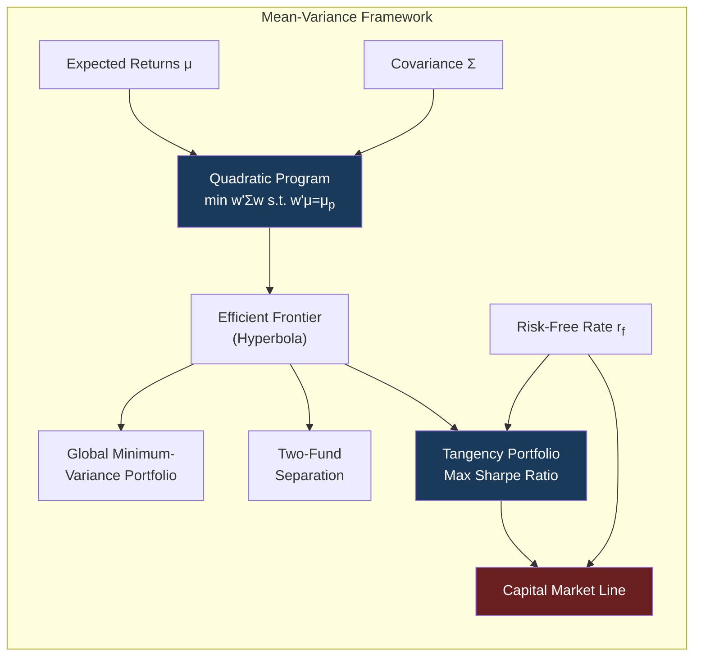
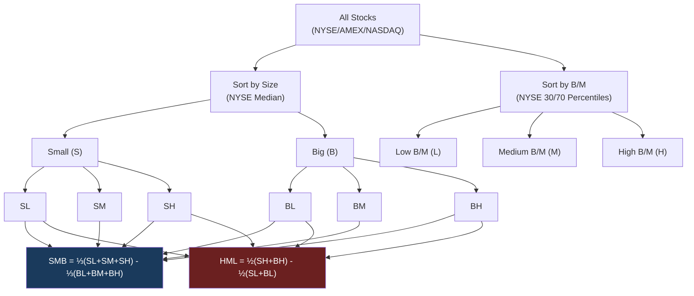
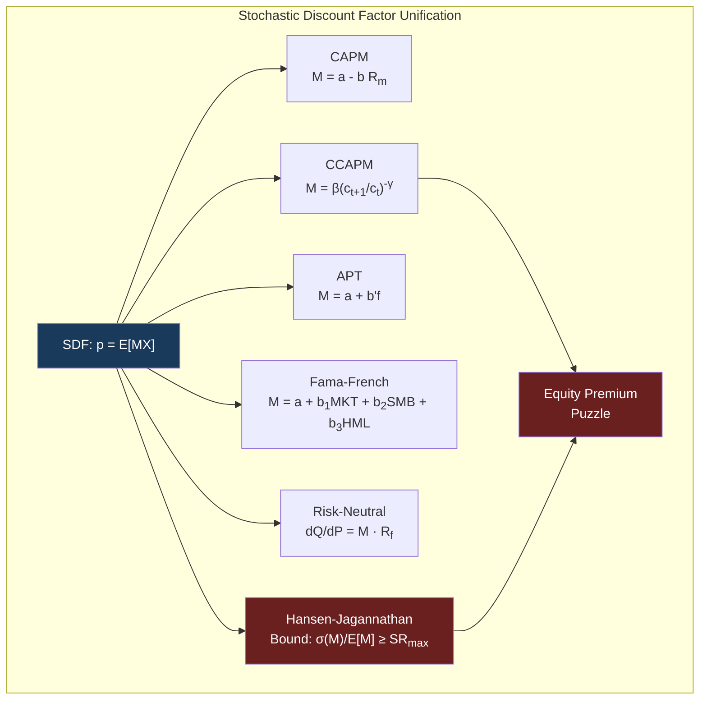
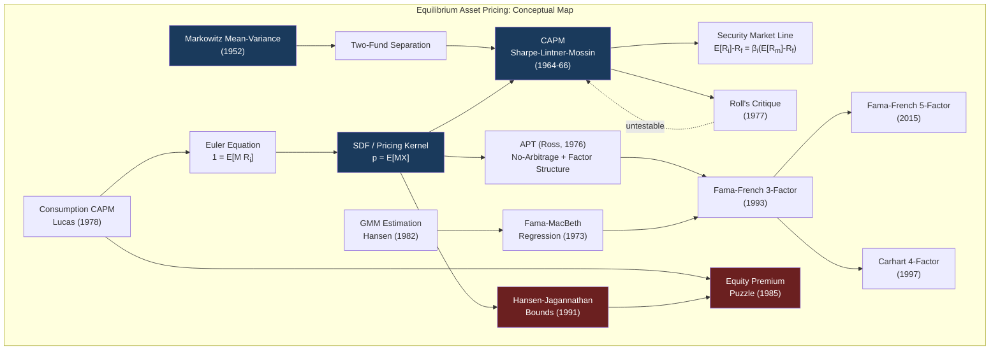

# Module 17: Equilibrium Asset Pricing

**Prerequisites:** Module 01 (Linear Algebra), Module 02 (Probability & Measure Theory), Module 04 (Stochastic Calculus), Module 06 (Optimization Theory)
**Builds toward:** Modules 18, 24, 25

---

## Table of Contents

1. [Markowitz Mean-Variance Theory](#1-markowitz-mean-variance-theory)
2. [Capital Asset Pricing Model (CAPM)](#2-capital-asset-pricing-model-capm)
3. [Roll's Critique](#3-rolls-critique)
4. [Arbitrage Pricing Theory (APT)](#4-arbitrage-pricing-theory-apt)
5. [Fama-French Factor Models](#5-fama-french-factor-models)
6. [Carhart Four-Factor Model](#6-carhart-four-factor-model)
7. [Consumption-Based Asset Pricing](#7-consumption-based-asset-pricing)
8. [Stochastic Discount Factor Framework](#8-stochastic-discount-factor-framework)
9. [GMM Estimation and Fama-MacBeth Regression](#9-gmm-estimation-and-fama-macbeth-regression)
10. [Implementation: Python](#10-implementation-python)
11. [Implementation: C++](#11-implementation-c)
12. [Exercises](#12-exercises)
13. [Summary](#13-summary)

---

## 1. Markowitz Mean-Variance Theory

Modern portfolio theory begins with a precise mathematical statement of the trade-off between risk and return. Markowitz (1952) observed that an investor who cares only about the mean and variance of portfolio returns can reduce the infinite-dimensional problem of choosing a return distribution to a finite-dimensional quadratic program. This section develops that insight with full matrix algebra.

### 1.1 Setup and Notation

Consider $n$ risky assets over a single period. Let $\mathbf{r} = (r_1, \ldots, r_n)^\top$ denote the random vector of returns. Define:

- $\boldsymbol{\mu} = \mathbb{E}[\mathbf{r}] \in \mathbb{R}^n$ --- vector of expected returns
- $\boldsymbol{\Sigma} = \text{Cov}(\mathbf{r}) \in \mathbb{R}^{n \times n}$ --- covariance matrix, assumed positive definite ($\boldsymbol{\Sigma} \succ 0$)
- $\mathbf{w} = (w_1, \ldots, w_n)^\top$ --- portfolio weight vector, with $\mathbf{1}^\top \mathbf{w} = 1$

The portfolio return is $r_p = \mathbf{w}^\top \mathbf{r}$, with:

$$\mathbb{E}[r_p] = \mathbf{w}^\top \boldsymbol{\mu}, \qquad \text{Var}(r_p) = \mathbf{w}^\top \boldsymbol{\Sigma} \mathbf{w}$$

The assumption $\boldsymbol{\Sigma} \succ 0$ rules out redundant assets (no asset is a perfect linear combination of others) and ensures the variance is strictly positive for any non-zero portfolio.

### 1.2 Minimum-Variance Frontier: Full Derivation

The investor solves, for each target expected return $\mu_p$:

$$\min_{\mathbf{w}} \quad \frac{1}{2} \mathbf{w}^\top \boldsymbol{\Sigma} \mathbf{w} \qquad \text{subject to} \quad \mathbf{w}^\top \boldsymbol{\mu} = \mu_p, \quad \mathbf{w}^\top \mathbf{1} = 1$$

Form the Lagrangian:

$$\mathcal{L}(\mathbf{w}, \lambda, \gamma) = \frac{1}{2} \mathbf{w}^\top \boldsymbol{\Sigma} \mathbf{w} - \lambda (\mathbf{w}^\top \boldsymbol{\mu} - \mu_p) - \gamma (\mathbf{w}^\top \mathbf{1} - 1)$$

First-order condition:

$$\frac{\partial \mathcal{L}}{\partial \mathbf{w}} = \boldsymbol{\Sigma} \mathbf{w} - \lambda \boldsymbol{\mu} - \gamma \mathbf{1} = \mathbf{0}$$

Since $\boldsymbol{\Sigma} \succ 0$, we can solve uniquely:

$$\mathbf{w}^* = \lambda \boldsymbol{\Sigma}^{-1} \boldsymbol{\mu} + \gamma \boldsymbol{\Sigma}^{-1} \mathbf{1}$$

Substituting into the two constraints yields a $2 \times 2$ system. Define the scalars:

$$A = \mathbf{1}^\top \boldsymbol{\Sigma}^{-1} \boldsymbol{\mu} = \boldsymbol{\mu}^\top \boldsymbol{\Sigma}^{-1} \mathbf{1}$$

$$B = \boldsymbol{\mu}^\top \boldsymbol{\Sigma}^{-1} \boldsymbol{\mu}$$

$$C = \mathbf{1}^\top \boldsymbol{\Sigma}^{-1} \mathbf{1}$$

$$D = BC - A^2 > 0$$

The positivity of $D$ follows from the Cauchy-Schwarz inequality applied in the inner product $\langle \mathbf{x}, \mathbf{y} \rangle_{\Sigma^{-1}} = \mathbf{x}^\top \boldsymbol{\Sigma}^{-1} \mathbf{y}$, with equality only if $\boldsymbol{\mu}$ and $\mathbf{1}$ are proportional (a degenerate case we exclude).

The constraint equations become:

$$\begin{pmatrix} B & A \\ A & C \end{pmatrix} \begin{pmatrix} \lambda \\ \gamma \end{pmatrix} = \begin{pmatrix} \mu_p \\ 1 \end{pmatrix}$$

Solving:

$$\lambda = \frac{C\mu_p - A}{D}, \qquad \gamma = \frac{B - A\mu_p}{D}$$

The optimal portfolio weights are:

$$\mathbf{w}^*(\mu_p) = \frac{C\mu_p - A}{D} \boldsymbol{\Sigma}^{-1} \boldsymbol{\mu} + \frac{B - A\mu_p}{D} \boldsymbol{\Sigma}^{-1} \mathbf{1}$$

The minimum variance at target return $\mu_p$ is:

$$\sigma_p^2 = (\mathbf{w}^*)^\top \boldsymbol{\Sigma} \, \mathbf{w}^* = \lambda \mu_p + \gamma \cdot 1 = \frac{C\mu_p^2 - 2A\mu_p + B}{D}$$

This is a **parabola** in $(\sigma_p^2, \mu_p)$-space, or equivalently a **hyperbola** in $(\sigma_p, \mu_p)$-space. The upper branch of this hyperbola is the **efficient frontier**.

### 1.3 Global Minimum-Variance Portfolio

Setting $\partial \sigma_p^2 / \partial \mu_p = 0$ gives $\mu_p^{\text{gmv}} = A / C$. The global minimum-variance (GMV) portfolio weights are:

$$\mathbf{w}_{\text{gmv}} = \frac{\boldsymbol{\Sigma}^{-1} \mathbf{1}}{\mathbf{1}^\top \boldsymbol{\Sigma}^{-1} \mathbf{1}} = \frac{\boldsymbol{\Sigma}^{-1} \mathbf{1}}{C}$$

with variance $\sigma_{\text{gmv}}^2 = 1/C$. This portfolio depends only on the covariance structure, not on expected returns --- a property that makes it popular in practice, since covariances are estimated far more reliably than means.

### 1.4 Two-Fund Separation Theorem

**Theorem 1.1 (Two-Fund Separation).** Every minimum-variance portfolio can be written as a convex combination (or, more generally, an affine combination) of any two distinct minimum-variance portfolios.

*Proof.* The optimal weight function $\mathbf{w}^*(\mu_p)$ is affine in $\mu_p$:

$$\mathbf{w}^*(\mu_p) = \underbrace{\frac{B \boldsymbol{\Sigma}^{-1} \mathbf{1} - A \boldsymbol{\Sigma}^{-1} \boldsymbol{\mu}}{D}}_{\mathbf{g}} + \mu_p \underbrace{\frac{C \boldsymbol{\Sigma}^{-1} \boldsymbol{\mu} - A \boldsymbol{\Sigma}^{-1} \mathbf{1}}{D}}_{\mathbf{h}}$$

Pick any two distinct target returns $\mu_1 \neq \mu_2$. The corresponding portfolios are $\mathbf{w}_1 = \mathbf{g} + \mu_1 \mathbf{h}$ and $\mathbf{w}_2 = \mathbf{g} + \mu_2 \mathbf{h}$. For any target $\mu_p$, set $\alpha = (\mu_p - \mu_2)/(\mu_1 - \mu_2)$, so that $1 - \alpha = (\mu_1 - \mu_p)/(\mu_1 - \mu_2)$. Then:

$$\alpha \mathbf{w}_1 + (1 - \alpha)\mathbf{w}_2 = \alpha(\mathbf{g} + \mu_1 \mathbf{h}) + (1-\alpha)(\mathbf{g} + \mu_2 \mathbf{h}) = \mathbf{g} + [\alpha \mu_1 + (1-\alpha)\mu_2] \mathbf{h} = \mathbf{g} + \mu_p \mathbf{h} = \mathbf{w}^*(\mu_p)$$

Therefore any frontier portfolio is spanned by two "fund" portfolios. $\blacksquare$

**Economic implication.** All investors with mean-variance preferences hold combinations of the same two funds. A financial intermediary need only offer two mutual funds to satisfy every such investor, regardless of their risk aversion.

### 1.5 Tangency Portfolio and the Capital Market Line

Now introduce a risk-free asset with return $r_f$. The investor allocates fraction $w_f$ to the risk-free asset and $\mathbf{w}$ to the risky assets, with $w_f + \mathbf{1}^\top \mathbf{w} = 1$. The portfolio return becomes:

$$r_p = r_f + \mathbf{w}^\top (\mathbf{r} - r_f \mathbf{1})$$

where now $\mathbf{w}$ is unconstrained (the weights in risky assets need not sum to one, since the shortfall is held in the risk-free asset). The problem becomes:

$$\max_{\mathbf{w}} \frac{\mathbf{w}^\top (\boldsymbol{\mu} - r_f \mathbf{1})}{\sqrt{\mathbf{w}^\top \boldsymbol{\Sigma} \mathbf{w}}}$$

This is the maximum Sharpe ratio problem. Due to scale invariance (the ratio is homogeneous of degree zero), we can fix the denominator and maximize the numerator, yielding:

$$\mathbf{w}_{\text{tan}} \propto \boldsymbol{\Sigma}^{-1}(\boldsymbol{\mu} - r_f \mathbf{1})$$

Normalizing so that $\mathbf{1}^\top \mathbf{w}_{\text{tan}} = 1$:

$$\mathbf{w}_{\text{tan}} = \frac{\boldsymbol{\Sigma}^{-1}(\boldsymbol{\mu} - r_f \mathbf{1})}{\mathbf{1}^\top \boldsymbol{\Sigma}^{-1}(\boldsymbol{\mu} - r_f \mathbf{1})}$$

The **Capital Market Line (CML)** is the set of portfolios combining the risk-free asset and the tangency portfolio:

$$\mathbb{E}[r_p] = r_f + \frac{\mathbb{E}[r_{\text{tan}}] - r_f}{\sigma_{\text{tan}}} \cdot \sigma_p$$

This is a straight line in $(\sigma, \mu)$-space emanating from $(0, r_f)$ and tangent to the efficient frontier. The slope $(\mathbb{E}[r_{\text{tan}}] - r_f) / \sigma_{\text{tan}}$ is the maximum attainable Sharpe ratio.



---

## 2. Capital Asset Pricing Model (CAPM)

The CAPM, developed independently by Sharpe (1964), Lintner (1965), and Mossin (1966), extends mean-variance theory from the individual investor's problem to a market equilibrium. It answers: if all investors are mean-variance optimizers and markets clear, what are the equilibrium expected returns?

### 2.1 Assumptions

1. All investors are mean-variance optimizers over a single period.
2. Investors have homogeneous expectations: they agree on $\boldsymbol{\mu}$ and $\boldsymbol{\Sigma}$.
3. A risk-free asset exists at rate $r_f$, with unlimited borrowing and lending.
4. Markets are frictionless: no taxes, no transaction costs, all assets are perfectly divisible and marketable.
5. All investors are price-takers.

### 2.2 Derivation from Market Clearing

Under these assumptions, every investor holds a combination of the risk-free asset and the tangency portfolio $\mathbf{w}_{\text{tan}}$. Since all investors agree on $\boldsymbol{\mu}$ and $\boldsymbol{\Sigma}$, they all identify the same tangency portfolio.

**Market clearing condition.** The aggregate demand for risky assets must equal the aggregate supply. Since every investor holds risky assets in the proportions $\mathbf{w}_{\text{tan}}$, and the supply of risky assets is the market portfolio $\mathbf{w}_m$ (each asset weighted by its market capitalization share), we conclude:

$$\mathbf{w}_{\text{tan}} = \mathbf{w}_m$$

The tangency portfolio *is* the market portfolio.

### 2.3 The Security Market Line

**Theorem 2.1 (CAPM).** Under the assumptions above, for every asset $i$:

$$\mathbb{E}[r_i] - r_f = \beta_i \left(\mathbb{E}[r_m] - r_f\right)$$

where:

$$\beta_i = \frac{\text{Cov}(r_i, r_m)}{\text{Var}(r_m)}$$

*Proof.* Since the market portfolio is the tangency portfolio, it satisfies the first-order condition of the Sharpe ratio maximization:

$$\boldsymbol{\Sigma} \mathbf{w}_m = \lambda (\boldsymbol{\mu} - r_f \mathbf{1})$$

for some scalar $\lambda > 0$. Consider the $i$-th row of this equation:

$$\sum_{j=1}^n \sigma_{ij} w_{m,j} = \lambda (\mu_i - r_f)$$

The left side is $\text{Cov}(r_i, r_m)$ since $r_m = \mathbf{w}_m^\top \mathbf{r}$:

$$\text{Cov}(r_i, r_m) = \text{Cov}\left(r_i, \sum_j w_{m,j} r_j\right) = \sum_j w_{m,j} \sigma_{ij} = [\boldsymbol{\Sigma} \mathbf{w}_m]_i$$

Therefore:

$$\text{Cov}(r_i, r_m) = \lambda (\mu_i - r_f) \quad \text{for all } i$$

Pre-multiplying the vector equation $\boldsymbol{\Sigma} \mathbf{w}_m = \lambda(\boldsymbol{\mu} - r_f \mathbf{1})$ by $\mathbf{w}_m^\top$:

$$\mathbf{w}_m^\top \boldsymbol{\Sigma} \mathbf{w}_m = \lambda \mathbf{w}_m^\top (\boldsymbol{\mu} - r_f \mathbf{1})$$

$$\text{Var}(r_m) = \lambda (\mathbb{E}[r_m] - r_f)$$

$$\lambda = \frac{\text{Var}(r_m)}{\mathbb{E}[r_m] - r_f}$$

Substituting back:

$$\text{Cov}(r_i, r_m) = \frac{\text{Var}(r_m)}{\mathbb{E}[r_m] - r_f} (\mu_i - r_f)$$

$$\mu_i - r_f = \frac{\text{Cov}(r_i, r_m)}{\text{Var}(r_m)} (\mathbb{E}[r_m] - r_f) = \beta_i (\mathbb{E}[r_m] - r_f) \qquad \blacksquare$$

The **Security Market Line (SML)** is the plot of $\mathbb{E}[r_i] - r_f$ against $\beta_i$. In equilibrium, every asset lies on this line. Assets above the SML offer positive "alpha" (excess risk-adjusted return) and would attract buying pressure until their prices rise and expected returns fall back to the line.

### 2.4 Beta and Risk Decomposition

For any asset $i$, regress its excess return on the market excess return:

$$r_i - r_f = \alpha_i + \beta_i (r_m - r_f) + \epsilon_i$$

where $\mathbb{E}[\epsilon_i] = 0$ and $\text{Cov}(\epsilon_i, r_m) = 0$. This decomposes total risk:

$$\text{Var}(r_i) = \beta_i^2 \text{Var}(r_m) + \text{Var}(\epsilon_i)$$

$$\underbrace{\sigma_i^2}_{\text{total risk}} = \underbrace{\beta_i^2 \sigma_m^2}_{\text{systematic risk}} + \underbrace{\sigma_{\epsilon_i}^2}_{\text{idiosyncratic risk}}$$

**Systematic risk** is priced: the investor is compensated for bearing it (via the risk premium $\beta_i (\mathbb{E}[r_m] - r_f)$). **Idiosyncratic risk** is not priced: it can be diversified away by holding a large portfolio. The CAPM states $\alpha_i = 0$ for all assets in equilibrium.

### 2.5 Zero-Beta CAPM (Black's Version)

If no risk-free asset exists, Black (1972) showed that the CAPM still holds with the risk-free rate replaced by the return on the **zero-beta portfolio** --- the minimum-variance portfolio uncorrelated with the market:

$$\mathbb{E}[r_i] = \mathbb{E}[r_z] + \beta_i (\mathbb{E}[r_m] - \mathbb{E}[r_z])$$

where $\text{Cov}(r_z, r_m) = 0$ and $r_z$ lies on the (inefficient) lower branch of the minimum-variance frontier.

---

## 3. Roll's Critique

### 3.1 The Joint Hypothesis Problem

Roll (1977) made a devastating observation: the CAPM is a statement about the *true* market portfolio --- the value-weighted aggregate of all investable wealth (stocks, bonds, real estate, human capital, art, etc.). This portfolio is unobservable. Any empirical test necessarily uses a *proxy* such as the S\&P 500 or CRSP value-weighted index.

**Theorem 3.1 (Roll, 1977).** The following two statements are mathematically equivalent:

1. The market portfolio is mean-variance efficient.
2. The expected return--beta relationship holds exactly for all assets.

*Proof sketch.* (1 $\Rightarrow$ 2) was proved in Section 2.3. For (2 $\Rightarrow$ 1): if $\mathbb{E}[r_i] - r_f = \beta_i (\mathbb{E}[r_m] - r_f)$ for all $i$, then $\boldsymbol{\mu} - r_f \mathbf{1} = (\mathbb{E}[r_m] - r_f) \boldsymbol{\Sigma} \mathbf{w}_m / \sigma_m^2$. This implies $\mathbf{w}_m \propto \boldsymbol{\Sigma}^{-1}(\boldsymbol{\mu} - r_f \mathbf{1})$, which is the tangency portfolio condition --- meaning $\mathbf{w}_m$ is mean-variance efficient. $\blacksquare$

### 3.2 Implications for Empirical Tests

Roll's critique implies:

1. **Any ex post mean-variance efficient portfolio** will produce a perfect linear relationship between sample betas and sample mean returns. Finding such a relationship proves nothing about the CAPM.
2. **If the proxy is not the true market portfolio**, the SML relationship may fail even if the CAPM is true. A rejection could merely reflect a bad proxy, not a failure of the model.
3. **The CAPM is therefore untestable** in any strict sense. Every "test" is a joint test of (a) the CAPM and (b) the hypothesis that the proxy equals the true market.

This does not make the CAPM useless --- it remains a powerful equilibrium benchmark --- but it means empirical rejections must be interpreted with caution.

---

## 4. Arbitrage Pricing Theory (APT)

### 4.1 Factor Structure

Ross (1976) developed the APT as an alternative to the CAPM that does not require the identification of the market portfolio. The APT begins with an assumption about the return-generating process.

**Assumption (Exact Factor Structure).** Asset returns are generated by a linear factor model:

$$r_i = a_i + \sum_{k=1}^{K} b_{ik} f_k + \epsilon_i, \qquad i = 1, \ldots, n$$

where $f_1, \ldots, f_K$ are $K$ common factors (with $K \ll n$), $b_{ik}$ is asset $i$'s loading on factor $k$, and $\epsilon_i$ is an idiosyncratic shock with $\mathbb{E}[\epsilon_i] = 0$, $\text{Cov}(\epsilon_i, f_k) = 0$, and $\text{Cov}(\epsilon_i, \epsilon_j) = 0$ for $i \neq j$.

In matrix form: $\mathbf{r} = \mathbf{a} + \mathbf{B} \mathbf{f} + \boldsymbol{\epsilon}$, where $\mathbf{B} \in \mathbb{R}^{n \times K}$ is the factor loading matrix.

### 4.2 Ross's No-Arbitrage Derivation

**Theorem 4.1 (APT Pricing).** If returns follow an exact factor structure and no asymptotic arbitrage opportunities exist, then:

$$\mathbb{E}[r_i] = \lambda_0 + \sum_{k=1}^{K} b_{ik} \lambda_k$$

where $\lambda_0$ is the risk-free rate (if it exists) and $\lambda_k$ is the risk premium for factor $k$.

*Proof (Ross's argument).* Consider an arbitrage portfolio $\mathbf{w}$ with $\mathbf{1}^\top \mathbf{w} = 0$ (zero cost) and $\mathbf{B}^\top \mathbf{w} = \mathbf{0}$ (zero factor exposure). The portfolio return is:

$$r_p = \mathbf{w}^\top \mathbf{a} + \mathbf{w}^\top \boldsymbol{\epsilon}$$

By the law of large numbers, as $n \to \infty$ the idiosyncratic term $\mathbf{w}^\top \boldsymbol{\epsilon} \to 0$ in probability for well-diversified portfolios. To prevent arbitrage, we need $\mathbf{w}^\top \mathbf{a} = 0$ for all such $\mathbf{w}$.

The constraints say $\mathbf{w}$ is orthogonal to $\mathbf{1}$ and to each column of $\mathbf{B}$, and $\mathbf{w}^\top \mathbf{a} = 0$. By the fundamental theorem of linear algebra, $\mathbf{a}$ must lie in the span of $\{\mathbf{1}, \mathbf{b}_1, \ldots, \mathbf{b}_K\}$:

$$\mathbf{a} = \lambda_0 \mathbf{1} + \mathbf{B} \boldsymbol{\lambda}$$

Since $\mathbb{E}[r_i] = a_i + \sum_k b_{ik} \mathbb{E}[f_k]$, we can write:

$$\mathbb{E}[r_i] = \lambda_0 + \sum_{k=1}^K b_{ik}(\lambda_k + \mathbb{E}[f_k])$$

Redefining $\lambda_k$ to absorb the factor means, the pricing relation becomes:

$$\mathbb{E}[r_i] = \lambda_0 + \sum_{k=1}^K b_{ik} \lambda_k \qquad \blacksquare$$

### 4.3 APT vs. CAPM

| Feature | CAPM | APT |
|---------|------|-----|
| **Derivation** | Equilibrium (market clearing) | No-arbitrage |
| **Factors** | Single factor (market) | $K$ unspecified factors |
| **Market portfolio** | Must be identified | Not required |
| **Testability** | Untestable (Roll) | Testable (factors identified empirically) |
| **Pricing errors** | Exact (in equilibrium) | Approximate (exact only as $n \to \infty$) |
| **Assumptions** | Mean-variance preferences | Factor structure, no arbitrage |

The CAPM is a special case of the APT with a single factor (the market return) and exact pricing.

---

## 5. Fama-French Factor Models

### 5.1 Empirical Failures of the CAPM

Fama and French (1992, 1993) documented two anomalies relative to the single-factor CAPM:

1. **Size effect.** Small-cap stocks earn higher average returns than large-cap stocks, controlling for beta.
2. **Value effect.** Stocks with high book-to-market ratios (value stocks) earn higher average returns than stocks with low book-to-market ratios (growth stocks).

These cross-sectional patterns are not explained by differences in market beta.

### 5.2 Three-Factor Model

The Fama-French three-factor model augments the market factor with size and value factors:

$$\mathbb{E}[r_i] - r_f = \beta_i^{\text{MKT}} \mathbb{E}[\text{MKT}] + \beta_i^{\text{SMB}} \mathbb{E}[\text{SMB}] + \beta_i^{\text{HML}} \mathbb{E}[\text{HML}]$$

**Factor construction methodology (using NYSE breakpoints):**

**Step 1: Size sort.** At the end of June each year $t$, sort all NYSE/AMEX/NASDAQ stocks by market capitalization. The NYSE median is the breakpoint: stocks below the median are "Small" (S), above are "Big" (B).

**Step 2: Book-to-market sort.** Using book equity from fiscal year $t-1$ and market equity from December of year $t-1$, sort all stocks into three B/M groups using NYSE 30th and 70th percentile breakpoints: Low (L), Medium (M), and High (H).

**Step 3: Form six portfolios.** The intersection of the two size groups and three B/M groups produces six value-weighted portfolios: SL, SM, SH, BL, BM, BH.

**Step 4: Compute factors (July $t$ through June $t+1$):**

$$\text{SMB} = \frac{1}{3}(\text{SL} + \text{SM} + \text{SH}) - \frac{1}{3}(\text{BL} + \text{BM} + \text{BH})$$

$$\text{HML} = \frac{1}{2}(\text{SH} + \text{BH}) - \frac{1}{2}(\text{SL} + \text{BL})$$

$$\text{MKT} = r_m - r_f$$

The SMB (Small Minus Big) factor is long small stocks, short big stocks. The HML (High Minus Low) factor is long value, short growth.



### 5.3 Five-Factor Model

Fama and French (2015) extended the model with two additional factors motivated by the dividend discount model $M_t = \sum_{\tau=1}^\infty \mathbb{E}_t[D_{t+\tau}] / (1+r)^\tau$, which implies that controlling for expected returns, higher expected profitability means higher price, and higher expected investment means higher price:

$$r_i - r_f = \alpha_i + \beta_i^{\text{MKT}} \text{MKT} + \beta_i^{\text{SMB}} \text{SMB} + \beta_i^{\text{HML}} \text{HML} + \beta_i^{\text{RMW}} \text{RMW} + \beta_i^{\text{CMA}} \text{CMA} + \epsilon_i$$

**Additional factors:**

- **RMW (Robust Minus Weak):** Profitability factor. Sort stocks by operating profitability (revenue minus COGS, minus SGA expense, minus interest expense, divided by book equity). RMW = average return of high-profitability portfolios minus average return of low-profitability portfolios.

- **CMA (Conservative Minus Aggressive):** Investment factor. Sort stocks by asset growth (change in total assets / total assets). CMA = average return of low-investment (conservative) firms minus average return of high-investment (aggressive) firms.

Construction uses $2 \times 3$ independent sorts on size and each characteristic (B/M, profitability, investment), producing factor returns analogous to the three-factor case.

| Factor | Long Leg | Short Leg | Avg. Annual Premium (US, 1963--2023) |
|--------|----------|-----------|--------------------------------------|
| MKT | Market | Risk-free | ~8.0% |
| SMB | Small caps | Large caps | ~3.0% |
| HML | High B/M | Low B/M | ~4.0% |
| RMW | High profitability | Low profitability | ~3.3% |
| CMA | Low investment | High investment | ~3.5% |

---

## 6. Carhart Four-Factor Model

### 6.1 Momentum Factor

Jegadeesh and Titman (1993) documented the **momentum anomaly**: stocks that performed well over the past 3--12 months tend to continue performing well over the next 3--12 months, and vice versa.

Carhart (1997) augmented the Fama-French three-factor model with a momentum factor:

$$r_i - r_f = \alpha_i + \beta_i^{\text{MKT}} \text{MKT} + \beta_i^{\text{SMB}} \text{SMB} + \beta_i^{\text{HML}} \text{HML} + \beta_i^{\text{UMD}} \text{UMD} + \epsilon_i$$

### 6.2 UMD Construction

**UMD (Up Minus Down)**, also called **WML (Winners Minus Losers)**:

1. At the end of each month $t$, compute each stock's cumulative return from month $t-12$ through $t-2$ (skip month $t-1$ to avoid microstructure effects such as bid-ask bounce).
2. Sort into three groups using NYSE 30th and 70th percentile breakpoints: Losers (D), Neutral (N), Winners (U).
3. Independently sort by size (NYSE median): Small (S) and Big (B).
4. Form six portfolios: SD, SN, SU, BD, BN, BU.
5. Compute:

$$\text{UMD} = \frac{1}{2}(\text{SU} + \text{BU}) - \frac{1}{2}(\text{SD} + \text{BD})$$

The average monthly return on UMD in U.S. data (1927--2023) is approximately 0.65%, or about 7.8% annually, though with occasional dramatic crashes (e.g., 2009).

---

## 7. Consumption-Based Asset Pricing

### 7.1 Motivation

The mean-variance/CAPM/APT framework treats expected returns and covariances as given. Consumption-based asset pricing derives asset prices from the fundamental economic problem: intertemporal consumption allocation. This approach connects asset returns directly to marginal utility, providing a microeconomic foundation.

### 7.2 The Lucas Tree Model

Consider a representative agent endowment economy (Lucas, 1978). A single tree produces a stochastic dividend (fruit) stream $\{D_t\}_{t=0}^{\infty}$. The agent consumes the fruit and trades shares in the tree to maximize:

$$\max_{\{c_t, \theta_t\}} \mathbb{E}_0 \left[ \sum_{t=0}^{\infty} \beta^t u(c_t) \right]$$

subject to the budget constraint:

$$c_t + p_t \theta_{t+1} \leq (p_t + D_t) \theta_t$$

where $p_t$ is the price of one share, $\theta_t$ is shares held at time $t$, $\beta \in (0,1)$ is the subjective discount factor, and $u(\cdot)$ is the period utility function (strictly increasing, strictly concave, satisfying Inada conditions).

### 7.3 Euler Equation Derivation

Suppose the agent considers buying $\delta$ additional shares at time $t$. The marginal cost at time $t$ is $\delta \cdot p_t \cdot u'(c_t)$ (reduced utility from consuming less). The marginal benefit at time $t+1$ is $\delta \cdot (p_{t+1} + D_{t+1}) \cdot \beta u'(c_{t+1})$ (more wealth, more consumption, discounted). At the optimum, the marginal cost equals the expected marginal benefit:

$$p_t u'(c_t) = \mathbb{E}_t \left[ \beta u'(c_{t+1})(p_{t+1} + D_{t+1}) \right]$$

Dividing by $u'(c_t)$:

$$p_t = \mathbb{E}_t \left[ \beta \frac{u'(c_{t+1})}{u'(c_t)} (p_{t+1} + D_{t+1}) \right]$$

Defining the **stochastic discount factor (SDF)**:

$$M_{t+1} = \beta \frac{u'(c_{t+1})}{u'(c_t)}$$

The Euler equation becomes:

$$p_t = \mathbb{E}_t [M_{t+1}(p_{t+1} + D_{t+1})]$$

In terms of gross returns $R_{t+1} = (p_{t+1} + D_{t+1})/p_t$:

$$1 = \mathbb{E}_t [M_{t+1} R_{t+1}]$$

This is the fundamental equation of asset pricing. It holds for **every** traded asset.

### 7.4 Risk Premium from the Euler Equation

For the risk-free asset: $1 = \mathbb{E}_t[M_{t+1}] R_f$, so $R_f = 1 / \mathbb{E}_t[M_{t+1}]$.

For a risky asset: $1 = \mathbb{E}_t[M_{t+1} R_i] = \mathbb{E}_t[M_{t+1}] \mathbb{E}_t[R_i] + \text{Cov}_t(M_{t+1}, R_i)$.

Combining:

$$\mathbb{E}_t[R_i] - R_f = -R_f \cdot \text{Cov}_t(M_{t+1}, R_i) = -\frac{\text{Cov}_t(M_{t+1}, R_i)}{\mathbb{E}_t[M_{t+1}]}$$

**Interpretation:** An asset that pays off when marginal utility is low (i.e., when consumption is high --- good times) has negative covariance with the SDF and commands a positive risk premium. Insurance-like assets that pay in bad times have positive covariance with the SDF and earn a negative premium.

### 7.5 The Equity Premium Puzzle

With CRRA utility $u(c) = c^{1-\gamma}/(1-\gamma)$, the SDF becomes:

$$M_{t+1} = \beta \left(\frac{c_{t+1}}{c_t}\right)^{-\gamma}$$

Mehra and Prescott (1985) observed that calibrating this model to U.S. data requires implausible parameter values. Let $g_{t+1} = \log(c_{t+1}/c_t)$ be log consumption growth, assumed i.i.d. normal with mean $\mu_g$ and variance $\sigma_g^2$.

The risk-free rate:

$$\log R_f = -\log \beta + \gamma \mu_g - \frac{1}{2}\gamma^2 \sigma_g^2$$

The equity premium (for a claim on aggregate consumption):

$$\mathbb{E}[\log R_e - \log R_f] \approx \gamma \sigma_g^2$$

Using U.S. data: $\sigma_g \approx 0.036$ (annual consumption growth volatility), and the historical equity premium $\approx 0.06$. Solving: $\gamma \approx 0.06 / 0.036^2 \approx 46$. A risk aversion coefficient of 46 is considered implausibly high (experimental evidence suggests $\gamma \in [1, 10]$).

This is the **equity premium puzzle**: standard consumption-based models with reasonable risk aversion cannot explain the observed equity premium.

### 7.6 The Risk-Free Rate Puzzle

Using $\gamma = 46$, $\mu_g \approx 0.018$, and $\sigma_g \approx 0.036$:

$$\log R_f \approx -\log \beta + 46 \times 0.018 - \frac{1}{2} \times 46^2 \times 0.036^2 \approx -\log \beta + 0.828 - 1.370$$

For $R_f \approx 1.01$, we need $\log \beta \approx -0.552$, or $\beta \approx 1.74$, which is economically meaningless (the agent has a *negative* rate of time preference, valuing the future more than the present). This is the **risk-free rate puzzle** (Weil, 1989): the model simultaneously requires extremely high risk aversion (to explain the equity premium) and an implausibly high discount factor (to keep the risk-free rate low).

---

## 8. Stochastic Discount Factor Framework

### 8.1 The General SDF

The SDF (also called the **pricing kernel** or **state-price density**) provides a unified framework for all of asset pricing.

**Definition 8.1.** A stochastic discount factor is a strictly positive random variable $M$ such that for all traded assets with payoff $X$ and price $p$:

$$p = \mathbb{E}[MX]$$

For returns (payoff per unit price): $1 = \mathbb{E}[MR_i]$ for all $i$.

In vector form for $n$ assets: $\mathbf{1} = \mathbb{E}[M \mathbf{R}]$.

**Key results:**

1. **Existence.** By the fundamental theorem of asset pricing, an SDF exists if and only if there are no arbitrage opportunities (no $X \geq 0$ a.s. with $X > 0$ with positive probability and $p \leq 0$).
2. **Uniqueness.** The SDF is unique if and only if markets are complete. In incomplete markets, there exist multiple valid SDFs.
3. **Relationship to risk-neutral pricing.** If $M > 0$ a.s. and $R_f$ exists, define $\frac{d\mathbb{Q}}{d\mathbb{P}} = M R_f$. Then $p = \frac{1}{R_f} \mathbb{E}^{\mathbb{Q}}[X]$.

### 8.2 SDF and Expected Returns

From $1 = \mathbb{E}[M R_i]$ and the covariance decomposition:

$$\mathbb{E}[R_i] = R_f - R_f \text{Cov}(M, R_i) = R_f + \frac{\text{Cov}(R_i, -M)}{\mathbb{E}[M]}$$

Any factor model $M = a + \mathbf{b}^\top \mathbf{f}$ (linear SDF) implies:

$$\mathbb{E}[R_i] - R_f = \sum_k \lambda_k \beta_{ik}$$

where $\lambda_k = \text{Cov}(f_k, -M) / \mathbb{E}[M]$ and $\beta_{ik}$ is the regression coefficient of $R_i$ on $f_k$.

This shows that the CAPM ($M = a - b R_m$), the APT, and the Fama-French models are all special cases of a linear SDF specification.

### 8.3 Hansen-Jagannathan Bounds

Hansen and Jagannathan (1991) derived a lower bound on the volatility of any valid SDF, providing a diagnostic for asset pricing models.

**Theorem 8.1 (HJ Bound).** For any SDF $M$ that prices $n$ assets with excess returns $\mathbf{R}^e$:

$$\frac{\sigma(M)}{\mathbb{E}[M]} \geq \sqrt{\boldsymbol{\mu}_e^\top \boldsymbol{\Sigma}_e^{-1} \boldsymbol{\mu}_e}$$

where $\boldsymbol{\mu}_e = \mathbb{E}[\mathbf{R}^e]$ and $\boldsymbol{\Sigma}_e = \text{Var}(\mathbf{R}^e)$.

*Proof.* From $\mathbb{E}[M \mathbf{R}^e] = \mathbf{0}$ (since excess returns have zero price), we get $\mathbb{E}[M] \boldsymbol{\mu}_e + \text{Cov}(M, \mathbf{R}^e) = \mathbf{0}$, so:

$$\text{Cov}(M, \mathbf{R}^e) = -\mathbb{E}[M] \boldsymbol{\mu}_e$$

Project $M$ onto the space spanned by $\mathbf{R}^e$. The projection is:

$$M^* = \mathbb{E}[M] - \boldsymbol{\mu}_e^\top \boldsymbol{\Sigma}_e^{-1} (\mathbf{R}^e - \boldsymbol{\mu}_e) \cdot \mathbb{E}[M]$$

More precisely, write $M = a + \mathbf{b}^\top \mathbf{R}^e + \eta$ where $\text{Cov}(\eta, \mathbf{R}^e) = \mathbf{0}$. From the pricing condition:

$$\mathbf{b} = -\mathbb{E}[M] \boldsymbol{\Sigma}_e^{-1} \boldsymbol{\mu}_e$$

The variance of $M$ satisfies:

$$\text{Var}(M) = \mathbf{b}^\top \boldsymbol{\Sigma}_e \mathbf{b} + \text{Var}(\eta) \geq \mathbf{b}^\top \boldsymbol{\Sigma}_e \mathbf{b}$$

$$= \mathbb{E}[M]^2 \boldsymbol{\mu}_e^\top \boldsymbol{\Sigma}_e^{-1} \boldsymbol{\Sigma}_e \boldsymbol{\Sigma}_e^{-1} \boldsymbol{\mu}_e = \mathbb{E}[M]^2 \boldsymbol{\mu}_e^\top \boldsymbol{\Sigma}_e^{-1} \boldsymbol{\mu}_e$$

Therefore:

$$\sigma^2(M) \geq \mathbb{E}[M]^2 \boldsymbol{\mu}_e^\top \boldsymbol{\Sigma}_e^{-1} \boldsymbol{\mu}_e$$

$$\frac{\sigma(M)}{\mathbb{E}[M]} \geq \sqrt{\boldsymbol{\mu}_e^\top \boldsymbol{\Sigma}_e^{-1} \boldsymbol{\mu}_e} \qquad \blacksquare$$

**Interpretation:** The right-hand side is the maximum Sharpe ratio attainable from the $n$ assets. The HJ bound says that any valid pricing kernel must have a coefficient of variation at least as large as this maximum Sharpe ratio. Models that produce an SDF that is "too smooth" (low $\sigma(M)/\mathbb{E}[M]$) are rejected.

**Connection to the equity premium puzzle:** The historically high Sharpe ratio of the market ($\approx 0.4$ annually) implies $\sigma(M)/\mathbb{E}[M] \geq 0.4$. With CRRA utility and smooth consumption growth, the SDF is too smooth unless $\gamma$ is very large.



---

## 9. GMM Estimation and Fama-MacBeth Regression

### 9.1 Moment Conditions for Asset Pricing

The Euler equation $\mathbb{E}[M(\theta) R_i] = 1$ defines moment conditions for GMM (Generalized Method of Moments, Hansen 1982). With $T$ observations and $n$ test assets:

$$g_T(\theta) = \frac{1}{T} \sum_{t=1}^T \mathbf{m}_t(\theta)$$

where $\mathbf{m}_t(\theta) = M_t(\theta) \mathbf{R}_t - \mathbf{1}$ is the $n \times 1$ vector of pricing errors. GMM minimizes:

$$J_T(\theta) = g_T(\theta)^\top \mathbf{W} \, g_T(\theta)$$

for a positive-definite weighting matrix $\mathbf{W}$. First-stage GMM uses $\mathbf{W} = \mathbf{I}$; efficient GMM uses $\mathbf{W} = \hat{\mathbf{S}}^{-1}$ where $\hat{\mathbf{S}}$ is the spectral density matrix of $\mathbf{m}_t$ at frequency zero (HAC estimator).

The Hansen $J$-test statistic $T \cdot J_T(\hat{\theta}) \xrightarrow{d} \chi^2(n - \dim(\theta))$ under the null that the model is correctly specified.

### 9.2 Fama-MacBeth Two-Pass Regression

Fama and MacBeth (1973) proposed a procedure that avoids the need to estimate the $n \times n$ covariance matrix of asset returns, which was computationally prohibitive for large cross-sections.

**First pass (time-series regressions).** For each asset $i = 1, \ldots, n$, run the regression:

$$r_{it} - r_{ft} = \alpha_i + \sum_{k=1}^K \beta_{ik} f_{kt} + \epsilon_{it}, \qquad t = 1, \ldots, T$$

This yields estimated betas $\hat{\beta}_{ik}$ for each asset-factor pair.

**Second pass (cross-sectional regressions).** For each month $t$, run the cross-sectional regression:

$$r_{it} - r_{ft} = \gamma_{0t} + \sum_{k=1}^K \hat{\beta}_{ik} \gamma_{kt} + \eta_{it}, \qquad i = 1, \ldots, n$$

This yields monthly estimates of the factor risk premia $\hat{\gamma}_{kt}$.

**Third step (inference).** Average the monthly cross-sectional estimates:

$$\hat{\lambda}_k = \frac{1}{T} \sum_{t=1}^T \hat{\gamma}_{kt}$$

Test whether $\hat{\lambda}_k$ is significantly different from zero using:

$$t(\hat{\lambda}_k) = \frac{\hat{\lambda}_k}{\text{SE}(\hat{\lambda}_k)}, \qquad \text{SE}(\hat{\lambda}_k) = \frac{1}{\sqrt{T}} \sqrt{\frac{1}{T-1} \sum_{t=1}^T (\hat{\gamma}_{kt} - \hat{\lambda}_k)^2}$$

The beauty of this approach: the time-series variation in $\hat{\gamma}_{kt}$ captures both estimation error in $\hat{\lambda}_k$ and model misspecification, providing a simple standard error that accounts for cross-sectional correlation.

### 9.3 Shanken Correction

The Fama-MacBeth standard errors ignore the fact that the betas in the second pass are estimated, not known. Shanken (1992) showed that the true variance of $\hat{\lambda}_k$ is inflated by a factor:

$$(1 + \hat{\boldsymbol{\lambda}}^\top \hat{\boldsymbol{\Sigma}}_f^{-1} \hat{\boldsymbol{\lambda}})$$

where $\hat{\boldsymbol{\Sigma}}_f$ is the estimated covariance matrix of the factors.

The **Shanken-corrected** variance of the risk premium estimates is:

$$\text{Var}(\hat{\boldsymbol{\lambda}}) = \frac{1}{T} \left[ (1 + c) \boldsymbol{\Sigma}_{\gamma} + c \boldsymbol{\Sigma}_f \right]$$

where $c = \boldsymbol{\lambda}^\top \boldsymbol{\Sigma}_f^{-1} \boldsymbol{\lambda}$ and $\boldsymbol{\Sigma}_{\gamma}$ is the cross-sectional variance of the second-pass coefficients.

The correction increases the standard errors, weakening the statistical significance of estimated risk premia. For models where factors have high Sharpe ratios, the correction factor $c$ can be substantial.

**Practical guidance:** The Shanken correction matters most when the sample is small relative to the signal-to-noise ratio of the factors. With monthly data spanning 50+ years, the correction is typically modest (10--30% increase in standard errors), but with shorter samples or weaker factors it can overturn significance.

---

## 10. Implementation: Python

### 10.1 Efficient Frontier and Tangency Portfolio

```python
"""
Equilibrium Asset Pricing: Efficient Frontier and Tangency Portfolio
Requires: numpy, scipy, pandas, matplotlib
"""
import numpy as np
import pandas as pd
import matplotlib.pyplot as plt
from scipy.optimize import minimize
from typing import Tuple, Optional

class MeanVarianceOptimizer:
    """
    Full mean-variance optimization engine.
    Computes efficient frontier, GMV portfolio, tangency portfolio, and CML.
    """

    def __init__(self, mu: np.ndarray, Sigma: np.ndarray, rf: float = 0.0):
        """
        Parameters
        ----------
        mu : (n,) array of expected returns
        Sigma : (n, n) positive-definite covariance matrix
        rf : risk-free rate
        """
        self.mu = np.asarray(mu, dtype=np.float64)
        self.Sigma = np.asarray(Sigma, dtype=np.float64)
        self.rf = rf
        self.n = len(mu)
        self.Sigma_inv = np.linalg.inv(self.Sigma)

        # Precompute the three scalars
        ones = np.ones(self.n)
        self.A = ones @ self.Sigma_inv @ self.mu
        self.B = self.mu @ self.Sigma_inv @ self.mu
        self.C = ones @ self.Sigma_inv @ ones
        self.D = self.B * self.C - self.A ** 2

    def gmv_portfolio(self) -> Tuple[np.ndarray, float, float]:
        """Global minimum-variance portfolio: weights, mean, std."""
        ones = np.ones(self.n)
        w = self.Sigma_inv @ ones / self.C
        mu_p = self.A / self.C
        sigma_p = np.sqrt(1.0 / self.C)
        return w, mu_p, sigma_p

    def frontier_portfolio(self, mu_target: float) -> np.ndarray:
        """Minimum-variance portfolio for a target expected return."""
        ones = np.ones(self.n)
        lam = (self.C * mu_target - self.A) / self.D
        gam = (self.B - self.A * mu_target) / self.D
        return lam * self.Sigma_inv @ self.mu + gam * self.Sigma_inv @ ones

    def tangency_portfolio(self) -> Tuple[np.ndarray, float, float]:
        """Tangency (max Sharpe ratio) portfolio: weights, mean, std."""
        excess = self.mu - self.rf * np.ones(self.n)
        w_raw = self.Sigma_inv @ excess
        w = w_raw / np.sum(w_raw)
        mu_p = w @ self.mu
        sigma_p = np.sqrt(w @ self.Sigma @ w)
        return w, mu_p, sigma_p

    def efficient_frontier(self, n_points: int = 200) -> Tuple[np.ndarray, np.ndarray]:
        """Compute the efficient frontier (upper branch)."""
        mu_gmv = self.A / self.C
        mu_max = mu_gmv + 3.0 * np.sqrt(self.B / self.C - mu_gmv ** 2)
        mu_range = np.linspace(mu_gmv, mu_max, n_points)
        sigma_range = np.sqrt(
            (self.C * mu_range ** 2 - 2.0 * self.A * mu_range + self.B) / self.D
        )
        return sigma_range, mu_range

    def plot(self, title: str = "Mean-Variance Efficient Frontier") -> None:
        """Plot frontier, GMV, tangency, and CML."""
        sigma_ef, mu_ef = self.efficient_frontier()
        w_gmv, mu_gmv, sig_gmv = self.gmv_portfolio()
        w_tan, mu_tan, sig_tan = self.tangency_portfolio()

        fig, ax = plt.subplots(figsize=(10, 7))
        ax.plot(sigma_ef, mu_ef, 'b-', linewidth=2, label='Efficient Frontier')

        # CML
        sigma_cml = np.linspace(0, sig_tan * 1.5, 100)
        mu_cml = self.rf + (mu_tan - self.rf) / sig_tan * sigma_cml
        ax.plot(sigma_cml, mu_cml, 'r--', linewidth=1.5, label='Capital Market Line')

        # Individual assets
        individual_sigma = np.sqrt(np.diag(self.Sigma))
        ax.scatter(individual_sigma, self.mu, c='grey', s=40, zorder=5,
                   label='Individual Assets')

        ax.scatter(sig_gmv, mu_gmv, c='green', s=120, marker='D', zorder=6,
                   label=f'GMV ($\\sigma$={sig_gmv:.3f})')
        ax.scatter(sig_tan, mu_tan, c='red', s=120, marker='*', zorder=6,
                   label=f'Tangency (SR={((mu_tan - self.rf) / sig_tan):.3f})')

        ax.set_xlabel('Portfolio Std Dev ($\\sigma$)')
        ax.set_ylabel('Expected Return ($\\mu$)')
        ax.set_title(title)
        ax.legend(loc='upper left')
        ax.grid(True, alpha=0.3)
        plt.tight_layout()
        plt.show()


# --- Example usage ---
if __name__ == "__main__":
    np.random.seed(42)
    n_assets = 5
    mu = np.array([0.06, 0.08, 0.10, 0.12, 0.14])
    # Generate a valid covariance matrix from random factor loadings
    F = np.random.randn(n_assets, 2) * 0.1
    Sigma = F @ F.T + np.diag(np.random.uniform(0.01, 0.04, n_assets))

    mvo = MeanVarianceOptimizer(mu, Sigma, rf=0.02)
    w_tan, mu_tan, sig_tan = mvo.tangency_portfolio()
    print(f"Tangency weights: {w_tan.round(4)}")
    print(f"Tangency Sharpe:  {((mu_tan - 0.02) / sig_tan):.4f}")
    mvo.plot()
```

### 10.2 Fama-MacBeth Regression with Shanken Correction

```python
"""
Fama-MacBeth two-pass regression with Shanken correction.
"""
import numpy as np
import pandas as pd
from dataclasses import dataclass
from typing import List, Optional

@dataclass
class FamaMacBethResult:
    """Container for Fama-MacBeth regression output."""
    lambdas: np.ndarray           # Estimated risk premia (K+1,) including intercept
    se_fm: np.ndarray             # Fama-MacBeth standard errors
    se_shanken: np.ndarray        # Shanken-corrected standard errors
    t_fm: np.ndarray              # t-stats (FM)
    t_shanken: np.ndarray         # t-stats (Shanken)
    betas: np.ndarray             # (n, K) first-pass betas
    gamma_ts: np.ndarray          # (T, K+1) monthly cross-sectional estimates
    r_squared: float              # Average cross-sectional R^2

    def summary(self) -> pd.DataFrame:
        labels = ['Intercept'] + [f'Factor_{k+1}' for k in range(len(self.lambdas) - 1)]
        return pd.DataFrame({
            'Lambda': self.lambdas,
            'SE_FM': self.se_fm,
            't_FM': self.t_fm,
            'SE_Shanken': self.se_shanken,
            't_Shanken': self.t_shanken
        }, index=labels)


def fama_macbeth(
    returns: np.ndarray,
    factors: np.ndarray,
    rf: Optional[np.ndarray] = None
) -> FamaMacBethResult:
    """
    Fama-MacBeth two-pass cross-sectional regression.

    Parameters
    ----------
    returns : (T, n) array of asset returns
    factors : (T, K) array of factor returns
    rf : (T,) risk-free rate; if provided, excess returns are used

    Returns
    -------
    FamaMacBethResult with all estimates and diagnostics
    """
    T, n = returns.shape
    K = factors.shape[1]

    # Compute excess returns
    if rf is not None:
        excess = returns - rf[:, np.newaxis]
    else:
        excess = returns

    # ---- First pass: time-series regressions ----
    # R_it^e = alpha_i + beta_i' f_t + eps_it
    X_ts = np.column_stack([np.ones(T), factors])  # (T, K+1)
    # OLS: beta_hat = (X'X)^{-1} X'Y
    coefs = np.linalg.lstsq(X_ts, excess, rcond=None)[0]  # (K+1, n)
    betas = coefs[1:, :].T  # (n, K) -- drop intercepts

    # ---- Second pass: cross-sectional regressions ----
    X_cs = np.column_stack([np.ones(n), betas])  # (n, K+1)
    XtX_inv = np.linalg.inv(X_cs.T @ X_cs)
    gamma_ts = np.zeros((T, K + 1))
    r2_ts = np.zeros(T)

    for t in range(T):
        y_t = excess[t, :]  # (n,)
        gamma_t = XtX_inv @ (X_cs.T @ y_t)
        gamma_ts[t, :] = gamma_t
        y_hat = X_cs @ gamma_t
        ss_res = np.sum((y_t - y_hat) ** 2)
        ss_tot = np.sum((y_t - np.mean(y_t)) ** 2)
        r2_ts[t] = 1.0 - ss_res / ss_tot if ss_tot > 0 else 0.0

    # ---- Third step: time-series averages and inference ----
    lambdas = np.mean(gamma_ts, axis=0)
    gamma_demean = gamma_ts - lambdas[np.newaxis, :]
    Sigma_gamma = (gamma_demean.T @ gamma_demean) / (T - 1)
    se_fm = np.sqrt(np.diag(Sigma_gamma) / T)
    t_fm = lambdas / se_fm

    # ---- Shanken correction ----
    Sigma_f = np.cov(factors, rowvar=False)
    lambda_factors = lambdas[1:]  # exclude intercept
    c = lambda_factors @ np.linalg.inv(Sigma_f) @ lambda_factors

    # Corrected variance (for factor premia, not intercept)
    Sigma_shanken = (1.0 + c) * Sigma_gamma / T
    # Add the factor covariance correction to the factor block
    Sigma_shanken[1:, 1:] += c * Sigma_f / T
    se_shanken = np.sqrt(np.diag(Sigma_shanken))
    t_shanken = lambdas / se_shanken

    return FamaMacBethResult(
        lambdas=lambdas,
        se_fm=se_fm,
        se_shanken=se_shanken,
        t_fm=t_fm,
        t_shanken=t_shanken,
        betas=betas,
        gamma_ts=gamma_ts,
        r_squared=np.mean(r2_ts)
    )


# --- Example with simulated data ---
if __name__ == "__main__":
    np.random.seed(123)
    T, n, K = 600, 25, 3  # 50 years monthly, 25 portfolios, 3 factors
    true_lambdas = np.array([0.005, 0.006, 0.003, 0.004])  # intercept + 3 premia
    true_betas = np.random.randn(n, K) * 0.5 + np.array([1.0, 0.5, 0.3])

    factors = np.random.multivariate_normal(
        mean=[0.006, 0.003, 0.004],
        cov=np.diag([0.002, 0.001, 0.0008]),
        size=T
    )
    eps = np.random.randn(T, n) * 0.05

    returns = true_betas @ factors.T  # (n, T)
    returns = returns.T + eps  # (T, n)

    result = fama_macbeth(returns, factors)
    print(result.summary().round(4))
    print(f"\nAverage cross-sectional R^2: {result.r_squared:.4f}")
```

### 10.3 Hansen-Jagannathan Bound Computation

```python
"""
Hansen-Jagannathan bound computation and visualization.
"""
import numpy as np
import matplotlib.pyplot as plt
from typing import Tuple

def hj_bound(
    mu_excess: np.ndarray,
    Sigma_excess: np.ndarray,
    rf: float = 1.01,
    n_points: int = 500
) -> Tuple[np.ndarray, np.ndarray]:
    """
    Compute the Hansen-Jagannathan bound.

    The HJ bound traces out the minimum std(M) for each E[M],
    given test assets with excess returns mu_excess and covariance Sigma_excess.

    Parameters
    ----------
    mu_excess : (n,) mean excess returns
    Sigma_excess : (n, n) covariance of excess returns
    rf : gross risk-free rate (default 1.01)
    n_points : number of points on the bound

    Returns
    -------
    em_grid : (n_points,) E[M] values
    sigma_m_bound : (n_points,) minimum sigma(M) at each E[M]
    """
    Sigma_inv = np.linalg.inv(Sigma_excess)
    max_sr_sq = mu_excess @ Sigma_inv @ mu_excess  # maximum squared Sharpe ratio

    # The HJ bound is: sigma(M) >= |E[M]| * sqrt(max_sr_sq)
    # More generally, for the parabolic bound with gross returns:
    # sigma^2(M) >= (E[M])^2 * mu_e' Sigma_e^{-1} mu_e
    em_grid = np.linspace(0.8 / rf, 1.2 / rf, n_points)
    sigma_m_bound = np.abs(em_grid) * np.sqrt(max_sr_sq)

    return em_grid, sigma_m_bound


def plot_hj_bound(
    mu_excess: np.ndarray,
    Sigma_excess: np.ndarray,
    rf: float = 1.01,
    model_points: dict = None
) -> None:
    """
    Plot HJ bound with optional model SDF points.

    Parameters
    ----------
    model_points : dict mapping model name to (E[M], sigma(M)) tuples
    """
    em_grid, sigma_bound = hj_bound(mu_excess, Sigma_excess, rf)

    fig, ax = plt.subplots(figsize=(10, 7))
    ax.plot(em_grid, sigma_bound, 'b-', linewidth=2, label='HJ Bound')
    ax.fill_between(em_grid, sigma_bound, sigma_bound.max() * 1.5,
                    alpha=0.1, color='blue', label='Admissible Region')

    if model_points:
        colors = ['red', 'green', 'orange', 'purple', 'brown']
        for i, (name, (em, sm)) in enumerate(model_points.items()):
            c = colors[i % len(colors)]
            inside = sm >= np.interp(em, em_grid, sigma_bound)
            marker = 'o' if inside else 'x'
            ax.scatter(em, sm, c=c, s=150, marker=marker, zorder=5,
                       label=f'{name} ({"valid" if inside else "REJECTED"})')

    ax.set_xlabel('$E[M]$')
    ax.set_ylabel('$\\sigma(M)$')
    ax.set_title('Hansen-Jagannathan Bound')
    ax.legend()
    ax.grid(True, alpha=0.3)
    plt.tight_layout()
    plt.show()


if __name__ == "__main__":
    # Monthly excess returns of 6 Fama-French size/BM portfolios (stylized)
    mu_e = np.array([0.008, 0.007, 0.006, 0.005, 0.004, 0.003])
    Sigma_e = np.diag([0.003, 0.0025, 0.002, 0.002, 0.0018, 0.0015])
    Sigma_e += 0.001  # common factor covariance

    models = {
        'CRRA (gamma=2)': (0.997, 0.07),
        'CRRA (gamma=10)': (0.990, 0.36),
        'CRRA (gamma=50)': (0.950, 1.80),
    }

    plot_hj_bound(mu_e, Sigma_e, rf=1.003, model_points=models)
```

### 10.4 Factor Construction from CRSP-Style Data

```python
"""
Factor construction following Fama-French methodology.
Demonstrates the portfolio sort approach on simulated data.
"""
import numpy as np
import pandas as pd
from typing import Dict, Tuple

def construct_ff_factors(
    returns: pd.DataFrame,
    market_cap: pd.DataFrame,
    book_to_market: pd.DataFrame,
    rf: pd.Series
) -> pd.DataFrame:
    """
    Construct Fama-French SMB and HML factors from firm-level data.

    Parameters
    ----------
    returns : (T, n) DataFrame of monthly returns, columns = firm IDs
    market_cap : (T, n) DataFrame of month-end market caps
    book_to_market : (T, n) DataFrame of book-to-market ratios (updated annually)
    rf : (T,) Series of monthly risk-free rates

    Returns
    -------
    DataFrame with columns ['MKT', 'SMB', 'HML'] indexed by date
    """
    dates = returns.index
    factor_data = []

    for t in range(1, len(dates)):
        date = dates[t]
        prev_date = dates[t - 1]

        ret_t = returns.loc[date].dropna()
        mcap = market_cap.loc[prev_date].reindex(ret_t.index).dropna()
        bm = book_to_market.loc[prev_date].reindex(ret_t.index).dropna()

        common = ret_t.index.intersection(mcap.index).intersection(bm.index)
        if len(common) < 20:
            continue

        ret_t = ret_t[common]
        mcap = mcap[common]
        bm = bm[common]

        # Size breakpoint: median market cap
        size_median = mcap.median()
        is_small = mcap <= size_median

        # B/M breakpoints: 30th and 70th percentiles
        bm_30 = bm.quantile(0.3)
        bm_70 = bm.quantile(0.7)
        is_low_bm = bm <= bm_30
        is_high_bm = bm >= bm_70
        is_mid_bm = ~is_low_bm & ~is_high_bm

        # Six portfolios (value-weighted returns)
        portfolios = {}
        for size_label, size_mask in [('S', is_small), ('B', ~is_small)]:
            for bm_label, bm_mask in [('L', is_low_bm), ('M', is_mid_bm), ('H', is_high_bm)]:
                mask = size_mask & bm_mask
                firms = common[mask]
                if len(firms) == 0:
                    portfolios[size_label + bm_label] = np.nan
                    continue
                w = mcap[firms] / mcap[firms].sum()
                portfolios[size_label + bm_label] = (w * ret_t[firms]).sum()

        smb = (1/3) * (portfolios.get('SL', 0) + portfolios.get('SM', 0)
                       + portfolios.get('SH', 0)) \
            - (1/3) * (portfolios.get('BL', 0) + portfolios.get('BM', 0)
                       + portfolios.get('BH', 0))

        hml = 0.5 * (portfolios.get('SH', 0) + portfolios.get('BH', 0)) \
            - 0.5 * (portfolios.get('SL', 0) + portfolios.get('BL', 0))

        # Market return (value-weighted)
        w_mkt = mcap / mcap.sum()
        mkt = (w_mkt * ret_t).sum() - rf.loc[date]

        factor_data.append({
            'date': date, 'MKT': mkt, 'SMB': smb, 'HML': hml
        })

    return pd.DataFrame(factor_data).set_index('date')


# --- Demonstration with simulated data ---
if __name__ == "__main__":
    np.random.seed(2024)
    T, n_firms = 120, 200  # 10 years monthly, 200 firms
    dates = pd.date_range('2014-01-31', periods=T, freq='ME')

    returns = pd.DataFrame(
        np.random.randn(T, n_firms) * 0.08 + 0.01,
        index=dates, columns=[f'firm_{i}' for i in range(n_firms)]
    )
    market_cap = pd.DataFrame(
        np.exp(np.cumsum(np.random.randn(T, n_firms) * 0.02, axis=0)) * 1000,
        index=dates, columns=returns.columns
    )
    book_to_market = pd.DataFrame(
        np.random.lognormal(0, 0.5, (T, n_firms)),
        index=dates, columns=returns.columns
    )
    rf = pd.Series(np.full(T, 0.003), index=dates)

    factors = construct_ff_factors(returns, market_cap, book_to_market, rf)
    print("Factor summary statistics (monthly):")
    print(factors.describe().round(4))
```

---

## 11. Implementation: C++

### 11.1 High-Performance Factor Model Estimation

```cpp
/**
 * High-performance factor model estimation in C++.
 *
 * Implements:
 *   - OLS beta estimation via Cholesky decomposition
 *   - Cross-sectional regression (Fama-MacBeth second pass)
 *   - Efficient frontier computation
 *
 * Compile: g++ -O3 -std=c++20 -march=native -o factor_model factor_model.cpp -llapack -lblas
 *
 * Dependencies: LAPACK/BLAS (or Intel MKL for maximum performance)
 */

#include <iostream>
#include <vector>
#include <cmath>
#include <numeric>
#include <algorithm>
#include <cassert>
#include <chrono>
#include <stdexcept>

// ============================================================
// Dense matrix class (column-major, BLAS-compatible layout)
// ============================================================
class Matrix {
public:
    int rows_, cols_;
    std::vector<double> data_;  // column-major storage

    Matrix() : rows_(0), cols_(0) {}
    Matrix(int r, int c, double val = 0.0)
        : rows_(r), cols_(c), data_(r * c, val) {}

    double& operator()(int i, int j)       { return data_[j * rows_ + i]; }
    double  operator()(int i, int j) const { return data_[j * rows_ + i]; }

    double* col_ptr(int j)             { return &data_[j * rows_]; }
    const double* col_ptr(int j) const { return &data_[j * rows_]; }

    int rows() const { return rows_; }
    int cols() const { return cols_; }

    // Transpose
    Matrix T() const {
        Matrix result(cols_, rows_);
        for (int i = 0; i < rows_; ++i)
            for (int j = 0; j < cols_; ++j)
                result(j, i) = (*this)(i, j);
        return result;
    }
};

// ============================================================
// BLAS / LAPACK extern declarations
// ============================================================
extern "C" {
    // BLAS Level 3: C = alpha * A * B + beta * C
    void dgemm_(const char* transa, const char* transb,
                const int* m, const int* n, const int* k,
                const double* alpha, const double* A, const int* lda,
                const double* B, const int* ldb,
                const double* beta, double* C, const int* ldc);

    // LAPACK: Cholesky factorization
    void dpotrf_(const char* uplo, const int* n, double* A,
                 const int* lda, int* info);

    // LAPACK: Solve using Cholesky factor
    void dpotrs_(const char* uplo, const int* n, const int* nrhs,
                 const double* A, const int* lda,
                 double* B, const int* ldb, int* info);
}

// ============================================================
// Matrix multiplication: C = A^T * B   (commonly needed for X'X, X'Y)
// ============================================================
Matrix mat_mul_AtB(const Matrix& A, const Matrix& B) {
    assert(A.rows() == B.rows());
    Matrix C(A.cols(), B.cols(), 0.0);
    const char transa = 'T', transb = 'N';
    const double alpha = 1.0, beta = 0.0;
    dgemm_(&transa, &transb,
            &A.cols_, &B.cols_, &A.rows_,
            &alpha, A.data_.data(), &A.rows_,
            B.data_.data(), &B.rows_,
            &beta, C.data_.data(), &C.rows_);
    return C;
}

// General matrix multiply: C = A * B
Matrix mat_mul(const Matrix& A, const Matrix& B) {
    assert(A.cols() == B.rows());
    Matrix C(A.rows(), B.cols(), 0.0);
    const char transa = 'N', transb = 'N';
    const double alpha = 1.0, beta = 0.0;
    dgemm_(&transa, &transb,
            &A.rows_, &B.cols_, &A.cols_,
            &alpha, A.data_.data(), &A.rows_,
            B.data_.data(), &B.rows_,
            &beta, C.data_.data(), &C.rows_);
    return C;
}

// ============================================================
// OLS via Cholesky: solves (X'X) beta = X'Y
// ============================================================
Matrix ols_cholesky(const Matrix& X, const Matrix& Y) {
    // X: (T, K+1), Y: (T, n)
    Matrix XtX = mat_mul_AtB(X, X);  // (K+1, K+1)
    Matrix XtY = mat_mul_AtB(X, Y);  // (K+1, n)

    // Cholesky factorization of X'X
    int info;
    const char uplo = 'U';
    dpotrf_(&uplo, &XtX.cols_, XtX.data_.data(), &XtX.rows_, &info);
    if (info != 0) {
        throw std::runtime_error("Cholesky factorization failed: "
                                 "X'X is not positive definite.");
    }

    // Solve: (X'X) beta = X'Y  =>  beta = (X'X)^{-1} X'Y
    int nrhs = XtY.cols();
    dpotrs_(&uplo, &XtX.cols_, &nrhs,
            XtX.data_.data(), &XtX.rows_,
            XtY.data_.data(), &XtY.rows_, &info);
    if (info != 0) {
        throw std::runtime_error("Cholesky solve failed.");
    }

    return XtY;  // now contains beta: (K+1, n)
}

// ============================================================
// Factor model estimator
// ============================================================
struct FactorModelResult {
    Matrix betas;              // (n, K) factor loadings
    Matrix alphas;             // (n, 1) intercepts
    std::vector<double> lambdas;  // (K+1) risk premia (incl. intercept)
    std::vector<double> se_fm;    // Fama-MacBeth standard errors
    double avg_r2;
};

FactorModelResult estimate_factor_model(
    const Matrix& returns,    // (T, n) excess returns
    const Matrix& factors     // (T, K) factor returns
) {
    const int T = returns.rows();
    const int n = returns.cols();
    const int K = factors.cols();

    // ---- First pass: time-series OLS ----
    // Build design matrix X = [1, factors]: (T, K+1)
    Matrix X(T, K + 1);
    for (int t = 0; t < T; ++t) {
        X(t, 0) = 1.0;
        for (int k = 0; k < K; ++k)
            X(t, k + 1) = factors(t, k);
    }

    // OLS: coefs = (X'X)^{-1} X'Y,  coefs is (K+1, n)
    Matrix coefs = ols_cholesky(X, returns);

    // Extract alphas and betas
    Matrix alphas(n, 1);
    Matrix betas(n, K);
    for (int i = 0; i < n; ++i) {
        alphas(i, 0) = coefs(0, i);
        for (int k = 0; k < K; ++k)
            betas(i, k) = coefs(k + 1, i);
    }

    // ---- Second pass: cross-sectional regressions ----
    // Design matrix for cross-section: Z = [1, betas]: (n, K+1)
    Matrix Z(n, K + 1);
    for (int i = 0; i < n; ++i) {
        Z(i, 0) = 1.0;
        for (int k = 0; k < K; ++k)
            Z(i, k + 1) = betas(i, k);
    }

    // Precompute (Z'Z)^{-1} Z' for repeated cross-sectional regressions
    Matrix ZtZ = mat_mul_AtB(Z, Z);  // (K+1, K+1)
    // Cholesky factorize ZtZ
    int info;
    const char uplo = 'U';
    dpotrf_(&uplo, &ZtZ.cols_, ZtZ.data_.data(), &ZtZ.rows_, &info);
    if (info != 0)
        throw std::runtime_error("Cross-sectional Cholesky failed.");

    // Store monthly gamma estimates
    Matrix gamma_ts(T, K + 1);
    double total_r2 = 0.0;

    for (int t = 0; t < T; ++t) {
        // y_t = returns[t, :]: (n, 1)
        Matrix y_t(n, 1);
        for (int i = 0; i < n; ++i)
            y_t(i, 0) = returns(t, i);

        // gamma_t = (Z'Z)^{-1} Z' y_t
        Matrix Zty = mat_mul_AtB(Z, y_t);  // (K+1, 1)
        int nrhs = 1;
        dpotrs_(&uplo, &ZtZ.cols_, &nrhs,
                ZtZ.data_.data(), &ZtZ.rows_,
                Zty.data_.data(), &Zty.rows_, &info);

        for (int k = 0; k <= K; ++k)
            gamma_ts(t, k) = Zty(k, 0);

        // R^2
        Matrix y_hat = mat_mul(Z, Zty);
        double ss_res = 0.0, ss_tot = 0.0, y_mean = 0.0;
        for (int i = 0; i < n; ++i) y_mean += y_t(i, 0);
        y_mean /= n;
        for (int i = 0; i < n; ++i) {
            double ei = y_t(i, 0) - y_hat(i, 0);
            ss_res += ei * ei;
            double di = y_t(i, 0) - y_mean;
            ss_tot += di * di;
        }
        total_r2 += (ss_tot > 1e-15) ? (1.0 - ss_res / ss_tot) : 0.0;
    }

    // ---- Third step: averages and standard errors ----
    std::vector<double> lambdas(K + 1, 0.0);
    for (int k = 0; k <= K; ++k) {
        for (int t = 0; t < T; ++t)
            lambdas[k] += gamma_ts(t, k);
        lambdas[k] /= T;
    }

    std::vector<double> se_fm(K + 1, 0.0);
    for (int k = 0; k <= K; ++k) {
        double var_k = 0.0;
        for (int t = 0; t < T; ++t) {
            double diff = gamma_ts(t, k) - lambdas[k];
            var_k += diff * diff;
        }
        var_k /= (T - 1);
        se_fm[k] = std::sqrt(var_k / T);
    }

    return {betas, alphas, lambdas, se_fm, total_r2 / T};
}

// ============================================================
// Efficient frontier computation
// ============================================================
struct FrontierPoint {
    double sigma;
    double mu;
};

std::vector<FrontierPoint> efficient_frontier(
    const std::vector<double>& mu_vec,
    const Matrix& Sigma,
    int n_points = 200
) {
    const int n = static_cast<int>(mu_vec.size());

    // Compute Sigma^{-1} via Cholesky
    Matrix Sigma_copy = Sigma;
    int info;
    const char uplo = 'U';
    dpotrf_(&uplo, &n, Sigma_copy.data_.data(), &n, &info);
    if (info != 0) throw std::runtime_error("Sigma Cholesky failed.");

    // Solve Sigma^{-1} * I
    Matrix Sigma_inv(n, n, 0.0);
    for (int i = 0; i < n; ++i) Sigma_inv(i, i) = 1.0;
    int nrhs = n;
    dpotrs_(&uplo, &n, &nrhs,
            Sigma_copy.data_.data(), &n,
            Sigma_inv.data_.data(), &n, &info);

    // Compute A, B, C, D
    double A = 0, B = 0, C = 0;
    for (int i = 0; i < n; ++i)
        for (int j = 0; j < n; ++j) {
            A += Sigma_inv(i, j) * mu_vec[j];       // 1' Sigma^{-1} mu (using symmetry)
            B += mu_vec[i] * Sigma_inv(i, j) * mu_vec[j];
            C += Sigma_inv(i, j);
        }
    // A was computed as sum of all (i,j) of Sigma_inv(i,j)*mu[j],
    // which equals 1' Sigma^{-1} mu. Correct.
    double D = B * C - A * A;

    double mu_gmv = A / C;
    double mu_max = mu_gmv + 3.0 * std::sqrt(B / C - mu_gmv * mu_gmv);

    std::vector<FrontierPoint> frontier(n_points);
    for (int p = 0; p < n_points; ++p) {
        double mu_p = mu_gmv + (mu_max - mu_gmv) * p / (n_points - 1.0);
        double var_p = (C * mu_p * mu_p - 2.0 * A * mu_p + B) / D;
        frontier[p] = {std::sqrt(var_p), mu_p};
    }
    return frontier;
}

// ============================================================
// Main: benchmark and demonstration
// ============================================================
int main() {
    using Clock = std::chrono::high_resolution_clock;

    const int T = 600;    // 50 years of monthly data
    const int n = 100;    // 100 test portfolios
    const int K = 5;      // 5 factors (e.g., FF5)

    // Generate synthetic data
    std::mt19937 rng(42);
    std::normal_distribution<double> norm(0.0, 1.0);

    Matrix returns(T, n);
    Matrix factors(T, K);
    for (int t = 0; t < T; ++t) {
        for (int k = 0; k < K; ++k)
            factors(t, k) = 0.005 + norm(rng) * 0.04;
        for (int i = 0; i < n; ++i) {
            double r = 0.002;
            for (int k = 0; k < K; ++k)
                r += (0.5 + 0.3 * norm(rng)) * factors(t, k);
            r += norm(rng) * 0.03;
            returns(t, i) = r;
        }
    }

    // ---- Benchmark factor model estimation ----
    auto t0 = Clock::now();
    constexpr int N_ITER = 1000;
    FactorModelResult result;
    for (int iter = 0; iter < N_ITER; ++iter) {
        result = estimate_factor_model(returns, factors);
    }
    auto t1 = Clock::now();
    double elapsed_us = std::chrono::duration_cast<std::chrono::microseconds>(
        t1 - t0).count() / static_cast<double>(N_ITER);

    std::cout << "=== Factor Model Estimation ===\n";
    std::cout << "Dimensions: T=" << T << ", n=" << n << ", K=" << K << "\n";
    std::cout << "Time per estimation: " << elapsed_us << " us\n\n";

    std::cout << "Risk premia (Fama-MacBeth):\n";
    for (int k = 0; k <= K; ++k) {
        double t_stat = result.lambdas[k] / result.se_fm[k];
        std::cout << "  lambda[" << k << "] = " << result.lambdas[k]
                  << "  (t = " << t_stat << ")\n";
    }
    std::cout << "Average cross-sectional R^2: " << result.avg_r2 << "\n";

    // ---- Efficient frontier ----
    std::vector<double> mu_assets(n);
    for (int i = 0; i < n; ++i) {
        double sum = 0;
        for (int t = 0; t < T; ++t) sum += returns(t, i);
        mu_assets[i] = sum / T;
    }

    // Sample covariance
    Matrix Sigma(n, n, 0.0);
    for (int i = 0; i < n; ++i) {
        for (int j = i; j < n; ++j) {
            double cov = 0;
            for (int t = 0; t < T; ++t)
                cov += (returns(t, i) - mu_assets[i]) *
                       (returns(t, j) - mu_assets[j]);
            cov /= (T - 1);
            Sigma(i, j) = cov;
            Sigma(j, i) = cov;
        }
    }

    auto t2 = Clock::now();
    auto frontier = efficient_frontier(mu_assets, Sigma);
    auto t3 = Clock::now();
    double frontier_us = std::chrono::duration_cast<std::chrono::microseconds>(
        t3 - t2).count();

    std::cout << "\n=== Efficient Frontier ===\n";
    std::cout << "Computed " << frontier.size() << " points in "
              << frontier_us << " us\n";
    std::cout << "GMV: sigma=" << frontier[0].sigma
              << ", mu=" << frontier[0].mu << "\n";
    std::cout << "Max: sigma=" << frontier.back().sigma
              << ", mu=" << frontier.back().mu << "\n";

    return 0;
}
```

---

## 12. Exercises

**Exercise 1 (Efficient Frontier Algebra).** Given $n = 3$ assets with:

$$\boldsymbol{\mu} = \begin{pmatrix} 0.10 \\ 0.15 \\ 0.20 \end{pmatrix}, \qquad \boldsymbol{\Sigma} = \begin{pmatrix} 0.04 & 0.006 & 0.002 \\ 0.006 & 0.09 & 0.009 \\ 0.002 & 0.009 & 0.16 \end{pmatrix}$$

(a) Compute $A$, $B$, $C$, $D$.
(b) Find the GMV portfolio weights and its expected return and standard deviation.
(c) Express the minimum-variance frontier as $\sigma_p^2 = f(\mu_p)$ and sketch it.

**Exercise 2 (CAPM Derivation).** Starting from the first-order condition $\boldsymbol{\Sigma} \mathbf{w}_m = \lambda(\boldsymbol{\mu} - r_f \mathbf{1})$, derive the security market line. Show explicitly that $\lambda = \text{Var}(r_m) / (\mathbb{E}[r_m] - r_f)$ by pre-multiplying by $\mathbf{w}_m^\top$.

**Exercise 3 (Roll's Critique).** Construct a numerical example with 5 assets where a portfolio $\mathbf{w}$ is mean-variance efficient and the cross-sectional relationship $\bar{r}_i = \gamma_0 + \gamma_1 \hat{\beta}_i$ holds perfectly, yet $\mathbf{w}$ is *not* the market portfolio. Discuss the implications.

**Exercise 4 (APT Arbitrage Portfolio).** Consider 4 assets with returns generated by a single factor ($K=1$):

$$r_i = a_i + b_i f + \epsilon_i$$

with $a_1 = 0.10$, $a_2 = 0.08$, $a_3 = 0.12$, $a_4 = 0.06$ and $b_1 = 1.0$, $b_2 = 0.5$, $b_3 = 1.5$, $b_4 = 0.0$. The risk-free rate is 4%.

(a) If the APT holds with $\lambda_0 = 0.04$ and $\lambda_1 = 0.05$, check which assets are mispriced.
(b) Construct an arbitrage portfolio exploiting any mispricing.

**Exercise 5 (HJ Bound).** The annualized mean excess returns and covariance matrix of 3 test assets are:

$$\boldsymbol{\mu}_e = \begin{pmatrix} 0.08 \\ 0.05 \\ 0.03 \end{pmatrix}, \qquad \boldsymbol{\Sigma}_e = \begin{pmatrix} 0.04 & 0.01 & 0.005 \\ 0.01 & 0.025 & 0.008 \\ 0.005 & 0.008 & 0.015 \end{pmatrix}$$

(a) Compute the maximum squared Sharpe ratio $\boldsymbol{\mu}_e^\top \boldsymbol{\Sigma}_e^{-1} \boldsymbol{\mu}_e$.
(b) Derive the HJ bound. A model proposes $\mathbb{E}[M] = 0.98$, $\sigma(M) = 0.30$. Is it rejected?

**Exercise 6 (Equity Premium Puzzle).** Using CRRA utility with $\mu_g = 0.018$, $\sigma_g = 0.036$:

(a) Derive the expressions for $\log R_f$ and $\mathbb{E}[\log R_e - \log R_f]$ under log-normal consumption growth.
(b) What value of $\gamma$ matches an equity premium of 6%? What risk-free rate does this imply with $\beta = 0.99$? Compare with the observed $\approx 1\%$.
(c) Discuss two proposed resolutions (e.g., habit formation, rare disasters).

**Exercise 7 (Fama-MacBeth Implementation).** Download monthly returns of the 25 Fama-French size/B-M portfolios and the three factors from Kenneth French's data library.

(a) Estimate betas in the first pass using the full sample.
(b) Run monthly cross-sectional regressions and compute Fama-MacBeth risk premia.
(c) Apply the Shanken correction. How much do the standard errors change?
(d) Is the intercept significantly different from zero? What does this mean for the model?

**Exercise 8 (Factor Construction).** Using CRSP monthly stock data (or the simulated data from Section 10.4):

(a) Construct SMB and HML following the exact Fama-French methodology.
(b) Compute the correlation between your factors and the official Fama-French factors (if using real data).
(c) Add a momentum factor (UMD). Report the average return, standard deviation, and Sharpe ratio of all four factors.

**Exercise 9 (SDF and Beta Pricing).** Prove that a linear SDF $M = a + \mathbf{b}^\top \mathbf{f}$ implies a beta pricing model of the form $\mathbb{E}[R_i] - R_f = \sum_k \lambda_k \beta_{ik}$. Derive the relationship between $\lambda_k$ and the SDF coefficients $(a, \mathbf{b})$.

**Exercise 10 (Numerical Efficient Frontier).** Using the C++ implementation from Section 11:

(a) Generate 50 assets with random expected returns (uniformly distributed between 5% and 15%) and a covariance matrix from a 5-factor model plus diagonal idiosyncratic variance.
(b) Compute the efficient frontier with 500 points.
(c) Compare the runtime with a Python implementation for $n = 50, 200, 1000$ assets.
(d) Add a constraint that all weights must be non-negative. How does this change the frontier? (Hint: this requires quadratic programming, not the closed-form solution.)

---

## 13. Summary



### Key Takeaways

1. **Markowitz mean-variance optimization** reduces portfolio selection to a quadratic program. The efficient frontier is a hyperbola in $(\sigma, \mu)$-space, and every frontier portfolio is a linear combination of any two others (two-fund separation). With a risk-free asset, the tangency portfolio maximizes the Sharpe ratio, and the Capital Market Line becomes the new efficient set.

2. **The CAPM** derives from mean-variance optimization plus market clearing: if all investors hold the tangency portfolio, that portfolio must be the market. The security market line $\mathbb{E}[R_i] - R_f = \beta_i(\mathbb{E}[R_m] - R_f)$ prices all assets by their covariance with the market, and beta decomposes total risk into priced systematic risk and unpriced idiosyncratic risk.

3. **Roll's critique** establishes that the CAPM is a tautology about mean-variance efficiency and is untestable without observing the true market portfolio. Any proxy-based test is a joint hypothesis.

4. **The APT** requires only a factor structure and no-arbitrage (not equilibrium), yielding $\mathbb{E}[R_i] = \lambda_0 + \sum_k b_{ik} \lambda_k$. It is more general than the CAPM but leaves the factors unspecified.

5. **Fama-French models** identify specific factors (SMB, HML, RMW, CMA) that capture cross-sectional return patterns unexplained by the market alone. The Carhart model adds momentum (UMD). These are empirical implementations of the APT.

6. **Consumption-based asset pricing** derives the SDF from the representative agent's intertemporal optimization: $M_{t+1} = \beta u'(c_{t+1})/u'(c_t)$. The Euler equation $1 = \mathbb{E}[M R_i]$ is the fundamental pricing equation. The equity premium puzzle shows that the standard model requires implausible risk aversion to match observed returns.

7. **The SDF framework** unifies all asset pricing models: $p = \mathbb{E}[MX]$. Every model is a restriction on the SDF. The Hansen-Jagannathan bound provides a model-free diagnostic: $\sigma(M)/\mathbb{E}[M] \geq \text{SR}_{\max}$, connecting the smoothness of the pricing kernel to the maximum Sharpe ratio.

8. **GMM and Fama-MacBeth regression** are the workhorses of empirical asset pricing. The two-pass procedure estimates factor risk premia from the cross-section of returns. The Shanken correction adjusts standard errors for the estimation error in first-pass betas.

9. **Implementation.** The closed-form frontier uses the three scalars $(A, B, C)$ derived from $\boldsymbol{\Sigma}^{-1}$. Factor model estimation is dominated by OLS (Cholesky-based in C++ for speed). The HJ bound computation requires only the inverse covariance of test asset excess returns.

10. **The fundamental tension in asset pricing** is between risk-based explanations (assets earn premia because they covary with marginal utility) and behavioral/mispricing explanations (anomalies reflect investor errors). The models in this module provide the theoretical structure for risk-based pricing; the empirical factor models attempt to identify the relevant risks.

---

*Next: [Module 18 — Derivatives Pricing & the Greeks](../Asset_Pricing/18_derivatives_greeks.md)*
