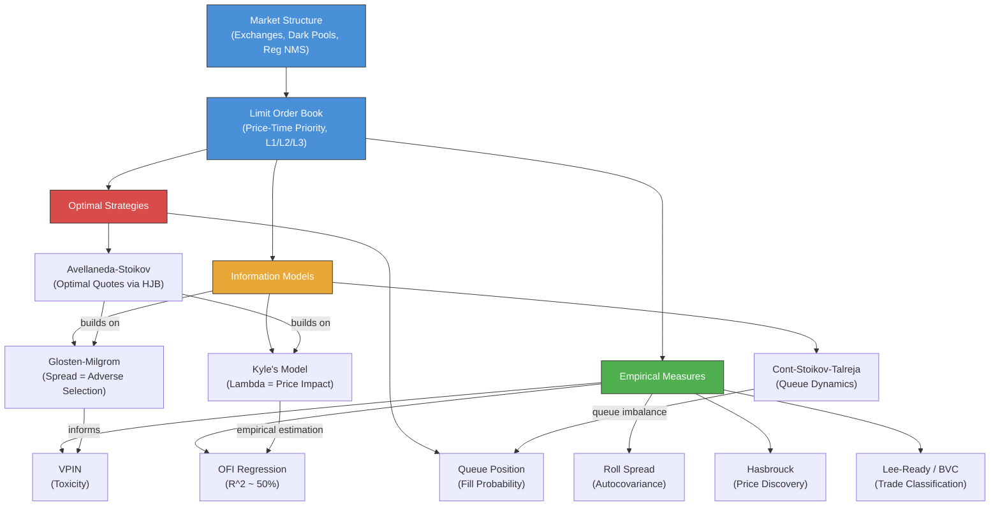

# Module 23: Order Book Dynamics & Market Microstructure

> **Prerequisites:** Modules 02 (Probability & Stochastic Processes), 04 (Statistical Inference), 21 (Time Series Econometrics)
> **Builds toward:** Modules 28 (Execution Algorithms), 30 (Systematic Trading Systems), 31 (High-Frequency Trading)

---

## Table of Contents

1. [Market Structure & Institutional Framework](#1-market-structure--institutional-framework)
2. [The Limit Order Book](#2-the-limit-order-book)
3. [Glosten-Milgrom Model](#3-glosten-milgrom-model)
4. [Kyle's Model](#4-kyles-model)
5. [Cont-Stoikov-Talreja Queueing Model](#5-cont-stoikov-talreja-queueing-model)
6. [Roll Model](#6-roll-model)
7. [Hasbrouck's Information Share](#7-hasbroucks-information-share)
8. [Empirical Microstructure](#8-empirical-microstructure)
9. [Queue Position Models](#9-queue-position-models)
10. [Adverse Selection & Toxicity](#10-adverse-selection--toxicity)
11. [Optimal Market Making: Avellaneda-Stoikov](#11-optimal-market-making-avellaneda-stoikov)
12. [Implementation: Python](#12-implementation-python)
13. [Implementation: C++](#13-implementation-c)
14. [Exercises](#14-exercises)
15. [Summary & Concept Map](#15-summary--concept-map)

---

## 1. Market Structure & Institutional Framework

### 1.1 Exchange Taxonomy

Modern equity markets operate through a fragmented ecosystem of trading venues. Understanding this structure is essential before analyzing order-level dynamics.

**Lit exchanges** (NYSE, Nasdaq, CBOE) maintain visible order books with pre-trade transparency. Each exchange publishes its best bid and offer, which feeds into the National Best Bid and Offer (NBBO). **Dark pools** (Crossfinder, Sigma X, Liquidnet) operate without pre-trade transparency -- orders are hidden and execute at or within the NBBO midpoint. **Crossing networks** aggregate orders and execute at specific times (e.g., at the closing price), providing reduced market impact for institutional blocks.

### 1.2 Maker-Taker Fee Models

Exchanges incentivize liquidity provision through fee structures. Under the **maker-taker model**, the exchange pays a rebate $r_m$ to liquidity providers (makers) and charges a fee $f_t$ to liquidity removers (takers), with $f_t > r_m$ so the exchange nets $f_t - r_m > 0$. Typical values: $r_m \approx 0.20$--$0.30$ cents/share, $f_t \approx 0.25$--$0.35$ cents/share. The **inverted (taker-maker)** model reverses this, attracting aggressive order flow.

The all-in cost for a taker executing a share at quoted price $P$ is:

$$C_{\text{taker}} = P + f_t$$

while a maker who provides liquidity at $P$ receives:

$$C_{\text{maker}} = P - r_m$$

This creates effective spread narrowing for makers and widening for takers relative to quoted spreads.

### 1.3 Regulation NMS (National Market System)

Reg NMS (2005, fully implemented 2007) established four pillars:

1. **Order Protection Rule (Rule 611):** Trade-throughs are prohibited -- no execution at a price inferior to the best displayed quote on any exchange.
2. **Access Rule (Rule 610):** Caps access fees at \$0.003/share and mandates fair electronic access.
3. **Sub-Penny Rule (Rule 612):** Prohibits sub-penny quoting for stocks priced above \$1.00 (minimum tick = \$0.01).
4. **Market Data Rules:** Govern the dissemination and revenue allocation of consolidated market data.

These rules shape the competitive equilibrium across venues and drive the fragmentation that defines modern microstructure.

---

## 2. The Limit Order Book

### 2.1 Structure and Priority

The **limit order book (LOB)** is a record of all outstanding limit orders organized by price level. At each price level, orders queue in **price-time priority**: orders at better prices execute first; at the same price, earlier arrivals execute first (FIFO). Some venues use **price-size-time** or **pro-rata** allocation.

The LOB state at time $t$ is characterized by:

$$\mathcal{L}_t = \{(p_i, q_i^b, q_i^a)\}_{i=1}^{N}$$

where $p_i$ is the $i$-th price level, and $q_i^b$, $q_i^a$ are the aggregate quantities on the bid and ask sides respectively.

**Best bid:** $p^b = \max\{p_i : q_i^b > 0\}$, **Best ask:** $p^a = \min\{p_i : q_i^a > 0\}$

**Spread:** $s = p^a - p^b$, **Midprice:** $m = (p^a + p^b)/2$

**Microprice** (depth-weighted):

$$m^* = \frac{q^a \cdot p^b + q^b \cdot p^a}{q^a + q^b}$$

where $q^b, q^a$ are quantities at the best bid and ask. The microprice pulls toward the side with more liquidity demand (thinner side).

### 2.2 Order Types

| Order Type | Behavior |
|---|---|
| **Market** | Executes immediately against best available; no price guarantee |
| **Limit** | Rests at specified price; executes only at that price or better |
| **IOC (Immediate-or-Cancel)** | Aggressive limit order; unfilled portion canceled instantly |
| **FOK (Fill-or-Kill)** | Entire order must fill immediately, or entire order is canceled |
| **Iceberg** | Displays only a fraction; replenishes visible portion from hidden reserve |
| **Peg** | Pegged to a reference price (e.g., midpoint, primary bid); auto-reprices |
| **Stop** | Becomes market order when trigger price is breached |

### 2.3 Market Data Levels

- **L1 (Top of Book):** Best bid/ask price and size. Sufficient for basic spread analysis.
- **L2 (Depth of Book):** Full order book showing aggregate size at each price level. Reveals support/resistance.
- **L3 (Full Order-by-Order):** Individual order IDs, timestamps, and sizes. Required for queue position analysis and accurate LOB reconstruction.

---

## 3. Glosten-Milgrom Model

### 3.1 Setup

The Glosten-Milgrom (1985) model derives the bid-ask spread as an **adverse selection premium** in a sequential trade framework.

**Assumptions:**

- An asset has fundamental value $V$ which is either $V_H$ (high) or $V_L$ (low), with prior $\Pr(V = V_H) = \delta$.
- A competitive, risk-neutral market maker posts bid $B$ and ask $A$.
- Each period, a single trader arrives. With probability $\mu$, the trader is **informed** (knows $V$); with probability $1 - \mu$, the trader is **uninformed** (liquidity trader).
- Informed traders buy if $V = V_H$ and sell if $V = V_L$. Uninformed traders buy or sell with equal probability $1/2$.

### 3.2 Derivation of Bid and Ask

The market maker sets prices so that expected profit conditional on a buy or sell is zero (competitive, zero-profit condition).

**Ask price (conditional on a buy arriving):**

By Bayes' theorem, the probability that $V = V_H$ given a buy order:

$$\Pr(V = V_H \mid \text{buy}) = \frac{\Pr(\text{buy} \mid V_H) \cdot \delta}{\Pr(\text{buy})}$$

The unconditional probability of a buy:

$$\Pr(\text{buy}) = \mu \cdot \delta + (1 - \mu) \cdot \frac{1}{2}$$

since informed traders buy only when $V = V_H$ (probability $\delta$), and uninformed buy with probability $1/2$.

The likelihood of a buy given $V_H$ is:

$$\Pr(\text{buy} \mid V_H) = \mu + (1 - \mu) \cdot \frac{1}{2}$$

(Informed trader buys with certainty, uninformed buys with probability $1/2$.)

Therefore:

$$\Pr(V = V_H \mid \text{buy}) = \frac{[\mu + (1 - \mu)/2] \cdot \delta}{\mu \delta + (1 - \mu)/2}$$

The zero-profit ask equals the expected value conditional on a buy:

$$A = \mathbb{E}[V \mid \text{buy}] = V_H \cdot \Pr(V_H \mid \text{buy}) + V_L \cdot \Pr(V_L \mid \text{buy})$$

**Bid price (conditional on a sell arriving):**

By symmetric reasoning:

$$\Pr(V = V_L \mid \text{sell}) = \frac{[\mu + (1-\mu)/2](1 - \delta)}{\mu(1-\delta) + (1-\mu)/2}$$

$$B = \mathbb{E}[V \mid \text{sell}] = V_H \cdot \Pr(V_H \mid \text{sell}) + V_L \cdot \Pr(V_L \mid \text{sell})$$

### 3.3 Spread as Adverse Selection

The **bid-ask spread** $s = A - B$ arises purely from information asymmetry. Key results:

- When $\mu = 0$ (no informed traders): $A = B = \delta V_H + (1-\delta) V_L$, so $s = 0$.
- When $\mu \to 1$: $A \to V_H$, $B \to V_L$, so $s \to V_H - V_L$ (full fundamental uncertainty).
- The spread is **increasing in $\mu$** (adverse selection intensity) and in $V_H - V_L$ (fundamental uncertainty).

The market maker loses on average to informed traders and recoups by profiting from uninformed traders. The spread is exactly the premium needed to break even across both populations.

### 3.4 Sequential Bayesian Learning

After each trade, the market maker updates $\delta$ via Bayes' rule. After a buy:

$$\delta' = \Pr(V_H \mid \text{buy}) = \frac{[\mu + (1-\mu)/2]\delta}{\mu\delta + (1-\mu)/2}$$

After a sell:

$$\delta' = \Pr(V_H \mid \text{sell}) = \frac{[(1-\mu)/2]\delta}{\mu(1-\delta) + (1-\mu)/2}$$

As trades accumulate, $\delta \to 0$ or $\delta \to 1$, and the spread converges to zero -- the asset's value becomes commonly known. This illustrates **price discovery** through the sequence of trades.

---

## 4. Kyle's Model

### 4.1 Setup

Kyle (1985) provides a continuous-time model of strategic informed trading. In the single-period version:

- **Fundamental value:** $V \sim \mathcal{N}(\mu_0, \Sigma_0)$
- **Informed trader:** Knows $V$, submits order $x$ (positive = buy).
- **Noise traders:** Submit random order $u \sim \mathcal{N}(0, \sigma_u^2)$, independent of $V$.
- **Market maker:** Observes total order flow $y = x + u$, sets price $p = \mathbb{E}[V \mid y]$.

### 4.2 Linear Equilibrium Derivation

We conjecture a **linear equilibrium:**

1. Informed trader's strategy: $x = \beta(V - \mu_0)$ for some $\beta > 0$.
2. Market maker's pricing rule: $p = \mu_0 + \lambda y$ for some $\lambda > 0$.

**Step 1: Market maker's problem.**

Given $x = \beta(V - \mu_0)$, the total order flow is:

$$y = \beta(V - \mu_0) + u$$

Since $V - \mu_0 \sim \mathcal{N}(0, \Sigma_0)$ and $u \sim \mathcal{N}(0, \sigma_u^2)$, we have $y \sim \mathcal{N}(0, \beta^2 \Sigma_0 + \sigma_u^2)$.

By the projection theorem for jointly normal variables:

$$\mathbb{E}[V \mid y] = \mu_0 + \frac{\text{Cov}(V, y)}{\text{Var}(y)} \cdot y$$

Now $\text{Cov}(V, y) = \text{Cov}(V, \beta(V - \mu_0) + u) = \beta \Sigma_0$, and $\text{Var}(y) = \beta^2 \Sigma_0 + \sigma_u^2$.

Therefore:

$$\lambda = \frac{\beta \Sigma_0}{\beta^2 \Sigma_0 + \sigma_u^2}$$

**Step 2: Informed trader's problem.**

The informed trader maximizes expected profit:

$$\max_x \mathbb{E}[(V - p) \cdot x \mid V] = \max_x (V - \mu_0 - \lambda x) \cdot x$$

where we used $p = \mu_0 + \lambda(x + u)$ and $\mathbb{E}[u] = 0$.

Taking the first-order condition:

$$\frac{d}{dx}[(V - \mu_0)x - \lambda x^2] = (V - \mu_0) - 2\lambda x = 0$$

$$x^* = \frac{V - \mu_0}{2\lambda}$$

Comparing with the conjecture $x = \beta(V - \mu_0)$:

$$\beta = \frac{1}{2\lambda}$$

**Step 3: Solve simultaneously.**

Substituting $\beta = 1/(2\lambda)$ into the expression for $\lambda$:

$$\lambda = \frac{\frac{1}{2\lambda}\Sigma_0}{\frac{1}{4\lambda^2}\Sigma_0 + \sigma_u^2} = \frac{\frac{\Sigma_0}{2\lambda}}{\frac{\Sigma_0}{4\lambda^2} + \sigma_u^2} = \frac{\frac{\Sigma_0}{2\lambda}}{\frac{\Sigma_0 + 4\lambda^2\sigma_u^2}{4\lambda^2}}$$

$$\lambda = \frac{4\lambda^2 \Sigma_0}{2\lambda(\Sigma_0 + 4\lambda^2\sigma_u^2)} = \frac{2\lambda\Sigma_0}{\Sigma_0 + 4\lambda^2\sigma_u^2}$$

$$\Sigma_0 + 4\lambda^2\sigma_u^2 = 2\Sigma_0$$

$$4\lambda^2\sigma_u^2 = \Sigma_0$$

$$\boxed{\lambda = \frac{1}{2}\sqrt{\frac{\Sigma_0}{\sigma_u^2}} = \frac{\sqrt{\Sigma_0}}{2\sigma_u}}$$

And correspondingly:

$$\beta = \frac{1}{2\lambda} = \frac{\sigma_u}{\sqrt{\Sigma_0}}$$

### 4.3 Interpretation of Kyle's Lambda

$\lambda$ is the **price impact coefficient** -- the permanent price change per unit of order flow. Key properties:

- $\lambda$ is **increasing** in $\Sigma_0$ (more uncertainty about fundamentals means more adverse selection, larger price impact).
- $\lambda$ is **decreasing** in $\sigma_u$ (more noise trading provides camouflage for the informed trader, reducing price impact).
- The informed trader's expected profit is $\mathbb{E}[\pi] = \frac{1}{2}\sigma_u\sqrt{\Sigma_0}$, which increases in both noise trading volume and fundamental uncertainty.
- The market is **semi-strong efficient** conditional on the order flow: $p = \mathbb{E}[V \mid y]$.

### 4.4 Multi-Period Extension

In the $N$-period Kyle model, the informed trader trades gradually, revealing information over time. As $N \to \infty$, the model converges to the continuous-time Kyle (1985) setting where the informed trader trades at a constant rate and all information is incorporated by the terminal time.

---

## 5. Cont-Stoikov-Talreja Queueing Model

### 5.1 Order Book as a Queueing System

Cont, Stoikov, and Talreja (2010) model the LOB as a **continuous-time Markov chain** driven by Poisson processes. At each price level $p_i$, the queue size $Q_i(t)$ evolves through:

- **Limit order arrivals:** Poisson process with rate $\lambda_i$ (orders/sec at level $i$).
- **Cancellations:** Each standing order cancels independently at rate $\theta_i$, so the total cancellation rate at level $i$ with $Q_i$ orders is $\theta_i Q_i$.
- **Market order arrivals:** Poisson process with rate $\mu$ that depletes the queue at the best price level.

### 5.2 Queue Dynamics

For the best ask level, the queue size $Q^a(t)$ satisfies:

$$Q^a(t+dt) = Q^a(t) + dN^{\text{limit}}(t) - dN^{\text{cancel}}(t) - dN^{\text{market}}(t)$$

where $dN^{\text{limit}} \sim \text{Poisson}(\lambda \, dt)$, $dN^{\text{cancel}} \sim \text{Poisson}(\theta Q^a(t) \, dt)$, $dN^{\text{market}} \sim \text{Poisson}(\mu \, dt)$.

In stationarity, the expected queue size satisfies:

$$\mathbb{E}[\lambda - \theta Q^a - \mu] = 0 \implies \mathbb{E}[Q^a] = \frac{\lambda - \mu}{\theta}$$

provided $\lambda > \mu$ (limit order arrival rate exceeds market order arrival rate at that level). This is consistent with empirical observations that queue replenishment exceeds depletion under normal conditions.

### 5.3 Price Change Prediction

The model predicts midprice changes based on queue imbalance. Define the **queue imbalance** at the best quotes:

$$I(t) = \frac{Q^b(t) - Q^a(t)}{Q^b(t) + Q^a(t)}$$

where $Q^b, Q^a$ are the best bid and ask queue sizes. Empirically:

$$\mathbb{E}[\Delta m_{t+\tau} \mid I(t)] \approx \alpha \cdot I(t)$$

with $\alpha > 0$: when the bid queue is larger than the ask queue ($I > 0$), the midprice tends to increase (the ask side is more likely to be consumed first). This queue imbalance is one of the strongest short-horizon predictors of price movement.

---

## 6. Roll Model

### 6.1 Deriving Spread from Autocovariance

Roll (1984) provides a method to estimate the effective spread from transaction price data alone, without needing order book data.

**Setup:** The efficient price follows a random walk:

$$m_t = m_{t-1} + u_t, \quad u_t \sim \text{i.i.d.}(0, \sigma_u^2)$$

Each transaction occurs at either the bid or ask:

$$p_t = m_t + c \cdot d_t$$

where $c = s/2$ is the half-spread and $d_t \in \{-1, +1\}$ is an i.i.d. trade direction indicator with $\Pr(d_t = 1) = \Pr(d_t = -1) = 1/2$, independent of $u_t$.

**Derivation of autocovariance:**

The price change is:

$$\Delta p_t = p_t - p_{t-1} = (m_t - m_{t-1}) + c(d_t - d_{t-1}) = u_t + c(d_t - d_{t-1})$$

Compute the first-order autocovariance:

$$\text{Cov}(\Delta p_t, \Delta p_{t-1}) = \text{Cov}(u_t + c \cdot d_t - c \cdot d_{t-1}, \; u_{t-1} + c \cdot d_{t-1} - c \cdot d_{t-2})$$

Since $u_t, d_t$ are mutually independent across time, the only nonzero term involves $d_{t-1}$:

$$= \text{Cov}(-c \cdot d_{t-1}, \; c \cdot d_{t-1}) = -c^2 \cdot \text{Var}(d_{t-1}) = -c^2$$

since $\text{Var}(d_t) = 1$. The **Roll estimator** for the effective spread is:

$$\boxed{\hat{s}_{\text{Roll}} = 2\hat{c} = 2\sqrt{-\widehat{\text{Cov}}(\Delta p_t, \Delta p_{t-1})}}$$

This is defined only when the first-order autocovariance of price changes is negative (which is typical due to bid-ask bounce). The Roll spread estimates the round-trip transaction cost embedded in quoted prices.

---

## 7. Hasbrouck's Information Share

### 7.1 Price Discovery Across Venues

When an asset trades on multiple venues (exchanges, dark pools), **price discovery** -- the process by which new information is incorporated into prices -- may occur at different rates on different venues.

Hasbrouck (1995) measures each venue's contribution to price discovery using a **Vector Error Correction Model (VECM)**. Let $p_t^{(k)}$ be the log price on venue $k$. Since these are cointegrated (they track the same fundamental value), they share a common efficient price $m_t$.

The VECM representation is:

$$\Delta \mathbf{p}_t = \boldsymbol{\alpha} \boldsymbol{\beta}' \mathbf{p}_{t-1} + \sum_{j=1}^{J} \Gamma_j \Delta \mathbf{p}_{t-j} + \boldsymbol{\varepsilon}_t$$

where $\boldsymbol{\beta}'$ is the cointegrating vector (approximately $[1, -1]$ for two venues) and $\boldsymbol{\alpha}$ contains the error-correction speeds.

### 7.2 Information Share Computation

The **information share** of venue $k$ is defined as the proportion of variance in the efficient price innovation attributable to venue $k$:

$$IS_k = \frac{(\boldsymbol{\psi} \mathbf{F})_k^2}{\boldsymbol{\psi} \Omega \boldsymbol{\psi}'}$$

where $\boldsymbol{\psi}$ is the common factor coefficient vector from the VMA($\infty$) representation, $\Omega$ is the covariance matrix of $\boldsymbol{\varepsilon}_t$, and $\mathbf{F}$ is the Cholesky factor of $\Omega$ ($\Omega = \mathbf{F}\mathbf{F}'$). Because the Cholesky decomposition depends on ordering, Hasbrouck computes upper and lower bounds by permuting the venue ordering.

---

## 8. Empirical Microstructure

### 8.1 Order Flow Imbalance (OFI) and Price Impact

**Order Flow Imbalance (OFI)** aggregates changes in the best bid and ask quotes over a time interval $[t-1, t]$:

$$\text{OFI}_t = \sum_{n} e_n$$

where each event $e_n$ captures signed queue changes at the best bid/ask. The regression model:

$$\Delta p_t = \alpha + \beta \cdot \text{OFI}_t + \varepsilon_t$$

consistently yields $\beta > 0$ and $R^2$ values of 40--65% at the 10-second horizon for liquid equities, making OFI one of the most powerful contemporaneous predictors of price change.

### 8.2 Trade Classification

**Lee-Ready algorithm (1991):**

1. **Quote test:** If trade price > midprice, classify as buy; if < midprice, classify as sell.
2. **Tick test (fallback):** If trade price = midprice, compare to previous trade. Uptick = buy, downtick = sell.

**Bulk Volume Classification (BVC)** uses a continuous probabilistic assignment:

$$V_t^b = V_t \cdot \Phi\left(\frac{\Delta p_t}{\sigma_{\Delta p}}\right)$$

where $\Phi$ is the standard normal CDF, $V_t$ is total volume, and $\sigma_{\Delta p}$ is the standard deviation of price changes. This avoids the discrete misclassification of Lee-Ready.

### 8.3 Intraday Patterns

Empirical regularities across equity markets:

- **Volume:** U-shaped pattern -- high at open, declining through midday, rising into close.
- **Volatility:** Follows a similar U-shape (highest at open/close, lowest midday).
- **Spread:** Reverse U-shape -- widest at open (high uncertainty), narrowing through the day, slight widening at close.
- **Price impact:** Highest at open when information asymmetry is greatest.

These patterns are driven by the clustering of information release at the open and portfolio rebalancing at the close.

---

## 9. Queue Position Models

### 9.1 Queue Priority Value

Your position in a limit order queue determines your **fill probability**. If you are at position $k$ in a queue of depth $Q$, and a market order of size $M$ arrives, you fill if and only if $M \geq k$.

The value of queue position $k$ relative to position $k+1$ is the marginal fill probability:

$$\Delta \text{Fill}(k) = \Pr(M \geq k) - \Pr(M \geq k+1) = \Pr(M = k)$$

If market order sizes follow an exponential distribution with rate $\eta$:

$$\Pr(M \geq k) = e^{-\eta k}$$

$$\text{Fill probability at position } k = e^{-\eta k}$$

The expected profit from position $k$ with half-spread $c$ is:

$$\pi(k) = c \cdot e^{-\eta k} - \ell \cdot \Pr(\text{adverse fill})$$

where $\ell$ represents the expected loss from being filled when the price moves adversely (adverse selection cost).

### 9.2 Optimal Queue Joining

A trader should join a queue if the expected profit exceeds the opportunity cost. Given queue depth $Q$ and the trader would be at position $Q + 1$:

$$\text{Join if } \quad c \cdot e^{-\eta(Q+1)} > \ell \cdot \Pr(\text{informed trade})$$

This creates a natural limit on equilibrium queue depth: as the queue grows, marginal entrants face diminishing fill probability until joining is no longer profitable.

---

## 10. Adverse Selection & Toxicity

### 10.1 Measuring Toxicity

**Order flow toxicity** refers to the degree of informed trading that adversely affects market makers. High toxicity environments lead to wider spreads and reduced liquidity.

### 10.2 VPIN (Volume-Synchronized Probability of Informed Trading)

VPIN (Easley, Lopez de Prado, and O'Hara, 2012) estimates the probability of informed trading in real-time using volume-synchronized sampling.

**Construction:**

1. Partition the trading day into **volume buckets** of equal size $V_{\text{bucket}}$.
2. Within each bucket $\tau$, classify volume as buy ($V_\tau^B$) or sell ($V_\tau^S$) using BVC:

$$V_\tau^B = \sum_{\text{trades in } \tau} V_i \cdot \Phi\left(\frac{\Delta p_i}{\sigma_{\Delta p}}\right), \quad V_\tau^S = V_{\text{bucket}} - V_\tau^B$$

3. Compute VPIN over the last $n$ buckets:

$$\text{VPIN} = \frac{\sum_{\tau=1}^{n} |V_\tau^B - V_\tau^S|}{n \cdot V_{\text{bucket}}}$$

**Interpretation:** VPIN $\in [0, 1]$. A high VPIN indicates **imbalanced order flow** consistent with informed trading. VPIN has been shown to spike before flash crashes and periods of extreme volatility, providing an early-warning signal of toxic flow.

---

## 11. Optimal Market Making: Avellaneda-Stoikov

### 11.1 Problem Setup

Avellaneda and Stoikov (2008) derive optimal bid and ask quotes for a market maker who maximizes expected utility of terminal wealth while managing inventory risk.

**State variables:**

- Mid-price: $S_t$ following arithmetic Brownian motion $dS_t = \sigma \, dW_t$
- Inventory: $q_t \in \mathbb{Z}$ (number of shares held)
- Cash: $X_t$
- Time horizon: $T$

**Market order arrival:** If the market maker posts spread $\delta^a$ above mid on the ask and $\delta^b$ below mid on the bid, the arrival rates of fills follow:

$$\Lambda^a(\delta^a) = A e^{-\kappa \delta^a}, \quad \Lambda^b(\delta^b) = A e^{-\kappa \delta^b}$$

where $A$ is a base arrival rate and $\kappa$ controls the sensitivity of fill probability to spread.

### 11.2 HJB Equation

The market maker maximizes:

$$\max_{\delta^a, \delta^b} \mathbb{E}\left[-\exp(-\gamma(X_T + q_T S_T))\right]$$

where $\gamma$ is the risk-aversion parameter (CARA utility). Define the value function:

$$V(t, x, S, q) = \max_{\delta^a, \delta^b} \mathbb{E}\left[-\exp(-\gamma(X_T + q_T S_T)) \mid X_t = x, S_t = S, q_t = q\right]$$

The **Hamilton-Jacobi-Bellman (HJB)** equation is:

$$\frac{\partial V}{\partial t} + \frac{1}{2}\sigma^2 \frac{\partial^2 V}{\partial S^2} + \max_{\delta^a}\left[\Lambda^a(\delta^a)(V(t, x + S + \delta^a, S, q-1) - V)\right] + \max_{\delta^b}\left[\Lambda^b(\delta^b)(V(t, x - S + \delta^b, S, q+1) - V)\right] = 0$$

### 11.3 Solution: Optimal Quotes

Using the ansatz $V = -\exp(-\gamma(x + qS + \theta(t,q)))$ and solving, the **optimal reservation price** and **optimal spread** are:

**Reservation price:**

$$r(t, q) = S - q \gamma \sigma^2 (T - t)$$

This is the mid-price adjusted for **inventory risk**: long inventory ($q > 0$) lowers the reservation price (the market maker is eager to sell), and vice versa.

**Optimal spread around the reservation price:**

$$\delta^* = \delta^{a*} + \delta^{b*} = \gamma \sigma^2 (T - t) + \frac{2}{\kappa} \ln\left(1 + \frac{\kappa}{\gamma}\right)$$

The optimal bid and ask quotes are:

$$\boxed{p^a = r(t,q) + \frac{\delta^*}{2} = S - q\gamma\sigma^2(T-t) + \frac{1}{2}\left[\gamma\sigma^2(T-t) + \frac{2}{\kappa}\ln\left(1 + \frac{\kappa}{\gamma}\right)\right]}$$

$$\boxed{p^b = r(t,q) - \frac{\delta^*}{2} = S - q\gamma\sigma^2(T-t) - \frac{1}{2}\left[\gamma\sigma^2(T-t) + \frac{2}{\kappa}\ln\left(1 + \frac{\kappa}{\gamma}\right)\right]}$$

### 11.4 Intuition

The optimal quotes encode three effects:

1. **Inventory control:** The $-q\gamma\sigma^2(T-t)$ term skews quotes toward reducing inventory. A long market maker lowers both quotes to attract sells and discourage buys.
2. **Volatility risk:** Higher $\sigma$ widens the spread (compensation for holding risky inventory).
3. **Fill probability trade-off:** The $\frac{2}{\kappa}\ln(1 + \kappa/\gamma)$ term reflects the trade-off between profit per trade and fill rate.

---

## 12. Implementation: Python

### 12.1 Limit Order Book Simulator

```python
"""
order_book_simulator.py
Limit Order Book with price-time priority, supporting limit/market/cancel.
"""
from __future__ import annotations
import heapq
import itertools
from dataclasses import dataclass, field
from enum import Enum, auto
from typing import Optional
import numpy as np


class Side(Enum):
    BID = auto()
    ASK = auto()


@dataclass(order=True)
class Order:
    """Single order in the book. Sorting: bids by (-price, time), asks by (price, time)."""
    sort_key: tuple = field(init=False, repr=False)
    price: float
    size: float
    side: Side
    order_id: int
    timestamp: float

    def __post_init__(self):
        if self.side == Side.BID:
            self.sort_key = (-self.price, self.timestamp)
        else:
            self.sort_key = (self.price, self.timestamp)


class LimitOrderBook:
    """
    High-level LOB with price-time priority.
    Maintains sorted heaps for bid/ask sides.
    """
    _id_counter = itertools.count(1)

    def __init__(self):
        self.bids: list[Order] = []       # min-heap on (-price, time)
        self.asks: list[Order] = []       # min-heap on (price, time)
        self.orders: dict[int, Order] = {}
        self.trades: list[dict] = []

    def add_limit_order(self, side: Side, price: float, size: float,
                        timestamp: float = 0.0) -> int:
        oid = next(self._id_counter)
        order = Order(price=price, size=size, side=side,
                      order_id=oid, timestamp=timestamp)
        self.orders[oid] = order
        heap = self.bids if side == Side.BID else self.asks
        heapq.heappush(heap, order)
        self._try_match()
        return oid

    def add_market_order(self, side: Side, size: float,
                         timestamp: float = 0.0) -> list[dict]:
        """Execute a market order against resting liquidity."""
        book = self.asks if side == Side.BID else self.bids
        fills = []
        remaining = size
        while remaining > 0 and book:
            best = book[0]
            if best.order_id not in self.orders:
                heapq.heappop(book)
                continue
            fill_qty = min(remaining, best.size)
            trade = {"price": best.price, "size": fill_qty,
                     "aggressor": side.name, "timestamp": timestamp}
            fills.append(trade)
            self.trades.append(trade)
            best.size -= fill_qty
            remaining -= fill_qty
            if best.size <= 1e-12:
                heapq.heappop(book)
                del self.orders[best.order_id]
        return fills

    def cancel_order(self, order_id: int) -> bool:
        if order_id in self.orders:
            del self.orders[order_id]  # lazy deletion
            return True
        return False

    def _try_match(self):
        """Match crossing orders."""
        while (self.bids and self.asks and
               self.bids[0].order_id in self.orders and
               self.asks[0].order_id in self.orders and
               (-self.bids[0].sort_key[0]) >= self.asks[0].sort_key[0]):
            bid = self.bids[0]
            ask = self.asks[0]
            fill_qty = min(bid.size, ask.size)
            trade = {"price": ask.price, "size": fill_qty,
                     "aggressor": "CROSS", "timestamp": 0.0}
            self.trades.append(trade)
            bid.size -= fill_qty
            ask.size -= fill_qty
            if bid.size <= 1e-12:
                heapq.heappop(self.bids)
                del self.orders[bid.order_id]
            if ask.size <= 1e-12:
                heapq.heappop(self.asks)
                del self.orders[ask.order_id]

    @property
    def best_bid(self) -> Optional[float]:
        while self.bids and self.bids[0].order_id not in self.orders:
            heapq.heappop(self.bids)
        return -self.bids[0].sort_key[0] if self.bids else None

    @property
    def best_ask(self) -> Optional[float]:
        while self.asks and self.asks[0].order_id not in self.orders:
            heapq.heappop(self.asks)
        return self.asks[0].sort_key[0] if self.asks else None

    @property
    def midprice(self) -> Optional[float]:
        bb, ba = self.best_bid, self.best_ask
        if bb is not None and ba is not None:
            return (bb + ba) / 2.0
        return None

    @property
    def spread(self) -> Optional[float]:
        bb, ba = self.best_bid, self.best_ask
        if bb is not None and ba is not None:
            return ba - bb
        return None

    def depth_at(self, side: Side, levels: int = 5) -> list[tuple[float, float]]:
        """Return [(price, total_size), ...] for top `levels` price levels."""
        heap = self.bids if side == Side.BID else self.asks
        agg: dict[float, float] = {}
        for o in heap:
            if o.order_id in self.orders:
                p = -o.sort_key[0] if side == Side.BID else o.sort_key[0]
                agg[p] = agg.get(p, 0.0) + o.size
        rev = (side == Side.BID)
        return sorted(agg.items(), key=lambda x: x[0], reverse=rev)[:levels]
```

### 12.2 Kyle's Lambda Estimator

```python
"""
kyles_lambda.py
Estimate Kyle's lambda (price impact coefficient) via OLS regression
of price changes on signed order flow.
"""
import numpy as np
from numpy.typing import NDArray


def estimate_kyle_lambda(
    prices: NDArray[np.float64],
    volumes: NDArray[np.float64],
    signs: NDArray[np.int8],
    method: str = "ols"
) -> dict[str, float]:
    """
    Estimate Kyle's lambda from trade data.

    Parameters
    ----------
    prices : array of trade prices, shape (N,)
    volumes : array of unsigned trade volumes, shape (N,)
    signs : array of trade signs (+1 buy, -1 sell), shape (N,)
    method : 'ols' for simple regression, 'robust' for Huber regression

    Returns
    -------
    dict with keys: 'lambda', 'r_squared', 'n_obs', 't_stat'
    """
    dp = np.diff(prices)
    signed_flow = (volumes * signs)[1:]  # align with dp

    # Aggregate to time bars if needed (here trade-by-trade)
    n = len(dp)
    X = signed_flow.reshape(-1, 1)
    X_with_const = np.column_stack([np.ones(n), X])

    # OLS: dp = alpha + lambda * signed_flow + eps
    beta_hat = np.linalg.lstsq(X_with_const, dp, rcond=None)[0]
    residuals = dp - X_with_const @ beta_hat
    ss_res = np.sum(residuals ** 2)
    ss_tot = np.sum((dp - dp.mean()) ** 2)
    r_sq = 1.0 - ss_res / ss_tot if ss_tot > 0 else 0.0

    # Standard error of lambda
    sigma2 = ss_res / (n - 2)
    XtX_inv = np.linalg.inv(X_with_const.T @ X_with_const)
    se_lambda = np.sqrt(sigma2 * XtX_inv[1, 1])
    t_stat = beta_hat[1] / se_lambda if se_lambda > 0 else np.inf

    return {
        "lambda": float(beta_hat[1]),
        "intercept": float(beta_hat[0]),
        "r_squared": float(r_sq),
        "t_stat": float(t_stat),
        "n_obs": n,
    }


def kyle_lambda_theoretical(sigma_v: float, sigma_u: float) -> float:
    """Theoretical Kyle's lambda = sqrt(Sigma_0) / (2 * sigma_u)."""
    return np.sqrt(sigma_v) / (2.0 * sigma_u)
```

### 12.3 OFI Regression

```python
"""
ofi_regression.py
Order Flow Imbalance computation and price impact regression.
"""
import numpy as np
import pandas as pd
from numpy.typing import NDArray


def compute_ofi(
    bid_price: NDArray, ask_price: NDArray,
    bid_size: NDArray, ask_size: NDArray
) -> NDArray:
    """
    Compute Order Flow Imbalance (OFI) from L1 quote updates.

    OFI_n = e_n^bid - e_n^ask, where:
      e_n^bid = 1{P_n^b >= P_{n-1}^b} * Q_n^b - 1{P_n^b <= P_{n-1}^b} * Q_{n-1}^b
      e_n^ask = 1{P_n^a <= P_{n-1}^a} * Q_n^a - 1{P_n^a >= P_{n-1}^a} * Q_{n-1}^a
    """
    n = len(bid_price)
    ofi = np.zeros(n)
    for i in range(1, n):
        # Bid side contribution
        e_bid = 0.0
        if bid_price[i] >= bid_price[i-1]:
            e_bid += bid_size[i]
        if bid_price[i] <= bid_price[i-1]:
            e_bid -= bid_size[i-1]

        # Ask side contribution
        e_ask = 0.0
        if ask_price[i] <= ask_price[i-1]:
            e_ask += ask_size[i]
        if ask_price[i] >= ask_price[i-1]:
            e_ask -= ask_size[i-1]

        ofi[i] = e_bid - e_ask
    return ofi


def ofi_price_impact_regression(
    ofi_series: NDArray,
    midprice: NDArray,
    bar_size: int = 100
) -> dict:
    """
    Aggregate OFI into time bars and regress midprice changes on OFI.

    Returns regression coefficients and R-squared.
    """
    n_bars = len(ofi_series) // bar_size
    ofi_bars = np.array([
        ofi_series[i*bar_size:(i+1)*bar_size].sum()
        for i in range(n_bars)
    ])
    mid_bars = np.array([
        midprice[(i+1)*bar_size - 1] for i in range(n_bars)
    ])
    dp = np.diff(mid_bars)
    ofi_x = ofi_bars[1:]

    # OLS
    X = np.column_stack([np.ones(len(dp)), ofi_x])
    beta = np.linalg.lstsq(X, dp, rcond=None)[0]
    fitted = X @ beta
    ss_res = np.sum((dp - fitted) ** 2)
    ss_tot = np.sum((dp - dp.mean()) ** 2)
    r_sq = 1.0 - ss_res / ss_tot if ss_tot > 0 else 0.0

    return {"intercept": beta[0], "beta_ofi": beta[1], "r_squared": r_sq}
```

### 12.4 VPIN Estimator

```python
"""
vpin.py
Volume-Synchronized Probability of Informed Trading.
"""
import numpy as np
from scipy.stats import norm
from numpy.typing import NDArray


def compute_vpin(
    prices: NDArray[np.float64],
    volumes: NDArray[np.float64],
    bucket_volume: float,
    n_buckets: int = 50
) -> NDArray[np.float64]:
    """
    Compute VPIN using Bulk Volume Classification.

    Parameters
    ----------
    prices : trade prices, shape (N,)
    volumes : trade volumes, shape (N,)
    bucket_volume : target volume per bucket
    n_buckets : lookback window in buckets

    Returns
    -------
    vpin_series : VPIN values, one per completed bucket
    """
    dp = np.diff(np.log(prices))
    sigma_dp = np.std(dp[dp != 0]) if np.any(dp != 0) else 1e-8

    # Bulk Volume Classification
    buy_pct = norm.cdf(dp / sigma_dp)
    buy_vol = volumes[1:] * buy_pct
    sell_vol = volumes[1:] * (1.0 - buy_pct)

    # Fill volume buckets
    bucket_buy, bucket_sell = [], []
    cum_buy, cum_sell, cum_vol = 0.0, 0.0, 0.0

    for i in range(len(buy_vol)):
        remaining_buy = buy_vol[i]
        remaining_sell = sell_vol[i]
        remaining_total = remaining_buy + remaining_sell

        while remaining_total > 0:
            space = bucket_volume - cum_vol
            if remaining_total <= space:
                cum_buy += remaining_buy
                cum_sell += remaining_sell
                cum_vol += remaining_total
                remaining_total = 0.0
            else:
                frac = space / remaining_total
                cum_buy += remaining_buy * frac
                cum_sell += remaining_sell * frac
                remaining_buy *= (1 - frac)
                remaining_sell *= (1 - frac)
                remaining_total = remaining_buy + remaining_sell
                # Complete the bucket
                bucket_buy.append(cum_buy)
                bucket_sell.append(cum_sell)
                cum_buy, cum_sell, cum_vol = 0.0, 0.0, 0.0

    # Compute rolling VPIN
    bucket_buy = np.array(bucket_buy)
    bucket_sell = np.array(bucket_sell)
    order_imbalance = np.abs(bucket_buy - bucket_sell)

    vpin_series = []
    for i in range(n_buckets - 1, len(order_imbalance)):
        window = order_imbalance[i - n_buckets + 1: i + 1]
        vpin_val = window.sum() / (n_buckets * bucket_volume)
        vpin_series.append(vpin_val)

    return np.array(vpin_series)
```

### 12.5 Avellaneda-Stoikov Market Maker

```python
"""
avellaneda_stoikov.py
Optimal market making under the Avellaneda-Stoikov framework.
Simulates the strategy on a synthetic mid-price path.
"""
import numpy as np
from dataclasses import dataclass


@dataclass
class ASParams:
    gamma: float = 0.1       # Risk aversion
    sigma: float = 0.3       # Mid-price volatility (annualized, will convert)
    kappa: float = 1.5       # Order arrival sensitivity
    A: float = 100.0         # Base arrival rate (orders/sec)
    T: float = 1.0           # Trading horizon (seconds, normalized)
    dt: float = 0.001        # Time step
    S0: float = 100.0        # Initial mid-price


def reservation_price(S: float, q: int, t: float,
                      params: ASParams) -> float:
    """r(t,q) = S - q * gamma * sigma^2 * (T - t)"""
    return S - q * params.gamma * params.sigma**2 * (params.T - t)


def optimal_spread(t: float, params: ASParams) -> float:
    """delta* = gamma * sigma^2 * (T-t) + (2/kappa) * ln(1 + kappa/gamma)"""
    return (params.gamma * params.sigma**2 * (params.T - t)
            + (2.0 / params.kappa) * np.log(1.0 + params.kappa / params.gamma))


def simulate_as_market_maker(params: ASParams, seed: int = 42):
    """
    Simulate Avellaneda-Stoikov market maker over [0, T].

    Returns dict with time series of mid-prices, quotes, inventory, PnL.
    """
    rng = np.random.default_rng(seed)
    n_steps = int(params.T / params.dt)
    sigma_dt = params.sigma * np.sqrt(params.dt)

    # State variables
    S = params.S0
    q = 0          # inventory
    cash = 0.0     # accumulated cash
    t = 0.0

    records = {
        "time": [], "mid": [], "bid": [], "ask": [],
        "inventory": [], "cash": [], "pnl": []
    }

    for _ in range(n_steps):
        # Optimal quotes
        r = reservation_price(S, q, t, params)
        delta = optimal_spread(t, params)
        bid = r - delta / 2.0
        ask = r + delta / 2.0

        # Record state
        records["time"].append(t)
        records["mid"].append(S)
        records["bid"].append(bid)
        records["ask"].append(ask)
        records["inventory"].append(q)
        records["cash"].append(cash)
        records["pnl"].append(cash + q * S)

        # Simulate fills (Poisson arrivals)
        delta_a = ask - S
        delta_b = S - bid
        lambda_a = params.A * np.exp(-params.kappa * max(delta_a, 0))
        lambda_b = params.A * np.exp(-params.kappa * max(delta_b, 0))

        n_ask_fills = rng.poisson(lambda_a * params.dt)
        n_bid_fills = rng.poisson(lambda_b * params.dt)

        # Execute fills
        if n_ask_fills > 0:
            cash += ask * n_ask_fills
            q -= n_ask_fills
        if n_bid_fills > 0:
            cash -= bid * n_bid_fills
            q += n_bid_fills

        # Evolve mid-price
        S += sigma_dt * rng.standard_normal()
        t += params.dt

    # Terminal: liquidate at mid
    final_pnl = cash + q * S
    records["final_pnl"] = final_pnl
    records["final_inventory"] = q
    return records
```

---

## 13. Implementation: C++

### 13.1 High-Performance Limit Order Book

```cpp
/**
 * order_book.hpp
 * Lock-free-ready Limit Order Book with price-time priority.
 * Uses intrusive sorted structures for O(1) best-price access
 * and O(log N) insertion.
 *
 * Compile: g++ -std=c++20 -O3 -o order_book order_book.cpp
 */
#pragma once

#include <cstdint>
#include <map>
#include <unordered_map>
#include <deque>
#include <vector>
#include <optional>
#include <stdexcept>
#include <algorithm>
#include <chrono>
#include <cmath>
#include <iostream>
#include <iomanip>

namespace microstructure {

using Price   = int64_t;   // price in ticks (integer to avoid floating-point issues)
using Qty     = int64_t;
using OrderId = uint64_t;

constexpr double TICK_SIZE = 0.01;  // $0.01 tick

inline Price to_ticks(double price) {
    return static_cast<Price>(std::round(price / TICK_SIZE));
}

inline double to_price(Price ticks) {
    return ticks * TICK_SIZE;
}

enum class Side : uint8_t { BID = 0, ASK = 1 };

struct Order {
    OrderId  id;
    Side     side;
    Price    price;
    Qty      size;
    Qty      filled{0};
    uint64_t timestamp_ns;

    Qty remaining() const { return size - filled; }
};

struct Trade {
    Price    price;
    Qty      size;
    OrderId  maker_id;
    OrderId  taker_id;
    uint64_t timestamp_ns;
};

/**
 * PriceLevel: FIFO queue of orders at one price tick.
 */
struct PriceLevel {
    Price              price;
    Qty                total_qty{0};
    std::deque<Order*> orders;

    void add(Order* o) {
        orders.push_back(o);
        total_qty += o->remaining();
    }

    void remove(Order* o) {
        total_qty -= o->remaining();
        // Lazy removal: mark and sweep, or erase
        orders.erase(
            std::remove(orders.begin(), orders.end(), o),
            orders.end()
        );
    }
};

/**
 * OrderBook: Full LOB engine with price-time priority.
 *
 * Bids: std::map<Price, PriceLevel, std::greater<>> (descending by price)
 * Asks: std::map<Price, PriceLevel, std::less<>>    (ascending by price)
 */
class OrderBook {
public:
    OrderBook() = default;

    // --- Core operations ---

    std::vector<Trade> add_limit_order(Side side, double price_dbl,
                                        Qty size, OrderId id) {
        Price price = to_ticks(price_dbl);
        auto now = current_ns();

        Order* order = new Order{id, side, price, size, 0, now};
        orders_[id] = order;

        // Try to match against opposite side
        auto trades = match(order);

        // If residual, rest in book
        if (order->remaining() > 0) {
            add_to_book(order);
        }
        return trades;
    }

    std::vector<Trade> add_market_order(Side side, Qty size, OrderId id) {
        auto now = current_ns();
        Order* order = new Order{id, side, 0, size, 0, now};
        orders_[id] = order;

        // Match aggressively -- no price limit
        order->price = (side == Side::BID)
            ? std::numeric_limits<Price>::max()
            : std::numeric_limits<Price>::min();

        auto trades = match(order);

        // Market order residual is discarded (IOC behavior)
        if (order->remaining() > 0) {
            orders_.erase(id);
            delete order;
        }
        return trades;
    }

    bool cancel_order(OrderId id) {
        auto it = orders_.find(id);
        if (it == orders_.end()) return false;

        Order* order = it->second;
        remove_from_book(order);
        orders_.erase(it);
        delete order;
        return true;
    }

    // --- Queries ---

    std::optional<double> best_bid() const {
        if (bids_.empty()) return std::nullopt;
        return to_price(bids_.begin()->first);
    }

    std::optional<double> best_ask() const {
        if (asks_.empty()) return std::nullopt;
        return to_price(asks_.begin()->first);
    }

    std::optional<double> midprice() const {
        auto bb = best_bid();
        auto ba = best_ask();
        if (bb && ba) return (*bb + *ba) / 2.0;
        return std::nullopt;
    }

    std::optional<double> spread() const {
        auto bb = best_bid();
        auto ba = best_ask();
        if (bb && ba) return *ba - *bb;
        return std::nullopt;
    }

    Qty bid_depth_at(double price_dbl) const {
        Price p = to_ticks(price_dbl);
        auto it = bids_.find(p);
        return (it != bids_.end()) ? it->second.total_qty : 0;
    }

    Qty ask_depth_at(double price_dbl) const {
        Price p = to_ticks(price_dbl);
        auto it = asks_.find(p);
        return (it != asks_.end()) ? it->second.total_qty : 0;
    }

    /**
     * Snapshot of top N levels on each side.
     * Returns vector of (price, qty) pairs.
     */
    struct LevelSnapshot { double price; Qty qty; };

    std::vector<LevelSnapshot> top_bids(size_t n = 5) const {
        std::vector<LevelSnapshot> result;
        result.reserve(n);
        size_t count = 0;
        for (auto& [p, level] : bids_) {
            if (count++ >= n) break;
            result.push_back({to_price(p), level.total_qty});
        }
        return result;
    }

    std::vector<LevelSnapshot> top_asks(size_t n = 5) const {
        std::vector<LevelSnapshot> result;
        result.reserve(n);
        size_t count = 0;
        for (auto& [p, level] : asks_) {
            if (count++ >= n) break;
            result.push_back({to_price(p), level.total_qty});
        }
        return result;
    }

    size_t total_orders() const { return orders_.size(); }

    void print_book(size_t levels = 5) const {
        auto a = top_asks(levels);
        auto b = top_bids(levels);
        std::cout << "--- ASK ---\n";
        for (auto it = a.rbegin(); it != a.rend(); ++it)
            std::cout << std::fixed << std::setprecision(2)
                      << it->price << " | " << it->qty << "\n";
        std::cout << "--- BID ---\n";
        for (auto& lv : b)
            std::cout << std::fixed << std::setprecision(2)
                      << lv.price << " | " << lv.qty << "\n";
    }

private:
    // Bids: descending price order
    std::map<Price, PriceLevel, std::greater<Price>> bids_;
    // Asks: ascending price order
    std::map<Price, PriceLevel, std::less<Price>>    asks_;
    // All live orders by ID
    std::unordered_map<OrderId, Order*> orders_;

    uint64_t current_ns() const {
        return std::chrono::duration_cast<std::chrono::nanoseconds>(
            std::chrono::steady_clock::now().time_since_epoch()
        ).count();
    }

    void add_to_book(Order* order) {
        if (order->side == Side::BID) {
            bids_[order->price].price = order->price;
            bids_[order->price].add(order);
        } else {
            asks_[order->price].price = order->price;
            asks_[order->price].add(order);
        }
    }

    void remove_from_book(Order* order) {
        if (order->side == Side::BID) {
            auto it = bids_.find(order->price);
            if (it != bids_.end()) {
                it->second.remove(order);
                if (it->second.orders.empty()) bids_.erase(it);
            }
        } else {
            auto it = asks_.find(order->price);
            if (it != asks_.end()) {
                it->second.remove(order);
                if (it->second.orders.empty()) asks_.erase(it);
            }
        }
    }

    std::vector<Trade> match(Order* aggressor) {
        std::vector<Trade> trades;
        auto& passive_side = (aggressor->side == Side::BID) ? asks_ : bids_;

        while (aggressor->remaining() > 0 && !passive_side.empty()) {
            auto best_it = passive_side.begin();
            PriceLevel& level = best_it->second;

            // Price check
            bool crosses = (aggressor->side == Side::BID)
                ? (aggressor->price >= level.price)
                : (aggressor->price <= level.price);
            if (!crosses) break;

            while (aggressor->remaining() > 0 && !level.orders.empty()) {
                Order* passive = level.orders.front();
                Qty fill_qty = std::min(aggressor->remaining(),
                                        passive->remaining());

                trades.push_back({
                    passive->price, fill_qty,
                    passive->id, aggressor->id,
                    aggressor->timestamp_ns
                });

                aggressor->filled += fill_qty;
                passive->filled += fill_qty;
                level.total_qty -= fill_qty;

                if (passive->remaining() == 0) {
                    level.orders.pop_front();
                    orders_.erase(passive->id);
                    delete passive;
                }
            }

            if (level.orders.empty()) {
                passive_side.erase(best_it);
            }
        }
        return trades;
    }
};

}  // namespace microstructure
```

**Usage example (main.cpp):**

```cpp
#include "order_book.hpp"

int main() {
    using namespace microstructure;
    OrderBook book;

    // Seed the book with resting orders
    for (int i = 0; i < 10; ++i) {
        book.add_limit_order(Side::BID, 99.90 - i * 0.01, 100 + i * 50, 1000 + i);
        book.add_limit_order(Side::ASK, 100.10 + i * 0.01, 100 + i * 50, 2000 + i);
    }

    book.print_book();
    std::cout << "Spread: " << book.spread().value_or(0) << "\n";
    std::cout << "Mid:    " << book.midprice().value_or(0) << "\n";

    // Aggressive buy sweeps 3 levels
    auto trades = book.add_market_order(Side::BID, 350, 9001);
    std::cout << "\nTrades from market buy of 350:\n";
    for (auto& t : trades)
        std::cout << "  " << to_price(t.price) << " x " << t.size << "\n";

    book.print_book();
    return 0;
}
```

---

## 14. Exercises

### Conceptual

**Exercise 23.1** (Glosten-Milgrom). Consider an asset with $V_H = 110$, $V_L = 90$, prior $\delta = 0.5$, and informed trader fraction $\mu = 0.3$.
(a) Compute the ask price $A$ and bid price $B$.
(b) Compute the spread $s$. Verify $s = 0$ when $\mu = 0$.
(c) After observing a buy, compute the updated prior $\delta'$ and the new ask/bid.

**Exercise 23.2** (Kyle's Lambda). In Kyle's model with $\Sigma_0 = 4$, $\sigma_u^2 = 16$:
(a) Compute $\lambda$, $\beta$, and the informed trader's expected profit.
(b) If $\sigma_u$ doubles to $8$, what happens to $\lambda$ and the expected profit? Provide economic intuition.

**Exercise 23.3** (Roll Spread). Given a series of 1,000 transaction prices, you estimate the first-order autocovariance of price changes as $\widehat{\text{Cov}}(\Delta p_t, \Delta p_{t-1}) = -0.0004$. Estimate the effective spread.

**Exercise 23.4** (Avellaneda-Stoikov). A market maker has $\gamma = 0.1$, $\sigma = 0.02$ per second, $\kappa = 1.5$. At time $t$ with $T - t = 10$ seconds and inventory $q = 5$ shares, current mid $S = 100$:
(a) Compute the reservation price $r(t, q)$.
(b) Compute the optimal spread $\delta^*$.
(c) Give the optimal bid and ask quotes.

### Programming

**Exercise 23.5** Extend the Python LOB simulator to support iceberg orders. An iceberg order should display a visible quantity and replenish from a hidden reserve when the visible portion is filled.

**Exercise 23.6** Implement the Lee-Ready trade classification algorithm. Compare its accuracy against BVC on simulated data where the true trade signs are known.

**Exercise 23.7** Simulate a Kyle economy with $N = 100$ periods. Plot the path of the informed trader's cumulative order, the market maker's price, and the true value. Verify that information is gradually incorporated and the terminal price converges to $V$.

**Exercise 23.8** (VPIN Backtest). Using your VPIN implementation, generate synthetic trade data with a regime change (low-information period followed by a high-information period where a large informed trader enters). Show that VPIN spikes before the price moves.

---

## 15. Summary & Concept Map

### Key Takeaways

1. The **bid-ask spread** is fundamentally an adverse selection premium -- compensation for trading against informed counterparties (Glosten-Milgrom).
2. **Kyle's lambda** quantifies price impact as a function of information asymmetry ($\Sigma_0$) and noise trading ($\sigma_u$); $\lambda = \sqrt{\Sigma_0}/(2\sigma_u)$.
3. The **LOB** is a queueing system where arrival/cancellation rates determine equilibrium depth and spread dynamics (Cont-Stoikov-Talreja).
4. **OFI** is the most powerful contemporaneous predictor of short-horizon price changes, with $R^2$ of 40--65%.
5. **VPIN** provides real-time estimates of order flow toxicity, useful as an early warning of flash crashes.
6. **Avellaneda-Stoikov** market making optimally balances fill probability and inventory risk; the reservation price $r = S - q\gamma\sigma^2(T-t)$ skews quotes to manage inventory.

### Concept Map



---

*Next: [Module 24 — Risk Management & Portfolio Theory](../Asset_Pricing/24_risk_portfolio.md)*
