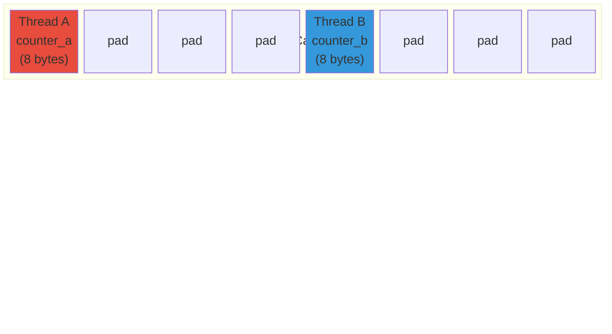
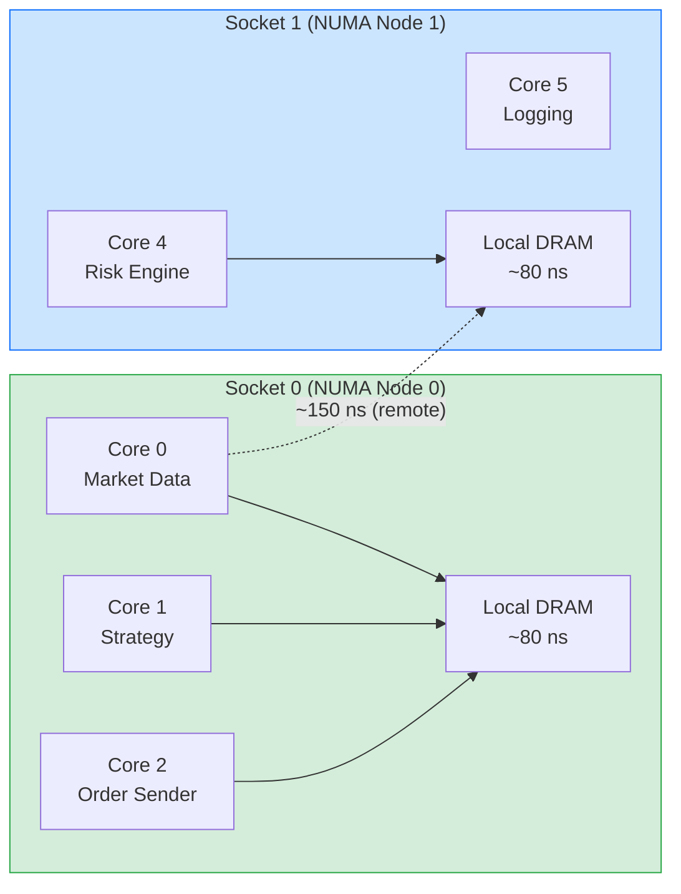
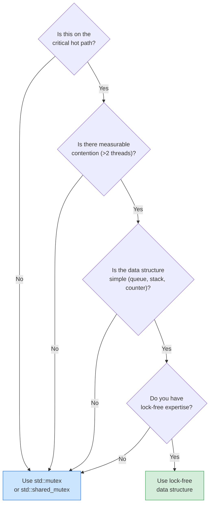
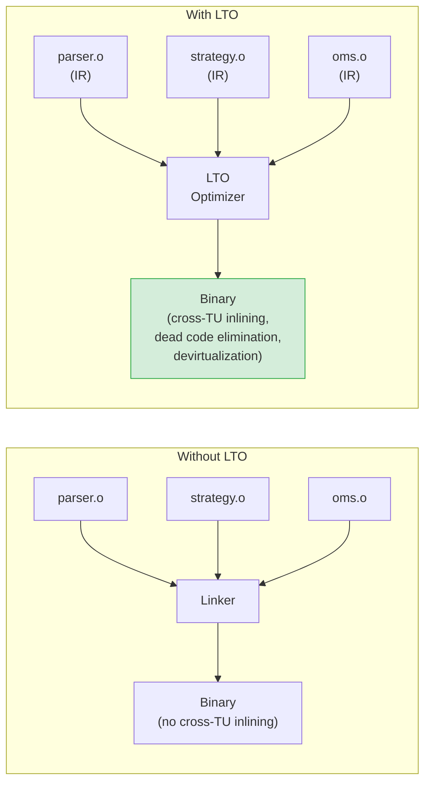

# Module 10: C++ for Low-Latency Systems

> **Quant-Nexus Encyclopedia** -- Computation Track
> Module 10 of 34 | Prerequisites: [Module 09 -- Numerical Methods & Scientific Computing](./09_numerical_methods.md)
> Builds toward: Modules 12 (Networking & Kernel Bypass), 13 (FPGA Co-Processing), 14 (Exchange Connectivity), 16 (Execution Engines), 30 (Full System Integration)

---

## Learning Objectives

After completing this module you will be able to:

1. Leverage C++23 features to write expressive yet zero-overhead quantitative code.
2. Reason about cache hierarchy, alignment, NUMA topology, and false sharing.
3. Replace virtual dispatch with CRTP and concepts-constrained templates.
4. Apply move semantics and zero-copy idioms to eliminate unnecessary allocations on the hot path.
5. Implement correct lock-free data structures using `std::atomic` and appropriate memory orderings.
6. Accelerate Greeks and risk computations with SSE/AVX2/AVX-512 intrinsics.
7. Build custom pool and arena allocators suitable for deterministic-latency trading systems.
8. Configure compilers for maximum throughput with LTO, PGO, and micro-architecture targeting.
9. Measure latency with hardware counters and avoid common micro-benchmark pitfalls.

---

## 1. Modern C++23 for Quantitative Finance

C++23 is the most significant language revision since C++17 for latency-sensitive systems. It closes expressiveness gaps that previously forced quant developers to choose between clarity and performance.

### 1.1 Concepts

Concepts replace SFINAE-based constraints with readable, first-class syntax. In a pricing library, concepts let us constrain template parameters at the interface rather than inside obscure `enable_if` clauses.

```cpp
#include <concepts>
#include <cmath>

// Concept: any type that exposes the Greeks interface
template <typename T>
concept Priceable = requires(T model, double S, double K, double r, double sigma, double T_exp) {
    { model.price(S, K, r, sigma, T_exp) } -> std::convertible_to<double>;
    { model.delta(S, K, r, sigma, T_exp) } -> std::convertible_to<double>;
    { model.gamma(S, K, r, sigma, T_exp) } -> std::convertible_to<double>;
};

// Constrained function -- compiler error is immediate and readable
double hedge_ratio(Priceable auto& model, double S, double K,
                   double r, double sigma, double T_exp) {
    return model.delta(S, K, r, sigma, T_exp);
}
```

Concepts compile to zero overhead: the constraint is checked entirely at compile time and erased before code generation.

### 1.2 Ranges and Views

Ranges compose lazy transformations over data without allocating intermediate containers. For a risk system that processes thousands of positions, this avoids per-stage `std::vector` copies.

```cpp
#include <ranges>
#include <vector>
#include <algorithm>
#include <numeric>

struct Position {
    double notional;
    double delta;
    double pnl;
};

double total_delta_exposure(const std::vector<Position>& book) {
    // Lazy pipeline -- no intermediate allocations
    auto exposures = book
        | std::views::filter([](const Position& p) { return p.notional > 0.0; })
        | std::views::transform([](const Position& p) { return p.notional * p.delta; });

    return std::ranges::fold_left(exposures, 0.0, std::plus<>{});
}
```

The pipeline `filter | transform` creates a *view* -- a lightweight object holding references and lambdas. Iteration is fused: each element passes through both stages in a single loop without materialization.

### 1.3 `std::expected`

Error handling without exceptions is critical on the hot path. `std::expected<T, E>` is a vocabulary type that carries either a value or an error, replacing the old pattern of returning sentinel values or `std::optional` plus out-parameter error codes.

```cpp
#include <expected>
#include <string>
#include <cmath>

enum class PricingError { NegativeVol, NegativeTime, InvalidStrike };

std::expected<double, PricingError> bs_call_price(
        double S, double K, double r, double sigma, double T) {
    if (sigma <= 0.0) return std::unexpected(PricingError::NegativeVol);
    if (T <= 0.0)     return std::unexpected(PricingError::NegativeTime);
    if (K <= 0.0)     return std::unexpected(PricingError::InvalidStrike);

    double d1 = (std::log(S / K) + (r + 0.5 * sigma * sigma) * T)
                / (sigma * std::sqrt(T));
    double d2 = d1 - sigma * std::sqrt(T);
    // N(x) approximation omitted for brevity
    return S * 0.5 * std::erfc(-d1 / std::sqrt(2.0))
         - K * std::exp(-r * T) * 0.5 * std::erfc(-d2 / std::sqrt(2.0));
}
```

### 1.4 `std::mdspan`

Multi-dimensional views over contiguous memory replace hand-rolled matrix wrappers. A covariance matrix stored in a flat `double[]` can be accessed with `(i, j)` syntax at zero cost.

```cpp
#include <mdspan>

void compute_portfolio_variance(
        std::mdspan<const double, std::dextents<size_t, 2>> cov,
        std::span<const double> weights,
        double& variance_out) {
    const auto n = weights.size();
    variance_out = 0.0;
    for (size_t i = 0; i < n; ++i)
        for (size_t j = 0; j < n; ++j)
            variance_out += weights[i] * cov[i, j] * weights[j];
}
```

### 1.5 Deducing `this`

Deducing `this` (P0847) eliminates the boilerplate of providing `const` and non-`const` overloads. It also enables CRTP without the template parameter.

```cpp
struct OrderBook {
    // Single definition covers const, non-const, and rvalue overloads
    template <typename Self>
    auto&& best_bid(this Self&& self) {
        return std::forward<Self>(self).bids_[0];
    }
private:
    std::vector<PriceLevel> bids_;
};
```

### 1.6 `if constexpr`, Structured Bindings, `std::format`

These C++17/20 features remain central to low-latency code.

```cpp
#include <format>
#include <map>

// Structured bindings + if constexpr for compile-time dispatch
template <typename Instrument>
std::string describe(const Instrument& inst) {
    if constexpr (requires { inst.strike(); }) {
        return std::format("Option strike={:.2f} expiry={}", inst.strike(), inst.expiry());
    } else {
        return std::format("Equity ticker={}", inst.ticker());
    }
}
```

### 1.7 C++23 vs C++17 -- Comparison Table

| Feature | C++17 | C++23 |
|---------|-------|-------|
| Constraints | `enable_if`, SFINAE | `concept`, `requires` |
| Ranges | Manual loops, `<algorithm>` | `std::views`, lazy pipelines |
| Error handling | `std::optional`, exceptions | `std::expected<T, E>` |
| Multi-dim arrays | Raw pointer + stride math | `std::mdspan` |
| Formatting | `snprintf`, `<sstream>` | `std::format` |
| CRTP simplification | `Derived` template param | Deducing `this` |

The overall theme: C++23 makes the *correct* pattern the *easy* pattern, which is exactly what you need when latency bugs hide behind convoluted workarounds.

---

## 2. Memory Model and Hardware Awareness

Every nanosecond saved in a matching engine or pricing loop ultimately traces back to how data moves between DRAM, cache, and registers. This section builds a mental model of the hardware that C++ exposes.

### 2.1 Stack vs Heap

| Property | Stack | Heap |
|----------|-------|------|
| Allocation | `sub rsp, N` (1 cycle) | `malloc` / `new` (100--1000 cycles) |
| Deallocation | `add rsp, N` (1 cycle) | `free` / `delete` (variable) |
| Fragmentation | None | Over time, significant |
| Size limit | ~8 MB default (per thread) | Bounded by virtual address space |

**Rule of thumb:** if you can prove the lifetime is bounded by the scope, put it on the stack.

The memory hierarchy latencies that govern all optimization decisions:

| Level | Typical Latency | Size | Notes |
|-------|-----------------|------|-------|
| L1 cache | ~1 ns (4 cycles) | 32--48 KB per core | Split I-cache / D-cache |
| L2 cache | ~4 ns (12 cycles) | 256 KB--1 MB per core | Unified |
| L3 cache | ~12 ns (40 cycles) | 8--64 MB shared | Last-level cache (LLC) |
| DRAM (local) | ~80 ns | 16--512 GB | NUMA-local |
| DRAM (remote) | ~140 ns | -- | Cross-socket |

Every data structure decision should be evaluated against this table. A single L3 miss that goes to DRAM costs as much as 80 additions. A cache-friendly order book that fits in L2 can process updates in under 50 ns; a pointer-chasing red-black tree that misses L3 on every node takes 500 ns per lookup.

### 2.2 Alignment and Padding

The compiler inserts padding to align struct members to their natural boundaries. Incorrect layout inflates cache footprint.

```cpp
#include <cstdint>
#include <iostream>

// Poor layout: 24 bytes
struct OrderBad {
    char     side;       // 1 byte  + 7 padding
    double   price;      // 8 bytes
    int32_t  quantity;   // 4 bytes + 4 padding
};
// sizeof(OrderBad) == 24

// Optimized layout: 16 bytes
struct OrderGood {
    double   price;      // 8 bytes (naturally aligned)
    int32_t  quantity;   // 4 bytes
    char     side;       // 1 byte  + 3 padding
};
// sizeof(OrderGood) == 16

static_assert(sizeof(OrderBad)  == 24);
static_assert(sizeof(OrderGood) == 16);
```

Saving 8 bytes per order means 33% more orders fit in a cache line.

### 2.3 Cache Lines and False Sharing

Modern x86 processors use 64-byte cache lines. When two threads write to different variables that share a cache line, the cache coherence protocol (MESI) bounces the line between cores -- *false sharing*.



**Fix:** pad each variable to a full cache line.

```cpp
#include <atomic>
#include <new>  // std::hardware_destructive_interference_size

struct alignas(std::hardware_destructive_interference_size) AlignedCounter {
    std::atomic<int64_t> value{0};
};

// Two counters on separate cache lines -- no false sharing
AlignedCounter counter_a;
AlignedCounter counter_b;
```

`std::hardware_destructive_interference_size` is the portable way to obtain the L1 cache line size (typically 64).

### 2.4 Prefetching

When the access pattern is predictable (scanning an order book, iterating a time series), software prefetch hints let the CPU begin loading data before the demand load stalls.

```cpp
void sum_prices(const double* prices, size_t n) {
    double total = 0.0;
    for (size_t i = 0; i < n; ++i) {
        // Prefetch 8 doubles (64 bytes = 1 cache line) ahead
        __builtin_prefetch(&prices[i + 8], 0 /* read */, 3 /* high locality */);
        total += prices[i];
    }
}
```

The third argument is a *temporal locality hint*: 3 means "keep in all cache levels," 0 means "non-temporal, okay to evict immediately."

**Prefetch distance tuning:** The optimal prefetch distance depends on the loop body's execution time and the memory latency. If the loop body takes $C$ cycles and DRAM latency is $L$ cycles, prefetch $\lceil L / C \rceil$ iterations ahead. For a loop body of ~10 cycles and DRAM latency of ~300 cycles, prefetch ~30 iterations (240 bytes for doubles) ahead. Too short: the data has not arrived by the time the demand load fires. Too far: the prefetched data may be evicted from L1 before use.

### 2.5 Memory-Mapped I/O

Market data feeds stored as flat binary files can be memory-mapped for zero-copy sequential reads:

```cpp
#include <sys/mman.h>
#include <fcntl.h>
#include <unistd.h>
#include <cstddef>

struct Tick { int64_t timestamp; double price; int32_t size; int32_t pad; };

const Tick* map_tick_file(const char* path, size_t& count) {
    int fd = ::open(path, O_RDONLY);
    off_t file_size = ::lseek(fd, 0, SEEK_END);
    void* mem = ::mmap(nullptr, file_size, PROT_READ, MAP_PRIVATE, fd, 0);
    ::madvise(mem, file_size, MADV_SEQUENTIAL);  // hint sequential access
    ::close(fd);
    count = file_size / sizeof(Tick);
    return static_cast<const Tick*>(mem);
}
```

### 2.6 Huge Pages

Default 4 KB pages create TLB pressure when working sets exceed a few megabytes. Transparent Huge Pages (THP) or explicit 2 MB / 1 GB pages reduce TLB misses dramatically.

```cpp
// Linux: allocate with explicit 2 MB huge pages
void* alloc_huge(size_t bytes) {
    void* p = ::mmap(nullptr, bytes, PROT_READ | PROT_WRITE,
                     MAP_PRIVATE | MAP_ANONYMOUS | MAP_HUGETLB, -1, 0);
    if (p == MAP_FAILED) return nullptr;
    return p;
}
```

On the hot path of a matching engine processing 10 million orders per second, switching from 4 KB to 2 MB pages can reduce tail latency by 15--30% by eliminating TLB misses.

### 2.7 NUMA Considerations

On multi-socket servers, memory access time depends on which socket "owns" the physical memory. A thread pinned to socket 0 accessing memory allocated on socket 1 pays a ~70 ns penalty per access.

```cpp
#include <numa.h>  // libnuma

void pin_to_node(int node) {
    // Bind current thread's memory allocations to a specific NUMA node
    numa_set_preferred(node);

    // Also pin the thread to CPUs on that node
    struct bitmask* cpus = numa_allocate_cpumask();
    numa_node_to_cpus(node, cpus);
    numa_sched_setaffinity(0, cpus);
    numa_free_cpumask(cpus);
}
```

**Best practice for trading systems:** Pin each critical thread (market data reader, strategy, order sender) to a dedicated core on the same NUMA node, and allocate all shared data structures on that node. Use `numactl --membind=0 --cpunodebind=0` at process launch.



---

## 3. Template Metaprogramming

Runtime polymorphism through `virtual` functions costs 5--15 ns per call due to vtable indirection and branch misprediction. In a pricing loop executing millions of times per second, this is unacceptable. Template metaprogramming moves the dispatch to compile time.

### 3.1 CRTP -- Static Polymorphism

The Curiously Recurring Template Pattern (CRTP) achieves polymorphism without a vtable.

```cpp
// Base: provides interface and common logic
template <typename Derived>
struct PricingModel {
    double price(double S, double K, double r, double sigma, double T) const {
        // Static dispatch -- resolved at compile time, fully inlinable
        return static_cast<const Derived*>(this)->price_impl(S, K, r, sigma, T);
    }

    double implied_vol(double S, double K, double r, double T, double market_price,
                       double tol = 1e-8, int max_iter = 100) const {
        // Newton-Raphson IV solver -- shared across all models
        double vol = 0.20;  // initial guess
        for (int i = 0; i < max_iter; ++i) {
            double p = price(S, K, r, vol, T);
            double v = static_cast<const Derived*>(this)->vega_impl(S, K, r, vol, T);
            if (std::abs(v) < 1e-14) break;
            double step = (p - market_price) / v;
            vol -= step;
            if (std::abs(step) < tol) break;
        }
        return vol;
    }
};

struct BlackScholes : PricingModel<BlackScholes> {
    double price_impl(double S, double K, double r, double sigma, double T) const {
        double d1 = (std::log(S / K) + (r + 0.5 * sigma * sigma) * T)
                    / (sigma * std::sqrt(T));
        double d2 = d1 - sigma * std::sqrt(T);
        return S * std::erfc(-d1 / std::sqrt(2.0)) * 0.5
             - K * std::exp(-r * T) * std::erfc(-d2 / std::sqrt(2.0)) * 0.5;
    }

    double vega_impl(double S, double K, double r, double sigma, double T) const {
        double d1 = (std::log(S / K) + (r + 0.5 * sigma * sigma) * T)
                    / (sigma * std::sqrt(T));
        double nd1 = std::exp(-0.5 * d1 * d1) / std::sqrt(2.0 * M_PI);
        return S * nd1 * std::sqrt(T);
    }
};
```

The compiler sees `PricingModel<BlackScholes>` and inlines `price_impl` directly -- no indirection, no branch prediction miss.

### 3.2 SFINAE and `if constexpr`

Before concepts, SFINAE (Substitution Failure Is Not An Error) was the mechanism for conditional compilation. `if constexpr` (C++17) simplified the pattern.

```cpp
#include <type_traits>

// SFINAE style (pre-C++20) -- hard to read
template <typename T,
          std::enable_if_t<std::is_floating_point_v<T>, int> = 0>
T fast_inv_sqrt(T x) {
    // Quake III style for float; standard for double
    if constexpr (std::is_same_v<T, float>) {
        float xhalf = 0.5f * x;
        int32_t i;
        std::memcpy(&i, &x, sizeof(i));
        i = 0x5f3759df - (i >> 1);
        std::memcpy(&x, &i, sizeof(x));
        x *= (1.5f - xhalf * x * x);
        return x;
    } else {
        return 1.0 / std::sqrt(x);
    }
}
```

### 3.3 Compile-Time Computation: `constexpr` and `consteval`

Constants computed at compile time eliminate runtime work entirely.

```cpp
// Compile-time factorial for Taylor series coefficients
consteval double factorial(int n) {
    double result = 1.0;
    for (int i = 2; i <= n; ++i) result *= i;
    return result;
}

// Compile-time cumulative normal (Abramowitz & Stegun approximation)
constexpr double norm_cdf_approx(double x) {
    constexpr double a1 =  0.254829592;
    constexpr double a2 = -0.284496736;
    constexpr double a3 =  1.421413741;
    constexpr double a4 = -1.453152027;
    constexpr double a5 =  1.061405429;
    constexpr double p  =  0.3275911;

    double sign = (x < 0) ? -1.0 : 1.0;
    x = std::abs(x) / std::sqrt(2.0);
    double t = 1.0 / (1.0 + p * x);
    double y = 1.0 - (((((a5 * t + a4) * t) + a3) * t + a2) * t + a1) * t
               * std::exp(-x * x);
    return 0.5 * (1.0 + sign * y);
}
```

`consteval` functions *must* execute at compile time, while `constexpr` functions *may* run at compile time if all inputs are constant expressions.

### 3.4 Variadic Templates

Variadic templates enable type-safe, zero-overhead parameter packs.

```cpp
// Compute weighted sum of arbitrary number of Greeks contributions
template <typename... Args>
double weighted_sum(Args... args) {
    return (... + args);  // C++17 fold expression
}

// Type-safe event dispatch without virtual calls
template <typename Handler, typename... Events>
struct EventDispatcher {
    Handler handler;

    template <typename Event>
    void dispatch(const Event& e) {
        if constexpr ((std::is_same_v<Event, Events> || ...)) {
            handler.on_event(e);
        }
        // Compile-time no-op for unhandled event types
    }
};
```

### 3.5 Type Traits

Type traits query type properties at compile time, enabling specialization.

```cpp
#include <type_traits>

template <typename Numeric>
struct RiskAccumulator {
    static_assert(std::is_arithmetic_v<Numeric>, "Numeric type required");

    // Use SIMD path for float/double, scalar for integers
    void accumulate(const Numeric* data, size_t n) {
        if constexpr (std::is_floating_point_v<Numeric> && sizeof(Numeric) == 8) {
            accumulate_avx2(data, n);  // AVX2 path for doubles
        } else if constexpr (std::is_floating_point_v<Numeric> && sizeof(Numeric) == 4) {
            accumulate_sse(data, n);   // SSE path for floats
        } else {
            accumulate_scalar(data, n);
        }
    }
};
```

### 3.6 Concepts as Modern SFINAE Replacement

Concepts subsume SFINAE entirely and produce clear error messages.

```cpp
template <typename T>
concept Instrument = requires(T inst) {
    { inst.symbol() }   -> std::convertible_to<std::string_view>;
    { inst.notional() } -> std::convertible_to<double>;
    { inst.currency() } -> std::convertible_to<std::string_view>;
};

template <typename T>
concept Derivative = Instrument<T> && requires(T d, double spot) {
    { d.underlying() } -> Instrument;
    { d.payoff(spot) } -> std::convertible_to<double>;
};

// Clean constraint -- compiler produces "constraint not satisfied" with
// full concept tree on failure
void compute_margin(Derivative auto const& d) {
    double notional = d.notional();
    // ...
}
```

---

## 4. Move Semantics and Zero-Copy Patterns

In a trading system, every unnecessary copy on the hot path adds latency. Move semantics and zero-copy idioms ensure data flows from network buffer to strategy to order sender without duplication.

### 4.1 Lvalue and Rvalue References

An *lvalue* names a persistent object; an *rvalue* is a temporary whose resources can be stolen.

```cpp
std::string ticker = "AAPL";       // ticker is an lvalue
std::string moved = std::move(ticker);  // ticker is now in a "moved-from" state
// ticker.size() is valid but unspecified (typically 0)
```

### 4.2 Move Constructor and Assignment

```cpp
struct MarketDataMessage {
    int64_t  timestamp;
    uint32_t symbol_id;
    double   bid;
    double   ask;
    uint32_t bid_size;
    uint32_t ask_size;
    std::vector<double> implied_vols;  // variable-length payload

    // Move constructor -- O(1), steals vector's heap allocation
    MarketDataMessage(MarketDataMessage&& other) noexcept
        : timestamp(other.timestamp)
        , symbol_id(other.symbol_id)
        , bid(other.bid)
        , ask(other.ask)
        , bid_size(other.bid_size)
        , ask_size(other.ask_size)
        , implied_vols(std::move(other.implied_vols))  // pointer swap
    {}

    MarketDataMessage& operator=(MarketDataMessage&& other) noexcept = default;
};
```

**Critical:** Always mark move constructors `noexcept`. `std::vector::push_back` falls back to copy if the move constructor can throw.

### 4.3 Perfect Forwarding

Perfect forwarding preserves the value category (lvalue/rvalue) of arguments through intermediate functions. This is essential for factory functions and message-passing frameworks.

```cpp
template <typename... Args>
auto make_order(Args&&... args) {
    // std::forward preserves lvalue/rvalue-ness of each argument
    return Order(std::forward<Args>(args)...);
}
```

**Reference collapsing rules** govern how forwarding references resolve:

| Template param `T` | Argument | `T&&` becomes |
|---------------------|----------|---------------|
| `T = Order&` | lvalue | `Order& &&` -> `Order&` |
| `T = Order` | rvalue | `Order&&` |

The rule: `& &&` collapses to `&`; all other combinations yield `&&`.

### 4.4 Zero-Copy Message Passing

In a trading pipeline, market data flows from network card to parser to strategy to order manager. Each stage should operate on the *same* buffer.

```cpp
#include <span>
#include <string_view>
#include <cstddef>

// Zero-copy view over a network receive buffer
struct RawMessage {
    std::span<const std::byte> payload;  // non-owning view
    int64_t recv_timestamp;
};

// Parser extracts fields without copying
struct ParsedQuote {
    std::string_view symbol;  // points into original buffer
    double bid;
    double ask;
    int64_t exchange_timestamp;
};

ParsedQuote parse_quote(const RawMessage& raw) {
    const auto* p = reinterpret_cast<const char*>(raw.payload.data());
    // Fixed offsets -- no allocation, no copy
    return ParsedQuote{
        .symbol             = std::string_view(p + 0, 8),
        .bid                = *reinterpret_cast<const double*>(p + 8),
        .ask                = *reinterpret_cast<const double*>(p + 16),
        .exchange_timestamp = *reinterpret_cast<const int64_t*>(p + 24)
    };
}
```

`std::string_view` (non-owning, 16 bytes: pointer + size) and `std::span` (non-owning, 16 bytes: pointer + size) are the workhorses of zero-copy C++. They never allocate, never copy, and the compiler often optimizes them into a single register pair.

### 4.5 Pipeline Ownership Model


Data is allocated once in the NIC ring buffer. Each downstream stage receives either a non-owning view (`span`, `string_view`, `const&`) or takes ownership via `std::move`. No intermediate allocations occur on the critical path.

---

## 5. Lock-Free Programming

Lock-free data structures guarantee that at least one thread makes progress in a finite number of steps, regardless of thread scheduling. In trading systems, this eliminates priority inversion and the tail-latency spikes caused by mutex contention.

### 5.1 `std::atomic` and Memory Orderings

C++ defines six memory orderings that control how operations on atomic variables are visible to other threads.

| Ordering | Guarantee | Use Case |
|----------|-----------|----------|
| `memory_order_relaxed` | Atomicity only; no ordering | Counters, statistics |
| `memory_order_acquire` | Reads after this see writes before a matching release | Consumer side of producer-consumer |
| `memory_order_release` | Writes before this are visible after a matching acquire | Producer side |
| `memory_order_acq_rel` | Both acquire and release | Read-modify-write (CAS) |
| `memory_order_seq_cst` | Total global order | Default; safest but slowest |

```cpp
#include <atomic>

std::atomic<bool> data_ready{false};
int payload = 0;

// Producer thread
void produce() {
    payload = 42;  // non-atomic write
    data_ready.store(true, std::memory_order_release);
    // The release guarantees that the write to payload is visible
    // to any thread that reads data_ready with acquire ordering.
}

// Consumer thread
void consume() {
    while (!data_ready.load(std::memory_order_acquire))
        ;  // spin
    // acquire guarantees payload == 42 is visible here
    assert(payload == 42);
}
```

**Relaxed example -- safe for statistics:**

```cpp
struct LatencyStats {
    std::atomic<uint64_t> count{0};
    std::atomic<uint64_t> total_ns{0};

    void record(uint64_t ns) {
        count.fetch_add(1, std::memory_order_relaxed);
        total_ns.fetch_add(ns, std::memory_order_relaxed);
        // No ordering needed -- we only need eventual consistency for monitoring
    }
};
```

### 5.2 CAS Loops

Compare-And-Swap (CAS) is the fundamental building block of lock-free algorithms. It atomically compares the current value with an expected value and, only if they match, replaces it with a desired value.

```cpp
// Lock-free stack push using CAS
template <typename T>
struct LockFreeStack {
    struct Node {
        T data;
        Node* next;
    };

    std::atomic<Node*> head{nullptr};

    void push(T value) {
        Node* new_node = new Node{std::move(value), nullptr};
        new_node->next = head.load(std::memory_order_relaxed);
        // CAS loop: retry if another thread modified head between load and CAS
        while (!head.compare_exchange_weak(
                    new_node->next, new_node,
                    std::memory_order_release,
                    std::memory_order_relaxed))
            ;  // new_node->next is updated by CAS on failure
    }
};
```

`compare_exchange_weak` may spuriously fail (on ARM/LL-SC architectures), which is fine in a loop. `compare_exchange_strong` guarantees no spurious failure but may be slower.

### 5.3 The ABA Problem

The ABA problem occurs when a CAS succeeds despite the underlying data structure having changed. Thread A reads value `X`, is preempted, Thread B pops `X`, pushes `Y`, pushes `X` back. Thread A's CAS succeeds because the pointer is `X` again, but `X->next` may now be invalid.

**Solutions:**
- **Tagged pointers:** Pack a monotonic counter into the upper bits of the pointer (x86-64 uses only 48 bits for addresses, leaving 16 bits for a tag).
- **Hazard pointers:** Each thread publishes the pointer it is currently reading; no thread frees a pointer that appears in another thread's hazard list.
- **Epoch-based reclamation:** Threads periodically advance a global epoch; memory is freed only when all threads have passed the epoch in which it was retired.

```cpp
// Tagged pointer to solve ABA (x86-64 specific)
struct TaggedPtr {
    uintptr_t ptr : 48;
    uintptr_t tag : 16;
};

static_assert(sizeof(TaggedPtr) == sizeof(uintptr_t));
```

### 5.4 Lock-Free SPSC Queue (Lamport)

The Single-Producer Single-Consumer (SPSC) queue is the most common lock-free structure in trading systems. It connects two threads (e.g., market-data parser to strategy) with minimal overhead.

```cpp
#include <atomic>
#include <array>
#include <optional>
#include <new>
#include <cstddef>

template <typename T, size_t Capacity>
class SPSCQueue {
    static_assert((Capacity & (Capacity - 1)) == 0,
                  "Capacity must be a power of 2");

    // Each slot is cache-line aligned to prevent false sharing between
    // adjacent elements being written by producer and read by consumer
    struct alignas(64) Slot {
        T data;
    };

    std::array<Slot, Capacity> buffer_;

    // Producer and consumer indices on separate cache lines
    alignas(64) std::atomic<size_t> write_idx_{0};
    alignas(64) std::atomic<size_t> read_idx_{0};

    static constexpr size_t mask_ = Capacity - 1;

public:
    // Called by producer thread ONLY
    bool try_push(const T& value) {
        const size_t w = write_idx_.load(std::memory_order_relaxed);
        const size_t next_w = (w + 1) & mask_;

        // Check if full: next write position equals read position
        if (next_w == read_idx_.load(std::memory_order_acquire))
            return false;  // queue full

        buffer_[w].data = value;

        // Release ensures the write to buffer_ is visible before
        // the consumer sees the updated write_idx_
        write_idx_.store(next_w, std::memory_order_release);
        return true;
    }

    // Called by consumer thread ONLY
    std::optional<T> try_pop() {
        const size_t r = read_idx_.load(std::memory_order_relaxed);

        // Check if empty: read position equals write position
        if (r == write_idx_.load(std::memory_order_acquire))
            return std::nullopt;  // queue empty

        T value = std::move(buffer_[r].data);

        // Release ensures the read from buffer_ completes before
        // the producer sees the updated read_idx_
        read_idx_.store((r + 1) & mask_, std::memory_order_release);
        return value;
    }

    bool empty() const {
        return read_idx_.load(std::memory_order_acquire)
            == write_idx_.load(std::memory_order_acquire);
    }

    size_t size() const {
        const size_t w = write_idx_.load(std::memory_order_acquire);
        const size_t r = read_idx_.load(std::memory_order_acquire);
        return (w - r) & mask_;
    }
};
```

**Throughput:** A well-implemented SPSC queue achieves 100--200 million messages per second on modern hardware, with per-message latency under 20 ns.

### 5.5 MPSC Queue

Multi-Producer Single-Consumer queues are used for order aggregation (multiple strategy threads submit to one order sender).

```cpp
template <typename T>
class MPSCQueue {
    struct Node {
        T data;
        std::atomic<Node*> next{nullptr};
    };

    // Stub node avoids special-casing empty queue
    alignas(64) std::atomic<Node*> head_;  // producers CAS here
    alignas(64) Node* tail_;               // consumer reads here (single-threaded)

public:
    MPSCQueue() {
        auto* stub = new Node{};
        head_.store(stub, std::memory_order_relaxed);
        tail_ = stub;
    }

    // Thread-safe: multiple producers
    void push(T value) {
        auto* node = new Node{std::move(value)};
        Node* prev = head_.exchange(node, std::memory_order_acq_rel);
        prev->next.store(node, std::memory_order_release);
    }

    // Single consumer only
    std::optional<T> try_pop() {
        Node* tail = tail_;
        Node* next = tail->next.load(std::memory_order_acquire);
        if (!next) return std::nullopt;

        T value = std::move(next->data);
        tail_ = next;
        delete tail;  // reclaim old stub
        return value;
    }
};
```

### 5.6 Lock-Free Hash Map Sketch

Lock-free hash maps are used for symbol-to-state lookups in market data handlers. The core idea is open addressing with CAS-based insertion.

```cpp
// Simplified lock-free open-addressing hash map (single-writer, multi-reader)
template <typename V, size_t Capacity>
class LockFreeSymbolMap {
    static_assert((Capacity & (Capacity - 1)) == 0, "Power of 2");
    static constexpr uint32_t kEmpty = 0;

    struct Entry {
        std::atomic<uint32_t> key{kEmpty};  // symbol_id; 0 = empty
        V value;                             // written before key is published
    };

    alignas(64) std::array<Entry, Capacity> table_{};

public:
    // Insert (single writer) -- publishes key with release to make value visible
    bool insert(uint32_t symbol_id, const V& val) {
        size_t idx = symbol_id & (Capacity - 1);
        for (size_t probe = 0; probe < Capacity; ++probe) {
            size_t slot = (idx + probe) & (Capacity - 1);
            uint32_t expected = kEmpty;
            if (table_[slot].key.load(std::memory_order_relaxed) == kEmpty) {
                table_[slot].value = val;
                table_[slot].key.store(symbol_id, std::memory_order_release);
                return true;
            }
            if (table_[slot].key.load(std::memory_order_relaxed) == symbol_id)
                return false;  // duplicate
        }
        return false;  // full
    }

    // Lookup (multi-reader) -- acquires key to see published value
    const V* find(uint32_t symbol_id) const {
        size_t idx = symbol_id & (Capacity - 1);
        for (size_t probe = 0; probe < Capacity; ++probe) {
            size_t slot = (idx + probe) & (Capacity - 1);
            uint32_t k = table_[slot].key.load(std::memory_order_acquire);
            if (k == symbol_id) return &table_[slot].value;
            if (k == kEmpty)    return nullptr;
        }
        return nullptr;
    }
};
```

This pattern works well when the map is populated at startup (or infrequently) and read on the hot path by multiple threads. For maps that require concurrent inserts and deletes, consider a split-ordered list or a concurrent hash trie (CTrie), though these are substantially more complex to implement correctly.

### 5.7 When NOT to Use Lock-Free

Lock-free code is notoriously hard to get right and even harder to debug. Prefer `std::mutex` when:

- Contention is low (fewer than 2 threads competing).
- The critical section does I/O (network, disk, logging).
- The data structure is complex (balanced trees, skip lists).
- Correctness is more important than tail latency (risk checks, compliance).
- The system is not yet profiled -- premature lock-free optimization adds complexity without proven benefit.

The cost of a `std::mutex` lock/unlock on an uncontended path is approximately 15--25 ns on modern x86. Only when contention causes that to spike to microseconds does lock-free become worthwhile.

**Decision framework for lock-free vs mutex:**



---

## 6. SIMD Intrinsics

Single Instruction Multiple Data (SIMD) processes 2, 4, 8, or 16 values simultaneously. For computing Greeks across a portfolio or evaluating risk on thousands of positions, SIMD delivers 4--8x throughput gains.

### 6.1 Instruction Set Overview

| ISA | Register Width | Doubles per Register | Available Since |
|-----|---------------|----------------------|-----------------|
| SSE2 | 128-bit | 2 | Pentium 4 (2001) |
| AVX2 | 256-bit | 4 | Haswell (2013) |
| AVX-512 | 512-bit | 8 | Skylake-X (2017) |

### 6.2 Vectorized Greeks Calculation

Computing delta for $N$ options using the Black-Scholes formula:

$$\Delta = \Phi(d_1), \quad d_1 = \frac{\ln(S/K) + (r + \frac{1}{2}\sigma^2)T}{\sigma\sqrt{T}}$$

```cpp
#include <immintrin.h>
#include <cmath>

// Vectorized N(x) approximation using AVX2 (4 doubles at once)
// Abramowitz & Stegun 26.2.17, max error 7.5e-8
__m256d norm_cdf_avx2(__m256d x) {
    const __m256d a1 = _mm256_set1_pd(0.254829592);
    const __m256d a2 = _mm256_set1_pd(-0.284496736);
    const __m256d a3 = _mm256_set1_pd(1.421413741);
    const __m256d a4 = _mm256_set1_pd(-1.453152027);
    const __m256d a5 = _mm256_set1_pd(1.061405429);
    const __m256d p  = _mm256_set1_pd(0.3275911);
    const __m256d one = _mm256_set1_pd(1.0);
    const __m256d half = _mm256_set1_pd(0.5);
    const __m256d sqrt2_inv = _mm256_set1_pd(1.0 / std::sqrt(2.0));

    // sign = (x < 0) ? -1 : 1
    __m256d sign = _mm256_blendv_pd(one, _mm256_set1_pd(-1.0),
                                     _mm256_cmp_pd(x, _mm256_setzero_pd(), _CMP_LT_OQ));
    // x = |x| / sqrt(2)
    __m256d abs_x = _mm256_andnot_pd(_mm256_set1_pd(-0.0), x);
    abs_x = _mm256_mul_pd(abs_x, sqrt2_inv);

    // t = 1 / (1 + p * |x|)
    __m256d t = _mm256_div_pd(one, _mm256_fmadd_pd(p, abs_x, one));

    // Horner evaluation: ((((a5*t + a4)*t + a3)*t + a2)*t + a1)*t
    __m256d poly = _mm256_fmadd_pd(a5, t, a4);
    poly = _mm256_fmadd_pd(poly, t, a3);
    poly = _mm256_fmadd_pd(poly, t, a2);
    poly = _mm256_fmadd_pd(poly, t, a1);
    poly = _mm256_mul_pd(poly, t);

    // exp(-x^2) -- use scalar fallback or a SIMD exp approximation
    // For production, use Intel SVML _mm256_exp_pd or a Remez polynomial
    alignas(32) double xs[4], es[4];
    _mm256_store_pd(xs, _mm256_mul_pd(abs_x, abs_x));
    for (int i = 0; i < 4; ++i) es[i] = std::exp(-xs[i]);
    __m256d exp_val = _mm256_load_pd(es);

    // y = 1 - poly * exp(-x^2)
    __m256d y = _mm256_fnmadd_pd(poly, exp_val, one);

    // result = 0.5 * (1 + sign * y)
    return _mm256_fmadd_pd(sign, y, one);
}

// Compute delta for 4 options at once
void compute_delta_avx2(
        const double* S, const double* K, const double* r,
        const double* sigma, const double* T,
        double* delta_out, size_t n) {

    size_t i = 0;
    for (; i + 4 <= n; i += 4) {
        __m256d vS     = _mm256_loadu_pd(S + i);
        __m256d vK     = _mm256_loadu_pd(K + i);
        __m256d vr     = _mm256_loadu_pd(r + i);
        __m256d vsigma = _mm256_loadu_pd(sigma + i);
        __m256d vT     = _mm256_loadu_pd(T + i);

        // d1 = (log(S/K) + (r + 0.5*sigma^2)*T) / (sigma*sqrt(T))
        __m256d ratio = _mm256_div_pd(vS, vK);

        // log(ratio) -- scalar fallback
        alignas(32) double ratios[4], logs[4];
        _mm256_store_pd(ratios, ratio);
        for (int j = 0; j < 4; ++j) logs[j] = std::log(ratios[j]);
        __m256d log_ratio = _mm256_load_pd(logs);

        __m256d half_sig2 = _mm256_mul_pd(_mm256_set1_pd(0.5),
                                           _mm256_mul_pd(vsigma, vsigma));
        __m256d drift = _mm256_mul_pd(_mm256_add_pd(vr, half_sig2), vT);

        alignas(32) double ts[4], sqrts[4];
        _mm256_store_pd(ts, vT);
        for (int j = 0; j < 4; ++j) sqrts[j] = std::sqrt(ts[j]);
        __m256d sqrt_T = _mm256_load_pd(sqrts);

        __m256d vol_sqrt_T = _mm256_mul_pd(vsigma, sqrt_T);
        __m256d d1 = _mm256_div_pd(_mm256_add_pd(log_ratio, drift), vol_sqrt_T);

        __m256d delta = norm_cdf_avx2(d1);
        _mm256_storeu_pd(delta_out + i, delta);
    }

    // Scalar tail
    for (; i < n; ++i) {
        double d1 = (std::log(S[i] / K[i]) + (r[i] + 0.5 * sigma[i] * sigma[i]) * T[i])
                   / (sigma[i] * std::sqrt(T[i]));
        delta_out[i] = 0.5 * std::erfc(-d1 / std::sqrt(2.0));
    }
}
```

### 6.3 Auto-Vectorization Hints

When writing scalar code that you want the compiler to vectorize:

```cpp
// Hint the compiler to assume no aliasing
void add_arrays(double* __restrict__ out,
                const double* __restrict__ a,
                const double* __restrict__ b, size_t n) {
    #pragma GCC ivdep      // ignore vector dependencies
    for (size_t i = 0; i < n; ++i)
        out[i] = a[i] + b[i];
}
```

Compile with `-O3 -march=native -ffast-math` and check the auto-vectorization report: `g++ -O3 -march=native -fopt-info-vec-optimized`.

### 6.4 SIMD Data Layout: AoS vs SoA

SIMD works best when the same field across multiple objects is contiguous in memory. This requires a *Structure of Arrays* (SoA) layout instead of the traditional *Array of Structures* (AoS).

```cpp
// AoS -- bad for SIMD (fields interleaved in memory)
struct OptionAoS {
    double S, K, r, sigma, T;
};
std::vector<OptionAoS> options_aos(10000);

// SoA -- good for SIMD (each field contiguous)
struct OptionsSoA {
    std::vector<double> S;      // all spot prices contiguous
    std::vector<double> K;      // all strikes contiguous
    std::vector<double> r;      // all rates contiguous
    std::vector<double> sigma;  // all vols contiguous
    std::vector<double> T;      // all expiries contiguous

    explicit OptionsSoA(size_t n) : S(n), K(n), r(n), sigma(n), T(n) {}
};
```

With SoA layout, `_mm256_loadu_pd(&soa.S[i])` loads 4 consecutive spot prices, enabling the vectorized delta computation in Section 6.2 to operate at peak throughput. With AoS layout, each spot price is separated by `sizeof(OptionAoS)` bytes, requiring expensive gather operations (`_mm256_i64gather_pd`), which run 3--5x slower than contiguous loads.

### 6.5 Alignment Requirements

AVX2 requires 32-byte alignment for `_mm256_load_pd`; unaligned loads (`_mm256_loadu_pd`) work but may be slower on older hardware. AVX-512 requires 64-byte alignment for optimal performance.

```cpp
// Allocate aligned memory for SIMD
double* alloc_aligned_doubles(size_t n, size_t alignment = 32) {
    size_t bytes = n * sizeof(double);
    // Round up to alignment boundary
    bytes = (bytes + alignment - 1) & ~(alignment - 1);
    return static_cast<double*>(std::aligned_alloc(alignment, bytes));
}

// C++17 over-aligned new for SIMD-friendly containers
struct alignas(32) SimdDouble4 {
    double v[4];
};
```

When using `std::vector`, note that the default allocator typically provides 16-byte alignment (`alignof(max_align_t)`), which is insufficient for AVX2. Use a custom aligned allocator or `std::aligned_alloc` for raw arrays.

---

## 7. Custom Allocators

Dynamic memory allocation (`malloc`/`new`) is the single largest source of unpredictable latency in C++ programs. A single `malloc` call can take anywhere from 50 ns (hot cache, no contention) to 50 us (mmap fallback, kernel involvement). Custom allocators eliminate this variability on the hot path.

### 7.1 Pool Allocator for Fixed-Size Objects

Pool allocators pre-allocate a block of same-sized slots. Allocation and deallocation are O(1) -- a single pointer update.

```cpp
#include <cstddef>
#include <cstdint>
#include <cassert>
#include <memory>

template <typename T, size_t PoolSize = 65536>
class PoolAllocator {
    union Slot {
        T object;
        Slot* next;
        Slot() {}   // trivial ctor -- no initialization
        ~Slot() {}
    };

    alignas(alignof(T)) std::byte storage_[sizeof(Slot) * PoolSize];
    Slot* free_list_ = nullptr;
    size_t allocated_ = 0;

public:
    PoolAllocator() {
        auto* slots = reinterpret_cast<Slot*>(storage_);
        for (size_t i = 0; i < PoolSize - 1; ++i)
            slots[i].next = &slots[i + 1];
        slots[PoolSize - 1].next = nullptr;
        free_list_ = &slots[0];
    }

    T* allocate() {
        assert(free_list_ && "Pool exhausted");
        Slot* slot = free_list_;
        free_list_ = slot->next;
        ++allocated_;
        return reinterpret_cast<T*>(slot);
    }

    void deallocate(T* ptr) {
        auto* slot = reinterpret_cast<Slot*>(ptr);
        slot->next = free_list_;
        free_list_ = slot;
        --allocated_;
    }

    size_t available() const { return PoolSize - allocated_; }
};
```

### 7.2 Arena (Bump) Allocator

Arena allocators are ideal for request-scoped memory: allocate during request processing, then reset the entire arena when the request completes. Deallocation is free -- just reset the bump pointer.

```cpp
class ArenaAllocator {
    std::byte* base_;
    size_t     capacity_;
    size_t     offset_ = 0;

public:
    explicit ArenaAllocator(size_t bytes)
        : base_(static_cast<std::byte*>(std::aligned_alloc(64, bytes)))
        , capacity_(bytes) {}

    ~ArenaAllocator() { std::free(base_); }

    void* allocate(size_t bytes, size_t alignment = alignof(std::max_align_t)) {
        size_t aligned_offset = (offset_ + alignment - 1) & ~(alignment - 1);
        if (aligned_offset + bytes > capacity_) return nullptr;  // OOM
        void* ptr = base_ + aligned_offset;
        offset_ = aligned_offset + bytes;
        return ptr;
    }

    void reset() { offset_ = 0; }  // O(1) "free everything"

    size_t used() const { return offset_; }
};
```

### 7.3 `std::pmr` -- Polymorphic Memory Resources

C++17 introduced `std::pmr` as a standard way to inject custom allocators into STL containers.

```cpp
#include <memory_resource>
#include <vector>
#include <array>

// Stack-based buffer for small, hot-path allocations
std::array<std::byte, 4096> buffer;
std::pmr::monotonic_buffer_resource pool(buffer.data(), buffer.size());

// STL containers using our arena -- no heap allocation
std::pmr::vector<double> prices(&pool);
prices.reserve(100);

for (int i = 0; i < 100; ++i)
    prices.push_back(100.0 + i * 0.01);  // all in stack buffer
```

### 7.4 jemalloc and tcmalloc Tuning

For allocations that must use the general-purpose heap, replacing glibc malloc with jemalloc or tcmalloc provides:

- Thread-local caches (no contention for small allocations).
- Size-class segregation (reduced fragmentation).
- Configurable arena counts.

```bash
# Link against jemalloc at build time
g++ -O3 -o trading_engine main.cpp -ljemalloc

# Or preload at runtime
LD_PRELOAD=/usr/lib/x86_64-linux-gnu/libjemalloc.so ./trading_engine

# Tune jemalloc via environment
export MALLOC_CONF="background_thread:true,narenas:2,dirty_decay_ms:0"
```

**Hot-path rule:** Pre-allocate all data structures during initialization. The hot path should execute zero `malloc`/`new` calls. Verify with `ltrace -e malloc ./trading_engine` during a test run.

---

## 8. Compile-Time Optimization

The compiler is the last line of defense between your code and the hardware. Correct flags can yield 2--5x performance improvements over default settings.

### 8.1 Essential Compiler Flags

```bash
# Production build for a specific machine
g++ -std=c++23 \
    -O3 \                      # Full optimization
    -march=native \            # Target this CPU's instruction set
    -mtune=native \            # Tune scheduling for this CPU
    -flto=auto \               # Link-Time Optimization (parallel)
    -fno-exceptions \          # Remove exception overhead (if not used)
    -fno-rtti \                # Remove RTTI overhead (if not used)
    -DNDEBUG \                 # Disable assertions
    -ffast-math \              # Relax IEEE 754 (USE WITH CAUTION in finance)
    -funroll-loops \           # Unroll small loops
    -o trading_engine main.cpp
```

> **Warning:** `-ffast-math` enables `NaN != NaN` optimizations and may reorder floating-point operations. This can change numerical results. Use only after validating that your pricing models tolerate the relaxation. Prefer `-fno-math-errno -fno-signed-zeros -fno-trapping-math -fassociative-math` individually to enable only the safe subset.

### 8.2 Link-Time Optimization (LTO)

LTO allows the compiler to optimize across translation unit boundaries. Functions defined in different `.cpp` files can be inlined, dead code eliminated, and interprocedural constant propagation applied.



### 8.3 Profile-Guided Optimization (PGO)

PGO compiles the program twice. The first pass instruments the binary to collect runtime statistics (branch frequencies, function call counts). The second pass uses this profile to optimize the hot path aggressively.

```bash
# Step 1: Instrument
g++ -O2 -fprofile-generate -o engine_instrumented main.cpp

# Step 2: Run with representative workload
./engine_instrumented < recorded_market_data.bin

# Step 3: Optimize using collected profile
g++ -O3 -fprofile-use -o engine_optimized main.cpp
```

PGO typically yields 10--20% throughput improvement, primarily from:
- **Branch prediction hints:** The compiler emits `likely`/`unlikely` based on actual branch frequencies.
- **Hot/cold splitting:** Rarely-executed code (error handling, logging) is moved to separate pages, improving I-cache utilization.
- **Function layout:** Hot functions are placed adjacent in memory to share cache lines.

### 8.4 Whole-Program Devirtualization

When the compiler can prove (via LTO + PGO) that a virtual call site only ever dispatches to one implementation, it replaces the indirect call with a direct call and potentially inlines it. This is automatic with `-flto -fdevirtualize -fdevirtualize-speculatively`.

### 8.5 Cold/Hot Path Separation

Manually annotate unlikely code paths to help the compiler (and instruction cache):

```cpp
[[gnu::cold]] void handle_error(int code) {
    // Logging, error recovery -- moved out of hot path
    log_error(code);
    send_alert(code);
}

void process_order(const Order& order) {
    if (order.price <= 0) [[unlikely]] {
        handle_error(ERR_INVALID_PRICE);
        return;
    }
    // Hot path continues -- stays in I-cache
    match_order(order);
}
```

`[[unlikely]]` (C++20) and `__builtin_expect` hint the compiler to lay out the cold path in a distant code section.

---

## 9. Benchmarking and Performance Measurement

"If you haven't measured it, you haven't optimized it." Rigorous benchmarking is essential because intuition about performance is frequently wrong.

### 9.1 Google Benchmark

Google Benchmark is the standard micro-benchmarking framework for C++.

```cpp
#include <benchmark/benchmark.h>
#include <vector>
#include <numeric>

static void BM_PortfolioVariance_Scalar(benchmark::State& state) {
    const int n = state.range(0);
    std::vector<double> weights(n, 1.0 / n);
    std::vector<double> cov(n * n);
    std::iota(cov.begin(), cov.end(), 0.001);

    for (auto _ : state) {
        double var = 0.0;
        for (int i = 0; i < n; ++i)
            for (int j = 0; j < n; ++j)
                var += weights[i] * cov[i * n + j] * weights[j];
        benchmark::DoNotOptimize(var);
    }
    state.SetItemsProcessed(state.iterations() * n * n);
}

BENCHMARK(BM_PortfolioVariance_Scalar)->Range(64, 4096);
BENCHMARK_MAIN();
```

Compile and run:

```bash
g++ -O3 -march=native -o bench bench.cpp -lbenchmark -lpthread
./bench --benchmark_format=json --benchmark_repetitions=5
```

### 9.2 `perf stat` and Hardware Counters

```bash
perf stat -e cache-misses,cache-references,branches,branch-misses,\
instructions,cycles,L1-dcache-load-misses \
./trading_engine --replay data.bin

# Typical output for well-optimized code:
#   3,200,000  cache-misses     (0.8% of cache-references)
#   400,000    branch-misses    (0.2% of branches)
#   4.2        insn per cycle
```

**Key metrics:**
- **IPC (Instructions Per Cycle):** > 3.0 is excellent; < 1.0 indicates memory stalls.
- **Cache miss rate:** < 1% for well-structured data.
- **Branch misprediction rate:** < 1% for predictable control flow.

### 9.3 RDTSC for Cycle-Accurate Timing

```cpp
#include <cstdint>

inline uint64_t rdtsc() {
    uint32_t lo, hi;
    asm volatile("rdtsc" : "=a"(lo), "=d"(hi));
    return (static_cast<uint64_t>(hi) << 32) | lo;
}

inline uint64_t rdtscp() {
    uint32_t lo, hi, aux;
    asm volatile("rdtscp" : "=a"(lo), "=d"(hi), "=c"(aux));
    return (static_cast<uint64_t>(hi) << 32) | lo;
}

// Usage: measure a function with cycle accuracy
void benchmark_function() {
    uint64_t start = rdtsc();
    asm volatile("" ::: "memory");  // compiler fence
    // ... code under test ...
    asm volatile("" ::: "memory");
    uint64_t end = rdtscp();
    uint64_t cycles = end - start;
    // Convert to nanoseconds: cycles / (GHz * 1e9) * 1e9 = cycles / GHz
}
```

### 9.4 Micro-Benchmark Pitfalls

| Pitfall | Symptom | Fix |
|---------|---------|-----|
| Dead code elimination | Code under test runs in 0 ns | `benchmark::DoNotOptimize()` or `volatile` |
| Cold cache | First iteration 10x slower | Warm-up loop before measurement |
| Frequency scaling | Inconsistent results | Pin CPU frequency: `cpupower frequency-set -g performance` |
| Context switches | Latency spikes | Pin to isolated core: `taskset -c 3 ./bench`; `isolcpus=3` in kernel cmdline |
| Branch predictor training | Unrealistically fast branches | Use realistic data, not synthetic patterns |
| Measuring overhead | Timer cost dominates | Measure batches, divide by iteration count |

---

## 10. Implementation: Production Components

This section provides four complete, production-grade implementations that tie together the concepts above.

### 10.1 Complete SPSC Lock-Free Queue

Full implementation with batch operations and size-prefetching, extending the version in Section 5.4.

```cpp
#include <atomic>
#include <array>
#include <optional>
#include <cassert>
#include <cstddef>
#include <new>
#include <type_traits>

template <typename T, size_t Capacity>
class ProductionSPSCQueue {
    static_assert((Capacity & (Capacity - 1)) == 0, "Capacity must be power of 2");
    static_assert(std::is_nothrow_move_constructible_v<T>,
                  "T must be nothrow move constructible");

    static constexpr size_t kMask = Capacity - 1;
    static constexpr size_t kCacheLineSize = 64;

    // Slots aligned to cache line boundary
    struct alignas(kCacheLineSize) Slot {
        typename std::aligned_storage<sizeof(T), alignof(T)>::type storage;

        T* ptr() { return reinterpret_cast<T*>(&storage); }
        const T* ptr() const { return reinterpret_cast<const T*>(&storage); }
    };

    Slot buffer_[Capacity];

    // Producer-owned state
    alignas(kCacheLineSize) size_t write_pos_ = 0;
    size_t cached_read_pos_ = 0;  // local cache of consumer's position

    // Consumer-owned state
    alignas(kCacheLineSize) size_t read_pos_ = 0;
    size_t cached_write_pos_ = 0;  // local cache of producer's position

    // Shared indices -- accessed by both threads
    alignas(kCacheLineSize) std::atomic<size_t> shared_write_pos_{0};
    alignas(kCacheLineSize) std::atomic<size_t> shared_read_pos_{0};

public:
    ~ProductionSPSCQueue() {
        // Destroy any remaining elements
        while (shared_read_pos_.load(std::memory_order_relaxed)
               != shared_write_pos_.load(std::memory_order_relaxed)) {
            auto r = shared_read_pos_.load(std::memory_order_relaxed);
            buffer_[r & kMask].ptr()->~T();
            shared_read_pos_.store(r + 1, std::memory_order_relaxed);
        }
    }

    // Producer thread only
    template <typename... Args>
    bool try_emplace(Args&&... args) {
        const size_t w = write_pos_;
        const size_t next_w = w + 1;

        if (next_w - cached_read_pos_ > Capacity) {
            // Refresh cached read position
            cached_read_pos_ = shared_read_pos_.load(std::memory_order_acquire);
            if (next_w - cached_read_pos_ > Capacity)
                return false;  // truly full
        }

        // Construct in-place
        new (buffer_[w & kMask].ptr()) T(std::forward<Args>(args)...);

        shared_write_pos_.store(next_w, std::memory_order_release);
        write_pos_ = next_w;

        // Prefetch next write slot
        __builtin_prefetch(&buffer_[(next_w + 1) & kMask], 1, 3);

        return true;
    }

    // Consumer thread only
    bool try_pop(T& out) {
        const size_t r = read_pos_;

        if (r == cached_write_pos_) {
            cached_write_pos_ = shared_write_pos_.load(std::memory_order_acquire);
            if (r == cached_write_pos_)
                return false;  // truly empty
        }

        out = std::move(*buffer_[r & kMask].ptr());
        buffer_[r & kMask].ptr()->~T();

        shared_read_pos_.store(r + 1, std::memory_order_release);
        read_pos_ = r + 1;

        // Prefetch next read slot
        __builtin_prefetch(&buffer_[(r + 2) & kMask], 0, 3);

        return true;
    }

    size_t capacity() const { return Capacity; }
};
```

### 10.2 Cache-Friendly Order Book (Price-Level Array)

Real-world order books use price-level arrays for O(1) access to best bid/ask. Prices are discretized to tick-size granularity and used as array indices.

```cpp
#include <array>
#include <cstdint>
#include <limits>
#include <algorithm>

struct OrderBookEntry {
    int64_t  quantity  = 0;
    uint32_t num_orders = 0;
};

// Array-based order book: O(1) access, cache-friendly sequential scan
// Designed for instruments with a known, bounded tick range
template <size_t MaxLevels = 65536>
class ArrayOrderBook {
    // Price is stored as integer ticks (e.g., price * 100 for 2-decimal instruments)
    std::array<OrderBookEntry, MaxLevels> bids_{};
    std::array<OrderBookEntry, MaxLevels> asks_{};

    int32_t best_bid_tick_ = -1;
    int32_t best_ask_tick_ = MaxLevels;

    int32_t base_tick_ = 0;  // minimum price in ticks

public:
    explicit ArrayOrderBook(int32_t base_tick) : base_tick_(base_tick) {}

    // O(1) add
    void add_bid(int32_t price_tick, int64_t qty) {
        int32_t idx = price_tick - base_tick_;
        bids_[idx].quantity += qty;
        bids_[idx].num_orders++;
        best_bid_tick_ = std::max(best_bid_tick_, idx);
    }

    void add_ask(int32_t price_tick, int64_t qty) {
        int32_t idx = price_tick - base_tick_;
        asks_[idx].quantity += qty;
        asks_[idx].num_orders++;
        best_ask_tick_ = std::min(best_ask_tick_, idx);
    }

    // O(1) cancel
    void cancel_bid(int32_t price_tick, int64_t qty) {
        int32_t idx = price_tick - base_tick_;
        bids_[idx].quantity -= qty;
        bids_[idx].num_orders--;

        // Update best bid if this level is now empty
        if (bids_[idx].quantity <= 0 && idx == best_bid_tick_) {
            while (best_bid_tick_ >= 0 && bids_[best_bid_tick_].quantity <= 0)
                --best_bid_tick_;
        }
    }

    void cancel_ask(int32_t price_tick, int64_t qty) {
        int32_t idx = price_tick - base_tick_;
        asks_[idx].quantity -= qty;
        asks_[idx].num_orders--;

        if (asks_[idx].quantity <= 0 && idx == best_ask_tick_) {
            while (best_ask_tick_ < static_cast<int32_t>(MaxLevels)
                   && asks_[best_ask_tick_].quantity <= 0)
                ++best_ask_tick_;
        }
    }

    // O(1) best bid/ask
    int32_t best_bid() const { return best_bid_tick_ + base_tick_; }
    int32_t best_ask() const { return best_ask_tick_ + base_tick_; }
    int64_t bid_qty_at(int32_t tick) const { return bids_[tick - base_tick_].quantity; }
    int64_t ask_qty_at(int32_t tick) const { return asks_[tick - base_tick_].quantity; }

    double spread_ticks() const {
        return static_cast<double>(best_ask_tick_ - best_bid_tick_);
    }

    // Get top N levels for display -- sequential scan is cache-friendly
    struct Level { int32_t price_tick; int64_t quantity; uint32_t count; };

    size_t top_bids(Level* out, size_t max_levels) const {
        size_t count = 0;
        for (int32_t i = best_bid_tick_; i >= 0 && count < max_levels; --i) {
            if (bids_[i].quantity > 0) {
                out[count++] = {i + base_tick_, bids_[i].quantity, bids_[i].num_orders};
            }
        }
        return count;
    }
};
```

### 10.3 SIMD Portfolio Variance Computation

Compute $\sigma_p^2 = \mathbf{w}^\top \Sigma \mathbf{w}$ using AVX2.

```cpp
#include <immintrin.h>
#include <vector>
#include <cstddef>

// Portfolio variance: w' * Cov * w using AVX2
// cov is stored row-major, n x n
double portfolio_variance_avx2(
        const double* __restrict__ cov,
        const double* __restrict__ weights,
        size_t n) {

    // Accumulate w' * Cov * w = sum_i sum_j w[i] * cov[i][j] * w[j]
    __m256d total = _mm256_setzero_pd();

    for (size_t i = 0; i < n; ++i) {
        __m256d wi = _mm256_set1_pd(weights[i]);
        __m256d row_sum = _mm256_setzero_pd();

        const double* row = cov + i * n;

        // Process 4 doubles at a time
        size_t j = 0;
        for (; j + 4 <= n; j += 4) {
            __m256d cov_ij = _mm256_loadu_pd(row + j);
            __m256d wj     = _mm256_loadu_pd(weights + j);
            // row_sum += cov[i][j] * w[j]
            row_sum = _mm256_fmadd_pd(cov_ij, wj, row_sum);
        }

        // Scalar tail
        double tail_sum = 0.0;
        for (; j < n; ++j)
            tail_sum += row[j] * weights[j];

        // total += w[i] * row_sum
        total = _mm256_fmadd_pd(wi, row_sum, total);

        // Add scalar tail contribution
        __m256d tail_contrib = _mm256_set1_pd(weights[i] * tail_sum);
        total = _mm256_add_pd(total, tail_contrib);
    }

    // Horizontal sum of 4-wide accumulator
    alignas(32) double result[4];
    _mm256_store_pd(result, total);
    return result[0] + result[1] + result[2] + result[3];
}

// Convenience wrapper with std::vector
double portfolio_variance(const std::vector<double>& cov_flat,
                          const std::vector<double>& weights) {
    size_t n = weights.size();
    assert(cov_flat.size() == n * n);
    return portfolio_variance_avx2(cov_flat.data(), weights.data(), n);
}
```

### 10.4 Pool Allocator with `std::pmr` Integration

A production pool allocator that integrates with the C++ standard memory resource interface.

```cpp
#include <memory_resource>
#include <cstddef>
#include <cassert>
#include <array>

// Fixed-size pool allocator as a std::pmr::memory_resource
class PoolMemoryResource : public std::pmr::memory_resource {
    size_t block_size_;
    size_t alignment_;
    size_t pool_size_;
    std::byte* pool_;
    void* free_list_ = nullptr;
    size_t allocated_ = 0;

    struct FreeNode { FreeNode* next; };

public:
    PoolMemoryResource(size_t block_size, size_t pool_count,
                       size_t alignment = alignof(std::max_align_t))
        : block_size_(std::max(block_size, sizeof(FreeNode)))
        , alignment_(alignment)
        , pool_size_(pool_count)
    {
        // Round block size up to alignment
        block_size_ = (block_size_ + alignment_ - 1) & ~(alignment_ - 1);

        pool_ = static_cast<std::byte*>(
            std::aligned_alloc(alignment_, block_size_ * pool_size_));

        // Initialize free list
        for (size_t i = 0; i < pool_size_; ++i) {
            auto* node = reinterpret_cast<FreeNode*>(pool_ + i * block_size_);
            node->next = static_cast<FreeNode*>(free_list_);
            free_list_ = node;
        }
    }

    ~PoolMemoryResource() override {
        std::free(pool_);
    }

    size_t blocks_available() const { return pool_size_ - allocated_; }

protected:
    void* do_allocate(size_t bytes, size_t alignment) override {
        assert(bytes <= block_size_ && "Requested size exceeds block size");
        assert(alignment <= alignment_ && "Requested alignment exceeds pool alignment");

        if (!free_list_) throw std::bad_alloc{};

        auto* node = static_cast<FreeNode*>(free_list_);
        free_list_ = node->next;
        ++allocated_;
        return node;
    }

    void do_deallocate(void* p, size_t, size_t) override {
        auto* node = static_cast<FreeNode*>(p);
        node->next = static_cast<FreeNode*>(free_list_);
        free_list_ = node;
        --allocated_;
    }

    bool do_is_equal(const memory_resource& other) const noexcept override {
        return this == &other;
    }
};

// Usage with STL containers
void example_usage() {
    struct Order {
        uint64_t id;
        double   price;
        int32_t  quantity;
        char     side;
    };

    PoolMemoryResource pool(sizeof(Order), 100000);
    std::pmr::vector<Order> orders(&pool);
    orders.reserve(100000);

    // All allocations come from the pool -- zero malloc calls
    for (int i = 0; i < 1000; ++i) {
        orders.push_back(Order{
            .id = static_cast<uint64_t>(i),
            .price = 100.0 + i * 0.01,
            .quantity = 100,
            .side = 'B'
        });
    }
}
```

---

## 11. Exercises

### Exercise 1: Struct Packing
Given the following struct, reorder its fields to minimize `sizeof()`. Verify with `static_assert`.

```cpp
struct TradeRecord {
    bool     is_buy;        // 1 byte
    double   price;         // 8 bytes
    char     venue[3];      // 3 bytes
    int64_t  timestamp;     // 8 bytes
    uint16_t quantity;      // 2 bytes
    double   commission;    // 8 bytes
    char     symbol[5];     // 5 bytes
    uint32_t trade_id;      // 4 bytes
};
// What is sizeof(TradeRecord) before and after optimization?
```

### Exercise 2: False Sharing Detection
Write a program that demonstrates false sharing by having two threads increment counters on the same cache line. Measure the performance difference when the counters are padded to separate cache lines. Target: > 3x speedup with padding.

### Exercise 3: CRTP Strategy Framework
Implement a CRTP-based strategy framework where:
- `StrategyBase<Derived>` provides `on_tick()`, `on_fill()`, `on_timer()` dispatch.
- `MeanReversionStrategy` and `MomentumStrategy` derive from it.
- Verify with `objdump` that no `callq` through a register (indirect call) exists in the hot path.

### Exercise 4: Move Semantics Audit
Find and fix all unnecessary copies in the following code:

```cpp
std::vector<Order> get_active_orders(std::map<int, Order> orders) {
    std::vector<Order> result;
    for (auto pair : orders) {
        if (pair.second.is_active()) {
            result.push_back(pair.second);
        }
    }
    return result;
}
```

### Exercise 5: Lock-Free MPMC Queue
Extend the SPSC queue from Section 10.1 to support Multiple-Producer Multiple-Consumer (MPMC) operation. Use a sequence counter per slot (Dmitry Vyukov's bounded MPMC queue design). Benchmark against `std::mutex`-protected `std::queue`.

### Exercise 6: SIMD Black-Scholes
Implement the full Black-Scholes call price formula using AVX-512 (8 options at once). Compare throughput against the scalar version for $N = 10{,}000$ options. Include proper handling of the scalar tail when $N$ is not a multiple of 8.

### Exercise 7: Custom Allocator Benchmark
Implement a pool allocator for a fixed-size `Order` struct (48 bytes). Benchmark:
1. `new`/`delete` vs pool allocator for 1 million allocate/deallocate cycles.
2. Measure both average latency and P99 (99th percentile) latency.
3. Show that pool allocator eliminates the long-tail latency spikes.

### Exercise 8: PGO Impact Analysis
Take a simple order-matching engine and measure:
1. Baseline performance with `-O3`.
2. Performance with `-O3 -flto`.
3. Performance with `-O3 -flto -fprofile-use` (after PGO training).
4. Report IPC, branch-miss rate, and throughput for each configuration.

### Exercise 9: Prefetch Optimization
Given a time series of 10 million `double` values, implement three versions of a simple moving average:
1. Naive sequential scan.
2. With `__builtin_prefetch` tuned for the lookahead distance.
3. With non-temporal stores (`_mm_stream_pd`) for the output.
Measure cache-miss rate with `perf stat` for each version.

### Exercise 10: End-to-End Latency Measurement
Build a tick-to-trade latency measurement harness:
1. Use `rdtscp()` to timestamp at 4 points: network arrival, parse complete, strategy decision, order submitted.
2. Record timestamps in a pre-allocated circular buffer (no allocation on hot path).
3. Compute and display P50, P99, P99.9 latency distributions.
4. Ensure the measurement infrastructure itself adds < 10 ns overhead.

---

## Summary

This module covered the C++ techniques that separate a 50-microsecond trading system from a 5-microsecond one:

| Technique | Typical Latency Saving | Section |
|-----------|----------------------|---------|
| Modern C++23 (concepts, ranges, expected) | Code clarity with zero overhead | 1 |
| Struct packing and cache alignment | 10--30% throughput gain | 2 |
| CRTP static polymorphism | 5--15 ns per virtual call eliminated | 3 |
| Move semantics and zero-copy | Eliminates O(n) copies entirely | 4 |
| Lock-free SPSC queue | < 20 ns per message vs ~200 ns with mutex under contention | 5 |
| SIMD intrinsics | 4--8x throughput for vectorizable workloads | 6 |
| Pool/arena allocators | Deterministic O(1) allocation vs variable `malloc` | 7 |
| LTO + PGO | 10--30% end-to-end improvement | 8 |
| Proper benchmarking | Avoids optimizing the wrong thing | 9 |

**Key Principle:** Latency optimization is about *eliminating work*, not *doing work faster*. Every technique above removes a category of overhead: virtual dispatch, copies, allocations, cache misses, lock contention, or branch mispredictions.

---

*Next: [Module 11 — Rust for Systems Programming](../Computation/11_rust_systems.md)*

---

*Module 10 of 34 -- Quant-Nexus Encyclopedia, Computation Track*
