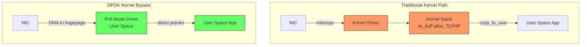
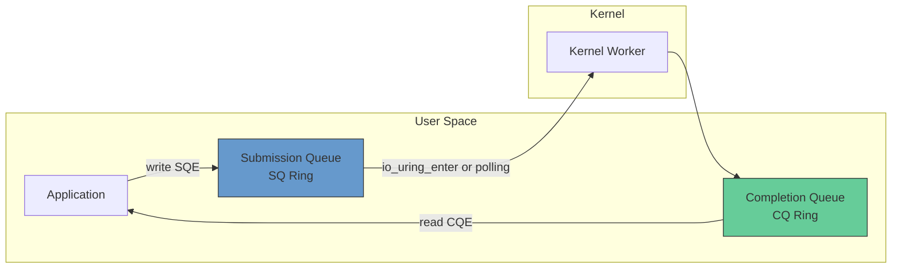
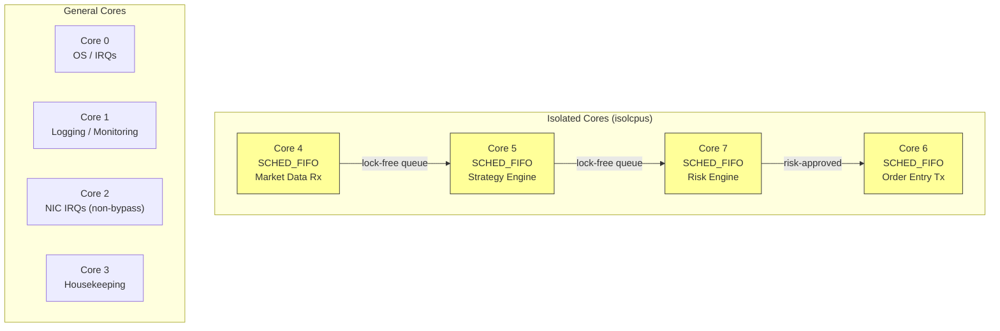
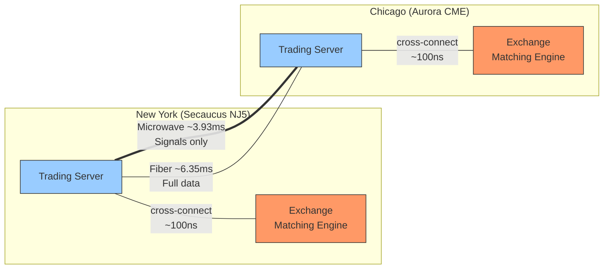
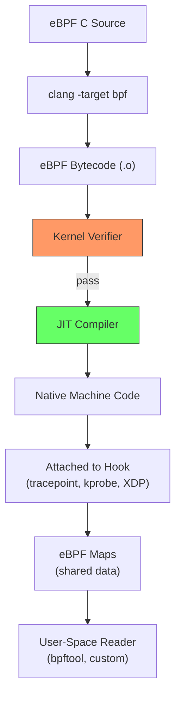
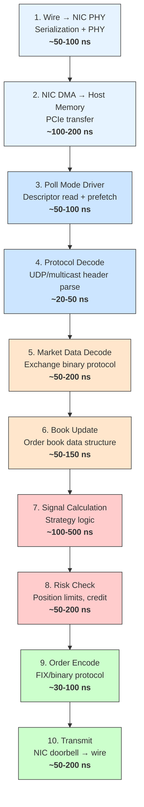
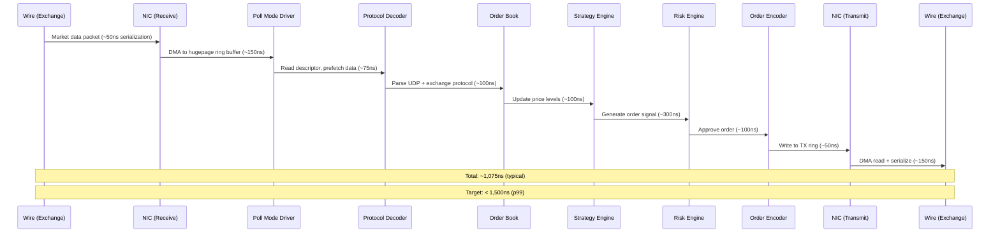

# Module 13: Low-Latency Systems Architecture

> **Prerequisites:** [Module 10 — Programming for Quant Finance](../Computation/10_programming_quant_finance.md), [Module 12 — Data Structures & Algorithms](../Computation/12_data_structures_algorithms.md)
> **Builds toward:** [Module 14 — High-Frequency Trading Infrastructure](../Computation/14_hft_infrastructure.md), [Module 16 — Hardware Acceleration (FPGA/GPU)](../Computation/16_hardware_acceleration.md), [Module 30 — Production Deployment & Monitoring](../Production/30_production_deployment.md)

---

In quantitative trading, the difference between a profitable strategy and a losing one can be measured in microseconds. This module dissects the full hardware--software stack that separates a "fast" system from a *predictably fast* system. We move from kernel tuning primitives through kernel-bypass networking, memory topology, clock synchronization, and network topology, culminating in a complete tick-to-trade pipeline analysis with latency budgets at every stage.

The central insight is that **low latency is not about speed in the average case---it is about eliminating variance in the worst case.** Every technique in this module serves that principle: removing jitter sources, bypassing abstraction layers, and placing computation as close to the data path as physically possible.

---

## Table of Contents

1. [Linux Kernel Tuning](#1-linux-kernel-tuning)
2. [Kernel Bypass Networking](#2-kernel-bypass-networking)
3. [io_uring: Modern Asynchronous I/O](#3-io_uring-modern-asynchronous-io)
4. [NUMA-Aware Memory Allocation](#4-numa-aware-memory-allocation)
5. [CPU Pinning and Thread Affinity](#5-cpu-pinning-and-thread-affinity)
6. [Busy-Polling vs. Interrupt-Driven I/O](#6-busy-polling-vs-interrupt-driven-io)
7. [Clock Synchronization](#7-clock-synchronization)
8. [Network Topology and Co-location](#8-network-topology-and-co-location)
9. [eBPF for Non-Intrusive Monitoring](#9-ebpf-for-non-intrusive-monitoring)
10. [Anatomy of a Tick-to-Trade Pipeline](#10-anatomy-of-a-tick-to-trade-pipeline)
11. [Implementation](#11-implementation)
12. [Exercises](#12-exercises)
13. [Summary](#summary)

---

## 1. Linux Kernel Tuning

The Linux kernel is a general-purpose operating system. It makes scheduling, memory management, and interrupt delivery decisions that optimize *throughput* across many processes. In a trading system, we must override these defaults to optimize *latency* for a single critical-path thread.

### 1.1 Core Isolation: `isolcpus`

The kernel's Completely Fair Scheduler (CFS) migrates tasks between CPU cores to balance load. For a latency-sensitive thread, migration causes:

- **L1/L2 cache eviction** (cold-cache penalty: 10--50 ns per miss, hundreds of misses)
- **TLB shootdowns** (inter-processor interrupts to invalidate page table entries)
- **Pipeline stalls** from branch predictor and prefetcher cold-start

The `isolcpus` boot parameter removes specified cores from the general scheduler domain:

```bash
# /etc/default/grub — GRUB_CMDLINE_LINUX
isolcpus=4-7 nohz_full=4-7 rcu_nocbs=4-7
```

After applying `update-grub` and rebooting, cores 4--7 will not run *any* kernel or user-space tasks unless explicitly assigned via `taskset` or `pthread_setaffinity_np`.

> **Important:** `isolcpus` is considered semi-deprecated upstream in favor of cgroup cpusets. However, it remains the most reliable method for fully removing scheduler interference on latency-critical cores and is universally used in production trading systems.

### 1.2 Tickless Kernel: `nohz_full`

By default, the kernel fires a timer interrupt (the "tick") on every core at a frequency determined by `CONFIG_HZ` (typically 250 Hz or 1000 Hz). Each tick invokes scheduler accounting, timer wheel processing, and RCU callbacks.

With `nohz_full=4-7`, the kernel suppresses the periodic tick on cores 4--7 when only one runnable task exists on the core. This eliminates a source of periodic jitter:

$$
\Delta t_{\text{tick}} = \frac{1}{\text{CONFIG\_HZ}} = 1\,\text{ms at 1000 Hz}
$$

The tick-interrupt handler itself takes 1--5 $\mu$s, but the indirect effects (cache pollution, pipeline flush) add another 1--3 $\mu$s of recovery time.

### 1.3 RCU Offloading: `rcu_nocbs`

Read-Copy-Update (RCU) is a kernel synchronization mechanism that defers memory reclamation. RCU callbacks execute in softirq context on the core that registered them. On isolated cores, these callbacks introduce unpredictable latency spikes of 5--20 $\mu$s.

`rcu_nocbs=4-7` offloads RCU callback processing to dedicated kernel threads (`rcuog/N`, `rcuop/N`) that run on non-isolated cores.

### 1.4 IRQ Affinity

Hardware interrupts from NICs, storage controllers, and timers are distributed across cores by the kernel's `irqbalance` daemon. A network interrupt on a latency-critical core forces a context switch into the interrupt handler.

```bash
# Disable irqbalance
systemctl stop irqbalance
systemctl disable irqbalance

# Pin all NIC interrupts (e.g., eth0) to core 2
NIC="eth0"
for irq in $(grep "$NIC" /proc/interrupts | awk '{print $1}' | tr -d ':'); do
    echo 4 > /proc/irq/$irq/smp_affinity   # bitmask: core 2
done
```

The affinity mask is a hexadecimal bitmask where bit $n$ represents core $n$. For core 2: $2^2 = 4$.

### 1.5 Transparent Huge Pages (THP)

Standard x86-64 pages are 4 KiB. Transparent Huge Pages (THP) automatically promote allocations to 2 MiB pages, reducing TLB misses. However, THP introduces two latency hazards:

1. **Compaction stalls**: The kernel's `khugepaged` daemon periodically scans and compacts memory to create contiguous 2 MiB regions. This can stall allocations for milliseconds.
2. **Page fault latency**: A THP page fault zeroes 2 MiB instead of 4 KiB ($512 \times$ more work).

For trading systems, **disable THP** and use explicit `mmap` with `MAP_HUGETLB`:

```bash
# Disable THP system-wide
echo never > /sys/kernel/mm/transparent_hugepage/enabled
echo never > /sys/kernel/mm/transparent_hugepage/defrag

# Pre-allocate explicit huge pages (1 GiB pages if supported)
echo 4096 > /sys/kernel/mm/hugepages/hugepages-2048kB/nr_hugepages
```

### 1.6 The Kernel Bypass Rationale

Even with all tuning applied, the kernel network stack introduces irreducible overhead:

| Operation | Approximate Latency |
|---|---|
| System call entry/exit (`syscall`/`sysret`) | 50--100 ns |
| Socket buffer allocation (`sk_buff`) | 100--300 ns |
| Protocol processing (TCP/IP) | 500--2000 ns |
| Memory copy (kernel $\to$ user) | 200--500 ns per packet |
| Context switch on interrupt | 1000--5000 ns |

**Total kernel stack overhead: 2--8 $\mu$s per packet.** For a system targeting sub-microsecond tick-to-trade latency, this is unacceptable. The solution: bypass the kernel entirely.

---

## 2. Kernel Bypass Networking

Kernel bypass moves the entire network stack---driver, protocol processing, and buffer management---into user space. The NIC's packet buffers are mapped directly into the application's virtual address space via DMA (Direct Memory Access).

### 2.1 DPDK (Data Plane Development Kit)

DPDK, originally developed by Intel, is the most widely deployed kernel bypass framework. Its architecture rests on three pillars:

#### Poll Mode Drivers (PMDs)

Instead of relying on hardware interrupts to signal packet arrival, DPDK continuously polls the NIC's receive descriptor ring from user space:

```c
while (true) {
    nb_rx = rte_eth_rx_burst(port_id, queue_id, pkts, BURST_SIZE);
    if (nb_rx > 0) {
        process_packets(pkts, nb_rx);
    }
}
```

This eliminates interrupt latency entirely. The cost is that the polling core runs at 100% CPU utilization permanently---a trade-off universally accepted in trading systems.

#### Hugepage Memory

DPDK allocates all packet buffers from pre-reserved hugepage memory (2 MiB or 1 GiB pages). Benefits:

- **Zero TLB misses** on packet buffer access (a single 1 GiB page covers the entire buffer pool)
- **Physically contiguous memory** required for NIC DMA operations
- **No page faults** after initialization (all memory is pre-faulted)

#### Environment Abstraction Layer (EAL)

The EAL initializes DPDK: parsing command-line arguments, detecting CPU topology, reserving hugepages, binding NICs to user-space drivers (`vfio-pci` or `igb_uio`), and pinning threads to cores.

```bash
# Bind NIC to DPDK-compatible driver
dpdk-devbind.py --bind=vfio-pci 0000:03:00.0

# Launch DPDK application
./trading_app -l 4-7 -n 4 --socket-mem 1024,1024 -- \
    --portmask=0x1 --config="(0,0,5)"
```

The flags: `-l 4-7` pins to cores 4--7; `-n 4` uses 4 memory channels; `--socket-mem 1024,1024` reserves 1 GiB hugepage memory on each NUMA socket.



### 2.2 Solarflare OpenOnload

OpenOnload takes a different approach: it provides a **kernel-bypass TCP/IP stack** that is API-compatible with standard POSIX sockets. Applications link against `libonload.so` (via `LD_PRELOAD`) and gain kernel bypass without code changes.

```bash
# Run any application with kernel bypass — zero code changes
onload ./trading_app

# Or with specific tuning
onload --profile=latency ./trading_app
```

Under the hood, OpenOnload intercepts `socket()`, `send()`, `recv()`, and related calls. For Solarflare (now Xilinx/AMD) NICs, it uses the `ef_vi` API to access NIC hardware directly:

- **Transmit**: Packets are written to a pre-mapped TX ring buffer. The application writes the descriptor and rings the NIC's doorbell register (a single MMIO write).
- **Receive**: The application polls an RX completion ring. Packet data is already in user-space memory via DMA.

**OpenOnload latency profile:**

| Metric | Kernel Stack | OpenOnload |
|---|---|---|
| UDP send (64 byte) | ~3.5 $\mu$s | ~0.4 $\mu$s |
| TCP send (64 byte) | ~5.0 $\mu$s | ~0.7 $\mu$s |
| Wire-to-wire (UDP echo) | ~8.0 $\mu$s | ~1.2 $\mu$s |

### 2.3 Mellanox (NVIDIA) VMA

Mellanox Messaging Accelerator (VMA) provides a similar socket-intercept model for Mellanox ConnectX NICs. It uses Mellanox's Verbs API (libibverbs) internally to bypass the kernel's network stack while maintaining full POSIX socket compatibility:

```bash
# Basic launch with VMA
LD_PRELOAD=libvma.so VMA_SPEC=latency ./trading_app

# Advanced tuning: pin VMA internal thread, set polling mode
LD_PRELOAD=libvma.so \
    VMA_SPEC=latency \
    VMA_RX_POLL=100000 \
    VMA_SELECT_POLL=100000 \
    VMA_THREAD_MODE=1 \
    VMA_CPU_USAGE=1 \
    ./trading_app
```

VMA supports both TCP and UDP, with multicast acceleration particularly important for receiving market data feeds (which are typically delivered via UDP multicast on exchanges). Key VMA tuning parameters for trading workloads:

| Parameter | Description | Recommended Value |
|---|---|---|
| `VMA_RX_POLL` | Number of poll cycles before blocking | 100000+ |
| `VMA_SELECT_POLL` | Cycles to busy-poll in select/poll/epoll | 100000+ |
| `VMA_THREAD_MODE` | Thread safety mode (0=multi, 1=single) | 1 (single-thread hot path) |
| `VMA_CPU_USAGE` | CPU usage mode (0=low, 1=high) | 1 (busy-poll) |
| `VMA_RING_ALLOCATION_LOGIC_RX` | Ring-to-core mapping | 20 (per-core rings) |

The fundamental trade-off between VMA/OpenOnload and DPDK: the socket-intercept libraries sacrifice a small amount of raw performance (50--100 ns) in exchange for dramatically simpler integration. A trading firm can deploy OpenOnload or VMA on an existing application in minutes, while a DPDK port requires weeks to months of engineering effort. Many firms start with OpenOnload/VMA and only move to DPDK for their most latency-critical paths.

### 2.4 Comparative Analysis

| Feature | DPDK | OpenOnload | VMA |
|---|---|---|---|
| API compatibility | Custom (rte_*) | POSIX sockets | POSIX sockets |
| Code changes required | Yes (complete rewrite) | No (LD_PRELOAD) | No (LD_PRELOAD) |
| TCP support | Manual (via libraries) | Full | Full |
| Hardware vendor lock-in | Minimal | Solarflare/Xilinx | Mellanox/NVIDIA |
| Typical latency (UDP) | 0.2--0.5 $\mu$s | 0.3--0.6 $\mu$s | 0.3--0.6 $\mu$s |
| Jitter (p99 vs. median) | Lowest | Low | Low |

---

## 3. io_uring: Modern Asynchronous I/O

While kernel bypass is optimal for network I/O, some operations (file I/O, timers, signals) must still interact with the kernel. `io_uring` (Linux 5.1+) provides a high-performance interface that minimizes syscall overhead for these operations.

### 3.1 Ring Architecture

`io_uring` uses two lock-free ring buffers shared between user space and the kernel via `mmap`:

- **Submission Queue (SQ)**: The application writes I/O requests (Submission Queue Entries, SQEs) here.
- **Completion Queue (CQ)**: The kernel writes results (Completion Queue Events, CQEs) here.



The critical advantage: **batched submission**. A single `io_uring_enter()` syscall can submit dozens of I/O operations, amortizing the syscall overhead. With `IORING_SETUP_SQPOLL`, even the submission syscall is eliminated---a kernel thread polls the SQ ring automatically.

### 3.2 Zero-Copy Networking

`io_uring` supports zero-copy send via `IORING_OP_SEND_ZC`. The kernel maps the user-space buffer directly into the NIC's scatter-gather list, eliminating the `memcpy` from user space to kernel `sk_buff`:

$$
\text{Saved per packet} \approx \frac{L_{\text{packet}}}{B_{\text{memcpy}}} \approx \frac{1500\,\text{bytes}}{25\,\text{GB/s}} \approx 60\,\text{ns}
$$

For small packets (typical in trading), the overhead saving is modest, but the elimination of buffer allocation is significant.

### 3.3 Batched Syscalls

Traditional I/O requires one syscall per operation. Each syscall incurs:

$$
C_{\text{syscall}} = C_{\text{entry}} + C_{\text{spectre mitigation}} + C_{\text{handler}} + C_{\text{exit}}
$$

Post-Spectre/Meltdown, $C_{\text{entry}} + C_{\text{exit}} \approx 100\text{--}200\,\text{ns}$ due to KPTI page table switching and indirect branch prediction barriers. With `io_uring` batching $N$ operations per syscall:

$$
C_{\text{amortized}} = \frac{C_{\text{syscall}}}{N} + C_{\text{SQE write}} \approx \frac{150}{32} + 10 \approx 15\,\text{ns/op}
$$

### 3.4 Trading System Usage

`io_uring` is typically used in trading systems for:

- **Logging**: Asynchronous write of audit logs without blocking the critical path
- **Disk-based market data capture**: Recording raw market data to NVMe storage
- **Timer management**: High-resolution timer expiration for order timeouts
- **Signal-free notification**: CQE-based event notification replacing `epoll`

A minimal example showing `io_uring` for asynchronous log writing on the non-critical path:

```cpp
#include <liburing.h>
#include <fcntl.h>
#include <cstring>

class AsyncLogger {
    struct io_uring ring_;
    int log_fd_;
    static constexpr int QUEUE_DEPTH = 256;

public:
    AsyncLogger(const char* log_path) {
        io_uring_queue_init(QUEUE_DEPTH, &ring_, 0);
        log_fd_ = open(log_path, O_WRONLY | O_CREAT | O_APPEND | O_DIRECT,
                        0644);
    }

    // Non-blocking: submits write and returns immediately
    void write_async(const void* buf, size_t len) {
        struct io_uring_sqe* sqe = io_uring_get_sqe(&ring_);
        if (!sqe) {
            // Queue full — drain completions
            drain_completions();
            sqe = io_uring_get_sqe(&ring_);
        }
        io_uring_prep_write(sqe, log_fd_, buf, len, -1);
        io_uring_submit(&ring_);
    }

    void drain_completions() {
        struct io_uring_cqe* cqe;
        unsigned head;
        unsigned count = 0;
        io_uring_for_each_cqe(&ring_, head, cqe) {
            count++;
        }
        io_uring_cq_advance(&ring_, count);
    }

    ~AsyncLogger() {
        drain_completions();
        io_uring_queue_exit(&ring_);
        close(log_fd_);
    }
};
```

It is *not* a replacement for DPDK/OpenOnload for network I/O on the critical path, but it complements kernel bypass by handling the remaining kernel-mediated operations efficiently. The design pattern is to use kernel bypass (DPDK/OpenOnload) for the hot path (market data in, orders out) and `io_uring` for the warm path (logging, persistence, configuration reload).

---

## 4. NUMA-Aware Memory Allocation

Modern multi-socket servers exhibit Non-Uniform Memory Access (NUMA) topology: each CPU socket has locally attached memory. Accessing memory on a remote NUMA node traverses the inter-socket interconnect (Intel UPI or AMD Infinity Fabric), incurring a latency penalty.

### 4.1 NUMA Penalty Quantification

| Access Type | Approximate Latency |
|---|---|
| L1 cache hit | 1 ns |
| L2 cache hit | 3--5 ns |
| L3 cache hit (local) | 10--15 ns |
| Local DRAM access | 60--80 ns |
| Remote DRAM access (1 hop) | 100--140 ns |
| Remote DRAM access (2 hops) | 150--200 ns |

The NUMA ratio (remote/local) is typically 1.5--2.0x. For a trading application processing millions of packets per second, even a 40 ns penalty per access accumulates rapidly:

$$
\text{Overhead} = R_{\text{packets/s}} \times N_{\text{accesses/packet}} \times \Delta t_{\text{NUMA}}
$$

At 10 million packets/second with 5 memory accesses per packet and a 50 ns NUMA penalty:

$$
\text{Overhead} = 10^7 \times 5 \times 50 \times 10^{-9} = 2.5\,\text{seconds of CPU time per second}
$$

This means **2.5 cores' worth of capacity** is wasted on NUMA penalties alone.

### 4.2 `numactl` and `mbind`

```bash
# Run application with memory bound to NUMA node 0
numactl --membind=0 --cpunodebind=0 ./trading_app

# Interleave memory across all nodes (for large shared data)
numactl --interleave=all ./market_data_cache
```

For fine-grained control in C/C++:

```cpp
#include <numa.h>
#include <numaif.h>

// Allocate 1 GiB on NUMA node 0
size_t size = 1UL << 30;
void* buf = numa_alloc_onnode(size, 0);
if (!buf) {
    perror("numa_alloc_onnode");
    exit(1);
}

// Verify placement
int node = -1;
get_mempolicy(&node, nullptr, 0, buf, MPOL_F_NODE | MPOL_F_ADDR);
assert(node == 0);

// For existing allocations: rebind with mbind()
unsigned long nodemask = 1UL << 0;  // NUMA node 0
mbind(buf, size, MPOL_BIND, &nodemask, sizeof(nodemask) * 8,
      MPOL_MF_MOVE | MPOL_MF_STRICT);
```

### 4.3 Interleave Policy

For large data structures accessed by threads on multiple NUMA nodes (e.g., a shared order book), interleave distributes pages round-robin across nodes. This does not minimize any single access but **bounds worst-case latency** to the average of local and remote access times:

$$
t_{\text{interleave}} = \frac{t_{\text{local}} + (N_{\text{nodes}} - 1) \cdot t_{\text{remote}}}{N_{\text{nodes}}}
$$

For a 2-socket system: $t_{\text{interleave}} = \frac{70 + 120}{2} = 95\,\text{ns}$, compared to a worst case of 120 ns for all-remote access.

### 4.4 NUMA Topology Discovery

```bash
# Display NUMA topology
numactl --hardware
# Example output:
# available: 2 nodes (0-1)
# node 0 cpus: 0 1 2 3 4 5 6 7 16 17 18 19 20 21 22 23
# node 1 cpus: 8 9 10 11 12 13 14 15 24 25 26 27 28 29 30 31
# node distances:
# node   0   1
#   0:  10  21
#   1:  21  10

# lstopo provides graphical NUMA topology (hwloc package)
lstopo --of txt
```

The distance matrix is reported in relative units (10 = local). A distance of 21 means remote access is $2.1\times$ the cost of local access.

---

## 5. CPU Pinning and Thread Affinity

CPU pinning locks a thread to a specific core, eliminating scheduler migration and ensuring cache warmth. Combined with core isolation (Section 1.1), this creates a **dedicated core** for the critical path thread.

### 5.1 `pthread_setaffinity_np`

```cpp
#include <pthread.h>
#include <sched.h>
#include <cstdio>
#include <cstdlib>

void pin_thread_to_core(pthread_t thread, int core_id) {
    cpu_set_t cpuset;
    CPU_ZERO(&cpuset);
    CPU_SET(core_id, &cpuset);

    int rc = pthread_setaffinity_np(thread, sizeof(cpu_set_t), &cpuset);
    if (rc != 0) {
        fprintf(stderr, "Failed to pin thread to core %d: %s\n",
                core_id, strerror(rc));
        exit(1);
    }

    // Verify affinity was set correctly
    cpu_set_t verify;
    CPU_ZERO(&verify);
    pthread_getaffinity_np(thread, sizeof(cpu_set_t), &verify);
    if (!CPU_ISSET(core_id, &verify)) {
        fprintf(stderr, "Affinity verification failed for core %d\n", core_id);
        exit(1);
    }
}

// Pin the current thread
pin_thread_to_core(pthread_self(), 4);  // Pin to isolated core 4
```

### 5.2 Real-Time Scheduling: `SCHED_FIFO`

Even on an isolated core, a pinned thread uses CFS (the default `SCHED_OTHER` policy). CFS still performs periodic accounting and may preempt the thread for kernel tasks. `SCHED_FIFO` is a real-time scheduling policy where:

- The thread runs until it voluntarily yields or blocks
- No time-slice preemption
- Higher priority real-time threads preempt lower priority ones

```cpp
#include <sched.h>

void set_realtime_priority(int priority) {
    struct sched_param param;
    param.sched_priority = priority;  // 1-99, higher = more priority

    int rc = sched_setscheduler(0, SCHED_FIFO, &param);
    if (rc != 0) {
        perror("sched_setscheduler");
        exit(1);
    }
}

// Set the critical-path thread to SCHED_FIFO priority 90
set_realtime_priority(90);
```

> **Warning:** A SCHED_FIFO thread that does not yield can permanently starve all other threads on its core, including kernel threads. Always test with a watchdog mechanism and never set priority 99 (reserved for kernel migration threads).

### 5.3 Thread Architecture for Trading



Each stage of the pipeline runs on a dedicated core. Inter-stage communication uses lock-free single-producer single-consumer (SPSC) queues (covered in Module 12) to avoid mutex contention.

---

## 6. Busy-Polling vs. Interrupt-Driven I/O

The choice between busy-polling and interrupt-driven I/O is the fundamental latency/efficiency trade-off in systems design.

### 6.1 Interrupt-Driven Model

```text
Packet arrives at NIC
    → NIC raises hardware interrupt (IRQ)
    → CPU suspends current task (context switch)
    → Interrupt handler runs (top half)
    → softirq scheduled (bottom half: NAPI polling)
    → Packet delivered to socket buffer
    → Application woken from epoll_wait/select
```

**Latency:** 5--15 $\mu$s from wire to application, with high variance due to interrupt coalescing and scheduler delay.

**Advantage:** CPU is free to do other work between packets. Efficient at low packet rates.

### 6.2 Busy-Polling Model

```text
Application thread in tight loop:
    → Read NIC receive descriptor (MMIO or cached ring)
    → If new packet: process immediately
    → If no packet: spin (try again)
```

**Latency:** 0.1--0.5 $\mu$s from wire to application. Near-zero variance.

**Cost:** Dedicated core at 100% utilization regardless of load.

### 6.3 Hybrid: Socket Busy-Polling

Linux supports a middle ground via `SO_BUSY_POLL` (kernel 3.11+):

```cpp
int busy_poll_usec = 50;  // Poll for 50 μs before sleeping
setsockopt(fd, SOL_SOCKET, SO_BUSY_POLL,
           &busy_poll_usec, sizeof(busy_poll_usec));
```

When `epoll_wait()` or `recv()` finds no data, the kernel spins in NAPI poll mode for `busy_poll_usec` microseconds before falling back to interrupt-driven sleep. This captures most of the latency benefit while allowing the core to sleep during idle periods.

### 6.4 Latency Distribution Comparison

For a representative market data feed (1 million messages/second average, bursty):

| Metric | Interrupt | SO_BUSY_POLL (50 $\mu$s) | Full Busy-Poll (DPDK) |
|---|---|---|---|
| Median latency | 6.2 $\mu$s | 1.8 $\mu$s | 0.3 $\mu$s |
| P99 latency | 42 $\mu$s | 8.5 $\mu$s | 0.8 $\mu$s |
| P99.9 latency | 180 $\mu$s | 15 $\mu$s | 1.2 $\mu$s |
| CPU utilization | 30% | 65% | 100% |

The P99.9/median ratio reveals the jitter story: interrupt-driven is $29\times$, busy-poll is $4\times$. Consistency matters more than the median.

### 6.5 Interrupt Coalescing

NICs offer **interrupt coalescing** (also called interrupt moderation) to batch multiple packet arrivals into a single interrupt. This improves throughput by reducing interrupt overhead but increases latency for individual packets:

```bash
# Disable interrupt coalescing for lowest latency (ethtool)
ethtool -C eth0 rx-usecs 0 rx-frames 1 tx-usecs 0 tx-frames 1
# rx-usecs 0: interrupt immediately on packet arrival
# rx-frames 1: interrupt after every single packet

# For throughput-optimized paths (non-critical):
ethtool -C eth0 rx-usecs 50 rx-frames 16 adaptive-rx on
```

With coalescing disabled (`rx-usecs 0`), the NIC raises an interrupt for every packet, yielding the lowest latency within the interrupt-driven model. With coalescing enabled (e.g., `rx-usecs 50`, meaning the NIC waits up to 50 $\mu$s to batch interrupts), latency increases by up to the coalescing timer value but total interrupt rate drops dramatically.

In a DPDK/busy-polling architecture, interrupt coalescing is irrelevant because interrupts are never used. This is another advantage of kernel bypass: one fewer parameter to tune, one fewer source of latency variance.

---

## 7. Clock Synchronization

Accurate timestamps are essential for regulatory compliance (MiFID II requires microsecond-granularity timestamps), latency measurement, and cross-system event correlation. The challenge: distributing a common time reference to every server in a co-located environment with sub-microsecond accuracy.

### 7.1 PTP (IEEE 1588v2)

The Precision Time Protocol synchronizes clocks across an Ethernet network using a two-step process:

1. **Offset measurement**: The master sends `Sync` messages with its transmit timestamp $t_1$. The slave records the receive timestamp $t_2$. Offset: $\theta = t_2 - t_1 - d$, where $d$ is the one-way delay.

2. **Delay measurement**: The slave sends `Delay_Req` at $t_3$; the master timestamps reception at $t_4$. Combined:

$$
\theta = \frac{(t_2 - t_1) - (t_4 - t_3)}{2}
$$

$$
d = \frac{(t_2 - t_1) + (t_4 - t_3)}{2}
$$

These formulas assume symmetric path delay. **Asymmetry** in the forward and reverse paths introduces systematic error proportional to the asymmetry.

**Hardware PTP** uses NIC-level timestamping ($t_1$ through $t_4$ are captured by the NIC hardware, not the software stack), achieving **20--100 ns accuracy**. Software PTP (where timestamps are captured by the kernel) achieves only 1--10 $\mu$s.

```bash
# Configure PTP with hardware timestamping (ptp4l from linuxptp)
ptp4l -i eth0 -m -H -2 --summary_interval=0

# Synchronize system clock from PTP hardware clock
phc2sys -s eth0 -c CLOCK_REALTIME -O 0 -m
```

### 7.2 GPS Disciplined Oscillators

For absolute time accuracy (UTC traceability), GPS disciplined oscillators (GPSDOs) receive timing signals from GPS satellites (accuracy: ~10 ns to UTC). The GPSDO:

1. Receives 1PPS (pulse-per-second) signal from GPS receiver
2. Disciplines a local oscillator (OCXO or rubidium) to the GPS signal
3. Feeds the disciplined clock to PTP grandmaster hardware

This provides a complete chain: GPS satellite $\to$ GPSDO $\to$ PTP grandmaster $\to$ PTP-capable switches $\to$ server NICs.

### 7.3 Hardware Timestamping

NICs with hardware timestamping capture packet arrival time in the NIC's PHY layer, before any software processing. The timestamp is stored in the packet descriptor and read by the driver or user-space application.

```cpp
// Enable hardware timestamping on a socket
struct hwtstamp_config config = {};
config.tx_type = HWTSTAMP_TX_ON;
config.rx_filter = HWTSTAMP_FILTER_ALL;

struct ifreq ifr = {};
strncpy(ifr.ifr_name, "eth0", IFNAMSIZ);
ifr.ifr_data = (char*)&config;
ioctl(sock, SIOCSHWTSTAMP, &ifr);

// Retrieve hardware timestamp from received packet
struct msghdr msg = {};
// ... set up msg for recvmsg ...
struct cmsghdr* cmsg;
for (cmsg = CMSG_FIRSTHDR(&msg); cmsg; cmsg = CMSG_NXTHDR(&msg, cmsg)) {
    if (cmsg->cmsg_level == SOL_SOCKET &&
        cmsg->cmsg_type == SO_TIMESTAMPING) {
        struct timespec* ts = (struct timespec*)CMSG_DATA(cmsg);
        // ts[0] = software timestamp
        // ts[2] = hardware timestamp
        printf("HW timestamp: %ld.%09ld\n", ts[2].tv_sec, ts[2].tv_nsec);
    }
}
```

### 7.4 Time Sources for Latency Measurement

| Clock Source | Resolution | Monotonic | Overhead | Use Case |
|---|---|---|---|---|
| `CLOCK_REALTIME` | 1 ns | No (NTP adjusts) | ~20 ns | Wall-clock time |
| `CLOCK_MONOTONIC` | 1 ns | Yes | ~20 ns | Duration measurement |
| `CLOCK_MONOTONIC_RAW` | 1 ns | Yes, no NTP | ~20 ns | Latency benchmarks |
| `rdtsc` (x86) | ~0.3 ns (3 GHz) | Yes (invariant TSC) | ~7 ns | Intra-process timing |

For critical-path latency measurement, `rdtsc` (Read Time-Stamp Counter) provides the lowest overhead:

```cpp
#include <cstdint>

static inline uint64_t rdtsc() {
    uint32_t lo, hi;
    asm volatile("rdtsc" : "=a"(lo), "=d"(hi));
    return ((uint64_t)hi << 32) | lo;
}

static inline uint64_t rdtscp() {
    uint32_t lo, hi, aux;
    asm volatile("rdtscp" : "=a"(lo), "=d"(hi), "=c"(aux));
    return ((uint64_t)hi << 32) | lo;
}

// Usage: measure function latency
uint64_t start = rdtsc();
asm volatile("" ::: "memory");  // Compiler fence
process_packet(pkt);
asm volatile("" ::: "memory");  // Compiler fence
uint64_t end = rdtscp();        // rdtscp serializes

double latency_ns = (double)(end - start) / tsc_freq_ghz;
```

> **Note:** `rdtsc` does not serialize the instruction pipeline. Instructions after `rdtsc` may execute before it completes. Use `rdtscp` (serializing variant) for the end timestamp, or bracket with `lfence`/`mfence`. The `asm volatile("" ::: "memory")` is a compiler fence preventing the compiler from reordering the `process_packet` call across the measurements; it does not affect CPU instruction reordering.

---

## 8. Network Topology and Co-location

Below the software stack lies the physical network. At microsecond time scales, the speed of light becomes a binding constraint.

### 8.1 Co-location

Exchanges offer **co-location** services: rack space within the same data center as the exchange's matching engine. This minimizes the physical distance between the trading firm's server and the exchange:

$$
t_{\text{propagation}} = \frac{d}{c_{\text{fiber}}} = \frac{d}{2 \times 10^8\,\text{m/s}}
$$

Within a co-location facility (10--100 m of fiber), propagation delay is 50--500 ns. From New York to Chicago (1,200 km), it is 6 ms via fiber.

Major co-location data centers in the U.S. equities ecosystem:

| Data Center | Location | Exchanges Hosted |
|---|---|---|
| NY5 (Equinix) | Secaucus, NJ | NYSE, BATS/Cboe, Direct Edge |
| NY4 (Equinix) | Secaucus, NJ | NASDAQ, various dark pools |
| Mahwah, NJ | Mahwah, NJ | NYSE Arca, NYSE American |
| Aurora, IL | Aurora, IL | CME Group (futures, options) |
| Carteret, NJ | Carteret, NJ | NASDAQ (migrated from NY4) |

Exchanges enforce **fair access** to co-location by equalizing cable lengths from each cage to the matching engine, ensuring no firm has a physical distance advantage within the facility. Cable lengths are equalized to within 1 meter (5 ns of propagation). Despite this equalization, the choice of which rack a firm occupies and how its internal cabling is routed can still yield single-digit nanosecond differences, making physical topology a competitive concern.

### 8.2 Cross-Connects

A **cross-connect** is a direct fiber optic cable between two cages in the same data center, avoiding any router or switch hops. Each switch hop adds 300--5,000 ns depending on the switch architecture:

| Switch Type | Latency (port-to-port) |
|---|---|
| Cut-through (Arista 7130) | 80--200 ns |
| Store-and-forward (commodity) | 3--10 $\mu$s |
| FPGA-based (Metamako/Arista) | 4--50 ns |

Cross-connects eliminate all switching latency, leaving only propagation delay.

### 8.3 Microwave and Millimeter-Wave Links

Microwave (6--42 GHz) and millimeter-wave (60--90 GHz) wireless links exploit a fundamental physical advantage: radio waves travel through air at $c \approx 3 \times 10^8$ m/s, while light in fiber travels at $\sim 2 \times 10^8$ m/s ($n \approx 1.5$ refractive index).

$$
\frac{t_{\text{fiber}}}{t_{\text{microwave}}} = \frac{c/n}{c} = n \approx 1.5
$$

For the New York--Chicago route, this translates to a **~2 ms advantage**:

| Medium | Distance (path) | One-way latency |
|---|---|---|
| Fiber (shortest route) | ~1,270 km | ~6.35 ms |
| Microwave (line-of-sight) | ~1,180 km | ~3.93 ms |

Microwave links are capacity-constrained (typically 100 Mbps--1 Gbps, versus 100 Gbps for fiber) and weather-dependent. They are used for **signals** (small messages: quotes, triggers, order confirmations) while fiber carries **bulk data** (full market data feeds, historical data).



### 8.4 Network Switches in the Trading Path

Within a co-location facility, the choice of switch has measurable latency impact:

1. **FPGA switches** (Arista 7130 / Metamako): 4--50 ns port-to-port. Can embed simple trading logic (conditional order routing) directly in the switch FPGA.
2. **Cut-through switches**: Begin forwarding a frame as soon as the destination MAC address is read (first 14 bytes), without waiting for the full frame. Latency: 80--200 ns.
3. **Store-and-forward switches**: Buffer the entire frame, compute the FCS checksum, then forward. Latency: 3--10 $\mu$s. Not acceptable on the critical path.

The latency of a cut-through switch increases with frame size only by the serialization delay of the first 14 bytes, while store-and-forward latency scales linearly with frame size:

$$
t_{\text{cut-through}} = t_{\text{lookup}} + \frac{14 \times 8}{R_{\text{link}}}
$$

$$
t_{\text{store-forward}} = t_{\text{lookup}} + \frac{L_{\text{frame}} \times 8}{R_{\text{link}}}
$$

At 10 Gbps, a 64-byte frame serializes in 51.2 ns; a 1518-byte frame in 1.2 $\mu$s.

---

## 9. eBPF for Non-Intrusive Monitoring

Monitoring a low-latency system is paradoxical: any instrumentation code on the critical path adds latency. Extended Berkeley Packet Filter (eBPF) provides a solution: programs that run in the kernel (or on the NIC via XDP) with minimal overhead, without modifying application code.

### 9.1 Architecture

eBPF programs are:

1. Written in restricted C (no unbounded loops, max 1 million instructions as of kernel 5.2+)
2. Compiled to eBPF bytecode
3. Verified by the kernel's in-kernel verifier (ensures safety: no invalid memory access, guaranteed termination)
4. JIT-compiled to native machine code
5. Attached to kernel hooks (tracepoints, kprobes, uprobes, socket filters, XDP)



### 9.2 Latency Histograms with Tracepoints

A common use case: measuring kernel network stack latency without modifying the application.

```c
// latency_hist.bpf.c — eBPF program (simplified)
#include <linux/bpf.h>
#include <bpf/bpf_helpers.h>

struct {
    __uint(type, BPF_MAP_TYPE_HASH);
    __uint(max_entries, 65536);
    __type(key, u64);    // skb pointer
    __type(value, u64);  // timestamp
} start_ts SEC(".maps");

struct {
    __uint(type, BPF_MAP_TYPE_ARRAY);
    __uint(max_entries, 64);   // 64 histogram buckets
    __type(key, u32);
    __type(value, u64);
} latency_hist SEC(".maps");

// Attach to net:netif_receive_skb (packet arrival)
SEC("tracepoint/net/netif_receive_skb")
int trace_rx(struct trace_event_raw_net_dev_template *ctx) {
    u64 skb = (u64)ctx->skbaddr;
    u64 ts = bpf_ktime_get_ns();
    bpf_map_update_elem(&start_ts, &skb, &ts, BPF_ANY);
    return 0;
}

// Attach to sock:inet_sock_set_state or custom uprobe on recv()
SEC("tracepoint/net/net_dev_queue")
int trace_tx(struct trace_event_raw_net_dev_template *ctx) {
    u64 skb = (u64)ctx->skbaddr;
    u64 *tsp = bpf_map_lookup_elem(&start_ts, &skb);
    if (!tsp) return 0;

    u64 delta_ns = bpf_ktime_get_ns() - *tsp;
    u32 bucket = delta_ns / 1000;  // Microsecond buckets
    if (bucket >= 64) bucket = 63;

    u64 *count = bpf_map_lookup_elem(&latency_hist, &bucket);
    if (count) __sync_fetch_and_add(count, 1);

    bpf_map_delete_elem(&start_ts, &skb);
    return 0;
}

char LICENSE[] SEC("license") = "GPL";
```

### 9.3 XDP (eXpress Data Path)

XDP runs eBPF programs at the earliest point in the receive path---before any `sk_buff` allocation. On NICs supporting XDP offload, the program runs on the NIC hardware itself.

XDP actions:

| Action | Effect |
|---|---|
| `XDP_PASS` | Continue to normal kernel stack |
| `XDP_DROP` | Drop packet (fastest possible drop) |
| `XDP_TX` | Bounce packet back out the same NIC |
| `XDP_REDIRECT` | Forward to another NIC or CPU |

XDP is used in trading for:

- **Pre-filtering**: Dropping irrelevant multicast groups at wire speed (reduces kernel stack load)
- **Timestamping**: Capturing arrival timestamps before any kernel processing
- **Simple forwarding**: Ultra-low-latency packet forwarding between NICs

A practical XDP program for filtering market data multicast at wire speed:

```c
// xdp_mcast_filter.bpf.c — Drop non-whitelisted multicast groups
#include <linux/bpf.h>
#include <linux/if_ether.h>
#include <linux/ip.h>
#include <linux/udp.h>
#include <linux/in.h>
#include <bpf/bpf_helpers.h>
#include <bpf/bpf_endian.h>

// Map of allowed multicast group IPs (populated from user space)
struct {
    __uint(type, BPF_MAP_TYPE_HASH);
    __uint(max_entries, 256);
    __type(key, __be32);    // multicast dest IP
    __type(value, __u8);    // 1 = allowed
} allowed_groups SEC(".maps");

// Packet counter per action
struct {
    __uint(type, BPF_MAP_TYPE_PERCPU_ARRAY);
    __uint(max_entries, 2);  // [0]=passed, [1]=dropped
    __type(key, __u32);
    __type(value, __u64);
} counters SEC(".maps");

SEC("xdp")
int xdp_filter(struct xdp_md *ctx) {
    void *data = (void *)(long)ctx->data;
    void *data_end = (void *)(long)ctx->data_end;

    struct ethhdr *eth = data;
    if ((void *)(eth + 1) > data_end)
        return XDP_PASS;

    if (eth->h_proto != bpf_htons(ETH_P_IP))
        return XDP_PASS;

    struct iphdr *ip = (void *)(eth + 1);
    if ((void *)(ip + 1) > data_end)
        return XDP_PASS;

    // Only filter UDP multicast (224.0.0.0/4)
    __be32 dst = ip->daddr;
    if ((bpf_ntohl(dst) & 0xF0000000) != 0xE0000000)
        return XDP_PASS;

    __u8 *allowed = bpf_map_lookup_elem(&allowed_groups, &dst);
    __u32 idx;
    if (allowed && *allowed) {
        idx = 0;  // passed
        __u64 *cnt = bpf_map_lookup_elem(&counters, &idx);
        if (cnt) __sync_fetch_and_add(cnt, 1);
        return XDP_PASS;
    }

    idx = 1;  // dropped
    __u64 *cnt = bpf_map_lookup_elem(&counters, &idx);
    if (cnt) __sync_fetch_and_add(cnt, 1);
    return XDP_DROP;
}

char LICENSE[] SEC("license") = "GPL";
```

```bash
# Load XDP program onto NIC (native mode for hardware acceleration)
ip link set dev eth0 xdpgeneric obj xdp_mcast_filter.o sec xdp

# Add allowed multicast groups
bpftool map update name allowed_groups \
    key hex e0 01 01 01 value hex 01  # 224.1.1.1

# Monitor counters
bpftool map dump name counters
```

### 9.4 Overhead Characteristics

eBPF's overhead is deterministic and small:

- **kprobe attachment**: ~50--100 ns per probe hit (JIT-compiled)
- **tracepoint attachment**: ~30--80 ns per tracepoint hit
- **XDP program**: ~50--200 ns per packet (depends on program complexity)
- **Map lookup**: ~30--50 ns per hash map lookup

This makes eBPF suitable for monitoring production trading systems in real time. The key rule: **never attach eBPF probes to the critical path in the user-space application** (use uprobes sparingly). Attach to kernel tracepoints that are already on the code path.

---

## 10. Anatomy of a Tick-to-Trade Pipeline

We now assemble every component into a complete system. The **tick-to-trade** latency measures the time from when a market data packet arrives at the NIC to when an order packet leaves the NIC in response.

### 10.1 Pipeline Stages and Latency Budget



**Total tick-to-trade budget: 550--1,800 ns (0.55--1.8 $\mu$s)**

### 10.2 Detailed Stage Analysis

#### Stage 1: Wire to NIC PHY (50--100 ns)

The electrical/optical signal arrives at the NIC's physical layer (PHY). At 10 Gbps, a minimum-size 64-byte Ethernet frame takes 51.2 ns to serialize. The PHY performs clock/data recovery and passes the frame to the MAC layer.

#### Stage 2: NIC DMA to Host Memory (100--200 ns)

The NIC's DMA engine writes the packet data and a receive descriptor to pre-mapped host memory (hugepage ring buffer). PCIe Gen3 x16 provides 16 GB/s bandwidth; the DMA of a 64-byte packet takes ~4 ns for the data itself, but PCIe round-trip latency (including TLP headers, completion) adds 100--200 ns.

#### Stage 3: Poll Mode Driver (50--100 ns)

The busy-polling thread detects the new descriptor by reading the ring buffer's write pointer (cached in a CPU register). It prefetches the packet data using `_mm_prefetch()` or compiler `__builtin_prefetch()`:

```cpp
// Hot polling loop — runs on dedicated isolated core
while (running) {
    // Read completion descriptor (single cache line read)
    if (rx_ring[rx_head].status & RX_DONE) {
        // Prefetch packet data while processing descriptor
        __builtin_prefetch(rx_ring[rx_head].pkt_addr, 0, 3);

        // Process packet
        packet_t* pkt = (packet_t*)rx_ring[rx_head].pkt_addr;
        process(pkt);

        // Advance head pointer
        rx_head = (rx_head + 1) & (RX_RING_SIZE - 1);
    }
}
```

#### Stage 4: Protocol Decode (20--50 ns)

For UDP multicast (typical for market data), parsing the Ethernet + IP + UDP headers is a fixed-offset extraction:

```cpp
struct __attribute__((packed)) udp_pkt {
    uint8_t  eth_dst[6];
    uint8_t  eth_src[6];
    uint16_t eth_type;       // offset 12
    // IPv4 header (20 bytes)
    uint8_t  ip_vhl;
    uint8_t  ip_tos;
    uint16_t ip_len;
    uint16_t ip_id;
    uint16_t ip_frag;
    uint8_t  ip_ttl;
    uint8_t  ip_proto;
    uint16_t ip_csum;
    uint32_t ip_src;
    uint32_t ip_dst;
    // UDP header (8 bytes)
    uint16_t udp_sport;
    uint16_t udp_dport;
    uint16_t udp_len;
    uint16_t udp_csum;
    // Payload starts at offset 42
    uint8_t  payload[];
};

// Zero-copy: cast directly onto packet buffer
const udp_pkt* pkt = reinterpret_cast<const udp_pkt*>(rx_buf);
const uint8_t* payload = pkt->payload;
uint16_t payload_len = ntohs(pkt->udp_len) - 8;
```

#### Stage 5: Market Data Decode (50--200 ns)

Exchange-specific binary protocols (ITCH, OUCH, PITCH, SBE) encode market events as fixed-size or variable-length messages. For ITCH (NASDAQ), message types include:

- `A` (Add Order): 36 bytes
- `E` (Order Executed): 31 bytes
- `U` (Order Replace): 35 bytes

Decoding is a `switch` on the message type byte, followed by fixed-offset field extraction. The compiler typically generates a jump table.

#### Stage 6: Book Update (50--150 ns)

The order book maintains sorted price levels. For an `Add Order` at a new price level, the operation is an insertion into a sorted structure. Using a flat array of price levels (covered in Module 12), this is an $O(1)$ lookup by price when the price range is bounded.

#### Stage 7: Signal Calculation (100--500 ns)

The strategy logic runs: comparing the updated book state against the model's signals. This varies enormously by strategy complexity---from a simple bid-ask spread comparison (50 ns) to a multi-factor model with matrix operations (500+ ns).

#### Stage 8: Risk Check (50--200 ns)

Pre-trade risk checks verify:
- Position limits (current position + order quantity $\leq$ max position)
- Credit limits (notional exposure $\leq$ available credit)
- Message rate limits (orders per second $\leq$ exchange throttle)

These are integer comparisons against cached limits---fast but mandatory.

#### Stage 9: Order Encode (30--100 ns)

The order is serialized into the exchange's binary protocol. For FIX/FAST, this involves tag-value encoding. For native binary protocols (OUCH, BOE), it is a `memcpy` of a packed struct into the transmit buffer.

#### Stage 10: Transmit (50--200 ns)

The application writes the packet to the NIC's transmit ring and writes to the NIC's doorbell register (a single MMIO write). The NIC DMA-reads the packet from host memory and serializes it onto the wire.

### 10.3 Full Pipeline Diagram



---

## 11. Implementation

### 11.1 Kernel Tuning Script

A comprehensive script for preparing a trading server:

```bash
#!/usr/bin/env bash
# low_latency_tuning.sh — Apply kernel tuning for low-latency trading
# Run as root. Assumes isolcpus/nohz_full/rcu_nocbs already in GRUB.

set -euo pipefail

ISOLATED_CORES="4-7"
NIC_IRQ_CORE=2
NIC_DEVICE="eth0"

echo "=== Low-Latency Kernel Tuning ==="

# 1. Disable irqbalance
echo "[1/10] Disabling irqbalance..."
systemctl stop irqbalance 2>/dev/null || true
systemctl disable irqbalance 2>/dev/null || true

# 2. Disable transparent huge pages
echo "[2/10] Disabling transparent huge pages..."
echo never > /sys/kernel/mm/transparent_hugepage/enabled
echo never > /sys/kernel/mm/transparent_hugepage/defrag

# 3. Pre-allocate explicit huge pages
echo "[3/10] Allocating 4096 x 2MB huge pages..."
echo 4096 > /sys/kernel/mm/hugepages/hugepages-2048kB/nr_hugepages
mkdir -p /dev/hugepages
mount -t hugetlbfs nodev /dev/hugepages 2>/dev/null || true

# 4. Pin NIC IRQs to non-isolated core
echo "[4/10] Pinning NIC IRQs to core $NIC_IRQ_CORE..."
NIC_IRQ_MASK=$(printf '%x' $((1 << NIC_IRQ_CORE)))
for irq in $(grep "$NIC_DEVICE" /proc/interrupts | awk '{print $1}' | tr -d ':'); do
    echo "$NIC_IRQ_MASK" > /proc/irq/$irq/smp_affinity 2>/dev/null || true
done

# 5. Move all movable IRQs off isolated cores
echo "[5/10] Moving IRQs off isolated cores..."
GENERAL_MASK="0f"  # cores 0-3
for irq_dir in /proc/irq/[0-9]*; do
    echo "$GENERAL_MASK" > "$irq_dir/smp_affinity" 2>/dev/null || true
done

# 6. Disable CPU frequency scaling (performance governor)
echo "[6/10] Setting CPU governor to performance..."
for cpu in /sys/devices/system/cpu/cpu*/cpufreq/scaling_governor; do
    echo performance > "$cpu" 2>/dev/null || true
done

# 7. Disable C-states (prevent deep sleep states)
echo "[7/10] Disabling deep C-states..."
for cpu in /sys/devices/system/cpu/cpu*/cpuidle/state[1-9]/disable; do
    echo 1 > "$cpu" 2>/dev/null || true
done

# 8. Set kernel parameters
echo "[8/10] Setting sysctl parameters..."
cat <<'SYSCTL' > /etc/sysctl.d/99-low-latency.conf
# Disable swap
vm.swappiness = 0

# Increase network buffer sizes
net.core.rmem_max = 16777216
net.core.wmem_max = 16777216
net.core.rmem_default = 16777216
net.core.wmem_default = 16777216
net.core.netdev_max_backlog = 65536

# Enable busy polling
net.core.busy_read = 50
net.core.busy_poll = 50

# Disable ASLR (deterministic memory layout for cache optimization)
kernel.randomize_va_space = 0

# Real-time scheduling limits
kernel.sched_rt_runtime_us = -1
SYSCTL
sysctl --system > /dev/null 2>&1

# 9. Lock memory (prevent swap for RT processes)
echo "[9/10] Setting memlock limits..."
cat <<'LIMITS' > /etc/security/limits.d/99-low-latency.conf
*    hard    memlock    unlimited
*    soft    memlock    unlimited
*    hard    rtprio     99
*    soft    rtprio     99
LIMITS

# 10. Migrate all user processes off isolated cores
echo "[10/10] Migrating processes off isolated cores..."
GENERAL_MASK="0f"
for pid in $(ps -eo pid= | tr -d ' '); do
    taskset -p "$GENERAL_MASK" "$pid" 2>/dev/null || true
done

echo "=== Tuning complete ==="
echo "Isolated cores: $ISOLATED_CORES"
echo "Huge pages allocated: $(cat /sys/kernel/mm/hugepages/hugepages-2048kB/nr_hugepages)"
echo "THP: $(cat /sys/kernel/mm/transparent_hugepage/enabled)"

# Verification
echo ""
echo "=== Verification ==="
echo "Processes on isolated cores (should be empty):"
ps -eo pid,psr,comm | awk '$2 >= 4 && $2 <= 7 {print}'
```

### 11.2 DPDK-Style Packet Processing Loop

A simplified but representative main loop for a DPDK-based market data receiver. This illustrates the core pattern; production systems add error handling, statistics, and graceful shutdown.

```cpp
// dpdk_market_data.cpp — DPDK-based market data processing
// Compile: g++ -O3 -march=native -o md_rx dpdk_market_data.cpp \
//          $(pkg-config --cflags --libs libdpdk)

#include <rte_eal.h>
#include <rte_ethdev.h>
#include <rte_mbuf.h>
#include <rte_cycles.h>
#include <rte_lcore.h>
#include <cstdio>
#include <cstdint>
#include <cstring>

static constexpr uint16_t RX_RING_SIZE = 1024;
static constexpr uint16_t TX_RING_SIZE = 1024;
static constexpr uint16_t BURST_SIZE = 32;
static constexpr uint16_t NUM_MBUFS = 8191;
static constexpr uint16_t MBUF_CACHE_SIZE = 250;

// Lightweight order book update (placeholder for real implementation)
struct OrderBook {
    uint64_t best_bid;
    uint64_t best_ask;
    uint64_t update_count;

    void update(const uint8_t* payload, uint16_t len) {
        // Parse exchange-specific protocol and update levels
        // (Module 12 covers the data structure in detail)
        update_count++;
    }
};

// Latency statistics
struct LatencyStats {
    uint64_t min_cycles = UINT64_MAX;
    uint64_t max_cycles = 0;
    uint64_t total_cycles = 0;
    uint64_t count = 0;

    void record(uint64_t cycles) {
        if (cycles < min_cycles) min_cycles = cycles;
        if (cycles > max_cycles) max_cycles = cycles;
        total_cycles += cycles;
        count++;
    }

    void print(double tsc_ghz) const {
        if (count == 0) return;
        printf("Latency (ns): min=%.0f avg=%.0f max=%.0f count=%lu\n",
               min_cycles / tsc_ghz,
               (double)total_cycles / count / tsc_ghz,
               max_cycles / tsc_ghz,
               count);
    }
};

static int port_init(uint16_t port, struct rte_mempool* mbuf_pool) {
    struct rte_eth_conf port_conf = {};
    port_conf.rxmode.mq_mode = RTE_ETH_MQ_RX_NONE;

    // Single RX queue, no TX needed for market data receiver
    int ret = rte_eth_dev_configure(port, 1, 0, &port_conf);
    if (ret != 0) return ret;

    ret = rte_eth_rx_queue_setup(port, 0, RX_RING_SIZE,
                                  rte_eth_dev_socket_id(port),
                                  nullptr, mbuf_pool);
    if (ret < 0) return ret;

    ret = rte_eth_dev_start(port);
    if (ret < 0) return ret;

    // Enable promiscuous mode for multicast reception
    rte_eth_promiscuous_enable(port);
    return 0;
}

static int rx_loop(__rte_unused void* arg) {
    const uint16_t port = 0;
    struct rte_mbuf* pkts[BURST_SIZE];
    OrderBook book = {};
    LatencyStats stats = {};
    double tsc_ghz = (double)rte_get_tsc_hz() / 1e9;

    printf("Core %u: starting RX loop on port %u\n",
           rte_lcore_id(), port);

    uint64_t last_report = rte_rdtsc();

    while (1) {  // Production: check a volatile running flag
        uint16_t nb_rx = rte_eth_rx_burst(port, 0, pkts, BURST_SIZE);

        if (unlikely(nb_rx == 0)) continue;

        for (uint16_t i = 0; i < nb_rx; i++) {
            uint64_t start = rte_rdtsc();

            // Direct pointer to packet data — zero copy
            uint8_t* data = rte_pktmbuf_mtod(pkts[i], uint8_t*);
            uint16_t len = rte_pktmbuf_data_len(pkts[i]);

            // Skip Ethernet (14) + IP (20) + UDP (8) = 42 bytes
            if (likely(len > 42)) {
                book.update(data + 42, len - 42);
            }

            uint64_t end = rte_rdtsc();
            stats.record(end - start);

            rte_pktmbuf_free(pkts[i]);
        }

        // Periodic statistics report (every ~1 second)
        uint64_t now = rte_rdtsc();
        if (now - last_report > rte_get_tsc_hz()) {
            stats.print(tsc_ghz);
            printf("Book updates: %lu, best_bid=%lu, best_ask=%lu\n",
                   book.update_count, book.best_bid, book.best_ask);
            stats = {};
            last_report = now;
        }
    }

    return 0;
}

int main(int argc, char* argv[]) {
    // Initialize DPDK EAL
    int ret = rte_eal_init(argc, argv);
    if (ret < 0) rte_exit(EXIT_FAILURE, "EAL init failed\n");
    argc -= ret;
    argv += ret;

    // Check available ports
    uint16_t nb_ports = rte_eth_dev_count_avail();
    if (nb_ports == 0) rte_exit(EXIT_FAILURE, "No Ethernet ports\n");

    // Create memory pool from hugepages
    struct rte_mempool* mbuf_pool = rte_pktmbuf_pool_create(
        "MBUF_POOL", NUM_MBUFS, MBUF_CACHE_SIZE, 0,
        RTE_MBUF_DEFAULT_BUF_SIZE,
        rte_socket_id());
    if (!mbuf_pool) rte_exit(EXIT_FAILURE, "Cannot create mbuf pool\n");

    // Initialize port 0
    if (port_init(0, mbuf_pool) != 0)
        rte_exit(EXIT_FAILURE, "Cannot init port 0\n");

    // Launch RX loop on the current core
    rx_loop(nullptr);

    return 0;
}
```

### 11.3 Latency Measurement with `rdtsc`

A self-contained utility for high-resolution latency measurement:

```cpp
// rdtsc_timer.hpp — Portable high-resolution cycle timer for x86-64

#pragma once
#include <cstdint>
#include <cstdio>
#include <algorithm>
#include <vector>
#include <numeric>
#include <cmath>

class RdtscTimer {
public:
    // Calibrate TSC frequency against CLOCK_MONOTONIC_RAW
    static double calibrate_tsc_ghz() {
        struct timespec ts_start, ts_end;
        uint64_t tsc_start, tsc_end;

        clock_gettime(CLOCK_MONOTONIC_RAW, &ts_start);
        tsc_start = rdtscp();

        // Spin for ~100ms to get accurate calibration
        volatile uint64_t dummy = 0;
        for (int i = 0; i < 100000000; i++) dummy += i;

        tsc_end = rdtscp();
        clock_gettime(CLOCK_MONOTONIC_RAW, &ts_end);

        double ns = (ts_end.tv_sec - ts_start.tv_sec) * 1e9 +
                     (ts_end.tv_nsec - ts_start.tv_nsec);
        return (double)(tsc_end - tsc_start) / ns;
    }

    explicit RdtscTimer(double tsc_ghz) : tsc_ghz_(tsc_ghz) {}

    inline void start() {
        // lfence serializes before reading TSC
        asm volatile("lfence" ::: "memory");
        start_ = rdtsc();
    }

    inline uint64_t stop() {
        uint64_t end = rdtscp();  // rdtscp serializes
        asm volatile("lfence" ::: "memory");
        uint64_t elapsed = end - start_;
        samples_.push_back(elapsed);
        return elapsed;
    }

    double elapsed_ns() const {
        if (samples_.empty()) return 0.0;
        return (double)samples_.back() / tsc_ghz_;
    }

    void report(const char* label) const {
        if (samples_.empty()) {
            printf("%s: no samples\n", label);
            return;
        }

        std::vector<uint64_t> sorted = samples_;
        std::sort(sorted.begin(), sorted.end());

        size_t n = sorted.size();
        double min_ns  = sorted[0] / tsc_ghz_;
        double med_ns  = sorted[n / 2] / tsc_ghz_;
        double p99_ns  = sorted[(size_t)(n * 0.99)] / tsc_ghz_;
        double p999_ns = sorted[(size_t)(n * 0.999)] / tsc_ghz_;
        double max_ns  = sorted[n - 1] / tsc_ghz_;

        double sum = 0;
        for (auto s : sorted) sum += s;
        double avg_ns = (sum / n) / tsc_ghz_;

        printf("%s (n=%zu):\n", label, n);
        printf("  min=%.1f avg=%.1f med=%.1f "
               "p99=%.1f p99.9=%.1f max=%.1f ns\n",
               min_ns, avg_ns, med_ns, p99_ns, p999_ns, max_ns);
    }

    void reset() { samples_.clear(); }

private:
    static inline uint64_t rdtsc() {
        uint32_t lo, hi;
        asm volatile("rdtsc" : "=a"(lo), "=d"(hi));
        return ((uint64_t)hi << 32) | lo;
    }

    static inline uint64_t rdtscp() {
        uint32_t lo, hi, aux;
        asm volatile("rdtscp" : "=a"(lo), "=d"(hi), "=c"(aux));
        return ((uint64_t)hi << 32) | lo;
    }

    double tsc_ghz_;
    uint64_t start_ = 0;
    std::vector<uint64_t> samples_;
};


// Usage example
/*
int main() {
    double tsc_ghz = RdtscTimer::calibrate_tsc_ghz();
    printf("TSC frequency: %.3f GHz\n", tsc_ghz);

    RdtscTimer timer(tsc_ghz);

    // Benchmark some operation
    for (int i = 0; i < 100000; i++) {
        timer.start();
        // ... operation under test ...
        do_something();
        timer.stop();
    }

    timer.report("do_something");
    return 0;
}
*/
```

### 11.4 GRUB Configuration Template

For reference, a complete GRUB configuration with all low-latency boot parameters:

```bash
# /etc/default/grub (append to GRUB_CMDLINE_LINUX)
GRUB_CMDLINE_LINUX="isolcpus=4-7 nohz_full=4-7 rcu_nocbs=4-7 \
    rcu_nocb_poll intel_idle.max_cstate=0 processor.max_cstate=0 \
    idle=poll nosoftlockup nmi_watchdog=0 \
    hugepagesz=2M hugepages=4096 \
    default_hugepagesz=2M \
    transparent_hugepage=never \
    skew_tick=1 tsc=reliable \
    intel_pstate=disable"
```

Parameter summary:

| Parameter | Effect |
|---|---|
| `isolcpus=4-7` | Remove cores 4--7 from general scheduling |
| `nohz_full=4-7` | Suppress timer tick on cores 4--7 |
| `rcu_nocbs=4-7` | Offload RCU callbacks from cores 4--7 |
| `intel_idle.max_cstate=0` | Prevent CPU from entering low-power states |
| `idle=poll` | Busy-spin in idle loop (no halt instruction) |
| `nosoftlockup` | Disable soft lockup detector (false alarms on busy cores) |
| `nmi_watchdog=0` | Disable NMI watchdog (periodic interrupt) |
| `hugepagesz=2M hugepages=4096` | Pre-allocate 8 GiB of 2 MiB huge pages |
| `skew_tick=1` | Offset timer ticks across cores (reduce lock contention) |
| `tsc=reliable` | Skip TSC stability checks (faster boot) |
| `intel_pstate=disable` | Disable Intel P-state driver (use acpi-cpufreq) |

---

## 12. Exercises

### Exercise 1: NUMA Penalty Measurement

Write a C++ program that allocates a 1 GiB array on NUMA node 0 using `numa_alloc_onnode()`, then measures the average access latency from a thread pinned to:
- (a) A core on NUMA node 0
- (b) A core on NUMA node 1

Use `CLOCK_MONOTONIC_RAW` and random access patterns to defeat hardware prefetchers. Report the NUMA ratio.

**Hint:** Use a pointer-chasing pattern: `arr[i] = next_random_index`, then follow the chain. This creates a dependent load sequence that cannot be prefetched or parallelized.

---

### Exercise 2: Interrupt vs. Busy-Poll Latency

Using a two-server setup connected by a direct cable:
- (a) Implement a UDP echo server using standard `recvfrom()`/`sendto()` with `epoll`
- (b) Implement the same server using `SO_BUSY_POLL` with a 100 $\mu$s timeout
- (c) Measure the round-trip latency distribution (min, p50, p99, p99.9, max) for 1 million pings at 10,000 pings/second

**Expected result:** SO_BUSY_POLL should show 2--5$\times$ lower p99 latency and dramatically lower p99.9.

---

### Exercise 3: `rdtsc` Calibration

Write a self-calibrating `rdtsc`-based timer that:
1. Measures TSC frequency by comparing against `CLOCK_MONOTONIC_RAW` over a 100 ms window
2. Validates that the TSC is invariant (reads `cpuid` leaf 0x80000007, bit 8)
3. Estimates the overhead of an `rdtscp` call itself by timing 10,000 back-to-back calls

**Expected result:** On modern Intel/AMD CPUs with invariant TSC, the `rdtscp` overhead should be 7--25 ns.

---

### Exercise 4: Kernel Bypass Latency Comparison

Design an experiment (you may use existing benchmarks such as `sockperf` for kernel path and `dpdk-testpmd` for DPDK) to compare:

| Metric | Kernel UDP | `SO_BUSY_POLL` | OpenOnload/VMA | DPDK |
|---|---|---|---|---|
| Median RTT | | | | |
| P99 RTT | | | | |
| P99.9 RTT | | | | |
| CPU utilization | | | | |

Run at message rates of 100K, 500K, and 1M messages/second. Plot latency vs. throughput curves.

---

### Exercise 5: THP Jitter Detection

Write a program that:
1. Allocates a 4 GiB region with `mmap` (standard pages)
2. Touches every page to trigger page faults
3. Measures the distribution of page fault times

Run with THP enabled (`always`) and disabled (`never`). Show that THP causes bimodal page fault latency: most are fast (4 KiB) but some are slow (2 MiB compaction).

---

### Exercise 6: Core Isolation Verification

Write a script that:
1. Reads `/proc/sched_debug` to list all tasks on isolated cores
2. Uses `perf stat -C <core>` to measure the number of context switches per second on isolated vs. non-isolated cores
3. Uses `turbostat` to verify that isolated cores maintain maximum frequency (no C-state transitions)

**Target:** An isolated core with `SCHED_FIFO` thread should show fewer than 10 context switches per second.

---

### Exercise 7: PTP Synchronization Analysis

Using `ptp4l` and `phc2sys` from the `linuxptp` package:
1. Configure PTP slave synchronization with hardware timestamping
2. Log the offset from master over a 1-hour period
3. Compute the Allan deviation of the offset time series
4. Plot the offset histogram and identify the synchronization accuracy

**Target:** With hardware PTP, offset should be within $\pm$100 ns (1$\sigma$).

---

### Exercise 8: eBPF Network Latency Monitor

Write an eBPF program using `libbpf` that:
1. Attaches to `tracepoint/net/netif_receive_skb` and `tracepoint/net/net_dev_xmit`
2. Records per-packet latency (time between receive and transmit for packets with matching flow tuples)
3. Stores results in a BPF histogram map (log2 buckets)
4. Displays the histogram from user space using `bpftool`

This provides a non-intrusive measurement of kernel-stack forwarding latency.

---

### Exercise 9: Tick-to-Trade Latency Budget

For a hypothetical strategy that:
- Receives NASDAQ ITCH 5.0 market data via UDP multicast
- Maintains a limit order book for 100 symbols
- Executes a simple market-making strategy (spread comparison)
- Sends orders via OUCH 4.2 protocol

Construct a detailed latency budget spreadsheet with:
1. Each pipeline stage from Section 10
2. Best-case, typical, and worst-case estimates for each stage
3. Identification of the top-3 stages that dominate total latency
4. Proposed optimizations for each dominant stage

---

### Exercise 10: Full System Integration

Build a simulated tick-to-trade pipeline (no actual exchange connectivity needed):

1. **Packet generator**: Sends pre-recorded ITCH market data packets via UDP loopback at configurable rates
2. **Market data handler**: Receives packets (using kernel sockets or DPDK), decodes ITCH, updates order book
3. **Strategy**: Simple spread-based signal: if $\text{spread} > 2 \times \text{avg\_spread}$, generate an order
4. **Latency instrumentation**: `rdtsc` timestamps at each stage boundary

Measure the end-to-end latency distribution. Then apply optimizations incrementally:
- (a) Baseline: standard sockets, no tuning
- (b) Add `SO_BUSY_POLL`
- (c) Add `isolcpus` + CPU pinning + `SCHED_FIFO`
- (d) Add huge pages for the order book memory
- (e) (Bonus) Replace sockets with DPDK

Plot a latency waterfall diagram showing the improvement at each step.

---

## Summary

This module covered the full stack of low-latency systems engineering for quantitative trading:

| Layer | Technique | Latency Impact |
|---|---|---|
| **Kernel** | `isolcpus`, `nohz_full`, `rcu_nocbs` | Eliminate 5--50 $\mu$s jitter spikes |
| **Memory** | THP disabled, explicit hugepages, NUMA binding | Reduce access variance by 40--100 ns |
| **Scheduling** | CPU pinning, `SCHED_FIFO` | Eliminate context switch overhead (~5 $\mu$s) |
| **Networking** | DPDK / OpenOnload / VMA | Reduce packet latency from 5--8 $\mu$s to 0.2--0.6 $\mu$s |
| **I/O** | `io_uring`, busy-polling | Reduce syscall overhead by 10--100$\times$ |
| **Clocks** | PTP, hardware timestamps, `rdtsc` | Provide ~100 ns measurement accuracy |
| **Physical** | Co-location, cross-connects, microwave | Minimize propagation: $d/c$ |
| **Monitoring** | eBPF, XDP | Non-intrusive: < 100 ns overhead per probe |

The total tick-to-trade latency budget for a state-of-the-art system is **0.5--2.0 $\mu$s** from NIC receive to NIC transmit. Achieving this requires every layer to work in concert---a single misconfiguration (an unmasked interrupt, a NUMA-remote allocation, a THP compaction stall) can add orders of magnitude more latency than the entire optimized pipeline.

The principles extend beyond trading: any real-time system---autonomous vehicles, industrial control, telecommunications---benefits from the same discipline of eliminating variance, bypassing abstraction layers, and measuring everything.

---

*Next: [Module 14 — FPGA & Hardware Acceleration](../Computation/14_fpga_hardware.md)*

---

*Module 13 of 34 — Quant-Nexus Encyclopedia*
