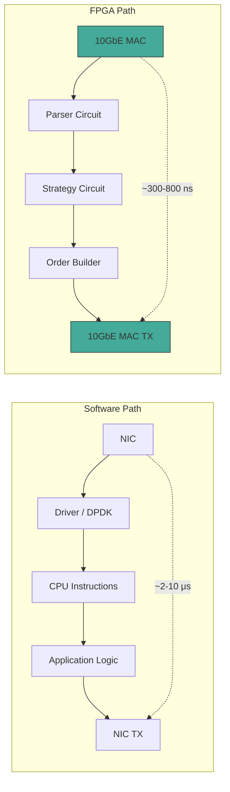
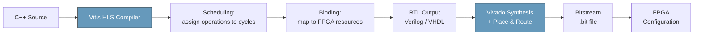
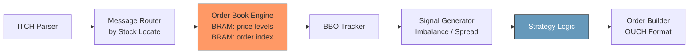
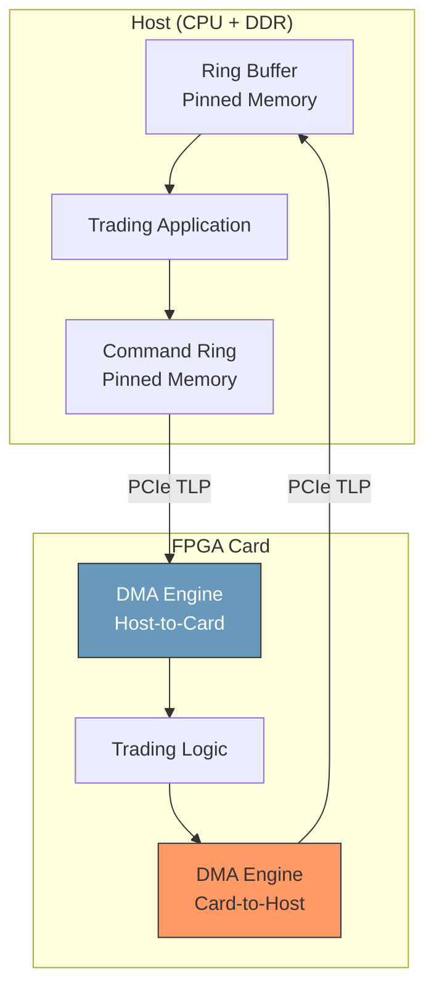
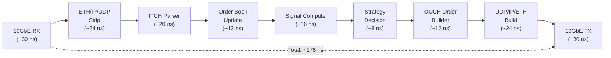
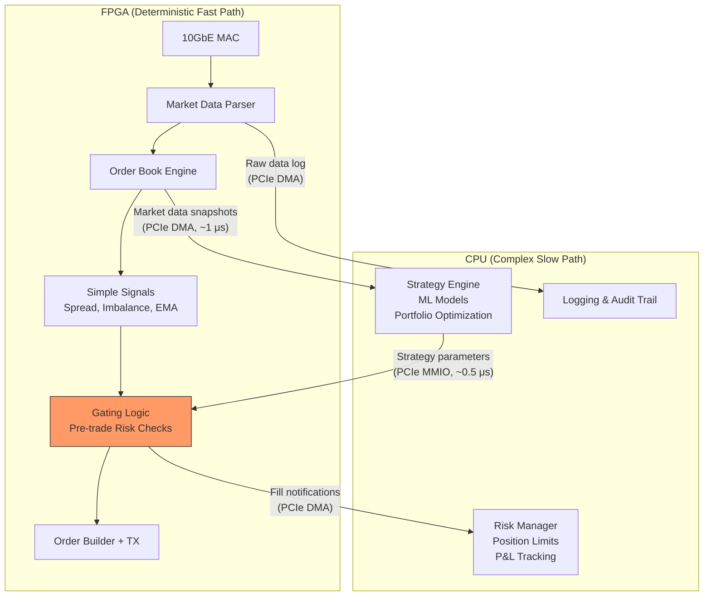
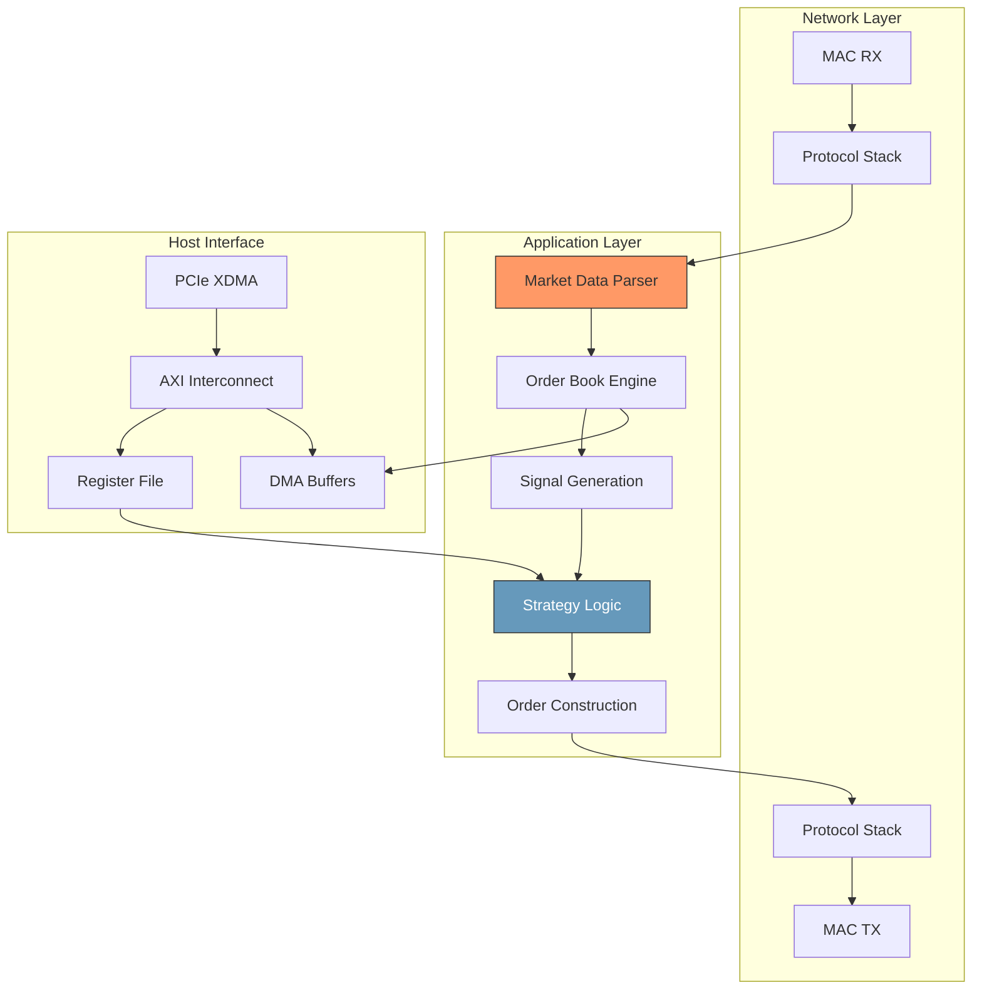

# Module 14: FPGA & Hardware Acceleration for Quantitative Finance

**Prerequisites:** Module 13 (Low-Latency Systems Architecture)
**Builds toward:** Module 30 (Execution Algorithms)

---

## Table of Contents

1. [Motivation: Why Hardware Acceleration?](#1-motivation-why-hardware-acceleration)
2. [FPGA Architecture Fundamentals](#2-fpga-architecture-fundamentals)
3. [HDL Fundamentals: Verilog & SystemVerilog](#3-hdl-fundamentals-verilog--systemverilog)
4. [High-Level Synthesis (HLS)](#4-high-level-synthesis-hls)
5. [Trading-Specific FPGA Designs](#5-trading-specific-fpga-designs)
6. [PCIe DMA for Host-FPGA Communication](#6-pcie-dma-for-host-fpga-communication)
7. [Network Processing in Hardware](#7-network-processing-in-hardware)
8. [Tick-to-Trade in Hardware](#8-tick-to-trade-in-hardware)
9. [Hybrid CPU+FPGA Architectures](#9-hybrid-cpufpga-architectures)
10. [SmartNICs & Accelerator Cards](#10-smartnics--accelerator-cards)
11. [Testing & Verification](#11-testing--verification)
12. [Exercises](#12-exercises)
13. [Summary](#13-summary)

---

## 1. Motivation: Why Hardware Acceleration?

The fundamental bottleneck in software-based trading systems is the **von Neumann architecture** itself. A CPU fetches instructions from memory, decodes them, executes them sequentially (or with limited superscalar parallelism), and writes results back. Even with kernel bypass (DPDK/RDMA), busy-polling, and cache-optimized data structures (Module 13), the software tick-to-trade pipeline faces irreducible latency from instruction fetch, branch prediction, cache hierarchy traversal, and interrupt handling.

An FPGA (Field-Programmable Gate Array) eliminates the instruction stream entirely. Instead of executing a sequence of instructions, the FPGA **is** the computation -- a custom digital circuit that processes data in a fixed number of clock cycles with zero instruction overhead.

| Metric | Software (Xeon, kernel bypass) | FPGA (Xilinx UltraScale+) |
|---|---|---|
| Tick-to-trade latency | 2--10 $\mu$s | 0.3--0.8 $\mu$s |
| Latency jitter (p99-p50) | 1--5 $\mu$s | < 10 ns |
| NIC-to-logic latency | ~0.8 $\mu$s (DPDK) | ~50 ns (direct MAC) |
| Branch misprediction cost | ~15 cycles (~5 ns) | 0 (no branches) |
| Context switch risk | Non-zero (even with isolation) | 0 (dedicated silicon) |
| Power consumption | 150--250 W (full CPU) | 25--75 W (FPGA card) |

The key insight is not raw throughput (CPUs are faster for general computation) but **deterministic, minimal latency**. In a race condition between two market participants, the one with 200 ns lower latency captures the opportunity. The latency advantage of FPGAs is structural, not optimizable away by software improvements.

The cost model:

$$\text{Edge}_{\text{FPGA}} = \Delta t_{\text{latency}} \times f_{\text{opportunity}} \times \bar{V}_{\text{profit/opportunity}}$$

where $\Delta t_{\text{latency}}$ is the latency reduction over software, $f_{\text{opportunity}}$ is the frequency of latency-sensitive opportunities per day, and $\bar{V}_{\text{profit/opportunity}}$ is the average profit captured per opportunity. For high-frequency strategies on liquid instruments, FPGA investment becomes profitable when:

$$\text{Edge}_{\text{FPGA}} \times 252 > \text{Cost}_{\text{dev}} + \text{Cost}_{\text{hardware}} + \text{Cost}_{\text{maintenance}}$$



---

## 2. FPGA Architecture Fundamentals

### 2.1 Configurable Logic Blocks (CLBs)

The fundamental compute unit of an FPGA is the **Configurable Logic Block** (CLB), which contains:

- **Look-Up Tables (LUTs):** A $k$-input LUT can implement any Boolean function of $k$ variables. Modern FPGAs use 6-input LUTs (LUT6). A LUT6 stores $2^6 = 64$ bits of truth table, programmed at configuration time. Combinational logic is decomposed into a network of LUTs by the synthesis tool.

- **Flip-Flops (FFs):** Each LUT output feeds an optional register (D flip-flop) for sequential logic. The FF captures the LUT output on the rising edge of the clock, enabling pipelining. A Xilinx UltraScale+ CLB slice contains 8 LUT6s and 16 flip-flops.

- **Carry Chains:** Dedicated fast-carry logic for arithmetic operations. Addition and subtraction use carry chains rather than LUT-based ripple carry, achieving ~400 MHz for 64-bit addition.

- **Wide MUXes:** Dedicated multiplexer resources for implementing wide selection logic without consuming LUTs.

**Resource count.** A Xilinx Alveo U250 (a typical trading-class card) provides:

| Resource | Count | Equivalent |
|---|---|---|
| LUT6 | 1,728,000 | ~1.7M arbitrary 6-input functions |
| Flip-Flops | 3,456,000 | ~3.5M bits of registered state |
| BRAM (36 Kb) | 2,688 | ~12 MB on-chip SRAM |
| UltraRAM (288 Kb) | 1,280 | ~46 MB on-chip SRAM |
| DSP48E2 slices | 12,288 | 12K multiply-accumulate units |
| GTY transceivers | 32 | Up to 32x 25 Gbps links |

### 2.2 Block RAM (BRAM)

BRAM is dual-ported on-chip SRAM with deterministic single-cycle access latency. Each BRAM block is 36 Kb (configurable as 1x36Kb or 2x18Kb). Key properties:

- **Dual-port:** Two independent read/write ports, enabling simultaneous access from two pipeline stages.
- **Deterministic latency:** Exactly 1 clock cycle for read (registered output) or 2 cycles with output register. No cache misses, no TLB misses.
- **Configurable width:** From 1 bit x 32K deep to 72 bits x 512 deep.

For an order book engine, BRAM stores the price-level array. A 10,000-level book at 64 bits per level requires:

$$\frac{10{,}000 \times 64}{36{,}864} \approx 18 \text{ BRAM blocks}$$

This is 0.7% of the available BRAM on the U250 -- the entire order book fits in on-chip memory with single-cycle access.

### 2.3 DSP Slices

Each DSP48E2 slice contains a $27 \times 18$-bit multiplier, a 48-bit accumulator, and pre-adder logic. Chained DSP slices can compute:

$$P = (A + D) \times B + C$$

in a single clock cycle. For quantitative applications, DSP slices compute:

- **VWAP:** $\text{VWAP} = \sum p_i q_i / \sum q_i$ -- multiply-accumulate on price-quantity pairs.
- **Moving averages:** Weighted sum of price history.
- **Fixed-point arithmetic:** Prices in integer ticks use the integer multiplier directly.

**Throughput.** At 500 MHz, 12,288 DSP slices deliver:

$$12{,}288 \times 500 \times 10^6 = 6.144 \times 10^{12} \text{ multiply-accumulate operations/second}$$

or ~6.1 TMAC/s -- comparable to a mid-range GPU but with deterministic per-operation latency.

### 2.4 Routing Fabric

The **routing fabric** -- the programmable interconnect between CLBs, BRAMs, and DSPs -- is the most area-consuming part of an FPGA (often 60-70% of the die). Routing determines:

- **Timing closure:** The maximum clock frequency is limited by the longest combinational path through the routing fabric. Typical trading designs target 250--500 MHz.
- **Placement sensitivity:** Moving a logic block can change its routing delay by nanoseconds, affecting timing closure. Place-and-route tools (Vivado) iterate to find a feasible placement.

The critical metric is **wire delay**, which dominates gate delay in modern process nodes. For a Xilinx 16nm UltraScale+, a single LUT delay is ~0.1 ns, but a cross-chip route can add 2--5 ns. Pipeline registers (FFs) break long paths to maintain high clock frequency.

---

## 3. HDL Fundamentals: Verilog & SystemVerilog

### 3.1 Combinational Logic

Combinational logic computes outputs purely from current inputs with no state. In Verilog, this is expressed with `assign` statements or `always_comb` blocks (SystemVerilog).

```verilog
// Fixed-point midpoint calculation
// Prices are 32-bit integers (ticks)
module midpoint_calc (
    input  wire [31:0] best_bid,
    input  wire [31:0] best_ask,
    input  wire        valid_in,
    output wire [31:0] midpoint,
    output wire        valid_out
);
    // Combinational: mid = (bid + ask) / 2
    // Use (bid + ask) >> 1 to avoid overflow: ((bid >> 1) + (ask >> 1))
    // with correction for lost LSBs
    wire [32:0] sum = {1'b0, best_bid} + {1'b0, best_ask};
    assign midpoint  = sum[32:1];  // divide by 2 via right shift
    assign valid_out = valid_in;

endmodule
```

**Key rules for combinational logic:**
- Every input combination must produce a defined output (no latches from incomplete `if` statements).
- No feedback loops (output depending on itself without a register).
- In SystemVerilog, `always_comb` enforces these rules at compile time.

### 3.2 Sequential Logic

Sequential logic introduces state via flip-flops, enabling pipeline stages and state machines. The `always_ff` block (SystemVerilog) captures values on the clock edge.

```systemverilog
// Pipeline register stage for market data fields
module md_pipeline_reg (
    input  wire        clk,
    input  wire        rst_n,

    // Input stage
    input  wire [31:0] price_in,
    input  wire [31:0] quantity_in,
    input  wire [15:0] symbol_id_in,
    input  wire        valid_in,

    // Output stage (registered - available next cycle)
    output reg  [31:0] price_out,
    output reg  [31:0] quantity_out,
    output reg  [15:0] symbol_id_out,
    output reg         valid_out
);

    always_ff @(posedge clk or negedge rst_n) begin
        if (!rst_n) begin
            price_out     <= 32'b0;
            quantity_out  <= 32'b0;
            symbol_id_out <= 16'b0;
            valid_out     <= 1'b0;
        end else begin
            price_out     <= price_in;
            quantity_out  <= quantity_in;
            symbol_id_out <= symbol_id_in;
            valid_out     <= valid_in;
        end
    end

endmodule
```

### 3.3 Finite State Machines (FSMs)

Trading logic is naturally expressed as FSMs. A protocol parser, for example, transitions through states as it consumes bytes from the network.

```systemverilog
// Simplified state machine for UDP frame reception
typedef enum logic [2:0] {
    IDLE       = 3'd0,
    ETH_HEADER = 3'd1,
    IP_HEADER  = 3'd2,
    UDP_HEADER = 3'd3,
    PAYLOAD    = 3'd4,
    DONE       = 3'd5
} udp_state_t;

module udp_frame_fsm (
    input  wire        clk,
    input  wire        rst_n,
    input  wire [7:0]  rx_byte,
    input  wire        rx_valid,
    output reg         payload_valid,
    output reg  [7:0]  payload_byte,
    output reg         frame_done
);
    udp_state_t state, next_state;
    reg [15:0] byte_count;
    reg [15:0] payload_len;

    always_ff @(posedge clk or negedge rst_n) begin
        if (!rst_n) begin
            state      <= IDLE;
            byte_count <= 16'd0;
        end else begin
            state      <= next_state;
            if (state != next_state)
                byte_count <= 16'd0;
            else if (rx_valid)
                byte_count <= byte_count + 16'd1;
        end
    end

    always_comb begin
        next_state    = state;
        payload_valid = 1'b0;
        payload_byte  = 8'b0;
        frame_done    = 1'b0;

        case (state)
            IDLE: begin
                if (rx_valid)
                    next_state = ETH_HEADER;
            end
            ETH_HEADER: begin
                // Ethernet header: 14 bytes
                if (rx_valid && byte_count == 16'd13)
                    next_state = IP_HEADER;
            end
            IP_HEADER: begin
                // IPv4 header: 20 bytes (no options)
                if (rx_valid && byte_count == 16'd19)
                    next_state = UDP_HEADER;
            end
            UDP_HEADER: begin
                // UDP header: 8 bytes; extract length at bytes 4-5
                if (rx_valid && byte_count == 16'd7)
                    next_state = PAYLOAD;
            end
            PAYLOAD: begin
                payload_valid = rx_valid;
                payload_byte  = rx_byte;
                if (rx_valid && byte_count >= payload_len - 16'd1) begin
                    next_state = DONE;
                end
            end
            DONE: begin
                frame_done = 1'b1;
                next_state = IDLE;
            end
        endcase
    end

endmodule
```

### 3.4 Pipelining: The Key to FPGA Performance

The fundamental technique for achieving high throughput and clock frequency on FPGAs is **pipelining** -- inserting register stages to break long combinational paths.

Consider computing a weighted mid-price:

$$P_{\text{wmid}} = \frac{V_b \cdot P_a + V_a \cdot P_b}{V_b + V_a}$$

Without pipelining, this requires two multiplications, one addition in the numerator, one addition in the denominator, and one division -- all in a single clock cycle. The combinational delay would be ~15 ns, limiting clock frequency to ~66 MHz.

With a 3-stage pipeline:

| Stage | Operation | Latency |
|---|---|---|
| Stage 1 | $M_1 = V_b \times P_a$, $M_2 = V_a \times P_b$, $D = V_b + V_a$ | 1 cycle |
| Stage 2 | $N = M_1 + M_2$ | 1 cycle |
| Stage 3 | $P_{\text{wmid}} = N / D$ (via reciprocal LUT + multiply) | 1 cycle |

Each stage has ~2 ns combinational delay, supporting a 500 MHz clock. The pipeline accepts a new input every cycle (throughput = 1 result/cycle) with a 3-cycle latency (6 ns at 500 MHz).

---

## 4. High-Level Synthesis (HLS)

### 4.1 C++ to RTL: The HLS Flow

High-Level Synthesis compiles C/C++ code into RTL (Verilog/VHDL), enabling software engineers to target FPGAs without writing HDL directly. Xilinx Vitis HLS (formerly Vivado HLS) is the dominant tool in quantitative finance.



**The HLS contract:** The programmer writes sequential C++ with **pragmas** that guide the compiler's scheduling and resource allocation. The compiler handles:
- Operation scheduling (assigning computations to clock cycles)
- Resource binding (mapping operations to LUTs, DSPs, BRAMs)
- Interface synthesis (generating AXI bus adapters, handshake protocols)
- Pipelining (inserting pipeline registers based on `#pragma HLS PIPELINE`)

### 4.2 HLS Example: Exponential Moving Average

The exponential moving average (EMA) is a fundamental signal in trading:

$$\text{EMA}_t = \alpha \cdot P_t + (1 - \alpha) \cdot \text{EMA}_{t-1}$$

where $\alpha = 2 / (N + 1)$ for an $N$-period EMA.

```cpp
// HLS C++ for EMA computation
// Compiles to a pipelined hardware circuit via Vitis HLS

#include <ap_fixed.h>
#include <hls_stream.h>

// Fixed-point types: 32-bit total, 16 fractional bits
// Avoids floating-point overhead; sufficient for tick-level prices
typedef ap_fixed<32, 16> price_t;
typedef ap_fixed<32, 16> alpha_t;

struct MarketTick {
    ap_uint<16> symbol_id;
    price_t     price;
    ap_uint<32> quantity;
    ap_uint<1>  side;       // 0 = bid, 1 = ask
};

struct EMAResult {
    ap_uint<16> symbol_id;
    price_t     ema_value;
    price_t     deviation;  // price - ema (mean reversion signal)
};

// Top-level HLS function: processes one tick per clock cycle
void ema_engine(
    hls::stream<MarketTick>& tick_in,
    hls::stream<EMAResult>&  result_out,
    alpha_t                  alpha,
    int                      num_ticks
) {
    #pragma HLS INTERFACE axis port=tick_in
    #pragma HLS INTERFACE axis port=result_out
    #pragma HLS INTERFACE s_axilite port=alpha
    #pragma HLS INTERFACE s_axilite port=num_ticks
    #pragma HLS INTERFACE ap_ctrl_hs port=return

    // EMA state per symbol -- stored in BRAM
    static price_t ema_state[65536];
    #pragma HLS BIND_STORAGE variable=ema_state type=ram_2p impl=bram
    static ap_uint<1> initialized[65536];
    #pragma HLS BIND_STORAGE variable=initialized type=ram_2p impl=bram

    alpha_t one_minus_alpha = alpha_t(1.0) - alpha;

    for (int i = 0; i < num_ticks; i++) {
        #pragma HLS PIPELINE II=1
        // II=1: Initiation Interval of 1 -- accept one tick per cycle

        MarketTick tick = tick_in.read();

        ap_uint<16> sid = tick.symbol_id;
        price_t prev_ema = ema_state[sid];
        ap_uint<1> init  = initialized[sid];

        price_t new_ema;
        if (!init) {
            new_ema = tick.price;
            initialized[sid] = 1;
        } else {
            // EMA update: alpha * price + (1 - alpha) * prev_ema
            new_ema = alpha * tick.price + one_minus_alpha * prev_ema;
        }

        ema_state[sid] = new_ema;

        EMAResult result;
        result.symbol_id = sid;
        result.ema_value = new_ema;
        result.deviation = tick.price - new_ema;

        result_out.write(result);
    }
}
```

**HLS synthesis report (representative):**

| Metric | Value |
|---|---|
| Clock target | 4 ns (250 MHz) |
| Achieved clock | 3.72 ns (268 MHz) |
| Initiation interval | 1 cycle |
| Latency | 5 cycles (20 ns) |
| BRAM usage | 130 blocks (ema_state + initialized) |
| DSP usage | 4 (two multiplies for EMA) |
| LUT usage | ~2,400 |
| FF usage | ~1,800 |

The circuit processes one tick per clock cycle (268 million ticks/second) with a deterministic 20 ns pipeline latency. This is a single instance; multiple EMA engines with different $\alpha$ values can be instantiated in parallel.

### 4.3 HLS Pragmas Reference

| Pragma | Effect |
|---|---|
| `#pragma HLS PIPELINE II=N` | Pipeline the loop, accepting new input every $N$ cycles |
| `#pragma HLS UNROLL factor=N` | Replicate loop body $N$ times for parallel execution |
| `#pragma HLS ARRAY_PARTITION variable=x type=cyclic factor=N` | Split array across $N$ BRAMs for parallel access |
| `#pragma HLS BIND_STORAGE variable=x type=ram_2p impl=bram` | Map array to dual-port BRAM |
| `#pragma HLS INTERFACE axis port=x` | Generate AXI4-Stream interface for streaming data |
| `#pragma HLS INTERFACE s_axilite port=x` | Generate AXI4-Lite interface for control registers |
| `#pragma HLS DATAFLOW` | Execute functions in pipeline (function-level pipelining) |
| `#pragma HLS DEPENDENCE variable=x type=inter false` | Assert no loop-carried dependency (enables pipelining) |

### 4.4 HLS Limitations and Pitfalls

HLS is not a silver bullet. The generated RTL is typically 20-40% less resource-efficient than hand-written HDL, and certain patterns compile poorly:

1. **Dynamic memory allocation** -- `new`, `malloc` are unsynthesizable. All storage must be statically declared.
2. **Recursion** -- must be converted to iteration (or bounded with `#pragma HLS ALLOCATION`).
3. **Pointer aliasing** -- the compiler may fail to pipeline if it cannot prove two pointers do not alias.
4. **Variable-latency operations** -- division and modulo are expensive (multi-cycle). Use power-of-two divisors (bit shifts) or reciprocal multiplication.
5. **System calls** -- `printf`, file I/O, OS calls are unsynthesizable (used only in testbenches).

---

## 5. Trading-Specific FPGA Designs

### 5.1 Market Data Parser Pipeline

The market data parser converts raw network bytes (e.g., NASDAQ ITCH 5.0 protocol) into structured tick data. This is the first stage of the FPGA trading pipeline and the most latency-critical -- every nanosecond here is a nanosecond added to tick-to-trade.

**ITCH 5.0 message format** (Add Order, type 'A'):

| Offset | Length | Field | Description |
|---|---|---|---|
| 0 | 1 | Message Type | 'A' (0x41) |
| 1 | 2 | Stock Locate | Instrument identifier |
| 3 | 2 | Tracking Number | Sequence number |
| 5 | 6 | Timestamp | Nanoseconds since midnight |
| 11 | 8 | Order Ref Number | Unique order ID |
| 19 | 1 | Buy/Sell Indicator | 'B' or 'S' |
| 20 | 4 | Shares | Quantity |
| 24 | 8 | Stock | Symbol (right-padded) |
| 32 | 4 | Price | Price in fixed-point (4 decimal places) |

```verilog
// Simplified ITCH Add-Order parser
// Parses message type 'A' (Add Order - No MPID) from ITCH 5.0
// Input: 8-bit streaming byte interface
// Output: structured parsed fields

module itch_add_order_parser (
    input  wire        clk,
    input  wire        rst_n,

    // Input byte stream (from UDP payload extractor)
    input  wire [7:0]  data_in,
    input  wire        data_valid,
    input  wire        msg_start,      // pulse at first byte of message

    // Parsed output fields
    output reg  [15:0] stock_locate,
    output reg  [47:0] timestamp_ns,   // 6-byte nanosecond timestamp
    output reg  [63:0] order_ref,
    output reg         buy_sell,        // 1 = buy, 0 = sell
    output reg  [31:0] shares,
    output reg  [63:0] stock_symbol,   // 8-byte stock name
    output reg  [31:0] price,
    output reg         parse_valid      // pulses when all fields ready
);
    // Byte position counter
    reg [5:0] byte_pos;
    reg       active;

    // Accumulation registers for multi-byte fields
    reg [47:0] ts_accum;
    reg [63:0] ref_accum;
    reg [31:0] shares_accum;
    reg [63:0] sym_accum;
    reg [31:0] price_accum;

    always_ff @(posedge clk or negedge rst_n) begin
        if (!rst_n) begin
            byte_pos    <= 6'd0;
            active      <= 1'b0;
            parse_valid <= 1'b0;
        end else begin
            parse_valid <= 1'b0;

            if (msg_start && data_valid && data_in == 8'h41) begin
                // Message type 'A' detected
                active   <= 1'b1;
                byte_pos <= 6'd1;
            end else if (active && data_valid) begin
                byte_pos <= byte_pos + 6'd1;

                case (byte_pos)
                    // Stock Locate: bytes 1-2
                    6'd1: stock_locate[15:8] <= data_in;
                    6'd2: stock_locate[7:0]  <= data_in;

                    // Timestamp: bytes 5-10 (6 bytes)
                    6'd5:  ts_accum[47:40] <= data_in;
                    6'd6:  ts_accum[39:32] <= data_in;
                    6'd7:  ts_accum[31:24] <= data_in;
                    6'd8:  ts_accum[23:16] <= data_in;
                    6'd9:  ts_accum[15:8]  <= data_in;
                    6'd10: begin
                        timestamp_ns <= {ts_accum[47:8], data_in};
                    end

                    // Order Reference: bytes 11-18 (8 bytes)
                    6'd11: ref_accum[63:56] <= data_in;
                    6'd12: ref_accum[55:48] <= data_in;
                    6'd13: ref_accum[47:40] <= data_in;
                    6'd14: ref_accum[39:32] <= data_in;
                    6'd15: ref_accum[31:24] <= data_in;
                    6'd16: ref_accum[23:16] <= data_in;
                    6'd17: ref_accum[15:8]  <= data_in;
                    6'd18: begin
                        order_ref <= {ref_accum[63:8], data_in};
                    end

                    // Buy/Sell: byte 19
                    6'd19: buy_sell <= (data_in == 8'h42); // 'B' = buy

                    // Shares: bytes 20-23 (4 bytes)
                    6'd20: shares_accum[31:24] <= data_in;
                    6'd21: shares_accum[23:16] <= data_in;
                    6'd22: shares_accum[15:8]  <= data_in;
                    6'd23: shares <= {shares_accum[31:8], data_in};

                    // Stock symbol: bytes 24-31 (8 bytes)
                    6'd24: sym_accum[63:56] <= data_in;
                    6'd25: sym_accum[55:48] <= data_in;
                    6'd26: sym_accum[47:40] <= data_in;
                    6'd27: sym_accum[39:32] <= data_in;
                    6'd28: sym_accum[31:24] <= data_in;
                    6'd29: sym_accum[23:16] <= data_in;
                    6'd30: sym_accum[15:8]  <= data_in;
                    6'd31: stock_symbol <= {sym_accum[63:8], data_in};

                    // Price: bytes 32-35 (4 bytes)
                    6'd32: price_accum[31:24] <= data_in;
                    6'd33: price_accum[23:16] <= data_in;
                    6'd34: price_accum[15:8]  <= data_in;
                    6'd35: begin
                        price       <= {price_accum[31:8], data_in};
                        parse_valid <= 1'b1;
                        active      <= 1'b0;
                    end
                endcase
            end
        end
    end

endmodule
```

**Latency analysis.** The parser consumes one byte per clock cycle. At 250 MHz (4 ns/cycle), parsing a 36-byte Add Order message takes $36 \times 4 = 144$ ns. With a wider input bus (e.g., 64-bit / 8 bytes per cycle from the MAC), this drops to $\lceil 36/8 \rceil \times 4 = 20$ ns.

### 5.2 Order Book Engine

The FPGA order book maintains price-level state in BRAM and updates it in response to parsed messages. The design mirrors the array-based order book from Module 12, but in hardware:



The order book engine processes Add, Delete, Replace, and Execute messages. Each message type modifies the BRAM-based price-level array:

- **Add Order:** Increment quantity and order count at the price index. Update best bid/ask if necessary.
- **Delete Order:** Look up the order by reference number (hash table in BRAM), decrement the price level, and update best bid/ask if it was at the top.
- **Execute:** Decrement quantity at the price level by the executed amount.

All operations complete in a fixed number of clock cycles (typically 3-5 cycles including BRAM read-modify-write), providing deterministic latency regardless of book depth.

### 5.3 Strategy Logic

Simple strategies can be implemented entirely in FPGA fabric. A common pattern is the **spread-crossing detector**: when the FPGA detects an incoming order that crosses the spread (e.g., an aggressive buy at or above the best ask), it immediately generates a response order.

```systemverilog
// Simplified strategy: detect book imbalance and send order
module imbalance_strategy (
    input  wire        clk,
    input  wire        rst_n,

    // Book state from order book engine
    input  wire [31:0] best_bid_price,
    input  wire [31:0] best_bid_qty,
    input  wire [31:0] best_ask_price,
    input  wire [31:0] best_ask_qty,
    input  wire        book_valid,

    // Configuration (from host via AXI-Lite)
    input  wire [31:0] imbalance_threshold,  // fixed-point Q16.16
    input  wire [31:0] order_size,
    input  wire        strategy_enabled,

    // Order output
    output reg  [31:0] order_price,
    output reg  [31:0] order_qty,
    output reg         order_side,           // 0 = buy, 1 = sell
    output reg         order_valid
);
    // Compute imbalance: (bid_qty - ask_qty) / (bid_qty + ask_qty)
    // Using fixed-point arithmetic to avoid division:
    //   imbalance > threshold
    //   (bid_qty - ask_qty) > threshold * (bid_qty + ask_qty)
    // Cross-multiply to avoid division in hardware:
    //   (bid_qty - ask_qty) * SCALE > threshold * (bid_qty + ask_qty)

    wire signed [32:0] qty_diff = {1'b0, best_bid_qty} - {1'b0, best_ask_qty};
    wire        [32:0] qty_sum  = {1'b0, best_bid_qty} + {1'b0, best_ask_qty};

    // Threshold comparison without division
    // |qty_diff| * 65536 > threshold * qty_sum
    wire [63:0] lhs = (qty_diff[32] ? -qty_diff : qty_diff) << 16;
    wire [63:0] rhs = imbalance_threshold * qty_sum;
    wire        imbalanced = (lhs > rhs) && (qty_sum != 0);

    // Direction: positive imbalance (more bids) -> buy signal
    wire buy_signal  = imbalanced && !qty_diff[32];  // bid > ask
    wire sell_signal = imbalanced &&  qty_diff[32];   // ask > bid

    always_ff @(posedge clk or negedge rst_n) begin
        if (!rst_n) begin
            order_valid <= 1'b0;
        end else begin
            order_valid <= 1'b0;

            if (book_valid && strategy_enabled) begin
                if (buy_signal) begin
                    order_price <= best_ask_price;  // lift the offer
                    order_qty   <= order_size;
                    order_side  <= 1'b0;            // buy
                    order_valid <= 1'b1;
                end else if (sell_signal) begin
                    order_price <= best_bid_price;  // hit the bid
                    order_qty   <= order_size;
                    order_side  <= 1'b1;            // sell
                    order_valid <= 1'b1;
                end
            end
        end
    end

endmodule
```

---

## 6. PCIe DMA for Host-FPGA Communication

### 6.1 The PCIe Interface

The FPGA communicates with the host CPU via PCIe (Peripheral Component Interconnect Express). Modern FPGA cards use PCIe Gen3 x16 or Gen4 x8, providing:

| PCIe Version | Link Width | Bandwidth (per direction) | Latency (to first byte) |
|---|---|---|---|
| Gen3 x16 | 16 lanes | ~16 GB/s | ~0.7 $\mu$s |
| Gen4 x8 | 8 lanes | ~16 GB/s | ~0.5 $\mu$s |
| Gen5 x8 | 8 lanes | ~32 GB/s | ~0.3 $\mu$s |

### 6.2 DMA Engines

**Direct Memory Access** (DMA) allows the FPGA to read/write host memory without CPU involvement. The FPGA's DMA engine generates PCIe memory read/write transactions directly.

**Host-to-FPGA (H2C):** The host writes configuration, strategy parameters, and order templates to FPGA registers or BRAM via MMIO (memory-mapped I/O) or DMA. For small control messages (< 256 bytes), MMIO is sufficient (single PCIe write, ~0.5 $\mu$s).

**FPGA-to-Host (C2H):** The FPGA writes market data snapshots, fill notifications, and log entries to host memory via DMA. A ring buffer in host memory (pinned pages, DMA-accessible) provides a lock-free channel.



### 6.3 XDMA: Xilinx DMA IP

Xilinx provides the **XDMA** (DMA/Bridge Subsystem for PCIe) IP core, which implements:

- Up to 4 H2C and 4 C2H DMA channels
- Scatter-gather descriptors for non-contiguous transfers
- AXI4 Memory-Mapped and AXI4-Stream interfaces on the FPGA side
- Interrupt and polling modes for completion notification

A typical pattern for fill notifications:

1. FPGA writes a fill record (64 bytes: symbol, price, qty, timestamp) to C2H stream.
2. XDMA engine writes the record to the next slot in the host ring buffer via PCIe.
3. XDMA updates a write-pointer register (memory-mapped in host space).
4. Host application polls the write-pointer (busy-spin) and reads the fill.

**Round-trip latency.** Host writes a command (64 bytes) to FPGA via MMIO, FPGA processes it and writes the response via DMA: total ~1.5--2.5 $\mu$s on Gen3 x16.

---

## 7. Network Processing in Hardware

### 7.1 Ethernet MAC

The 10/25/100 GbE MAC (Media Access Controller) is the FPGA's interface to the physical network. Xilinx provides hardened MAC blocks (CMAC for 100G, integrated in UltraScale+ GT transceivers for 10/25G).

**Key MAC parameters:**

| Parameter | 10 GbE | 25 GbE | 100 GbE |
|---|---|---|---|
| Line rate | 10.3125 Gbps | 25.78125 Gbps | 4x25.78125 Gbps |
| Internal bus width | 64-bit @ 156.25 MHz | 64-bit @ 390.625 MHz | 512-bit @ 322.265 MHz |
| Min. frame gap (IFG) | 96 bit-times (9.6 ns) | 96 bit-times (3.8 ns) | 96 bit-times (0.96 ns) |
| MAC latency (cut-through) | ~30 ns | ~20 ns | ~15 ns |

**Cut-through vs. store-and-forward.** A store-and-forward MAC buffers the entire frame and checks the CRC before forwarding. A cut-through MAC begins forwarding as soon as the destination address is parsed (after 14 bytes), saving the latency of receiving the full frame. For a 64-byte minimum Ethernet frame at 10 GbE:

$$\Delta t_{\text{saved}} = \frac{(64 - 14) \times 8}{10 \times 10^9} = 40 \text{ ns}$$

Trading FPGAs universally use cut-through processing.

### 7.2 UDP Offload

Market data feeds (ITCH, OPRA, CME MDP 3.0) are delivered over UDP multicast. The FPGA implements the full network stack in hardware:

1. **Ethernet:** Strip Ethernet header (14 bytes), extract EtherType, filter on VLAN/MAC.
2. **IP:** Parse IPv4 header (20 bytes), verify checksum (single-cycle with carry-save adder), extract protocol field (UDP = 0x11).
3. **UDP:** Parse UDP header (8 bytes), extract destination port for feed identification, extract payload length.

The entire Ethernet/IP/UDP header strip takes ~42 bytes. At 64-bit bus width and 250 MHz, this is $\lceil 42/8 \rceil = 6$ cycles = 24 ns. With pipelined cut-through, the first payload byte is available to the parser within ~50 ns of the first byte arriving at the MAC.

### 7.3 UDP Transmit and Checksum Offload

For outbound orders (e.g., OUCH protocol over UDP), the FPGA constructs the full Ethernet/IP/UDP frame:

```text
Preamble + SFD (8B) | Eth Header (14B) | IP Header (20B) | UDP Header (8B) | Payload | FCS (4B)
```

The IP and UDP checksums are computed incrementally as payload bytes are fed into the transmit pipeline. A template-based approach pre-computes the invariant portions of the headers (source/destination MAC, IP, port) and only updates variable fields (IP ID, length, checksum, payload) per order.

---

## 8. Tick-to-Trade in Hardware

### 8.1 The End-to-End Pipeline

The FPGA tick-to-trade pipeline chains all components into a deterministic dataflow:



Each stage is a pipelined module operating at 250 MHz (4 ns/cycle). The stages overlap: while stage $k$ processes tick $t$, stage $k-1$ is already processing tick $t+1$. The **latency** is the sum of all stage latencies; the **throughput** is one tick per initiation interval (1 cycle = 4 ns per tick for the bottleneck stage).

### 8.2 Sub-Microsecond Deterministic Latency

The key property is **determinism**: the latency is the same for every tick, regardless of market conditions, time of day, or system load. There are no:

- Cache misses (all data in BRAM/FFs)
- Branch mispredictions (all control flow is hardwired)
- OS interrupts (no OS)
- Garbage collection pauses (no dynamic memory)
- Context switches (dedicated silicon)

**Measured latency distribution** (representative FPGA trading system, wire-to-wire):

| Percentile | Latency |
|---|---|
| p50 | 178 ns |
| p90 | 182 ns |
| p99 | 185 ns |
| p99.9 | 188 ns |
| Max | 192 ns |

The p99.9-to-p50 spread is 10 ns -- driven entirely by PLL jitter and SerDes alignment. Compare to software (Module 13): p99.9-to-p50 spread of 2--20 $\mu$s.

### 8.3 Latency Budget

A detailed latency budget for a 10 GbE FPGA trading system:

| Component | Latency | Cumulative |
|---|---|---|
| PHY (optical transceiver) | 35 ns | 35 ns |
| MAC (10GbE, cut-through to 64-bit bus) | 30 ns | 65 ns |
| IP/UDP header strip | 24 ns | 89 ns |
| ITCH parser (8-byte bus) | 20 ns | 109 ns |
| Order book BRAM lookup + update | 12 ns | 121 ns |
| Signal computation (imbalance) | 16 ns | 137 ns |
| Strategy decision | 8 ns | 145 ns |
| OUCH order construction | 12 ns | 157 ns |
| UDP/IP/Ethernet frame build | 24 ns | 181 ns |
| MAC TX + PHY | 65 ns | 246 ns |
| **Wire-to-wire total** | | **~250 ns** |

---

## 9. Hybrid CPU+FPGA Architectures

### 9.1 Division of Responsibility

Not all trading logic belongs in the FPGA. The optimal architecture uses each component for its strengths:

| Component | Best For | Worst For |
|---|---|---|
| FPGA | Deterministic parsing, simple signal logic, order construction | Complex ML models, risk management, state recovery |
| CPU | Complex strategy logic, position management, risk checks, logging | Sub-$\mu$s deterministic latency |



### 9.2 Configuration and Reconfiguration

The CPU configures the FPGA strategy via AXI-Lite registers accessible over PCIe MMIO:

- **Threshold parameters:** Imbalance thresholds, spread limits, EMA alpha values.
- **Symbol filters:** Which instruments the FPGA should act on (BRAM-based whitelist).
- **Kill switch:** A single register write that disables all FPGA order generation -- critical for risk management.
- **Partial reconfiguration:** Xilinx Dynamic Function eXchange (DFX) allows reprogramming a portion of the FPGA while the rest continues operating. A new strategy module can be loaded in ~50 ms without disrupting the network stack.

### 9.3 Fallback and Redundancy

Production systems implement automatic fallback:

1. FPGA heartbeat: the FPGA writes a monotonically increasing counter to host memory every 100 $\mu$s.
2. If the host detects a stale counter (FPGA hung), it activates the software trading path within 1 ms.
3. The host can trigger FPGA reconfiguration (full bitstream reload, ~200 ms) to recover from logic errors.

---

## 10. SmartNICs & Accelerator Cards

### 10.1 Xilinx Alveo Series

The Alveo product line provides FPGA cards designed for data center deployment:

| Card | FPGA | LUTs | BRAM (Mb) | DSPs | Network | PCIe |
|---|---|---|---|---|---|---|
| Alveo U50 | XCU50 | 872K | 36 | 5,952 | 2x100 GbE | Gen3 x16 |
| Alveo U250 | XCU250 | 1,728K | 97 | 12,288 | 2x100 GbE | Gen3 x16 |
| Alveo U55C | XCU55C | 1,304K | 48 | 9,024 | 2x100 GbE | Gen4 x8 |

### 10.2 Intel FPGA PAC (Programmable Acceleration Card)

Intel's (formerly Altera's) equivalent products:

| Card | FPGA | ALMs | M20K Blocks | DSPs | Network | PCIe |
|---|---|---|---|---|---|---|
| PAC N6001 | Agilex 7 | ~490K | 7,500+ | 5,760 | 2x100 GbE | Gen4 x16 |
| PAC D5005 | Stratix 10 | ~933K | 11,721 | 5,760 | 2x100 GbE | Gen3 x16 |

### 10.3 FPGA SmartNICs for Trading

A SmartNIC combines FPGA logic with hardened network interfaces, enabling "bump-in-the-wire" deployment where the FPGA sits on the network path between the exchange feed and the trading server:

```text
Exchange ──── Switch ──── [SmartNIC FPGA] ──── CPU Server
                              │
                              ├── Wire-speed parsing
                              ├── Order book maintenance
                              ├── Signal generation
                              └── Direct-to-wire order generation
```

The SmartNIC approach eliminates PCIe latency from the critical path entirely -- the FPGA has direct access to the network without traversing the host bus. Only non-latency-critical data (logging, complex risk, strategy updates) crosses PCIe.

**Solarflare (Xilinx) X2 series** and **Exablaze (Cisco) ExaNIC** are commercial SmartNIC platforms used extensively in low-latency trading.

---

## 11. Testing & Verification

### 11.1 Simulation

HDL simulation is the primary verification method. A **testbench** instantiates the design-under-test (DUT) and drives input stimuli:

```systemverilog
// Testbench for ITCH parser
module itch_parser_tb;
    reg        clk = 0;
    reg        rst_n = 0;
    reg [7:0]  data_in;
    reg        data_valid;
    reg        msg_start;

    wire [31:0] price;
    wire [31:0] shares;
    wire        parse_valid;
    // ... other outputs

    // Instantiate DUT
    itch_add_order_parser dut (
        .clk(clk), .rst_n(rst_n),
        .data_in(data_in), .data_valid(data_valid),
        .msg_start(msg_start),
        .price(price), .shares(shares),
        .parse_valid(parse_valid)
        // ... other connections
    );

    // Clock generation: 250 MHz (4 ns period)
    always #2 clk = ~clk;

    // Stimulus
    initial begin
        rst_n = 0;
        data_valid = 0;
        msg_start = 0;
        #20 rst_n = 1;

        // Send a complete Add Order message
        // Byte 0: message type 'A' (0x41)
        @(posedge clk);
        data_in = 8'h41;
        data_valid = 1;
        msg_start = 1;
        @(posedge clk);
        msg_start = 0;

        // Bytes 1-35: remaining fields
        // (in production, read from a captured PCAP file)
        // ...

        // Wait for parse_valid
        wait(parse_valid);
        @(posedge clk);

        // Verify parsed fields
        assert(price == 32'd1755000)
            else $error("Price mismatch: expected 1755000, got %0d", price);
        assert(shares == 32'd100)
            else $error("Shares mismatch: expected 100, got %0d", shares);

        $display("ITCH parser test PASSED");
        $finish;
    end
endmodule
```

**Simulation speed.** Behavioral simulation (Vivado XSIM, ModelSim) runs at 1-10 KHz equivalent clock frequency, meaning 1 second of FPGA time (250M cycles) takes ~7-70 hours. For packet-level testing, this is usually sufficient (a few thousand test packets complete in minutes).

### 11.2 Formal Verification

Formal verification uses mathematical proof to verify properties hold for **all** possible inputs, not just test vectors. Xilinx Vivado supports SystemVerilog Assertions (SVA) with formal analysis:

```systemverilog
// Assert that parse_valid is always preceded by msg_start within 40 cycles
property parse_follows_start;
    @(posedge clk) disable iff (!rst_n)
    $rose(parse_valid) |-> ##[0:40] $past(msg_start, 1);
endproperty
assert property (parse_follows_start);

// Assert that output price is never zero when parse_valid is high
property valid_price;
    @(posedge clk) disable iff (!rst_n)
    parse_valid |-> (price != 32'd0);
endproperty
assert property (valid_price);

// Cover property: ensure the parser can handle back-to-back messages
cover property (
    @(posedge clk) parse_valid ##[1:5] parse_valid
);
```

### 11.3 Hardware-in-the-Loop (HIL) Testing

HIL testing verifies the FPGA in its actual deployment environment:

1. **Packet replay:** Capture production market data (PCAP files) and replay them into the FPGA at wire speed using a traffic generator (e.g., Spirent, IXIA, or a second FPGA acting as a stimulator).
2. **Latency measurement:** Tap the input and output network links with a precision timestamping device (Endace DAG card, ~4 ns accuracy) and measure wire-to-wire latency for each packet.
3. **Regression testing:** Compare FPGA outputs (parsed fields, order book state, generated orders) against a software reference model processing the same input data.
4. **Soak testing:** Run the FPGA for 8+ hours under production-like load to verify no state corruption, memory leaks (in BRAM address management), or timing-related glitches.

---

## 12. Exercises

**Exercise 1: Wide-Bus ITCH Parser.**
Redesign the ITCH parser from Section 5.1 to accept a 64-bit (8-byte) input bus instead of an 8-bit bus. The parser should handle the case where message boundaries do not align with bus word boundaries (a message can start at any byte offset within a 64-bit word). What is the new parsing latency for a 36-byte Add Order message at 250 MHz? Implement and simulate in Verilog.

**Exercise 2: HLS Order Book Engine.**
Using Vitis HLS, implement an array-based order book engine that supports Add, Delete, and Execute operations from ITCH. The design should:
- Store 4,096 price levels per side in BRAM.
- Achieve II=1 (one message per cycle) for Add and Delete.
- Output the best bid/ask price and quantity after each update.
Report the synthesis results: BRAM usage, DSP usage, LUT count, and achieved clock frequency.

**Exercise 3: Fixed-Point EMA Precision Analysis.**
The HLS EMA engine in Section 4.2 uses `ap_fixed<32,16>` (16 integer bits, 16 fractional bits). Analyze the precision:
- What is the maximum representable price? The smallest representable price change?
- For $\alpha = 2/21$ (20-period EMA), compute the accumulated rounding error over 10,000 ticks compared to a double-precision software implementation.
- At what word width does the FPGA EMA match the software EMA to within 1 tick ($0.01) on a \$500 stock?

**Exercise 4: PCIe Latency Measurement.**
Design an experiment to measure PCIe round-trip latency between host and FPGA:
- Host writes a 64-byte command to an FPGA register via MMIO.
- FPGA echoes the command back to host memory via C2H DMA.
- Host reads the response and measures the elapsed time using `rdtsc`.
Predict the theoretical latency based on PCIe Gen3 x16 specifications, then implement the test on an Alveo U50 (or simulate) and compare.

**Exercise 5: Dual-Clock Domain Crossing.**
The FPGA network MAC operates at 156.25 MHz (10GbE) while the trading logic runs at 250 MHz. Design a clock-domain crossing (CDC) FIFO that transfers parsed market data from the MAC clock domain to the logic clock domain. Use a Gray-code pointer synchronization scheme. Prove that the design is safe from metastability (i.e., the MTBF between metastability-induced errors exceeds $10^9$ hours). Implement and simulate with intentionally adversarial timing.

**Exercise 6: Strategy Parameter Hot-Reload.**
Implement an AXI-Lite register file that allows the host CPU to update strategy parameters (thresholds, alpha values, position limits) while the FPGA strategy logic is running. The register write must be **atomic** with respect to the strategy logic (i.e., the strategy must never see a partially updated parameter set). Design a double-buffering scheme where the host writes to a shadow bank and then issues an atomic swap command.

**Exercise 7: Network Checksum Verification.**
Implement a pipelined IPv4 header checksum verifier that operates on a 64-bit bus. The verifier should:
- Compute the one's complement sum of all 16-bit words in the IP header.
- Signal a checksum error within 1 cycle of the last header word.
- Handle headers with options (variable length, indicated by IHL field).
What is the maximum throughput in packets per second at 250 MHz?

**Exercise 8: End-to-End FPGA Trading System.**
Combine the modules developed in this chapter into a complete FPGA trading system. Use the ITCH parser (Exercise 1), order book engine (Exercise 2), EMA signal (Section 4.2), and a simple threshold-crossing strategy. Measure the end-to-end wire-to-wire latency using simulation. Compare against the theoretical latency budget in Section 8.3. Identify the bottleneck stage and propose an optimization to reduce latency by at least 20%.

---

## 13. Summary

This module developed the foundations of FPGA-based hardware acceleration for quantitative trading. The central insight: FPGAs provide **deterministic sub-microsecond latency** not by being faster at individual operations, but by eliminating the entire instruction-execution overhead of the von Neumann architecture.

**Key components and their roles:**

| Component | Role | Latency Contribution |
|---|---|---|
| 10/25/100 GbE MAC | Physical network interface | ~30 ns |
| ETH/IP/UDP stack | Header parsing and construction | ~24 ns |
| ITCH parser (Verilog) | Binary protocol decoding | ~20 ns |
| Order book engine (BRAM) | Price-level state management | ~12 ns |
| Signal generator (DSP) | EMA, imbalance, spread | ~16 ns |
| Strategy logic (CLB) | Decision making | ~8 ns |
| OUCH order builder | Binary protocol encoding | ~12 ns |
| PCIe DMA | Host communication (off critical path) | ~1.5 $\mu$s |
| HLS (Vitis) | C++ to RTL compilation | N/A (design time) |

**The FPGA design hierarchy:**



The FPGA is not a replacement for software but a **latency-critical accelerator** for the innermost loop of the trading pipeline. The hybrid CPU+FPGA architecture delegates parsing, book management, and simple signal generation to deterministic hardware while retaining software flexibility for complex strategies, risk management, and operational control.

---

*Next: [Module 15 — Database Systems for Tick Data](../Computation/15_databases_tick_data.md)*
