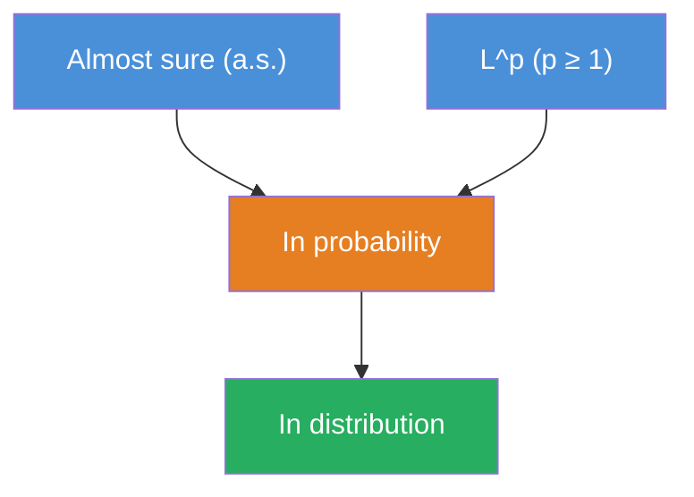

# Module 02: Probability Theory & Measure Theory

**Prerequisites:** Module 01 (Linear Algebra)
**Builds toward:** Modules 03, 04, 07, 17, 22

---

## Table of Contents

1. [Motivation: Why Measure Theory?](#1-motivation-why-measure-theory)
2. [Measurable Spaces & σ-Algebras](#2-measurable-spaces--σ-algebras)
3. [Probability Measures](#3-probability-measures)
4. [Random Variables & Distribution Functions](#4-random-variables--distribution-functions)
5. [The Lebesgue Integral](#5-the-lebesgue-integral)
6. [Product Measures & Fubini's Theorem](#6-product-measures--fubinis-theorem)
7. [Conditional Expectation](#7-conditional-expectation)
8. [Filtrations & Adapted Processes](#8-filtrations--adapted-processes)
9. [Modes of Convergence](#9-modes-of-convergence)
10. [Characteristic Functions](#10-characteristic-functions)
11. [Central Limit Theorems](#11-central-limit-theorems)
12. [The Radon-Nikodym Theorem](#12-the-radon-nikodym-theorem)
13. [Implementation: Python](#13-implementation-python)
14. [Implementation: C++](#14-implementation-c)
15. [Exercises](#15-exercises)

---

## 1. Motivation: Why Measure Theory?

Elementary probability — coins, dice, finite sample spaces — works by counting. Each outcome has a probability, and expectations are finite sums. This breaks catastrophically when applied to financial markets, where:

- **Asset prices are continuous random variables.** The probability that $S_T = 104.73$ exactly is zero, yet $S_T$ takes *some* value. We must assign probabilities to *intervals* and *sets*, not individual points.
- **Information arrives continuously.** At time $t$, a trader knows the history of prices $\{S_u : 0 \leq u \leq t\}$. The mathematical structure that encodes "everything knowable at time $t$" is a $\sigma$-algebra $\mathcal{F}_t$.
- **Changing probability measures is essential.** Derivatives pricing requires switching from the real-world (physical) measure $\mathbb{P}$ to the risk-neutral measure $\mathbb{Q}$. The Radon-Nikodym theorem makes this rigorous.
- **Integration must handle pathological functions.** The Riemann integral cannot integrate the indicator of the rationals $\mathbf{1}_\mathbb{Q}$, cannot handle limits of sequences of integrals robustly, and breaks for many objects encountered in stochastic analysis. The Lebesgue integral fixes all of this.

This module constructs the measure-theoretic framework from the ground up. Every definition is motivated by what it enables in finance; every theorem is stated precisely and proved.

---

## 2. Measurable Spaces & σ-Algebras

### 2.1 The Problem with "All Subsets"

In a continuous sample space like $\Omega = \mathbb{R}$, we cannot consistently assign probabilities to *every* subset of $\Omega$. The Banach-Tarski paradox (and, more relevantly, the Vitali construction) shows that doing so leads to contradictions with countable additivity. We must restrict attention to a "well-behaved" collection of subsets: a $\sigma$-algebra.

### 2.2 Definition

Let $\Omega$ be a non-empty set. A collection $\mathcal{F} \subseteq 2^\Omega$ (the power set) is a **$\sigma$-algebra** (sigma-algebra) on $\Omega$ if:

1. $\Omega \in \mathcal{F}$ (the whole space is measurable)
2. If $A \in \mathcal{F}$, then $A^c \in \mathcal{F}$ (closed under complementation)
3. If $A_1, A_2, \ldots \in \mathcal{F}$, then $\bigcup_{n=1}^\infty A_n \in \mathcal{F}$ (closed under countable unions)

The pair $(\Omega, \mathcal{F})$ is called a **measurable space**.

**Immediate consequences:**

- $\emptyset = \Omega^c \in \mathcal{F}$ (by 1 and 2)
- Closed under countable intersections: $\bigcap_{n=1}^\infty A_n = \left(\bigcup_{n=1}^\infty A_n^c\right)^c \in \mathcal{F}$ (by De Morgan)
- Closed under set differences: $A \setminus B = A \cap B^c \in \mathcal{F}$

### 2.3 Examples

**Example 1 — Trivial $\sigma$-algebra.** $\mathcal{F} = \{\emptyset, \Omega\}$. This encodes "no information at all" — we cannot distinguish any outcomes. In finance, this corresponds to time $t = 0$ before any prices are observed.

**Example 2 — Power set.** $\mathcal{F} = 2^\Omega$. Every subset is measurable. This works when $\Omega$ is finite or countable. For continuous spaces, this is too large (Vitali sets).

**Example 3 — Partition-generated $\sigma$-algebra.** Let $\{B_1, B_2, B_3\}$ partition $\Omega$. The generated $\sigma$-algebra is:

$$\mathcal{F} = \{\emptyset, B_1, B_2, B_3, B_1 \cup B_2, B_1 \cup B_3, B_2 \cup B_3, \Omega\}$$

This has $2^3 = 8$ elements. A partition into $n$ blocks generates a $\sigma$-algebra with $2^n$ elements. Financially, the blocks represent "scenarios" (e.g., market up, flat, down), and $\mathcal{F}$ contains all events that can be expressed in terms of these scenarios.

**Example 4 — The Borel $\sigma$-algebra $\mathcal{B}(\mathbb{R})$.** The $\sigma$-algebra generated by the open subsets of $\mathbb{R}$:

$$\mathcal{B}(\mathbb{R}) = \sigma(\{(a, b) : a < b, \; a, b \in \mathbb{R}\})$$

It contains all open sets, closed sets, countable unions and intersections thereof — everything needed for probability on the real line. Equivalently, $\mathcal{B}(\mathbb{R}) = \sigma(\{(-\infty, x] : x \in \mathbb{R}\})$ (generated by half-lines).

### 2.4 Generated $\sigma$-Algebras

Given a collection $\mathcal{C} \subseteq 2^\Omega$, the **$\sigma$-algebra generated by $\mathcal{C}$**, denoted $\sigma(\mathcal{C})$, is the smallest $\sigma$-algebra containing $\mathcal{C}$:

$$\sigma(\mathcal{C}) = \bigcap\{\mathcal{F} : \mathcal{F} \text{ is a } \sigma\text{-algebra on } \Omega, \; \mathcal{C} \subseteq \mathcal{F}\}$$

This intersection is well-defined (the power set $2^\Omega$ is always one such $\mathcal{F}$) and is itself a $\sigma$-algebra (exercise: the intersection of any family of $\sigma$-algebras is a $\sigma$-algebra).

### 2.5 The $\sigma$-Algebra Generated by a Random Variable

If $X: \Omega \to \mathbb{R}$ is a random variable (defined properly in Section 4), then:

$$\sigma(X) = \{X^{-1}(B) : B \in \mathcal{B}(\mathbb{R})\} = \{\{\omega : X(\omega) \in B\} : B \in \mathcal{B}(\mathbb{R})\}$$

$\sigma(X)$ represents the information contained in observing $X$. If $X$ is a stock price $S_T$, then $\sigma(S_T)$ is everything you can learn by observing the terminal price — you know whether $S_T > K$ (whether an option expires in-the-money), whether $S_T \in [100, 105]$, etc., but you don't know the path $S_t$ took to get there.

---

## 3. Probability Measures

### 3.1 Kolmogorov Axioms

A **probability measure** on a measurable space $(\Omega, \mathcal{F})$ is a function $\mathbb{P}: \mathcal{F} \to [0, 1]$ satisfying:

1. **Non-negativity:** $\mathbb{P}(A) \geq 0$ for all $A \in \mathcal{F}$
2. **Normalization:** $\mathbb{P}(\Omega) = 1$
3. **Countable additivity ($\sigma$-additivity):** For pairwise disjoint $A_1, A_2, \ldots \in \mathcal{F}$:

$$\mathbb{P}\left(\bigcup_{n=1}^\infty A_n\right) = \sum_{n=1}^\infty \mathbb{P}(A_n)$$

The triple $(\Omega, \mathcal{F}, \mathbb{P})$ is a **probability space**.

### 3.2 Properties (Derived from the Axioms)

**Theorem.** Let $(\Omega, \mathcal{F}, \mathbb{P})$ be a probability space. For $A, B \in \mathcal{F}$:

(a) $\mathbb{P}(\emptyset) = 0$

(b) **Monotonicity:** $A \subseteq B \Longrightarrow \mathbb{P}(A) \leq \mathbb{P}(B)$

(c) **Complement:** $\mathbb{P}(A^c) = 1 - \mathbb{P}(A)$

(d) **Inclusion-exclusion:** $\mathbb{P}(A \cup B) = \mathbb{P}(A) + \mathbb{P}(B) - \mathbb{P}(A \cap B)$

(e) **Continuity from below:** If $A_n \uparrow A$ (i.e., $A_1 \subseteq A_2 \subseteq \cdots$ and $A = \bigcup A_n$), then $\mathbb{P}(A_n) \to \mathbb{P}(A)$.

(f) **Continuity from above:** If $A_n \downarrow A$ (i.e., $A_1 \supseteq A_2 \supseteq \cdots$ and $A = \bigcap A_n$), then $\mathbb{P}(A_n) \to \mathbb{P}(A)$.

(g) **Boole's inequality (union bound):** $\mathbb{P}\left(\bigcup_{n=1}^\infty A_n\right) \leq \sum_{n=1}^\infty \mathbb{P}(A_n)$

*Proof of (e).* Define $B_1 = A_1$ and $B_n = A_n \setminus A_{n-1}$ for $n \geq 2$. The $B_n$ are disjoint, and $\bigcup_{n=1}^N B_n = A_N$. By $\sigma$-additivity:

$$\mathbb{P}(A) = \mathbb{P}\left(\bigcup_{n=1}^\infty B_n\right) = \sum_{n=1}^\infty \mathbb{P}(B_n) = \lim_{N \to \infty} \sum_{n=1}^N \mathbb{P}(B_n) = \lim_{N \to \infty} \mathbb{P}(A_N) \quad \square$$

### 3.3 Construction: The Carathéodory Extension Theorem

In practice, we don't specify $\mathbb{P}$ on every set in $\mathcal{F}$ directly. We specify it on a simpler collection (e.g., intervals) and extend.

**Theorem (Carathéodory Extension).** Let $\mathcal{A}$ be an algebra on $\Omega$ (closed under finite unions and complements) and let $\mu_0: \mathcal{A} \to [0, \infty]$ be a $\sigma$-finite pre-measure (finitely additive, $\sigma$-additive on $\mathcal{A}$, $\mu_0(\emptyset) = 0$). Then there exists a unique measure $\mu$ on $\sigma(\mathcal{A})$ that extends $\mu_0$.

**Application to probability on $\mathbb{R}$.** Start with the algebra of finite unions of half-open intervals $\mathcal{A} = \{(a_1, b_1] \cup \cdots \cup (a_k, b_k]\}$. Define:

$$\mu_0((a, b]) = F(b) - F(a)$$

where $F: \mathbb{R} \to [0, 1]$ is a cumulative distribution function (right-continuous, non-decreasing, $\lim_{x \to -\infty} F(x) = 0$, $\lim_{x \to \infty} F(x) = 1$). Carathéodory extends this to a probability measure on $\mathcal{B}(\mathbb{R})$. This establishes the fundamental correspondence: **every CDF defines a unique probability measure on $(\mathbb{R}, \mathcal{B}(\mathbb{R}))$, and vice versa.**

### 3.4 The Physical Measure and the Risk-Neutral Measure

In finance, the same sample space $\Omega$ (the set of all possible market outcomes) carries two important probability measures:

- **$\mathbb{P}$ (physical/real-world measure):** Governs the actual statistical behavior of prices. Estimated from historical data.
- **$\mathbb{Q}$ (risk-neutral measure):** Under $\mathbb{Q}$, discounted asset prices are martingales. Used for derivatives pricing. Implied from option prices.

$\mathbb{P}$ and $\mathbb{Q}$ agree on which events are possible (they are **equivalent measures**: $\mathbb{P}(A) = 0 \iff \mathbb{Q}(A) = 0$), but disagree on their probabilities. The Radon-Nikodym theorem (Section 12) formalizes the relationship.

---

## 4. Random Variables & Distribution Functions

### 4.1 Definition

A **random variable** on $(\Omega, \mathcal{F})$ is a measurable function $X: \Omega \to \mathbb{R}$. That is, for every Borel set $B \in \mathcal{B}(\mathbb{R})$:

$$X^{-1}(B) = \{\omega \in \Omega : X(\omega) \in B\} \in \mathcal{F}$$

Equivalently (and more practically), it suffices to check that $\{X \leq x\} := \{\omega : X(\omega) \leq x\} \in \mathcal{F}$ for all $x \in \mathbb{R}$.

**Why measurability matters.** A random variable represents a quantity whose value depends on the outcome $\omega$, but which is "observable" given the information in $\mathcal{F}$. If $X$ is $\mathcal{F}$-measurable, it means knowing which event in $\mathcal{F}$ occurred is sufficient to determine the value of $X$. An asset price $S_t$ is $\mathcal{F}_t$-measurable — it is determined by information available at time $t$.

### 4.2 Distribution and Density

The **cumulative distribution function** (CDF) of $X$ is:

$$F_X(x) = \mathbb{P}(X \leq x) = \mathbb{P}(\{\omega : X(\omega) \leq x\})$$

Properties: $F_X$ is non-decreasing, right-continuous, $\lim_{x \to -\infty} F_X(x) = 0$, $\lim_{x \to \infty} F_X(x) = 1$.

If $F_X$ is absolutely continuous (differentiable a.e.), then $X$ has a **probability density function** (PDF):

$$f_X(x) = F_X'(x), \qquad \mathbb{P}(X \in A) = \int_A f_X(x) \, dx$$

### 4.3 Random Vectors

A **random vector** $\mathbf{X} = (X_1, \ldots, X_n)^\top: \Omega \to \mathbb{R}^n$ is measurable with respect to $\mathcal{F}$ and $\mathcal{B}(\mathbb{R}^n)$. Its distribution is characterized by the **joint CDF**:

$$F_\mathbf{X}(\mathbf{x}) = \mathbb{P}(X_1 \leq x_1, \ldots, X_n \leq x_n)$$

**Independence.** Random variables $X_1, \ldots, X_n$ are **independent** if:

$$\mathbb{P}(X_1 \in B_1, \ldots, X_n \in B_n) = \prod_{i=1}^n \mathbb{P}(X_i \in B_i) \qquad \forall\, B_i \in \mathcal{B}(\mathbb{R})$$

Equivalently, the joint CDF factors: $F_\mathbf{X}(\mathbf{x}) = \prod_i F_{X_i}(x_i)$.

In terms of $\sigma$-algebras: $X_1, \ldots, X_n$ are independent if $\sigma(X_1), \ldots, \sigma(X_n)$ are independent sub-$\sigma$-algebras of $\mathcal{F}$.

### 4.4 Key Distributions in Finance

| Distribution | PDF / PMF | Use in Finance |
|---|---|---|
| Normal $\mathcal{N}(\mu, \sigma^2)$ | $\frac{1}{\sigma\sqrt{2\pi}} e^{-\frac{(x-\mu)^2}{2\sigma^2}}$ | Log-returns (first approximation), Black-Scholes |
| Log-normal $\text{LogN}(\mu, \sigma^2)$ | $\frac{1}{x\sigma\sqrt{2\pi}} e^{-\frac{(\ln x - \mu)^2}{2\sigma^2}}$ | Asset prices under GBM |
| Student-$t$ ($\nu$ d.f.) | $\frac{\Gamma(\frac{\nu+1}{2})}{\sqrt{\nu\pi}\,\Gamma(\frac{\nu}{2})}\left(1 + \frac{x^2}{\nu}\right)^{-\frac{\nu+1}{2}}$ | Heavy-tailed returns ($\nu \approx 3$-$5$ for equities) |
| Chi-squared $\chi^2_k$ | $\frac{x^{k/2-1}e^{-x/2}}{2^{k/2}\Gamma(k/2)}$ | Realized variance, goodness-of-fit |
| Exponential $\text{Exp}(\lambda)$ | $\lambda e^{-\lambda x}$ | Inter-arrival times of orders (Poisson process) |
| Poisson $\text{Poi}(\lambda)$ | $\frac{\lambda^k e^{-\lambda}}{k!}$ | Trade counts, jump processes |
| Multivariate normal $\mathcal{N}(\boldsymbol{\mu}, \boldsymbol{\Sigma})$ | $\frac{1}{(2\pi)^{n/2}\lvert\boldsymbol{\Sigma}\rvert^{1/2}} e^{-\frac{1}{2}(\mathbf{x}-\boldsymbol{\mu})^\top\boldsymbol{\Sigma}^{-1}(\mathbf{x}-\boldsymbol{\mu})}$ | Joint asset returns, factor models |

---

## 5. The Lebesgue Integral

### 5.1 Why Not Riemann?

The Riemann integral partitions the *domain* (the $x$-axis) into intervals and approximates the function on each. The Lebesgue integral partitions the *range* (the $y$-axis) and measures how much of the domain maps to each value. This yields three critical advantages:

1. **Larger class of integrable functions.** The Riemann integral cannot handle $\mathbf{1}_\mathbb{Q}$ (indicator of rationals); Lebesgue can.
2. **Powerful limit theorems.** Monotone and dominated convergence theorems allow interchanging limits and integrals under mild conditions — essential for justifying Monte Carlo convergence.
3. **Natural framework for probability.** $\mathbb{E}[X] = \int_\Omega X \, d\mathbb{P}$ unifies discrete and continuous random variables.

### 5.2 Construction

The Lebesgue integral is built in four stages.

**Stage 1: Indicator functions.** For $A \in \mathcal{F}$:

$$\int_\Omega \mathbf{1}_A \, d\mu = \mu(A)$$

**Stage 2: Simple functions.** A **simple function** is $\phi = \sum_{i=1}^k a_i \mathbf{1}_{A_i}$ with $a_i \geq 0$ and $A_i \in \mathcal{F}$. Define:

$$\int_\Omega \phi \, d\mu = \sum_{i=1}^k a_i \, \mu(A_i)$$

This is well-defined (independent of the representation of $\phi$).

**Stage 3: Non-negative measurable functions.** For measurable $f: \Omega \to [0, \infty]$:

$$\int_\Omega f \, d\mu = \sup\left\{\int_\Omega \phi \, d\mu : 0 \leq \phi \leq f, \; \phi \text{ simple}\right\}$$

This supremum may be $+\infty$.

**Stage 4: General measurable functions.** Decompose $f = f^+ - f^-$ where $f^+ = \max(f, 0)$ and $f^- = \max(-f, 0)$. Define:

$$\int_\Omega f \, d\mu = \int_\Omega f^+ \, d\mu - \int_\Omega f^- \, d\mu$$

provided at least one of the integrals is finite. $f$ is **integrable** (in $L^1$) if both are finite, i.e., $\int |f| \, d\mu < \infty$.

### 5.3 Expectation as Lebesgue Integral

For a random variable $X$ on $(\Omega, \mathcal{F}, \mathbb{P})$:

$$\mathbb{E}[X] = \int_\Omega X(\omega) \, d\mathbb{P}(\omega)$$

For a function $g$ and the **law of the unconscious statistician** (LOTUS):

$$\mathbb{E}[g(X)] = \int_\Omega g(X(\omega)) \, d\mathbb{P}(\omega) = \int_\mathbb{R} g(x) \, dF_X(x) = \int_\mathbb{R} g(x) f_X(x) \, dx$$

(the last equality when $X$ has a density $f_X$).

### 5.4 The Monotone Convergence Theorem (MCT)

**Theorem.** Let $0 \leq f_1 \leq f_2 \leq \cdots$ be measurable functions with $f_n \uparrow f$ pointwise. Then:

$$\int_\Omega f \, d\mu = \lim_{n \to \infty} \int_\Omega f_n \, d\mu$$

*Proof sketch.* The sequence $\int f_n \, d\mu$ is non-decreasing and bounded above by $\int f \, d\mu$, so it has a limit $L \leq \int f \, d\mu$. For the reverse inequality, fix any simple function $\phi \leq f$ and $\alpha \in (0, 1)$. Define $A_n = \{f_n \geq \alpha\phi\}$. Then $A_n \uparrow \Omega$, and:

$$\int f_n \, d\mu \geq \int_{A_n} f_n \, d\mu \geq \alpha \int_{A_n} \phi \, d\mu \xrightarrow{n \to \infty} \alpha \int_\Omega \phi \, d\mu$$

Taking $\alpha \to 1$ and then the supremum over $\phi$: $L \geq \int f \, d\mu$. $\square$

### 5.5 Fatou's Lemma

**Theorem.** For non-negative measurable $f_n$:

$$\int_\Omega \liminf_{n \to \infty} f_n \, d\mu \leq \liminf_{n \to \infty} \int_\Omega f_n \, d\mu$$

*Proof.* Define $g_k = \inf_{n \geq k} f_n$. Then $g_k \leq f_n$ for all $n \geq k$, so $\int g_k \leq \int f_n$ for $n \geq k$, hence $\int g_k \leq \inf_{n \geq k} \int f_n$. Since $g_k \uparrow \liminf f_n$, MCT gives $\int \liminf f_n = \lim_k \int g_k \leq \liminf \int f_n$. $\square$

**Financial application.** Fatou's lemma is used to prove that limits of supermartingales are supermartingales — critical in the theory of American option pricing (the Snell envelope).

### 5.6 The Dominated Convergence Theorem (DCT)

**Theorem (Lebesgue DCT).** Let $f_n$ be measurable with $f_n \to f$ pointwise (or a.e.). If there exists an integrable $g$ (the **dominator**) with $|f_n| \leq g$ for all $n$, then:

$$\lim_{n \to \infty} \int_\Omega f_n \, d\mu = \int_\Omega f \, d\mu$$

*Proof.* Apply Fatou's lemma to the non-negative functions $g + f_n \geq 0$ and $g - f_n \geq 0$:

$$\int (g + f) \leq \liminf \int(g + f_n) = \int g + \liminf \int f_n$$

$$\int (g - f) \leq \liminf \int(g - f_n) = \int g + \liminf \int(-f_n) = \int g - \limsup \int f_n$$

From the first: $\int f \leq \liminf \int f_n$. From the second: $\int f \geq \limsup \int f_n$. Together: $\int f = \lim \int f_n$. $\square$

**Financial application.** The DCT justifies the interchange of expectation and limit in:

$$\lim_{n \to \infty} \mathbb{E}[f_n(S_T)] = \mathbb{E}\left[\lim_{n \to \infty} f_n(S_T)\right]$$

provided $|f_n(S_T)|$ is dominated by an integrable function. This is used when approximating option payoffs (e.g., approximating digital options by smooth functions) and in the convergence analysis of Monte Carlo estimators.

### 5.7 $L^p$ Spaces

For $p \geq 1$, the space $L^p(\Omega, \mathcal{F}, \mu)$ consists of measurable functions with finite $p$-th moment:

$$\|f\|_p = \left(\int_\Omega |f|^p \, d\mu\right)^{1/p} < \infty$$

**Key inequalities:**

**Hölder's inequality.** For $\frac{1}{p} + \frac{1}{q} = 1$ with $p, q > 1$:

$$\int |fg| \, d\mu \leq \|f\|_p \|g\|_q$$

**Minkowski's inequality** (triangle inequality for $\|\cdot\|_p$):

$$\|f + g\|_p \leq \|f\|_p + \|g\|_p$$

For $p = 2$: $L^2$ is a Hilbert space with inner product $\langle f, g \rangle = \int fg \, d\mu$. This is the natural home for random variables with finite variance, and the foundation of the covariance-as-inner-product interpretation from Module 01.

---

## 6. Product Measures & Fubini's Theorem

### 6.1 Product Spaces

Given measurable spaces $(\Omega_1, \mathcal{F}_1)$ and $(\Omega_2, \mathcal{F}_2)$, the **product $\sigma$-algebra** on $\Omega_1 \times \Omega_2$ is:

$$\mathcal{F}_1 \otimes \mathcal{F}_2 = \sigma(\{A_1 \times A_2 : A_1 \in \mathcal{F}_1, A_2 \in \mathcal{F}_2\})$$

If $\mu_1$ and $\mu_2$ are $\sigma$-finite measures, there exists a unique **product measure** $\mu_1 \otimes \mu_2$ on $\mathcal{F}_1 \otimes \mathcal{F}_2$ satisfying:

$$(\mu_1 \otimes \mu_2)(A_1 \times A_2) = \mu_1(A_1) \cdot \mu_2(A_2)$$

### 6.2 Fubini-Tonelli Theorem

**Theorem (Tonelli).** If $f \geq 0$ is measurable on $(\Omega_1 \times \Omega_2, \mathcal{F}_1 \otimes \mathcal{F}_2, \mu_1 \otimes \mu_2)$:

$$\int_{\Omega_1 \times \Omega_2} f \, d(\mu_1 \otimes \mu_2) = \int_{\Omega_1}\left(\int_{\Omega_2} f(\omega_1, \omega_2) \, d\mu_2(\omega_2)\right) d\mu_1(\omega_1) = \int_{\Omega_2}\left(\int_{\Omega_1} f \, d\mu_1\right) d\mu_2$$

**Theorem (Fubini).** If $f$ is integrable on the product space (i.e., $\int |f| \, d(\mu_1 \otimes \mu_2) < \infty$), then the iterated integrals exist and equal the double integral.

**Financial application.** For independent random variables $X$ and $Y$:

$$\mathbb{E}[g(X, Y)] = \int\int g(x, y) \, f_X(x) f_Y(y) \, dx \, dy$$

Fubini allows computing this as an iterated integral in either order. This is used constantly in derivatives pricing — e.g., computing the expected payoff under a stochastic volatility model where the integral over price is conditioned on the integral over volatility (or vice versa).

---

## 7. Conditional Expectation

### 7.1 Motivation

In elementary probability: $\mathbb{E}[X \mid Y = y] = \int x \, f_{X|Y}(x | y) \, dx$. But this definition breaks when $\mathbb{P}(Y = y) = 0$ (continuous $Y$), and it doesn't generalize to conditioning on $\sigma$-algebras. The measure-theoretic definition of conditional expectation is one of the most important constructions in mathematical finance.

### 7.2 Definition

**Definition.** Let $X$ be an integrable random variable on $(\Omega, \mathcal{F}, \mathbb{P})$ and let $\mathcal{G} \subseteq \mathcal{F}$ be a sub-$\sigma$-algebra. The **conditional expectation** $\mathbb{E}[X \mid \mathcal{G}]$ is the (a.s. unique) random variable satisfying:

1. $\mathbb{E}[X \mid \mathcal{G}]$ is $\mathcal{G}$-measurable
2. For all $G \in \mathcal{G}$: $\int_G \mathbb{E}[X \mid \mathcal{G}] \, d\mathbb{P} = \int_G X \, d\mathbb{P}$

Condition (1) says that $\mathbb{E}[X \mid \mathcal{G}]$ depends only on the information in $\mathcal{G}$. Condition (2) says it "averages correctly" over every $\mathcal{G}$-measurable event.

**Existence and uniqueness** follow from the Radon-Nikodym theorem (Section 12). Define the signed measure $\nu(G) = \int_G X \, d\mathbb{P}$. Then $\nu \ll \mathbb{P}|_\mathcal{G}$, and $\mathbb{E}[X \mid \mathcal{G}] = d\nu / d\mathbb{P}|_\mathcal{G}$.

### 7.3 Properties of Conditional Expectation

For integrable $X, Y$ and sub-$\sigma$-algebras $\mathcal{G}, \mathcal{H}$ of $\mathcal{F}$:

| Property | Statement |
|----------|-----------|
| Linearity | $\mathbb{E}[\alpha X + \beta Y \mid \mathcal{G}] = \alpha\mathbb{E}[X \mid \mathcal{G}] + \beta\mathbb{E}[Y \mid \mathcal{G}]$ |
| Pulling out what is known | If $Y$ is $\mathcal{G}$-measurable and $XY$ is integrable: $\mathbb{E}[XY \mid \mathcal{G}] = Y \cdot \mathbb{E}[X \mid \mathcal{G}]$ |
| Tower property (iterated conditioning) | $\mathcal{H} \subseteq \mathcal{G} \Longrightarrow \mathbb{E}[\mathbb{E}[X \mid \mathcal{G}] \mid \mathcal{H}] = \mathbb{E}[X \mid \mathcal{H}]$ |
| Independence | If $X$ is independent of $\mathcal{G}$: $\mathbb{E}[X \mid \mathcal{G}] = \mathbb{E}[X]$ |
| Trivial $\sigma$-algebra | $\mathbb{E}[X \mid \{\emptyset, \Omega\}] = \mathbb{E}[X]$ |
| Full $\sigma$-algebra | $\mathbb{E}[X \mid \mathcal{F}] = X$ |
| Jensen's inequality | If $\varphi$ is convex: $\varphi(\mathbb{E}[X \mid \mathcal{G}]) \leq \mathbb{E}[\varphi(X) \mid \mathcal{G}]$ |
| Monotonicity | $X \leq Y \text{ a.s.} \Longrightarrow \mathbb{E}[X \mid \mathcal{G}] \leq \mathbb{E}[Y \mid \mathcal{G}] \text{ a.s.}$ |

*Proof of the tower property.* We verify the two defining conditions for $\mathbb{E}[\mathbb{E}[X \mid \mathcal{G}] \mid \mathcal{H}]$ to equal $\mathbb{E}[X \mid \mathcal{H}]$.

(1) Both sides are $\mathcal{H}$-measurable.

(2) For any $H \in \mathcal{H}$, since $\mathcal{H} \subseteq \mathcal{G}$ we have $H \in \mathcal{G}$, so:

$$\int_H \mathbb{E}[\mathbb{E}[X \mid \mathcal{G}] \mid \mathcal{H}] \, d\mathbb{P} = \int_H \mathbb{E}[X \mid \mathcal{G}] \, d\mathbb{P} = \int_H X \, d\mathbb{P}$$

The first equality uses condition (2) for $\mathbb{E}[\cdot \mid \mathcal{H}]$; the second uses condition (2) for $\mathbb{E}[\cdot \mid \mathcal{G}]$ (since $H \in \mathcal{G}$). But $\int_H X \, d\mathbb{P} = \int_H \mathbb{E}[X \mid \mathcal{H}] \, d\mathbb{P}$ by the definition of $\mathbb{E}[X \mid \mathcal{H}]$. By uniqueness, the two sides are equal a.s. $\square$

### 7.4 Financial Interpretation

The conditional expectation $\mathbb{E}[X \mid \mathcal{F}_t]$ is the **best prediction** of $X$ given the information available at time $t$, where "best" means minimizing mean squared error:

$$\mathbb{E}[X \mid \mathcal{F}_t] = \arg\min_{Y \in L^2(\mathcal{F}_t)} \mathbb{E}[(X - Y)^2]$$

This is the $L^2$-projection of $X$ onto the subspace of $\mathcal{F}_t$-measurable, square-integrable random variables — connecting directly to the orthogonal projection theory of Module 01.

The **tower property** $\mathbb{E}[\mathbb{E}[X \mid \mathcal{F}_t] \mid \mathcal{F}_s] = \mathbb{E}[X \mid \mathcal{F}_s]$ for $s \leq t$ says: if you expect to revise your prediction at time $t$, your best prediction now (at time $s$) already accounts for that revision. This is the mathematical content of "prices are martingales under $\mathbb{Q}$" — you can't predict the direction of future price changes.

---

## 8. Filtrations & Adapted Processes

### 8.1 Filtrations

A **filtration** on $(\Omega, \mathcal{F})$ is a non-decreasing family of sub-$\sigma$-algebras $\{\mathcal{F}_t\}_{t \geq 0}$:

$$s \leq t \Longrightarrow \mathcal{F}_s \subseteq \mathcal{F}_t \subseteq \mathcal{F}$$

$\mathcal{F}_t$ represents the information available at time $t$. As time progresses, more information becomes available (we observe more prices, news, etc.), so the $\sigma$-algebras grow.

The quadruple $(\Omega, \mathcal{F}, \{\mathcal{F}_t\}_{t \geq 0}, \mathbb{P})$ is a **filtered probability space**.

**The natural filtration.** Given a stochastic process $\{X_t\}_{t \geq 0}$, its **natural filtration** is:

$$\mathcal{F}_t^X = \sigma(X_s : 0 \leq s \leq t) = \sigma\left(\bigcup_{0 \leq s \leq t} \sigma(X_s)\right)$$

This is the smallest filtration to which $X$ is adapted — it represents exactly the information revealed by observing $X$ up to time $t$.

### 8.2 Adapted and Predictable Processes

A stochastic process $\{Y_t\}$ is:

- **Adapted** to $\{\mathcal{F}_t\}$ if $Y_t$ is $\mathcal{F}_t$-measurable for all $t$. Interpretation: $Y_t$ is determined by information available at time $t$. It does not look into the future.
- **Predictable** if $Y_t$ is $\mathcal{F}_{t^-}$-measurable (determined by information *strictly before* $t$). In discrete time: $Y_n$ is $\mathcal{F}_{n-1}$-measurable — you decide your trading strategy *before* seeing the next price.

**Financial significance.** A trading strategy $\{H_t\}$ (the number of shares held at time $t$) must be **predictable** — you decide how many shares to hold based on past information, not on the future price. This is not just mathematical pedantry; it excludes arbitrage by foresight (insider trading). The requirement of predictability is built into the definition of the stochastic integral (Module 04).

### 8.3 Stopping Times

A random variable $\tau: \Omega \to [0, \infty]$ is a **stopping time** with respect to $\{\mathcal{F}_t\}$ if:

$$\{\tau \leq t\} \in \mathcal{F}_t \quad \forall\, t \geq 0$$

The decision to stop at time $\tau$ depends only on information available up to that time — you don't need to see the future to decide whether to stop.

**Examples in finance:**
- The first time a stock hits a price barrier: $\tau = \inf\{t : S_t \geq B\}$
- The first time a drawdown exceeds a threshold: $\tau = \inf\{t : S_t / \max_{s \leq t} S_s \leq 1 - d\}$
- The exercise time of an American option (chosen by the holder)

**The $\sigma$-algebra at a stopping time:**

$$\mathcal{F}_\tau = \{A \in \mathcal{F} : A \cap \{\tau \leq t\} \in \mathcal{F}_t \;\forall\, t \geq 0\}$$

This captures "the information available at the random time $\tau$."

### 8.4 Martingales

A process $\{M_t\}_{t \geq 0}$ adapted to $\{\mathcal{F}_t\}$ is a **martingale** if:

1. $\mathbb{E}[|M_t|] < \infty$ for all $t$
2. $\mathbb{E}[M_t \mid \mathcal{F}_s] = M_s$ for all $s \leq t$

A martingale is a "fair game" — the best prediction of the future value, given current information, is the current value. Under the risk-neutral measure $\mathbb{Q}$, the discounted price process $e^{-rt}S_t$ is a martingale. This is the **fundamental theorem of asset pricing** (Module 17).

Variants:
- **Submartingale:** $\mathbb{E}[M_t \mid \mathcal{F}_s] \geq M_s$ (expected value increases — favorable game)
- **Supermartingale:** $\mathbb{E}[M_t \mid \mathcal{F}_s] \leq M_s$ (expected value decreases — unfavorable game)

---

## 9. Modes of Convergence

### 9.1 Four Modes of Convergence

Let $\{X_n\}$ be a sequence of random variables on $(\Omega, \mathcal{F}, \mathbb{P})$.

**1. Almost sure (a.s.) convergence:**

$$X_n \xrightarrow{a.s.} X \quad \iff \quad \mathbb{P}\left(\left\{\omega : X_n(\omega) \to X(\omega)\right\}\right) = 1$$

The sequence converges for "almost every" outcome.

**2. Convergence in probability:**

$$X_n \xrightarrow{P} X \quad \iff \quad \forall\,\epsilon > 0: \; \mathbb{P}(|X_n - X| > \epsilon) \to 0$$

Large deviations become increasingly rare.

**3. $L^p$ convergence** (convergence in $p$-th mean):

$$X_n \xrightarrow{L^p} X \quad \iff \quad \mathbb{E}[|X_n - X|^p] \to 0$$

For $p = 2$: mean-square convergence.

**4. Convergence in distribution** (weak convergence):

$$X_n \xrightarrow{d} X \quad \iff \quad F_{X_n}(x) \to F_X(x) \; \text{at every continuity point } x \text{ of } F_X$$

Equivalently: $\mathbb{E}[g(X_n)] \to \mathbb{E}[g(X)]$ for all bounded continuous $g$ (portmanteau theorem).

### 9.2 Hierarchy of Convergence Modes



$$\text{a.s.} \Longrightarrow \text{in probability} \Longrightarrow \text{in distribution}$$

$$L^p \Longrightarrow \text{in probability} \Longrightarrow \text{in distribution}$$

The implications are strict (none reverses in general), with one notable exception: convergence in distribution to a *constant* implies convergence in probability.

*Proof that a.s. $\Longrightarrow$ in probability.* Let $X_n \xrightarrow{a.s.} X$. For $\epsilon > 0$, define $A_n = \{|X_n - X| > \epsilon\}$. Since $X_n(\omega) \to X(\omega)$ for almost every $\omega$, we have $\mathbb{P}(\limsup A_n) = 0$ (Borel-Cantelli, first direction). Now $\mathbb{P}(A_n) \leq \mathbb{P}(\bigcup_{k \geq n} A_k) \to \mathbb{P}(\limsup A_n) = 0$. $\square$

*Proof that $L^p \Longrightarrow$ in probability.* Markov's inequality: $\mathbb{P}(|X_n - X| > \epsilon) \leq \frac{\mathbb{E}[|X_n - X|^p]}{\epsilon^p} \to 0$. $\square$

### 9.3 Laws of Large Numbers

**Weak LLN (Khintchine).** For i.i.d. $X_1, X_2, \ldots$ with $\mathbb{E}[X_1] = \mu$ and $\text{Var}(X_1) < \infty$:

$$\bar{X}_n = \frac{1}{n}\sum_{i=1}^n X_i \xrightarrow{P} \mu$$

**Strong LLN (Kolmogorov).** For i.i.d. $X_1, X_2, \ldots$ with $\mathbb{E}[|X_1|] < \infty$:

$$\bar{X}_n \xrightarrow{a.s.} \mu$$

**Financial significance.** The strong LLN guarantees that Monte Carlo estimators converge: if we simulate $n$ independent payoffs $g(S_T^{(1)}), \ldots, g(S_T^{(n)})$, their average converges a.s. to $\mathbb{E}[g(S_T)]$ — the option price under the risk-neutral measure.

### 9.4 Borel-Cantelli Lemmas

**First Borel-Cantelli.** If $\sum_{n=1}^\infty \mathbb{P}(A_n) < \infty$, then $\mathbb{P}(\limsup A_n) = 0$ (only finitely many $A_n$ occur a.s.).

**Second Borel-Cantelli.** If $A_n$ are independent and $\sum_{n=1}^\infty \mathbb{P}(A_n) = \infty$, then $\mathbb{P}(\limsup A_n) = 1$ (infinitely many $A_n$ occur a.s.).

*Proof of First B-C.* $\mathbb{P}(\limsup A_n) = \mathbb{P}(\bigcap_{n=1}^\infty \bigcup_{k=n}^\infty A_k) = \lim_{n \to \infty} \mathbb{P}(\bigcup_{k=n}^\infty A_k) \leq \lim_{n \to \infty} \sum_{k=n}^\infty \mathbb{P}(A_k) = 0$, since the tail of a convergent series goes to zero. $\square$

---

## 10. Characteristic Functions

### 10.1 Definition and Properties

The **characteristic function** of a random variable $X$ is:

$$\varphi_X(t) = \mathbb{E}[e^{itX}] = \int_{-\infty}^\infty e^{itx} \, dF_X(x), \qquad t \in \mathbb{R}$$

where $i = \sqrt{-1}$. Unlike the moment generating function $M_X(t) = \mathbb{E}[e^{tX}]$, the characteristic function always exists (since $|e^{itx}| = 1$).

**Key properties:**

| Property | Statement |
|----------|-----------|
| Always exists | $|\varphi_X(t)| \leq 1$ for all $t$ |
| Uniqueness | $\varphi_X = \varphi_Y \iff X \overset{d}{=} Y$ (determines distribution uniquely) |
| Independence | $X, Y$ independent $\Longrightarrow \varphi_{X+Y}(t) = \varphi_X(t) \cdot \varphi_Y(t)$ |
| Moments | If $\mathbb{E}[|X|^k] < \infty$: $\varphi_X^{(k)}(0) = i^k \mathbb{E}[X^k]$ |
| Symmetry | $X$ is symmetric about 0 $\iff \varphi_X$ is real-valued |
| Continuity | $\varphi_X$ is uniformly continuous on $\mathbb{R}$ |

### 10.2 Examples

| Distribution | Characteristic Function |
|---|---|
| $\mathcal{N}(\mu, \sigma^2)$ | $\varphi(t) = e^{i\mu t - \frac{1}{2}\sigma^2 t^2}$ |
| $\text{Exp}(\lambda)$ | $\varphi(t) = \frac{\lambda}{\lambda - it}$ |
| $\text{Poi}(\lambda)$ | $\varphi(t) = e^{\lambda(e^{it} - 1)}$ |
| $\text{Cauchy}(0,1)$ | $\varphi(t) = e^{-|t|}$ |
| $\chi^2_k$ | $\varphi(t) = (1 - 2it)^{-k/2}$ |

*Derivation for $\mathcal{N}(\mu, \sigma^2)$.* Let $Z \sim \mathcal{N}(0,1)$, so $X = \mu + \sigma Z$ and $\varphi_X(t) = e^{i\mu t}\varphi_Z(\sigma t)$. For $Z$:

$$\varphi_Z(t) = \int_{-\infty}^\infty e^{itz} \frac{1}{\sqrt{2\pi}}e^{-z^2/2} \, dz = \frac{1}{\sqrt{2\pi}} \int_{-\infty}^\infty e^{-\frac{1}{2}(z^2 - 2itz)} \, dz$$

Complete the square: $z^2 - 2itz = (z - it)^2 + t^2$. So:

$$\varphi_Z(t) = e^{-t^2/2} \cdot \frac{1}{\sqrt{2\pi}} \int_{-\infty}^\infty e^{-(z-it)^2/2} \, dz = e^{-t^2/2}$$

(The contour integral equals $\sqrt{2\pi}$ by analyticity — shifting the integration contour in $\mathbb{C}$.) Therefore $\varphi_X(t) = e^{i\mu t - \sigma^2 t^2/2}$. $\square$

### 10.3 The Inversion Theorem

**Theorem (Lévy Inversion).** If $\varphi_X$ is the characteristic function of $X$ with CDF $F_X$, then for continuity points $a < b$ of $F_X$:

$$F_X(b) - F_X(a) = \lim_{T \to \infty} \frac{1}{2\pi} \int_{-T}^T \frac{e^{-ita} - e^{-itb}}{it} \varphi_X(t) \, dt$$

If $\varphi_X \in L^1(\mathbb{R})$, then $X$ has a density:

$$f_X(x) = \frac{1}{2\pi} \int_{-\infty}^\infty e^{-itx} \varphi_X(t) \, dt$$

**Application in option pricing.** The Heston model (Module 19) has a known characteristic function $\varphi_{\ln S_T}$ but no closed-form density. Option prices are computed via Fourier inversion:

$$C(K, T) = e^{-rT} \cdot \frac{1}{2\pi} \int_{-\infty}^\infty e^{-iu\ln K} \frac{\varphi_{\ln S_T}(u - i)}{iu(iu + 1)} \, du$$

This is the Carr-Madan formula (Module 08), which uses the FFT for computational efficiency.

### 10.4 Lévy Continuity Theorem

**Theorem.** Let $\{X_n\}$ be a sequence of random variables with characteristic functions $\varphi_n$. Then $X_n \xrightarrow{d} X$ if and only if $\varphi_n(t) \to \varphi(t)$ pointwise for all $t \in \mathbb{R}$, where $\varphi$ is continuous at $t = 0$.

Moreover, $\varphi$ is the characteristic function of $X$.

This is the primary tool for proving central limit theorems and characterizing weak convergence.

---

## 11. Central Limit Theorems

### 11.1 The Classical CLT (Lindeberg-Lévy)

**Theorem.** Let $X_1, X_2, \ldots$ be i.i.d. with $\mathbb{E}[X_1] = \mu$ and $\text{Var}(X_1) = \sigma^2 \in (0, \infty)$. Then:

$$\frac{\sqrt{n}(\bar{X}_n - \mu)}{\sigma} \xrightarrow{d} \mathcal{N}(0, 1)$$

*Proof via characteristic functions.* Let $Z_i = (X_i - \mu)/\sigma$ (standardized). Then $\mathbb{E}[Z_i] = 0$, $\text{Var}(Z_i) = 1$. The normalized sum is $S_n = \frac{1}{\sqrt{n}}\sum_{i=1}^n Z_i$.

Its characteristic function:

$$\varphi_{S_n}(t) = \left[\varphi_{Z_1}\left(\frac{t}{\sqrt{n}}\right)\right]^n$$

Taylor expand $\varphi_{Z_1}$ around $0$:

$$\varphi_{Z_1}(s) = 1 + is\mathbb{E}[Z_1] - \frac{s^2}{2}\mathbb{E}[Z_1^2] + o(s^2) = 1 - \frac{s^2}{2} + o(s^2)$$

Substituting $s = t/\sqrt{n}$:

$$\varphi_{S_n}(t) = \left[1 - \frac{t^2}{2n} + o\left(\frac{1}{n}\right)\right]^n \xrightarrow{n \to \infty} e^{-t^2/2}$$

This is the characteristic function of $\mathcal{N}(0, 1)$. By the Lévy continuity theorem, $S_n \xrightarrow{d} \mathcal{N}(0, 1)$. $\square$

### 11.2 The Lindeberg-Feller CLT

The Lindeberg-Feller theorem extends to independent (but not identically distributed) summands — relevant when aggregating returns from different sources or assets with different volatilities.

**Theorem.** Let $X_{n,1}, \ldots, X_{n,n}$ be independent (for each $n$) with $\mathbb{E}[X_{n,k}] = 0$ and $\text{Var}(X_{n,k}) = \sigma_{n,k}^2$. Define $s_n^2 = \sum_{k=1}^n \sigma_{n,k}^2$. If the **Lindeberg condition** holds:

$$\forall\, \epsilon > 0: \quad \frac{1}{s_n^2}\sum_{k=1}^n \mathbb{E}\left[X_{n,k}^2 \cdot \mathbf{1}_{\{|X_{n,k}| > \epsilon s_n\}}\right] \xrightarrow{n \to \infty} 0$$

then $S_n = \frac{1}{s_n}\sum_{k=1}^n X_{n,k} \xrightarrow{d} \mathcal{N}(0, 1)$.

The Lindeberg condition says: no single summand dominates the total variance. This excludes "heavy-tailed domination" and ensures that many small contributions combine to produce a Gaussian.

### 11.3 Berry-Esseen Theorem

**Theorem.** Under the i.i.d. CLT assumptions, if $\rho = \mathbb{E}[|X_1 - \mu|^3] < \infty$:

$$\sup_x \left|F_{S_n}(x) - \Phi(x)\right| \leq \frac{C \rho}{\sigma^3 \sqrt{n}}$$

where $\Phi$ is the standard normal CDF and $C \leq 0.4748$ (best known constant as of Shevtsova 2011).

**Financial significance.** The Berry-Esseen theorem quantifies the *rate* of CLT convergence — important for knowing how many Monte Carlo samples $n$ you need before the Gaussian approximation to the sampling distribution is accurate. For heavy-tailed returns ($\rho/\sigma^3$ large), convergence is slow.

---

## 12. The Radon-Nikodym Theorem

### 12.1 Absolute Continuity of Measures

A measure $\nu$ is **absolutely continuous** with respect to $\mu$ (written $\nu \ll \mu$) if:

$$\mu(A) = 0 \Longrightarrow \nu(A) = 0 \qquad \forall\, A \in \mathcal{F}$$

Measures $\mu$ and $\nu$ are **equivalent** (written $\mu \sim \nu$) if $\mu \ll \nu$ and $\nu \ll \mu$ — they agree on which sets have zero measure.

**Financial interpretation.** $\mathbb{P} \sim \mathbb{Q}$ (physical and risk-neutral measures are equivalent) means: any event that is impossible under $\mathbb{P}$ is also impossible under $\mathbb{Q}$, and vice versa. The two measures agree on what *can* happen, just not on the probabilities. A stock that can go to zero under $\mathbb{P}$ can also go to zero under $\mathbb{Q}$.

### 12.2 The Theorem

**Theorem (Radon-Nikodym).** Let $(\Omega, \mathcal{F})$ be a measurable space and $\mu$, $\nu$ $\sigma$-finite measures on $\mathcal{F}$ with $\nu \ll \mu$. Then there exists a non-negative measurable function $f: \Omega \to [0, \infty)$, unique up to $\mu$-a.e. equality, such that:

$$\nu(A) = \int_A f \, d\mu \qquad \forall\, A \in \mathcal{F}$$

The function $f$ is called the **Radon-Nikodym derivative** of $\nu$ with respect to $\mu$, denoted $f = \frac{d\nu}{d\mu}$.

*Proof sketch (for finite measures, following von Neumann's elegant proof).*

Define the finite measure $\lambda = \mu + \nu$. Then $\mu \ll \lambda$ and $\nu \ll \lambda$. Consider $L^2(\lambda)$ and the linear functional $\ell: L^2(\lambda) \to \mathbb{R}$ defined by:

$$\ell(g) = \int g \, d\nu$$

By Cauchy-Schwarz, $|\ell(g)| \leq \left(\int g^2 d\nu\right)^{1/2}\left(\nu(\Omega)\right)^{1/2} \leq \left(\int g^2 d\lambda\right)^{1/2}\left(\nu(\Omega)\right)^{1/2} = C\|g\|_{L^2(\lambda)}$

So $\ell$ is a bounded linear functional on $L^2(\lambda)$. By the Riesz representation theorem (Module 01 — inner product spaces), there exists $h \in L^2(\lambda)$ such that:

$$\int g \, d\nu = \int gh \, d\lambda \qquad \forall\, g \in L^2(\lambda)$$

Taking $g = \mathbf{1}_A$: $\nu(A) = \int_A h \, d\lambda$ for all $A \in \mathcal{F}$.

Since $\nu(A) \geq 0$, we have $h \geq 0$ a.e. Since $\nu(A) \leq \lambda(A)$, we have $h \leq 1$ a.e.

Now we want $d\nu/d\mu$, not $d\nu/d\lambda$. From $\nu(A) = \int_A h \, d\lambda = \int_A h \, d\mu + \int_A h \, d\nu$:

$$\int_A (1 - h) \, d\nu = \int_A h \, d\mu$$

On $\{h < 1\}$, define $f = h/(1 - h)$. Then $\nu(A \cap \{h < 1\}) = \int_{A \cap \{h < 1\}} f \, d\mu$. It remains to show $\nu(\{h = 1\}) = 0$ (which follows from $\nu \ll \mu$ and the structure of $h$). The full technical argument fills in this gap. $\square$

### 12.3 Application: Change of Measure in Finance

Let $\mathbb{P}$ and $\mathbb{Q}$ be equivalent probability measures on $(\Omega, \mathcal{F})$. The Radon-Nikodym derivative:

$$Z = \frac{d\mathbb{Q}}{d\mathbb{P}}$$

is called the **likelihood ratio** or **state price density**. It satisfies $Z > 0$ a.s. and $\mathbb{E}^\mathbb{P}[Z] = 1$.

**Changing expectations:**

$$\mathbb{E}^\mathbb{Q}[X] = \mathbb{E}^\mathbb{P}[Z \cdot X] = \int_\Omega X \cdot \frac{d\mathbb{Q}}{d\mathbb{P}} \, d\mathbb{P}$$

For conditional expectations, the process version:

$$Z_t = \mathbb{E}^\mathbb{P}\left[\frac{d\mathbb{Q}}{d\mathbb{P}} \;\middle|\; \mathcal{F}_t\right]$$

is a positive $\mathbb{P}$-martingale (the **density process**), and:

$$\mathbb{E}^\mathbb{Q}[X \mid \mathcal{F}_t] = \frac{1}{Z_t}\mathbb{E}^\mathbb{P}[Z \cdot X \mid \mathcal{F}_t]$$

This is the **abstract Bayes formula**. It is the mathematical engine behind Girsanov's theorem (Module 04), which gives the explicit form of $Z$ for changes of drift in diffusion processes.

### 12.4 The Pricing Formula

The price at time $t$ of a contingent claim with payoff $X$ at time $T$ is:

$$V_t = \mathbb{E}^\mathbb{Q}\left[e^{-r(T-t)} X \;\middle|\; \mathcal{F}_t\right]$$

This single equation — the **risk-neutral pricing formula** — is the foundation of derivatives pricing. It requires:

1. The existence of an equivalent martingale measure $\mathbb{Q}$ (First Fundamental Theorem of Asset Pricing)
2. The Radon-Nikodym derivative $d\mathbb{Q}/d\mathbb{P}$ to switch between measures
3. Conditional expectation to incorporate current information

Every module in Pillar III (Asset Pricing) is an elaboration of this formula for specific payoffs and models.

---

## 13. Implementation: Python

```python
"""
Module 02: Probability & Measure Theory — Computational Illustrations
Requires: numpy >= 2.0, scipy >= 1.12, matplotlib >= 3.8
"""

import numpy as np
from numpy.typing import NDArray
from scipy import stats
from scipy import integrate


# ---------------------------------------------------------------------------
# 1. Demonstrating Modes of Convergence
# ---------------------------------------------------------------------------

def demonstrate_convergence_modes(n_max: int = 10000) -> dict:
    """
    Illustrate the hierarchy: a.s. => in prob => in distribution.
    Uses i.i.d. Bernoulli(0.5) to show the Strong LLN.
    """
    rng = np.random.default_rng(42)

    # Generate i.i.d. Bernoulli(0.5)
    X = rng.binomial(1, 0.5, size=n_max).astype(np.float64)

    # Running average (SLLN: X_bar_n -> 0.5 a.s.)
    cumsum = np.cumsum(X)
    ns = np.arange(1, n_max + 1, dtype=np.float64)
    X_bar = cumsum / ns

    # Track convergence metrics
    deviations = np.abs(X_bar - 0.5)

    return {
        "sample_means": X_bar,
        "max_deviation_last_1000": deviations[-1000:].max(),
        "final_mean": X_bar[-1],
        "slln_target": 0.5,
    }


# ---------------------------------------------------------------------------
# 2. CLT Verification with Berry-Esseen Bound
# ---------------------------------------------------------------------------

def clt_verification(
    dist: stats.rv_continuous,
    sample_sizes: list[int],
    n_simulations: int = 50000,
) -> dict:
    """
    Empirically verify the CLT and compare with Berry-Esseen bound.

    Parameters
    ----------
    dist : scipy distribution with finite third moment
    sample_sizes : list of n values to test
    n_simulations : number of Monte Carlo replications
    """
    rng = np.random.default_rng(42)
    mu = dist.mean()
    sigma = dist.std()

    # Third absolute moment for Berry-Esseen
    rho, _ = integrate.quad(
        lambda x: np.abs(x - mu)**3 * dist.pdf(x),
        dist.ppf(1e-12), dist.ppf(1 - 1e-12)
    )

    results = {}
    for n in sample_sizes:
        # Generate n_simulations independent samples of size n
        samples = dist.rvs(size=(n_simulations, n), random_state=rng)

        # Standardized sample mean
        S_n = np.sqrt(n) * (samples.mean(axis=1) - mu) / sigma

        # Empirical CDF vs. normal CDF (Kolmogorov-Smirnov)
        ks_stat, ks_pvalue = stats.kstest(S_n, 'norm')

        # Supremum deviation (empirical Berry-Esseen)
        x_grid = np.linspace(-4, 4, 1000)
        empirical_cdf = np.array([(S_n <= x).mean() for x in x_grid])
        normal_cdf = stats.norm.cdf(x_grid)
        sup_deviation = np.max(np.abs(empirical_cdf - normal_cdf))

        # Berry-Esseen theoretical bound
        C_BE = 0.4748
        be_bound = C_BE * rho / (sigma**3 * np.sqrt(n))

        results[n] = {
            "ks_statistic": ks_stat,
            "ks_pvalue": ks_pvalue,
            "sup_deviation": sup_deviation,
            "berry_esseen_bound": be_bound,
        }

    return results


# ---------------------------------------------------------------------------
# 3. Characteristic Function Computation and Inversion
# ---------------------------------------------------------------------------

def characteristic_function(
    dist: stats.rv_continuous,
    t_grid: NDArray[np.float64],
) -> NDArray[np.complex128]:
    """
    Numerically compute the characteristic function phi(t) = E[e^{itX}]
    via numerical integration.
    """
    phi = np.zeros(len(t_grid), dtype=np.complex128)

    for j, t in enumerate(t_grid):
        # Integrate e^{itx} f(x) dx
        def integrand_real(x):
            return np.cos(t * x) * dist.pdf(x)
        def integrand_imag(x):
            return np.sin(t * x) * dist.pdf(x)

        lo, hi = dist.ppf(1e-12), dist.ppf(1 - 1e-12)
        re, _ = integrate.quad(integrand_real, lo, hi)
        im, _ = integrate.quad(integrand_imag, lo, hi)
        phi[j] = re + 1j * im

    return phi


def invert_characteristic_function(
    phi_func,
    x_grid: NDArray[np.float64],
    t_max: float = 50.0,
    n_points: int = 4096,
) -> NDArray[np.float64]:
    """
    Recover density f(x) from characteristic function phi(t)
    via numerical Fourier inversion:

        f(x) = (1/2pi) integral e^{-itx} phi(t) dt
    """
    dt = 2 * t_max / n_points
    t_grid = np.linspace(-t_max, t_max, n_points)
    phi_values = np.array([phi_func(t) for t in t_grid])

    density = np.zeros(len(x_grid))
    for j, x in enumerate(x_grid):
        integrand = np.exp(-1j * t_grid * x) * phi_values
        density[j] = np.real(np.trapz(integrand, t_grid)) / (2 * np.pi)

    return np.maximum(density, 0)  # Clamp numerical noise


# ---------------------------------------------------------------------------
# 4. Radon-Nikodym / Change of Measure Demonstration
# ---------------------------------------------------------------------------

def change_of_measure_demo(n_paths: int = 100000) -> dict:
    """
    Demonstrate the change-of-measure formula:
        E^Q[X] = E^P[Z * X]  where Z = dQ/dP

    Example: P = N(mu, sigma^2), Q = N(0, sigma^2) (risk-neutral).
    The Radon-Nikodym derivative is:
        Z = dQ/dP = exp(-mu*X/sigma^2 + mu^2/(2*sigma^2))

    (This is Girsanov for a single time step.)
    """
    rng = np.random.default_rng(42)

    mu = 0.10     # physical drift (10% expected return)
    sigma = 0.20  # volatility
    r = 0.03      # risk-free rate
    T = 1.0       # time to expiry
    S0 = 100.0    # initial price
    K = 105.0     # strike

    # Simulate under P (physical measure)
    Z_P = rng.standard_normal(n_paths)
    S_T_P = S0 * np.exp((mu - 0.5 * sigma**2) * T + sigma * np.sqrt(T) * Z_P)

    # Payoff of European call
    payoff = np.maximum(S_T_P - K, 0)

    # Radon-Nikodym derivative: change drift from mu to r
    # Z = dQ/dP evaluated on each path
    # Under P: log(S_T/S0) = (mu - sigma^2/2)T + sigma*sqrt(T)*Z_P
    # Under Q: log(S_T/S0) = (r - sigma^2/2)T + sigma*sqrt(T)*Z_Q
    # Girsanov: Z_Q = Z_P + (mu - r)/sigma * sqrt(T)
    # dQ/dP = exp(-theta*Z_P*sqrt(T) - theta^2*T/2)  where theta = (mu-r)/sigma
    theta = (mu - r) / sigma  # market price of risk
    likelihood_ratio = np.exp(-theta * Z_P * np.sqrt(T) - 0.5 * theta**2 * T)

    # Price under Q via change of measure: E^Q[e^{-rT} payoff] = E^P[Z * e^{-rT} payoff]
    price_change_of_measure = np.exp(-r * T) * np.mean(likelihood_ratio * payoff)

    # Price by direct simulation under Q
    Z_Q = rng.standard_normal(n_paths)
    S_T_Q = S0 * np.exp((r - 0.5 * sigma**2) * T + sigma * np.sqrt(T) * Z_Q)
    payoff_Q = np.maximum(S_T_Q - K, 0)
    price_direct_Q = np.exp(-r * T) * np.mean(payoff_Q)

    # Black-Scholes analytical price for comparison
    from scipy.stats import norm
    d1 = (np.log(S0/K) + (r + 0.5*sigma**2)*T) / (sigma*np.sqrt(T))
    d2 = d1 - sigma*np.sqrt(T)
    price_bs = S0*norm.cdf(d1) - K*np.exp(-r*T)*norm.cdf(d2)

    return {
        "price_change_of_measure": price_change_of_measure,
        "price_direct_Q_simulation": price_direct_Q,
        "price_black_scholes": price_bs,
        "E[Z]_should_be_1": np.mean(likelihood_ratio),
        "market_price_of_risk": theta,
    }


# ---------------------------------------------------------------------------
# 5. Conditional Expectation via Regression (Projection)
# ---------------------------------------------------------------------------

def conditional_expectation_demo() -> dict:
    """
    Illustrate E[X | Y] as the L^2 projection (regression function).

    Joint distribution: (X, Y) bivariate normal.
    E[X | Y = y] = mu_X + rho * (sigma_X / sigma_Y) * (y - mu_Y)
    """
    rng = np.random.default_rng(42)

    mu_X, mu_Y = 0.08, 0.05
    sigma_X, sigma_Y = 0.20, 0.15
    rho = 0.6
    n = 100000

    # Generate bivariate normal
    cov = np.array([
        [sigma_X**2, rho * sigma_X * sigma_Y],
        [rho * sigma_X * sigma_Y, sigma_Y**2]
    ])
    L = np.linalg.cholesky(cov)
    Z = rng.standard_normal((n, 2))
    samples = np.array([mu_X, mu_Y]) + Z @ L.T
    X, Y = samples[:, 0], samples[:, 1]

    # Analytical conditional expectation
    def cond_exp_analytical(y):
        return mu_X + rho * (sigma_X / sigma_Y) * (y - mu_Y)

    # Empirical: bin Y and compute mean X in each bin
    n_bins = 50
    y_bins = np.linspace(np.percentile(Y, 1), np.percentile(Y, 99), n_bins + 1)
    y_centers = 0.5 * (y_bins[:-1] + y_bins[1:])
    empirical_means = np.zeros(n_bins)

    for i in range(n_bins):
        mask = (Y >= y_bins[i]) & (Y < y_bins[i+1])
        if mask.sum() > 0:
            empirical_means[i] = X[mask].mean()

    analytical_means = cond_exp_analytical(y_centers)

    # Tower property check: E[E[X|Y]] should equal E[X]
    E_X = X.mean()
    E_cond_X = np.mean(cond_exp_analytical(Y))

    return {
        "E[X]": E_X,
        "E[E[X|Y]]": E_cond_X,
        "tower_property_error": abs(E_X - E_cond_X),
        "max_bin_error": np.max(np.abs(empirical_means - analytical_means)),
    }


if __name__ == "__main__":
    print("=== Change of Measure Demo ===")
    com = change_of_measure_demo()
    for k, v in com.items():
        print(f"  {k}: {v:.6f}" if isinstance(v, float) else f"  {k}: {v}")

    print("\n=== CLT Verification (Exponential(1)) ===")
    clt = clt_verification(stats.expon(scale=1), [10, 50, 100, 500, 1000])
    for n, res in clt.items():
        print(f"  n={n:5d}: sup_dev={res['sup_deviation']:.4f}, "
              f"BE_bound={res['berry_esseen_bound']:.4f}")

    print("\n=== Conditional Expectation (Tower Property) ===")
    ce = conditional_expectation_demo()
    for k, v in ce.items():
        print(f"  {k}: {v:.8f}" if isinstance(v, float) else f"  {k}: {v}")
```

---

## 14. Implementation: C++

```cpp
/*
 * Module 02: Probability & Measure Theory — C++ Implementation
 * Monte Carlo CLT verification and change-of-measure pricing.
 * Requires: C++23, Eigen 3.4+
 * Compile: g++ -std=c++23 -O3 -o prob prob.cpp
 */

#include <cmath>
#include <random>
#include <vector>
#include <numeric>
#include <algorithm>
#include <iostream>
#include <format>

// ---------------------------------------------------------------------------
// 1. Strong Law of Large Numbers Verification
// ---------------------------------------------------------------------------

struct SLLNResult {
    double final_mean;
    double max_deviation_tail;
    int n;
};

SLLNResult verify_slln(int n, std::mt19937_64& rng) {
    std::bernoulli_distribution coin(0.5);

    double running_sum = 0.0;
    double max_dev_tail = 0.0;
    int tail_start = std::max(1, n - 1000);

    for (int i = 1; i <= n; ++i) {
        running_sum += coin(rng) ? 1.0 : 0.0;
        double mean = running_sum / i;
        if (i >= tail_start) {
            max_dev_tail = std::max(max_dev_tail, std::abs(mean - 0.5));
        }
    }

    return {
        .final_mean = running_sum / n,
        .max_deviation_tail = max_dev_tail,
        .n = n,
    };
}

// ---------------------------------------------------------------------------
// 2. CLT Convergence Rate (Berry-Esseen)
// ---------------------------------------------------------------------------

struct CLTResult {
    int n;
    double ks_statistic;
    double berry_esseen_bound;
};

// Normal CDF via the complementary error function
double normal_cdf(double x) {
    return 0.5 * std::erfc(-x * M_SQRT1_2);
}

CLTResult verify_clt(
    int n,
    int n_sims,
    double dist_mean,
    double dist_std,
    double dist_third_abs_moment,
    std::mt19937_64& rng
) {
    // Use exponential(1) distribution: mean=1, std=1, E|X-mu|^3 = 2
    std::exponential_distribution<double> expo(1.0);

    std::vector<double> standardized_means(n_sims);

    for (int sim = 0; sim < n_sims; ++sim) {
        double sum = 0.0;
        for (int i = 0; i < n; ++i) {
            sum += expo(rng);
        }
        double sample_mean = sum / n;
        standardized_means[sim] = std::sqrt(static_cast<double>(n))
                                  * (sample_mean - dist_mean) / dist_std;
    }

    // Sort for empirical CDF computation
    std::sort(standardized_means.begin(), standardized_means.end());

    // Kolmogorov-Smirnov statistic
    double ks = 0.0;
    for (int i = 0; i < n_sims; ++i) {
        double empirical = static_cast<double>(i + 1) / n_sims;
        double theoretical = normal_cdf(standardized_means[i]);
        ks = std::max(ks, std::abs(empirical - theoretical));

        double empirical_minus = static_cast<double>(i) / n_sims;
        ks = std::max(ks, std::abs(empirical_minus - theoretical));
    }

    double be_bound = 0.4748 * dist_third_abs_moment
                      / (std::pow(dist_std, 3) * std::sqrt(n));

    return {
        .n = n,
        .ks_statistic = ks,
        .berry_esseen_bound = be_bound,
    };
}

// ---------------------------------------------------------------------------
// 3. Change-of-Measure Option Pricing
// ---------------------------------------------------------------------------

struct PricingResult {
    double price_via_change_of_measure;
    double price_direct_Q;
    double price_black_scholes;
    double expected_Z;  // should be ~1.0
};

PricingResult change_of_measure_pricing(
    double S0, double K, double r, double mu,
    double sigma, double T, int n_paths,
    std::mt19937_64& rng
) {
    std::normal_distribution<double> norm(0.0, 1.0);
    double theta = (mu - r) / sigma;  // market price of risk
    double sqrt_T = std::sqrt(T);
    double discount = std::exp(-r * T);

    double sum_Z_payoff = 0.0;  // for change-of-measure price
    double sum_payoff_Q = 0.0;  // for direct Q-simulation price
    double sum_Z = 0.0;         // should average to 1.0

    for (int i = 0; i < n_paths; ++i) {
        double z = norm(rng);

        // Simulate under P
        double S_T_P = S0 * std::exp((mu - 0.5*sigma*sigma)*T + sigma*sqrt_T*z);
        double payoff_P = std::max(S_T_P - K, 0.0);

        // Radon-Nikodym derivative dQ/dP
        double Z = std::exp(-theta * z * sqrt_T - 0.5 * theta * theta * T);
        sum_Z += Z;
        sum_Z_payoff += Z * payoff_P;

        // Direct Q simulation (independent draw)
        double z_q = norm(rng);
        double S_T_Q = S0 * std::exp((r - 0.5*sigma*sigma)*T + sigma*sqrt_T*z_q);
        sum_payoff_Q += std::max(S_T_Q - K, 0.0);
    }

    // Black-Scholes analytical
    double d1 = (std::log(S0/K) + (r + 0.5*sigma*sigma)*T) / (sigma*sqrt_T);
    double d2 = d1 - sigma*sqrt_T;
    double bs_price = S0 * normal_cdf(d1) - K * discount * normal_cdf(d2);

    return {
        .price_via_change_of_measure = discount * sum_Z_payoff / n_paths,
        .price_direct_Q = discount * sum_payoff_Q / n_paths,
        .price_black_scholes = bs_price,
        .expected_Z = sum_Z / n_paths,
    };
}

// ---------------------------------------------------------------------------
// Main
// ---------------------------------------------------------------------------

int main() {
    std::mt19937_64 rng(42);

    // SLLN
    std::cout << "=== Strong Law of Large Numbers ===\n";
    for (int n : {100, 1000, 10000, 100000}) {
        auto res = verify_slln(n, rng);
        std::cout << std::format("  n={:>7d}: mean={:.6f}, tail_dev={:.6f}\n",
                                 res.n, res.final_mean, res.max_deviation_tail);
    }

    // CLT with Berry-Esseen (Exponential(1): mean=1, std=1, E|X-1|^3=2)
    std::cout << "\n=== CLT Convergence (Exp(1)) ===\n";
    for (int n : {10, 50, 100, 500, 1000}) {
        auto res = verify_clt(n, 50000, 1.0, 1.0, 2.0, rng);
        std::cout << std::format("  n={:>5d}: KS={:.5f}, BE_bound={:.5f}\n",
                                 res.n, res.ks_statistic, res.berry_esseen_bound);
    }

    // Change of measure
    std::cout << "\n=== Change-of-Measure Pricing ===\n";
    auto pr = change_of_measure_pricing(
        100.0, 105.0, 0.03, 0.10, 0.20, 1.0, 500000, rng
    );
    std::cout << std::format("  CoM price:  {:.4f}\n", pr.price_via_change_of_measure);
    std::cout << std::format("  Q price:    {:.4f}\n", pr.price_direct_Q);
    std::cout << std::format("  BS price:   {:.4f}\n", pr.price_black_scholes);
    std::cout << std::format("  E[Z]:       {:.6f} (should be ~1.0)\n", pr.expected_Z);

    return 0;
}
```

---

## 15. Exercises

### Foundational

**Exercise 2.1.** Prove that the intersection of an arbitrary family of $\sigma$-algebras is a $\sigma$-algebra. Why does this guarantee the existence of $\sigma(\mathcal{C})$ for any collection $\mathcal{C}$?

**Exercise 2.2.** Let $X \sim \mathcal{N}(0, 1)$. Compute $\sigma(|X|)$ and explain why $\sigma(|X|) \subsetneq \sigma(X)$. What financial information is "lost" by observing only $|X|$ (e.g., the absolute return) instead of $X$ (the signed return)?

**Exercise 2.3.** Prove that $\mathbb{E}[X \mid \mathcal{G}] = \mathbb{E}[X]$ when $X$ is independent of $\mathcal{G}$, using only the two defining conditions of conditional expectation.

**Exercise 2.4.** Construct a sequence $\{X_n\}$ that converges in probability but not almost surely. *(Hint: the "typewriter sequence" — indicators on shrinking intervals that cycle through $[0,1]$.)*

### Computational

**Exercise 2.5.** For $X \sim \text{Student-}t(\nu)$ with $\nu = 3, 5, 10, 30$:
- (a) Compute the characteristic function numerically and compare with the analytical formula.
- (b) Verify the CLT convergence rate using Monte Carlo. How does the Berry-Esseen bound scale with the degrees of freedom?

**Exercise 2.6.** Implement the Lévy inversion formula to recover the density of a mixture distribution $0.7 \cdot \mathcal{N}(0, 1) + 0.3 \cdot \mathcal{N}(3, 0.5^2)$ from its characteristic function. Compare with the true density.

**Exercise 2.7.** Simulate the change-of-measure pricing example for:
- (a) An Asian option (payoff depends on the average price)
- (b) A barrier option (payoff is zero if the price hits a barrier)

In each case, use both direct $\mathbb{Q}$-simulation and the $\mathbb{P}$-simulation with Radon-Nikodym correction. Verify they agree.

### Advanced

**Exercise 2.8.** Prove the conditional Jensen's inequality: if $\varphi$ is convex and $\mathbb{E}[|\varphi(X)|] < \infty$, then $\varphi(\mathbb{E}[X \mid \mathcal{G}]) \leq \mathbb{E}[\varphi(X) \mid \mathcal{G}]$ a.s. *(Hint: use supporting hyperplanes of convex functions.)*

**Exercise 2.9.** Prove that every martingale that is bounded in $L^2$ (i.e., $\sup_t \mathbb{E}[M_t^2] < \infty$) converges almost surely. *(This is a consequence of Doob's martingale convergence theorem, which you should state and use.)*

**Exercise 2.10 (Importance Sampling).** Consider pricing a deep out-of-the-money put ($K = 60$, $S_0 = 100$, $\sigma = 0.2$, $T = 1$, $r = 0.03$). Direct Monte Carlo is inefficient because the payoff is almost always zero.
- (a) Design an importance sampling measure $\widetilde{\mathbb{Q}}$ that shifts the drift so that the stock is more likely to end below $K = 60$.
- (b) Derive the Radon-Nikodym derivative $d\mathbb{Q}/d\widetilde{\mathbb{Q}}$.
- (c) Implement both the naive and importance-sampled estimators. Compare variance reduction.

---

## Summary

This module established the mathematical language that makes derivatives pricing, stochastic modeling, and statistical inference rigorous. The key structures and their financial roles:

| Mathematical Object | Financial Role |
|---|---|
| $\sigma$-algebra $\mathcal{F}_t$ | Information available at time $t$ |
| Probability space $(\Omega, \mathcal{F}, \mathbb{P})$ | The universe of possible market outcomes and their likelihoods |
| Random variable $X$ (measurable function) | Any market-dependent quantity (price, return, payoff) |
| Lebesgue integral $\int X \, d\mathbb{P}$ | Expectation $\mathbb{E}[X]$ — option prices, expected returns |
| Conditional expectation $\mathbb{E}[X \mid \mathcal{F}_t]$ | Best prediction of $X$ given current market information |
| Filtration $\{\mathcal{F}_t\}$ | The flow of market information over time |
| Martingale $\mathbb{E}[M_t \mid \mathcal{F}_s] = M_s$ | Fair game — discounted prices under $\mathbb{Q}$ |
| Radon-Nikodym $d\mathbb{Q}/d\mathbb{P}$ | Switching between physical and risk-neutral worlds |
| CLT | Monte Carlo convergence — $O(1/\sqrt{n})$ confidence intervals |

The convergence theorems (MCT, DCT, Fatou) justify the computational methods we use daily. The Radon-Nikodym theorem bridges the gap between the world as it is ($\mathbb{P}$) and the world as derivatives prices require it to be ($\mathbb{Q}$). Module 04 (Stochastic Calculus) will make this bridge concrete through Girsanov's theorem.

---

*Next: [Module 03 — Statistical Inference & Estimation](../Foundations/03_statistical_inference.md)*
