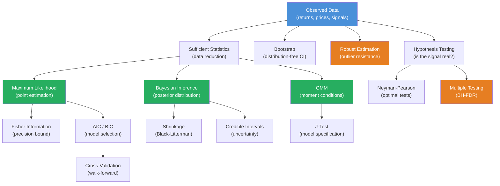

# Module 03: Statistical Inference & Estimation

**Prerequisites:** Modules 01 (Linear Algebra), 02 (Probability & Measure Theory)
**Builds toward:** Modules 06, 21, 25, 26, 34

---

## Table of Contents

1. [Motivation: Inference in a Low-Signal World](#1-motivation-inference-in-a-low-signal-world)
2. [Sufficient Statistics & the Factorization Theorem](#2-sufficient-statistics--the-factorization-theorem)
3. [Maximum Likelihood Estimation](#3-maximum-likelihood-estimation)
4. [Fisher Information & the Cramér-Rao Bound](#4-fisher-information--the-cramér-rao-bound)
5. [Method of Moments & Generalized Method of Moments](#5-method-of-moments--generalized-method-of-moments)
6. [Bayesian Inference](#6-bayesian-inference)
7. [Hypothesis Testing](#7-hypothesis-testing)
8. [Bootstrap Methods](#8-bootstrap-methods)
9. [Robust Estimation](#9-robust-estimation)
10. [Model Selection](#10-model-selection)
11. [Implementation: Python](#11-implementation-python)
12. [Implementation: C++](#12-implementation-c)
13. [Exercises](#13-exercises)

---

## 1. Motivation: Inference in a Low-Signal World

Statistical inference is the art of drawing conclusions from data. In finance, this art is practiced under hostile conditions:

| Challenge | Typical Value | Consequence |
|-----------|---------------|-------------|
| Signal-to-noise ratio (annual Sharpe) | 0.3 – 1.0 | Daily IC $\approx$ 0.02 — barely above noise |
| Non-stationarity | Regime half-life $\approx$ 2–5 years | Parameters drift; history becomes stale |
| Heavy tails | Excess kurtosis $\approx$ 5–20 for daily equity returns | Standard errors underestimate uncertainty |
| Multiple testing | Quant teams test 1,000+ signals | Most "significant" results are false discoveries |
| Small samples | 20 years $\approx$ 5,000 daily observations | Asymptotics may not apply |

Every tool in this module — MLE, Bayesian inference, hypothesis testing, bootstrap, robust estimation — exists to extract reliable conclusions under these constraints. The central question is always: **is this signal real, or did I fool myself?**

---

## 2. Sufficient Statistics & the Factorization Theorem

### 2.1 Sufficiency

A statistic $T(\mathbf{X})$ is **sufficient** for a parameter $\theta$ if the conditional distribution of the data $\mathbf{X}$ given $T(\mathbf{X})$ does not depend on $\theta$:

$$\mathbb{P}(\mathbf{X} = \mathbf{x} \mid T(\mathbf{X}) = t; \theta) = \mathbb{P}(\mathbf{X} = \mathbf{x} \mid T(\mathbf{X}) = t) \qquad \forall\,\theta$$

Sufficiency means $T$ captures all the information in the data about $\theta$ — once you know $T$, the raw data tells you nothing more about $\theta$.

### 2.2 The Fisher-Neyman Factorization Theorem

**Theorem.** $T(\mathbf{X})$ is sufficient for $\theta$ if and only if the joint density (or PMF) can be factored as:

$$f(\mathbf{x}; \theta) = g(T(\mathbf{x}), \theta) \cdot h(\mathbf{x})$$

where $g$ depends on $\mathbf{x}$ only through $T(\mathbf{x})$, and $h$ does not depend on $\theta$.

*Proof (discrete case).*

$(\Rightarrow)$ If $T$ is sufficient:

$$f(\mathbf{x}; \theta) = \mathbb{P}(\mathbf{X} = \mathbf{x}; \theta) = \mathbb{P}(T(\mathbf{X}) = T(\mathbf{x}); \theta) \cdot \mathbb{P}(\mathbf{X} = \mathbf{x} \mid T(\mathbf{X}) = T(\mathbf{x}); \theta)$$

Set $g(t, \theta) = \mathbb{P}(T = t; \theta)$ and $h(\mathbf{x}) = \mathbb{P}(\mathbf{X} = \mathbf{x} \mid T = T(\mathbf{x}))$ (does not depend on $\theta$ by sufficiency).

$(\Leftarrow)$ If $f(\mathbf{x}; \theta) = g(T(\mathbf{x}), \theta) \cdot h(\mathbf{x})$:

$$\mathbb{P}(\mathbf{X} = \mathbf{x} \mid T = t; \theta) = \frac{f(\mathbf{x}; \theta)}{\sum_{\mathbf{y}: T(\mathbf{y})=t} f(\mathbf{y}; \theta)} = \frac{g(t, \theta) h(\mathbf{x})}{g(t, \theta) \sum_{\mathbf{y}: T(\mathbf{y})=t} h(\mathbf{y})} = \frac{h(\mathbf{x})}{\sum_{\mathbf{y}: T(\mathbf{y})=t} h(\mathbf{y})}$$

which is free of $\theta$. $\square$

**Example.** For $X_1, \ldots, X_n \overset{\text{iid}}{\sim} \mathcal{N}(\mu, \sigma^2)$ with $\sigma^2$ known:

$$f(\mathbf{x}; \mu) = \left(\frac{1}{\sqrt{2\pi}\sigma}\right)^n \exp\left(-\frac{1}{2\sigma^2}\sum_{i=1}^n(x_i - \mu)^2\right) = \underbrace{\left(\frac{1}{\sqrt{2\pi}\sigma}\right)^n \exp\left(-\frac{n(\bar{x} - \mu)^2}{2\sigma^2}\right)}_{g(\bar{x}, \mu)} \cdot \underbrace{\exp\left(-\frac{\sum(x_i - \bar{x})^2}{2\sigma^2}\right)}_{h(\mathbf{x})}$$

So $T(\mathbf{X}) = \bar{X}$ is sufficient for $\mu$.

### 2.3 Minimal Sufficiency and the Exponential Family

A sufficient statistic $T$ is **minimal sufficient** if it is a function of every other sufficient statistic — it achieves the greatest data reduction without losing information.

The **exponential family** with natural parameter $\boldsymbol{\eta}$:

$$f(\mathbf{x}; \boldsymbol{\eta}) = h(\mathbf{x}) \exp\left(\boldsymbol{\eta}^\top \mathbf{T}(\mathbf{x}) - A(\boldsymbol{\eta})\right)$$

has $\mathbf{T}(\mathbf{X})$ as a minimal sufficient statistic. Many distributions in finance belong to this family: Normal, Exponential, Gamma, Poisson, Binomial.

---

## 3. Maximum Likelihood Estimation

### 3.1 The Likelihood Function

Given observations $\mathbf{x} = (x_1, \ldots, x_n)$ from a model $f(x; \theta)$, the **likelihood function** is:

$$L(\theta; \mathbf{x}) = \prod_{i=1}^n f(x_i; \theta)$$

and the **log-likelihood** is:

$$\ell(\theta; \mathbf{x}) = \sum_{i=1}^n \ln f(x_i; \theta)$$

The **maximum likelihood estimator** (MLE) is:

$$\hat{\theta}_{\text{MLE}} = \arg\max_\theta \; \ell(\theta; \mathbf{x})$$

### 3.2 Derivation: MLE for the Normal Distribution

For $X_1, \ldots, X_n \overset{\text{iid}}{\sim} \mathcal{N}(\mu, \sigma^2)$:

$$\ell(\mu, \sigma^2) = -\frac{n}{2}\ln(2\pi) - \frac{n}{2}\ln(\sigma^2) - \frac{1}{2\sigma^2}\sum_{i=1}^n(x_i - \mu)^2$$

Setting $\partial\ell/\partial\mu = 0$:

$$\frac{1}{\sigma^2}\sum_{i=1}^n(x_i - \mu) = 0 \quad \Longrightarrow \quad \hat{\mu} = \bar{x} = \frac{1}{n}\sum_{i=1}^n x_i$$

Setting $\partial\ell/\partial\sigma^2 = 0$:

$$-\frac{n}{2\sigma^2} + \frac{1}{2\sigma^4}\sum_{i=1}^n(x_i - \mu)^2 = 0 \quad \Longrightarrow \quad \hat{\sigma}^2 = \frac{1}{n}\sum_{i=1}^n(x_i - \bar{x})^2$$

Note: the MLE for variance uses $1/n$, not $1/(n-1)$. It is biased: $\mathbb{E}[\hat{\sigma}^2] = \frac{n-1}{n}\sigma^2$. The unbiased estimator $s^2 = \frac{1}{n-1}\sum(x_i - \bar{x})^2$ is preferred in practice.

### 3.3 Properties of the MLE

Under regularity conditions (smooth, identifiable model, parameter interior to parameter space):

**Consistency:**

$$\hat{\theta}_n \xrightarrow{P} \theta_0 \quad \text{as } n \to \infty$$

*Proof sketch.* The normalized log-likelihood $\frac{1}{n}\ell(\theta) \xrightarrow{a.s.} \mathbb{E}_{\theta_0}[\ln f(X; \theta)]$ by the SLLN. By Jensen's inequality and the strict concavity of $\ln$, $\mathbb{E}_{\theta_0}[\ln f(X; \theta)] < \mathbb{E}_{\theta_0}[\ln f(X; \theta_0)]$ for $\theta \neq \theta_0$ (Kullback-Leibler divergence is non-negative, zero iff $\theta = \theta_0$). The maximizer of the limit is $\theta_0$, and under uniform convergence, the maximizer of the sample version converges to $\theta_0$.

**Asymptotic normality:**

$$\sqrt{n}(\hat{\theta}_n - \theta_0) \xrightarrow{d} \mathcal{N}\left(\mathbf{0}, \; \mathbf{I}(\theta_0)^{-1}\right)$$

where $\mathbf{I}(\theta)$ is the Fisher information matrix.

**Asymptotic efficiency:** The MLE achieves the Cramér-Rao lower bound asymptotically — no consistent estimator has smaller asymptotic variance.

**Invariance:** If $\hat{\theta}$ is the MLE of $\theta$, then $g(\hat{\theta})$ is the MLE of $g(\theta)$ for any function $g$.

### 3.4 Numerical Optimization of the Likelihood

For most models of interest (GARCH, Heston, factor models), the MLE has no closed form. Numerical optimization is required.

**Newton-Raphson** (second-order):

$$\theta^{(k+1)} = \theta^{(k)} - \left[\nabla^2 \ell(\theta^{(k)})\right]^{-1} \nabla \ell(\theta^{(k)})$$

**Fisher scoring** (replaces the Hessian with its expectation — the Fisher information):

$$\theta^{(k+1)} = \theta^{(k)} + \mathbf{I}(\theta^{(k)})^{-1} \nabla \ell(\theta^{(k)})$$

Fisher scoring is more stable when the observed Hessian is poorly conditioned. Both converge quadratically near the optimum.

**Practical considerations:**
- Use the **log-likelihood** to avoid floating-point underflow from multiplying many small densities.
- For GARCH estimation, evaluate the likelihood **recursively** via the conditional variance equation.
- Multiple restarts from different initial points to avoid local optima.
- Constrain parameters to valid regions (e.g., $\sigma > 0$) via reparametrization: optimize over $\ln\sigma$ instead of $\sigma$.

---

## 4. Fisher Information & the Cramér-Rao Bound

### 4.1 The Score Function

The **score function** is the gradient of the log-likelihood:

$$S(\theta) = \nabla_\theta \ell(\theta; \mathbf{X}) = \nabla_\theta \ln f(\mathbf{X}; \theta)$$

Under regularity conditions: $\mathbb{E}_\theta[S(\theta)] = \mathbf{0}$ (the score has zero mean at the true parameter).

*Proof (scalar case).* $\int f(x; \theta) \, dx = 1$. Differentiate under the integral:

$$0 = \frac{\partial}{\partial\theta}\int f(x;\theta) \, dx = \int \frac{\partial}{\partial\theta}f(x;\theta) \, dx = \int \frac{f'_\theta}{f} \cdot f \, dx = \mathbb{E}\left[\frac{\partial}{\partial\theta}\ln f(X;\theta)\right] = \mathbb{E}[S(\theta)] \quad \square$$

### 4.2 Fisher Information

The **Fisher information** (for one observation) is:

$$\mathbf{I}(\theta) = \text{Var}_\theta[S(\theta)] = \mathbb{E}_\theta[S(\theta) S(\theta)^\top]$$

Under regularity conditions (interchange of differentiation and integration), there is an equivalent form:

$$\mathbf{I}(\theta) = -\mathbb{E}_\theta\left[\nabla^2_\theta \ln f(X; \theta)\right]$$

*Proof of equivalence (scalar).* Differentiate $\mathbb{E}[S(\theta)] = 0$ again:

$$0 = \frac{\partial}{\partial\theta}\mathbb{E}[S] = \mathbb{E}\left[\frac{\partial^2}{\partial\theta^2}\ln f\right] + \mathbb{E}\left[\left(\frac{\partial}{\partial\theta}\ln f\right)^2\right] = \mathbb{E}[S''] + \mathbb{E}[S^2]$$

So $\mathbb{E}[S^2] = -\mathbb{E}[S''] = I(\theta)$. $\square$

For $n$ i.i.d. observations: $\mathbf{I}_n(\theta) = n \cdot \mathbf{I}(\theta)$.

**Financial example.** For $X \sim \mathcal{N}(\mu, \sigma^2)$ with $\sigma^2$ known:

$$I(\mu) = -\mathbb{E}\left[\frac{\partial^2}{\partial\mu^2}\left(-\frac{(X-\mu)^2}{2\sigma^2}\right)\right] = \frac{1}{\sigma^2}$$

More volatile assets ($\sigma^2$ large) carry less information per observation about the mean. This is the quantitative content of the quant's lament: high noise obscures the signal.

### 4.3 The Cramér-Rao Lower Bound

**Theorem.** For any unbiased estimator $\hat{\theta}$ of $\theta$ (scalar case):

$$\text{Var}(\hat{\theta}) \geq \frac{1}{n \cdot I(\theta)}$$

For biased estimators with bias $b(\theta) = \mathbb{E}[\hat{\theta}] - \theta$:

$$\text{Var}(\hat{\theta}) \geq \frac{(1 + b'(\theta))^2}{n \cdot I(\theta)}$$

*Proof (unbiased case).* By the Cauchy-Schwarz inequality on the covariance inner product:

$$\text{Cov}(\hat{\theta}, S)^2 \leq \text{Var}(\hat{\theta}) \cdot \text{Var}(S)$$

Since $\hat{\theta}$ is unbiased: $\mathbb{E}[\hat{\theta}] = \theta$. Differentiate under the integral:

$$1 = \frac{\partial}{\partial\theta}\mathbb{E}[\hat{\theta}] = \int \hat{\theta}(x) \frac{\partial}{\partial\theta}f(x;\theta) \, dx = \int \hat{\theta}(x) S(x;\theta) f(x;\theta) \, dx = \text{Cov}(\hat{\theta}, S) + \underbrace{\mathbb{E}[\hat{\theta}]}_{\theta}\underbrace{\mathbb{E}[S]}_{0}$$

So $\text{Cov}(\hat{\theta}, S) = 1$. Substituting: $1 \leq \text{Var}(\hat{\theta}) \cdot I(\theta)$. For $n$ i.i.d. observations, $I_n = nI(\theta)$. $\square$

**Financial implication.** Estimating the expected return $\mu$ of a stock from $n$ daily observations: $\text{Var}(\hat{\mu}) \geq \sigma^2/n$. For $\sigma_{\text{daily}} = 0.02$ (roughly 32% annualized) and $n = 252$ (one year of data):

$$\text{SE}(\hat{\mu}) \geq \frac{0.02}{\sqrt{252}} \approx 0.00126 \;\text{daily} \approx 2\%\;\text{annualized}$$

Estimating expected returns to within 2% per year requires at least one year of data — and this is the theoretical *best case*. In practice, non-stationarity makes this far worse. This is why portfolio optimization is so sensitive to expected return estimates (Module 24).

### 4.4 Multivariate Extension: Fisher Information Matrix

For parameter vector $\boldsymbol{\theta} \in \mathbb{R}^p$:

$$[\mathbf{I}(\boldsymbol{\theta})]_{jk} = -\mathbb{E}\left[\frac{\partial^2}{\partial\theta_j\partial\theta_k}\ln f(X; \boldsymbol{\theta})\right]$$

The Cramér-Rao bound becomes: $\text{Cov}(\hat{\boldsymbol{\theta}}) \succeq \frac{1}{n}\mathbf{I}(\boldsymbol{\theta})^{-1}$ (matrix inequality: the difference is PSD).

---

## 5. Method of Moments & Generalized Method of Moments

### 5.1 Method of Moments (MoM)

The idea is elementary: equate population moments to sample moments and solve for the parameters.

If the model has $p$ parameters $\boldsymbol{\theta} = (\theta_1, \ldots, \theta_p)$, choose $p$ moment conditions:

$$\mathbb{E}_\theta[g_j(X)] = m_j(\boldsymbol{\theta}), \qquad j = 1, \ldots, p$$

Set the sample moments equal to population moments:

$$\frac{1}{n}\sum_{i=1}^n g_j(x_i) = m_j(\hat{\boldsymbol{\theta}}), \qquad j = 1, \ldots, p$$

and solve for $\hat{\boldsymbol{\theta}}$.

**Example: Fitting a Student-$t$ distribution to returns.** Let $X \sim t_\nu$. We have $\mathbb{E}[X^2] = \nu/(\nu - 2)$ for $\nu > 2$ and $\mathbb{E}[X^4] = 3\nu^2 / ((\nu-2)(\nu-4))$ for $\nu > 4$. Setting the sample second and fourth moments equal to these expressions gives two equations in two unknowns ($\mu, \nu$ after location-scale adjustment).

### 5.2 Generalized Method of Moments (GMM)

When there are more moment conditions than parameters ($q > p$), the system is over-identified. **GMM** (Hansen, 1982 — Nobel Prize 2013) minimizes a weighted distance.

Define the moment condition vector:

$$\mathbf{g}(\boldsymbol{\theta}) = \frac{1}{n}\sum_{i=1}^n \mathbf{m}(x_i, \boldsymbol{\theta}) \in \mathbb{R}^q$$

where $\mathbb{E}[\mathbf{m}(X, \boldsymbol{\theta}_0)] = \mathbf{0}$ at the true parameter.

The GMM estimator:

$$\hat{\boldsymbol{\theta}}_{\text{GMM}} = \arg\min_\boldsymbol{\theta} \; \mathbf{g}(\boldsymbol{\theta})^\top \mathbf{W} \, \mathbf{g}(\boldsymbol{\theta})$$

where $\mathbf{W} \in \mathbb{R}^{q \times q}$ is a positive definite weighting matrix.

**Optimal weighting matrix.** The efficient GMM estimator uses $\mathbf{W} = \hat{\mathbf{S}}^{-1}$, where $\hat{\mathbf{S}}$ estimates the long-run covariance $\mathbf{S} = \text{Var}(\sqrt{n}\,\mathbf{g}(\boldsymbol{\theta}_0))$. With the optimal weight, GMM is asymptotically efficient among all estimators using these moment conditions.

**Asymptotic distribution:**

$$\sqrt{n}(\hat{\boldsymbol{\theta}}_{\text{GMM}} - \boldsymbol{\theta}_0) \xrightarrow{d} \mathcal{N}\left(\mathbf{0}, \; (\mathbf{D}^\top\mathbf{S}^{-1}\mathbf{D})^{-1}\right)$$

where $\mathbf{D} = \mathbb{E}[\partial\mathbf{m}/\partial\boldsymbol{\theta}^\top]$.

### 5.3 Hansen's J-Test (Over-Identification Test)

Under the null hypothesis that the model is correctly specified:

$$J = n \cdot \mathbf{g}(\hat{\boldsymbol{\theta}})^\top \hat{\mathbf{S}}^{-1} \mathbf{g}(\hat{\boldsymbol{\theta}}) \xrightarrow{d} \chi^2_{q-p}$$

A large $J$ rejects the model. This is the standard specification test for asset pricing models: if the pricing errors are too large, the model fails.

**Financial application.** In the Fama-MacBeth procedure (Module 17), GMM estimates factor risk premia and tests whether the factor model prices the cross-section of expected returns correctly. The J-test statistic measures the aggregate pricing error across all test assets.

---

## 6. Bayesian Inference

### 6.1 Bayes' Theorem for Parameters

The Bayesian approach treats $\theta$ as a random variable with a **prior distribution** $\pi(\theta)$ reflecting beliefs before seeing data. After observing $\mathbf{x}$, the **posterior distribution** is:

$$\pi(\theta \mid \mathbf{x}) = \frac{f(\mathbf{x} \mid \theta) \cdot \pi(\theta)}{\int f(\mathbf{x} \mid \theta') \pi(\theta') \, d\theta'} \propto L(\theta; \mathbf{x}) \cdot \pi(\theta)$$

The posterior combines data evidence (likelihood) with prior beliefs. As $n \to \infty$, the posterior concentrates around the MLE — the data overwhelms the prior (Bernstein-von Mises theorem).

### 6.2 Conjugate Priors

A prior $\pi(\theta)$ is **conjugate** to the likelihood $f(\mathbf{x} \mid \theta)$ if the posterior belongs to the same family as the prior. This allows closed-form posterior updates.

| Likelihood | Conjugate Prior | Posterior |
|---|---|---|
| $\text{Normal}(\mu, \sigma^2_0)$ (known variance) | $\mu \sim \mathcal{N}(\mu_0, \tau_0^2)$ | $\mu \mid \mathbf{x} \sim \mathcal{N}(\mu_n, \tau_n^2)$ |
| $\text{Normal}(\mu_0, \sigma^2)$ (known mean) | $\sigma^2 \sim \text{Inv-}\chi^2(\nu_0, s_0^2)$ | $\sigma^2 \mid \mathbf{x} \sim \text{Inv-}\chi^2(\nu_n, s_n^2)$ |
| $\text{Bernoulli}(p)$ | $p \sim \text{Beta}(\alpha, \beta)$ | $p \mid \mathbf{x} \sim \text{Beta}(\alpha + s, \beta + n - s)$ |
| $\text{Poisson}(\lambda)$ | $\lambda \sim \text{Gamma}(\alpha, \beta)$ | $\lambda \mid \mathbf{x} \sim \text{Gamma}(\alpha + \sum x_i, \beta + n)$ |

For the Normal-Normal case:

$$\mu_n = \frac{\tau_0^{-2}\mu_0 + n\sigma_0^{-2}\bar{x}}{\tau_0^{-2} + n\sigma_0^{-2}}, \qquad \tau_n^{-2} = \tau_0^{-2} + n\sigma_0^{-2}$$

The posterior mean is a **precision-weighted average** of the prior mean and the sample mean. This is exactly the mathematical structure behind the Black-Litterman model (Module 24): equilibrium expected returns (prior) are combined with investor views (data) via precision weighting.

### 6.3 Prior Selection

The choice of prior encodes assumptions. Standard approaches:

- **Informative priors:** Based on domain knowledge (e.g., expected Sharpe ratio between 0 and 2, volatility between 5% and 80%).
- **Weakly informative priors:** Broad distributions that rule out absurd values but let the data dominate (e.g., $\mathcal{N}(0, 10^2)$ for a regression coefficient).
- **Non-informative / reference priors:** Attempt to let the data speak entirely. Jeffreys' prior $\pi(\theta) \propto \sqrt{I(\theta)}$ is invariant under reparametrization.
- **Shrinkage priors:** Encourage sparsity or small values (e.g., Laplace/Horseshoe priors). Connected to LASSO regularization (Module 26).

### 6.4 Credible Intervals

The Bayesian analogue of a confidence interval. A $100(1-\alpha)\%$ **credible interval** $[a, b]$ satisfies:

$$\mathbb{P}(\theta \in [a, b] \mid \mathbf{x}) = 1 - \alpha$$

The **highest posterior density** (HPD) interval is the shortest such interval. Unlike frequentist confidence intervals, credible intervals have a direct probability interpretation: "given the data, the parameter is in this interval with probability $1 - \alpha$."

### 6.5 Bayesian Computation

For non-conjugate models, the posterior is computed numerically:

- **MCMC (Markov Chain Monte Carlo):** Metropolis-Hastings, Gibbs sampling, Hamiltonian Monte Carlo (HMC). Generates a Markov chain whose stationary distribution is the posterior.
- **Variational inference:** Approximate the posterior with a simpler distribution by minimizing KL divergence. Faster but approximate.
- **Laplace approximation:** Approximate the posterior as Normal centered at the mode with covariance equal to the inverse Hessian of the negative log-posterior. Accurate for large $n$.

---

## 7. Hypothesis Testing

### 7.1 Framework

A **hypothesis test** decides between:
- $H_0$: null hypothesis (e.g., "this signal has zero alpha")
- $H_1$: alternative hypothesis (e.g., "this signal has positive alpha")

based on a **test statistic** $T(\mathbf{X})$ and a **rejection region** $R$.

- **Type I error (false positive):** $\alpha = \mathbb{P}(T \in R \mid H_0)$ — rejecting a true null.
- **Type II error (false negative):** $\beta = \mathbb{P}(T \notin R \mid H_1)$ — failing to reject a false null.
- **Power:** $1 - \beta = \mathbb{P}(T \in R \mid H_1)$ — correctly detecting a real effect.

### 7.2 The Neyman-Pearson Lemma

**Theorem.** For testing simple hypotheses $H_0: \theta = \theta_0$ vs. $H_1: \theta = \theta_1$, the most powerful test at level $\alpha$ rejects when:

$$\Lambda(\mathbf{x}) = \frac{L(\theta_1; \mathbf{x})}{L(\theta_0; \mathbf{x})} > c_\alpha$$

where $c_\alpha$ is chosen so that $\mathbb{P}_{H_0}(\Lambda > c_\alpha) = \alpha$.

*Proof.* Let $\phi^*$ be the likelihood ratio test and $\phi$ be any other test with $\mathbb{E}_{\theta_0}[\phi] \leq \alpha$. Define $D = \phi^* - \phi$. On $\{\Lambda > c\}$: $D \geq 0$ (since $\phi^* = 1$, $\phi \leq 1$). On $\{\Lambda \leq c\}$: $D \leq 0$ (since $\phi^* = 0$, $\phi \geq 0$). Therefore:

$$D(\mathbf{x})(f(\mathbf{x}; \theta_1) - c \cdot f(\mathbf{x}; \theta_0)) \geq 0 \quad \forall\,\mathbf{x}$$

Integrating: $\mathbb{E}_{\theta_1}[\phi^*] - c\mathbb{E}_{\theta_0}[\phi^*] \geq \mathbb{E}_{\theta_1}[\phi] - c\mathbb{E}_{\theta_0}[\phi]$. Since $\mathbb{E}_{\theta_0}[\phi^*] = \alpha \geq \mathbb{E}_{\theta_0}[\phi]$: the power of $\phi^*$ is $\geq$ the power of $\phi$. $\square$

### 7.3 Likelihood Ratio Tests

For composite hypotheses $H_0: \theta \in \Theta_0$ vs. $H_1: \theta \in \Theta_1$:

$$\Lambda = \frac{\sup_{\theta \in \Theta_0} L(\theta)}{\sup_{\theta \in \Theta} L(\theta)} = \frac{L(\hat{\theta}_0)}{L(\hat{\theta})}$$

**Wilks' theorem:** Under $H_0$ and regularity conditions:

$$-2\ln\Lambda \xrightarrow{d} \chi^2_k$$

where $k = \dim(\Theta) - \dim(\Theta_0)$ is the number of restricted parameters.

### 7.4 Multiple Testing and the False Discovery Catastrophe

In quantitative research, analysts test hundreds or thousands of potential signals. If each test has a 5% false positive rate, testing 1,000 signals will produce approximately 50 false positives — even if no signal is real.

**Bonferroni correction.** To maintain family-wise error rate (FWER) at $\alpha$ across $m$ tests: reject the $j$-th hypothesis if $p_j < \alpha/m$. This is extremely conservative.

**Benjamini-Hochberg (BH) procedure** for controlling the **false discovery rate** (FDR):

1. Order the $m$ p-values: $p_{(1)} \leq p_{(2)} \leq \cdots \leq p_{(m)}$
2. Find the largest $k$ such that $p_{(k)} \leq \frac{k}{m}\alpha$
3. Reject all hypotheses $H_{(1)}, \ldots, H_{(k)}$

**Theorem (Benjamini-Hochberg, 1995).** Under independence (or positive regression dependence): $\text{FDR} \leq \alpha$.

**Financial application.** The BH procedure is the standard tool for controlling false discoveries in quantitative strategy research:

| Scenario | $m$ tests | Bonferroni ($\alpha = 0.05$) | BH FDR ($\alpha = 0.05$) |
|----------|-----------|------|------|
| Single team, quarterly review | 50 | $p < 0.001$ | Adaptive |
| Firm-wide signal library | 5,000 | $p < 10^{-5}$ | Adaptive |

The Deflated Sharpe Ratio (Module 32) extends this idea specifically to backtested strategy performance.

---

## 8. Bootstrap Methods

### 8.1 The Bootstrap Principle

The **bootstrap** (Efron, 1979) estimates the sampling distribution of a statistic by resampling with replacement from the data itself. It replaces analytic formulas (which may not exist) with simulation.

**Non-parametric bootstrap algorithm:**

1. From observed data $\mathbf{x} = (x_1, \ldots, x_n)$, draw $B$ bootstrap samples $\mathbf{x}^{*1}, \ldots, \mathbf{x}^{*B}$, each by sampling $n$ observations with replacement from $\mathbf{x}$.
2. Compute the statistic of interest on each sample: $\hat{\theta}^{*b} = T(\mathbf{x}^{*b})$.
3. The distribution of $\{\hat{\theta}^{*1}, \ldots, \hat{\theta}^{*B}\}$ approximates the sampling distribution of $\hat{\theta}$.

**Bootstrap confidence interval (percentile method):**

$$\text{CI}_{1-\alpha} = \left[\hat{\theta}^*_{\alpha/2}, \; \hat{\theta}^*_{1-\alpha/2}\right]$$

where $\hat{\theta}^*_q$ is the $q$-th quantile of the bootstrap distribution.

### 8.2 Bootstrap for the Sharpe Ratio

The Sharpe ratio $\hat{SR} = \bar{r} / \hat{\sigma}$ is a ratio of random variables — its exact sampling distribution depends on the unknown return distribution and is not analytically tractable for non-Gaussian returns.

Under i.i.d. normality, $\hat{SR} \approx \mathcal{N}(SR, (1 + SR^2/2)/n)$ (Lo, 2002). But returns are non-normal and serially correlated, invalidating this approximation. The bootstrap provides a distribution-free alternative.

### 8.3 Block Bootstrap for Time Series

Standard bootstrap assumes i.i.d. observations. Financial returns exhibit serial dependence (autocorrelation in absolute returns, volatility clustering). The **block bootstrap** preserves this dependence by resampling contiguous blocks.

**Moving block bootstrap (Kunsch, 1989; Liu & Singh, 1992):**

1. Choose block length $\ell$.
2. Create $n - \ell + 1$ overlapping blocks of length $\ell$: $B_i = (x_i, x_{i+1}, \ldots, x_{i+\ell-1})$.
3. Sample $\lceil n/\ell \rceil$ blocks with replacement and concatenate.
4. Trim to length $n$.

**Stationary bootstrap (Politis & Romano, 1994):** Use random block lengths drawn from a geometric distribution — produces stationary resampled series.

**Block length selection:** Politis & White (2004) propose an automatic rule based on the flat-top lag window estimator of the spectral density at frequency zero.

---

## 9. Robust Estimation

### 9.1 Why Robustness Matters in Finance

Financial return data is contaminated by:
- **Fat tails:** Daily equity returns have excess kurtosis of 5–20. A single outlier can dominate sample statistics.
- **Data errors:** Corporate actions (splits, dividends), erroneous prints, stale prices.
- **Structural breaks:** Regime changes that make historical parameters irrelevant.

Classical estimators (sample mean, sample variance) have **breakdown point** of $1/n$ — a single outlier can drive them to $\pm\infty$. Robust estimators resist contamination.

### 9.2 Breakdown Point

The **breakdown point** of an estimator is the largest fraction of contaminated observations it can tolerate before producing arbitrarily bad estimates:

$$\epsilon^* = \min\left\{\frac{m}{n} : \sup_{\text{contamination}} |T(\mathbf{x}_{\text{contaminated}}) - T(\mathbf{x})| = \infty\right\}$$

| Estimator | Breakdown Point |
|-----------|-----------------|
| Sample mean | $1/n \to 0$ |
| Sample median | $\lfloor n/2 \rfloor / n \to 1/2$ |
| Sample variance | $1/n \to 0$ |
| MAD (median absolute deviation) | $\approx 1/2$ |
| Trimmed mean (proportion $\alpha$) | $\alpha$ |

### 9.3 M-Estimators

An **M-estimator** generalizes MLE by replacing the log-likelihood with a robust loss function $\rho$:

$$\hat{\theta} = \arg\min_\theta \sum_{i=1}^n \rho\left(\frac{x_i - \theta}{\hat{\sigma}}\right)$$

where $\hat{\sigma}$ is a robust scale estimate (e.g., MAD) and $\rho$ is a bounded or slowly growing loss function.

**Huber's loss** (a compromise between $L^2$ and $L^1$):

$$\rho_k(z) = \begin{cases} \frac{1}{2}z^2 & |z| \leq k \\ k|z| - \frac{1}{2}k^2 & |z| > k \end{cases}$$

The influence function $\psi = \rho'$:

$$\psi_k(z) = \begin{cases} z & |z| \leq k \\ k \cdot \text{sign}(z) & |z| > k \end{cases}$$

Huber's estimator behaves like the mean for "normal" observations ($|z| \leq k$) and like the median for outliers ($|z| > k$). Standard choice: $k = 1.345$ gives 95% efficiency at the Normal model.

**Tukey's bisquare** (more aggressive — completely rejects extreme outliers):

$$\rho_c(z) = \begin{cases} \frac{c^2}{6}\left[1 - \left(1 - (z/c)^2\right)^3\right] & |z| \leq c \\ c^2/6 & |z| > c \end{cases}$$

### 9.4 The Median Absolute Deviation (MAD)

$$\text{MAD} = \text{median}(|X_i - \text{median}(X_i)|)$$

As a scale estimator: $\hat{\sigma}_{\text{MAD}} = 1.4826 \cdot \text{MAD}$ (the constant makes it consistent for the Normal distribution).

The MAD has breakdown point 50% and is $\mathcal{O}(n \log n)$ to compute (via two median computations). It is the standard robust scale estimator in quantitative finance.

---

## 10. Model Selection

### 10.1 The Bias-Variance Tradeoff

For a model with parameters $\hat{\theta}$ estimated from data, the expected prediction error decomposes as:

$$\text{EPE} = \text{Bias}^2 + \text{Variance} + \text{Irreducible Noise}$$

- **Simple models** (few parameters): high bias, low variance — underfit.
- **Complex models** (many parameters): low bias, high variance — overfit.

The optimal model minimizes the total error. Model selection criteria estimate this.

### 10.2 Information Criteria

**Akaike Information Criterion (AIC):**

$$\text{AIC} = -2\ell(\hat{\theta}) + 2p$$

where $p$ is the number of parameters. AIC estimates the expected KL divergence between the fitted model and the true data-generating process. Lower AIC is better.

**Bayesian Information Criterion (BIC):**

$$\text{BIC} = -2\ell(\hat{\theta}) + p \ln n$$

BIC penalizes complexity more heavily than AIC (for $n \geq 8$). It is an approximation to the log marginal likelihood (Bayesian model evidence).

| Criterion | Penalty | Tendency | Consistency |
|-----------|---------|----------|-------------|
| AIC | $2p$ | Selects models with better prediction | Not consistent (overfits as $n \to \infty$) |
| BIC | $p\ln n$ | Selects simpler models | Consistent (selects true model as $n \to \infty$) |

**Financial application.** AIC/BIC are used to select the order of ARIMA models (Module 21), the number of factors in factor models, and the number of regimes in HMM models (Module 33).

### 10.3 Cross-Validation

**$k$-fold cross-validation:**
1. Split data into $k$ folds.
2. For each fold $j$: train on all folds except $j$, evaluate on fold $j$.
3. Average the evaluation metric across all $k$ folds.

**Leave-one-out cross-validation (LOOCV):** $k = n$. Computationally expensive but has low bias.

**Time-series cross-validation (Walk-forward):** Standard $k$-fold breaks temporal ordering. Instead:

```text
Train: [-----]  Test: [-]
Train: [------]  Test: [-]
Train: [-------]  Test: [-]
Train: [--------]  Test: [-]
```

Each training window is expanding (or rolling), and the test set is always in the future. This respects the arrow of time and is the only valid cross-validation for financial time series.

**Purged cross-validation** (de Prado, 2018): Adds a gap (embargo) between training and test sets to prevent information leakage from overlapping labels. See Module 26.

### 10.4 The Bias-Variance Tradeoff in Practice


| Signal in Finance | Typical Optimal Complexity |
|---|---|
| Cross-sectional momentum | Very low (rank and go) |
| Yield curve model | 3 factors (Nelson-Siegel) |
| GARCH volatility | GARCH(1,1) beats most extensions |
| ML alpha signal | Highly regularized, few effective parameters |

The recurring lesson: in finance, simple models generalize. Complexity is the enemy.

---

## 11. Implementation: Python

```python
"""
Module 03: Statistical Inference — Python Implementation
Requires: numpy >= 2.0, scipy >= 1.12
"""

import numpy as np
from numpy.typing import NDArray
from scipy import stats, optimize


# ---------------------------------------------------------------------------
# 1. Maximum Likelihood Estimation (GARCH(1,1))
# ---------------------------------------------------------------------------

def garch11_loglik(
    params: NDArray[np.float64],
    returns: NDArray[np.float64],
) -> float:
    """
    Negative log-likelihood for GARCH(1,1):
        sigma_t^2 = omega + alpha * r_{t-1}^2 + beta * sigma_{t-1}^2

    Parameters: [omega, alpha, beta]
    """
    omega, alpha, beta = params

    # Parameter constraints
    if omega <= 0 or alpha < 0 or beta < 0 or alpha + beta >= 1:
        return 1e10

    T = len(returns)
    sigma2 = np.zeros(T)

    # Initialize with unconditional variance
    sigma2[0] = omega / (1 - alpha - beta)

    for t in range(1, T):
        sigma2[t] = omega + alpha * returns[t-1]**2 + beta * sigma2[t-1]

    # Gaussian log-likelihood (negative for minimization)
    ll = -0.5 * np.sum(np.log(2 * np.pi) + np.log(sigma2) + returns**2 / sigma2)
    return -ll  # Return negative for minimization


def fit_garch11(returns: NDArray[np.float64]) -> dict:
    """
    Fit GARCH(1,1) via MLE using L-BFGS-B.
    """
    # Initial guesses
    var_r = np.var(returns)
    x0 = np.array([var_r * 0.05, 0.08, 0.88])

    bounds = [(1e-8, None), (1e-8, 0.999), (1e-8, 0.999)]

    result = optimize.minimize(
        garch11_loglik, x0, args=(returns,),
        method='L-BFGS-B', bounds=bounds,
    )

    omega, alpha, beta = result.x
    persistence = alpha + beta

    # Fisher information via numerical Hessian (for standard errors)
    from scipy.optimize import approx_fprime
    hess_inv = result.hess_inv.todense() if hasattr(result.hess_inv, 'todense') else np.eye(3)

    return {
        "omega": omega,
        "alpha": alpha,
        "beta": beta,
        "persistence": persistence,
        "unconditional_var": omega / (1 - persistence) if persistence < 1 else np.inf,
        "log_likelihood": -result.fun,
        "converged": result.success,
    }


# ---------------------------------------------------------------------------
# 2. GMM Estimator
# ---------------------------------------------------------------------------

def gmm_estimate(
    moment_fn,
    theta0: NDArray[np.float64],
    data: NDArray[np.float64],
    W: NDArray[np.float64] | None = None,
) -> dict:
    """
    Generic GMM estimator.

    Parameters
    ----------
    moment_fn : callable(theta, data) -> (n, q) array of moment conditions
    theta0    : initial parameter guess
    data      : observed data
    W         : weighting matrix (q x q). None = identity (first step).
    """
    n = data.shape[0]

    def objective(theta):
        moments = moment_fn(theta, data)  # (n, q)
        g_bar = moments.mean(axis=0)      # (q,)
        if W is None:
            return g_bar @ g_bar
        return g_bar @ W @ g_bar

    result = optimize.minimize(objective, theta0, method='Nelder-Mead')

    # Optimal weighting matrix (for two-step GMM)
    moments = moment_fn(result.x, data)
    g_bar = moments.mean(axis=0)
    S_hat = (moments.T @ moments) / n  # HAC estimator could be used here

    # J-test statistic
    if W is not None:
        q = moments.shape[1]
        p = len(theta0)
        J_stat = n * g_bar @ W @ g_bar
        J_pvalue = 1 - stats.chi2.cdf(J_stat, q - p) if q > p else np.nan
    else:
        J_stat = J_pvalue = np.nan

    return {
        "theta": result.x,
        "J_statistic": J_stat,
        "J_pvalue": J_pvalue,
        "S_hat": S_hat,
    }


# ---------------------------------------------------------------------------
# 3. Bootstrap (Standard and Block)
# ---------------------------------------------------------------------------

def bootstrap_ci(
    data: NDArray[np.float64],
    statistic_fn,
    n_bootstrap: int = 10000,
    alpha: float = 0.05,
    rng: np.random.Generator | None = None,
) -> dict:
    """
    Non-parametric bootstrap confidence interval.
    """
    if rng is None:
        rng = np.random.default_rng()

    n = len(data)
    point_estimate = statistic_fn(data)

    boot_stats = np.zeros(n_bootstrap)
    for b in range(n_bootstrap):
        idx = rng.integers(0, n, size=n)
        boot_stats[b] = statistic_fn(data[idx])

    return {
        "point_estimate": point_estimate,
        "bootstrap_mean": boot_stats.mean(),
        "bootstrap_std": boot_stats.std(),
        "ci_lower": np.percentile(boot_stats, 100 * alpha / 2),
        "ci_upper": np.percentile(boot_stats, 100 * (1 - alpha / 2)),
    }


def block_bootstrap_ci(
    data: NDArray[np.float64],
    statistic_fn,
    block_length: int = 20,
    n_bootstrap: int = 10000,
    alpha: float = 0.05,
    rng: np.random.Generator | None = None,
) -> dict:
    """
    Moving block bootstrap for time series.
    """
    if rng is None:
        rng = np.random.default_rng()

    n = len(data)
    n_blocks = (n + block_length - 1) // block_length
    point_estimate = statistic_fn(data)

    boot_stats = np.zeros(n_bootstrap)
    for b in range(n_bootstrap):
        # Sample block starting indices
        starts = rng.integers(0, n - block_length + 1, size=n_blocks)
        # Concatenate blocks and trim
        resampled = np.concatenate([data[s:s+block_length] for s in starts])[:n]
        boot_stats[b] = statistic_fn(resampled)

    return {
        "point_estimate": point_estimate,
        "bootstrap_mean": boot_stats.mean(),
        "bootstrap_std": boot_stats.std(),
        "ci_lower": np.percentile(boot_stats, 100 * alpha / 2),
        "ci_upper": np.percentile(boot_stats, 100 * (1 - alpha / 2)),
        "block_length": block_length,
    }


# ---------------------------------------------------------------------------
# 4. Robust Estimation
# ---------------------------------------------------------------------------

def huber_m_estimator(
    data: NDArray[np.float64],
    k: float = 1.345,
    tol: float = 1e-8,
    max_iter: int = 100,
) -> dict:
    """
    Huber M-estimator for location with MAD scale.
    """
    # Robust scale
    med = np.median(data)
    mad = 1.4826 * np.median(np.abs(data - med))

    if mad < 1e-12:
        return {"location": med, "scale": 0.0, "iterations": 0}

    # Iteratively reweighted least squares (IRLS)
    mu = med
    for iteration in range(max_iter):
        z = (data - mu) / mad
        # Huber psi function
        psi = np.clip(z, -k, k)
        # Weights
        weights = np.where(np.abs(z) <= k, 1.0, k / np.abs(z))
        mu_new = np.average(data, weights=weights)

        if abs(mu_new - mu) < tol * mad:
            return {"location": mu_new, "scale": mad, "iterations": iteration + 1}
        mu = mu_new

    return {"location": mu, "scale": mad, "iterations": max_iter}


# ---------------------------------------------------------------------------
# 5. Benjamini-Hochberg FDR Procedure
# ---------------------------------------------------------------------------

def benjamini_hochberg(
    pvalues: NDArray[np.float64],
    alpha: float = 0.05,
) -> dict:
    """
    Benjamini-Hochberg procedure for FDR control.

    Returns
    -------
    dict with:
        rejected      : boolean mask of rejected hypotheses
        n_rejections  : number of rejections
        adjusted_pval : BH-adjusted p-values
    """
    m = len(pvalues)
    sorted_idx = np.argsort(pvalues)
    sorted_p = pvalues[sorted_idx]

    # BH threshold: p_(k) <= k/m * alpha
    thresholds = np.arange(1, m + 1) / m * alpha

    # Find largest k where p_(k) <= threshold
    below = sorted_p <= thresholds
    if below.any():
        k_max = np.max(np.where(below)[0])
        rejected_sorted = np.arange(m) <= k_max
    else:
        rejected_sorted = np.zeros(m, dtype=bool)

    # Map back to original order
    rejected = np.zeros(m, dtype=bool)
    rejected[sorted_idx] = rejected_sorted

    # Adjusted p-values (Benjamini-Hochberg)
    adjusted = np.zeros(m)
    adjusted[sorted_idx[-1]] = sorted_p[-1]
    for i in range(m - 2, -1, -1):
        adjusted[sorted_idx[i]] = min(
            adjusted[sorted_idx[i + 1]],
            sorted_p[i] * m / (i + 1)
        )

    return {
        "rejected": rejected,
        "n_rejections": rejected.sum(),
        "adjusted_pvalues": adjusted,
        "fdr_level": alpha,
    }


# ---------------------------------------------------------------------------
# 6. Model Selection (AIC / BIC)
# ---------------------------------------------------------------------------

def information_criteria(
    log_likelihood: float,
    n_params: int,
    n_obs: int,
) -> dict:
    return {
        "AIC": -2 * log_likelihood + 2 * n_params,
        "BIC": -2 * log_likelihood + n_params * np.log(n_obs),
        "AICc": -2 * log_likelihood + 2 * n_params + 2 * n_params * (n_params + 1) / max(n_obs - n_params - 1, 1),
    }


# ---------------------------------------------------------------------------
# Example: Full Inference Pipeline on Simulated Returns
# ---------------------------------------------------------------------------

if __name__ == "__main__":
    rng = np.random.default_rng(42)

    # Simulate GARCH(1,1) returns
    T = 2000
    omega, alpha, beta = 0.00001, 0.09, 0.89
    sigma2 = np.zeros(T)
    returns = np.zeros(T)
    sigma2[0] = omega / (1 - alpha - beta)

    for t in range(1, T):
        sigma2[t] = omega + alpha * returns[t-1]**2 + beta * sigma2[t-1]
        returns[t] = np.sqrt(sigma2[t]) * rng.standard_normal()

    # 1. GARCH MLE
    garch = fit_garch11(returns)
    print("=== GARCH(1,1) MLE ===")
    print(f"  omega={garch['omega']:.6f} (true: {omega})")
    print(f"  alpha={garch['alpha']:.4f} (true: {alpha})")
    print(f"  beta={garch['beta']:.4f} (true: {beta})")
    print(f"  persistence={garch['persistence']:.4f}")

    # 2. Bootstrap Sharpe Ratio
    sharpe_fn = lambda r: np.mean(r) / np.std(r) * np.sqrt(252)
    boot = block_bootstrap_ci(returns, sharpe_fn, block_length=20, rng=rng)
    print(f"\n=== Block Bootstrap Sharpe Ratio ===")
    print(f"  Point: {boot['point_estimate']:.3f}")
    print(f"  95% CI: [{boot['ci_lower']:.3f}, {boot['ci_upper']:.3f}]")

    # 3. Robust vs. Classical Location
    contaminated = returns.copy()
    contaminated[:10] = 0.5  # 10 outliers
    classical = np.mean(contaminated)
    robust = huber_m_estimator(contaminated)
    print(f"\n=== Robust Estimation (10 outliers injected) ===")
    print(f"  Sample mean:     {classical:.6f}")
    print(f"  Huber M-est:     {robust['location']:.6f}")
    print(f"  Median:          {np.median(contaminated):.6f}")
    print(f"  True mean:       {np.mean(returns):.6f}")

    # 4. Multiple Testing
    n_signals = 1000
    n_true = 20  # 20 real signals out of 1000
    pvals = np.ones(n_signals)
    # Real signals: small p-values
    pvals[:n_true] = rng.beta(1, 50, size=n_true)
    # Null signals: uniform p-values
    pvals[n_true:] = rng.uniform(0, 1, size=n_signals - n_true)

    bh = benjamini_hochberg(pvals, alpha=0.05)
    true_positives = bh['rejected'][:n_true].sum()
    false_positives = bh['rejected'][n_true:].sum()
    print(f"\n=== Benjamini-Hochberg FDR ===")
    print(f"  Rejections: {bh['n_rejections']}")
    print(f"  True positives:  {true_positives}/{n_true}")
    print(f"  False positives: {false_positives}/{n_signals - n_true}")
    print(f"  Empirical FDR:   {false_positives / max(bh['n_rejections'], 1):.3f}")
```

---

## 12. Implementation: C++

```cpp
/*
 * Module 03: Statistical Inference — C++ Implementation
 * Huber M-estimator, Bootstrap, Fisher Information
 * Compile: g++ -std=c++23 -O3 -o inference inference.cpp
 */

#include <algorithm>
#include <cmath>
#include <numeric>
#include <random>
#include <vector>
#include <iostream>
#include <format>

// ---------------------------------------------------------------------------
// 1. Huber M-Estimator
// ---------------------------------------------------------------------------

struct HuberResult {
    double location;
    double scale;
    int iterations;
};

double median(std::vector<double> v) {
    // Modifies v in place via nth_element
    size_t n = v.size();
    auto mid = v.begin() + n / 2;
    std::nth_element(v.begin(), mid, v.end());
    if (n % 2 == 0) {
        auto mid_left = std::max_element(v.begin(), mid);
        return (*mid + *mid_left) / 2.0;
    }
    return *mid;
}

HuberResult huber_m_estimator(
    const std::vector<double>& data,
    double k = 1.345,
    double tol = 1e-8,
    int max_iter = 100
) {
    double med = median(std::vector<double>(data));

    // MAD
    std::vector<double> abs_dev(data.size());
    for (size_t i = 0; i < data.size(); ++i) {
        abs_dev[i] = std::abs(data[i] - med);
    }
    double mad = 1.4826 * median(abs_dev);

    if (mad < 1e-12) return {med, 0.0, 0};

    double mu = med;
    for (int iter = 0; iter < max_iter; ++iter) {
        double sum_w = 0.0, sum_wx = 0.0;
        for (double x : data) {
            double z = (x - mu) / mad;
            double w = (std::abs(z) <= k) ? 1.0 : k / std::abs(z);
            sum_w += w;
            sum_wx += w * x;
        }
        double mu_new = sum_wx / sum_w;
        if (std::abs(mu_new - mu) < tol * mad) {
            return {mu_new, mad, iter + 1};
        }
        mu = mu_new;
    }
    return {mu, mad, max_iter};
}

// ---------------------------------------------------------------------------
// 2. Bootstrap (Non-parametric)
// ---------------------------------------------------------------------------

struct BootstrapResult {
    double point_estimate;
    double bootstrap_mean;
    double bootstrap_std;
    double ci_lower;
    double ci_upper;
};

template<typename StatFn>
BootstrapResult bootstrap_ci(
    const std::vector<double>& data,
    StatFn stat_fn,
    int n_boot = 10000,
    double alpha = 0.05,
    std::mt19937_64& rng = *new std::mt19937_64(42)
) {
    int n = static_cast<int>(data.size());
    double point = stat_fn(data);

    std::uniform_int_distribution<int> dist(0, n - 1);
    std::vector<double> boot_stats(n_boot);
    std::vector<double> resample(n);

    for (int b = 0; b < n_boot; ++b) {
        for (int i = 0; i < n; ++i) {
            resample[i] = data[dist(rng)];
        }
        boot_stats[b] = stat_fn(resample);
    }

    std::sort(boot_stats.begin(), boot_stats.end());

    double mean_boot = std::accumulate(boot_stats.begin(), boot_stats.end(), 0.0) / n_boot;
    double sq_sum = 0.0;
    for (double s : boot_stats) sq_sum += (s - mean_boot) * (s - mean_boot);
    double std_boot = std::sqrt(sq_sum / (n_boot - 1));

    int lo_idx = static_cast<int>(alpha / 2 * n_boot);
    int hi_idx = static_cast<int>((1 - alpha / 2) * n_boot);

    return {
        point, mean_boot, std_boot,
        boot_stats[lo_idx], boot_stats[std::min(hi_idx, n_boot - 1)]
    };
}

// ---------------------------------------------------------------------------
// 3. Fisher Information (Normal Model)
// ---------------------------------------------------------------------------

struct FisherInfo {
    double info_mu;          // I(mu) = 1/sigma^2
    double cramer_rao_bound; // Var(mu_hat) >= sigma^2/n
    double estimated_se;     // sqrt(sigma^2/n)
};

FisherInfo normal_fisher_info(
    const std::vector<double>& data
) {
    int n = static_cast<int>(data.size());
    double mean = std::accumulate(data.begin(), data.end(), 0.0) / n;
    double var = 0.0;
    for (double x : data) var += (x - mean) * (x - mean);
    var /= (n - 1);

    double info = 1.0 / var;
    double crb = var / n;
    double se = std::sqrt(crb);

    return {info, crb, se};
}

// ---------------------------------------------------------------------------
// Main
// ---------------------------------------------------------------------------

int main() {
    std::mt19937_64 rng(42);
    std::normal_distribution<double> norm(0.0, 0.02);

    // Generate returns with outliers
    constexpr int n = 2000;
    std::vector<double> returns(n);
    for (auto& r : returns) r = norm(rng);

    // Inject outliers
    returns[0] = 0.50;  // 50% return — data error
    returns[1] = -0.40;
    returns[2] = 0.35;

    // Huber M-estimator
    auto huber = huber_m_estimator(returns);
    double sample_mean = std::accumulate(returns.begin(), returns.end(), 0.0) / n;

    std::cout << "=== Robust vs. Classical Location ===\n";
    std::cout << std::format("  Sample mean:  {:.8f}\n", sample_mean);
    std::cout << std::format("  Huber M-est:  {:.8f}\n", huber.location);
    std::cout << std::format("  MAD scale:    {:.8f}\n", huber.scale);
    std::cout << std::format("  Iterations:   {}\n", huber.iterations);

    // Bootstrap Sharpe ratio
    auto sharpe = [](const std::vector<double>& r) {
        int m = static_cast<int>(r.size());
        double mu = std::accumulate(r.begin(), r.end(), 0.0) / m;
        double var = 0.0;
        for (double x : r) var += (x - mu) * (x - mu);
        var /= (m - 1);
        return mu / std::sqrt(var) * std::sqrt(252.0);
    };

    auto boot = bootstrap_ci(returns, sharpe, 10000, 0.05, rng);
    std::cout << "\n=== Bootstrap Sharpe Ratio ===\n";
    std::cout << std::format("  Point:  {:.4f}\n", boot.point_estimate);
    std::cout << std::format("  95% CI: [{:.4f}, {:.4f}]\n", boot.ci_lower, boot.ci_upper);

    // Fisher information
    auto fi = normal_fisher_info(returns);
    std::cout << "\n=== Fisher Information (Normal) ===\n";
    std::cout << std::format("  I(mu):             {:.2f}\n", fi.info_mu);
    std::cout << std::format("  Cramer-Rao bound:  {:.2e}\n", fi.cramer_rao_bound);
    std::cout << std::format("  SE(mu_hat):        {:.6f}\n", fi.estimated_se);

    return 0;
}
```

---

## 13. Exercises

### Foundational

**Exercise 3.1.** Derive the MLE for the parameters $(\mu, \sigma^2)$ of a log-normal distribution from $n$ i.i.d. observations. Compute the Fisher information matrix and the Cramér-Rao bound for both parameters.

**Exercise 3.2.** Prove that the MLE is invariant under reparametrization: if $\hat{\theta}$ maximizes $L(\theta)$, then $g(\hat{\theta})$ maximizes $L^*(g(\theta)) = L(\theta)$ where $g$ is a bijection. *(This is why we can estimate implied volatility by either maximizing the likelihood of option prices or transforming the MLE of the Black-Scholes parameters.)*

**Exercise 3.3.** Show that the Bayesian posterior mean under a Normal-Normal conjugate model can be written as a shrinkage estimator: $\hat{\mu}_{\text{Bayes}} = (1 - \lambda)\bar{x} + \lambda\mu_0$, where $\lambda = \frac{\sigma^2/n}{\sigma^2/n + \tau_0^2}$. Interpret $\lambda$ in terms of signal-to-noise ratio.

### Computational

**Exercise 3.4.** Simulate 5,000 days of returns from a GARCH(1,1) with $(\omega, \alpha, \beta) = (2 \times 10^{-6}, 0.05, 0.93)$. Fit the model via MLE. Repeat 500 times and verify:
- (a) The MLE is approximately unbiased.
- (b) The sampling distribution is approximately Normal (Q-Q plot).
- (c) The standard errors match the inverse Fisher information.

**Exercise 3.5.** Using 10 years of daily S&P 500 returns:
- (a) Compute the annualized Sharpe ratio.
- (b) Construct a 95% confidence interval using the i.i.d. Normal formula $SE \approx \sqrt{(1 + SR^2/2)/n}$.
- (c) Construct a 95% CI using the block bootstrap with block length 20.
- (d) Compare (b) and (c). Which is wider? Why?

**Exercise 3.6.** Generate 1,000 p-values: 50 from $\text{Beta}(1, 20)$ (real signals) and 950 from $\text{Uniform}(0,1)$ (null). Apply Bonferroni and BH at $\alpha = 0.05$. Compare false discovery rates and power.

### Advanced

**Exercise 3.7.** Derive the asymptotic distribution of the GMM estimator. Starting from the first-order condition $\mathbf{D}^\top \mathbf{W} \mathbf{g}(\hat{\boldsymbol{\theta}}) = \mathbf{0}$, use a Taylor expansion around $\boldsymbol{\theta}_0$ to show:

$$\sqrt{n}(\hat{\boldsymbol{\theta}} - \boldsymbol{\theta}_0) \xrightarrow{d} \mathcal{N}\left(\mathbf{0}, (\mathbf{D}^\top\mathbf{W}\mathbf{D})^{-1}\mathbf{D}^\top\mathbf{W}\mathbf{S}\mathbf{W}\mathbf{D}(\mathbf{D}^\top\mathbf{W}\mathbf{D})^{-1}\right)$$

and show this simplifies to $(\mathbf{D}^\top\mathbf{S}^{-1}\mathbf{D})^{-1}$ when $\mathbf{W} = \mathbf{S}^{-1}$.

**Exercise 3.8.** Implement a two-step GMM estimator for the CAPM: $\mathbb{E}[R_i - R_f] = \beta_i \mathbb{E}[R_m - R_f]$. Use 25 Fama-French size/value portfolios as test assets. Report the J-test statistic and p-value. Does the CAPM get rejected?

**Exercise 3.9 (Robust Covariance).** Implement the Minimum Covariance Determinant (MCD) estimator for a covariance matrix. For 10 simulated stock returns with 5% outlier contamination, compare MCD with the sample covariance in terms of: (a) Frobenius norm error, (b) condition number, (c) minimum-variance portfolio weights.

---

## Summary



The core tension of statistical inference in finance:

1. **Signal is weak.** Expected returns are hard to estimate (Cramér-Rao: $\text{SE} \propto \sigma/\sqrt{n}$, and $\sigma$ is large). Volatility is easier — it's a second moment, and large returns contribute positively regardless of sign.

2. **Overfitting is the default.** With enough data mining, any noise pattern looks like a signal. Multiple testing corrections (BH-FDR), cross-validation (walk-forward), and information criteria (AIC/BIC) are defenses.

3. **Outliers corrupt classical methods.** Robust estimators (Huber, MAD, MCD) provide resistance. The tradeoff: robustness costs efficiency at the Normal model.

4. **Bayesian shrinkage rescues estimation.** When the MLE is noisy (many parameters, few observations), shrinking toward a structured prior (e.g., factor model) reduces mean squared error. The Black-Litterman model (Module 24) is the most famous application.

---

*Next: [Module 04 — Stochastic Calculus](../Foundations/04_stochastic_calculus.md)*
