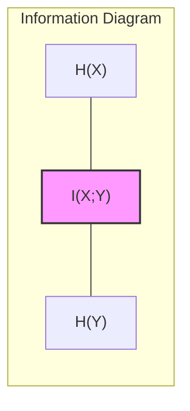
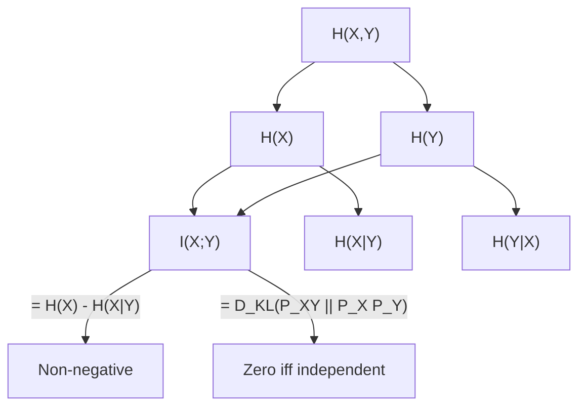
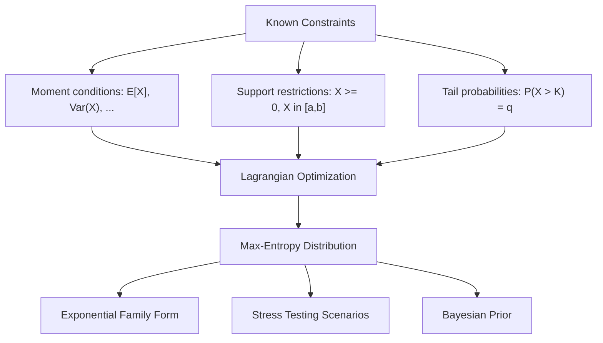
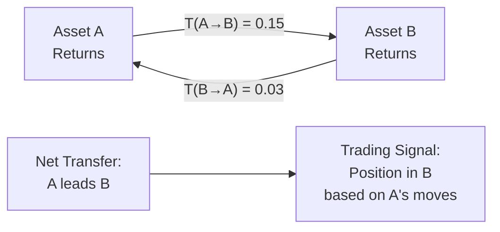
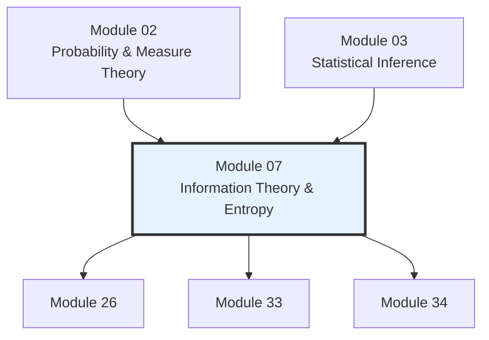

# Module 07: Information Theory & Entropy

**Prerequisites:** Modules 02 (Probability & Measure Theory), 03 (Statistical Inference)
**Builds toward:** Modules 26, 33, 34

---

## Table of Contents

1. [Shannon Entropy](#1-shannon-entropy)
2. [KL Divergence](#2-kl-divergence)
3. [Mutual Information](#3-mutual-information)
4. [Rate-Distortion Theory](#4-rate-distortion-theory)
5. [Maximum Entropy Principle](#5-maximum-entropy-principle)
6. [Fisher Information Revisited](#6-fisher-information-revisited)
7. [Transfer Entropy](#7-transfer-entropy)
8. [Applications in Finance](#8-applications-in-finance)
9. [Implementation: Python](#9-implementation-python)
10. [Implementation: C++](#10-implementation-c)
11. [Exercises](#11-exercises)

---

## 1. Shannon Entropy

### 1.1 Motivation: Quantifying Uncertainty

In quantitative finance, uncertainty is the raw material. Every portfolio allocation, every risk model, every trading signal operates under incomplete information. Shannon entropy provides a precise, axiomatic measure of that uncertainty — one that underpins model selection, feature engineering, and the detection of regime changes.

Consider a discrete random variable $X$ taking values in a finite alphabet $\mathcal{X} = \{x_1, x_2, \ldots, x_n\}$ with probability mass function $p(x) = \mathbb{P}(X = x)$.

### 1.2 Definition

The **Shannon entropy** of $X$ is:

$$H(X) = -\sum_{x \in \mathcal{X}} p(x) \log_2 p(x)$$

with the convention $0 \log 0 = 0$ (justified by continuity, since $\lim_{p \to 0^+} p \log p = 0$). When using natural logarithms, the unit is *nats*; when using base-2 logarithms, the unit is *bits*. Throughout this module, $\log$ denotes the natural logarithm unless stated otherwise.

$$H(X) = -\sum_{x \in \mathcal{X}} p(x) \ln p(x) = \mathbb{E}\left[-\ln p(X)\right]$$

### 1.3 Derivation from Axioms (Uniqueness Theorem Sketch)

Shannon (1948) showed that entropy is the *unique* measure of uncertainty satisfying three axioms. Let $H_n(p_1, \ldots, p_n)$ denote the uncertainty of a distribution on $n$ outcomes.

**Axiom 1 (Continuity).** $H_n$ is a continuous function of $p_1, \ldots, p_n$.

**Axiom 2 (Maximum for uniform).** For fixed $n$, $H_n$ is maximized when $p_1 = p_2 = \cdots = p_n = 1/n$, and $H_n(1/n, \ldots, 1/n)$ is monotonically increasing in $n$.

**Axiom 3 (Composition / Chain rule).** If a choice is decomposed into successive sub-choices, the total entropy is the weighted sum of the entropies of the sub-choices.

**Theorem (Shannon).** The only function satisfying Axioms 1--3 is $H_n(p_1, \ldots, p_n) = -K \sum_{i=1}^n p_i \log p_i$ for some positive constant $K$. Choosing the base of the logarithm fixes $K$.

*Sketch.* One first shows Axiom 2 forces $H_n(1/n, \ldots, 1/n) = K \log n$ (the only continuous monotone function satisfying the composition axiom on uniform distributions). The composition axiom then extends this to rational, and by continuity to all real, probabilities. $\square$

### 1.4 Key Properties

| Property | Statement |
|----------|-----------|
| Non-negativity | $H(X) \geq 0$, with equality iff $X$ is deterministic |
| Maximum for uniform | $H(X) \leq \log |\mathcal{X}|$, with equality iff $p(x) = 1/|\mathcal{X}|$ |
| Chain rule | $H(X, Y) = H(X) + H(Y \mid X)$ |
| Subadditivity | $H(X, Y) \leq H(X) + H(Y)$, with equality iff $X \perp Y$ |
| Conditioning reduces entropy | $H(X \mid Y) \leq H(X)$ |

**Proof (non-negativity).** Since $0 \leq p(x) \leq 1$, we have $\ln p(x) \leq 0$, so $-p(x) \ln p(x) \geq 0$ for each term. $\square$

**Proof (maximum for uniform).** We want to show $H(X) \leq \log n$ for $|\mathcal{X}| = n$. Let $q(x) = 1/n$ be the uniform distribution. Then:

$$\log n - H(X) = \log n + \sum_x p(x) \ln p(x) = \sum_x p(x) \ln \frac{p(x)}{1/n} = D_{\text{KL}}(P \| Q) \geq 0$$

where the last inequality follows from Gibbs' inequality (proved in Section 2). $\square$

### 1.5 Differential Entropy

For a continuous random variable $X$ with density $f(x)$, the **differential entropy** is:

$$h(X) = -\int_{-\infty}^{\infty} f(x) \ln f(x) \, dx$$

Unlike discrete entropy, differential entropy can be negative (e.g., $h(X) = \frac{1}{2}\ln(2\pi e \sigma^2)$ for $X \sim \mathcal{N}(\mu, \sigma^2)$, which is negative when $\sigma^2 < 1/(2\pi e)$). It is *not* a limit of discrete entropy but rather an approximation that drops an infinite constant.

### 1.6 Entropy of Common Distributions

| Distribution | Entropy |
|-------------|---------|
| Bernoulli($p$) | $-p \ln p - (1-p) \ln(1-p)$ |
| Uniform on $\{1, \ldots, n\}$ | $\ln n$ |
| Geometric($p$) | $-\frac{(1-p)\ln(1-p) + p \ln p}{p}$ |
| Uniform on $[a, b]$ | $\ln(b - a)$ |
| Exponential($\lambda$) | $1 + \ln(1/\lambda)$ |
| Normal($\mu, \sigma^2$) | $\frac{1}{2}\ln(2\pi e \sigma^2)$ |

### 1.7 Maximum Entropy of the Normal (Proof)

**Theorem.** Among all continuous distributions on $\mathbb{R}$ with fixed mean $\mu$ and variance $\sigma^2$, the normal distribution $\mathcal{N}(\mu, \sigma^2)$ has the maximum differential entropy.

*Proof.* Let $f$ be any density with mean $\mu$ and variance $\sigma^2$, and let $\phi$ be the density of $\mathcal{N}(\mu, \sigma^2)$. Then:

$$h(\phi) - h(f) = -\int \phi \ln \phi \, dx + \int f \ln f \, dx$$

We compute $-\int f \ln \phi \, dx$. Since $\phi(x) = \frac{1}{\sqrt{2\pi}\sigma} \exp\!\left(-\frac{(x-\mu)^2}{2\sigma^2}\right)$:

$$-\int f(x) \ln \phi(x) \, dx = \frac{1}{2}\ln(2\pi\sigma^2) + \frac{1}{2\sigma^2}\int f(x)(x-\mu)^2 \, dx = \frac{1}{2}\ln(2\pi\sigma^2) + \frac{1}{2} = \frac{1}{2}\ln(2\pi e \sigma^2)$$

The same computation with $\phi$ in place of $f$ gives $-\int \phi \ln \phi \, dx = \frac{1}{2}\ln(2\pi e \sigma^2)$.

Therefore $-\int f \ln \phi \, dx = -\int \phi \ln \phi \, dx = h(\phi)$, and:

$$h(\phi) - h(f) = -\int f \ln \phi \, dx - \left(-\int f \ln f \, dx\right) = \int f \ln \frac{f}{\phi} \, dx = D_{\text{KL}}(f \| \phi) \geq 0$$

Hence $h(f) \leq h(\phi)$, with equality iff $f = \phi$ a.e. $\square$

---

## 2. KL Divergence

### 2.1 Definition

The **Kullback-Leibler divergence** (relative entropy) from distribution $Q$ to distribution $P$ is:

$$D_{\text{KL}}(P \| Q) = \sum_{x \in \mathcal{X}} p(x) \ln \frac{p(x)}{q(x)}$$

for discrete distributions, and:

$$D_{\text{KL}}(P \| Q) = \int_{-\infty}^{\infty} f_P(x) \ln \frac{f_P(x)}{f_Q(x)} \, dx$$

for continuous distributions with densities $f_P, f_Q$. The divergence is defined only when $Q$ is absolutely continuous with respect to $P$ (i.e., $p(x) > 0 \Rightarrow q(x) > 0$).

### 2.2 Non-Negativity (Gibbs' Inequality)

**Theorem (Gibbs' Inequality).** $D_{\text{KL}}(P \| Q) \geq 0$, with equality if and only if $P = Q$ almost everywhere.

*Proof.* By Jensen's inequality applied to the convex function $\varphi(t) = -\ln t$:

$$D_{\text{KL}}(P \| Q) = -\sum_x p(x) \ln \frac{q(x)}{p(x)} \geq -\ln\!\left(\sum_x p(x) \cdot \frac{q(x)}{p(x)}\right) = -\ln\!\left(\sum_x q(x)\right) = -\ln 1 = 0$$

Equality holds iff $q(x)/p(x)$ is constant $P$-a.s., which forces $P = Q$. $\square$

### 2.3 Asymmetry

KL divergence is **not symmetric**: $D_{\text{KL}}(P \| Q) \neq D_{\text{KL}}(Q \| P)$ in general. It also does not satisfy the triangle inequality. Hence it is not a metric, though it is often informally called a "distance."

**Example.** Let $P = \text{Bernoulli}(0.9)$ and $Q = \text{Bernoulli}(0.5)$. Then:

$$D_{\text{KL}}(P \| Q) = 0.9 \ln \frac{0.9}{0.5} + 0.1 \ln \frac{0.1}{0.5} \approx 0.368 \text{ nats}$$

$$D_{\text{KL}}(Q \| P) = 0.5 \ln \frac{0.5}{0.9} + 0.5 \ln \frac{0.5}{0.1} \approx 0.511 \text{ nats}$$

The two modes of asymmetry lead to distinct behavior in applications:
- $D_{\text{KL}}(P \| Q)$ penalizes regions where $P$ has mass but $Q$ does not ("zero-avoiding")
- $D_{\text{KL}}(Q \| P)$ penalizes regions where $Q$ has mass but $P$ does not ("zero-forcing")

### 2.4 Connection to Likelihood Ratio Tests

Given data $\mathbf{x} = (x_1, \ldots, x_n)$ and models $P_\theta, P_{\theta_0}$, the log-likelihood ratio statistic is:

$$\Lambda_n = \sum_{i=1}^n \ln \frac{p_{\hat{\theta}}(x_i)}{p_{\theta_0}(x_i)}$$

By the law of large numbers, $\frac{1}{n}\Lambda_n \to D_{\text{KL}}(P_{\text{true}} \| P_{\theta_0}) - D_{\text{KL}}(P_{\text{true}} \| P_{\hat{\theta}})$ as $n \to \infty$. This links KL divergence to the Neyman-Pearson framework of Module 03: the power of a test against misspecification is governed by the KL divergence between the true and null models.

### 2.5 Connection to MLE

The MLE maximizes $\frac{1}{n}\sum_i \ln p_\theta(x_i)$, which converges to $\mathbb{E}_{P_{\text{true}}}[\ln p_\theta(X)]$. This is equivalent to minimizing:

$$D_{\text{KL}}(P_{\text{true}} \| P_\theta) = \mathbb{E}_{P_{\text{true}}}\!\left[\ln \frac{p_{\text{true}}(X)}{p_\theta(X)}\right] = \underbrace{-h(P_{\text{true}})}_{\text{constant}} - \mathbb{E}_{P_{\text{true}}}[\ln p_\theta(X)]$$

Hence MLE minimizes the KL divergence from the true data-generating distribution to the model family.

### 2.6 KL Divergence Between Normal Distributions

For $P = \mathcal{N}(\mu_1, \sigma_1^2)$ and $Q = \mathcal{N}(\mu_2, \sigma_2^2)$:

$$D_{\text{KL}}(P \| Q) = \ln \frac{\sigma_2}{\sigma_1} + \frac{\sigma_1^2 + (\mu_1 - \mu_2)^2}{2\sigma_2^2} - \frac{1}{2}$$

This closed form is heavily used in variational inference and risk model validation.

### 2.7 Application: P vs. Q Measures in Finance

In derivatives pricing, the historical measure $\mathbb{P}$ and risk-neutral measure $\mathbb{Q}$ are related by the Radon-Nikodym derivative $\frac{d\mathbb{Q}}{d\mathbb{P}}$. The KL divergence $D_{\text{KL}}(\mathbb{Q} \| \mathbb{P})$ quantifies the "cost" of moving from physical to risk-neutral pricing, and is connected to the market price of risk.

---

## 3. Mutual Information

### 3.1 Definition

The **mutual information** between random variables $X$ and $Y$ is:

$$I(X; Y) = H(X) - H(X \mid Y) = H(Y) - H(Y \mid X) = H(X) + H(Y) - H(X, Y)$$

Equivalently, it is the KL divergence between the joint distribution and the product of the marginals:

$$I(X; Y) = D_{\text{KL}}\!\left(P_{XY} \,\|\, P_X \otimes P_Y\right) = \sum_{x, y} p(x, y) \ln \frac{p(x, y)}{p(x)\, p(y)}$$





### 3.2 Properties

| Property | Statement |
|----------|-----------|
| Non-negativity | $I(X; Y) \geq 0$ (follows from $D_{\text{KL}} \geq 0$) |
| Independence | $I(X; Y) = 0 \iff X \perp Y$ |
| Symmetry | $I(X; Y) = I(Y; X)$ |
| Relation to entropy | $I(X; Y) = H(X) + H(Y) - H(X, Y)$ |
| Data Processing Inequality | If $X \to Y \to Z$ is a Markov chain, then $I(X; Z) \leq I(X; Y)$ |

**Proof (non-negativity).** $I(X; Y) = D_{\text{KL}}(P_{XY} \| P_X \otimes P_Y) \geq 0$ by Gibbs' inequality. $\square$

**Proof (zero iff independent).** $I(X; Y) = 0$ iff $P_{XY} = P_X \otimes P_Y$ a.e., which is the definition of independence. $\square$

### 3.3 Why Mutual Information Beats Correlation

Pearson correlation captures only *linear* dependence. Mutual information captures *all* statistical dependence — it is zero if and only if the variables are truly independent. This distinction is critical in finance, where relationships between assets, signals, and returns are often nonlinear.

**Example.** Let $X \sim \text{Uniform}(-1, 1)$ and $Y = X^2$. Then $\text{Corr}(X, Y) = 0$ (the relationship is perfectly symmetric), yet $I(X; Y) > 0$ because $Y$ is a deterministic function of $X$.

### 3.4 Estimation from Finite Samples

Naive plug-in estimation of mutual information (by discretizing and counting) is badly biased upward. For $N$ samples and $B$ histogram bins per variable:

$$\hat{I}_{\text{naive}} = I_{\text{true}} + \frac{(B-1)^2}{2N} + O(N^{-2})$$

**Miller correction.** Subtract the leading bias term:

$$\hat{I}_{\text{Miller}} = \hat{I}_{\text{naive}} - \frac{(B_x - 1)(B_y - 1)}{2N}$$

where $B_x, B_y$ are the number of bins with nonzero counts in each marginal.

**KSG estimator.** Kraskov, Stogbauer, and Grassberger (2004) developed a $k$-nearest-neighbor estimator that avoids binning entirely. For each sample point $(x_i, y_i)$, let $\epsilon(i)$ be the distance to its $k$-th nearest neighbor in the joint space. Count $n_x(i)$ and $n_y(i)$: the number of points within $\epsilon(i)$ distance in the marginal spaces. Then:

$$\hat{I}_{\text{KSG}} = \psi(k) - \frac{1}{k} - \frac{1}{N}\sum_{i=1}^{N}\left[\psi(n_x(i) + 1) + \psi(n_y(i) + 1)\right] + \psi(N)$$

where $\psi$ is the digamma function. This estimator is consistent, has lower bias, and adapts automatically to the local density.

### 3.5 Copula-Based Estimation

By Sklar's theorem (Module 02), the joint distribution can be decomposed as $F_{XY}(x, y) = C(F_X(x), F_Y(y))$ for some copula $C$. The mutual information decomposes as:

$$I(X; Y) = -\int\!\int c(u, v) \ln c(u, v) \, du \, dv$$

where $c(u, v) = \frac{\partial^2 C}{\partial u \, \partial v}$ is the copula density and $u = F_X(x)$, $v = F_Y(y)$. The marginals contribute zero mutual information — all dependence is captured by the copula. This motivates rank-based MI estimators that are invariant to monotone marginal transformations.

### 3.6 Application: Feature Selection for Alpha Signals

When building alpha models, one must select features (predictors) that contain genuine information about future returns. Mutual information ranks candidate features $X_1, \ldots, X_p$ by $I(X_j; Y)$ where $Y$ is the forward return. Unlike correlation-based selection, this detects features with nonlinear predictive power — for example, a feature that predicts the *magnitude* of the next move but not its direction.

---

## 4. Rate-Distortion Theory

### 4.1 The Rate-Distortion Function

Rate-distortion theory answers the question: what is the minimum number of bits per symbol needed to represent a source $X$ such that the average distortion is at most $D$?

Given a source $X \sim p(x)$ with alphabet $\mathcal{X}$, a reconstruction alphabet $\hat{\mathcal{X}}$, and a distortion measure $d: \mathcal{X} \times \hat{\mathcal{X}} \to [0, \infty)$, the **rate-distortion function** is:

$$R(D) = \min_{p(\hat{x} | x) : \, \mathbb{E}[d(X, \hat{X})] \leq D} I(X; \hat{X})$$

This is a convex, monotonically decreasing function of $D$.

### 4.2 Gaussian Source with Squared Error

For $X \sim \mathcal{N}(0, \sigma^2)$ with distortion $d(x, \hat{x}) = (x - \hat{x})^2$:

$$R(D) = \begin{cases} \frac{1}{2} \ln \frac{\sigma^2}{D} & \text{if } 0 \leq D \leq \sigma^2 \\ 0 & \text{if } D > \sigma^2 \end{cases}$$

At distortion $D$, we need $R(D) = \frac{1}{2}\ln(\sigma^2/D)$ nats per sample. The optimal reconstruction is the MMSE estimator: $\hat{X} = X + Z$ where $Z \sim \mathcal{N}(0, D)$ is independent noise, effectively a form of additive quantization.

### 4.3 Connection to Signal Processing in Finance

Rate-distortion theory provides the theoretical foundation for:

- **Quantization of tick data.** Storing full tick streams at nanosecond resolution is expensive. Rate-distortion theory tells us the minimum storage cost for a given fidelity level.
- **Dimensionality reduction.** PCA (Module 01) discards principal components below a threshold, which is a form of lossy compression. The residual variance is the "distortion," and the number of retained components is related to the "rate."
- **Signal compression in low-latency systems.** FPGA-based trading systems compress order book snapshots; rate-distortion bounds determine how much information can be preserved.

### 4.4 Operational Meaning

Shannon's rate-distortion theorem (1959) proves that $R(D)$ is achievable: for any rate $R > R(D)$, there exists a source code with rate $R$ and expected distortion $\leq D + \epsilon$. Conversely, for $R < R(D)$, no such code exists. This is the source-coding analog of the channel capacity theorem.

---

## 5. Maximum Entropy Principle

### 5.1 Philosophical Foundation

Jaynes (1957) argued that among all distributions consistent with known constraints, one should choose the one with maximum entropy — the distribution that is maximally noncommittal with respect to unknown information. This principle provides a principled, unique method for constructing prior distributions and stress-testing scenarios.

### 5.2 Constrained Optimization via Lagrange Multipliers

Given constraints $\mathbb{E}[f_k(X)] = \alpha_k$ for $k = 1, \ldots, m$ and the normalization constraint $\sum_x p(x) = 1$, we maximize:

$$\mathcal{L}[p] = -\sum_x p(x) \ln p(x) - \lambda_0\!\left(\sum_x p(x) - 1\right) - \sum_{k=1}^{m} \lambda_k\!\left(\sum_x p(x) f_k(x) - \alpha_k\right)$$

Taking the functional derivative $\frac{\delta \mathcal{L}}{\delta p(x)} = 0$:

$$-\ln p(x) - 1 - \lambda_0 - \sum_{k=1}^m \lambda_k f_k(x) = 0$$

Solving:

$$p^*(x) = \exp\!\left(-1 - \lambda_0 - \sum_{k=1}^m \lambda_k f_k(x)\right) = \frac{1}{Z(\boldsymbol{\lambda})} \exp\!\left(-\sum_{k=1}^m \lambda_k f_k(x)\right)$$

where $Z(\boldsymbol{\lambda}) = \sum_x \exp(-\sum_k \lambda_k f_k(x))$ is the partition function.

**This is precisely the exponential family form from Module 03.** The maximum entropy principle provides a *constructive derivation* of exponential family distributions.

### 5.3 Maximum Entropy with Mean Constraint (Exponential Distribution)

**Problem.** Find the maximum-entropy distribution on $[0, \infty)$ subject to $\mathbb{E}[X] = \mu$.

Setting up the Lagrangian for the continuous case:

$$\mathcal{L}[f] = -\int_0^{\infty} f(x) \ln f(x) \, dx - \lambda_0\!\left(\int_0^{\infty} f(x) \, dx - 1\right) - \lambda_1\!\left(\int_0^{\infty} x f(x) \, dx - \mu\right)$$

The Euler-Lagrange equation gives:

$$f^*(x) = \frac{1}{Z} e^{-\lambda_1 x} = \lambda_1 e^{-\lambda_1 x}$$

Applying the mean constraint: $\mathbb{E}[X] = 1/\lambda_1 = \mu$, so $\lambda_1 = 1/\mu$, yielding $f^*(x) = \frac{1}{\mu} e^{-x/\mu}$, which is $\text{Exponential}(1/\mu)$.

### 5.4 Maximum Entropy with Mean and Variance (Normal Distribution) — Full Derivation

**Problem.** Find the maximum-entropy distribution on $\mathbb{R}$ subject to $\mathbb{E}[X] = \mu$ and $\text{Var}(X) = \sigma^2$.

The constraints are $\int f(x) dx = 1$, $\int x f(x) dx = \mu$, and $\int (x - \mu)^2 f(x) dx = \sigma^2$. Form the Lagrangian:

$$\mathcal{L} = -\int f \ln f \, dx - \lambda_0\!\left(\int f \, dx - 1\right) - \lambda_1\!\left(\int x f \, dx - \mu\right) - \lambda_2\!\left(\int x^2 f \, dx - (\sigma^2 + \mu^2)\right)$$

where we replaced the variance constraint with $\mathbb{E}[X^2] = \sigma^2 + \mu^2$. Setting $\frac{\delta \mathcal{L}}{\delta f} = 0$:

$$-\ln f(x) - 1 - \lambda_0 - \lambda_1 x - \lambda_2 x^2 = 0$$

$$f^*(x) = \exp(-1 - \lambda_0 - \lambda_1 x - \lambda_2 x^2)$$

This is a Gaussian density. Matching the standard form $\frac{1}{\sqrt{2\pi}\sigma}\exp\!\left(-\frac{(x-\mu)^2}{2\sigma^2}\right)$:

$$\lambda_2 = \frac{1}{2\sigma^2}, \qquad \lambda_1 = -\frac{\mu}{\sigma^2}, \qquad 1 + \lambda_0 = \frac{1}{2}\ln(2\pi\sigma^2) + \frac{\mu^2}{2\sigma^2}$$

Hence $f^* = \mathcal{N}(\mu, \sigma^2)$, confirming that the Gaussian is the maximum-entropy distribution for given mean and variance. $\square$

### 5.5 Application: Stress Testing and Prior Construction

In risk management, the maximum entropy principle constructs worst-case distributions:

- **Stress scenarios.** Given that $\mathbb{E}[\text{loss}] = L$ and $\mathbb{P}(\text{loss} > K) = q$, the max-entropy distribution consistent with these constraints provides the most conservative (least assumptive) stress scenario.
- **Bayesian priors.** When little is known beyond a few moments, the max-entropy prior is the objective-Bayesian choice that injects minimal subjective information.
- **Implied distributions.** Given option prices that pin down certain risk-neutral moments, the max-entropy distribution fills in the gaps without imposing unwarranted structure.



---

## 6. Fisher Information Revisited

### 6.1 Recap from Module 03

The **Fisher information** of a parametric model $f(x; \theta)$ is:

$$\mathcal{I}(\theta) = \mathbb{E}\!\left[\left(\frac{\partial}{\partial \theta} \ln f(X; \theta)\right)^{\!2}\right] = -\mathbb{E}\!\left[\frac{\partial^2}{\partial \theta^2} \ln f(X; \theta)\right]$$

Under regularity conditions. The **Cramer-Rao bound** states that for any unbiased estimator $\hat{\theta}$:

$$\text{Var}(\hat{\theta}) \geq \frac{1}{n \mathcal{I}(\theta)}$$

### 6.2 De Bruijn's Identity

De Bruijn's identity connects Fisher information to the rate of change of entropy under Gaussian convolution. Let $X$ be a random variable with density $f$ and finite variance, and let $Z \sim \mathcal{N}(0, 1)$ be independent of $X$. Define $X_t = X + \sqrt{t}\, Z$. Then:

$$\frac{d}{dt} h(X_t) = \frac{1}{2} J(X_t)$$

where $J(X_t) = \int \frac{(f_t'(x))^2}{f_t(x)} dx$ is the Fisher information of $X_t$ with respect to a location parameter, and $f_t$ is the density of $X_t$. This identity reveals that Fisher information governs how quickly entropy increases when signal is corrupted by noise — directly relevant to understanding signal degradation in low-latency data pipelines.

### 6.3 Entropy Power Inequality

A consequence of de Bruijn's identity is the **entropy power inequality** (Shannon, Stam):

$$e^{2h(X + Y)} \geq e^{2h(X)} + e^{2h(Y)}$$

for independent $X, Y$ with finite variances. This bounds the entropy of the sum of two independent signals and has applications in portfolio theory: the "information content" of a portfolio return (sum of weighted asset returns) is bounded below by the information in individual positions.

### 6.4 Fisher Information Metric

The Fisher information matrix $\mathcal{I}_{jk}(\theta) = \mathbb{E}\!\left[\frac{\partial \ln f}{\partial \theta_j}\frac{\partial \ln f}{\partial \theta_k}\right]$ defines a Riemannian metric on the manifold of probability distributions (the Fisher-Rao metric). The geodesic distance under this metric is invariant to reparameterization and provides a natural notion of "distance" between statistical models. In a finance context, this underpins:

- Information geometry of portfolio optimization
- Natural gradient methods for online learning of trading strategies
- The geometry of exponential families used in risk modeling

---

## 7. Transfer Entropy

### 7.1 Motivation: Directed Information Flow

Standard mutual information $I(X; Y)$ is symmetric — it cannot distinguish whether $X$ drives $Y$ or vice versa. In financial markets, we need *directed* measures: does trading activity in asset A predict future price moves in asset B? Transfer entropy addresses this directly.

### 7.2 Definition

The **transfer entropy** from process $Y$ to process $X$ (of order $k$ and $l$) is:

$$T_{Y \to X}^{(k, l)} = H\!\left(X_t \mid X_{t-1}^{(k)}\right) - H\!\left(X_t \mid X_{t-1}^{(k)}, Y_{t-1}^{(l)}\right)$$

where $X_{t-1}^{(k)} = (X_{t-1}, X_{t-2}, \ldots, X_{t-k})$ and $Y_{t-1}^{(l)} = (Y_{t-1}, Y_{t-2}, \ldots, Y_{t-l})$ denote the recent histories.

Equivalently, using the conditional mutual information formulation:

$$T_{Y \to X}^{(k, l)} = I\!\left(X_t; Y_{t-1}^{(l)} \mid X_{t-1}^{(k)}\right) = \sum p\!\left(x_t, x_{t-1}^{(k)}, y_{t-1}^{(l)}\right) \ln \frac{p\!\left(x_t \mid x_{t-1}^{(k)}, y_{t-1}^{(l)}\right)}{p\!\left(x_t \mid x_{t-1}^{(k)}\right)}$$

Transfer entropy quantifies the reduction in uncertainty about $X_t$ when the history of $Y$ is known, *beyond what the history of $X$ itself already provides*.

### 7.3 Relationship to Granger Causality

For jointly Gaussian processes, transfer entropy is equivalent to Granger causality (up to a monotone transformation). Specifically, if $(X, Y)$ follows a linear VAR model:

$$T_{Y \to X} = \frac{1}{2} \ln \frac{\sigma^2_{X|X}}{\sigma^2_{X|X,Y}}$$

where $\sigma^2_{X|X}$ is the variance of the prediction error using only $X$'s past, and $\sigma^2_{X|X,Y}$ includes $Y$'s past. This equals zero iff $Y$ does not Granger-cause $X$ in the linear sense.

However, transfer entropy is strictly more general: it detects *nonlinear* causal relationships that linear Granger causality misses. This is its primary advantage for financial data, where lead-lag relationships may be regime-dependent or threshold-driven.

### 7.4 Estimation via KSG Nearest-Neighbor Method

Direct histogram-based estimation of transfer entropy suffers from the curse of dimensionality — the conditioning variables $X_{t-1}^{(k)}, Y_{t-1}^{(l)}$ create a high-dimensional joint space. The KSG estimator (Section 3.4) extends naturally:

1. Embed each time point in the joint space $(X_t, X_{t-1}^{(k)}, Y_{t-1}^{(l)})$.
2. Find the $k$-th nearest neighbor distance $\epsilon(i)$ for each point.
3. Count neighbors $n_{X|XY}(i)$ and $n_{X|X}(i)$ in the appropriate marginal projections within $\epsilon(i)$.
4. The estimate follows the same digamma-function formula as the MI estimator.

Alternative methods include kernel density estimation (bandwidth selection is critical) and symbolic transfer entropy (which discretizes the time series into ordinal patterns).

### 7.5 Application: Lead-Lag Detection



Practical applications in finance include:

- **Cross-asset lead-lag.** Measure $T_{A \to B}$ and $T_{B \to A}$ between equity indices, currencies, or commodities to identify information flow direction.
- **ETF vs. constituents.** Transfer entropy reveals whether the ETF leads its constituents or vice versa, reflecting arbitrage dynamics.
- **Macro-to-micro causality.** Determine whether macroeconomic indicators have genuine predictive power for specific sectors beyond what sector history provides.
- **Network construction.** Compute pairwise transfer entropy for a universe of assets to build a directed information flow network; hub assets with high outgoing transfer entropy may be leading indicators.

---

## 8. Applications in Finance

### 8.1 Entropy-Based Portfolio Diversification

Classical portfolio theory (Markowitz) minimizes variance. An alternative objective maximizes the entropy of portfolio weights to achieve diversification:

$$\max_{\mathbf{w}} H(\mathbf{w}) = -\sum_{i=1}^n w_i \ln w_i \qquad \text{subject to} \quad \sum_i w_i = 1, \; w_i \geq 0$$

The solution is the equal-weight portfolio $w_i = 1/n$, which is the maximum-entropy allocation.

A more sophisticated approach uses the **entropy of the portfolio return distribution**:

$$\max_{\mathbf{w}} h(r_p) = \frac{1}{2} \ln(2\pi e \, \mathbf{w}^\top \boldsymbol{\Sigma} \mathbf{w})$$

under a Gaussian assumption. This is equivalent to maximizing portfolio variance, which is undesirable alone but becomes useful when combined with return targets as a diversification regularizer.

The **Diversification Ratio** (Choueifaty & Coignard, 2008) is related:

$$\text{DR}(\mathbf{w}) = \frac{\sum_i w_i \sigma_i}{\sqrt{\mathbf{w}^\top \boldsymbol{\Sigma} \mathbf{w}}}$$

Maximizing DR produces a portfolio that maximizes the "entropy spread" between independent and correlated risk.

### 8.2 Market Efficiency via Entropy Rate

The **entropy rate** of a stationary stochastic process $\{X_t\}$ is:

$$h_\infty = \lim_{n \to \infty} \frac{1}{n} H(X_1, X_2, \ldots, X_n) = \lim_{n \to \infty} H(X_n \mid X_{n-1}, \ldots, X_1)$$

For an i.i.d. process, $h_\infty = H(X_1)$. For a process with temporal dependencies, $h_\infty < H(X_1)$.

The ratio $h_\infty / H(X_1)$ measures the fraction of "new information" at each time step. A perfectly efficient market (random walk) has ratio 1; a highly predictable market has ratio near 0. Empirical studies show that developed equity markets have ratios of 0.85--0.95 at the daily level, while emerging markets and cryptocurrency markets show lower ratios, suggesting greater predictability.

### 8.3 Feature Selection: mRMR Algorithm

The **minimum Redundancy Maximum Relevance (mRMR)** algorithm (Peng et al., 2005) selects features that have high mutual information with the target $Y$ but low mutual information with each other:

$$\max_{S \subset \{1, \ldots, p\}, |S| = k} \left[\frac{1}{|S|}\sum_{j \in S} I(X_j; Y) - \frac{1}{|S|^2}\sum_{i, j \in S} I(X_i; X_j)\right]$$

This is solved greedily: at each step, add the feature that maximizes the mRMR criterion incrementally.

| Step | Selection Rule |
|------|---------------|
| 1 | $j_1 = \arg\max_j I(X_j; Y)$ |
| $k \geq 2$ | $j_k = \arg\max_{j \notin S} \left[I(X_j; Y) - \frac{1}{|S|}\sum_{i \in S} I(X_j; X_i)\right]$ |

This is directly applicable to alpha signal selection: given hundreds of candidate signals, mRMR identifies a compact set that is maximally informative about future returns while minimizing redundancy.

### 8.4 Regime Detection via Entropy

The entropy of the return distribution, estimated over a rolling window, serves as a regime indicator:

- **High entropy** corresponds to periods of uncertainty and diffuse return distributions — often coinciding with crisis regimes.
- **Low entropy** indicates concentrated return distributions — often trending or low-volatility regimes.
- **Sudden entropy changes** (measured via a sliding-window entropy time series) can signal regime transitions.

This can be formalized by fitting a Gaussian to rolling windows and tracking $h_t = \frac{1}{2}\ln(2\pi e \hat{\sigma}_t^2)$, or by using nonparametric entropy estimators for richer distributional detection.

---

## 9. Implementation: Python

```python
"""
Module 07 — Information Theory & Entropy: Python Implementation
================================================================
Production-grade implementations of Shannon entropy, KL divergence,
mutual information (with multiple estimators), transfer entropy,
and mRMR feature selection.
"""

import numpy as np
from scipy.special import digamma
from scipy.spatial import cKDTree
from typing import Optional


# ---------------------------------------------------------------------------
# 9.1  Shannon Entropy (Discrete)
# ---------------------------------------------------------------------------
def shannon_entropy(p: np.ndarray, base: float = np.e) -> float:
    """
    Compute the Shannon entropy H(X) = -sum p(x) log p(x).

    Parameters
    ----------
    p : array-like
        Probability mass function (must sum to 1, entries >= 0).
    base : float
        Logarithm base. Use np.e for nats, 2 for bits.

    Returns
    -------
    float
        Shannon entropy in the chosen units.
    """
    p = np.asarray(p, dtype=np.float64)
    if not np.isclose(p.sum(), 1.0):
        raise ValueError(f"Probabilities must sum to 1, got {p.sum():.6f}")
    if np.any(p < 0):
        raise ValueError("Probabilities must be non-negative")
    # Mask zeros to avoid log(0)
    mask = p > 0
    return -np.sum(p[mask] * np.log(p[mask])) / np.log(base)


# ---------------------------------------------------------------------------
# 9.2  Differential Entropy (Gaussian)
# ---------------------------------------------------------------------------
def gaussian_entropy(sigma: float) -> float:
    """Differential entropy of N(mu, sigma^2): 0.5 * ln(2 * pi * e * sigma^2)."""
    if sigma <= 0:
        raise ValueError("Standard deviation must be positive")
    return 0.5 * np.log(2 * np.pi * np.e * sigma**2)


# ---------------------------------------------------------------------------
# 9.3  KL Divergence
# ---------------------------------------------------------------------------
def kl_divergence(p: np.ndarray, q: np.ndarray) -> float:
    """
    Compute D_KL(P || Q) = sum p(x) ln(p(x) / q(x)).

    Parameters
    ----------
    p, q : array-like
        Probability mass functions over the same support.

    Returns
    -------
    float
        KL divergence in nats. Returns +inf if support of P is not
        contained in support of Q.
    """
    p = np.asarray(p, dtype=np.float64)
    q = np.asarray(q, dtype=np.float64)
    if p.shape != q.shape:
        raise ValueError("P and Q must have the same shape")

    # Where p > 0 but q == 0, KL = +inf
    mask_p = p > 0
    if np.any(mask_p & (q <= 0)):
        return np.inf

    mask = mask_p & (q > 0)
    return np.sum(p[mask] * np.log(p[mask] / q[mask]))


def kl_divergence_gaussian(mu1: float, sigma1: float,
                           mu2: float, sigma2: float) -> float:
    """
    Closed-form KL divergence D_KL(N(mu1,s1^2) || N(mu2,s2^2)).
    """
    return (np.log(sigma2 / sigma1)
            + (sigma1**2 + (mu1 - mu2)**2) / (2 * sigma2**2)
            - 0.5)


# ---------------------------------------------------------------------------
# 9.4  Mutual Information — KSG Estimator (k-nearest neighbor)
# ---------------------------------------------------------------------------
def _chebyshev_ball(x: np.ndarray, tree: cKDTree, k: int):
    """Return Chebyshev (L-inf) distances to k-th neighbor for each point."""
    dists, _ = tree.query(x, k=[k + 1], p=np.inf)  # k+1 because point is its own neighbor
    return dists.ravel()


def mutual_information_ksg(x: np.ndarray, y: np.ndarray,
                           k: int = 5) -> float:
    """
    Estimate mutual information I(X; Y) using the KSG estimator
    (Kraskov, Stogbauer, Grassberger, 2004, Algorithm 1).

    Parameters
    ----------
    x : np.ndarray, shape (n,) or (n, d_x)
        Samples of X.
    y : np.ndarray, shape (n,) or (n, d_y)
        Samples of Y.
    k : int
        Number of nearest neighbors.

    Returns
    -------
    float
        Estimated mutual information in nats.
    """
    x = np.atleast_2d(x.reshape(-1, 1) if x.ndim == 1 else x)
    y = np.atleast_2d(y.reshape(-1, 1) if y.ndim == 1 else y)
    n = x.shape[0]
    assert y.shape[0] == n, "x and y must have same number of samples"

    # Joint space with Chebyshev (max) metric
    xy = np.hstack([x, y])
    tree_xy = cKDTree(xy)
    tree_x = cKDTree(x)
    tree_y = cKDTree(y)

    # k-th neighbor distance in joint space (Chebyshev norm)
    eps = _chebyshev_ball(xy, tree_xy, k)

    # Count neighbors within eps in marginal spaces
    nx = np.array([tree_x.query_ball_point(x[i], eps[i] - 1e-15, p=np.inf)
                   for i in range(n)])
    ny = np.array([tree_y.query_ball_point(y[i], eps[i] - 1e-15, p=np.inf)
                   for i in range(n)])
    nx = np.array([len(a) for a in nx])
    ny = np.array([len(b) for b in ny])

    mi = digamma(k) + digamma(n) - np.mean(digamma(nx) + digamma(ny))
    return max(mi, 0.0)


# ---------------------------------------------------------------------------
# 9.5  Mutual Information — Binned Estimator with Miller Correction
# ---------------------------------------------------------------------------
def mutual_information_binned(x: np.ndarray, y: np.ndarray,
                              bins: int = 20) -> float:
    """
    Estimate I(X; Y) via histogram binning with Miller bias correction.

    Parameters
    ----------
    x, y : np.ndarray, shape (n,)
    bins : int
        Number of histogram bins per dimension.

    Returns
    -------
    float
        Bias-corrected MI estimate in nats.
    """
    n = len(x)
    hist_xy, _, _ = np.histogram2d(x, y, bins=bins)
    pxy = hist_xy / n

    px = pxy.sum(axis=1)
    py = pxy.sum(axis=0)

    # Naive plug-in MI
    mask = pxy > 0
    outer = px[:, None] * py[None, :]
    mi_naive = np.sum(pxy[mask] * np.log(pxy[mask] / outer[mask]))

    # Miller correction
    bx = np.sum(px > 0)
    by = np.sum(py > 0)
    correction = (bx - 1) * (by - 1) / (2 * n)

    return max(mi_naive - correction, 0.0)


# ---------------------------------------------------------------------------
# 9.6  Transfer Entropy
# ---------------------------------------------------------------------------
def transfer_entropy(x: np.ndarray, y: np.ndarray,
                     k: int = 1, l: int = 1,
                     n_neighbors: int = 5) -> float:
    """
    Estimate transfer entropy T_{Y -> X} using the KSG approach.

    T_{Y->X}^{(k,l)} = I(X_t; Y_{t-1}^{(l)} | X_{t-1}^{(k)})

    This is computed as:
        T = I(X_t, Y_{t-1}^{(l)} ; X_{t-1}^{(k)}) (conditional MI)
    using the identity:
        I(A; B | C) = I(A; B, C) - I(A; C)

    Parameters
    ----------
    x, y : np.ndarray, shape (T,)
        Time series (same length).
    k : int
        Embedding dimension for X history.
    l : int
        Embedding dimension for Y history.
    n_neighbors : int
        KSG neighbor count.

    Returns
    -------
    float
        Estimated transfer entropy in nats.
    """
    T = len(x)
    max_lag = max(k, l)
    n_samples = T - max_lag

    # Build lagged embeddings
    # Target: X_t
    x_t = x[max_lag:].reshape(-1, 1)

    # X history: (X_{t-1}, ..., X_{t-k})
    x_hist = np.column_stack([x[max_lag - i - 1: T - i - 1]
                              for i in range(k)])

    # Y history: (Y_{t-1}, ..., Y_{t-l})
    y_hist = np.column_stack([y[max_lag - i - 1: T - i - 1]
                              for i in range(l)])

    # T_{Y->X} = I(X_t; Y_hist | X_hist)
    #           = I(X_t; [X_hist, Y_hist]) - I(X_t; X_hist)
    xy_hist = np.hstack([x_hist, y_hist])

    mi_full = mutual_information_ksg(x_t, xy_hist, k=n_neighbors)
    mi_self = mutual_information_ksg(x_t, x_hist, k=n_neighbors)

    return max(mi_full - mi_self, 0.0)


# ---------------------------------------------------------------------------
# 9.7  mRMR Feature Selection
# ---------------------------------------------------------------------------
def mrmr_feature_selection(X: np.ndarray, y: np.ndarray,
                           n_features: int = 10,
                           mi_estimator: str = "ksg",
                           bins: int = 20,
                           ksg_k: int = 5) -> list[int]:
    """
    Minimum Redundancy Maximum Relevance (mRMR) feature selection.

    Parameters
    ----------
    X : np.ndarray, shape (n_samples, n_features)
        Feature matrix.
    y : np.ndarray, shape (n_samples,)
        Target variable.
    n_features : int
        Number of features to select.
    mi_estimator : str
        "ksg" for KSG estimator, "binned" for histogram-based.
    bins : int
        Number of bins (only used if mi_estimator == "binned").
    ksg_k : int
        Number of neighbors (only used if mi_estimator == "ksg").

    Returns
    -------
    list[int]
        Indices of selected features in order of selection.
    """
    n_samples, p = X.shape
    n_features = min(n_features, p)

    def _mi(a: np.ndarray, b: np.ndarray) -> float:
        if mi_estimator == "ksg":
            return mutual_information_ksg(a, b, k=ksg_k)
        return mutual_information_binned(a, b, bins=bins)

    # Step 1: select feature with highest MI with target
    relevance = np.array([_mi(X[:, j], y) for j in range(p)])
    selected = [int(np.argmax(relevance))]
    remaining = set(range(p)) - set(selected)

    # Steps 2..n_features: greedy mRMR
    for _ in range(1, n_features):
        best_score = -np.inf
        best_feat = -1
        for j in remaining:
            rel = relevance[j]
            # Average redundancy with already-selected features
            red = np.mean([_mi(X[:, j], X[:, s]) for s in selected])
            score = rel - red
            if score > best_score:
                best_score = score
                best_feat = j
        selected.append(best_feat)
        remaining.discard(best_feat)

    return selected


# ---------------------------------------------------------------------------
# 9.8  Demonstration
# ---------------------------------------------------------------------------
if __name__ == "__main__":
    np.random.seed(42)

    # --- Discrete entropy ---
    p_fair = np.array([0.5, 0.5])
    p_biased = np.array([0.9, 0.1])
    print(f"Entropy of fair coin:   {shannon_entropy(p_fair, base=2):.4f} bits")
    print(f"Entropy of biased coin: {shannon_entropy(p_biased, base=2):.4f} bits")

    # --- KL divergence ---
    print(f"\nD_KL(biased || fair) = {kl_divergence(p_biased, p_fair):.4f} nats")
    print(f"D_KL(fair || biased) = {kl_divergence(p_fair, p_biased):.4f} nats")

    # --- Gaussian KL ---
    print(f"\nD_KL(N(0,1) || N(1,2)) = "
          f"{kl_divergence_gaussian(0, 1, 1, 2):.4f} nats")

    # --- Mutual information (KSG) ---
    n = 2000
    rho = 0.7
    z1 = np.random.randn(n)
    z2 = np.random.randn(n)
    x = z1
    y = rho * z1 + np.sqrt(1 - rho**2) * z2
    mi_true = -0.5 * np.log(1 - rho**2)
    mi_est = mutual_information_ksg(x, y, k=5)
    print(f"\nMI (rho={rho}): true={mi_true:.4f}, KSG={mi_est:.4f}")

    # --- Transfer entropy ---
    T = 3000
    x_ts = np.random.randn(T)
    y_ts = np.zeros(T)
    for t in range(1, T):
        y_ts[t] = 0.5 * x_ts[t - 1] + 0.3 * np.random.randn()

    te_xy = transfer_entropy(y_ts, x_ts, k=1, l=1)
    te_yx = transfer_entropy(x_ts, y_ts, k=1, l=1)
    print(f"\nTransfer entropy X->Y: {te_xy:.4f} (X causes Y, expect higher)")
    print(f"Transfer entropy Y->X: {te_yx:.4f}")

    # --- mRMR ---
    n_s, p_feats = 500, 20
    X_feat = np.random.randn(n_s, p_feats)
    # Features 0, 3, 7 are informative
    y_target = (0.5 * X_feat[:, 0] + 0.3 * X_feat[:, 3]
                + 0.2 * X_feat[:, 7] + 0.1 * np.random.randn(n_s))
    selected = mrmr_feature_selection(X_feat, y_target, n_features=5,
                                      mi_estimator="ksg")
    print(f"\nmRMR selected features: {selected}")
    print(f"(True informative features: 0, 3, 7)")
```

---

## 10. Implementation: C++

```cpp
/**
 * Module 07 — Information Theory & Entropy: C++ Implementation
 * =============================================================
 * Production-grade implementations of Shannon entropy and KL divergence
 * with compile-time safety, SIMD-friendly layout, and exception handling.
 *
 * Compile: g++ -std=c++20 -O3 -march=native -o info_theory info_theory.cpp
 */

#include <algorithm>
#include <cassert>
#include <cmath>
#include <concepts>
#include <iostream>
#include <numeric>
#include <span>
#include <stdexcept>
#include <vector>

namespace info_theory {

// -----------------------------------------------------------------------
// Compile-time constants
// -----------------------------------------------------------------------
inline constexpr double kLn2 = 0.6931471805599453;
inline constexpr double kEpsilon = 1e-300;  // avoid log(0)

// -----------------------------------------------------------------------
// Concepts
// -----------------------------------------------------------------------
template <typename T>
concept FloatingPoint = std::floating_point<T>;

// -----------------------------------------------------------------------
// 10.1  Shannon Entropy
// -----------------------------------------------------------------------

/**
 * @brief Compute Shannon entropy H(X) = -sum p(x) * log(p(x)).
 *
 * @tparam T Floating-point type (float, double, long double).
 * @param pmf Probability mass function (must sum to ~1.0).
 * @param base Logarithm base (default e = nats, 2.0 = bits).
 * @return Entropy value.
 * @throws std::invalid_argument if pmf is invalid.
 */
template <FloatingPoint T>
[[nodiscard]] T shannon_entropy(std::span<const T> pmf, T base = std::numbers::e_v<T>) {
    if (pmf.empty()) {
        throw std::invalid_argument("PMF must not be empty");
    }

    T sum = T{0};
    T entropy = T{0};

    for (const T p : pmf) {
        if (p < T{0}) {
            throw std::invalid_argument("Probabilities must be non-negative");
        }
        sum += p;
        if (p > T{0}) {
            entropy -= p * std::log(p);
        }
    }

    if (std::abs(sum - T{1}) > T{1e-6}) {
        throw std::invalid_argument("Probabilities must sum to 1");
    }

    // Convert from nats to desired base
    if (base != std::numbers::e_v<T>) {
        entropy /= std::log(base);
    }

    return entropy;
}

// -----------------------------------------------------------------------
// 10.2  KL Divergence (Discrete)
// -----------------------------------------------------------------------

/**
 * @brief Compute D_KL(P || Q) = sum p(x) * ln(p(x)/q(x)).
 *
 * @param p Distribution P.
 * @param q Distribution Q.
 * @return KL divergence in nats. Returns +inf if support mismatch.
 */
template <FloatingPoint T>
[[nodiscard]] T kl_divergence(std::span<const T> p, std::span<const T> q) {
    if (p.size() != q.size()) {
        throw std::invalid_argument("P and Q must have the same size");
    }

    T result = T{0};
    for (std::size_t i = 0; i < p.size(); ++i) {
        if (p[i] < T{0} || q[i] < T{0}) {
            throw std::invalid_argument("Probabilities must be non-negative");
        }
        if (p[i] > T{0}) {
            if (q[i] <= T{0}) {
                return std::numeric_limits<T>::infinity();
            }
            result += p[i] * std::log(p[i] / q[i]);
        }
    }
    return result;
}

// -----------------------------------------------------------------------
// 10.3  KL Divergence (Gaussian, Closed-Form)
// -----------------------------------------------------------------------

/**
 * @brief D_KL(N(mu1,s1^2) || N(mu2,s2^2)) in closed form.
 */
template <FloatingPoint T>
[[nodiscard]] T kl_divergence_gaussian(T mu1, T sigma1, T mu2, T sigma2) {
    if (sigma1 <= T{0} || sigma2 <= T{0}) {
        throw std::invalid_argument("Standard deviations must be positive");
    }
    return std::log(sigma2 / sigma1)
         + (sigma1 * sigma1 + (mu1 - mu2) * (mu1 - mu2)) / (T{2} * sigma2 * sigma2)
         - T{0.5};
}

// -----------------------------------------------------------------------
// 10.4  Differential Entropy (Gaussian)
// -----------------------------------------------------------------------

template <FloatingPoint T>
[[nodiscard]] T gaussian_diff_entropy(T sigma) {
    if (sigma <= T{0}) {
        throw std::invalid_argument("Standard deviation must be positive");
    }
    return T{0.5} * std::log(T{2} * std::numbers::pi_v<T> * std::numbers::e_v<T>
                              * sigma * sigma);
}

// -----------------------------------------------------------------------
// 10.5  Jensen-Shannon Divergence (a true metric^{1/2})
// -----------------------------------------------------------------------

/**
 * @brief JSD(P, Q) = 0.5 * D_KL(P || M) + 0.5 * D_KL(Q || M),
 *        where M = 0.5 * (P + Q). JSD^{1/2} is a metric.
 */
template <FloatingPoint T>
[[nodiscard]] T jensen_shannon_divergence(std::span<const T> p, std::span<const T> q) {
    if (p.size() != q.size()) {
        throw std::invalid_argument("P and Q must have the same size");
    }
    std::vector<T> m(p.size());
    for (std::size_t i = 0; i < p.size(); ++i) {
        m[i] = T{0.5} * (p[i] + q[i]);
    }
    std::span<const T> m_span(m);
    return T{0.5} * kl_divergence(p, m_span) + T{0.5} * kl_divergence(q, m_span);
}

// -----------------------------------------------------------------------
// 10.6  Entropy Rate Estimator (Block Entropy)
// -----------------------------------------------------------------------

/**
 * @brief Estimate entropy rate from a discrete symbol sequence
 *        using block entropy: h = H(X^n) / n for increasing n.
 *
 * @param symbols Sequence of integer symbols in [0, alphabet_size).
 * @param alphabet_size Number of distinct symbols.
 * @param max_block Block length for entropy rate estimate.
 * @return Estimated entropy rate in nats.
 */
[[nodiscard]] double entropy_rate_block(std::span<const int> symbols,
                                        int alphabet_size,
                                        int max_block = 3) {
    const std::size_t T = symbols.size();
    if (static_cast<std::size_t>(max_block) >= T) {
        throw std::invalid_argument("Block length must be less than sequence length");
    }

    // Count block frequencies
    std::size_t n_blocks = T - max_block + 1;
    std::unordered_map<std::vector<int>, std::size_t,
        decltype([](const std::vector<int>& v) {
            std::size_t seed = v.size();
            for (auto x : v) {
                seed ^= static_cast<std::size_t>(x) + 0x9e3779b9 + (seed << 6) + (seed >> 2);
            }
            return seed;
        })> counts;

    for (std::size_t t = 0; t <= T - max_block; ++t) {
        std::vector<int> block(symbols.begin() + t,
                               symbols.begin() + t + max_block);
        counts[block]++;
    }

    // Compute block entropy
    double H = 0.0;
    for (const auto& [block, count] : counts) {
        double p = static_cast<double>(count) / static_cast<double>(n_blocks);
        if (p > 0.0) {
            H -= p * std::log(p);
        }
    }

    return H / static_cast<double>(max_block);
}

}  // namespace info_theory

// ---------------------------------------------------------------------------
// Main — Demonstration
// ---------------------------------------------------------------------------
int main() {
    using namespace info_theory;

    // Discrete entropy
    std::vector<double> fair_coin = {0.5, 0.5};
    std::vector<double> biased_coin = {0.9, 0.1};
    std::vector<double> uniform4 = {0.25, 0.25, 0.25, 0.25};

    std::cout << "=== Shannon Entropy ===\n";
    std::cout << "Fair coin (bits):   "
              << shannon_entropy<double>(fair_coin, 2.0) << "\n";
    std::cout << "Biased coin (bits): "
              << shannon_entropy<double>(biased_coin, 2.0) << "\n";
    std::cout << "Uniform-4 (bits):   "
              << shannon_entropy<double>(uniform4, 2.0) << "\n\n";

    // KL Divergence
    std::cout << "=== KL Divergence ===\n";
    std::cout << "D_KL(biased || fair) = "
              << kl_divergence<double>(biased_coin, fair_coin) << " nats\n";
    std::cout << "D_KL(fair || biased) = "
              << kl_divergence<double>(fair_coin, biased_coin) << " nats\n\n";

    // Gaussian KL
    std::cout << "=== Gaussian KL Divergence ===\n";
    std::cout << "D_KL(N(0,1) || N(1,2)) = "
              << kl_divergence_gaussian(0.0, 1.0, 1.0, 2.0) << " nats\n";
    std::cout << "D_KL(N(0,1) || N(0,1)) = "
              << kl_divergence_gaussian(0.0, 1.0, 0.0, 1.0) << " nats\n\n";

    // Jensen-Shannon Divergence
    std::cout << "=== Jensen-Shannon Divergence ===\n";
    std::cout << "JSD(biased, fair) = "
              << jensen_shannon_divergence<double>(biased_coin, fair_coin)
              << " nats\n";
    std::cout << "JSD^{1/2} (metric) = "
              << std::sqrt(jensen_shannon_divergence<double>(biased_coin, fair_coin))
              << "\n\n";

    // Gaussian differential entropy
    std::cout << "=== Differential Entropy (Gaussian) ===\n";
    for (double sigma : {0.5, 1.0, 2.0, 5.0}) {
        std::cout << "h(N(0," << sigma * sigma << ")) = "
                  << gaussian_diff_entropy(sigma) << " nats\n";
    }

    return 0;
}
```

---

## 11. Exercises

### Exercise 1: Entropy Computation
Let $X$ have PMF $p(1) = 1/2$, $p(2) = 1/4$, $p(3) = 1/8$, $p(4) = 1/8$.

(a) Compute $H(X)$ in bits.

(b) Compare with the uniform distribution on $\{1, 2, 3, 4\}$. Which has higher entropy and why?

(c) Design an optimal binary code for $X$ (Huffman code) and verify that the expected code length equals $H(X)$.

---

### Exercise 2: KL Divergence and Asymmetry
Let $P = \text{Bernoulli}(p)$ and $Q = \text{Bernoulli}(q)$.

(a) Derive the closed-form expression for $D_{\text{KL}}(P \| Q)$.

(b) Compute $D_{\text{KL}}(P \| Q)$ and $D_{\text{KL}}(Q \| P)$ for $p = 0.01$, $q = 0.5$. Explain the large asymmetry in terms of the "zero-avoiding" vs. "zero-forcing" behavior.

(c) Prove that $D_{\text{KL}}(P \| Q) \geq \frac{1}{2}(\sum_x |p(x) - q(x)|)^2$ (Pinsker's inequality), and use it to show that KL divergence controls total variation distance.

---

### Exercise 3: Maximum Entropy
(a) Prove that the geometric distribution is the maximum-entropy distribution on $\{0, 1, 2, \ldots\}$ subject to a fixed mean $\mu$.

(b) Derive the maximum-entropy distribution on $[0, \infty)$ subject to the constraint $\mathbb{E}[\ln X] = \alpha$. *Hint: the answer is a Pareto-type distribution.*

(c) A risk manager knows only that $\mathbb{E}[\text{Loss}] = 100$ and $\mathbb{P}(\text{Loss} > 500) = 0.02$. Use the max-entropy principle to derive the least assumptive loss distribution consistent with these constraints. Set up the Lagrangian and identify the form of the optimal density.

---

### Exercise 4: Mutual Information vs. Correlation
Generate $n = 5000$ samples from:
- (a) $(X, Y)$ bivariate normal with $\rho = 0.5$
- (b) $X \sim \text{Uniform}(-1, 1)$, $Y = X^2 + \epsilon$ with $\epsilon \sim \mathcal{N}(0, 0.01)$
- (c) $X \sim \text{Uniform}(0, 2\pi)$, $Y = \sin(X) + \epsilon$

For each case, compute: (i) Pearson correlation, (ii) mutual information via the KSG estimator. Discuss which measure correctly identifies the dependence.

---

### Exercise 5: Transfer Entropy Detection
Simulate a bivariate system where $X$ drives $Y$ with a one-period lag:

$$X_t \sim \mathcal{N}(0, 1), \qquad Y_t = 0.6 \, X_{t-1} + 0.4 \, \varepsilon_t, \quad \varepsilon_t \sim \mathcal{N}(0, 1)$$

(a) Compute the theoretical transfer entropy $T_{X \to Y}$ assuming Gaussianity.

(b) Estimate $T_{X \to Y}$ and $T_{Y \to X}$ from 5,000 samples using the KSG method.

(c) Add a nonlinear component: $Y_t = 0.6 \, X_{t-1}^2 + 0.4 \, \varepsilon_t$. Show that linear Granger causality fails but transfer entropy succeeds.

---

### Exercise 6: mRMR Feature Selection
Generate a dataset with $n = 1000$ samples and $p = 50$ features. Only features $\{1, 5, 10\}$ are truly informative (linear combination plus noise), and features $\{2, 6, 11\}$ are copies of $\{1, 5, 10\}$ with added noise.

(a) Run mRMR and verify it selects the informative features while *avoiding* the redundant copies.

(b) Compare with forward selection based on correlation. Show that correlation-based selection picks the redundant copies.

(c) Add a feature $X_{51}$ that has a nonlinear relationship with $Y$ (e.g., $Y$ depends on $X_{51}^3$). Show that mRMR with KSG estimation detects this feature while correlation-based methods miss it.

---

### Exercise 7: Entropy Rate and Market Efficiency
Download daily log-returns for two indices: the S&P 500 (developed market) and a frontier market index.

(a) Discretize returns into $k = 5$ bins (quintiles) and estimate the entropy rate $h_\infty$ using block entropies of increasing length ($n = 1, 2, 3, 4$).

(b) Compute the efficiency ratio $h_\infty / H(X_1)$ for each market. Which market appears more efficient?

(c) Compute rolling 252-day entropy estimates and identify periods where entropy drops significantly. Do these correspond to known market crises?

---

### Exercise 8: KL Divergence for Model Validation
Fit both a Gaussian and a Student-$t$ distribution to daily returns of a volatile asset (e.g., Bitcoin).

(a) Compute $D_{\text{KL}}(\hat{P}_{\text{empirical}} \| P_{\text{Gaussian}})$ and $D_{\text{KL}}(\hat{P}_{\text{empirical}} \| P_{\text{Student-}t})$ using histogram-based estimation. Which model is closer to the data?

(b) Prove that $D_{\text{KL}}(\hat{P} \| P_{\text{Gaussian}}) - D_{\text{KL}}(\hat{P} \| P_{\text{Student-}t}) = \mathbb{E}_{\hat{P}}\!\left[\ln \frac{p_t(X)}{p_{\text{Gauss}}(X)}\right]$, the expected log-likelihood ratio.

(c) Discuss why AIC and BIC (Module 03) are approximations to KL-based model selection.

---

### Exercise 9: Information-Theoretic Portfolio
Consider $n = 10$ assets with known covariance matrix $\boldsymbol{\Sigma}$.

(a) Formulate the entropy-regularized mean-variance problem:

$$\max_{\mathbf{w}} \left[\boldsymbol{\mu}^\top \mathbf{w} - \frac{\gamma}{2} \mathbf{w}^\top \boldsymbol{\Sigma} \mathbf{w} + \delta \, H(\mathbf{w})\right]$$

where $H(\mathbf{w}) = -\sum w_i \ln w_i$ and $\delta > 0$ controls the diversification pressure.

(b) Derive the first-order conditions and show that the solution interpolates between the Markowitz portfolio ($\delta = 0$) and the equal-weight portfolio ($\delta \to \infty$).

(c) Implement and backtest for $\delta \in \{0, 0.01, 0.1, 1.0\}$. Report Sharpe ratios and max drawdowns.

---

### Exercise 10: Fisher Information and Entropy
(a) Verify de Bruijn's identity for $X \sim \mathcal{N}(\mu, \sigma^2)$: compute both sides of $\frac{d}{dt} h(X + \sqrt{t}\,Z)\big|_{t=0} = \frac{1}{2}J(X)$ and confirm equality.

(b) For $X \sim \text{Exponential}(\lambda)$, compute the Fisher information $\mathcal{I}(\lambda)$ and the Cramer-Rao lower bound for estimating $\lambda$ from $n$ samples. Verify that the MLE $\hat{\lambda} = 1/\bar{X}$ achieves this bound asymptotically.

---

## Summary

This module established the information-theoretic foundations that quantitative finance relies upon at every level of the modeling pipeline.

| Concept | Key Result | Finance Application |
|---------|-----------|-------------------|
| Shannon entropy | $H(X) = -\sum p \log p$ | Regime detection, market efficiency |
| KL divergence | $D_{\text{KL}} \geq 0$; MLE minimizes $D_{\text{KL}}$ | Model validation, P/Q measure distance |
| Mutual information | Captures all dependence, not just linear | Feature selection, nonlinear signal detection |
| Rate-distortion | Minimum bits for given fidelity | Data compression, dimensionality reduction |
| Maximum entropy | Exponential families are max-entropy | Prior construction, stress testing |
| Fisher information | Cramer-Rao bound; de Bruijn's identity | Estimation precision, information geometry |
| Transfer entropy | Directed, nonlinear Granger causality | Lead-lag detection, information flow networks |



The tools developed here — entropy estimation, mutual information, transfer entropy, and the maximum entropy principle — recur throughout the encyclopedia. In **Module 08**, we turn to numerical methods — the computational toolkit (Monte Carlo, quadrature, FFT) that makes information-theoretic quantities tractable at scale.

---

*Next: [Module 08 — Numerical Methods & Approximation](../Foundations/08_numerical_methods.md)*
