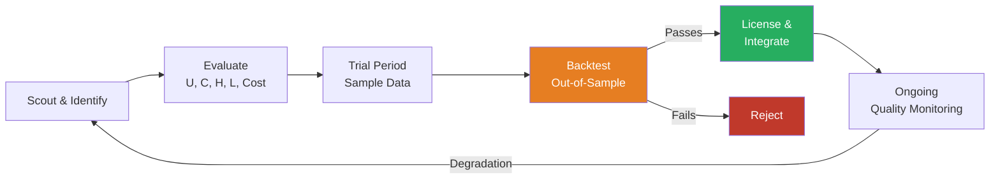
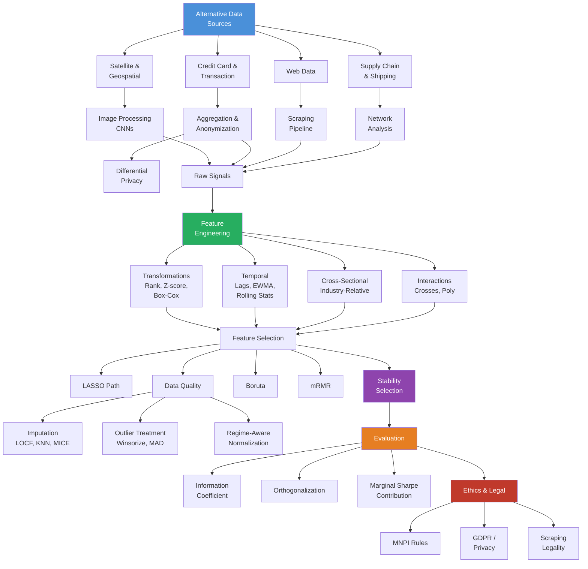

# Module 34: Alternative Data & Feature Engineering

**Prerequisites:** Modules 03 (Statistical Inference), 09 (Python for Quant), 26 (Machine Learning), 29 (NLP/Sentiment)
**Builds toward:** Capstone --- this is the final module of the Quant Nexus Encyclopedia.

---

## Table of Contents

1. [The Alternative Data Landscape](#1-the-alternative-data-landscape)
2. [Satellite & Geospatial Data](#2-satellite--geospatial-data)
3. [Credit Card & Transaction Data](#3-credit-card--transaction-data)
4. [Web Data](#4-web-data)
5. [Supply Chain & Shipping Data](#5-supply-chain--shipping-data)
6. [Feature Engineering Pipeline](#6-feature-engineering-pipeline)
7. [Feature Selection at Scale](#7-feature-selection-at-scale)
8. [Data Quality & Preprocessing](#8-data-quality--preprocessing)
9. [Evaluation: Incremental Signal Assessment](#9-evaluation-incremental-signal-assessment)
10. [Ethics, Legal & Compliance](#10-ethics-legal--compliance)
11. [Implementation: Python](#11-implementation-python)
12. [Exercises](#12-exercises)
13. [Summary and Concept Map](#13-summary-and-concept-map)
14. [Capstone: The 34-Module Journey](#14-capstone-the-34-module-journey)

---

## 1. The Alternative Data Landscape

Traditional financial data --- prices, volumes, financial statements, analyst estimates --- has been systematically exploited for decades. **Alternative data** encompasses every non-traditional data source that provides informational edge. The field has exploded: the alternative data market exceeded $7 billion in 2025 and continues growing as funds seek uncorrelated alpha signals.

### 1.1 Taxonomy of Alternative Data

| Category | Source | Example | Latency | Alpha Horizon |
|---|---|---|---|---|
| **Exhaust data** | Byproduct of business processes | Credit card transactions, email receipts | 1--7 days | Days to weeks |
| **Sensor data** | Physical measurement devices | Satellite imagery, IoT sensors, AIS shipping | Hours to days | Days to months |
| **Web data** | Internet activity | Job postings, product reviews, app downloads | Minutes to hours | Days to weeks |
| **Government data** | Regulatory filings | Patent applications, customs data, SEC filings | Days to weeks | Weeks to months |
| **Social / sentiment** | Human expression | Twitter/X, Reddit, news sentiment (Module 29) | Seconds to minutes | Minutes to days |
| **Geolocation** | Mobile device tracking | Foot traffic to stores, airport activity | Hours | Days to weeks |

### 1.2 Vendor Evaluation Framework

Before committing to an alternative data vendor, evaluate along five axes:

**Uniqueness ($U$).** How many other funds have access? Exclusivity degrades as datasets commoditize. Estimate the **crowding discount**:

$$\alpha_{\text{net}} \approx \alpha_{\text{gross}} \cdot \frac{1}{1 + \kappa \cdot N_{\text{users}}}$$

where $\kappa$ is a crowding sensitivity parameter and $N_{\text{users}}$ is the estimated subscriber count.

**Coverage ($C$).** What fraction of your investable universe does the data cover? A dataset covering 50 large-cap US stocks is less valuable than one covering 2,000.

**History ($H$).** How many years of backfill are available? A minimum of 5 years is needed for robust backtesting across market regimes (Module 33). Beware **survivorship bias** in historical data --- vendors often cannot provide data for companies that no longer exist.

**Latency ($L$).** Time from event occurrence to data delivery. For high-frequency strategies, anything above minutes is useless. For fundamental strategies, weekly delivery may suffice.

**Cost ($C$).** The all-in cost including licensing, infrastructure, and engineering effort to integrate. Compute the **information ratio breakeven**:

$$\text{AUM}_{\min} = \frac{\text{Annual data cost}}{\Delta \text{IR} \cdot \sigma_p \cdot \text{fee rate}}$$

where $\Delta \text{IR}$ is the incremental information ratio contributed by the data.

### 1.3 Data Procurement Lifecycle



---

## 2. Satellite & Geospatial Data

### 2.1 Parking Lot Car Counts

Retailers such as Walmart, Costco, and Home Depot operate thousands of stores with large parking lots visible from space. The number of cars in parking lots serves as a real-time proxy for revenue.

**Processing pipeline:**

1. **Image acquisition:** Optical satellite imagery (Planet Labs: 3--5m resolution, daily revisit; Maxar: 30cm resolution, less frequent).
2. **Cloud masking:** Discard images where cloud cover exceeds a threshold (typically 30%). Use spectral band ratios: clouds have high reflectance in visible bands and low absorption in near-infrared.
3. **Object detection:** Apply a CNN (typically a YOLO-family or Faster R-CNN model) trained on labeled car images. The model outputs bounding boxes with confidence scores.
4. **Temporal aggregation:** Aggregate daily car counts to weekly averages to reduce noise. Normalize by store capacity (total parking spots) and day-of-week seasonality.
5. **Signal extraction:** Compute year-over-year growth rate and deviation from consensus estimates.

**Mathematical formulation.** Let $n_{i,t}$ be the car count at store $i$ on day $t$, and $\text{cap}_i$ the parking capacity. The normalized, seasonally adjusted signal is:

$$x_{i,t} = \frac{n_{i,t} / \text{cap}_i - \bar{s}_{d(t)}}{\hat{\sigma}_{d(t)}}$$

where $\bar{s}_{d(t)}$ and $\hat{\sigma}_{d(t)}$ are the historical mean and standard deviation for day-of-week $d(t)$. The company-level signal aggregates across stores:

$$X_{c,t} = \frac{1}{|I_c|} \sum_{i \in I_c} x_{i,t}$$

### 2.2 Oil Storage & Commodity Signals

Floating-roof oil tanks change their shadow profile as fill levels vary. The shadow length $\ell$ relates to the fill fraction $\phi$ by:

$$\phi = 1 - \frac{h_{\text{empty}} - h_{\text{roof}}(\ell, \theta_{\text{sun}})}{h_{\text{tank}}}$$

where $\theta_{\text{sun}}$ is the solar elevation angle. The Cushing, Oklahoma storage complex (the delivery point for WTI crude) has approximately 80 million barrels of capacity monitored by satellite.

### 2.3 Shipping & Port Activity

**AIS (Automatic Identification System)** data tracks vessel positions globally. Signal extraction:

- **Tanker congestion at ports:** long waiting times signal supply bottlenecks
- **Dry bulk trade flows:** iron ore shipments from Australia to China as a leading indicator for steel demand
- **Container throughput:** total TEU (twenty-foot equivalent unit) volume as a global trade proxy

---

## 3. Credit Card & Transaction Data

### 3.1 Consumer Spending Signals

Aggregated, anonymized credit/debit card transaction data provides a near-real-time window into consumer spending. Companies like Mastercard, Visa, and fintech aggregators sell panels covering millions of consumers.

**Signal construction.** For company $c$ at time $t$:

$$\text{Rev}_{c,t}^{\text{est}} = \bar{s}_{c,t} \cdot N_{c,t} \cdot \hat{f}_c$$

where $\bar{s}_{c,t}$ is the average transaction size, $N_{c,t}$ is the transaction count, and $\hat{f}_c$ is a panel-to-universe scaling factor estimated from historical filings.

The alpha signal is the **surprise** relative to consensus:

$$\text{Surprise}_{c,t} = \frac{\text{Rev}_{c,t}^{\text{est}} - \text{Rev}_{c,t}^{\text{consensus}}}{\text{Rev}_{c,t}^{\text{consensus}}}$$

### 3.2 Merchant-Level Disaggregation

Transaction data is most powerful at the merchant level, enabling same-store-sales analysis before the company reports. Key considerations:

- **Panel representativeness:** Does the panel skew toward high-income consumers? Correct with post-stratification weights.
- **Return/refund adjustment:** Subtract refund transactions to avoid double-counting.
- **Seasonal adjustment:** Remove calendar effects (e.g., Thanksgiving shopping week shift).

### 3.3 Differential Privacy

Transaction data is individually sensitive. **Differential privacy** provides a mathematical guarantee:

$$P[\mathcal{M}(D) \in S] \leq e^{\varepsilon} \cdot P[\mathcal{M}(D') \in S]$$

for any pair of datasets $D, D'$ differing in one individual and any output set $S$. The **privacy budget** $\varepsilon$ controls the trade-off: smaller $\varepsilon$ gives stronger privacy but noisier signals. For aggregate spending signals, $\varepsilon \in [1, 10]$ typically preserves sufficient signal-to-noise.

The most common mechanism is the **Laplace mechanism**: add noise $\eta \sim \text{Lap}(\Delta f / \varepsilon)$ where $\Delta f$ is the sensitivity (maximum change in the query output from adding/removing one individual).

---

## 4. Web Data

### 4.1 Job Postings

Job posting volume and composition are leading indicators of company growth:

- **Total postings:** Rapid increase signals expansion; sudden decline signals hiring freeze
- **Role composition:** Shift toward engineering roles signals R&D investment; increase in sales roles signals go-to-market push
- **Seniority distribution:** Many VP-level postings may signal organizational restructuring
- **Location shifts:** New offices in emerging markets signal geographic expansion

The signal has a lead time of 3--6 months over financial results: hiring precedes revenue growth.

### 4.2 Product Reviews

Consumer review data from platforms like Amazon, Yelp, and app stores provides:

- **Sentiment trend:** Average star rating over rolling 30-day window (see Module 29 for NLP methods)
- **Defect detection:** NLP classifier trained to identify product quality complaints (warranty, defect, broken, recall)
- **Competitive intelligence:** Share of positive mentions relative to competitors

### 4.3 Web Scraping: Technical & Legal Framework

**Legal considerations:**
- **Computer Fraud and Abuse Act (CFAA):** Accessing systems "without authorization" can be illegal; always respect Terms of Service
- **robots.txt:** Honor the crawl directives; scraping disallowed paths creates legal risk
- **Rate limiting:** Excessive request rates can constitute a denial-of-service attack; implement polite delays
- **Copyright:** Scraped content may be copyrighted; use only facts/data (not creative expression)
- **GDPR/CCPA:** Personal data scraping requires a lawful basis; most quant use cases focus on aggregate data

**Technical implementation principles:**
- **Headless browsers** (Playwright, Puppeteer) for JavaScript-rendered content
- **Rotating proxies** and user agents to avoid IP blocking
- **Exponential backoff** on HTTP errors
- **Idempotent pipelines** that can resume from any point

---

## 5. Supply Chain & Shipping Data

### 5.1 Bill of Lading & Customs Data

Customs records (bill of lading data) reveal the actual flow of goods between companies. Each record contains: shipper, consignee, commodity description, quantity, origin/destination port, and date.

**Signal extraction:**
- **Import volume spikes:** A retailer increasing import volume 3 months before holiday season signals bullish expectations
- **Supplier diversification:** Shift from single to multiple suppliers may indicate supply chain risk management
- **New trade relationships:** Previously unconnected shipper-consignee pairs signal new business

### 5.2 Supplier-Customer Network Analysis

Model the supply chain as a directed graph $G = (V, E)$ where vertices are firms and edges represent supplier-customer relationships weighted by transaction volume.

**Network metrics for alpha signals:**

| Metric | Definition | Financial Signal |
|---|---|---|
| In-degree centrality | $c_{\text{in}}(v) = \frac{1}{|V|-1}\sum_u \mathbb{1}[(u,v) \in E]$ | Revenue concentration risk |
| PageRank | $\text{PR}(v) = \frac{1-d}{|V|} + d \sum_{u \to v} \frac{\text{PR}(u)}{c_{\text{out}}(u)}$ | Systemic importance |
| Betweenness centrality | Fraction of shortest paths through $v$ | Supply chain bottleneck |
| Clustering coefficient | Triangle density around $v$ | Supply chain resilience |

**Contagion model.** Distress propagates through the network. If supplier $u$ experiences a shock $\delta_u$, the downstream impact on customer $v$ is:

$$\Delta_v = \sum_{u \to v} w_{uv} \cdot \delta_u \cdot \rho(v)$$

where $w_{uv}$ is the share of $v$'s inputs from $u$ and $\rho(v)$ is $v$'s substitutability factor (how easily $v$ can find alternative suppliers). Low $\rho$ and high $w_{uv}$ imply high contagion risk.

---

## 6. Feature Engineering Pipeline

Raw alternative data must be transformed into predictive features. This section presents a systematic pipeline applicable to any data source.

### 6.1 Univariate Transformations

**Rank transform.** Convert raw values to cross-sectional ranks at each time step. Ranks are robust to outliers and linearize the relationship with the target:

$$\tilde{x}_{i,t} = \frac{\text{rank}(x_{i,t}) - 1}{N_t - 1} \in [0, 1]$$

where $N_t$ is the number of assets at time $t$.

**Z-score.** Standardize to zero mean and unit variance within a rolling window:

$$z_{i,t} = \frac{x_{i,t} - \hat{\mu}_{t}^{(w)}}{\hat{\sigma}_{t}^{(w)}}$$

where $\hat{\mu}_t^{(w)}$ and $\hat{\sigma}_t^{(w)}$ are computed over a trailing window of $w$ observations. Winsorize at $\pm 3$ to limit outlier influence.

**Percentile.** Compute the percentile of the current value relative to its own history:

$$p_{i,t} = \frac{1}{w} \sum_{s=t-w+1}^{t} \mathbb{1}[x_{i,s} \leq x_{i,t}]$$

**Box-Cox transform.** For strictly positive features with heavy right skew:

$$y = \begin{cases} \frac{x^\lambda - 1}{\lambda} & \text{if } \lambda \neq 0 \\ \ln x & \text{if } \lambda = 0 \end{cases}$$

The optimal $\lambda$ is chosen to maximize the log-likelihood of a Gaussian fit to $y$.

### 6.2 Temporal Features

**Lags.** Include lagged values as separate features to capture delayed effects:

$$x_{i,t}^{(\ell)} = x_{i, t-\ell}, \quad \ell = 1, 5, 21, 63, 252 \;\text{(days)}$$

**Rolling statistics.** Moving averages, standard deviations, skewness, and kurtosis:

$$\bar{x}_{i,t}^{(w)} = \frac{1}{w} \sum_{s=0}^{w-1} x_{i,t-s}, \quad \hat{\sigma}_{i,t}^{(w)} = \sqrt{\frac{1}{w-1} \sum_{s=0}^{w-1} (x_{i,t-s} - \bar{x}_{i,t}^{(w)})^2}$$

**Exponentially weighted moving average (EWMA).** With half-life $h$ (decay factor $\alpha = 1 - 2^{-1/h}$):

$$\text{EWMA}_t = \alpha \, x_t + (1 - \alpha) \, \text{EWMA}_{t-1}$$

**Seasonal decomposition.** For features with strong periodicity (e.g., consumer spending), use STL decomposition $x_t = T_t + S_t + R_t$ (trend, seasonal, remainder) and use only the residual $R_t$ as the signal.

### 6.3 Cross-Sectional Features

**Industry-relative.** Subtract the industry or sector average to isolate idiosyncratic signal:

$$x_{i,t}^{\text{rel}} = x_{i,t} - \frac{1}{|G_i|} \sum_{j \in G_i} x_{j,t}$$

where $G_i$ is the industry group of asset $i$.

**Sector rank.** Rank within sector rather than across the full universe, capturing within-sector relative value.

### 6.4 Interaction Features

**Crosses.** Interaction between two features $x^{(a)}$ and $x^{(b)}$:

$$x_{i,t}^{(a \times b)} = x_{i,t}^{(a)} \cdot x_{i,t}^{(b)}$$

For example: momentum $\times$ quality isolates high-quality momentum stocks.

**Polynomial features.** Second-order terms capture nonlinear relationships:

$$x_{i,t}^{(\text{poly})} = [x_{i,t}^{(a)}, \; (x_{i,t}^{(a)})^2, \; x_{i,t}^{(a)} x_{i,t}^{(b)}, \; (x_{i,t}^{(b)})^2, \; x_{i,t}^{(b)}]$$

**Kernel-based features.** For richer nonlinear interactions, use RBF kernel features:

$$\phi_m(\mathbf{x}) = \exp\left(-\frac{\|\mathbf{x} - \mathbf{c}_m\|^2}{2\gamma}\right)$$

where $\mathbf{c}_m$ are cluster centers from K-means on the feature space. This is the "random kitchen sinks" approximation (Rahimi & Recht, 2007).

---

## 7. Feature Selection at Scale

With hundreds of candidate features from diverse data sources, feature selection prevents overfitting and improves model interpretability.

### 7.1 LASSO Path

The LASSO (Module 26) solves:

$$\hat{\boldsymbol{\beta}}(\lambda) = \arg\min_{\boldsymbol{\beta}} \frac{1}{2T} \|\mathbf{y} - \mathbf{X}\boldsymbol{\beta}\|_2^2 + \lambda \|\boldsymbol{\beta}\|_1$$

The **regularization path** traces $\hat{\boldsymbol{\beta}}(\lambda)$ as $\lambda$ decreases from $\lambda_{\max}$ (all coefficients zero) to zero. Features that "enter" the path first (at high $\lambda$) are the most important. The optimal $\lambda$ is chosen via cross-validation.

### 7.2 Stability Selection

Stability selection (Meinshausen & Buhlmann, 2010) addresses the instability of single-run LASSO by running it many times on random subsamples.

**Algorithm:**
1. For $b = 1, \ldots, B$ (e.g., $B = 100$):
   - Draw a random subsample of size $\lfloor T/2 \rfloor$ (without replacement)
   - Fit LASSO on the subsample and record which features are selected (non-zero coefficient)
2. Compute the **selection probability** for each feature $j$:

$$\hat{\Pi}_j = \frac{1}{B} \sum_{b=1}^{B} \mathbb{1}\left[\hat{\beta}_j^{(b)} \neq 0\right]$$

3. Select features with $\hat{\Pi}_j > \pi_{\text{thr}}$ (typically $\pi_{\text{thr}} = 0.6$)

**Derivation of the error bound.** Let $q_\lambda$ be the average number of selected features per subsample. Under the assumption that the noise features are exchangeable, the expected number of falsely selected features $\mathbb{E}[V]$ satisfies:

$$\mathbb{E}[V] \leq \frac{1}{2\pi_{\text{thr}} - 1} \cdot \frac{q_\lambda^2}{p}$$

where $p$ is the total number of features. This bound follows from the fact that, for noise features with selection probability $\leq 0.5$, the probability that the selection frequency exceeds $\pi_{\text{thr}}$ is bounded by:

$$P(\hat{\Pi}_j > \pi_{\text{thr}}) \leq \frac{\mathbb{E}[\hat{\Pi}_j]}{2\pi_{\text{thr}} - 1} \leq \frac{q_\lambda / p}{2\pi_{\text{thr}} - 1}$$

Summing over $p$ noise features and using the union bound gives the result. For $\pi_{\text{thr}} = 0.9$ and $q_\lambda = 20$ with $p = 500$, the expected false selections $\leq 20^2 / (0.8 \cdot 500) = 1.0$.

### 7.3 Boruta Algorithm

Boruta (Kursa & Rudnicki, 2010) tests each feature against "shadow features" --- random permutations of the original features:

1. For each original feature $x_j$, create a shadow feature $\tilde{x}_j$ by randomly permuting $x_j$ across observations
2. Fit a random forest on the combined $[X, \tilde{X}]$ feature set
3. Compute feature importance (e.g., mean decrease impurity) for all features
4. A real feature is **confirmed** if its importance consistently exceeds the best shadow feature; **rejected** if consistently below
5. Repeat until all features are classified or a maximum iteration is reached

The shadow features establish an empirical null distribution of "no information" importance, solving the problem of calibrating an absolute importance threshold.

### 7.4 mRMR: Minimum Redundancy Maximum Relevance

Linking to Module 07 (Information Theory), mRMR selects features by balancing relevance to the target and redundancy among selected features:

$$\text{mRMR}(S) = \frac{1}{|S|} \sum_{x_j \in S} I(x_j; y) - \frac{1}{|S|^2} \sum_{x_j, x_k \in S} I(x_j; x_k)$$

where $I(\cdot; \cdot)$ is mutual information. Features are selected greedily to maximize this criterion.

---

## 8. Data Quality & Preprocessing

### 8.1 Missing Data

Financial panel data is rife with missing values (stocks halt, data vendors have outages, new companies lack history).

**Forward fill (LOCF).** Carry the last observation forward. Appropriate for slowly changing features (e.g., fundamental data between quarterly reports):

$$\hat{x}_{i,t} = x_{i,t'}, \quad t' = \max\{s \leq t : x_{i,s} \text{ is observed}\}$$

**KNN imputation.** Replace missing $x_{i,t}$ with the average of the $k$ nearest neighbors in feature space:

$$\hat{x}_{i,t}^{(j)} = \frac{1}{k} \sum_{m \in \mathcal{N}_k(i,t)} x_{m,t}^{(j)}$$

where $\mathcal{N}_k(i,t)$ is the set of $k$ assets closest to asset $i$ at time $t$ based on non-missing features.

**MICE (Multiple Imputation by Chained Equations).** Iteratively impute each feature conditional on all others using a sequence of regression models. After $M$ rounds, the imputed dataset is stabilized. Run the downstream model on $M$ separately imputed datasets and pool results using Rubin's rules.

### 8.2 Outlier Treatment

**Winsorization.** Clip values at percentile thresholds:

$$\hat{x}_{i,t} = \text{clip}(x_{i,t}, q_{\alpha/2}, q_{1-\alpha/2})$$

where $q_p$ is the $p$-th quantile. Typical: $\alpha = 0.02$ (1st and 99th percentile).

**MAD-based clipping.** More robust than percentile-based methods:

$$\text{MAD} = \text{median}(|x_i - \text{median}(x)|)$$

$$\hat{x}_i = \text{clip}\left(x_i, \; \text{median}(x) - c \cdot \text{MAD}, \; \text{median}(x) + c \cdot \text{MAD}\right)$$

with $c = 5$ (conservative) or $c = 3$ (aggressive). For Gaussian data, $\text{MAD} \approx 0.6745 \sigma$.

### 8.3 Regime-Aware Normalization

Standard z-scoring assumes stationarity. In non-stationary markets (Module 33), normalize within the current regime:

$$z_{i,t}^{(k)} = \frac{x_{i,t} - \hat{\mu}_t^{(k)}}{\hat{\sigma}_t^{(k)}}, \quad k = \text{current regime}$$

where $\hat{\mu}_t^{(k)}$ and $\hat{\sigma}_t^{(k)}$ are the mean and standard deviation computed only from observations classified in regime $k$. This prevents bull-market features from being z-scored against a pooled distribution that includes crisis-period values.

---

## 9. Evaluation: Incremental Signal Assessment

A new feature is useful only if it provides information **beyond** what existing factors already capture.

### 9.1 Orthogonalization (Residualization)

Regress the candidate feature on existing factors and use the residual:

$$x_{i,t}^{\text{new}} = \alpha + \boldsymbol{\beta}^\top \mathbf{f}_{i,t}^{\text{existing}} + \varepsilon_{i,t}$$

The residual $\hat{\varepsilon}_{i,t}$ is the **orthogonalized signal** --- the component of the new feature not explained by existing factors. If $\hat{\varepsilon}_{i,t}$ has no predictive power, the new data is redundant.

### 9.2 Incremental Information Coefficient (IC)

The IC is the cross-sectional Spearman rank correlation between the signal and future returns:

$$\text{IC}_t = \text{corr}_{\text{Spearman}}\left(x_{i,t}^{\text{new}}, r_{i, t+1}\right)$$

The **incremental IC** is the IC of the orthogonalized signal. A stable incremental IC of 0.02--0.05 is highly significant at scale.

The **IC Information Ratio** (ICIR) measures signal consistency:

$$\text{ICIR} = \frac{\overline{\text{IC}}}{\text{std}(\text{IC}_t)}$$

An ICIR above 0.5 is considered strong for a single factor.

### 9.3 Marginal Sharpe Contribution

Following the spanning test logic: a new factor $f^{\text{new}}$ improves portfolio performance if and only if it has a non-zero alpha when regressed on the returns of the existing optimal portfolio:

$$f_t^{\text{new}} = \alpha + \beta \, R_t^{\text{existing}} + \varepsilon_t$$

The marginal Sharpe improvement is:

$$\text{SR}_{\text{combined}}^2 = \text{SR}_{\text{existing}}^2 + \left(\frac{\alpha}{\sigma_\varepsilon}\right)^2$$

This is the **fundamental law of active management** decomposition: each orthogonal signal source contributes additively to the squared Sharpe ratio.

---

## 10. Ethics, Legal & Compliance

### 10.1 Material Non-Public Information (MNPI)

The critical legal boundary: alternative data must not constitute MNPI. Data is **material** if a reasonable investor would consider it important; it is **non-public** if it has not been disseminated to the public.

**Red flags:**
- Data obtained directly from company insiders
- Datasets derived from breached confidentiality agreements
- Raw, individual-level transaction data (before anonymization/aggregation)
- Data scraped in violation of explicit Terms of Service

**Safe harbors:**
- Publicly observable data (satellite imagery of public spaces)
- Anonymized, aggregated data (credit card panels with sufficient panel size)
- Data derived from public sources (SEC filings, patent databases)

### 10.2 GDPR & Privacy Regulation

The EU's General Data Protection Regulation imposes constraints:

- **Lawful basis:** Personal data processing requires one of six lawful bases (consent, contract, legal obligation, vital interests, public task, legitimate interests)
- **Data minimization:** Collect only what is necessary
- **Right to erasure:** Individuals can request deletion of their data
- **Data Protection Impact Assessment (DPIA):** Required for high-risk processing

For quantitative finance, the safest approach is to use **pre-aggregated, anonymized data** where no individual can be identified. Differential privacy (Section 3.3) provides a formal framework for this.

### 10.3 Web Scraping Legality

The legal landscape is evolving (LinkedIn v. hiQ Labs, 2022 ruling). General principles:

- Public data on public websites is generally scrapable, but ToS violations may create contractual liability
- Do not circumvent technical access controls (violates CFAA)
- Do not scrape personal data without lawful basis
- Rate-limit requests to avoid service disruption
- Document your legal analysis and keep records of compliance efforts

---

## 11. Implementation: Python

```python
"""
Module 34: Alternative Data & Feature Engineering — Python Implementation
Requires: numpy, pandas, scipy, sklearn, requests, playwright (optional)
"""

import numpy as np
import pandas as pd
from scipy import stats
from scipy.special import boxcox as scipy_boxcox
from typing import Optional
import time
import logging

logger = logging.getLogger(__name__)


# ============================================================================
# 1. Web Scraper with Rate Limiting and Retry Logic
# ============================================================================

class RateLimitedScraper:
    """
    Polite web scraper with exponential backoff, rate limiting,
    and robots.txt compliance.
    """

    def __init__(
        self,
        requests_per_second: float = 1.0,
        max_retries: int = 3,
        backoff_factor: float = 2.0,
        user_agent: str = "QuanNexusResearchBot/1.0",
        respect_robots: bool = True,
    ):
        self.min_interval = 1.0 / requests_per_second
        self.max_retries = max_retries
        self.backoff_factor = backoff_factor
        self.user_agent = user_agent
        self.respect_robots = respect_robots
        self._last_request_time = 0.0
        self._robots_cache: dict[str, bool] = {}

    def _check_robots_txt(self, url: str) -> bool:
        """Check if URL is allowed by robots.txt."""
        if not self.respect_robots:
            return True

        from urllib.parse import urlparse
        parsed = urlparse(url)
        base_url = f"{parsed.scheme}://{parsed.netloc}"

        if base_url not in self._robots_cache:
            try:
                import urllib.robotparser
                rp = urllib.robotparser.RobotFileParser()
                rp.set_url(f"{base_url}/robots.txt")
                rp.read()
                self._robots_cache[base_url] = rp.can_fetch(
                    self.user_agent, url)
            except Exception:
                self._robots_cache[base_url] = True  # Allow on error

        return self._robots_cache.get(base_url, True)

    def _wait_for_rate_limit(self):
        """Enforce minimum interval between requests."""
        elapsed = time.time() - self._last_request_time
        if elapsed < self.min_interval:
            time.sleep(self.min_interval - elapsed)
        self._last_request_time = time.time()

    def fetch(self, url: str, params: dict = None) -> Optional[str]:
        """
        Fetch URL with rate limiting and exponential backoff.

        Returns
        -------
        response_text : str or None if all retries fail
        """
        import requests

        if not self._check_robots_txt(url):
            logger.warning(f"Blocked by robots.txt: {url}")
            return None

        headers = {"User-Agent": self.user_agent}

        for attempt in range(self.max_retries):
            self._wait_for_rate_limit()

            try:
                response = requests.get(
                    url, params=params, headers=headers, timeout=30)

                if response.status_code == 200:
                    return response.text
                elif response.status_code == 429:
                    # Rate limited — back off
                    wait_time = self.backoff_factor ** (attempt + 1)
                    logger.info(
                        f"Rate limited. Waiting {wait_time:.1f}s "
                        f"(attempt {attempt + 1})")
                    time.sleep(wait_time)
                elif response.status_code >= 500:
                    wait_time = self.backoff_factor ** attempt
                    logger.warning(
                        f"Server error {response.status_code}. "
                        f"Retrying in {wait_time:.1f}s")
                    time.sleep(wait_time)
                else:
                    logger.error(
                        f"HTTP {response.status_code} for {url}")
                    return None

            except requests.exceptions.RequestException as e:
                wait_time = self.backoff_factor ** attempt
                logger.error(
                    f"Request failed: {e}. "
                    f"Retrying in {wait_time:.1f}s")
                time.sleep(wait_time)

        logger.error(f"All {self.max_retries} retries failed for {url}")
        return None

    def fetch_batch(self, urls: list[str]) -> dict[str, Optional[str]]:
        """Fetch multiple URLs sequentially with rate limiting."""
        results = {}
        for url in urls:
            results[url] = self.fetch(url)
        return results


# ============================================================================
# 2. Feature Engineering Pipeline
# ============================================================================

class FeatureEngineer:
    """
    Systematic feature engineering for panel data (assets x time).
    Expects DataFrames with MultiIndex (date, asset_id).
    """

    @staticmethod
    def rank_transform(
        series: pd.Series, groupby: str = "date"
    ) -> pd.Series:
        """Cross-sectional rank transform scaled to [0, 1]."""
        def _rank_group(group):
            return group.rank(pct=True)
        return series.groupby(level=groupby).transform(_rank_group)

    @staticmethod
    def zscore(
        series: pd.Series, window: int = 252, groupby: str = "date"
    ) -> pd.Series:
        """Rolling z-score with winsorization at +/- 3."""
        def _zscore_asset(s):
            mu = s.rolling(window, min_periods=window // 2).mean()
            sigma = s.rolling(window, min_periods=window // 2).std()
            z = (s - mu) / (sigma + 1e-8)
            return z.clip(-3, 3)

        # Apply per asset
        return series.groupby(level="asset_id").transform(_zscore_asset)

    @staticmethod
    def rolling_stats(
        series: pd.Series, windows: list[int] = None
    ) -> pd.DataFrame:
        """Compute rolling mean, std, skew, kurtosis per asset."""
        if windows is None:
            windows = [21, 63, 252]

        features = {}
        for w in windows:
            grouped = series.groupby(level="asset_id")
            features[f"mean_{w}d"] = grouped.transform(
                lambda s: s.rolling(w, min_periods=w // 2).mean())
            features[f"std_{w}d"] = grouped.transform(
                lambda s: s.rolling(w, min_periods=w // 2).std())
            features[f"skew_{w}d"] = grouped.transform(
                lambda s: s.rolling(w, min_periods=w // 2).skew())
            features[f"kurt_{w}d"] = grouped.transform(
                lambda s: s.rolling(w, min_periods=w // 2).kurt())

        return pd.DataFrame(features, index=series.index)

    @staticmethod
    def ewma_features(
        series: pd.Series, halflifes: list[int] = None
    ) -> pd.DataFrame:
        """EWMA features with multiple half-lives."""
        if halflifes is None:
            halflifes = [5, 21, 63]

        features = {}
        for hl in halflifes:
            features[f"ewma_{hl}d"] = series.groupby(
                level="asset_id").transform(
                lambda s: s.ewm(halflife=hl).mean())

        return pd.DataFrame(features, index=series.index)

    @staticmethod
    def industry_relative(
        series: pd.Series, industry_map: pd.Series
    ) -> pd.Series:
        """Subtract industry mean (cross-sectional, per date)."""
        df = pd.DataFrame({
            "value": series,
            "industry": industry_map,
        })

        industry_mean = df.groupby(
            [df.index.get_level_values("date"), "industry"]
        )["value"].transform("mean")

        return series - industry_mean

    @staticmethod
    def lag_features(
        series: pd.Series, lags: list[int] = None
    ) -> pd.DataFrame:
        """Create lagged features per asset."""
        if lags is None:
            lags = [1, 5, 21, 63, 252]

        features = {}
        for lag in lags:
            features[f"lag_{lag}d"] = series.groupby(
                level="asset_id").shift(lag)

        return pd.DataFrame(features, index=series.index)

    @staticmethod
    def interaction_features(
        df: pd.DataFrame, pairs: list[tuple[str, str]]
    ) -> pd.DataFrame:
        """Compute interaction (product) features for specified pairs."""
        features = {}
        for col_a, col_b in pairs:
            name = f"{col_a}_x_{col_b}"
            features[name] = df[col_a] * df[col_b]
        return pd.DataFrame(features, index=df.index)

    @staticmethod
    def boxcox_transform(series: pd.Series) -> tuple[pd.Series, float]:
        """Box-Cox transform (requires positive values)."""
        # Shift to positive if needed
        min_val = series.min()
        shift = 0.0
        if min_val <= 0:
            shift = abs(min_val) + 1.0

        transformed, lmbda = stats.boxcox(series + shift)
        return pd.Series(transformed, index=series.index), lmbda


# ============================================================================
# 3. Feature Selection: Stability Selection
# ============================================================================

def stability_selection(
    X: np.ndarray,
    y: np.ndarray,
    n_bootstrap: int = 100,
    sample_fraction: float = 0.5,
    lambda_grid: np.ndarray = None,
    threshold: float = 0.6,
    rng: np.random.Generator = None,
) -> dict:
    """
    Stability selection via subsampled LASSO.

    Parameters
    ----------
    X : (T, p) feature matrix
    y : (T,) target vector
    n_bootstrap : number of subsample iterations
    sample_fraction : fraction of data per subsample
    lambda_grid : regularization values to try
    threshold : selection probability threshold

    Returns
    -------
    dict with:
        - selected_features: indices of stable features
        - selection_probs: (p,) selection probability per feature
        - avg_n_selected: average features selected per subsample
    """
    from sklearn.linear_model import Lasso
    from sklearn.preprocessing import StandardScaler

    if rng is None:
        rng = np.random.default_rng(42)

    T, p = X.shape
    subsample_size = int(T * sample_fraction)

    if lambda_grid is None:
        # Compute lambda_max and create grid
        X_scaled = StandardScaler().fit_transform(X)
        lambda_max = np.max(np.abs(X_scaled.T @ y)) / T
        lambda_grid = np.array([lambda_max * 0.1])

    selection_counts = np.zeros(p)
    total_selected_counts = []

    for b in range(n_bootstrap):
        # Random subsample
        idx = rng.choice(T, size=subsample_size, replace=False)
        X_sub = X[idx]
        y_sub = y[idx]

        # Standardize
        scaler = StandardScaler()
        X_sub_scaled = scaler.fit_transform(X_sub)

        # Fit LASSO for each lambda, count selections
        for lam in lambda_grid:
            model = Lasso(alpha=lam, max_iter=5000, tol=1e-4)
            model.fit(X_sub_scaled, y_sub)

            selected = np.abs(model.coef_) > 1e-8
            selection_counts += selected.astype(float)
            total_selected_counts.append(selected.sum())

    # Normalize
    total_runs = n_bootstrap * len(lambda_grid)
    selection_probs = selection_counts / total_runs

    # Apply threshold
    selected_features = np.where(selection_probs >= threshold)[0]

    # Error bound
    avg_q = np.mean(total_selected_counts)
    expected_false = avg_q**2 / (p * (2 * threshold - 1)) if threshold > 0.5 else np.inf

    return {
        "selected_features": selected_features,
        "selection_probs": selection_probs,
        "avg_n_selected": avg_q,
        "expected_false_selections": expected_false,
    }


# ============================================================================
# 4. Data Quality: Missing Data & Outliers
# ============================================================================

class DataQuality:
    """Data quality toolkit for financial panel data."""

    @staticmethod
    def winsorize(series: pd.Series, limits: tuple = (0.01, 0.01),
                  groupby: str = "date") -> pd.Series:
        """Cross-sectional winsorization per date."""
        def _winsorize_group(group):
            lower = group.quantile(limits[0])
            upper = group.quantile(1 - limits[1])
            return group.clip(lower, upper)
        return series.groupby(level=groupby).transform(_winsorize_group)

    @staticmethod
    def mad_clip(series: pd.Series, c: float = 5.0,
                 groupby: str = "date") -> pd.Series:
        """MAD-based outlier clipping per date."""
        def _mad_clip_group(group):
            med = group.median()
            mad = np.median(np.abs(group - med))
            if mad < 1e-10:
                return group
            lower = med - c * mad
            upper = med + c * mad
            return group.clip(lower, upper)
        return series.groupby(level=groupby).transform(_mad_clip_group)

    @staticmethod
    def knn_impute(
        X: np.ndarray, k: int = 5
    ) -> np.ndarray:
        """
        KNN imputation for missing values.

        Parameters
        ----------
        X : (n, p) feature matrix with np.nan for missing values
        k : number of nearest neighbors

        Returns
        -------
        X_imputed : (n, p) imputed matrix
        """
        from sklearn.impute import KNNImputer
        imputer = KNNImputer(n_neighbors=k, weights="distance")
        return imputer.fit_transform(X)


# ============================================================================
# 5. Incremental Factor Evaluation
# ============================================================================

class FactorEvaluator:
    """Evaluate incremental contribution of a new factor."""

    @staticmethod
    def information_coefficient(
        signal: pd.Series,
        forward_returns: pd.Series,
        groupby: str = "date",
    ) -> pd.Series:
        """
        Cross-sectional Spearman IC per date.

        Parameters
        ----------
        signal : feature values (MultiIndex: date, asset_id)
        forward_returns : next-period returns (same index)

        Returns
        -------
        ic_series : (n_dates,) Spearman rank correlation per date
        """
        df = pd.DataFrame({
            "signal": signal,
            "returns": forward_returns,
        }).dropna()

        def _spearman(group):
            if len(group) < 10:
                return np.nan
            corr, _ = stats.spearmanr(group["signal"], group["returns"])
            return corr

        return df.groupby(level=groupby).apply(_spearman)

    @staticmethod
    def ic_summary(ic_series: pd.Series) -> dict:
        """Summary statistics for IC time series."""
        ic_clean = ic_series.dropna()
        return {
            "mean_ic": ic_clean.mean(),
            "std_ic": ic_clean.std(),
            "icir": ic_clean.mean() / (ic_clean.std() + 1e-8),
            "hit_rate": (ic_clean > 0).mean(),
            "t_stat": ic_clean.mean() / (ic_clean.std() / np.sqrt(len(ic_clean)) + 1e-8),
            "n_periods": len(ic_clean),
        }

    @staticmethod
    def orthogonalize(
        new_signal: np.ndarray,
        existing_factors: np.ndarray,
    ) -> np.ndarray:
        """
        Residualize a new signal against existing factors
        via cross-sectional OLS at each time step.

        Parameters
        ----------
        new_signal : (T, N) new factor values
        existing_factors : (T, N, K) existing factor exposures

        Returns
        -------
        residual : (T, N) orthogonalized signal
        """
        T, N = new_signal.shape
        residual = np.zeros_like(new_signal)

        for t in range(T):
            y = new_signal[t]
            X = existing_factors[t]

            # Remove NaN rows
            valid = ~(np.isnan(y) | np.any(np.isnan(X), axis=1))
            if valid.sum() < X.shape[1] + 5:
                residual[t] = np.nan
                continue

            y_v = y[valid]
            X_v = np.column_stack([np.ones(valid.sum()), X[valid]])

            # OLS: beta = (X'X)^{-1} X'y
            try:
                beta = np.linalg.lstsq(X_v, y_v, rcond=None)[0]
                pred = X_v @ beta
                res = y_v - pred
                residual[t, valid] = res
                residual[t, ~valid] = np.nan
            except np.linalg.LinAlgError:
                residual[t] = np.nan

        return residual

    @staticmethod
    def marginal_sharpe_contribution(
        new_factor_returns: np.ndarray,
        existing_portfolio_returns: np.ndarray,
    ) -> dict:
        """
        Compute the marginal Sharpe ratio contribution of a new factor.

        SR_combined^2 = SR_existing^2 + (alpha / sigma_epsilon)^2
        """
        # Regress new factor on existing portfolio
        X = np.column_stack([
            np.ones(len(existing_portfolio_returns)),
            existing_portfolio_returns
        ])
        y = new_factor_returns

        valid = ~(np.isnan(y) | np.any(np.isnan(X), axis=1))
        X_v, y_v = X[valid], y[valid]

        beta = np.linalg.lstsq(X_v, y_v, rcond=None)[0]
        residuals = y_v - X_v @ beta
        alpha = beta[0]
        sigma_eps = residuals.std()

        sr_existing = (existing_portfolio_returns[valid].mean() /
                       existing_portfolio_returns[valid].std() *
                       np.sqrt(252))
        sr_marginal = alpha / (sigma_eps + 1e-8) * np.sqrt(252)
        sr_combined = np.sqrt(sr_existing**2 + sr_marginal**2)

        return {
            "alpha_annualized": alpha * 252,
            "sigma_epsilon": sigma_eps * np.sqrt(252),
            "sr_existing": sr_existing,
            "sr_marginal": sr_marginal,
            "sr_combined": sr_combined,
            "sr_improvement": sr_combined - sr_existing,
        }


# ============================================================================
# 6. Demonstration: Full Pipeline
# ============================================================================

def demo_feature_pipeline():
    """End-to-end feature engineering and evaluation demo."""
    rng = np.random.default_rng(42)

    # Simulate panel data: 500 dates x 100 assets
    n_dates, n_assets = 500, 100
    dates = pd.date_range("2020-01-01", periods=n_dates, freq="B")
    assets = [f"ASSET_{i:03d}" for i in range(n_assets)]

    idx = pd.MultiIndex.from_product(
        [dates, assets], names=["date", "asset_id"])

    # Simulated raw features and returns
    raw_signal = pd.Series(
        rng.normal(0, 1, len(idx)), index=idx, name="raw_signal")

    # Add a weak signal component
    true_alpha = 0.02  # IC ~ 0.02
    forward_returns = pd.Series(
        true_alpha * raw_signal.values + rng.normal(0, 1, len(idx)),
        index=idx, name="forward_return",
    )

    # --- Feature engineering ---
    fe = FeatureEngineer()

    ranked = fe.rank_transform(raw_signal)
    zscored = fe.zscore(raw_signal, window=63)

    print("=== Feature Engineering ===")
    print(f"  Rank transform range: [{ranked.min():.4f}, {ranked.max():.4f}]")
    print(f"  Z-score range: [{zscored.min():.2f}, {zscored.max():.2f}]")

    # --- IC evaluation ---
    evaluator = FactorEvaluator()
    ic_series = evaluator.information_coefficient(raw_signal, forward_returns)
    summary = evaluator.ic_summary(ic_series)

    print("\n=== Information Coefficient ===")
    for key, val in summary.items():
        print(f"  {key}: {val:.4f}")

    # --- Stability selection ---
    T_ss, p_ss = 300, 50
    X_ss = rng.normal(0, 1, (T_ss, p_ss))
    # First 5 features are truly predictive
    true_beta = np.zeros(p_ss)
    true_beta[:5] = np.array([0.3, 0.25, 0.2, 0.15, 0.1])
    y_ss = X_ss @ true_beta + rng.normal(0, 1, T_ss)

    result = stability_selection(
        X_ss, y_ss, n_bootstrap=50, threshold=0.6, rng=rng)

    print("\n=== Stability Selection ===")
    print(f"  Selected features: {result['selected_features']}")
    print(f"  Selection probs (first 10): "
          f"{result['selection_probs'][:10].round(3)}")
    print(f"  Expected false selections: "
          f"{result['expected_false_selections']:.2f}")

    # --- Data quality ---
    dq = DataQuality()
    noisy_signal = raw_signal.copy()
    # Inject outliers
    outlier_idx = rng.choice(len(noisy_signal), 50, replace=False)
    noisy_signal.iloc[outlier_idx] = rng.normal(0, 20, 50)

    cleaned = dq.mad_clip(noisy_signal, c=5.0)
    print(f"\n=== Data Quality ===")
    print(f"  Original range: [{noisy_signal.min():.2f}, "
          f"{noisy_signal.max():.2f}]")
    print(f"  After MAD clip: [{cleaned.min():.2f}, {cleaned.max():.2f}]")


if __name__ == "__main__":
    demo_feature_pipeline()
```

---

## 12. Exercises

### Foundational

**Exercise 34.1.** A satellite data vendor offers parking lot car counts for 200 US retailers at $500K/year. Your fund manages $2B with a target Sharpe ratio improvement of 0.05 from this data. Assuming a 1% management fee, compute the minimum AUM at which the data is cost-effective. What annual IC would be needed?

**Exercise 34.2.** Prove the stability selection error bound: under the exchangeability assumption for noise features, show that $\mathbb{E}[V] \leq \frac{q_\lambda^2}{p(2\pi_{\text{thr}} - 1)}$ where $V$ is the number of falsely selected features.

**Exercise 34.3.** Show that the marginal Sharpe contribution formula $\text{SR}_{\text{combined}}^2 = \text{SR}_{\text{existing}}^2 + (\alpha/\sigma_\varepsilon)^2$ follows from the fact that the optimal combined portfolio allocates to the new factor proportionally to its alpha-to-residual-variance ratio.

**Exercise 34.4.** A credit card data provider reports spending growth of +15% YoY for a retailer, but the panel oversamples high-income consumers (top quintile: 40% of panel vs. 20% of population). Describe how you would use post-stratification weights to correct the estimate. What additional information would you need?

### Computational

**Exercise 34.5.** Build a web scraper (using the `RateLimitedScraper` class) that collects job posting counts from a public job board for 20 companies. Compute the rolling 30-day job posting growth rate. Correlate this with next-quarter revenue surprise for companies in your universe. Report the Spearman IC.

**Exercise 34.6.** Implement the full feature engineering pipeline:
- Start with 5 raw signals (e.g., momentum, volatility, earnings yield, analyst revisions, and a simulated alt-data signal)
- Apply rank, z-score, EWMA, and lag transformations to generate 50+ features
- Run stability selection and Boruta to identify the top features
- Compare the selected feature sets between the two methods

**Exercise 34.7.** Using simulated data, compare three imputation methods (forward fill, KNN, MICE) across varying missing rates (5%, 15%, 30%). For each:
- Compute the RMSE of imputed vs. true values
- Measure the downstream impact on a cross-sectional regression's $R^2$
- Plot the degradation curve as the missing rate increases

**Exercise 34.8.** Construct a supply chain network graph using simulated bill-of-lading data for 50 firms. Compute PageRank, betweenness centrality, and clustering coefficient for each firm. Test whether these network metrics predict stock returns (form quintile portfolios, report monotonicity and long-short spread).

### Advanced

**Exercise 34.9.** Implement a differential privacy mechanism for credit card spending data:
- Generate a synthetic panel of 100,000 consumers and 50 merchants
- Compute merchant-level aggregate spending
- Add Laplace noise calibrated to $\varepsilon = 1.0$ and $\varepsilon = 5.0$
- Measure the impact on signal-to-noise ratio for detecting a 10% spending shock at a single merchant
- At what panel size does $\varepsilon = 1.0$ become sufficient?

**Exercise 34.10.** Build a complete alternative data evaluation pipeline:
- Simulate a new factor with true IC = 0.03 and daily observations for 1,000 stocks over 5 years
- Add existing Fama-French 5 factors as confounders
- Orthogonalize the new factor against FF5
- Compute incremental IC, ICIR, and marginal Sharpe contribution
- Test robustness: vary the true IC from 0.01 to 0.10, and determine the minimum IC at which the factor is statistically significant ($t > 2.0$) after orthogonalization

---

## 13. Summary and Concept Map



This module covered the full lifecycle of alternative data in quantitative finance:

1. **Data sourcing** spans satellite imagery, credit card transactions, web scraping, and supply chain records. Each source has unique coverage, latency, and cost characteristics that determine its suitability for specific strategies.

2. **Feature engineering** transforms raw, noisy data into predictive signals through a systematic pipeline: univariate transformations (ranks, z-scores), temporal features (lags, EWMA), cross-sectional features (industry-relative), and interactions.

3. **Feature selection** prevents the curse of dimensionality. Stability selection provides theoretical guarantees on false selection rates; Boruta offers a practical nonparametric alternative; mRMR balances relevance and redundancy.

4. **Data quality** is non-negotiable. Missing data imputation, outlier treatment, and regime-aware normalization ensure that downstream models receive clean inputs.

5. **Incremental evaluation** ensures that new data sources genuinely add alpha. Orthogonalization, incremental IC, and marginal Sharpe contribution quantify the value beyond existing factors.

6. **Ethics and legality** form hard constraints. MNPI rules, GDPR compliance, and web scraping legality must be addressed before any data is used in production.

---

## 14. Capstone: The 34-Module Journey

```mermaid
graph TD
    subgraph Foundations [" Foundations (Modules 01-08)"]
        M01[01 Linear Algebra]
        M02[02 Probability &<br/>Measure Theory]
        M03[03 Statistical<br/>Inference]
        M04[04 Stochastic<br/>Calculus]
        M05[05 Differential<br/>Equations]
        M06[06 Optimization]
        M07[07 Information<br/>Theory]
        M08[08 Numerical<br/>Methods]
    end

    subgraph Computation [" Computation (Modules 09-16)"]
        M09[09 Python]
        M10[10 C++]
        M11[11 Rust]
        M12[12 Data Structures<br/>& Algorithms]
        M13[13 Low-Latency<br/>Architecture]
        M14[14 FPGA &<br/>Hardware]
        M15[15 Databases &<br/>Tick Data]
        M16[16 Distributed<br/>Systems]
    end

    subgraph AssetPricing [" Asset Pricing (Modules 17-24)"]
        M17[17 Equilibrium<br/>Pricing]
        M18[18 Derivatives<br/>& Greeks]
        M19[19 Stochastic<br/>Volatility]
        M20[20 Fixed Income]
        M21[21 Time Series]
        M22[22 Kalman<br/>Filters]
        M23[23 Order Book<br/>Microstructure]
        M24[24 Risk &<br/>Portfolio]
    end

    subgraph AdvancedAlpha [" Advanced Alpha (Modules 25-34)"]
        M25[25-32 ML, NLP,<br/>Execution, ...]
        M33[33 Regime<br/>Detection]
        M34[34 Alt Data &<br/>Features]
    end

    Foundations --> Computation
    Foundations --> AssetPricing
    Computation --> AssetPricing
    AssetPricing --> AdvancedAlpha
    M33 --> M34

    style Foundations fill:#3498db,color:#fff
    style Computation fill:#2ecc71,color:#fff
    style AssetPricing fill:#e67e22,color:#fff
    style AdvancedAlpha fill:#9b59b6,color:#fff
    style M34 fill:#c0392b,color:#fff
```



You have reached the end of the **Quant Nexus Encyclopedia** --- a 34-module journey from first principles to production-grade quantitative finance.

### What You Have Learned

**Foundations (Modules 01--08).** You built the mathematical bedrock: linear algebra for portfolio theory, probability and measure theory for rigorous modeling, stochastic calculus for continuous-time finance, optimization for every allocation problem, information theory for signal quantification, and numerical methods for when closed forms fail.

**Computation (Modules 09--16).** You mastered the implementation stack: Python for prototyping and research, C++ for microsecond-latency execution, Rust for safe systems programming, data structures and algorithms for computational efficiency, low-latency architecture for real-time trading, FPGA and hardware for the absolute performance frontier, databases for managing petabytes of tick data, and distributed systems for scaling across clusters.

**Asset Pricing (Modules 17--24).** You studied the models that underpin markets: equilibrium pricing from CAPM to APT, derivatives pricing and Greeks for risk management, stochastic volatility models for options, fixed income for the largest asset class, time series models for forecasting, Kalman filters for tracking hidden states, order book microstructure for understanding market mechanics, and risk and portfolio construction for turning signals into positions.

**Advanced Alpha (Modules 25--34).** You explored the cutting edge: machine learning for non-linear pattern recognition, deep learning for sequence modeling, NLP for unstructured data, execution algorithms for minimizing market impact, reinforcement learning for adaptive decision-making, factor investing for systematic strategies, regime detection for adaptive risk management, and finally, alternative data and feature engineering for finding alpha where others are not looking.

### The Intellectual Architecture

The modules are not isolated --- they form a deeply interconnected web. Linear algebra (Module 01) supports PCA in factor models (Module 25), which feeds regime detection (Module 33), which conditions portfolio allocation (Module 24). Stochastic calculus (Module 04) enables derivatives pricing (Module 18), which requires numerical methods (Module 08) implemented in C++ (Module 10). Information theory (Module 07) underpins feature selection (this module), which processes signals from NLP (Module 29), which itself draws on statistical inference (Module 03).

Every module in this encyclopedia was designed to serve the others. The mathematics is not abstract --- it drives real implementations. The code is not boilerplate --- it embodies the theory. The exercises are not busywork --- they close the loop between understanding and application.

### Where to Go from Here

This encyclopedia gives you the foundations. The frontier moves fast. Stay current with:

- **Research:** Read papers from the Journal of Financial Economics, Review of Financial Studies, Quantitative Finance, and the Journal of Machine Learning Research
- **Practice:** Build and backtest strategies. There is no substitute for the hard-won lessons of live trading
- **Community:** Engage with practitioners at conferences (QWAFAFEW, QuantMinds, AI in Finance)
- **Breadth:** Explore adjacent fields --- causal inference, optimal transport, topological data analysis --- that are rapidly entering quantitative finance

The tools in these 34 modules will serve you well. Apply them with rigor, humility, and respect for the markets.

**Congratulations on completing the Quant Nexus Encyclopedia.** The journey from Module 01's vector spaces to Module 34's alternative data pipelines has been demanding. You now possess a comprehensive, interconnected understanding of quantitative finance --- from the measure-theoretic foundations of probability to the engineering of production trading systems. This is not an ending but a foundation. Go build something remarkable.

---

*This completes the Quant Nexus Encyclopedia --- 34 modules spanning mathematics, computation, asset pricing, and advanced alpha generation.*
