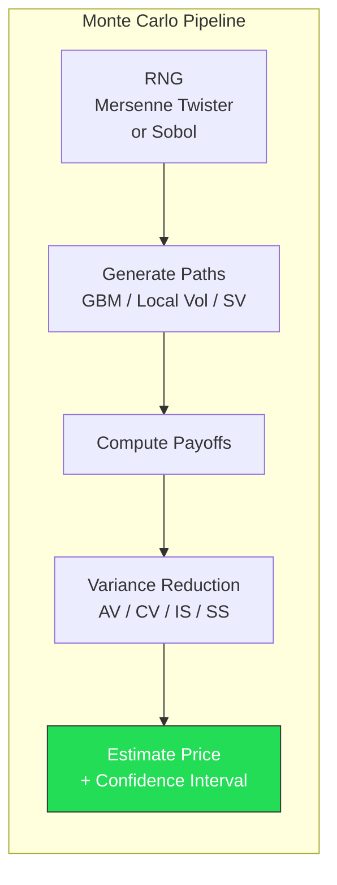
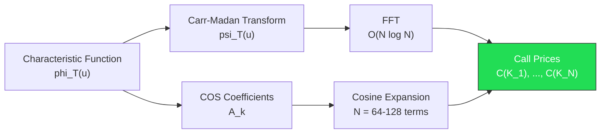
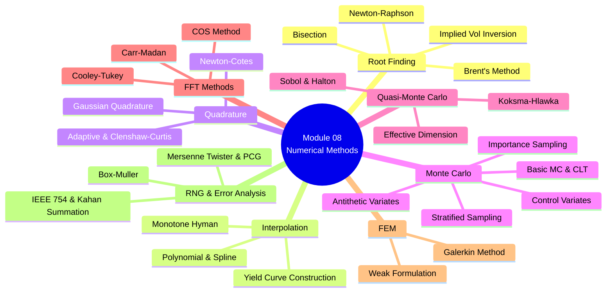

# Module 08: Numerical Methods & Approximation

**Prerequisites:** Module 01 (Linear Algebra), Module 05 (Stochastic Calculus), Module 06 (Optimization)
**Builds toward:** Module 09 (Finite Difference Methods), Module 10 (Monte Carlo Simulation), Module 18 (Volatility Surface Construction), Module 19 (Exotic Derivatives Pricing), Module 20 (Interest Rate Models)

---

## Table of Contents

1. [Root Finding](#1-root-finding)
2. [Interpolation](#2-interpolation)
3. [Numerical Integration (Quadrature)](#3-numerical-integration-quadrature)
4. [Monte Carlo Methods](#4-monte-carlo-methods)
5. [Quasi-Monte Carlo](#5-quasi-monte-carlo)
6. [Fast Fourier Transform](#6-fast-fourier-transform)
7. [Finite Element Methods](#7-finite-element-methods)
8. [Random Number Generation](#8-random-number-generation)
9. [Error Analysis](#9-error-analysis)
10. [Implementation: Python](#10-implementation-python)
11. [Implementation: C++](#11-implementation-c)
12. [Exercises](#12-exercises)

---

## 1. Root Finding

Nearly every pricing and calibration problem in quantitative finance reduces to solving $f(x) = 0$ for some nonlinear function $f$. The canonical example is **implied volatility inversion**: given a market price $C_{\text{mkt}}$, find $\sigma$ such that $\text{BS}(\sigma) - C_{\text{mkt}} = 0$, where $\text{BS}(\sigma)$ is the Black-Scholes formula evaluated at volatility $\sigma$.

### 1.1 Bisection Method

The bisection method exploits the **intermediate value theorem**: if $f$ is continuous on $[a,b]$ and $f(a) \cdot f(b) < 0$, then there exists $x^* \in (a,b)$ with $f(x^*) = 0$.

**Algorithm.** Given a bracketing interval $[a_0, b_0]$:

$$c_n = \frac{a_n + b_n}{2}, \qquad [a_{n+1}, b_{n+1}] = \begin{cases} [a_n, c_n] & \text{if } f(a_n) \cdot f(c_n) < 0 \\ [c_n, b_n] & \text{otherwise} \end{cases}$$

**Convergence.** After $n$ iterations, the error satisfies:

$$|x^* - c_n| \leq \frac{b_0 - a_0}{2^{n+1}}$$

This gives **linear convergence** with rate $1/2$. To achieve tolerance $\epsilon$, one needs:

$$n \geq \frac{\log(b_0 - a_0) - \log(2\epsilon)}{\log 2}$$

iterations. For $\epsilon = 10^{-12}$ and an initial bracket of width 1, this requires roughly 40 iterations. The bisection method is unconditionally stable but slow.

### 1.2 Newton-Raphson Method

Newton-Raphson linearizes $f$ about the current iterate $x_n$:

$$f(x) \approx f(x_n) + f'(x_n)(x - x_n) = 0 \quad \Longrightarrow \quad x_{n+1} = x_n - \frac{f(x_n)}{f'(x_n)}$$

**Theorem (Quadratic Convergence).** If $f \in C^2$, $f(x^*) = 0$, $f'(x^*) \neq 0$, and $x_0$ is sufficiently close to $x^*$, then:

$$|x_{n+1} - x^*| \leq \frac{M}{2m} |x_n - x^*|^2$$

where $M = \sup |f''|$ near $x^*$ and $m = \inf |f'|$ near $x^*$.

*Proof.* Taylor-expand $f(x^*)$ about $x_n$:

$$0 = f(x^*) = f(x_n) + f'(x_n)(x^* - x_n) + \frac{1}{2}f''(\xi_n)(x^* - x_n)^2$$

for some $\xi_n$ between $x_n$ and $x^*$. Dividing by $f'(x_n)$ and rearranging:

$$x^* - x_n + \frac{f(x_n)}{f'(x_n)} = -\frac{f''(\xi_n)}{2f'(x_n)}(x^* - x_n)^2$$

The left side is $x^* - x_{n+1}$ by the Newton update, so:

$$|x_{n+1} - x^*| = \frac{|f''(\xi_n)|}{2|f'(x_n)|} |x_n - x^*|^2 \leq \frac{M}{2m}|x_n - x^*|^2 \qquad \square$$

**Pitfalls.** Newton-Raphson can fail when: (i) $f'(x_n) \approx 0$ (near-zero derivative causes wild steps); (ii) the iterate escapes the domain (e.g., $\sigma < 0$ for implied vol); (iii) oscillation or divergence from a poor starting point.

### 1.3 Brent's Method

Brent's method combines the guaranteed convergence of bisection with the speed of **inverse quadratic interpolation** (IQI). At each step, given three points $(a, f(a)), (b, f(b)), (c, f(c))$, IQI fits a quadratic through these points in the $y$-variable:

$$x = \frac{f(b)f(c)}{(f(a)-f(b))(f(a)-f(c))}a + \frac{f(a)f(c)}{(f(b)-f(a))(f(b)-f(c))}b + \frac{f(a)f(b)}{(f(c)-f(a))(f(c)-f(b))}c$$

Brent's algorithm accepts the IQI step only if it falls within the current bracket and makes sufficient progress; otherwise it falls back to bisection. This yields **superlinear convergence** (order $\approx 1.618$) while maintaining the safety of bisection.

### 1.4 Application: Implied Volatility from Black-Scholes

For a European call with spot $S$, strike $K$, risk-free rate $r$, dividend yield $q$, and time to expiry $T$:

$$C_{\text{BS}}(\sigma) = Se^{-qT}\Phi(d_1) - Ke^{-rT}\Phi(d_2)$$

where $d_{1,2} = \frac{\ln(S/K) + (r - q \pm \sigma^2/2)T}{\sigma\sqrt{T}}$.

The **vega** (derivative with respect to $\sigma$) has a closed form:

$$\mathcal{V} = \frac{\partial C_{\text{BS}}}{\partial \sigma} = Se^{-qT}\sqrt{T}\,\phi(d_1) > 0$$

where $\phi$ is the standard normal density. Since vega is always positive, $C_{\text{BS}}$ is strictly increasing in $\sigma$, guaranteeing a unique root. Newton's update becomes:

$$\sigma_{n+1} = \sigma_n - \frac{C_{\text{BS}}(\sigma_n) - C_{\text{mkt}}}{\mathcal{V}(\sigma_n)}$$

A robust implementation uses Newton's method with a bisection fallback (Brent) and clamps iterates to $[\sigma_{\min}, \sigma_{\max}]$.

### 1.5 Rational Approximation: Jackel's "Let's Be Rational"

For high-throughput applications (calibrating thousands of strikes per second), even Newton iteration is too slow. Jackel (2015) developed a **rational approximation** that delivers machine-precision implied volatility in at most two Householder iterations from an initial guess constructed via carefully fitted rational functions. The key insight is to work with **normalised** Black-Scholes prices, transforming the problem to a canonical form where a single rational approximation covers the entire domain. This is the industry standard for implied vol computation.

```mermaid
flowchart TD
    A[Market Price C_mkt] --> B{Initial Bracket?}
    B -->|Yes| C[Bisection: safe but slow<br/>O&#40;log&#40;1/epsilon&#41;&#41; iterations]
    B -->|No| D[Rational Approx<br/>Jackel initial guess]
    C --> E[Newton-Raphson<br/>Quadratic convergence]
    D --> E
    E --> F{Converged?}
    F -->|Yes| G[Implied Vol sigma*]
    F -->|No, diverging| C
    style G fill:#2d5,stroke:#333,color:#fff
```



---

## 2. Interpolation

Interpolation constructs a continuous function passing through discrete data points. In quantitative finance, the primary applications are **yield curve construction** (interpolating between observed bond maturities) and **volatility surface construction** (interpolating between quoted strikes and tenors).

### 2.1 Polynomial Interpolation

**Lagrange form.** Given $n+1$ distinct nodes $(x_0, y_0), \ldots, (x_n, y_n)$, the unique polynomial $p \in \mathbb{P}_n$ passing through all points is:

$$p(x) = \sum_{i=0}^{n} y_i \prod_{\substack{j=0 \\ j \neq i}}^{n} \frac{x - x_j}{x_i - x_j} = \sum_{i=0}^{n} y_i \, L_i(x)$$

where $L_i(x)$ is the $i$-th Lagrange basis polynomial satisfying $L_i(x_j) = \delta_{ij}$.

**Newton's divided differences.** An equivalent representation uses the recursive definition:

$$f[x_i] = y_i, \qquad f[x_i, \ldots, x_{i+k}] = \frac{f[x_{i+1}, \ldots, x_{i+k}] - f[x_i, \ldots, x_{i+k-1}]}{x_{i+k} - x_i}$$

The interpolating polynomial is then:

$$p(x) = f[x_0] + f[x_0, x_1](x - x_0) + f[x_0, x_1, x_2](x - x_0)(x - x_1) + \cdots$$

This form is computationally efficient and allows incremental addition of new data points.

### 2.2 Runge Phenomenon

**Theorem (Runge).** High-degree polynomial interpolation on equally spaced nodes can diverge. For the Runge function $f(x) = 1/(1 + 25x^2)$ on $[-1, 1]$, the maximum interpolation error grows without bound as $n \to \infty$ with uniform nodes.

The error for polynomial interpolation of degree $n$ is:

$$f(x) - p_n(x) = \frac{f^{(n+1)}(\xi)}{(n+1)!} \prod_{i=0}^{n}(x - x_i)$$

With equidistant nodes, the node polynomial $\omega(x) = \prod(x - x_i)$ grows exponentially near the endpoints. **Chebyshev nodes** $x_k = \cos\bigl(\frac{2k+1}{2(n+1)}\pi\bigr)$ minimize $\|\omega\|_\infty$ and cure the Runge phenomenon, but in practice finance uses **piecewise** methods.

### 2.3 Cubic Spline Interpolation

A **cubic spline** $S$ on knots $x_0 < x_1 < \cdots < x_n$ is a function that is a cubic polynomial on each subinterval $[x_i, x_{i+1}]$ and satisfies $S \in C^2[x_0, x_n]$.

On each interval, write:

$$S_i(x) = a_i + b_i(x - x_i) + c_i(x - x_i)^2 + d_i(x - x_i)^3, \qquad x \in [x_i, x_{i+1}]$$

Imposing: (i) interpolation $S_i(x_i) = y_i$, (ii) continuity of $S$, $S'$, and $S''$ at interior knots yields $4n$ equations in $4n$ unknowns. Two additional boundary conditions are needed:

- **Natural spline:** $S''(x_0) = S''(x_n) = 0$
- **Clamped spline:** $S'(x_0) = f'(x_0)$, $S'(x_n) = f'(x_n)$

After substitution, the second derivatives $M_i = S''(x_i)$ satisfy a **tridiagonal system**:

$$h_{i-1} M_{i-1} + 2(h_{i-1} + h_i)M_i + h_i M_{i+1} = 6\left(\frac{y_{i+1} - y_i}{h_i} - \frac{y_i - y_{i-1}}{h_{i-1}}\right)$$

where $h_i = x_{i+1} - x_i$. This tridiagonal system can be solved in $O(n)$ operations via the Thomas algorithm (LU decomposition for tridiagonal matrices).

### 2.4 Monotone Interpolation: The Hyman Filter

For yield curve construction, **monotonicity preservation** is critical: if observed rates are increasing between two tenors, the interpolated curve must not oscillate. Standard cubic splines do not guarantee this.

The **Hyman filter** (1983) modifies the spline derivatives at each node to ensure monotonicity. If $\Delta_i = (y_{i+1} - y_i)/h_i$, the Hyman constraint requires:

$$\text{sign}(m_i) = \text{sign}(\Delta_{i-1}) = \text{sign}(\Delta_i), \qquad |m_i| \leq 3 \min(|\Delta_{i-1}|, |\Delta_i|)$$

where $m_i = S'(x_i)$. Slopes violating this constraint are projected to the nearest admissible value.

### 2.5 Application: Yield Curve and Volatility Surface

| Application | Interpolation Method | Key Requirement |
|---|---|---|
| Yield curve (discount factors) | Monotone cubic spline on $\log(P(t))$ | Positive forward rates |
| Volatility smile (fixed tenor) | Cubic spline on $\sigma(K)$ | No arbitrage in call prices |
| Variance surface | Linear in total variance $w = \sigma^2 T$ | Calendar spread arbitrage-free |
| Forward curve (commodities) | Piecewise linear or cubic Hermite | Seasonal shape preservation |

---

## 3. Numerical Integration (Quadrature)

Many option pricing formulas involve integrals with no closed form. Numerical quadrature approximates $I = \int_a^b f(x)\, dx \approx \sum_{i=0}^n w_i f(x_i)$ using carefully chosen **nodes** $x_i$ and **weights** $w_i$.

### 3.1 Newton-Cotes Rules

Newton-Cotes rules use **equally spaced** nodes on $[a,b]$.

**Trapezoidal rule.** Approximate $f$ by a piecewise linear function:

$$\int_a^b f(x)\,dx \approx \frac{h}{2}\bigl[f(a) + 2f(x_1) + 2f(x_2) + \cdots + 2f(x_{n-1}) + f(b)\bigr]$$

where $h = (b-a)/n$. The error satisfies:

$$E_{\text{trap}} = -\frac{(b-a)h^2}{12}f''(\xi) = O(h^2)$$

**Simpson's rule.** Approximate $f$ by piecewise quadratics on pairs of subintervals ($n$ even):

$$\int_a^b f(x)\,dx \approx \frac{h}{3}\bigl[f(a) + 4f(x_1) + 2f(x_2) + 4f(x_3) + \cdots + 4f(x_{n-1}) + f(b)\bigr]$$

The error is:

$$E_{\text{Simp}} = -\frac{(b-a)h^4}{180}f^{(4)}(\xi) = O(h^4)$$

Simpson's rule is exact for polynomials up to degree 3, achieving one degree higher than expected from the quadratic interpolation.

### 3.2 Gaussian Quadrature

Rather than fixing equally spaced nodes, Gaussian quadrature chooses both nodes $x_i$ and weights $w_i$ to maximize the polynomial degree of exactness.

**Gauss-Legendre.** On $[-1, 1]$, the $n$-point Gauss-Legendre rule is exact for all polynomials of degree $\leq 2n - 1$. The nodes are the roots of the Legendre polynomial $P_n(x)$, and the weights are:

$$w_i = \frac{2}{(1 - x_i^2)[P_n'(x_i)]^2}$$

**Derivation.** An $n$-point rule with $2n$ free parameters (nodes and weights) can satisfy $2n$ conditions. Requiring exactness for $1, x, x^2, \ldots, x^{2n-1}$ produces the system:

$$\sum_{i=1}^n w_i x_i^k = \int_{-1}^{1} x^k \, dx = \frac{1 + (-1)^k}{k+1}, \qquad k = 0, 1, \ldots, 2n-1$$

The error for Gauss-Legendre is:

$$E_n = \frac{2^{2n+1}(n!)^4}{(2n+1)[(2n)!]^3} f^{(2n)}(\xi)$$

which decays **exponentially** fast for analytic integrands.

### 3.3 Gauss-Hermite Quadrature

For integrals against the Gaussian weight $e^{-x^2}$:

$$\int_{-\infty}^{\infty} f(x) e^{-x^2}\, dx \approx \sum_{i=1}^{n} w_i f(x_i)$$

where $x_i$ are roots of the $n$-th Hermite polynomial $H_n(x)$ and $w_i = \frac{2^{n-1} n! \sqrt{\pi}}{n^2 [H_{n-1}(x_i)]^2}$.

**Application to option pricing.** The risk-neutral expected payoff under a log-normal model is:

$$C = e^{-rT} \int_{-\infty}^{\infty} \max(Se^{(r - \sigma^2/2)T + \sigma\sqrt{T}z} - K, 0) \frac{e^{-z^2/2}}{\sqrt{2\pi}} \, dz$$

Substituting $x = z/\sqrt{2}$ transforms this to a Gauss-Hermite integral. With only 20-30 nodes, one achieves 12+ digits of accuracy for European options.

### 3.4 Adaptive Quadrature

Adaptive quadrature recursively subdivides intervals where the integrand is poorly approximated. The algorithm compares a coarse estimate $Q_1$ (e.g., Simpson on $[a,b]$) with a fine estimate $Q_2$ (Simpson on $[a,m] \cup [m,b]$). If $|Q_1 - Q_2| < \epsilon$, accept $Q_2$; otherwise recurse on each half with tolerance $\epsilon/2$.

### 3.5 Clenshaw-Curtis Quadrature

Clenshaw-Curtis uses **Chebyshev nodes** $x_k = \cos(k\pi/n)$ and expresses the integrand as a Chebyshev series $f(x) \approx \sum_{j=0}^n c_j T_j(x)$. The integral becomes:

$$\int_{-1}^{1} f(x)\, dx \approx \sum_{j=0}^{n} c_j \int_{-1}^{1} T_j(x)\, dx = \sum_{\substack{j=0 \\ j \text{ even}}}^{n} \frac{2c_j}{1 - j^2}$$

The coefficients $c_j$ are computed via the **discrete cosine transform** (DCT) in $O(n \log n)$ operations. For analytic integrands, Clenshaw-Curtis matches Gauss-Legendre in convergence rate.

### 3.6 Application: Option Pricing Integrals

| Method | Nodes | Error Decay | Best For |
|---|---|---|---|
| Trapezoidal | $n$ | $O(n^{-2})$ | Periodic/smooth integrands |
| Simpson | $n$ | $O(n^{-4})$ | Smooth integrands |
| Gauss-Legendre | $n$ | $O(c^{-2n})$ exponential | Analytic integrands on bounded domain |
| Gauss-Hermite | $n$ | $O(c^{-2n})$ exponential | Integrals against Gaussian density |
| Clenshaw-Curtis | $n$ | $O(c^{-n})$ exponential | General smooth functions, FFT-based |
| Adaptive | variable | User-specified $\epsilon$ | Integrands with local features |

---

## 4. Monte Carlo Methods

Monte Carlo (MC) simulation is the workhorse for pricing path-dependent and high-dimensional derivatives. Its key advantage is that the convergence rate is **independent of dimension**.

### 4.1 Basic Monte Carlo

To estimate $\mu = \mathbb{E}[g(X)]$, generate $N$ i.i.d. samples $X_1, \ldots, X_N$ and compute:

$$\hat{\mu}_N = \frac{1}{N}\sum_{i=1}^N g(X_i)$$

By the **strong law of large numbers**, $\hat{\mu}_N \xrightarrow{\text{a.s.}} \mu$ as $N \to \infty$.

**Convergence rate.** By the **central limit theorem**:

$$\sqrt{N}(\hat{\mu}_N - \mu) \xrightarrow{d} \mathcal{N}(0, \sigma^2), \qquad \sigma^2 = \text{Var}[g(X)]$$

The standard error is $\text{SE} = \sigma / \sqrt{N}$, giving a convergence rate of $O(1/\sqrt{N})$. A 95% confidence interval is:

$$\hat{\mu}_N \pm 1.96 \frac{\hat{\sigma}}{\sqrt{N}}$$

where $\hat{\sigma}^2 = \frac{1}{N-1}\sum_{i=1}^N (g(X_i) - \hat{\mu}_N)^2$.

To halve the error, one must **quadruple** the number of samples. This $O(1/\sqrt{N})$ rate is dimension-independent but can be slow in absolute terms.

### 4.2 Variance Reduction Techniques

Since the error is proportional to $\sigma$, reducing the variance $\sigma^2$ of the estimator directly improves efficiency without increasing $N$.

#### 4.2.1 Antithetic Variates

**Idea.** For each standard normal sample $Z$, also evaluate the payoff at $-Z$. Define:

$$\hat{\mu}_{\text{AV}} = \frac{1}{2N}\sum_{i=1}^N \bigl[g(Z_i) + g(-Z_i)\bigr]$$

**Variance analysis.** For a single pair:

$$\text{Var}\!\left[\frac{g(Z) + g(-Z)}{2}\right] = \frac{1}{4}\bigl[\text{Var}[g(Z)] + \text{Var}[g(-Z)] + 2\text{Cov}[g(Z), g(-Z)]\bigr]$$

Since $Z \sim \mathcal{N}(0,1)$ implies $-Z \sim \mathcal{N}(0,1)$, we have $\text{Var}[g(Z)] = \text{Var}[g(-Z)] = \sigma^2$, so:

$$\text{Var}[\hat{\mu}_{\text{AV}}] = \frac{\sigma^2}{2N}\bigl(1 + \rho\bigr)$$

where $\rho = \text{Corr}[g(Z), g(-Z)]$.

**Theorem.** If $g$ is a **monotone function** of $Z$ (or more generally, if $g \circ \Phi^{-1}$ is monotone where $\Phi$ is the normal CDF), then $\rho < 0$, and antithetic variates reduce variance. For a European call, where the payoff is monotone increasing in the terminal stock price (which is monotone increasing in $Z$), this always helps.

#### 4.2.2 Control Variates

**Idea.** Let $C$ be a **control variate** whose expectation $\mathbb{E}[C]$ is known analytically. Form:

$$\hat{\mu}_{\text{CV}} = \hat{\mu}_N + \beta\bigl(\bar{C}_N - \mathbb{E}[C]\bigr)$$

where $\bar{C}_N = \frac{1}{N}\sum_{i=1}^N C_i$. This estimator is unbiased for any $\beta$.

**Optimal coefficient.** The variance is:

$$\text{Var}[\hat{\mu}_{\text{CV}}] = \frac{1}{N}\bigl[\text{Var}[g] + \beta^2 \text{Var}[C] + 2\beta\,\text{Cov}[g, C]\bigr]$$

Minimizing over $\beta$:

$$\beta^* = -\frac{\text{Cov}[g, C]}{\text{Var}[C]}$$

Substituting back:

$$\text{Var}[\hat{\mu}_{\text{CV}}] = \frac{\sigma^2}{N}(1 - \rho_{gC}^2)$$

where $\rho_{gC}$ is the correlation between $g$ and $C$. If $|\rho_{gC}| = 0.95$, the variance is reduced by a factor of $1 - 0.9025 \approx 10$.

**Typical control variates in finance:**

| Derivative Being Priced | Control Variate $C$ | Known $\mathbb{E}[C]$ |
|---|---|---|
| Asian call (arithmetic avg) | Asian call (geometric avg) | Closed form |
| Barrier option | Vanilla European | Black-Scholes |
| Basket option | Single-asset option | Black-Scholes |
| Path-dependent under local vol | Same payoff under GBM | Analytic or semi-analytic |

#### 4.2.3 Importance Sampling

**Idea.** Change the sampling distribution to concentrate samples in regions where the integrand is large. Let $f$ and $g$ be the original and proposal densities:

$$\mu = \mathbb{E}_f[h(X)] = \int h(x) f(x)\, dx = \int h(x) \frac{f(x)}{g(x)} g(x)\, dx = \mathbb{E}_g\!\left[h(X) \frac{f(X)}{g(X)}\right]$$

The ratio $w(x) = f(x)/g(x)$ is the **likelihood ratio** (Radon-Nikodym derivative $d\mathbb{P}/d\mathbb{Q}$). The IS estimator is:

$$\hat{\mu}_{\text{IS}} = \frac{1}{N}\sum_{i=1}^N h(X_i) w(X_i), \qquad X_i \sim g$$

**Optimal IS density.** The zero-variance estimator uses:

$$g^*(x) = \frac{|h(x)| f(x)}{\int |h(y)| f(y)\, dy}$$

In practice, $g^*$ requires the unknown integral, but it guides the design of good proposal distributions. For **rare event simulation** (e.g., pricing deep out-of-the-money options or estimating portfolio loss tail probabilities), importance sampling can reduce variance by orders of magnitude.

**Connection to Radon-Nikodym.** Under the risk-neutral measure $\mathbb{Q}$:

$$C_0 = e^{-rT}\mathbb{E}^{\mathbb{Q}}[\text{payoff}] = e^{-rT}\mathbb{E}^{\mathbb{P}}\!\left[\text{payoff} \cdot \frac{d\mathbb{Q}}{d\mathbb{P}}\right]$$

The measure change from $\mathbb{P}$ to $\mathbb{Q}$ is itself an importance sampling operation with likelihood ratio given by the Girsanov exponential martingale.

#### 4.2.4 Stratified Sampling

**Idea.** Partition the sample space into $K$ strata $\{S_1, \ldots, S_K\}$ with $\mathbb{P}(X \in S_k) = p_k$. Draw $n_k$ samples from each stratum. The stratified estimator is:

$$\hat{\mu}_{\text{SS}} = \sum_{k=1}^K p_k \hat{\mu}_k, \qquad \hat{\mu}_k = \frac{1}{n_k}\sum_{i=1}^{n_k} g(X_{k,i})$$

The variance satisfies:

$$\text{Var}[\hat{\mu}_{\text{SS}}] = \sum_{k=1}^K \frac{p_k^2 \sigma_k^2}{n_k} \leq \frac{\sigma^2}{N}$$

with equality only when $\sigma_k^2 = \sigma^2$ for all $k$. The simplest version partitions the uniform $[0,1]$ into $K$ equal intervals and draws one sample per stratum, feeding the result through $F^{-1}$ (the inverse CDF). This is equivalent to using **Latin hypercube sampling** in one dimension.

### 4.3 Application: Pricing Options via MC

**European call.** Under GBM $S_T = S_0 \exp\bigl((r - \sigma^2/2)T + \sigma\sqrt{T}Z\bigr)$:

$$\hat{C} = e^{-rT} \frac{1}{N}\sum_{i=1}^N \max(S_T^{(i)} - K, 0)$$

**Asian option (arithmetic average).** The average $\bar{S} = \frac{1}{M}\sum_{j=1}^M S_{t_j}$ requires simulating the entire path at $M$ monitoring dates.

**Barrier option (down-and-out call).** An additional check at each time step: if $S_{t_j} \leq B$ for any $j$, the payoff is zero. Discretely monitored barriers require **continuity correction** (Broadie-Glasserman-Kou) to account for the missed barrier crossings between observation dates.

### 4.4 Convergence Comparison

| Method | Variance | Effective Speedup |
|---|---|---|
| Plain MC | $\sigma^2/N$ | 1x |
| Antithetic | $\sigma^2(1+\rho)/(2N)$ | $2/(1+\rho)$ (typically 1.5-3x) |
| Control variate | $\sigma^2(1-\rho^2)/N$ | $1/(1-\rho^2)$ (typically 5-50x) |
| Importance sampling | Problem-dependent | 10-1000x for rare events |
| Stratified | $\leq \sigma^2/N$ | 1-3x typically |



---

## 5. Quasi-Monte Carlo

Quasi-Monte Carlo (QMC) replaces pseudorandom sequences with deterministic **low-discrepancy sequences** that fill the unit cube more uniformly, achieving faster convergence.

### 5.1 Low-Discrepancy Sequences

**Discrepancy** measures the uniformity of a point set $\{x_1, \ldots, x_N\} \subset [0,1)^d$. The **star discrepancy** is:

$$D_N^* = \sup_{J \subseteq [0,1)^d} \left|\frac{\#\{x_i \in J\}}{N} - \text{Vol}(J)\right|$$

where the supremum is over all axis-aligned rectangles $J = [0, u_1) \times \cdots \times [0, u_d)$ anchored at the origin.

**Halton sequence.** Uses the radical inverse function in base $p$: reverse the base-$p$ digits of integer $n$ and place them after the decimal point. The $d$-dimensional Halton sequence uses primes $p_1 = 2, p_2 = 3, p_3 = 5, \ldots$ as bases for each dimension. For $d > 10$, correlations between dimensions degrade performance.

**Sobol sequence.** Based on binary fractions using **direction numbers** and a system of primitive polynomials over $\text{GF}(2)$. Sobol sequences are specifically designed for high-dimensional integration and are the standard in finance.

### 5.2 Koksma-Hlawka Inequality

**Theorem (Koksma-Hlawka).** For $f$ of bounded variation on $[0,1]^d$ in the sense of Hardy and Krause:

$$\left|\frac{1}{N}\sum_{i=1}^{N} f(x_i) - \int_{[0,1]^d} f(x)\, dx\right| \leq D_N^*(x_1, \ldots, x_N) \cdot V_{\text{HK}}(f)$$

where $V_{\text{HK}}(f)$ is the variation of $f$ in the sense of Hardy and Krause.

For Sobol and Halton sequences, $D_N^* = O\bigl(\frac{(\log N)^d}{N}\bigr)$, yielding an error bound of:

$$\text{Error}_{\text{QMC}} = O\!\left(\frac{(\log N)^d}{N}\right)$$

For moderate $d$ and practical $N$, this is vastly better than the MC rate $O(1/\sqrt{N})$.

### 5.3 Effective Dimension

Why does QMC work well for $d = 100$ or even $d = 365$ (daily monitoring)? The answer is **effective dimension**. A function has **effective dimension** $d_{\text{eff}} \ll d$ in the **superposition sense** if most of its variance is captured by low-order ANOVA components:

$$f(x) = f_0 + \sum_{i=1}^d f_i(x_i) + \sum_{i<j} f_{ij}(x_i, x_j) + \cdots$$

Financial payoffs typically depend heavily on a few key factors (e.g., terminal value, running average), so their effective dimension is low. The **Brownian bridge** construction reorders dimensions so that the most important ones come first, where Sobol sequences have the best uniformity properties.

### 5.4 Sobol Sequence Construction

The Sobol sequence in dimension $j$ is generated by:

1. Choose a **primitive polynomial** $p_j(x)$ over $\text{GF}(2)$ of degree $s_j$.
2. Select **direction numbers** $m_1, m_2, \ldots, m_{s_j}$ satisfying the recurrence induced by $p_j$.
3. Compute $v_i = m_i / 2^i$ (the $i$-th direction number as a fraction).
4. Generate points via **Gray code**: $x_n = x_{n-1} \oplus v_{c(n)}$ where $c(n)$ is the rightmost zero bit of $n$ and $\oplus$ is bitwise XOR.

The Gray code generation is crucial: each new point differs from the previous one by a single XOR operation, making generation $O(1)$ per point.

### 5.5 Scrambled QMC

Pure QMC sequences are deterministic, making error estimation impossible. **Owen's scrambling** applies random permutations to the digits of each coordinate, preserving the low-discrepancy property while enabling:

- **Independent replicates** for confidence interval construction
- **Improved convergence**: scrambled Sobol achieves $O(N^{-3/2+\epsilon})$ for smooth integrands

```mermaid
graph TD
    A[Integration Problem<br/>d dimensions] --> B{d small<br/>&#60; 5?}
    B -->|Yes| C[Gaussian Quadrature<br/>Exponential convergence]
    B -->|No| D{Smooth<br/>integrand?}
    D -->|Yes| E[Quasi-Monte Carlo<br/>Sobol + Brownian Bridge<br/>O&#40;1/N &#183; log^d N&#41;]
    D -->|No / Discontinuous| F[Monte Carlo<br/>with Variance Reduction<br/>O&#40;1/sqrt&#40;N&#41;&#41;]
    E --> G[Scrambled QMC<br/>for error estimates]
    style C fill:#2d5,stroke:#333,color:#fff
    style G fill:#2d5,stroke:#333,color:#fff
    style F fill:#2d5,stroke:#333,color:#fff
```



---

## 6. Fast Fourier Transform

The FFT enables $O(n \log n)$ option pricing across an entire grid of strikes simultaneously, exploiting the analytic **characteristic function** of the log-price process.

### 6.1 Discrete Fourier Transform

The DFT of a sequence $\{x_0, x_1, \ldots, x_{N-1}\}$ is:

$$X_k = \sum_{j=0}^{N-1} x_j \, e^{-2\pi i jk/N}, \qquad k = 0, 1, \ldots, N-1$$

In matrix form, $\mathbf{X} = \mathbf{F} \mathbf{x}$ where $F_{jk} = \omega^{jk}$ with $\omega = e^{-2\pi i/N}$. The matrix $\mathbf{F}$ is unitary (up to scaling): $\mathbf{F}^{-1} = \frac{1}{N}\mathbf{F}^*$.

Direct computation requires $O(N^2)$ operations. The FFT reduces this to $O(N \log N)$.

### 6.2 Cooley-Tukey Algorithm

**Derivation.** Assume $N = 2^m$. Split the sum into even and odd indices:

$$X_k = \sum_{j=0}^{N/2-1} x_{2j}\, \omega^{2jk} + \sum_{j=0}^{N/2-1} x_{2j+1}\, \omega^{(2j+1)k}$$

Let $\omega_2 = \omega^2 = e^{-2\pi i/(N/2)}$. Then:

$$X_k = \underbrace{\sum_{j=0}^{N/2-1} x_{2j}\, \omega_2^{jk}}_{E_k} + \omega^k \underbrace{\sum_{j=0}^{N/2-1} x_{2j+1}\, \omega_2^{jk}}_{O_k}$$

Both $E_k$ and $O_k$ are DFTs of length $N/2$. Using $\omega^{k+N/2} = -\omega^k$, the **butterfly operation** gives:

$$X_k = E_k + \omega^k O_k, \qquad X_{k+N/2} = E_k - \omega^k O_k$$

**Complexity.** Let $T(N)$ denote the operation count. Then $T(N) = 2T(N/2) + O(N)$, which solves to $T(N) = O(N \log N)$.

### 6.3 Carr-Madan Formula

Carr and Madan (1999) showed that European call prices for all strikes can be computed via a single FFT evaluation.

**Setup.** Let $s_T = \ln S_T$ be the log-price at maturity. The call price as a function of $\log$-strike $k = \ln K$ is:

$$C_T(k) = e^{-rT}\int_{k}^{\infty} (e^{s_T} - e^k) q(s_T)\, ds_T$$

where $q$ is the risk-neutral density of $s_T$. This integral is not square-integrable in $k$, so Carr-Madan introduce the **dampened** call:

$$c_T(k) = e^{\alpha k} C_T(k), \qquad \alpha > 0$$

The Fourier transform of $c_T(k)$ is:

$$\psi_T(u) = \int_{-\infty}^{\infty} e^{iuk} c_T(k)\, dk = \frac{e^{-rT}\phi_T(u - (\alpha+1)i)}{\alpha^2 + \alpha - u^2 + i(2\alpha+1)u}$$

where $\phi_T(u) = \mathbb{E}^{\mathbb{Q}}[e^{iu s_T}]$ is the **characteristic function** of the log-price under $\mathbb{Q}$.

**Inversion.** The call price is recovered via inverse Fourier transform:

$$C_T(k) = \frac{e^{-\alpha k}}{\pi} \int_0^{\infty} e^{-iuk} \psi_T(u)\, du$$

**Discretization.** Set $u_j = j\Delta u$ for $j = 0, \ldots, N-1$ and $k_m = -b + m\Delta k$ for $m = 0, \ldots, N-1$, with $\Delta u \cdot \Delta k = 2\pi/N$. Applying the trapezoidal rule:

$$C_T(k_m) \approx \frac{e^{-\alpha k_m}}{\pi} \sum_{j=0}^{N-1} e^{-iu_j k_m} \psi_T(u_j) \Delta u \cdot w_j$$

where $w_j$ are Simpson weights. The sum is exactly a DFT, computable via FFT in $O(N \log N)$. A single FFT call with $N = 4096$ prices options at 4096 strikes simultaneously.

### 6.4 Fractional FFT

The standard FFT constrains $\Delta u \cdot \Delta k = 2\pi/N$, which may not align with desired strike spacings. The **fractional FFT** (Bailey-Swarztrauber) generalizes to:

$$X_m = \sum_{j=0}^{N-1} x_j \, e^{-2\pi i jm\beta/N}$$

for arbitrary $\beta \in \mathbb{R}$, via the Bluestein chirp-z transform, at the cost of $O(N \log N)$ operations with a larger constant.

### 6.5 COS Method (Fang-Oosterlee)

The COS method (2008) is an alternative to Carr-Madan that often converges faster. It expands the density $f$ in a cosine series on a truncated domain $[a, b]$:

$$f(x) \approx \sum_{k=0}^{N-1} {}' A_k \cos\!\left(k\pi \frac{x - a}{b - a}\right)$$

where the prime denotes that the first term is halved, and:

$$A_k = \frac{2}{b-a} \text{Re}\!\left[\phi\!\left(\frac{k\pi}{b-a}\right) e^{-ika\pi/(b-a)}\right]$$

The option price integral is then:

$$C = e^{-rT}(b-a) \sum_{k=0}^{N-1}{}' A_k \cdot V_k$$

where $V_k$ are known integrals of $\cos(k\pi(x-a)/(b-a)) \cdot \text{payoff}(x)$ over $[a,b]$, computable in closed form for standard payoffs. The COS method achieves **exponential convergence** for smooth characteristic functions with only $N = 64$--$128$ terms.



---

## 7. Finite Element Methods

While Module 09 covers **finite difference methods** (FDM) for PDE-based pricing, the **finite element method** (FEM) offers greater geometric flexibility and a rigorous mathematical foundation through the **weak formulation** of PDEs.

### 7.1 Weak Formulation

Consider the Black-Scholes PDE in the log-price variable $x = \ln S$:

$$\frac{\partial V}{\partial t} + \frac{\sigma^2}{2}\frac{\partial^2 V}{\partial x^2} + \left(r - \frac{\sigma^2}{2}\right)\frac{\partial V}{\partial x} - rV = 0$$

Multiply by a **test function** $v(x)$ from a suitable function space $H^1_0(\Omega)$ (the Sobolev space of functions with one square-integrable derivative, vanishing on the boundary) and integrate over the domain $\Omega$:

$$\int_\Omega \frac{\partial V}{\partial t} v\, dx + \frac{\sigma^2}{2}\int_\Omega \frac{\partial V}{\partial x}\frac{\partial v}{\partial x}\, dx + \left(r - \frac{\sigma^2}{2}\right)\int_\Omega \frac{\partial V}{\partial x} v\, dx + r\int_\Omega V v\, dx = 0$$

The second-order term has been integrated by parts, transferring one derivative to the test function (and the boundary term vanishes by the choice of $H^1_0$).

### 7.2 Galerkin Method

The **Galerkin method** approximates $V(x, t) \approx V_h(x, t) = \sum_{j=1}^{M} c_j(t) \varphi_j(x)$ where $\{\varphi_j\}_{j=1}^M$ are **piecewise linear basis functions** (hat functions) on a mesh $\{x_1, \ldots, x_M\}$:

$$\varphi_j(x) = \begin{cases} (x - x_{j-1})/(x_j - x_{j-1}) & x \in [x_{j-1}, x_j] \\ (x_{j+1} - x)/(x_{j+1} - x_j) & x \in [x_j, x_{j+1}] \\ 0 & \text{otherwise} \end{cases}$$

Substituting into the weak form and choosing $v = \varphi_i$ for $i = 1, \ldots, M$ yields the semi-discrete system:

$$\mathbf{M}\dot{\mathbf{c}}(t) + \mathbf{K}\mathbf{c}(t) = \mathbf{0}$$

where:

- **Mass matrix:** $M_{ij} = \int_\Omega \varphi_i \varphi_j\, dx$ (tridiagonal, symmetric positive definite)
- **Stiffness matrix:** $K_{ij} = \frac{\sigma^2}{2}\int_\Omega \varphi_i' \varphi_j'\, dx + (r - \sigma^2/2)\int_\Omega \varphi_i \varphi_j'\, dx + r\int_\Omega \varphi_i \varphi_j\, dx$

Both matrices are **sparse** (tridiagonal for linear elements in 1D), and the system is solved by time-stepping (e.g., Crank-Nicolson).

### 7.3 Multi-Asset Options and the Curse of Dimensionality

For a basket option on $d$ assets, the PDE lives in $d$ spatial dimensions. FEM generalizes naturally to unstructured meshes, but the number of elements grows as $O(n^d)$, making FEM impractical for $d > 3$ or $4$. For higher dimensions, Monte Carlo is preferred.

### 7.4 Comparison: FEM vs FDM

| Feature | FDM | FEM |
|---|---|---|
| Mesh | Structured (rectangular grid) | Unstructured (triangles, tetrahedra) |
| Basis for convergence theory | Taylor expansion | Variational / weak form |
| Handling of irregular domains | Difficult | Natural |
| Implementation complexity | Lower | Higher |
| Standard in 1D PDE pricing | Yes | Less common |
| Advantage in 2D/3D | Limited | Significant |

In practice, most quant libraries use FDM for 1D and 2D problems (see Module 09), reserving FEM for problems with complex geometries or irregular boundaries.

---

## 8. Random Number Generation

Every Monte Carlo and quasi-Monte Carlo simulation depends on the quality and efficiency of its random number generator (RNG).

### 8.1 Pseudorandom Number Generators

**Mersenne Twister (MT19937).** The industry standard for over two decades, MT19937 has:

- Period: $2^{19937} - 1$ (a Mersenne prime, hence the name)
- State: 624 32-bit integers (2496 bytes)
- Equidistribution: 623-dimensionally equidistributed to 32-bit accuracy
- Speed: ~1.5 ns per 32-bit integer on modern hardware

**PCG family.** Permuted Congruential Generators (O'Neill, 2014) offer:

- Smaller state (128 bits), faster generation
- Better statistical properties than MT for small state sizes
- Multiple independent streams via different increments

For most financial applications, MT19937 is sufficient and is the default in NumPy, C++ `<random>`, and MATLAB.

### 8.2 Uniform to Normal: Box-Muller Transform

**Derivation.** Let $U_1, U_2 \sim \text{Uniform}(0,1)$ independently. We seek a transformation to $Z_1, Z_2 \sim \mathcal{N}(0,1)$.

Consider the joint density of two independent standard normals in polar coordinates $(r, \theta)$:

$$f(z_1, z_2) = \frac{1}{2\pi}e^{-(z_1^2 + z_2^2)/2} = \frac{1}{2\pi}e^{-r^2/2}$$

The angle $\theta \sim \text{Uniform}(0, 2\pi)$ and $r^2 \sim \text{Exponential}(1/2)$, i.e., $r^2 = -2\ln U_1$. Therefore:

$$Z_1 = \sqrt{-2\ln U_1}\cos(2\pi U_2), \qquad Z_2 = \sqrt{-2\ln U_1}\sin(2\pi U_2)$$

This is the **Box-Muller transform**. It produces two independent standard normals from two uniforms.

**Ziggurat method.** For higher throughput, the ziggurat algorithm (Marsaglia-Tsang) partitions the normal density into horizontal rectangles of equal area. For most samples (over 98%), a simple comparison determines acceptance; only for samples near the tail or the curve boundary is a rejection test needed. This achieves ~0.5 ns per normal variate.

### 8.3 Inverse CDF Method

The inverse CDF method generates $X = F^{-1}(U)$ where $U \sim \text{Uniform}(0,1)$. For the normal distribution, $F^{-1} = \Phi^{-1}$ is computed via rational approximations (Moro, Beasley-Springer-Moro). This method is essential for **quasi-Monte Carlo**, since QMC sequences are defined on $[0,1)^d$ and must be transformed to the target distribution.

### 8.4 Testing RNGs

| Test Suite | Tests | Notes |
|---|---|---|
| Diehard (Marsaglia) | 15 tests | Historical standard, now outdated |
| TestU01 (L'Ecuyer-Simard) | SmallCrush (10), Crush (96), BigCrush (106) | Current gold standard |
| PractRand | Extensible, long-running | Good for detecting subtle patterns |

MT19937 passes BigCrush. Simple LCGs (linear congruential generators) fail most tests and should never be used for financial simulation.

### 8.5 Reproducibility and Parallelism

For **audit and reproducibility**, every simulation must be exactly reproducible given the same seed. For **parallel simulation**, use:

- **Independent streams:** Initialize each thread with a different seed (risk of overlap for short-period generators).
- **Skip-ahead / leapfrog:** Mathematically partition a single sequence among threads. The Sobol sequence supports this natively via Gray code.
- **Counter-based RNGs** (e.g., Philox, Threefry from the Random123 library): the $n$-th random number is a function of $(n, \text{key})$, allowing embarrassingly parallel generation with no state.

---

## 9. Error Analysis

Numerical methods introduce errors at every stage. Understanding and controlling these errors is essential for reliable pricing and risk computation.

### 9.1 Truncation Error vs Round-Off Error

**Truncation error** arises from approximating an infinite process (Taylor series, integral, limit) by a finite one. Example: the forward difference $f'(x) \approx (f(x+h) - f(x))/h$ has truncation error $O(h)$.

**Round-off error** arises from finite-precision arithmetic. Every floating-point operation introduces relative error of order $\epsilon_{\text{mach}}$.

These two errors often **compete**: decreasing $h$ reduces truncation error but increases round-off error (dividing nearly equal numbers). The optimal $h$ balances the two.

### 9.2 IEEE 754 Floating Point

| Format | Bits | Significand | $\epsilon_{\text{mach}}$ | Range |
|---|---|---|---|---|
| float (single) | 32 | 24 bits (~7 decimal digits) | $\approx 1.19 \times 10^{-7}$ | $\pm 3.4 \times 10^{38}$ |
| double | 64 | 53 bits (~16 decimal digits) | $\approx 2.22 \times 10^{-16}$ | $\pm 1.8 \times 10^{308}$ |

Machine epsilon $\epsilon_{\text{mach}}$ is the smallest $\epsilon > 0$ such that $\text{fl}(1 + \epsilon) > 1$ in the given precision. For any real $x$ in the representable range, $\text{fl}(x) = x(1 + \delta)$ with $|\delta| \leq \epsilon_{\text{mach}}$.

### 9.3 Catastrophic Cancellation

Subtracting nearly equal numbers amplifies relative error. Classic example:

$$f(x) = \frac{1 - \cos x}{x^2} \quad \text{for small } x$$

Direct evaluation at $x = 10^{-8}$ in double precision: $\cos(10^{-8}) \approx 1 - 5 \times 10^{-17}$, but this is below machine epsilon, so $\text{fl}(1 - \cos(10^{-8})) = 0$. The remedy: use the identity $1 - \cos x = 2\sin^2(x/2)$.

**Financial example.** Computing the variance $\text{Var}[X] = \mathbb{E}[X^2] - (\mathbb{E}[X])^2$ suffers catastrophic cancellation when $\text{Var}[X] \ll (\mathbb{E}[X])^2$. This is common for option P&L near the money. Always use the **one-pass Welford algorithm** instead:

$$M_{2,n} = M_{2,n-1} + (x_n - \bar{x}_{n-1})(x_n - \bar{x}_n), \qquad \text{Var} = M_{2,N}/(N-1)$$

### 9.4 Numerical Stability

**Forward error analysis** bounds $|\hat{y} - y|$ where $\hat{y}$ is the computed result and $y$ is the exact result.

**Backward error analysis** (Wilkinson) asks: for what perturbed input $\tilde{x}$ is the computed result $\hat{y}$ the exact answer? An algorithm is **backward stable** if $\hat{y} = f(\tilde{x})$ with $\|\tilde{x} - x\| / \|x\| = O(\epsilon_{\text{mach}})$.

The **condition number** $\kappa(f, x) = \|f'(x)\| \cdot \|x\| / \|f(x)\|$ measures the inherent sensitivity of the problem. Total error satisfies:

$$\frac{|\hat{y} - y|}{|y|} \leq \kappa(f, x) \cdot \epsilon_{\text{backward}}$$

### 9.5 Compensated Summation (Kahan)

Naive summation of $N$ numbers accumulates round-off error of $O(N \epsilon_{\text{mach}})$. Kahan's compensated summation reduces this to $O(\epsilon_{\text{mach}})$:

$$s = 0, \quad c = 0$$
$$\text{for each } x_i: \quad y = x_i - c, \quad t = s + y, \quad c = (t - s) - y, \quad s = t$$

The variable $c$ tracks the running compensation for lost low-order bits. This is critical when summing millions of Monte Carlo payoff samples.

---

## 10. Implementation: Python

### 10.1 Implied Volatility Solver

```python
"""
Implied Volatility Solvers: Newton-Raphson with Brent fallback.
Production-grade implementation for Module 08.
"""

import numpy as np
from scipy.stats import norm
from scipy.optimize import brentq
from typing import Tuple

# ---------------------------------------------------------------------------
# Black-Scholes primitives
# ---------------------------------------------------------------------------

def bs_price_and_vega(
    S: float, K: float, r: float, q: float, T: float, sigma: float,
    is_call: bool = True
) -> Tuple[float, float]:
    """Return (price, vega) for a European option under Black-Scholes."""
    if sigma <= 0 or T <= 0:
        intrinsic = max(S * np.exp(-q * T) - K * np.exp(-r * T), 0.0) if is_call \
                    else max(K * np.exp(-r * T) - S * np.exp(-q * T), 0.0)
        return intrinsic, 0.0

    sqrt_T = np.sqrt(T)
    d1 = (np.log(S / K) + (r - q + 0.5 * sigma**2) * T) / (sigma * sqrt_T)
    d2 = d1 - sigma * sqrt_T

    Nd1 = norm.cdf(d1) if is_call else norm.cdf(-d1)
    Nd2 = norm.cdf(d2) if is_call else norm.cdf(-d2)
    sign = 1.0 if is_call else -1.0

    price = sign * (S * np.exp(-q * T) * Nd1 - K * np.exp(-r * T) * Nd2)
    vega = S * np.exp(-q * T) * sqrt_T * norm.pdf(d1)

    return price, vega

# ---------------------------------------------------------------------------
# Newton-Raphson with Brent fallback
# ---------------------------------------------------------------------------

def implied_vol_newton(
    market_price: float,
    S: float, K: float, r: float, q: float, T: float,
    is_call: bool = True,
    sigma0: float = 0.25,
    tol: float = 1e-12,
    max_iter: int = 50,
    sigma_min: float = 1e-6,
    sigma_max: float = 5.0,
) -> float:
    """
    Compute implied volatility using Newton-Raphson with Brent fallback.
    
    Parameters
    ----------
    market_price : observed option price
    S, K, r, q, T : Black-Scholes parameters
    is_call : True for call, False for put
    sigma0 : initial guess for Newton
    tol : convergence tolerance
    max_iter : maximum Newton iterations
    sigma_min, sigma_max : bounds for Brent fallback
    
    Returns
    -------
    Implied volatility sigma* such that BS(sigma*) = market_price.
    """
    sigma = sigma0

    for i in range(max_iter):
        price, vega = bs_price_and_vega(S, K, r, q, T, sigma, is_call)
        diff = price - market_price

        if abs(diff) < tol:
            return sigma

        if vega < 1e-20:
            # Vega too small — Newton step unreliable, fall back to Brent
            break

        sigma_new = sigma - diff / vega
        # Clamp to valid range
        sigma_new = max(sigma_min, min(sigma_max, sigma_new))

        if abs(sigma_new - sigma) < tol:
            return sigma_new

        sigma = sigma_new

    # Brent fallback
    def objective(sig):
        p, _ = bs_price_and_vega(S, K, r, q, T, sig, is_call)
        return p - market_price

    return brentq(objective, sigma_min, sigma_max, xtol=tol)

# ---------------------------------------------------------------------------
# Vectorized implied vol for a surface
# ---------------------------------------------------------------------------

def implied_vol_surface(
    market_prices: np.ndarray,
    S: float, strikes: np.ndarray, r: float, q: float,
    tenors: np.ndarray, is_call: np.ndarray,
) -> np.ndarray:
    """Compute implied vol surface for a grid of strikes x tenors."""
    n_tenors, n_strikes = market_prices.shape
    iv = np.full_like(market_prices, np.nan)

    for i in range(n_tenors):
        for j in range(n_strikes):
            try:
                iv[i, j] = implied_vol_newton(
                    market_prices[i, j], S, strikes[j], r, q, tenors[i],
                    is_call=is_call[i, j]
                )
            except (ValueError, RuntimeError):
                iv[i, j] = np.nan  # Mark failed inversions
    return iv
```

### 10.2 Monte Carlo with Variance Reduction

```python
"""
Monte Carlo pricing engine with all variance reduction techniques.
"""

import numpy as np
from dataclasses import dataclass
from typing import Optional, Callable

@dataclass
class MCResult:
    """Container for Monte Carlo results."""
    price: float
    std_error: float
    ci_lower: float
    ci_upper: float
    n_paths: int
    method: str

def mc_european(
    S0: float, K: float, r: float, q: float, T: float, sigma: float,
    n_paths: int = 100_000,
    is_call: bool = True,
    method: str = "plain",
    seed: int = 42,
) -> MCResult:
    """
    Price a European option via Monte Carlo.
    
    method: 'plain', 'antithetic', 'control', 'importance', 'stratified'
    """
    rng = np.random.default_rng(seed)
    drift = (r - q - 0.5 * sigma**2) * T
    vol_sqrt_T = sigma * np.sqrt(T)
    discount = np.exp(-r * T)

    def payoff(ST):
        return np.maximum(ST - K, 0.0) if is_call else np.maximum(K - ST, 0.0)

    if method == "plain":
        Z = rng.standard_normal(n_paths)
        ST = S0 * np.exp(drift + vol_sqrt_T * Z)
        payoffs = discount * payoff(ST)
        price = np.mean(payoffs)
        se = np.std(payoffs, ddof=1) / np.sqrt(n_paths)

    elif method == "antithetic":
        n_half = n_paths // 2
        Z = rng.standard_normal(n_half)
        ST_pos = S0 * np.exp(drift + vol_sqrt_T * Z)
        ST_neg = S0 * np.exp(drift + vol_sqrt_T * (-Z))
        payoffs = discount * 0.5 * (payoff(ST_pos) + payoff(ST_neg))
        price = np.mean(payoffs)
        se = np.std(payoffs, ddof=1) / np.sqrt(n_half)

    elif method == "control":
        Z = rng.standard_normal(n_paths)
        ST = S0 * np.exp(drift + vol_sqrt_T * Z)
        Y = discount * payoff(ST)
        # Control variate: discounted terminal stock price
        C = discount * ST
        E_C = S0 * np.exp((r - q) * T) * discount  # = S0 * exp(-q*T) (forward)
        E_C_actual = S0 * np.exp(-q * T)

        # Optimal beta via sample covariance
        cov_YC = np.cov(Y, C, ddof=1)[0, 1]
        var_C = np.var(C, ddof=1)
        beta_star = -cov_YC / var_C

        Y_cv = Y + beta_star * (C - E_C_actual)
        price = np.mean(Y_cv)
        se = np.std(Y_cv, ddof=1) / np.sqrt(n_paths)

    elif method == "importance":
        # Shift the mean of Z to push more paths ITM
        mu_shift = np.log(K / S0 - drift) / vol_sqrt_T if K > S0 else 0.0
        mu_shift = np.clip(mu_shift, -2.0, 2.0)

        Z = rng.standard_normal(n_paths) + mu_shift
        ST = S0 * np.exp(drift + vol_sqrt_T * Z)
        # Likelihood ratio: N(z; 0, 1) / N(z; mu_shift, 1)
        lr = np.exp(-mu_shift * Z + 0.5 * mu_shift**2)
        payoffs = discount * payoff(ST) * lr
        price = np.mean(payoffs)
        se = np.std(payoffs, ddof=1) / np.sqrt(n_paths)

    elif method == "stratified":
        n_strata = min(n_paths, 1000)
        samples_per = n_paths // n_strata
        payoffs = np.empty(n_strata * samples_per)
        for k in range(n_strata):
            U = (k + rng.random(samples_per)) / n_strata
            Z = norm_ppf_vec(U)  # stratified normals
            ST = S0 * np.exp(drift + vol_sqrt_T * Z)
            payoffs[k * samples_per:(k + 1) * samples_per] = discount * payoff(ST)
        price = np.mean(payoffs)
        se = np.std(payoffs, ddof=1) / np.sqrt(len(payoffs))

    else:
        raise ValueError(f"Unknown method: {method}")

    ci_lower = price - 1.96 * se
    ci_upper = price + 1.96 * se

    return MCResult(price, se, ci_lower, ci_upper, n_paths, method)


def norm_ppf_vec(u: np.ndarray) -> np.ndarray:
    """Vectorized inverse normal CDF (Beasley-Springer-Moro)."""
    from scipy.stats import norm
    return norm.ppf(u)
```

### 10.3 Sobol Sequence Generator

```python
"""
Sobol sequence wrapper using scipy.stats.qmc.
"""

from scipy.stats.qmc import Sobol, scale
from scipy.stats import norm
import numpy as np

def sobol_normals(
    n_points: int, n_dims: int, scramble: bool = True, seed: int = 42
) -> np.ndarray:
    """
    Generate quasi-random standard normal samples via Sobol + inverse CDF.
    
    Parameters
    ----------
    n_points : number of QMC points (rounded up to next power of 2)
    n_dims : dimensionality
    scramble : whether to apply Owen scrambling
    seed : random seed for scrambling
    
    Returns
    -------
    Array of shape (n_points, n_dims) of standard normal variates.
    """
    sampler = Sobol(d=n_dims, scramble=scramble, seed=seed)

    # Sobol generates points in [0, 1)^d; ensure we get a power-of-2 count
    m = int(np.ceil(np.log2(n_points)))
    points = sampler.random_base2(m)  # shape (2^m, n_dims)

    # Clip to avoid infinities at 0 and 1
    eps = 1e-10
    points = np.clip(points, eps, 1.0 - eps)

    # Transform to standard normal via inverse CDF
    return norm.ppf(points)[:n_points]


def qmc_european_call(
    S0: float, K: float, r: float, q: float, T: float, sigma: float,
    n_paths: int = 2**14, seed: int = 42
) -> float:
    """Price a European call using QMC (Sobol + Brownian bridge)."""
    Z = sobol_normals(n_paths, n_dims=1, scramble=True, seed=seed).flatten()
    drift = (r - q - 0.5 * sigma**2) * T
    ST = S0 * np.exp(drift + sigma * np.sqrt(T) * Z)
    payoffs = np.maximum(ST - K, 0.0)
    return np.exp(-r * T) * np.mean(payoffs)
```

### 10.4 Carr-Madan FFT Pricer

```python
"""
Carr-Madan FFT option pricer using the characteristic function.
Supports any model with a known characteristic function.
"""

import numpy as np
from scipy.fft import fft

def bs_char_func(u: np.ndarray, S0: float, r: float, q: float,
                 T: float, sigma: float) -> np.ndarray:
    """Characteristic function of log(S_T) under Black-Scholes."""
    mu = np.log(S0) + (r - q - 0.5 * sigma**2) * T
    return np.exp(1j * u * mu - 0.5 * sigma**2 * T * u**2)

def heston_char_func(u: np.ndarray, S0: float, r: float, q: float, T: float,
                     v0: float, kappa: float, theta: float, xi: float,
                     rho: float) -> np.ndarray:
    """Characteristic function of log(S_T) under the Heston model."""
    x0 = np.log(S0)
    d = np.sqrt((rho * xi * 1j * u - kappa)**2 + xi**2 * (1j * u + u**2))
    g = (kappa - rho * xi * 1j * u - d) / (kappa - rho * xi * 1j * u + d)

    C = (r - q) * 1j * u * T + (kappa * theta / xi**2) * (
        (kappa - rho * xi * 1j * u - d) * T
        - 2.0 * np.log((1.0 - g * np.exp(-d * T)) / (1.0 - g))
    )
    D = ((kappa - rho * xi * 1j * u - d) / xi**2) * (
        (1.0 - np.exp(-d * T)) / (1.0 - g * np.exp(-d * T))
    )

    return np.exp(C + D * v0 + 1j * u * x0)

def carr_madan_fft(
    char_func,
    S0: float, r: float, q: float, T: float,
    alpha: float = 1.5,
    N: int = 4096,
    eta: float = 0.25,
    **model_params,
) -> tuple:
    """
    Carr-Madan FFT pricer for European calls.
    
    Parameters
    ----------
    char_func : characteristic function phi(u; params) of log(S_T)
    S0, r, q, T : market parameters
    alpha : dampening parameter (must satisfy alpha > 0 and alpha != 1)
    N : FFT size (power of 2)
    eta : spacing in Fourier domain
    **model_params : additional parameters passed to char_func
    
    Returns
    -------
    (strikes, call_prices) : arrays of length N
    """
    # Grid setup
    lam = 2 * np.pi / (N * eta)  # log-strike spacing
    beta = np.log(S0) - lam * N / 2  # log-strike grid start

    # Fourier grid
    u = np.arange(N) * eta  # u_j = j * eta

    # Characteristic function values
    phi = char_func(u - (alpha + 1) * 1j, S0, r, q, T, **model_params)

    # Carr-Madan integrand
    denom = alpha**2 + alpha - u**2 + 1j * (2 * alpha + 1) * u
    psi = np.exp(-r * T) * phi / denom

    # Simpson weights
    weights = eta * (3 + (-1)**np.arange(N) - (np.arange(N) == 0)) / 3.0

    # FFT input with exponential shift for log-strike grid
    x = np.exp(1j * beta * u) * psi * weights
    fft_result = fft(x)

    # Log-strikes and strikes
    k = beta + lam * np.arange(N)
    strikes = np.exp(k)

    # Call prices
    call_prices = np.real(np.exp(-alpha * k) / np.pi * fft_result)

    # Filter to reasonable strike range
    mask = (strikes > 0.1 * S0) & (strikes < 3.0 * S0)

    return strikes[mask], call_prices[mask]
```

---

## 11. Implementation: C++

### 11.1 High-Performance Monte Carlo Engine

```cpp
/**
 * Monte Carlo engine with variance reduction.
 * Compile: g++ -std=c++20 -O3 -march=native -fopenmp mc_engine.cpp -o mc_engine
 */

#include <cmath>
#include <vector>
#include <numeric>
#include <random>
#include <algorithm>
#include <iostream>
#include <iomanip>

struct MCResult {
    double price;
    double std_error;
    double ci_lower;
    double ci_upper;
    size_t n_paths;
};

// Normal CDF via Abramowitz & Stegun approximation (max error 7.5e-8)
inline double norm_cdf(double x) {
    constexpr double a1 =  0.254829592;
    constexpr double a2 = -0.284496736;
    constexpr double a3 =  1.421413741;
    constexpr double a4 = -1.453152027;
    constexpr double a5 =  1.061405429;
    constexpr double p  =  0.3275911;

    int sign = (x >= 0) ? 1 : -1;
    x = std::abs(x) / std::sqrt(2.0);
    double t = 1.0 / (1.0 + p * x);
    double y = 1.0 - (((((a5*t + a4)*t) + a3)*t + a2)*t + a1) * t * std::exp(-x*x);
    return 0.5 * (1.0 + sign * y);
}

class MonteCarloEngine {
public:
    MonteCarloEngine(double S0, double K, double r, double q,
                     double T, double sigma, size_t n_paths, uint64_t seed = 42)
        : S0_(S0), K_(K), r_(r), q_(q), T_(T), sigma_(sigma),
          n_paths_(n_paths), rng_(seed) {}

    MCResult price_european_call_plain() const {
        std::mt19937_64 gen(rng_);
        std::normal_distribution<double> dist(0.0, 1.0);

        double drift = (r_ - q_ - 0.5 * sigma_ * sigma_) * T_;
        double vol_sqrt_T = sigma_ * std::sqrt(T_);
        double discount = std::exp(-r_ * T_);

        // Kahan compensated summation for numerical stability
        double sum = 0.0, sum_sq = 0.0;
        double c_sum = 0.0, c_sq = 0.0;

        for (size_t i = 0; i < n_paths_; ++i) {
            double Z = dist(gen);
            double ST = S0_ * std::exp(drift + vol_sqrt_T * Z);
            double payoff = discount * std::max(ST - K_, 0.0);

            // Kahan sum for payoff
            double y = payoff - c_sum;
            double t = sum + y;
            c_sum = (t - sum) - y;
            sum = t;

            // Kahan sum for payoff^2
            double y2 = payoff * payoff - c_sq;
            double t2 = sum_sq + y2;
            c_sq = (t2 - sum_sq) - y2;
            sum_sq = t2;
        }

        double mean = sum / n_paths_;
        double variance = (sum_sq / n_paths_ - mean * mean)
                          * n_paths_ / (n_paths_ - 1);
        double se = std::sqrt(variance / n_paths_);

        return {mean, se, mean - 1.96 * se, mean + 1.96 * se, n_paths_};
    }

    MCResult price_european_call_antithetic() const {
        std::mt19937_64 gen(rng_);
        std::normal_distribution<double> dist(0.0, 1.0);

        double drift = (r_ - q_ - 0.5 * sigma_ * sigma_) * T_;
        double vol_sqrt_T = sigma_ * std::sqrt(T_);
        double discount = std::exp(-r_ * T_);

        size_t n_half = n_paths_ / 2;
        double sum = 0.0, sum_sq = 0.0;
        double c_sum = 0.0, c_sq = 0.0;

        for (size_t i = 0; i < n_half; ++i) {
            double Z = dist(gen);
            double ST_pos = S0_ * std::exp(drift + vol_sqrt_T * Z);
            double ST_neg = S0_ * std::exp(drift - vol_sqrt_T * Z);
            double payoff = discount * 0.5 *
                (std::max(ST_pos - K_, 0.0) + std::max(ST_neg - K_, 0.0));

            double y = payoff - c_sum;
            double t = sum + y;
            c_sum = (t - sum) - y;
            sum = t;

            double y2 = payoff * payoff - c_sq;
            double t2 = sum_sq + y2;
            c_sq = (t2 - sum_sq) - y2;
            sum_sq = t2;
        }

        double mean = sum / n_half;
        double variance = (sum_sq / n_half - mean * mean)
                          * n_half / (n_half - 1);
        double se = std::sqrt(variance / n_half);

        return {mean, se, mean - 1.96 * se, mean + 1.96 * se, n_paths_};
    }

private:
    double S0_, K_, r_, q_, T_, sigma_;
    size_t n_paths_;
    uint64_t rng_;
};

int main() {
    MonteCarloEngine engine(
        100.0,  // S0
        105.0,  // K
        0.05,   // r
        0.02,   // q
        1.0,    // T
        0.20,   // sigma
        1'000'000  // paths
    );

    auto plain = engine.price_european_call_plain();
    auto av    = engine.price_european_call_antithetic();

    std::cout << std::fixed << std::setprecision(6);
    std::cout << "Plain MC:      " << plain.price
              << " +/- " << plain.std_error << "\n";
    std::cout << "Antithetic MC: " << av.price
              << " +/- " << av.std_error << "\n";

    return 0;
}
```

### 11.2 FFT Option Pricer

```cpp
/**
 * Carr-Madan FFT pricer using FFTW.
 * Compile: g++ -std=c++20 -O3 fft_pricer.cpp -lfftw3 -lm -o fft_pricer
 */

#include <complex>
#include <vector>
#include <cmath>
#include <iostream>
#include <iomanip>
#include <fftw3.h>

using Complex = std::complex<double>;
constexpr double PI = 3.14159265358979323846;

// Black-Scholes characteristic function of log(S_T)
Complex bs_char_func(double u_real, double u_imag,
                     double S0, double r, double q, double T, double sigma) {
    Complex u(u_real, u_imag);
    Complex mu = std::log(S0) + (r - q - 0.5 * sigma * sigma) * T;
    return std::exp(Complex(0, 1) * u * mu
                    - 0.5 * sigma * sigma * T * u * u);
}

struct FFTResult {
    std::vector<double> strikes;
    std::vector<double> prices;
};

FFTResult carr_madan_fft(
    double S0, double r, double q, double T, double sigma,
    double alpha = 1.5, int N = 4096, double eta = 0.25
) {
    double lam = 2.0 * PI / (N * eta);
    double beta = std::log(S0) - lam * N / 2.0;

    // Allocate FFTW arrays
    fftw_complex* in  = (fftw_complex*) fftw_malloc(sizeof(fftw_complex) * N);
    fftw_complex* out = (fftw_complex*) fftw_malloc(sizeof(fftw_complex) * N);
    fftw_plan plan = fftw_plan_dft_1d(N, in, out, FFTW_FORWARD, FFTW_ESTIMATE);

    for (int j = 0; j < N; ++j) {
        double u_j = j * eta;

        // Characteristic function at u - (alpha+1)i
        Complex phi = bs_char_func(u_j, -(alpha + 1.0),
                                   S0, r, q, T, sigma);

        // Carr-Madan denominator
        Complex denom(alpha * alpha + alpha - u_j * u_j,
                      (2.0 * alpha + 1.0) * u_j);

        Complex psi = std::exp(-r * T) * phi / denom;

        // Simpson weights
        double w;
        if (j == 0) w = eta / 3.0;
        else if (j % 2 == 1) w = 4.0 * eta / 3.0;
        else w = 2.0 * eta / 3.0;

        // Exponential shift
        Complex shift = std::exp(Complex(0, 1) * beta * u_j);
        Complex val = shift * psi * w;

        in[j][0] = val.real();
        in[j][1] = val.imag();
    }

    fftw_execute(plan);

    FFTResult result;
    for (int m = 0; m < N; ++m) {
        double k_m = beta + lam * m;
        double K_m = std::exp(k_m);

        if (K_m > 0.1 * S0 && K_m < 3.0 * S0) {
            double call_price = std::exp(-alpha * k_m) / PI * out[m][0];
            if (call_price > 0) {
                result.strikes.push_back(K_m);
                result.prices.push_back(call_price);
            }
        }
    }

    fftw_destroy_plan(plan);
    fftw_free(in);
    fftw_free(out);

    return result;
}

int main() {
    auto result = carr_madan_fft(
        100.0,  // S0
        0.05,   // r
        0.02,   // q
        1.0,    // T
        0.20    // sigma
    );

    std::cout << std::fixed << std::setprecision(4);
    std::cout << "Strike    Call Price\n";
    std::cout << "------    ----------\n";

    // Print a subset near ATM
    for (size_t i = 0; i < result.strikes.size(); ++i) {
        if (result.strikes[i] >= 85.0 && result.strikes[i] <= 115.0) {
            std::cout << std::setw(8) << result.strikes[i]
                      << "    " << std::setw(10) << result.prices[i] << "\n";
        }
    }

    return 0;
}
```

### 11.3 Sobol Sequence Generator

```cpp
/**
 * Sobol sequence generator using Gray code optimization.
 * Supports up to 21201 dimensions (Joe-Kuo direction numbers).
 * Compile: g++ -std=c++20 -O3 sobol.cpp -o sobol
 */

#include <cstdint>
#include <vector>
#include <cmath>
#include <iostream>
#include <iomanip>
#include <cassert>

class SobolGenerator {
public:
    static constexpr int MAX_BITS = 30;

    /**
     * Construct a 1-dimensional Sobol generator.
     * For production, load Joe-Kuo direction numbers from file.
     * This simplified version uses the Van der Corput sequence (dim 0).
     */
    explicit SobolGenerator(int n_dims = 1) : n_dims_(n_dims), index_(0) {
        // Dimension 0: Van der Corput base 2
        direction_numbers_.resize(n_dims_);
        for (int d = 0; d < n_dims_; ++d) {
            direction_numbers_[d].resize(MAX_BITS);
            if (d == 0) {
                for (int i = 0; i < MAX_BITS; ++i) {
                    direction_numbers_[d][i] = 1u << (MAX_BITS - 1 - i);
                }
            } else {
                // Simplified: use primitive polynomial x+1 for dim 1
                // Production code loads from Joe-Kuo tables
                direction_numbers_[d][0] = 1u << (MAX_BITS - 1);
                for (int i = 1; i < MAX_BITS; ++i) {
                    direction_numbers_[d][i] =
                        direction_numbers_[d][i - 1] ^
                        (direction_numbers_[d][i - 1] >> 1);
                }
            }
        }

        state_.assign(n_dims_, 0);
    }

    /**
     * Generate next Sobol point using Gray code.
     * Returns values in [0, 1).
     */
    std::vector<double> next() {
        std::vector<double> point(n_dims_);
        if (index_ == 0) {
            index_++;
            return point;  // First point is origin
        }

        // Find rightmost zero bit of (index_ - 1)
        int c = rightmost_zero_bit(index_ - 1);

        for (int d = 0; d < n_dims_; ++d) {
            state_[d] ^= direction_numbers_[d][c];
            point[d] = static_cast<double>(state_[d])
                       / static_cast<double>(1u << MAX_BITS);
        }

        index_++;
        return point;
    }

    /**
     * Generate n points, returned as n x n_dims matrix (row-major).
     */
    std::vector<std::vector<double>> generate(size_t n) {
        std::vector<std::vector<double>> points(n);
        for (size_t i = 0; i < n; ++i) {
            points[i] = next();
        }
        return points;
    }

    void reset() {
        index_ = 0;
        std::fill(state_.begin(), state_.end(), 0);
    }

private:
    static int rightmost_zero_bit(uint32_t n) {
        int c = 0;
        while ((n & 1) == 1) {
            n >>= 1;
            c++;
        }
        return c;
    }

    int n_dims_;
    uint64_t index_;
    std::vector<std::vector<uint32_t>> direction_numbers_;
    std::vector<uint32_t> state_;
};

int main() {
    SobolGenerator gen(2);
    auto points = gen.generate(16);

    std::cout << std::fixed << std::setprecision(6);
    std::cout << "Sobol Sequence (2D, first 16 points):\n";
    std::cout << "  x1          x2\n";
    for (size_t i = 0; i < points.size(); ++i) {
        std::cout << "  " << std::setw(10) << points[i][0]
                  << "  " << std::setw(10) << points[i][1] << "\n";
    }

    return 0;
}
```

---

## 12. Exercises

**Exercise 1 (Root Finding).** Implement the bisection, Newton-Raphson, and Brent methods to find the implied volatility of a European call with $S_0 = 100$, $K = 110$, $r = 0.05$, $q = 0$, $T = 0.5$, and market price $C = 3.50$. Compare the number of iterations to reach $|\sigma_{n+1} - \sigma_n| < 10^{-12}$. Explain why Newton converges faster.

**Exercise 2 (Interpolation).** Given the following zero-rate data:

| Maturity (years) | Zero Rate (%) |
|---|---|
| 0.25 | 4.80 |
| 0.50 | 5.00 |
| 1.00 | 5.20 |
| 2.00 | 5.50 |
| 5.00 | 5.80 |
| 10.0 | 6.00 |

Construct (a) a linear interpolant, (b) a natural cubic spline, and (c) a monotone cubic spline (Hyman filter). Plot all three and compute instantaneous forward rates $f(t) = -\partial \ln P(t)/\partial t$. Which method produces the smoothest forwards? Which avoids negative forwards?

**Exercise 3 (Quadrature).** Compute $\int_0^\infty x^2 e^{-x^2} dx = \sqrt{\pi}/4$ using: (a) the trapezoidal rule with $n = 10, 100, 1000$ on $[0, 10]$, (b) Gauss-Hermite quadrature with $n = 5, 10, 20$ nodes. Plot the absolute error vs. $n$ on a log-log scale and verify the theoretical convergence rates.

**Exercise 4 (Monte Carlo Convergence).** Price an at-the-money European call ($S_0 = K = 100$, $r = 0.05$, $\sigma = 0.20$, $T = 1$) using plain MC with $N = 10^2, 10^3, \ldots, 10^6$ paths. Plot the error $|\hat{C} - C_{\text{BS}}|$ vs. $N$ on a log-log scale. Verify the $O(1/\sqrt{N})$ slope. Repeat with antithetic variates and control variates.

**Exercise 5 (Control Variates for Asian Options).** Price an arithmetic Asian call with daily monitoring ($M = 252$), $S_0 = 100$, $K = 100$, $r = 0.05$, $\sigma = 0.30$, $T = 1$. Use the geometric Asian call (closed-form price) as a control variate. Report the variance reduction ratio and the estimated price with 95% confidence interval.

**Exercise 6 (Sobol vs MC).** Price a basket call on $d = 10$ correlated assets using (a) pseudorandom MC and (b) Sobol QMC, both with $N = 2^{10}, 2^{12}, 2^{14}, 2^{16}$ paths. Use Brownian bridge construction for the Sobol paths. Plot RMSE vs. $N$ on a log-log scale and estimate the effective convergence rate for each method.

**Exercise 7 (Carr-Madan FFT).** Implement the Carr-Madan FFT pricer for the Heston model with parameters $v_0 = 0.04$, $\kappa = 2$, $\theta = 0.04$, $\xi = 0.5$, $\rho = -0.7$. Price calls for $K \in [80, 120]$ and compare with a fine-grid numerical integration of the Heston integral. Investigate the effect of the dampening parameter $\alpha$ on accuracy.

**Exercise 8 (Catastrophic Cancellation).** Compute $e^x - 1$ for $x = 10^{-15}$ using (a) direct evaluation and (b) `std::expm1(x)` in C++ or `np.expm1(x)` in Python. Explain the discrepancy. Then compute the Black-Scholes delta for a deep out-of-the-money put ($S_0 = 100$, $K = 50$, $\sigma = 0.10$, $T = 0.01$) and identify where catastrophic cancellation occurs.

**Exercise 9 (Random Number Quality).** Generate $10^6$ standard normal variates using (a) Box-Muller with MT19937, (b) inverse CDF with MT19937, and (c) Box-Muller with a simple LCG ($x_{n+1} = 1103515245 x_n + 12345 \mod 2^{31}$). For each, compute: sample mean, sample variance, sample skewness, sample kurtosis, and the Kolmogorov-Smirnov statistic. Which generator fails and why?

**Exercise 10 (FEM vs FDM).** Solve the Black-Scholes PDE for a European put ($S_0 = 100$, $K = 100$, $r = 0.05$, $\sigma = 0.25$, $T = 1$) using (a) the Crank-Nicolson finite difference scheme on a uniform grid and (b) the FEM with piecewise linear elements on the same grid. Compare accuracy (against the analytic solution) as a function of the number of spatial nodes $M \in \{20, 50, 100, 200, 500\}$. At what point do the methods give indistinguishable results?

---

## Summary

This module established the computational foundations that underpin nearly every pricing, calibration, and risk calculation in quantitative finance:



**Key takeaways:**

| Problem | Preferred Method | Convergence |
|---|---|---|
| Implied vol (single strike) | Newton + Brent fallback | Quadratic |
| Implied vol (high throughput) | Jackel rational approximation | 2 iterations to machine precision |
| Yield curve interpolation | Monotone cubic spline | $O(h^4)$ |
| Low-dimensional integrals ($d \leq 5$) | Gaussian quadrature | Exponential |
| High-dimensional smooth integrands | Quasi-Monte Carlo (Sobol) | $O(N^{-1}(\log N)^d)$ |
| High-dimensional, non-smooth | Monte Carlo + variance reduction | $O(N^{-1/2})$ |
| Full strike grid pricing | Carr-Madan FFT or COS method | $O(N \log N)$ for $N$ strikes |
| PDE in 1D-2D | Finite differences (Module 09) | $O(h^2)$ to $O(h^4)$ |
| PDE in complex geometry | Finite elements | Depends on element order |

---

**Next: [Module 09 -- Finite Difference Methods for PDEs](09_finite_difference_methods.md)** covers the Crank-Nicolson scheme, upwinding, mesh design, American option handling via PSOR, and ADI methods for multi-factor models, building directly on the numerical foundations established here.
