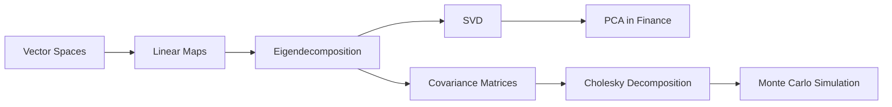
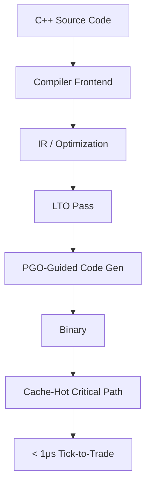

# Quant-Nexus Encyclopedia

**From Zero to High-Frequency Trading: A Complete Quantitative Finance Reference**

---

> *"The market is a device for transferring money from the impatient to the patient — and from the mathematically illiterate to those who can solve stochastic differential equations in their sleep."*

---

## About This Repository

The Quant-Nexus Encyclopedia is a structured, 34-module technical curriculum designed to take a motivated student from foundational mathematics through to the engineering and strategy of high-frequency trading systems. Every module emphasizes:

- **Mathematical rigor** — full derivations in LaTeX, no hand-waving.
- **Polyglot implementation** — Python for research, C++/Rust for production.
- **System-level thinking** — from the Fokker-Planck equation to kernel bypass networking.
- **Practical application** — each concept is grounded in how it is actually used on a trading desk or in a systematic fund.

---

## How to Use This Encyclopedia

```
Recommended Progression:

Foundations (Pillars I)          Computation (Pillar II)
        │                                │
        ▼                                ▼
   Modules 01-08                   Modules 09-16
   (Mathematics)                   (Engineering)
        │                                │
        └────────────┬───────────────────┘
                     ▼
            Asset Pricing (Pillar III)
               Modules 17-24
              (Financial Theory)
                     │
                     ▼
            Advanced Alpha (Pillar IV)
               Modules 25-34


            (Strategy & Execution)
```

**Prerequisites:** Comfort with single-variable calculus and basic programming in any language. Everything else is built from first principles.

**Notation Convention:** Vectors are bold lowercase ($\mathbf{x}$), matrices are bold uppercase ($\mathbf{A}$), stochastic processes are uppercase italic ($X_t$), expectations are $\mathbb{E}[\cdot]$, probability measures are $\mathbb{P}$ and $\mathbb{Q}$.

---

## Master Table of Contents

---

### Pillar I: Foundations — The Mathematical Bedrock

The language of quantitative finance is mathematics. These eight modules build the toolkit — from the geometry of vector spaces to the calculus of random motion — that every subsequent module depends upon.

| # | Module | File | Key Topics | Est. Depth |
|---|--------|------|------------|------------|
| 01 | [Linear Algebra for Quantitative Finance](#module-01-linear-algebra-for-quantitative-finance) | [`website/docs/foundations/01_linear_algebra.md`](website/docs/foundations/01_linear_algebra.md) | Vector spaces, eigendecomposition, SVD, PCA, matrix calculus | ~8,000 words |
| 02 | [Probability Theory & Measure Theory](#module-02-probability-theory--measure-theory) | [`website/docs/foundations/02_probability_measure_theory.md`](website/docs/foundations/02_probability_measure_theory.md) | $\sigma$-algebras, Lebesgue integration, convergence theorems, characteristic functions | ~9,000 words |
| 03 | [Statistical Inference & Estimation](#module-03-statistical-inference--estimation) | [`website/docs/foundations/03_statistical_inference.md`](website/docs/foundations/03_statistical_inference.md) | MLE, Bayesian inference, hypothesis testing, bootstrap methods, robust estimation | ~7,500 words |
| 04 | [Stochastic Calculus](#module-04-stochastic-calculus) | [`website/docs/foundations/04_stochastic_calculus.md`](website/docs/foundations/04_stochastic_calculus.md) | Brownian motion, Ito's lemma, SDEs, Girsanov theorem, Feynman-Kac formula | ~10,000 words |
| 05 | [Ordinary & Partial Differential Equations](#module-05-ordinary--partial-differential-equations) | [`website/docs/foundations/05_differential_equations.md`](website/docs/foundations/05_differential_equations.md) | ODE systems, Black-Scholes PDE, Fokker-Planck, Green's functions, finite differences | ~8,500 words |
| 06 | [Optimization Theory](#module-06-optimization-theory) | [`website/docs/foundations/06_optimization.md`](website/docs/foundations/06_optimization.md) | Convex optimization, KKT conditions, Lagrangian duality, gradient descent, ADMM | ~8,000 words |
| 07 | [Information Theory & Entropy](#module-07-information-theory--entropy) | [`website/docs/foundations/07_information_theory.md`](website/docs/foundations/07_information_theory.md) | Shannon entropy, KL divergence, mutual information, rate-distortion, maximum entropy | ~6,500 words |
| 08 | [Numerical Methods & Approximation](#module-08-numerical-methods--approximation) | [`website/docs/foundations/08_numerical_methods.md`](website/docs/foundations/08_numerical_methods.md) | Root finding, quadrature, Monte Carlo, quasi-Monte Carlo, FFT, finite element methods | ~9,000 words |

---

### Pillar II: Computation — Engineering for Finance

Mathematics without implementation is philosophy. These modules cover the systems engineering required to transform quantitative insight into executable, low-latency, production-grade trading infrastructure.

| # | Module | File | Key Topics | Est. Depth |
|---|--------|------|------------|------------|
| 09 | [Python for Quantitative Research](#module-09-python-for-quantitative-research) | [`website/docs/computation/09_python_quant.md`](website/docs/computation/09_python_quant.md) | NumPy 2.0, pandas, vectorization, Numba JIT, multiprocessing, async I/O | ~8,000 words |
| 10 | [C++ for Low-Latency Systems](#module-10-c-for-low-latency-systems) | [`website/docs/computation/10_cpp_low_latency.md`](website/docs/computation/10_cpp_low_latency.md) | C++23, template metaprogramming, cache optimization, lock-free data structures, SIMD | ~10,000 words |
| 11 | [Rust for Systems Programming](#module-11-rust-for-systems-programming) | [`website/docs/computation/11_rust_systems.md`](website/docs/computation/11_rust_systems.md) | Ownership model, zero-cost abstractions, async runtime, unsafe FFI, `no_std` embedded | ~7,500 words |
| 12 | [Data Structures & Algorithms for Finance](#module-12-data-structures--algorithms-for-finance) | [`website/docs/computation/12_data_structures_algorithms.md`](website/docs/computation/12_data_structures_algorithms.md) | Order book trees, time-priority queues, ring buffers, spatial indexing, B+ trees | ~8,000 words |
| 13 | [Low-Latency Systems Architecture](#module-13-low-latency-systems-architecture) | [`website/docs/computation/13_low_latency_architecture.md`](website/docs/computation/13_low_latency_architecture.md) | Kernel bypass (DPDK, Solarflare OpenOnload), io_uring, NUMA-aware allocation, busy-polling | ~9,500 words |
| 14 | [FPGA & Hardware Acceleration](#module-14-fpga--hardware-acceleration) | [`website/docs/computation/14_fpga_hardware.md`](website/docs/computation/14_fpga_hardware.md) | FPGA trading pipelines, HLS, Verilog basics, tick-to-trade in hardware, PCIe DMA | ~7,000 words |
| 15 | [Database Systems for Tick Data](#module-15-database-systems-for-tick-data) | [`website/docs/computation/15_databases_tick_data.md`](website/docs/computation/15_databases_tick_data.md) | Time-series databases (QuestDB, TimescaleDB, kdb+/q), columnar storage, partitioning | ~7,500 words |
| 16 | [Distributed Systems & Message Queues](#module-16-distributed-systems--message-queues) | [`website/docs/computation/16_distributed_systems.md`](website/docs/computation/16_distributed_systems.md) | Aeron, ZeroMQ, Chronicle Queue, consensus protocols, event sourcing, deterministic replay | ~8,000 words |

---

### Pillar III: Asset Pricing — Financial Theory & Models

With the mathematical and computational toolkit in place, these modules cover the theory of how assets are priced, how volatility behaves, how interest rates evolve, and how the microstructure of markets creates opportunity.

| # | Module | File | Key Topics | Est. Depth |
|---|--------|------|------------|------------|
| 17 | [Equilibrium Asset Pricing](#module-17-equilibrium-asset-pricing) | [`website/docs/asset-pricing/17_equilibrium_pricing.md`](website/docs/asset-pricing/17_equilibrium_pricing.md) | CAPM derivation, APT, Fama-French 3/5-factor, consumption-based models, SDF | ~8,500 words |
| 18 | [Derivatives Pricing & the Greeks](#module-18-derivatives-pricing--the-greeks) | [`website/docs/asset-pricing/18_derivatives_greeks.md`](website/docs/asset-pricing/18_derivatives_greeks.md) | Black-Scholes derivation, risk-neutral pricing, Greeks (full taxonomy), exotic options | ~10,000 words |
| 19 | [Stochastic Volatility Models](#module-19-stochastic-volatility-models) | [`website/docs/asset-pricing/19_stochastic_volatility.md`](website/docs/asset-pricing/19_stochastic_volatility.md) | Heston model, SABR, rough volatility, characteristic function methods, calibration | ~9,000 words |
| 20 | [Fixed Income & Term Structure](#module-20-fixed-income--term-structure) | [`website/docs/asset-pricing/20_fixed_income.md`](website/docs/asset-pricing/20_fixed_income.md) | Vasicek, CIR, HJM framework, LIBOR/SOFR transition, convexity adjustment, curve building | ~8,500 words |
| 21 | [Time Series Analysis](#module-21-time-series-analysis) | [`website/docs/asset-pricing/21_time_series.md`](website/docs/asset-pricing/21_time_series.md) | ARIMA, GARCH/EGARCH/GJR, HAR-RV, cointegration (Johansen), structural breaks | ~9,000 words |
| 22 | [Kalman Filters & State-Space Models](#module-22-kalman-filters--state-space-models) | [`website/docs/asset-pricing/22_kalman_filters.md`](website/docs/asset-pricing/22_kalman_filters.md) | Linear Kalman filter, EKF, UKF, particle filters, EM algorithm, factor extraction | ~8,000 words |
| 23 | [Order Book Dynamics & Market Microstructure](#module-23-order-book-dynamics--market-microstructure) | [`website/docs/asset-pricing/23_order_book_microstructure.md`](website/docs/asset-pricing/23_order_book_microstructure.md) | Glosten-Milgrom, Kyle's lambda, Cont-Stoikov-Talreja, queue position models, adverse selection | ~9,500 words |
| 24 | [Risk Management & Portfolio Theory](#module-24-risk-management--portfolio-theory) | [`website/docs/asset-pricing/24_risk_portfolio.md`](website/docs/asset-pricing/24_risk_portfolio.md) | Mean-variance, Black-Litterman, VaR/CVaR, risk parity, stress testing, copula models | ~8,500 words |

---

### Pillar IV: Advanced Alpha — Strategy, Machine Learning & Execution

The apex of the curriculum. These modules integrate everything prior into the design, implementation, and deployment of alpha-generating trading strategies at every frequency — from daily rebalancing to sub-microsecond market making.

| # | Module | File | Key Topics | Est. Depth |
|---|--------|------|------------|------------|
| 25 | [Statistical Arbitrage & Pairs Trading](#module-25-statistical-arbitrage--pairs-trading) | [`website/docs/advanced-alpha/25_stat_arb.md`](website/docs/advanced-alpha/25_stat_arb.md) | Cointegration-based pairs, Ornstein-Uhlenbeck calibration, PCA-based baskets, mean-reversion signals | ~8,000 words |
| 26 | [Machine Learning for Alpha Generation](#module-26-machine-learning-for-alpha-generation) | [`website/docs/advanced-alpha/26_ml_alpha.md`](website/docs/advanced-alpha/26_ml_alpha.md) | Feature engineering, cross-validation pitfalls, gradient boosting, random forests, regularization | ~9,000 words |
| 27 | [Deep Learning & Neural Networks in Finance](#module-27-deep-learning--neural-networks-in-finance) | [`website/docs/advanced-alpha/27_deep_learning.md`](website/docs/advanced-alpha/27_deep_learning.md) | LSTMs, Transformers, temporal CNNs, attention for LOB, normalizing flows for vol surfaces | ~9,500 words |
| 28 | [Reinforcement Learning for Execution](#module-28-reinforcement-learning-for-execution) | [`website/docs/advanced-alpha/28_rl_execution.md`](website/docs/advanced-alpha/28_rl_execution.md) | MDP formulation, DQN, PPO, Almgren-Chriss baseline, reward shaping, sim-to-real transfer | ~8,500 words |
| 29 | [NLP, Sentiment & LLMs for Finance](#module-29-nlp-sentiment--llms-for-finance) | [`website/docs/advanced-alpha/29_nlp_sentiment_llms.md`](website/docs/advanced-alpha/29_nlp_sentiment_llms.md) | FinBERT, news embeddings, earnings call parsing, LLM-driven signal extraction, prompt engineering for alpha | ~8,000 words |
| 30 | [High-Frequency Trading Strategies](#module-30-high-frequency-trading-strategies) | [`website/docs/advanced-alpha/30_hft_strategies.md`](website/docs/advanced-alpha/30_hft_strategies.md) | Market making, latency arbitrage, queue position alpha, inventory management, toxicity detection | ~10,000 words |
| 31 | [Transaction Cost Analysis & Optimal Execution](#module-31-transaction-cost-analysis--optimal-execution) | [`website/docs/advanced-alpha/31_tca_execution.md`](website/docs/advanced-alpha/31_tca_execution.md) | Almgren-Chriss, market impact models (square-root law), VWAP/TWAP, implementation shortfall | ~8,000 words |
| 32 | [Backtesting Frameworks & Simulation](#module-32-backtesting-frameworks--simulation) | [`website/docs/advanced-alpha/32_backtesting.md`](website/docs/advanced-alpha/32_backtesting.md) | Event-driven vs. vectorized, look-ahead bias, survivorship bias, Monte Carlo permutation tests | ~8,500 words |
| 33 | [Regime Detection & Adaptive Strategies](#module-33-regime-detection--adaptive-strategies) | [`website/docs/advanced-alpha/33_regime_detection.md`](website/docs/advanced-alpha/33_regime_detection.md) | Hidden Markov models, change-point detection (PELT, BOCPD), online learning, adaptive Kelly | ~7,500 words |
| 34 | [Alternative Data & Feature Engineering](#module-34-alternative-data--feature-engineering) | [`website/docs/advanced-alpha/34_alt_data_features.md`](website/docs/advanced-alpha/34_alt_data_features.md) | Satellite imagery, credit card data, web scraping, geospatial signals, feature selection (LASSO, mRMR) | ~7,500 words |

---

## Module Summaries & Prerequisites

---

### Module 01: Linear Algebra for Quantitative Finance
**File:** [`website/docs/foundations/01_linear_algebra.md`](website/docs/foundations/01_linear_algebra.md)
**Prerequisites:** High-school algebra
**Builds toward:** Modules 02, 03, 06, 17, 22, 24, 26

The structural skeleton of quantitative finance. Every portfolio is a vector, every risk model is a matrix, every dimensionality reduction technique (PCA, factor models) is an eigenvalue problem. This module develops linear algebra from vector spaces and linear maps through to the Singular Value Decomposition (SVD) and its applications in finance, including:

- Vector spaces over $\mathbb{R}^n$, subspaces, span, basis, dimension
- Linear maps, matrix representations, rank-nullity theorem
- Inner products, norms, orthogonality, Gram-Schmidt process
- Eigenvalues, eigenvectors, spectral theorem for symmetric matrices
- Singular Value Decomposition — full derivation and truncated approximation
- Principal Component Analysis (PCA) as an eigenvalue problem on the covariance matrix
- Matrix calculus: gradients, Jacobians, Hessians — the chain rule for multivariate optimization
- Positive-definite matrices and their role in covariance estimation
- Cholesky decomposition for correlated random variable generation
- Numerical stability: condition numbers, iterative refinement



---

### Module 02: Probability Theory & Measure Theory
**File:** [`website/docs/foundations/02_probability_measure_theory.md`](website/docs/foundations/02_probability_measure_theory.md)
**Prerequisites:** Module 01 (Linear Algebra)
**Builds toward:** Modules 03, 04, 07, 17, 22

The rigorous foundation upon which all of stochastic finance rests. We begin with the Kolmogorov axioms, construct $\sigma$-algebras and filtrations (the mathematical machinery of "information arriving over time"), and develop the Lebesgue integral — the tool that lets us take expectations of the wild, discontinuous random variables that arise in financial markets.

- Measurable spaces, $\sigma$-algebras, Borel sets on $\mathbb{R}$
- Probability measures, construction via Caratheodory extension
- Random variables as measurable functions, distribution functions
- Lebesgue integration: construction, dominated convergence, Fatou's lemma
- Product measures, Fubini-Tonelli theorem
- Conditional expectation with respect to a $\sigma$-algebra (the tower property)
- Filtrations and adapted processes — modeling information flow
- Convergence: almost sure, in probability, in $L^p$, in distribution
- Characteristic functions and the inversion theorem
- Central limit theorem (Lindeberg-Levy and Lindeberg-Feller)
- Radon-Nikodym theorem — the bridge to risk-neutral pricing

---

### Module 03: Statistical Inference & Estimation
**File:** [`website/docs/foundations/03_statistical_inference.md`](website/docs/foundations/03_statistical_inference.md)
**Prerequisites:** Modules 01, 02
**Builds toward:** Modules 06, 21, 25, 26, 34

How we extract signal from noise. In markets, the signal-to-noise ratio is brutal — often below 0.05. This module develops the machinery of estimation theory (how to fit models to data), hypothesis testing (how to determine if a pattern is real), and resampling methods (how to quantify uncertainty when analytic formulas fail).

- Sufficient statistics and the factorization theorem
- Maximum likelihood estimation: derivation, consistency, asymptotic normality, Fisher information
- Method of moments and generalized method of moments (GMM)
- Bayesian inference: prior selection, conjugate families, posterior computation, credible intervals
- Hypothesis testing: Neyman-Pearson lemma, likelihood ratio tests, multiple testing corrections (Bonferroni, BH-FDR)
- Bootstrap methods: nonparametric, parametric, block bootstrap for time series
- Robust estimation: M-estimators, breakdown point, Huber loss, median absolute deviation
- Model selection: AIC, BIC, cross-validation, the bias-variance tradeoff

---

### Module 04: Stochastic Calculus
**File:** [`website/docs/foundations/04_stochastic_calculus.md`](website/docs/foundations/04_stochastic_calculus.md)
**Prerequisites:** Modules 01, 02, 05 (ODEs/PDEs — can be studied concurrently)
**Builds toward:** Modules 17, 18, 19, 20, 23, 25

The calculus of randomness. Ordinary calculus breaks when applied to Brownian motion because its paths are continuous but nowhere differentiable — the chain rule fails. Ito's calculus provides the repair, and its consequences (the Ito formula, Girsanov's theorem, the martingale representation theorem) are the mathematical engine of modern derivatives pricing.

- Brownian motion: construction (Levy-Ciesielski), properties (continuity, non-differentiability, quadratic variation)
- Filtrations generated by Brownian motion, martingale property
- Ito integral: construction for simple processes, extension to $L^2$, Ito isometry
- Ito's formula (the stochastic chain rule) — full derivation with quadratic variation term
- Stochastic differential equations: existence and uniqueness (Lipschitz conditions)
- Geometric Brownian motion — the workhorse model of equity prices
- Girsanov's theorem — changing probability measures, from $\mathbb{P}$ to $\mathbb{Q}$
- Martingale representation theorem
- Feynman-Kac formula — connecting SDEs to PDEs
- Derivation of the Fokker-Planck (Kolmogorov forward) equation from the Langevin equation
- Stratonovich calculus and its relationship to Ito calculus
- Multi-dimensional Ito formula for correlated processes

---

### Module 05: Ordinary & Partial Differential Equations
**File:** [`website/docs/foundations/05_differential_equations.md`](website/docs/foundations/05_differential_equations.md)
**Prerequisites:** Module 01
**Builds toward:** Modules 04, 08, 18, 19, 20

Differential equations are the language of dynamics. The Black-Scholes PDE, the Fokker-Planck equation, the Vasicek short-rate model — all are differential equations. This module covers both the analytic techniques (separation of variables, Green's functions) and the numerical methods (finite differences, Crank-Nicolson) needed to solve them.

- First-order ODEs: separable, linear, exact, integrating factors
- Systems of ODEs: matrix exponentials, phase portraits, stability analysis
- Sturm-Liouville theory and eigenfunction expansions
- Classification of second-order PDEs: elliptic, parabolic, hyperbolic
- The heat equation — its connection to the Black-Scholes PDE via change of variables
- Separation of variables, Fourier series solutions
- Green's functions and fundamental solutions
- The Fokker-Planck equation: derivation from the Chapman-Kolmogorov equation
- Finite difference methods: explicit, implicit, Crank-Nicolson (stability analysis via von Neumann)
- Boundary conditions in finance: absorbing barriers, reflecting barriers, free boundaries (American options)

---

### Module 06: Optimization Theory
**File:** [`website/docs/foundations/06_optimization.md`](website/docs/foundations/06_optimization.md)
**Prerequisites:** Modules 01, 03
**Builds toward:** Modules 17, 24, 26, 28, 31

Every portfolio construction, every model calibration, every execution algorithm is an optimization problem. This module provides the theoretical foundations (convexity, duality, KKT conditions) and the algorithmic toolkit (gradient methods, second-order methods, ADMM) to solve them.

- Convex sets and convex functions: characterizations, preservation under operations
- Unconstrained optimization: gradient descent, Newton's method, quasi-Newton (L-BFGS), convergence rates
- Constrained optimization: Lagrangian, KKT conditions, constraint qualification
- Duality: weak and strong duality, Slater's condition, dual decomposition
- Quadratic programming (QP) — the engine of mean-variance portfolio optimization
- Second-order cone programming (SOCP) and semidefinite programming (SDP)
- ADMM (Alternating Direction Method of Multipliers) for large-scale distributed optimization
- Stochastic gradient descent: variance reduction (SAGA, SVRG), Adam optimizer
- Non-convex optimization: saddle points, escaping local minima, random restarts
- Applications: portfolio optimization, calibration of volatility surfaces, regularized regression

---

### Module 07: Information Theory & Entropy
**File:** [`website/docs/foundations/07_information_theory.md`](website/docs/foundations/07_information_theory.md)
**Prerequisites:** Modules 02, 03
**Builds toward:** Modules 26, 33, 34

Information theory quantifies uncertainty, surprise, and the limits of what can be learned from data. In finance, it provides tools for feature selection (mutual information), model comparison (KL divergence), and understanding the fundamental limits of prediction.

- Shannon entropy: definition, properties, maximum entropy distributions
- KL divergence (relative entropy): non-symmetry, connection to likelihood ratio tests
- Mutual information: definition, estimation from finite samples, copula-based approaches
- Differential entropy for continuous distributions
- Rate-distortion theory — optimal lossy compression, connections to quantization of signals
- Maximum entropy principle: derivation of exponential family distributions
- Fisher information and the Cramer-Rao bound (linking to Module 03)
- Transfer entropy for detecting directed information flow between time series
- Applications: feature selection via mutual information, entropy-based regime detection, market efficiency measurement

---

### Module 08: Numerical Methods & Approximation
**File:** [`website/docs/foundations/08_numerical_methods.md`](website/docs/foundations/08_numerical_methods.md)
**Prerequisites:** Modules 01, 05, 06
**Builds toward:** Modules 09, 10, 18, 19, 20

The bridge between theory and computation. Closed-form solutions are the exception in quantitative finance; numerical methods are the rule. This module covers the algorithms that power derivatives pricing engines, risk systems, and calibration routines.

- Root finding: bisection, Newton-Raphson, Brent's method (implied volatility inversion)
- Interpolation: polynomial, cubic spline, rational (yield curve interpolation)
- Numerical integration: Gauss-Legendre quadrature, adaptive Simpson, Gauss-Hermite for option pricing
- Monte Carlo methods: variance reduction (antithetic, control variates, importance sampling), convergence rates
- Quasi-Monte Carlo: Sobol sequences, Halton sequences, effective dimension, Koksma-Hlawka inequality
- Fast Fourier Transform (FFT): Carr-Madan formula for option pricing via characteristic functions
- Finite element methods: weak formulations, Galerkin method, applications to multi-asset PDEs
- Random number generation: Mersenne Twister, PCG, Box-Muller transform, ziggurat method
- Error analysis: truncation error, round-off error, numerical stability, catastrophic cancellation

---

### Module 09: Python for Quantitative Research
**File:** [`website/docs/computation/09_python_quant.md`](website/docs/computation/09_python_quant.md)
**Prerequisites:** Basic programming experience
**Builds toward:** Modules 21, 22, 25, 26, 27, 32

Python is the lingua franca of quantitative research. This module covers not the basics of the language, but the high-performance idioms, libraries, and architectural patterns used in professional quant research environments.

- NumPy 2.0: ndarray internals, strided memory layout, broadcasting rules, copy vs. view semantics
- Vectorized computation: eliminating Python loops, universal functions (ufuncs), structured arrays
- pandas for financial data: MultiIndex, rolling windows, groupby-apply patterns, memory optimization with categorical dtypes
- Numba JIT compilation: `@njit`, `@vectorize`, parallel acceleration with `prange`, GPU targets with CUDA
- Concurrent computation: `multiprocessing` for CPU-bound, `asyncio` for I/O-bound, `concurrent.futures`
- Performance profiling: `cProfile`, `line_profiler`, `memory_profiler`, flame graphs
- Scientific stack: SciPy (optimization, integration, sparse matrices), statsmodels, scikit-learn pipelines
- Data formats: Parquet (via PyArrow), HDF5, memory-mapped files for out-of-core computation
- Code quality: type annotations with `mypy`, property-based testing with `hypothesis`, `pytest` fixtures

---

### Module 10: C++ for Low-Latency Systems
**File:** [`website/docs/computation/10_cpp_low_latency.md`](website/docs/computation/10_cpp_low_latency.md)
**Prerequisites:** Module 09 (or equivalent programming experience)
**Builds toward:** Modules 12, 13, 14, 16, 30

When nanoseconds matter, C++ is the only language. This module covers modern C++23 idioms and the specific techniques used in HFT systems: cache-aware data structures, lock-free programming, compile-time computation, and deterministic memory allocation.

- Modern C++23: concepts, ranges, `std::expected`, `std::mdspan`, deducing `this`
- Memory model: stack vs. heap, alignment, padding, cache lines (64-byte), prefetching
- Template metaprogramming: CRTP, SFINAE, `if constexpr`, compile-time computation
- Move semantics, perfect forwarding, and zero-copy message passing
- Lock-free programming: `std::atomic`, memory orderings (`seq_cst`, `acquire/release`, `relaxed`), CAS loops
- Lock-free data structures: SPSC queue (Lamport), MPSC queue, lock-free hash maps
- SIMD intrinsics: SSE/AVX2/AVX-512 for vectorized computation (portfolio risk, Greeks calculation)
- Custom allocators: pool allocators, arena allocators, `jemalloc` tuning
- Compile-time optimization: link-time optimization (LTO), profile-guided optimization (PGO)
- Benchmarking: Google Benchmark, `perf stat`, hardware performance counters, `rdtsc`



---

### Module 11: Rust for Systems Programming
**File:** [`website/docs/computation/11_rust_systems.md`](website/docs/computation/11_rust_systems.md)
**Prerequisites:** Module 09 or 10
**Builds toward:** Modules 12, 13, 16

Rust offers C++-grade performance with memory safety guarantees enforced at compile time. An increasing number of trading firms are adopting Rust for new infrastructure — particularly for components where correctness and safety are as important as speed.

- Ownership, borrowing, and lifetimes — Rust's core memory safety model
- Zero-cost abstractions: traits, generics, monomorphization
- Error handling: `Result<T, E>`, the `?` operator, `thiserror` and `anyhow`
- Async Rust: `tokio` runtime, `async/await`, `Pin` and `Future` internals
- Unsafe Rust: raw pointers, FFI with C/C++, when and how to use `unsafe` responsibly
- Performance: `#[inline]`, SIMD via `std::simd` (nightly) or `packed_simd`, profile-guided optimization
- Concurrency primitives: `Arc`, `Mutex`, `RwLock`, channels (`crossbeam`), lock-free structures
- `no_std` and embedded: running Rust on FPGAs or bare-metal systems
- Crate ecosystem for finance: `ndarray`, `polars`, `arrow-rs`, `tonic` (gRPC)

---

### Module 12: Data Structures & Algorithms for Finance
**File:** [`website/docs/computation/12_data_structures_algorithms.md`](website/docs/computation/12_data_structures_algorithms.md)
**Prerequisites:** Modules 10 or 11
**Builds toward:** Modules 13, 15, 23, 30

Generic algorithms textbooks optimize for asymptotic complexity. In HFT, the constant factor dominates. This module covers the specific data structures and algorithmic techniques used in trading systems, where cache locality, branch prediction, and allocation patterns matter as much as big-O.

- Array-based order books: price-level arrays, cache-friendly iteration vs. tree-based alternatives
- Red-black trees and skip lists for limit order books (price-time priority)
- Ring buffers (circular buffers) for lock-free communication and event logging
- Time-priority queues: calendar queues, timing wheels (Varghese-Lauck)
- Spatial indexing (k-d trees, R-trees) for multi-dimensional signal lookup
- B+ trees and LSM trees for on-disk tick data storage
- Hashing: Robin Hood hashing, Swiss tables, minimal perfect hashing for symbol lookup
- Sorting networks: fixed-size sorts for small arrays (optimal for HFT hot paths)
- String matching: Aho-Corasick for multi-pattern FIX message parsing
- Compression: dictionary encoding, delta encoding, run-length encoding for market data

---

### Module 13: Low-Latency Systems Architecture
**File:** [`website/docs/computation/13_low_latency_architecture.md`](website/docs/computation/13_low_latency_architecture.md)
**Prerequisites:** Modules 10, 12
**Builds toward:** Modules 14, 16, 30

The engineering discipline of eliminating latency — from network stack to CPU pipeline. This module covers the full stack of techniques used by HFT firms to achieve sub-microsecond tick-to-trade times.

- Linux kernel tuning: `isolcpus`, `nohz_full`, `rcu_nocbs`, IRQ affinity, transparent huge pages
- Kernel bypass networking: DPDK architecture, Solarflare OpenOnload, Mellanox VMA
- io_uring for asynchronous I/O without system calls
- NUMA-aware memory allocation: `numactl`, `mbind`, local vs. remote memory access penalties
- CPU pinning and thread affinity: `pthread_setaffinity_np`, `sched_setaffinity`
- Busy-polling vs. interrupt-driven I/O: tradeoffs in power and latency
- Clock synchronization: PTP (IEEE 1588), GPS disciplined oscillators, time stamping in hardware
- Network topology: co-location, cross-connects, microwave/millimeter-wave links
- Monitoring: eBPF for non-intrusive latency histograms, custom perf counters
- The anatomy of a tick-to-trade pipeline: from NIC to order submission


---

### Module 14: FPGA & Hardware Acceleration
**File:** [`website/docs/computation/14_fpga_hardware.md`](website/docs/computation/14_fpga_hardware.md)
**Prerequisites:** Module 13
**Builds toward:** Module 30

When software latency hits its floor, hardware takes over. FPGAs (Field-Programmable Gate Arrays) enable trading logic to execute in deterministic nanosecond cycles — bypassing the CPU entirely. This module covers FPGA architecture, design methodologies, and their specific application in trading.

- FPGA architecture: CLBs, BRAMs, DSP slices, routing fabric
- HDL fundamentals: Verilog / SystemVerilog for combinational and sequential logic
- High-Level Synthesis (HLS): C/C++ to RTL, Xilinx Vitis HLS, Intel oneAPI
- Trading-specific FPGA designs: market data parser, order book engine, strategy logic
- PCIe DMA for host-FPGA communication
- Network processing: 10/25/100 GbE MAC, UDP/TCP offload
- Tick-to-trade in hardware: sub-microsecond deterministic latency
- Hybrid architectures: FPGA for critical path, CPU for complex logic
- SmartNICs (Xilinx Alveo, Intel FPGA PAC) — programmable network cards
- Testing and verification: simulation, formal verification, hardware-in-the-loop

---

### Module 15: Database Systems for Tick Data
**File:** [`website/docs/computation/15_databases_tick_data.md`](website/docs/computation/15_databases_tick_data.md)
**Prerequisites:** Module 09, 12
**Builds toward:** Modules 32, 34

A single trading day for US equities generates approximately 10 billion market data events. Storing, indexing, and querying this data efficiently is a fundamental engineering challenge. This module covers the database systems purpose-built for financial time series.

- Time-series data characteristics: append-heavy, time-ordered, high cardinality
- kdb+/q: vector-oriented, column-store, in-memory database — the industry standard
- QuestDB: high-performance SQL time-series database, designated timestamps, partitioned tables
- TimescaleDB: PostgreSQL extension for time series, hypertables, continuous aggregates
- Apache Parquet and Arrow: columnar storage formats, zero-copy reads, predicate pushdown
- ClickHouse: OLAP for market data analytics, materialized views, approximate queries
- Data modeling: tick schema design, symbol universes, corporate action adjustments
- Ingestion pipelines: market data handlers, normalization, deduplication
- Query patterns: OHLCV aggregation, VWAP computation, order flow imbalance calculation
- Archival strategies: hot/warm/cold tiering, compression ratios, data retention policies

---

### Module 16: Distributed Systems & Message Queues
**File:** [`website/docs/computation/16_distributed_systems.md`](website/docs/computation/16_distributed_systems.md)
**Prerequisites:** Modules 10 or 11, 13
**Builds toward:** Modules 30, 32

Trading systems are inherently distributed — market data arrives from exchanges, strategies run on compute servers, orders route through gateways, risk monitors observe everything. This module covers the messaging and coordination infrastructure that connects these components.

- Aeron: ultra-low-latency messaging, IPC and UDP transport, reliable delivery, media driver architecture
- ZeroMQ: broker-less messaging patterns (PUB/SUB, REQ/REP, PUSH/PULL), `inproc` transport
- Chronicle Queue: persisted, memory-mapped message queue for Java/C++ interop, deterministic replay
- Message serialization: FlatBuffers, Cap'n Proto, SBE (Simple Binary Encoding) — zero-copy deserialization
- Event sourcing: command-query separation, event store, rebuilding state from events
- Deterministic replay: recording inputs to reproduce exact system behavior for debugging
- Consensus and coordination: Raft, etcd for configuration management
- FIX protocol: structure, session layer, application messages, performance considerations
- ITCH/OUCH protocols: exchange-native binary protocols for market data and order entry
- Monitoring: distributed tracing, latency attribution, health checking

---

### Module 17: Equilibrium Asset Pricing
**File:** [`website/docs/asset-pricing/17_equilibrium_pricing.md`](website/docs/asset-pricing/17_equilibrium_pricing.md)
**Prerequisites:** Modules 01, 02, 04, 06
**Builds toward:** Modules 18, 24, 25

Why do assets have the expected returns they do? This module derives the classical and modern theories of asset pricing — from Markowitz's mean-variance frontier to the stochastic discount factor — and examines the empirical anomalies (value, momentum, size) that motivate factor models.

- Markowitz mean-variance portfolio theory: efficient frontier derivation, two-fund separation
- Capital Asset Pricing Model (CAPM): derivation from mean-variance, market portfolio, security market line
- Roll's critique and the joint hypothesis problem
- Arbitrage Pricing Theory (APT): factor structure, no-arbitrage pricing, comparison with CAPM
- Fama-French three-factor and five-factor models: construction, empirical evidence, factor definitions
- Carhart four-factor model: momentum
- Consumption-based asset pricing: Lucas tree model, Euler equation, equity premium puzzle
- Stochastic Discount Factor (SDF) framework: Hansen-Jagannathan bounds, pricing kernel
- GMM estimation of asset pricing models (linking to Module 03)
- Cross-sectional regressions: Fama-MacBeth procedure

---

### Module 18: Derivatives Pricing & the Greeks
**File:** [`website/docs/asset-pricing/18_derivatives_greeks.md`](website/docs/asset-pricing/18_derivatives_greeks.md)
**Prerequisites:** Modules 04, 05, 08
**Builds toward:** Modules 19, 20, 23, 30

The crown jewel of mathematical finance. This module derives the Black-Scholes-Merton framework from first principles using three independent approaches (PDE, martingale, and replication), develops the full taxonomy of Greeks, and extends to exotic option pricing.

- Binomial model: one-period, multi-period, convergence to Black-Scholes
- Black-Scholes derivation via replication (delta hedging) and the PDE approach
- Black-Scholes derivation via risk-neutral pricing and the martingale approach
- Black-Scholes formula: calls, puts, digital options, closed-form Greeks
- The Greeks — complete taxonomy:
  - First-order: Delta ($\Delta$), Vega ($\nu$), Theta ($\Theta$), Rho ($\rho$)
  - Second-order: Gamma ($\Gamma$), Vanna, Volga (Vomma), Charm, Veta
  - Third-order: Speed, Color, Ultima, Zomma
- Implied volatility: definition, Newton-Raphson inversion, Brenner-Subrahmanyam approximation
- The volatility smile and skew: empirical observations, what Black-Scholes gets wrong
- Exotic options: barrier, Asian, lookback, basket — pricing via Monte Carlo and PDE methods
- American options: early exercise boundary, Longstaff-Schwartz (LSM) algorithm
- Put-call parity, put-call symmetry, and static replication

---

### Module 19: Stochastic Volatility Models
**File:** [`website/docs/asset-pricing/19_stochastic_volatility.md`](website/docs/asset-pricing/19_stochastic_volatility.md)
**Prerequisites:** Modules 04, 08, 18
**Builds toward:** Modules 23, 30

Black-Scholes assumes constant volatility. Markets disagree — the volatility smile is persistent and pervasive. Stochastic volatility models replace the constant $\sigma$ with a correlated stochastic process, producing richer dynamics that match observed option prices.

- The Heston model:
  - SDE specification: $dS_t = \mu S_t \, dt + \sqrt{v_t} S_t \, dW_t^S$, $dv_t = \kappa(\theta - v_t) \, dt + \xi \sqrt{v_t} \, dW_t^v$
  - Derivation of the characteristic function via the Riccati ODE
  - Semi-analytical pricing: Heston formula, Fourier inversion
  - Calibration to the volatility surface: Levenberg-Marquardt, differential evolution
- The SABR model: $dF_t = \sigma_t F_t^\beta \, dW_t^F$, $d\sigma_t = \alpha \sigma_t \, dW_t^\sigma$
  - Hagan's asymptotic implied volatility formula
  - Backbone and smile dynamics
  - Applications in interest rate options (swaptions, caps)
- Rough volatility: fractional Brownian motion with $H < 0.5$, the rough Heston model
  - Empirical evidence: scaling of realized volatility increments
  - Pricing via the fractional Riccati equation
- Local volatility: Dupire's formula, the local volatility surface
- Stochastic local volatility (SLV) hybrid models
- Model comparison: fit quality vs. parameter stability vs. hedging performance

---

### Module 20: Fixed Income & Term Structure
**File:** [`website/docs/asset-pricing/20_fixed_income.md`](website/docs/asset-pricing/20_fixed_income.md)
**Prerequisites:** Modules 04, 05, 18
**Builds toward:** Modules 22, 24

The fixed income market is the largest financial market in the world. This module develops the theory of interest rate modeling — from simple bootstrapping of the yield curve to the full Heath-Jarrow-Morton framework — and addresses the post-LIBOR world of SOFR-based derivatives.

- Bond math: duration (Macaulay, modified, effective), convexity, DV01
- Yield curve construction: bootstrapping, cubic spline interpolation, Nelson-Siegel-Svensson parametric models
- Short-rate models:
  - Vasicek: Ornstein-Uhlenbeck process, analytic bond prices, mean reversion
  - Cox-Ingersoll-Ross (CIR): square-root diffusion, positivity guarantee, Feller condition
  - Hull-White: time-dependent mean reversion, exact calibration to the initial curve
- The HJM (Heath-Jarrow-Morton) framework: modeling the entire forward curve, drift condition, no-arbitrage constraints
- The LIBOR Market Model (BGM): forward LIBOR rates, caplet pricing, swaption approximations
- LIBOR to SOFR transition: term SOFR, SOFR compounding conventions, fallback spreads
- Convexity adjustments: futures vs. forwards, CMS rate convexity
- Mortgage-backed securities: prepayment models, OAS, effective duration
- Credit: reduced-form models (intensity-based), Merton's structural model, CDS pricing

---

### Module 21: Time Series Analysis
**File:** [`website/docs/asset-pricing/21_time_series.md`](website/docs/asset-pricing/21_time_series.md)
**Prerequisites:** Modules 01, 02, 03, 09
**Builds toward:** Modules 22, 25, 26, 33

Financial time series exhibit stylized facts that distinguish them from textbook examples: heavy tails, volatility clustering, long memory, and non-stationarity. This module develops the econometric models that capture these features — from classical ARIMA to modern realized volatility measures.

- Stationarity: weak vs. strict, augmented Dickey-Fuller test, KPSS test, Phillips-Perron test
- ARMA models: autocovariance structure, Wold decomposition, Box-Jenkins identification
- ARIMA: integrated processes, differencing, seasonal ARIMA (SARIMA)
- Volatility modeling:
  - ARCH: Engle's original model, conditional heteroscedasticity
  - GARCH(1,1): Bollerslev's extension, stationarity conditions, parameter estimation via MLE
  - EGARCH: Nelson's exponential GARCH, leverage effect, log-variance specification
  - GJR-GARCH: Glosten-Jagannathan-Runkle threshold GARCH
  - DCC-GARCH: Dynamic Conditional Correlation for multivariate volatility
- Realized volatility: realized variance, bipower variation, jump detection (Barndorff-Nielsen-Shephard test)
- HAR-RV (Heterogeneous Autoregressive model of Realized Volatility): daily, weekly, monthly components
- Cointegration: Engle-Granger two-step, Johansen test (trace and max-eigenvalue), VECM
- Structural breaks: Chow test, Bai-Perron multiple breakpoint test, CUSUM
- Long memory: fractional integration, ARFIMA, Hurst exponent estimation (R/S, DFA)

---

### Module 22: Kalman Filters & State-Space Models
**File:** [`website/docs/asset-pricing/22_kalman_filters.md`](website/docs/asset-pricing/22_kalman_filters.md)
**Prerequisites:** Modules 01, 02, 21
**Builds toward:** Modules 25, 33

Many quantities in finance are not directly observable — the "true" volatility, the current alpha of a strategy, the hidden factors driving yield curve movements. State-space models and the Kalman filter provide a principled framework for estimating these latent states from noisy observations.

- State-space representation: observation and transition equations, Markov property
- The linear Kalman filter: prediction step, update step, full derivation as Bayesian updating
- Kalman smoother: Rauch-Tung-Striebel backward recursion, smoothed state estimates
- Extended Kalman Filter (EKF): linearization via Taylor expansion, application to nonlinear models
- Unscented Kalman Filter (UKF): sigma points, unscented transform, better handling of nonlinearity
- Particle filters (Sequential Monte Carlo): importance sampling, resampling (systematic, residual), degeneracy
- EM algorithm for parameter estimation in state-space models
- Applications in finance:
  - Dynamic beta estimation
  - Spread estimation for pairs trading (time-varying hedge ratio)
  - Factor extraction from yield curves (DNS as a state-space model)
  - Latent alpha estimation in portfolio management
- Square-root filters for numerical stability
- Ensemble Kalman filter for high-dimensional systems

---

### Module 23: Order Book Dynamics & Market Microstructure
**File:** [`website/docs/asset-pricing/23_order_book_microstructure.md`](website/docs/asset-pricing/23_order_book_microstructure.md)
**Prerequisites:** Modules 02, 04, 21
**Builds toward:** Modules 28, 30, 31

Market microstructure is the study of how prices form through the interaction of orders. For HFT, microstructure IS the market. This module develops the theoretical and empirical tools for understanding order book dynamics, adverse selection, and the information content of order flow.

- Market structure: exchanges, dark pools, crossing networks, maker-taker fee models
- The limit order book: structure, price-time priority, order types (limit, market, IOC, FOK, iceberg)
- Glosten-Milgrom model: sequential trade model, bid-ask spread as adverse selection premium
- Kyle's model: informed trader, noise traders, market maker, Kyle's lambda (price impact)
- The Cont-Stoikov-Talreja model: order book as a queueing system, Poisson arrivals, cancellation
- Roll model: estimating the spread from transaction prices
- Hasbrouck's information share: price discovery across venues
- Empirical microstructure:
  - Order flow imbalance and price impact
  - Trade classification: Lee-Ready algorithm, bulk volume classification
  - Intraday patterns: U-shape in volume and volatility
- Queue position models: position value, queue priority, fill probability estimation
- Adverse selection: toxicity measurement, VPIN (Volume-synchronized PIN)
- Optimal market making: Avellaneda-Stoikov framework, inventory-based quoting

---

### Module 24: Risk Management & Portfolio Theory
**File:** [`website/docs/asset-pricing/24_risk_portfolio.md`](website/docs/asset-pricing/24_risk_portfolio.md)
**Prerequisites:** Modules 01, 02, 06, 17
**Builds toward:** Modules 25, 30, 31, 32

Risk management is what separates a trading firm from a casino. This module covers the theory and practice of measuring, managing, and allocating risk — from classical mean-variance optimization through to modern risk parity and stress testing frameworks.

- Mean-variance optimization: Markowitz formulation, efficient frontier, corner portfolios
- Estimation error: Michaud resampling, shrinkage estimators (Ledoit-Wolf), factor-based covariance
- Black-Litterman model: combining equilibrium returns with investor views, derivation via Bayesian updating
- Value at Risk (VaR): historical simulation, parametric (delta-normal, delta-gamma), Monte Carlo
- Expected Shortfall (CVaR): coherent risk measure, estimation, optimization
- Risk parity: equal risk contribution, inverse volatility, hierarchical risk parity (HRP)
- Kelly criterion: derivation, fractional Kelly, multi-asset extension
- Copula models: Gaussian copula, t-copula, Archimedean copulas, tail dependence
- Stress testing and scenario analysis: historical scenarios, hypothetical scenarios, reverse stress testing
- Factor risk models: Barra-style factor models, specific risk, factor covariance estimation
- Drawdown analysis: maximum drawdown, Calmar ratio, drawdown-at-risk

---

### Module 25: Statistical Arbitrage & Pairs Trading
**File:** [`website/docs/advanced-alpha/25_stat_arb.md`](website/docs/advanced-alpha/25_stat_arb.md)
**Prerequisites:** Modules 04, 21, 22, 24
**Builds toward:** Modules 30, 32, 33

Statistical arbitrage exploits temporary mispricings between related securities. This module develops the theory (cointegration, mean reversion) and practice (signal construction, portfolio formation, risk management) of stat arb strategies — from simple pairs trading to multi-asset factor-driven baskets.

- Pairs selection: distance method, cointegration tests, minimum spread variance
- Cointegration-based trading: Engle-Granger, Johansen, dynamic hedge ratios via Kalman filter
- Ornstein-Uhlenbeck process: calibration, half-life estimation, optimal entry/exit thresholds
- PCA-based statistical arbitrage: eigenportfolios, principal component returns, residual alpha
- Mean-reversion signals: z-score, Bollinger bands, half-life weighted signals
- Multi-asset stat arb: basket construction, sector neutrality, factor neutralization
- Risk management: maximum drawdown constraints, correlation breakdown detection, gross/net exposure limits
- Capacity and crowding: estimating strategy capacity, crowding indicators
- Implementation: execution costs, slippage, rebalancing frequency optimization
- Case studies: ETF arbitrage, index rebalancing, convertible bond arbitrage

---

### Module 26: Machine Learning for Alpha Generation
**File:** [`website/docs/advanced-alpha/26_ml_alpha.md`](website/docs/advanced-alpha/26_ml_alpha.md)
**Prerequisites:** Modules 01, 03, 06, 09, 21
**Builds toward:** Modules 27, 28, 29, 33, 34

Machine learning in finance is not Kaggle. The signal-to-noise ratio is orders of magnitude worse, non-stationarity is the norm, and overfitting is the default outcome. This module covers the specific techniques, pitfalls, and disciplined methodology required to apply ML to financial prediction without fooling yourself.

- The overfitting problem: in-sample vs. out-of-sample, the fundamental law of active management
- Cross-validation for time series: purged k-fold, embargo periods, combinatorial purged CV
- Feature engineering: technical indicators, fundamental ratios, microstructure features, feature transformations
- Linear models: ridge, LASSO, elastic net — regularization as Bayesian priors
- Tree-based methods: random forests, gradient boosting (XGBoost, LightGBM, CatBoost), feature importance (SHAP)
- Support Vector Machines: kernel trick, RBF kernels, relevance vector machines
- Ensemble methods: stacking, blending, model averaging, Bayesian model averaging
- Feature selection: mutual information, LASSO path, mRMR (minimum redundancy maximum relevance)
- Model evaluation: Sharpe ratio, information coefficient (IC), turnover-adjusted IC, rank IC
- De-noising and de-trending: wavelet denoising, HP filter, EMD, STL decomposition
- Label design: fixed-horizon returns, triple-barrier method, meta-labeling

---

### Module 27: Deep Learning & Neural Networks in Finance
**File:** [`website/docs/advanced-alpha/27_deep_learning.md`](website/docs/advanced-alpha/27_deep_learning.md)
**Prerequisites:** Modules 06, 09, 26
**Builds toward:** Modules 28, 29

Deep learning extends the ML toolkit with architectures capable of learning hierarchical representations from complex, high-dimensional data. This module covers the neural network architectures most relevant to finance — with particular attention to temporal models and attention mechanisms for order book data.

- Feedforward networks: universal approximation theorem, backpropagation derivation, activation functions
- Regularization: dropout, batch normalization, layer normalization, weight decay, early stopping
- Recurrent Neural Networks (RNNs): vanilla RNN, vanishing/exploding gradients, gradient clipping
- Long Short-Term Memory (LSTM): gate mechanism (forget, input, output), Peephole connections
- Gated Recurrent Units (GRU): simplified gating, comparison with LSTM
- Temporal Convolutional Networks (TCN): causal convolutions, dilated convolutions, WaveNet architecture
- Transformer architecture: self-attention, multi-head attention, positional encoding, application to time series
- Attention mechanisms for limit order book (LOB) data: DeepLOB, multi-horizon prediction
- Autoencoders: variational autoencoders (VAE) for latent factor discovery, anomaly detection
- Normalizing flows: invertible transformations, application to volatility surface generation
- Generative Adversarial Networks (GANs): synthetic financial data generation, time series augmentation
- Training at scale: mixed precision, gradient accumulation, distributed training, learning rate schedules

---

### Module 28: Reinforcement Learning for Execution
**File:** [`website/docs/advanced-alpha/28_rl_execution.md`](website/docs/advanced-alpha/28_rl_execution.md)
**Prerequisites:** Modules 06, 26, 23, 31
**Builds toward:** Module 30

Optimal execution is fundamentally a sequential decision problem under uncertainty — the exact setting reinforcement learning was designed for. This module develops RL from the Bellman equation through to modern deep RL algorithms, applied specifically to the problem of executing large orders with minimal market impact.

- Markov Decision Processes (MDPs): states, actions, transitions, rewards, discount factor
- Dynamic programming: value iteration, policy iteration, contraction mapping theorem
- The Bellman equation: optimality principle, relationship to HJB equation in continuous time
- Monte Carlo methods: first-visit, every-visit, importance sampling for off-policy evaluation
- Temporal Difference (TD) learning: TD(0), TD($\lambda$), eligibility traces
- Q-learning and SARSA: tabular methods, $\epsilon$-greedy exploration
- Deep Q-Networks (DQN): experience replay, target networks, double DQN, dueling DQN
- Policy gradient methods: REINFORCE, baseline subtraction, variance reduction
- Actor-Critic methods: A2C, A3C, Generalized Advantage Estimation (GAE)
- Proximal Policy Optimization (PPO): clipped objective, trust region, implementation details
- Execution as RL: state space (inventory, time, market state), action space (order size, timing, aggressiveness)
- Almgren-Chriss baseline: the optimal deterministic solution for comparison
- Reward shaping: implementation shortfall, VWAP deviation, risk-adjusted rewards
- Simulation environment design: realistic order book simulation, latency modeling, fill probability
- Sim-to-real transfer: domain randomization, conservative Q-learning, offline RL

---

### Module 29: NLP, Sentiment & LLMs for Finance
**File:** [`website/docs/advanced-alpha/29_nlp_sentiment_llms.md`](website/docs/advanced-alpha/29_nlp_sentiment_llms.md)
**Prerequisites:** Modules 09, 26, 27
**Builds toward:** Modules 30, 34

Unstructured text — news articles, earnings calls, SEC filings, social media, analyst reports — contains alpha that price and volume data alone cannot capture. This module covers the NLP pipeline from classical bag-of-words through to modern LLM-based approaches for extracting tradeable signals from text.

- Text preprocessing: tokenization, stop word removal, stemming/lemmatization, n-grams
- Classical NLP: TF-IDF, bag-of-words, Loughran-McDonald financial sentiment dictionary
- Word embeddings: Word2Vec, GloVe, financial domain adaptation
- Transformer architecture review: BERT, attention mechanism, pre-training objectives (MLM, NSP)
- FinBERT: financial domain pre-training, sentiment classification, fine-tuning for specific tasks
- Large Language Models in finance:
  - GPT-family for earnings call summarization
  - LLM-driven signal extraction: prompting strategies for sentiment scoring
  - Few-shot and zero-shot classification of news events
  - Chain-of-thought reasoning for fundamental analysis
- Earnings call analysis: tone analysis, deviation from script, executive sentiment, Q&A dynamics
- SEC filing analysis: 10-K/10-Q parsing, MD&A section analysis, risk factor changes over time
- News-based trading signals: event detection, novelty scoring, relevance filtering, decay modeling
- Social media and alternative text: Reddit, Twitter/X, StockTwits, bot detection, signal extraction
- Evaluation: event study methodology, abnormal return attribution, signal decay curves

---

### Module 30: High-Frequency Trading Strategies
**File:** [`website/docs/advanced-alpha/30_hft_strategies.md`](website/docs/advanced-alpha/30_hft_strategies.md)
**Prerequisites:** Modules 10, 13, 14, 23 (the full computation and microstructure stack)
**Builds toward:** Module 31, 32

The integration module. HFT strategies operate at the intersection of microstructure theory, low-latency engineering, and quantitative signal processing. This module covers the major strategy families, their implementation considerations, and the competitive dynamics of the modern HFT landscape.

- Market making:
  - Theoretical foundation: Avellaneda-Stoikov optimal quoting
  - Inventory management: skewing quotes, position limits, half-life targeting
  - Adverse selection management: toxic flow detection, speed bumps, last-look
  - Fee optimization: maker-taker rebate capture, inverted venues
- Latency arbitrage:
  - Cross-venue arbitrage: detecting stale quotes, race dynamics
  - Correlated-instrument arbitrage: ETF vs. underlying, ADR vs. local
  - Exchange arbitrage: futures vs. spot, cross-listed securities
- Statistical signals at high frequency:
  - Order flow imbalance: weighted mid-price, trade flow toxicity
  - Queue position alpha: value of queue priority, strategies to maintain position
  - Momentum and mean-reversion at tick timescales
  - Cross-asset signals: e.g., S&P futures leading individual stocks
- Infrastructure requirements:
  - Tick-to-trade latency budget: target < 5 microseconds
  - Deterministic execution: no garbage collection, no dynamic memory allocation on hot path
  - Monitoring: fill rate analysis, adverse selection metrics, P&L attribution by signal
- Risk management in HFT: position limits, loss limits, kill switches, self-trade prevention
- Regulatory considerations: Reg NMS, MiFID II, market manipulation rules (spoofing, layering)
- Competitive dynamics: arms race dynamics, diminishing returns, barriers to entry

---

### Module 31: Transaction Cost Analysis & Optimal Execution
**File:** [`website/docs/advanced-alpha/31_tca_execution.md`](website/docs/advanced-alpha/31_tca_execution.md)
**Prerequisites:** Modules 23, 24, 28
**Builds toward:** Module 32

The bridge between alpha and realized P&L. Every signal loses value through execution: spreads, market impact, timing costs, and opportunity costs. This module develops the theory and practice of minimizing these costs.

- Transaction cost components: explicit (commissions, fees, taxes) vs. implicit (spread, impact, timing)
- Market impact models:
  - Temporary impact: square-root law (Bouchaud), Kyle's lambda
  - Permanent impact: information leakage, fair pricing condition
  - Almgren-Chriss model: optimal execution trajectory, efficient frontier of risk vs. cost
  - Obizhaeva-Wang model: transient impact, order book resilience
- VWAP strategies: volume profile prediction, tracking error minimization
- TWAP strategies: even distribution, random perturbation for anti-gaming
- Implementation shortfall: definition, decomposition (delay, impact, timing, opportunity)
- Arrival price benchmarks: pre-trade estimates, post-trade attribution
- Adaptive execution: integrating real-time market conditions, reinforcement learning (linking to Module 28)
- Dark pool strategies: midpoint crossing, conditional orders, information leakage risk
- Multi-asset execution: portfolio transitions, netting, cross-impact
- TCA reporting: visualization, benchmarks, broker comparison, execution quality metrics

---

### Module 32: Backtesting Frameworks & Simulation
**File:** [`website/docs/advanced-alpha/32_backtesting.md`](website/docs/advanced-alpha/32_backtesting.md)
**Prerequisites:** Modules 09, 24, 31
**Builds toward:** Modules 33, 34

A backtest is a hypothesis test. Most backtests are wrong. This module develops the theory and engineering of rigorous backtesting — understanding the biases that inflate performance, the statistical tests that detect them, and the simulation frameworks that produce reliable results.

- Backtesting architectures: event-driven vs. vectorized, tradeoffs in speed and accuracy
- Critical biases:
  - Look-ahead bias: using future information, common causes (point-in-time data, rebalance timing)
  - Survivorship bias: using current universe for historical tests, dealing with delistings
  - Selection bias: testing multiple strategies and reporting the best (multiple hypothesis testing)
  - Transaction cost bias: unrealistic fill assumptions, ignoring market impact
- Point-in-time databases: as-reported vs. restated data, vintage-based storage
- Walk-forward optimization: expanding window, rolling window, anchored walk-forward
- Monte Carlo permutation tests: bootstrapping returns under the null hypothesis, false discovery rate
- Deflated Sharpe Ratio: adjusting for selection bias in strategy search
- Strategy evaluation metrics: Sharpe, Sortino, Calmar, maximum drawdown, tail ratio, profit factor
- Simulation:
  - Agent-based market simulators
  - Order book replay: matching engine simulation, realistic fill modeling
  - Synthetic data generation: bootstrapping, block bootstrapping, GANs (linking to Module 27)
- Paper trading: live simulation with real market data, bridging backtest to production
- Production monitoring: strategy drift detection, regime change alerts, P&L attribution

---

### Module 33: Regime Detection & Adaptive Strategies
**File:** [`website/docs/advanced-alpha/33_regime_detection.md`](website/docs/advanced-alpha/33_regime_detection.md)
**Prerequisites:** Modules 02, 21, 22, 26
**Builds toward:** Module 34

Markets alternate between regimes — trending, mean-reverting, volatile, calm, correlated, dispersed. Strategies optimized for one regime fail spectacularly in another. This module develops the statistical machinery for detecting regime changes and the adaptive frameworks for responding to them.

- Hidden Markov Models (HMMs):
  - Model specification: hidden states, emission distributions, transition matrix
  - Inference: forward-backward algorithm, Viterbi decoding
  - Learning: Baum-Welch (EM) algorithm, choice of number of states
  - Application: bull/bear regime detection, volatility regime classification
- Change-point detection:
  - Offline methods: PELT (Pruned Exact Linear Time), binary segmentation, Bayesian information criterion
  - Online methods: BOCPD (Bayesian Online Change Point Detection), CUSUM charts
  - Structural break tests: Bai-Perron, Quandt-Andrews
- Adaptive strategies:
  - Regime-conditional portfolio allocation
  - Online learning: exponentially weighted moving averages, adaptive forgetting factors
  - Adaptive Kelly criterion: adjusting bet size based on regime uncertainty
  - Meta-strategies: strategy selection based on detected regime
- Markov-switching models: Hamilton's regime-switching model, MS-GARCH
- Spectral analysis: wavelet-based regime detection, Hilbert-Huang transform
- Ensemble regime detection: combining multiple indicators, voting classifiers
- Transition dynamics: predicting regime duration, modeling regime persistence

---

### Module 34: Alternative Data & Feature Engineering
**File:** [`website/docs/advanced-alpha/34_alt_data_features.md`](website/docs/advanced-alpha/34_alt_data_features.md)
**Prerequisites:** Modules 03, 09, 26, 29
**Builds toward:** (Capstone)

The final module. Traditional financial data (price, volume, fundamentals) is fully arbitraged at most frequencies. The frontier of alpha generation lies in alternative data — non-traditional datasets that provide informational edges before they are reflected in prices.

- Alternative data landscape: categories, vendors, evaluation framework (uniqueness, coverage, history, cost)
- Satellite and geospatial data:
  - Parking lot car counts (retail foot traffic)
  - Oil storage tank fill levels (supply estimation)
  - Shipping and port activity (trade flow signals)
  - Processing: image classification (CNNs), time series extraction, normalization
- Credit card and transaction data: consumer spending trends, merchant-level signals, aggregation and privacy
- Web data:
  - Web scraping: legal considerations, robots.txt, rate limiting, headless browsers
  - Job postings: company growth signals, skill demand trends
  - Product reviews: sentiment, defect signals, competitive intelligence
  - App download and usage data: user growth, engagement metrics
- Supply chain data: bill of lading, customs data, supplier-customer relationships
- Feature engineering pipeline:
  - Feature transformations: ranks, z-scores, percentiles, log transforms, Box-Cox
  - Temporal features: lags, rolling statistics, exponential weighted moments, seasonal decomposition
  - Cross-sectional features: industry ranks, sector-relative metrics, percentile scores
  - Interaction features: feature crosses, polynomial features, kernel-based features
- Feature selection at scale: LASSO path, stability selection, Boruta algorithm, mRMR
- Data quality: missing data imputation, outlier treatment, regime-aware normalization
- Evaluation: orthogonality to existing factors, incremental IC, marginal Sharpe ratio contribution
- Ethical and legal considerations: MNPI (Material Non-Public Information), GDPR, web scraping legality

---

## Dependency Graph

The following diagram shows the prerequisite relationships between all 34 modules:

```mermaid
graph TD
    M01[01: Linear Algebra] --> M02[02: Probability]
    M01 --> M03[03: Statistics]
    M01 --> M05[05: Diff Equations]
    M01 --> M06[06: Optimization]

    M02 --> M03
    M02 --> M04[04: Stochastic Calculus]
    M02 --> M07[07: Information Theory]

    M03 --> M07
    M03 --> M21[21: Time Series]
    M03 --> M26[26: ML Alpha]

    M04 --> M17[17: Equilibrium Pricing]
    M04 --> M18[18: Derivatives]
    M04 --> M19[19: Stoch Vol]
    M04 --> M20[20: Fixed Income]
    M04 --> M25[25: Stat Arb]

    M05 --> M04
    M05 --> M08[08: Numerical Methods]
    M05 --> M18
    M05 --> M19
    M05 --> M20

    M06 --> M17
    M06 --> M24[24: Risk & Portfolio]
    M06 --> M26
    M06 --> M28[28: RL Execution]

    M08 --> M18
    M08 --> M19

    M09[09: Python] --> M21
    M09 --> M22[22: Kalman Filters]
    M09 --> M25
    M09 --> M26
    M09 --> M27[27: Deep Learning]
    M09 --> M29[29: NLP & LLMs]
    M09 --> M32[32: Backtesting]

    M10[10: C++] --> M12[12: Data Structures]
    M10 --> M13[13: Low Latency]
    M10 --> M14[14: FPGA]
    M10 --> M16[16: Distributed Sys]

    M11[11: Rust] --> M12
    M11 --> M13
    M11 --> M16

    M12 --> M15[15: Databases]
    M12 --> M23[23: Microstructure]
    M12 --> M30[30: HFT Strategies]

    M13 --> M14
    M13 --> M16
    M13 --> M30

    M17 --> M24
    M17 --> M25

    M18 --> M19
    M18 --> M23
    M18 --> M30

    M21 --> M22
    M21 --> M25
    M21 --> M33[33: Regime Detection]

    M22 --> M25
    M22 --> M33

    M23 --> M28
    M23 --> M30
    M23 --> M31[31: TCA & Execution]

    M24 --> M25
    M24 --> M30
    M24 --> M31
    M24 --> M32

    M26 --> M27
    M26 --> M33
    M26 --> M34[34: Alt Data]

    M27 --> M28
    M27 --> M29

    M28 --> M30

    M29 --> M34

    M30 --> M31
    M30 --> M32

    M31 --> M32

    M33 --> M34

    style M01 fill:#4a90d9,color:#fff
    style M02 fill:#4a90d9,color:#fff
    style M03 fill:#4a90d9,color:#fff
    style M04 fill:#4a90d9,color:#fff
    style M05 fill:#4a90d9,color:#fff
    style M06 fill:#4a90d9,color:#fff
    style M07 fill:#4a90d9,color:#fff
    style M08 fill:#4a90d9,color:#fff

    style M09 fill:#e67e22,color:#fff
    style M10 fill:#e67e22,color:#fff
    style M11 fill:#e67e22,color:#fff
    style M12 fill:#e67e22,color:#fff
    style M13 fill:#e67e22,color:#fff
    style M14 fill:#e67e22,color:#fff
    style M15 fill:#e67e22,color:#fff
    style M16 fill:#e67e22,color:#fff

    style M17 fill:#27ae60,color:#fff
    style M18 fill:#27ae60,color:#fff
    style M19 fill:#27ae60,color:#fff
    style M20 fill:#27ae60,color:#fff
    style M21 fill:#27ae60,color:#fff
    style M22 fill:#27ae60,color:#fff
    style M23 fill:#27ae60,color:#fff
    style M24 fill:#27ae60,color:#fff

    style M25 fill:#8e44ad,color:#fff
    style M26 fill:#8e44ad,color:#fff
    style M27 fill:#8e44ad,color:#fff
    style M28 fill:#8e44ad,color:#fff
    style M29 fill:#8e44ad,color:#fff
    style M30 fill:#8e44ad,color:#fff
    style M31 fill:#8e44ad,color:#fff
    style M32 fill:#8e44ad,color:#fff
    style M33 fill:#8e44ad,color:#fff
    style M34 fill:#8e44ad,color:#fff
```



**Legend:**
- Blue: Pillar I (Foundations)
- Orange: Pillar II (Computation)
- Green: Pillar III (Asset Pricing)
- Purple: Pillar IV (Advanced Alpha)

---

## Suggested Reading Paths

### Path A: The Mathematician (Theory-First)
```text
01 → 02 → 04 → 05 → 18 → 19 → 20 → 17 → 24
```
For students with strong math backgrounds who want to understand the theoretical foundations before touching code.

### Path B: The Engineer (Systems-First)
```text
09 → 10 → 12 → 13 → 14 → 16 → 15 → 23 → 30
```
For programmers who want to build trading infrastructure and understand microstructure from an engineering perspective.

### Path C: The Data Scientist (ML-First)
```text
01 → 03 → 09 → 21 → 26 → 27 → 29 → 34 → 32
```
For data scientists transitioning into quantitative finance, leveraging existing ML skills.

### Path D: The Full Stack Quant (Comprehensive)
```text
01 → 02 → 03 → 04 → 05 → 06 → 09 → 10 → 21 → 22 → 18 → 19 → 23 → 24 → 25 → 26 → 30 → 31 → 32
```
The complete curriculum. Estimated study time: 6-12 months of dedicated effort.

---

## Conventions Used Throughout

| Convention | Meaning |
|------------|---------|
| $\mathbb{E}[\cdot]$ | Expectation under the physical measure $\mathbb{P}$ |
| $\mathbb{E}^{\mathbb{Q}}[\cdot]$ | Expectation under the risk-neutral measure $\mathbb{Q}$ |
| $\mathcal{F}_t$ | Filtration (information available at time $t$) |
| $W_t$ | Standard Brownian motion |
| $\overset{d}{=}$ | Equal in distribution |
| $\xrightarrow{a.s.}$ | Almost sure convergence |
| $\lVert\cdot\rVert_F$ | Frobenius norm |
| $\mathcal{O}(\cdot)$ | Big-O asymptotic notation |
| `inline code` | Variable names, function names, CLI commands |
| **Bold** | Key terms on first introduction |

---

## License & Disclaimer

This encyclopedia is for educational purposes only. Nothing herein constitutes financial advice. Trading involves substantial risk of loss. The strategies described are simplified for pedagogical clarity and should not be deployed without extensive additional research, risk analysis, and regulatory compliance review.

---

*Quant-Nexus Encyclopedia v1.0 | Last updated: 2026-04-13*
