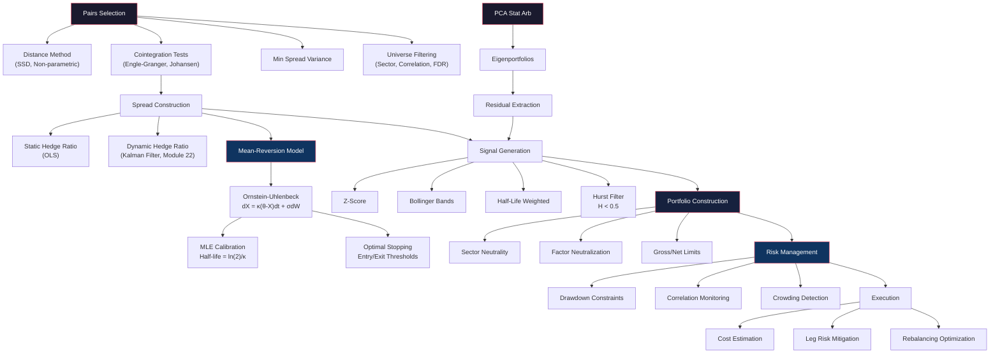

# Module 25: Statistical Arbitrage & Pairs Trading

> **Prerequisites:** Modules 04 (Stochastic Calculus), 21 (Time Series Analysis), 22 (Kalman Filters & State-Space Models), 24 (Risk Management & Portfolio Theory)
> **Builds toward:** Modules 30 (Systematic Trading Systems), 32 (Portfolio Construction), 33 (Algorithmic Trading Systems)

---

## Table of Contents

1. [Pairs Selection Methods](#1-pairs-selection-methods)
2. [Cointegration-Based Trading](#2-cointegration-based-trading)
3. [Ornstein-Uhlenbeck Process](#3-ornstein-uhlenbeck-process)
4. [PCA-Based Statistical Arbitrage](#4-pca-based-statistical-arbitrage)
5. [Mean-Reversion Signals](#5-mean-reversion-signals)
6. [Multi-Asset Statistical Arbitrage](#6-multi-asset-statistical-arbitrage)
7. [Risk Management for Stat Arb](#7-risk-management-for-stat-arb)
8. [Capacity and Crowding](#8-capacity-and-crowding)
9. [Implementation Considerations](#9-implementation-considerations)
10. [Case Studies](#10-case-studies)
11. [Implementation: Python](#11-implementation-python)
12. [Implementation: C++](#12-implementation-cpp)
13. [Exercises](#13-exercises)
14. [Summary and Concept Map](#14-summary-and-concept-map)

---

## 1. Pairs Selection Methods

Statistical arbitrage rests on identifying groups of securities whose prices are bound together by an economic or statistical relationship. The first -- and arguably most critical -- step in any stat arb strategy is selecting which pairs (or baskets) to trade. A poor selection methodology generates spurious relationships that break down out of sample, while a robust one identifies genuine equilibrium linkages that persist.

### 1.1 Distance Method (Sum of Squared Differences)

The simplest and oldest approach, introduced by Gatev, Goetzmann, and Rouwenhorst (2006), is purely non-parametric. Given $N$ assets with normalized price series $\{P_i(t)\}_{t=1}^T$, normalize each series to start at unity:

$$\tilde{P}_i(t) = \frac{P_i(t)}{P_i(1)}$$

For each pair $(i, j)$, compute the sum of squared differences (SSD):

$$D_{ij} = \sum_{t=1}^{T} \left(\tilde{P}_i(t) - \tilde{P}_j(t)\right)^2$$

The pairs with the smallest $D_{ij}$ values are selected for trading. The method has the virtue of imposing no parametric assumptions -- it requires neither normality, linearity, nor stationarity of the spread. Its weakness is that small SSD does not guarantee mean-reversion: two series that happen to track each other in-sample may diverge permanently out of sample.

**Statistical refinement.** To assess whether a given $D_{ij}$ is significantly small, we can compute the empirical distribution of all $\binom{N}{2}$ pairwise distances and select pairs below a threshold percentile (e.g., the 1st percentile). Alternatively, bootstrap the null distribution by permuting time indices.

### 1.2 Cointegration Tests

Cointegration provides a rigorous econometric foundation. Two $I(1)$ series $P_t^A$ and $P_t^B$ are cointegrated if there exists a linear combination $S_t = P_t^A - \beta P_t^B$ that is $I(0)$ (stationary). This is a much stronger requirement than correlation: correlated series can diverge without bound, while cointegrated series are bound to a long-run equilibrium.

#### 1.2.1 Engle-Granger Two-Step Test

**Step 1.** Estimate the cointegrating regression by OLS:

$$P_t^A = \hat{\alpha} + \hat{\beta} P_t^B + \hat{u}_t$$

**Step 2.** Test the residuals $\hat{u}_t$ for stationarity using the ADF test (Module 21). The null hypothesis is that $\hat{u}_t$ has a unit root (no cointegration). Critically, the ADF critical values must be adjusted because the residuals are generated from an estimated regression, not observed directly. The correct critical values come from the Engle-Granger tables (or MacKinnon surface response regressions):

| Significance | No constant | Constant | Constant + Trend |
|-------------|-------------|----------|-------------------|
| 1%          | $-2.5658$   | $-3.4336$| $-3.9638$         |
| 5%          | $-1.9393$   | $-2.8621$| $-3.4126$         |
| 10%         | $-1.6156$   | $-2.5671$| $-3.1279$         |

These are more negative than standard ADF critical values because the OLS residuals are constructed to be as stationary as possible, biasing the test toward rejection.

#### 1.2.2 Johansen Test

The Johansen procedure generalizes cointegration testing to systems of $n > 2$ variables. Consider a VAR($p$) model for $\mathbf{y}_t \in \mathbb{R}^n$:

$$\Delta \mathbf{y}_t = \Pi \mathbf{y}_{t-1} + \sum_{i=1}^{p-1} \Gamma_i \Delta \mathbf{y}_{t-i} + \boldsymbol{\varepsilon}_t$$

where $\Pi = \sum_{i=1}^p A_i - \mathbf{I}$ is the long-run impact matrix. The rank of $\Pi$ equals the number of cointegrating relationships $r$:

- $\text{rank}(\Pi) = 0$: no cointegration (all series are $I(1)$ and unrelated in levels)
- $\text{rank}(\Pi) = n$: full rank, all series are $I(0)$ (stationary in levels)
- $0 < \text{rank}(\Pi) = r < n$: exactly $r$ cointegrating vectors exist

The matrix $\Pi$ is decomposed as $\Pi = \boldsymbol{\alpha}\boldsymbol{\beta}^\top$, where $\boldsymbol{\beta} \in \mathbb{R}^{n \times r}$ contains the cointegrating vectors and $\boldsymbol{\alpha} \in \mathbb{R}^{n \times r}$ contains the adjustment (loading) coefficients. The $\boldsymbol{\beta}$ columns define the stationary linear combinations; the $\boldsymbol{\alpha}$ rows describe how each variable adjusts to deviations from equilibrium.

**Trace test statistic:**

$$\lambda_{\text{trace}}(r) = -T \sum_{i=r+1}^{n} \ln(1 - \hat{\lambda}_i)$$

**Maximum eigenvalue test statistic:**

$$\lambda_{\max}(r, r+1) = -T \ln(1 - \hat{\lambda}_{r+1})$$

where $\hat{\lambda}_1 \geq \hat{\lambda}_2 \geq \cdots \geq \hat{\lambda}_n$ are the eigenvalues from the reduced rank regression. Both statistics test $H_0: \text{rank}(\Pi) \leq r$ against $H_1: \text{rank}(\Pi) > r$ (trace) or $\text{rank}(\Pi) = r+1$ (max eigenvalue).

### 1.3 Minimum Spread Variance

An alternative selection criterion directly minimizes the variance of the spread. Given candidate pairs, construct the spread $S_t = P_t^A - \beta P_t^B$ and choose $\beta$ to minimize $\text{Var}(S_t)$. The optimal hedge ratio under this criterion is:

$$\beta^* = \frac{\text{Cov}(P_t^A, P_t^B)}{\text{Var}(P_t^B)}$$

which is simply the OLS slope from regressing $P_t^A$ on $P_t^B$. While this is identical to the Engle-Granger first step, the minimum spread variance interpretation highlights a different objective: we seek the combination with the tightest spread, regardless of whether it is formally stationary. In practice, combining this criterion with a stationarity test (requiring both low variance and stationarity) yields the most robust pair selection.

### 1.4 Universe Filtering and Pre-Screening

With $N = 500$ stocks, there are $\binom{500}{2} = 124{,}750$ candidate pairs. Testing all of them for cointegration at the 5% level would produce approximately 6,237 false positives. Practical strategies to manage multiple testing include:

1. **Sector restriction:** Only test pairs within the same GICS sector or sub-industry. This reduces the universe by an order of magnitude and increases the probability that a statistical relationship has an economic foundation.
2. **Correlation pre-filter:** Only test pairs with correlation above a threshold (e.g., $\rho > 0.8$). Cointegration implies high correlation, though the converse is false.
3. **Bonferroni / Holm correction:** Adjust the significance level for the number of tests performed.
4. **False Discovery Rate (FDR):** Control the expected proportion of false discoveries using the Benjamini-Hochberg procedure.

---

## 2. Cointegration-Based Trading

### 2.1 The Engle-Granger Trading Procedure

Once a cointegrated pair is identified, the trading logic follows the **error correction model** (ECM). If $S_t = P_t^A - \beta P_t^B - \mu$ is the demeaned spread, the ECM for the pair is:

$$\Delta P_t^A = \alpha_A S_{t-1} + \text{(short-run dynamics)} + \varepsilon_t^A$$
$$\Delta P_t^B = \alpha_B S_{t-1} + \text{(short-run dynamics)} + \varepsilon_t^B$$

For the spread to be mean-reverting, we need $\alpha_A < 0$ (asset A moves back toward equilibrium when spread is positive) and/or $\alpha_B > 0$ (asset B adjusts upward). The speed of adjustment is governed by $|\alpha_A| + |\alpha_B|$.

**Trading rules:**

1. Compute the spread $S_t = P_t^A - \hat{\beta} P_t^B$
2. Standardize: $z_t = (S_t - \bar{S}) / \sigma_S$
3. **Enter long spread** (long A, short B) when $z_t < -z_{\text{entry}}$
4. **Enter short spread** (short A, long B) when $z_t > z_{\text{entry}}$
5. **Exit** when $z_t$ crosses zero (or $\pm z_{\text{exit}}$)
6. **Stop-loss** when $|z_t| > z_{\text{stop}}$ (cointegration may have broken down)

Typical thresholds: $z_{\text{entry}} = 2.0$, $z_{\text{exit}} = 0.0$ or $0.5$, $z_{\text{stop}} = 4.0$.

### 2.2 Dynamic Hedge Ratios via Kalman Filter

The static hedge ratio $\hat{\beta}$ from OLS is estimated over the full sample and is therefore backward-looking and unresponsive to structural shifts. In practice, the relationship between assets evolves over time due to changing fundamentals, sector rotations, and regime shifts.

The **Kalman filter** (Module 22) provides an optimal framework for tracking a time-varying hedge ratio. Model the spread relationship as a state-space system:

**Observation equation:**

$$P_t^A = \beta_t P_t^B + \alpha_t + \varepsilon_t, \quad \varepsilon_t \sim \mathcal{N}(0, V_e)$$

**State transition equation:**

$$\begin{pmatrix} \beta_t \\ \alpha_t \end{pmatrix} = \begin{pmatrix} \beta_{t-1} \\ \alpha_{t-1} \end{pmatrix} + \begin{pmatrix} \eta_t^{\beta} \\ \eta_t^{\alpha} \end{pmatrix}, \quad \begin{pmatrix} \eta_t^{\beta} \\ \eta_t^{\alpha} \end{pmatrix} \sim \mathcal{N}\left(\mathbf{0}, \begin{pmatrix} V_{\beta} & 0 \\ 0 & V_{\alpha} \end{pmatrix}\right)$$

The observation matrix is $\mathbf{Z}_t = \begin{pmatrix} P_t^B & 1 \end{pmatrix}$, and the state transition matrix is $\mathbf{T} = \mathbf{I}_2$. The Kalman filter recursion produces:

- $\hat{\beta}_{t|t}$: the filtered (real-time) hedge ratio estimate
- $P_{t|t}^{\beta}$: the uncertainty (variance) of the hedge ratio estimate

The filtered spread is then:

$$S_t = P_t^A - \hat{\beta}_{t|t} P_t^B - \hat{\alpha}_{t|t}$$

**Advantages over rolling OLS:**

| Property | Rolling OLS | Kalman Filter |
|----------|------------|---------------|
| Weighting | Equal within window | Exponentially decaying (implicit) |
| Window selection | Arbitrary lookback | Determined by $V_\beta / V_e$ ratio |
| Parameter uncertainty | Not tracked | Explicitly via $P_{t|t}$ |
| Adaptivity | Abrupt at window edge | Smooth, continuous |

The ratio $V_\beta / V_e$ controls adaptivity: large $V_\beta$ allows rapid hedge ratio changes (responsive but noisy); small $V_\beta$ produces a sluggish but stable estimate.

### 2.3 Total Return Spreads

A subtle but critical implementation detail: pairs trading on **price levels** is incorrect when stocks pay dividends. The spread should be constructed using **total return** series $\text{TR}_t^i$, or equivalently, the strategy P&L should include dividend flows. Failure to account for dividends introduces a systematic downward bias in the spread for pairs where one stock has a higher yield.

---

## 3. Ornstein-Uhlenbeck Process

The Ornstein-Uhlenbeck (OU) process is the canonical continuous-time model for mean-reverting spreads. It is the continuous-time analog of the AR(1) process and provides a tractable framework for calibration, optimal trading, and risk management.

### 3.1 Definition and Solution

The OU process $X_t$ satisfies the stochastic differential equation:

$$dX_t = \kappa(\theta - X_t)\,dt + \sigma\,dW_t$$

where:
- $\kappa > 0$ is the **mean-reversion speed** (rate of pull toward equilibrium)
- $\theta$ is the **long-run mean** (equilibrium level)
- $\sigma > 0$ is the **diffusion coefficient** (volatility of innovations)
- $W_t$ is a standard Brownian motion

**Derivation of the solution.** Define $Y_t = e^{\kappa t} X_t$. By Ito's lemma:

$$dY_t = \kappa e^{\kappa t} X_t\,dt + e^{\kappa t}\,dX_t$$

$$= \kappa e^{\kappa t} X_t\,dt + e^{\kappa t}\left[\kappa(\theta - X_t)\,dt + \sigma\,dW_t\right]$$

$$= \kappa \theta e^{\kappa t}\,dt + \sigma e^{\kappa t}\,dW_t$$

Integrating from $s$ to $t$:

$$Y_t - Y_s = \kappa \theta \int_s^t e^{\kappa u}\,du + \sigma \int_s^t e^{\kappa u}\,dW_u$$

$$e^{\kappa t} X_t - e^{\kappa s} X_s = \theta(e^{\kappa t} - e^{\kappa s}) + \sigma \int_s^t e^{\kappa u}\,dW_u$$

Dividing by $e^{\kappa t}$:

$$\boxed{X_t = \theta + (X_s - \theta)e^{-\kappa(t-s)} + \sigma \int_s^t e^{-\kappa(t-u)}\,dW_u}$$

The conditional distribution is Gaussian:

$$X_t \mid X_s \sim \mathcal{N}\left(\theta + (X_s - \theta)e^{-\kappa(t-s)},\; \frac{\sigma^2}{2\kappa}\left(1 - e^{-2\kappa(t-s)}\right)\right)$$

The unconditional (stationary) distribution is:

$$X_\infty \sim \mathcal{N}\left(\theta,\; \frac{\sigma^2}{2\kappa}\right)$$

### 3.2 Calibration via Maximum Likelihood Estimation

For a discretely observed OU process with observations $\{x_0, x_1, \ldots, x_n\}$ at equal intervals $\Delta t$, the exact discrete transition is AR(1):

$$x_{t+1} = a + b\,x_t + \epsilon_t, \quad \epsilon_t \sim \mathcal{N}(0, \sigma_\epsilon^2)$$

where:

$$b = e^{-\kappa \Delta t}, \quad a = \theta(1 - b), \quad \sigma_\epsilon^2 = \frac{\sigma^2}{2\kappa}(1 - b^2)$$

**Log-likelihood.** The log-likelihood for $n$ transitions is:

$$\ell(\kappa, \theta, \sigma) = -\frac{n}{2}\ln(2\pi) - \frac{n}{2}\ln(\sigma_\epsilon^2) - \frac{1}{2\sigma_\epsilon^2}\sum_{t=0}^{n-1}(x_{t+1} - a - b\,x_t)^2$$

**MLE derivation.** Taking partial derivatives and setting to zero:

$\frac{\partial \ell}{\partial a} = 0$ yields:

$$\hat{a} = \bar{x}_{+} - \hat{b}\,\bar{x}_{-}$$

where $\bar{x}_{+} = \frac{1}{n}\sum_{t=1}^{n} x_t$ and $\bar{x}_{-} = \frac{1}{n}\sum_{t=0}^{n-1} x_t$.

$\frac{\partial \ell}{\partial b} = 0$ yields:

$$\hat{b} = \frac{\sum_{t=0}^{n-1}(x_t - \bar{x}_{-})(x_{t+1} - \bar{x}_{+})}{\sum_{t=0}^{n-1}(x_t - \bar{x}_{-})^2} = \frac{S_{xy}}{S_{xx}}$$

$\frac{\partial \ell}{\partial \sigma_\epsilon^2} = 0$ yields:

$$\hat{\sigma}_\epsilon^2 = \frac{1}{n}\sum_{t=0}^{n-1}(x_{t+1} - \hat{a} - \hat{b}\,x_t)^2 = S_{yy} - \frac{S_{xy}^2}{S_{xx}}$$

where $S_{yy} = \frac{1}{n}\sum(x_{t+1} - \bar{x}_{+})^2$.

**Recovering OU parameters:**

$$\boxed{\hat{\kappa} = -\frac{\ln \hat{b}}{\Delta t}, \quad \hat{\theta} = \frac{\hat{a}}{1 - \hat{b}}, \quad \hat{\sigma} = \hat{\sigma}_\epsilon \sqrt{\frac{-2\ln \hat{b}}{\Delta t(1 - \hat{b}^2)}}}$$

### 3.3 Half-Life of Mean Reversion

The half-life is the expected time for the spread to revert halfway from its current value to the mean. From the conditional mean:

$$\mathbb{E}[X_t | X_0] = \theta + (X_0 - \theta)e^{-\kappa t}$$

Setting the deviation to half its initial value:

$$\frac{X_0 - \theta}{2} = (X_0 - \theta)e^{-\kappa t_{1/2}}$$

$$e^{-\kappa t_{1/2}} = \frac{1}{2}$$

$$\boxed{t_{1/2} = \frac{\ln 2}{\kappa}}$$

**Practical interpretation:** A spread with $\kappa = 0.1$ (daily) has $t_{1/2} \approx 6.93$ days. Spreads with half-lives shorter than typical holding periods (e.g., $< 5$ days for daily strategies) are attractive; those with half-lives exceeding a month may mean-revert too slowly to generate sufficient returns after costs.

### 3.4 Optimal Entry and Exit Thresholds via Optimal Stopping Theory

The fundamental question is: at what spread level should we enter and exit a trade? This is an **optimal stopping problem** that can be formulated rigorously.

**Setup.** The spread $X_t$ follows an OU process. The trader earns the spread when entering at level $b$ and exiting at level $a < b$ (for a short-spread trade). The objective is to maximize the expected discounted profit:

$$V(x) = \sup_{\tau_{\text{entry}}, \tau_{\text{exit}}} \mathbb{E}_x\left[e^{-r\tau_{\text{exit}}}X_{\tau_{\text{exit}}} - e^{-r\tau_{\text{entry}}}X_{\tau_{\text{entry}}} - c\right]$$

where $r$ is the discount rate (opportunity cost) and $c$ represents transaction costs.

**Free-boundary formulation.** In the continuation region, the value function satisfies the ODE (by the Feynman-Kac theorem):

$$\frac{\sigma^2}{2}V''(x) + \kappa(\theta - x)V'(x) - rV(x) = 0$$

with boundary conditions at the optimal entry ($b^*$) and exit ($a^*$) thresholds:

- **Value matching:** $V(b^*) = -b^*$, $V(a^*) = a^* - c$
- **Smooth pasting:** $V'(b^*) = -1$, $V'(a^*) = 1$

The solution involves confluent hypergeometric functions (Kummer's functions $M$ and $U$), and the optimal thresholds are found numerically. Key qualitative results:

1. **Optimal entry is finite:** There exists a finite $b^* > \theta$ (for short-spread entry). The trader should not wait indefinitely for extreme dislocations.
2. **Optimal exit is near the mean:** $a^*$ is typically close to $\theta$, but not exactly at $\theta$ due to the discount rate.
3. **Transaction costs widen the bands:** As $c$ increases, $b^*$ moves further from $\theta$ and $a^*$ moves closer to $\theta$.
4. **Faster mean-reversion narrows bands:** Higher $\kappa$ implies lower optimal thresholds because the expected holding time is shorter.

**Approximation for practitioners.** When $r$ is small, the near-optimal symmetric thresholds are approximately:

$$z^* \approx \sqrt{\frac{2c}{\sigma_S^2 / \kappa}} + \delta$$

where $\sigma_S^2 / \kappa$ is related to the expected P&L per unit of spread deviation and $\delta$ is a correction for the discount rate.

---

## 4. PCA-Based Statistical Arbitrage

Principal Component Analysis (PCA) provides a systematic framework for statistical arbitrage that extends beyond pairs to entire cross-sections of assets. The idea, developed by Avellaneda and Lee (2010), is to identify the dominant risk factors driving returns, and then trade the residuals -- the idiosyncratic component unexplained by these factors.

### 4.1 Eigenportfolios

Given an $N \times T$ matrix of asset returns $\mathbf{R}$, compute the sample covariance matrix $\hat{\Sigma} = \frac{1}{T-1}\mathbf{R}\mathbf{R}^\top$ and its eigendecomposition:

$$\hat{\Sigma} = \mathbf{V}\boldsymbol{\Lambda}\mathbf{V}^\top$$

where $\boldsymbol{\Lambda} = \text{diag}(\lambda_1, \lambda_2, \ldots, \lambda_N)$ with $\lambda_1 \geq \lambda_2 \geq \cdots \geq \lambda_N \geq 0$, and $\mathbf{V} = [\mathbf{v}_1, \mathbf{v}_2, \ldots, \mathbf{v}_N]$ are the eigenvectors.

Each eigenvector $\mathbf{v}_k$ defines an **eigenportfolio** -- a portfolio with weights proportional to $\mathbf{v}_k$. The first eigenportfolio typically represents the market factor (all weights roughly equal and positive), the second often captures a sector or value/growth rotation, and so on.

### 4.2 Principal Component Returns

The return of the $k$-th principal component at time $t$ is:

$$F_k(t) = \mathbf{v}_k^\top \mathbf{r}_t$$

where $\mathbf{r}_t$ is the $N \times 1$ vector of asset returns at time $t$. These PC returns are uncorrelated by construction: $\text{Cov}(F_j, F_k) = 0$ for $j \neq k$.

### 4.3 Residual Alpha Extraction

The factor model decomposition of asset $i$'s return is:

$$r_{i,t} = \sum_{k=1}^{K} \beta_{ik} F_k(t) + \epsilon_{i,t}$$

where $K \ll N$ is the number of retained factors (chosen by scree plot, eigenvalue ratio, or Bai-Ng criteria). The residual $\epsilon_{i,t}$ represents the **idiosyncratic return** -- the component unexplained by the dominant factors.

**Trading the residuals.** If the cumulative residual $S_{i,t} = \sum_{s=1}^{t} \epsilon_{i,s}$ is mean-reverting (which it should be if the factor model is well-specified), then:

1. Estimate the OU parameters $(\kappa_i, \theta_i, \sigma_i)$ from $S_{i,t}$
2. Compute the z-score: $z_{i,t} = (S_{i,t} - \theta_i) / (\sigma_i / \sqrt{2\kappa_i})$
3. Enter long when $z_{i,t} < -z^*$, short when $z_{i,t} > z^*$
4. Hedge factor exposure by simultaneously holding offsetting positions in the eigenportfolios

The key advantage is that the resulting strategy is **market-neutral and factor-neutral** by construction, since all systematic risk is absorbed by the factor hedges.

### 4.4 Number of Factors: Bai-Ng Information Criteria

Selecting $K$ is critical. Too few factors leave systematic risk in the residuals (spurious mean-reversion); too many remove genuine alpha. The Bai-Ng (2002) information criteria are:

$$IC_1(K) = \ln\left(\hat{\sigma}_K^2\right) + K \cdot \frac{N + T}{NT}\ln\left(\frac{NT}{N+T}\right)$$

$$IC_2(K) = \ln\left(\hat{\sigma}_K^2\right) + K \cdot \frac{N + T}{NT}\ln\left(\min(N, T)\right)$$

where $\hat{\sigma}_K^2 = \frac{1}{NT}\sum_{i,t}\hat{\epsilon}_{i,t}^2$ is the average residual variance with $K$ factors.

---

## 5. Mean-Reversion Signals

Once a mean-reverting spread is identified, the signal generation mechanism determines when and how aggressively to trade. Multiple signal types exist, each with different properties.

### 5.1 Z-Score

The simplest and most common signal. For spread $S_t$ with rolling mean $\bar{S}_t$ and rolling standard deviation $\sigma_t$:

$$z_t = \frac{S_t - \bar{S}_t}{\sigma_t}$$

Under the OU model, if the spread is in its stationary distribution, $z_t \sim \mathcal{N}(0, 1)$ approximately. A $z$-score of $\pm 2$ represents a roughly 2.3% tail event.

**Lookback window selection.** The lookback for computing $\bar{S}_t$ and $\sigma_t$ should be calibrated to the half-life. A rule of thumb: set the lookback to $4 \times t_{1/2}$ to capture approximately $1 - e^{-4} \approx 98\%$ of the mean-reversion cycle.

### 5.2 Bollinger Bands

Bollinger bands are a visual and practical extension of the z-score. The bands are:

$$\text{Upper} = \bar{S}_t + k\sigma_t, \quad \text{Lower} = \bar{S}_t - k\sigma_t$$

Typical $k = 2$. Entry occurs when the spread crosses outside the bands; exit when it returns to the mean. The key addition over a raw z-score is the **bandwidth** metric:

$$\text{BW}_t = \frac{k\sigma_t}{\bar{S}_t}$$

Widening bandwidth signals increasing spread volatility (potential regime change); narrowing bandwidth signals a quiet spread (potential low-alpha environment).

### 5.3 Half-Life-Weighted Signals

Rather than using a fixed lookback, we can weight historical observations by the OU kernel. Define the exponentially weighted z-score:

$$z_t^{(\text{HL})} = \frac{S_t - \hat{\theta}_t}{\hat{\sigma}_{\infty,t}}$$

where $\hat{\theta}_t$ is the Kalman-filtered estimate of the long-run mean, and $\hat{\sigma}_{\infty,t} = \hat{\sigma}_t / \sqrt{2\hat{\kappa}_t}$ is the estimated stationary standard deviation. This signal automatically adapts to changes in the OU parameters.

### 5.4 Hurst Exponent Filter

The **Hurst exponent** $H$ classifies time series behavior:

- $H < 0.5$: mean-reverting (anti-persistent)
- $H = 0.5$: random walk (geometric Brownian motion)
- $H > 0.5$: trending (persistent)

For stat arb, we require $H < 0.5$. The rescaled range (R/S) estimator is:

$$\mathbb{E}\left[\frac{R(n)}{S(n)}\right] = C \cdot n^H$$

where $R(n)$ is the range of cumulative deviations from the mean over a window of size $n$, $S(n)$ is the standard deviation, and $C$ is a constant. Taking logarithms:

$$\ln\left(\frac{R(n)}{S(n)}\right) = H \ln(n) + \ln(C)$$

The Hurst exponent is estimated as the slope of $\ln(R/S)$ vs. $\ln(n)$ across multiple window sizes.

**Signal filter:** Only trade pairs where the rolling Hurst exponent satisfies $H_t < 0.45$ (with some margin below 0.5 to account for estimation noise). This filters out pairs that have temporarily lost their mean-reverting character.

---

## 6. Multi-Asset Statistical Arbitrage

### 6.1 Basket Construction

Extending beyond pairs to $k$-asset baskets significantly expands the opportunity set. Given a target asset $i$ and a universe of $N$ potential hedge assets, find weights $\mathbf{w}$ such that the basket spread $S_t = P_{i,t} - \mathbf{w}^\top \mathbf{P}_{-i,t}$ is stationary and has the highest signal-to-noise ratio.

**Optimization formulation:**

$$\min_{\mathbf{w}} \quad \text{Var}(\Delta S_t) \quad \text{s.t.} \quad \text{ADF}(S_t) < c_\alpha, \quad \|\mathbf{w}\|_0 \leq k_{\max}$$

The cardinality constraint $\|\mathbf{w}\|_0 \leq k_{\max}$ limits the number of hedge assets (typically $k_{\max} \leq 10$) for tractability and transaction cost management. In practice, this is solved via LASSO-penalized cointegration:

$$\min_{\mathbf{w}} \sum_{t=1}^{T}\left(P_{i,t} - \mathbf{w}^\top \mathbf{P}_{-i,t}\right)^2 + \lambda \|\mathbf{w}\|_1$$

### 6.2 Sector Neutrality

A sector-neutral stat arb portfolio is constructed so that the net dollar exposure to each GICS sector is zero:

$$\sum_{i \in \text{Sector}_k} w_i = 0 \quad \forall k$$

This eliminates sector-level systematic risk, ensuring that the strategy's P&L comes exclusively from stock-specific mean-reversion rather than sector bets.

### 6.3 Factor Neutralization

Extending sector neutrality to continuous factors, we can require neutrality to any set of risk factors $\{\mathbf{f}_1, \ldots, \mathbf{f}_K\}$:

$$\mathbf{B}^\top \mathbf{w} = \mathbf{0}$$

where $\mathbf{B}$ is the $N \times K$ factor loading matrix (e.g., from a Barra or Axioma risk model). Common neutralization targets include market beta, size, value, momentum, and volatility. The neutralized portfolio return is:

$$r_p = \mathbf{w}^\top \mathbf{r} = \mathbf{w}^\top (\mathbf{B}\mathbf{f} + \boldsymbol{\epsilon}) = \mathbf{w}^\top \boldsymbol{\epsilon}$$

since $\mathbf{w}^\top \mathbf{B} = \mathbf{0}^\top$. The portfolio earns only idiosyncratic returns.

---

## 7. Risk Management for Stat Arb

Statistical arbitrage strategies are exposed to specific risks that differ qualitatively from directional strategies. The primary risk is that a historically stable statistical relationship **breaks down**, turning a convergence trade into a divergence loss.

### 7.1 Maximum Drawdown Constraints

Define the running maximum of the strategy's cumulative P&L $V_t$:

$$M_t = \max_{s \leq t} V_s$$

The drawdown at time $t$ is $D_t = M_t - V_t$, and the maximum drawdown over $[0, T]$ is:

$$\text{MDD} = \max_{t \in [0,T]} D_t$$

**Drawdown constraint implementation.** Set a hard limit $D_{\max}$ (e.g., 10% of capital). When $D_t > D_{\max}$, systematically reduce position sizes:

$$\text{Position size}_t = \text{Target size} \times \max\left(0, 1 - \frac{D_t - D_{\text{threshold}}}{D_{\max} - D_{\text{threshold}}}\right)$$

This provides a smooth ramp-down rather than an abrupt stop, which is preferable because drawdown events may be temporary.

### 7.2 Correlation Breakdown Detection

Stat arb strategies are most vulnerable during **correlation regime shifts** -- periods when historically stable relationships dislocate violently. Detection methods include:

1. **EWMA correlation monitoring:** Track the exponentially weighted correlation between pair constituents. If $\rho_t$ drops below a threshold (e.g., $\rho_t < 0.5$ when historical $\rho > 0.9$), suspend trading.

2. **CUSUM test on spread residuals:** The cumulative sum test detects persistent shifts in the spread mean. Define:

$$C_t^+ = \max(0, C_{t-1}^+ + (S_t - \theta) - k)$$

where $k$ is a slack parameter. An alarm is triggered when $C_t^+ > h$ (threshold).

3. **Structural break tests:** Apply the Chow test or Bai-Perron test to detect breaks in the cointegrating relationship.

### 7.3 Gross and Net Exposure Limits

- **Gross exposure** = $\sum_i |w_i|$: total capital at risk. Typical limit: 2x-6x for leveraged stat arb.
- **Net exposure** = $\sum_i w_i$: directional bias. Target: $< 5\%$ of gross for market-neutral.
- **Pair gross limit**: No single pair should exceed a fixed percentage (e.g., 5%) of total gross.
- **Sector gross limit**: No sector should represent more than (e.g., 25%) of gross.

### 7.4 Tail Risk and Liquidation Cascades

The August 2007 quant crisis demonstrated that stat arb strategies are vulnerable to **crowding** and **forced liquidation cascades**. When multiple funds hold similar positions and one fund is forced to liquidate, the resulting price impact pushes spreads further from equilibrium, triggering stop-losses at other funds, creating a self-reinforcing spiral. Defenses include:

- Maintaining lower leverage than the theoretical optimum
- Diversifying across pair selection methodologies
- Monitoring aggregate strategy P&L for unusual moves
- Stress-testing the portfolio against historical crisis scenarios (e.g., August 2007, March 2020)

---

## 8. Capacity and Crowding

### 8.1 Estimating Strategy Capacity

Strategy capacity is the maximum capital that can be deployed before execution costs and market impact erode returns to zero. For a stat arb strategy, capacity is bounded by:

$$\text{Capacity} \approx \frac{\text{Expected gross alpha} - \text{Fixed costs}}{\text{Market impact per dollar traded}}$$

More precisely, if the strategy trades $N_p$ pairs with average daily turnover $\text{ADV}_i$ for pair $i$, and market impact follows a square-root model:

$$\text{Impact}_i = \sigma_i \sqrt{\frac{Q_i}{\text{ADV}_i}}$$

where $Q_i$ is the order size, then the strategy capacity $C$ satisfies:

$$\alpha_{\text{gross}} - \sum_i \sigma_i \sqrt{\frac{C \cdot w_i}{\text{ADV}_i}} = \alpha_{\text{target}}$$

where $\alpha_{\text{target}}$ is the minimum acceptable net alpha (e.g., the risk-free rate).

### 8.2 Crowding Indicators

Detecting when a strategy is crowded (and therefore vulnerable to correlated unwinding) is a first-order risk management concern. Practical indicators include:

1. **Short interest concentration:** High short interest in pair constituents signals crowded trades.
2. **Spread autocorrelation changes:** If previously mean-reverting spreads become persistent ($H \to 0.5$ or above), crowding may be inflating the spread.
3. **Strategy return correlation:** If the strategy's returns become correlated with known stat arb indices or factor returns, it suggests overlap with other managers.
4. **Borrowing costs:** Rising stock lending fees for short legs indicate crowding.
5. **Spread half-life lengthening:** A systematic increase in $t_{1/2}$ across many pairs suggests that the flow from stat arb traders is slowing convergence.

---

## 9. Implementation Considerations

### 9.1 Execution Costs

Transaction costs are the primary determinant of stat arb profitability. The relevant cost components are:

| Component | Typical Range | Notes |
|-----------|--------------|-------|
| Commission | 0.1-1.0 bps | Negligible for institutional |
| Bid-ask spread | 1-10 bps | Dominant for liquid stocks |
| Market impact | 2-20 bps | Function of order size / ADV |
| Short borrowing | 25-300 bps/yr | Highly variable, can spike |
| Funding cost | SOFR + spread | Leverage cost |

The **breakeven spread** for a round-trip trade is:

$$z_{\text{breakeven}} = \frac{2 \times \text{total cost per leg}}{\sigma_S} \times \sqrt{2\kappa}$$

Pairs with $z^* < z_{\text{breakeven}}$ are unprofitable after costs.

### 9.2 Slippage

Slippage -- the difference between the theoretical execution price and the actual fill -- arises from:

1. **Latency:** The spread moves between signal generation and execution.
2. **Partial fills:** Limit orders may not be fully filled, leaving the position unhedged.
3. **Leg risk:** In a pairs trade, one leg fills but the other does not (or fills at a worse price).

**Leg risk mitigation:** Use simultaneous market orders for both legs (guarantees execution but accepts spread crossing) or use a parent order management system that links the two legs and adjusts one if the other moves.

### 9.3 Rebalancing Frequency Optimization

The optimal rebalancing frequency balances signal decay against transaction costs. Let $\alpha(\Delta t)$ be the expected alpha per rebalancing with interval $\Delta t$, and $c$ the round-trip cost. The net alpha is:

$$\alpha_{\text{net}}(\Delta t) = \alpha(\Delta t) - \frac{c}{\Delta t}$$

For an OU process with mean-reversion speed $\kappa$, the signal half-life is $\ln(2)/\kappa$. Rebalancing more frequently than $t_{1/2}/4$ captures diminishing incremental alpha while incurring full costs. A practical heuristic: set rebalancing frequency to $t_{1/2}/2$.

---

## 10. Case Studies

### 10.1 ETF Arbitrage

Exchange-traded funds create natural stat arb opportunities because the ETF price is tied to its net asset value (NAV) by the creation/redemption mechanism.

**Example: SPY vs. basket of constituents.** The spread $S_t = P_t^{\text{SPY}} - \text{NAV}_t$ is mean-reverting by construction, with authorized participants (APs) enforcing convergence. The spread fluctuates due to:

- Stale NAV pricing (especially near market close)
- Demand/supply imbalances in the ETF vs. constituents
- Liquidity differentials

The half-life is typically measured in minutes, making this a high-frequency strategy. The alpha is small (1-5 bps per round trip) but highly repeatable.

**International ETFs** (e.g., EWJ for Japan) offer wider spreads because the underlying trades in a different time zone, creating genuine information asymmetry during the overlap and stale pricing outside it.

### 10.2 Index Rebalancing Arbitrage

When a stock is added to (removed from) an index, index-tracking funds must buy (sell) it, creating predictable demand. The stat arb strategy:

1. **Announcement day:** Go long the addition, short the deletion (or a basket of similar stocks).
2. **Between announcement and effective date:** The spread widens as anticipatory buying drives the addition up.
3. **Effective date:** Close positions as index funds complete their rebalancing.

Empirically, additions to the S&P 500 experience abnormal returns of 3-7% between announcement and effective date, with partial reversal afterward. The stat arb approach hedges market risk by pairing additions with deletions or sector-matched controls.

### 10.3 Convertible Bond Arbitrage

Convertible bond arbitrage is a classic stat arb strategy: long the convertible bond, short the underlying equity (delta-hedged). The spread between the convertible's market price and its theoretical value (from a pricing model incorporating credit risk, volatility, and equity price) should be mean-reverting.

The delta hedge ratio comes from the convertible pricing model:

$$\Delta = \frac{\partial V_{\text{CB}}}{\partial S}$$

where $V_{\text{CB}}$ is the convertible bond value and $S$ is the stock price. The hedge is dynamic and must be updated as the stock price moves, creating a natural analogy with the Kalman filter framework: the hedge ratio (state) evolves over time and is estimated from noisy observations of the convertible and equity prices.

---

## 11. Implementation: Python

### 11.1 Pairs Selection and Cointegration Testing

```python
"""
Module 25 - Statistical Arbitrage: Pairs Selection & Cointegration Testing
Depends on: numpy, pandas, statsmodels, scipy, itertools
"""

import numpy as np
import pandas as pd
from statsmodels.tsa.stattools import adfuller, coint
from statsmodels.regression.linear_model import OLS
from statsmodels.tools import add_constant
from itertools import combinations
from typing import Tuple, List, Dict, Optional
from dataclasses import dataclass


@dataclass
class PairResult:
    """Container for pair selection results."""
    asset_a: str
    asset_b: str
    coint_pvalue: float
    hedge_ratio: float
    half_life: float
    hurst_exponent: float
    spread_std: float


def distance_method(
    prices: pd.DataFrame,
    top_n: int = 20,
) -> List[Tuple[str, str, float]]:
    """
    Select pairs using the sum-of-squared-differences (SSD) method.

    Parameters
    ----------
    prices : pd.DataFrame
        Price dataframe, columns = tickers, index = dates.
    top_n : int
        Number of top pairs to return.

    Returns
    -------
    List of (ticker_a, ticker_b, ssd) sorted by SSD ascending.
    """
    # Normalize prices to start at 1
    normalized = prices / prices.iloc[0]

    tickers = normalized.columns.tolist()
    pairs_ssd = []

    for i, j in combinations(range(len(tickers)), 2):
        ssd = np.sum((normalized.iloc[:, i].values
                       - normalized.iloc[:, j].values) ** 2)
        pairs_ssd.append((tickers[i], tickers[j], ssd))

    pairs_ssd.sort(key=lambda x: x[2])
    return pairs_ssd[:top_n]


def engle_granger_test(
    y: np.ndarray,
    x: np.ndarray,
    significance: float = 0.05,
) -> Tuple[bool, float, float, float]:
    """
    Engle-Granger two-step cointegration test.

    Parameters
    ----------
    y : np.ndarray
        Dependent variable (price series A).
    x : np.ndarray
        Independent variable (price series B).
    significance : float
        Significance level for the ADF test on residuals.

    Returns
    -------
    (is_cointegrated, p_value, hedge_ratio, intercept)
    """
    # Step 1: OLS regression y = alpha + beta * x + u
    X = add_constant(x)
    model = OLS(y, X).fit()
    intercept, hedge_ratio = model.params[0], model.params[1]
    residuals = model.resid

    # Step 2: ADF test on residuals (Engle-Granger critical values)
    adf_stat, p_value, _, _, critical_values, _ = adfuller(
        residuals, maxlag=None, regression='c', autolag='AIC'
    )

    is_cointegrated = p_value < significance
    return is_cointegrated, p_value, hedge_ratio, intercept


def johansen_cointegration(
    data: pd.DataFrame,
    det_order: int = 0,
    k_ar_diff: int = 1,
) -> dict:
    """
    Johansen cointegration test for multiple time series.

    Parameters
    ----------
    data : pd.DataFrame
        Price dataframe with multiple series.
    det_order : int
        Deterministic trend order (-1: no constant, 0: constant, 1: trend).
    k_ar_diff : int
        Number of lagged differences in the VAR model.

    Returns
    -------
    Dictionary with trace statistics, eigenvalues, and cointegrating vectors.
    """
    from statsmodels.tsa.vector_ar.vecm import coint_johansen

    result = coint_johansen(data.values, det_order, k_ar_diff)

    return {
        'trace_stat': result.lr1,           # Trace test statistics
        'trace_crit': result.cvt,           # Critical values (90%, 95%, 99%)
        'max_eig_stat': result.lr2,         # Max eigenvalue statistics
        'max_eig_crit': result.cvm,         # Critical values
        'eigenvalues': result.eig,          # Eigenvalues
        'cointegrating_vectors': result.evec,  # Eigenvectors (beta)
        'num_cointegrating': np.sum(
            result.lr1 > result.cvt[:, 1]   # Count at 95% level
        ),
    }
```

### 11.2 Ornstein-Uhlenbeck Calibration

```python
@dataclass
class OUParams:
    """Ornstein-Uhlenbeck process parameters."""
    kappa: float      # Mean-reversion speed
    theta: float      # Long-run mean
    sigma: float      # Diffusion coefficient
    half_life: float  # ln(2) / kappa

    @property
    def stationary_std(self) -> float:
        """Standard deviation of the stationary distribution."""
        return self.sigma / np.sqrt(2 * self.kappa)


def calibrate_ou_mle(
    spread: np.ndarray,
    dt: float = 1.0,
) -> OUParams:
    """
    Calibrate Ornstein-Uhlenbeck parameters via exact MLE.

    The discrete-time representation is:
        x_{t+1} = a + b * x_t + eps,  eps ~ N(0, sigma_eps^2)

    where b = exp(-kappa*dt), a = theta*(1-b),
    sigma_eps^2 = sigma^2/(2*kappa)*(1 - b^2).

    Parameters
    ----------
    spread : np.ndarray
        Observed spread time series.
    dt : float
        Time step between observations (1.0 for daily).

    Returns
    -------
    OUParams with estimated kappa, theta, sigma.
    """
    n = len(spread) - 1
    x = spread[:-1]  # x_t (lagged)
    y = spread[1:]   # x_{t+1}

    # Sufficient statistics
    x_bar = np.mean(x)
    y_bar = np.mean(y)

    Sxx = np.sum((x - x_bar) ** 2) / n
    Sxy = np.sum((x - x_bar) * (y - y_bar)) / n
    Syy = np.sum((y - y_bar) ** 2) / n

    # MLE estimates for AR(1) parameters
    b_hat = Sxy / Sxx
    a_hat = y_bar - b_hat * x_bar
    sigma_eps_sq = Syy - Sxy ** 2 / Sxx

    # Guard against non-mean-reverting estimates
    if b_hat >= 1.0 or b_hat <= 0.0:
        raise ValueError(
            f"Estimated b = {b_hat:.4f} implies no mean reversion. "
            f"The spread may not be stationary."
        )

    # Convert to continuous-time OU parameters
    kappa = -np.log(b_hat) / dt
    theta = a_hat / (1 - b_hat)
    sigma = np.sqrt(
        sigma_eps_sq * (-2 * np.log(b_hat)) / (dt * (1 - b_hat ** 2))
    )
    half_life = np.log(2) / kappa

    return OUParams(
        kappa=kappa,
        theta=theta,
        sigma=sigma,
        half_life=half_life,
    )


def hurst_exponent(series: np.ndarray, max_lag: int = 100) -> float:
    """
    Estimate the Hurst exponent via the rescaled range (R/S) method.

    H < 0.5: mean-reverting
    H = 0.5: random walk
    H > 0.5: trending

    Parameters
    ----------
    series : np.ndarray
        Time series (typically spread levels).
    max_lag : int
        Maximum window size for R/S calculation.

    Returns
    -------
    Estimated Hurst exponent.
    """
    lags = range(2, max_lag)
    rs_values = []

    for lag in lags:
        # Split series into non-overlapping blocks of size 'lag'
        n_blocks = len(series) // lag
        if n_blocks < 1:
            break

        rs_block = []
        for i in range(n_blocks):
            block = series[i * lag:(i + 1) * lag]
            mean_block = np.mean(block)
            cumulative_dev = np.cumsum(block - mean_block)
            R = np.max(cumulative_dev) - np.min(cumulative_dev)
            S = np.std(block, ddof=1)
            if S > 1e-12:
                rs_block.append(R / S)

        if rs_block:
            rs_values.append((lag, np.mean(rs_block)))

    if len(rs_values) < 5:
        raise ValueError("Insufficient data for Hurst estimation.")

    log_lags = np.log([v[0] for v in rs_values])
    log_rs = np.log([v[1] for v in rs_values])

    # OLS: log(R/S) = H * log(lag) + const
    coeffs = np.polyfit(log_lags, log_rs, 1)
    return coeffs[0]
```

### 11.3 Kalman Filter Dynamic Hedge Ratio

```python
class KalmanHedgeRatio:
    """
    Kalman filter for tracking time-varying hedge ratio in pairs trading.

    State: [beta_t, alpha_t]^T  (hedge ratio and intercept)
    Observation: P_A(t) = beta_t * P_B(t) + alpha_t + eps_t
    Transition: state_t = state_{t-1} + eta_t  (random walk)

    Links to Module 22 (Kalman Filters & State-Space Models).
    """

    def __init__(
        self,
        delta: float = 1e-4,
        Ve: float = 1e-3,
    ):
        """
        Parameters
        ----------
        delta : float
            State noise variance scaling. Controls adaptivity:
            larger delta -> faster adaptation, noisier estimates.
        Ve : float
            Observation noise variance. If None, estimated online.
        """
        self.delta = delta
        self.Ve = Ve

        # State: [beta, alpha]
        self.state = np.zeros(2)
        self.P = np.eye(2) * 1.0  # State covariance (high initial uncertainty)

        # Storage
        self.betas: List[float] = []
        self.alphas: List[float] = []
        self.spreads: List[float] = []
        self.forecast_errors: List[float] = []

    def update(self, price_a: float, price_b: float) -> float:
        """
        Process one observation and return the filtered spread.

        Parameters
        ----------
        price_a : float
            Price of asset A at time t.
        price_b : float
            Price of asset B at time t.

        Returns
        -------
        Filtered spread (observation error).
        """
        # Observation vector: Z_t = [P_B(t), 1]
        Z = np.array([price_b, 1.0])

        # --- Prediction step ---
        # State prediction: x_{t|t-1} = x_{t-1|t-1}  (random walk)
        state_pred = self.state.copy()

        # Covariance prediction: P_{t|t-1} = P_{t-1|t-1} + Q
        Q = self.delta * np.eye(2)
        P_pred = self.P + Q

        # --- Update step ---
        # Innovation (forecast error)
        y_pred = Z @ state_pred
        e = price_a - y_pred

        # Innovation variance: F = Z @ P_pred @ Z^T + Ve
        F = Z @ P_pred @ Z + self.Ve

        # Kalman gain: K = P_pred @ Z^T / F
        K = (P_pred @ Z) / F

        # State update
        self.state = state_pred + K * e

        # Covariance update (Joseph form for numerical stability)
        I_KZ = np.eye(2) - np.outer(K, Z)
        self.P = I_KZ @ P_pred @ I_KZ.T + np.outer(K, K) * self.Ve

        # Store results
        self.betas.append(self.state[0])
        self.alphas.append(self.state[1])
        self.spreads.append(e)
        self.forecast_errors.append(e)

        return e

    def run(
        self, prices_a: np.ndarray, prices_b: np.ndarray
    ) -> pd.DataFrame:
        """
        Run the Kalman filter over the full sample.

        Returns
        -------
        pd.DataFrame with columns: beta, alpha, spread, forecast_error.
        """
        self.__init__(delta=self.delta, Ve=self.Ve)  # Reset state

        for pa, pb in zip(prices_a, prices_b):
            self.update(pa, pb)

        return pd.DataFrame({
            'beta': self.betas,
            'alpha': self.alphas,
            'spread': self.spreads,
            'forecast_error': self.forecast_errors,
        })
```

### 11.4 Backtest Framework

```python
@dataclass
class BacktestConfig:
    """Configuration for stat arb backtest."""
    z_entry: float = 2.0       # Z-score threshold for entry
    z_exit: float = 0.0        # Z-score threshold for exit
    z_stop: float = 4.0        # Z-score threshold for stop-loss
    lookback: int = 60         # Lookback window for z-score
    cost_bps: float = 5.0      # Round-trip transaction cost (bps)
    max_holding: int = 30      # Maximum holding period (days)


@dataclass
class BacktestResult:
    """Results from stat arb backtest."""
    returns: pd.Series
    positions: pd.Series
    trades: int
    sharpe: float
    max_drawdown: float
    win_rate: float
    avg_holding_period: float
    profit_factor: float


def backtest_pairs_strategy(
    spread: pd.Series,
    config: BacktestConfig,
) -> BacktestResult:
    """
    Backtest a pairs trading strategy on a given spread series.

    Parameters
    ----------
    spread : pd.Series
        The spread time series (already constructed with hedge ratio).
    config : BacktestConfig
        Strategy parameters.

    Returns
    -------
    BacktestResult with performance metrics.
    """
    n = len(spread)
    positions = np.zeros(n)
    returns = np.zeros(n)

    # Compute rolling z-score
    rolling_mean = spread.rolling(config.lookback).mean()
    rolling_std = spread.rolling(config.lookback).std()
    z_score = (spread - rolling_mean) / rolling_std

    # Trading state
    position = 0        # +1 = long spread, -1 = short spread, 0 = flat
    entry_idx = 0
    trade_count = 0
    trade_returns = []
    holding_periods = []
    trade_pnl_accum = 0.0

    for t in range(config.lookback, n):
        z = z_score.iloc[t]

        if np.isnan(z):
            positions[t] = position
            continue

        # Entry logic
        if position == 0:
            if z < -config.z_entry:
                position = 1  # Long spread (mean reversion upward)
                entry_idx = t
                trade_pnl_accum = 0.0
            elif z > config.z_entry:
                position = -1  # Short spread (mean reversion downward)
                entry_idx = t
                trade_pnl_accum = 0.0

        # Exit logic
        elif position != 0:
            holding_time = t - entry_idx
            spread_return = position * (spread.iloc[t] - spread.iloc[t - 1])
            trade_pnl_accum += spread_return

            should_exit = False

            # Mean-reversion exit
            if position == 1 and z >= config.z_exit:
                should_exit = True
            elif position == -1 and z <= -config.z_exit:
                should_exit = True

            # Stop-loss
            if abs(z) > config.z_stop:
                should_exit = True

            # Max holding period
            if holding_time >= config.max_holding:
                should_exit = True

            if should_exit:
                # Deduct transaction cost
                cost = config.cost_bps * 1e-4 * 2  # Both legs
                trade_ret = trade_pnl_accum - cost
                trade_returns.append(trade_ret)
                holding_periods.append(holding_time)
                trade_count += 1
                position = 0

        positions[t] = position
        if position != 0:
            returns[t] = position * (spread.iloc[t] - spread.iloc[t - 1])

    # Compute performance metrics
    ret_series = pd.Series(returns, index=spread.index)
    cumulative = ret_series.cumsum()
    running_max = cumulative.cummax()
    drawdowns = running_max - cumulative

    ann_factor = np.sqrt(252)
    sharpe = (ret_series.mean() / ret_series.std() * ann_factor
              if ret_series.std() > 0 else 0.0)

    wins = [r for r in trade_returns if r > 0]
    losses = [r for r in trade_returns if r <= 0]

    return BacktestResult(
        returns=ret_series,
        positions=pd.Series(positions, index=spread.index),
        trades=trade_count,
        sharpe=sharpe,
        max_drawdown=drawdowns.max(),
        win_rate=len(wins) / max(trade_count, 1),
        avg_holding_period=(np.mean(holding_periods)
                           if holding_periods else 0.0),
        profit_factor=(sum(wins) / abs(sum(losses))
                      if losses and sum(losses) != 0 else float('inf')),
    )
```

---

## 12. Implementation: C++

### 12.1 High-Performance Spread Computation

In a production stat arb system managing hundreds or thousands of pairs, spread computation and signal generation must be performed with minimal latency. The following C++ implementation provides a high-performance spread computation engine with SIMD-friendly memory layout.

```cpp
/**
 * Module 25 - Statistical Arbitrage: High-Performance Spread Engine
 *
 * Provides:
 *   - Vectorized spread computation across many pairs
 *   - Online (streaming) OU parameter estimation
 *   - Lock-free z-score signal generation
 *
 * Compile: g++ -O3 -march=native -std=c++20 -o spread_engine spread_engine.cpp
 */

#include <cmath>
#include <vector>
#include <array>
#include <numeric>
#include <algorithm>
#include <stdexcept>
#include <cstring>
#include <immintrin.h>  // AVX2 intrinsics (x86)

namespace statarb {

/**
 * Ornstein-Uhlenbeck parameters, calibrated via streaming MLE.
 */
struct OUParams {
    double kappa;       // Mean-reversion speed
    double theta;       // Long-run mean
    double sigma;       // Diffusion coefficient
    double half_life;   // ln(2) / kappa

    double stationary_std() const {
        return sigma / std::sqrt(2.0 * kappa);
    }
};

/**
 * Online (streaming) sufficient statistics for AR(1) MLE,
 * which maps to OU calibration via the exact discretization.
 *
 * Uses Welford's algorithm for numerically stable online
 * variance/covariance computation.
 */
class StreamingOUEstimator {
public:
    explicit StreamingOUEstimator(double dt = 1.0)
        : dt_(dt) { reset(); }

    void reset() {
        n_ = 0;
        x_mean_ = 0.0;
        y_mean_ = 0.0;
        Sxx_ = 0.0;
        Sxy_ = 0.0;
        Syy_ = 0.0;
        prev_value_ = 0.0;
        has_prev_ = false;
    }

    /**
     * Ingest one new spread observation.
     * Updates sufficient statistics in O(1) time.
     */
    void update(double value) {
        if (!has_prev_) {
            prev_value_ = value;
            has_prev_ = true;
            return;
        }

        double x = prev_value_;  // x_t
        double y = value;        // x_{t+1}

        n_++;

        // Welford online update for means and cross-moments
        double dx = x - x_mean_;
        double dy = y - y_mean_;

        x_mean_ += dx / static_cast<double>(n_);
        y_mean_ += dy / static_cast<double>(n_);

        double dx2 = x - x_mean_;  // Updated deviation
        double dy2 = y - y_mean_;

        Sxx_ += dx * dx2;
        Sxy_ += dx * dy2;
        Syy_ += dy * dy2;

        prev_value_ = value;
    }

    /**
     * Compute OU parameters from current sufficient statistics.
     * Returns false if insufficient data or non-mean-reverting.
     */
    bool estimate(OUParams& params) const {
        if (n_ < 30) return false;  // Minimum sample size

        double var_xx = Sxx_ / static_cast<double>(n_);
        double cov_xy = Sxy_ / static_cast<double>(n_);
        double var_yy = Syy_ / static_cast<double>(n_);

        if (var_xx < 1e-15) return false;

        double b_hat = cov_xy / var_xx;

        // Require 0 < b < 1 for mean reversion
        if (b_hat <= 0.0 || b_hat >= 1.0) return false;

        double a_hat = y_mean_ - b_hat * x_mean_;
        double sigma_eps_sq = var_yy - cov_xy * cov_xy / var_xx;

        if (sigma_eps_sq <= 0.0) return false;

        // Convert AR(1) -> OU parameters
        double log_b = std::log(b_hat);
        params.kappa = -log_b / dt_;
        params.theta = a_hat / (1.0 - b_hat);
        params.sigma = std::sqrt(
            sigma_eps_sq * (-2.0 * log_b) / (dt_ * (1.0 - b_hat * b_hat))
        );
        params.half_life = std::log(2.0) / params.kappa;

        return true;
    }

    size_t count() const { return n_; }

private:
    double dt_;
    size_t n_;
    double x_mean_, y_mean_;
    double Sxx_, Sxy_, Syy_;
    double prev_value_;
    bool has_prev_;
};


/**
 * Vectorized spread computation for multiple pairs.
 * Uses Structure-of-Arrays (SoA) layout for SIMD efficiency.
 *
 * Memory layout:
 *   prices_a[0..N-1]:  asset A prices for N pairs
 *   prices_b[0..N-1]:  asset B prices for N pairs
 *   hedge_ratios[0..N-1]: beta for each pair
 *   intercepts[0..N-1]:   alpha for each pair
 */
class SpreadEngine {
public:
    explicit SpreadEngine(size_t num_pairs)
        : num_pairs_(num_pairs)
        , hedge_ratios_(num_pairs, 1.0)
        , intercepts_(num_pairs, 0.0)
        , spreads_(num_pairs, 0.0)
        , spread_means_(num_pairs, 0.0)
        , spread_m2_(num_pairs, 0.0)
        , z_scores_(num_pairs, 0.0)
        , count_(0)
    {}

    /**
     * Compute spreads for all pairs given new prices.
     * Amortized O(N) with SIMD acceleration.
     */
    void compute_spreads(
        const double* __restrict__ prices_a,
        const double* __restrict__ prices_b
    ) {
        count_++;
        const size_t n = num_pairs_;

        // Vectorized spread = price_a - beta * price_b - alpha
        // Also updates online mean/variance (Welford)
        for (size_t i = 0; i < n; ++i) {
            double s = prices_a[i]
                     - hedge_ratios_[i] * prices_b[i]
                     - intercepts_[i];

            spreads_[i] = s;

            // Online mean and variance update
            double delta = s - spread_means_[i];
            spread_means_[i] += delta / static_cast<double>(count_);
            double delta2 = s - spread_means_[i];
            spread_m2_[i] += delta * delta2;
        }

        // Compute z-scores
        if (count_ > 1) {
            double inv_n = 1.0 / static_cast<double>(count_ - 1);
            for (size_t i = 0; i < n; ++i) {
                double var = spread_m2_[i] * inv_n;
                double std = std::sqrt(var);
                z_scores_[i] = (std > 1e-12)
                    ? (spreads_[i] - spread_means_[i]) / std
                    : 0.0;
            }
        }
    }

    /**
     * Generate trading signals for all pairs.
     * Returns indices of pairs that crossed entry/exit thresholds.
     *
     * signal_out[i] = +1: enter long spread
     * signal_out[i] = -1: enter short spread
     * signal_out[i] =  0: no action (or exit)
     */
    void generate_signals(
        int* __restrict__ signal_out,
        double z_entry = 2.0,
        double z_exit  = 0.5,
        double z_stop  = 4.0,
        const int* __restrict__ current_positions = nullptr
    ) const {
        for (size_t i = 0; i < num_pairs_; ++i) {
            double z = z_scores_[i];
            int pos = current_positions ? current_positions[i] : 0;

            if (pos == 0) {
                // No position: check for entry
                if (z < -z_entry) {
                    signal_out[i] = +1;   // Long spread
                } else if (z > z_entry) {
                    signal_out[i] = -1;   // Short spread
                } else {
                    signal_out[i] = 0;
                }
            } else {
                // Have position: check for exit or stop
                bool exit_signal = false;
                if (pos == +1 && z >= -z_exit) exit_signal = true;
                if (pos == -1 && z <= z_exit)  exit_signal = true;
                if (std::abs(z) > z_stop)      exit_signal = true;

                signal_out[i] = exit_signal ? 0 : pos;
            }
        }
    }

    // Accessors
    const double* spreads()   const { return spreads_.data(); }
    const double* z_scores()  const { return z_scores_.data(); }
    size_t num_pairs()        const { return num_pairs_; }

    void set_hedge_ratio(size_t idx, double beta, double alpha) {
        hedge_ratios_[idx] = beta;
        intercepts_[idx]   = alpha;
    }

private:
    size_t num_pairs_;
    std::vector<double> hedge_ratios_;
    std::vector<double> intercepts_;
    std::vector<double> spreads_;
    std::vector<double> spread_means_;
    std::vector<double> spread_m2_;
    std::vector<double> z_scores_;
    size_t count_;
};

}  // namespace statarb
```

---

## 13. Exercises

**Exercise 25.1.** *Pairs selection.*
(a) Download daily adjusted close prices for 50 stocks in the S&P 500 Technology sector (2018--2023). Apply the distance method to identify the top 20 pairs.
(b) For each of the top 20 pairs, run the Engle-Granger cointegration test at the 5% level. What fraction of distance-selected pairs are also cointegrated?
(c) Apply the Bonferroni correction for the number of tests performed. How many pairs survive?
(d) For the surviving pairs, estimate the Hurst exponent of the spread. Filter to $H < 0.45$.

**Exercise 25.2.** *OU calibration and half-life.*
(a) Simulate 5,000 observations from an OU process with $\kappa = 0.05$, $\theta = 0$, $\sigma = 0.3$, $\Delta t = 1$.
(b) Apply the MLE calibration procedure to recover $\hat{\kappa}$, $\hat{\theta}$, $\hat{\sigma}$. Compare to the true values.
(c) Compute the theoretical half-life and compare to the empirical half-life (time for autocorrelation to decay to 0.5).
(d) Repeat (a)--(c) for $\kappa \in \{0.01, 0.02, 0.05, 0.1, 0.2\}$. Plot estimation error vs. $\kappa$. Why is the estimation harder for small $\kappa$?

**Exercise 25.3.** *Kalman filter hedge ratio.*
(a) Select a cointegrated pair from Exercise 25.1. Implement the Kalman filter hedge ratio tracker from Section 11.3.
(b) Plot the filtered hedge ratio $\hat{\beta}_{t|t}$ over time alongside the rolling 60-day OLS estimate. Compare smoothness and responsiveness.
(c) Vary $\delta \in \{10^{-6}, 10^{-5}, 10^{-4}, 10^{-3}\}$ and plot the resulting hedge ratios. What is the effect on adaptivity?
(d) Backtest the pairs strategy using (i) static OLS hedge ratio, (ii) rolling OLS, (iii) Kalman-filtered hedge ratio. Compare Sharpe ratios, drawdowns, and turnover.

**Exercise 25.4.** *Optimal stopping thresholds.*
(a) Derive the ODE for the value function of the optimal entry problem under the OU model with discount rate $r = 0.05$ and no transaction costs.
(b) Solve the ODE numerically using finite differences for $\kappa = 0.1$, $\theta = 0$, $\sigma = 0.5$. Find the optimal entry threshold $b^*$.
(c) Add transaction costs $c = 0.001$ and re-solve. How does $b^*$ change?
(d) Compare the optimal thresholds from (b) and (c) to the simple z-score rule with $z_{\text{entry}} = 2$. Backtest both on simulated OU data (10,000 paths). Which has higher Sharpe ratio?

**Exercise 25.5.** *PCA-based stat arb.*
(a) Compute the first 5 principal components of daily returns for 100 S&P 500 stocks. Plot the cumulative variance explained.
(b) For each stock, regress its returns on the 5 PC factors. Compute the cumulative residual series.
(c) Calibrate OU parameters for each residual. Rank stocks by half-life.
(d) Construct a long-short portfolio: long the 10 stocks with the most negative residual z-scores, short the 10 with the most positive. Evaluate the strategy's performance, ensuring factor neutrality.

**Exercise 25.6.** *Risk management stress test.*
Replicate the August 2007 quant crisis scenario:
(a) Construct a diversified stat arb portfolio of 50 pairs using 2005--2006 data for pair selection.
(b) Run the strategy through July--September 2007.
(c) Measure the maximum drawdown and compare to the full-sample backtest.
(d) Implement the drawdown-based position reduction rule from Section 7.1 with $D_{\text{threshold}} = 0.05$ and $D_{\max} = 0.10$. How does it change the crisis-period performance?

**Exercise 25.7.** *C++ performance benchmark.*
(a) Implement the `SpreadEngine` from Section 12 for 1,000 pairs.
(b) Generate synthetic price data for 252 trading days.
(c) Benchmark the time per `compute_spreads()` call. Compare to a naive Python loop implementation.
(d) Profile the code using `perf` or `gprof`. Identify the bottleneck and attempt to further optimize using explicit SIMD intrinsics (AVX2).

**Exercise 25.8.** *Convertible bond arbitrage simulation.*
(a) Simulate a convertible bond using a binomial tree model with credit risk (Module 18 concepts). Generate the bond's theoretical delta over time.
(b) Construct the spread between the convertible's market price (simulated with noise) and its theoretical value.
(c) Apply the OU calibration and backtest framework to trade this spread.
(d) How does the strategy perform during a simulated credit event (sudden increase in default probability)?

---

## 14. Summary and Concept Map

This module developed the theoretical foundations and practical implementation of statistical arbitrage, from pair selection through risk management.

**Key takeaways:**

- **Pairs selection** requires both statistical evidence (cointegration, stationarity) and economic rationale (same sector, similar fundamentals). The distance method is non-parametric but lacks formal testing; cointegration tests (Engle-Granger, Johansen) provide rigorous inference but suffer from multiple testing issues.
- **The Ornstein-Uhlenbeck process** $dX_t = \kappa(\theta - X_t)\,dt + \sigma\,dW_t$ is the canonical model for mean-reverting spreads. Its half-life $t_{1/2} = \ln(2)/\kappa$ determines the natural trading horizon, and its parameters can be estimated via exact MLE from the AR(1) discretization.
- **Dynamic hedge ratios via Kalman filter** adapt smoothly to changing relationships, providing explicit uncertainty quantification and avoiding the arbitrary lookback window of rolling OLS (Module 22 connection).
- **PCA-based stat arb** extends pairs trading to cross-sectional portfolios by extracting idiosyncratic residuals after removing principal component factors -- yielding market-neutral, factor-neutral strategies.
- **Optimal entry/exit thresholds** from optimal stopping theory outperform ad-hoc z-score rules by accounting for mean-reversion speed, transaction costs, and time discounting.
- **Risk management** must address the unique vulnerabilities of stat arb: correlation breakdown, crowding, and forced liquidation cascades (August 2007). Drawdown constraints, exposure limits, and crowding indicators are essential.
- **Capacity is finite:** market impact and crowding set hard limits on deployable capital. Strategy capacity estimation should precede capital allocation.



---

**Previous:** [Module 24: Risk Management & Portfolio Theory](../asset-pricing/24_risk_portfolio.md) provides the portfolio construction and risk measurement frameworks upon which stat arb risk management builds.

*Next: [Module 26 — Machine Learning for Alpha Generation](../advanced-alpha/26_ml_alpha.md)*
