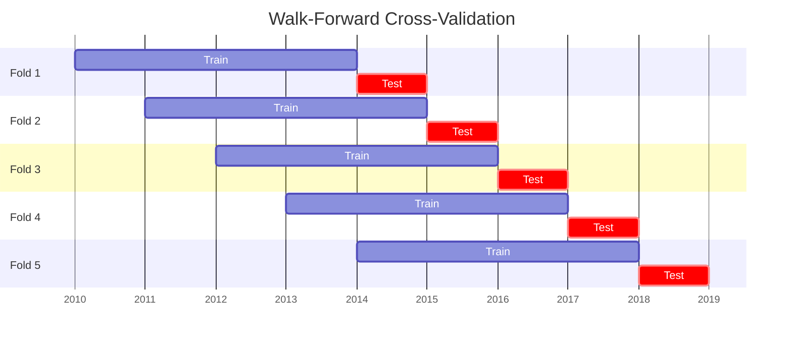
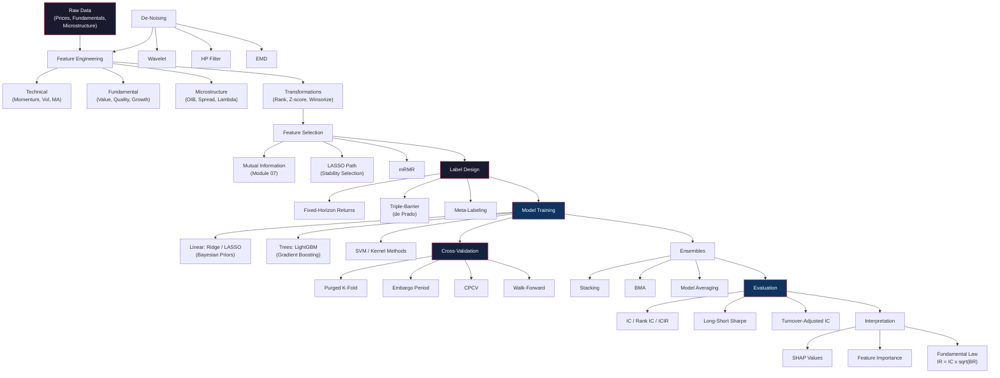

# Module 26: Machine Learning for Alpha Generation

> **Prerequisites:** Modules 01 (Linear Algebra), 03 (Statistical Inference), 06 (Optimization), 09 (Python for Quantitative Finance), 21 (Time Series Analysis)
> **Builds toward:** Modules 27 (Deep Learning for Finance), 28 (Reinforcement Learning), 29 (NLP for Finance), 33 (Algorithmic Trading Systems), 34 (Alternative Data)

---

## Table of Contents

1. [The Overfitting Problem in Finance](#1-the-overfitting-problem-in-finance)
2. [Cross-Validation for Time Series](#2-cross-validation-for-time-series)
3. [Feature Engineering](#3-feature-engineering)
4. [Linear Models: Ridge, LASSO, Elastic Net](#4-linear-models-ridge-lasso-elastic-net)
5. [Tree-Based Methods](#5-tree-based-methods)
6. [Support Vector Machines](#6-support-vector-machines)
7. [Ensemble Methods](#7-ensemble-methods)
8. [Feature Selection](#8-feature-selection)
9. [Model Evaluation Metrics](#9-model-evaluation-metrics)
10. [De-Noising Methods](#10-de-noising-methods)
11. [Label Design](#11-label-design)
12. [Implementation: Python](#12-implementation-python)
13. [Implementation: C++](#13-implementation-cpp)
14. [Exercises](#14-exercises)
15. [Summary and Concept Map](#15-summary-and-concept-map)

---

## 1. The Overfitting Problem in Finance

Machine learning in finance confronts a fundamental paradox: the techniques that produce spectacular results on Kaggle competitions routinely fail in live trading. Understanding why requires examining the unique statistical properties of financial data.

### 1.1 Signal-to-Noise Ratio in Financial Data

Financial return prediction is an extremely low signal-to-noise ratio (SNR) problem. Consider predicting daily stock returns:

- **Signal:** The predictable component of returns, typically 1--5 basis points per day for a strong alpha signal.
- **Noise:** Daily return volatility, typically 100--200 basis points for individual stocks.

The signal-to-noise ratio is therefore:

$$\text{SNR} = \frac{\text{Signal amplitude}}{\text{Noise amplitude}} \approx \frac{5 \text{ bps}}{150 \text{ bps}} \approx 0.03$$

This implies that $R^2 \approx \text{SNR}^2 \approx 0.001$ -- the model explains approximately 0.1% of return variance. By comparison, typical Kaggle competitions have $R^2$ values of 0.3--0.9. A model with $R^2 = 0.001$ that is genuine alpha is enormously valuable; a model with $R^2 = 0.05$ is almost certainly overfit.

### 1.2 The Fundamental Law of Active Management

Grinold (1989) provides the theoretical framework for understanding why low IC can still be profitable:

$$\text{IR} = \text{IC} \times \sqrt{\text{BR}}$$

where:
- $\text{IR}$ is the **information ratio** (annualized alpha divided by tracking error)
- $\text{IC}$ is the **information coefficient** (correlation between predicted and realized returns)
- $\text{BR}$ is the **breadth** (number of independent bets per year)

**Derivation.** Assume a universe of $N$ assets with return predictions $\hat{r}_i$ having cross-sectional correlation $\text{IC}$ with realized returns $r_i$. The optimal portfolio (from the mean-variance framework) allocates proportionally to $\hat{r}_i$:

$$w_i = \frac{\hat{r}_i}{N \cdot \sigma_i^2}$$

The expected active return is:

$$\mathbb{E}[\alpha] = \frac{1}{N}\sum_{i=1}^{N} w_i \cdot \mathbb{E}[r_i | \hat{r}_i] = \text{IC} \cdot \sigma_{\hat{r}} \cdot \sigma_r$$

The tracking error is:

$$\sigma_\alpha = \frac{\sigma_r}{\sqrt{N}}$$

Therefore:

$$\text{IR} = \frac{\mathbb{E}[\alpha]}{\sigma_\alpha} = \text{IC} \cdot \sqrt{N}$$

If each asset is rebalanced $T$ times per year with independent signals:

$$\boxed{\text{IR} = \text{IC} \times \sqrt{N \times T} = \text{IC} \times \sqrt{\text{BR}}}$$

**Practical implications:**

| IC | Breadth (N x T) | IR | Interpretation |
|----|-----|-----|-------|
| 0.02 | 500 x 252 = 126,000 | 7.1 | Exceptional (high-frequency) |
| 0.05 | 500 x 12 = 6,000 | 3.9 | Strong (monthly rebalance) |
| 0.05 | 50 x 12 = 600 | 1.2 | Decent (concentrated monthly) |
| 0.10 | 50 x 1 = 50 | 0.7 | Mediocre (annual stock picks) |

Even an IC of 0.02 -- barely distinguishable from noise on any single prediction -- produces an outstanding IR when applied across many assets at high frequency. This is the economic justification for systematic investing.

### 1.3 Why Kaggle Intuitions Fail

Several structural differences between Kaggle-style prediction and financial alpha generation:

1. **Non-stationarity.** Financial relationships shift over time (regime changes, policy shifts, market structure evolution). A model trained on 2015--2020 data may be useless in 2021. Kaggle data is typically stationary.

2. **Adversarial environment.** Markets are competitive. If a pattern is discovered, capital flows to exploit it, and the pattern weakens or disappears (alpha decay). Kaggle test sets do not fight back.

3. **Multiple testing.** Researchers test thousands of features, models, and hyperparameters. The probability of finding a spuriously profitable strategy grows exponentially with the number of trials. The minimum Sharpe ratio required to conclude that a strategy is not the result of data mining, given $K$ independent trials, is approximately (Harvey et al., 2016):

$$\text{SR}_{\min} \approx \sqrt{\frac{2 \ln K}{T}}$$

For $K = 1{,}000$ strategies tested on $T = 20$ years of monthly data ($T = 240$):

$$\text{SR}_{\min} \approx \sqrt{\frac{2 \ln 1000}{240}} \approx 0.54$$

4. **Transaction costs.** The gross alpha must exceed round-trip costs (commission + spread + impact + borrowing). A model that predicts 3 bps per trade but costs 5 bps to execute is worse than useless.

5. **Low signal-to-noise.** Overfitting manifests as fitting noise, which in finance means fitting the 99.9% of variance that is unpredictable. Standard model selection criteria (AIC, BIC) are calibrated for higher-SNR regimes and may be insufficient.

---

## 2. Cross-Validation for Time Series

Standard $k$-fold cross-validation is invalid for financial time series because it violates the temporal ordering of data. Randomly assigning observations to folds creates **information leakage**: the model is trained on future data and tested on past data, or overlapping return windows contaminate train and test sets.

### 2.1 The Leakage Problem

Consider a feature computed from a rolling window of 20 days, and a label computed from the next 5 days' return. If observation $t$ is in the test fold and observation $t+3$ is in the training fold, the training sample's feature overlaps with the test sample's label period. The model effectively "sees" part of the answer during training.

More subtly, even without explicit overlap, financial time series exhibit serial correlation in features and returns. Training on observations temporally adjacent to the test set leaks information through autocorrelation.

### 2.2 Purged K-Fold Cross-Validation (de Prado)

Lopez de Prado (2018) introduces **purged k-fold CV**, which eliminates leakage by removing training observations that overlap temporally with any test observation.

**Algorithm:**

1. Split the observation indices $\{1, 2, \ldots, N\}$ into $k$ contiguous folds (preserving temporal order).
2. For each fold $i$ used as the test set with time range $[t_{\text{start}}^{(i)}, t_{\text{end}}^{(i)}]$:
   - **Purge:** Remove from the training set all observations $j$ where the label of $j$ overlaps with the time range of any test observation. Specifically, remove $j$ if:
$$t_j^{\text{feature\_start}} \leq t_{\text{end}}^{(i)} \quad \text{and} \quad t_j^{\text{label\_end}} \geq t_{\text{start}}^{(i)}$$
   - **Embargo:** Additionally remove observations within an embargo period $h$ after the test set: remove $j$ if $t_j \in (t_{\text{end}}^{(i)}, t_{\text{end}}^{(i)} + h]$.

The embargo period $h$ accounts for serial correlation that persists beyond the explicit overlap window. A conservative choice is $h = \text{max label horizon}$.

### 2.3 Combinatorial Purged Cross-Validation (CPCV)

Standard purged $k$-fold uses each fold as the test set exactly once, producing $k$ backtest paths. CPCV generalizes this by testing on all $\binom{k}{k_{\text{test}}}$ combinations of $k_{\text{test}}$ test folds, producing many more backtest paths.

For $k = 6$ folds and $k_{\text{test}} = 2$:

$$\text{Number of paths} = \binom{6}{2} = 15$$

Each path uses 4 folds for training and 2 for testing (with purging and embargo applied). The 15 out-of-sample paths provide a richer distribution of strategy performance, enabling more robust statistical inference about the strategy's expected returns and Sharpe ratio.

**Computing the number of independent backtest paths.** Each of the $\binom{k}{k_{\text{test}}}$ combinations produces a backtest over the $k_{\text{test}}$ test folds. The full set of paths can be assembled into $\phi(k, k_{\text{test}})$ non-overlapping complete paths through the entire sample:

$$\phi(k, k_{\text{test}}) = \frac{k!}{k_{\text{test}}! \, (k - k_{\text{test}})!} \cdot \frac{k_{\text{test}}}{k} = \frac{(k-1)!}{(k_{\text{test}}-1)! \, (k - k_{\text{test}})!}$$

### 2.4 Walk-Forward Optimization

Walk-forward (also called rolling-window or expanding-window) validation is the most conservative approach:

1. **Train** on $[1, T_{\text{train}}]$.
2. **Test** on $[T_{\text{train}} + 1, T_{\text{train}} + T_{\text{test}}]$.
3. **Roll forward:** shift both windows by $T_{\text{step}}$ and repeat.



**Expanding window** variant: the training set always starts at $t = 1$ and grows with each fold. This uses all available history but assumes parameter stability over the full sample.

**Trade-off:** Walk-forward is unbiased but statistically inefficient -- each test observation is used only once. CPCV uses each observation in multiple test sets, producing tighter confidence intervals at the cost of greater implementation complexity.

---

## 3. Feature Engineering

Feature engineering is arguably the most important step in the ML pipeline for alpha generation. The features must encode economically meaningful information, be robust to noise, and avoid lookahead bias.

### 3.1 Technical / Price-Based Features

#### Momentum Features

Momentum captures the tendency for past winners to continue outperforming. Standard constructions:

$$r_{i,t}^{(\tau)} = \frac{P_{i,t}}{P_{i,t-\tau}} - 1 \quad \text{(simple return over } \tau \text{ periods)}$$

Common horizons: $\tau \in \{5, 10, 21, 63, 126, 252\}$ (1 week to 1 year). The classic Jegadeesh-Titman (1993) momentum uses $\tau = 252$ with a 1-month skip (to avoid short-term reversal):

$$\text{MOM}_{i,t} = r_{i,t-21}^{(252-21)} = \frac{P_{i,t-21}}{P_{i,t-252}} - 1$$

#### Mean-Reversion Features

Short-term reversal captures the tendency for recent losers to bounce:

$$\text{REV}_{i,t}^{(\tau)} = -r_{i,t}^{(\tau)} \quad \text{for } \tau \in \{1, 5\}$$

The spread relative to a moving average:

$$\text{MA\_DEV}_{i,t}^{(\tau)} = \frac{P_{i,t}}{\text{MA}_\tau(P_{i,t})} - 1$$

#### Volatility Features

Realized volatility over $\tau$ days:

$$\hat{\sigma}_{i,t}^{(\tau)} = \sqrt{\frac{252}{\tau} \sum_{s=t-\tau+1}^{t} r_{i,s}^2}$$

Volatility ratio (short-term vs. long-term):

$$\text{VRATIO}_{i,t} = \frac{\hat{\sigma}_{i,t}^{(5)}}{\hat{\sigma}_{i,t}^{(63)}}$$

High values indicate recent turbulence relative to normal conditions.

### 3.2 Fundamental Features

Fundamental ratios capture valuation and quality signals:

| Feature | Formula | Economic Rationale |
|---------|---------|-------------------|
| Earnings yield | $E_i / P_i$ | Value: cheap stocks outperform |
| Book-to-market | $B_i / M_i$ | Fama-French value factor |
| ROE | $\text{NI}_i / \text{Equity}_i$ | Quality: profitable firms outperform |
| Asset growth | $A_{i,t} / A_{i,t-4} - 1$ | Investment: low-growth outperforms |
| Accruals | $(\Delta\text{WC}_i - \text{Dep}_i) / A_i$ | Earnings quality signal |
| Earnings surprise | $(E_i^{\text{actual}} - E_i^{\text{consensus}}) / \sigma_i^E$ | Post-earnings announcement drift |

**Point-in-time alignment.** Fundamental data must be aligned to the point in time when it was publicly available, not the fiscal period end date. Using fiscal-period dates creates lookahead bias because financial statements are filed weeks or months after the period ends.

### 3.3 Microstructure Features

Order flow and market microstructure data (Module 23) provide high-frequency alpha signals:

- **Order imbalance:** $\text{OIB}_t = (V_t^{\text{buy}} - V_t^{\text{sell}}) / (V_t^{\text{buy}} + V_t^{\text{sell}})$
- **Relative spread:** $\text{RS}_t = (P_t^{\text{ask}} - P_t^{\text{bid}}) / P_t^{\text{mid}}$
- **Amihud illiquidity:** $\text{ILLIQ}_t = |r_t| / V_t$ (absolute return per unit volume)
- **Kyle's lambda:** $\lambda_t$ estimated from $\Delta P_t = \lambda_t \cdot \text{OF}_t + \varepsilon_t$

### 3.4 Feature Transformations

Raw features are often non-stationary, heavy-tailed, or on incomparable scales. Standard transformations:

1. **Cross-sectional rank:** Replace $x_{i,t}$ with its rank among all assets at time $t$, normalized to $[0, 1]$:

$$\tilde{x}_{i,t} = \frac{\text{rank}(x_{i,t})}{N_t}$$

Rank transformation is robust to outliers and imposes a uniform marginal distribution.

2. **Cross-sectional z-score:** Standardize within each cross-section:

$$z_{i,t} = \frac{x_{i,t} - \bar{x}_t}{\sigma_{x,t}}$$

where $\bar{x}_t$ and $\sigma_{x,t}$ are the cross-sectional mean and standard deviation at time $t$.

3. **Winsorization:** Clip extreme values to reduce the influence of outliers:

$$x_{i,t}^{(w)} = \text{clip}(x_{i,t}, q_\alpha, q_{1-\alpha})$$

Typical $\alpha = 0.01$ (1st and 99th percentiles). Winsorization is applied before z-scoring.

4. **Time-series normalization:** For features that drift over time (e.g., volatility), apply a rolling z-score:

$$z_{i,t}^{(\text{TS})} = \frac{x_{i,t} - \bar{x}_{i,t}^{(\tau)}}{\sigma_{x,i,t}^{(\tau)}}$$

where the rolling statistics use a lookback of $\tau$ periods.

---

## 4. Linear Models: Ridge, LASSO, Elastic Net

Linear models remain the workhorse of quantitative alpha generation due to their interpretability, low variance, and well-understood statistical properties. In the low-SNR regime of financial returns, the bias-variance trade-off strongly favors regularized linear models over more flexible alternatives.

### 4.1 The Regularization Framework

Given features $\mathbf{X} \in \mathbb{R}^{N \times p}$ and returns $\mathbf{y} \in \mathbb{R}^N$, the general regularized regression solves:

$$\hat{\boldsymbol{\beta}} = \arg\min_{\boldsymbol{\beta}} \left\{ \frac{1}{2N}\|\mathbf{y} - \mathbf{X}\boldsymbol{\beta}\|_2^2 + \lambda \left[\alpha \|\boldsymbol{\beta}\|_1 + \frac{1-\alpha}{2}\|\boldsymbol{\beta}\|_2^2\right]\right\}$$

where $\lambda \geq 0$ controls the overall penalty strength and $\alpha \in [0, 1]$ interpolates between:

- $\alpha = 0$: **Ridge regression** ($L_2$ penalty)
- $\alpha = 1$: **LASSO** ($L_1$ penalty)
- $0 < \alpha < 1$: **Elastic net** (combined)

### 4.2 Ridge Regression: Gaussian Prior Derivation

Ridge regression is equivalent to Bayesian linear regression with a Gaussian prior on the coefficients.

**Setup.** Assume the likelihood:

$$\mathbf{y} | \mathbf{X}, \boldsymbol{\beta}, \sigma^2 \sim \mathcal{N}(\mathbf{X}\boldsymbol{\beta}, \sigma^2 \mathbf{I}_N)$$

and the prior:

$$\boldsymbol{\beta} | \tau^2 \sim \mathcal{N}(\mathbf{0}, \tau^2 \mathbf{I}_p)$$

**Posterior derivation.** By Bayes' theorem:

$$p(\boldsymbol{\beta} | \mathbf{y}, \mathbf{X}) \propto p(\mathbf{y} | \mathbf{X}, \boldsymbol{\beta}) \cdot p(\boldsymbol{\beta})$$

Taking logarithms:

$$\ln p(\boldsymbol{\beta} | \mathbf{y}, \mathbf{X}) = -\frac{1}{2\sigma^2}\|\mathbf{y} - \mathbf{X}\boldsymbol{\beta}\|_2^2 - \frac{1}{2\tau^2}\|\boldsymbol{\beta}\|_2^2 + \text{const}$$

Maximizing the posterior (MAP estimate) is equivalent to minimizing:

$$\frac{1}{2\sigma^2}\|\mathbf{y} - \mathbf{X}\boldsymbol{\beta}\|_2^2 + \frac{1}{2\tau^2}\|\boldsymbol{\beta}\|_2^2$$

Setting $\lambda = \sigma^2 / \tau^2$, this becomes the ridge objective. The **closed-form solution** is:

$$\boxed{\hat{\boldsymbol{\beta}}_{\text{ridge}} = (\mathbf{X}^\top\mathbf{X} + \lambda \mathbf{I})^{-1}\mathbf{X}^\top\mathbf{y}}$$

**Spectral interpretation.** Using the SVD $\mathbf{X} = \mathbf{U}\mathbf{D}\mathbf{V}^\top$ with singular values $d_1 \geq d_2 \geq \cdots \geq d_p$:

$$\hat{\boldsymbol{\beta}}_{\text{ridge}} = \sum_{j=1}^{p} \frac{d_j^2}{d_j^2 + \lambda} \cdot \frac{\mathbf{u}_j^\top \mathbf{y}}{d_j} \cdot \mathbf{v}_j$$

The factor $d_j^2 / (d_j^2 + \lambda)$ is a **shrinkage factor** that attenuates the contribution of directions with small singular values (noisy, poorly estimated directions). When $d_j \gg \sqrt{\lambda}$, the shrinkage is negligible; when $d_j \ll \sqrt{\lambda}$, the coefficient is shrunk toward zero.

### 4.3 LASSO: Laplace Prior Derivation

The LASSO uses an $L_1$ penalty, which corresponds to a Laplace (double-exponential) prior:

$$\beta_j | b \sim \text{Laplace}(0, b) = \frac{1}{2b}\exp\left(-\frac{|\beta_j|}{b}\right)$$

The log-prior is:

$$\ln p(\boldsymbol{\beta}) = -\frac{1}{b}\|\boldsymbol{\beta}\|_1 + \text{const}$$

The MAP estimate with $\lambda = \sigma^2 / b$ gives the LASSO objective:

$$\hat{\boldsymbol{\beta}}_{\text{LASSO}} = \arg\min_{\boldsymbol{\beta}} \left\{\frac{1}{2N}\|\mathbf{y} - \mathbf{X}\boldsymbol{\beta}\|_2^2 + \lambda\|\boldsymbol{\beta}\|_1\right\}$$

Unlike ridge, LASSO produces **sparse** solutions -- exactly zero coefficients for many features. This is because the $L_1$ penalty creates a diamond-shaped constraint region whose corners lie on the coordinate axes. The OLS solution, when projected onto this diamond, is likely to hit a corner (zero coefficient) rather than a smooth face.

**Soft-thresholding operator.** For a single feature (orthogonal design), the LASSO solution is the soft-thresholding operator:

$$\hat{\beta}_j^{\text{LASSO}} = \text{sign}(\hat{\beta}_j^{\text{OLS}}) \cdot \max(|\hat{\beta}_j^{\text{OLS}}| - \lambda, 0)$$

Coefficients with $|\hat{\beta}_j^{\text{OLS}}| < \lambda$ are set exactly to zero.

### 4.4 Elastic Net and Solution Paths

The elastic net combines the grouping effect of ridge (correlated features receive similar coefficients) with the sparsity of LASSO. The solution path traces $\hat{\boldsymbol{\beta}}(\lambda)$ as $\lambda$ varies from $\lambda_{\max}$ (all coefficients zero) to 0 (OLS solution).

For LASSO, the solution path is **piecewise linear** in $\lambda$ (the LARS algorithm exploits this). For ridge, the path is a smooth curve. The optimal $\lambda$ is selected via cross-validation (using the purged CV from Section 2).

**Financial intuition for choosing $\alpha$:**

- **LASSO ($\alpha = 1$):** Use when you believe few features are truly predictive and want automatic feature selection. Appropriate for fundamental-only models.
- **Ridge ($\alpha = 0$):** Use when many features contribute small, correlated signals. Appropriate for technical feature sets where signals are diffuse.
- **Elastic net ($\alpha = 0.5$):** Use when you have groups of correlated features (e.g., multiple momentum lookbacks) and want both grouping and sparsity.

---

## 5. Tree-Based Methods

Tree-based methods dominate applied machine learning in finance due to their ability to capture nonlinear interactions, handle missing data, and provide feature importance rankings. However, they require careful regularization to avoid overfitting in the low-SNR financial regime.

### 5.1 Random Forests

A random forest is an ensemble of $B$ decision trees, each trained on a bootstrap sample of the data with a random subset of features at each split.

**Algorithm:**

1. For $b = 1, \ldots, B$:
   a. Draw a bootstrap sample $\mathcal{D}_b$ of size $N$ (with replacement) from the training data.
   b. Grow a decision tree $T_b$ on $\mathcal{D}_b$:
      - At each node, randomly select $m$ features from the full $p$ features.
      - Find the best split among those $m$ features (by MSE reduction for regression).
      - Split until minimum leaf size is reached (no pruning).
2. Predict by averaging: $\hat{y}(\mathbf{x}) = \frac{1}{B}\sum_{b=1}^{B} T_b(\mathbf{x})$.

**Bias-variance decomposition.** Let $\bar{\rho}$ be the average pairwise correlation between trees, and $\sigma_T^2$ the variance of a single tree:

$$\text{Var}\left[\frac{1}{B}\sum_{b=1}^{B} T_b\right] = \bar{\rho}\sigma_T^2 + \frac{1-\bar{\rho}}{B}\sigma_T^2$$

The first term is irreducible (it does not vanish as $B \to \infty$). Reducing $m$ decreases $\bar{\rho}$ (more diverse trees) but may increase individual tree bias. The default $m = \lfloor p/3 \rfloor$ for regression balances these effects.

**Feature importance.** Two main approaches:

1. **Mean Decrease Impurity (MDI):** For each feature $j$, sum the impurity reduction across all splits using feature $j$ across all trees:

$$\text{MDI}(j) = \sum_{b=1}^{B}\sum_{\text{node } n \in T_b : \text{split on } j} w_n \cdot \Delta\text{MSE}_n$$

where $w_n$ is the proportion of samples reaching node $n$.

2. **Mean Decrease Accuracy (MDA) / Permutation importance:** For each feature $j$, permute the values of feature $j$ in the out-of-bag (OOB) sample and measure the increase in prediction error:

$$\text{MDA}(j) = \frac{1}{B}\sum_{b=1}^{B}\left[\text{MSE}_{b}^{(\text{permuted } j)} - \text{MSE}_{b}^{(\text{OOB})}\right]$$

MDA is preferred because MDI is biased toward high-cardinality features.

### 5.2 Gradient Boosting: XGBoost, LightGBM, CatBoost

Gradient boosting builds trees sequentially, each correcting the errors of the ensemble so far.

**General gradient boosting algorithm:**

1. Initialize: $F_0(\mathbf{x}) = \arg\min_c \sum_{i=1}^{N} L(y_i, c)$ (e.g., the mean for squared loss).
2. For $m = 1, \ldots, M$:
   a. Compute pseudo-residuals (negative gradient of the loss):
$$\tilde{y}_i^{(m)} = -\frac{\partial L(y_i, F(\mathbf{x}_i))}{\partial F(\mathbf{x}_i)}\bigg|_{F = F_{m-1}}$$
   b. Fit a regression tree $h_m$ to the pseudo-residuals $\{(\mathbf{x}_i, \tilde{y}_i^{(m)})\}$.
   c. Update: $F_m(\mathbf{x}) = F_{m-1}(\mathbf{x}) + \eta \cdot h_m(\mathbf{x})$, where $\eta \in (0, 1]$ is the learning rate.

**XGBoost** adds $L_2$ regularization on leaf weights $w_j$ and a penalty on the number of leaves $T$:

$$\tilde{L}^{(m)} = \sum_{i=1}^{N}L(y_i, F_{m-1}(\mathbf{x}_i) + h_m(\mathbf{x}_i)) + \gamma T + \frac{1}{2}\lambda\sum_{j=1}^{T}w_j^2$$

Using a second-order Taylor expansion of $L$ around $F_{m-1}$:

$$\tilde{L}^{(m)} \approx \sum_{j=1}^{T}\left[G_j w_j + \frac{1}{2}(H_j + \lambda)w_j^2\right] + \gamma T$$

where $G_j = \sum_{i \in I_j} g_i$ and $H_j = \sum_{i \in I_j} h_i$ are the summed first and second derivatives for observations in leaf $j$. The optimal leaf weight and corresponding loss reduction are:

$$w_j^* = -\frac{G_j}{H_j + \lambda}, \quad \text{Gain} = \frac{1}{2}\left[\frac{G_L^2}{H_L + \lambda} + \frac{G_R^2}{H_R + \lambda} - \frac{(G_L+G_R)^2}{H_L+H_R+\lambda}\right] - \gamma$$

**LightGBM** improves on XGBoost with two key innovations:

1. **Gradient-Based One-Side Sampling (GOSS):** Keep all observations with large gradients (high error) and randomly sample those with small gradients, reducing the training set while preserving important information.
2. **Exclusive Feature Bundling (EFB):** Group mutually exclusive features (rarely non-zero simultaneously) into bundles, reducing the effective number of features and speeding up the histogram-based split finding.

**CatBoost** handles categorical features natively via **ordered target encoding** with randomized permutations to avoid target leakage.

### 5.3 Hyperparameter Tuning for Finance

The critical hyperparameters and their financial implications:

| Parameter | Range | Effect |
|-----------|-------|--------|
| `max_depth` | 3--6 | Limits interaction order; deeper = more overfitting risk |
| `learning_rate` | 0.01--0.1 | Lower = more trees needed, better generalization |
| `n_estimators` | 100--2000 | More = better fit; use early stopping on purged CV |
| `min_child_weight` | 10--100 | Minimum samples per leaf; higher = more regularization |
| `subsample` | 0.5--0.8 | Row sampling fraction; reduces variance |
| `colsample_bytree` | 0.3--0.8 | Feature sampling; reduces correlation between trees |
| `reg_lambda` ($L_2$) | 1--10 | Leaf weight regularization |
| `reg_alpha` ($L_1$) | 0--1 | Leaf weight sparsity |

**Critical rule for finance:** Use **shallow trees** (depth 3--5) with **low learning rate** (0.01--0.05) and **early stopping** based on purged cross-validation. Deep trees with many estimators will memorize noise.

---

## 6. Support Vector Machines

### 6.1 The Kernel Trick

Support Vector Machines (SVMs) find the maximum-margin separating hyperplane in a (potentially infinite-dimensional) feature space. The key insight is the **kernel trick**: the SVM optimization depends only on inner products $\langle \phi(\mathbf{x}_i), \phi(\mathbf{x}_j) \rangle$, which can be computed via a kernel function without explicitly constructing $\phi(\mathbf{x})$.

The dual formulation of the SVM for regression (SVR) is:

$$\max_{\boldsymbol{\alpha}, \boldsymbol{\alpha}^*} -\frac{1}{2}\sum_{i,j}(\alpha_i - \alpha_i^*)(\alpha_j - \alpha_j^*) K(\mathbf{x}_i, \mathbf{x}_j) - \varepsilon \sum_i (\alpha_i + \alpha_i^*) + \sum_i y_i(\alpha_i - \alpha_i^*)$$

subject to $0 \leq \alpha_i, \alpha_i^* \leq C$ and $\sum_i (\alpha_i - \alpha_i^*) = 0$.

The prediction function uses only the **support vectors** (observations with $\alpha_i \neq 0$ or $\alpha_i^* \neq 0$):

$$\hat{f}(\mathbf{x}) = \sum_{i \in \text{SV}} (\alpha_i - \alpha_i^*) K(\mathbf{x}_i, \mathbf{x}) + b$$

### 6.2 RBF Kernel

The Radial Basis Function (Gaussian) kernel is:

$$K(\mathbf{x}_i, \mathbf{x}_j) = \exp\left(-\frac{\|\mathbf{x}_i - \mathbf{x}_j\|^2}{2\ell^2}\right) = \exp(-\gamma\|\mathbf{x}_i - \mathbf{x}_j\|^2)$$

where $\gamma = 1/(2\ell^2)$ controls the kernel bandwidth. The implicit feature space is infinite-dimensional (the RBF kernel corresponds to a mapping into an infinite-dimensional Hilbert space via the Taylor expansion of the exponential).

**Hyperparameters:**
- $C$: penalty for violations of the $\varepsilon$-tube. Larger $C$ = less regularization.
- $\gamma$: inverse kernel width. Larger $\gamma$ = more local decision boundary = more overfitting.
- $\varepsilon$: tube width for $\varepsilon$-insensitive loss. Larger $\varepsilon$ = more observations ignored.

**SVM limitations for finance:**
1. **Scalability:** Training is $O(N^2)$ to $O(N^3)$, prohibitive for large cross-sections.
2. **Non-probabilistic:** SVMs do not produce probability estimates (without Platt scaling).
3. **Feature interpretation:** No native feature importance mechanism.
4. **Sensitivity to scaling:** SVMs require standardized features; financial features often have non-stationary distributions.

For these reasons, SVMs are less commonly used in modern quantitative finance than tree-based methods, but they remain useful for small, curated feature sets where the kernel captures domain-specific similarity.

---

## 7. Ensemble Methods

### 7.1 Stacking

Stacking (Wolpert, 1992) trains a **meta-learner** on the out-of-sample predictions of base models. The procedure:

1. **Level 0:** Train $M$ base models $\{f_1, \ldots, f_M\}$ using purged k-fold CV, generating out-of-fold predictions $\hat{y}_i^{(m)}$ for each model $m$ and observation $i$.
2. **Level 1:** Train a meta-learner $g$ on the matrix of base model predictions:

$$\hat{y}_i^{\text{stack}} = g(\hat{y}_i^{(1)}, \hat{y}_i^{(2)}, \ldots, \hat{y}_i^{(M)})$$

The meta-learner is typically a regularized linear model (ridge regression) to avoid overfitting at the meta-level.

**Financial application:** Stack a ridge model (good at capturing linear effects), a LightGBM model (good at nonlinear interactions), and an SVM (good at capturing local structure). The meta-learner learns the optimal combination weights, which may vary over time if implemented with a rolling window.

### 7.2 Blending

Blending is a simpler variant of stacking: instead of using purged k-fold, split the data into three sets: train (for base models), blend (for meta-learner), and test. This avoids the complexity of k-fold but wastes data.

### 7.3 Model Averaging

Simple model averaging assigns equal weight to base model predictions:

$$\hat{y}^{\text{avg}} = \frac{1}{M}\sum_{m=1}^{M}\hat{y}^{(m)}$$

This is often surprisingly effective because it reduces variance without increasing bias (assuming base models are diverse). The variance reduction is:

$$\text{Var}(\hat{y}^{\text{avg}}) = \frac{1}{M^2}\sum_{m=1}^{M}\text{Var}(\hat{y}^{(m)}) + \frac{1}{M^2}\sum_{m \neq m'}\text{Cov}(\hat{y}^{(m)}, \hat{y}^{(m')})$$

If models are uncorrelated (ideal but rare), variance drops as $1/M$.

### 7.4 Bayesian Model Averaging (BMA)

BMA assigns posterior model probabilities based on evidence:

$$p(\hat{y} | \mathbf{D}) = \sum_{m=1}^{M} p(\hat{y} | \mathcal{M}_m, \mathbf{D}) \cdot p(\mathcal{M}_m | \mathbf{D})$$

The posterior model probability is:

$$p(\mathcal{M}_m | \mathbf{D}) = \frac{p(\mathbf{D} | \mathcal{M}_m) \cdot p(\mathcal{M}_m)}{\sum_{m'} p(\mathbf{D} | \mathcal{M}_{m'}) \cdot p(\mathcal{M}_{m'})}$$

where $p(\mathbf{D} | \mathcal{M}_m)$ is the **marginal likelihood** (evidence) for model $m$. For linear models with conjugate priors, this has a closed form; for others, it is approximated via BIC:

$$\ln p(\mathbf{D} | \mathcal{M}_m) \approx -\frac{1}{2}\text{BIC}_m = \ell_m - \frac{k_m}{2}\ln N$$

BMA properly accounts for model uncertainty, which is particularly important in finance where no single model is reliably correct.

---

## 8. Feature Selection

With hundreds of candidate features, selecting the most informative subset is critical for both performance and interpretability.

### 8.1 Mutual Information

Mutual information (Module 07) measures the general (non-linear) dependence between a feature $X$ and the target $Y$:

$$I(X; Y) = \int\int p(x, y) \ln \frac{p(x, y)}{p(x)p(y)}\,dx\,dy$$

For continuous variables, estimation uses $k$-nearest-neighbor methods (Kraskov-Stogbauer-Grassberger). MI captures nonlinear relationships that correlation misses, but is more expensive to estimate and noisier for small samples.

**Normalization.** The normalized MI (uncertainty coefficient) is:

$$U(X; Y) = \frac{I(X; Y)}{H(Y)}$$

This ranges from 0 (independence) to 1 (perfect prediction).

### 8.2 LASSO Path

The LASSO solution path (Section 4.4) provides a natural ordering of features by importance. As $\lambda$ decreases from $\lambda_{\max}$, features enter the model one by one. The order of entry ranks features by their marginal predictive power (after accounting for features already in the model).

**Stability selection (Meinshausen and Buhlmann, 2010):** Run the LASSO path on $B$ bootstrap subsamples. For each feature $j$, compute the fraction of subsamples in which feature $j$ enters the model at a given $\lambda$. Features with selection probability above a threshold (e.g., 0.6) are deemed "stably important." This controls the false discovery rate:

$$\mathbb{E}[\text{FDR}] \leq \frac{q^2}{(2\pi_{\text{thr}} - 1)p}$$

where $q$ is the average number of selected features and $\pi_{\text{thr}}$ is the selection probability threshold.

### 8.3 Minimum Redundancy Maximum Relevance (mRMR)

mRMR selects features that are maximally relevant to the target while being minimally redundant with each other:

$$\text{mRMR} = \max_{\mathcal{S} : |\mathcal{S}| = k} \left[\frac{1}{k}\sum_{j \in \mathcal{S}} I(X_j; Y) - \frac{1}{k^2}\sum_{j, j' \in \mathcal{S}} I(X_j; X_{j'})\right]$$

The first term is the **relevance** (average MI with the target); the second is the **redundancy** (average pairwise MI among selected features). The greedy forward selection algorithm adds at each step the feature that maximizes:

$$j^* = \arg\max_{j \notin \mathcal{S}} \left[I(X_j; Y) - \frac{1}{|\mathcal{S}|}\sum_{j' \in \mathcal{S}} I(X_j; X_{j'})\right]$$

This is particularly useful in finance where many features (e.g., multiple momentum lookbacks) are highly correlated.

---

## 9. Model Evaluation Metrics

Standard ML metrics (MSE, accuracy) are inadequate for evaluating alpha models. The relevant metrics assess the model's ability to generate profitable trading signals.

### 9.1 Information Coefficient (IC)

The IC is the Pearson or Spearman correlation between predicted and realized returns across the cross-section at each time $t$:

$$\text{IC}_t = \text{corr}(\hat{\mathbf{r}}_t, \mathbf{r}_t)$$

where $\hat{\mathbf{r}}_t$ and $\mathbf{r}_t$ are the $N$-vectors of predicted and realized returns across $N$ assets.

The **average IC** across time is:

$$\overline{\text{IC}} = \frac{1}{T}\sum_{t=1}^{T}\text{IC}_t$$

A Sharpe-ratio-like metric for signal quality is the **ICIR (IC Information Ratio)**:

$$\text{ICIR} = \frac{\overline{\text{IC}}}{\text{std}(\text{IC}_t)}$$

ICIR values above 0.5 are considered strong; above 1.0 is exceptional.

### 9.2 Rank IC

Rank IC uses Spearman rank correlation rather than Pearson:

$$\text{RankIC}_t = \text{corr}_{\text{Spearman}}(\hat{\mathbf{r}}_t, \mathbf{r}_t)$$

Rank IC is more robust to outliers and is the preferred metric for strategies that trade based on the relative ordering of assets (e.g., long top quintile, short bottom quintile).

### 9.3 Turnover-Adjusted IC

High IC that requires extreme portfolio turnover is less valuable than moderate IC with low turnover. The turnover-adjusted IC accounts for the persistence of the signal:

$$\text{IC}_{\text{adj}} = \overline{\text{IC}} \times (1 - \text{turnover decay})$$

More formally, the **autocorrelation of the signal** measures persistence:

$$\rho_{\text{signal}} = \text{corr}(\hat{\mathbf{r}}_t, \hat{\mathbf{r}}_{t+1})$$

A signal with high IC but low $\rho_{\text{signal}}$ will generate high turnover, eroding net returns. The effective IC after accounting for costs is:

$$\text{IC}_{\text{net}} \approx \overline{\text{IC}} - \frac{2c}{\sigma_r} \cdot (1 - \rho_{\text{signal}})$$

where $c$ is the per-unit transaction cost and $\sigma_r$ is the cross-sectional return dispersion.

### 9.4 Sharpe Ratio of a Long-Short Portfolio

The ultimate test of an alpha model is the Sharpe ratio of the resulting portfolio. Construct a market-neutral long-short portfolio at each rebalancing:

- Long: top quintile (highest predicted return)
- Short: bottom quintile (lowest predicted return)
- Equal or signal-weighted within each leg

The annualized Sharpe ratio is:

$$\text{SR} = \frac{\bar{r}_p}{\sigma_p} \times \sqrt{252}$$

where $\bar{r}_p$ and $\sigma_p$ are the daily mean and standard deviation of portfolio returns.

---

## 10. De-Noising Methods

Financial time series are contaminated by market microstructure noise, measurement error, and irrelevant high-frequency fluctuations. De-noising aims to extract the signal component before feeding data into the ML model.

### 10.1 Wavelet De-Noising

The discrete wavelet transform (DWT) decomposes a signal $x_t$ into approximation (low-frequency) and detail (high-frequency) coefficients at multiple scales:

$$x_t = \sum_k a_{J,k} \phi_{J,k}(t) + \sum_{j=1}^{J}\sum_k d_{j,k} \psi_{j,k}(t)$$

where $\phi$ is the scaling function, $\psi$ is the wavelet function, and $J$ is the number of decomposition levels.

**De-noising procedure:**
1. Apply the DWT to obtain coefficients $\{a_{J,k}, d_{j,k}\}$.
2. **Threshold** the detail coefficients: set small coefficients to zero (hard thresholding) or shrink them (soft thresholding with universal threshold $\lambda = \sigma \sqrt{2 \ln N}$).
3. Reconstruct the signal via the inverse DWT.

Common wavelet families for financial data: Daubechies (db4, db8), Symlet (sym5), Coiflet.

### 10.2 Hodrick-Prescott (HP) Filter

The HP filter decomposes a time series $y_t$ into a trend $\tau_t$ and a cyclical component $c_t = y_t - \tau_t$ by solving:

$$\min_{\{\tau_t\}} \left\{\sum_{t=1}^{T}(y_t - \tau_t)^2 + \lambda_{\text{HP}} \sum_{t=2}^{T-1}[(\tau_{t+1} - \tau_t) - (\tau_t - \tau_{t-1})]^2\right\}$$

The first term penalizes deviation from the data (fit); the second penalizes curvature of the trend (smoothness). The parameter $\lambda_{\text{HP}}$ controls the trade-off:

- $\lambda_{\text{HP}} = 0$: trend = data (no smoothing)
- $\lambda_{\text{HP}} \to \infty$: trend is linear
- Standard: $\lambda_{\text{HP}} = 1600$ for quarterly, $\lambda_{\text{HP}} = 129,600$ for monthly

**Caution:** The HP filter has a well-known **endpoint problem** -- the trend estimate is unreliable near the end of the sample, exactly where it matters most for forecasting. It also induces spurious dynamics (Hamilton, 2018). Use with awareness of these limitations.

### 10.3 Empirical Mode Decomposition (EMD)

EMD (Huang et al., 1998) is a data-driven, nonlinear, non-stationary decomposition method. It decomposes a signal into **Intrinsic Mode Functions** (IMFs) via the "sifting" algorithm:

1. Identify all local maxima and minima of $x(t)$.
2. Fit cubic spline envelopes to the maxima (upper) and minima (lower).
3. Compute the mean envelope: $m_1(t) = [\text{upper}(t) + \text{lower}(t)] / 2$.
4. Extract the first proto-IMF: $h_1(t) = x(t) - m_1(t)$.
5. Repeat steps 1-4 on $h_1(t)$ until the stopping criterion is met (the mean envelope is approximately zero). The result is IMF$_1$.
6. Compute the residual $r_1(t) = x(t) - \text{IMF}_1(t)$ and repeat the process on $r_1$ to extract IMF$_2$, etc.

The original signal is:

$$x(t) = \sum_{j=1}^{J} \text{IMF}_j(t) + r_J(t)$$

**De-noising with EMD:** Remove the first few IMFs (highest frequency, most noise) and reconstruct from the remaining IMFs plus the residual. Unlike wavelets, EMD adapts to the data without requiring a pre-specified basis function, making it particularly suitable for non-stationary financial data.

---

## 11. Label Design

The choice of label -- what the model predicts -- profoundly affects strategy performance. The standard approach (predict fixed-horizon returns) is suboptimal because it introduces noise from the arbitrary horizon choice and fails to account for varying market conditions.

### 11.1 Fixed-Horizon Returns

The simplest label is the forward return over a fixed horizon $h$:

$$y_{i,t} = \frac{P_{i,t+h}}{P_{i,t}} - 1$$

**Problems:**
1. **Path-dependent risk:** A stock that drops 10% then recovers to +5% has a positive label, but a trader would have experienced a painful drawdown.
2. **Horizon sensitivity:** The optimal $h$ varies by asset and regime. Too short captures noise; too long dilutes the signal.
3. **Overlapping labels:** With $h > 1$ and daily observations, labels overlap, inducing serial correlation in the training data.

### 11.2 Triple-Barrier Method (de Prado)

The triple-barrier method (Lopez de Prado, 2018) defines three barriers that determine the label:

1. **Upper barrier:** Take-profit at $+\tau_{\text{pt}}$ return.
2. **Lower barrier:** Stop-loss at $-\tau_{\text{sl}}$ return.
3. **Vertical barrier:** Maximum holding period $t_{\text{max}}$.

The label is determined by which barrier is hit first:

$$y_{i,t} = \begin{cases} +1 & \text{if upper barrier hit first (profit)} \\ -1 & \text{if lower barrier hit first (loss)} \\ 0 & \text{if vertical barrier hit (timeout)} \end{cases}$$

**Dynamic barriers.** The barriers can be set dynamically based on volatility:

$$\tau_{\text{pt}} = m \cdot \hat{\sigma}_{i,t}^{(\text{daily})} \cdot \sqrt{t_{\text{max}}}$$

where $m$ is a multiplier (e.g., $m = 2$). This ensures that the barriers adapt to the current volatility regime.

**Advantages over fixed-horizon:**
- Incorporates path-dependent risk (the stop-loss prevents extreme losses from being mislabeled as neutral).
- Automatically adapts to volatility.
- Produces labels with cleaner signal (more decisive outcomes).
- Naturally handles varying event arrival rates.

### 11.3 Meta-Labeling

Meta-labeling is a two-stage process:

1. **Primary model:** A simple model (e.g., moving average crossover, fundamental signal) generates trade direction ($+1$ or $-1$).
2. **Secondary (meta) model:** An ML model predicts the **probability that the primary model's trade will be profitable** (using triple-barrier labels).

The meta-model's features include the primary signal strength, recent volatility, market regime indicators, and execution cost estimates. The output is a probability $p \in [0, 1]$:

- If $p > p_{\text{threshold}}$: take the trade suggested by the primary model.
- If $p \leq p_{\text{threshold}}$: skip the trade.

**Advantages:**
- Separates the problem of "which direction" (domain expertise) from "whether to trade" (ML).
- The meta-model can be trained on a balanced dataset (trades vs. no-trades).
- Position sizing follows naturally: size $\propto p$.
- Reduces the overfitting risk because the ML model is not trying to discover the signal itself, only to filter it.

---

## 12. Implementation: Python

### 12.1 Full ML Pipeline with Purged Cross-Validation

```python
"""
Module 26 - Machine Learning for Alpha Generation: Full Pipeline
Depends on: numpy, pandas, scikit-learn, lightgbm, shap
"""

import numpy as np
import pandas as pd
from typing import List, Tuple, Dict, Optional
from dataclasses import dataclass, field
from sklearn.base import BaseEstimator, TransformerMixin
from sklearn.model_selection import BaseCrossValidator


class PurgedKFoldCV(BaseCrossValidator):
    """
    Purged K-Fold Cross-Validation for time series (de Prado, 2018).

    Eliminates information leakage by:
    1. Purging: removing training samples whose labels overlap with test.
    2. Embargo: removing training samples within h periods after test end.

    Parameters
    ----------
    n_splits : int
        Number of folds.
    embargo_pct : float
        Fraction of total samples to embargo after each test set.
    """

    def __init__(self, n_splits: int = 5, embargo_pct: float = 0.01):
        self.n_splits = n_splits
        self.embargo_pct = embargo_pct

    def get_n_splits(self, X=None, y=None, groups=None):
        return self.n_splits

    def split(self, X, y=None, groups=None):
        """
        Generate purged train/test indices.

        Parameters
        ----------
        X : pd.DataFrame
            Features with DatetimeIndex.
        y : ignored
        groups : pd.Series, optional
            Series mapping each observation to its label end time.
            If None, assumes label_end = index + 1 period.
        """
        n_samples = len(X)
        indices = np.arange(n_samples)
        embargo_size = int(n_samples * self.embargo_pct)

        fold_size = n_samples // self.n_splits

        for i in range(self.n_splits):
            test_start = i * fold_size
            test_end = min((i + 1) * fold_size, n_samples)

            test_indices = indices[test_start:test_end]

            # Training indices: everything except test + purge + embargo
            # Purge: remove samples before test whose labels extend into test
            # Embargo: remove samples right after test end
            embargo_end = min(test_end + embargo_size, n_samples)

            train_mask = np.ones(n_samples, dtype=bool)
            train_mask[test_start:embargo_end] = False

            # If groups (label end times) provided, purge overlapping
            if groups is not None:
                test_start_time = X.index[test_start]
                for j in range(test_start):
                    if groups.iloc[j] >= test_start_time:
                        train_mask[j] = False

            train_indices = indices[train_mask]

            yield train_indices, test_indices
```

### 12.2 Feature Engineering Pipeline

```python
class AlphaFeatureEngineer(BaseEstimator, TransformerMixin):
    """
    Feature engineering pipeline for alpha generation.

    Computes momentum, mean-reversion, volatility, and
    fundamental features with proper cross-sectional transformations.
    """

    def __init__(
        self,
        momentum_windows: List[int] = None,
        vol_windows: List[int] = None,
        winsorize_pct: float = 0.01,
    ):
        self.momentum_windows = momentum_windows or [5, 10, 21, 63, 126, 252]
        self.vol_windows = vol_windows or [5, 21, 63]
        self.winsorize_pct = winsorize_pct

    def fit(self, X, y=None):
        return self

    def transform(self, prices: pd.DataFrame) -> pd.DataFrame:
        """
        Compute features from a price panel.

        Parameters
        ----------
        prices : pd.DataFrame
            Panel of adjusted close prices (index=dates, columns=tickers).

        Returns
        -------
        pd.DataFrame with MultiIndex (date, ticker) and feature columns.
        """
        returns = prices.pct_change()
        log_returns = np.log(prices / prices.shift(1))
        features = {}

        # --- Momentum features ---
        for w in self.momentum_windows:
            mom = prices / prices.shift(w) - 1
            features[f'mom_{w}d'] = mom

        # Jegadeesh-Titman momentum (12m - 1m)
        features['mom_jt'] = prices.shift(21) / prices.shift(252) - 1

        # --- Mean-reversion features ---
        for w in [5, 10, 20, 50]:
            ma = prices.rolling(w).mean()
            features[f'ma_dev_{w}d'] = prices / ma - 1

        # --- Volatility features ---
        for w in self.vol_windows:
            vol = returns.rolling(w).std() * np.sqrt(252)
            features[f'vol_{w}d'] = vol

        # Volatility ratio
        if 5 in self.vol_windows and 63 in self.vol_windows:
            features['vol_ratio'] = (
                features['vol_5d'] / features['vol_63d']
            )

        # --- Volume features ---
        # Skewness of returns (asymmetry signal)
        features['skew_21d'] = returns.rolling(21).skew()
        features['kurt_21d'] = returns.rolling(21).kurt()

        # --- Combine and transform ---
        # Stack into long format (date, ticker)
        all_features = {}
        for name, feat_df in features.items():
            stacked = feat_df.stack()
            stacked.name = name
            all_features[name] = stacked

        result = pd.DataFrame(all_features)

        # Cross-sectional transformations at each date
        result = self._cross_sectional_transform(result)

        return result

    def _cross_sectional_transform(self, df: pd.DataFrame) -> pd.DataFrame:
        """
        Apply winsorization, ranking, and z-scoring cross-sectionally.
        """
        transformed = df.copy()

        for col in transformed.columns:
            # Group by date (level 0 of MultiIndex)
            grouped = transformed[col].groupby(level=0)

            # Winsorize
            lower = grouped.transform(
                lambda x: x.quantile(self.winsorize_pct)
            )
            upper = grouped.transform(
                lambda x: x.quantile(1 - self.winsorize_pct)
            )
            transformed[col] = transformed[col].clip(
                lower=lower, upper=upper
            )

            # Cross-sectional z-score
            mean = grouped.transform('mean')
            std = grouped.transform('std')
            std = std.replace(0, np.nan)
            transformed[col] = (transformed[col] - mean) / std

            # Add rank feature
            transformed[f'{col}_rank'] = grouped.transform(
                lambda x: x.rank(pct=True)
            )

        return transformed
```

### 12.3 Triple-Barrier Labeling

```python
def triple_barrier_labels(
    prices: pd.Series,
    events: pd.DatetimeIndex,
    pt_sl: Tuple[float, float] = (2.0, 2.0),
    min_return: float = 0.0,
    max_holding: int = 10,
    vol_lookback: int = 21,
) -> pd.DataFrame:
    """
    Compute triple-barrier labels (de Prado, 2018).

    Parameters
    ----------
    prices : pd.Series
        Price series with DatetimeIndex.
    events : pd.DatetimeIndex
        Timestamps at which to compute labels.
    pt_sl : tuple
        (profit-taking, stop-loss) multipliers on volatility.
    min_return : float
        Minimum return for a vertical barrier hit to be labeled +1/-1.
    max_holding : int
        Maximum holding period in trading days.
    vol_lookback : int
        Lookback window for daily volatility estimate.

    Returns
    -------
    pd.DataFrame with columns:
        - 'label': {-1, 0, +1}
        - 'return': realized return at exit
        - 'barrier': which barrier was hit ('pt', 'sl', 'vertical')
        - 'holding_period': days held
        - 'label_end': timestamp of label resolution
    """
    # Estimate daily volatility
    returns = prices.pct_change()
    daily_vol = returns.rolling(vol_lookback).std()

    results = []

    for t0 in events:
        if t0 not in prices.index:
            continue

        loc0 = prices.index.get_loc(t0)

        # Define barriers
        vol = daily_vol.iloc[loc0] if not np.isnan(daily_vol.iloc[loc0]) else 0.01
        upper = pt_sl[0] * vol * np.sqrt(max_holding)
        lower = -pt_sl[1] * vol * np.sqrt(max_holding)

        # Vertical barrier (max holding period)
        t1_loc = min(loc0 + max_holding, len(prices) - 1)

        # Path through the holding period
        p0 = prices.iloc[loc0]

        barrier_hit = 'vertical'
        exit_loc = t1_loc

        for t in range(loc0 + 1, t1_loc + 1):
            ret = prices.iloc[t] / p0 - 1

            if ret >= upper and upper > 0:
                barrier_hit = 'pt'
                exit_loc = t
                break
            elif ret <= lower and lower < 0:
                barrier_hit = 'sl'
                exit_loc = t
                break

        exit_return = prices.iloc[exit_loc] / p0 - 1
        holding_period = exit_loc - loc0

        # Assign label
        if barrier_hit == 'pt':
            label = 1
        elif barrier_hit == 'sl':
            label = -1
        else:
            # Vertical barrier: label based on return sign
            if abs(exit_return) < min_return:
                label = 0
            else:
                label = int(np.sign(exit_return))

        results.append({
            'event_time': t0,
            'label': label,
            'return': exit_return,
            'barrier': barrier_hit,
            'holding_period': holding_period,
            'label_end': prices.index[exit_loc],
        })

    return pd.DataFrame(results).set_index('event_time')
```

### 12.4 LightGBM Alpha Model with SHAP

```python
import lightgbm as lgb


@dataclass
class AlphaModelConfig:
    """Configuration for the LightGBM alpha model."""
    n_splits: int = 5
    embargo_pct: float = 0.02

    # LightGBM parameters (conservative for finance)
    lgb_params: Dict = field(default_factory=lambda: {
        'objective': 'regression',
        'metric': 'mae',
        'boosting_type': 'gbdt',
        'num_leaves': 31,
        'max_depth': 5,
        'learning_rate': 0.03,
        'feature_fraction': 0.6,
        'bagging_fraction': 0.7,
        'bagging_freq': 5,
        'min_child_samples': 50,
        'reg_alpha': 0.1,
        'reg_lambda': 1.0,
        'verbose': -1,
    })
    n_estimators: int = 1000
    early_stopping_rounds: int = 50


class AlphaModel:
    """
    Full ML alpha generation pipeline.

    Combines purged cross-validation, LightGBM training,
    SHAP explanation, and out-of-sample signal generation.
    """

    def __init__(self, config: AlphaModelConfig = None):
        self.config = config or AlphaModelConfig()
        self.models: List[lgb.Booster] = []
        self.feature_importance: Optional[pd.DataFrame] = None
        self.cv_scores: List[Dict] = []

    def train_with_purged_cv(
        self,
        X: pd.DataFrame,
        y: pd.Series,
        label_ends: pd.Series = None,
    ) -> Dict:
        """
        Train with purged k-fold CV and return OOS predictions.

        Parameters
        ----------
        X : pd.DataFrame
            Feature matrix with DatetimeIndex.
        y : pd.Series
            Target variable (returns or labels).
        label_ends : pd.Series
            End time of each label (for purging).

        Returns
        -------
        Dictionary with OOS predictions, CV scores, feature importance.
        """
        cv = PurgedKFoldCV(
            n_splits=self.config.n_splits,
            embargo_pct=self.config.embargo_pct,
        )

        oos_predictions = pd.Series(index=X.index, dtype=float)
        oos_predictions[:] = np.nan

        fold_importance = []

        for fold_idx, (train_idx, test_idx) in enumerate(
            cv.split(X, groups=label_ends)
        ):
            X_train = X.iloc[train_idx]
            y_train = y.iloc[train_idx]
            X_test = X.iloc[test_idx]
            y_test = y.iloc[test_idx]

            # Drop NaN rows
            valid_train = ~(X_train.isna().any(axis=1) | y_train.isna())
            valid_test = ~(X_test.isna().any(axis=1) | y_test.isna())

            X_train = X_train[valid_train]
            y_train = y_train[valid_train]
            X_test = X_test[valid_test]
            y_test = y_test[valid_test]

            # Create LightGBM datasets
            dtrain = lgb.Dataset(X_train, label=y_train)
            dvalid = lgb.Dataset(X_test, label=y_test, reference=dtrain)

            # Train with early stopping
            callbacks = [
                lgb.early_stopping(self.config.early_stopping_rounds),
                lgb.log_evaluation(period=0),
            ]

            model = lgb.train(
                self.config.lgb_params,
                dtrain,
                num_boost_round=self.config.n_estimators,
                valid_sets=[dvalid],
                callbacks=callbacks,
            )

            self.models.append(model)

            # OOS predictions
            preds = model.predict(X_test)
            oos_predictions.iloc[test_idx[valid_test.values]] = preds

            # Feature importance
            imp = pd.Series(
                model.feature_importance(importance_type='gain'),
                index=X.columns,
                name=f'fold_{fold_idx}',
            )
            fold_importance.append(imp)

            # CV metrics
            ic = np.corrcoef(preds, y_test.values)[0, 1]
            rank_ic = pd.Series(preds).corr(
                pd.Series(y_test.values), method='spearman'
            )

            self.cv_scores.append({
                'fold': fold_idx,
                'ic': ic,
                'rank_ic': rank_ic,
                'n_train': len(X_train),
                'n_test': len(X_test),
                'best_iteration': model.best_iteration,
            })

        # Aggregate feature importance
        self.feature_importance = pd.concat(fold_importance, axis=1)
        self.feature_importance['mean'] = self.feature_importance.mean(axis=1)
        self.feature_importance = self.feature_importance.sort_values(
            'mean', ascending=False
        )

        return {
            'oos_predictions': oos_predictions.dropna(),
            'cv_scores': pd.DataFrame(self.cv_scores),
            'feature_importance': self.feature_importance,
            'mean_ic': np.mean([s['ic'] for s in self.cv_scores]),
            'mean_rank_ic': np.mean(
                [s['rank_ic'] for s in self.cv_scores]
            ),
            'icir': (
                np.mean([s['ic'] for s in self.cv_scores]) /
                max(np.std([s['ic'] for s in self.cv_scores]), 1e-8)
            ),
        }

    def predict(self, X: pd.DataFrame) -> pd.Series:
        """
        Generate predictions by averaging across fold models.
        """
        if not self.models:
            raise ValueError("Model not trained. Call train_with_purged_cv first.")

        predictions = np.zeros(len(X))
        for model in self.models:
            predictions += model.predict(X)
        predictions /= len(self.models)

        return pd.Series(predictions, index=X.index)

    def explain_shap(
        self, X: pd.DataFrame, model_idx: int = 0
    ) -> "shap.Explanation":
        """
        Compute SHAP values for model interpretation.

        SHAP (SHapley Additive exPlanations) provides:
        - Global feature importance (mean |SHAP value|)
        - Local explanations (per-prediction attribution)
        - Interaction effects
        """
        import shap

        explainer = shap.TreeExplainer(self.models[model_idx])
        shap_values = explainer(X)

        return shap_values


def compute_alpha_metrics(
    predictions: pd.Series,
    returns: pd.Series,
    n_quantiles: int = 5,
) -> Dict:
    """
    Compute comprehensive alpha model evaluation metrics.

    Parameters
    ----------
    predictions : pd.Series
        Cross-sectional predictions with MultiIndex (date, ticker).
    returns : pd.Series
        Realized returns with same index.
    n_quantiles : int
        Number of quantiles for long-short portfolio.

    Returns
    -------
    Dictionary with IC, RankIC, ICIR, quantile returns, Sharpe.
    """
    # Align
    common_idx = predictions.index.intersection(returns.index)
    pred = predictions.loc[common_idx]
    ret = returns.loc[common_idx]

    # IC by date
    dates = pred.index.get_level_values(0).unique()
    ic_series = []
    rank_ic_series = []
    ls_returns = []

    for date in dates:
        try:
            p = pred.loc[date]
            r = ret.loc[date]
        except KeyError:
            continue

        if len(p) < 20:  # Minimum cross-section size
            continue

        # Pearson IC
        ic = p.corr(r)
        ic_series.append((date, ic))

        # Spearman Rank IC
        rank_ic = p.corr(r, method='spearman')
        rank_ic_series.append((date, rank_ic))

        # Long-short return
        quantiles = pd.qcut(p, n_quantiles, labels=False, duplicates='drop')
        long_ret = r[quantiles == n_quantiles - 1].mean()
        short_ret = r[quantiles == 0].mean()
        ls_returns.append((date, long_ret - short_ret))

    ic_df = pd.DataFrame(ic_series, columns=['date', 'ic']).set_index('date')
    rank_ic_df = pd.DataFrame(
        rank_ic_series, columns=['date', 'rank_ic']
    ).set_index('date')
    ls_df = pd.DataFrame(
        ls_returns, columns=['date', 'ls_return']
    ).set_index('date')

    return {
        'mean_ic': ic_df['ic'].mean(),
        'ic_std': ic_df['ic'].std(),
        'icir': ic_df['ic'].mean() / max(ic_df['ic'].std(), 1e-8),
        'mean_rank_ic': rank_ic_df['rank_ic'].mean(),
        'rank_icir': (
            rank_ic_df['rank_ic'].mean() /
            max(rank_ic_df['rank_ic'].std(), 1e-8)
        ),
        'ls_sharpe': (
            ls_df['ls_return'].mean() / max(ls_df['ls_return'].std(), 1e-8)
            * np.sqrt(252)
        ),
        'ls_mean_return_bps': ls_df['ls_return'].mean() * 1e4,
        'ic_series': ic_df,
        'rank_ic_series': rank_ic_df,
        'ls_return_series': ls_df,
        'pct_positive_ic': (ic_df['ic'] > 0).mean(),
    }
```

---

## 13. Implementation: C++

### 13.1 Inference Optimization

In production systems, the ML model is trained in Python but must generate predictions at low latency. The C++ implementation focuses on fast inference for tree-based models.

```cpp
/**
 * Module 26 - ML Alpha: Fast Tree Ensemble Inference Engine
 *
 * Loads a trained LightGBM model and provides optimized prediction.
 * Key optimizations:
 *   - Cache-friendly node layout (flat arrays instead of pointer trees)
 *   - Branch-free traversal using conditional moves
 *   - Batch prediction with data prefetching
 *   - Optional SIMD for feature preprocessing
 *
 * Compile: g++ -O3 -march=native -std=c++20 -o tree_inference tree_inference.cpp
 */

#include <vector>
#include <array>
#include <cmath>
#include <cstdint>
#include <fstream>
#include <string>
#include <sstream>
#include <algorithm>
#include <numeric>
#include <cassert>

namespace ml_alpha {

/**
 * Cache-friendly decision tree node (flat layout).
 * Each node is 24 bytes, fitting ~2.7 nodes per cache line.
 */
struct alignas(8) TreeNode {
    int32_t feature_idx;    // Feature index for split (-1 if leaf)
    float threshold;        // Split threshold
    float leaf_value;       // Leaf value (valid only if feature_idx == -1)
    int32_t left_child;     // Index of left child in flat array
    int32_t right_child;    // Index of right child in flat array
};

static_assert(sizeof(TreeNode) == 24, "TreeNode should be 24 bytes");

/**
 * Single decision tree with flat array layout.
 */
class FlatTree {
public:
    FlatTree() = default;

    /**
     * Predict for a single observation.
     * Uses branch-free traversal via conditional moves.
     */
    float predict(const float* features) const {
        int32_t node_idx = 0;

        while (true) {
            const TreeNode& node = nodes_[node_idx];

            if (node.feature_idx < 0) {
                return node.leaf_value;  // Leaf node
            }

            // Branch-free: compiler should emit cmov
            bool go_left = features[node.feature_idx] <= node.threshold;
            node_idx = go_left ? node.left_child : node.right_child;
        }
    }

    /**
     * Add a node to the tree.
     * Returns the index of the newly added node.
     */
    int32_t add_node(
        int32_t feature_idx, float threshold,
        float leaf_value, int32_t left, int32_t right
    ) {
        int32_t idx = static_cast<int32_t>(nodes_.size());
        nodes_.push_back({feature_idx, threshold, leaf_value, left, right});
        return idx;
    }

    size_t num_nodes() const { return nodes_.size(); }

private:
    std::vector<TreeNode> nodes_;
};


/**
 * Gradient Boosted Tree Ensemble for fast inference.
 *
 * Supports:
 *   - Single prediction (lowest latency)
 *   - Batch prediction (highest throughput via prefetching)
 *   - Partial prediction (for real-time feature arrival)
 */
class TreeEnsemble {
public:
    TreeEnsemble() : bias_(0.0f), learning_rate_(1.0f) {}

    /**
     * Single observation prediction.
     * Total prediction = bias + learning_rate * sum(tree predictions).
     */
    float predict(const float* features) const {
        float sum = bias_;
        for (const auto& tree : trees_) {
            sum += learning_rate_ * tree.predict(features);
        }
        return sum;
    }

    /**
     * Batch prediction with data prefetching.
     * Processes multiple observations, leveraging cache hierarchy.
     *
     * @param features  Row-major feature matrix [n_samples x n_features]
     * @param n_samples Number of observations
     * @param n_features Number of features per observation
     * @param output    Output array of size n_samples
     */
    void predict_batch(
        const float* __restrict__ features,
        size_t n_samples,
        size_t n_features,
        float* __restrict__ output
    ) const {
        // Initialize with bias
        std::fill(output, output + n_samples, bias_);

        // Accumulate tree predictions
        for (const auto& tree : trees_) {
            for (size_t i = 0; i < n_samples; ++i) {
                // Prefetch next observation's features
                if (i + 1 < n_samples) {
                    __builtin_prefetch(
                        features + (i + 1) * n_features, 0, 1
                    );
                }

                const float* obs = features + i * n_features;
                output[i] += learning_rate_ * tree.predict(obs);
            }
        }
    }

    /**
     * Cross-sectional z-score transformation of predictions.
     * Useful for generating trading signals from raw predictions.
     *
     * @param predictions Array of raw predictions
     * @param n Number of assets
     * @param z_out Output z-scores
     */
    static void cross_sectional_zscore(
        const float* predictions,
        size_t n,
        float* z_out
    ) {
        if (n == 0) return;

        // Compute mean
        double sum = 0.0;
        for (size_t i = 0; i < n; ++i) {
            sum += predictions[i];
        }
        float mean = static_cast<float>(sum / n);

        // Compute std
        double sq_sum = 0.0;
        for (size_t i = 0; i < n; ++i) {
            float d = predictions[i] - mean;
            sq_sum += d * d;
        }
        float std = static_cast<float>(std::sqrt(sq_sum / n));

        // Z-score
        if (std < 1e-10f) {
            std::fill(z_out, z_out + n, 0.0f);
        } else {
            float inv_std = 1.0f / std;
            for (size_t i = 0; i < n; ++i) {
                z_out[i] = (predictions[i] - mean) * inv_std;
            }
        }
    }

    /**
     * Generate quantile-based trading signals.
     *
     * @param z_scores Cross-sectional z-scores
     * @param n Number of assets
     * @param signals Output: +1 (long), -1 (short), 0 (neutral)
     * @param long_threshold Z-score above which to go long
     * @param short_threshold Z-score below which to go short
     */
    static void generate_signals(
        const float* z_scores,
        size_t n,
        int* signals,
        float long_threshold = 1.0f,
        float short_threshold = -1.0f
    ) {
        for (size_t i = 0; i < n; ++i) {
            if (z_scores[i] >= long_threshold) {
                signals[i] = 1;
            } else if (z_scores[i] <= short_threshold) {
                signals[i] = -1;
            } else {
                signals[i] = 0;
            }
        }
    }

    // --- Model construction ---

    void add_tree(FlatTree tree) {
        trees_.push_back(std::move(tree));
    }

    void set_bias(float bias) { bias_ = bias; }
    void set_learning_rate(float lr) { learning_rate_ = lr; }

    size_t num_trees() const { return trees_.size(); }

private:
    std::vector<FlatTree> trees_;
    float bias_;
    float learning_rate_;
};


/**
 * Feature preprocessor for real-time inference.
 * Applies the same transformations used during training.
 */
class FeaturePreprocessor {
public:
    FeaturePreprocessor(size_t n_features)
        : n_features_(n_features)
        , means_(n_features, 0.0f)
        , stds_(n_features, 1.0f)
        , lower_clip_(n_features, -std::numeric_limits<float>::infinity())
        , upper_clip_(n_features, std::numeric_limits<float>::infinity())
    {}

    /**
     * Set normalization parameters (from training set statistics).
     */
    void set_normalization(
        size_t feature_idx,
        float mean, float std,
        float lower, float upper
    ) {
        means_[feature_idx] = mean;
        stds_[feature_idx] = std;
        lower_clip_[feature_idx] = lower;
        upper_clip_[feature_idx] = upper;
    }

    /**
     * Transform raw features in-place.
     * Applies: clip -> z-score normalization.
     */
    void transform(float* features) const {
        for (size_t i = 0; i < n_features_; ++i) {
            // Winsorize
            float val = features[i];
            val = std::max(val, lower_clip_[i]);
            val = std::min(val, upper_clip_[i]);

            // Z-score
            if (stds_[i] > 1e-10f) {
                val = (val - means_[i]) / stds_[i];
            } else {
                val = 0.0f;
            }

            features[i] = val;
        }
    }

private:
    size_t n_features_;
    std::vector<float> means_;
    std::vector<float> stds_;
    std::vector<float> lower_clip_;
    std::vector<float> upper_clip_;
};

}  // namespace ml_alpha
```

---

## 14. Exercises

**Exercise 26.1.** *Cross-validation comparison.*
(a) Generate a synthetic panel dataset: 100 stocks, 2000 days, with a known weak signal ($\text{IC} = 0.03$) embedded in Gaussian noise. Use $y_{i,t+1} = 0.03 \cdot x_{i,t} + \varepsilon_{i,t}$ with $\varepsilon \sim \mathcal{N}(0, 1)$.
(b) Compare the following CV methods for estimating out-of-sample IC: standard 5-fold, purged 5-fold (embargo = 5 days), and walk-forward (train: 1000 days, test: 200 days, step: 200 days).
(c) Deliberately introduce a feature with lookahead bias (e.g., use the next day's return as a feature). How does each CV method respond? Does standard k-fold detect the leakage?
(d) Implement CPCV with $k = 6$, $k_{\text{test}} = 2$. Plot the distribution of IC across all 15 paths.

**Exercise 26.2.** *Ridge vs. LASSO vs. Elastic Net.*
(a) Using the feature engineering pipeline from Section 12.2, construct 30+ features for 200 S&P 500 stocks using 10 years of daily data.
(b) Train ridge, LASSO, and elastic net ($\alpha = 0.5$) models to predict next-month cross-sectional returns.
(c) For each model, plot the solution path ($\hat{\beta}_j$ vs. $\lambda$) and mark the optimal $\lambda$ from purged CV.
(d) Compare: (i) number of non-zero coefficients, (ii) out-of-sample IC, (iii) rank IC, (iv) long-short Sharpe ratio. Which model performs best and why?
(e) Verify the Bayesian interpretation: show that ridge coefficients are closer to the posterior mean under a Gaussian prior by comparing to a direct MCMC implementation.

**Exercise 26.3.** *LightGBM hyperparameter sensitivity.*
(a) Train a LightGBM model on the same data as Exercise 26.2 with default parameters.
(b) Perform a grid search over `max_depth` $\in \{3, 4, 5, 6, 8\}$, `learning_rate` $\in \{0.01, 0.03, 0.05, 0.1\}$, `num_leaves` $\in \{15, 31, 63\}$, using purged CV for evaluation.
(c) Plot the relationship between `max_depth` and out-of-sample IC. At what depth does overfitting begin?
(d) Compare the LightGBM Sharpe ratio to the best linear model from Exercise 26.2. Is the nonlinearity worth it?
(e) Use SHAP to explain the top 10 most important features. Are the SHAP-based rankings consistent with the permutation importance rankings?

**Exercise 26.4.** *Triple-barrier labeling.*
(a) Implement the triple-barrier labeling method from Section 12.3 for a universe of 50 stocks.
(b) Compare label distributions: (i) fixed-horizon 5-day return labels, (ii) triple-barrier labels with $\tau_{\text{pt}} = \tau_{\text{sl}} = 2\sigma\sqrt{t_{\text{max}}}$ and $t_{\text{max}} = 10$.
(c) Train a LightGBM classifier on both label types. Compare out-of-sample accuracy and profitability.
(d) Implement meta-labeling: use a 50-day vs. 200-day moving average crossover as the primary model, and train a meta-model to predict whether each trade will hit the profit-taking barrier. How does the meta-labeled strategy compare to the raw moving average strategy?

**Exercise 26.5.** *Feature selection showdown.*
(a) Generate 100 features for a cross-section of 300 stocks. Of these, 10 have genuine predictive power ($\text{IC} = 0.02$), 20 are correlated copies of the 10 genuine features, and 70 are pure noise.
(b) Apply three feature selection methods: (i) LASSO path, (ii) mutual information ranking, (iii) mRMR. For each, select the top 15 features.
(c) Evaluate each method by: (i) precision (fraction of selected features that are genuinely predictive), (ii) recall (fraction of genuine features selected), (iii) out-of-sample IC of a ridge model trained on the selected features.
(d) Does mRMR correctly handle the correlated copies (selecting one representative from each group)?

**Exercise 26.6.** *Fundamental Law verification.*
(a) Construct a long-short strategy with IC $\approx 0.05$ on a universe of $N = 200$ stocks, rebalanced monthly.
(b) Compute the realized IR over a 10-year backtest. Compare to the theoretical prediction: $\text{IR} = 0.05 \times \sqrt{200 \times 12} \approx 2.45$.
(c) What is the gap between theoretical and realized IR? Identify sources: (i) correlated bets (effective breadth $< N \times T$), (ii) transaction costs, (iii) non-constant IC.
(d) Implement the transfer coefficient (Clarke et al., 2002): $\text{IR} = \text{IC} \times \text{TC} \times \sqrt{\text{BR}}$. What transfer coefficient reconciles theory and practice?

**Exercise 26.7.** *De-noising comparison.*
(a) Simulate a noisy alpha signal: $\alpha_t = s_t + \epsilon_t$ where $s_t$ is a smooth signal (e.g., sine wave with amplitude 5 bps) and $\epsilon_t \sim \mathcal{N}(0, (20\text{ bps})^2)$.
(b) Apply three de-noising methods: (i) wavelet (db4, level 3, soft threshold), (ii) HP filter ($\lambda = 129{,}600$), (iii) EMD (remove first 2 IMFs).
(c) For each method, compute the correlation between the de-noised signal and the true signal $s_t$. Which recovers the signal most faithfully?
(d) Now use real stock returns instead of the simulated signal. Apply each de-noising method to daily returns, and use the de-noised series as an input feature. Which de-noising method produces the highest IC?

**Exercise 26.8.** *C++ inference benchmark.*
(a) Train a LightGBM model with 500 trees and depth 5 on the dataset from Exercise 26.3.
(b) Export the model and load it into the C++ `TreeEnsemble` class (you will need to write a parser for the LightGBM model format).
(c) Benchmark single-observation latency (predict one asset) and batch latency (predict 500 assets). Compare to LightGBM's native C API and Python `model.predict()`.
(d) Profile the C++ implementation. What fraction of time is spent in tree traversal vs. feature preprocessing? How does cache hit rate change with tree depth?

---

## 15. Summary and Concept Map

This module developed a comprehensive framework for applying machine learning to alpha generation, with careful attention to the unique challenges of financial data.

**Key takeaways:**

- **Overfitting is the central challenge.** Financial data has extremely low signal-to-noise ($R^2 \approx 0.001$), non-stationarity, and an adversarial structure where discovered patterns decay. The Fundamental Law of Active Management shows that even tiny IC values ($\approx 0.02$) can produce strong IR when applied with sufficient breadth.
- **Purged cross-validation is mandatory.** Standard k-fold leaks information through overlapping labels and serial correlation. Purged k-fold, with embargo periods, eliminates this leakage. CPCV extends this to produce richer distributions of out-of-sample performance.
- **Feature engineering encodes domain knowledge.** Raw price data is insufficient; features must capture known anomalies (momentum, value, quality) and be transformed (ranks, z-scores, winsorization) for stationarity and robustness.
- **Regularized linear models are the baseline.** Ridge (Gaussian prior) and LASSO (Laplace prior) achieve the right bias-variance trade-off for low-SNR regimes. The Bayesian interpretation provides principled shrinkage.
- **Tree-based models (LightGBM) capture nonlinear interactions** but require aggressive regularization: shallow trees, low learning rate, and early stopping. SHAP provides interpretable feature attribution.
- **Label design matters as much as model choice.** The triple-barrier method produces labels aligned with realistic trading outcomes. Meta-labeling separates signal discovery from trade filtering, reducing overfitting.
- **Feature selection (MI, LASSO path, mRMR)** is critical for reducing dimensionality and removing noise features that degrade out-of-sample performance.
- **Model evaluation uses financial metrics** -- IC, Rank IC, ICIR, long-short Sharpe -- not standard ML metrics. A model with high accuracy but low IC is useless.
- **Ensemble methods** (stacking, BMA) combine diverse models to reduce variance, which is the dominant error source in the low-SNR regime.



---

**Previous:** [Module 25: Statistical Arbitrage & Pairs Trading](25_stat_arb.md) provides the cointegration-based and PCA-based alpha signals that can serve as inputs to the ML pipeline developed here.

*Next: [Module 27 — Deep Learning & Neural Networks in Finance](../advanced-alpha/27_deep_learning.md)*
