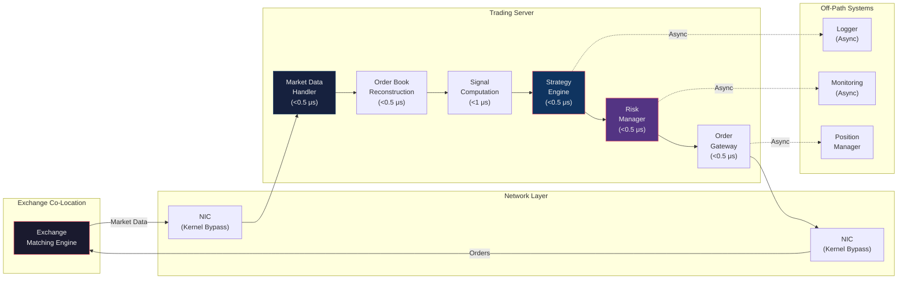
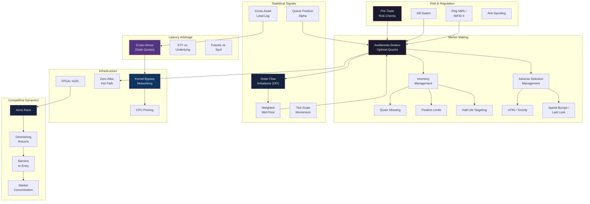

# Module 30: High-Frequency Trading Strategies

> **Prerequisites:** Modules 10 (Order Book Dynamics), 13 (Execution Algorithms), 14 (Transaction Cost Analysis), 23 (Factor Models)
> **Builds toward:** Modules 31 (Portfolio Optimization Under Constraints), 32 (Multi-Strategy Framework)

---

## Table of Contents

1. [Market Making: Theoretical Foundation](#1-market-making-theoretical-foundation)
2. [Inventory Management](#2-inventory-management)
3. [Adverse Selection Management](#3-adverse-selection-management)
4. [Fee Optimization](#4-fee-optimization)
5. [Latency Arbitrage](#5-latency-arbitrage)
6. [Statistical Signals at High Frequency](#6-statistical-signals-at-high-frequency)
7. [Infrastructure Requirements](#7-infrastructure-requirements)
8. [Risk Management in HFT](#8-risk-management-in-hft)
9. [Regulatory Framework](#9-regulatory-framework)
10. [Competitive Dynamics](#10-competitive-dynamics)
11. [Python Implementations](#11-python-implementations)
12. [C++ Production Engine](#12-c-production-engine)
13. [Exercises](#13-exercises)
14. [Summary and Concept Map](#14-summary-and-concept-map)

---

## 1. Market Making: Theoretical Foundation

### 1.1 The Market Maker's Role

A market maker continuously posts limit orders on both sides of the order book, earning the bid-ask spread while bearing inventory risk. The fundamental tension is between **earning spread** and **bearing adverse selection** -- the risk that informed counterparties trade against you at stale prices.

Formally, the market maker's profit on a round trip is:

$$
\pi = \underbrace{(p_{\text{ask}} - p_{\text{bid}})}_{\text{Spread earned}} - \underbrace{\Delta p \cdot q}_{\text{Adverse selection cost}} - \underbrace{c}_{\text{Transaction costs}}
$$

where $\Delta p$ is the price move against the position and $q$ is the quantity.

### 1.2 Avellaneda-Stoikov Model (Recap)

Avellaneda and Stoikov (2008) formalize optimal market making as a stochastic control problem. The midprice $S_t$ follows arithmetic Brownian motion:

$$
dS_t = \sigma \, dW_t
$$

The market maker holds inventory $q_t$ and posts reservation bid and ask prices. Their utility function is exponential (CARA):

$$
U(x) = -e^{-\gamma x}
$$

where $\gamma$ is the risk aversion parameter. The optimal bid and ask quotes are:

$$
\delta^{b*} = \frac{1}{\gamma} \ln\left(1 + \frac{\gamma}{k}\right) + \frac{(2q + 1)\gamma\sigma^2(T-t)}{2}
$$

$$
\delta^{a*} = \frac{1}{\gamma} \ln\left(1 + \frac{\gamma}{k}\right) - \frac{(2q - 1)\gamma\sigma^2(T-t)}{2}
$$

where:
- $\delta^{b*}, \delta^{a*}$ are the bid and ask offsets from the midprice
- $q$ is current inventory
- $\sigma$ is volatility
- $T - t$ is time remaining
- $k$ parameterizes the fill rate: $\Lambda(\delta) = A e^{-k\delta}$

The **reservation price** (indifference price) is:

$$
r_t = S_t - q \gamma \sigma^2 (T - t)
$$

This shifts the midprice away from the inventory direction: a long position ($q > 0$) lowers the reservation price, making the market maker more aggressive on the ask (selling) and less aggressive on the bid (buying).

The **optimal spread** around the reservation price is:

$$
\delta^* = \delta^{a*} + \delta^{b*} = \frac{2}{\gamma} \ln\left(1 + \frac{\gamma}{k}\right) + \gamma \sigma^2 (T-t)
$$

Key insight: the spread is **always wider than the theoretical minimum** $\frac{2}{\gamma}\ln(1 + \gamma/k)$ due to the inventory risk premium $\gamma\sigma^2(T-t)$.

### 1.3 Extensions to the Base Model

The Avellaneda-Stoikov model makes simplifying assumptions that must be relaxed for production:

| Assumption | Reality | Extension |
|-----------|---------|-----------|
| Constant volatility $\sigma$ | Volatility clusters, jumps | Stochastic vol, regime detection |
| Poisson arrivals | Self-exciting arrivals (Hawkes) | Hawkes process fill model |
| No adverse selection | Informed traders exist | Toxicity-adjusted spreads |
| Continuous time | Discrete tick sizes | Tick-constrained optimization |
| Single venue | Fragmented markets | Multi-venue quoting |
| Zero latency | Non-zero latency | Stale quote risk premium |

---

## 2. Inventory Management

### 2.1 Skewing Quotes

The most direct inventory management tool is **quote skewing**: adjusting bid and ask prices asymmetrically to encourage trades that reduce inventory.

For inventory $q$ and target inventory $q^*$ (typically 0), the skew is:

$$
\text{skew}(q) = -\kappa (q - q^*)
$$

where $\kappa$ is the skew aggressiveness parameter (units: ticks per share). The adjusted quotes become:

$$
p_{\text{bid}} = \text{mid} - \frac{s}{2} + \text{skew}(q)
$$

$$
p_{\text{ask}} = \text{mid} + \frac{s}{2} + \text{skew}(q)
$$

When $q > q^*$ (too long), skew is negative: the bid price drops (less aggressive buying) and the ask price drops (more aggressive selling).

**Nonlinear skewing.** In practice, the skew function is often nonlinear to become increasingly aggressive as inventory deviates further from target:

$$
\text{skew}(q) = -\kappa_1 (q - q^*) - \kappa_2 (q - q^*)^3
$$

The cubic term ensures rapid correction at extreme inventory levels.

### 2.2 Position Limits

Hard position limits define the maximum allowed inventory $q_{\max}$. When $|q| \geq q_{\max}$, the market maker cancels the quote on the side that would increase inventory.

**Soft limits** with graduated response:

$$
\text{size}(q) = \max\left(0, \text{size}_{\text{base}} \cdot \left(1 - \left(\frac{|q|}{q_{\max}}\right)^2\right)\right)
$$

This smoothly reduces quote size as inventory approaches the limit, avoiding the discontinuity of a hard cutoff.

### 2.3 Half-Life Targeting

Rather than a fixed position limit, we can target an inventory **half-life**: the expected time for inventory to decay to half its current level through skewing.

If the fill rate at offset $\delta$ is $\Lambda(\delta) = Ae^{-k\delta}$, and we skew by $\text{skew}(q)$, the expected rate of inventory reduction is:

$$
\frac{dq}{dt} \approx -\Lambda\left(\frac{s}{2} - |\text{skew}(q)|\right) \cdot \text{sign}(q)
$$

For a target half-life $\tau_{1/2}$, we solve for the skew parameter $\kappa$ such that:

$$
\frac{\ln 2}{\tau_{1/2}} = \Lambda\left(\frac{s}{2} - \kappa |q|\right) \cdot \text{sign}(q) / |q|
$$

This yields a state-dependent optimal skew that adjusts in real-time as fill rates and inventory change.

---

## 3. Adverse Selection Management

### 3.1 Toxic Flow Detection

**Adverse selection** occurs when a market maker trades with a counterparty who has superior information. The cost of adverse selection is:

$$
\text{AS Cost} = \mathbb{E}[\Delta S \mid \text{filled}] \cdot q
$$

where $\Delta S$ is the subsequent price movement conditional on being filled.

**VPIN (Volume-Synchronized Probability of Informed Trading).** VPIN estimates the fraction of toxic (informed) flow in real-time:

$$
\text{VPIN} = \frac{\sum_{b=1}^{n} |V_b^S - V_b^B|}{n \cdot V_{\text{bucket}}}
$$

where $V_b^S$ and $V_b^B$ are the sell and buy volumes in bucket $b$, $n$ is the number of buckets, and $V_{\text{bucket}}$ is the bucket size. VPIN ranges from 0 (balanced flow) to 1 (fully informed).

**Implementation:** Classify trades as buyer- or seller-initiated using the Lee-Ready algorithm (compare trade price to midpoint; if above, buyer-initiated). When VPIN exceeds a threshold $\tau_{\text{VPIN}}$, widen spreads or reduce quote sizes.

**Flow toxicity by counterparty.** At venues with counterparty identification (some OTC markets), maintain a running estimate of adversity per counterparty:

$$
\text{Toxicity}_j = \frac{1}{N_j} \sum_{i=1}^{N_j} \mathbb{1}[\Delta S_{i,j} \cdot \text{sign}_i > \theta]
$$

where $\text{sign}_i$ is +1 for a buy and -1 for a sell, $\Delta S_{i,j}$ is the price change after trade $i$ with counterparty $j$, and $\theta$ is a materiality threshold.

### 3.2 Speed Bumps and Last-Look

**Speed bumps** are intentional delays (e.g., IEX's 350 microsecond delay) that reduce the advantage of faster traders. From a market maker's perspective, venues with speed bumps reduce adverse selection costs by giving the market maker's quotes time to update before being picked off.

**Last-look** allows the market maker to reject or accept an incoming order after seeing it. Common in FX markets, it provides a window (typically 25-200ms) to check whether the price has moved adversely since the order was sent. The rejection rate as a function of the time-since-quote parameter $\Delta t$ is:

$$
P(\text{reject} \mid \Delta t) = \Phi\left(\frac{\sigma\sqrt{\Delta t} - \text{threshold}}{\sigma\sqrt{\Delta t}}\right)
$$

where $\Phi$ is the standard normal CDF. Larger $\Delta t$ or higher $\sigma$ increases the probability of stale quotes and thus rejection.

### 3.3 Adjusting Spreads for Toxicity

The **toxicity-adjusted spread** incorporates an adverse selection premium:

$$
s_{\text{adjusted}} = s_{\text{base}} + \alpha_{\text{AS}} \cdot \text{VPIN}_t + \beta_{\text{vol}} \cdot \hat{\sigma}_t
$$

where $\hat{\sigma}_t$ is realized volatility estimated over the last $n$ trades. The coefficients $\alpha_{\text{AS}}$ and $\beta_{\text{vol}}$ are calibrated from historical fill data and subsequent price impact.

---

## 4. Fee Optimization

### 4.1 Maker-Taker Rebate Capture

Most US equity exchanges operate a **maker-taker** fee model:

| Role | Fee (typical) |
|------|---------------|
| Liquidity provider (maker) | Rebate of $0.20-0.32 per 100 shares |
| Liquidity taker (taker) | Fee of $0.25-0.30 per 100 shares |

The net spread earned by a market maker is:

$$
\text{Net Spread} = (p_{\text{ask}} - p_{\text{bid}}) + 2 \times \text{rebate}_{\text{maker}}
$$

For a stock quoted at a 1-cent spread with a $0.25/100 rebate:

$$
\text{Net Spread} = \$0.01 + 2 \times \$0.0025 = \$0.015 \text{ per share}
$$

The rebate increases effective profitability by 50%.

### 4.2 Inverted Venues

**Inverted fee venues** (e.g., BX, EDGA) reverse the incentives: they charge makers and rebate takers. These venues attract different order flow -- predominantly passive, less-informed retail flow seeking price improvement.

**Optimization strategy:** Route aggressive (inventory-reducing) orders to inverted venues to earn the taker rebate, while posting passive quotes on maker-taker venues to earn maker rebates. The combined fee optimization problem is:

$$
\max_{\mathbf{r}} \sum_{v \in \mathcal{V}} \left( r_v^{\text{make}} \cdot f_v^{\text{make}} + r_v^{\text{take}} \cdot f_v^{\text{take}} \right) \cdot \mathbb{E}[\text{Volume}_v]
$$

subject to fill-rate constraints and regulatory obligations (e.g., best execution).

### 4.3 Tiered Pricing and Volume Thresholds

Exchanges offer volume-tiered rebates that increase with monthly market share. A market maker adding 0.5% of consolidated volume might earn $0.25/100 shares, while one adding 1.5% earns $0.32/100 shares. The marginal rebate improvement can be worth millions annually, creating incentives to maintain minimum volume thresholds even when marginal trades are unprofitable:

$$
\text{Marginal Value} = \Delta \text{rebate} \times V_{\text{total}} - \text{Cost of marginal trades}
$$

---

## 5. Latency Arbitrage

### 5.1 Cross-Venue Arbitrage

US equities trade on 16+ exchanges and ~40 ATSs. Prices can diverge for microseconds when a marketable order sweeps one venue but has not yet reached others.

**Detecting stale quotes.** A quote at venue $B$ is stale if the NBBO has moved but venue $B$'s quote has not yet updated. The staleness window is:

$$
\Delta t_{\text{stale}} = t_{\text{update},A} + \text{latency}_{A \to B} - t_{\text{update},B}
$$

If $\Delta t_{\text{stale}} > 0$, venue $B$'s quote can be picked off.

**Race dynamics.** When a price change originates at venue $A$, two races begin simultaneously:

1. **Update race:** The market maker at venue $B$ races to cancel/update their stale quote.
2. **Arbitrage race:** The latency arbitrageur races to take the stale quote before it updates.

The profit from a successful pick-off is $\Delta p \cdot q - c_{\text{take}}$, where $\Delta p$ is the price displacement and $c_{\text{take}}$ includes exchange fees and clearing costs.

**Win probability** depends on the latency differential:

$$
P(\text{arb wins}) \approx \Phi\left(\frac{\text{latency}_{\text{MM}} - \text{latency}_{\text{arb}}}{\sigma_{\text{jitter}}}\right)
$$

where $\sigma_{\text{jitter}}$ is the standard deviation of network/processing jitter. Even a 1-microsecond advantage can yield >80% win rates when jitter is low.

### 5.2 Correlated-Instrument Arbitrage

**ETF vs. Underlying.** An ETF's market price $P_{\text{ETF}}$ can diverge from its net asset value $\text{NAV} = \sum_i w_i p_i$ when the underlying basket updates faster than the ETF quote. The arbitrage signal is:

$$
z_t = \frac{P_{\text{ETF},t} - \text{NAV}_t}{\sigma_{\text{tracking}}}
$$

When $|z_t| > \tau$, the arbitrageur buys (sells) the ETF and sells (buys) the basket. The convergence half-life is typically 50-500 milliseconds for liquid ETFs.

**ADR vs. Local.** American Depositary Receipts (ADRs) track foreign equities. Arbitrage exploits pricing gaps due to:
- FX rate changes not yet reflected in ADR price
- Overnight information during overlapping trading hours
- Liquidity differences between ADR and local market

The fair ADR price is:

$$
P_{\text{ADR}} = P_{\text{local}} \times \frac{\text{FX rate}}{\text{ADR ratio}}
$$

### 5.3 Futures-Spot Arbitrage

The theoretical futures price is given by cost-of-carry:

$$
F_t = S_t \cdot e^{(r - d)(T - t)}
$$

where $r$ is the risk-free rate, $d$ is the dividend yield, and $T - t$ is time to expiration. The basis $B_t = F_t - S_t \cdot e^{(r-d)(T-t)}$ should be zero. When $|B_t| > \text{transaction costs}$, the arbitrageur can lock in a risk-free profit:

- **Positive basis ($B_t > 0$):** Sell futures, buy spot, finance at $r$.
- **Negative basis ($B_t < 0$):** Buy futures, short spot, invest proceeds at $r$.

At high frequency, the basis fluctuates due to execution timing and liquidity differences between futures and cash markets. The E-mini S&P 500 futures typically lead the cash index by 50-500 milliseconds during normal market conditions.

---

## 6. Statistical Signals at High Frequency

### 6.1 Order Flow Imbalance and Weighted Mid-Price

The standard midprice $M_t = (p_{\text{bid}} + p_{\text{ask}}) / 2$ ignores the relative sizes at bid and ask. The **weighted mid-price** (microprice) adjusts for queue imbalance:

$$
M_t^w = p_{\text{bid}} \cdot \frac{V_{\text{ask}}}{V_{\text{bid}} + V_{\text{ask}}} + p_{\text{ask}} \cdot \frac{V_{\text{bid}}}{V_{\text{bid}} + V_{\text{ask}}}
$$

**Derivation.** Consider the probability that the next trade occurs at the ask versus the bid. Under a simple proportional model:

$$
P(\text{next trade at ask}) = \frac{V_{\text{bid}}}{V_{\text{bid}} + V_{\text{ask}}}
$$

The reasoning: a larger bid queue indicates more buying interest, making it more likely that an incoming market order is a buy (filling at the ask). The expected next trade price is:

$$
\mathbb{E}[P_{\text{next}}] = p_{\text{ask}} \cdot P(\text{at ask}) + p_{\text{bid}} \cdot P(\text{at bid})
$$

$$
= p_{\text{ask}} \cdot \frac{V_{\text{bid}}}{V_{\text{bid}} + V_{\text{ask}}} + p_{\text{bid}} \cdot \frac{V_{\text{ask}}}{V_{\text{bid}} + V_{\text{ask}}} = M_t^w
$$

The **Order Flow Imbalance (OFI)** signal aggregates order book changes over an interval $[t, t+\Delta]$:

$$
\text{OFI}_{t, t+\Delta} = \sum_{k=t}^{t+\Delta} \left[\mathbb{1}_{p_k^b \geq p_{k-1}^b} \cdot \Delta V_k^b - \mathbb{1}_{p_k^b \leq p_{k-1}^b} \cdot \Delta V_k^b + \mathbb{1}_{p_k^a \leq p_{k-1}^a} \cdot \Delta V_k^a - \mathbb{1}_{p_k^a \geq p_{k-1}^a} \cdot \Delta V_k^a \right]
$$

where $\Delta V_k^b$ and $\Delta V_k^a$ are the changes in bid and ask volume at update $k$. Positive OFI indicates net buying pressure; negative indicates net selling.

The predictive regression is:

$$
\Delta M_{t+\Delta} = \alpha + \beta \cdot \text{OFI}_{t,t+\Delta} + \varepsilon
$$

Research shows $\beta > 0$ with $R^2$ of 50-65% at 10-second horizons for liquid stocks, decaying to 5-10% at 5-minute horizons.

### 6.2 Trade Flow Toxicity

Beyond VPIN (Section 3.1), we can measure toxicity using the **permanent price impact** of trades:

$$
\text{Toxicity}_t = \frac{\sum_{i=1}^{N_t} \text{sign}(x_i) \cdot \Delta S_{i,\infty}}{\sum_{i=1}^{N_t} |x_i|}
$$

where $x_i$ is the signed trade volume (positive for buyer-initiated), $\Delta S_{i,\infty}$ is the permanent price impact (measured as the price change that persists after transient effects die out, typically 5-30 minutes), and $N_t$ is the number of trades in period $t$.

### 6.3 Queue Position Alpha

**Value of queue priority.** In a FIFO (price-time priority) order book, earlier orders at the same price level fill first. The expected profit from position $k$ in a queue of depth $Q$ at the best bid is:

$$
\mathbb{E}[\pi \mid \text{position } k] = P(\text{filled at } k) \cdot (\text{spread}/2 + \text{rebate}) - P(\text{adverse fill}) \cdot \mathbb{E}[\text{loss} \mid \text{adverse}]
$$

The fill probability decays roughly as:

$$
P(\text{filled at } k) \approx e^{-\lambda k / Q}
$$

where $\lambda$ depends on the arrival rate of marketable orders relative to queue depth.

**Maintaining position.** Canceling and resubmitting an order sends you to the back of the queue. Strategies for maintaining priority:

1. **Join early:** Submit orders as soon as a new price level becomes relevant.
2. **Avoid unnecessary cancels:** Only cancel when adverse selection risk exceeds the value of priority.
3. **Anticipate level changes:** Pre-position at prices one tick away before the price moves there.

The **alpha from queue position** can be measured as the difference in PnL between a strategy with perfect queue priority (always first) and one with average priority:

$$
\alpha_{\text{queue}} = \text{PnL}_{\text{first}} - \text{PnL}_{\text{avg}} = \sum_t \left(P(\text{fill}_t^{\text{first}}) - P(\text{fill}_t^{\text{avg}})\right) \cdot \text{edge}_t
$$

### 6.4 Momentum and Mean-Reversion at Tick Timescales

At tick timescales (milliseconds to seconds), price dynamics exhibit both patterns simultaneously:

**Microstructure noise** causes bid-ask bounce: a sequence of trades alternating between bid and ask creates apparent mean-reversion at the finest timescale. The first-order autocorrelation of trade prices is approximately:

$$
\rho_1 \approx -\frac{s^2}{4\sigma_{\text{true}}^2 + s^2}
$$

where $s$ is the spread and $\sigma_{\text{true}}$ is the true price innovation variance. For a stock with a 1-cent spread and 5-cent true standard deviation per tick, $\rho_1 \approx -0.04$.

**Momentum at 100ms-10s horizons.** Beyond the bid-ask bounce, genuine momentum emerges from the sequential arrival of informed orders. The autocorrelation signature is:

| Horizon | Autocorrelation | Dominant Effect |
|---------|----------------|-----------------|
| 1 tick | Negative | Bid-ask bounce |
| 10-100ms | Positive | Order flow momentum |
| 1-10s | Positive (weaker) | Information diffusion |
| 10s-1min | Near zero | Efficient pricing |
| 1-5min | Slightly negative | Mean-reversion |

### 6.5 Cross-Asset Signals

**S&P futures leading individual stocks.** E-mini S&P 500 futures reflect aggregate information faster than individual stocks because:
1. One instrument vs. 500+ individual quotes to update.
2. Higher leverage attracts informed macro traders.
3. Lower transaction costs per unit of beta exposure.

The lead-lag relationship:

$$
r_{i,t} = \alpha_i + \beta_i r_{\text{ES},t-\delta} + \varepsilon_{i,t}
$$

where $r_{\text{ES},t-\delta}$ is the futures return lagged by $\delta$ (typically 50-500ms). The $R^2$ can exceed 30% at the optimal lag for high-beta stocks.

**Signal construction:** Decompose the futures move into the stock's expected share:

$$
\hat{r}_{i,t+\delta} = \hat{\beta}_i \cdot r_{\text{ES},t} \cdot \left(1 - \frac{r_{i,t}}{r_{\text{ES},t} \cdot \hat{\beta}_i}\right)
$$

The term in parentheses measures how much of the expected move has already been reflected in the stock price. Positive residual suggests the stock has not yet caught up.

---

## 7. Infrastructure Requirements

### 7.1 Tick-to-Trade Latency Budget

The **tick-to-trade** pipeline is the time from receiving a market data update to having the resulting order acknowledged by the exchange. A competitive HFT system targets **sub-5 microsecond** end-to-end latency.

**Latency Budget Breakdown:**

| Component | Target | Technology |
|-----------|--------|------------|
| Network ingress (NIC to app) | <1 $\mu$s | Kernel bypass (DPDK, Solarflare OpenOnload) |
| Market data parsing | <0.5 $\mu$s | Template-based binary parsers, FPGA |
| Signal computation | <1 $\mu$s | Pre-computed lookup tables, SIMD |
| Order generation | <0.5 $\mu$s | Pre-allocated order objects |
| Risk checks | <0.5 $\mu$s | Branchless arithmetic |
| Network egress | <1 $\mu$s | Kernel bypass, FPGA |
| **Total** | **<5 $\mu$s** | |

### 7.2 Deterministic Execution

Non-deterministic behavior in the hot path destroys latency consistency:

**No Garbage Collection.** Languages with GC (Java, C#, Python) introduce unpredictable pauses of 1-100ms. Solutions:
- Use C/C++ or Rust on the hot path.
- If using Java, use off-heap memory (e.g., Chronicle, Agrona) and tune GC to never trigger during trading hours.

**No Dynamic Allocation.** Heap allocation (malloc/new) can trigger OS page faults (>10 $\mu$s). Solutions:
- Pre-allocate all objects at startup.
- Use object pools for frequently created/destroyed objects.
- Use arena allocators for request-scoped memory.

**No System Calls on Hot Path.** Syscalls (read, write, clock_gettime) context-switch to kernel mode (~1 $\mu$s). Solutions:
- Kernel bypass networking (no read/write syscalls for network I/O).
- Use RDTSC instruction for timestamps instead of clock_gettime.
- Memory-mapped files for logging (batched writes off critical path).

**CPU Pinning.** Pin trading threads to dedicated CPU cores. Disable hyperthreading on those cores. Set interrupt affinity to keep network interrupts on separate cores.

### 7.3 Architecture Diagram



---

## 8. Risk Management in HFT

### 8.1 Position Limits

HFT risk management must be **pre-trade** (enforced before the order is sent) rather than post-trade (checked after fills).

**Per-instrument limits:**

$$
|q_i| \leq Q_{\max,i} \quad \forall i \in \text{Universe}
$$

**Gross exposure limit:**

$$
\sum_i |q_i| \cdot p_i \leq E_{\max}
$$

**Net exposure limit:**

$$
\left|\sum_i q_i \cdot p_i \cdot \beta_i\right| \leq \text{Net}_{\max}
$$

where $\beta_i$ is the market beta of instrument $i$.

### 8.2 Loss Limits

**Per-strategy daily loss limit.** When cumulative PnL falls below $-L_{\max}$:

$$
\text{PnL}_t = \sum_{\tau=0}^{t} \pi_\tau < -L_{\max} \implies \text{Halt strategy}
$$

**Drawdown limit.** When the drawdown from the intraday high-water mark exceeds a threshold:

$$
\text{DD}_t = \max_{0 \leq \tau \leq t} \text{PnL}_\tau - \text{PnL}_t > D_{\max} \implies \text{Halt strategy}
$$

### 8.3 Kill Switches

A **kill switch** is a mechanism to immediately cancel all outstanding orders and flatten all positions. Triggers include:

1. Loss limit breach
2. Position limit breach
3. Message rate anomaly (>$N$ messages per second suggests a bug)
4. Connectivity loss to exchange or market data
5. Manual operator trigger

**Implementation requirement:** The kill switch must operate independently of the trading logic -- typically a separate process on a separate CPU core that monitors the trading process via shared memory.

Kill switch latency target: **<100 microseconds** from trigger detection to cancel messages sent.

### 8.4 Self-Trade Prevention

Regulations prohibit a single entity from trading with itself (wash trading). With multiple strategies or algorithms operating simultaneously, self-trades can occur inadvertently.

**Prevention mechanisms:**
1. **Exchange-level STP:** Most exchanges offer self-trade prevention that rejects or cancels orders that would match.
2. **Firm-level STP:** A centralized order manager checks all outgoing orders against the firm's resting orders.
3. **Strategy-level coordination:** Shared memory structures that allow strategies to see each other's outstanding orders.

### 8.5 Circuit Breakers

**Exchange circuit breakers** (e.g., LULD bands, market-wide halts) are externally imposed. HFT systems must:
1. Detect halt conditions and immediately stop quoting.
2. Resume quoting with wider spreads upon reopening (higher volatility).
3. Handle auction reopening mechanics.

**Internal circuit breakers** protect against abnormal market conditions:
- Spread exceeds $N$ times normal
- Volume exceeds $N$ times normal
- Implied volatility spikes
- Correlation breakdown between correlated instruments

---

## 9. Regulatory Framework

### 9.1 Regulation NMS (US)

Reg NMS (2005) establishes the framework for US equity market structure:

**Order Protection Rule (Rule 611).** Prohibits trade-throughs: executing at a price worse than the NBBO. Impact on HFT: ensures that displayed liquidity is protected across venues, creating the fragmented market structure that enables latency arbitrage.

**Access Fee Cap (Rule 610).** Limits access fees to $0.30 per 100 shares. This constrains the maker-taker model and ensures that displayed prices are economically meaningful.

**Sub-Penny Rule (Rule 612).** Prohibits displaying quotes in sub-penny increments for stocks priced above $1.00. Forces minimum tick size of $0.01, which sets a floor on the bid-ask spread and thus on market making profitability.

### 9.2 MiFID II (EU)

MiFID II (2018) imposes additional requirements on algorithmic and high-frequency traders:

1. **Registration:** All HFT firms must be authorized as investment firms.
2. **Algo testing:** Mandatory testing and certification of algorithms.
3. **Market making obligations:** If an HFT firm benefits from colocation, it must commit to providing liquidity during specified hours.
4. **Order-to-trade ratio limits:** Exchanges must impose penalties for excessive order submission relative to executed trades.
5. **Tick size regime:** Standardized minimum tick sizes based on price and liquidity.

### 9.3 Spoofing and Layering

**Spoofing** is the placement of orders with the intent to cancel before execution, designed to manipulate the apparent supply/demand balance. It is illegal under the Dodd-Frank Act (US) and the Market Abuse Regulation (EU).

**Layering** is a specific form of spoofing where multiple orders are placed at successively worse prices, creating the illusion of a large order queue.

**Detection signatures:**
- High cancel-to-fill ratio (>95%) at a specific price level.
- Orders consistently placed on the opposite side of subsequent trades.
- Orders canceled within a short window of a fill on the other side.
- Pattern of layering orders at 3+ price levels.

Penalties include criminal prosecution, fines exceeding $25M, and permanent trading bans.

---

## 10. Competitive Dynamics

### 10.1 The Arms Race

HFT profitability is a function of relative speed, not absolute speed. This creates an arms race:

$$
\pi_i \propto \sum_{j \neq i} P(\text{latency}_i < \text{latency}_j) \cdot \text{edge}_{ij}
$$

Each participant's marginal investment in speed is justified only if it leapfrogs competitors. This has driven investment in:

- **Colocation:** Physical proximity to exchange matching engines (<1m of cable).
- **Microwave networks:** Point-to-point microwave links (speed of light in air > speed of light in fiber) for inter-venue communication.
- **FPGA/ASIC:** Hardware-implemented trading logic that eliminates software overhead.
- **Hollow-core fiber:** Experimental fiber that approaches the speed of light in vacuum.

### 10.2 Diminishing Returns

The economics of the speed arms race show steep diminishing returns:

| Investment | Latency Improvement | Annual Cost |
|-----------|-------------------|-------------|
| Colocation | ~50 $\mu$s -> ~5 $\mu$s | \$50K-200K |
| Kernel bypass | ~10 $\mu$s -> ~2 $\mu$s | \$500K (dev cost) |
| FPGA strategy | ~2 $\mu$s -> ~0.5 $\mu$s | \$2M-5M (dev cost) |
| Microwave links | ~5ms -> ~4ms (inter-city) | \$5M-20M/year |

The last microsecond costs 10-100x more than the first microsecond.

### 10.3 Barriers to Entry

HFT has among the highest barriers to entry in finance:

1. **Capital requirements:** \$10M-50M minimum for infrastructure and initial capital.
2. **Technology talent:** Requires expertise in low-latency C++, networking, FPGA, and quantitative modeling.
3. **Data costs:** Direct exchange feeds cost \$100K-500K/year per exchange.
4. **Regulatory compliance:** Market making registration, algo certification, surveillance systems.
5. **Incumbent advantages:** Existing firms have years of accumulated data, calibrated models, and established exchange relationships.

### 10.4 Market Share Concentration

HFT market making is highly concentrated. In US equities, the top 5 firms account for approximately 50-60% of all displayed liquidity. This concentration results from:

- **Winner-take-most dynamics:** Being first by 1 microsecond captures the entire opportunity.
- **Scale economies in technology:** Infrastructure costs are largely fixed.
- **Data advantages:** More fills -> better adverse selection models -> better quotes -> more fills (virtuous cycle).

---

## 11. Python Implementations

### 11.1 Market Making Simulator

```python
"""
Market Making Simulator
Implements the Avellaneda-Stoikov model with inventory management.
Suitable for backtesting and strategy development (not production latency).
"""

import logging
from dataclasses import dataclass, field
from typing import Dict, List, Optional, Tuple

import numpy as np

logger = logging.getLogger(__name__)


@dataclass
class MarketState:
    """Snapshot of market conditions."""
    timestamp: float
    midprice: float
    bid: float
    ask: float
    bid_size: int
    ask_size: int
    last_trade_price: float
    last_trade_size: int
    last_trade_side: int  # +1 buy, -1 sell


@dataclass
class Quote:
    """A two-sided quote."""
    bid_price: float
    ask_price: float
    bid_size: int
    ask_size: int
    spread: float = 0.0

    def __post_init__(self):
        self.spread = self.ask_price - self.bid_price


@dataclass
class Fill:
    """Execution record."""
    timestamp: float
    price: float
    size: int
    side: int  # +1 = bought, -1 = sold


@dataclass
class SimulatorState:
    """Internal state of the market making simulator."""
    cash: float = 0.0
    inventory: int = 0
    pnl: float = 0.0
    pnl_history: List[float] = field(default_factory=list)
    fill_history: List[Fill] = field(default_factory=list)
    quote_history: List[Quote] = field(default_factory=list)
    n_fills_bid: int = 0
    n_fills_ask: int = 0


class AvellanedaStoikovMM:
    """
    Market making strategy based on Avellaneda-Stoikov (2008).

    Parameters
    ----------
    gamma : float
        Risk aversion coefficient.
    sigma : float
        Estimated volatility (per unit time).
    k : float
        Fill rate parameter: Lambda(delta) = A * exp(-k * delta).
    dt : float
        Time step.
    T : float
        Terminal time (end of trading session).
    inventory_limit : int
        Maximum absolute inventory.
    tick_size : float
        Minimum price increment.
    base_size : int
        Default quote size.
    skew_kappa : float
        Linear skew aggressiveness.
    skew_kappa_cubic : float
        Cubic skew aggressiveness for nonlinear inventory control.
    """

    def __init__(
        self,
        gamma: float = 0.01,
        sigma: float = 0.02,
        k: float = 1.5,
        dt: float = 1.0 / 252 / 6.5 / 3600,  # ~1 second
        T: float = 1.0 / 252,  # 1 trading day
        inventory_limit: int = 100,
        tick_size: float = 0.01,
        base_size: int = 100,
        skew_kappa: float = 0.001,
        skew_kappa_cubic: float = 0.0,
    ):
        self.gamma = gamma
        self.sigma = sigma
        self.k = k
        self.dt = dt
        self.T = T
        self.inventory_limit = inventory_limit
        self.tick_size = tick_size
        self.base_size = base_size
        self.skew_kappa = skew_kappa
        self.skew_kappa_cubic = skew_kappa_cubic

        self.state = SimulatorState()
        self._t = 0.0

    def _reservation_price(self, midprice: float) -> float:
        """
        Compute the reservation (indifference) price.
        r = S - q * gamma * sigma^2 * (T - t)
        """
        q = self.state.inventory
        time_remaining = max(self.T - self._t, self.dt)
        return midprice - q * self.gamma * self.sigma**2 * time_remaining

    def _optimal_spread(self) -> float:
        """
        Compute the optimal spread around the reservation price.
        delta* = (2/gamma) * ln(1 + gamma/k) + gamma * sigma^2 * (T-t)
        """
        time_remaining = max(self.T - self._t, self.dt)
        base_spread = (2.0 / self.gamma) * np.log(1 + self.gamma / self.k)
        risk_premium = self.gamma * self.sigma**2 * time_remaining
        return base_spread + risk_premium

    def _compute_skew(self) -> float:
        """
        Compute inventory skew.
        skew = -kappa1 * q - kappa2 * q^3
        """
        q = self.state.inventory
        return -(
            self.skew_kappa * q + self.skew_kappa_cubic * q**3
        )

    def _compute_size(self) -> Tuple[int, int]:
        """
        Compute quote sizes with inventory-dependent reduction.
        """
        q = self.state.inventory
        ratio = abs(q) / self.inventory_limit if self.inventory_limit > 0 else 0

        # Reduce size as inventory approaches limit
        size_factor = max(0.0, 1.0 - ratio**2)
        adjusted_size = max(1, int(self.base_size * size_factor))

        # Zero out the side that would increase inventory beyond limit
        bid_size = adjusted_size if q < self.inventory_limit else 0
        ask_size = adjusted_size if q > -self.inventory_limit else 0

        return bid_size, ask_size

    def generate_quote(self, market: MarketState) -> Quote:
        """
        Generate optimal two-sided quote given current market state.

        Parameters
        ----------
        market : MarketState
            Current market snapshot.

        Returns
        -------
        Quote with optimal bid/ask prices and sizes.
        """
        reservation = self._reservation_price(market.midprice)
        spread = self._optimal_spread()
        skew = self._compute_skew()
        bid_size, ask_size = self._compute_size()

        # Raw prices
        raw_bid = reservation - spread / 2 + skew
        raw_ask = reservation + spread / 2 + skew

        # Round to tick size
        bid_price = np.floor(raw_bid / self.tick_size) * self.tick_size
        ask_price = np.ceil(raw_ask / self.tick_size) * self.tick_size

        # Ensure bid < ask
        if bid_price >= ask_price:
            ask_price = bid_price + self.tick_size

        quote = Quote(
            bid_price=bid_price,
            ask_price=ask_price,
            bid_size=bid_size,
            ask_size=ask_size,
        )
        self.state.quote_history.append(quote)
        return quote

    def process_fill(self, fill: Fill) -> None:
        """Record an execution and update state."""
        self.state.inventory += fill.side * fill.size
        self.state.cash -= fill.side * fill.price * fill.size
        self.state.fill_history.append(fill)

        if fill.side == 1:
            self.state.n_fills_bid += 1
        else:
            self.state.n_fills_ask += 1

    def mark_to_market(self, midprice: float) -> float:
        """Compute current PnL."""
        self.state.pnl = self.state.cash + self.state.inventory * midprice
        self.state.pnl_history.append(self.state.pnl)
        return self.state.pnl

    def step(self, market: MarketState) -> Quote:
        """
        Advance one time step: update state, generate new quote.
        """
        self._t += self.dt
        self.mark_to_market(market.midprice)
        return self.generate_quote(market)

    def run_simulation(
        self,
        midprices: np.ndarray,
        fill_prob_fn=None,
        seed: int = 42,
    ) -> Dict[str, np.ndarray]:
        """
        Run a full simulation over a price path.

        Parameters
        ----------
        midprices : np.ndarray
            Array of midprice values.
        fill_prob_fn : callable, optional
            Function(offset, side) -> fill probability. Default uses
            exponential model.
        seed : int
            Random seed for fill simulation.

        Returns
        -------
        Dict with simulation results: pnl, inventory, spreads, fills.
        """
        rng = np.random.default_rng(seed)
        n_steps = len(midprices)

        # Result arrays
        pnl_arr = np.zeros(n_steps)
        inv_arr = np.zeros(n_steps, dtype=int)
        spread_arr = np.zeros(n_steps)
        n_fills = 0

        if fill_prob_fn is None:
            A = 1.0  # Normalization for Poisson fill model

            def fill_prob_fn(offset, _side):
                return min(1.0, A * np.exp(-self.k * max(offset, 0)) * self.dt)

        for t in range(n_steps):
            mid = midprices[t]
            spread_val = mid * 0.001  # Use 10bps as approximate spread
            market = MarketState(
                timestamp=t * self.dt,
                midprice=mid,
                bid=mid - spread_val / 2,
                ask=mid + spread_val / 2,
                bid_size=1000,
                ask_size=1000,
                last_trade_price=mid,
                last_trade_size=100,
                last_trade_side=1 if rng.random() > 0.5 else -1,
            )

            quote = self.step(market)

            # Simulate fills
            bid_offset = mid - quote.bid_price
            ask_offset = quote.ask_price - mid

            if quote.bid_size > 0 and rng.random() < fill_prob_fn(bid_offset, 1):
                self.process_fill(Fill(
                    timestamp=t * self.dt,
                    price=quote.bid_price,
                    size=min(quote.bid_size, self.base_size),
                    side=1,
                ))
                n_fills += 1

            if quote.ask_size > 0 and rng.random() < fill_prob_fn(ask_offset, -1):
                self.process_fill(Fill(
                    timestamp=t * self.dt,
                    price=quote.ask_price,
                    size=min(quote.ask_size, self.base_size),
                    side=-1,
                ))
                n_fills += 1

            pnl_arr[t] = self.state.pnl
            inv_arr[t] = self.state.inventory
            spread_arr[t] = quote.spread

        logger.info(
            f"Simulation complete: {n_fills} fills, "
            f"final PnL: {self.state.pnl:.2f}, "
            f"final inventory: {self.state.inventory}"
        )

        return {
            "pnl": pnl_arr,
            "inventory": inv_arr,
            "spread": spread_arr,
            "n_fills": n_fills,
        }
```

### 11.2 Order Flow Imbalance Signal

```python
"""
Order Flow Imbalance (OFI) Signal
Computes the OFI signal from order book updates and evaluates predictive power.
"""

from dataclasses import dataclass
from typing import Dict, List, Optional, Tuple

import numpy as np
from scipy import stats


@dataclass
class BookUpdate:
    """Single order book update event."""
    timestamp: float
    bid_price: float
    ask_price: float
    bid_size: int
    ask_size: int


class OFICalculator:
    """
    Computes Order Flow Imbalance from level-1 order book updates.

    OFI = sum of signed volume changes at best bid/ask.

    Positive OFI -> net buying pressure -> expected price increase.
    Negative OFI -> net selling pressure -> expected price decrease.
    """

    def __init__(self, normalization: str = "volume"):
        """
        Parameters
        ----------
        normalization : str
            'volume' normalizes by total absolute volume change.
            'none' returns raw OFI.
            'zscore' returns z-scored OFI over a rolling window.
        """
        self.normalization = normalization
        self._prev_update: Optional[BookUpdate] = None

    def compute_tick_ofi(
        self, current: BookUpdate, previous: BookUpdate
    ) -> float:
        """
        Compute OFI contribution from a single book update.

        The decomposition follows Cont, Kukanov, and Stoikov (2014):
        - If bid price rises: added bid volume is buying pressure
        - If bid price falls: removed bid volume is selling pressure
        - If ask price falls: added ask volume is selling pressure
        - If ask price rises: removed ask volume is buying pressure
        """
        ofi = 0.0

        # Bid side contribution
        if current.bid_price > previous.bid_price:
            ofi += current.bid_size
        elif current.bid_price == previous.bid_price:
            ofi += current.bid_size - previous.bid_size
        else:  # bid price decreased
            ofi -= previous.bid_size

        # Ask side contribution
        if current.ask_price < previous.ask_price:
            ofi -= current.ask_size
        elif current.ask_price == previous.ask_price:
            ofi -= current.ask_size - previous.ask_size
        else:  # ask price increased
            ofi += previous.ask_size

        return ofi

    def compute_ofi_series(
        self, updates: List[BookUpdate], window: int = 50
    ) -> np.ndarray:
        """
        Compute OFI over a sequence of book updates.

        Parameters
        ----------
        updates : List[BookUpdate]
            Chronological sequence of order book snapshots.
        window : int
            Aggregation window (number of updates).

        Returns
        -------
        np.ndarray of OFI values (one per window).
        """
        n = len(updates)
        if n < 2:
            return np.array([])

        # Tick-level OFI
        tick_ofi = np.zeros(n - 1)
        for i in range(1, n):
            tick_ofi[i - 1] = self.compute_tick_ofi(updates[i], updates[i - 1])

        # Aggregate over windows
        n_windows = (n - 1) // window
        ofi = np.zeros(n_windows)

        for w in range(n_windows):
            start = w * window
            end = start + window
            raw_ofi = np.sum(tick_ofi[start:end])

            if self.normalization == "volume":
                abs_sum = np.sum(np.abs(tick_ofi[start:end]))
                ofi[w] = raw_ofi / abs_sum if abs_sum > 0 else 0.0
            elif self.normalization == "zscore":
                # Rolling z-score (use all available history)
                if w > 0:
                    history = [np.sum(tick_ofi[j * window:(j + 1) * window])
                               for j in range(w + 1)]
                    mu = np.mean(history[:-1])
                    std = np.std(history[:-1])
                    ofi[w] = (raw_ofi - mu) / std if std > 0 else 0.0
                else:
                    ofi[w] = 0.0
            else:
                ofi[w] = raw_ofi

        return ofi

    @staticmethod
    def compute_weighted_midprice(
        bid: float, ask: float, bid_size: int, ask_size: int
    ) -> float:
        """
        Compute the size-weighted midprice (microprice).

        M_w = bid * V_ask / (V_bid + V_ask) + ask * V_bid / (V_bid + V_ask)
        """
        total = bid_size + ask_size
        if total == 0:
            return (bid + ask) / 2.0
        return bid * (ask_size / total) + ask * (bid_size / total)

    @staticmethod
    def evaluate_predictive_power(
        ofi: np.ndarray,
        forward_returns: np.ndarray,
        lags: Optional[List[int]] = None,
    ) -> Dict[str, float]:
        """
        Evaluate OFI signal predictive power via regression and IC.

        Parameters
        ----------
        ofi : np.ndarray
            OFI signal values.
        forward_returns : np.ndarray
            Forward returns (same length as ofi).
        lags : Optional[List[int]]
            Lag values to test. Default: [1, 5, 10].

        Returns
        -------
        Dict with regression coefficients, R-squared, IC, and t-stats.
        """
        if lags is None:
            lags = [1, 5, 10]

        n = min(len(ofi), len(forward_returns))
        ofi = ofi[:n]
        fwd = forward_returns[:n]

        results = {}

        for lag in lags:
            if lag >= n:
                continue

            x = ofi[:n - lag]
            y = fwd[lag:n]

            # Remove NaN/inf
            valid = np.isfinite(x) & np.isfinite(y)
            x, y = x[valid], y[valid]

            if len(x) < 30:
                continue

            # OLS regression
            slope, intercept, r_value, p_value, std_err = stats.linregress(x, y)

            # Information Coefficient (rank correlation)
            ic, ic_pval = stats.spearmanr(x, y)

            # T-stat of the slope
            t_stat = slope / std_err if std_err > 0 else 0.0

            results[f"lag_{lag}"] = {
                "beta": round(float(slope), 8),
                "intercept": round(float(intercept), 8),
                "r_squared": round(float(r_value**2), 6),
                "t_stat": round(float(t_stat), 4),
                "p_value": round(float(p_value), 6),
                "IC": round(float(ic), 6),
                "IC_p_value": round(float(ic_pval), 6),
                "n_obs": len(x),
            }

        return results
```

### 11.3 Queue Alpha Model

```python
"""
Queue Position Alpha Model
Estimates the value of queue priority and models fill probability
as a function of queue position.
"""

from dataclasses import dataclass
from typing import Dict, List, Tuple

import numpy as np
from scipy.optimize import minimize


@dataclass
class QueueSnapshot:
    """Snapshot of queue state at best bid or ask."""
    timestamp: float
    price: float
    total_depth: int        # Total shares in queue
    our_position: int       # Our position in queue (0 = front)
    our_size: int           # Our order size
    arrived_volume: float   # Volume that arrived at this level since snapshot


@dataclass
class QueueFillEvent:
    """Record of whether a queued order was filled."""
    queue_position_frac: float  # position / total_depth
    total_depth: int
    arrived_volume: float       # Market order volume that arrived
    was_filled: bool
    price_move_after: float     # Midprice change 1s after fill/cancel


class QueueAlphaModel:
    """
    Models the relationship between queue position and profitability.

    Key insight: earlier queue position -> higher fill rate -> more
    profitable fills (filled before adverse selection pushes price).

    The fill probability given queue position k in depth Q with
    arriving volume V is modeled as:

        P(fill | k, Q, V) = sigmoid(a * V/Q - b * k/Q + c)

    The expected PnL per queued share is:

        E[PnL | k] = P(fill|k) * E[profit|fill,k] - P(fill|k) * P(adverse|fill) * E[loss|adverse]
    """

    def __init__(self):
        self._fill_params: np.ndarray = np.array([2.0, 3.0, -1.0])
        self._fitted: bool = False

    def fit_fill_model(self, events: List[QueueFillEvent]) -> Dict[str, float]:
        """
        Fit the fill probability model using maximum likelihood.

        P(fill | x) = sigmoid(a * V/Q - b * pos_frac + c)

        Parameters
        ----------
        events : List[QueueFillEvent]
            Historical queue fill events.

        Returns
        -------
        Dict with fitted parameters and model diagnostics.
        """
        n = len(events)
        if n < 50:
            raise ValueError(f"Insufficient events: {n} < 50 required.")

        X = np.zeros((n, 3))
        y = np.zeros(n)

        for i, evt in enumerate(events):
            X[i, 0] = evt.arrived_volume / max(evt.total_depth, 1)
            X[i, 1] = evt.queue_position_frac
            X[i, 2] = 1.0  # intercept
            y[i] = 1.0 if evt.was_filled else 0.0

        def neg_log_likelihood(params: np.ndarray) -> float:
            logits = X @ params
            # Numerically stable sigmoid
            logits = np.clip(logits, -20, 20)
            probs = 1.0 / (1.0 + np.exp(-logits))
            probs = np.clip(probs, 1e-10, 1 - 1e-10)
            ll = np.sum(y * np.log(probs) + (1 - y) * np.log(1 - probs))
            return -ll

        result = minimize(
            neg_log_likelihood,
            x0=self._fill_params,
            method="L-BFGS-B",
        )

        self._fill_params = result.x
        self._fitted = True

        # Compute accuracy
        logits = X @ self._fill_params
        pred_probs = 1.0 / (1.0 + np.exp(-np.clip(logits, -20, 20)))
        preds = (pred_probs > 0.5).astype(float)
        accuracy = np.mean(preds == y)

        return {
            "volume_coeff": round(float(self._fill_params[0]), 4),
            "position_coeff": round(float(self._fill_params[1]), 4),
            "intercept": round(float(self._fill_params[2]), 4),
            "accuracy": round(float(accuracy), 4),
            "n_events": n,
            "fill_rate": round(float(np.mean(y)), 4),
        }

    def predict_fill_prob(
        self, position_frac: float, volume_ratio: float
    ) -> float:
        """
        Predict fill probability for given queue position and volume.

        Parameters
        ----------
        position_frac : float
            Queue position as fraction of total depth (0 = front).
        volume_ratio : float
            Expected arriving volume / queue depth.

        Returns
        -------
        float: Fill probability in [0, 1].
        """
        x = np.array([volume_ratio, position_frac, 1.0])
        logit = np.dot(self._fill_params, x)
        logit = np.clip(logit, -20, 20)
        return float(1.0 / (1.0 + np.exp(-logit)))

    def compute_queue_alpha(
        self,
        events: List[QueueFillEvent],
        half_spread: float,
        rebate: float = 0.0025,
    ) -> Dict[str, float]:
        """
        Compute the alpha (PnL advantage) from queue position.

        Compares expected PnL at the front of queue vs. back of queue.

        Parameters
        ----------
        events : List[QueueFillEvent]
            Historical fill events with price moves.
        half_spread : float
            Half the bid-ask spread (the gross edge per fill).
        rebate : float
            Maker rebate per share.

        Returns
        -------
        Dict with alpha estimates and decomposition.
        """
        if not self._fitted:
            self.fit_fill_model(events)

        # Compute average adverse selection as function of position
        position_bins = np.linspace(0, 1, 11)
        bin_pnl = []

        for b in range(len(position_bins) - 1):
            lo, hi = position_bins[b], position_bins[b + 1]
            bin_events = [
                e for e in events
                if lo <= e.queue_position_frac < hi and e.was_filled
            ]
            if bin_events:
                avg_move = np.mean([e.price_move_after for e in bin_events])
                # PnL = half_spread + rebate - adverse move (if move is against us)
                avg_pnl = half_spread + rebate - abs(avg_move)
                bin_pnl.append({
                    "position_bin": round((lo + hi) / 2, 2),
                    "n_fills": len(bin_events),
                    "avg_adverse_move": round(float(avg_move), 6),
                    "avg_pnl_per_fill": round(float(avg_pnl), 6),
                })
            else:
                bin_pnl.append({
                    "position_bin": round((lo + hi) / 2, 2),
                    "n_fills": 0,
                    "avg_adverse_move": 0.0,
                    "avg_pnl_per_fill": 0.0,
                })

        # Alpha = PnL(front) - PnL(back)
        front_pnl = bin_pnl[0]["avg_pnl_per_fill"] if bin_pnl[0]["n_fills"] > 0 else 0
        back_pnl = bin_pnl[-1]["avg_pnl_per_fill"] if bin_pnl[-1]["n_fills"] > 0 else 0

        front_fill_prob = self.predict_fill_prob(0.05, 1.0)
        back_fill_prob = self.predict_fill_prob(0.95, 1.0)

        expected_alpha_front = front_fill_prob * front_pnl
        expected_alpha_back = back_fill_prob * back_pnl
        queue_alpha = expected_alpha_front - expected_alpha_back

        return {
            "queue_alpha_per_share": round(float(queue_alpha), 6),
            "front_fill_prob": round(float(front_fill_prob), 4),
            "back_fill_prob": round(float(back_fill_prob), 4),
            "front_expected_pnl": round(float(expected_alpha_front), 6),
            "back_expected_pnl": round(float(expected_alpha_back), 6),
            "pnl_by_position": bin_pnl,
        }
```

---

## 12. C++ Production Engine

### 12.1 Strategy Engine Skeleton

```cpp
/**
 * HFT Strategy Engine Skeleton
 *
 * Production-style architecture:
 * - Zero-allocation hot path
 * - Pre-allocated ring buffers for market data
 * - Lock-free communication between components
 * - RDTSC-based nanosecond timestamps
 *
 * NOTE: This is a skeleton demonstrating architecture and patterns.
 * A production system requires exchange-specific protocol handlers,
 * kernel-bypass networking, and extensive testing.
 */

#include <cstdint>
#include <cstring>
#include <cmath>
#include <array>
#include <atomic>
#include <limits>
#include <algorithm>

// ============================================================
//  Core Data Structures (all fixed-size, no heap allocation)
// ============================================================

namespace hft {

/// Nanosecond timestamp from RDTSC
using Timestamp = uint64_t;

/// Price in fixed-point: integer ticks (e.g., 1 tick = $0.01)
using Price = int64_t;

/// Quantity in shares
using Qty = int32_t;

/// Instrument identifier
using InstrumentId = uint32_t;

/// Order identifier
using OrderId = uint64_t;

/// Side of the market
enum class Side : uint8_t { Buy = 0, Sell = 1 };

/// Inline RDTSC timestamp (no syscall)
inline Timestamp rdtsc_timestamp() {
    uint32_t lo, hi;
    __asm__ __volatile__("rdtsc" : "=a"(lo), "=d"(hi));
    return (static_cast<uint64_t>(hi) << 32) | lo;
}


// ============================================================
//  Market Data Structures
// ============================================================

struct alignas(64) TopOfBook {
    Timestamp   timestamp;
    Price       bid_price;
    Price       ask_price;
    Qty         bid_size;
    Qty         ask_size;
    InstrumentId instrument_id;
    uint32_t    sequence_num;

    Price midprice() const {
        return (bid_price + ask_price) / 2;
    }

    /// Size-weighted midprice (microprice) in fixed-point
    Price weighted_midprice() const {
        int64_t total = static_cast<int64_t>(bid_size) + ask_size;
        if (total == 0) return midprice();
        return static_cast<Price>(
            (static_cast<int64_t>(bid_price) * ask_size +
             static_cast<int64_t>(ask_price) * bid_size) / total
        );
    }
};

struct alignas(64) Trade {
    Timestamp    timestamp;
    Price        price;
    Qty          size;
    Side         aggressor_side;
    InstrumentId instrument_id;
    uint32_t     sequence_num;
};


// ============================================================
//  Order Management
// ============================================================

enum class OrderStatus : uint8_t {
    New, Pending, Active, PartialFill, Filled, Canceled, Rejected
};

struct alignas(64) Order {
    OrderId      order_id;
    InstrumentId instrument_id;
    Price        price;
    Qty          quantity;
    Qty          filled_qty;
    Side         side;
    OrderStatus  status;
    Timestamp    submit_time;
    Timestamp    ack_time;

    Qty remaining() const { return quantity - filled_qty; }
};

/// Pre-allocated order pool (no heap allocation during trading)
template <size_t MaxOrders = 1024>
class OrderPool {
public:
    OrderPool() : next_id_(1), count_(0) {
        std::memset(orders_.data(), 0, sizeof(orders_));
        for (size_t i = 0; i < MaxOrders; ++i) {
            free_list_[i] = static_cast<uint32_t>(i);
        }
        free_count_ = MaxOrders;
    }

    /// Allocate an order from the pool (O(1), no heap)
    Order* allocate() {
        if (free_count_ == 0) return nullptr;
        uint32_t idx = free_list_[--free_count_];
        Order* order = &orders_[idx];
        order->order_id = next_id_++;
        order->status = OrderStatus::New;
        ++count_;
        return order;
    }

    /// Return an order to the pool
    void release(Order* order) {
        uint32_t idx = static_cast<uint32_t>(order - orders_.data());
        if (idx < MaxOrders) {
            order->status = OrderStatus::Canceled;
            free_list_[free_count_++] = idx;
            --count_;
        }
    }

    /// Find order by ID (linear scan -- production uses a hash map)
    Order* find(OrderId id) {
        for (size_t i = 0; i < MaxOrders; ++i) {
            if (orders_[i].order_id == id &&
                orders_[i].status != OrderStatus::Canceled) {
                return &orders_[i];
            }
        }
        return nullptr;
    }

    size_t active_count() const { return count_; }

private:
    std::array<Order, MaxOrders>    orders_;
    std::array<uint32_t, MaxOrders> free_list_;
    uint32_t                        free_count_;
    uint64_t                        next_id_;
    size_t                          count_;
};


// ============================================================
//  Risk Manager (pre-trade, on hot path)
// ============================================================

struct RiskLimits {
    Qty     max_position;         // Per-instrument max position
    int64_t max_gross_exposure;   // In ticks * shares
    int64_t max_loss;             // Daily loss limit in ticks * shares
    uint32_t max_messages_per_sec; // Rate limit
};

class RiskManager {
public:
    explicit RiskManager(const RiskLimits& limits)
        : limits_(limits)
        , position_(0)
        , gross_exposure_(0)
        , realized_pnl_(0)
        , unrealized_pnl_(0)
        , message_count_(0)
        , last_second_(0)
        , killed_(false)
    {}

    /// Check if an order passes pre-trade risk checks.
    /// Returns true if the order is allowed.
    /// This MUST be branchless / minimal-branch for latency.
    bool check_order(const Order& order, Price current_mid) {
        if (killed_) return false;

        // Position limit check
        Qty new_pos = position_;
        if (order.side == Side::Buy) {
            new_pos += order.quantity;
        } else {
            new_pos -= order.quantity;
        }

        if (std::abs(new_pos) > limits_.max_position) {
            return false;
        }

        // Gross exposure check
        int64_t order_notional =
            static_cast<int64_t>(order.price) * order.quantity;
        if (gross_exposure_ + order_notional > limits_.max_gross_exposure) {
            return false;
        }

        // Loss limit check
        int64_t total_pnl = realized_pnl_ + unrealized_pnl_;
        if (total_pnl < -limits_.max_loss) {
            trigger_kill_switch();
            return false;
        }

        // Message rate check
        Timestamp now = rdtsc_timestamp();
        // Approximate: assume ~3GHz clock, 1 second ~ 3e9 cycles
        constexpr uint64_t cycles_per_sec = 3'000'000'000ULL;
        if (now - last_second_ > cycles_per_sec) {
            message_count_ = 0;
            last_second_ = now;
        }
        if (++message_count_ > limits_.max_messages_per_sec) {
            return false;
        }

        return true;
    }

    /// Update position after a fill
    void on_fill(Side side, Qty qty, Price price) {
        if (side == Side::Buy) {
            position_ += qty;
        } else {
            position_ -= qty;
        }
        // Simplified PnL tracking
        gross_exposure_ =
            static_cast<int64_t>(std::abs(position_)) * price;
    }

    /// Update unrealized PnL with current market price
    void mark_to_market(Price current_mid) {
        unrealized_pnl_ =
            static_cast<int64_t>(position_) * current_mid;
    }

    /// Emergency: cancel all orders, flatten position
    void trigger_kill_switch() {
        killed_ = true;
        // In production: send cancel-all to exchange,
        // then send market orders to flatten.
    }

    bool is_killed() const { return killed_; }
    Qty  position() const  { return position_; }

private:
    RiskLimits limits_;
    Qty        position_;
    int64_t    gross_exposure_;
    int64_t    realized_pnl_;
    int64_t    unrealized_pnl_;
    uint32_t   message_count_;
    Timestamp  last_second_;
    bool       killed_;
};


// ============================================================
//  Signal Engine
// ============================================================

struct SignalOutput {
    double fair_value;      // Estimated fair price (continuous)
    double urgency;         // [-1, 1]: negative = sell, positive = buy
    double volatility;      // Estimated short-term volatility
    double toxicity;        // Estimated flow toxicity [0, 1]
    bool   is_valid;
};

/// Exponential moving average (no allocation, O(1) per update)
class EMA {
public:
    explicit EMA(double halflife_ticks)
        : alpha_(1.0 - std::exp(-std::log(2.0) / halflife_ticks))
        , value_(0.0)
        , initialized_(false)
    {}

    void update(double x) {
        if (!initialized_) {
            value_ = x;
            initialized_ = true;
        } else {
            value_ = alpha_ * x + (1.0 - alpha_) * value_;
        }
    }

    double value() const { return value_; }
    bool initialized() const { return initialized_; }

private:
    double alpha_;
    double value_;
    bool   initialized_;
};

class SignalEngine {
public:
    SignalEngine()
        : ofi_ema_(50.0)        // 50-tick half-life
        , vol_ema_(100.0)       // 100-tick half-life
        , toxicity_ema_(200.0)  // 200-tick half-life
        , prev_bid_(0)
        , prev_ask_(0)
        , prev_bid_size_(0)
        , prev_ask_size_(0)
        , trade_count_(0)
        , buy_volume_(0)
        , sell_volume_(0)
    {}

    /// Process a top-of-book update and compute signals.
    /// This is on the HOT PATH -- must be < 1μs.
    SignalOutput on_book_update(const TopOfBook& tob) {
        SignalOutput out{};

        // -- Order Flow Imbalance --
        double ofi = 0.0;
        if (prev_bid_ > 0) {  // Skip first update
            // Bid side
            if (tob.bid_price > prev_bid_) {
                ofi += tob.bid_size;
            } else if (tob.bid_price == prev_bid_) {
                ofi += (tob.bid_size - prev_bid_size_);
            } else {
                ofi -= prev_bid_size_;
            }
            // Ask side
            if (tob.ask_price < prev_ask_) {
                ofi -= tob.ask_size;
            } else if (tob.ask_price == prev_ask_) {
                ofi -= (tob.ask_size - prev_ask_size_);
            } else {
                ofi += prev_ask_size_;
            }
        }
        ofi_ema_.update(ofi);

        // -- Volatility (squared mid changes) --
        if (prev_bid_ > 0) {
            double prev_mid = (prev_bid_ + prev_ask_) / 2.0;
            double curr_mid = tob.midprice();
            double ret = curr_mid - prev_mid;
            vol_ema_.update(ret * ret);
        }

        // -- Weighted midprice as fair value --
        out.fair_value = static_cast<double>(tob.weighted_midprice());

        // -- Urgency from OFI (normalized) --
        double vol = std::sqrt(std::max(vol_ema_.value(), 1e-12));
        out.urgency = std::tanh(ofi_ema_.value() / (vol * 100.0));

        // -- Volatility --
        out.volatility = vol;

        // -- Toxicity (buy/sell volume imbalance) --
        double total_vol = buy_volume_ + sell_volume_;
        double imbalance = (total_vol > 0)
            ? std::abs(static_cast<double>(buy_volume_) - sell_volume_) / total_vol
            : 0.0;
        toxicity_ema_.update(imbalance);
        out.toxicity = toxicity_ema_.value();

        out.is_valid = (prev_bid_ > 0);

        // Store for next update
        prev_bid_ = tob.bid_price;
        prev_ask_ = tob.ask_price;
        prev_bid_size_ = tob.bid_size;
        prev_ask_size_ = tob.ask_size;

        return out;
    }

    /// Process a trade event (for toxicity estimation)
    void on_trade(const Trade& trade) {
        ++trade_count_;
        if (trade.aggressor_side == Side::Buy) {
            buy_volume_ += trade.size;
        } else {
            sell_volume_ += trade.size;
        }
    }

    /// Reset volume counters (call at configurable intervals)
    void reset_volume_counters() {
        buy_volume_ = 0;
        sell_volume_ = 0;
        trade_count_ = 0;
    }

private:
    EMA ofi_ema_;
    EMA vol_ema_;
    EMA toxicity_ema_;

    Price prev_bid_;
    Price prev_ask_;
    Qty   prev_bid_size_;
    Qty   prev_ask_size_;

    uint64_t trade_count_;
    int64_t  buy_volume_;
    int64_t  sell_volume_;
};


// ============================================================
//  Strategy: Market Making with Avellaneda-Stoikov
// ============================================================

struct StrategyParams {
    double gamma;              // Risk aversion
    double sigma;              // Base volatility estimate
    double k;                  // Fill rate parameter
    double skew_kappa;         // Inventory skew linear coeff
    double skew_kappa_cubic;   // Inventory skew cubic coeff
    Price  tick_size;          // Minimum tick
    Qty    base_size;          // Default quote size
    Qty    max_inventory;      // Position limit
    double spread_floor;       // Minimum spread in ticks
    double toxicity_threshold; // Widen spread above this
    double toxicity_multiplier;// Spread multiplier for toxic flow
};

struct StrategyAction {
    bool   should_quote;
    Price  bid_price;
    Price  ask_price;
    Qty    bid_size;
    Qty    ask_size;
    bool   should_cancel_all;
};

class MarketMakingStrategy {
public:
    explicit MarketMakingStrategy(const StrategyParams& params)
        : params_(params)
        , inventory_(0)
        , time_step_(0)
    {}

    /// Core strategy logic. Called on every market data update.
    /// MUST complete in < 0.5μs.
    StrategyAction on_signal(
        const TopOfBook& tob,
        const SignalOutput& signal
    ) {
        StrategyAction action{};
        ++time_step_;

        if (!signal.is_valid) {
            action.should_quote = false;
            return action;
        }

        // Use signal volatility or fallback to params
        double sigma = (signal.volatility > 0)
            ? signal.volatility
            : params_.sigma;

        // Reservation price: r = S - q * gamma * sigma^2
        double mid = signal.fair_value;
        double reservation = mid - inventory_ * params_.gamma * sigma * sigma;

        // Optimal spread
        double gamma_over_k = params_.gamma / params_.k;
        double base_spread = (2.0 / params_.gamma) * std::log(1.0 + gamma_over_k);
        double spread = base_spread + params_.gamma * sigma * sigma;

        // Toxicity adjustment
        if (signal.toxicity > params_.toxicity_threshold) {
            spread *= (1.0 + params_.toxicity_multiplier *
                       (signal.toxicity - params_.toxicity_threshold));
        }

        // Enforce minimum spread
        double min_spread = params_.spread_floor * params_.tick_size;
        if (spread < min_spread) spread = min_spread;

        // Inventory skew
        double skew = -(params_.skew_kappa * inventory_ +
                        params_.skew_kappa_cubic * inventory_ *
                        inventory_ * inventory_);

        // Compute prices
        double raw_bid = reservation - spread / 2.0 + skew;
        double raw_ask = reservation + spread / 2.0 + skew;

        // Round to tick
        Price tick = params_.tick_size;
        action.bid_price = static_cast<Price>(
            std::floor(raw_bid / tick) * tick);
        action.ask_price = static_cast<Price>(
            std::ceil(raw_ask / tick) * tick);

        // Ensure valid spread
        if (action.bid_price >= action.ask_price) {
            action.ask_price = action.bid_price + tick;
        }

        // Compute sizes (inventory-dependent)
        double inv_ratio = static_cast<double>(std::abs(inventory_))
                         / params_.max_inventory;
        double size_factor = std::max(0.0, 1.0 - inv_ratio * inv_ratio);
        Qty adjusted_size = std::max(
            static_cast<Qty>(1),
            static_cast<Qty>(params_.base_size * size_factor)
        );

        action.bid_size = (inventory_ < params_.max_inventory)
            ? adjusted_size : 0;
        action.ask_size = (inventory_ > -params_.max_inventory)
            ? adjusted_size : 0;

        action.should_quote = (action.bid_size > 0 || action.ask_size > 0);
        action.should_cancel_all = false;

        return action;
    }

    void on_fill(Side side, Qty qty) {
        if (side == Side::Buy) {
            inventory_ += qty;
        } else {
            inventory_ -= qty;
        }
    }

    Qty inventory() const { return inventory_; }

private:
    StrategyParams params_;
    Qty            inventory_;
    uint64_t       time_step_;
};


// ============================================================
//  Tick-to-Trade Pipeline (top-level orchestration)
// ============================================================

class TradingPipeline {
public:
    TradingPipeline(
        const StrategyParams& strat_params,
        const RiskLimits& risk_limits
    )
        : signal_engine_()
        , strategy_(strat_params)
        , risk_manager_(risk_limits)
        , order_pool_()
        , stats_{}
    {}

    /// Main entry point: process a market data update end-to-end.
    /// Target: < 5μs total.
    void on_market_data(const TopOfBook& tob) {
        Timestamp t_start = rdtsc_timestamp();

        // 1. Signal computation
        SignalOutput signal = signal_engine_.on_book_update(tob);

        // 2. Strategy decision
        StrategyAction action = strategy_.on_signal(tob, signal);

        // 3. Risk check & order submission
        if (action.should_cancel_all || risk_manager_.is_killed()) {
            cancel_all_orders();
            return;
        }

        if (action.should_quote) {
            // Cancel existing quotes if prices changed
            manage_quotes(action, tob.instrument_id);
        }

        // 4. Update risk state
        risk_manager_.mark_to_market(tob.midprice());

        Timestamp t_end = rdtsc_timestamp();
        stats_.total_cycles += (t_end - t_start);
        stats_.update_count++;
    }

    /// Process a trade event
    void on_trade(const Trade& trade) {
        signal_engine_.on_trade(trade);
    }

    /// Process a fill notification from the exchange
    void on_fill(OrderId order_id, Qty filled_qty, Price fill_price) {
        Order* order = order_pool_.find(order_id);
        if (!order) return;

        order->filled_qty += filled_qty;
        if (order->filled_qty >= order->quantity) {
            order->status = OrderStatus::Filled;
        } else {
            order->status = OrderStatus::PartialFill;
        }

        strategy_.on_fill(order->side, filled_qty);
        risk_manager_.on_fill(order->side, filled_qty, fill_price);
    }

    struct Stats {
        uint64_t total_cycles;
        uint64_t update_count;
        uint64_t orders_sent;
        uint64_t orders_canceled;
        uint64_t risk_rejects;

        /// Average tick-to-trade in cycles
        double avg_cycles() const {
            return update_count > 0
                ? static_cast<double>(total_cycles) / update_count
                : 0.0;
        }
    };

    const Stats& stats() const { return stats_; }

private:
    void manage_quotes(
        const StrategyAction& action,
        InstrumentId instrument
    ) {
        // In production: compare with existing quotes, only
        // send updates if prices/sizes changed (to minimize
        // message rate and preserve queue position).

        if (action.bid_size > 0) {
            Order* bid = order_pool_.allocate();
            if (bid) {
                bid->instrument_id = instrument;
                bid->price = action.bid_price;
                bid->quantity = action.bid_size;
                bid->side = Side::Buy;
                bid->submit_time = rdtsc_timestamp();

                if (risk_manager_.check_order(*bid, action.bid_price)) {
                    bid->status = OrderStatus::Pending;
                    // send_to_exchange(bid); // Placeholder
                    ++stats_.orders_sent;
                } else {
                    order_pool_.release(bid);
                    ++stats_.risk_rejects;
                }
            }
        }

        if (action.ask_size > 0) {
            Order* ask = order_pool_.allocate();
            if (ask) {
                ask->instrument_id = instrument;
                ask->price = action.ask_price;
                ask->quantity = action.ask_size;
                ask->side = Side::Sell;
                ask->submit_time = rdtsc_timestamp();

                if (risk_manager_.check_order(*ask, action.ask_price)) {
                    ask->status = OrderStatus::Pending;
                    // send_to_exchange(ask); // Placeholder
                    ++stats_.orders_sent;
                } else {
                    order_pool_.release(ask);
                    ++stats_.risk_rejects;
                }
            }
        }
    }

    void cancel_all_orders() {
        // In production: iterate active orders and send cancels
        // For skeleton: just increment counter
        ++stats_.orders_canceled;
    }

    SignalEngine          signal_engine_;
    MarketMakingStrategy  strategy_;
    RiskManager           risk_manager_;
    OrderPool<1024>       order_pool_;
    Stats                 stats_;
};

}  // namespace hft
```

---

## 13. Exercises

### Exercise 30.1: Avellaneda-Stoikov Sensitivity Analysis

Using the `AvellanedaStoikovMM` simulator:

1. Generate 100 price paths using geometric Brownian motion with $\mu = 0$, $\sigma \in \{0.01, 0.02, 0.05\}$, and $S_0 = 100$.
2. For each $\sigma$, run the market maker with $\gamma \in \{0.001, 0.01, 0.1\}$.
3. Plot the Sharpe ratio surface as a function of $(\sigma, \gamma)$.
4. For the optimal $(\sigma, \gamma)$ pair, plot the distributions of (a) final PnL, (b) maximum inventory, and (c) spread.
5. Derive analytically why the optimal $\gamma$ increases with $\sigma$. Verify numerically.

### Exercise 30.2: OFI Predictive Power Decay

Using tick-level data (real or simulated):

1. Compute OFI at aggregation windows of 10, 50, 100, 500, and 1000 updates.
2. For each window, measure the $R^2$ of OFI predicting forward returns at horizons of 1x, 2x, 5x, and 10x the aggregation window.
3. Plot the $R^2$ surface. At which horizon does $R^2$ drop below 5%? Below 1%?
4. Test whether volume-normalized OFI outperforms raw OFI.
5. Add the weighted mid-price as a second predictor. Does it provide incremental predictive power?

### Exercise 30.3: Cross-Venue Latency Arbitrage Simulation

Build a simulation of two exchanges A and B with:
- Exchange A processes market orders with latency $\mu_A = 50\mu s$, $\sigma_A = 5\mu s$
- Exchange B processes updates with latency $\mu_B = 100\mu s$, $\sigma_B = 20\mu s$
- True price follows a jump-diffusion with $\lambda_{\text{jump}} = 0.01$, $\sigma_{\text{jump}} = 5$ ticks

Simulate 1 million time steps:
1. Count the number of stale-quote opportunities at exchange B.
2. For an arbitrageur with latency $\mu_{\text{arb}} = 80\mu s$, compute the win rate.
3. Compute the expected daily PnL and Sharpe ratio.
4. How does PnL change if the arbitrageur improves latency by 10$\mu s$? By 20$\mu s$?
5. At what latency does the strategy become unprofitable (accounting for exchange fees)?

### Exercise 30.4: Toxicity-Adjusted Market Making

Extend the `AvellanedaStoikovMM` to incorporate a VPIN-based toxicity indicator:

1. Implement VPIN calculation using volume-bucketed trade classification.
2. When VPIN exceeds a threshold $\tau$, multiply the spread by a factor $1 + \alpha \cdot (\text{VPIN} - \tau)$.
3. Simulate the market maker on a dataset that includes both normal periods and periods of informed trading (inject synthetic toxic flow: one-sided aggressive orders preceding a 10-tick price jump).
4. Compare PnL and maximum drawdown with and without toxicity adjustment.
5. Optimize the threshold $\tau$ and multiplier $\alpha$ using walk-forward cross-validation.

### Exercise 30.5: Queue Priority Value Estimation

Using the `QueueAlphaModel`:

1. Generate synthetic queue data with 10,000 fill/cancel events where fill probability depends on queue position.
2. Fit the logistic fill probability model.
3. Compute the queue alpha (PnL difference between front-of-queue and back-of-queue).
4. Estimate how many times per day the strategy would "lose" its queue position if it cancels and re-enters.
5. Compute the break-even threshold: at what adverse selection level should the strategy cancel its order despite losing queue priority?

### Exercise 30.6: Full C++ Extension

Extend the C++ strategy engine skeleton with:

1. A **self-trade prevention** module that maintains a hash set of active orders and rejects new orders that would match.
2. An **internal circuit breaker** that halts quoting when the spread exceeds 5x its 1-minute rolling average.
3. A **fill logger** that writes fill records to a memory-mapped file using a lock-free ring buffer.
4. Benchmark the end-to-end latency using RDTSC timestamps. Report the mean, p50, p99, and p99.9 latencies.

---

## 14. Summary and Concept Map

### Key Takeaways

1. **Market making** is formalized by the Avellaneda-Stoikov model: optimal quotes balance spread capture against inventory risk, with the reservation price shifting to encourage inventory-reducing trades.
2. **Inventory management** combines quote skewing (linear + cubic), position limits (hard and soft), and half-life targeting to control risk dynamically.
3. **Adverse selection** is the primary cost of market making. VPIN, trade flow toxicity metrics, and counterparty analysis help detect and adapt to informed flow.
4. **Fee optimization** (maker-taker rebate capture, inverted venue routing, tiered pricing) can represent 30-50% of a market maker's gross profitability.
5. **Latency arbitrage** exploits stale quotes across fragmented venues. The profit depends on the latency differential and is subject to the arms race dynamic.
6. **OFI and weighted mid-price** are the strongest short-horizon predictive signals, with $R^2$ exceeding 50% at 10-second horizons.
7. **Queue position** has measurable alpha: earlier positions fill more often with less adverse selection, providing a structural edge.
8. **Infrastructure requirements** demand sub-5$\mu s$ tick-to-trade latency, achieved through kernel bypass, zero-allocation hot paths, and CPU pinning.
9. **Risk management** in HFT must be pre-trade, hardware-fast, and independent of trading logic. Kill switches must operate within 100$\mu s$.
10. **Regulatory compliance** (Reg NMS, MiFID II, anti-spoofing) shapes strategy design and imposes constraints on order management behavior.
11. **Competitive dynamics** exhibit winner-take-most economics with steep diminishing returns on latency investment and high barriers to entry.

### Concept Map



---

*Next: [Module 31 — Transaction Cost Analysis & Optimal Execution](../advanced-alpha/31_tca_execution.md)*
