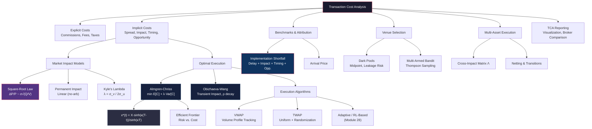

# Module 31: Transaction Cost Analysis & Optimal Execution

> **Prerequisites:** Module 23 (Market Microstructure), Module 24 (Portfolio Optimization), Module 28 (Reinforcement Learning)
> **Builds Toward:** Module 32 (Backtesting Frameworks & Simulation)
> **Estimated Length:** ~8,000 words

---

## Table of Contents

1. [Transaction Cost Components](#1-transaction-cost-components)
2. [Market Impact Models](#2-market-impact-models)
3. [The Almgren-Chriss Optimal Execution Model](#3-the-almgren-chriss-optimal-execution-model)
4. [The Obizhaeva-Wang Model](#4-the-obizhaeva-wang-model)
5. [VWAP Strategies](#5-vwap-strategies)
6. [TWAP Strategies](#6-twap-strategies)
7. [Implementation Shortfall](#7-implementation-shortfall)
8. [Arrival Price Benchmarks](#8-arrival-price-benchmarks)
9. [Adaptive Execution](#9-adaptive-execution)
10. [Dark Pool Strategies](#10-dark-pool-strategies)
11. [Multi-Asset Execution](#11-multi-asset-execution)
12. [TCA Reporting](#12-tca-reporting)
13. [Python Implementations](#13-python-implementations)
14. [C++ Execution Engine](#14-c-execution-engine)
15. [Exercises](#15-exercises)
16. [Summary & Concept Map](#16-summary--concept-map)

---

## 1. Transaction Cost Components

Every trade executed in a live market incurs costs that erode alpha. A rigorous decomposition of these costs is the foundation of execution science. Transaction costs divide into two broad categories: **explicit** (directly observable, contractual) and **implicit** (indirectly measurable, arising from market dynamics).

### 1.1 Explicit Costs

Explicit costs are deterministic and known before trade execution:

| Component | Description | Typical Magnitude |
|-----------|-------------|-------------------|
| **Brokerage commissions** | Per-share or per-trade fees paid to intermediaries | \$0.001--\$0.01 per share (institutional) |
| **Exchange fees** | Maker/taker fee schedules charged by venues | 0.1--0.3 bps per side |
| **Regulatory fees** | SEC fees, TAF (Trading Activity Fee), stamp duty | < 0.5 bps |
| **Clearing & settlement** | CCP and custodian charges | < 0.1 bps |
| **Taxes** | Stamp duty (UK 0.5%), FTT (France 0.3%), capital gains withholding | Varies by jurisdiction |

### 1.2 Implicit Costs

Implicit costs are stochastic, path-dependent, and often an order of magnitude larger than explicit costs for institutional-size orders:

| Component | Description | Typical Magnitude |
|-----------|-------------|-------------------|
| **Bid-ask spread** | Half-spread cost for immediate execution against resting liquidity | 1--10 bps (large caps), 10--100+ bps (small caps) |
| **Market impact** | Price movement caused by the act of trading itself | 5--50+ bps for institutional orders |
| **Timing cost** | Adverse price drift between decision time and execution | Depends on alpha decay rate |
| **Opportunity cost** | Cost of shares *not* executed (unfilled portion of order) | Can dominate total cost for large orders |
| **Information leakage** | Signal extraction by other participants observing order flow | Difficult to measure; can be severe in thin markets |

### 1.3 Total Cost Decomposition

The total cost of execution for an order of $Q$ shares at decision price $P_0$ is:

$$
C_{\text{total}} = \underbrace{C_{\text{commission}} + C_{\text{fees}} + C_{\text{tax}}}_{\text{Explicit}} + \underbrace{\frac{s}{2} + \Delta P_{\text{impact}}(Q) + \Delta P_{\text{timing}} + C_{\text{opportunity}}}_{\text{Implicit}}
$$

where $s$ is the quoted bid-ask spread and $\Delta P_{\text{impact}}(Q)$ is the market impact function of order size. The critical insight is that implicit costs are *concave* in execution speed: trading faster increases impact but reduces timing and opportunity costs. This tradeoff is the central problem of optimal execution.

---

## 2. Market Impact Models

Market impact---the price displacement caused by trading---is the dominant implicit cost for institutional orders. We distinguish three regimes: **temporary** (transient, decays after execution), **permanent** (persistent information component), and **realized** (actual observed price path).

### 2.1 Temporary Impact: The Square-Root Law

The most robust empirical finding in market microstructure is the **square-root law** of market impact, first formalized by Bouchaud and collaborators. For an order of $Q$ shares in a stock with daily volume $V$ and daily volatility $\sigma$:

$$
\frac{\Delta P}{P} \approx Y \cdot \sigma \sqrt{\frac{Q}{V}}
$$

where $Y$ is a dimensionless constant of order 1 (empirically $Y \approx 0.5$--$1.5$ depending on the market).

**Derivation from Dimensional Analysis.** The impact $\Delta P / P$ is dimensionless. The available quantities are: participation rate $Q/V$ (dimensionless), volatility $\sigma$ (dimensionless per unit time, annualized), and possibly time horizon $T$. Since $Q/V$ already captures the relative size, the simplest dimensionless combination linear in $\sigma$ is $\sigma \cdot f(Q/V)$ for some function $f$. The empirical finding that $f(x) = Y\sqrt{x}$ (rather than $f(x) = Yx$) reflects the *concavity* of impact: doubling order size does not double impact, because large orders are split and liquidity partially regenerates.

**Empirical Validation.** Across equities, futures, FX, and even Bitcoin markets, the square-root law holds remarkably well for participation rates $Q/V \in [10^{-4}, 10^{-1}]$. Deviations appear at very high participation rates (convex regime) and very low rates (dominated by spread).

The square-root law implies that the *marginal* impact of each additional share is *decreasing*:

$$
\frac{\partial}{\partial Q}\left(\sigma\sqrt{\frac{Q}{V}}\right) = \frac{\sigma}{2\sqrt{QV}} \to 0 \text{ as } Q \to \infty
$$

### 2.2 Permanent Impact and Information Leakage

Permanent impact reflects the *informational* content of the trade. A portion of the price displacement persists because the trade reveals private information about fundamental value. The **fair pricing condition** (no dynamic arbitrage) constrains the permanent impact function to be *linear* in signed order flow:

$$
\Delta P_{\text{perm}} = \gamma \cdot Q
$$

If permanent impact were concave, a trader could split a large order into pieces, achieve lower total permanent impact, and create a round-trip arbitrage. If convex, a trader could bundle small orders to reduce total impact. Linearity is the unique arbitrage-free solution (Huberman & Stanzl, 2004).

### 2.3 Kyle's Lambda

In Kyle's (1985) model (Module 23), the market maker's pricing rule is:

$$
P_t = P_{t-1} + \lambda \cdot (x_t + u_t)
$$

where $x_t$ is informed order flow, $u_t$ is noise trader flow, and $\lambda$ is **Kyle's lambda**---the permanent price impact coefficient. Lambda encapsulates the market maker's estimate of the probability that order flow is informed:

$$
\lambda = \frac{\text{Cov}(v, x + u)}{\text{Var}(x + u)} = \frac{\sigma_v}{2\sigma_u}
$$

where $\sigma_v$ is the standard deviation of the asset's fundamental value and $\sigma_u$ is the standard deviation of noise trader flow. Higher $\lambda$ means less liquid markets and greater adverse selection.

---

## 3. The Almgren-Chriss Optimal Execution Model

The Almgren-Chriss (2000) framework is the canonical model for optimal execution of a large order. It provides a closed-form solution for the optimal trading trajectory that balances execution risk against market impact cost.

### 3.1 Setup and Notation

A trader must liquidate $X$ shares over a time horizon $[0, T]$, divided into $N$ intervals of length $\tau = T/N$. Let:

- $x_k$ = shares remaining at time $k\tau$, with $x_0 = X$ and $x_N = 0$
- $n_k = x_{k-1} - x_k$ = shares traded in interval $k$ (trade list)
- $v_k = n_k / \tau$ = trading rate in interval $k$

The midprice evolves as:

$$
S_k = S_{k-1} + \sigma\sqrt{\tau}\,\xi_k - g\left(\frac{n_k}{\tau}\right)\tau
$$

where $\xi_k \sim \mathcal{N}(0,1)$ are i.i.d. shocks and $g(v)$ is the **permanent impact function** (linear: $g(v) = \gamma v$).

The execution price for interval $k$ includes temporary impact:

$$
\tilde{S}_k = S_{k-1} - h\left(\frac{n_k}{\tau}\right)
$$

where $h(v)$ is the **temporary impact function**. For the linear model, $h(v) = \epsilon \operatorname{sgn}(v) + \eta v$, where $\epsilon$ captures the fixed spread cost and $\eta$ is the temporary impact coefficient.

### 3.2 Cost Functional

The total execution cost (implementation shortfall) is:

$$
C(\mathbf{n}) = \sum_{k=1}^{N} n_k (S_0 - \tilde{S}_k) = \sum_{k=1}^{N} n_k \left[\sum_{j=1}^{k} \left(\sigma\sqrt{\tau}\,\xi_j\right) + \gamma\tau\sum_{j=1}^{k}v_j + h(v_k)\right]
$$

Taking expectations and computing variance under the trajectory $\mathbf{x} = (x_0, x_1, \ldots, x_N)$:

**Expected cost:**
$$
E[C] = \sum_{k=1}^{N}\left[\epsilon n_k + \frac{\gamma}{2}n_k^2 + \eta\frac{n_k^2}{\tau}\right] + \frac{1}{2}\gamma X^2 - \frac{1}{2}\gamma\sum_{k=1}^{N}n_k^2
$$

In the continuous limit, dropping the fixed spread term:

$$
E[C] = \frac{1}{2}\gamma X^2 + \eta \int_0^T \dot{x}(t)^2\, dt
$$

**Variance of cost:**
$$
\text{Var}[C] = \sigma^2 \sum_{k=1}^{N}\tau\, x_k^2 \xrightarrow{\text{continuous}} \sigma^2 \int_0^T x(t)^2\, dt
$$

### 3.3 Objective and Euler-Lagrange Equation

The Almgren-Chriss objective is to minimize a **mean-variance** criterion:

$$
\min_{x(\cdot)} \; J[x] = E[C] + \lambda_{\text{risk}} \cdot \text{Var}[C]
$$

$$
= \frac{1}{2}\gamma X^2 + \eta \int_0^T \dot{x}(t)^2\, dt + \lambda_{\text{risk}}\,\sigma^2 \int_0^T x(t)^2\, dt
$$

subject to boundary conditions $x(0) = X$ and $x(T) = 0$.

This is a standard problem in the calculus of variations. The **Lagrangian** is:

$$
\mathcal{L}(x, \dot{x}, t) = \eta\, \dot{x}^2 + \lambda_{\text{risk}}\,\sigma^2\, x^2
$$

The **Euler-Lagrange equation** is:

$$
\frac{\partial \mathcal{L}}{\partial x} - \frac{d}{dt}\frac{\partial \mathcal{L}}{\partial \dot{x}} = 0
$$

Computing each term:

$$
\frac{\partial \mathcal{L}}{\partial x} = 2\lambda_{\text{risk}}\sigma^2 x, \qquad \frac{\partial \mathcal{L}}{\partial \dot{x}} = 2\eta\dot{x}, \qquad \frac{d}{dt}\frac{\partial \mathcal{L}}{\partial \dot{x}} = 2\eta\ddot{x}
$$

This yields the **second-order ODE**:

$$
\boxed{\ddot{x}(t) = \kappa^2\, x(t), \quad \text{where} \quad \kappa = \sigma\sqrt{\frac{\lambda_{\text{risk}}}{\eta}}}
$$

### 3.4 Closed-Form Optimal Trajectory

The general solution is $x(t) = A\cosh(\kappa t) + B\sinh(\kappa t)$. Applying boundary conditions $x(0) = X$ and $x(T) = 0$:

$$
\boxed{x^*(t) = X \cdot \frac{\sinh\bigl(\kappa(T - t)\bigr)}{\sinh(\kappa T)}}
$$

The optimal trading rate is:

$$
\dot{x}^*(t) = -X\kappa \cdot \frac{\cosh\bigl(\kappa(T - t)\bigr)}{\sinh(\kappa T)}
$$

**Interpretation:**
- When $\kappa \to 0$ (risk-neutral, $\lambda_{\text{risk}} \to 0$): $x^*(t) = X(1 - t/T)$, i.e., TWAP (uniform rate).
- When $\kappa \to \infty$ (extremely risk-averse): $x^*(t)$ front-loads execution, approaching an immediate liquidation.
- The parameter $\kappa$ controls the "urgency" of execution. It balances the penalty for holding inventory (variance) against the cost of trading fast (impact).

### 3.5 Efficient Frontier

For each risk aversion $\lambda_{\text{risk}}$, the optimal trajectory traces out a point $(E^*, \text{Var}^*)$ on the **execution efficient frontier**:

$$
E^*(\kappa) = \frac{1}{2}\gamma X^2 + \frac{\eta\kappa X^2}{2}\coth(\kappa T)
$$

$$
\text{Var}^*(\kappa) = \frac{\sigma^2 X^2}{2\kappa}\left[\coth(\kappa T) - \frac{\kappa T}{\sinh^2(\kappa T)}\right]
$$

The frontier is convex in $(E, \sqrt{\text{Var}})$ space, analogous to the Markowitz efficient frontier from Module 24 but in execution cost dimensions.

---

## 4. The Obizhaeva-Wang Model

While Almgren-Chriss assumes impact is either fully permanent or fully temporary, **Obizhaeva and Wang (2013)** introduce **transient impact** that decays at a finite rate, modeling order book resilience explicitly.

### 4.1 Transient Impact with Exponential Decay

The fundamental innovation is that market impact decays exponentially:

$$
S_t = S_0 + \gamma \int_0^t dQ_s + \lambda \int_0^t e^{-\rho(t-s)}\, dQ_s + \sigma W_t
$$

where:
- $\gamma$ = permanent impact coefficient
- $\lambda$ = temporary impact coefficient
- $\rho$ = **resilience rate** (how fast the order book recovers)
- $dQ_s$ = rate of trading at time $s$

When $\rho \to \infty$, impact decays instantly (Almgren-Chriss temporary impact). When $\rho \to 0$, all impact is permanent. Finite $\rho$ captures the realistic intermediate case.

### 4.2 Order Book Resilience

The parameter $\rho$ governs **order book resilience**: after a large market order depletes one side of the book, limit orders gradually refill at rate $\rho$. Empirically, $\rho^{-1}$ ranges from seconds (liquid large-cap equities) to minutes (less liquid names).

The displacement of the order book from equilibrium at time $t$ is:

$$
D_t = \lambda \int_0^t e^{-\rho(t-s)}\, dQ_s
$$

which satisfies the ODE:

$$
dD_t = -\rho D_t\, dt + \lambda\, dQ_t
$$

### 4.3 Optimal Execution in Obizhaeva-Wang

The optimal strategy in this model features **block trades at the beginning and end**, with continuous trading in between. For a sell program of $X$ shares over $[0, T]$:

1. An initial block trade of size $\Delta_0 = \frac{X}{2}(1 - e^{-\rho T})^{-1}$ (approximately)
2. Continuous trading at a rate that keeps the displacement $D_t$ on an optimal path
3. A final block trade at time $T$

This contrasts with the smooth trajectories of Almgren-Chriss and reflects the value of "waiting for the book to recover" between bursts of aggression.

---

## 5. VWAP Strategies

**Volume-Weighted Average Price (VWAP)** strategies aim to execute at or near the market VWAP over a specified time window. They are the most widely used benchmark in institutional equity trading.

### 5.1 Volume Profile Prediction

VWAP execution requires predicting the **intraday volume profile** $v(t)$, normalized so $\int_0^T v(t)\, dt = 1$. The strategy then trades proportionally:

$$
n_k^{\text{VWAP}} = X \cdot \frac{v(t_k)}{\sum_{j=1}^{N}v(t_j)} = X \cdot v(t_k)\,\Delta t
$$

**Volume profile estimation methods:**

1. **Historical average:** $\hat{v}(t) = \frac{1}{M}\sum_{d=1}^{M}v_d(t)$, averaging over $M$ prior days (typically 20--60 days, same day-of-week)
2. **Exponential weighting:** $\hat{v}(t) = \sum_{d=1}^{M}w_d\, v_d(t)$ with $w_d \propto \alpha^d$ for recency bias
3. **Regime-conditional:** Different profiles for high-vol vs. low-vol days, earnings days, index rebalance days
4. **Real-time adaptation:** Bayesian update of the volume forecast as the day progresses, using observed volume to revise the remaining profile

The characteristic U-shaped intraday volume pattern (high at open, low midday, high at close) is a universal feature across equity markets.

### 5.2 Tracking Error Minimization

The VWAP tracking error for a participation schedule $\{q_k\}$ against actual volume $\{v_k\}$ is:

$$
\text{TE} = \sum_{k=1}^{N}\left(\frac{q_k}{\sum q_j} - \frac{v_k}{\sum v_j}\right)^2
$$

Minimizing TE subject to $\sum q_k = X$ gives the proportional VWAP strategy. In practice, discrete lot sizes, minimum order quantities, and participation rate caps (to avoid detection) introduce constraints.

---

## 6. TWAP Strategies

**Time-Weighted Average Price (TWAP)** distributes execution evenly across time, regardless of volume patterns.

### 6.1 Basic TWAP

$$
n_k^{\text{TWAP}} = \frac{X}{N}, \quad \forall k = 1, \ldots, N
$$

TWAP is optimal when volume is unpredictable (or flat), when the trader has no view on intraday volume, or when the order is small enough that volume-weighted scheduling offers negligible improvement.

### 6.2 Anti-Gaming: Randomized TWAP

Deterministic TWAP is vulnerable to predatory strategies: if others know you are executing a constant rate, they can front-run. **Randomized TWAP** perturbs the schedule:

$$
n_k^{\text{rand}} = \frac{X}{N} + \epsilon_k, \quad \epsilon_k \sim \mathcal{N}(0, \sigma_{\text{perturb}}^2), \quad \sum_k \epsilon_k = 0
$$

The perturbation $\sigma_{\text{perturb}}$ is chosen large enough to obscure the schedule from observers but small enough to maintain fill-rate targets. Implementation requires careful handling of the zero-sum constraint (e.g., Ornstein-Uhlenbeck perturbations that mean-revert).

---

## 7. Implementation Shortfall

**Implementation Shortfall (IS)**, introduced by Perold (1988), measures the difference between the return on a **paper portfolio** (frictionless, instant execution at decision price) and the **actual portfolio**.

### 7.1 Definition

$$
\text{IS} = \underbrace{(P_{\text{exec}} - P_{\text{decision}})}_{\text{Total slippage}} \cdot Q_{\text{filled}} + \underbrace{(P_{\text{close}} - P_{\text{decision}})}_{\text{Opportunity cost}} \cdot Q_{\text{unfilled}}
$$

### 7.2 Decomposition

IS decomposes into four components:

| Component | Formula | Interpretation |
|-----------|---------|---------------|
| **Delay cost** | $(P_{\text{release}} - P_{\text{decision}}) \cdot Q$ | Cost of latency between decision and order release |
| **Market impact** | $(P_{\text{exec}} - P_{\text{release}}) \cdot Q_{\text{filled}}$ | Price displacement from actual trading |
| **Timing cost** | $(P_{\text{close}} - P_{\text{exec}}) \cdot Q_{\text{filled}}$ | Post-trade price movement (luck/information) |
| **Opportunity cost** | $(P_{\text{close}} - P_{\text{decision}}) \cdot Q_{\text{unfilled}}$ | Profit forgone on unexecuted shares |

This decomposition enables precise attribution: which component drives total cost? Is the algo too slow (high delay), too aggressive (high impact), or under-filling (high opportunity cost)?

---

## 8. Arrival Price Benchmarks

The **arrival price** benchmark measures execution quality against the prevailing price at the moment the order reaches the execution venue.

### 8.1 Pre-Trade Estimates

Before execution, pre-trade cost models provide expected cost and risk estimates. A typical pre-trade model:

$$
\hat{C} = \frac{s}{2} + Y\sigma\sqrt{\frac{Q}{V}} + \gamma Q
$$

with confidence intervals derived from the impact model's residual variance. These estimates drive algo parameter selection (urgency, strategy choice).

### 8.2 Post-Trade Attribution

Post-trade analysis compares actual execution cost against the pre-trade estimate and multiple benchmarks (arrival price, VWAP, close, open). The **cost vs. estimate** ratio:

$$
R = \frac{C_{\text{actual}} - \hat{C}}{\hat{\sigma}_C}
$$

flags outlier executions. Systematic positive $R$ indicates the model underestimates costs; systematic negative $R$ suggests over-conservatism.

---

## 9. Adaptive Execution

Static strategies (VWAP, TWAP, Almgren-Chriss with fixed $\kappa$) ignore real-time market conditions. **Adaptive execution** adjusts the trading schedule dynamically.

### 9.1 Heuristic Adaptation

- **Spread-sensitive:** Slow down when spreads widen (illiquidity signal), accelerate when spreads tighten
- **Volume-sensitive:** Increase participation when observed volume exceeds forecast, decrease when below
- **Momentum-sensitive:** Accelerate liquidation (buy more aggressively) when price is moving against (in favor of) the order
- **Volatility-sensitive:** Increase urgency when volatility spikes (risk of adverse moves)

### 9.2 Reinforcement Learning for Execution (Module 28 Link)

Formulate execution as a **Markov Decision Process**:

- **State:** $s_t = (x_t, S_t, \hat{\sigma}_t, \hat{v}_t, t)$ --- remaining inventory, price, volatility estimate, volume forecast, time
- **Action:** $a_t = n_t$ --- shares to trade in this interval
- **Reward:** $r_t = -|n_t \cdot \text{slippage}_t| - \lambda_{\text{risk}} \cdot x_t^2 \sigma_t^2 \tau$ --- negative of cost plus risk penalty
- **Transition:** market model (or learned from historical data)

Deep Q-networks (DQN) or policy gradient methods (PPO, SAC) can learn adaptive execution policies that outperform static Almgren-Chriss by 5--15% in realistic simulations.

---

## 10. Dark Pool Strategies

**Dark pools** are alternative trading venues where orders are not displayed pre-trade, offering potential price improvement at the cost of execution uncertainty.

### 10.1 Midpoint Crossing

Most dark pools execute at the **midpoint** of the NBBO (National Best Bid and Offer), saving the half-spread:

$$
P_{\text{dark}} = \frac{P_{\text{bid}} + P_{\text{ask}}}{2}
$$

This represents a cost saving of $s/2$ per share versus lit market execution.

### 10.2 Information Leakage Risk

The key risk in dark pools is **adverse selection**. If a dark pool has a high proportion of informed traders, resting orders are systematically picked off:

$$
E[\text{fill quality}] = P_{\text{mid}} - \lambda_{\text{dark}} \cdot P(\text{informed fill})
$$

Empirically, dark pools with lower fill rates tend to have better fill quality (the "cream-skimming" effect).

### 10.3 Venue Selection

Optimal dark pool routing uses a **multi-armed bandit** framework. Each venue $i$ has an unknown fill probability $p_i$ and fill quality $q_i$. The Thompson sampling approach:

1. Maintain Beta priors: $p_i \sim \text{Beta}(\alpha_i, \beta_i)$
2. Sample $\hat{p}_i \sim \text{Beta}(\alpha_i, \beta_i)$ for each venue
3. Route to $\arg\max_i \hat{p}_i \cdot q_i$
4. Update posteriors based on fill/no-fill observations

---

## 11. Multi-Asset Execution

When executing portfolio transitions (rebalancing, fund flows), individual stock execution must be coordinated.

### 11.1 Netting

Orders on opposite sides in correlated stocks can be **netted** to reduce market impact:

$$
Q_{\text{net},i} = Q_{\text{buy},i} - Q_{\text{sell},i}
$$

For a transition from portfolio $\mathbf{w}_{\text{old}}$ to $\mathbf{w}_{\text{new}}$ with total AUM $A$, the net trade vector is $\mathbf{Q} = A(\mathbf{w}_{\text{new}} - \mathbf{w}_{\text{old}}) / \mathbf{P}$ (element-wise division by prices).

### 11.2 Cross-Impact Matrix

In multi-asset execution, trading stock $j$ impacts the price of stock $i$. The **cross-impact matrix** $\boldsymbol{\Lambda}$ generalizes Kyle's lambda:

$$
\Delta \mathbf{P} = \boldsymbol{\Lambda} \cdot \mathbf{Q}
$$

The matrix $\boldsymbol{\Lambda}$ is typically estimated from high-frequency data and has the properties:
- Symmetric (by no-arbitrage)
- Positive semi-definite
- Approximately proportional to the correlation matrix of returns

The multi-asset Almgren-Chriss problem becomes:

$$
\min_{\mathbf{x}(\cdot)} \; \int_0^T \left[\dot{\mathbf{x}}^T \mathbf{H}\, \dot{\mathbf{x}} + \lambda_{\text{risk}}\, \mathbf{x}^T \boldsymbol{\Sigma}\, \mathbf{x}\right] dt
$$

where $\mathbf{H}$ is the temporary cross-impact matrix and $\boldsymbol{\Sigma}$ is the return covariance matrix.

---

## 12. TCA Reporting

Transaction Cost Analysis reporting translates execution data into actionable insights for portfolio managers, traders, and compliance.

### 12.1 Key Visualizations

1. **Cost waterfall:** Stacked bar chart decomposing IS into components
2. **Execution scatter:** Actual cost vs. pre-trade estimate, sized by order difficulty
3. **Participation vs. impact:** Scatter of participation rate vs. realized impact, overlaid with square-root model
4. **Broker comparison:** Box plots of cost by broker, controlling for order difficulty
5. **Time series:** Rolling average execution cost over months, detecting drift

### 12.2 Benchmarks

| Benchmark | When to Use | Pros | Cons |
|-----------|-------------|------|------|
| **Arrival price** | Alpha-driven orders | Captures urgency cost | Sensitive to timing |
| **VWAP** | Non-urgent, large orders | Market-neutral | Ignores alpha decay |
| **Close** | Index tracking, rebalancing | Simple, unambiguous | Vulnerable to close manipulation |
| **Open** | Pre-market decisions | Decision-time anchor | Large overnight gaps |
| **Implementation shortfall** | Full cost accounting | Comprehensive | Complex attribution |

---

## 13. Python Implementations

### 13.1 Almgren-Chriss Optimizer

```python
"""
Almgren-Chriss Optimal Execution Model
Computes optimal liquidation trajectory minimizing E[cost] + lambda * Var[cost].
"""

import numpy as np
from dataclasses import dataclass
from typing import Tuple


@dataclass
class AlmgrenChrissParams:
    """Parameters for the Almgren-Chriss execution model."""
    X: float           # Total shares to liquidate
    T: float           # Time horizon (days)
    N: int             # Number of trading intervals
    sigma: float       # Daily volatility (decimal)
    gamma: float       # Permanent impact coefficient ($/share)
    eta: float         # Temporary impact coefficient ($/share/rate)
    epsilon: float     # Fixed cost per share (half-spread, $/share)
    lambda_risk: float # Risk aversion parameter


class AlmgrenChrissOptimizer:
    """Optimal execution trajectory under the Almgren-Chriss framework."""

    def __init__(self, params: AlmgrenChrissParams):
        self.p = params
        self.tau = params.T / params.N
        self.kappa = self._compute_kappa()

    def _compute_kappa(self) -> float:
        """Compute the urgency parameter kappa = sigma * sqrt(lambda_risk / eta)."""
        return self.p.sigma * np.sqrt(self.p.lambda_risk / self.p.eta)

    def optimal_trajectory(self) -> Tuple[np.ndarray, np.ndarray]:
        """
        Compute the optimal holdings trajectory x*(t) and trade schedule n*(t).

        Returns:
            times: Array of time points [0, tau, 2*tau, ..., T]
            holdings: Optimal shares remaining at each time point
        """
        times = np.linspace(0, self.p.T, self.p.N + 1)
        kappa, T, X = self.kappa, self.p.T, self.p.X

        if kappa * T < 1e-10:
            # Risk-neutral limit: TWAP
            holdings = X * (1.0 - times / T)
        else:
            holdings = X * np.sinh(kappa * (T - times)) / np.sinh(kappa * T)

        return times, holdings

    def trade_schedule(self) -> Tuple[np.ndarray, np.ndarray]:
        """Compute the share quantities to trade in each interval."""
        times, holdings = self.optimal_trajectory()
        trades = -np.diff(holdings)  # Positive for sell orders
        trade_times = 0.5 * (times[:-1] + times[1:])
        return trade_times, trades

    def expected_cost(self) -> float:
        """Compute the expected execution cost under the optimal trajectory."""
        kappa, T, X = self.kappa, self.p.T, self.p.X
        gamma, eta, epsilon = self.p.gamma, self.p.eta, self.p.epsilon

        # Permanent impact component (does not depend on trajectory)
        perm_cost = 0.5 * gamma * X**2

        # Temporary impact component
        if kappa * T < 1e-10:
            temp_cost = eta * X**2 / T
        else:
            temp_cost = 0.5 * eta * kappa * X**2 / np.tanh(kappa * T)

        # Fixed spread cost
        spread_cost = epsilon * X

        return perm_cost + temp_cost + spread_cost

    def cost_variance(self) -> float:
        """Compute the variance of execution cost under the optimal trajectory."""
        kappa, T, X, sigma = self.kappa, self.p.T, self.p.X, self.p.sigma

        if kappa * T < 1e-10:
            return (sigma**2 * X**2 * T) / 3.0
        else:
            coth_kT = 1.0 / np.tanh(kappa * T)
            csc2_kT = 1.0 / np.sinh(kappa * T)**2
            return (sigma**2 * X**2 / (2.0 * kappa)) * (
                coth_kT - kappa * T * csc2_kT
            )

    def efficient_frontier(
        self, lambda_range: np.ndarray = None
    ) -> Tuple[np.ndarray, np.ndarray]:
        """Compute the execution efficient frontier: E[cost] vs sqrt(Var[cost])."""
        if lambda_range is None:
            lambda_range = np.logspace(-4, 4, 200)

        costs, risks = [], []
        for lam in lambda_range:
            self.p.lambda_risk = lam
            self.kappa = self._compute_kappa()
            costs.append(self.expected_cost())
            risks.append(np.sqrt(self.cost_variance()))

        return np.array(risks), np.array(costs)
```

### 13.2 VWAP Strategy Engine

```python
"""
VWAP execution strategy with historical volume profile estimation.
"""

import numpy as np
from typing import List, Optional


class VWAPStrategy:
    """VWAP execution engine with volume profile prediction and real-time adaptation."""

    def __init__(self, total_shares: float, n_intervals: int):
        self.total_shares = total_shares
        self.n_intervals = n_intervals
        self.volume_profile: Optional[np.ndarray] = None
        self.executed_shares: float = 0.0
        self.current_interval: int = 0

    def estimate_volume_profile(
        self,
        historical_volumes: np.ndarray,
        decay_factor: float = 0.94,
    ) -> np.ndarray:
        """
        Estimate intraday volume profile from historical data.

        Args:
            historical_volumes: Shape (n_days, n_intervals) of historical
                                intraday volume in each bucket.
            decay_factor: Exponential weighting for recency (0 < alpha <= 1).

        Returns:
            Normalized volume profile summing to 1.
        """
        n_days = historical_volumes.shape[0]
        weights = decay_factor ** np.arange(n_days - 1, -1, -1)
        weights /= weights.sum()

        weighted_profile = (historical_volumes.T @ weights)
        self.volume_profile = weighted_profile / weighted_profile.sum()
        return self.volume_profile

    def generate_schedule(self) -> np.ndarray:
        """Generate the target share schedule based on the volume profile."""
        if self.volume_profile is None:
            raise ValueError("Volume profile not estimated. Call estimate_volume_profile first.")
        return self.total_shares * self.volume_profile

    def adapt_schedule(
        self,
        realized_volume: np.ndarray,
        remaining_profile: np.ndarray,
    ) -> np.ndarray:
        """
        Adapt remaining schedule based on realized volume so far.
        Uses Bayesian-style update: re-weight remaining profile by
        ratio of realized-to-expected volume.

        Args:
            realized_volume: Observed volume in completed intervals.
            remaining_profile: Original profile for remaining intervals.

        Returns:
            Adjusted schedule for remaining intervals.
        """
        remaining_shares = self.total_shares - self.executed_shares
        if remaining_shares <= 0:
            return np.zeros_like(remaining_profile)

        # Scale factor: if realized volume was higher than expected,
        # increase remaining schedule proportionally
        k = len(realized_volume)
        expected_so_far = self.volume_profile[:k].sum()
        realized_fraction = realized_volume.sum() / (
            realized_volume.sum() + remaining_profile.sum()
        )
        expected_fraction = expected_so_far

        # Bayesian update: posterior profile
        adjustment = realized_fraction / max(expected_fraction, 1e-10)
        adjusted_profile = remaining_profile * (1.0 + 0.5 * (1.0 / adjustment - 1.0))
        adjusted_profile = adjusted_profile / adjusted_profile.sum()

        return remaining_shares * adjusted_profile

    def compute_tracking_error(
        self,
        executed_schedule: np.ndarray,
        actual_volume: np.ndarray,
    ) -> float:
        """Compute VWAP tracking error between executed and market schedules."""
        exec_frac = executed_schedule / executed_schedule.sum()
        vol_frac = actual_volume / actual_volume.sum()
        return float(np.sqrt(np.sum((exec_frac - vol_frac) ** 2)))
```

### 13.3 Implementation Shortfall Calculator

```python
"""
Implementation Shortfall decomposition engine.
"""

import numpy as np
from dataclasses import dataclass
from typing import List


@dataclass
class ExecutionFill:
    """A single execution fill."""
    timestamp: float       # Time of fill
    shares: float          # Shares filled (positive = buy)
    price: float           # Fill price
    side: str              # 'buy' or 'sell'


@dataclass
class ISDecomposition:
    """Implementation Shortfall cost decomposition."""
    total_is: float
    delay_cost: float
    market_impact: float
    timing_cost: float
    opportunity_cost: float


class ImplementationShortfallAnalyzer:
    """Decompose execution cost into IS components."""

    def __init__(
        self,
        decision_price: float,
        release_price: float,
        close_price: float,
        target_shares: float,
        side: str = 'buy',
    ):
        self.decision_price = decision_price
        self.release_price = release_price
        self.close_price = close_price
        self.target_shares = target_shares
        self.side_sign = 1.0 if side == 'buy' else -1.0

    def decompose(self, fills: List[ExecutionFill]) -> ISDecomposition:
        """
        Compute the full IS decomposition.

        Returns:
            ISDecomposition with all four cost components in basis points
            relative to decision price * target shares.
        """
        filled_shares = sum(f.shares for f in fills)
        unfilled_shares = self.target_shares - filled_shares
        vwap_exec = (
            sum(f.shares * f.price for f in fills) / filled_shares
            if filled_shares > 0 else self.decision_price
        )
        notional = self.decision_price * self.target_shares

        # Delay cost: price drift between decision and release
        delay = self.side_sign * (
            (self.release_price - self.decision_price)
            * self.target_shares / notional
        ) * 1e4  # basis points

        # Market impact: execution price vs release price
        impact = self.side_sign * (
            (vwap_exec - self.release_price) * filled_shares / notional
        ) * 1e4

        # Timing cost: close vs execution price (post-trade drift)
        timing = self.side_sign * (
            (self.close_price - vwap_exec) * filled_shares / notional
        ) * 1e4

        # Opportunity cost: unfilled shares
        opportunity = self.side_sign * (
            (self.close_price - self.decision_price)
            * unfilled_shares / notional
        ) * 1e4

        total = delay + impact + timing + opportunity

        return ISDecomposition(
            total_is=total,
            delay_cost=delay,
            market_impact=impact,
            timing_cost=timing,
            opportunity_cost=opportunity,
        )
```

### 13.4 Market Impact Estimator

```python
"""
Square-root market impact model with calibration and prediction.
"""

import numpy as np
from scipy.optimize import minimize
from dataclasses import dataclass
from typing import Tuple


@dataclass
class ImpactObservation:
    """A single observation of realized market impact."""
    participation_rate: float   # Q / V
    volatility: float           # Daily vol
    realized_impact_bps: float  # Realized impact in basis points


class SquareRootImpactModel:
    """
    Square-root market impact model: Delta_P / P = Y * sigma * sqrt(Q/V).
    Supports calibration from historical execution data.
    """

    def __init__(self, Y: float = 1.0, beta: float = 0.5):
        self.Y = Y       # Scaling constant
        self.beta = beta  # Exponent (0.5 = square-root law)

    def predict(self, sigma: float, participation_rate: float) -> float:
        """Predict market impact in basis points."""
        return self.Y * sigma * participation_rate**self.beta * 1e4

    def calibrate(self, observations: list) -> Tuple[float, float]:
        """
        Calibrate Y and beta from historical impact observations
        using nonlinear least squares.

        Returns:
            (Y_hat, beta_hat): Calibrated parameters
        """
        obs = observations

        def objective(params):
            Y, beta = params
            residuals = []
            for o in obs:
                predicted = Y * o.volatility * o.participation_rate**beta * 1e4
                residuals.append((o.realized_impact_bps - predicted) ** 2)
            return np.sum(residuals)

        result = minimize(
            objective, x0=[1.0, 0.5],
            bounds=[(0.01, 10.0), (0.1, 1.0)],
            method='L-BFGS-B',
        )
        self.Y, self.beta = result.x
        return self.Y, self.beta

    def cost_with_confidence(
        self,
        sigma: float,
        participation_rate: float,
        n_obs: int = 100,
        residual_std: float = 2.0,
    ) -> Tuple[float, float, float]:
        """
        Predict cost with 95% confidence interval.

        Returns:
            (predicted_bps, lower_95, upper_95)
        """
        predicted = self.predict(sigma, participation_rate)
        se = residual_std / np.sqrt(n_obs)
        return predicted, predicted - 1.96 * se, predicted + 1.96 * se
```

### 13.5 TCA Report Generator

```python
"""
TCA reporting module with benchmark comparisons and visualization data.
"""

import numpy as np
from dataclasses import dataclass, field
from typing import Dict, List


@dataclass
class TCAOrderResult:
    """TCA results for a single order."""
    order_id: str
    symbol: str
    side: str
    target_shares: float
    filled_shares: float
    decision_price: float
    arrival_price: float
    vwap_exec: float
    market_vwap: float
    close_price: float
    total_cost_bps: float
    impact_bps: float
    spread_cost_bps: float
    timing_cost_bps: float
    participation_rate: float


class TCAReportEngine:
    """Generate comprehensive TCA reports with benchmark comparisons."""

    def __init__(self):
        self.results: List[TCAOrderResult] = []

    def add_result(self, result: TCAOrderResult) -> None:
        self.results.append(result)

    def summary_statistics(self) -> Dict[str, float]:
        """Compute aggregate TCA statistics across all orders."""
        if not self.results:
            return {}

        costs = np.array([r.total_cost_bps for r in self.results])
        impacts = np.array([r.impact_bps for r in self.results])
        fill_rates = np.array([
            r.filled_shares / r.target_shares for r in self.results
        ])
        vwap_slippage = np.array([
            (r.vwap_exec - r.market_vwap) / r.decision_price * 1e4
            * (1 if r.side == 'buy' else -1)
            for r in self.results
        ])

        return {
            'mean_cost_bps': float(np.mean(costs)),
            'median_cost_bps': float(np.median(costs)),
            'std_cost_bps': float(np.std(costs)),
            'p25_cost_bps': float(np.percentile(costs, 25)),
            'p75_cost_bps': float(np.percentile(costs, 75)),
            'mean_impact_bps': float(np.mean(impacts)),
            'mean_fill_rate': float(np.mean(fill_rates)),
            'mean_vwap_slippage_bps': float(np.mean(vwap_slippage)),
            'n_orders': len(self.results),
            'pct_positive_cost': float(np.mean(costs > 0) * 100),
        }

    def broker_comparison(self, broker_map: Dict[str, List[str]]) -> Dict:
        """
        Compare execution quality across brokers.

        Args:
            broker_map: Dict mapping broker_name -> list of order_ids.

        Returns:
            Dict of per-broker statistics.
        """
        id_to_result = {r.order_id: r for r in self.results}
        comparison = {}

        for broker, order_ids in broker_map.items():
            broker_results = [id_to_result[oid] for oid in order_ids if oid in id_to_result]
            if not broker_results:
                continue
            broker_costs = [r.total_cost_bps for r in broker_results]
            comparison[broker] = {
                'mean_cost_bps': np.mean(broker_costs),
                'median_cost_bps': np.median(broker_costs),
                'n_orders': len(broker_results),
                'fill_rate': np.mean([
                    r.filled_shares / r.target_shares for r in broker_results
                ]),
            }

        return comparison
```

---

## 14. C++ Execution Engine

```cpp
/**
 * High-performance execution engine for optimal order scheduling.
 * Implements Almgren-Chriss trajectory computation and real-time
 * execution management with sub-microsecond scheduling.
 */

#include <cmath>
#include <vector>
#include <numeric>
#include <algorithm>
#include <chrono>
#include <stdexcept>
#include <atomic>
#include <mutex>
#include <functional>

namespace execution {

struct ExecutionParams {
    double total_shares;       // X: shares to liquidate
    double time_horizon;       // T: in seconds
    int    n_intervals;        // N: number of buckets
    double daily_volatility;   // sigma (annualized)
    double permanent_impact;   // gamma: $/share^2
    double temporary_impact;   // eta: $/(share/sec)
    double fixed_spread_cost;  // epsilon: $/share
    double risk_aversion;      // lambda
};

/**
 * Precomputed optimal trajectory for the Almgren-Chriss model.
 * All heavy math is done at construction; queries are O(1).
 */
class OptimalTrajectory {
public:
    explicit OptimalTrajectory(const ExecutionParams& p)
        : params_(p),
          tau_(p.time_horizon / p.n_intervals),
          kappa_(compute_kappa(p)),
          holdings_(p.n_intervals + 1),
          trade_list_(p.n_intervals)
    {
        compute_trajectory();
    }

    /** Shares remaining at interval index k (0-based). */
    double holdings_at(int k) const {
        if (k < 0 || k > params_.n_intervals)
            throw std::out_of_range("Interval index out of range");
        return holdings_[k];
    }

    /** Shares to trade in interval k (1-based internally, 0-based here). */
    double trade_at(int k) const {
        if (k < 0 || k >= params_.n_intervals)
            throw std::out_of_range("Trade index out of range");
        return trade_list_[k];
    }

    /** Expected cost of execution under optimal trajectory. */
    double expected_cost() const {
        double perm = 0.5 * params_.permanent_impact
                    * params_.total_shares * params_.total_shares;
        double temp;
        double kT = kappa_ * params_.time_horizon;
        if (kT < 1e-12) {
            temp = params_.temporary_impact * params_.total_shares
                 * params_.total_shares / params_.time_horizon;
        } else {
            temp = 0.5 * params_.temporary_impact * kappa_
                 * params_.total_shares * params_.total_shares / std::tanh(kT);
        }
        double spread = params_.fixed_spread_cost * params_.total_shares;
        return perm + temp + spread;
    }

    /** Variance of execution cost under optimal trajectory. */
    double cost_variance() const {
        double sigma = params_.daily_volatility;
        double X = params_.total_shares;
        double T = params_.time_horizon;
        double kT = kappa_ * T;

        if (kT < 1e-12) {
            return sigma * sigma * X * X * T / 3.0;
        }
        double coth_kT = 1.0 / std::tanh(kT);
        double sinh_kT = std::sinh(kT);
        double csc2_kT = 1.0 / (sinh_kT * sinh_kT);
        return (sigma * sigma * X * X / (2.0 * kappa_))
             * (coth_kT - kT * csc2_kT);
    }

    double kappa() const { return kappa_; }
    int n_intervals() const { return params_.n_intervals; }

    const std::vector<double>& holdings() const { return holdings_; }
    const std::vector<double>& trades() const { return trade_list_; }

private:
    ExecutionParams params_;
    double tau_;
    double kappa_;
    std::vector<double> holdings_;
    std::vector<double> trade_list_;

    static double compute_kappa(const ExecutionParams& p) {
        return p.daily_volatility * std::sqrt(p.risk_aversion / p.temporary_impact);
    }

    void compute_trajectory() {
        double X = params_.total_shares;
        double T = params_.time_horizon;
        double kT = kappa_ * T;

        for (int k = 0; k <= params_.n_intervals; ++k) {
            double t = k * tau_;
            if (kT < 1e-12) {
                holdings_[k] = X * (1.0 - t / T);
            } else {
                holdings_[k] = X * std::sinh(kappa_ * (T - t))
                             / std::sinh(kT);
            }
        }

        for (int k = 0; k < params_.n_intervals; ++k) {
            trade_list_[k] = holdings_[k] - holdings_[k + 1];
        }
    }
};


/**
 * Real-time execution manager that tracks fills against
 * the optimal schedule and adapts participation.
 */
class ExecutionManager {
public:
    using Clock = std::chrono::steady_clock;
    using TimePoint = Clock::time_point;

    ExecutionManager(const OptimalTrajectory& trajectory, double max_participation)
        : trajectory_(trajectory),
          max_participation_(max_participation),
          shares_remaining_(trajectory.holdings_at(0)),
          current_interval_(0),
          total_cost_(0.0),
          is_active_(false)
    {}

    /** Start execution. Records the start time. */
    void start() {
        std::lock_guard<std::mutex> lock(mutex_);
        start_time_ = Clock::now();
        is_active_ = true;
    }

    /**
     * Query the target shares for the current interval.
     * Thread-safe for concurrent access from market data + order threads.
     */
    double target_shares_now() const {
        std::lock_guard<std::mutex> lock(mutex_);
        if (current_interval_ >= trajectory_.n_intervals())
            return 0.0;
        return trajectory_.trade_at(current_interval_);
    }

    /**
     * Register a fill event.
     *
     * @param shares  Number of shares filled.
     * @param price   Execution price.
     * @param market_volume  Market volume in this interval (for participation cap).
     */
    void on_fill(double shares, double price, double market_volume) {
        std::lock_guard<std::mutex> lock(mutex_);
        shares_remaining_ -= shares;
        total_cost_ += shares * price;
        fills_this_interval_ += shares;

        // Enforce participation rate cap
        if (market_volume > 0.0
            && fills_this_interval_ / market_volume > max_participation_) {
            // Signal to pause sending child orders
            participation_breach_ = true;
        }
    }

    /** Advance to next interval. Called by the scheduler timer. */
    void advance_interval() {
        std::lock_guard<std::mutex> lock(mutex_);
        current_interval_++;
        fills_this_interval_ = 0.0;
        participation_breach_ = false;
    }

    double shares_remaining() const {
        std::lock_guard<std::mutex> lock(mutex_);
        return shares_remaining_;
    }

    double realized_vwap() const {
        std::lock_guard<std::mutex> lock(mutex_);
        double filled = trajectory_.holdings_at(0) - shares_remaining_;
        return (filled > 0.0) ? total_cost_ / filled : 0.0;
    }

    bool is_active() const { return is_active_.load(); }

private:
    const OptimalTrajectory& trajectory_;
    double max_participation_;
    double shares_remaining_;
    int current_interval_;
    double total_cost_;
    double fills_this_interval_ = 0.0;
    bool participation_breach_ = false;
    std::atomic<bool> is_active_;
    TimePoint start_time_;
    mutable std::mutex mutex_;
};

} // namespace execution
```

---

## 15. Exercises

### Conceptual

**Exercise 31.1.** Explain why the permanent component of market impact must be *linear* in order size. Construct an explicit arbitrage strategy that arises if permanent impact is strictly concave.

**Exercise 31.2.** In the Almgren-Chriss model, derive the limiting behavior of the optimal trajectory $x^*(t)$ as $\lambda_{\text{risk}} \to 0$ and $\lambda_{\text{risk}} \to \infty$. Interpret economically.

**Exercise 31.3.** A portfolio manager claims that VWAP is always the best execution benchmark. Provide three scenarios where VWAP is inappropriate and suggest better alternatives for each.

### Quantitative

**Exercise 31.4.** You need to sell 500,000 shares of a stock with daily volume $V = 5{,}000{,}000$, daily volatility $\sigma = 2\%$, bid-ask spread $s = \$0.03$, and price $P = \$50$. Using the square-root impact model with $Y = 1.0$:

(a) Estimate the expected market impact in basis points if executed in a single VWAP bucket over 1 day.

(b) If you split across 3 days with equal daily volume, estimate the total impact assuming independent daily impacts.

(c) Compute the optimal $\kappa$ in the Almgren-Chriss model given $\eta = 0.01$ $/share/(share/day) and $\lambda_{\text{risk}} = 10^{-6}$.

**Exercise 31.5.** Implement the Obizhaeva-Wang optimal execution strategy for $X = 100{,}000$ shares, $T = 1$ hour, resilience rate $\rho = 0.1$ per minute, $\lambda = 0.001$ $/share, $\gamma = 0.0001$ $/share. Plot the optimal trajectory and compare to the Almgren-Chriss solution with equivalent parameters.

### Programming

**Exercise 31.6.** Extend the `AlmgrenChrissOptimizer` to handle a **non-linear temporary impact** function $h(v) = \eta |v|^{\delta}$ for $\delta \neq 1$. Use numerical optimization (SciPy) instead of the closed-form solution. Plot the efficient frontier for $\delta \in \{0.5, 1.0, 1.5\}$.

**Exercise 31.7.** Build a Monte Carlo simulator for the implementation shortfall of a VWAP strategy. Simulate 10,000 paths of intraday price evolution (GBM with stochastic volatility). For each path, execute the VWAP schedule against a simulated order book. Report the distribution of IS and compare with the Almgren-Chriss analytical prediction.

**Exercise 31.8.** Implement the dark pool routing multi-armed bandit (Thompson sampling) described in Section 10.3. Simulate 5 dark pools with fill probabilities $p \in \{0.05, 0.10, 0.15, 0.20, 0.25\}$ and quality scores $q \in \{1.0, 0.9, 0.8, 0.7, 0.6\}$. Show that the algorithm converges to the optimal venue within $\sim$200 trials.

---

## 16. Summary & Concept Map

### Key Takeaways

1. **Transaction costs** decompose into explicit (commissions, fees, taxes) and implicit (spread, impact, timing, opportunity). Implicit costs dominate for institutional orders.

2. **Market impact** follows the square-root law: $\Delta P/P \sim \sigma\sqrt{Q/V}$. Permanent impact must be linear (no-arbitrage). Temporary impact decays.

3. **Almgren-Chriss** provides an optimal execution trajectory $x^*(t) = X\sinh(\kappa(T-t))/\sinh(\kappa T)$ that balances impact cost against execution risk on an efficient frontier.

4. **Obizhaeva-Wang** introduces transient impact with exponential decay, yielding optimal strategies with block trades at boundaries and continuous trading in between.

5. **VWAP** minimizes tracking error against market volume; **TWAP** distributes evenly; **IS** captures full paper-to-real portfolio cost.

6. **Adaptive execution** uses real-time signals (spread, volume, volatility) to dynamically adjust. RL-based approaches can learn policies superior to static schedules.

7. **Dark pools** offer spread savings but carry adverse selection risk. Venue routing is naturally modeled as a multi-armed bandit.

8. **TCA reporting** closes the loop: pre-trade estimates, post-trade attribution, broker comparison, and continuous monitoring.

### Concept Map



---

*Next: [Module 32 — Backtesting Frameworks & Simulation](../advanced-alpha/32_backtesting.md)*
