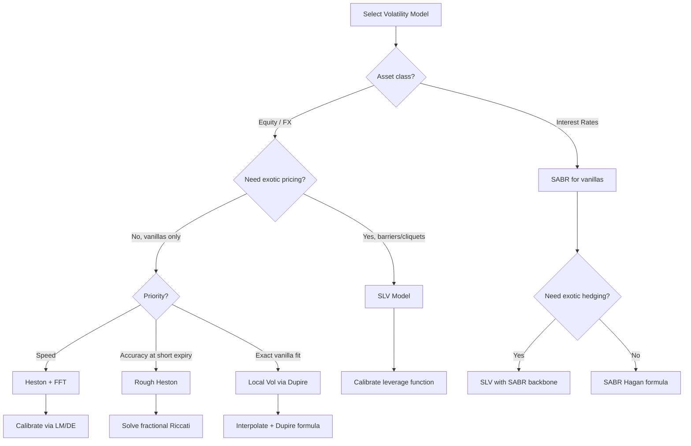
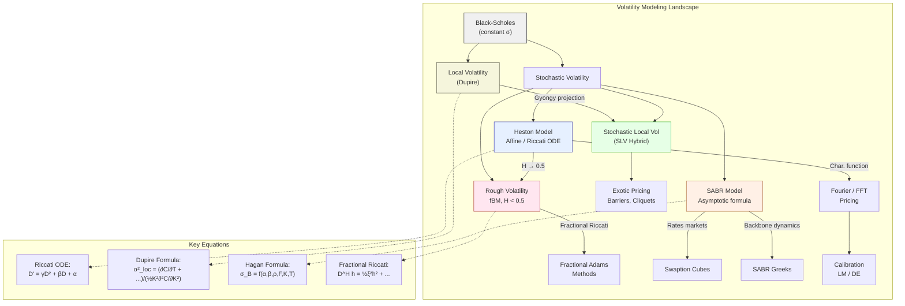

# Module 19: Stochastic Volatility Models

> **Prerequisites:** Modules 04 (Stochastic Calculus), 08 (Fourier Methods), 18 (Black-Scholes & Greeks)
> **Builds toward:** Modules 23 (Exotic Options), 30 (Model Risk & Validation)

---

## Table of Contents

1. [Motivation: Why Stochastic Volatility?](#1-motivation-why-stochastic-volatility)
2. [The Heston Model](#2-the-heston-model)
3. [The SABR Model](#3-the-sabr-model)
4. [Rough Volatility](#4-rough-volatility)
5. [Local Volatility: Dupire's Framework](#5-local-volatility-dupires-framework)
6. [Stochastic Local Volatility (SLV) Hybrid](#6-stochastic-local-volatility-slv-hybrid)
7. [Model Comparison](#7-model-comparison)
8. [Python Implementation](#8-python-implementation)
9. [C++ Implementation](#9-c-implementation)
10. [Exercises](#10-exercises)
11. [Summary & Concept Map](#11-summary--concept-map)

---

## 1. Motivation: Why Stochastic Volatility?

The Black-Scholes model assumes constant volatility $\sigma$, yet empirical markets exhibit:

- **Volatility smiles/skews:** implied volatility varies with strike $K$ and expiry $T$.
- **Volatility clustering:** large moves beget large moves (GARCH effects).
- **Leverage effect:** equity returns and volatility are negatively correlated.
- **Fat tails:** return distributions have excess kurtosis beyond the log-normal model.

A stochastic volatility (SV) model replaces the constant $\sigma$ with a random process $v_t$ (or $\sigma_t$), governed by its own SDE. The correlation between the asset and volatility Brownian motions generates skew; the vol-of-vol parameter generates smile curvature.

### Historical Context

Hull & White (1987) introduced the first continuous-time SV model. Heston (1993) achieved a breakthrough by finding a semi-analytical solution via characteristic functions. Hagan et al. (2002) developed SABR for interest rate markets. Gatheral, Jaisson, and Rosenbaum (2018) initiated the rough volatility revolution.

---

## 2. The Heston Model

### 2.1 SDE Specification

Under the risk-neutral measure $\mathbb{Q}$, the Heston model specifies:

$$
dS_t = (r - q)\,S_t\,dt + \sqrt{v_t}\,S_t\,dW_t^S
$$

$$
dv_t = \kappa(\theta - v_t)\,dt + \xi\sqrt{v_t}\,dW_t^v
$$

$$
dW_t^S \, dW_t^v = \rho\,dt
$$

where:

| Parameter | Symbol | Interpretation | Typical Range |
|-----------|--------|---------------|---------------|
| Mean-reversion speed | $\kappa$ | Rate at which $v_t \to \theta$ | $0.5$--$5.0$ |
| Long-run variance | $\theta$ | Steady-state variance level | $0.01$--$0.10$ |
| Vol-of-vol | $\xi$ | Volatility of the variance process | $0.1$--$1.0$ |
| Correlation | $\rho$ | Leverage effect parameter | $-0.9$--$0.0$ |
| Initial variance | $v_0$ | Spot variance at $t=0$ | $0.01$--$0.10$ |

The **Feller condition** $2\kappa\theta > \xi^2$ ensures $v_t > 0$ almost surely. When violated, the variance process can touch zero but is instantaneously reflected.

### 2.2 Log-Price Transform

Define $x_t = \ln S_t$. By Ito's lemma:

$$
dx_t = \left(r - q - \tfrac{1}{2}v_t\right)dt + \sqrt{v_t}\,dW_t^S
$$

We seek the characteristic function of $x_T$ given $(x_t, v_t)$:

$$
\phi(u; t, T) = \mathbb{E}^{\mathbb{Q}}\!\left[e^{iu\,x_T} \,\Big|\, x_t, v_t\right]
$$

### 2.3 Derivation of the Characteristic Function via Riccati ODE

**Step 1: Affine Ansatz.** Due to the affine structure of the Heston SDEs, we conjecture:

$$
\phi(u; t, T) = \exp\!\Big(C(\tau, u) + D(\tau, u)\,v_t + iu\,x_t\Big)
$$

where $\tau = T - t$ is time-to-expiry, with boundary conditions $C(0, u) = 0$ and $D(0, u) = 0$.

**Step 2: Feynman-Kac PDE.** Since $\phi$ satisfies the Kolmogorov backward equation:

$$
\frac{\partial \phi}{\partial t} + (r-q-\tfrac{1}{2}v)\frac{\partial \phi}{\partial x} + \tfrac{1}{2}v\frac{\partial^2 \phi}{\partial x^2} + \kappa(\theta - v)\frac{\partial \phi}{\partial v} + \tfrac{1}{2}\xi^2 v\frac{\partial^2 \phi}{\partial v^2} + \rho\xi v\frac{\partial^2 \phi}{\partial x \partial v} = 0
$$

**Step 3: Compute partial derivatives of the ansatz.** From $\phi = e^{C + Dv + iux}$:

$$
\frac{\partial \phi}{\partial t} = \left(-\frac{\partial C}{\partial \tau} - \frac{\partial D}{\partial \tau}\,v\right)\phi, \quad \frac{\partial \phi}{\partial x} = iu\,\phi, \quad \frac{\partial^2 \phi}{\partial x^2} = -u^2\,\phi
$$

$$
\frac{\partial \phi}{\partial v} = D\,\phi, \quad \frac{\partial^2 \phi}{\partial v^2} = D^2\,\phi, \quad \frac{\partial^2 \phi}{\partial x\,\partial v} = iu\,D\,\phi
$$

**Step 4: Substitute into PDE and divide by $\phi$.** After cancellation:

$$
-\frac{\partial C}{\partial \tau} - \frac{\partial D}{\partial \tau}\,v + (r-q)\,iu - \tfrac{1}{2}v\,iu - \tfrac{1}{2}v\,u^2 + \kappa\theta\,D - \kappa v\,D + \tfrac{1}{2}\xi^2 v\,D^2 + \rho\xi\,v\,iu\,D = 0
$$

**Step 5: Separate terms.** Group by powers of $v$:

- **Terms independent of $v$:**

$$
-\frac{\partial C}{\partial \tau} + (r-q)\,iu + \kappa\theta\,D = 0
$$

- **Terms linear in $v$:**

$$
-\frac{\partial D}{\partial \tau} - \tfrac{1}{2}iu - \tfrac{1}{2}u^2 - \kappa\,D + \tfrac{1}{2}\xi^2 D^2 + \rho\xi\,iu\,D = 0
$$

**Step 6: The Riccati ODE system.** We thus obtain:

$$
\frac{\partial D}{\partial \tau} = \tfrac{1}{2}\xi^2 D^2 + (\rho\xi\,iu - \kappa)\,D - \tfrac{1}{2}(iu + u^2)
$$

$$
\frac{\partial C}{\partial \tau} = (r-q)\,iu + \kappa\theta\,D
$$

The first equation is a **Riccati ODE** in $D(\tau)$. Define:

$$
\alpha = -\tfrac{1}{2}(iu + u^2), \quad \beta = \rho\xi\,iu - \kappa, \quad \gamma = \tfrac{1}{2}\xi^2
$$

so that $D' = \gamma D^2 + \beta D + \alpha$ with $D(0)=0$.

**Step 7: Solve the Riccati ODE.** The discriminant is:

$$
d = \sqrt{\beta^2 - 4\alpha\gamma} = \sqrt{(\rho\xi\,iu - \kappa)^2 + \xi^2(iu + u^2)}
$$

The standard Riccati solution yields:

$$
D(\tau, u) = \frac{\beta + d}{\xi^2}\cdot\frac{1 - e^{d\tau}}{1 - g\,e^{d\tau}}
$$

where:

$$
g = \frac{\beta + d}{\beta - d}
$$

> **Remark (Numerical Stability -- "Little Heston Trap"):** The formula above corresponds to "Formulation 1" of Albrecher et al. (2007). For numerical stability, the alternative formulation uses:
>
> $$D(\tau, u) = \frac{\beta - d}{\xi^2}\cdot\frac{1 - e^{-d\tau}}{1 - g^{-1}e^{-d\tau}}$$
>
> This avoids exponential blowup when $\text{Re}(d\tau) > 0$.

**Step 8: Integrate for $C(\tau)$.**

$$
C(\tau, u) = (r-q)\,iu\,\tau + \frac{\kappa\theta}{\xi^2}\Big[(\beta + d)\,\tau - 2\ln\!\left(\frac{1 - g\,e^{d\tau}}{1 - g}\right)\Big]
$$

The **full characteristic function** is therefore:

$$
\boxed{\phi(u;\tau) = \exp\!\Big(iu\left[\ln S_0 + (r-q)\tau\right] + C(\tau,u) + D(\tau,u)\,v_0\Big)}
$$

where $C$ incorporates the drift and the $\kappa\theta$ contribution, and $D$ captures the variance dependence.

### 2.4 Semi-Analytical Pricing via Fourier Inversion

The European call price under Heston is:

$$
C(S_0, K, T) = S_0 e^{-qT} P_1 - K e^{-rT} P_2
$$

where the exercise probabilities are:

$$
P_j = \frac{1}{2} + \frac{1}{\pi}\int_0^{\infty} \text{Re}\!\left[\frac{e^{-iu\ln K}\,\phi_j(u)}{iu}\right]du, \quad j=1,2
$$

Here $\phi_1$ uses adjusted parameters (change of numeraire to the stock measure) and $\phi_2 = \phi$ under the risk-neutral measure. In practice, the **Carr-Madan FFT approach** (Module 08) is preferred: define the log-strike $k=\ln K$, apply a dampening factor $e^{\alpha k}$, and evaluate via FFT over a grid of $N=2^{12}$ points.

### 2.5 Calibration to the Volatility Surface

Given market implied volatilities $\hat{\sigma}_{ij}$ for strikes $K_i$ and expiries $T_j$, we minimize:

$$
\min_{\Theta}\;\sum_{i,j} w_{ij}\Big(\sigma^{\text{Heston}}(K_i, T_j; \Theta) - \hat{\sigma}_{ij}\Big)^2
$$

where $\Theta = (\kappa, \theta, \xi, \rho, v_0)$.

**Levenberg-Marquardt (LM):** A gradient-based method combining Gauss-Newton and steepest descent. The update rule is:

$$
\Delta\Theta = -(J^T J + \lambda\,\text{diag}(J^T J))^{-1} J^T \mathbf{r}
$$

where $J$ is the Jacobian of residuals $\mathbf{r}$ and $\lambda$ is the damping parameter.

**Differential Evolution (DE):** A global optimizer that maintains a population of candidate solutions, performing mutation, crossover, and selection. DE is slower but avoids local minima -- critical since the Heston loss surface has multiple basins.

**Practical calibration strategy:**

1. Run DE with a small population (50--100) for 500 generations to find the global basin.
2. Refine with LM starting from the DE solution for fast local convergence.
3. Impose constraints: $\kappa > 0$, $\theta > 0$, $\xi > 0$, $-1 < \rho < 0$, $v_0 > 0$.

---

## 3. The SABR Model

### 3.1 SDE Specification

The SABR (Stochastic Alpha Beta Rho) model, introduced by Hagan et al. (2002), specifies under the forward measure:

$$
dF_t = \sigma_t F_t^{\beta}\,dW_t^F
$$

$$
d\sigma_t = \alpha\,\sigma_t\,dW_t^{\sigma}
$$

$$
dW_t^F \,dW_t^{\sigma} = \rho\,dt
$$

where:

| Parameter | Symbol | Interpretation |
|-----------|--------|---------------|
| Forward price | $F_t$ | Underlying forward |
| Stochastic vol | $\sigma_t$ | Instantaneous volatility |
| CEV exponent | $\beta$ | Backbone parameter, $\beta \in [0,1]$ |
| Vol-of-vol | $\alpha$ | Volatility of $\sigma_t$ |
| Correlation | $\rho$ | Skew parameter |

When $\beta=1$, the forward follows a log-normal process; when $\beta=0$, it is normal.

### 3.2 Hagan's Asymptotic Implied Volatility Formula

For a European option with strike $K$, forward $F$, and expiry $T$, Hagan et al. derived the following asymptotic approximation for Black implied volatility:

$$
\sigma_B(K, F) = \frac{\alpha}{(FK)^{(1-\beta)/2}\left[1 + \frac{(1-\beta)^2}{24}\ln^2\!\frac{F}{K} + \frac{(1-\beta)^4}{1920}\ln^4\!\frac{F}{K}\right]} \cdot \frac{z}{x(z)} \cdot \left[1 + \epsilon\,T\right]
$$

**Term-by-term explanation:**

**Prefactor** $\frac{\alpha}{(FK)^{(1-\beta)/2}[\cdots]}$: Converts the SABR vol $\alpha$ into a Black vol. The denominator adjusts for the CEV backbone, accounting for the geometric mean of forward and strike raised to $(1-\beta)/2$. The logarithmic corrections handle the at-the-money (ATM) to out-of-the-money (OTM) transition.

**The $z/x(z)$ ratio:**

$$
z = \frac{\alpha}{\sigma_0}\,(FK)^{(1-\beta)/2}\ln\frac{F}{K}
$$

$$
x(z) = \ln\!\left(\frac{\sqrt{1 - 2\rho z + z^2} + z - \rho}{1 - \rho}\right)
$$

This ratio captures the smile curvature. At-the-money ($F=K$), $z\to 0$ and $z/x(z)\to 1$. The function $x(z)$ encodes the correlation-dependent distortion.

**Time correction** $\epsilon\,T$:

$$
\epsilon = \frac{(1-\beta)^2}{24}\frac{\sigma_0^2}{(FK)^{1-\beta}} + \frac{1}{4}\frac{\rho\beta\alpha\sigma_0}{(FK)^{(1-\beta)/2}} + \frac{2 - 3\rho^2}{24}\alpha^2
$$

The three terms represent: (i) the CEV contribution to convexity, (ii) the correlation-backbone interaction, and (iii) the pure vol-of-vol smile contribution.

### 3.3 Backbone and Smile Dynamics

The **backbone** describes how ATM implied vol moves with the forward level:

$$
\sigma_{\text{ATM}} \approx \frac{\sigma_0}{F^{1-\beta}}
$$

- $\beta = 1$ (log-normal): ATM vol is independent of $F$ -- "sticky delta."
- $\beta = 0$ (normal): ATM vol scales as $\sigma_0/F$ -- "sticky strike" with strong skew.
- $\beta \in (0,1)$: intermediate behavior.

The **smile dynamics** are controlled by $\alpha$ and $\rho$:

- $\alpha$ controls overall smile curvature (wings).
- $\rho < 0$ generates negative skew (equity-like); $\rho > 0$ generates positive skew.

### 3.4 Applications: Swaptions and Caps

In interest rate markets, SABR is the industry standard for:

- **Swaption vol cubes:** Each expiry-tenor pair $(T_{\text{exp}}, T_{\text{swap}})$ has its own SABR parameters $(\sigma_0, \alpha, \beta, \rho)$. Typically $\beta$ is fixed (e.g., $\beta = 0.5$) across the cube.
- **Cap/floor smiles:** SABR is calibrated per caplet expiry to match the cap vol smile.
- **Risk management:** Greeks are computed via bump-and-revalue on the SABR parameters, yielding "SABR Greeks" (vega, volga, vanna in the SABR parametrization).

---

## 4. Rough Volatility

### 4.1 Fractional Brownian Motion

A **fractional Brownian motion (fBM)** $B^H_t$ with Hurst parameter $H \in (0,1)$ is a centered Gaussian process with covariance:

$$
\mathbb{E}[B^H_t B^H_s] = \frac{1}{2}\left(|t|^{2H} + |s|^{2H} - |t-s|^{2H}\right)
$$

Key properties:

- $H = 0.5$: standard Brownian motion (independent increments).
- $H < 0.5$: **rough** paths -- increments are negatively correlated (anti-persistent).
- $H > 0.5$: smooth paths -- increments are positively correlated (persistent).

The **roughness** manifests in the regularity of sample paths: the Holder exponent is $H - \epsilon$ for any $\epsilon > 0$.

### 4.2 Empirical Evidence

Gatheral, Jaisson, and Rosenbaum (2018) discovered that log-realized volatility increments exhibit scaling:

$$
\mathbb{E}\!\left[|\ln \text{RV}_{t+\Delta} - \ln \text{RV}_t|^q\right] \propto \Delta^{qH}
$$

with $H \approx 0.1$ across equity indices, individual stocks, and even interest rates. This is far from the $H=0.5$ of standard diffusions and contradicts classical SV models.

Further empirical signatures:

- The ATM implied vol skew decays as $T^{H-1/2} \approx T^{-0.4}$ for short expiries, matching rough models but not Heston (which gives $T^0$ scaling).
- The term structure of VIX implied vol is well captured with $H \approx 0.1$.

### 4.3 The Rough Heston Model

The **rough Heston model** (El Euch and Rosenbaum, 2019) replaces the Heston variance SDE with a Volterra integral equation:

$$
v_t = v_0 + \frac{1}{\Gamma(H + \tfrac{1}{2})}\int_0^t (t-s)^{H-1/2}\,\kappa(\theta - v_s)\,ds + \frac{\xi}{\Gamma(H + \tfrac{1}{2})}\int_0^t (t-s)^{H-1/2}\sqrt{v_s}\,dW_s^v
$$

The kernel $(t-s)^{H-1/2}$ with $H < 0.5$ imparts memory: the variance "remembers" its history with a power-law kernel rather than the exponential memory of mean-reversion.

### 4.4 Fractional Riccati Equation

The characteristic function of the rough Heston model satisfies a **fractional Riccati equation**:

$$
D^H h(\tau) = \tfrac{1}{2}\xi^2 h(\tau)^2 + (\rho\xi\,iu - \kappa)\,h(\tau) - \tfrac{1}{2}(iu + u^2)
$$

where $D^H$ denotes the Caputo fractional derivative of order $H + \frac{1}{2}$. When $H=0.5$, this reduces to the standard Riccati ODE. For $H<0.5$, numerical solution requires fractional Adams methods or series expansions.

The characteristic function takes the form:

$$
\phi(u;\tau) = \exp\!\left(iu\,x_0 + v_0\,I^{H+1/2}h(\tau) + \kappa\theta\int_0^{\tau} h(s)\,ds\right)
$$

where $I^{H+1/2}$ is the Riemann-Liouville fractional integral.

---

## 5. Local Volatility: Dupire's Framework

### 5.1 The Local Volatility Model

The **local volatility** model specifies:

$$
dS_t = (r - q)\,S_t\,dt + \sigma_{\text{loc}}(S_t, t)\,S_t\,dW_t
$$

where $\sigma_{\text{loc}}(S, t)$ is a deterministic function of spot and time. This is the unique diffusion model consistent with a given set of European option prices.

### 5.2 Derivation of Dupire's Formula from Fokker-Planck

Let $p(S, T; S_0, 0)$ be the risk-neutral transition density. The **Fokker-Planck** (forward Kolmogorov) equation is:

$$
\frac{\partial p}{\partial T} = -\frac{\partial}{\partial S}\Big[(r-q)S\,p\Big] + \frac{1}{2}\frac{\partial^2}{\partial S^2}\Big[\sigma_{\text{loc}}^2(S,T)\,S^2\,p\Big]
$$

The European call price is:

$$
C(K, T) = e^{-rT}\int_K^{\infty}(S - K)\,p(S, T)\,dS
$$

**Step 1: Differentiate with respect to $T$:**

$$
\frac{\partial C}{\partial T} = -rC + e^{-rT}\int_K^{\infty}(S-K)\frac{\partial p}{\partial T}\,dS
$$

**Step 2: Substitute Fokker-Planck and integrate by parts twice.** After the first integration by parts on the drift term:

$$
\int_K^{\infty}(S-K)\frac{\partial}{\partial S}[(r-q)Sp]\,dS = -(r-q)\int_K^{\infty}Sp\,dS + (r-q)K\int_K^{\infty}p\,dS
$$

This simplifies using the definitions of $\frac{\partial C}{\partial K}$ and $C$ itself.

After the second integration by parts on the diffusion term, using $\frac{\partial^2}{\partial S^2}[\sigma_{\text{loc}}^2 S^2 p]$:

$$
\int_K^{\infty}(S-K)\frac{\partial^2}{\partial S^2}[\sigma_{\text{loc}}^2 S^2 p]\,dS = \sigma_{\text{loc}}^2(K,T)\,K^2\,p(K,T)
$$

**Step 3: Recognize the density.** Since:

$$
p(K, T) = e^{rT}\frac{\partial^2 C}{\partial K^2}
$$

(the Breeden-Litzenberger result), we assemble all terms to obtain:

$$
\frac{\partial C}{\partial T} = -qKe^{-rT}\frac{\partial C}{\partial K}\cdot e^{rT}\cdot e^{-rT} + \frac{1}{2}\sigma_{\text{loc}}^2(K,T)\,K^2\,e^{-rT}\cdot e^{rT}\frac{\partial^2 C}{\partial K^2}
$$

After simplification, **Dupire's formula** emerges:

$$
\boxed{\sigma_{\text{loc}}^2(K, T) = \frac{\dfrac{\partial C}{\partial T} + (r-q)K\dfrac{\partial C}{\partial K} + qC}{\dfrac{1}{2}K^2\dfrac{\partial^2 C}{\partial K^2}}}
$$

### 5.3 The Dupire PDE

Equivalently, the call price satisfies the **Dupire PDE** (a forward PDE in $(K, T)$):

$$
\frac{\partial C}{\partial T} = \frac{1}{2}\sigma_{\text{loc}}^2(K,T)\,K^2\frac{\partial^2 C}{\partial K^2} - (r-q)K\frac{\partial C}{\partial K} - qC
$$

with initial condition $C(K, 0) = (S_0 - K)^+$.

### 5.4 Local Volatility Surface in Practice

To construct $\sigma_{\text{loc}}(K, T)$:

1. Interpolate market call prices $C(K_i, T_j)$ onto a fine grid using SVI or cubic splines.
2. Compute $\partial C/\partial T$, $\partial C/\partial K$, $\partial^2 C/\partial K^2$ numerically.
3. Apply Dupire's formula pointwise.
4. Regularize to avoid negative local variances (calendar spread arbitrage) and infinite densities.

**Limitations:** The local vol surface is a static snapshot. It does not correctly capture the dynamics of the smile -- the forward smile under local vol flattens unrealistically, leading to poor exotic hedging.

---

## 6. Stochastic Local Volatility (SLV) Hybrid

### 6.1 Model Specification

The **SLV model** combines both local and stochastic volatility:

$$
dS_t = (r-q)S_t\,dt + L(S_t, t)\sqrt{v_t}\,S_t\,dW_t^S
$$

$$
dv_t = \kappa(\theta - v_t)\,dt + \xi\sqrt{v_t}\,dW_t^v
$$

where $L(S, t)$ is the **leverage function** that ensures exact calibration to vanilla prices while $v_t$ provides realistic smile dynamics.

### 6.2 The Leverage Function

The leverage function satisfies the **Gyongy condition**: the SLV model must reproduce the same marginal distributions as the local vol model at each time $t$. This yields:

$$
L^2(S, t) = \frac{\sigma_{\text{loc}}^2(S, t)}{\mathbb{E}[v_t \,|\, S_t = S]}
$$

The conditional expectation $\mathbb{E}[v_t | S_t = S]$ is computed from a forward Kolmogorov equation or estimated via Monte Carlo (particle method):

1. Simulate $N$ paths of $(S_t, v_t)$ with an initial guess $L \equiv 1$.
2. At each time step, estimate $\mathbb{E}[v_t | S_t \approx S]$ using kernel regression.
3. Update $L(S, t)$ and repeat.

### 6.3 Mixing Parameter

In practice, a **mixing parameter** $\eta \in [0,1]$ controls the balance:

$$
L(S,t;\eta) = \left(\frac{\sigma_{\text{loc}}(S,t)}{\bar{\sigma}}\right)^{1-\eta}
$$

- $\eta = 0$: pure local vol.
- $\eta = 1$: pure stochastic vol.
- $\eta \in (0,1)$: hybrid, typically $\eta \approx 0.5$--$0.8$ in practice.

### 6.4 Why SLV?

| Property | Local Vol | Stochastic Vol | SLV |
|----------|-----------|----------------|-----|
| Vanilla calibration | Exact | Approximate | Exact |
| Smile dynamics | Poor | Good | Good |
| Barrier pricing | Biased | Less biased | Best |
| Forward smile | Too flat | Realistic | Realistic |
| Complexity | Low | Medium | High |

---

## 7. Model Comparison

### 7.1 Comprehensive Comparison Table

| Criterion | Heston | SABR | Rough Vol | Local Vol | SLV |
|-----------|--------|------|-----------|-----------|-----|
| **Vanilla fit** | Good (5 params) | Excellent (per-expiry) | Excellent | Exact | Exact |
| **Skew dynamics** | Fair | Good | Excellent | Poor | Good |
| **Short-expiry smile** | Under-fits | Asymptotic issues | Excellent | Exact | Good |
| **Parameter stability** | Moderate | Good | Good | N/A | Moderate |
| **Hedging (delta)** | Good | Good | Unknown* | Poor | Good |
| **Hedging (vega)** | Good | Excellent (rates) | Developing | None | Good |
| **Exotic pricing** | Fair | Not suitable | Developing | Biased | Best |
| **Computational cost** | Low (FFT) | Very low (closed-form) | High | Medium (PDE) | Very high |
| **Mean-reversion** | Yes ($\kappa$) | No | Yes (power-law) | N/A | Yes |
| **Analytical tractability** | Semi-analytical | Asymptotic | Fractional Riccati | Dupire PDE | None |
| **Feller condition** | Required ideally | N/A | Generalized | N/A | N/A |

*Rough volatility hedging is an active research area as of 2025.

### 7.2 Decision Flowchart



---

## 8. Python Implementation

### 8.1 Heston Characteristic Function

```python
"""
Heston Model: Characteristic Function and FFT-Based European Option Pricing.

This module implements the semi-analytical Heston (1993) characteristic function
using the numerically stable "Formulation 2" (Albrecher et al., 2007) and
prices European calls via the Carr-Madan (1999) FFT method.
"""

import numpy as np
from scipy.fft import fft, ifft
from scipy.optimize import differential_evolution, least_squares
from typing import NamedTuple, Callable


class HestonParams(NamedTuple):
    """Heston model parameters."""
    kappa: float   # Mean-reversion speed
    theta: float   # Long-run variance
    xi: float      # Vol-of-vol
    rho: float     # Correlation
    v0: float      # Initial variance


def heston_char_func(
    u: np.ndarray,
    tau: float,
    params: HestonParams,
    r: float,
    q: float,
    S0: float,
) -> np.ndarray:
    """
    Compute the Heston characteristic function phi(u; tau).

    Uses the numerically stable formulation (Albrecher et al., 2007)
    to avoid the "little Heston trap."

    Parameters
    ----------
    u : np.ndarray
        Fourier frequency variable (can be complex-valued).
    tau : float
        Time to expiry T - t.
    params : HestonParams
        Heston model parameters (kappa, theta, xi, rho, v0).
    r : float
        Risk-free rate.
    q : float
        Continuous dividend yield.
    S0 : float
        Current spot price.

    Returns
    -------
    np.ndarray
        Characteristic function values phi(u).
    """
    kappa, theta, xi, rho, v0 = params

    # Auxiliary variables
    alpha = -0.5 * (u * u + 1j * u)
    beta = kappa - rho * xi * 1j * u
    gamma = 0.5 * xi ** 2

    # Discriminant (complex square root)
    d = np.sqrt(beta ** 2 - 4.0 * alpha * gamma)

    # Numerically stable formulation: use exp(-d*tau)
    r_minus = (beta - d) / (2.0 * gamma)
    r_plus = (beta + d) / (2.0 * gamma)
    g = r_minus / r_plus

    exp_d_tau = np.exp(-d * tau)

    # D coefficient
    D = r_minus * (1.0 - exp_d_tau) / (1.0 - g * exp_d_tau)

    # C coefficient
    C = (
        kappa * theta / (xi ** 2)
        * ((beta - d) * tau - 2.0 * np.log((1.0 - g * exp_d_tau) / (1.0 - g)))
    )

    # Log-spot drift contribution
    log_spot_drift = 1j * u * (np.log(S0) + (r - q) * tau)

    return np.exp(log_spot_drift + C + D * v0)


def heston_fft_call_prices(
    params: HestonParams,
    S0: float,
    r: float,
    q: float,
    tau: float,
    strikes: np.ndarray,
    N: int = 4096,
    eta: float = 0.25,
    alpha_damp: float = 1.5,
) -> np.ndarray:
    """
    Price European calls via the Carr-Madan FFT method.

    Parameters
    ----------
    params : HestonParams
        Heston model parameters.
    S0 : float
        Current spot price.
    r : float
        Risk-free rate.
    q : float
        Continuous dividend yield.
    tau : float
        Time to expiry.
    strikes : np.ndarray
        Array of strike prices.
    N : int
        Number of FFT grid points (power of 2).
    eta : float
        Grid spacing in frequency domain.
    alpha_damp : float
        Dampening factor for Carr-Madan transform.

    Returns
    -------
    np.ndarray
        European call prices for each strike.
    """
    # FFT grid setup
    lam = 2.0 * np.pi / (N * eta)  # Log-strike spacing
    b = N * lam / 2.0              # Log-strike range: [-b, b]

    # Frequency grid: v_j = eta * j, j = 0, ..., N-1
    j_vals = np.arange(N)
    v_j = eta * j_vals

    # Log-strike grid: k_m = -b + lam * m
    k_grid = -b + lam * j_vals

    # Characteristic function evaluated at v - (alpha+1)i
    u_vals = v_j - (alpha_damp + 1.0) * 1j

    phi_vals = heston_char_func(u_vals, tau, params, r, q, S0)

    # Carr-Madan integrand: modified call transform
    denom = (
        alpha_damp ** 2
        + alpha_damp
        - v_j ** 2
        + 1j * (2.0 * alpha_damp + 1.0) * v_j
    )
    psi_vals = np.exp(-r * tau) * phi_vals / denom

    # Simpson's rule weights
    simpson = (3.0 + (-1.0) ** (j_vals + 1)) / 3.0
    simpson[0] = 1.0 / 3.0

    # FFT input
    x = np.exp(1j * v_j * b) * psi_vals * eta * simpson

    # Execute FFT
    fft_result = fft(x)

    # Extract call prices
    call_prices = np.exp(-alpha_damp * k_grid) / np.pi * np.real(fft_result)

    # Interpolate to desired strikes
    log_strikes = np.log(strikes)
    prices = np.interp(log_strikes, k_grid, call_prices)

    return np.maximum(prices, 0.0)


def implied_vol_from_price(
    price: float,
    S0: float,
    K: float,
    r: float,
    q: float,
    tau: float,
    is_call: bool = True,
) -> float:
    """
    Extract Black-Scholes implied volatility from an option price
    using Brent's method.
    """
    from scipy.optimize import brentq
    from scipy.stats import norm

    def bs_price(sigma):
        d1 = (np.log(S0 / K) + (r - q + 0.5 * sigma**2) * tau) / (sigma * np.sqrt(tau))
        d2 = d1 - sigma * np.sqrt(tau)
        if is_call:
            return S0 * np.exp(-q * tau) * norm.cdf(d1) - K * np.exp(-r * tau) * norm.cdf(d2)
        else:
            return K * np.exp(-r * tau) * norm.cdf(-d2) - S0 * np.exp(-q * tau) * norm.cdf(-d1)

    try:
        return brentq(lambda s: bs_price(s) - price, 1e-6, 5.0, xtol=1e-10)
    except ValueError:
        return np.nan
```

### 8.2 Calibration to Market Data

```python
def calibrate_heston(
    market_strikes: np.ndarray,
    market_expiries: np.ndarray,
    market_ivols: np.ndarray,
    S0: float,
    r: float,
    q: float,
    method: str = "hybrid",
) -> HestonParams:
    """
    Calibrate Heston model to market implied volatilities.

    Parameters
    ----------
    market_strikes : np.ndarray
        Shape (n_options,) -- strike prices.
    market_expiries : np.ndarray
        Shape (n_options,) -- times to expiry.
    market_ivols : np.ndarray
        Shape (n_options,) -- market implied volatilities.
    S0 : float
        Spot price.
    r : float
        Risk-free rate.
    q : float
        Dividend yield.
    method : str
        "lm" for Levenberg-Marquardt, "de" for differential evolution,
        "hybrid" for DE followed by LM refinement.

    Returns
    -------
    HestonParams
        Calibrated parameters.
    """
    # Unique expiries for batch FFT pricing
    unique_expiries = np.unique(market_expiries)

    def residuals(x: np.ndarray) -> np.ndarray:
        """Compute implied vol residuals for all market quotes."""
        params = HestonParams(
            kappa=x[0], theta=x[1], xi=x[2], rho=x[3], v0=x[4]
        )

        model_ivols = np.empty_like(market_ivols)

        for T in unique_expiries:
            mask = market_expiries == T
            K_slice = market_strikes[mask]
            prices = heston_fft_call_prices(params, S0, r, q, T, K_slice)

            for i_local, i_global in enumerate(np.where(mask)[0]):
                model_ivols[i_global] = implied_vol_from_price(
                    prices[i_local], S0, K_slice[i_local], r, q, T
                )

        return model_ivols - market_ivols

    # Parameter bounds: [kappa, theta, xi, rho, v0]
    bounds_lower = [0.01, 0.001, 0.01, -0.999, 0.001]
    bounds_upper = [10.0, 1.0,   3.0,  -0.001, 1.0]
    bounds_de = list(zip(bounds_lower, bounds_upper))

    if method in ("de", "hybrid"):
        # Differential Evolution for global search
        result_de = differential_evolution(
            lambda x: np.sum(residuals(x) ** 2),
            bounds=bounds_de,
            seed=42,
            maxiter=300,
            popsize=30,
            tol=1e-8,
            mutation=(0.5, 1.5),
            recombination=0.9,
        )
        x0 = result_de.x
        print(f"DE result: cost={result_de.fun:.6e}, params={x0}")

        if method == "de":
            return HestonParams(*x0)

    else:
        # Initial guess for LM
        x0 = np.array([2.0, 0.04, 0.5, -0.7, 0.04])

    # Levenberg-Marquardt refinement
    result_lm = least_squares(
        residuals,
        x0,
        bounds=(bounds_lower, bounds_upper),
        method="trf",
        xtol=1e-12,
        ftol=1e-12,
        max_nfev=500,
    )

    print(f"LM result: cost={result_lm.cost:.6e}, params={result_lm.x}")
    return HestonParams(*result_lm.x)


# ── Example usage ──
if __name__ == "__main__":
    # Synthetic market data
    S0, r, q = 100.0, 0.02, 0.01
    true_params = HestonParams(kappa=2.0, theta=0.04, xi=0.5, rho=-0.7, v0=0.04)

    strikes = np.array([80, 90, 95, 100, 105, 110, 120], dtype=float)
    expiries = np.array([0.25, 0.5, 1.0])

    # Generate "market" prices
    all_strikes, all_expiries, all_ivols = [], [], []
    for T in expiries:
        prices = heston_fft_call_prices(true_params, S0, r, q, T, strikes)
        for i, K in enumerate(strikes):
            iv = implied_vol_from_price(prices[i], S0, K, r, q, T)
            if not np.isnan(iv):
                all_strikes.append(K)
                all_expiries.append(T)
                all_ivols.append(iv)

    all_strikes = np.array(all_strikes)
    all_expiries = np.array(all_expiries)
    all_ivols = np.array(all_ivols)

    # Calibrate
    calibrated = calibrate_heston(all_strikes, all_expiries, all_ivols, S0, r, q)
    print(f"\nTrue:       {true_params}")
    print(f"Calibrated: {calibrated}")
```

---

## 9. C++ Implementation

### 9.1 High-Performance Heston Pricer

```cpp
/**
 * @file heston_pricer.hpp
 * @brief High-performance Heston model pricer using FFT.
 *
 * Features:
 * - Numerically stable characteristic function (Albrecher formulation)
 * - Carr-Madan FFT pricing with Simpson's rule quadrature
 * - Cache-friendly memory layout with contiguous allocations
 * - Ready for OpenMP parallelization across expiries
 *
 * Dependencies: <cmath>, <complex>, <vector>, <algorithm>, <numeric>
 * Optional: FFTW3 for production; here we use a simple Cooley-Tukey FFT.
 */

#pragma once

#include <cmath>
#include <complex>
#include <vector>
#include <algorithm>
#include <numeric>
#include <stdexcept>
#include <cassert>

namespace heston {

using Complex = std::complex<double>;
constexpr double PI = 3.14159265358979323846;

// ─── Model Parameters ───────────────────────────────────────────────
struct Params {
    double kappa;  // Mean-reversion speed
    double theta;  // Long-run variance
    double xi;     // Vol-of-vol
    double rho;    // Correlation
    double v0;     // Initial variance

    /**
     * Check Feller condition: 2*kappa*theta > xi^2
     */
    [[nodiscard]] bool feller_satisfied() const noexcept {
        return 2.0 * kappa * theta > xi * xi;
    }
};

// ─── Cooley-Tukey FFT ───────────────────────────────────────────────
/**
 * In-place radix-2 Cooley-Tukey FFT.
 * For production, replace with FFTW3 calls.
 */
inline void fft_inplace(std::vector<Complex>& x) {
    const size_t N = x.size();
    assert((N & (N - 1)) == 0 && "N must be a power of 2");

    // Bit-reversal permutation
    for (size_t i = 1, j = 0; i < N; ++i) {
        size_t bit = N >> 1;
        for (; j & bit; bit >>= 1) {
            j ^= bit;
        }
        j ^= bit;
        if (i < j) std::swap(x[i], x[j]);
    }

    // Butterfly stages
    for (size_t len = 2; len <= N; len <<= 1) {
        const double angle = -2.0 * PI / static_cast<double>(len);
        const Complex wlen(std::cos(angle), std::sin(angle));

        for (size_t i = 0; i < N; i += len) {
            Complex w(1.0, 0.0);
            for (size_t j = 0; j < len / 2; ++j) {
                Complex u = x[i + j];
                Complex v = x[i + j + len / 2] * w;
                x[i + j]           = u + v;
                x[i + j + len / 2] = u - v;
                w *= wlen;
            }
        }
    }
}

// ─── Characteristic Function ────────────────────────────────────────
/**
 * Compute the Heston characteristic function at a single frequency.
 *
 * Uses the numerically stable formulation to avoid
 * exponential blowup (the "little Heston trap").
 *
 * @param u     Fourier frequency (complex-valued)
 * @param tau   Time to expiry
 * @param p     Heston model parameters
 * @param r     Risk-free rate
 * @param q     Dividend yield
 * @param S0    Spot price
 * @return      phi(u; tau)
 */
[[nodiscard]] inline Complex char_func(
    Complex u,
    double tau,
    const Params& p,
    double r,
    double q,
    double S0
) noexcept {
    const Complex i1(0.0, 1.0);

    // Auxiliary coefficients
    Complex alpha = -0.5 * (u * u + i1 * u);
    Complex beta  = p.kappa - p.rho * p.xi * i1 * u;
    double  gamma = 0.5 * p.xi * p.xi;

    // Discriminant
    Complex d = std::sqrt(beta * beta - 4.0 * alpha * gamma);

    // Stable formulation
    Complex r_minus = (beta - d) / (2.0 * gamma);
    Complex r_plus  = (beta + d) / (2.0 * gamma);
    Complex g       = r_minus / r_plus;

    Complex exp_neg_d_tau = std::exp(-d * tau);

    // D coefficient
    Complex D = r_minus * (1.0 - exp_neg_d_tau) / (1.0 - g * exp_neg_d_tau);

    // C coefficient
    Complex C = (p.kappa * p.theta / (p.xi * p.xi))
              * ((beta - d) * tau
                 - 2.0 * std::log((1.0 - g * exp_neg_d_tau) / (1.0 - g)));

    // Log-spot drift
    Complex log_drift = i1 * u * (std::log(S0) + (r - q) * tau);

    return std::exp(log_drift + C + D * p.v0);
}

// ─── Carr-Madan FFT Pricer ──────────────────────────────────────────
/**
 * Price European calls via the Carr-Madan FFT method.
 *
 * @param p          Heston parameters
 * @param S0         Spot price
 * @param r          Risk-free rate
 * @param q          Dividend yield
 * @param tau        Time to expiry
 * @param strikes    Vector of strike prices
 * @param N          FFT grid size (power of 2, default 4096)
 * @param eta        Frequency spacing (default 0.25)
 * @param alpha_damp Dampening parameter (default 1.5)
 * @return           Vector of call prices corresponding to each strike
 */
[[nodiscard]] inline std::vector<double> fft_call_prices(
    const Params& p,
    double S0,
    double r,
    double q,
    double tau,
    const std::vector<double>& strikes,
    size_t N = 4096,
    double eta = 0.25,
    double alpha_damp = 1.5
) {
    if (strikes.empty()) return {};

    const double lambda = 2.0 * PI / (static_cast<double>(N) * eta);
    const double b      = static_cast<double>(N) * lambda / 2.0;

    const Complex i1(0.0, 1.0);
    const double discount = std::exp(-r * tau);

    // Build FFT input
    std::vector<Complex> x(N);

    for (size_t j = 0; j < N; ++j) {
        double v_j = eta * static_cast<double>(j);

        // Evaluate characteristic function at u = v_j - (alpha+1)*i
        Complex u_val = v_j - (alpha_damp + 1.0) * i1;
        Complex phi   = char_func(u_val, tau, p, r, q, S0);

        // Carr-Madan integrand
        Complex denom = alpha_damp * alpha_damp + alpha_damp
                      - v_j * v_j
                      + i1 * (2.0 * alpha_damp + 1.0) * v_j;
        Complex psi = discount * phi / denom;

        // Simpson's rule weights
        double simpson;
        if (j == 0) {
            simpson = 1.0 / 3.0;
        } else {
            simpson = (j % 2 == 0) ? 2.0 / 3.0 : 4.0 / 3.0;
        }

        x[j] = std::exp(i1 * v_j * b) * psi * eta * simpson;
    }

    // Execute FFT
    fft_inplace(x);

    // Build log-strike grid and extract call prices
    std::vector<double> k_grid(N);
    std::vector<double> call_grid(N);
    for (size_t m = 0; m < N; ++m) {
        k_grid[m]   = -b + lambda * static_cast<double>(m);
        call_grid[m] = std::exp(-alpha_damp * k_grid[m]) / PI * x[m].real();
        if (call_grid[m] < 0.0) call_grid[m] = 0.0;
    }

    // Interpolate to requested strikes (linear interpolation in log-strike)
    std::vector<double> result(strikes.size());

    for (size_t s = 0; s < strikes.size(); ++s) {
        double log_K = std::log(strikes[s]);

        // Binary search for bracketing interval
        auto it = std::lower_bound(k_grid.begin(), k_grid.end(), log_K);

        if (it == k_grid.begin()) {
            result[s] = call_grid[0];
        } else if (it == k_grid.end()) {
            result[s] = call_grid[N - 1];
        } else {
            size_t idx = static_cast<size_t>(it - k_grid.begin());
            double frac = (log_K - k_grid[idx - 1])
                        / (k_grid[idx] - k_grid[idx - 1]);
            result[s] = call_grid[idx - 1]
                       + frac * (call_grid[idx] - call_grid[idx - 1]);
        }

        result[s] = std::max(result[s], 0.0);
    }

    return result;
}

// ─── Volatility Surface Generator ───────────────────────────────────
/**
 * Generate implied volatility surface from Heston model.
 *
 * @param p          Heston parameters
 * @param S0         Spot price
 * @param r          Risk-free rate
 * @param q          Dividend yield
 * @param strikes    Vector of strikes
 * @param expiries   Vector of expiries
 * @return           2D vector [expiry_idx][strike_idx] of implied vols
 */
[[nodiscard]] inline std::vector<std::vector<double>> vol_surface(
    const Params& p,
    double S0,
    double r,
    double q,
    const std::vector<double>& strikes,
    const std::vector<double>& expiries
) {
    std::vector<std::vector<double>> surface(expiries.size());

    // Parallelizable across expiries
    #ifdef _OPENMP
    #pragma omp parallel for schedule(dynamic)
    #endif
    for (size_t t = 0; t < expiries.size(); ++t) {
        auto prices = fft_call_prices(p, S0, r, q, expiries[t], strikes);
        surface[t].resize(strikes.size());

        for (size_t k = 0; k < strikes.size(); ++k) {
            // Newton-Raphson implied vol extraction
            double sigma = 0.2;  // Initial guess
            double K = strikes[k];
            double T = expiries[t];
            double F = S0 * std::exp((r - q) * T);
            double target = prices[k];

            for (int iter = 0; iter < 100; ++iter) {
                double d1 = (std::log(F / K) + 0.5 * sigma * sigma * T)
                          / (sigma * std::sqrt(T));
                double d2 = d1 - sigma * std::sqrt(T);

                // Standard normal CDF and PDF approximation
                auto norm_cdf = [](double x) -> double {
                    return 0.5 * std::erfc(-x * M_SQRT1_2);
                };
                auto norm_pdf = [](double x) -> double {
                    return std::exp(-0.5 * x * x) / std::sqrt(2.0 * PI);
                };

                double bs = std::exp(-r * T)
                          * (F * norm_cdf(d1) - K * norm_cdf(d2));
                double vega = F * std::exp(-r * T)
                            * norm_pdf(d1) * std::sqrt(T);

                if (vega < 1e-15) break;

                double diff = bs - target;
                if (std::abs(diff) < 1e-12) break;

                sigma -= diff / vega;
                sigma = std::max(sigma, 1e-6);
            }

            surface[t][k] = sigma;
        }
    }

    return surface;
}

}  // namespace heston
```

### 9.2 Usage Example

```cpp
#include "heston_pricer.hpp"
#include <iostream>
#include <iomanip>

int main() {
    heston::Params params{
        .kappa = 2.0,
        .theta = 0.04,
        .xi    = 0.5,
        .rho   = -0.7,
        .v0    = 0.04
    };

    double S0 = 100.0, r = 0.02, q = 0.01;

    std::vector<double> strikes = {80, 85, 90, 95, 100, 105, 110, 115, 120};
    std::vector<double> expiries = {0.25, 0.5, 1.0, 2.0};

    std::cout << "Feller condition: "
              << (params.feller_satisfied() ? "SATISFIED" : "VIOLATED")
              << "\n\n";

    auto surface = heston::vol_surface(params, S0, r, q, strikes, expiries);

    // Print implied vol surface
    std::cout << std::fixed << std::setprecision(4);
    std::cout << "Strike\\T  ";
    for (double T : expiries) std::cout << std::setw(8) << T;
    std::cout << "\n" << std::string(50, '-') << "\n";

    for (size_t k = 0; k < strikes.size(); ++k) {
        std::cout << std::setw(8) << strikes[k] << "  ";
        for (size_t t = 0; t < expiries.size(); ++t) {
            std::cout << std::setw(8) << surface[t][k] * 100.0 << "%";
        }
        std::cout << "\n";
    }

    return 0;
}
```

---

## 10. Exercises

### Conceptual

**Exercise 19.1.** Show that if $\rho = 0$ and $\xi = 0$ in the Heston model, the characteristic function reduces to the Black-Scholes formula. *Hint:* When $\xi = 0$, the variance process is deterministic: $v_t = \theta + (v_0 - \theta)e^{-\kappa t}$.

**Exercise 19.2.** Prove that the Heston model generates negative skew when $\rho < 0$. Argue intuitively: if the stock drops ($dW^S < 0$), what happens to variance? How does this affect the left tail of the return distribution?

**Exercise 19.3.** Explain why the local volatility model produces a "too flat" forward smile. Consider the conditional variance $\text{Var}[\sigma_{\text{loc}}(S_T, T) | S_t]$ and compare it to the stochastic vol case.

### Analytical

**Exercise 19.4.** Derive the moment-generating function $M(u) = \mathbb{E}[e^{u\,x_T}]$ of the Heston model from the characteristic function by setting $u \to -iu$. Use this to find expressions for $\mathbb{E}[x_T]$ and $\text{Var}[x_T]$ under the Heston model.

**Exercise 19.5.** Starting from the SABR SDEs with $\beta = 1$ (log-normal SABR), show that the at-the-money implied vol simplifies to:

$$
\sigma_{\text{ATM}} \approx \sigma_0\left[1 + \left(\frac{2 - 3\rho^2}{24}\alpha^2 + \frac{\rho\alpha\sigma_0}{4}\right)T\right]
$$

**Exercise 19.6.** Verify that the Dupire formula for zero rates ($r=q=0$) reduces to:

$$
\sigma_{\text{loc}}^2(K, T) = \frac{2\,\frac{\partial C}{\partial T}}{K^2\,\frac{\partial^2 C}{\partial K^2}}
$$

Apply this to a call price $C(K,T) = S_0 \Phi(d_1) - K\Phi(d_2)$ with constant $\sigma$ and show you recover $\sigma_{\text{loc}} = \sigma$.

### Computational

**Exercise 19.7.** Implement the Heston characteristic function and FFT pricer. Calibrate to the following synthetic vol surface:

| Strike\Expiry | 0.25 | 0.5 | 1.0 |
|---------------|------|-----|-----|
| 90 | 22.5% | 21.8% | 21.0% |
| 95 | 21.0% | 20.5% | 20.0% |
| 100 | 20.0% | 19.8% | 19.5% |
| 105 | 19.5% | 19.5% | 19.3% |
| 110 | 19.8% | 19.7% | 19.5% |

Report the calibrated parameters and the root-mean-square error in implied vol.

**Exercise 19.8.** Implement the SABR implied vol formula and calibrate to a single expiry smile. Plot the implied vol vs. strike for $\beta \in \{0, 0.25, 0.5, 0.75, 1.0\}$, holding $\alpha$, $\rho$ fixed. Discuss how $\beta$ affects the backbone.

**Exercise 19.9.** Compute the local volatility surface via Dupire's formula for a Heston-generated call price surface. Compare $\sigma_{\text{loc}}(K, T)$ to the Heston implied vol surface. Where do they agree? Where do they differ?

**Exercise 19.10 (Challenge).** Implement a rough Heston characteristic function solver using a fractional Adams-Bashforth-Moulton method. Compare the implied vol surface for $H = 0.1$ vs. $H = 0.5$ (classical Heston). Demonstrate the power-law decay of the ATM skew $\partial\sigma_{\text{impl}}/\partial K|_{K=F}$ as a function of $T$.

---

## 11. Summary & Concept Map

### Key Takeaways

1. **Stochastic volatility** models address the fundamental failure of Black-Scholes: non-constant implied volatility. The correlation $\rho$ between asset and vol generates skew; the vol-of-vol $\xi$ generates smile curvature.

2. The **Heston model** is the workhorse of equity/FX derivatives. Its affine structure yields a semi-analytical characteristic function via Riccati ODEs, enabling fast FFT-based pricing and calibration.

3. **SABR** dominates interest rate markets. Hagan's asymptotic formula provides a closed-form map from model parameters to implied vol, making it computationally trivial and ideal for real-time risk.

4. **Rough volatility** ($H \approx 0.1$) is empirically supported and explains the power-law decay of short-term ATM skew. The price to pay is a fractional Riccati equation requiring specialized numerical methods.

5. **Local volatility** (Dupire) provides exact calibration to vanillas but at the cost of unrealistic forward smile dynamics. It is a building block, not a final model.

6. **SLV hybrids** combine exact calibration (from local vol) with realistic dynamics (from stochastic vol), making them the gold standard for exotic pricing.

### Concept Map



---

*Next: [Module 20 — Fixed Income & Term Structure](../asset-pricing/20_fixed_income.md)*
