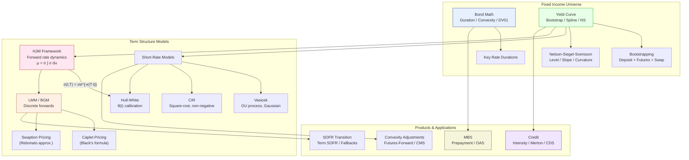
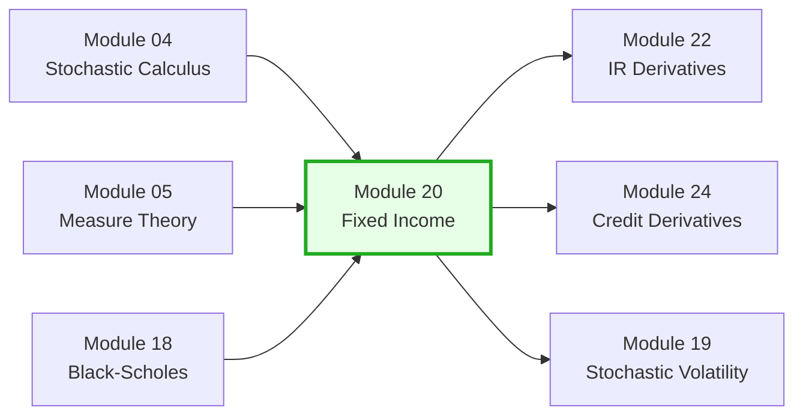

# Module 20: Fixed Income & Term Structure

> **Prerequisites:** Modules 04 (Stochastic Calculus), 05 (Measure Theory & Change of Numeraire), 18 (Black-Scholes & Greeks)
> **Builds toward:** Modules 22 (Interest Rate Derivatives), 24 (Credit Derivatives)

---

## Table of Contents

1. [Bond Mathematics](#1-bond-mathematics)
2. [Yield Curve Construction](#2-yield-curve-construction)
3. [Short-Rate Models](#3-short-rate-models)
4. [The HJM Framework](#4-the-hjm-framework)
5. [LIBOR Market Model (BGM)](#5-libor-market-model-bgm)
6. [LIBOR-to-SOFR Transition](#6-libor-to-sofr-transition)
7. [Convexity Adjustments](#7-convexity-adjustments)
8. [Mortgage-Backed Securities (MBS)](#8-mortgage-backed-securities-mbs)
9. [Credit Models](#9-credit-models)
10. [Python Implementation](#10-python-implementation)
11. [C++ Implementation](#11-c-implementation)
12. [Exercises](#12-exercises)
13. [Summary & Concept Map](#13-summary--concept-map)

---

## 1. Bond Mathematics

### 1.1 Bond Pricing Fundamentals

A fixed-coupon bond with face value $F$, coupon rate $c$, and payment dates $t_1 < t_2 < \cdots < t_n = T$ has price:

$$
P = \sum_{i=1}^{n} c\,F\,\Delta t_i\,Z(0, t_i) + F\,Z(0, T)
$$

where $Z(0, t) = e^{-y(t)\,t}$ is the discount factor and $y(t)$ is the continuously compounded zero rate to maturity $t$. Under semi-annual compounding with yield-to-maturity $y$:

$$
P = \sum_{i=1}^{2n}\frac{c\,F/2}{(1 + y/2)^i} + \frac{F}{(1 + y/2)^{2n}}
$$

### 1.2 Macaulay Duration: Derivation

**Macaulay duration** $D_{\text{Mac}}$ is the weighted-average time to receipt of cash flows:

$$
D_{\text{Mac}} = \frac{1}{P}\sum_{i=1}^{n} t_i\,\text{CF}_i\,Z(0, t_i)
$$

where $\text{CF}_i = cF\Delta t_i$ for coupon dates and $\text{CF}_n = cF\Delta t_n + F$ at maturity.

**Derivation via price sensitivity.** Start with the continuously compounded bond price as a function of yield $y$:

$$
P(y) = \sum_{i=1}^{n} \text{CF}_i\,e^{-y\,t_i}
$$

Differentiate with respect to $y$:

$$
\frac{dP}{dy} = -\sum_{i=1}^{n} t_i\,\text{CF}_i\,e^{-y\,t_i} = -P \cdot D_{\text{Mac}}
$$

Therefore:

$$
\boxed{D_{\text{Mac}} = -\frac{1}{P}\frac{dP}{dy}}
$$

This shows that Macaulay duration measures the (negative) semi-elasticity of price with respect to yield.

### 1.3 Modified Duration

For a bond with semi-annual compounding, the price-yield relationship uses $(1+y/2)^{-i}$ rather than $e^{-yt}$. Modified duration adjusts for the compounding:

$$
D_{\text{mod}} = \frac{D_{\text{Mac}}}{1 + y/m}
$$

where $m$ is the compounding frequency per year. The first-order price approximation is:

$$
\frac{\Delta P}{P} \approx -D_{\text{mod}}\,\Delta y
$$

### 1.4 Effective Duration

For bonds with embedded options (callables, putables, MBS), cash flows depend on rates. **Effective duration** uses numerical differentiation:

$$
D_{\text{eff}} = \frac{P(y - \Delta y) - P(y + \Delta y)}{2\,P(y)\,\Delta y}
$$

where $P(y \pm \Delta y)$ requires a full repricing under the shifted yield curve, typically using an interest rate model.

### 1.5 Convexity: Second-Order Taylor Derivation

The first-order duration approximation is linear. To capture curvature, we expand $P(y + \Delta y)$ in a Taylor series about $y$:

$$
P(y + \Delta y) = P(y) + \frac{dP}{dy}\Delta y + \frac{1}{2}\frac{d^2P}{dy^2}(\Delta y)^2 + O((\Delta y)^3)
$$

Dividing by $P(y)$:

$$
\frac{\Delta P}{P} = -D_{\text{mod}}\,\Delta y + \frac{1}{2}\,\mathcal{C}\,(\Delta y)^2 + \cdots
$$

where **convexity** is defined as:

$$
\boxed{\mathcal{C} = \frac{1}{P}\frac{d^2P}{dy^2} = \frac{1}{P}\sum_{i=1}^{n} t_i^2\,\text{CF}_i\,e^{-y\,t_i}}
$$

(under continuous compounding). Under semi-annual compounding:

$$
\mathcal{C} = \frac{1}{P}\sum_{i=1}^{n} \frac{t_i(t_i + \Delta t)\,\text{CF}_i}{(1 + y/2)^{2t_i + 2}}
$$

**Key insight:** Convexity is always positive for bullet bonds. A bond with higher convexity outperforms in both rally and sell-off scenarios, which is why convexity carries a premium.

### 1.6 DV01 and Key Rate Durations

**DV01** (dollar value of a basis point) measures the price change for a 1 bp yield shift:

$$
\text{DV01} = -\frac{dP}{dy}\times 0.0001 = P\,D_{\text{mod}}\times 0.0001
$$

**Key rate durations (KRDs)** decompose interest rate risk across the curve. For key rate points $\{y_k\}_{k=1}^{K}$:

$$
\text{KRD}_k = -\frac{1}{P}\frac{\partial P}{\partial y_k}
$$

where $\partial y_k$ shifts only the $k$-th key rate (and interpolated rates) while holding others fixed. KRDs satisfy:

$$
D_{\text{eff}} \approx \sum_{k=1}^{K} \text{KRD}_k
$$

---

## 2. Yield Curve Construction

### 2.1 Bootstrapping Algorithm

**Objective:** Extract zero-coupon discount factors $Z(0, T_i)$ from market-quoted instruments (deposits, futures, swaps).

**Algorithm (step-by-step):**

1. **Short end (0--6M):** Use deposit rates. If $L_i$ is the LIBOR/SOFR rate for maturity $T_i$:

$$
Z(0, T_i) = \frac{1}{1 + L_i\,T_i}
$$

2. **Medium term (6M--2Y):** Use Eurodollar/SOFR futures. The futures rate $f_i$ implies a forward rate for $[T_{i-1}, T_i]$:

$$
Z(0, T_i) = Z(0, T_{i-1})\,\frac{1}{1 + f_i\,\Delta t_i}
$$

Apply a **convexity adjustment** (Section 7) to convert futures rates to forward rates.

3. **Long end (2Y--30Y):** Use par swap rates. If $s_n$ is the par swap rate for an $n$-year swap:

$$
s_n\sum_{i=1}^{n} \Delta t_i\,Z(0, T_i) + Z(0, T_n) = 1
$$

Rearranging for the unknown $Z(0, T_n)$:

$$
Z(0, T_n) = \frac{1 - s_n\sum_{i=1}^{n-1}\Delta t_i\,Z(0, T_i)}{1 + s_n\,\Delta t_n}
$$

All prior $Z(0, T_i)$ for $i < n$ are already bootstrapped.

4. **Interpolation between nodes:** Apply cubic spline or log-linear interpolation on discount factors (see 2.2).

### 2.2 Cubic Spline Interpolation

We interpolate the **zero rate** $y(T)$ (or $\ln Z(0,T)$) as a function of $T$ using a natural cubic spline. Given knot points $(T_i, y_i)$ for $i = 0, \ldots, n$, the spline on each interval $[T_i, T_{i+1}]$ is:

$$
y(T) = a_i + b_i(T - T_i) + c_i(T - T_i)^2 + d_i(T - T_i)^3
$$

subject to continuity of $y$, $y'$, and $y''$ at interior knots, plus natural boundary conditions $y''(T_0) = y''(T_n) = 0$. This requires solving a tridiagonal system of $n-1$ equations for the $c_i$ coefficients.

### 2.3 Nelson-Siegel-Svensson Model

The **Nelson-Siegel (1987)** model parametrizes the instantaneous forward rate as:

$$
f(T) = \beta_0 + \beta_1\,e^{-T/\lambda_1} + \beta_2\,\frac{T}{\lambda_1}\,e^{-T/\lambda_1}
$$

Integrating $y(T) = \frac{1}{T}\int_0^T f(s)\,ds$ yields the zero rate:

$$
y(T) = \beta_0 + \beta_1\left(\frac{1 - e^{-T/\lambda_1}}{T/\lambda_1}\right) + \beta_2\left(\frac{1 - e^{-T/\lambda_1}}{T/\lambda_1} - e^{-T/\lambda_1}\right)
$$

**Factor loading interpretation:**

| Factor | Loading | Interpretation |
|--------|---------|---------------|
| $\beta_0$ | $1$ (constant) | Long-term **level** of rates |
| $\beta_1$ | $\frac{1-e^{-T/\lambda}}{T/\lambda}$ (starts at 1, decays to 0) | Short-long **slope** |
| $\beta_2$ | $\frac{1-e^{-T/\lambda}}{T/\lambda} - e^{-T/\lambda}$ (hump-shaped) | Medium-term **curvature** |

**Derivation of the curvature loading:** Define $\tau = T/\lambda_1$. The loading for $\beta_2$ is:

$$
g(\tau) = \frac{1 - e^{-\tau}}{\tau} - e^{-\tau}
$$

At $\tau = 0$: $g(0) = 1 - 1 = 0$. As $\tau \to \infty$: $g \to 0$. The maximum occurs at $\tau^*$ solving $g'(\tau^*) = 0$, which gives the hump location.

**Svensson (1994) extension** adds a second hump:

$$
y(T) = \beta_0 + \beta_1\left(\frac{1-e^{-T/\lambda_1}}{T/\lambda_1}\right) + \beta_2\left(\frac{1-e^{-T/\lambda_1}}{T/\lambda_1} - e^{-T/\lambda_1}\right) + \beta_3\left(\frac{1-e^{-T/\lambda_2}}{T/\lambda_2} - e^{-T/\lambda_2}\right)
$$

with six parameters $(\beta_0, \beta_1, \beta_2, \beta_3, \lambda_1, \lambda_2)$.

---

## 3. Short-Rate Models

### 3.1 Vasicek Model

The **Vasicek (1977)** model specifies the short rate as an Ornstein-Uhlenbeck process:

$$
dr_t = \kappa(\theta - r_t)\,dt + \sigma\,dW_t
$$

where $\kappa > 0$ is the mean-reversion speed, $\theta$ is the long-run mean, and $\sigma$ is the volatility.

**Bond pricing.** The zero-coupon bond price $P(t, T) = \mathbb{E}^{\mathbb{Q}}\!\left[e^{-\int_t^T r_s\,ds}\,\Big|\,r_t\right]$ has the affine form:

$$
P(t, T) = A(t, T)\,e^{-B(t, T)\,r_t}
$$

**Derivation:** Let $\tau = T - t$. By the Feynman-Kac theorem, $P$ satisfies:

$$
\frac{\partial P}{\partial t} + \kappa(\theta - r)\frac{\partial P}{\partial r} + \frac{1}{2}\sigma^2\frac{\partial^2 P}{\partial r^2} - rP = 0
$$

Substituting the ansatz $P = e^{A(\tau) - B(\tau)r}$ and separating terms in $r$:

**Terms linear in $r$:**

$$
\frac{dB}{d\tau} = 1 - \kappa\,B \quad \implies \quad B(\tau) = \frac{1 - e^{-\kappa\tau}}{\kappa}
$$

**Terms independent of $r$:**

$$
\frac{dA}{d\tau} = \kappa\theta\,B(\tau) - \frac{1}{2}\sigma^2 B(\tau)^2
$$

Integrating:

$$
A(\tau) = \left(\theta - \frac{\sigma^2}{2\kappa^2}\right)\!\left(B(\tau) - \tau\right) - \frac{\sigma^2}{4\kappa}B(\tau)^2
$$

The **Vasicek yield curve** is:

$$
y(t, T) = -\frac{\ln P(t,T)}{T-t} = \frac{B(\tau)\,r_t - A(\tau)}{\tau}
$$

As $\tau \to \infty$:

$$
y_{\infty} = \theta - \frac{\sigma^2}{2\kappa^2}
$$

**Limitation:** The Vasicek model allows negative rates (Gaussian distribution). While this was once viewed as problematic, the era of negative rates (EUR, JPY, CHF) has made this a feature rather than a bug for some applications.

### 3.2 Cox-Ingersoll-Ross (CIR) Model

The **CIR (1985)** model uses a square-root diffusion:

$$
dr_t = \kappa(\theta - r_t)\,dt + \sigma\sqrt{r_t}\,dW_t
$$

**Feller condition:** $2\kappa\theta \geq \sigma^2$ ensures $r_t \geq 0$ almost surely. When satisfied, the origin is inaccessible.

**Bond pricing.** The affine structure gives $P(t,T) = A(\tau)\,e^{-B(\tau)\,r_t}$ where:

$$
B(\tau) = \frac{2(e^{\gamma\tau} - 1)}{(\gamma + \kappa)(e^{\gamma\tau} - 1) + 2\gamma}
$$

$$
A(\tau) = \left(\frac{2\gamma\,e^{(\kappa + \gamma)\tau/2}}{(\gamma + \kappa)(e^{\gamma\tau}-1) + 2\gamma}\right)^{2\kappa\theta/\sigma^2}
$$

where $\gamma = \sqrt{\kappa^2 + 2\sigma^2}$.

**Derivation via Riccati ODE.** Substituting $P = A(\tau)e^{-B(\tau)r}$ into the PDE:

$$
\frac{\partial P}{\partial t} + \kappa(\theta - r)\frac{\partial P}{\partial r} + \frac{1}{2}\sigma^2 r\frac{\partial^2 P}{\partial r^2} - rP = 0
$$

the coefficient of $r$ yields the Riccati ODE:

$$
\frac{dB}{d\tau} = 1 - \kappa B - \frac{1}{2}\sigma^2 B^2, \quad B(0) = 0
$$

This has discriminant $\gamma^2 = \kappa^2 + 2\sigma^2$ and the solution given above.

### 3.3 Hull-White Model

The **Hull-White (1990)** model (extended Vasicek) has time-dependent drift:

$$
dr_t = [\theta(t) - \kappa\,r_t]\,dt + \sigma\,dW_t
$$

The function $\theta(t)$ is chosen to **exactly match the initial term structure** $P^{\text{mkt}}(0, T)$:

$$
\theta(t) = \frac{\partial f^M(0, t)}{\partial t} + \kappa\,f^M(0, t) + \frac{\sigma^2}{2\kappa}\left(1 - e^{-2\kappa t}\right)
$$

where $f^M(0, t) = -\frac{\partial \ln P^{\text{mkt}}(0,t)}{\partial t}$ is the market instantaneous forward rate.

**Bond pricing:**

$$
P(t, T) = \frac{P^M(0, T)}{P^M(0, t)}\exp\!\left(-B(\tau)\left[r_t - f^M(0,t)\right] - \frac{\sigma^2}{4\kappa}B(\tau)^2\left(1 - e^{-2\kappa t}\right)\right)
$$

where $B(\tau) = \frac{1-e^{-\kappa\tau}}{\kappa}$ as in Vasicek.

This calibration property makes Hull-White the standard short-rate model for Bermudan swaption pricing via lattice/PDE methods.

---

## 4. The HJM Framework

### 4.1 Forward Rate Dynamics

The **Heath-Jarrow-Morton (1992)** framework models the entire forward rate curve. The instantaneous forward rate $f(t, T)$ evolves as:

$$
df(t, T) = \mu(t, T)\,dt + \sigma(t, T)\,dW_t
$$

where $\mu(t, T)$ and $\sigma(t, T)$ are adapted processes. The bond price is:

$$
P(t, T) = \exp\!\left(-\int_t^T f(t, u)\,du\right)
$$

### 4.2 No-Arbitrage Drift Condition: Full Derivation

**Theorem (HJM Drift Restriction).** Under the risk-neutral measure $\mathbb{Q}$, the drift of $f(t,T)$ is fully determined by its volatility:

$$
\boxed{\mu(t, T) = \sigma(t, T)\int_t^T \sigma(t, u)\,du}
$$

**Proof.** The discounted bond price $\tilde{P}(t, T) = e^{-\int_0^t r_s\,ds}P(t, T)$ must be a $\mathbb{Q}$-martingale.

**Step 1:** Express $\ln P(t,T)$:

$$
\ln P(t, T) = -\int_t^T f(t, u)\,du = -\int_t^T f(0, u)\,du - \int_t^T\int_0^t \mu(s, u)\,ds\,du - \int_t^T\int_0^t\sigma(s, u)\,dW_s\,du
$$

**Step 2:** Compute $d\ln P(t,T)$ by differentiating with respect to $t$ (the lower limit of integration and the upper limit of the inner integrals):

$$
d\ln P(t, T) = f(t, t)\,dt - \int_t^T \mu(t, u)\,du\,dt - \int_t^T \sigma(t, u)\,du\,dW_t + \frac{1}{2}\left(\int_t^T \sigma(t,u)\,du\right)^2 dt
$$

Note that $f(t,t) = r_t$ (the short rate). Define $\Sigma(t,T) = \int_t^T \sigma(t,u)\,du$.

**Step 3:** By Ito's lemma, $dP = P\left(d\ln P + \frac{1}{2}(d\ln P)^2\right)$ but keeping only the $dt$ terms for the drift:

$$
dP(t,T) = P(t,T)\!\left[\left(r_t - \int_t^T\mu(t,u)\,du + \frac{1}{2}\Sigma(t,T)^2\right)dt - \Sigma(t,T)\,dW_t\right]
$$

**Step 4:** The discounted bond price $\tilde{P}(t,T) = e^{-\int_0^t r_s\,ds}P(t,T)$ has drift:

$$
d\tilde{P} = \tilde{P}\left[\left(-\int_t^T\mu(t,u)\,du + \frac{1}{2}\Sigma(t,T)^2\right)dt - \Sigma(t,T)\,dW_t\right]
$$

**Step 5:** For $\tilde{P}$ to be a $\mathbb{Q}$-martingale, the drift must vanish:

$$
-\int_t^T \mu(t, u)\,du + \frac{1}{2}\left(\int_t^T\sigma(t,u)\,du\right)^2 = 0
$$

**Step 6:** Differentiate with respect to $T$:

$$
-\mu(t, T) + \sigma(t, T)\int_t^T\sigma(t, u)\,du = 0
$$

yielding the HJM drift condition. $\blacksquare$

### 4.3 Musiela Parametrization

Musiela (1993) reparametrizes by time-to-maturity $x = T - t$, defining $r(t, x) = f(t, t+x)$. The dynamics become a **stochastic PDE**:

$$
dr(t, x) = \left(\frac{\partial r}{\partial x}(t, x) + \sigma(t, x)\int_0^x \sigma(t, u)\,du\right)dt + \sigma(t, x)\,dW_t
$$

The $\partial r/\partial x$ term represents the "aging" of bonds as time passes. This formulation is more natural for numerical simulation of the entire forward curve.

---

## 5. LIBOR Market Model (BGM)

### 5.1 Forward LIBOR Dynamics

The **Brace-Gatarek-Musiela (1997)** model directly models discrete forward LIBOR rates. Let $L_i(t)$ denote the forward LIBOR rate at time $t$ for the accrual period $[T_i, T_{i+1}]$ with $\delta_i = T_{i+1} - T_i$.

Under the $T_{i+1}$-forward measure $\mathbb{Q}^{T_{i+1}}$:

$$
\frac{dL_i(t)}{L_i(t)} = \sigma_i(t)\,dW_i^{T_{i+1}}(t)
$$

This is a **driftless log-normal martingale** under its own forward measure, immediately implying Black's formula for caplets.

### 5.2 Drift in the Terminal Measure

Under the terminal measure $\mathbb{Q}^{T_N}$ (associated with the bond $P(t, T_N)$), the forward LIBOR $L_i(t)$ acquires a drift. By the change-of-numeraire argument:

$$
\frac{dL_i(t)}{L_i(t)} = -\sum_{j=i+1}^{N-1}\frac{\delta_j L_j(t)}{1 + \delta_j L_j(t)}\,\rho_{ij}\,\sigma_i(t)\sigma_j(t)\,dt + \sigma_i(t)\,dW_i^{T_N}(t)
$$

where $\rho_{ij}$ is the instantaneous correlation between $L_i$ and $L_j$.

**Drift derivation sketch:** The Radon-Nikodym derivative from $\mathbb{Q}^{T_{i+1}}$ to $\mathbb{Q}^{T_N}$ involves the ratio $P(t,T_{i+1})/P(t,T_N)$, which introduces the product $\prod_{j=i+1}^{N-1}(1+\delta_j L_j)$. Applying Girsanov's theorem generates the drift terms above.

### 5.3 Caplet Pricing: Black's Formula

Under $\mathbb{Q}^{T_{i+1}}$, $L_i(T_i)$ is log-normally distributed:

$$
L_i(T_i) \sim \text{LogNormal}\!\left(\ln L_i(0) - \frac{1}{2}\bar{\sigma}_i^2 T_i,\;\bar{\sigma}_i^2 T_i\right)
$$

where $\bar{\sigma}_i^2 = \frac{1}{T_i}\int_0^{T_i}\sigma_i(t)^2\,dt$ is the average integrated variance.

The caplet price (paying $\delta_i(L_i(T_i) - K)^+$ at $T_{i+1}$) is:

$$
\text{Caplet}_i = \delta_i\,P(0, T_{i+1})\left[L_i(0)\,\Phi(d_1) - K\,\Phi(d_2)\right]
$$

where:

$$
d_1 = \frac{\ln(L_i(0)/K) + \frac{1}{2}\bar{\sigma}_i^2 T_i}{\bar{\sigma}_i\sqrt{T_i}}, \quad d_2 = d_1 - \bar{\sigma}_i\sqrt{T_i}
$$

### 5.4 Swaption Approximation: Rebonato's Formula

A payer swaption gives the right to enter a swap paying fixed rate $K$. The swap rate is:

$$
S_{\alpha,\beta}(t) = \frac{P(t, T_\alpha) - P(t, T_\beta)}{\sum_{i=\alpha}^{\beta-1}\delta_i P(t, T_{i+1})}
$$

Rebonato (2002) showed that under a "frozen drift" approximation, the swaption Black implied volatility $\sigma_{\text{swap}}$ satisfies:

$$
\sigma_{\text{swap}}^2 T_\alpha \approx \sum_{i,j=\alpha}^{\beta-1} w_i(0)\,w_j(0)\,\frac{L_i(0)L_j(0)}{S_{\alpha,\beta}(0)^2}\,\rho_{ij}\int_0^{T_\alpha}\sigma_i(t)\sigma_j(t)\,dt
$$

where:

$$
w_i(0) = \frac{\delta_i P(0, T_{i+1})}{\sum_{k=\alpha}^{\beta-1}\delta_k P(0, T_{k+1})}
$$

are the annuity weights.

---

## 6. LIBOR-to-SOFR Transition

### 6.1 Background

The discontinuation of USD LIBOR (final publication June 30, 2023) necessitated a transition to the **Secured Overnight Financing Rate (SOFR)**, an overnight repo rate published by the New York Fed.

Key differences:

| Feature | LIBOR | SOFR |
|---------|-------|------|
| Tenor | 1M, 3M, 6M, 12M | Overnight |
| Credit component | Yes (bank credit risk) | No (secured by Treasuries) |
| Forward-looking? | Yes (term rate) | Backward-looking (compounded in arrears) |
| Publication basis | Panel bank submissions | Transaction-based |

### 6.2 Term SOFR and Compounding Conventions

**SOFR compounded in arrears** for an accrual period $[T_s, T_e]$:

$$
R_{\text{compound}} = \frac{1}{\delta}\left[\prod_{i=1}^{n_d}\left(1 + \frac{\text{SOFR}_i \cdot d_i}{360}\right) - 1\right]
$$

where $\text{SOFR}_i$ is the rate for business day $i$, $d_i$ is the day count (typically 1, or 3 over weekends), and $\delta$ is the total day count fraction.

**Term SOFR** (CME) is a forward-looking rate analogous to term LIBOR, derived from SOFR futures. It is used for:

- Loan conventions requiring advance rate knowledge.
- Legacy contract fallbacks.

### 6.3 Fallback Spreads

ISDA fallback: legacy LIBOR contracts convert to SOFR + a fixed spread adjustment, calculated as the 5-year median of (LIBOR - SOFR compounded in arrears):

| Tenor | Spread Adjustment (bps) |
|-------|------------------------|
| 1M | 11.448 |
| 3M | 26.161 |
| 6M | 42.826 |
| 12M | 71.513 |

---

## 7. Convexity Adjustments

### 7.1 Futures vs. Forwards

Eurodollar (now SOFR) futures settle on $100 - R$, while forward rate agreements (FRAs) settle on the present value of $R - K$. Due to daily margining (mark-to-market) of futures:

$$
f_{\text{futures}} = f_{\text{forward}} + \text{convexity adjustment}
$$

Under the Hull-White model, the convexity adjustment is approximately:

$$
\text{CA} \approx \frac{1}{2}\sigma^2 T_1 T_2
$$

where $T_1$ is the futures expiry and $T_2 = T_1 + \delta$ is the end of the accrual period. This arises because the futures price is a $\mathbb{Q}$-martingale (risk-neutral measure) while the forward rate is a martingale under the $T_2$-forward measure. The Radon-Nikodym derivative introduces a covariance term.

### 7.2 CMS Convexity Adjustment

A **Constant Maturity Swap (CMS)** pays the $n$-year swap rate at a single date. The CMS rate exceeds the par swap rate due to convexity:

$$
\mathbb{E}^{T_p}[S(T)] = S(0) + \text{CMS convexity adjustment}
$$

Under the linear swap rate model (Hagan, 2003):

$$
\text{CMS CA} \approx S(0)\,\frac{S(0)\,A''(S(0))}{A'(S(0))}\,\sigma_S^2\,T
$$

where $A(S)$ is the annuity as a function of the swap rate, and $\sigma_S$ is the swaption vol.

---

## 8. Mortgage-Backed Securities (MBS)

### 8.1 Prepayment Models

MBS cash flows depend on borrower prepayment behavior. The **PSA (Public Securities Association)** benchmark:

- 100% PSA: CPR (Conditional Prepayment Rate) ramps linearly from 0% to 6% over months 1--30, then flat at 6%.
- The Single Monthly Mortality (SMM) rate: $\text{SMM} = 1 - (1-\text{CPR})^{1/12}$.
- 150% PSA means $\text{CPR}_t = 1.5 \times \text{CPR}_t^{100\%\text{PSA}}$.

Advanced prepayment models (e.g., Andrew Davidson, BlackRock) incorporate:

- **Refinancing incentive:** rate differential between coupon and prevailing mortgage rate.
- **Burnout:** pool-level reduction in prepay sensitivity over time.
- **Seasonality:** higher prepayments in summer months.
- **Turnover:** home sales independent of rates.

### 8.2 OAS (Option-Adjusted Spread)

The OAS is the constant spread $s$ added to all discount rates such that model price equals market price:

$$
P_{\text{mkt}} = \sum_{\text{paths}}\frac{1}{N}\sum_{t=1}^{T}\frac{\text{CF}_t(\text{path})}{(1 + r_t(\text{path}) + s)^t}
$$

Typically computed via Monte Carlo simulation of short rates under the risk-neutral measure, with path-dependent prepayment models.

### 8.3 Effective Duration and Convexity for MBS

Due to prepayment optionality, MBS exhibit **negative convexity** in certain rate ranges. As rates fall, prepayments increase and duration shortens (price appreciation is capped). As rates rise, prepayments slow and duration extends.

$$
D_{\text{eff}}^{\text{MBS}} = \frac{P(r - \Delta r) - P(r + \Delta r)}{2\,P(r)\,\Delta r}
$$

where each $P(\cdot)$ requires a full OAS-based Monte Carlo repricing with updated prepayment model paths.

---

## 9. Credit Models

### 9.1 Reduced-Form (Intensity) Models

The **reduced-form** approach models default as the first jump of a Poisson process with stochastic intensity $\lambda_t$:

$$
\mathbb{Q}(\tau > T \,|\, \mathcal{F}_t) = \mathbb{E}^{\mathbb{Q}}\!\left[\exp\!\left(-\int_t^T \lambda_s\,ds\right)\,\Big|\,\mathcal{F}_t\right]
$$

This is analogous to the discount factor, with default intensity playing the role of the short rate. A defaultable zero-coupon bond with recovery rate $R$ has price:

$$
\bar{P}(t, T) = \mathbb{E}^{\mathbb{Q}}\!\left[e^{-\int_t^T (r_s + (1-R)\lambda_s)\,ds}\,\Big|\,\mathcal{F}_t\right]
$$

If $r$ and $\lambda$ are independent:

$$
\bar{P}(t,T) = P(t,T)\,\mathbb{E}^{\mathbb{Q}}\!\left[e^{-\int_t^T(1-R)\lambda_s\,ds}\right]
$$

### 9.2 Merton Structural Model

In **Merton (1974)**, a firm's asset value $V_t$ follows geometric Brownian motion:

$$
dV_t = \mu V_t\,dt + \sigma_V V_t\,dW_t
$$

The firm defaults at maturity $T$ if $V_T < D$ (face value of debt). Equity is a European call:

$$
E = V_0\,\Phi(d_1) - D\,e^{-rT}\Phi(d_2)
$$

and debt is:

$$
D_{\text{price}} = V_0 - E = D\,e^{-rT}\Phi(d_2) + V_0\,\Phi(-d_1)
$$

The **credit spread** is:

$$
s = -\frac{1}{T}\ln\frac{D_{\text{price}}}{D\,e^{-rT}} = -\frac{1}{T}\ln\!\left[\Phi(d_2) + \frac{V_0}{D\,e^{-rT}}\Phi(-d_1)\right]
$$

**Limitation:** Merton's model predicts near-zero short-term credit spreads, inconsistent with market observation. Extensions (Black-Cox first-passage models) allow default before $T$.

### 9.3 CDS Pricing

A **Credit Default Swap** consists of a premium leg (periodic coupon $s$ until default or maturity) and a protection leg (payment of $1-R$ at default).

**Premium leg PV:**

$$
\text{PV}_{\text{prem}} = s\sum_{i=1}^{n}\delta_i\,P(0, T_i)\,Q(T_i)
$$

where $Q(T_i) = \mathbb{Q}(\tau > T_i)$ is the survival probability.

**Protection leg PV:**

$$
\text{PV}_{\text{prot}} = (1-R)\int_0^T P(0, t)\,(-dQ(t))
$$

The **par CDS spread** sets $\text{PV}_{\text{prem}} = \text{PV}_{\text{prot}}$:

$$
\boxed{s = \frac{(1-R)\int_0^T P(0,t)\,(-dQ(t))}{\sum_{i=1}^{n}\delta_i\,P(0,T_i)\,Q(T_i)}}
$$

In practice, with a piecewise constant hazard rate $\lambda_j$ on intervals $[T_{j-1}, T_j]$:

$$
Q(T_j) = \exp\!\left(-\sum_{k=1}^{j}\lambda_k\,\delta_k\right)
$$

CDS spreads are bootstrapped analogously to the yield curve, solving for $\lambda_j$ sequentially.

---

## 10. Python Implementation

### 10.1 Yield Curve Bootstrapper

```python
"""
Fixed Income Toolkit: Yield curve bootstrapping, bond pricing,
and short-rate model analytics.

Implements:
- Bootstrap from deposit rates, futures rates, and par swap rates
- Cubic spline interpolation on zero rates
- Nelson-Siegel-Svensson parametric fitting
- Vasicek and CIR bond pricing
"""

import numpy as np
from scipy.interpolate import CubicSpline
from scipy.optimize import minimize, brentq
from typing import List, Tuple, Optional
from dataclasses import dataclass, field


@dataclass
class CurveInstrument:
    """Market instrument for curve construction."""
    instrument_type: str   # "deposit", "futures", "swap"
    maturity: float        # Maturity in years
    rate: float            # Quoted rate (decimal)
    start: float = 0.0     # Start date (for futures)


@dataclass
class DiscountCurve:
    """Bootstrapped discount curve with interpolation."""
    maturities: np.ndarray
    discount_factors: np.ndarray
    _interp: Optional[CubicSpline] = field(default=None, repr=False)

    def __post_init__(self):
        """Build cubic spline interpolation on zero rates."""
        zero_rates = -np.log(self.discount_factors) / np.maximum(self.maturities, 1e-10)
        # Handle t=0 (set zero rate equal to shortest rate)
        zero_rates[0] = zero_rates[1] if len(zero_rates) > 1 else 0.0
        self._interp = CubicSpline(
            self.maturities, zero_rates, bc_type="natural"
        )

    def df(self, t: float) -> float:
        """Discount factor Z(0, t)."""
        if t <= 0:
            return 1.0
        y = float(self._interp(t))
        return np.exp(-y * t)

    def zero_rate(self, t: float) -> float:
        """Continuously compounded zero rate y(t)."""
        if t <= 0:
            return float(self._interp(self.maturities[1]))
        return float(self._interp(t))

    def forward_rate(self, t1: float, t2: float) -> float:
        """Simply compounded forward rate F(0; t1, t2)."""
        if t2 <= t1:
            raise ValueError("t2 must be > t1")
        return (self.df(t1) / self.df(t2) - 1.0) / (t2 - t1)

    def instantaneous_forward(self, t: float, dt: float = 1e-4) -> float:
        """Instantaneous forward rate f(0, t) via finite difference."""
        return self.forward_rate(max(t - dt / 2, 0), t + dt / 2)


def bootstrap_curve(instruments: List[CurveInstrument]) -> DiscountCurve:
    """
    Bootstrap a discount curve from market instruments.

    Instruments should be sorted by maturity. The algorithm
    processes deposits first, then futures, then swaps.

    Parameters
    ----------
    instruments : List[CurveInstrument]
        Market-quoted instruments.

    Returns
    -------
    DiscountCurve
        Bootstrapped discount curve.
    """
    # Sort by maturity
    instruments = sorted(instruments, key=lambda x: x.maturity)

    maturities = [0.0]
    dfs = [1.0]

    # Temporary interpolation helper
    def interp_df(t):
        if t <= 0:
            return 1.0
        if t <= maturities[-1]:
            # Log-linear interpolation on discount factors
            log_dfs = np.log(dfs)
            return np.exp(np.interp(t, maturities, log_dfs))
        return dfs[-1]  # Flat extrapolation (crude)

    for inst in instruments:
        if inst.instrument_type == "deposit":
            # Z(0, T) = 1 / (1 + L * T)
            df_new = 1.0 / (1.0 + inst.rate * inst.maturity)

        elif inst.instrument_type == "futures":
            # Forward rate from futures (assume convexity-adjusted)
            t_start = inst.start
            t_end = inst.maturity
            delta = t_end - t_start
            df_start = interp_df(t_start)
            df_new = df_start / (1.0 + inst.rate * delta)

        elif inst.instrument_type == "swap":
            # Par swap: s * sum(delta_i * Z_i) + Z_n = 1
            T = inst.maturity
            s = inst.rate
            # Assume annual fixed payments for simplicity
            payment_times = np.arange(1.0, T + 0.5, 1.0)
            if payment_times[-1] != T:
                payment_times = np.append(payment_times, T)

            annuity = sum(
                (payment_times[i] - (payment_times[i-1] if i > 0 else 0))
                * interp_df(payment_times[i])
                for i in range(len(payment_times) - 1)
            )
            delta_n = payment_times[-1] - (payment_times[-2] if len(payment_times) > 1 else 0)
            df_new = (1.0 - s * annuity) / (1.0 + s * delta_n)

        else:
            raise ValueError(f"Unknown instrument type: {inst.instrument_type}")

        maturities.append(inst.maturity)
        dfs.append(max(df_new, 1e-10))  # Ensure positive

    return DiscountCurve(
        maturities=np.array(maturities),
        discount_factors=np.array(dfs),
    )
```

### 10.2 Nelson-Siegel-Svensson Fitting

```python
def nelson_siegel_zero_rate(
    T: np.ndarray,
    beta0: float,
    beta1: float,
    beta2: float,
    lambda1: float,
) -> np.ndarray:
    """
    Nelson-Siegel zero rate function.

    Parameters
    ----------
    T : np.ndarray
        Maturities (years).
    beta0, beta1, beta2, lambda1 : float
        Nelson-Siegel parameters.

    Returns
    -------
    np.ndarray
        Zero rates for each maturity.
    """
    tau = T / lambda1
    tau = np.maximum(tau, 1e-10)
    factor1 = (1.0 - np.exp(-tau)) / tau
    factor2 = factor1 - np.exp(-tau)

    return beta0 + beta1 * factor1 + beta2 * factor2


def nelson_siegel_svensson_zero_rate(
    T: np.ndarray,
    beta0: float,
    beta1: float,
    beta2: float,
    beta3: float,
    lambda1: float,
    lambda2: float,
) -> np.ndarray:
    """
    Nelson-Siegel-Svensson zero rate function.
    """
    tau1 = T / lambda1
    tau2 = T / lambda2
    tau1 = np.maximum(tau1, 1e-10)
    tau2 = np.maximum(tau2, 1e-10)

    f1 = (1.0 - np.exp(-tau1)) / tau1
    f2 = f1 - np.exp(-tau1)
    f3 = (1.0 - np.exp(-tau2)) / tau2 - np.exp(-tau2)

    return beta0 + beta1 * f1 + beta2 * f2 + beta3 * f3


def fit_nelson_siegel(
    maturities: np.ndarray,
    zero_rates: np.ndarray,
    use_svensson: bool = False,
) -> dict:
    """
    Fit Nelson-Siegel or Nelson-Siegel-Svensson to observed zero rates.

    Parameters
    ----------
    maturities : np.ndarray
        Observed maturities.
    zero_rates : np.ndarray
        Observed zero rates.
    use_svensson : bool
        If True, fit the 6-parameter Svensson extension.

    Returns
    -------
    dict
        Fitted parameters and RMSE.
    """
    if use_svensson:
        def objective(x):
            y_model = nelson_siegel_svensson_zero_rate(
                maturities, x[0], x[1], x[2], x[3], x[4], x[5]
            )
            return np.sum((y_model - zero_rates) ** 2)

        x0 = [zero_rates[-1], zero_rates[0] - zero_rates[-1], 0.0, 0.0, 2.0, 5.0]
        bounds = [
            (0, None), (None, None), (None, None), (None, None),
            (0.1, 30), (0.1, 30),
        ]
    else:
        def objective(x):
            y_model = nelson_siegel_zero_rate(
                maturities, x[0], x[1], x[2], x[3]
            )
            return np.sum((y_model - zero_rates) ** 2)

        x0 = [zero_rates[-1], zero_rates[0] - zero_rates[-1], 0.0, 2.0]
        bounds = [(0, None), (None, None), (None, None), (0.1, 30)]

    result = minimize(objective, x0, method="L-BFGS-B", bounds=bounds)
    rmse = np.sqrt(result.fun / len(maturities))

    if use_svensson:
        return {
            "beta0": result.x[0], "beta1": result.x[1],
            "beta2": result.x[2], "beta3": result.x[3],
            "lambda1": result.x[4], "lambda2": result.x[5],
            "rmse": rmse,
        }
    else:
        return {
            "beta0": result.x[0], "beta1": result.x[1],
            "beta2": result.x[2], "lambda1": result.x[3],
            "rmse": rmse,
        }
```

### 10.3 Vasicek and CIR Bond Pricing

```python
def vasicek_bond_price(
    r0: float,
    kappa: float,
    theta: float,
    sigma: float,
    T: float,
) -> float:
    """
    Compute zero-coupon bond price under the Vasicek model.

    P(0, T) = A(T) * exp(-B(T) * r0)

    Parameters
    ----------
    r0 : float
        Current short rate.
    kappa : float
        Mean-reversion speed.
    theta : float
        Long-run mean rate.
    sigma : float
        Short rate volatility.
    T : float
        Time to maturity.

    Returns
    -------
    float
        Bond price P(0, T).
    """
    B = (1.0 - np.exp(-kappa * T)) / kappa

    A = (theta - sigma ** 2 / (2.0 * kappa ** 2)) * (B - T) \
        - sigma ** 2 / (4.0 * kappa) * B ** 2

    return np.exp(A - B * r0)


def vasicek_yield_curve(
    r0: float,
    kappa: float,
    theta: float,
    sigma: float,
    maturities: np.ndarray,
) -> np.ndarray:
    """
    Compute the Vasicek model-implied yield curve.

    Parameters
    ----------
    r0 : float
        Current short rate.
    kappa, theta, sigma : float
        Vasicek model parameters.
    maturities : np.ndarray
        Array of maturities.

    Returns
    -------
    np.ndarray
        Continuously compounded zero rates.
    """
    yields = np.empty_like(maturities)
    for i, T in enumerate(maturities):
        if T <= 0:
            yields[i] = r0
        else:
            P = vasicek_bond_price(r0, kappa, theta, sigma, T)
            yields[i] = -np.log(P) / T
    return yields


def cir_bond_price(
    r0: float,
    kappa: float,
    theta: float,
    sigma: float,
    T: float,
) -> float:
    """
    Compute zero-coupon bond price under the CIR model.

    P(0, T) = A(T) * exp(-B(T) * r0)

    Parameters
    ----------
    r0 : float
        Current short rate.
    kappa : float
        Mean-reversion speed.
    theta : float
        Long-run mean rate.
    sigma : float
        Volatility (square-root diffusion coefficient).
    T : float
        Time to maturity.

    Returns
    -------
    float
        Bond price P(0, T).
    """
    gamma = np.sqrt(kappa ** 2 + 2.0 * sigma ** 2)

    exp_gamma_T = np.exp(gamma * T)

    B_num = 2.0 * (exp_gamma_T - 1.0)
    B_den = (gamma + kappa) * (exp_gamma_T - 1.0) + 2.0 * gamma
    B = B_num / B_den

    A_base = (2.0 * gamma * np.exp((kappa + gamma) * T / 2.0)) / B_den
    A = A_base ** (2.0 * kappa * theta / (sigma ** 2))

    return A * np.exp(-B * r0)


def cir_yield_curve(
    r0: float,
    kappa: float,
    theta: float,
    sigma: float,
    maturities: np.ndarray,
) -> np.ndarray:
    """Compute CIR model-implied yield curve."""
    yields = np.empty_like(maturities)
    for i, T in enumerate(maturities):
        if T <= 0:
            yields[i] = r0
        else:
            P = cir_bond_price(r0, kappa, theta, sigma, T)
            yields[i] = -np.log(P) / T
    return yields


# ── Duration and Convexity ───────────────────────────────────────────

def bond_analytics(
    face: float,
    coupon_rate: float,
    ytm: float,
    maturity: float,
    freq: int = 2,
) -> dict:
    """
    Compute duration, convexity, and DV01 for a fixed-coupon bond.

    Parameters
    ----------
    face : float
        Face (par) value.
    coupon_rate : float
        Annual coupon rate (decimal).
    ytm : float
        Yield to maturity (decimal, same compounding as freq).
    maturity : float
        Time to maturity in years.
    freq : int
        Coupon frequency per year (default 2 for semi-annual).

    Returns
    -------
    dict
        price, macaulay_duration, modified_duration, convexity, dv01.
    """
    n_periods = int(maturity * freq)
    coupon = face * coupon_rate / freq
    y_per_period = ytm / freq

    # Cash flows and times
    times = np.arange(1, n_periods + 1) / freq
    cfs = np.full(n_periods, coupon)
    cfs[-1] += face  # Add principal at maturity

    # Discount factors
    df = (1.0 + y_per_period) ** (-np.arange(1, n_periods + 1))

    # Price
    price = np.sum(cfs * df)

    # Macaulay duration
    mac_dur = np.sum(times * cfs * df) / price

    # Modified duration
    mod_dur = mac_dur / (1.0 + y_per_period)

    # Convexity (semi-annual compounding formula)
    periods = np.arange(1, n_periods + 1)
    conv = np.sum(
        periods * (periods + 1) * cfs * df
    ) / (price * freq ** 2 * (1.0 + y_per_period) ** 2)

    # DV01
    dv01 = price * mod_dur * 0.0001

    return {
        "price": price,
        "macaulay_duration": mac_dur,
        "modified_duration": mod_dur,
        "convexity": conv,
        "dv01": dv01,
    }


# ── Example usage ────────────────────────────────────────────────────
if __name__ == "__main__":
    # 1) Bond analytics
    print("=" * 60)
    print("BOND ANALYTICS")
    print("=" * 60)
    analytics = bond_analytics(
        face=1000, coupon_rate=0.05, ytm=0.04, maturity=10, freq=2
    )
    for key, val in analytics.items():
        print(f"  {key:>25s}: {val:.6f}")

    # 2) Bootstrap a curve
    print("\n" + "=" * 60)
    print("YIELD CURVE BOOTSTRAP")
    print("=" * 60)
    instruments = [
        CurveInstrument("deposit", 0.25, 0.045),
        CurveInstrument("deposit", 0.5, 0.046),
        CurveInstrument("futures", 1.0, 0.047, start=0.5),
        CurveInstrument("swap", 2.0, 0.048),
        CurveInstrument("swap", 3.0, 0.049),
        CurveInstrument("swap", 5.0, 0.050),
        CurveInstrument("swap", 7.0, 0.051),
        CurveInstrument("swap", 10.0, 0.052),
        CurveInstrument("swap", 15.0, 0.053),
        CurveInstrument("swap", 20.0, 0.054),
        CurveInstrument("swap", 30.0, 0.055),
    ]
    curve = bootstrap_curve(instruments)

    print(f"  {'Maturity':>10s}  {'Zero Rate':>10s}  {'DF':>12s}  {'Fwd Rate':>10s}")
    for T in [0.25, 0.5, 1, 2, 3, 5, 7, 10, 15, 20, 30]:
        zr = curve.zero_rate(T)
        df_val = curve.df(T)
        fwd = curve.forward_rate(T, T + 0.25) if T < 30 else 0.0
        print(f"  {T:10.2f}  {zr:10.4%}  {df_val:12.8f}  {fwd:10.4%}")

    # 3) Nelson-Siegel fit
    print("\n" + "=" * 60)
    print("NELSON-SIEGEL FIT")
    print("=" * 60)
    mats = np.array([0.25, 0.5, 1, 2, 3, 5, 7, 10, 15, 20, 30])
    zrates = np.array([curve.zero_rate(T) for T in mats])
    ns_params = fit_nelson_siegel(mats, zrates)
    for k, v in ns_params.items():
        print(f"  {k:>10s}: {v:.6f}")

    # 4) Vasicek and CIR yield curves
    print("\n" + "=" * 60)
    print("SHORT-RATE MODEL YIELD CURVES")
    print("=" * 60)
    T_grid = np.linspace(0.1, 30, 50)
    vas_yields = vasicek_yield_curve(0.03, 0.5, 0.05, 0.01, T_grid)
    cir_yields = cir_yield_curve(0.03, 0.5, 0.05, 0.05, T_grid)

    print(f"  {'T':>6s}  {'Vasicek':>10s}  {'CIR':>10s}")
    for i in range(0, len(T_grid), 10):
        print(f"  {T_grid[i]:6.1f}  {vas_yields[i]:10.4%}  {cir_yields[i]:10.4%}")
```

---

## 11. C++ Implementation

### 11.1 High-Performance Curve Engine

```cpp
/**
 * @file fixed_income_engine.hpp
 * @brief High-performance fixed income curve and bond pricing engine.
 *
 * Features:
 * - Yield curve bootstrapping from market instruments
 * - Log-linear and cubic spline interpolation
 * - Vasicek and CIR analytical bond pricing
 * - Duration and convexity analytics
 * - Cache-efficient data layout for curve operations
 *
 * Dependencies: <cmath>, <vector>, <algorithm>, <stdexcept>
 */

#pragma once

#include <cmath>
#include <vector>
#include <algorithm>
#include <stdexcept>
#include <numeric>
#include <cassert>

namespace fixed_income {

// ─── Discount Curve ─────────────────────────────────────────────────

/**
 * Discount curve with cubic spline interpolation on zero rates.
 *
 * Stores (maturity, discount_factor) pairs sorted by maturity.
 * Zero rates are interpolated via natural cubic spline for smoothness.
 */
class DiscountCurve {
public:
    DiscountCurve() = default;

    /**
     * Construct from vectors of maturities and discount factors.
     * Both must be sorted by maturity. maturities[0] should be 0.
     */
    DiscountCurve(
        std::vector<double> maturities,
        std::vector<double> discount_factors
    )
        : mats_(std::move(maturities))
        , dfs_(std::move(discount_factors))
    {
        assert(mats_.size() == dfs_.size());
        assert(mats_.size() >= 2);
        build_spline();
    }

    /**
     * Discount factor Z(0, t) via spline interpolation on zero rates.
     */
    [[nodiscard]] double df(double t) const {
        if (t <= 0.0) return 1.0;
        double y = interp_zero_rate(t);
        return std::exp(-y * t);
    }

    /**
     * Continuously compounded zero rate y(t).
     */
    [[nodiscard]] double zero_rate(double t) const {
        if (t <= 0.0) return zero_rates_.front();
        return interp_zero_rate(t);
    }

    /**
     * Simply compounded forward rate F(0; t1, t2).
     */
    [[nodiscard]] double forward_rate(double t1, double t2) const {
        if (t2 <= t1) throw std::invalid_argument("t2 must exceed t1");
        return (df(t1) / df(t2) - 1.0) / (t2 - t1);
    }

    /**
     * Number of curve nodes.
     */
    [[nodiscard]] size_t size() const noexcept { return mats_.size(); }

    /**
     * Maturity at index i.
     */
    [[nodiscard]] double maturity(size_t i) const { return mats_[i]; }

private:
    std::vector<double> mats_;
    std::vector<double> dfs_;
    std::vector<double> zero_rates_;

    // Cubic spline coefficients: y(t) = a[i] + b[i]*dt + c[i]*dt^2 + d[i]*dt^3
    std::vector<double> a_, b_, c_, d_;

    void build_spline() {
        size_t n = mats_.size();
        zero_rates_.resize(n);

        // Convert discount factors to zero rates
        zero_rates_[0] = (n > 1) ? -std::log(dfs_[1]) / mats_[1] : 0.0;
        for (size_t i = 1; i < n; ++i) {
            zero_rates_[i] = -std::log(dfs_[i]) / mats_[i];
        }

        // Natural cubic spline on zero_rates_ vs mats_
        // Thomas algorithm for tridiagonal system
        size_t m = n - 1;  // number of intervals
        a_ = zero_rates_;
        b_.resize(m);
        c_.resize(n, 0.0);
        d_.resize(m);

        if (n < 3) {
            // Linear interpolation fallback
            b_[0] = (zero_rates_[1] - zero_rates_[0])
                   / (mats_[1] - mats_[0]);
            d_[0] = 0.0;
            return;
        }

        std::vector<double> h(m), alpha(m);
        for (size_t i = 0; i < m; ++i) {
            h[i] = mats_[i + 1] - mats_[i];
        }
        for (size_t i = 1; i < m; ++i) {
            alpha[i] = 3.0 / h[i] * (a_[i + 1] - a_[i])
                     - 3.0 / h[i - 1] * (a_[i] - a_[i - 1]);
        }

        // Forward sweep
        std::vector<double> l(n, 1.0), mu(n, 0.0), z(n, 0.0);
        for (size_t i = 1; i < m; ++i) {
            l[i] = 2.0 * (mats_[i + 1] - mats_[i - 1]) - h[i - 1] * mu[i - 1];
            mu[i] = h[i] / l[i];
            z[i] = (alpha[i] - h[i - 1] * z[i - 1]) / l[i];
        }

        // Back substitution
        for (int j = static_cast<int>(m) - 1; j >= 0; --j) {
            size_t ju = static_cast<size_t>(j);
            c_[ju] = z[ju] - mu[ju] * c_[ju + 1];
            b_[ju] = (a_[ju + 1] - a_[ju]) / h[ju]
                   - h[ju] * (c_[ju + 1] + 2.0 * c_[ju]) / 3.0;
            d_[ju] = (c_[ju + 1] - c_[ju]) / (3.0 * h[ju]);
        }
    }

    [[nodiscard]] double interp_zero_rate(double t) const {
        // Clamp to range
        if (t <= mats_.front()) return zero_rates_.front();
        if (t >= mats_.back()) return zero_rates_.back();

        // Binary search for interval
        auto it = std::upper_bound(mats_.begin(), mats_.end(), t);
        size_t i = static_cast<size_t>(it - mats_.begin()) - 1;

        double dt = t - mats_[i];
        return a_[i] + b_[i] * dt + c_[i] * dt * dt + d_[i] * dt * dt * dt;
    }
};

// ─── Bootstrapper ───────────────────────────────────────────────────

struct MarketInstrument {
    enum class Type { Deposit, Futures, Swap };
    Type type;
    double maturity;
    double rate;
    double start = 0.0;  // For futures
};

/**
 * Bootstrap a discount curve from market instruments.
 */
[[nodiscard]] inline DiscountCurve bootstrap(
    std::vector<MarketInstrument> instruments
) {
    // Sort by maturity
    std::sort(instruments.begin(), instruments.end(),
        [](const auto& a, const auto& b) { return a.maturity < b.maturity; });

    std::vector<double> mats = {0.0};
    std::vector<double> dfs = {1.0};

    // Log-linear interpolation helper
    auto interp_df = [&](double t) -> double {
        if (t <= 0.0) return 1.0;
        if (t >= mats.back()) return dfs.back();

        auto it = std::upper_bound(mats.begin(), mats.end(), t);
        size_t idx = static_cast<size_t>(it - mats.begin()) - 1;

        double t0 = mats[idx], t1 = mats[idx + 1];
        double w = (t - t0) / (t1 - t0);
        return std::exp(
            (1.0 - w) * std::log(dfs[idx]) + w * std::log(dfs[idx + 1])
        );
    };

    for (const auto& inst : instruments) {
        double df_new;

        switch (inst.type) {
            case MarketInstrument::Type::Deposit:
                df_new = 1.0 / (1.0 + inst.rate * inst.maturity);
                break;

            case MarketInstrument::Type::Futures: {
                double df_start = interp_df(inst.start);
                double delta = inst.maturity - inst.start;
                df_new = df_start / (1.0 + inst.rate * delta);
                break;
            }

            case MarketInstrument::Type::Swap: {
                double s = inst.rate;
                double annuity = 0.0;
                // Annual fixed payments
                for (double t = 1.0; t < inst.maturity - 0.01; t += 1.0) {
                    annuity += interp_df(t);
                }
                df_new = (1.0 - s * annuity) / (1.0 + s);
                break;
            }
        }

        mats.push_back(inst.maturity);
        dfs.push_back(std::max(df_new, 1e-15));
    }

    return DiscountCurve(std::move(mats), std::move(dfs));
}

// ─── Vasicek Model ──────────────────────────────────────────────────

struct VasicekParams {
    double kappa;
    double theta;
    double sigma;
};

/**
 * Vasicek zero-coupon bond price P(0, T).
 */
[[nodiscard]] inline double vasicek_bond_price(
    double r0, const VasicekParams& p, double T
) noexcept {
    double B = (1.0 - std::exp(-p.kappa * T)) / p.kappa;
    double sigma2 = p.sigma * p.sigma;
    double kappa2 = p.kappa * p.kappa;

    double A = (p.theta - sigma2 / (2.0 * kappa2)) * (B - T)
             - sigma2 / (4.0 * p.kappa) * B * B;

    return std::exp(A - B * r0);
}

/**
 * Vasicek yield curve: vector of zero rates.
 */
[[nodiscard]] inline std::vector<double> vasicek_yield_curve(
    double r0,
    const VasicekParams& p,
    const std::vector<double>& maturities
) {
    std::vector<double> yields(maturities.size());
    for (size_t i = 0; i < maturities.size(); ++i) {
        double T = maturities[i];
        if (T <= 0.0) {
            yields[i] = r0;
        } else {
            double P = vasicek_bond_price(r0, p, T);
            yields[i] = -std::log(P) / T;
        }
    }
    return yields;
}

// ─── CIR Model ──────────────────────────────────────────────────────

struct CIRParams {
    double kappa;
    double theta;
    double sigma;

    [[nodiscard]] bool feller_satisfied() const noexcept {
        return 2.0 * kappa * theta >= sigma * sigma;
    }
};

/**
 * CIR zero-coupon bond price P(0, T).
 */
[[nodiscard]] inline double cir_bond_price(
    double r0, const CIRParams& p, double T
) noexcept {
    double gamma = std::sqrt(p.kappa * p.kappa + 2.0 * p.sigma * p.sigma);
    double exp_gT = std::exp(gamma * T);

    double B_num = 2.0 * (exp_gT - 1.0);
    double B_den = (gamma + p.kappa) * (exp_gT - 1.0) + 2.0 * gamma;
    double B = B_num / B_den;

    double A_base = (2.0 * gamma * std::exp((p.kappa + gamma) * T / 2.0)) / B_den;
    double A = std::pow(A_base, 2.0 * p.kappa * p.theta / (p.sigma * p.sigma));

    return A * std::exp(-B * r0);
}

// ─── Bond Analytics ─────────────────────────────────────────────────

struct BondAnalytics {
    double price;
    double macaulay_duration;
    double modified_duration;
    double convexity;
    double dv01;
};

/**
 * Compute price, duration, convexity, and DV01 for a fixed-coupon bond.
 *
 * @param face       Face value
 * @param coupon     Annual coupon rate (decimal)
 * @param ytm        Yield to maturity (decimal)
 * @param maturity   Years to maturity
 * @param freq       Coupon frequency (1=annual, 2=semi-annual, 4=quarterly)
 */
[[nodiscard]] inline BondAnalytics compute_bond_analytics(
    double face,
    double coupon,
    double ytm,
    double maturity,
    int freq = 2
) {
    int n = static_cast<int>(maturity * freq);
    double c = face * coupon / freq;
    double y = ytm / freq;

    double price = 0.0;
    double mac_num = 0.0;
    double conv_num = 0.0;

    for (int i = 1; i <= n; ++i) {
        double cf = (i < n) ? c : c + face;
        double t = static_cast<double>(i) / freq;
        double df_val = std::pow(1.0 + y, -i);

        double pv = cf * df_val;
        price += pv;
        mac_num += t * pv;
        conv_num += static_cast<double>(i * (i + 1)) * cf * df_val;
    }

    double mac_dur = mac_num / price;
    double mod_dur = mac_dur / (1.0 + y);
    double conv = conv_num
                / (price * static_cast<double>(freq * freq)
                   * (1.0 + y) * (1.0 + y));
    double dv01_val = price * mod_dur * 0.0001;

    return BondAnalytics{price, mac_dur, mod_dur, conv, dv01_val};
}

}  // namespace fixed_income
```

### 11.2 Usage Example

```cpp
#include "fixed_income_engine.hpp"
#include <iostream>
#include <iomanip>

int main() {
    using namespace fixed_income;

    // ── Bond Analytics ──
    auto bond = compute_bond_analytics(
        1000.0,   // face
        0.05,     // 5% coupon
        0.04,     // 4% YTM
        10.0,     // 10 years
        2         // semi-annual
    );

    std::cout << std::fixed << std::setprecision(4);
    std::cout << "=== Bond Analytics ===\n"
              << "  Price:              " << bond.price << "\n"
              << "  Macaulay Duration:  " << bond.macaulay_duration << " yrs\n"
              << "  Modified Duration:  " << bond.modified_duration << " yrs\n"
              << "  Convexity:          " << bond.convexity << "\n"
              << "  DV01:               " << bond.dv01 << "\n\n";

    // ── Curve Bootstrap ──
    std::vector<MarketInstrument> instruments = {
        {MarketInstrument::Type::Deposit, 0.25, 0.045},
        {MarketInstrument::Type::Deposit, 0.50, 0.046},
        {MarketInstrument::Type::Swap, 2.0, 0.048},
        {MarketInstrument::Type::Swap, 5.0, 0.050},
        {MarketInstrument::Type::Swap, 10.0, 0.052},
        {MarketInstrument::Type::Swap, 30.0, 0.055},
    };

    auto curve = bootstrap(instruments);

    std::cout << "=== Bootstrapped Curve ===\n"
              << std::setw(10) << "Maturity"
              << std::setw(12) << "Zero Rate"
              << std::setw(14) << "Discount Fac"
              << "\n";

    for (double T : {0.25, 0.5, 1.0, 2.0, 5.0, 10.0, 20.0, 30.0}) {
        std::cout << std::setw(10) << T
                  << std::setw(12) << curve.zero_rate(T) * 100.0 << "%"
                  << std::setw(14) << curve.df(T)
                  << "\n";
    }

    // ── Vasicek vs CIR ──
    VasicekParams vas{0.5, 0.05, 0.01};
    CIRParams cir{0.5, 0.05, 0.05};
    double r0 = 0.03;

    std::cout << "\n=== Short-Rate Models (r0 = 3%) ===\n"
              << std::setw(8) << "T"
              << std::setw(12) << "Vasicek"
              << std::setw(12) << "CIR"
              << "\n";

    for (double T : {0.5, 1.0, 2.0, 5.0, 10.0, 20.0, 30.0}) {
        double y_vas = -std::log(vasicek_bond_price(r0, vas, T)) / T;
        double y_cir = -std::log(cir_bond_price(r0, cir, T)) / T;
        std::cout << std::setw(8) << T
                  << std::setw(12) << y_vas * 100.0 << "%"
                  << std::setw(12) << y_cir * 100.0 << "%"
                  << "\n";
    }

    std::cout << "\nCIR Feller condition: "
              << (cir.feller_satisfied() ? "SATISFIED" : "VIOLATED")
              << "\n";

    return 0;
}
```

---

## 12. Exercises

### Conceptual

**Exercise 20.1.** Explain intuitively why a bond with higher convexity outperforms a bond with lower convexity (same duration) regardless of the direction of the yield change. Draw the price-yield relationship for both bonds.

**Exercise 20.2.** In the Vasicek model, the long-term yield is $y_\infty = \theta - \sigma^2/(2\kappa^2)$. Explain why the "risk premium" $\sigma^2/(2\kappa^2)$ appears. What does it represent in terms of the Jensen inequality for the discount factor?

**Exercise 20.3.** Compare and contrast the HJM and LMM (BGM) frameworks. Under what circumstances would you choose one over the other? Which is more natural for pricing caps? For pricing Bermudans?

### Analytical

**Exercise 20.4.** Derive the Vasicek bond price $P(t, T) = e^{A(\tau) - B(\tau)r_t}$ from scratch. Start with the PDE, substitute the exponential-affine ansatz, and solve the resulting ODEs for $A(\tau)$ and $B(\tau)$.

**Exercise 20.5.** Show that the HJM drift condition $\mu(t,T) = \sigma(t,T)\int_t^T\sigma(t,u)\,du$ reduces to the Hull-White model when $\sigma(t,T) = \sigma\,e^{-\kappa(T-t)}$. Identify $\theta(t)$ in terms of the initial forward curve.

**Exercise 20.6.** Prove that the Nelson-Siegel loading for $\beta_2$, $g(\tau) = \frac{1-e^{-\tau}}{\tau} - e^{-\tau}$, has exactly one maximum. Find $\tau^*$ numerically and interpret its financial meaning.

**Exercise 20.7.** Derive the CDS par spread formula. Starting from the equality of premium and protection leg present values, show that with a flat hazard rate $\lambda$:

$$
s = (1-R)\lambda\left[1 + O(\lambda\,\delta)\right]
$$

where $\delta$ is the CDS coupon period.

### Computational

**Exercise 20.8.** Implement the curve bootstrapper and construct a USD yield curve from the following instruments:

| Type | Maturity | Rate |
|------|----------|------|
| Deposit | 3M | 5.25% |
| Deposit | 6M | 5.30% |
| Swap | 1Y | 5.00% |
| Swap | 2Y | 4.80% |
| Swap | 3Y | 4.65% |
| Swap | 5Y | 4.50% |
| Swap | 10Y | 4.40% |
| Swap | 30Y | 4.50% |

Plot the zero rate curve, instantaneous forward rate curve, and discount factor curve.

**Exercise 20.9.** Fit Nelson-Siegel and Nelson-Siegel-Svensson models to the bootstrapped curve from Exercise 20.8. Report the parameters and RMSE for each. Which captures the short end better?

**Exercise 20.10.** Implement Vasicek and CIR bond pricing. For each model, calibrate to the zero rates from Exercise 20.8 by minimizing:

$$
\min_{\kappa,\theta,\sigma}\sum_i \left(y^{\text{model}}(T_i) - y^{\text{market}}(T_i)\right)^2
$$

Plot both model yield curves against the market data. Which model fits better at the long end? Why?

**Exercise 20.11 (Challenge).** Implement a one-factor Hull-White trinomial tree pricer. Calibrate to the initial term structure from Exercise 20.8 and price a Bermudan swaption (5-year swap, annually exercisable, starting in 1 year). Compare the tree price to the European swaption price from Rebonato's formula.

---

## 13. Summary & Concept Map

### Key Takeaways

1. **Bond math** -- duration and convexity -- provides the foundation for all fixed income risk management. Duration is the first-order price sensitivity to yield; convexity is the second-order correction. DV01 and key rate durations decompose risk across the curve.

2. **Yield curve construction** via bootstrapping is the essential infrastructure. Short-end deposits, medium-term futures, and long-end swaps are stitched together into a consistent discount curve. Parametric models (Nelson-Siegel) provide smooth, economically interpretable curves.

3. **Short-rate models** (Vasicek, CIR, Hull-White) model the instantaneous rate and derive bond prices analytically. Hull-White calibrates exactly to the initial term structure, making it the standard for lattice pricing of Bermudan products.

4. **HJM** is the unifying framework: any interest rate model consistent with no-arbitrage must satisfy the HJM drift condition. The model is specified entirely by the forward rate volatility function.

5. **LMM/BGM** directly models discrete forward rates, yielding Black's formula for caplets and Rebonato's approximation for swaptions. It is the market standard for cap/floor/swaption pricing.

6. The **LIBOR-to-SOFR transition** fundamentally changed rate conventions. SOFR is overnight, secured, and backward-looking, requiring new compounding and fallback mechanisms.

7. **Convexity adjustments** (futures-forward, CMS) arise from measure changes and are essential for consistent pricing. They reflect the nonlinearity of bond pricing.

8. **MBS** introduce prepayment optionality, leading to negative convexity and path-dependent cash flows requiring Monte Carlo + OAS.

9. **Credit models** (reduced-form and structural) provide the framework for pricing CDS and corporate bonds. The intensity approach is dominant for single-name credit derivatives.

### Concept Map



### Connections to Other Modules



---

*Next: [Module 21 — Time Series Analysis](../asset-pricing/21_time_series.md)*
