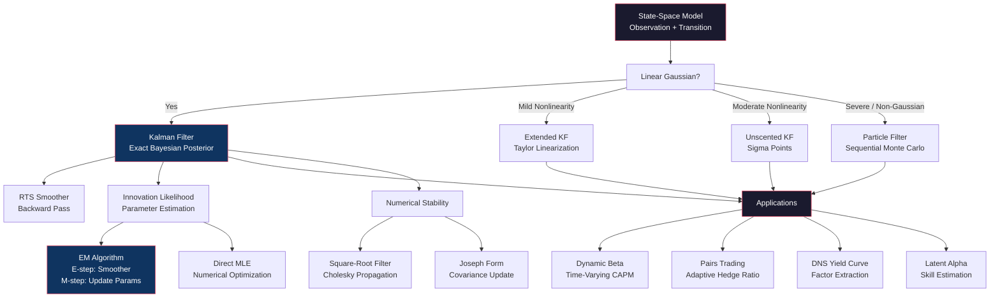

# Module 22: Kalman Filters & State-Space Models

> **Prerequisites:** Modules 01 (Mathematical Foundations), 02 (Probability & Stochastic Processes), 21 (Time Series Analysis)
> **Builds toward:** Modules 25 (Factor Models), 33 (Algorithmic Trading Systems)

---

## Table of Contents

1. [State-Space Representation](#1-state-space-representation)
2. [Linear Kalman Filter](#2-linear-kalman-filter)
3. [Kalman Smoother](#3-kalman-smoother)
4. [Extended Kalman Filter (EKF)](#4-extended-kalman-filter-ekf)
5. [Unscented Kalman Filter (UKF)](#5-unscented-kalman-filter-ukf)
6. [Particle Filters (Sequential Monte Carlo)](#6-particle-filters-sequential-monte-carlo)
7. [EM Algorithm for State-Space Models](#7-em-algorithm-for-state-space-models)
8. [Applications in Quantitative Finance](#8-applications-in-quantitative-finance)
9. [Square-Root Filters for Numerical Stability](#9-square-root-filters-for-numerical-stability)
10. [Implementation: Python](#10-implementation-python)
11. [Implementation: C++](#11-implementation-c)
12. [Exercises](#12-exercises)
13. [Summary and Concept Map](#13-summary-and-concept-map)

---

## 1. State-Space Representation

State-space models provide a unified framework for an enormous class of time series models. The central idea is to decompose a system into an unobserved **state** that evolves according to a dynamical law, and an **observation** that relates the state to measured data. This separation is powerful because many quantities of interest in finance --- time-varying betas, latent factors, regime probabilities, true volatility --- are inherently unobservable.

### 1.1 General Linear Gaussian State-Space Model

The model consists of two equations:

**Observation (measurement) equation:**

$$
\mathbf{y}_t = \mathbf{Z}_t \boldsymbol{\alpha}_t + \boldsymbol{\varepsilon}_t, \quad \boldsymbol{\varepsilon}_t \sim \mathcal{N}(\mathbf{0}, \mathbf{H}_t)
$$

**State (transition) equation:**

$$
\boldsymbol{\alpha}_{t} = \mathbf{T}_t \boldsymbol{\alpha}_{t-1} + \boldsymbol{\eta}_t, \quad \boldsymbol{\eta}_t \sim \mathcal{N}(\mathbf{0}, \mathbf{Q}_t)
$$

where:

- $\mathbf{y}_t$ is the $p \times 1$ observation vector at time $t$
- $\boldsymbol{\alpha}_t$ is the $m \times 1$ state vector at time $t$
- $\mathbf{Z}_t$ is the $p \times m$ observation (design) matrix
- $\mathbf{T}_t$ is the $m \times m$ state transition matrix
- $\mathbf{H}_t$ is the $p \times p$ observation noise covariance
- $\mathbf{Q}_t$ is the $m \times m$ state noise covariance
- $\boldsymbol{\varepsilon}_t$ and $\boldsymbol{\eta}_t$ are mutually uncorrelated

The initial state is $\boldsymbol{\alpha}_0 \sim \mathcal{N}(\mathbf{a}_0, \mathbf{P}_0)$.

### 1.2 Markov Property and Information Structure

The state-space formulation encodes a crucial **Markov property**: the state $\boldsymbol{\alpha}_t$ contains all information from the past that is relevant for predicting the future. Formally:

$$
p(\boldsymbol{\alpha}_{t+1} | \boldsymbol{\alpha}_t, \boldsymbol{\alpha}_{t-1}, \ldots, \boldsymbol{\alpha}_0) = p(\boldsymbol{\alpha}_{t+1} | \boldsymbol{\alpha}_t)
$$

This means the filtering problem reduces to tracking the conditional distribution $p(\boldsymbol{\alpha}_t | \mathbf{y}_{1:t})$, which is the distribution of the state given all observations up to time $t$. In the linear Gaussian case, this distribution is Gaussian and hence fully characterized by its mean and covariance.

### 1.3 Examples of State-Space Embeddings

Many classical time series models are special cases:

| Model | State $\boldsymbol{\alpha}_t$ | $\mathbf{T}_t$ | $\mathbf{Z}_t$ |
|-------|-------------------------------|-----------------|-----------------|
| Local level | $\mu_t$ (trend) | $1$ | $1$ |
| AR(1) | $x_t$ | $\phi$ | $1$ |
| ARMA(p,q) | $(x_t, x_{t-1}, \ldots)^\top$ | Companion matrix | $(1, 0, \ldots)$ |
| Dynamic regression | $\boldsymbol{\beta}_t$ | $\mathbf{I}$ or $\mathbf{T}$ | $\mathbf{x}_t^\top$ |
| Factor model | $\mathbf{f}_t$ | $\boldsymbol{\Phi}$ | $\boldsymbol{\Lambda}$ |

---

## 2. Linear Kalman Filter

The Kalman filter (Kalman, 1960) is the optimal recursive estimator for the linear Gaussian state-space model. It computes the exact conditional distribution $p(\boldsymbol{\alpha}_t | \mathbf{y}_{1:t})$ using only the previous filtered estimate and the current observation, without storing the entire history.

### 2.1 Prediction Step

Given the filtered estimate at time $t-1$:

$$
\boldsymbol{\alpha}_{t-1|t-1} \sim \mathcal{N}(\mathbf{a}_{t-1|t-1}, \mathbf{P}_{t-1|t-1})
$$

The one-step-ahead prediction of the state is:

$$
\mathbf{a}_{t|t-1} = \mathbf{T}_t \, \mathbf{a}_{t-1|t-1}
$$

$$
\mathbf{P}_{t|t-1} = \mathbf{T}_t \, \mathbf{P}_{t-1|t-1} \, \mathbf{T}_t^\top + \mathbf{Q}_t
$$

These follow directly from the state transition equation and the properties of linear transformations of Gaussians.

The predicted observation is:

$$
\hat{\mathbf{y}}_{t|t-1} = \mathbf{Z}_t \, \mathbf{a}_{t|t-1}
$$

The **innovation** (prediction error) and its covariance are:

$$
\mathbf{v}_t = \mathbf{y}_t - \hat{\mathbf{y}}_{t|t-1} = \mathbf{y}_t - \mathbf{Z}_t \, \mathbf{a}_{t|t-1}
$$

$$
\mathbf{F}_t = \mathbf{Z}_t \, \mathbf{P}_{t|t-1} \, \mathbf{Z}_t^\top + \mathbf{H}_t
$$

### 2.2 Update Step

The **Kalman gain** determines how much the prediction is adjusted by the innovation:

$$
\mathbf{K}_t = \mathbf{P}_{t|t-1} \, \mathbf{Z}_t^\top \, \mathbf{F}_t^{-1}
$$

The filtered (updated) estimates are:

$$
\mathbf{a}_{t|t} = \mathbf{a}_{t|t-1} + \mathbf{K}_t \, \mathbf{v}_t
$$

$$
\mathbf{P}_{t|t} = (\mathbf{I} - \mathbf{K}_t \, \mathbf{Z}_t) \, \mathbf{P}_{t|t-1}
$$

The more numerically stable **Joseph form** for the covariance update is:

$$
\mathbf{P}_{t|t} = (\mathbf{I} - \mathbf{K}_t \mathbf{Z}_t) \mathbf{P}_{t|t-1} (\mathbf{I} - \mathbf{K}_t \mathbf{Z}_t)^\top + \mathbf{K}_t \mathbf{H}_t \mathbf{K}_t^\top
$$

This form guarantees symmetry and positive semi-definiteness of $\mathbf{P}_{t|t}$ even under floating-point arithmetic.

### 2.3 Full Bayesian Derivation

The Kalman filter is *exactly* Bayesian updating for Gaussians. At each time step, we combine a prior with a likelihood to obtain a posterior.

**Prior (from prediction step).** The predicted state distribution serves as the prior:

$$
p(\boldsymbol{\alpha}_t | \mathbf{y}_{1:t-1}) = \mathcal{N}(\mathbf{a}_{t|t-1}, \mathbf{P}_{t|t-1})
$$

**Likelihood (from observation).** Given the state, the observation distribution is:

$$
p(\mathbf{y}_t | \boldsymbol{\alpha}_t) = \mathcal{N}(\mathbf{Z}_t \boldsymbol{\alpha}_t, \mathbf{H}_t)
$$

Writing the log-densities explicitly:

$$
\log p(\boldsymbol{\alpha}_t | \mathbf{y}_{1:t-1}) = -\frac{1}{2}(\boldsymbol{\alpha}_t - \mathbf{a}_{t|t-1})^\top \mathbf{P}_{t|t-1}^{-1} (\boldsymbol{\alpha}_t - \mathbf{a}_{t|t-1}) + \text{const}
$$

$$
\log p(\mathbf{y}_t | \boldsymbol{\alpha}_t) = -\frac{1}{2}(\mathbf{y}_t - \mathbf{Z}_t \boldsymbol{\alpha}_t)^\top \mathbf{H}_t^{-1} (\mathbf{y}_t - \mathbf{Z}_t \boldsymbol{\alpha}_t) + \text{const}
$$

**Posterior (Bayes' rule).** By Bayes' theorem:

$$
p(\boldsymbol{\alpha}_t | \mathbf{y}_{1:t}) \propto p(\mathbf{y}_t | \boldsymbol{\alpha}_t) \, p(\boldsymbol{\alpha}_t | \mathbf{y}_{1:t-1})
$$

Since both the prior and likelihood are Gaussian, the posterior is also Gaussian. To find its parameters, we combine the quadratic forms. The log-posterior (up to constants in $\boldsymbol{\alpha}_t$) is:

$$
\log p(\boldsymbol{\alpha}_t | \mathbf{y}_{1:t}) = -\frac{1}{2} \boldsymbol{\alpha}_t^\top \underbrace{(\mathbf{P}_{t|t-1}^{-1} + \mathbf{Z}_t^\top \mathbf{H}_t^{-1} \mathbf{Z}_t)}_{\mathbf{P}_{t|t}^{-1}} \boldsymbol{\alpha}_t + \boldsymbol{\alpha}_t^\top \underbrace{(\mathbf{P}_{t|t-1}^{-1} \mathbf{a}_{t|t-1} + \mathbf{Z}_t^\top \mathbf{H}_t^{-1} \mathbf{y}_t)}_{\mathbf{P}_{t|t}^{-1} \mathbf{a}_{t|t}} + \text{const}
$$

**Posterior precision (inverse covariance):**

$$
\mathbf{P}_{t|t}^{-1} = \mathbf{P}_{t|t-1}^{-1} + \mathbf{Z}_t^\top \mathbf{H}_t^{-1} \mathbf{Z}_t
$$

This is the sum of prior precision and data precision --- the defining property of Bayesian updating.

**Posterior mean:**

$$
\mathbf{a}_{t|t} = \mathbf{P}_{t|t} (\mathbf{P}_{t|t-1}^{-1} \mathbf{a}_{t|t-1} + \mathbf{Z}_t^\top \mathbf{H}_t^{-1} \mathbf{y}_t)
$$

To connect this to the standard Kalman gain form, apply the **matrix inversion lemma** (Woodbury identity):

$$
(\mathbf{P}_{t|t-1}^{-1} + \mathbf{Z}_t^\top \mathbf{H}_t^{-1} \mathbf{Z}_t)^{-1} = \mathbf{P}_{t|t-1} - \mathbf{P}_{t|t-1} \mathbf{Z}_t^\top (\mathbf{Z}_t \mathbf{P}_{t|t-1} \mathbf{Z}_t^\top + \mathbf{H}_t)^{-1} \mathbf{Z}_t \mathbf{P}_{t|t-1}
$$

Identifying $\mathbf{F}_t = \mathbf{Z}_t \mathbf{P}_{t|t-1} \mathbf{Z}_t^\top + \mathbf{H}_t$ and $\mathbf{K}_t = \mathbf{P}_{t|t-1} \mathbf{Z}_t^\top \mathbf{F}_t^{-1}$:

$$
\mathbf{P}_{t|t} = (\mathbf{I} - \mathbf{K}_t \mathbf{Z}_t) \mathbf{P}_{t|t-1}
$$

Substituting into the posterior mean formula and simplifying:

$$
\mathbf{a}_{t|t} = \mathbf{a}_{t|t-1} + \mathbf{K}_t (\mathbf{y}_t - \mathbf{Z}_t \mathbf{a}_{t|t-1}) = \mathbf{a}_{t|t-1} + \mathbf{K}_t \mathbf{v}_t
$$

This completes the Bayesian derivation. The Kalman filter is not an approximation: it computes the exact posterior under the linear Gaussian assumptions.

### 2.4 Log-Likelihood via Innovations

The log-likelihood of the observed data under the state-space model is computed as a byproduct of the Kalman filter, using the prediction error decomposition:

$$
\log p(\mathbf{y}_{1:T}) = \sum_{t=1}^{T} \log p(\mathbf{y}_t | \mathbf{y}_{1:t-1}) = -\frac{1}{2} \sum_{t=1}^{T} \left[ p \log(2\pi) + \log |\mathbf{F}_t| + \mathbf{v}_t^\top \mathbf{F}_t^{-1} \mathbf{v}_t \right]
$$

This is essential for parameter estimation via MLE or the EM algorithm.

---

## 3. Kalman Smoother

The filter computes $p(\boldsymbol{\alpha}_t | \mathbf{y}_{1:t})$ --- the state estimate using data up to time $t$. The **smoother** computes $p(\boldsymbol{\alpha}_t | \mathbf{y}_{1:T})$ --- the state estimate using *all* data, including future observations. Smoothed estimates are always at least as precise as filtered estimates.

### 3.1 Rauch-Tung-Striebel (RTS) Backward Recursion

After running the Kalman filter forward from $t = 1$ to $T$, the RTS smoother runs backward from $t = T$ to $1$:

**Initialize:** $\mathbf{a}_{T|T}$ and $\mathbf{P}_{T|T}$ from the final filter step.

**Backward recursion** for $t = T-1, T-2, \ldots, 1$:

$$
\mathbf{L}_t = \mathbf{P}_{t|t} \, \mathbf{T}_{t+1}^\top \, \mathbf{P}_{t+1|t}^{-1}
$$

$$
\mathbf{a}_{t|T} = \mathbf{a}_{t|t} + \mathbf{L}_t (\mathbf{a}_{t+1|T} - \mathbf{a}_{t+1|t})
$$

$$
\mathbf{P}_{t|T} = \mathbf{P}_{t|t} + \mathbf{L}_t (\mathbf{P}_{t+1|T} - \mathbf{P}_{t+1|t}) \mathbf{L}_t^\top
$$

where $\mathbf{L}_t$ is the **smoother gain**. The smoothed estimates $\mathbf{a}_{t|T}$ adjust the filtered estimates by propagating information from the future backward through the state transition dynamics. The smoother gain $\mathbf{L}_t$ plays a role analogous to the Kalman gain in the forward pass: it determines how much "future information" is incorporated.

### 3.2 Smoothed Cross-Covariances

For the EM algorithm (Section 7), we also need the lag-one smoother covariance:

$$
\mathbf{P}_{t,t-1|T} = \mathbf{L}_{t-1} \mathbf{P}_{t|T}
$$

This can be derived from the joint smoothed distribution of $(\boldsymbol{\alpha}_t, \boldsymbol{\alpha}_{t-1})$ given $\mathbf{y}_{1:T}$.

---

## 4. Extended Kalman Filter (EKF)

When the system dynamics or observation model are nonlinear, the standard Kalman filter no longer applies. The Extended Kalman Filter (EKF) linearizes the nonlinear functions around the current estimate.

### 4.1 Nonlinear State-Space Model

$$
\boldsymbol{\alpha}_t = \mathbf{f}(\boldsymbol{\alpha}_{t-1}) + \boldsymbol{\eta}_t
$$

$$
\mathbf{y}_t = \mathbf{h}(\boldsymbol{\alpha}_t) + \boldsymbol{\varepsilon}_t
$$

where $\mathbf{f}(\cdot)$ and $\mathbf{h}(\cdot)$ are (potentially nonlinear) vector-valued functions.

### 4.2 Linearization via First-Order Taylor Expansion

The EKF approximates $\mathbf{f}$ and $\mathbf{h}$ by their first-order Taylor expansions around the current state estimate:

$$
\mathbf{f}(\boldsymbol{\alpha}_{t-1}) \approx \mathbf{f}(\mathbf{a}_{t-1|t-1}) + \mathbf{F}_{t-1} (\boldsymbol{\alpha}_{t-1} - \mathbf{a}_{t-1|t-1})
$$

$$
\mathbf{h}(\boldsymbol{\alpha}_t) \approx \mathbf{h}(\mathbf{a}_{t|t-1}) + \mathbf{H}_t (\boldsymbol{\alpha}_t - \mathbf{a}_{t|t-1})
$$

where the **Jacobians** are:

$$
\mathbf{F}_{t-1} = \frac{\partial \mathbf{f}}{\partial \boldsymbol{\alpha}}\bigg|_{\boldsymbol{\alpha} = \mathbf{a}_{t-1|t-1}}, \quad \mathbf{H}_t = \frac{\partial \mathbf{h}}{\partial \boldsymbol{\alpha}}\bigg|_{\boldsymbol{\alpha} = \mathbf{a}_{t|t-1}}
$$

The EKF then applies the standard Kalman filter equations with $\mathbf{T}_t$ replaced by $\mathbf{F}_{t-1}$, $\mathbf{Z}_t$ replaced by $\mathbf{H}_t$, and the predicted state mean computed by the full nonlinear function:

**Prediction:**

$$
\mathbf{a}_{t|t-1} = \mathbf{f}(\mathbf{a}_{t-1|t-1})
$$

$$
\mathbf{P}_{t|t-1} = \mathbf{F}_{t-1} \mathbf{P}_{t-1|t-1} \mathbf{F}_{t-1}^\top + \mathbf{Q}_t
$$

**Update:**

$$
\mathbf{v}_t = \mathbf{y}_t - \mathbf{h}(\mathbf{a}_{t|t-1})
$$

$$
\mathbf{S}_t = \mathbf{H}_t \mathbf{P}_{t|t-1} \mathbf{H}_t^\top + \mathbf{R}_t
$$

$$
\mathbf{K}_t = \mathbf{P}_{t|t-1} \mathbf{H}_t^\top \mathbf{S}_t^{-1}
$$

$$
\mathbf{a}_{t|t} = \mathbf{a}_{t|t-1} + \mathbf{K}_t \mathbf{v}_t
$$

$$
\mathbf{P}_{t|t} = (\mathbf{I} - \mathbf{K}_t \mathbf{H}_t) \mathbf{P}_{t|t-1}
$$

### 4.3 Limitations

The EKF can perform poorly when: (a) the nonlinearity is severe (the first-order approximation is inaccurate), (b) the Jacobians are difficult or expensive to compute analytically, (c) the posterior is multi-modal (the Gaussian approximation is fundamentally inadequate). The first two issues are addressed by the UKF; the third requires particle filters.

---

## 5. Unscented Kalman Filter (UKF)

The Unscented Kalman Filter (Julier and Uhlmann, 1997) avoids linearization entirely by propagating a deterministic set of **sigma points** through the nonlinear functions.

### 5.1 The Unscented Transform

The key insight: it is easier to approximate a probability distribution than to approximate an arbitrary nonlinear function. Instead of linearizing $\mathbf{f}(\cdot)$, we select a small set of points (sigma points) that capture the mean and covariance of the input distribution, transform them through $\mathbf{f}$, and compute the statistics of the output.

For an $m$-dimensional state with mean $\mathbf{a}$ and covariance $\mathbf{P}$, we construct $2m + 1$ sigma points:

$$
\boldsymbol{\chi}_0 = \mathbf{a}
$$

$$
\boldsymbol{\chi}_i = \mathbf{a} + \left(\sqrt{(m + \lambda) \mathbf{P}}\right)_i, \quad i = 1, \ldots, m
$$

$$
\boldsymbol{\chi}_{m+i} = \mathbf{a} - \left(\sqrt{(m + \lambda) \mathbf{P}}\right)_i, \quad i = 1, \ldots, m
$$

where $\left(\sqrt{(m + \lambda) \mathbf{P}}\right)_i$ denotes the $i$-th column of the matrix square root (e.g., Cholesky factor), and $\lambda = \alpha_s^2(m + \kappa) - m$ is a scaling parameter. The weights are:

$$
W_0^{(m)} = \frac{\lambda}{m + \lambda}, \quad W_0^{(c)} = W_0^{(m)} + (1 - \alpha_s^2 + \beta_s)
$$

$$
W_i^{(m)} = W_i^{(c)} = \frac{1}{2(m + \lambda)}, \quad i = 1, \ldots, 2m
$$

Common choices: $\alpha_s = 10^{-3}$, $\beta_s = 2$ (optimal for Gaussians), $\kappa = 0$.

### 5.2 UKF Algorithm

**Prediction Step:**

1. Compute sigma points $\boldsymbol{\chi}_{i}$ from $(\mathbf{a}_{t-1|t-1}, \mathbf{P}_{t-1|t-1})$
2. Propagate through dynamics: $\boldsymbol{\chi}_{i}^{*} = \mathbf{f}(\boldsymbol{\chi}_{i})$
3. Predicted mean: $\mathbf{a}_{t|t-1} = \sum_{i=0}^{2m} W_i^{(m)} \boldsymbol{\chi}_i^{*}$
4. Predicted covariance: $\mathbf{P}_{t|t-1} = \sum_{i=0}^{2m} W_i^{(c)} (\boldsymbol{\chi}_i^{*} - \mathbf{a}_{t|t-1})(\boldsymbol{\chi}_i^{*} - \mathbf{a}_{t|t-1})^\top + \mathbf{Q}_t$

**Update Step:**

1. Recompute sigma points from $(\mathbf{a}_{t|t-1}, \mathbf{P}_{t|t-1})$ (or reuse propagated points)
2. Propagate through observation model: $\boldsymbol{\gamma}_i = \mathbf{h}(\boldsymbol{\chi}_i^{*})$
3. Predicted observation: $\hat{\mathbf{y}}_t = \sum_{i=0}^{2m} W_i^{(m)} \boldsymbol{\gamma}_i$
4. Innovation covariance: $\mathbf{S}_t = \sum_{i=0}^{2m} W_i^{(c)} (\boldsymbol{\gamma}_i - \hat{\mathbf{y}}_t)(\boldsymbol{\gamma}_i - \hat{\mathbf{y}}_t)^\top + \mathbf{R}_t$
5. Cross-covariance: $\mathbf{C}_t = \sum_{i=0}^{2m} W_i^{(c)} (\boldsymbol{\chi}_i^{*} - \mathbf{a}_{t|t-1})(\boldsymbol{\gamma}_i - \hat{\mathbf{y}}_t)^\top$
6. Kalman gain: $\mathbf{K}_t = \mathbf{C}_t \mathbf{S}_t^{-1}$
7. Update: $\mathbf{a}_{t|t} = \mathbf{a}_{t|t-1} + \mathbf{K}_t (\mathbf{y}_t - \hat{\mathbf{y}}_t)$
8. $\mathbf{P}_{t|t} = \mathbf{P}_{t|t-1} - \mathbf{K}_t \mathbf{S}_t \mathbf{K}_t^\top$

### 5.3 Comparison: EKF vs UKF

| Property | EKF | UKF |
|----------|-----|-----|
| Approximation | Linearize function | Approximate distribution |
| Accuracy | $O(\|\Delta\alpha\|^2)$ | $O(\|\Delta\alpha\|^3)$ for Gaussians |
| Jacobians needed? | Yes | No |
| Computational cost | $O(m^2)$ per step (with Jacobian) | $O(m^2)$ per step (sigma points) |
| Multi-modal posteriors | No | No |
| Implementation difficulty | Requires analytic derivatives | Straightforward |

The UKF is generally preferred in practice when Jacobians are difficult to derive, when the nonlinearity is moderate, or when the second-order terms (neglected by EKF) are significant.

---

## 6. Particle Filters (Sequential Monte Carlo)

When the state-space model is highly nonlinear or the distributions are non-Gaussian (multi-modal, heavy-tailed, constrained), particle filters provide a flexible simulation-based approach.

### 6.1 Core Idea

Represent the posterior distribution $p(\boldsymbol{\alpha}_t | \mathbf{y}_{1:t})$ by a set of $N$ weighted particles $\{(\boldsymbol{\alpha}_t^{(i)}, w_t^{(i)})\}_{i=1}^{N}$:

$$
\hat{p}(\boldsymbol{\alpha}_t | \mathbf{y}_{1:t}) = \sum_{i=1}^{N} w_t^{(i)} \, \delta(\boldsymbol{\alpha}_t - \boldsymbol{\alpha}_t^{(i)})
$$

As $N \to \infty$, this approximation converges to the true posterior.

### 6.2 Sequential Importance Sampling (SIS)

**Step 1 (Propagate):** Sample from a proposal distribution $q(\boldsymbol{\alpha}_t | \boldsymbol{\alpha}_{t-1}^{(i)}, \mathbf{y}_t)$. The simplest choice is the **prior proposal**: $q = p(\boldsymbol{\alpha}_t | \boldsymbol{\alpha}_{t-1}^{(i)})$.

**Step 2 (Weight):** Update the importance weights:

$$
\tilde{w}_t^{(i)} = w_{t-1}^{(i)} \cdot \frac{p(\mathbf{y}_t | \boldsymbol{\alpha}_t^{(i)}) \, p(\boldsymbol{\alpha}_t^{(i)} | \boldsymbol{\alpha}_{t-1}^{(i)})}{q(\boldsymbol{\alpha}_t^{(i)} | \boldsymbol{\alpha}_{t-1}^{(i)}, \mathbf{y}_t)}
$$

For the prior proposal, this simplifies to:

$$
\tilde{w}_t^{(i)} \propto w_{t-1}^{(i)} \cdot p(\mathbf{y}_t | \boldsymbol{\alpha}_t^{(i)})
$$

**Step 3 (Normalize):** $w_t^{(i)} = \tilde{w}_t^{(i)} / \sum_{j=1}^{N} \tilde{w}_t^{(j)}$

### 6.3 Weight Degeneracy and Resampling

Without resampling, the weights eventually concentrate on a single particle (weight degeneracy). The **effective sample size** (ESS) measures the degree of degeneracy:

$$
\text{ESS} = \frac{1}{\sum_{i=1}^{N} (w_t^{(i)})^2}
$$

When $\text{ESS}$ falls below a threshold (typically $N/2$), we resample.

**Multinomial resampling.** Draw $N$ indices with replacement from the categorical distribution defined by the weights. Simple but high variance.

**Systematic resampling.** Draw a single uniform random number $U \sim \text{Unif}(0, 1/N)$ and construct the resampling points $u_i = U + (i-1)/N$. This ensures exactly the right number of copies of each particle (up to rounding), reducing Monte Carlo variance compared to multinomial resampling.

**Residual resampling.** First, deterministically assign $\lfloor N w_t^{(i)} \rfloor$ copies of particle $i$. Then, apply multinomial resampling to the residual weights $N w_t^{(i)} - \lfloor N w_t^{(i)} \rfloor$ for the remaining particles.

After resampling, all weights are reset to $1/N$.

### 6.4 Likelihood Estimation

The particle filter provides an unbiased estimate of the marginal likelihood:

$$
\hat{p}(\mathbf{y}_{1:T}) = \prod_{t=1}^{T} \left(\frac{1}{N} \sum_{i=1}^{N} \tilde{w}_t^{(i)}\right)
$$

This is useful for parameter estimation via particle MCMC or iterated filtering.

---

## 7. EM Algorithm for State-Space Models

The Expectation-Maximization (EM) algorithm provides a principled framework for estimating the system matrices $(\mathbf{Z}, \mathbf{T}, \mathbf{H}, \mathbf{Q})$ when they contain unknown parameters $\boldsymbol{\theta}$.

### 7.1 Complete-Data Log-Likelihood

If the states $\boldsymbol{\alpha}_{0:T}$ were observed, the complete-data log-likelihood would be:

$$
\mathcal{L}_c(\boldsymbol{\theta}) = \log p(\boldsymbol{\alpha}_0) + \sum_{t=1}^{T} \log p(\boldsymbol{\alpha}_t | \boldsymbol{\alpha}_{t-1}) + \sum_{t=1}^{T} \log p(\mathbf{y}_t | \boldsymbol{\alpha}_t)
$$

Expanding for the linear Gaussian case:

$$
\mathcal{L}_c = -\frac{1}{2}\bigg[\log|\mathbf{P}_0| + (\boldsymbol{\alpha}_0 - \mathbf{a}_0)^\top \mathbf{P}_0^{-1}(\boldsymbol{\alpha}_0 - \mathbf{a}_0)
$$

$$
+ T\log|\mathbf{Q}| + \sum_{t=1}^{T}(\boldsymbol{\alpha}_t - \mathbf{T}\boldsymbol{\alpha}_{t-1})^\top \mathbf{Q}^{-1}(\boldsymbol{\alpha}_t - \mathbf{T}\boldsymbol{\alpha}_{t-1})
$$

$$
+ T\log|\mathbf{H}| + \sum_{t=1}^{T}(\mathbf{y}_t - \mathbf{Z}\boldsymbol{\alpha}_t)^\top \mathbf{H}^{-1}(\mathbf{y}_t - \mathbf{Z}\boldsymbol{\alpha}_t)\bigg]
$$

### 7.2 E-Step: Kalman Smoother

In the E-step, we compute the expected complete-data log-likelihood $Q(\boldsymbol{\theta} | \boldsymbol{\theta}^{(k)}) = \mathbb{E}_{\boldsymbol{\alpha}_{0:T} | \mathbf{y}_{1:T}, \boldsymbol{\theta}^{(k)}}[\mathcal{L}_c(\boldsymbol{\theta})]$.

This requires the smoothed sufficient statistics, which are computed by running the Kalman filter and RTS smoother:

$$
\hat{\boldsymbol{\alpha}}_t = \mathbb{E}[\boldsymbol{\alpha}_t | \mathbf{y}_{1:T}] = \mathbf{a}_{t|T}
$$

$$
\hat{\mathbf{V}}_t = \mathbb{E}[\boldsymbol{\alpha}_t \boldsymbol{\alpha}_t^\top | \mathbf{y}_{1:T}] = \mathbf{P}_{t|T} + \mathbf{a}_{t|T} \mathbf{a}_{t|T}^\top
$$

$$
\hat{\mathbf{V}}_{t,t-1} = \mathbb{E}[\boldsymbol{\alpha}_t \boldsymbol{\alpha}_{t-1}^\top | \mathbf{y}_{1:T}] = \mathbf{P}_{t,t-1|T} + \mathbf{a}_{t|T} \mathbf{a}_{t-1|T}^\top
$$

### 7.3 M-Step: Parameter Updates

Differentiating $Q(\boldsymbol{\theta} | \boldsymbol{\theta}^{(k)})$ with respect to each parameter and setting to zero gives closed-form updates:

**Transition matrix:**

$$
\hat{\mathbf{T}} = \left(\sum_{t=1}^{T} \hat{\mathbf{V}}_{t,t-1}\right) \left(\sum_{t=1}^{T} \hat{\mathbf{V}}_{t-1}\right)^{-1}
$$

**State noise covariance:**

$$
\hat{\mathbf{Q}} = \frac{1}{T} \sum_{t=1}^{T} \left[\hat{\mathbf{V}}_t - \hat{\mathbf{T}} \hat{\mathbf{V}}_{t,t-1}^\top - \hat{\mathbf{V}}_{t,t-1} \hat{\mathbf{T}}^\top + \hat{\mathbf{T}} \hat{\mathbf{V}}_{t-1} \hat{\mathbf{T}}^\top\right]
$$

**Observation matrix:**

$$
\hat{\mathbf{Z}} = \left(\sum_{t=1}^{T} \mathbf{y}_t \hat{\boldsymbol{\alpha}}_t^\top\right) \left(\sum_{t=1}^{T} \hat{\mathbf{V}}_t\right)^{-1}
$$

**Observation noise covariance:**

$$
\hat{\mathbf{H}} = \frac{1}{T} \sum_{t=1}^{T} \left[\mathbf{y}_t \mathbf{y}_t^\top - \hat{\mathbf{Z}} \hat{\boldsymbol{\alpha}}_t \mathbf{y}_t^\top - \mathbf{y}_t \hat{\boldsymbol{\alpha}}_t^\top \hat{\mathbf{Z}}^\top + \hat{\mathbf{Z}} \hat{\mathbf{V}}_t \hat{\mathbf{Z}}^\top\right]
$$

The E-step and M-step are iterated until convergence (monitored via the observed log-likelihood from the Kalman filter). The EM algorithm is guaranteed to increase the log-likelihood at each iteration and converges to a local maximum (or saddle point).

---

## 8. Applications in Quantitative Finance

### 8.1 Dynamic Beta Estimation

The Capital Asset Pricing Model assumes a constant beta, but in reality betas vary over time due to changing business risk, leverage, and market conditions. Model the return of asset $i$ at time $t$ as:

**Observation:** $r_{i,t} = \alpha_t + \beta_t \, r_{m,t} + \varepsilon_t, \quad \varepsilon_t \sim N(0, \sigma_\varepsilon^2)$

**State transition:** $\begin{pmatrix} \alpha_t \\ \beta_t \end{pmatrix} = \begin{pmatrix} \alpha_{t-1} \\ \beta_{t-1} \end{pmatrix} + \boldsymbol{\eta}_t, \quad \boldsymbol{\eta}_t \sim N(\mathbf{0}, \mathbf{Q})$

This is a standard linear state-space model with $\mathbf{Z}_t = (1, r_{m,t})$, $\mathbf{T} = \mathbf{I}_2$, $\boldsymbol{\alpha}_t = (\alpha_t, \beta_t)^\top$. The Kalman filter produces the filtered beta $\beta_{t|t}$ at each time point, which can be used for dynamic hedging, portfolio construction, and risk decomposition.

The state noise covariance $\mathbf{Q}$ controls the smoothness of the beta trajectory: large $\mathbf{Q}$ allows rapid variation, while small $\mathbf{Q}$ produces a nearly constant beta. This hyperparameter can be estimated via MLE (using the innovations likelihood) or the EM algorithm.

### 8.2 Pairs Trading: Time-Varying Hedge Ratio

In pairs trading, two cointegrated assets have a spread that mean-reverts. The Kalman filter provides an optimal, adaptive estimate of the hedge ratio.

Let $y_t$ be the price of asset A and $x_t$ be the price of asset B. The observation and state equations are:

**Observation:** $y_t = \beta_t \, x_t + \varepsilon_t, \quad \varepsilon_t \sim N(0, R)$

**State:** $\beta_t = \beta_{t-1} + \eta_t, \quad \eta_t \sim N(0, Q)$

The filtered hedge ratio $\beta_{t|t}$ adapts to structural shifts in the relationship. The spread residual $e_t = y_t - \beta_{t|t} x_t$ is then used for trading signals: go long when $e_t / \sqrt{F_t}$ falls below a threshold (spread is too narrow), and go short when it exceeds an upper threshold. The innovation variance $F_t$ provides a natural, time-varying normalization for the trading signal, automatically adjusting for periods of high versus low spread uncertainty.

### 8.3 Factor Extraction from Yield Curves: DNS Model

The Nelson-Siegel model parameterizes the yield curve using three latent factors (level, slope, curvature). The Dynamic Nelson-Siegel (DNS) model of Diebold and Li (2006) embeds this in a state-space framework.

**Observation equation** (for yield at maturity $\tau_j$):

$$
y_t(\tau_j) = L_t + S_t \left(\frac{1 - e^{-\lambda \tau_j}}{\lambda \tau_j}\right) + C_t \left(\frac{1 - e^{-\lambda \tau_j}}{\lambda \tau_j} - e^{-\lambda \tau_j}\right) + \varepsilon_{j,t}
$$

**State equation** (factors follow a VAR(1)):

$$
\begin{pmatrix} L_t \\ S_t \\ C_t \end{pmatrix} = \boldsymbol{\mu} + \boldsymbol{\Phi} \begin{pmatrix} L_{t-1} \\ S_{t-1} \\ C_{t-1} \end{pmatrix} + \boldsymbol{\eta}_t
$$

The loading matrix $\mathbf{Z}_t$ contains the Nelson-Siegel basis functions evaluated at each maturity. The Kalman filter extracts the time path of $(L_t, S_t, C_t)$, which have economic interpretations as the level (long rate), slope (term spread), and curvature (butterfly) of the yield curve. This is widely used by central banks and fixed-income desks for yield curve forecasting and scenario analysis.

### 8.4 Latent Alpha Estimation

A portfolio manager's true alpha (risk-adjusted skill) is unobservable. We can model it as a latent state:

**Observation:** $r_t^{\text{excess}} = \alpha_t + \sum_{k} \beta_k f_{k,t} + \varepsilon_t$

**State:** $\alpha_t = \phi \alpha_{t-1} + \eta_t$ with $|\phi| < 1$ (mean-reverting skill)

The Kalman filter provides a real-time, noise-filtered estimate of the manager's alpha. The smoothed estimate $\alpha_{t|T}$ uses the entire track record and is useful for performance evaluation. The persistence parameter $\phi$ measures how persistent skill is, while $\text{Var}(\eta_t)$ measures how much alpha varies over time.

---

## 9. Square-Root Filters for Numerical Stability

In practice, the covariance matrix $\mathbf{P}_{t|t}$ can lose positive definiteness due to floating-point arithmetic, especially in long time series with many state variables. Square-root filters maintain the Cholesky factor $\mathbf{S}_t$ where $\mathbf{P}_t = \mathbf{S}_t \mathbf{S}_t^\top$, guaranteeing symmetry and positive definiteness by construction.

### 9.1 Potter's Square-Root Filter

Propagate the Cholesky factor directly:

**Prediction:** Compute $\mathbf{S}_{t|t-1}$ from $\text{chol}\left(\begin{pmatrix} \mathbf{T}_t \mathbf{S}_{t-1|t-1} & \mathbf{S}_Q \end{pmatrix} \begin{pmatrix} \mathbf{T}_t \mathbf{S}_{t-1|t-1} & \mathbf{S}_Q \end{pmatrix}^\top\right)$

where $\mathbf{S}_Q$ is the Cholesky factor of $\mathbf{Q}_t$. This is computed efficiently via QR decomposition: form the matrix $\begin{pmatrix} (\mathbf{T}_t \mathbf{S}_{t-1|t-1})^\top \\ \mathbf{S}_Q^\top \end{pmatrix}$, compute its QR factorization, and extract the upper triangular factor as $\mathbf{S}_{t|t-1}^\top$.

**Update:** Similarly, the innovation covariance factor and updated state covariance factor are obtained via QR updates. The computational cost is comparable to the standard Kalman filter ($O(m^3)$ per step) but with substantially better numerical properties.

### 9.2 When to Use Square-Root Filters

Square-root filters are recommended when: (a) the state dimension $m$ is large ($m > 10$), (b) the ratio of largest to smallest eigenvalue of $\mathbf{P}$ is large (ill-conditioned), (c) the filter is run for thousands of time steps, or (d) when $\mathbf{Q}$ is nearly singular (some states evolve nearly deterministically).

---

## 10. Implementation: Python

```python
"""
Module 22: Kalman Filters & State-Space Models -- Python Implementation
Full Kalman filter/smoother, UKF, particle filter, dynamic beta, pairs trading
"""

import numpy as np
from typing import Tuple, Dict, Optional, Callable
from scipy.linalg import cholesky, cho_solve, cho_factor
import warnings

# =============================================================================
# 10.1 Linear Kalman Filter and Smoother
# =============================================================================

class KalmanFilter:
    """
    Linear Gaussian Kalman Filter and RTS Smoother.

    State-space model:
        alpha_t = T @ alpha_{t-1} + eta_t,   eta_t ~ N(0, Q)
        y_t     = Z_t @ alpha_t + eps_t,      eps_t ~ N(0, H)
    """

    def __init__(self, T: np.ndarray, Q: np.ndarray, H: np.ndarray,
                 a0: np.ndarray, P0: np.ndarray):
        """
        Parameters
        ----------
        T : (m, m) state transition matrix
        Q : (m, m) state noise covariance
        H : (p, p) observation noise covariance
        a0 : (m,) initial state mean
        P0 : (m, m) initial state covariance
        """
        self.T_mat = T
        self.Q = Q
        self.H = H
        self.a0 = a0
        self.P0 = P0
        self.m = len(a0)

    def filter(self, y: np.ndarray, Z: np.ndarray) -> Dict:
        """
        Run the Kalman filter forward pass.

        Parameters
        ----------
        y : (T_len, p) observations
        Z : (T_len, p, m) time-varying observation matrices,
            or (p, m) if time-invariant

        Returns
        -------
        dict with filtered/predicted states, covariances, innovations,
             innovation covariances, log-likelihood
        """
        T_len = y.shape[0]
        p = y.shape[1] if y.ndim > 1 else 1
        if y.ndim == 1:
            y = y.reshape(-1, 1)

        m = self.m

        # Handle time-invariant Z
        if Z.ndim == 2:
            Z_tv = np.tile(Z, (T_len, 1, 1))
        else:
            Z_tv = Z

        # Storage
        a_pred = np.zeros((T_len, m))       # a_{t|t-1}
        P_pred = np.zeros((T_len, m, m))    # P_{t|t-1}
        a_filt = np.zeros((T_len, m))       # a_{t|t}
        P_filt = np.zeros((T_len, m, m))    # P_{t|t}
        v = np.zeros((T_len, p))            # innovations
        F = np.zeros((T_len, p, p))         # innovation covariance
        K = np.zeros((T_len, m, p))         # Kalman gain

        log_lik = 0.0

        for t in range(T_len):
            # --- Prediction ---
            if t == 0:
                a_pred[t] = self.T_mat @ self.a0
                P_pred[t] = self.T_mat @ self.P0 @ self.T_mat.T + self.Q
            else:
                a_pred[t] = self.T_mat @ a_filt[t - 1]
                P_pred[t] = self.T_mat @ P_filt[t - 1] @ self.T_mat.T + self.Q

            Zt = Z_tv[t]  # (p, m)

            # --- Innovation ---
            v[t] = y[t] - Zt @ a_pred[t]
            F[t] = Zt @ P_pred[t] @ Zt.T + self.H

            # Ensure symmetry
            F[t] = 0.5 * (F[t] + F[t].T)

            # --- Kalman gain ---
            try:
                F_chol = cho_factor(F[t])
                K[t] = P_pred[t] @ Zt.T @ cho_solve(F_chol, np.eye(p))
            except np.linalg.LinAlgError:
                K[t] = P_pred[t] @ Zt.T @ np.linalg.pinv(F[t])

            # --- Update (Joseph form for stability) ---
            a_filt[t] = a_pred[t] + K[t] @ v[t]
            IKZ = np.eye(m) - K[t] @ Zt
            P_filt[t] = IKZ @ P_pred[t] @ IKZ.T + K[t] @ self.H @ K[t].T
            P_filt[t] = 0.5 * (P_filt[t] + P_filt[t].T)

            # --- Log-likelihood ---
            sign, logdet = np.linalg.slogdet(F[t])
            if sign > 0:
                log_lik += -0.5 * (p * np.log(2 * np.pi) + logdet
                                   + v[t] @ np.linalg.solve(F[t], v[t]))

        return {
            'a_pred': a_pred, 'P_pred': P_pred,
            'a_filt': a_filt, 'P_filt': P_filt,
            'v': v, 'F': F, 'K': K,
            'log_likelihood': log_lik
        }

    def smooth(self, filter_result: Dict) -> Dict:
        """
        Rauch-Tung-Striebel backward smoother.

        Parameters
        ----------
        filter_result : output of self.filter()

        Returns
        -------
        dict with smoothed state means and covariances
        """
        a_filt = filter_result['a_filt']
        P_filt = filter_result['P_filt']
        a_pred = filter_result['a_pred']
        P_pred = filter_result['P_pred']

        T_len, m = a_filt.shape

        a_smooth = np.zeros_like(a_filt)
        P_smooth = np.zeros_like(P_filt)
        L = np.zeros((T_len - 1, m, m))  # smoother gains

        # Initialize with final filtered values
        a_smooth[-1] = a_filt[-1]
        P_smooth[-1] = P_filt[-1]

        # Backward pass
        for t in range(T_len - 2, -1, -1):
            try:
                P_pred_inv = np.linalg.inv(P_pred[t + 1])
            except np.linalg.LinAlgError:
                P_pred_inv = np.linalg.pinv(P_pred[t + 1])

            L[t] = P_filt[t] @ self.T_mat.T @ P_pred_inv

            a_smooth[t] = a_filt[t] + L[t] @ (a_smooth[t + 1] - a_pred[t + 1])
            P_smooth[t] = P_filt[t] + L[t] @ (P_smooth[t + 1] - P_pred[t + 1]) @ L[t].T
            P_smooth[t] = 0.5 * (P_smooth[t] + P_smooth[t].T)

        return {
            'a_smooth': a_smooth,
            'P_smooth': P_smooth,
            'L': L
        }


# =============================================================================
# 10.2 Unscented Kalman Filter
# =============================================================================

class UnscentedKalmanFilter:
    """
    Unscented Kalman Filter for nonlinear state-space models.

    State:      alpha_t = f(alpha_{t-1}) + eta_t
    Observation: y_t    = h(alpha_t) + eps_t
    """

    def __init__(self, f: Callable, h: Callable,
                 Q: np.ndarray, R: np.ndarray,
                 a0: np.ndarray, P0: np.ndarray,
                 alpha_s: float = 1e-3, beta_s: float = 2.0, kappa: float = 0.0):
        """
        Parameters
        ----------
        f : state transition function f(alpha) -> alpha
        h : observation function h(alpha) -> y
        Q : state noise covariance
        R : observation noise covariance
        a0, P0 : initial state distribution
        alpha_s, beta_s, kappa : UKF tuning parameters
        """
        self.f = f
        self.h = h
        self.Q = Q
        self.R = R
        self.a0 = a0
        self.P0 = P0
        self.m = len(a0)

        # Compute weights
        lam = alpha_s ** 2 * (self.m + kappa) - self.m
        self.lam = lam
        self.Wm = np.full(2 * self.m + 1, 1.0 / (2 * (self.m + lam)))
        self.Wc = np.full(2 * self.m + 1, 1.0 / (2 * (self.m + lam)))
        self.Wm[0] = lam / (self.m + lam)
        self.Wc[0] = lam / (self.m + lam) + (1 - alpha_s ** 2 + beta_s)

    def _sigma_points(self, a: np.ndarray, P: np.ndarray) -> np.ndarray:
        """Generate 2m+1 sigma points."""
        m = self.m
        n_sig = 2 * m + 1
        chi = np.zeros((n_sig, m))

        S = cholesky((m + self.lam) * P, lower=True)

        chi[0] = a
        for i in range(m):
            chi[i + 1] = a + S[:, i]
            chi[m + i + 1] = a - S[:, i]

        return chi

    def filter(self, y: np.ndarray) -> Dict:
        """
        Run UKF forward pass.

        Parameters
        ----------
        y : (T_len, p) observations

        Returns
        -------
        dict with filtered states, covariances, log-likelihood
        """
        if y.ndim == 1:
            y = y.reshape(-1, 1)
        T_len, p = y.shape
        m = self.m

        a_filt = np.zeros((T_len, m))
        P_filt = np.zeros((T_len, m, m))
        log_lik = 0.0

        a_prev = self.a0.copy()
        P_prev = self.P0.copy()

        for t in range(T_len):
            # --- Prediction ---
            chi = self._sigma_points(a_prev, P_prev)
            chi_pred = np.array([self.f(chi[i]) for i in range(2 * m + 1)])

            a_pred = np.sum(self.Wm[:, None] * chi_pred, axis=0)
            P_pred = self.Q.copy()
            for i in range(2 * m + 1):
                diff = chi_pred[i] - a_pred
                P_pred += self.Wc[i] * np.outer(diff, diff)

            # --- Update ---
            chi_upd = self._sigma_points(a_pred, P_pred)
            gamma = np.array([self.h(chi_upd[i]) for i in range(2 * m + 1)])

            y_pred = np.sum(self.Wm[:, None] * gamma, axis=0)

            S_yy = self.R.copy()
            S_xy = np.zeros((m, p))
            for i in range(2 * m + 1):
                dy = gamma[i] - y_pred
                dx = chi_upd[i] - a_pred
                S_yy += self.Wc[i] * np.outer(dy, dy)
                S_xy += self.Wc[i] * np.outer(dx, dy)

            K_t = S_xy @ np.linalg.inv(S_yy)

            innov = y[t] - y_pred
            a_filt[t] = a_pred + K_t @ innov
            P_filt[t] = P_pred - K_t @ S_yy @ K_t.T
            P_filt[t] = 0.5 * (P_filt[t] + P_filt[t].T)

            # Log-likelihood
            sign, logdet = np.linalg.slogdet(S_yy)
            if sign > 0:
                log_lik += -0.5 * (p * np.log(2 * np.pi) + logdet
                                   + innov @ np.linalg.solve(S_yy, innov))

            a_prev = a_filt[t]
            P_prev = P_filt[t]

        return {
            'a_filt': a_filt,
            'P_filt': P_filt,
            'log_likelihood': log_lik
        }


# =============================================================================
# 10.3 Bootstrap Particle Filter
# =============================================================================

class ParticleFilter:
    """
    Bootstrap particle filter (Sequential Monte Carlo) with systematic resampling.
    """

    def __init__(self, f: Callable, h_log_lik: Callable,
                 sample_state_noise: Callable,
                 a0: np.ndarray, P0: np.ndarray,
                 N_particles: int = 1000):
        """
        Parameters
        ----------
        f : state transition function f(alpha) -> alpha (deterministic part)
        h_log_lik : log p(y_t | alpha_t) as function (y_t, alpha_t) -> scalar
        sample_state_noise : function () -> eta_t (sample from state noise)
        a0, P0 : initial state distribution
        N_particles : number of particles
        """
        self.f = f
        self.h_log_lik = h_log_lik
        self.sample_noise = sample_state_noise
        self.a0 = a0
        self.P0 = P0
        self.N = N_particles
        self.m = len(a0)

    @staticmethod
    def _systematic_resample(weights: np.ndarray, N: int) -> np.ndarray:
        """Systematic resampling."""
        positions = (np.random.uniform() + np.arange(N)) / N
        cumsum = np.cumsum(weights)
        indices = np.searchsorted(cumsum, positions)
        return np.clip(indices, 0, N - 1)

    def filter(self, y: np.ndarray) -> Dict:
        """
        Run particle filter.

        Parameters
        ----------
        y : (T_len, p) observations

        Returns
        -------
        dict with filtered mean, weighted particles, ESS, log-likelihood
        """
        if y.ndim == 1:
            y = y.reshape(-1, 1)
        T_len = y.shape[0]
        N = self.N
        m = self.m

        # Initialize particles from prior
        L0 = cholesky(self.P0, lower=True)
        particles = self.a0[None, :] + (L0 @ np.random.randn(m, N)).T  # (N, m)
        weights = np.ones(N) / N

        a_filt = np.zeros((T_len, m))
        ess_history = np.zeros(T_len)
        log_lik = 0.0

        for t in range(T_len):
            # --- Propagate ---
            new_particles = np.zeros((N, m))
            for i in range(N):
                new_particles[i] = self.f(particles[i]) + self.sample_noise()

            # --- Weight ---
            log_w = np.array([self.h_log_lik(y[t], new_particles[i])
                              for i in range(N)])

            # Numerical stability: subtract max
            max_log_w = np.max(log_w)
            w = np.exp(log_w - max_log_w)
            w_sum = np.sum(w)

            if w_sum > 0:
                log_lik += np.log(w_sum / N) + max_log_w
                weights = w / w_sum
            else:
                weights = np.ones(N) / N

            # --- Filtered estimate ---
            a_filt[t] = np.sum(weights[:, None] * new_particles, axis=0)

            # --- ESS ---
            ess = 1.0 / np.sum(weights ** 2)
            ess_history[t] = ess

            # --- Resample if needed ---
            if ess < N / 2:
                indices = self._systematic_resample(weights, N)
                particles = new_particles[indices]
                weights = np.ones(N) / N
            else:
                particles = new_particles

        return {
            'a_filt': a_filt,
            'ess': ess_history,
            'log_likelihood': log_lik
        }


# =============================================================================
# 10.4 Dynamic Beta Estimation
# =============================================================================

def dynamic_beta(r_asset: np.ndarray, r_market: np.ndarray,
                 q_alpha: float = 1e-5, q_beta: float = 1e-4,
                 obs_var: float = None) -> Dict:
    """
    Estimate time-varying CAPM beta using the Kalman filter.

    Model:
        r_{i,t} = alpha_t + beta_t * r_{m,t} + eps_t
        [alpha_t, beta_t]' = [alpha_{t-1}, beta_{t-1}]' + eta_t

    Parameters
    ----------
    r_asset : (T,) asset excess returns
    r_market : (T,) market excess returns
    q_alpha, q_beta : state noise variances for alpha, beta
    obs_var : observation noise variance (estimated if None)

    Returns
    -------
    dict with 'alpha', 'beta', 'alpha_smooth', 'beta_smooth',
              'P_alpha', 'P_beta', 'log_likelihood'
    """
    T_len = len(r_asset)

    # Observation noise
    if obs_var is None:
        # Initial OLS for starting values
        X_ols = np.column_stack([np.ones(T_len), r_market])
        beta_ols = np.linalg.lstsq(X_ols, r_asset, rcond=None)[0]
        resid = r_asset - X_ols @ beta_ols
        obs_var = np.var(resid)

    # State-space matrices
    T_mat = np.eye(2)
    Q = np.diag([q_alpha, q_beta])
    H = np.array([[obs_var]])

    # Time-varying Z: Z_t = [1, r_{m,t}]
    Z = np.zeros((T_len, 1, 2))
    for t in range(T_len):
        Z[t, 0, :] = [1.0, r_market[t]]

    # Initial state
    a0 = np.array([0.0, 1.0])  # alpha=0, beta=1
    P0 = np.diag([0.1, 1.0])

    kf = KalmanFilter(T_mat, Q, H, a0, P0)
    filt = kf.filter(r_asset.reshape(-1, 1), Z)
    smooth = kf.smooth(filt)

    return {
        'alpha': filt['a_filt'][:, 0],
        'beta': filt['a_filt'][:, 1],
        'alpha_smooth': smooth['a_smooth'][:, 0],
        'beta_smooth': smooth['a_smooth'][:, 1],
        'P_alpha': filt['P_filt'][:, 0, 0],
        'P_beta': filt['P_filt'][:, 1, 1],
        'log_likelihood': filt['log_likelihood']
    }


# =============================================================================
# 10.5 Pairs Trading Hedge Ratio
# =============================================================================

def pairs_kalman_hedge(y: np.ndarray, x: np.ndarray,
                       q: float = 1e-5, r: float = 1e-3) -> Dict:
    """
    Estimate time-varying hedge ratio for pairs trading via Kalman filter.

    Model: y_t = beta_t * x_t + eps_t, beta_t = beta_{t-1} + eta_t

    Parameters
    ----------
    y : (T,) dependent asset price
    x : (T,) independent asset price
    q : state noise variance (controls hedge ratio smoothness)
    r : observation noise variance

    Returns
    -------
    dict with 'hedge_ratio', 'spread', 'spread_std', 'z_score'
    """
    T_len = len(y)

    T_mat = np.array([[1.0]])
    Q = np.array([[q]])
    H = np.array([[r]])
    a0 = np.array([0.0])
    P0 = np.array([[1.0]])

    Z = np.zeros((T_len, 1, 1))
    for t in range(T_len):
        Z[t, 0, 0] = x[t]

    kf = KalmanFilter(T_mat, Q, H, a0, P0)
    filt = kf.filter(y.reshape(-1, 1), Z)

    hedge_ratio = filt['a_filt'][:, 0]
    spread = y - hedge_ratio * x

    # Innovation-based spread standard deviation
    spread_std = np.sqrt(filt['F'][:, 0, 0])
    z_score = filt['v'][:, 0] / spread_std

    return {
        'hedge_ratio': hedge_ratio,
        'spread': spread,
        'spread_std': spread_std,
        'z_score': z_score,
        'innovations': filt['v'][:, 0],
        'log_likelihood': filt['log_likelihood']
    }


# =============================================================================
# Usage Example
# =============================================================================

if __name__ == "__main__":
    np.random.seed(42)
    T = 500

    # --- Dynamic Beta ---
    print("=== Dynamic Beta Estimation ===")
    r_market = np.random.randn(T) * 0.01
    true_beta = 1.0 + 0.3 * np.sin(2 * np.pi * np.arange(T) / 250)
    r_asset = 0.0005 + true_beta * r_market + np.random.randn(T) * 0.005

    result = dynamic_beta(r_asset, r_market)

    rmse_filt = np.sqrt(np.mean((result['beta'] - true_beta) ** 2))
    rmse_smooth = np.sqrt(np.mean((result['beta_smooth'] - true_beta) ** 2))
    print(f"  Filtered beta RMSE:  {rmse_filt:.4f}")
    print(f"  Smoothed beta RMSE:  {rmse_smooth:.4f}")
    print(f"  Log-likelihood:      {result['log_likelihood']:.2f}")

    # --- Pairs Trading ---
    print("\n=== Pairs Trading Hedge Ratio ===")
    common = np.cumsum(np.random.randn(T) * 0.5)
    px = common + np.cumsum(np.random.randn(T) * 0.1)
    true_hr = 1.2 + 0.1 * np.sin(2 * np.pi * np.arange(T) / 200)
    py = true_hr * px + np.random.randn(T) * 0.3

    result_pairs = pairs_kalman_hedge(py, px, q=1e-4, r=0.1)

    hr_rmse = np.sqrt(np.mean((result_pairs['hedge_ratio'] - true_hr) ** 2))
    print(f"  Hedge ratio RMSE: {hr_rmse:.4f}")
    print(f"  Mean |z-score|:   {np.mean(np.abs(result_pairs['z_score'])):.4f}")

    # Count trading signals (|z| > 2)
    signals = np.abs(result_pairs['z_score']) > 2.0
    print(f"  Trading signals:  {np.sum(signals)} out of {T}")

    # --- UKF Example (nonlinear observation) ---
    print("\n=== Unscented Kalman Filter ===")

    def f_nonlinear(alpha):
        return 0.95 * alpha

    def h_nonlinear(alpha):
        return np.array([alpha[0] ** 2])

    Q_ukf = np.array([[0.1]])
    R_ukf = np.array([[1.0]])

    # Simulate
    true_state = np.zeros(T)
    obs = np.zeros(T)
    true_state[0] = 1.0
    for t in range(1, T):
        true_state[t] = 0.95 * true_state[t - 1] + np.sqrt(0.1) * np.random.randn()
        obs[t] = true_state[t] ** 2 + np.random.randn()

    ukf = UnscentedKalmanFilter(
        f=f_nonlinear, h=h_nonlinear,
        Q=Q_ukf, R=R_ukf,
        a0=np.array([1.0]), P0=np.array([[1.0]])
    )
    result_ukf = ukf.filter(obs.reshape(-1, 1))

    ukf_rmse = np.sqrt(np.mean((result_ukf['a_filt'][:, 0] - true_state) ** 2))
    print(f"  State RMSE: {ukf_rmse:.4f}")

    # --- Particle Filter ---
    print("\n=== Particle Filter ===")

    def pf_transition(alpha):
        return 0.95 * alpha

    def pf_log_lik(y, alpha):
        pred = alpha[0] ** 2
        return -0.5 * (y[0] - pred) ** 2 / 1.0

    def pf_noise():
        return np.array([np.sqrt(0.1) * np.random.randn()])

    pf = ParticleFilter(
        f=pf_transition, h_log_lik=pf_log_lik,
        sample_state_noise=pf_noise,
        a0=np.array([1.0]), P0=np.array([[1.0]]),
        N_particles=500
    )
    result_pf = pf.filter(obs.reshape(-1, 1))

    pf_rmse = np.sqrt(np.mean((result_pf['a_filt'][:, 0] - true_state) ** 2))
    print(f"  State RMSE:    {pf_rmse:.4f}")
    print(f"  Mean ESS:      {np.mean(result_pf['ess']):.1f} / 500")
    print(f"  Min ESS:       {np.min(result_pf['ess']):.1f}")
```

---

## 11. Implementation: C++

```cpp
/**
 * Module 22: Optimized Kalman Filter with Eigen
 *
 * Compile: g++ -O3 -std=c++17 -I/path/to/eigen -o kalman kalman.cpp
 *
 * Features:
 * - Templated on state and observation dimensions for compile-time optimization
 * - Joseph form covariance update for numerical stability
 * - RTS smoother
 * - Dynamic beta estimation application
 */

#include <iostream>
#include <vector>
#include <cmath>
#include <iomanip>
#include <stdexcept>
#include <numeric>

// --------------------------------------------------------------------------
// Minimal matrix library (Eigen-compatible interface, self-contained)
// In production, use Eigen: #include <Eigen/Dense>
// --------------------------------------------------------------------------

template<int Rows, int Cols>
struct Mat {
    double data[Rows][Cols] = {};

    double& operator()(int r, int c) { return data[r][c]; }
    double  operator()(int r, int c) const { return data[r][c]; }

    static Mat Identity() {
        Mat m;
        for (int i = 0; i < std::min(Rows, Cols); ++i) m(i, i) = 1.0;
        return m;
    }

    static Mat Zero() { return Mat{}; }
};

template<int N>
using Vec = Mat<N, 1>;

// Matrix multiply
template<int R1, int C1, int C2>
Mat<R1, C2> operator*(const Mat<R1, C1>& A, const Mat<C1, C2>& B) {
    Mat<R1, C2> C;
    for (int i = 0; i < R1; ++i)
        for (int j = 0; j < C2; ++j)
            for (int k = 0; k < C1; ++k)
                C(i, j) += A(i, k) * B(k, j);
    return C;
}

// Matrix add/subtract
template<int R, int C>
Mat<R, C> operator+(const Mat<R, C>& A, const Mat<R, C>& B) {
    Mat<R, C> result;
    for (int i = 0; i < R; ++i)
        for (int j = 0; j < C; ++j)
            result(i, j) = A(i, j) + B(i, j);
    return result;
}

template<int R, int C>
Mat<R, C> operator-(const Mat<R, C>& A, const Mat<R, C>& B) {
    Mat<R, C> result;
    for (int i = 0; i < R; ++i)
        for (int j = 0; j < C; ++j)
            result(i, j) = A(i, j) - B(i, j);
    return result;
}

// Transpose
template<int R, int C>
Mat<C, R> transpose(const Mat<R, C>& A) {
    Mat<C, R> result;
    for (int i = 0; i < R; ++i)
        for (int j = 0; j < C; ++j)
            result(j, i) = A(i, j);
    return result;
}

// 1x1 matrix inverse (scalar)
template<>
struct Mat<1, 1>;

Mat<1, 1> invert_1x1(const Mat<1, 1>& A) {
    Mat<1, 1> result;
    if (std::abs(A(0, 0)) < 1e-15)
        throw std::runtime_error("Singular 1x1 matrix");
    result(0, 0) = 1.0 / A(0, 0);
    return result;
}

// 2x2 matrix inverse
Mat<2, 2> invert_2x2(const Mat<2, 2>& A) {
    double det = A(0,0)*A(1,1) - A(0,1)*A(1,0);
    if (std::abs(det) < 1e-15)
        throw std::runtime_error("Singular 2x2 matrix");
    Mat<2, 2> result;
    result(0,0) =  A(1,1) / det;
    result(0,1) = -A(0,1) / det;
    result(1,0) = -A(1,0) / det;
    result(1,1) =  A(0,0) / det;
    return result;
}

// --------------------------------------------------------------------------
// Kalman Filter: templated on state dim M and observation dim P
// --------------------------------------------------------------------------

template<int M, int P>
class KalmanFilter {
public:
    // System matrices
    Mat<M, M> T;     // State transition
    Mat<M, M> Q;     // State noise covariance
    Mat<P, P> H;     // Observation noise covariance

    // Filter output for one step
    struct StepResult {
        Vec<M> a_pred;      // Predicted state mean
        Mat<M, M> P_pred;   // Predicted state covariance
        Vec<M> a_filt;      // Filtered state mean
        Mat<M, M> P_filt;   // Filtered state covariance
        Vec<P> v;           // Innovation
        Mat<P, P> F;        // Innovation covariance
        Mat<M, P> K;        // Kalman gain
        double log_lik;     // Log-likelihood contribution
    };

    struct FilterOutput {
        std::vector<StepResult> steps;
        double total_log_lik;
    };

    struct SmoothOutput {
        std::vector<Vec<M>> a_smooth;
        std::vector<Mat<M, M>> P_smooth;
    };

    KalmanFilter() = default;

    /**
     * Run the filter on a sequence of observations.
     * Z_func provides the time-varying observation matrix Z_t.
     */
    FilterOutput filter(
        const std::vector<Vec<P>>& y,
        const std::vector<Mat<P, M>>& Z,
        const Vec<M>& a0,
        const Mat<M, M>& P0
    ) const {
        int T_len = static_cast<int>(y.size());
        FilterOutput out;
        out.steps.resize(T_len);
        out.total_log_lik = 0.0;

        for (int t = 0; t < T_len; ++t) {
            auto& s = out.steps[t];

            // --- Prediction ---
            if (t == 0) {
                s.a_pred = T * a0;
                s.P_pred = T * P0 * transpose(T) + Q;
            } else {
                s.a_pred = T * out.steps[t-1].a_filt;
                s.P_pred = T * out.steps[t-1].P_filt * transpose(T) + Q;
            }

            // --- Innovation ---
            s.v = y[t] - Z[t] * s.a_pred;
            s.F = Z[t] * s.P_pred * transpose(Z[t]) + H;

            // --- Kalman gain ---
            // K = P_pred * Z' * F^{-1}
            // For P=1, use scalar inverse
            Mat<P, P> F_inv;
            if constexpr (P == 1) {
                F_inv = invert_1x1(s.F);
            } else {
                // For P=2, use 2x2 inverse; generalize as needed
                F_inv = invert_2x2(s.F);
            }
            s.K = s.P_pred * transpose(Z[t]) * F_inv;

            // --- Update (Joseph form) ---
            s.a_filt = s.a_pred + s.K * s.v;

            Mat<M, M> IKZ = Mat<M, M>::Identity() - s.K * Z[t];
            s.P_filt = IKZ * s.P_pred * transpose(IKZ) + s.K * H * transpose(s.K);

            // Symmetrize
            for (int i = 0; i < M; ++i)
                for (int j = i + 1; j < M; ++j) {
                    double avg = 0.5 * (s.P_filt(i,j) + s.P_filt(j,i));
                    s.P_filt(i,j) = avg;
                    s.P_filt(j,i) = avg;
                }

            // --- Log-likelihood ---
            double logdet = 0.0;
            for (int i = 0; i < P; ++i) logdet += std::log(std::abs(s.F(i,i)));
            // For diagonal F this is exact; for general F, need proper logdet

            // v' * F^{-1} * v
            Vec<P> Finv_v = F_inv * s.v;
            double quad = 0.0;
            for (int i = 0; i < P; ++i) quad += s.v(i, 0) * Finv_v(i, 0);

            s.log_lik = -0.5 * (P * std::log(2.0 * M_PI) + logdet + quad);
            out.total_log_lik += s.log_lik;
        }

        return out;
    }

    /**
     * RTS Smoother (backward pass after filter).
     */
    SmoothOutput smooth(const FilterOutput& filt) const {
        int T_len = static_cast<int>(filt.steps.size());
        SmoothOutput out;
        out.a_smooth.resize(T_len);
        out.P_smooth.resize(T_len);

        // Initialize with final filtered values
        out.a_smooth[T_len - 1] = filt.steps[T_len - 1].a_filt;
        out.P_smooth[T_len - 1] = filt.steps[T_len - 1].P_filt;

        for (int t = T_len - 2; t >= 0; --t) {
            // Smoother gain L_t = P_{t|t} T' P_{t+1|t}^{-1}
            auto P_pred_next = filt.steps[t + 1].P_pred;
            Mat<M, M> P_pred_inv;
            if constexpr (M == 1) {
                P_pred_inv = invert_1x1(P_pred_next);
            } else {
                P_pred_inv = invert_2x2(P_pred_next);
            }

            Mat<M, M> L = filt.steps[t].P_filt * transpose(T) * P_pred_inv;

            Vec<M> diff_a = out.a_smooth[t + 1] - filt.steps[t + 1].a_pred;
            out.a_smooth[t] = filt.steps[t].a_filt + L * diff_a;

            Mat<M, M> diff_P = out.P_smooth[t + 1] - filt.steps[t + 1].P_pred;
            out.P_smooth[t] = filt.steps[t].P_filt + L * diff_P * transpose(L);
        }

        return out;
    }
};

// --------------------------------------------------------------------------
// Application: Dynamic Beta Estimation
// --------------------------------------------------------------------------

struct DynamicBetaResult {
    std::vector<double> alpha_filt;
    std::vector<double> beta_filt;
    std::vector<double> alpha_smooth;
    std::vector<double> beta_smooth;
    std::vector<double> beta_se;
    double log_likelihood;
};

DynamicBetaResult dynamic_beta(
    const std::vector<double>& r_asset,
    const std::vector<double>& r_market,
    double q_alpha = 1e-5,
    double q_beta = 1e-4,
    double obs_var = 2.5e-5
) {
    int T_len = static_cast<int>(r_asset.size());

    // State: [alpha, beta], Observation: r_asset (scalar)
    KalmanFilter<2, 1> kf;

    // Transition: random walk
    kf.T = Mat<2, 2>::Identity();

    // State noise
    kf.Q = Mat<2, 2>::Zero();
    kf.Q(0, 0) = q_alpha;
    kf.Q(1, 1) = q_beta;

    // Observation noise
    kf.H = Mat<1, 1>::Zero();
    kf.H(0, 0) = obs_var;

    // Initial state
    Vec<2> a0;
    a0(0, 0) = 0.0;   // alpha = 0
    a0(1, 0) = 1.0;   // beta = 1

    Mat<2, 2> P0 = Mat<2, 2>::Zero();
    P0(0, 0) = 0.01;
    P0(1, 1) = 1.0;

    // Observations and time-varying Z
    std::vector<Vec<1>> y(T_len);
    std::vector<Mat<1, 2>> Z(T_len);

    for (int t = 0; t < T_len; ++t) {
        y[t](0, 0) = r_asset[t];
        Z[t](0, 0) = 1.0;            // alpha loading
        Z[t](0, 1) = r_market[t];    // beta loading
    }

    // Run filter
    auto filt = kf.filter(y, Z, a0, P0);
    auto smooth = kf.smooth(filt);

    // Extract results
    DynamicBetaResult result;
    result.alpha_filt.resize(T_len);
    result.beta_filt.resize(T_len);
    result.alpha_smooth.resize(T_len);
    result.beta_smooth.resize(T_len);
    result.beta_se.resize(T_len);
    result.log_likelihood = filt.total_log_lik;

    for (int t = 0; t < T_len; ++t) {
        result.alpha_filt[t] = filt.steps[t].a_filt(0, 0);
        result.beta_filt[t]  = filt.steps[t].a_filt(1, 0);
        result.alpha_smooth[t] = smooth.a_smooth[t](0, 0);
        result.beta_smooth[t]  = smooth.a_smooth[t](1, 0);
        result.beta_se[t] = std::sqrt(filt.steps[t].P_filt(1, 1));
    }

    return result;
}

// --------------------------------------------------------------------------
// Main
// --------------------------------------------------------------------------

int main() {
    const int T = 1000;

    // Simple LCG for reproducibility
    unsigned long seed = 12345;
    auto randn = [&seed]() -> double {
        seed = seed * 6364136223846793005ULL + 1442695040888963407ULL;
        double u1 = std::max((seed >> 11) * (1.0 / 9007199254740992.0), 1e-15);
        seed = seed * 6364136223846793005ULL + 1442695040888963407ULL;
        double u2 = (seed >> 11) * (1.0 / 9007199254740992.0);
        return std::sqrt(-2.0 * std::log(u1)) * std::cos(2.0 * M_PI * u2);
    };

    // Simulate dynamic beta
    std::vector<double> r_market(T), r_asset(T), true_beta(T);

    for (int t = 0; t < T; ++t) {
        r_market[t] = randn() * 0.01;
        true_beta[t] = 1.2 + 0.4 * std::sin(2.0 * M_PI * t / 250.0);
        r_asset[t] = 0.0003 + true_beta[t] * r_market[t] + randn() * 0.005;
    }

    auto result = dynamic_beta(r_asset, r_market, 1e-5, 1e-4, 2.5e-5);

    // Compute RMSE
    double mse_filt = 0.0, mse_smooth = 0.0;
    for (int t = 0; t < T; ++t) {
        double df = result.beta_filt[t] - true_beta[t];
        double ds = result.beta_smooth[t] - true_beta[t];
        mse_filt += df * df;
        mse_smooth += ds * ds;
    }

    std::cout << std::fixed << std::setprecision(6);
    std::cout << "=== Dynamic Beta Estimation (C++) ===" << std::endl;
    std::cout << "  Filtered beta RMSE:  " << std::sqrt(mse_filt / T) << std::endl;
    std::cout << "  Smoothed beta RMSE:  " << std::sqrt(mse_smooth / T) << std::endl;
    std::cout << "  Log-likelihood:      " << result.log_likelihood << std::endl;

    // Print a few beta values
    std::cout << "\n  Sample beta estimates (t, true, filtered, smoothed):" << std::endl;
    for (int t : {0, 50, 125, 250, 375, 500, 750, 999}) {
        std::cout << "    t=" << std::setw(4) << t
                  << "  true=" << std::setw(8) << true_beta[t]
                  << "  filt=" << std::setw(8) << result.beta_filt[t]
                  << "  smooth=" << std::setw(8) << result.beta_smooth[t]
                  << "  se=" << std::setw(8) << result.beta_se[t]
                  << std::endl;
    }

    return 0;
}
```

---

## 12. Exercises

### Conceptual

**Exercise 22.1.** *Bayesian interpretation.*
(a) Starting from the prior $p(\boldsymbol{\alpha}_t | \mathbf{y}_{1:t-1}) = \mathcal{N}(\mathbf{a}_{t|t-1}, \mathbf{P}_{t|t-1})$ and likelihood $p(\mathbf{y}_t | \boldsymbol{\alpha}_t) = \mathcal{N}(\mathbf{Z}_t \boldsymbol{\alpha}_t, \mathbf{H}_t)$, derive the posterior precision matrix $\mathbf{P}_{t|t}^{-1}$ and posterior mean $\mathbf{a}_{t|t}$ by completing the square.
(b) Show that the Kalman gain $\mathbf{K}_t$ can be interpreted as the regression coefficient of $\boldsymbol{\alpha}_t$ on $\mathbf{v}_t$ in the joint distribution of $(\boldsymbol{\alpha}_t, \mathbf{y}_t)$ conditional on $\mathbf{y}_{1:t-1}$.
(c) Explain why the Kalman filter is no longer optimal when the distributions are non-Gaussian, even if the model is linear.

**Exercise 22.2.** *Filter vs smoother.*
Consider a local level model $\mu_t = \mu_{t-1} + \eta_t$, $y_t = \mu_t + \varepsilon_t$. At time $t = 50$, there is a sharp spike in $y_t$. (a) Describe qualitatively how the filtered estimate $\mu_{50|50}$ and the smoothed estimate $\mu_{50|T}$ differ. (b) Which is more appropriate for online trading signals? Which for ex-post performance analysis? (c) Derive the smoothed estimate for this model in terms of a weighted average of past and future observations.

**Exercise 22.3.** *EKF vs UKF accuracy.*
Consider the nonlinear observation model $y_t = \alpha_t^3 + \varepsilon_t$ with $\alpha_t = 0.9 \alpha_{t-1} + \eta_t$. (a) Compute the Jacobian for the EKF. (b) Show that the EKF linearization error is $O(\sigma_\alpha^3)$ while the UKF error is $O(\sigma_\alpha^5)$ for Gaussian states. (c) At what noise levels do you expect the EKF to diverge?

### Computational

**Exercise 22.4.** *Dynamic CAPM beta.*
Download daily returns for a technology stock and a broad market index for the past 5 years. (a) Estimate the time-varying beta using the Kalman filter with different values of $Q_\beta \in \{10^{-6}, 10^{-5}, 10^{-4}, 10^{-3}\}$. (b) Plot the beta trajectories and discuss the smoothness-responsiveness tradeoff. (c) Use the EM algorithm to estimate $Q_\beta$ and $\sigma_\varepsilon^2$ from data. (d) Compare with 60-day rolling OLS beta.

**Exercise 22.5.** *Pairs trading backtest.*
Select a pair of cointegrated equity ETFs. (a) Estimate the time-varying hedge ratio using the Kalman filter. (b) Construct a z-score trading signal using the innovation and its standard deviation. (c) Backtest a strategy that enters at $|z| > 2$ and exits at $|z| < 0.5$. (d) Report annualized return, Sharpe ratio, maximum drawdown, and turnover. (e) How do the results change with different $Q$ and $R$ values?

**Exercise 22.6.** *Particle filter for stochastic volatility.*
The stochastic volatility model: $y_t = \exp(h_t / 2) \varepsilon_t$, $h_t = \mu + \phi(h_{t-1} - \mu) + \sigma_\eta \eta_t$. (a) Why can the standard Kalman filter not handle this model? (b) Implement a bootstrap particle filter with $N = 1000$ particles. (c) Estimate the filtered volatility $\exp(h_{t|t}/2)$ for simulated data with known parameters. (d) Compare with the EKF applied after a log-squared transformation. (e) Study the effect of $N$ on ESS and estimation accuracy.

**Exercise 22.7.** *DNS yield curve model.*
Using monthly U.S. Treasury yield data at maturities 3m, 6m, 1y, 2y, 5y, 10y, 30y: (a) Set up the DNS model as a state-space system. (b) Estimate the factors $(L_t, S_t, C_t)$ using the Kalman filter with $\lambda = 0.0609$. (c) Use the EM algorithm to estimate $\boldsymbol{\Phi}$, $\mathbf{Q}$, and $\sigma_\varepsilon^2$. (d) Compute 1-month-ahead yield forecasts and evaluate using RMSE across maturities.

**Exercise 22.8.** *Square-root filter comparison.*
(a) Implement both the standard Kalman filter and the square-root (Cholesky) version for a 20-dimensional state-space model. (b) Run both for 10,000 time steps. (c) Monitor the eigenvalues of $\mathbf{P}_{t|t}$ --- does the standard filter lose positive definiteness? (d) Compare computational time.

---

## 13. Summary and Concept Map

This module developed the state-space framework and the family of recursive filters that estimate unobserved states from noisy observations. These methods form the backbone of dynamic modeling in quantitative finance.

**Key takeaways:**

- The linear Gaussian state-space model separates dynamics (transition) from measurement (observation), with the Kalman filter computing exact Bayesian posteriors recursively.
- The Kalman filter prediction step propagates uncertainty forward; the update step incorporates new data via the Kalman gain, which optimally balances prior information against observation precision.
- The RTS smoother provides retrospective estimates using all available data, always improving upon (or matching) the filter.
- The EKF handles nonlinearity via first-order Taylor linearization; the UKF handles it better via sigma points without requiring Jacobians.
- Particle filters handle arbitrary nonlinearity and non-Gaussianity but require careful attention to weight degeneracy via resampling.
- The EM algorithm enables joint estimation of system parameters and latent states.
- Applications span dynamic beta estimation, pairs trading hedge ratios, yield curve factor extraction, and latent alpha estimation.



---

*Next: [Module 23 — Order Book Dynamics & Market Microstructure](../asset-pricing/23_order_book_microstructure.md)*
