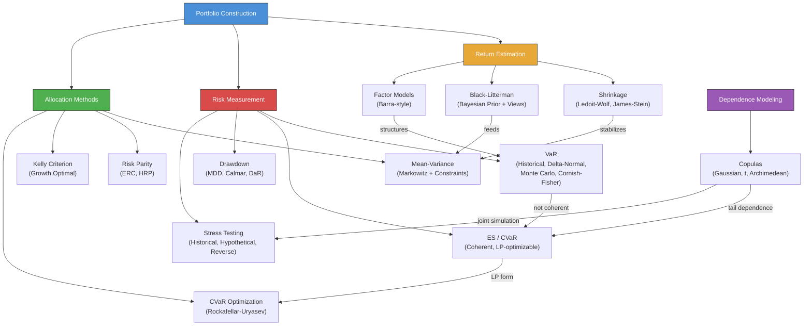

# Module 24: Risk Management & Portfolio Theory

> **Prerequisites:** Modules 01 (Linear Algebra), 02 (Probability & Stochastic Processes), 06 (Optimization), 17 (Factor Models)
> **Builds toward:** Modules 25 (Derivatives Pricing II), 30 (Systematic Trading Systems), 31 (High-Frequency Trading), 32 (Portfolio Construction)

---

## Table of Contents

1. [Mean-Variance Optimization Revisited](#1-mean-variance-optimization-revisited)
2. [Shrinkage Estimators](#2-shrinkage-estimators)
3. [Black-Litterman Model](#3-black-litterman-model)
4. [Value at Risk (VaR)](#4-value-at-risk-var)
5. [Expected Shortfall / CVaR](#5-expected-shortfall--cvar)
6. [Risk Parity](#6-risk-parity)
7. [Kelly Criterion](#7-kelly-criterion)
8. [Copulas](#8-copulas)
9. [Stress Testing](#9-stress-testing)
10. [Factor Risk Models](#10-factor-risk-models)
11. [Drawdown Analysis](#11-drawdown-analysis)
12. [Implementation: Python](#12-implementation-python)
13. [Implementation: C++](#13-implementation-c)
14. [Exercises](#14-exercises)
15. [Summary & Concept Map](#15-summary--concept-map)

---

## 1. Mean-Variance Optimization Revisited

### 1.1 The Markowitz Framework with Constraints

Recall the classical mean-variance problem. Given $n$ assets with expected return vector $\boldsymbol{\mu} \in \mathbb{R}^n$ and covariance matrix $\Sigma \in \mathbb{R}^{n \times n}$, the investor selects weights $\mathbf{w}$ to:

$$\min_{\mathbf{w}} \quad \frac{1}{2} \mathbf{w}^\top \Sigma \mathbf{w}$$

$$\text{s.t.} \quad \mathbf{w}^\top \boldsymbol{\mu} \geq \mu_{\text{target}}, \quad \mathbf{1}^\top \mathbf{w} = 1$$

In practice, additional constraints are essential:

- **Long-only:** $w_i \geq 0$ for all $i$.
- **Box constraints:** $l_i \leq w_i \leq u_i$ (position limits).
- **Sector/group constraints:** $\sum_{i \in G_k} w_i \leq U_k$ for sector group $G_k$.
- **Turnover constraints:** $\sum_i |w_i - w_i^{\text{current}}| \leq \Delta_{\max}$.
- **Tracking error:** $(\mathbf{w} - \mathbf{w}_b)^\top \Sigma (\mathbf{w} - \mathbf{w}_b) \leq \text{TE}_{\max}^2$.

With these constraints, the problem becomes a **quadratic program (QP)**, solvable via standard convex optimization.

### 1.2 The Estimation Error Problem

The critical flaw in naive Markowitz optimization is **sensitivity to estimation error** in $\boldsymbol{\mu}$ and $\Sigma$. With $n$ assets and $T$ observations:

- $\boldsymbol{\mu}$ requires estimating $n$ parameters.
- $\Sigma$ requires estimating $n(n+1)/2$ parameters.

For $n = 500$ and $T = 60$ monthly returns, we estimate 125,250 covariance parameters from 30,000 data points -- a severely underdetermined problem. The sample covariance matrix $\hat{\Sigma}$ is **singular** when $T < n$, and even when $T > n$, the smallest eigenvalues are biased downward (and largest upward), leading to extreme, unstable portfolio weights.

Michaud (1989) showed that mean-variance optimization effectively **maximizes estimation error** -- it overweights assets with overestimated returns and underestimated risk, and vice versa.

---

## 2. Shrinkage Estimators

### 2.1 Ledoit-Wolf Shrinkage

Ledoit and Wolf (2004) propose shrinking the sample covariance matrix toward a structured target to reduce estimation error.

**Shrinkage estimator:**

$$\hat{\Sigma}_{\text{LW}} = (1 - \alpha^*) \hat{\Sigma} + \alpha^* \mathbf{F}$$

where $\hat{\Sigma}$ is the sample covariance, $\mathbf{F}$ is a structured target matrix (e.g., scaled identity $\bar{\sigma}^2 \mathbf{I}$, single-factor model, or constant-correlation model), and $\alpha^* \in [0, 1]$ is the optimal shrinkage intensity.

### 2.2 Derivation of Optimal Shrinkage Intensity

The goal is to minimize the expected loss (Frobenius norm):

$$\mathcal{L}(\alpha) = \mathbb{E}\left[\| (1-\alpha)\hat{\Sigma} + \alpha \mathbf{F} - \Sigma \|_F^2\right]$$

Expanding:

$$\mathcal{L}(\alpha) = \mathbb{E}\left[\|(1-\alpha)(\hat{\Sigma} - \Sigma) + \alpha(\mathbf{F} - \Sigma)\|_F^2\right]$$

$$= (1-\alpha)^2 \underbrace{\mathbb{E}[\|\hat{\Sigma} - \Sigma\|_F^2]}_{\pi} + \alpha^2 \underbrace{\|\mathbf{F} - \Sigma\|_F^2}_{\rho} - 2\alpha(1-\alpha)\underbrace{\mathbb{E}[\langle \hat{\Sigma} - \Sigma, \mathbf{F} - \Sigma \rangle]}_{\gamma}$$

Define:
- $\pi = \sum_{i,j} \text{Var}(\hat{\sigma}_{ij})$: the sum of variances of sample covariance entries (measures estimation noise).
- $\rho = \|\mathbf{F} - \Sigma\|_F^2$: the squared bias of the target.

Taking $\frac{d\mathcal{L}}{d\alpha} = 0$ and solving:

$$\boxed{\alpha^* = \frac{\pi - \gamma}{\pi + \rho - 2\gamma}}$$

When $\gamma = 0$ (target independent of estimation error), this simplifies to:

$$\alpha^* = \frac{\pi}{\pi + \rho}$$

**Intuition:** When estimation noise $\pi$ is large relative to target bias $\rho$, we shrink more ($\alpha^* \to 1$). When $\pi$ is small, we trust the sample estimate ($\alpha^* \to 0$). In practice, $\pi$ and $\rho$ are estimated from the data; Ledoit-Wolf provide a consistent estimator of $\alpha^*$ that requires no simulation.

### 2.3 James-Stein Estimator for Expected Returns

The James-Stein (1961) estimator shrinks the sample mean toward a common value:

$$\hat{\boldsymbol{\mu}}_{\text{JS}} = \left(1 - \frac{(n-2)\hat{\sigma}^2}{T \|\bar{\mathbf{r}} - \mu_0 \mathbf{1}\|^2}\right)(\bar{\mathbf{r}} - \mu_0 \mathbf{1}) + \mu_0 \mathbf{1}$$

where $\bar{\mathbf{r}}$ is the sample mean vector, $\mu_0$ is the grand mean, and $\hat{\sigma}^2$ is a pooled variance estimate. This dominates the sample mean in terms of total squared error for $n \geq 3$.

---

## 3. Black-Litterman Model

### 3.1 Motivation

The Black-Litterman (1992) model solves two key problems with Markowitz optimization:

1. **No views, extreme weights:** Without strong expected return estimates, MVO produces degenerate portfolios. BL uses **market equilibrium returns** as a neutral starting point.
2. **Incorporating subjective views:** BL provides a principled Bayesian framework to blend quantitative signals with the market prior.

### 3.2 Equilibrium Returns (Prior)

Assume the market portfolio $\mathbf{w}_{\text{mkt}}$ is the mean-variance optimal portfolio under some implied expected returns $\boldsymbol{\Pi}$. From the first-order condition of unconstrained MVO:

$$\boldsymbol{\Pi} = \delta \Sigma \mathbf{w}_{\text{mkt}}$$

where $\delta$ is the risk aversion coefficient (typically estimated as $\delta = (\mathbb{E}[r_m] - r_f) / \sigma_m^2 \approx 2\text{--}4$).

The **prior distribution** on expected returns is:

$$\boldsymbol{\mu} \sim \mathcal{N}(\boldsymbol{\Pi}, \tau \Sigma)$$

where $\tau > 0$ is a scaling parameter reflecting uncertainty about the equilibrium (typically $\tau \approx 0.025\text{--}0.05$). Note this is uncertainty about the **mean**, not about returns themselves.

### 3.3 Investor Views (Likelihood)

An investor expresses $K$ views of the form:

$$\mathbf{P} \boldsymbol{\mu} = \mathbf{q} + \boldsymbol{\varepsilon}, \quad \boldsymbol{\varepsilon} \sim \mathcal{N}(\mathbf{0}, \boldsymbol{\Omega})$$

where:
- $\mathbf{P} \in \mathbb{R}^{K \times n}$: **pick matrix** encoding which assets each view involves.
- $\mathbf{q} \in \mathbb{R}^K$: **view vector** of expected excess returns.
- $\boldsymbol{\Omega} \in \mathbb{R}^{K \times K}$: **view uncertainty matrix** (diagonal if views are independent).

**Example views:**

| View | $\mathbf{P}$ row | $q$ |
|---|---|---|
| "Stock A returns 5%" | $[0, \ldots, 1, \ldots, 0]$ | 0.05 |
| "Stock B outperforms Stock C by 2%" | $[0, \ldots, 1, \ldots, -1, \ldots, 0]$ | 0.02 |

The likelihood function is:

$$p(\mathbf{q} \mid \boldsymbol{\mu}) \propto \exp\left(-\frac{1}{2}(\mathbf{q} - \mathbf{P}\boldsymbol{\mu})^\top \boldsymbol{\Omega}^{-1} (\mathbf{q} - \mathbf{P}\boldsymbol{\mu})\right)$$

### 3.4 Full Bayesian Derivation of Posterior

**Prior:** $\boldsymbol{\mu} \sim \mathcal{N}(\boldsymbol{\Pi}, \tau\Sigma)$

**Likelihood:** $\mathbf{q} \mid \boldsymbol{\mu} \sim \mathcal{N}(\mathbf{P}\boldsymbol{\mu}, \boldsymbol{\Omega})$

By the standard Bayesian conjugate update for multivariate normals:

$$p(\boldsymbol{\mu} \mid \mathbf{q}) \propto p(\mathbf{q} \mid \boldsymbol{\mu}) \cdot p(\boldsymbol{\mu})$$

$$\propto \exp\left(-\frac{1}{2}\left[(\boldsymbol{\mu} - \boldsymbol{\Pi})^\top (\tau\Sigma)^{-1} (\boldsymbol{\mu} - \boldsymbol{\Pi}) + (\mathbf{q} - \mathbf{P}\boldsymbol{\mu})^\top \boldsymbol{\Omega}^{-1} (\mathbf{q} - \mathbf{P}\boldsymbol{\mu})\right]\right)$$

Completing the square in $\boldsymbol{\mu}$:

The posterior precision (inverse covariance) is:

$$\boldsymbol{\Lambda}_{\text{post}} = (\tau \Sigma)^{-1} + \mathbf{P}^\top \boldsymbol{\Omega}^{-1} \mathbf{P}$$

The posterior mean satisfies:

$$\boldsymbol{\Lambda}_{\text{post}} \hat{\boldsymbol{\mu}}_{\text{BL}} = (\tau\Sigma)^{-1}\boldsymbol{\Pi} + \mathbf{P}^\top \boldsymbol{\Omega}^{-1} \mathbf{q}$$

Therefore the **posterior distribution** is:

$$\boldsymbol{\mu} \mid \mathbf{q} \sim \mathcal{N}(\hat{\boldsymbol{\mu}}_{\text{BL}}, \hat{\Sigma}_{\text{BL}})$$

where:

$$\boxed{\hat{\boldsymbol{\mu}}_{\text{BL}} = \left[(\tau\Sigma)^{-1} + \mathbf{P}^\top \boldsymbol{\Omega}^{-1} \mathbf{P}\right]^{-1} \left[(\tau\Sigma)^{-1}\boldsymbol{\Pi} + \mathbf{P}^\top \boldsymbol{\Omega}^{-1} \mathbf{q}\right]}$$

$$\boxed{\hat{\Sigma}_{\text{BL}} = \left[(\tau\Sigma)^{-1} + \mathbf{P}^\top \boldsymbol{\Omega}^{-1} \mathbf{P}\right]^{-1}}$$

**Equivalent form** (using Woodbury identity, computationally preferred when $K \ll n$):

$$\hat{\boldsymbol{\mu}}_{\text{BL}} = \boldsymbol{\Pi} + \tau \Sigma \mathbf{P}^\top \left(\mathbf{P} \tau \Sigma \mathbf{P}^\top + \boldsymbol{\Omega}\right)^{-1}(\mathbf{q} - \mathbf{P}\boldsymbol{\Pi})$$

**Interpretation:** The BL expected return is the equilibrium return $\boldsymbol{\Pi}$ **tilted** toward the investor's views. The tilt magnitude depends on:
- View confidence ($\boldsymbol{\Omega}^{-1}$ large = confident views = more tilt).
- Prior uncertainty ($\tau$ large = less confident in equilibrium = more tilt toward views).
- The term $(\mathbf{q} - \mathbf{P}\boldsymbol{\Pi})$ is the **view surprise** -- how much views differ from equilibrium. Zero surprise means no adjustment.

### 3.5 Portfolio Weights

The BL optimal portfolio is obtained by plugging $\hat{\boldsymbol{\mu}}_{\text{BL}}$ into the MVO framework:

$$\mathbf{w}_{\text{BL}} = (\delta \Sigma)^{-1} \hat{\boldsymbol{\mu}}_{\text{BL}}$$

This produces intuitive, stable portfolios that deviate from market-cap weights only in the direction of the investor's views, proportional to view confidence.

---

## 4. Value at Risk (VaR)

### 4.1 Definition

**Value at Risk** at confidence level $\alpha$ (e.g., 99%) over horizon $h$ is the loss threshold such that:

$$\Pr(L > \text{VaR}_\alpha) = 1 - \alpha$$

Equivalently, $\text{VaR}_\alpha = -F_L^{-1}(1 - \alpha)$ where $F_L$ is the CDF of portfolio losses.

### 4.2 Historical Simulation

Order the last $T$ portfolio returns $r_1, \ldots, r_T$ and take the $(1-\alpha)$-quantile:

$$\text{VaR}_\alpha^{\text{HS}} = -r_{(\lfloor T(1-\alpha) \rfloor)}$$

**Advantages:** Non-parametric, captures fat tails. **Disadvantages:** Requires long history, all observations equally weighted (EWMA-weighted variant helps).

### 4.3 Parametric (Delta-Normal)

Assume portfolio returns are $r_p \sim \mathcal{N}(\mu_p, \sigma_p^2)$:

$$\text{VaR}_\alpha = -\mu_p + z_\alpha \sigma_p$$

where $z_\alpha = \Phi^{-1}(\alpha)$ (e.g., $z_{0.99} = 2.326$). For a portfolio with weights $\mathbf{w}$:

$$\sigma_p = \sqrt{\mathbf{w}^\top \Sigma \mathbf{w}}$$

### 4.4 Delta-Gamma VaR (Cornish-Fisher Expansion)

For portfolios with options or other nonlinear positions, the P&L is approximated as:

$$\Delta P \approx \boldsymbol{\delta}^\top \Delta \mathbf{S} + \frac{1}{2} \Delta \mathbf{S}^\top \boldsymbol{\Gamma} \Delta \mathbf{S}$$

where $\boldsymbol{\delta}$ is the delta vector and $\boldsymbol{\Gamma}$ is the gamma matrix. The distribution of $\Delta P$ is no longer Gaussian. The **Cornish-Fisher expansion** adjusts the quantile:

$$z_{\text{CF}} = z_\alpha + \frac{1}{6}(z_\alpha^2 - 1)S_3 + \frac{1}{24}(z_\alpha^3 - 3z_\alpha)S_4 - \frac{1}{36}(2z_\alpha^3 - 5z_\alpha)S_3^2$$

where $S_3$ (skewness) and $S_4$ (excess kurtosis) are computed from the moments of $\Delta P$.

$$\text{VaR}_\alpha^{\text{CF}} = -\mu_{\Delta P} + z_{\text{CF}} \cdot \sigma_{\Delta P}$$

### 4.5 Monte Carlo VaR

1. Simulate $M$ scenarios for risk factor changes $\Delta \mathbf{S}^{(m)}$ from an estimated joint distribution.
2. Revalue the portfolio under each scenario: $P^{(m)} = f(\mathbf{S}_0 + \Delta \mathbf{S}^{(m)})$.
3. Compute P&L: $\Delta P^{(m)} = P^{(m)} - P_0$.
4. $\text{VaR}_\alpha^{\text{MC}} = -\text{quantile}_{1-\alpha}(\{\Delta P^{(m)}\}_{m=1}^M)$.

Monte Carlo VaR handles nonlinear positions, exotic payoffs, and complex dependency structures, but is computationally expensive.

---

## 5. Expected Shortfall / CVaR

### 5.1 Definition

**Expected Shortfall** (ES), also called **Conditional VaR (CVaR)**, is the expected loss conditional on exceeding VaR:

$$\text{ES}_\alpha = \mathbb{E}[L \mid L > \text{VaR}_\alpha]$$

For continuous distributions:

$$\text{ES}_\alpha = \frac{1}{1-\alpha} \int_\alpha^1 \text{VaR}_u \, du$$

Under normality: $\text{ES}_\alpha = \mu_p + \sigma_p \cdot \frac{\phi(z_\alpha)}{1 - \alpha}$, where $\phi$ is the standard normal PDF.

### 5.2 Coherent Risk Measure Properties

A risk measure $\rho$ is **coherent** (Artzner et al., 1999) if it satisfies:

1. **Monotonicity:** If $X \leq Y$ a.s., then $\rho(X) \geq \rho(Y)$.
2. **Translation invariance:** $\rho(X + c) = \rho(X) - c$.
3. **Positive homogeneity:** $\rho(\lambda X) = \lambda \rho(X)$ for $\lambda > 0$.
4. **Subadditivity:** $\rho(X + Y) \leq \rho(X) + \rho(Y)$.

**VaR fails subadditivity** (diversification can increase VaR in pathological cases). ES satisfies all four.

### 5.3 Proof of Subadditivity for ES

We prove that $\text{ES}_\alpha(X + Y) \leq \text{ES}_\alpha(X) + \text{ES}_\alpha(Y)$.

Using the Rockafellar-Uryasev representation:

$$\text{ES}_\alpha(X) = \min_{v \in \mathbb{R}} \left\{v + \frac{1}{1-\alpha}\mathbb{E}[\max(-X - v, 0)]\right\}$$

Let $v_X^*$ and $v_Y^*$ be the minimizers for $X$ and $Y$ respectively. Then for $X + Y$, using $v = v_X^* + v_Y^*$:

$$\text{ES}_\alpha(X+Y) \leq (v_X^* + v_Y^*) + \frac{1}{1-\alpha}\mathbb{E}[\max(-(X+Y) - v_X^* - v_Y^*, 0)]$$

Since $\max(a + b, 0) \leq \max(a, 0) + \max(b, 0)$ for all $a, b \in \mathbb{R}$:

$$\max(-(X+Y) - v_X^* - v_Y^*, 0) \leq \max(-X - v_X^*, 0) + \max(-Y - v_Y^*, 0)$$

Therefore:

$$\text{ES}_\alpha(X+Y) \leq \left(v_X^* + \frac{1}{1-\alpha}\mathbb{E}[\max(-X-v_X^*,0)]\right) + \left(v_Y^* + \frac{1}{1-\alpha}\mathbb{E}[\max(-Y-v_Y^*,0)]\right)$$

$$= \text{ES}_\alpha(X) + \text{ES}_\alpha(Y) \qquad \blacksquare$$

### 5.4 CVaR Optimization via Rockafellar-Uryasev

The CVaR-minimizing portfolio can be computed as a **linear program**:

$$\min_{\mathbf{w}, v, \mathbf{u}} \quad v + \frac{1}{M(1-\alpha)} \sum_{m=1}^{M} u_m$$

$$\text{s.t.} \quad u_m \geq -\mathbf{w}^\top \mathbf{r}^{(m)} - v, \quad u_m \geq 0, \quad \forall m = 1, \ldots, M$$

$$\mathbf{1}^\top \mathbf{w} = 1, \quad \mathbf{w}^\top \boldsymbol{\mu} \geq \mu_{\text{target}}$$

where $\mathbf{r}^{(m)}$ are historical or simulated return scenarios. This is a linear program in $(\mathbf{w}, v, \mathbf{u})$, making it tractable for large portfolios.

---

## 6. Risk Parity

### 6.1 Equal Risk Contribution (ERC)

In a risk parity portfolio, each asset contributes equally to total portfolio risk. Define the **risk contribution** of asset $i$:

$$\text{RC}_i = w_i \cdot \frac{(\Sigma \mathbf{w})_i}{\sqrt{\mathbf{w}^\top \Sigma \mathbf{w}}} = w_i \cdot \frac{\partial \sigma_p}{\partial w_i}$$

Note that $\sum_i \text{RC}_i = \sigma_p$ (Euler decomposition). The **ERC condition** requires:

$$\text{RC}_i = \text{RC}_j \quad \forall \, i, j$$

$$\Leftrightarrow \quad w_i (\Sigma \mathbf{w})_i = w_j (\Sigma \mathbf{w})_j \quad \forall \, i, j$$

This is a system of nonlinear equations, solvable iteratively. Equivalently, minimize:

$$\min_{\mathbf{w}} \sum_{i=1}^{n} \sum_{j=1}^{n} \left(w_i (\Sigma \mathbf{w})_i - w_j (\Sigma \mathbf{w})_j\right)^2 \quad \text{s.t.} \quad \mathbf{w} \geq 0, \; \mathbf{1}^\top \mathbf{w} = 1$$

### 6.2 Inverse Volatility

A simpler approximation that ignores correlations:

$$w_i = \frac{1/\sigma_i}{\sum_j 1/\sigma_j}$$

This is exact ERC only when correlations are uniform ($\rho_{ij} = \rho$ for all $i \neq j$).

### 6.3 Hierarchical Risk Parity (HRP)

Lopez de Prado (2016) proposed HRP to address instability in traditional risk parity. The algorithm:

**Step 1: Tree Clustering.** Compute the correlation-based distance matrix:

$$d_{ij} = \sqrt{\frac{1}{2}(1 - \rho_{ij})}$$

Apply hierarchical (agglomerative) clustering using single/complete/ward linkage.

**Step 2: Quasi-Diagonalization.** Reorder the covariance matrix rows/columns to place correlated assets adjacent, following the dendrogram leaf order.

**Step 3: Recursive Bisection.** Split the sorted asset list into two halves at each dendrogram branch. Allocate between halves using inverse variance:

$$\alpha = 1 - \frac{\tilde{V}_1}{\tilde{V}_1 + \tilde{V}_2}, \quad w_{\text{left}} = \alpha, \quad w_{\text{right}} = 1 - \alpha$$

where $\tilde{V}_k$ is the variance of the cluster $k$ (using inverse-variance weights within each cluster). Recurse until individual assets are reached.

**Advantages of HRP:** Does not require covariance matrix inversion (works when $T < n$), produces stable and diversified allocations, and naturally respects hierarchical correlation structure.

---

## 7. Kelly Criterion

### 7.1 Single Bet Derivation

Consider a gamble with probability $p$ of winning $b$ dollars per dollar bet, and probability $q = 1-p$ of losing the dollar bet. If we bet fraction $f$ of wealth, after one round:

$$W_1 = W_0 \cdot [(1 + fb) \text{ w.p. } p, \; (1 - f) \text{ w.p. } q]$$

The expected log-growth rate is:

$$g(f) = \mathbb{E}[\ln(W_1/W_0)] = p \ln(1 + fb) + q \ln(1 - f)$$

Maximizing over $f$:

$$g'(f) = \frac{pb}{1+fb} - \frac{q}{1-f} = 0$$

$$pb(1-f) = q(1+fb)$$

$$pb - pbf = q + qfb$$

$$pb - q = fb(p + q) = fb$$

$$\boxed{f^* = \frac{pb - q}{b} = \frac{p(b+1) - 1}{b}}$$

This is the **Kelly fraction** -- the bet size that maximizes long-run wealth growth rate.

### 7.2 Multi-Asset Kelly (Continuous Case)

For $n$ assets with return vector $\mathbf{r} \sim (\boldsymbol{\mu}, \Sigma)$ over a single period, the portfolio return is $r_p = \mathbf{f}^\top \mathbf{r}$. Maximizing the expected log-wealth:

$$\max_{\mathbf{f}} \mathbb{E}[\ln(1 + \mathbf{f}^\top \mathbf{r})]$$

For small positions (continuous approximation via Taylor expansion of $\ln(1+x) \approx x - x^2/2$):

$$\mathbb{E}[\ln(1 + \mathbf{f}^\top \mathbf{r})] \approx \mathbf{f}^\top \boldsymbol{\mu} - \frac{1}{2}\mathbf{f}^\top \Sigma \mathbf{f}$$

The first-order condition gives:

$$\boxed{\mathbf{f}^* = \Sigma^{-1} \boldsymbol{\mu}}$$

This is the **full Kelly portfolio** -- identical to the tangency portfolio of mean-variance optimization with risk aversion $\gamma = 1$ (and $r_f = 0$).

### 7.3 Fractional Kelly

Full Kelly is aggressive and leads to high volatility (volatility $\sim \sigma_p = \sqrt{\boldsymbol{\mu}^\top \Sigma^{-1} \boldsymbol{\mu}}$). **Fractional Kelly** scales down:

$$\mathbf{f}_{\text{frac}} = \frac{1}{\gamma} \Sigma^{-1} \boldsymbol{\mu}, \quad \gamma > 1$$

Common practice: $\gamma = 2$ (half-Kelly). This sacrifices approximately 25% of log-growth in exchange for halving the variance, which substantially reduces drawdown risk.

---

## 8. Copulas

### 8.1 Sklar's Theorem

For any $n$-dimensional joint CDF $F(x_1, \ldots, x_n)$ with marginals $F_1, \ldots, F_n$, there exists a copula $C: [0,1]^n \to [0,1]$ such that:

$$F(x_1, \ldots, x_n) = C(F_1(x_1), \ldots, F_n(x_n))$$

If the marginals are continuous, $C$ is unique. This separates **dependence structure** (copula) from **marginal behavior**.

### 8.2 Gaussian Copula

The Gaussian copula with correlation matrix $\mathbf{R}$ is:

$$C_R^{\text{Ga}}(u_1, \ldots, u_n) = \Phi_R(\Phi^{-1}(u_1), \ldots, \Phi^{-1}(u_n))$$

where $\Phi_R$ is the CDF of the multivariate normal with correlation matrix $\mathbf{R}$, and $\Phi^{-1}$ is the univariate standard normal quantile function.

### 8.3 Student-t Copula

The $t$-copula with $\nu$ degrees of freedom and correlation matrix $\mathbf{R}$:

$$C_{\nu,R}^{t}(u_1, \ldots, u_n) = t_{\nu,R}(t_\nu^{-1}(u_1), \ldots, t_\nu^{-1}(u_n))$$

where $t_{\nu,R}$ is the CDF of the multivariate $t$-distribution and $t_\nu^{-1}$ is the univariate $t$-quantile.

### 8.4 Archimedean Copulas (Bivariate)

Archimedean copulas have the form $C(u,v) = \varphi^{-1}(\varphi(u) + \varphi(v))$ where $\varphi$ is a generator function.

| Family | Generator $\varphi(t)$ | $C(u,v)$ | Tail dependence |
|---|---|---|---|
| **Clayton** | $\frac{1}{\theta}(t^{-\theta} - 1)$ | $(u^{-\theta} + v^{-\theta} - 1)^{-1/\theta}$ | Lower: $2^{-1/\theta}$, Upper: 0 |
| **Frank** | $-\ln\frac{e^{-\theta t} - 1}{e^{-\theta} - 1}$ | $-\frac{1}{\theta}\ln\left(1 + \frac{(e^{-\theta u}-1)(e^{-\theta v}-1)}{e^{-\theta}-1}\right)$ | None (symmetric) |
| **Gumbel** | $(-\ln t)^\theta$ | $\exp(-((-\ln u)^\theta + (-\ln v)^\theta)^{1/\theta})$ | Lower: 0, Upper: $2 - 2^{1/\theta}$ |

### 8.5 Tail Dependence: Gaussian vs. t-Copula

**Tail dependence coefficient** (upper):

$$\lambda_U = \lim_{u \to 1^-} \Pr(U_2 > u \mid U_1 > u)$$

**Theorem (Gaussian copula has zero tail dependence):**

For the bivariate Gaussian copula with $|\rho| < 1$:

$$\lambda_U^{\text{Ga}} = \lim_{u \to 1^-} \frac{1 - 2u + C_\rho^{\text{Ga}}(u,u)}{1-u}$$

Using the expansion of the bivariate normal near the boundary and L'Hopital's rule:

$$\lambda_U^{\text{Ga}} = 2 \lim_{x \to \infty} \Pr\left(Z_2 > x \mid Z_1 > x\right) = 2 \lim_{x \to \infty} \frac{\bar{\Phi}_\rho(x,x)}{\bar{\Phi}(x)}$$

For any $|\rho| < 1$, as $x \to \infty$, the bivariate normal tail decays faster than the marginal tail:

$$\boxed{\lambda_U^{\text{Ga}} = 0 \quad \text{for } |\rho| < 1}$$

**Theorem (t-copula has positive tail dependence):**

For the bivariate $t$-copula with $\nu$ degrees of freedom and correlation $\rho$:

$$\boxed{\lambda_U^{t} = 2 \, t_{\nu+1}\left(-\sqrt{\frac{(\nu+1)(1-\rho)}{1+\rho}}\right) > 0}$$

This is strictly positive for all finite $\nu$ and $|\rho| < 1$. As $\nu \to \infty$, $\lambda_U^t \to 0$ (converging to the Gaussian case). Lower $\nu$ (heavier tails) and higher $\rho$ both increase tail dependence.

**Implication:** The Gaussian copula **underestimates** the probability of joint extreme events. The $t$-copula captures **tail dependence** -- the empirical phenomenon that assets crash together more often than the Gaussian model predicts. This was a critical failing in CDO pricing pre-2008.

---

## 9. Stress Testing

### 9.1 Historical Stress Scenarios

Apply the factor returns from specific crisis periods to the current portfolio:

| Scenario | Period | Key features |
|---|---|---|
| Black Monday | Oct 1987 | Equities -22%, VIX spike |
| LTCM/Russian Crisis | Aug-Oct 1998 | Credit spreads +400bp, equities -20% |
| Global Financial Crisis | Sep-Nov 2008 | Equities -40%, credit spreads +600bp |
| COVID Crash | Feb-Mar 2020 | Equities -34%, oil -65%, rates -150bp |

Compute $\Delta P = \sum_k \delta_k \cdot \Delta S_k^{\text{scenario}} + \frac{1}{2}\sum_k \gamma_k (\Delta S_k^{\text{scenario}})^2$ for the current portfolio sensitivities.

### 9.2 Hypothetical Scenarios

Construct custom scenarios not observed historically: e.g., simultaneous 20% equity decline, 200bp rate rise, and 50% oil spike. Designed to test specific portfolio vulnerabilities.

### 9.3 Reverse Stress Testing

Find the scenario that causes a specific loss threshold (e.g., portfolio loss exceeding regulatory capital):

$$\min_{\Delta \mathbf{S}} \|\Delta \mathbf{S}\|^2 \quad \text{s.t.} \quad \text{Loss}(\Delta \mathbf{S}) \geq L_{\text{threshold}}$$

This identifies the **most plausible** catastrophic scenario.

---

## 10. Factor Risk Models

### 10.1 Barra-Style Models

The return of asset $i$ is decomposed:

$$r_i = \sum_{k=1}^{K} \beta_{ik} f_k + \epsilon_i$$

where $f_k$ are factor returns and $\epsilon_i$ is asset-specific (idiosyncratic) return with $\text{Cov}(\epsilon_i, \epsilon_j) = 0$ for $i \neq j$.

The covariance matrix decomposes as:

$$\Sigma = \mathbf{B} \Sigma_f \mathbf{B}^\top + \mathbf{D}$$

where $\mathbf{B}$ is the $n \times K$ factor loading matrix, $\Sigma_f$ is the $K \times K$ factor covariance, and $\mathbf{D} = \text{diag}(\sigma_{\epsilon_1}^2, \ldots, \sigma_{\epsilon_n}^2)$ is the diagonal specific risk matrix.

**Advantages:** Reduces dimensionality from $O(n^2)$ to $O(nK + K^2)$. For $n = 3000$ stocks and $K = 50$ factors: 4.5M parameters to 152,775 -- a 30x reduction.

### 10.2 Factor Types

- **Statistical factors:** Extracted via PCA from the return covariance matrix.
- **Fundamental factors:** Industry, size, value, momentum, volatility, etc. Exposures from accounting data.
- **Macroeconomic factors:** Interest rates, inflation, GDP growth. Exposures from regression.

---

## 11. Drawdown Analysis

### 11.1 Maximum Drawdown

For a cumulative return path $W(t)$:

$$\text{DD}(t) = \frac{W(t) - \max_{s \leq t} W(s)}{\max_{s \leq t} W(s)}, \quad \text{MDD} = \max_t |\text{DD}(t)|$$

Maximum drawdown is the largest peak-to-trough decline and captures the worst-case investor experience.

### 11.2 Calmar Ratio

$$\text{Calmar} = \frac{\text{Annualized Return}}{\text{Maximum Drawdown}}$$

A Calmar ratio above 1 is generally considered good; above 2 is excellent. Unlike the Sharpe ratio, it focuses on **tail risk** rather than symmetric volatility.

### 11.3 Drawdown-at-Risk (DaR)

Analogous to VaR but for drawdowns: the $\alpha$-quantile of the drawdown distribution:

$$\Pr(\text{DD} > \text{DaR}_\alpha) = 1 - \alpha$$

**Conditional Drawdown-at-Risk (CDaR):** $\mathbb{E}[\text{DD} \mid \text{DD} > \text{DaR}_\alpha]$, analogous to CVaR. CDaR-constrained portfolio optimization follows the same LP structure as CVaR optimization.

---

## 12. Implementation: Python

### 12.1 Black-Litterman

```python
"""
black_litterman.py
Full Black-Litterman implementation with flexible view specification.
"""
import numpy as np
from numpy.typing import NDArray
from dataclasses import dataclass


@dataclass
class BLResult:
    mu_bl: NDArray            # Posterior expected returns
    sigma_bl: NDArray         # Posterior covariance of expected returns
    weights: NDArray          # Optimal weights
    equilibrium_returns: NDArray  # Prior (Pi)


def black_litterman(
    Sigma: NDArray,
    market_weights: NDArray,
    P: NDArray,
    Q: NDArray,
    Omega: NDArray,
    delta: float = 2.5,
    tau: float = 0.05,
    risk_free: float = 0.0
) -> BLResult:
    """
    Black-Litterman model.

    Parameters
    ----------
    Sigma : (n, n) asset covariance matrix
    market_weights : (n,) market-cap weights
    P : (K, n) pick matrix encoding views
    Q : (K,) view expected returns
    Omega : (K, K) view uncertainty matrix
    delta : risk aversion parameter
    tau : uncertainty scaling on prior
    risk_free : risk-free rate

    Returns
    -------
    BLResult with posterior returns, covariance, and optimal weights
    """
    n = len(market_weights)

    # Step 1: Implied equilibrium returns
    Pi = delta * Sigma @ market_weights

    # Step 2: Posterior (using Woodbury-equivalent form for efficiency)
    tau_Sigma = tau * Sigma
    tau_Sigma_inv = np.linalg.inv(tau_Sigma)

    # Precision form: M = (tau*Sigma)^{-1} + P' Omega^{-1} P
    Omega_inv = np.linalg.inv(Omega)
    M = tau_Sigma_inv + P.T @ Omega_inv @ P
    M_inv = np.linalg.inv(M)  # Posterior covariance

    # Posterior mean
    mu_bl = M_inv @ (tau_Sigma_inv @ Pi + P.T @ Omega_inv @ Q)

    # Step 3: Optimal weights
    weights = np.linalg.solve(delta * Sigma, mu_bl)

    return BLResult(
        mu_bl=mu_bl,
        sigma_bl=M_inv,
        weights=weights,
        equilibrium_returns=Pi
    )


def compute_omega_proportional(P: NDArray, Sigma: NDArray,
                                tau: float) -> NDArray:
    """Omega = diag(P * tau * Sigma * P'), Idzorek's method."""
    return np.diag(np.diag(P @ (tau * Sigma) @ P.T))
```

### 12.2 CVaR Optimization

```python
"""
cvar_optimization.py
Portfolio CVaR minimization via Rockafellar-Uryasev LP formulation.
"""
import numpy as np
from scipy.optimize import linprog
from numpy.typing import NDArray


def cvar_portfolio(
    returns: NDArray,
    alpha: float = 0.95,
    mu_target: float | None = None,
    long_only: bool = True
) -> dict:
    """
    Minimize CVaR at confidence level alpha via LP.

    Parameters
    ----------
    returns : (M, n) matrix of M scenarios for n assets
    alpha : confidence level (e.g. 0.95)
    mu_target : minimum expected return constraint (optional)
    long_only : enforce w >= 0

    Returns
    -------
    dict with 'weights', 'cvar', 'var'
    """
    M, n = returns.shape

    # Decision variables: [w(n), v(1), u(M)]
    # Minimize: v + 1/(M*(1-alpha)) * sum(u)
    c = np.zeros(n + 1 + M)
    c[n] = 1.0                              # v coefficient
    c[n+1:] = 1.0 / (M * (1 - alpha))      # u coefficients

    # Inequality: u_m >= -w'r_m - v  =>  w'r_m + v + u_m >= 0
    # Rewrite: -r_m' w - v - u_m <= 0
    A_ub_rows = []
    b_ub_rows = []

    for m in range(M):
        row = np.zeros(n + 1 + M)
        row[:n] = -returns[m]     # -r_m' w
        row[n] = -1.0             # -v
        row[n + 1 + m] = -1.0    # -u_m
        A_ub_rows.append(row)
        b_ub_rows.append(0.0)

    A_ub = np.array(A_ub_rows)
    b_ub = np.array(b_ub_rows)

    # Equality: sum(w) = 1
    A_eq = np.zeros((1, n + 1 + M))
    A_eq[0, :n] = 1.0
    b_eq = np.array([1.0])

    # Optional return constraint: w' mu >= mu_target
    if mu_target is not None:
        mu = returns.mean(axis=0)
        row = np.zeros(n + 1 + M)
        row[:n] = -mu   # -mu' w <= -mu_target
        A_ub = np.vstack([A_ub, row])
        b_ub = np.append(b_ub, -mu_target)

    # Bounds
    bounds = []
    for i in range(n):
        lb = 0.0 if long_only else -1.0
        bounds.append((lb, 1.0))
    bounds.append((None, None))  # v unbounded
    for _ in range(M):
        bounds.append((0.0, None))  # u >= 0

    result = linprog(c, A_ub=A_ub, b_ub=b_ub, A_eq=A_eq, b_eq=b_eq,
                     bounds=bounds, method='highs')

    if not result.success:
        raise RuntimeError(f"Optimization failed: {result.message}")

    w = result.x[:n]
    var_val = result.x[n]
    cvar_val = result.fun

    return {"weights": w, "cvar": cvar_val, "var": var_val}
```

### 12.3 Hierarchical Risk Parity

```python
"""
hrp.py
Hierarchical Risk Parity (Lopez de Prado, 2016).
"""
import numpy as np
from numpy.typing import NDArray
from scipy.cluster.hierarchy import linkage, leaves_list
from scipy.spatial.distance import squareform


def hierarchical_risk_parity(
    returns: NDArray,
    linkage_method: str = "single"
) -> NDArray:
    """
    HRP portfolio allocation.

    Parameters
    ----------
    returns : (T, n) matrix of asset returns
    linkage_method : 'single', 'complete', 'ward', etc.

    Returns
    -------
    weights : (n,) HRP portfolio weights
    """
    cov = np.cov(returns, rowvar=False)
    corr = np.corrcoef(returns, rowvar=False)
    n = cov.shape[0]

    # Step 1: Hierarchical clustering
    dist = np.sqrt(0.5 * (1 - corr))
    np.fill_diagonal(dist, 0.0)
    condensed = squareform(dist)
    link = linkage(condensed, method=linkage_method)

    # Step 2: Quasi-diagonalization (get leaf ordering)
    sort_idx = leaves_list(link).astype(int)
    cov_sorted = cov[np.ix_(sort_idx, sort_idx)]

    # Step 3: Recursive bisection
    weights = np.ones(n)
    cluster_items = [sort_idx.tolist()]

    def _recursive_bisect(items_list):
        """Recursively split and allocate."""
        new_items = []
        for items in items_list:
            if len(items) <= 1:
                continue
            mid = len(items) // 2
            left = items[:mid]
            right = items[mid:]

            # Cluster variance (inverse-variance within each cluster)
            var_left = _cluster_variance(cov, left)
            var_right = _cluster_variance(cov, right)

            alloc_left = 1.0 - var_left / (var_left + var_right)

            for i in left:
                weights[i] *= alloc_left
            for i in right:
                weights[i] *= (1.0 - alloc_left)

            new_items.append(left)
            new_items.append(right)

        if new_items:
            _recursive_bisect(new_items)

    _recursive_bisect(cluster_items)

    # Normalize
    total = weights.sum()
    if total > 0:
        weights /= total

    return weights


def _cluster_variance(cov: NDArray, indices: list) -> float:
    """Inverse-variance weighted portfolio variance for a cluster."""
    sub_cov = cov[np.ix_(indices, indices)]
    ivp = 1.0 / np.diag(sub_cov)
    ivp /= ivp.sum()
    return float(ivp @ sub_cov @ ivp)
```

### 12.4 Copula Fitting

```python
"""
copula_fitting.py
Fit Gaussian and t-copulas to bivariate return data.
Estimate tail dependence coefficients.
"""
import numpy as np
from scipy import stats
from scipy.optimize import minimize
from numpy.typing import NDArray


def fit_gaussian_copula(u: NDArray, v: NDArray) -> dict:
    """
    Fit bivariate Gaussian copula.
    u, v: uniform marginals in (0, 1), shape (T,)
    """
    x = stats.norm.ppf(u)
    y = stats.norm.ppf(v)
    rho = np.corrcoef(x, y)[0, 1]
    return {"rho": rho, "tail_dependence": 0.0}


def fit_t_copula(u: NDArray, v: NDArray,
                 nu_range: tuple = (2.5, 50.0)) -> dict:
    """
    Fit bivariate t-copula via maximum pseudo-likelihood.
    """
    def neg_log_lik(params):
        nu, rho = params
        if nu <= 2.0 or abs(rho) >= 1.0:
            return 1e12
        x = stats.t.ppf(u, df=nu)
        y = stats.t.ppf(v, df=nu)
        R = np.array([[1.0, rho], [rho, 1.0]])
        det_R = 1.0 - rho**2
        if det_R <= 0:
            return 1e12

        # Bivariate t log-density minus product of marginal t log-densities
        T = len(u)
        nll = 0.0
        for i in range(T):
            xi = np.array([x[i], y[i]])
            quad = (xi @ np.linalg.solve(R, xi))
            # Log copula density
            log_c = (
                stats.loggamma((nu + 2) / 2).real
                - stats.loggamma(nu / 2).real
                - np.log(np.pi * nu)
                - 0.5 * np.log(det_R)
                - ((nu + 2) / 2) * np.log(1 + quad / nu)
                - 2 * stats.t.logpdf(xi, df=nu).sum()
                + 2 * stats.t.logpdf(xi, df=nu).sum()  # cancel marginals
            )
            # Simplified: use scipy multivariate_t if available
            nll -= (
                -0.5 * np.log(det_R)
                - ((nu + 2) / 2) * np.log(1 + quad / nu)
                + (nu / 2 + 1) * (np.log(1 + x[i]**2/nu) + np.log(1 + y[i]**2/nu))
                + np.log(stats.gamma((nu+2)/2)) - np.log(stats.gamma((nu+1)/2))
                - 0.5 * np.log(nu) + np.log(stats.gamma((nu+1)/2)) - np.log(stats.gamma(nu/2))
            )
        return nll

    # Simple grid initialization
    rho_init = np.corrcoef(stats.norm.ppf(u), stats.norm.ppf(v))[0, 1]
    best = None
    for nu0 in [3.0, 5.0, 10.0, 20.0]:
        try:
            res = minimize(neg_log_lik, [nu0, rho_init],
                          bounds=[(nu_range[0], nu_range[1]), (-0.999, 0.999)],
                          method='L-BFGS-B')
            if best is None or res.fun < best.fun:
                best = res
        except Exception:
            continue

    nu_hat, rho_hat = best.x

    # Tail dependence for t-copula
    td = 2 * stats.t.cdf(
        -np.sqrt((nu_hat + 1) * (1 - rho_hat) / (1 + rho_hat)),
        df=nu_hat + 1
    )

    return {"nu": nu_hat, "rho": rho_hat, "tail_dependence": td}


def tail_dependence_t(nu: float, rho: float) -> float:
    """Analytical upper tail dependence for t-copula."""
    return 2 * stats.t.cdf(
        -np.sqrt((nu + 1) * (1 - rho) / (1 + rho)), df=nu + 1
    )
```

### 12.5 Stress Testing Framework

```python
"""
stress_testing.py
Historical scenario replay and reverse stress testing.
"""
import numpy as np
from numpy.typing import NDArray
from scipy.optimize import minimize
from dataclasses import dataclass


@dataclass
class StressResult:
    scenario_name: str
    portfolio_pnl: float
    factor_contributions: dict[str, float]


# Predefined historical scenarios: factor shocks (fractional changes)
HISTORICAL_SCENARIOS = {
    "GFC_2008": {
        "equity": -0.40, "credit_spread": 0.06,
        "rates_10y": -0.015, "vix": 0.50, "oil": -0.55
    },
    "COVID_2020": {
        "equity": -0.34, "credit_spread": 0.035,
        "rates_10y": -0.015, "vix": 0.45, "oil": -0.65
    },
    "Rate_Shock": {
        "equity": -0.10, "credit_spread": 0.02,
        "rates_10y": 0.02, "vix": 0.15, "oil": 0.0
    },
}


def historical_stress_test(
    portfolio_deltas: dict[str, float],
    portfolio_gammas: dict[str, float] | None = None,
    scenarios: dict[str, dict[str, float]] | None = None
) -> list[StressResult]:
    """
    Apply historical scenarios to portfolio sensitivities.

    Parameters
    ----------
    portfolio_deltas : {factor_name: delta} first-order sensitivities
    portfolio_gammas : {factor_name: gamma} second-order (optional)
    scenarios : custom scenarios, or use HISTORICAL_SCENARIOS

    Returns
    -------
    List of StressResult for each scenario
    """
    if scenarios is None:
        scenarios = HISTORICAL_SCENARIOS

    results = []
    for name, shocks in scenarios.items():
        pnl = 0.0
        contributions = {}
        for factor, shock in shocks.items():
            delta = portfolio_deltas.get(factor, 0.0)
            gamma = (portfolio_gammas or {}).get(factor, 0.0)
            contrib = delta * shock + 0.5 * gamma * shock**2
            pnl += contrib
            contributions[factor] = contrib

        results.append(StressResult(
            scenario_name=name,
            portfolio_pnl=pnl,
            factor_contributions=contributions
        ))
    return results


def reverse_stress_test(
    portfolio_deltas: dict[str, float],
    loss_threshold: float,
    factor_vols: dict[str, float]
) -> dict[str, float]:
    """
    Find the minimum-norm factor shock that produces a loss >= threshold.

    min ||dS||^2 / sigma^2  s.t.  -delta' dS >= loss_threshold
    (Analytic for linear case.)
    """
    factors = list(portfolio_deltas.keys())
    deltas = np.array([portfolio_deltas[f] for f in factors])
    sigmas = np.array([factor_vols[f] for f in factors])

    # Normalized: min ||z||^2 s.t. -(deltas * sigmas)' z >= loss
    # where dS = sigmas * z
    d = deltas * sigmas  # effective delta in z-space

    # Lagrange multiplier: z* = lambda * d, lambda = loss / ||d||^2
    d_norm_sq = np.dot(d, d)
    if d_norm_sq < 1e-15:
        raise ValueError("Portfolio has near-zero sensitivity to all factors")

    lam = loss_threshold / d_norm_sq
    z_star = lam * d
    shock_star = z_star * sigmas

    return {f: shock_star[i] for i, f in enumerate(factors)}
```

---

## 13. Implementation: C++

### 13.1 Risk Engine

```cpp
/**
 * risk_engine.hpp
 * Production-grade risk computation engine.
 * Supports VaR, ES, factor risk decomposition.
 *
 * Compile: g++ -std=c++20 -O3 -o risk_engine risk_engine.cpp -lm
 */
#pragma once

#include <vector>
#include <algorithm>
#include <numeric>
#include <cmath>
#include <stdexcept>
#include <string>
#include <unordered_map>
#include <iostream>
#include <iomanip>
#include <optional>

namespace risk {

using Vec = std::vector<double>;
using Mat = std::vector<Vec>;

// ─── Linear Algebra Helpers ─────────────────────────────────────

inline double dot(const Vec& a, const Vec& b) {
    double s = 0.0;
    for (size_t i = 0; i < a.size(); ++i) s += a[i] * b[i];
    return s;
}

inline Vec mat_vec(const Mat& A, const Vec& x) {
    size_t n = A.size();
    Vec y(n, 0.0);
    for (size_t i = 0; i < n; ++i)
        y[i] = dot(A[i], x);
    return y;
}

inline double portfolio_variance(const Vec& w, const Mat& Sigma) {
    Vec Sw = mat_vec(Sigma, w);
    return dot(w, Sw);
}

inline double portfolio_vol(const Vec& w, const Mat& Sigma) {
    return std::sqrt(portfolio_variance(w, Sigma));
}

// ─── VaR & ES ───────────────────────────────────────────────────

struct RiskMetrics {
    double var_level;      // VaR at specified alpha
    double es_level;       // ES (CVaR) at specified alpha
    double volatility;     // Annualized portfolio vol
    double max_drawdown;   // From PnL path
};

/**
 * Compute Historical VaR and ES from a PnL or return vector.
 */
class HistoricalRisk {
public:
    explicit HistoricalRisk(Vec returns) : returns_(std::move(returns)) {
        sorted_ = returns_;
        std::sort(sorted_.begin(), sorted_.end());
    }

    double var(double alpha) const {
        // alpha = 0.95 means 5th percentile of losses
        size_t n = sorted_.size();
        size_t idx = static_cast<size_t>((1.0 - alpha) * n);
        if (idx >= n) idx = n - 1;
        return -sorted_[idx];
    }

    double es(double alpha) const {
        size_t n = sorted_.size();
        size_t idx = static_cast<size_t>((1.0 - alpha) * n);
        if (idx == 0) return -sorted_[0];

        double sum = 0.0;
        for (size_t i = 0; i < idx; ++i)
            sum += sorted_[i];
        return -sum / static_cast<double>(idx);
    }

    double max_drawdown() const {
        double peak = 0.0, mdd = 0.0, cum = 0.0;
        for (double r : returns_) {
            cum += r;
            if (cum > peak) peak = cum;
            double dd = peak - cum;
            if (dd > mdd) mdd = dd;
        }
        return mdd;
    }

    RiskMetrics compute(double alpha, double ann_factor = 252.0) const {
        double vol = std_dev(returns_) * std::sqrt(ann_factor);
        return {var(alpha), es(alpha), vol, max_drawdown()};
    }

private:
    Vec returns_;
    Vec sorted_;

    static double std_dev(const Vec& v) {
        double m = std::accumulate(v.begin(), v.end(), 0.0) / v.size();
        double s = 0.0;
        for (double x : v) s += (x - m) * (x - m);
        return std::sqrt(s / (v.size() - 1));
    }
};

// ─── Parametric (Delta-Normal) VaR ──────────────────────────────

/**
 * Parametric VaR assuming normal distribution.
 * z_alpha values: 0.95 -> 1.645, 0.99 -> 2.326
 */
class ParametricRisk {
public:
    ParametricRisk(const Vec& weights, const Mat& Sigma,
                   const Vec& expected_returns)
        : w_(weights), Sigma_(Sigma), mu_(expected_returns) {}

    double var(double alpha, double horizon_days = 1.0) const {
        double z = z_alpha(alpha);
        double sigma_p = portfolio_vol(w_, Sigma_) * std::sqrt(horizon_days);
        double mu_p = dot(w_, mu_) * horizon_days;
        return -mu_p + z * sigma_p;
    }

    double es(double alpha, double horizon_days = 1.0) const {
        double z = z_alpha(alpha);
        double sigma_p = portfolio_vol(w_, Sigma_) * std::sqrt(horizon_days);
        double mu_p = dot(w_, mu_) * horizon_days;
        // ES_normal = -mu + sigma * phi(z) / (1-alpha)
        double phi_z = std::exp(-0.5 * z * z) / std::sqrt(2.0 * M_PI);
        return -mu_p + sigma_p * phi_z / (1.0 - alpha);
    }

    /**
     * Marginal VaR: dVaR/dw_i
     */
    Vec marginal_var(double alpha) const {
        double z = z_alpha(alpha);
        double sigma_p = portfolio_vol(w_, Sigma_);
        Vec Sw = mat_vec(Sigma_, w_);
        Vec mvar(w_.size());
        for (size_t i = 0; i < w_.size(); ++i)
            mvar[i] = z * Sw[i] / sigma_p;
        return mvar;
    }

    /**
     * Component VaR: w_i * marginal_var_i
     */
    Vec component_var(double alpha) const {
        Vec mvar = marginal_var(alpha);
        Vec cvar(w_.size());
        for (size_t i = 0; i < w_.size(); ++i)
            cvar[i] = w_[i] * mvar[i];
        return cvar;
    }

private:
    Vec w_, mu_;
    Mat Sigma_;

    static double z_alpha(double alpha) {
        // Rational approximation of the normal quantile (Abramowitz & Stegun)
        double p = 1.0 - alpha;
        if (p <= 0 || p >= 1) throw std::invalid_argument("alpha must be in (0,1)");
        double t = std::sqrt(-2.0 * std::log(p));
        double c0 = 2.515517, c1 = 0.802853, c2 = 0.010328;
        double d1 = 1.432788, d2 = 0.189269, d3 = 0.001308;
        return t - (c0 + c1*t + c2*t*t) / (1.0 + d1*t + d2*t*t + d3*t*t*t);
    }
};

// ─── Factor Risk Decomposition ──────────────────────────────────

/**
 * Factor risk model: Sigma = B * Sigma_f * B' + D
 * Decomposes portfolio risk into factor and specific components.
 */
class FactorRiskModel {
public:
    /**
     * B: (n x K) factor loadings
     * Sigma_f: (K x K) factor covariance
     * specific_var: (n,) diagonal specific variances
     */
    FactorRiskModel(const Mat& B, const Mat& Sigma_f,
                    const Vec& specific_var)
        : B_(B), Sigma_f_(Sigma_f), spec_var_(specific_var) {
        n_ = B.size();
        K_ = B[0].size();
    }

    /** Total portfolio variance decomposed into factor + specific. */
    struct RiskDecomp {
        double total_var;
        double factor_var;
        double specific_var;
        Vec factor_contributions;  // per-factor contribution to variance
    };

    RiskDecomp decompose(const Vec& w) const {
        // Factor exposure: f = B' w  (K x 1)
        Vec f(K_, 0.0);
        for (size_t k = 0; k < K_; ++k)
            for (size_t i = 0; i < n_; ++i)
                f[k] += B_[i][k] * w[i];

        // Factor variance: f' Sigma_f f
        double fv = 0.0;
        Vec Sf = mat_vec(Sigma_f_, f);
        fv = dot(f, Sf);

        // Specific variance: sum(w_i^2 * d_i)
        double sv = 0.0;
        for (size_t i = 0; i < n_; ++i)
            sv += w[i] * w[i] * spec_var_[i];

        // Per-factor contribution: f_k * (Sigma_f * f)_k
        Vec fc(K_);
        for (size_t k = 0; k < K_; ++k)
            fc[k] = f[k] * Sf[k];

        return {fv + sv, fv, sv, fc};
    }

    /** Full covariance matrix (materialized, for small n). */
    Mat full_covariance() const {
        Mat Sigma(n_, Vec(n_, 0.0));
        // B * Sigma_f * B'
        // First compute BSf = B * Sigma_f  (n x K)
        Mat BSf(n_, Vec(K_, 0.0));
        for (size_t i = 0; i < n_; ++i)
            for (size_t k = 0; k < K_; ++k)
                for (size_t l = 0; l < K_; ++l)
                    BSf[i][k] += B_[i][l] * Sigma_f_[l][k];

        // BSf * B'
        for (size_t i = 0; i < n_; ++i)
            for (size_t j = 0; j < n_; ++j)
                for (size_t k = 0; k < K_; ++k)
                    Sigma[i][j] += BSf[i][k] * B_[j][k];

        // Add specific variance
        for (size_t i = 0; i < n_; ++i)
            Sigma[i][i] += spec_var_[i];

        return Sigma;
    }

private:
    Mat B_, Sigma_f_;
    Vec spec_var_;
    size_t n_, K_;
};

// ─── Risk Parity (Newton solver) ────────────────────────────────

/**
 * Solve for Equal Risk Contribution portfolio.
 * Minimizes sum_i sum_j (w_i*(Sigma*w)_i - w_j*(Sigma*w)_j)^2
 * Using iterative bisection / Newton's method.
 */
inline Vec risk_parity_weights(const Mat& Sigma, size_t max_iter = 500,
                                double tol = 1e-10) {
    size_t n = Sigma.size();
    Vec w(n, 1.0 / n);  // equal-weight initialization

    for (size_t iter = 0; iter < max_iter; ++iter) {
        Vec Sw = mat_vec(Sigma, w);
        double sigma_p = std::sqrt(dot(w, Sw));

        // Risk contributions: RC_i = w_i * (Sigma w)_i / sigma_p
        Vec rc(n);
        for (size_t i = 0; i < n; ++i)
            rc[i] = w[i] * Sw[i] / sigma_p;

        double target_rc = sigma_p / n;

        // Check convergence
        double max_dev = 0.0;
        for (size_t i = 0; i < n; ++i)
            max_dev = std::max(max_dev, std::abs(rc[i] - target_rc));
        if (max_dev < tol) break;

        // Update: w_i *= target_rc / rc_i  (multiplicative update)
        for (size_t i = 0; i < n; ++i) {
            if (rc[i] > 1e-15)
                w[i] *= target_rc / rc[i];
        }

        // Normalize
        double sum_w = std::accumulate(w.begin(), w.end(), 0.0);
        for (auto& wi : w) wi /= sum_w;
    }
    return w;
}

}  // namespace risk
```

**Usage example (main.cpp):**

```cpp
#include "risk_engine.hpp"
#include <random>

int main() {
    using namespace risk;

    // Simulate returns for 3 assets
    std::mt19937 rng(42);
    std::normal_distribution<> dist(0.0, 0.01);

    size_t T = 1000, n = 3;
    std::vector<Vec> returns(T, Vec(n));
    Vec portfolio_returns(T);
    Vec w = {0.4, 0.35, 0.25};

    for (size_t t = 0; t < T; ++t) {
        for (size_t i = 0; i < n; ++i) {
            returns[t][i] = dist(rng) + 0.0003;  // small positive drift
        }
        portfolio_returns[t] = dot(w, returns[t]);
    }

    // Historical risk
    HistoricalRisk hist(portfolio_returns);
    auto metrics = hist.compute(0.95);
    std::cout << std::fixed << std::setprecision(6);
    std::cout << "Historical VaR(95%): " << metrics.var_level << "\n";
    std::cout << "Historical ES(95%):  " << metrics.es_level << "\n";
    std::cout << "Ann. Volatility:     " << metrics.volatility << "\n";
    std::cout << "Max Drawdown:        " << metrics.max_drawdown << "\n";

    // Risk parity
    Mat Sigma = {
        {0.04, 0.01, 0.005},
        {0.01, 0.09, 0.015},
        {0.005, 0.015, 0.0225}
    };

    Vec rp_w = risk_parity_weights(Sigma);
    std::cout << "\nRisk Parity Weights: ";
    for (double wi : rp_w) std::cout << wi << " ";
    std::cout << "\n";

    // Verify equal risk contributions
    Vec Sw = mat_vec(Sigma, rp_w);
    double sigma_p = portfolio_vol(rp_w, Sigma);
    std::cout << "Risk Contributions:  ";
    for (size_t i = 0; i < n; ++i)
        std::cout << rp_w[i] * Sw[i] / sigma_p << " ";
    std::cout << "\n";

    return 0;
}
```

---

## 14. Exercises

### Conceptual

**Exercise 24.1** (Shrinkage). Consider a universe of $n = 100$ assets with $T = 60$ monthly returns.
(a) How many parameters does the sample covariance matrix have? Is the sample estimate reliable?
(b) If the Ledoit-Wolf optimal shrinkage intensity is $\alpha^* = 0.65$, interpret this in terms of the trade-off between estimation noise and target bias.
(c) Explain why shrinkage toward a constant-correlation matrix is generally preferred over shrinkage toward the identity.

**Exercise 24.2** (Black-Litterman). Given 3 assets with market-cap weights $\mathbf{w}_{\text{mkt}} = [0.5, 0.3, 0.2]^\top$, $\delta = 2.5$, $\tau = 0.05$, and
$$\Sigma = \begin{pmatrix} 0.04 & 0.01 & 0.005 \\ 0.01 & 0.09 & 0.015 \\ 0.005 & 0.015 & 0.0225 \end{pmatrix}$$
(a) Compute the equilibrium returns $\boldsymbol{\Pi}$.
(b) An investor believes Asset 2 will outperform Asset 3 by 3% (with view uncertainty $\omega = 0.001$). Specify $\mathbf{P}$, $\mathbf{q}$, $\boldsymbol{\Omega}$.
(c) Compute $\hat{\boldsymbol{\mu}}_{\text{BL}}$ and the BL-optimal weights. Verify that weights tilt toward Asset 2.

**Exercise 24.3** (CVaR Subadditivity). Construct a two-asset example where VaR is not subadditive (i.e., $\text{VaR}_{0.95}(X+Y) > \text{VaR}_{0.95}(X) + \text{VaR}_{0.95}(Y)$) but ES is. Use binary (Bernoulli-type) losses.

**Exercise 24.4** (Kelly Criterion). A trading strategy has win rate $p = 0.55$ and payoff ratio $b = 1.5$ (win 1.5x, lose 1x).
(a) Compute the full Kelly fraction $f^*$.
(b) Compute the expected log-growth rate $g(f^*)$.
(c) If using half-Kelly, compute the growth rate and compare.

**Exercise 24.5** (Tail Dependence). Compute the upper tail dependence coefficient for a bivariate $t$-copula with $\nu = 5$ and $\rho = 0.5$. Compare with $\rho = 0.8$ and $\nu = 10$.

### Programming

**Exercise 24.6** Implement the full Black-Litterman model. Using market data for 10 ETFs (e.g., SPY, TLT, GLD, etc.), compute equilibrium returns, then add 2--3 views and compare the BL portfolio weights against naive MVO weights. Plot the efficient frontiers.

**Exercise 24.7** Implement CVaR portfolio optimization using the Rockafellar-Uryasev LP. Compare the CVaR-optimal portfolio against the MVO portfolio on the same dataset. Show that CVaR is subadditive on your data.

**Exercise 24.8** Implement HRP for a universe of 20 assets. Compare the out-of-sample Sharpe ratio and maximum drawdown against:
(a) Equal-weight portfolio
(b) Inverse-volatility portfolio
(c) Minimum-variance portfolio
Use a rolling 252-day window for estimation.

**Exercise 24.9** Fit both Gaussian and $t$-copulas to daily returns of two equity indices (e.g., S&P 500 and Nikkei 225). Compare tail dependence estimates. Simulate 10,000 joint scenarios from each copula and compare the frequency of joint extreme losses (both below 5th percentile).

---

## 15. Summary & Concept Map

### Key Takeaways

1. **Estimation error** is the dominant problem in portfolio optimization; shrinkage estimators (Ledoit-Wolf) and structured priors (Black-Litterman) are essential tools.
2. **Black-Litterman** combines market equilibrium (CAPM prior) with investor views via Bayesian updating: $\hat{\boldsymbol{\mu}}_{\text{BL}} = [(\tau\Sigma)^{-1} + \mathbf{P}'\Omega^{-1}\mathbf{P}]^{-1}[(\tau\Sigma)^{-1}\Pi + \mathbf{P}'\Omega^{-1}\mathbf{q}]$.
3. **VaR** measures a loss quantile but is not subadditive. **ES/CVaR** is a coherent risk measure and can be optimized via LP (Rockafellar-Uryasev).
4. **Risk parity** allocates risk, not capital, equally across assets; HRP provides a robust, inversion-free implementation.
5. **Kelly criterion** maximizes long-run growth: $f^* = (pb-q)/b$ for single bets, $\mathbf{f}^* = \Sigma^{-1}\boldsymbol{\mu}$ for portfolios.
6. **Copulas** separate dependence from marginals. Gaussian copulas have **zero tail dependence**; $t$-copulas capture **joint tail risk**.
7. **Factor models** reduce covariance dimensionality from $O(n^2)$ to $O(nK)$, enabling scalable risk computation.

### Concept Map



---

*Next: [Module 25 — Statistical Arbitrage & Pairs Trading](../advanced-alpha/25_stat_arb.md)*
