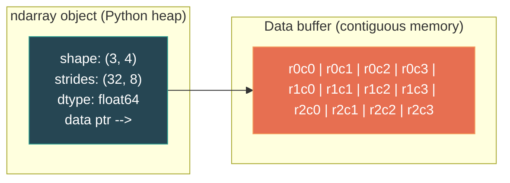
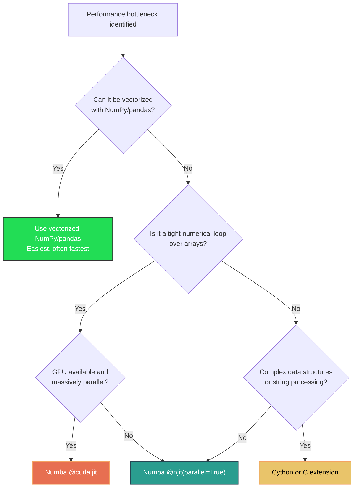
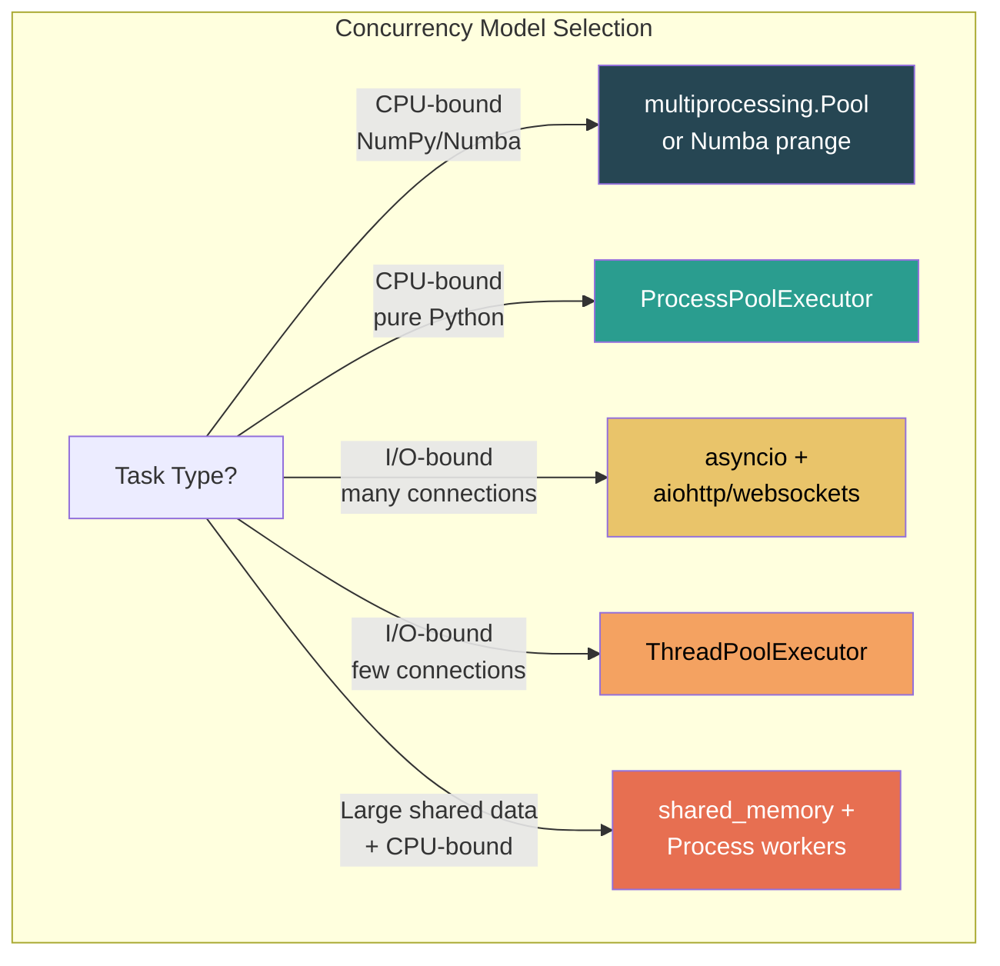
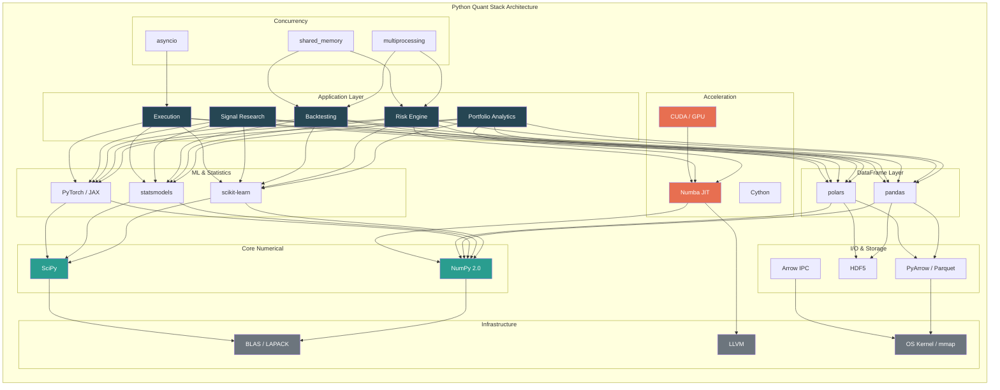
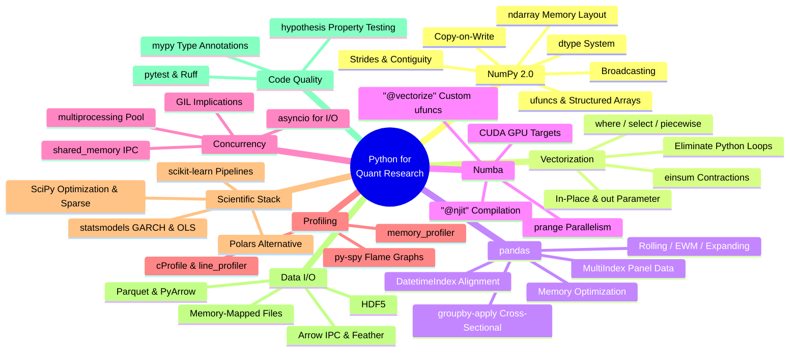

# Module 09: Python for Quantitative Research

**Prerequisites:** Basic programming (variables, functions, control flow, OOP fundamentals)
**Builds toward:** Module 21 (Portfolio Optimization), Module 22 (Risk Models), Module 25 (Algorithmic Trading Systems), Module 26 (Backtesting Frameworks), Module 27 (Machine Learning in Finance), Module 32 (Production Deployment)

---

## Table of Contents

1. [NumPy 2.0 Internals](#1-numpy-20-internals)
2. [Vectorized Computation](#2-vectorized-computation)
3. [pandas for Financial Data](#3-pandas-for-financial-data)
4. [Numba JIT Compilation](#4-numba-jit-compilation)
5. [Concurrency & Parallelism](#5-concurrency--parallelism)
6. [Performance Profiling](#6-performance-profiling)
7. [Scientific Stack](#7-scientific-stack)
8. [Data Formats & I/O](#8-data-formats--io)
9. [Code Quality](#9-code-quality)
10. [Implementation](#10-implementation)
11. [Exercises](#11-exercises)

---

## 1. NumPy 2.0 Internals

NumPy is the foundational array-computing library upon which the entire Python quantitative stack is built. Every pandas DataFrame, every SciPy sparse matrix, every PyTorch tensor on CPU shares ancestry with the NumPy `ndarray`. Understanding its internals -- memory layout, dtype system, and copy semantics -- is not academic: it directly determines whether your portfolio risk calculation takes 50 milliseconds or 50 seconds.

### 1.1 ndarray Memory Layout

An `ndarray` is a contiguous (or strided) block of homogeneously-typed memory, together with metadata describing how to interpret that block. The critical metadata fields are:

| Field | Description |
|---|---|
| `data` | Pointer to the raw memory buffer |
| `dtype` | Data type of each element (e.g., `float64`) |
| `shape` | Tuple of dimension sizes, e.g., `(1000, 252)` for 1000 assets over 252 trading days |
| `strides` | Tuple of byte offsets to advance one position along each axis |
| `flags` | Ownership, writability, contiguity flags |

The **strides** mechanism is what makes NumPy powerful. For a 2D array of `float64` (8 bytes each) with shape `(M, N)`:

- **Row-major (C order):** `strides = (N * 8, 8)`. Elements in the same row are contiguous.
- **Column-major (Fortran order):** `strides = (8, M * 8)`. Elements in the same column are contiguous.

```python
import numpy as np

# Create a return matrix: 500 assets x 252 trading days
returns = np.random.randn(500, 252)

print(f"Shape:   {returns.shape}")        # (500, 252)
print(f"Strides: {returns.strides}")      # (2016, 8)  -- 252 * 8 = 2016
print(f"C-contig: {returns.flags['C_CONTIGUOUS']}")  # True
print(f"F-contig: {returns.flags['F_CONTIGUOUS']}")  # False

# Transpose does NOT copy data -- it only swaps strides
returns_T = returns.T
print(f"T shape:   {returns_T.shape}")    # (252, 500)
print(f"T strides: {returns_T.strides}")  # (8, 2016)
print(f"T C-contig: {returns_T.flags['C_CONTIGUOUS']}")  # False
print(f"Shares memory: {np.shares_memory(returns, returns_T)}")  # True
```

This matters for performance. Modern CPUs load memory in **cache lines** (typically 64 bytes = 8 doubles). Iterating along contiguous memory (stride = element size) yields cache hits; iterating along the non-contiguous axis triggers cache misses. When computing per-asset statistics (mean return, volatility), row-major layout is optimal if each row is one asset's time series.



### 1.2 The dtype System

NumPy's dtype system maps Python-level type descriptors to fixed-width binary representations. The quant-relevant types are:

| dtype | Size | Use case |
|---|---|---|
| `float64` | 8 B | Default for prices, returns, Greeks |
| `float32` | 4 B | GPU computation, large matrices where precision is sufficient |
| `int64` | 8 B | Timestamps (nanosecond epoch), order IDs |
| `datetime64[ns]` | 8 B | Nanosecond timestamps for tick data |
| `bool_` | 1 B | Signal masks, universe filters |
| Structured dtype | Variable | Tick data records (see below) |

NumPy 2.0 introduced a refined type promotion system. The key change: **Python scalars no longer participate in type promotion the same way.** A Python `float` (which is a C `double`) multiplied by a `float32` array now stays `float32`, whereas NumPy 1.x would upcast to `float64`. This prevents silent memory bloat in mixed-precision pipelines.

```python
# NumPy 2.0 type promotion
arr32 = np.array([1.0, 2.0, 3.0], dtype=np.float32)
result = arr32 * 2.5  # Python float
print(result.dtype)    # float32 in NumPy 2.0 (was float64 in 1.x)
```

### 1.3 Copy vs View Semantics and Copy-on-Write

In NumPy 1.x, the rules for when an operation returns a **view** (shared memory) versus a **copy** (independent memory) were notoriously inconsistent. Basic indexing returned views; advanced (fancy) indexing returned copies. This led to subtle bugs:

```python
prices = np.array([100.0, 101.5, 99.8, 102.3, 103.1])

# Basic indexing: VIEW (mutations propagate back)
subset_view = prices[1:4]
subset_view[0] = 999.0
print(prices[1])  # 999.0 -- original mutated!

# Advanced indexing: COPY (mutations do NOT propagate)
idx = np.array([1, 2, 3])
subset_copy = prices[idx]
subset_copy[0] = 888.0
print(prices[1])  # 999.0 -- original unchanged
```

**NumPy 2.0 Copy-on-Write (CoW).** NumPy 2.0 introduces copy-on-write semantics, enabled via `np.copyto` behavior and the internal reference-counting mechanism. When CoW is active:

1. Slicing and reshaping always return a **deferred copy** that shares the underlying buffer.
2. The buffer is marked as read-only for all referencing arrays.
3. Upon the first **write** to any referencing array, a physical copy is triggered for that array alone.

This eliminates the view-vs-copy confusion and prevents accidental data corruption:

```python
# With NumPy 2.0 CoW behavior
import numpy as np

prices = np.array([100.0, 101.5, 99.8, 102.3, 103.1])
subset = prices[1:4]  # Logical view, shared buffer

# Writing triggers a copy -- original is safe
subset[0] = 999.0     # CoW: subset gets its own buffer
print(prices[1])       # 101.5 -- original unchanged with CoW
```

### 1.4 Broadcasting Rules

Broadcasting is NumPy's mechanism for performing element-wise operations on arrays of **different shapes** without explicit replication. The algorithm is:

**Broadcasting Algorithm:**

1. **Pad shapes on the left with 1s** until both arrays have the same number of dimensions.
2. **For each axis**, the sizes must either be equal or one of them must be 1.
3. The array with size 1 along an axis is **virtually stretched** to match the other.
4. If sizes differ and neither is 1, raise `ValueError`.

```python
# Demean returns: subtract each asset's mean
returns = np.random.randn(500, 252)      # (500, 252)
means = returns.mean(axis=1, keepdims=True)  # (500, 1)
demeaned = returns - means                # (500, 252) - (500, 1) -> broadcast

# Cross-sectional z-score: normalize across assets at each time step
cross_mean = returns.mean(axis=0, keepdims=True)  # (1, 252)
cross_std  = returns.std(axis=0, keepdims=True)   # (1, 252)
z_scores = (returns - cross_mean) / cross_std     # (500, 252)
```

A common pitfall: forgetting `keepdims=True` produces a 1D array of shape `(500,)`, which broadcasts against axis 1 (columns), not axis 0 (rows), producing silently wrong results.

### 1.5 Universal Functions (ufuncs)

Ufuncs are NumPy's mechanism for applying element-wise operations at C speed. Every arithmetic operator (`+`, `*`, `**`) dispatches to a ufunc (`np.add`, `np.multiply`, `np.power`). Key ufunc features for quant work:

```python
# Accumulate: running product for cumulative returns
daily_returns = np.array([0.01, -0.005, 0.02, -0.01, 0.015])
cum_returns = np.multiply.accumulate(1 + daily_returns)  # Running product

# Reduceat: group-wise reductions without Python loops
# Sum returns within each month (given month boundaries)
month_boundaries = np.array([0, 21, 42, 63])
monthly_sums = np.add.reduceat(daily_returns_full, month_boundaries)

# at: unbuffered operation at specified indices (handles duplicates)
portfolio_pnl = np.zeros(500)
trade_asset_ids = np.array([10, 10, 25, 100, 10])  # asset 10 appears 3 times
trade_pnls = np.array([100.0, -50.0, 200.0, -75.0, 30.0])
np.add.at(portfolio_pnl, trade_asset_ids, trade_pnls)  # Correctly accumulates
```

### 1.6 Structured Arrays for Tick Data

Structured arrays let you store heterogeneous records in a single contiguous buffer -- ideal for tick-level market data:

```python
tick_dtype = np.dtype([
    ('timestamp', 'datetime64[ns]'),
    ('symbol',    'U8'),              # 8-char Unicode string
    ('price',     'float64'),
    ('size',      'int32'),
    ('side',      'U1'),              # 'B' or 'S'
    ('exchange',  'U4'),
])

# Allocate buffer for 10 million ticks
ticks = np.empty(10_000_000, dtype=tick_dtype)

# Access columns as views -- no copy
prices = ticks['price']               # View into the price field
vwap = np.average(prices[:1000], weights=ticks['size'][:1000].astype(float))
```

Compared to a list of Python objects, this representation uses approximately 10x less memory and enables vectorized filtering:

```python
# All buy trades above $150 on NYSE -- pure NumPy, no Python loop
mask = (ticks['side'] == 'B') & (ticks['price'] > 150.0) & (ticks['exchange'] == 'NYSE')
filtered = ticks[mask]
```

---

## 2. Vectorized Computation

The single most important performance technique in Python quant development is **vectorization**: replacing explicit Python loops with NumPy/pandas operations that execute in compiled C code. The performance difference is not marginal -- it is typically **100x to 1000x**.

### 2.1 Eliminating Python Loops

Consider computing the realized volatility (annualized standard deviation of log returns) for 5000 assets over 252 days:

```python
import numpy as np
import time

prices = np.random.uniform(50, 200, size=(5000, 252))

# SLOW: Python loops
def realized_vol_loop(prices):
    n_assets, n_days = prices.shape
    vols = np.empty(n_assets)
    for i in range(n_assets):
        log_ret = np.empty(n_days - 1)
        for j in range(n_days - 1):
            log_ret[j] = np.log(prices[i, j+1] / prices[i, j])
        vols[i] = np.std(log_ret) * np.sqrt(252)
    return vols

# FAST: Vectorized
def realized_vol_vectorized(prices):
    log_returns = np.diff(np.log(prices), axis=1)   # (5000, 251)
    return np.std(log_returns, axis=1) * np.sqrt(252)  # (5000,)

# Benchmark
t0 = time.perf_counter()
v1 = realized_vol_loop(prices)
t_loop = time.perf_counter() - t0

t0 = time.perf_counter()
v2 = realized_vol_vectorized(prices)
t_vec = time.perf_counter() - t0

print(f"Loop:       {t_loop:.3f}s")        # ~3.2s
print(f"Vectorized: {t_vec:.4f}s")          # ~0.004s
print(f"Speedup:    {t_loop/t_vec:.0f}x")   # ~800x
print(f"Max diff:   {np.max(np.abs(v1 - v2)):.2e}")  # ~1e-15
```

The reason is clear: each Python loop iteration incurs interpreter overhead (bytecode dispatch, dynamic type checking, reference counting). NumPy offloads the entire inner loop to optimized C/Fortran with SIMD instructions.

### 2.2 Conditional Logic Without Branching

Python `if/else` inside loops destroys vectorization. NumPy provides three tools for branchless conditional logic:

```python
returns = np.random.randn(10000)

# np.where: ternary selection
# Winsorize returns at +/- 3 sigma
sigma = returns.std()
winsorized = np.where(
    returns > 3 * sigma, 3 * sigma,
    np.where(returns < -3 * sigma, -3 * sigma, returns)
)

# np.select: multi-condition (like a switch statement)
# Classify returns into regimes
conditions = [
    returns < -0.02,
    (returns >= -0.02) & (returns < 0.0),
    (returns >= 0.0) & (returns < 0.02),
    returns >= 0.02,
]
regime_labels = [-2, -1, 1, 2]
regimes = np.select(conditions, regime_labels, default=0)

# np.piecewise: apply different functions per condition
# Asymmetric utility function
utility = np.piecewise(
    returns,
    [returns >= 0, returns < 0],
    [lambda x: x,            # Linear for gains
     lambda x: 2.5 * x]      # 2.5x penalty for losses (loss aversion)
)
```

### 2.3 einsum for Tensor Contractions

`np.einsum` expresses arbitrary tensor operations in Einstein summation notation, often faster than chained NumPy calls because it fuses operations into a single pass:

```python
# Portfolio variance: w^T Sigma w
weights = np.random.dirichlet(np.ones(100))    # (100,)
cov_matrix = np.cov(np.random.randn(100, 252)) # (100, 100)

# Standard: two operations, one intermediate array
port_var_std = weights @ cov_matrix @ weights

# einsum: single fused operation
port_var_ein = np.einsum('i,ij,j->', weights, cov_matrix, weights)

# Batch portfolio variance for 50 different weight vectors
W = np.random.dirichlet(np.ones(100), size=50)  # (50, 100)
batch_var = np.einsum('pi,ij,pj->p', W, cov_matrix, W)  # (50,)

# Cross-covariance between two sets of assets
A = np.random.randn(50, 252)   # 50 assets, 252 days
B = np.random.randn(30, 252)   # 30 assets, 252 days
cross_cov = np.einsum('it,jt->ij', A, B) / 252  # (50, 30)
```

### 2.4 Memory-Efficient Operations

Large-scale quant computations can easily exhaust memory. NumPy provides mechanisms to compute in-place:

```python
# BAD: creates 3 temporary arrays
result = np.sqrt(np.sum(np.square(returns), axis=1))

# GOOD: in-place operations with out parameter
buffer = np.empty_like(returns)
np.square(returns, out=buffer)            # In-place square
row_sums = np.sum(buffer, axis=1)         # Reduction (smaller output)
np.sqrt(row_sums, out=row_sums)           # In-place sqrt

# For truly large arrays, process in chunks
def chunked_zscore(arr, chunk_size=10000):
    """Z-score normalization without holding full copy in memory."""
    mean = arr.mean()
    std = arr.std()
    out = np.empty_like(arr)
    for start in range(0, len(arr), chunk_size):
        end = min(start + chunk_size, len(arr))
        np.subtract(arr[start:end], mean, out=out[start:end])
        np.divide(out[start:end], std, out=out[start:end])
    return out
```

### 2.5 C++ Comparison: Eigen Vectorization

For comparison, here is the equivalent realized volatility computation in C++ using the Eigen library. The performance is comparable to NumPy for this operation, illustrating that NumPy's vectorized path already calls into optimized BLAS/LAPACK:

```cpp
#include <Eigen/Dense>
#include <cmath>
#include <chrono>
#include <iostream>

Eigen::VectorXd realized_vol(const Eigen::MatrixXd& prices) {
    // prices: (n_assets x n_days), row-major
    int n_assets = prices.rows();
    int n_days   = prices.cols();

    // Log returns: log(P[t+1] / P[t])
    Eigen::MatrixXd log_prices = prices.array().log().matrix();
    Eigen::MatrixXd log_ret = log_prices.rightCols(n_days - 1)
                             - log_prices.leftCols(n_days - 1);

    // Annualized standard deviation per asset
    Eigen::VectorXd means = log_ret.rowwise().mean();
    Eigen::MatrixXd centered = log_ret.colwise() - means;
    Eigen::VectorXd var = (centered.array().square().rowwise().sum())
                          / (n_days - 2);
    return var.array().sqrt() * std::sqrt(252.0);
}

int main() {
    const int N = 5000, T = 252;
    Eigen::MatrixXd prices = Eigen::MatrixXd::Random(N, T).array().abs() * 100 + 50;

    auto t0 = std::chrono::high_resolution_clock::now();
    Eigen::VectorXd vols = realized_vol(prices);
    auto t1 = std::chrono::high_resolution_clock::now();

    double ms = std::chrono::duration<double, std::milli>(t1 - t0).count();
    std::cout << "C++ Eigen: " << ms << " ms\n";    // ~3-5 ms
    std::cout << "Vol[0] = " << vols(0) << "\n";
    return 0;
}
```

---

## 3. pandas for Financial Data

pandas provides the `DataFrame` and `Series` abstractions -- labeled, aligned, time-indexed data structures that handle the messiness of real financial data: missing observations, irregular timestamps, multiple assets, corporate actions, and calendar misalignment.

### 3.1 MultiIndex for Multi-Asset Time Series

The two dominant layouts for multi-asset data are **wide** (assets as columns) and **long** (stacked with a MultiIndex). Each has tradeoffs:

```python
import pandas as pd
import numpy as np

dates = pd.bdate_range('2020-01-02', periods=252, freq='B')
assets = ['AAPL', 'GOOGL', 'MSFT', 'AMZN', 'META']

# Wide format: good for cross-sectional operations
wide = pd.DataFrame(
    np.random.randn(252, 5) * 0.02,
    index=dates,
    columns=assets
)

# Long format with MultiIndex: good for groupby, merging, panel regressions
long = wide.stack()
long.index.names = ['date', 'asset']
long.name = 'return'

# Convert between formats
wide_again = long.unstack(level='asset')

# MultiIndex enables powerful selections
long.loc['2020-03']                          # All assets in March
long.loc[pd.IndexSlice[:, 'AAPL']]          # All dates for AAPL
long.loc[pd.IndexSlice['2020-06', ['AAPL', 'MSFT']]]  # June, two assets
```

### 3.2 Rolling Windows: Expanding, EWM

Financial analytics depend heavily on rolling computations -- moving averages, rolling volatility, rolling beta:

```python
prices = pd.DataFrame(
    np.cumprod(1 + np.random.randn(500, 3) * 0.01, axis=0) * 100,
    columns=['SPY', 'QQQ', 'IWM'],
    index=pd.bdate_range('2022-01-03', periods=500, freq='B')
)
returns = prices.pct_change().dropna()

# Rolling 21-day realized volatility (annualized)
rolling_vol = returns.rolling(window=21).std() * np.sqrt(252)

# Exponentially-weighted moving average (half-life = 21 days)
# The span parameter: span = (2 / alpha) - 1, so alpha = 2 / (span + 1)
# Alternatively, specify halflife directly
ewm_vol = returns.ewm(halflife=21).std() * np.sqrt(252)

# Expanding window: cumulative Sharpe ratio since inception
expanding_sharpe = (
    returns.expanding(min_periods=21).mean()
    / returns.expanding(min_periods=21).std()
) * np.sqrt(252)

# Rolling beta of QQQ vs SPY
def rolling_beta(df, window=63):
    """Rolling OLS beta using covariance / variance."""
    cov = df['QQQ'].rolling(window).cov(df['SPY'])
    var = df['SPY'].rolling(window).var()
    return cov / var

beta_qqq_spy = rolling_beta(returns)
```

### 3.3 groupby-apply for Cross-Sectional Operations

The `groupby` mechanism is the workhorse for cross-sectional analytics -- operations across assets at each point in time:

```python
# Long-format panel of returns
panel = pd.DataFrame({
    'date': np.repeat(dates, len(assets)),
    'asset': np.tile(assets, len(dates)),
    'return': np.random.randn(len(dates) * len(assets)) * 0.02,
    'market_cap': np.random.uniform(1e9, 2e12, len(dates) * len(assets)),
})

# Cross-sectional z-score at each date
panel['z_score'] = panel.groupby('date')['return'].transform(
    lambda x: (x - x.mean()) / x.std()
)

# Cross-sectional rank (percentile)
panel['rank'] = panel.groupby('date')['return'].transform(
    lambda x: x.rank(pct=True)
)

# Market-cap-weighted average return per date
def wavg(group):
    return np.average(group['return'], weights=group['market_cap'])

index_return = panel.groupby('date').apply(wavg)

# Winsorize at 1st and 99th percentiles within each cross-section
def winsorize(s, lower=0.01, upper=0.99):
    q = s.quantile([lower, upper])
    return s.clip(q.iloc[0], q.iloc[1])

panel['return_wins'] = panel.groupby('date')['return'].transform(winsorize)
```

### 3.4 Memory Optimization

A production quant system may hold millions of rows. pandas memory usage can be reduced dramatically:

```python
# Before optimization
panel_big = pd.DataFrame({
    'date':     pd.date_range('2010-01-01', periods=5_000_000, freq='s'),
    'asset':    np.random.choice(['AAPL', 'GOOGL', 'MSFT', 'AMZN'], 5_000_000),
    'exchange': np.random.choice(['NYSE', 'NASDAQ', 'ARCA'], 5_000_000),
    'price':    np.random.uniform(50, 200, 5_000_000),
    'volume':   np.random.randint(1, 10000, 5_000_000),
})
print(f"Before: {panel_big.memory_usage(deep=True).sum() / 1e6:.1f} MB")

# After optimization
panel_big['asset']    = panel_big['asset'].astype('category')
panel_big['exchange'] = panel_big['exchange'].astype('category')
panel_big['price']    = panel_big['price'].astype('float32')
panel_big['volume']   = panel_big['volume'].astype('int32')
print(f"After:  {panel_big.memory_usage(deep=True).sum() / 1e6:.1f} MB")
# Typically 50-70% reduction
```

**Nullable integer types.** pandas 2.x uses `pd.Int32Dtype()` (capital I) for nullable integers backed by Arrow, avoiding the legacy behavior of upcasting integer columns to `float64` when `NaN` is present:

```python
s = pd.array([1, 2, None, 4], dtype=pd.Int32Dtype())
print(s.dtype)  # Int32 (not float64)
print(s[2])     # <NA> (not NaN)
```

### 3.5 Handling Missing Data

Financial time series are routinely incomplete -- holidays, halts, delistings, late reporting:

```python
# Forward-fill (carry last known price) -- standard for price data
prices_filled = prices.ffill()

# Backward-fill -- useful for aligning end-of-day data
signals_filled = signals.bfill()

# Interpolation -- appropriate for smooth quantities (yield curves)
yields = yields_raw.interpolate(method='cubic')

# Time-aware interpolation for irregularly-spaced data
irregular = pd.Series(
    [100, np.nan, np.nan, 105],
    index=pd.to_datetime(['2024-01-02', '2024-01-03', '2024-01-06', '2024-01-07'])
)
filled = irregular.interpolate(method='time')  # Respects weekend gap
```

### 3.6 DatetimeIndex and Trading Calendar Alignment

Aligning data to a trading calendar is a persistent source of bugs. Use purpose-built calendar libraries:

```python
# Create a proper trading calendar index
import pandas_market_calendars as mcal

nyse = mcal.get_calendar('NYSE')
trading_days = nyse.schedule(start_date='2024-01-01', end_date='2024-12-31')
trading_index = mcal.date_range(trading_days, frequency='1D')

# Reindex prices to trading calendar, forward-filling holidays
prices_aligned = prices.reindex(trading_index, method='ffill')

# Resample from daily to weekly (business week)
weekly_returns = returns.resample('W-FRI').sum()

# Resample to month-end with custom aggregation
monthly = prices.resample('BME').agg({
    'SPY': 'last',    # Month-end close
    'QQQ': ['first', 'last', 'max', 'min'],  # OHLC-equivalent
})
```

---

## 4. Numba JIT Compilation

Numba translates a subset of Python and NumPy code into optimized machine code at runtime using the LLVM compiler infrastructure. For algorithms that cannot be vectorized -- path-dependent simulations, tree traversals, iterative solvers -- Numba bridges the gap between Python convenience and C-level speed.

### 4.1 The @njit Decorator

`@njit` (short for `@jit(nopython=True)`) compiles the decorated function entirely to machine code with **no Python interpreter involvement**:

```python
from numba import njit
import numpy as np

@njit
def heston_mc_path(
    S0: float, v0: float, kappa: float, theta: float,
    sigma: float, rho: float, r: float, T: float,
    n_steps: int, n_paths: int
) -> tuple:
    """Simulate Heston stochastic volatility model paths."""
    dt = T / n_steps
    sqrt_dt = np.sqrt(dt)

    S = np.empty((n_paths, n_steps + 1))
    v = np.empty((n_paths, n_steps + 1))
    S[:, 0] = S0
    v[:, 0] = v0

    for t in range(n_steps):
        z1 = np.random.randn(n_paths)
        z2 = rho * z1 + np.sqrt(1 - rho**2) * np.random.randn(n_paths)

        v_pos = np.maximum(v[:, t], 0.0)  # Ensure non-negative variance
        S[:, t+1] = S[:, t] * np.exp(
            (r - 0.5 * v_pos) * dt + np.sqrt(v_pos) * sqrt_dt * z1
        )
        v[:, t+1] = (
            v[:, t] + kappa * (theta - v_pos) * dt
            + sigma * np.sqrt(v_pos) * sqrt_dt * z2
        )

    return S, v

# First call: compile (~1s). Subsequent calls: ~50ms for 100k paths x 252 steps
S, v = heston_mc_path(100.0, 0.04, 2.0, 0.04, 0.3, -0.7, 0.05, 1.0, 252, 100_000)
```

**Type inference.** Numba infers types from the arguments at the first call. If you call with `float64` arguments, it compiles a `float64` specialization. Calling later with `float32` triggers a separate compilation. You can control this explicitly:

```python
from numba import float64, int64

@njit(float64(float64[:], float64[:]))
def weighted_mean(values, weights):
    """Explicitly typed Numba function."""
    s = 0.0
    w = 0.0
    for i in range(len(values)):
        s += values[i] * weights[i]
        w += weights[i]
    return s / w
```

### 4.2 @vectorize for Custom ufuncs

`@vectorize` creates a NumPy ufunc from a scalar function, automatically handling broadcasting:

```python
from numba import vectorize, float64

@vectorize([float64(float64, float64, float64)])
def black_scholes_delta(S, K, sigma_sqrt_T):
    """Vectorized Black-Scholes delta (simplified: r=0, q=0)."""
    from math import log, sqrt, erf
    d1 = (log(S / K) + 0.5 * sigma_sqrt_T**2) / sigma_sqrt_T
    # Normal CDF via erf
    return 0.5 * (1.0 + erf(d1 / sqrt(2.0)))

# Broadcast over arrays of spots, strikes, vol*sqrt(T)
spots   = np.linspace(80, 120, 1000)
strikes = np.array([90, 100, 110])[:, None]   # (3, 1) for broadcasting
sig_T   = np.full_like(spots, 0.2 * np.sqrt(0.25))

deltas = black_scholes_delta(spots, strikes, sig_T)  # (3, 1000)
```

### 4.3 Parallel Acceleration with prange

Replace `range` with `prange` and set `parallel=True` to distribute loop iterations across CPU cores:

```python
from numba import njit, prange

@njit(parallel=True)
def bootstrap_var(returns, n_bootstrap=10000, confidence=0.99):
    """Bootstrap Value-at-Risk with parallel resampling."""
    n = len(returns)
    var_estimates = np.empty(n_bootstrap)

    for i in prange(n_bootstrap):
        # Resample with replacement
        sample = np.empty(n)
        for j in range(n):
            sample[j] = returns[np.random.randint(0, n)]
        sample.sort()
        idx = int((1 - confidence) * n)
        var_estimates[i] = -sample[idx]

    return var_estimates

returns = np.random.standard_t(5, size=10000) * 0.01
var_dist = bootstrap_var(returns)
print(f"VaR (99%): {np.mean(var_dist):.4f}")
```

### 4.4 GPU Targets with CUDA

Numba can compile Python functions to CUDA kernels for NVIDIA GPUs:

```python
from numba import cuda
import numpy as np
import math

@cuda.jit
def mc_option_kernel(paths, S0, r, sigma, T, n_steps, rng_states):
    """CUDA kernel for geometric Brownian motion simulation."""
    idx = cuda.grid(1)
    if idx >= paths.shape[0]:
        return

    dt = T / n_steps
    S = S0
    for t in range(n_steps):
        z = cuda.random.xoroshiro128p_normal_float64(rng_states, idx)
        S *= math.exp((r - 0.5 * sigma**2) * dt + sigma * math.sqrt(dt) * z)
    paths[idx] = S

# Launch configuration
n_paths = 1_000_000
threads_per_block = 256
blocks = (n_paths + threads_per_block - 1) // threads_per_block

from numba.cuda.random import create_xoroshiro128p_states
rng_states = create_xoroshiro128p_states(n_paths, seed=42)
d_paths = cuda.device_array(n_paths, dtype=np.float64)

mc_option_kernel[blocks, threads_per_block](
    d_paths, 100.0, 0.05, 0.2, 1.0, 252, rng_states
)
paths = d_paths.copy_to_host()
```

### 4.5 Limitations and When to Use Numba

**Supported features in nopython mode:**

- Basic Python types: `int`, `float`, `bool`, `tuple` (homogeneous), `None`
- NumPy arrays, most math functions, array creation routines
- Loops, conditionals, recursion (with explicit return types)

**Not supported:**

- Dictionaries (limited support via `numba.typed.Dict`), sets, list comprehensions
- Classes (limited via `@jitclass`), exceptions, `try/except`
- String operations, regex, most standard library modules
- pandas operations of any kind

**Decision framework:**



---

## 5. Concurrency & Parallelism

Quantitative systems have diverse concurrency needs: CPU-bound number crunching (risk calculations, backtests), I/O-bound data retrieval (market data feeds, database queries), and real-time event processing (order management). Python offers distinct tools for each.

### 5.1 The GIL and Its Implications

The **Global Interpreter Lock (GIL)** ensures only one thread executes Python bytecode at a time. This means:

- **CPU-bound Python code gains nothing from threading.** Two threads computing portfolio risk will execute sequentially.
- **I/O-bound code benefits from threading.** While one thread awaits a network response, another can execute.
- **NumPy releases the GIL during array operations.** `np.dot`, `np.linalg.solve`, and similar functions drop the GIL, enabling genuine parallelism in multi-threaded NumPy code.
- **Numba `@njit` releases the GIL with `nogil=True`.** Compiled numerical code can run truly in parallel across threads.

> **Note:** CPython 3.13+ introduces an experimental free-threaded mode (PEP 703) that removes the GIL entirely. As of 2026, this is stabilizing but not yet the default. When it becomes standard, the threading landscape for CPU-bound Python will change fundamentally.

### 5.2 multiprocessing for CPU-Bound Work

`multiprocessing` sidesteps the GIL by spawning separate Python processes, each with its own interpreter and memory space:

```python
from multiprocessing import Pool
import numpy as np

def compute_asset_risk(args):
    """Compute risk metrics for a single asset. Runs in a worker process."""
    asset_id, returns_chunk = args
    vol = np.std(returns_chunk) * np.sqrt(252)
    skew = _skewness(returns_chunk)
    kurt = _kurtosis(returns_chunk)
    var_95 = np.percentile(returns_chunk, 5)
    return asset_id, vol, skew, kurt, var_95

def _skewness(x):
    m = x.mean()
    s = x.std()
    return np.mean(((x - m) / s) ** 3)

def _kurtosis(x):
    m = x.mean()
    s = x.std()
    return np.mean(((x - m) / s) ** 4) - 3.0

# 5000 assets x 252 days
returns = np.random.randn(5000, 252) * 0.02
work_items = [(i, returns[i]) for i in range(returns.shape[0])]

if __name__ == '__main__':
    with Pool(processes=8) as pool:
        results = pool.map(compute_asset_risk, work_items)

    # Unpack into arrays
    ids, vols, skews, kurts, vars_ = zip(*results)
```

**Caveat:** `Pool.map` serializes (pickles) arguments and results between processes. For large arrays, this serialization overhead can negate the parallelism benefit. Use shared memory instead.

### 5.3 asyncio for I/O-Bound Work

Market data feeds, REST API calls, and database queries are I/O-bound. `asyncio` provides cooperative multitasking without threads:

```python
import asyncio
import aiohttp
import time

async def fetch_ohlcv(session: aiohttp.ClientSession, symbol: str) -> dict:
    """Fetch OHLCV data for a single symbol from a REST API."""
    url = f"https://api.example.com/v1/bars/{symbol}"
    async with session.get(url, params={'timeframe': '1D', 'limit': 252}) as resp:
        data = await resp.json()
        return {'symbol': symbol, 'bars': data}

async def fetch_universe(symbols: list[str]) -> list[dict]:
    """Fetch data for all symbols concurrently."""
    async with aiohttp.ClientSession() as session:
        tasks = [fetch_ohlcv(session, sym) for sym in symbols]
        return await asyncio.gather(*tasks, return_exceptions=True)

async def stream_market_data(websocket_url: str, callback):
    """Connect to a WebSocket market data feed."""
    import websockets
    async with websockets.connect(websocket_url) as ws:
        await ws.send('{"action":"subscribe","symbols":["AAPL","MSFT"]}')
        async for message in ws:
            await callback(message)

# Usage
symbols = ['AAPL', 'GOOGL', 'MSFT', 'AMZN', 'META', 'NVDA', 'TSLA']
# results = asyncio.run(fetch_universe(symbols))
# Fetches all 7 concurrently -- ~1 round-trip time, not 7x
```

### 5.4 concurrent.futures: Unified Interface

`concurrent.futures` provides a high-level interface that abstracts over threads and processes:

```python
from concurrent.futures import ProcessPoolExecutor, ThreadPoolExecutor, as_completed
import numpy as np

def run_backtest(params: dict) -> dict:
    """Run a single backtest with given parameters. CPU-bound."""
    np.random.seed(params['seed'])
    returns = np.random.randn(252) * params['vol_target']
    sharpe = returns.mean() / returns.std() * np.sqrt(252)
    return {'params': params, 'sharpe': sharpe}

# Parameter sweep: 1000 configurations, 8 parallel workers
param_grid = [
    {'vol_target': v, 'lookback': lb, 'seed': i}
    for i, (v, lb) in enumerate(
        [(v, lb) for v in np.arange(0.05, 0.25, 0.01) for lb in [21, 63, 126, 252]]
    )
]

with ProcessPoolExecutor(max_workers=8) as executor:
    futures = {executor.submit(run_backtest, p): p for p in param_grid}
    results = []
    for future in as_completed(futures):
        result = future.result()
        results.append(result)
```

### 5.5 Shared Memory for Zero-Copy IPC

Python 3.8+ provides `multiprocessing.shared_memory` for zero-copy data sharing between processes -- critical when passing large arrays:

```python
from multiprocessing import shared_memory, Process
import numpy as np

def worker(shm_name, shape, dtype_str):
    """Worker process that reads from shared memory with no copy."""
    existing_shm = shared_memory.SharedMemory(name=shm_name)
    arr = np.ndarray(shape, dtype=np.dtype(dtype_str), buffer=existing_shm.buf)

    # Compute on the shared array (read-only in practice)
    vol = np.std(arr, axis=1) * np.sqrt(252)
    print(f"Worker computed {len(vol)} volatilities")
    existing_shm.close()

if __name__ == '__main__':
    # Parent: create shared memory and write data
    returns = np.random.randn(5000, 252).astype(np.float64)
    shm = shared_memory.SharedMemory(create=True, size=returns.nbytes)
    shared_arr = np.ndarray(returns.shape, dtype=returns.dtype, buffer=shm.buf)
    np.copyto(shared_arr, returns)  # One-time copy into shared region

    # Spawn workers that access the same memory -- zero additional copies
    p = Process(target=worker, args=(shm.name, returns.shape, str(returns.dtype)))
    p.start()
    p.join()

    shm.close()
    shm.unlink()  # Clean up the shared memory block
```



---

## 6. Performance Profiling

The first law of optimization: **measure before optimizing.** Intuition about bottlenecks is unreliable. The following tools form a complete profiling workflow for quant code.

### 6.1 cProfile: Function-Level

`cProfile` is built into Python and provides function-level timing with low overhead:

```python
import cProfile
import pstats

def my_backtest():
    """Example function to profile."""
    import numpy as np
    returns = np.random.randn(1000, 252) * 0.02
    cov = np.cov(returns)
    w = np.linalg.solve(cov + 0.01 * np.eye(1000), np.ones(1000))
    w /= w.sum()
    port_ret = returns.T @ w
    return port_ret

# Profile and sort by cumulative time
profiler = cProfile.Profile()
profiler.enable()
result = my_backtest()
profiler.disable()

stats = pstats.Stats(profiler)
stats.sort_stats('cumulative')
stats.print_stats(20)  # Top 20 functions
```

### 6.2 line_profiler: Line-Level

`line_profiler` provides **line-by-line** timing -- essential for finding the hot lines within a function:

```python
# Install: pip install line_profiler
# Decorate the function with @profile, then run:
#   kernprof -l -v my_script.py

@profile  # This decorator is injected by kernprof
def compute_risk_metrics(returns):
    mean = returns.mean(axis=1)               # Line 4: 0.3ms
    cov = np.cov(returns)                     # Line 5: 45ms  <-- bottleneck
    vol = np.sqrt(np.diag(cov))               # Line 6: 0.1ms
    corr = cov / np.outer(vol, vol)           # Line 7: 0.5ms
    eigenvalues = np.linalg.eigvalsh(cov)     # Line 8: 12ms
    return mean, vol, corr, eigenvalues
```

### 6.3 memory_profiler: Memory Tracking

Memory leaks and excessive allocation are common in long-running quant processes:

```python
# Install: pip install memory_profiler
# Run: python -m memory_profiler my_script.py

@profile
def load_and_process():
    import pandas as pd
    import numpy as np

    # Line 6: +800 MB (loading a large CSV)
    df = pd.read_csv('tick_data.csv', parse_dates=['timestamp'])

    # Line 9: +400 MB (inefficient string column)
    df['symbol'] = df['symbol'].astype('category')  # Drops to +20 MB

    # Line 12: +0 MB (in-place operation, no new allocation)
    df['return'] = df.groupby('symbol')['price'].pct_change()

    return df
```

### 6.4 py-spy: Sampling Profiler for Flame Graphs

`py-spy` is a sampling profiler that attaches to running processes with zero overhead to the target. It is invaluable for diagnosing production systems:

```bash
# Install: pip install py-spy
# Record a flame graph (SVG) of a running process
py-spy record -o profile.svg --pid 12345

# Or run a script directly
py-spy record -o profile.svg -- python my_backtest.py

# Top-like live view of a running process
py-spy top --pid 12345
```

### 6.5 Benchmarking with timeit

For micro-benchmarks, `timeit` provides statistically reliable measurements:

```python
import timeit
import numpy as np

setup = """
import numpy as np
a = np.random.randn(10000)
b = np.random.randn(10000)
"""

# Compare dot product implementations
print(timeit.timeit('np.dot(a, b)', setup=setup, number=100000))
print(timeit.timeit('np.sum(a * b)', setup=setup, number=100000))
print(timeit.timeit('np.einsum("i,i->", a, b)', setup=setup, number=100000))

# In Jupyter/IPython:
# %timeit np.dot(a, b)
# %timeit -r 10 -n 10000 np.dot(a, b)   # 10 runs, 10000 loops each
```

### 6.6 Common Performance Anti-Patterns in Quant Code

| Anti-pattern | Why it is slow | Fix |
|---|---|---|
| `for row in df.iterrows()` | Python-level iteration over DataFrame | Vectorize with `.apply()` or NumPy |
| `df = df.append(new_row)` | Creates a new DataFrame every append | Collect in a list, `pd.concat` once |
| `pd.concat` in a loop | Quadratic memory allocation | Accumulate list, concatenate at end |
| Repeated `df[col].values` | No caching of the underlying array | Extract `.values` once |
| `np.array([...])` in a loop | Repeated small allocations | Pre-allocate with `np.empty` |
| String dtypes for categorical data | 50x memory vs category dtype | Use `astype('category')` |
| Not using `inplace=True` or `out=` | Unnecessary temporary arrays | Use in-place operations for large arrays |
| Recomputing constants inside loops | Wasted cycles | Hoist invariants before the loop |

---

## 7. Scientific Stack

Beyond NumPy and pandas, the Python scientific ecosystem provides specialized tools for every quantitative task.

### 7.1 SciPy

**Optimization.** Portfolio optimization, calibration of stochastic volatility models, and curve fitting all reduce to `scipy.optimize`:

```python
from scipy.optimize import minimize
import numpy as np

def neg_sharpe(weights, mu, cov):
    """Negative Sharpe ratio (for minimization)."""
    port_ret = weights @ mu
    port_vol = np.sqrt(weights @ cov @ weights)
    return -port_ret / port_vol

mu = np.array([0.08, 0.12, 0.06, 0.10])
cov = np.array([
    [0.04, 0.006, 0.002, 0.004],
    [0.006, 0.09, 0.009, 0.012],
    [0.002, 0.009, 0.01, 0.003],
    [0.004, 0.012, 0.003, 0.0625],
])

result = minimize(
    neg_sharpe, x0=np.ones(4) / 4, args=(mu, cov),
    method='SLSQP',
    bounds=[(0, 1)] * 4,
    constraints={'type': 'eq', 'fun': lambda w: w.sum() - 1.0}
)
print(f"Optimal weights: {result.x.round(4)}")
print(f"Max Sharpe: {-result.fun:.4f}")
```

**Sparse matrices.** Covariance matrices from factor models are naturally sparse (dense factor block + diagonal specific risk):

```python
from scipy import sparse
import numpy as np

# Factor covariance: B @ F @ B^T + D (where D is diagonal)
n_assets, n_factors = 5000, 50
B = sparse.random(n_assets, n_factors, density=0.1, format='csr')
F = np.eye(n_factors) * 0.01 + np.random.randn(n_factors, n_factors) * 0.001
D = sparse.diags(np.random.uniform(0.001, 0.01, n_assets))

# Sparse matrix-vector product for portfolio variance
w = np.ones(n_assets) / n_assets
Bw = B.T @ w                       # (n_factors,) -- sparse @ dense
port_var = Bw @ F @ Bw + w @ D @ w  # Scalar
```

**Signal processing.** `scipy.signal` provides filters for denoising financial time series:

```python
from scipy.signal import butter, sosfiltfilt

# Butterworth low-pass filter to extract trend from noisy price data
sos = butter(N=4, Wn=0.05, btype='low', fs=1.0, output='sos')
trend = sosfiltfilt(sos, prices['SPY'].values)
```

### 7.2 statsmodels

**Ordinary Least Squares with robust standard errors:**

```python
import statsmodels.api as sm

# Fama-French 3-factor regression
Y = fund_returns              # (T,)
X = sm.add_constant(ff3_factors)  # (T, 4) -- const, MKT, SMB, HML

model = sm.OLS(Y, X).fit(cov_type='HC3')  # Heteroskedasticity-robust
print(model.summary())
```

**GARCH volatility modeling:**

```python
from arch import arch_model

# GARCH(1,1) on daily returns
am = arch_model(returns * 100, vol='Garch', p=1, q=1, dist='t')
res = am.fit(disp='off')
print(res.summary())

# Forecast conditional volatility
forecasts = res.forecast(horizon=5)
print(forecasts.variance.iloc[-1])
```

**State-space models** for Kalman-filter-based estimation (pairs trading, dynamic beta):

```python
import statsmodels.api as sm

# Local level model: y_t = alpha_t + eps_t, alpha_{t+1} = alpha_t + eta_t
mod = sm.tsa.UnobservedComponents(spread_series, level='local level')
res = mod.fit(disp=False)
filtered_state = res.filtered_state[0]
```

### 7.3 scikit-learn

**ML pipeline with time-series-aware cross-validation:**

```python
from sklearn.pipeline import Pipeline
from sklearn.preprocessing import StandardScaler
from sklearn.linear_model import Ridge
from sklearn.model_selection import TimeSeriesSplit

pipe = Pipeline([
    ('scaler', StandardScaler()),
    ('ridge', Ridge(alpha=1.0))
])

tscv = TimeSeriesSplit(n_splits=5, gap=21)  # 21-day gap to prevent lookahead

for train_idx, test_idx in tscv.split(features):
    pipe.fit(features[train_idx], target[train_idx])
    score = pipe.score(features[test_idx], target[test_idx])
    print(f"Test R^2: {score:.4f}")
```

### 7.4 Polars as a pandas Alternative

Polars is a DataFrame library written in Rust that provides significant performance improvements over pandas, especially for group-by operations and lazy evaluation:

```python
import polars as pl

# Lazy evaluation: build a query plan, execute once
result = (
    pl.scan_parquet('trades_*.parquet')
    .filter(pl.col('exchange') == 'NYSE')
    .with_columns([
        pl.col('price').pct_change().over('symbol').alias('return'),
        pl.col('volume').rolling_mean(window_size=21).over('symbol').alias('avg_vol'),
    ])
    .group_by('symbol')
    .agg([
        pl.col('return').std().alias('volatility'),
        pl.col('return').mean().alias('mean_return'),
        pl.col('avg_vol').last().alias('last_avg_vol'),
    ])
    .sort('volatility', descending=True)
    .collect()  # Execute the entire query plan
)
```

Polars is particularly effective for data preparation pipelines where the lazy query optimizer can eliminate unnecessary computations and optimize memory usage.

---

## 8. Data Formats & I/O

The choice of data format has profound impact on both performance and storage cost. A quant research platform may store terabytes of tick data, and the difference between CSV and Parquet can be 10x in storage and 100x in query speed.

### 8.1 Parquet via PyArrow

Apache Parquet is a **columnar** storage format designed for analytical workloads. It is the de facto standard for storing financial time series on disk.

```python
import pyarrow as pa
import pyarrow.parquet as pq
import pandas as pd
import numpy as np

# Create a large tick dataset
n = 10_000_000
ticks = pd.DataFrame({
    'timestamp': pd.date_range('2024-01-02 09:30:00', periods=n, freq='100ms'),
    'symbol':    np.random.choice(['AAPL', 'GOOGL', 'MSFT', 'AMZN'], n),
    'price':     np.random.uniform(100, 200, n).round(2),
    'size':      np.random.randint(1, 1000, n),
    'exchange':  np.random.choice(['NYSE', 'NASDAQ', 'ARCA', 'BATS'], n),
})

# Write with partitioning by symbol -- enables partition pruning
table = pa.Table.from_pandas(ticks)
pq.write_to_dataset(
    table,
    root_path='tick_data/',
    partition_cols=['symbol'],
    compression='zstd',         # Zstandard: best ratio for financial data
    row_group_size=500_000,     # ~500K rows per row group for parallel reads
)

# Read with predicate pushdown -- only reads relevant row groups
filtered = pq.read_table(
    'tick_data/',
    filters=[
        ('symbol', '=', 'AAPL'),
        ('price', '>', 150.0),
    ],
    columns=['timestamp', 'price', 'size'],  # Column pruning
)
df = filtered.to_pandas()
```

**Why columnar storage matters:** When computing VWAP (Volume-Weighted Average Price), you only need `price` and `size` columns. In a row-oriented format (CSV, JSON), you must read every byte of every row. In Parquet, you read only those two columns -- typically 10x fewer bytes.

### 8.2 HDF5 for Hierarchical Data

HDF5 excels at storing nested, heterogeneous data -- multiple signal types, model parameters, and metadata in a single file:

```python
import h5py
import numpy as np

with h5py.File('research.h5', 'w') as f:
    # Create groups (like directories)
    signals = f.create_group('signals')
    models  = f.create_group('models')

    # Store arrays with compression
    signals.create_dataset(
        'momentum_21d',
        data=np.random.randn(5000, 252),
        compression='gzip',
        compression_opts=4,
        chunks=(100, 252),    # Chunk shape for efficient partial reads
    )

    # Store model parameters
    models.attrs['description'] = 'Cross-sectional momentum model v2.3'
    models.create_dataset('weights', data=np.random.randn(50))
    models.create_dataset('covariance', data=np.random.randn(50, 50))

# Efficient partial read: only load first 100 assets
with h5py.File('research.h5', 'r') as f:
    chunk = f['signals/momentum_21d'][:100, :]  # Reads only the first 100 rows
```

### 8.3 Memory-Mapped Files for Out-of-Core

For datasets that exceed RAM, memory-mapped files provide transparent paging managed by the OS:

```python
import numpy as np

# Create a 40 GB file of tick data (5 billion float64 values)
shape = (5_000_000_000,)
mmap = np.memmap('huge_array.dat', dtype='float64', mode='w+', shape=shape)

# Write data in chunks (only the active chunk is in RAM)
for start in range(0, shape[0], 10_000_000):
    end = min(start + 10_000_000, shape[0])
    mmap[start:end] = np.random.randn(end - start)
    mmap.flush()  # Force write to disk

# Read a specific segment -- OS loads only the needed pages
segment = mmap[1_000_000:2_000_000]
print(f"Mean of segment: {segment.mean():.6f}")

del mmap  # Release the mapping
```

### 8.4 Arrow IPC for Zero-Copy Sharing

Apache Arrow's IPC (Inter-Process Communication) format enables **zero-copy** data sharing between processes and even between languages (Python, R, Julia, C++):

```python
import pyarrow as pa
import pyarrow.ipc as ipc

# Write Arrow IPC (streaming format)
table = pa.table({
    'timestamp': pa.array(pd.date_range('2024-01-02', periods=1000, freq='h')),
    'price':     pa.array(np.random.uniform(100, 200, 1000)),
    'volume':    pa.array(np.random.randint(100, 10000, 1000)),
})

# Write to IPC file
with pa.OSFile('data.arrow', 'wb') as f:
    writer = ipc.new_file(f, table.schema)
    writer.write_table(table)
    writer.close()

# Memory-map the IPC file for zero-copy reads
source = pa.memory_map('data.arrow', 'r')
reader = ipc.open_file(source)
loaded_table = reader.read_all()

# Convert to pandas with zero copy (where possible)
df = loaded_table.to_pandas(self_destruct=True)
```

### 8.5 Feather Format

Feather is Arrow IPC in a simplified wrapper -- optimal for fast DataFrame serialization between Python sessions:

```python
import pandas as pd

# Write: ~10x faster than CSV, ~3x faster than Parquet for flat data
df.to_feather('daily_returns.feather')

# Read: near-instant for moderate datasets
df = pd.read_feather('daily_returns.feather')

# Feather is ideal for intermediate pipeline outputs that will be
# consumed by another Python process within the same research workflow
```

**Format selection guide:**

| Format | Best for | Compression | Partial read | Cross-language |
|---|---|---|---|---|
| Parquet | Long-term storage, analytical queries | Excellent (zstd) | Column + row group | Excellent |
| HDF5 | Hierarchical research artifacts | Good (gzip, lz4) | Chunked reads | Good (C, Fortran, Java) |
| Arrow IPC | Zero-copy IPC, shared memory | None/LZ4 | Record batches | Excellent |
| Feather | Fast Python-to-Python I/O | LZ4/Zstd | No | Good (R, Julia) |
| Memory-map | Arrays exceeding RAM | None | OS-managed paging | Via NumPy |

---

## 9. Code Quality

Production quant code has stringent reliability requirements: a type error in a risk model can produce materially wrong P&L; a rounding bug in an order generator can trigger catastrophic trades. Rigorous software engineering practices are non-negotiable.

### 9.1 Type Annotations with mypy

Type annotations catch entire categories of bugs at development time:

```python
# portfolio.py
from dataclasses import dataclass
import numpy as np
import numpy.typing as npt

@dataclass
class PortfolioWeights:
    asset_ids: list[str]
    weights: npt.NDArray[np.float64]  # Shape: (n_assets,)

    def __post_init__(self) -> None:
        if len(self.asset_ids) != len(self.weights):
            raise ValueError(
                f"Mismatched lengths: {len(self.asset_ids)} assets, "
                f"{len(self.weights)} weights"
            )

def compute_tracking_error(
    portfolio: PortfolioWeights,
    benchmark: PortfolioWeights,
    cov_matrix: npt.NDArray[np.float64],
) -> float:
    """Compute ex-ante tracking error.

    Args:
        portfolio: Active portfolio weights
        benchmark: Benchmark weights
        cov_matrix: Asset covariance matrix, shape (n, n)

    Returns:
        Annualized tracking error (standard deviation of active return)
    """
    active_weights = portfolio.weights - benchmark.weights
    tracking_var: float = float(active_weights @ cov_matrix @ active_weights)
    return float(np.sqrt(tracking_var * 252))
```

Run `mypy --strict portfolio.py` to catch type errors statically.

### 9.2 Property-Based Testing with Hypothesis

Rather than writing individual test cases, `hypothesis` generates thousands of random inputs and checks invariants:

```python
from hypothesis import given, strategies as st, settings
from hypothesis.extra.numpy import arrays
import numpy as np

@given(
    returns=arrays(
        dtype=np.float64,
        shape=st.tuples(st.integers(2, 100), st.integers(10, 500)),
        elements=st.floats(-0.5, 0.5, allow_nan=False, allow_infinity=False),
    )
)
@settings(max_examples=200)
def test_covariance_is_symmetric(returns):
    """Covariance matrix must always be symmetric."""
    cov = np.cov(returns)
    np.testing.assert_allclose(cov, cov.T, atol=1e-12)

@given(
    weights=arrays(
        dtype=np.float64,
        shape=(10,),
        elements=st.floats(0.0, 1.0, allow_nan=False, allow_infinity=False),
    ).filter(lambda w: w.sum() > 0)
)
def test_portfolio_variance_non_negative(weights):
    """Portfolio variance must be non-negative for any weight vector."""
    weights = weights / weights.sum()  # Normalize to sum to 1
    cov = np.eye(10) * 0.04  # Simple diagonal covariance
    var = weights @ cov @ weights
    assert var >= -1e-15  # Allow tiny numerical noise
```

### 9.3 pytest Fixtures and Parametrize

```python
import pytest
import numpy as np

@pytest.fixture
def sample_returns():
    """Generate reproducible sample returns."""
    rng = np.random.default_rng(42)
    return rng.standard_normal((100, 252)) * 0.02

@pytest.fixture
def covariance_matrix(sample_returns):
    """Compute covariance from sample returns."""
    return np.cov(sample_returns)

@pytest.mark.parametrize("method,expected_range", [
    ("historical", (0.05, 0.50)),
    ("ewma",       (0.05, 0.50)),
    ("shrinkage",  (0.05, 0.50)),
])
def test_volatility_estimate_reasonable(sample_returns, method, expected_range):
    """Volatility estimates should fall within reasonable bounds."""
    vol = compute_volatility(sample_returns, method=method)
    assert vol.shape == (100,)
    assert np.all(vol > expected_range[0])
    assert np.all(vol < expected_range[1])
```

### 9.4 Pre-Commit Hooks and Linting with Ruff

A `.pre-commit-config.yaml` for a quant research repo:

```yaml
# .pre-commit-config.yaml
repos:
  - repo: https://github.com/astral-sh/ruff-pre-commit
    rev: v0.8.0
    hooks:
      - id: ruff           # Linting (replaces flake8, isort, pyupgrade, etc.)
        args: [--fix]
      - id: ruff-format    # Formatting (replaces black)
  - repo: https://github.com/pre-commit/mirrors-mypy
    rev: v1.13.0
    hooks:
      - id: mypy
        additional_dependencies: [numpy, pandas-stubs]
  - repo: https://github.com/pre-commit/pre-commit-hooks
    rev: v5.0.0
    hooks:
      - id: check-added-large-files    # Prevent accidental data commits
        args: ['--maxkb=500']
      - id: detect-private-key
      - id: check-merge-conflict
```

Ruff configuration in `pyproject.toml`:

```toml
[tool.ruff]
target-version = "py312"
line-length = 100

[tool.ruff.lint]
select = ["E", "F", "W", "I", "N", "UP", "B", "A", "SIM", "NPY"]
# NPY: NumPy-specific rules (deprecated aliases, etc.)

[tool.ruff.lint.per-file-ignores]
"tests/*" = ["S101"]  # Allow assert in tests
```

---

## 10. Implementation

### 10.1 Vectorized Portfolio Analytics

A complete, production-quality portfolio analytics module:

```python
"""
portfolio_analytics.py
Vectorized portfolio risk and return analytics.
"""
import numpy as np
import numpy.typing as npt
from dataclasses import dataclass
from typing import Optional

@dataclass
class PortfolioAnalytics:
    """Comprehensive portfolio analytics computed in a single vectorized pass."""
    total_return: float
    annualized_return: float
    annualized_volatility: float
    sharpe_ratio: float
    sortino_ratio: float
    max_drawdown: float
    calmar_ratio: float
    var_95: float
    cvar_95: float
    skewness: float
    kurtosis: float

def compute_analytics(
    returns: npt.NDArray[np.float64],
    risk_free_rate: float = 0.0,
    periods_per_year: int = 252,
) -> PortfolioAnalytics:
    """
    Compute portfolio analytics from a 1D array of periodic returns.

    Parameters
    ----------
    returns : ndarray of shape (T,)
        Arithmetic returns (not log returns).
    risk_free_rate : float
        Annualized risk-free rate for Sharpe/Sortino computation.
    periods_per_year : int
        Number of observations per year (252 for daily, 12 for monthly).

    Returns
    -------
    PortfolioAnalytics
        Dataclass containing all risk/return metrics.
    """
    n = len(returns)
    rf_per_period = risk_free_rate / periods_per_year
    excess = returns - rf_per_period

    # --- Return metrics ---
    cum = np.cumprod(1.0 + returns)
    total_return = float(cum[-1] / cum[0] * (1 + returns[0]) - 1)
    # Corrected: total_return = cum[-1] - 1 (since cum starts at 1+r[0])
    total_return = float(cum[-1] - 1.0)
    years = n / periods_per_year
    annualized_return = float((1 + total_return) ** (1 / years) - 1)

    # --- Risk metrics ---
    vol = float(np.std(returns, ddof=1) * np.sqrt(periods_per_year))

    # Sharpe ratio
    sharpe = float(np.mean(excess) / np.std(excess, ddof=1) * np.sqrt(periods_per_year))

    # Sortino ratio (downside deviation uses only negative excess returns)
    downside = excess[excess < 0]
    downside_std = float(np.sqrt(np.mean(downside**2)) * np.sqrt(periods_per_year))
    sortino = float(np.mean(excess) * periods_per_year / downside_std) if downside_std > 0 else np.inf

    # Maximum drawdown
    wealth = np.cumprod(1.0 + returns)
    running_max = np.maximum.accumulate(wealth)
    drawdowns = wealth / running_max - 1.0
    max_dd = float(np.min(drawdowns))

    # Calmar ratio
    calmar = float(annualized_return / abs(max_dd)) if max_dd != 0 else np.inf

    # Value-at-Risk and Conditional VaR (Expected Shortfall)
    sorted_returns = np.sort(returns)
    idx_5 = int(0.05 * n)
    var_95 = float(-sorted_returns[idx_5])
    cvar_95 = float(-np.mean(sorted_returns[:idx_5]))

    # Higher moments
    mean_r = np.mean(returns)
    std_r = np.std(returns, ddof=1)
    centered = (returns - mean_r) / std_r
    skew = float(np.mean(centered**3) * n / ((n-1) * (n-2)) * n)  # Adjusted
    # Simplified: use scipy-compatible formula
    skew = float(np.mean(centered**3))
    kurt = float(np.mean(centered**4) - 3.0)  # Excess kurtosis

    return PortfolioAnalytics(
        total_return=total_return,
        annualized_return=annualized_return,
        annualized_volatility=vol,
        sharpe_ratio=sharpe,
        sortino_ratio=sortino,
        max_drawdown=max_dd,
        calmar_ratio=calmar,
        var_95=var_95,
        cvar_95=cvar_95,
        skewness=skew,
        kurtosis=kurt,
    )

# --- Usage ---
if __name__ == '__main__':
    np.random.seed(42)
    # Simulate a strategy with slight positive drift
    daily_returns = np.random.randn(252 * 3) * 0.01 + 0.0003
    analytics = compute_analytics(daily_returns, risk_free_rate=0.05)

    print(f"Total Return:      {analytics.total_return:+.2%}")
    print(f"Ann. Return:       {analytics.annualized_return:+.2%}")
    print(f"Ann. Volatility:   {analytics.annualized_volatility:.2%}")
    print(f"Sharpe Ratio:      {analytics.sharpe_ratio:.3f}")
    print(f"Sortino Ratio:     {analytics.sortino_ratio:.3f}")
    print(f"Max Drawdown:      {analytics.max_drawdown:.2%}")
    print(f"Calmar Ratio:      {analytics.calmar_ratio:.3f}")
    print(f"VaR (95%):         {analytics.var_95:.4f}")
    print(f"CVaR (95%):        {analytics.cvar_95:.4f}")
    print(f"Skewness:          {analytics.skewness:.3f}")
    print(f"Excess Kurtosis:   {analytics.kurtosis:.3f}")
```

### 10.2 Numba-Accelerated Monte Carlo

```python
"""
monte_carlo_numba.py
Numba-accelerated Monte Carlo pricing engine.
"""
import numpy as np
from numba import njit, prange
from dataclasses import dataclass
from typing import Optional

@dataclass
class OptionResult:
    price: float
    std_error: float
    delta: float
    gamma: float

@njit(parallel=True)
def _mc_european_paths(
    S0: float, K: float, r: float, sigma: float, T: float,
    n_paths: int, n_steps: int, bump: float = 0.01
) -> tuple:
    """
    Generate GBM terminal values and Greek bumps.
    Returns (payoffs, payoffs_up, payoffs_down) for call pricing + delta/gamma.
    """
    dt = T / n_steps
    sqrt_dt = np.sqrt(dt)
    drift = (r - 0.5 * sigma**2) * dt

    payoffs      = np.empty(n_paths)
    payoffs_up   = np.empty(n_paths)
    payoffs_down = np.empty(n_paths)

    for i in prange(n_paths):
        # Use the same random path for base, up, and down (common random numbers)
        S      = S0
        S_up   = S0 * (1 + bump)
        S_down = S0 * (1 - bump)

        for t in range(n_steps):
            z = np.random.randn()
            factor = np.exp(drift + sigma * sqrt_dt * z)
            S      *= factor
            S_up   *= factor
            S_down *= factor

        payoffs[i]      = max(S - K, 0.0)
        payoffs_up[i]   = max(S_up - K, 0.0)
        payoffs_down[i] = max(S_down - K, 0.0)

    return payoffs, payoffs_up, payoffs_down

def price_european_call(
    S0: float, K: float, r: float, sigma: float, T: float,
    n_paths: int = 500_000, n_steps: int = 252
) -> OptionResult:
    """
    Price a European call option via Monte Carlo with Greeks.

    Greeks are computed via finite-difference bump-and-revalue
    using common random numbers for variance reduction.
    """
    bump = 0.01  # 1% spot bump for Greeks

    payoffs, payoffs_up, payoffs_down = _mc_european_paths(
        S0, K, r, sigma, T, n_paths, n_steps, bump
    )

    discount = np.exp(-r * T)

    # Price
    price = float(discount * np.mean(payoffs))
    std_error = float(discount * np.std(payoffs) / np.sqrt(n_paths))

    # Delta via central difference
    price_up   = discount * np.mean(payoffs_up)
    price_down = discount * np.mean(payoffs_down)
    dS = S0 * bump
    delta = float((price_up - price_down) / (2 * dS))

    # Gamma via central difference
    gamma = float((price_up - 2 * price + price_down) / (dS**2))

    return OptionResult(price=price, std_error=std_error, delta=delta, gamma=gamma)

if __name__ == '__main__':
    # Warm up Numba
    _ = price_european_call(100, 100, 0.05, 0.2, 1.0, n_paths=1000, n_steps=10)

    import time
    t0 = time.perf_counter()
    result = price_european_call(
        S0=100, K=100, r=0.05, sigma=0.2, T=1.0,
        n_paths=1_000_000, n_steps=252
    )
    elapsed = time.perf_counter() - t0

    print(f"European Call Price: {result.price:.4f} +/- {result.std_error:.4f}")
    print(f"Delta:               {result.delta:.4f}")
    print(f"Gamma:               {result.gamma:.6f}")
    print(f"Time (1M paths):     {elapsed:.3f}s")
```

### 10.3 Async Market Data Handler

```python
"""
market_data_async.py
Asynchronous market data handler with WebSocket and REST fallback.
"""
import asyncio
import json
import logging
from dataclasses import dataclass, field
from datetime import datetime
from typing import Callable, Optional
from collections import defaultdict

logger = logging.getLogger(__name__)

@dataclass
class Tick:
    symbol: str
    price: float
    size: int
    timestamp: datetime
    exchange: str
    side: str  # 'B' or 'S'

@dataclass
class OrderBook:
    symbol: str
    bids: list[tuple[float, int]] = field(default_factory=list)  # [(price, size), ...]
    asks: list[tuple[float, int]] = field(default_factory=list)
    timestamp: datetime = field(default_factory=datetime.now)

    @property
    def mid_price(self) -> float:
        if self.bids and self.asks:
            return (self.bids[0][0] + self.asks[0][0]) / 2.0
        return float('nan')

    @property
    def spread(self) -> float:
        if self.bids and self.asks:
            return self.asks[0][0] - self.bids[0][0]
        return float('nan')

class MarketDataHandler:
    """
    Async market data handler supporting WebSocket streaming
    with automatic reconnection and callback dispatch.
    """

    def __init__(
        self,
        ws_url: str,
        symbols: list[str],
        on_tick: Optional[Callable[[Tick], None]] = None,
        on_book: Optional[Callable[[OrderBook], None]] = None,
        max_reconnect_attempts: int = 10,
        reconnect_delay: float = 1.0,
    ):
        self.ws_url = ws_url
        self.symbols = symbols
        self.on_tick = on_tick
        self.on_book = on_book
        self.max_reconnect_attempts = max_reconnect_attempts
        self.reconnect_delay = reconnect_delay

        self._running = False
        self._tick_count: dict[str, int] = defaultdict(int)
        self._latest_book: dict[str, OrderBook] = {}
        self._tick_buffer: list[Tick] = []
        self._buffer_lock = asyncio.Lock()

    async def start(self) -> None:
        """Start the market data connection with auto-reconnect."""
        self._running = True
        attempt = 0

        while self._running and attempt < self.max_reconnect_attempts:
            try:
                await self._connect_and_stream()
                attempt = 0  # Reset on successful connection
            except Exception as e:
                attempt += 1
                wait = self.reconnect_delay * (2 ** min(attempt, 6))  # Exponential backoff
                logger.warning(
                    f"Connection lost ({e}). Reconnecting in {wait:.1f}s "
                    f"(attempt {attempt}/{self.max_reconnect_attempts})"
                )
                await asyncio.sleep(wait)

        if attempt >= self.max_reconnect_attempts:
            logger.error("Max reconnection attempts exceeded. Shutting down.")

    async def _connect_and_stream(self) -> None:
        """Connect to WebSocket and process messages."""
        import websockets

        async with websockets.connect(self.ws_url) as ws:
            # Subscribe to symbols
            subscribe_msg = json.dumps({
                'action': 'subscribe',
                'channels': ['trades', 'orderbook'],
                'symbols': self.symbols,
            })
            await ws.send(subscribe_msg)
            logger.info(f"Subscribed to {len(self.symbols)} symbols")

            async for raw_message in ws:
                if not self._running:
                    break
                await self._process_message(raw_message)

    async def _process_message(self, raw: str) -> None:
        """Parse and dispatch a single message."""
        msg = json.loads(raw)
        msg_type = msg.get('type')

        if msg_type == 'trade':
            tick = Tick(
                symbol=msg['symbol'],
                price=float(msg['price']),
                size=int(msg['size']),
                timestamp=datetime.fromisoformat(msg['timestamp']),
                exchange=msg.get('exchange', ''),
                side=msg.get('side', ''),
            )
            self._tick_count[tick.symbol] += 1
            async with self._buffer_lock:
                self._tick_buffer.append(tick)
            if self.on_tick:
                self.on_tick(tick)

        elif msg_type == 'orderbook':
            book = OrderBook(
                symbol=msg['symbol'],
                bids=[(float(p), int(s)) for p, s in msg.get('bids', [])],
                asks=[(float(p), int(s)) for p, s in msg.get('asks', [])],
                timestamp=datetime.fromisoformat(msg['timestamp']),
            )
            self._latest_book[book.symbol] = book
            if self.on_book:
                self.on_book(book)

    async def drain_buffer(self) -> list[Tick]:
        """Drain the tick buffer for batch processing."""
        async with self._buffer_lock:
            ticks = self._tick_buffer.copy()
            self._tick_buffer.clear()
        return ticks

    def stop(self) -> None:
        """Signal the handler to stop."""
        self._running = False

    @property
    def stats(self) -> dict:
        return {
            'tick_counts': dict(self._tick_count),
            'buffer_size': len(self._tick_buffer),
            'symbols_with_books': list(self._latest_book.keys()),
        }

# --- Usage ---
async def main():
    def on_tick(tick: Tick):
        if tick.price > 150:
            print(f"[ALERT] {tick.symbol} @ {tick.price:.2f}")

    handler = MarketDataHandler(
        ws_url='wss://stream.example.com/v1/ws',
        symbols=['AAPL', 'GOOGL', 'MSFT', 'AMZN'],
        on_tick=on_tick,
    )

    # Run handler with a periodic stats printer
    async def print_stats():
        while True:
            await asyncio.sleep(10)
            print(f"Stats: {handler.stats}")

    await asyncio.gather(
        handler.start(),
        print_stats(),
    )

# asyncio.run(main())
```

### 10.4 Parquet-Based Tick Data Pipeline

```python
"""
tick_pipeline.py
End-to-end pipeline: ingest raw ticks -> normalize -> enrich -> store as Parquet.
"""
import numpy as np
import pandas as pd
import pyarrow as pa
import pyarrow.parquet as pq
from pathlib import Path
from datetime import date
from dataclasses import dataclass

@dataclass
class PipelineConfig:
    raw_dir: Path
    processed_dir: Path
    partition_cols: list[str] = None
    compression: str = 'zstd'
    row_group_size: int = 500_000

    def __post_init__(self):
        if self.partition_cols is None:
            self.partition_cols = ['date', 'symbol']
        self.processed_dir.mkdir(parents=True, exist_ok=True)

class TickDataPipeline:
    """Pipeline for processing and storing tick-level market data."""

    def __init__(self, config: PipelineConfig):
        self.config = config

    def ingest_csv(self, filepath: Path) -> pd.DataFrame:
        """Read raw tick CSV with appropriate dtypes."""
        return pd.read_csv(
            filepath,
            dtype={
                'symbol':   'category',
                'exchange': 'category',
                'side':     'category',
                'price':    'float64',
                'size':     'int32',
            },
            parse_dates=['timestamp'],
        )

    def normalize(self, df: pd.DataFrame) -> pd.DataFrame:
        """Clean and normalize tick data."""
        initial_len = len(df)

        # Remove duplicates
        df = df.drop_duplicates(subset=['timestamp', 'symbol', 'price', 'size'])

        # Remove clearly erroneous ticks (price <= 0 or size <= 0)
        df = df[(df['price'] > 0) & (df['size'] > 0)]

        # Remove outlier ticks (> 10 std devs from rolling median)
        def remove_outliers(group):
            rolling_med = group['price'].rolling(100, min_periods=1, center=True).median()
            rolling_std = group['price'].rolling(100, min_periods=1, center=True).std()
            mask = (group['price'] - rolling_med).abs() <= 10 * rolling_std
            return group[mask]

        df = df.groupby('symbol', group_keys=False, observed=True).apply(remove_outliers)

        removed = initial_len - len(df)
        if removed > 0:
            print(f"Normalized: removed {removed} ticks ({removed/initial_len:.2%})")

        return df.reset_index(drop=True)

    def enrich(self, df: pd.DataFrame) -> pd.DataFrame:
        """Add derived fields: VWAP, trade direction, bar aggregates."""
        # Sort for correct sequential computation
        df = df.sort_values(['symbol', 'timestamp']).reset_index(drop=True)

        # Per-symbol enrichment
        grouped = df.groupby('symbol', observed=True)

        # Cumulative VWAP
        df['cum_dollar_volume'] = grouped.apply(
            lambda g: (g['price'] * g['size']).cumsum(),
            include_groups=False,
        ).droplevel(0)
        df['cum_volume'] = grouped['size'].cumsum()
        df['vwap'] = df['cum_dollar_volume'] / df['cum_volume']

        # Trade direction using tick rule
        df['price_change'] = grouped['price'].diff()
        df['tick_direction'] = np.sign(df['price_change']).fillna(0).astype('int8')

        # Add date partition column
        df['date'] = df['timestamp'].dt.date.astype(str)

        # Drop intermediate columns
        df = df.drop(columns=['cum_dollar_volume', 'cum_volume', 'price_change'])

        return df

    def write_parquet(self, df: pd.DataFrame) -> Path:
        """Write enriched data to partitioned Parquet dataset."""
        table = pa.Table.from_pandas(df, preserve_index=False)

        pq.write_to_dataset(
            table,
            root_path=str(self.config.processed_dir),
            partition_cols=self.config.partition_cols,
            compression=self.config.compression,
            existing_data_behavior='overwrite_or_ignore',
        )

        return self.config.processed_dir

    def query(
        self,
        symbols: list[str] | None = None,
        start_date: str | None = None,
        end_date: str | None = None,
        columns: list[str] | None = None,
    ) -> pd.DataFrame:
        """Query processed Parquet data with predicate pushdown."""
        filters = []
        if symbols:
            filters.append(('symbol', 'in', symbols))
        if start_date:
            filters.append(('date', '>=', start_date))
        if end_date:
            filters.append(('date', '<=', end_date))

        table = pq.read_table(
            str(self.config.processed_dir),
            filters=filters or None,
            columns=columns,
        )
        return table.to_pandas()

    def run(self, filepath: Path) -> pd.DataFrame:
        """Execute the full pipeline: ingest -> normalize -> enrich -> store."""
        print(f"Ingesting: {filepath}")
        raw = self.ingest_csv(filepath)
        print(f"  Raw ticks: {len(raw):,}")

        normalized = self.normalize(raw)
        print(f"  After normalization: {len(normalized):,}")

        enriched = self.enrich(normalized)
        print(f"  After enrichment: {len(enriched):,} rows, {len(enriched.columns)} columns")

        output_path = self.write_parquet(enriched)
        print(f"  Written to: {output_path}")

        return enriched

# --- Usage ---
if __name__ == '__main__':
    config = PipelineConfig(
        raw_dir=Path('data/raw'),
        processed_dir=Path('data/processed/ticks'),
    )
    pipeline = TickDataPipeline(config)

    # Process a day of tick data
    # enriched = pipeline.run(Path('data/raw/ticks_2024-03-15.csv'))

    # Query specific symbols and dates
    # aapl_march = pipeline.query(
    #     symbols=['AAPL'],
    #     start_date='2024-03-01',
    #     end_date='2024-03-31',
    #     columns=['timestamp', 'price', 'size', 'vwap'],
    # )
```



---

## 11. Exercises

**Exercise 1: Memory Layout Analysis.**
Create a `(1000, 500)` float64 array. Benchmark the time to compute `np.sum(arr, axis=0)` versus `np.sum(arr, axis=1)`. Explain the performance difference in terms of cache line utilization and strides. Repeat with a Fortran-order array (`order='F'`) and verify the pattern reverses.

**Exercise 2: Broadcasting Debugger.**
Write a function `broadcast_shape(shape_a, shape_b)` that implements the NumPy broadcasting algorithm from scratch. It should return the output shape or raise `ValueError` with a descriptive message. Test against `np.broadcast_shapes` for at least 10 edge cases, including scalar inputs, higher-dimensional arrays, and incompatible shapes.

**Exercise 3: Vectorized Drawdown.**
Implement a fully vectorized function (no Python loops, no `apply`) that computes, for each asset in a `(n_assets, n_days)` return matrix: (a) maximum drawdown, (b) the start and end indices of the maximum drawdown period, (c) the time to recovery (days from drawdown trough back to the pre-drawdown peak). Handle the case where recovery has not occurred by the end of the series.

**Exercise 4: Rolling Fama-French Regression.**
Using pandas, implement a rolling 63-day Fama-French 3-factor regression for a panel of 50 assets. For each asset at each date, estimate $\alpha$, $\beta_{\text{MKT}}$, $\beta_{\text{SMB}}$, $\beta_{\text{HML}}$, and $R^2$. Use `np.linalg.lstsq` inside a rolling apply for efficiency. Compare performance against `statsmodels.RollingOLS`.

**Exercise 5: Numba vs NumPy Crossover.**
For the operation "compute element-wise exponential of an array," benchmark Numba `@njit` against `np.exp` for array sizes from $10^1$ to $10^8$. Plot the results and identify the crossover point where Numba becomes slower (due to compilation overhead and inability to match Intel MKL's vectorized exp). Explain why.

**Exercise 6: Parallel Parameter Sweep.**
Implement a parallel backtest engine using `ProcessPoolExecutor`. The backtest should: (a) compute a simple moving average crossover signal, (b) generate positions, (c) compute Sharpe ratio. Sweep over all combinations of fast window $\in \{5, 10, 21\}$, slow window $\in \{42, 63, 126, 252\}$, and 100 bootstrapped return samples. Measure the speedup from 1 to 8 workers and plot the scaling curve. Discuss Amdahl's law in the context of your results.

**Exercise 7: Async Data Collector.**
Build an async data collector that: (a) concurrently fetches JSON data from 20 URLs using `aiohttp`, (b) parses each response into a pandas DataFrame, (c) concatenates all results, (d) writes to Parquet. Implement retry logic with exponential backoff (max 3 retries per URL). Compare wall-clock time against a sequential `requests`-based implementation.

**Exercise 8: Parquet Optimization.**
Take a 10-million-row tick dataset and write it to Parquet with different configurations: (a) no compression, (b) snappy, (c) zstd level 3, (d) zstd level 19. For each, measure file size, write time, and read time (full scan and with column/predicate pushdown). Also vary the `row_group_size` from 10K to 5M and measure its impact on predicate pushdown efficiency.

**Exercise 9: Property-Based Testing for Financial Functions.**
Using `hypothesis`, write property-based tests for a portfolio optimization function. Test these invariants: (a) weights sum to 1, (b) no weight exceeds bounds, (c) the objective value is at least as good as the equal-weight portfolio, (d) the result is deterministic (same inputs yield same outputs), (e) the function does not crash for degenerate inputs (singular covariance, zero expected returns).

**Exercise 10: End-to-End Pipeline.**
Build a complete research pipeline that: (a) reads 3 years of daily OHLCV data from Parquet, (b) computes a universe of 100 assets with momentum, mean-reversion, and volatility signals, (c) combines signals using a cross-sectional z-score and equal-weighted blend, (d) generates daily target positions using Numba-accelerated optimization, (e) computes a full backtest with transaction costs, (f) writes results (positions, returns, analytics) to HDF5, (g) produces a summary report with Sharpe, drawdown, turnover, and IC (information coefficient) statistics. The entire pipeline should run in under 30 seconds for 100 assets and 756 trading days.

---

## Summary

This module covered the core Python tools and techniques for quantitative research, from low-level array internals to production-grade data pipelines.



**Key takeaways:**

| Technique | When to use | Typical speedup over naive Python |
|---|---|---|
| NumPy vectorization | Any array operation | 100--1000x |
| Numba `@njit` | Path-dependent loops, iterative algorithms | 50--500x |
| Numba `@njit(parallel=True)` | Embarrassingly parallel numerical loops | 200--2000x (multi-core) |
| Numba CUDA | Massively parallel (>10M independent paths) | 10--100x over CPU |
| `multiprocessing.Pool` | Independent CPU-bound tasks (backtests, parameter sweeps) | ~Nx for N cores |
| `asyncio` | I/O-bound (API calls, WebSocket feeds) | ~Nx for N concurrent connections |
| Parquet + predicate pushdown | Querying subsets of large datasets | 10--100x over CSV |
| Categorical dtypes | Columns with low cardinality | 5--50x memory reduction |

---

*Next: [Module 10 — C++ for Low-Latency Systems](../computation/10_cpp_low_latency.md)*
