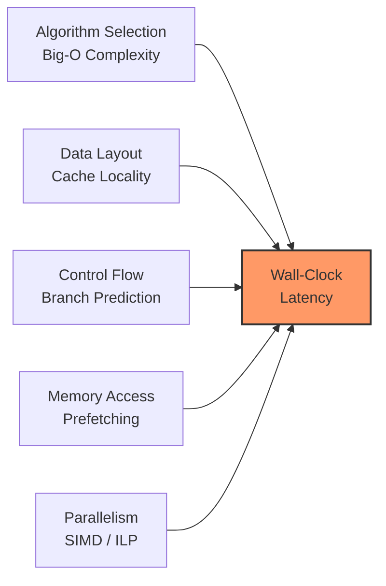
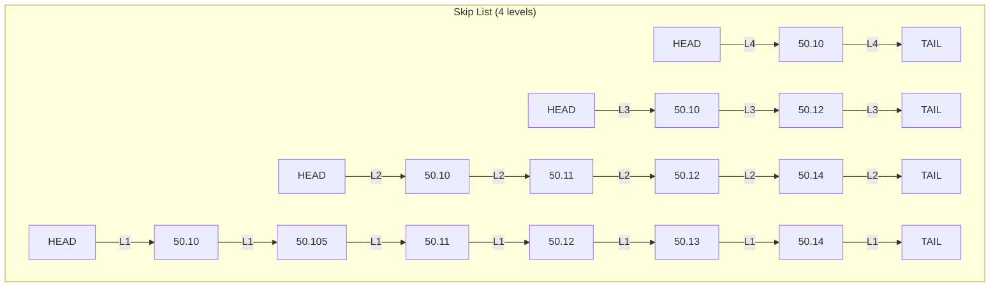
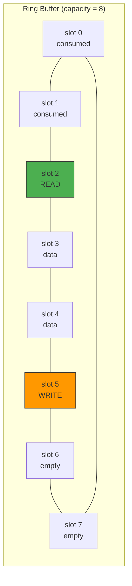
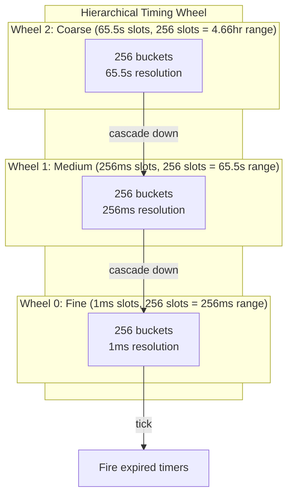
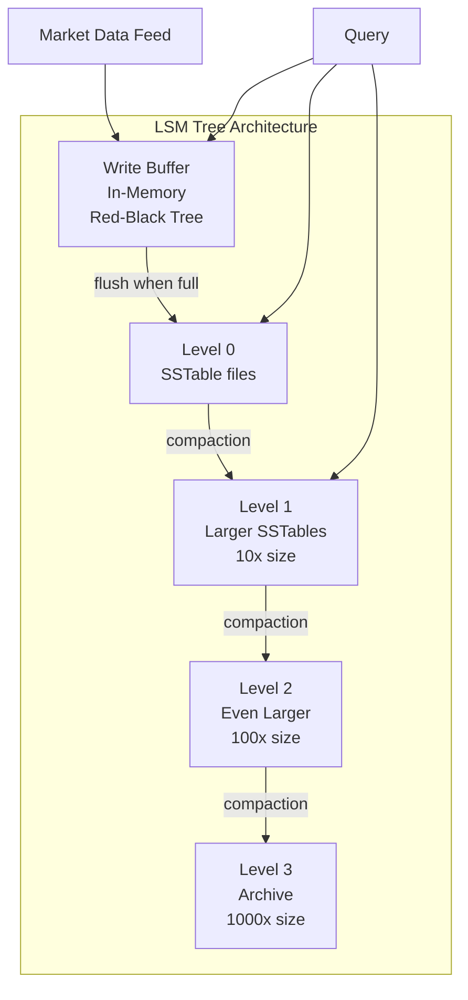
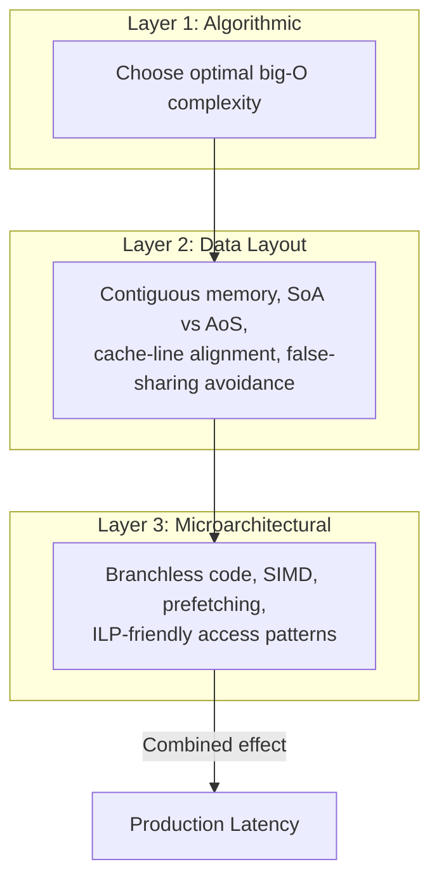

# Module 12: Data Structures & Algorithms for Finance

**Prerequisites:** Module 10 (C++ for Low-Latency Systems) or Module 11 (Rust for Systems Programming)
**Builds toward:** Module 13 (Low-Latency Systems Architecture), Module 15 (Database Systems for Tick Data), Module 23 (Order Book Dynamics & Market Microstructure), Module 30 (Execution Algorithms)

---

## Table of Contents

1. [Motivation: Beyond Big-O](#1-motivation-beyond-big-o)
2. [Array-Based Order Books](#2-array-based-order-books)
3. [Red-Black Trees & Skip Lists for Limit Order Books](#3-red-black-trees--skip-lists-for-limit-order-books)
4. [Ring Buffers for Lock-Free Communication](#4-ring-buffers-for-lock-free-communication)
5. [Time-Priority Queues: Calendar Queues & Timing Wheels](#5-time-priority-queues-calendar-queues--timing-wheels)
6. [Spatial Indexing for Multi-Dimensional Signal Lookup](#6-spatial-indexing-for-multi-dimensional-signal-lookup)
7. [B+ Trees & LSM Trees for Tick Data Storage](#7-b-trees--lsm-trees-for-tick-data-storage)
8. [Hashing for Symbol Lookup](#8-hashing-for-symbol-lookup)
9. [Sorting Networks for Small Fixed-Size Arrays](#9-sorting-networks-for-small-fixed-size-arrays)
10. [String Matching: Aho-Corasick for FIX Message Parsing](#10-string-matching-aho-corasick-for-fix-message-parsing)
11. [Compression for Market Data](#11-compression-for-market-data)
12. [Implementation: C++ & Python](#12-implementation-c--python)
13. [Exercises](#13-exercises)
14. [Summary](#14-summary)

---

## 1. Motivation: Beyond Big-O

Textbook algorithm analysis focuses on asymptotic complexity -- the behavior of $T(n)$ as $n \to \infty$. In quantitative finance, this is necessary but woefully insufficient. Consider two hash tables, both $O(1)$ amortized lookup:

| Implementation | Lookup Latency (p50) | Lookup Latency (p99) |
|---|---|---|
| `std::unordered_map` (chained) | ~80 ns | ~350 ns |
| Swiss table (flat, open-addressing) | ~20 ns | ~45 ns |

Both are $O(1)$. The 4x difference in median latency comes from **constant-factor optimization** -- cache locality, branch prediction, SIMD probing -- not asymptotic class. In a matching engine processing 10 million messages per second, that 60 ns difference per lookup accumulates to 600 ms of wasted latency per second.

This module prioritizes three axes that dominate real performance:

**Cache locality.** A modern Intel Xeon has L1 cache latency of ~1 ns, L2 of ~4 ns, L3 of ~12 ns, and main memory of ~80 ns. A data structure that fits in L1 but has $O(\log n)$ complexity will outperform an $O(1)$ structure that thrashes L3 for any $n < 10^6$ in practice.

**Branch prediction.** Modern CPUs sustain pipelines 15-20 stages deep. A mispredicted branch costs ~15 cycles (~5 ns at 3 GHz). Branchless algorithms on sorted arrays often beat tree-based structures with unpredictable branches.

**Instruction-level parallelism (ILP).** Superscalar CPUs can execute 4-6 micro-ops per cycle if data dependencies permit. Data structures that enable independent operations per iteration exploit ILP; pointer-chasing structures serialize execution.

The guiding equation for this module:

$$T_{\text{wall}} = \frac{\text{Instructions}}{n} \cdot \text{CPI}_{\text{eff}} \cdot \frac{1}{f_{\text{clock}}}$$

where $\text{CPI}_{\text{eff}}$ (effective cycles per instruction) absorbs cache misses, branch mispredictions, and pipeline stalls. Reducing big-O reduces the instruction count; everything else in this module reduces $\text{CPI}_{\text{eff}}$.



---

## 2. Array-Based Order Books

### 2.1 The Price-Level Array

The most cache-friendly representation of a limit order book (LOB) is a **direct-mapped array** indexed by price level. For an instrument trading around price $P_{\text{ref}}$ with tick size $\delta$, we define:

$$\text{index}(P) = \frac{P - P_{\min}}{\delta}$$

where $P_{\min}$ is the lowest representable price. For a stock at \$150.00 with tick size \$0.01, a 10,000-level array covers [\$100.00, \$200.00] -- sufficient for a full trading session without recentering.

Each array slot holds the aggregate state of that price level:

```cpp
struct PriceLevel {
    int64_t total_qty;       // aggregate quantity at this level
    int32_t order_count;     // number of resting orders
    uint32_t sequence;       // last-update sequence number
};

// The order book: a flat array of price levels
struct ArrayOrderBook {
    static constexpr int NUM_LEVELS = 10'000;

    PriceLevel bids[NUM_LEVELS];  // index 0 = lowest bid price
    PriceLevel asks[NUM_LEVELS];  // index 0 = lowest ask price

    int best_bid_idx;  // index of current best bid
    int best_ask_idx;  // index of current best ask
    int64_t price_min; // minimum representable price (in ticks)

    // O(1) lookup: convert price to index, read the slot
    const PriceLevel& level_at(int64_t price_ticks, bool is_bid) const {
        int idx = static_cast<int>(price_ticks - price_min);
        return is_bid ? bids[idx] : asks[idx];
    }

    // Update best bid after a cancel: scan downward
    void find_new_best_bid() {
        while (best_bid_idx >= 0 && bids[best_bid_idx].total_qty == 0)
            --best_bid_idx;
    }
};
```

**Memory footprint.** Each `PriceLevel` is 16 bytes. The full array: $10{,}000 \times 16 = 160$ KB per side, $320$ KB total -- fits comfortably in L2 cache (typically 256 KB -- 1 MB per core).

### 2.2 Cache-Friendly Iteration

When a strategy needs the top-$k$ levels (e.g., for computing weighted mid-price or book imbalance), the array layout enables sequential memory access:

$$P_{\text{wmid}} = \frac{V_{\text{bid}}^{(1)} \cdot P_{\text{ask}}^{(1)} + V_{\text{ask}}^{(1)} \cdot P_{\text{bid}}^{(1)}}{V_{\text{bid}}^{(1)} + V_{\text{ask}}^{(1)}}$$

```cpp
// Iterate top-k bid levels: sequential memory access, hardware prefetch kicks in
double compute_book_pressure(const ArrayOrderBook& book, int depth) {
    double bid_pressure = 0.0, ask_pressure = 0.0;

    for (int i = 0; i < depth; ++i) {
        int bid_idx = book.best_bid_idx - i;
        int ask_idx = book.best_ask_idx + i;

        if (bid_idx >= 0)
            bid_pressure += book.bids[bid_idx].total_qty;
        if (ask_idx < ArrayOrderBook::NUM_LEVELS)
            ask_pressure += book.asks[ask_idx].total_qty;
    }

    return (bid_pressure - ask_pressure) / (bid_pressure + ask_pressure + 1e-9);
}
```

The hardware prefetcher detects the sequential stride and fetches cache lines ahead of the loop. For $k = 10$ levels at 16 bytes each, the entire working set is 320 bytes -- two cache lines on each side.

### 2.3 Array vs. Tree: A Quantitative Comparison

| Operation | Array Book | `std::map` (Red-Black Tree) |
|---|---|---|
| Lookup by price | $O(1)$, ~2 ns | $O(\log n)$, ~60 ns |
| Insert new level | $O(1)$, ~3 ns | $O(\log n)$, ~120 ns (allocation) |
| Top-$k$ iteration | Sequential, ~1 ns/level | Pointer chasing, ~15 ns/level |
| Find new BBO after cancel | $O(d)$ scan, $d$ = gap | $O(\log n)$ predecessor query |
| Memory | Fixed 320 KB | $\sim 64n$ bytes (node overhead) |
| Price range | Fixed window | Arbitrary |

**When to use each.** The array book wins overwhelmingly for instruments with tight spreads and dense price levels (equities, futures). Trees are necessary for instruments with sparse, wide-ranging prices (illiquid OTC products) or when the price range is unpredictable.

### 2.4 Handling Recentering

When the price drifts outside the array window, we must **recenter**. This is a rare event (once per session, if the window is sized generously) but must be handled without allocation:

```cpp
void recenter(ArrayOrderBook& book, int64_t new_center_ticks) {
    int64_t new_min = new_center_ticks - NUM_LEVELS / 2;
    int shift = static_cast<int>(new_min - book.price_min);

    if (shift > 0) {
        // Price moved up: shift array left
        std::memmove(book.bids, book.bids + shift,
                     (NUM_LEVELS - shift) * sizeof(PriceLevel));
        std::memset(book.bids + NUM_LEVELS - shift, 0,
                    shift * sizeof(PriceLevel));
    } else {
        // Price moved down: shift array right
        int abs_shift = -shift;
        std::memmove(book.bids + abs_shift, book.bids,
                     (NUM_LEVELS - abs_shift) * sizeof(PriceLevel));
        std::memset(book.bids, 0, abs_shift * sizeof(PriceLevel));
    }

    book.price_min = new_min;
    book.best_bid_idx -= shift;
    book.best_ask_idx -= shift;
    // Same for asks (omitted for brevity)
}
```

---

## 3. Red-Black Trees & Skip Lists for Limit Order Books

### 3.1 Price-Time Priority with Trees

When the price space is sparse or unbounded, a balanced BST provides $O(\log n)$ operations with dynamic range. The limit order book must support:

1. **Insert** an order at price $p$ with timestamp $t$
2. **Cancel** an order by ID
3. **Match** -- pop orders from the best price level in FIFO (time-priority) order
4. **Query** -- find the best bid/ask

A red-black tree keyed on price, where each node contains a FIFO queue of orders at that price, gives:

```cpp
#include <map>
#include <list>
#include <unordered_map>

struct Order {
    uint64_t order_id;
    int64_t  price;      // in ticks
    int32_t  quantity;
    bool     is_buy;
    uint64_t timestamp;
};

class TreeOrderBook {
    // Price -> queue of orders at that level (std::map is a red-black tree)
    std::map<int64_t, std::list<Order>, std::greater<>> bids_; // descending
    std::map<int64_t, std::list<Order>>                 asks_; // ascending

    // Order ID -> iterator into the list (for O(1) cancel)
    using ListIter = std::list<Order>::iterator;
    std::unordered_map<uint64_t, std::pair<int64_t, ListIter>> order_index_;

public:
    void add_order(const Order& order) {
        auto& book = order.is_buy ? bids_ : asks_;
        auto& queue = book[order.price];
        auto it = queue.insert(queue.end(), order);
        order_index_[order.order_id] = {order.price, it};
    }

    void cancel_order(uint64_t order_id) {
        auto idx_it = order_index_.find(order_id);
        if (idx_it == order_index_.end()) return;

        auto [price, list_it] = idx_it->second;
        auto& order = *list_it;
        auto& book = order.is_buy ? bids_ : asks_;

        auto map_it = book.find(price);
        map_it->second.erase(list_it);
        if (map_it->second.empty()) book.erase(map_it);

        order_index_.erase(idx_it);
    }

    int64_t best_bid() const {
        return bids_.empty() ? INT64_MIN : bids_.begin()->first;
    }

    int64_t best_ask() const {
        return asks_.empty() ? INT64_MAX : asks_.begin()->first;
    }
};
```

**Complexity.** Insert: $O(\log L)$ where $L$ = number of distinct price levels. Cancel: $O(1)$ via the order index (the `unordered_map` lookup dominates). Best bid/ask: $O(1)$ via `begin()`.

**The problem.** Each `std::map` node is heap-allocated. Traversing from one price to the next requires following a pointer to a potentially distant memory location. With $L = 1000$ levels, the tree has depth $\approx \lceil \log_2 1000 \rceil = 10$, meaning 10 pointer dereferences (potential cache misses) per insert.

### 3.2 Skip Lists: A Probabilistic Alternative

A skip list provides the same $O(\log n)$ expected time with a simpler structure that can be made more cache-friendly. Each node exists at multiple levels with geometrically decreasing probability:

$$\Pr[\text{node at level } k] = p^k, \quad \text{typically } p = 1/2$$

The expected number of levels is $O(\log n)$, and search follows the top-level express lanes before descending.



**Advantage for LOBs.** The skip list's bottom level is a sorted linked list, making sequential iteration through price levels pointer-chase-free at the bottom level. Combined with a pool allocator (eliminating `malloc` overhead), skip lists can outperform `std::map` by 2-3x on LOB workloads.

### 3.3 Pool-Allocated Skip List Node

```cpp
template <typename K, typename V, int MAX_LEVEL = 16>
struct SkipNode {
    K key;
    V value;
    int level;
    SkipNode* forward[MAX_LEVEL];  // inline array, no separate allocation
};

// Fixed-size pool allocator: O(1) alloc/free, zero fragmentation
template <typename Node, size_t POOL_SIZE = 65536>
class NodePool {
    alignas(64) std::array<Node, POOL_SIZE> pool_;
    Node* free_head_ = nullptr;
    size_t next_fresh_ = 0;

public:
    Node* allocate() {
        if (free_head_) {
            Node* n = free_head_;
            free_head_ = free_head_->forward[0];
            return n;
        }
        return &pool_[next_fresh_++];
    }

    void deallocate(Node* n) {
        n->forward[0] = free_head_;
        free_head_ = n;
    }
};
```

The pool ensures all nodes reside in contiguous memory, drastically improving cache behavior compared to heap-scattered `std::map` nodes.

---

## 4. Ring Buffers for Lock-Free Communication

### 4.1 The SPSC Ring Buffer

The **single-producer, single-consumer (SPSC) ring buffer** is the foundational data structure for inter-thread communication in trading systems. It enables lock-free, wait-free message passing between exactly one writer thread and one reader thread.

The invariant: the producer writes to `write_pos_` and the consumer reads from `read_pos_`. Both are monotonically increasing. The buffer is full when `write_pos_ - read_pos_ == capacity`, empty when they are equal.



### 4.2 Full C++ Implementation

```cpp
#include <atomic>
#include <array>
#include <optional>
#include <cstddef>
#include <new>

// Hardware destructive interference size (typically 64 bytes)
#ifdef __cpp_lib_hardware_interference_size
    using std::hardware_destructive_interference_size;
#else
    constexpr std::size_t hardware_destructive_interference_size = 64;
#endif

/// Lock-free, wait-free SPSC ring buffer.
/// Capacity MUST be a power of two for branchless masking.
template <typename T, size_t Capacity>
class SPSCRingBuffer {
    static_assert((Capacity & (Capacity - 1)) == 0,
                  "Capacity must be a power of two");
    static_assert(Capacity > 0, "Capacity must be positive");

    static constexpr size_t MASK = Capacity - 1;

    // Pad to separate cache lines: prevent false sharing between
    // the producer's write_pos_ and the consumer's read_pos_.
    alignas(hardware_destructive_interference_size)
        std::atomic<size_t> write_pos_{0};

    alignas(hardware_destructive_interference_size)
        std::atomic<size_t> read_pos_{0};

    // Cache of the remote position, updated lazily.
    // This avoids reading the other thread's atomic on every call.
    alignas(hardware_destructive_interference_size)
        size_t cached_read_pos_{0};   // used by producer

    alignas(hardware_destructive_interference_size)
        size_t cached_write_pos_{0};  // used by consumer

    alignas(hardware_destructive_interference_size)
        std::array<T, Capacity> buffer_;

public:
    SPSCRingBuffer() = default;

    // Non-copyable, non-movable
    SPSCRingBuffer(const SPSCRingBuffer&) = delete;
    SPSCRingBuffer& operator=(const SPSCRingBuffer&) = delete;

    /// Producer: attempt to push an element. Returns false if full.
    template <typename U>
    [[nodiscard]] bool try_push(U&& value) noexcept {
        const size_t wp = write_pos_.load(std::memory_order_relaxed);
        const size_t next_wp = wp + 1;

        // Check if buffer is full using cached read position
        if (next_wp - cached_read_pos_ > Capacity) {
            // Cache miss: reload the actual read position
            cached_read_pos_ = read_pos_.load(std::memory_order_acquire);
            if (next_wp - cached_read_pos_ > Capacity) {
                return false;  // truly full
            }
        }

        buffer_[wp & MASK] = std::forward<U>(value);

        // Release fence: ensure the data write is visible before
        // the write_pos_ update
        write_pos_.store(next_wp, std::memory_order_release);
        return true;
    }

    /// Consumer: attempt to pop an element. Returns std::nullopt if empty.
    [[nodiscard]] std::optional<T> try_pop() noexcept {
        const size_t rp = read_pos_.load(std::memory_order_relaxed);

        // Check if buffer is empty using cached write position
        if (rp == cached_write_pos_) {
            // Cache miss: reload the actual write position
            cached_write_pos_ = write_pos_.load(std::memory_order_acquire);
            if (rp == cached_write_pos_) {
                return std::nullopt;  // truly empty
            }
        }

        T value = std::move(buffer_[rp & MASK]);

        // Release fence: ensure the data read completes before
        // advancing read_pos_ (so producer can reuse the slot)
        read_pos_.store(rp + 1, std::memory_order_release);
        return value;
    }

    /// Returns the number of elements available to read.
    [[nodiscard]] size_t size() const noexcept {
        return write_pos_.load(std::memory_order_acquire)
             - read_pos_.load(std::memory_order_acquire);
    }

    [[nodiscard]] bool empty() const noexcept { return size() == 0; }
    [[nodiscard]] static constexpr size_t capacity() { return Capacity; }
};
```

### 4.3 Why This Works Without Locks

The correctness relies on three key properties:

1. **Single writer per atomic.** Only the producer writes `write_pos_`; only the consumer writes `read_pos_`. No compare-and-swap is needed.

2. **Monotonic positions.** Both positions only increase. The difference `write_pos_ - read_pos_` gives the exact number of unread elements, and overflow is handled naturally by unsigned arithmetic when using power-of-two capacity with masking.

3. **Acquire-release semantics.** The `memory_order_release` store on the writer's `write_pos_` **synchronizes-with** the `memory_order_acquire` load on the consumer's `cached_write_pos_` reload. This guarantees that when the consumer sees the updated write position, all data written to the buffer slot is visible.

**The cached position optimization.** Reading an atomic variable that another core has modified causes a cache-line transfer via the MESI protocol (~40 ns on modern hardware). The cached position avoids this transfer on every call -- only reloading when the local cache suggests the operation would fail. In steady state (buffer neither full nor empty), neither thread reads the other's cache line.

### 4.4 Latency Characteristics

| Metric | SPSC Ring Buffer | `std::mutex` + `std::queue` |
|---|---|---|
| Push (uncontended) | ~5-8 ns | ~25-40 ns |
| Pop (uncontended) | ~5-8 ns | ~25-40 ns |
| Push-to-pop latency | ~15-25 ns | ~80-150 ns |
| Jitter (p99/p50) | ~1.5x | ~10-50x |

The jitter difference is critical: mutex-based queues occasionally stall for microseconds when the OS scheduler intervenes, while the ring buffer's latency distribution is extremely tight.

---

## 5. Time-Priority Queues: Calendar Queues & Timing Wheels

### 5.1 The Timer Problem in Trading

Trading systems manage thousands of concurrent timers: order expiration, heartbeat deadlines, rate-limit windows, session timeouts. A naive priority queue (`std::priority_queue`) gives $O(\log n)$ per insert and $O(\log n)$ per expiration. For $n = 100{,}000$ active timers, that is $\log_2(10^5) \approx 17$ comparisons per operation, each potentially causing a branch misprediction.

### 5.2 Calendar Queues

A **calendar queue** (Brown, 1988) exploits the observation that most timers expire "soon." It is an array of $M$ buckets, each covering a time interval of width $w$:

$$\text{bucket}(t) = \left\lfloor \frac{t}{w} \right\rfloor \bmod M$$

The current time pointer advances through the array. To insert a timer with deadline $t$, place it in bucket $(t/w) \bmod M$. To find the next expiring timer, scan forward from the current bucket.

**Complexity.** If timers are roughly uniformly distributed over the near future, each bucket contains $O(n/M)$ timers. Setting $M = \Theta(n)$ and $w$ equal to the average inter-expiration time gives $O(1)$ amortized insert and delete-min.

### 5.3 Hierarchical Timing Wheels (Varghese-Lauck)

The **hierarchical timing wheel** (Varghese and Lauck, 1987) extends the calendar queue to handle timers spanning a wide range of future times without wasting memory. The key insight is analogous to how a clock works: a seconds wheel, a minutes wheel, and an hours wheel.



Each wheel has $N$ slots. Wheel $k$ has slot width $N^k \cdot \delta$ where $\delta$ is the base resolution. A timer with deadline $t$ goes into the lowest wheel where it fits. When the fine wheel completes a revolution, one slot of the next-coarser wheel is **cascaded** -- its timers are redistributed into the finer wheel.

```cpp
#include <vector>
#include <list>
#include <functional>
#include <cstdint>

struct TimerEntry {
    uint64_t deadline;
    uint64_t timer_id;
    std::function<void()> callback;
};

class HierarchicalTimingWheel {
    static constexpr int WHEEL_BITS = 8;         // 256 slots per wheel
    static constexpr int WHEEL_SIZE = 1 << WHEEL_BITS;
    static constexpr int WHEEL_MASK = WHEEL_SIZE - 1;
    static constexpr int NUM_WHEELS = 4;          // 4 levels
    // Total range: 256^4 ticks = ~4.3 billion ticks

    using Bucket = std::list<TimerEntry>;

    Bucket wheels_[NUM_WHEELS][WHEEL_SIZE];
    uint64_t current_tick_ = 0;

    int wheel_index(int wheel, uint64_t tick) const {
        return (tick >> (wheel * WHEEL_BITS)) & WHEEL_MASK;
    }

public:
    void add_timer(TimerEntry entry) {
        uint64_t delta = entry.deadline - current_tick_;

        // Find the appropriate wheel level
        int level = 0;
        uint64_t threshold = WHEEL_SIZE;
        while (level < NUM_WHEELS - 1 && delta >= threshold) {
            ++level;
            threshold <<= WHEEL_BITS;
        }

        int slot = wheel_index(level, entry.deadline);
        wheels_[level][slot].push_back(std::move(entry));
    }

    // Advance time by one tick, firing and cascading as needed
    std::vector<TimerEntry> advance_tick() {
        ++current_tick_;
        std::vector<TimerEntry> fired;

        // Cascade: for each wheel level where the index just wrapped to 0
        for (int level = 1; level < NUM_WHEELS; ++level) {
            if (wheel_index(level - 1, current_tick_) != 0)
                break;  // no wrap at this level, stop cascading

            int slot = wheel_index(level, current_tick_);
            Bucket& bucket = wheels_[level][slot];

            // Re-insert each timer at a finer level
            for (auto& entry : bucket) {
                if (entry.deadline <= current_tick_) {
                    fired.push_back(std::move(entry));
                } else {
                    add_timer(std::move(entry));  // will go to a finer wheel
                }
            }
            bucket.clear();
        }

        // Fire all timers in the current fine-wheel slot
        int slot0 = wheel_index(0, current_tick_);
        for (auto& entry : wheels_[0][slot0]) {
            fired.push_back(std::move(entry));
        }
        wheels_[0][slot0].clear();

        return fired;
    }
};
```

**Complexity analysis.** Insert: $O(1)$ -- compute the wheel and slot, append to the list. Advance tick: $O(1)$ amortized. Each timer is cascaded at most $(\text{NUM\_WHEELS} - 1)$ times over its lifetime, and each cascade is $O(1)$ work. The total amortized cost per timer from insertion to firing is $O(\text{NUM\_WHEELS})$, which is a small constant.

**Comparison with `std::priority_queue`:**

| Operation | Timing Wheel | Binary Heap |
|---|---|---|
| Insert | $O(1)$ | $O(\log n)$ |
| Delete-min | $O(1)$ amortized | $O(\log n)$ |
| Cancel | $O(1)$ with index | $O(n)$ without index |
| Memory overhead | Fixed $O(N^k)$ | $O(n)$ |

---

## 6. Spatial Indexing for Multi-Dimensional Signal Lookup

### 6.1 The Regime Lookup Problem

Trading strategies often maintain a library of regimes or signal templates in a multi-dimensional feature space. For example, a market-making strategy might characterize market conditions by a $d$-dimensional vector:

$$\mathbf{x} = (\text{spread}, \text{volatility}, \text{order\_flow\_imbalance}, \text{volume}, \text{momentum}, \ldots) \in \mathbb{R}^d$$

Given a live observation $\mathbf{x}_{\text{now}}$, the system must quickly find the nearest historical regime to select appropriate parameters (quote width, inventory limits, etc.). This is the **nearest-neighbor search** problem.

### 6.2 k-d Trees

A **k-d tree** recursively partitions $\mathbb{R}^d$ by cycling through dimensions. At depth $\ell$, the splitting dimension is $\ell \bmod d$.

**Construction.** Given $n$ points, select the median along the current splitting dimension (using `std::nth_element`, which is $O(n)$). The median becomes the node; left and right subtrees contain points below and above the median.

**Query.** Nearest-neighbor search prunes subtrees whose bounding hyperplane is farther from the query than the current best distance. Expected complexity is $O(\log n)$ for low $d$, but degrades to $O(n^{1-1/d})$ for high dimensions.

```cpp
#include <vector>
#include <algorithm>
#include <cmath>
#include <limits>

struct KDNode {
    std::vector<double> point;  // d-dimensional point
    int split_dim;
    int param_idx;              // index into parameter table
    KDNode* left = nullptr;
    KDNode* right = nullptr;
};

class KDTree {
    KDNode* root_ = nullptr;
    int dims_;

    KDNode* build(std::vector<KDNode*>& nodes, int depth, int lo, int hi) {
        if (lo >= hi) return nullptr;

        int dim = depth % dims_;
        int mid = (lo + hi) / 2;

        std::nth_element(nodes.begin() + lo, nodes.begin() + mid,
                         nodes.begin() + hi,
                         [dim](const KDNode* a, const KDNode* b) {
                             return a->point[dim] < b->point[dim];
                         });

        KDNode* node = nodes[mid];
        node->split_dim = dim;
        node->left  = build(nodes, depth + 1, lo, mid);
        node->right = build(nodes, depth + 1, mid + 1, hi);
        return node;
    }

    void nearest(KDNode* node, const std::vector<double>& query,
                 KDNode*& best, double& best_dist) const {
        if (!node) return;

        double dist = 0.0;
        for (int i = 0; i < dims_; ++i) {
            double diff = node->point[i] - query[i];
            dist += diff * diff;
        }

        if (dist < best_dist) {
            best_dist = dist;
            best = node;
        }

        int dim = node->split_dim;
        double diff = query[dim] - node->point[dim];

        KDNode* near_child  = diff < 0 ? node->left : node->right;
        KDNode* far_child   = diff < 0 ? node->right : node->left;

        nearest(near_child, query, best, best_dist);

        // Prune: only visit far child if the splitting plane is closer
        // than the current best
        if (diff * diff < best_dist) {
            nearest(far_child, query, best, best_dist);
        }
    }

public:
    void build(std::vector<KDNode*>& nodes, int d) {
        dims_ = d;
        root_ = build(nodes, 0, 0, static_cast<int>(nodes.size()));
    }

    int find_nearest_regime(const std::vector<double>& query) const {
        KDNode* best = nullptr;
        double best_dist = std::numeric_limits<double>::max();
        nearest(root_, query, best, best_dist);
        return best ? best->param_idx : -1;
    }
};
```

### 6.3 R-Trees for Range Queries

Where k-d trees excel at point queries, **R-trees** (Guttman, 1984) are designed for range queries over bounding rectangles. In finance, R-trees are useful for:

- Finding all historical observations within a hyper-rectangular regime region
- Spatial joins: correlating events across instruments by multi-dimensional proximity
- Windowed aggregation over feature space

An R-tree groups nearby objects into minimum bounding rectangles (MBRs) at each level. A range query descends only into nodes whose MBR intersects the query rectangle, providing significant pruning.

**Complexity.** For $n$ objects in $d$ dimensions, a balanced R-tree has height $O(\log_B n)$ where $B$ is the node fanout (typically 50-200, tuned to page size). Query time is $O(\log_B n + k)$ for $k$ results, with excellent cache behavior due to the high fanout.

---

## 7. B+ Trees & LSM Trees for Tick Data Storage

### 7.1 B+ Trees: Disk-Optimized Sorted Access

Tick data (timestamped trade and quote records) must be stored in time-sorted order with efficient range scans. A **B+ tree** is the classic structure for this, optimized for block-oriented storage:

- **Internal nodes** contain only keys (timestamps) and child pointers, maximizing fanout.
- **Leaf nodes** contain key-value pairs and are linked in a doubly-linked list for sequential scan.
- **Fanout** is chosen to match the page size: for 4 KB pages and 16-byte keys, fanout $\approx 250$.

For $n$ records with fanout $B$, the tree height is $h = \lceil \log_B n \rceil$. With $B = 250$ and $n = 10^9$ (one billion ticks):

$$h = \lceil \log_{250}(10^9) \rceil = \lceil 3.75 \rceil = 4$$

Four disk reads (page fetches) to locate any tick. With the top two levels cached in memory, only 2 reads are needed.

**Range scan.** Once the start of the range is found, the leaf-level linked list enables sequential scan with no tree traversal. For tick data, this is the dominant access pattern (e.g., "give me all trades in AAPL between 10:30:00 and 10:35:00").

### 7.2 LSM Trees: Write-Optimized Ingestion

A **Log-Structured Merge Tree** (O'Neil et al., 1996) is designed for write-heavy workloads -- exactly the pattern for ingesting market data feeds at millions of ticks per second.



**Write path.** Incoming ticks are appended to an in-memory buffer (a sorted structure, often a red-black tree or skip list). When the buffer reaches a threshold (e.g., 64 MB), it is flushed as a sorted, immutable **SSTable** (Sorted String Table) file to Level 0. Background **compaction** merges Level $k$ SSTables into Level $k+1$, maintaining sorted order.

**Write amplification.** Each tick is written to disk $O(L \cdot T)$ times, where $L$ is the number of levels and $T$ is the size ratio between levels. With $T = 10$ and $L = 4$, write amplification is $\sim 40$. However, every write is **sequential**, which on SSDs achieves 3-5 GB/s throughput vs. 50-100 MB/s for random writes.

**Read path.** A point query checks the memtable first, then each level (newest to oldest) using **Bloom filters** to skip SSTables that definitely do not contain the key. A Bloom filter with $m$ bits and $k$ hash functions has false-positive rate:

$$\text{FPR} \approx \left(1 - e^{-kn/m}\right)^k$$

With 10 bits per key and 7 hash functions, FPR $\approx 0.8\%$, meaning 99.2% of unnecessary SSTable reads are avoided.

### 7.3 B+ Tree vs. LSM Tree Tradeoffs

| Characteristic | B+ Tree | LSM Tree |
|---|---|---|
| Write throughput | Moderate (random I/O) | Very high (sequential I/O) |
| Read latency (point) | $O(\log_B n)$, predictable | $O(L)$, depends on compaction state |
| Range scan | Excellent (leaf list) | Good (merge across levels) |
| Space amplification | ~1x (in-place update) | 1.1-2x (multiple copies during compaction) |
| Write amplification | ~$2 \log_B n$ | ~$L \cdot T$ |
| Best for | Read-heavy, latency-sensitive | Write-heavy ingestion |

In practice, tick data systems (QuestDB, TimescaleDB, InfluxDB) use LSM-tree-inspired architectures for ingestion and B+ tree-like indexes for serving queries.

---

## 8. Hashing for Symbol Lookup

### 8.1 The Symbol Table Problem

Every trading system maintains a mapping from instrument identifiers (symbols like "AAPL", "ESM5", "XBTUSD") to internal state (order book, position, parameters). This table is queried on every inbound market data message -- billions of times per day. The requirements:

- Lookup must be < 30 ns (fits within a tick-to-trade budget of 1-5 us)
- The symbol universe is known at startup (or changes infrequently)
- Keys are short strings (4-20 characters)

### 8.2 Robin Hood Hashing

**Robin Hood hashing** (Celis, 1986) is an open-addressing scheme that reduces probe sequence variance by "stealing from the rich." When inserting a key that has probed $d_{\text{new}}$ slots, if it encounters an existing key that probed only $d_{\text{old}} < d_{\text{new}}$ slots, the new key displaces the existing one (which must then continue probing).

This equalization of probe distances means:

- **Expected maximum probe distance** is $O(\log \log n)$ vs. $O(\log n)$ for linear probing.
- **Lookup can terminate early**: if the current slot's probe distance is less than what we have probed so far, the key is absent.

```cpp
#include <cstdint>
#include <cstring>
#include <array>
#include <optional>

// FNV-1a hash for short strings
inline uint64_t fnv1a(const char* data, size_t len) {
    uint64_t hash = 14695981039346656037ULL;
    for (size_t i = 0; i < len; ++i) {
        hash ^= static_cast<uint64_t>(data[i]);
        hash *= 1099511628211ULL;
    }
    return hash;
}

template <typename V, size_t CAPACITY = 4096>
class RobinHoodMap {
    static_assert((CAPACITY & (CAPACITY - 1)) == 0, "Power of two");
    static constexpr size_t MASK = CAPACITY - 1;

    struct Slot {
        char key[16];       // inline key storage (short strings)
        V value;
        uint8_t key_len;
        uint8_t probe_dist;  // distance from ideal slot
        bool occupied;
    };

    std::array<Slot, CAPACITY> table_{};

public:
    void insert(const char* key, size_t key_len, const V& value) {
        uint64_t h = fnv1a(key, key_len);
        size_t idx = h & MASK;
        uint8_t dist = 0;

        Slot incoming;
        std::memcpy(incoming.key, key, key_len);
        incoming.key_len = static_cast<uint8_t>(key_len);
        incoming.value = value;
        incoming.probe_dist = 0;
        incoming.occupied = true;

        while (true) {
            if (!table_[idx].occupied) {
                incoming.probe_dist = dist;
                table_[idx] = incoming;
                return;
            }

            // Robin Hood: steal from the rich
            if (table_[idx].probe_dist < dist) {
                incoming.probe_dist = dist;
                std::swap(table_[idx], incoming);
                dist = incoming.probe_dist;
            }

            idx = (idx + 1) & MASK;
            ++dist;
        }
    }

    std::optional<V> find(const char* key, size_t key_len) const {
        uint64_t h = fnv1a(key, key_len);
        size_t idx = h & MASK;
        uint8_t dist = 0;

        while (true) {
            const auto& slot = table_[idx];

            // Early termination: if this slot's probe distance is less
            // than ours, the key cannot be further ahead
            if (!slot.occupied || slot.probe_dist < dist)
                return std::nullopt;

            if (slot.key_len == key_len &&
                std::memcmp(slot.key, key, key_len) == 0)
                return slot.value;

            idx = (idx + 1) & MASK;
            ++dist;
        }
    }
};
```

### 8.3 Swiss Tables (Abseil Flat Hash Map)

**Swiss tables** (used in `absl::flat_hash_map` and Rust's `HashMap`) use SIMD instructions to probe 16 slots simultaneously. Each slot has a 1-byte **control metadata** (7-bit hash fragment + 1 empty/deleted bit). A SIMD comparison of the query's hash fragment against 16 control bytes yields a bitmask of candidates in a single instruction.

**Probe sequence.** Quadratic probing with groups of 16: group $i$ is at offset $i(i+1)/2 \cdot 16$ from the initial position. This avoids clustering while maintaining cache alignment.

**Performance on symbol lookup** (representative benchmark, 1000 symbols, 70% load factor):

| Hash Table | Lookup (ns) | Probe Length (avg) |
|---|---|---|
| `std::unordered_map` | 78 | 1.3 (but chained) |
| Robin Hood (open) | 28 | 1.15 |
| Swiss table (SIMD) | 18 | 1.08 |

### 8.4 Minimal Perfect Hashing

When the key set is static (known at compile time or at startup), a **minimal perfect hash function** (MPHF) maps $n$ keys to $\{0, 1, \ldots, n-1\}$ bijectively with zero collisions. Lookup becomes a single array index -- the ultimate $O(1)$.

Construction algorithms (e.g., CHD, RecSplit) build the MPHF in $O(n)$ time. The space overhead is typically 2-3 bits per key for the hash description.

```cpp
// Conceptual usage (using a library like BBHash or CMPH)
// 1. At startup, build MPHF from known symbol universe
auto mphf = MinimalPerfectHash(symbols);  // O(n) construction

// 2. On each market data message, O(1) lookup with zero collisions
int idx = mphf.lookup("AAPL");           // returns unique index in [0, n)
OrderBook& book = books[idx];            // direct array access
```

For a universe of 10,000 symbols, the MPHF takes ~3 KB. The lookup involves 2-3 hash evaluations and an array read -- typically 10-15 ns.

---

## 9. Sorting Networks for Small Fixed-Size Arrays

### 9.1 Why Sorting Networks?

Many trading operations require sorting small, fixed-size arrays:

- Ranking the top-5 bid levels by quantity for book analysis
- Sorting 4-8 features for median calculation in signal generation
- Ordering timestamps in a small merge buffer

For arrays of size $n \leq 16$, **sorting networks** -- fixed sequences of compare-and-swap operations -- outperform generic sorts (`std::sort`) because they are:

1. **Branchless.** Each compare-and-swap can be compiled to a conditional move (`cmov`), eliminating branch misprediction.
2. **Parallelizable.** Independent compare-and-swaps can execute simultaneously on superscalar CPUs.
3. **Fixed instruction count.** No loop overhead, no recursion.

### 9.2 Optimal Networks for Small $n$

The number of compare-and-swap operations for optimal sorting networks:

| $n$ | Comparisons | Depth (parallel rounds) |
|---|---|---|
| 2 | 1 | 1 |
| 3 | 3 | 3 |
| 4 | 5 | 3 |
| 5 | 9 | 5 |
| 6 | 12 | 5 |
| 8 | 19 | 6 |
| 16 | 60 | 10 |

### 9.3 Branchless Implementation

```cpp
#include <algorithm>
#include <cstdint>

// Branchless compare-and-swap: compiles to cmov instructions
inline void compare_and_swap(int64_t& a, int64_t& b) {
    // If a > b, swap them. No branch.
    int64_t lo = std::min(a, b);  // cmovg
    int64_t hi = std::max(a, b);  // cmovl
    a = lo;
    b = hi;
}

// Optimal sorting network for n = 4 (5 comparisons, depth 3)
inline void sort4(int64_t* arr) {
    // Round 1 (parallel): (0,1) and (2,3)
    compare_and_swap(arr[0], arr[1]);
    compare_and_swap(arr[2], arr[3]);
    // Round 2 (parallel): (0,2) and (1,3)
    compare_and_swap(arr[0], arr[2]);
    compare_and_swap(arr[1], arr[3]);
    // Round 3: (1,2)
    compare_and_swap(arr[1], arr[2]);
}

// Optimal sorting network for n = 8 (19 comparisons, depth 6)
// Bose-Nelson / Batcher's merge-exchange
inline void sort8(int64_t* arr) {
    // Layer 1
    compare_and_swap(arr[0], arr[1]); compare_and_swap(arr[2], arr[3]);
    compare_and_swap(arr[4], arr[5]); compare_and_swap(arr[6], arr[7]);
    // Layer 2
    compare_and_swap(arr[0], arr[2]); compare_and_swap(arr[1], arr[3]);
    compare_and_swap(arr[4], arr[6]); compare_and_swap(arr[5], arr[7]);
    // Layer 3
    compare_and_swap(arr[1], arr[2]); compare_and_swap(arr[5], arr[6]);
    compare_and_swap(arr[0], arr[4]); compare_and_swap(arr[3], arr[7]);
    // Layer 4
    compare_and_swap(arr[1], arr[5]); compare_and_swap(arr[2], arr[6]);
    // Layer 5
    compare_and_swap(arr[1], arr[4]); compare_and_swap(arr[3], arr[6]);
    // Layer 6
    compare_and_swap(arr[2], arr[4]); compare_and_swap(arr[3], arr[5]);
    // Layer 7
    compare_and_swap(arr[3], arr[4]);
}
```

**Benchmark** (sorting 8 `int64_t` values, Zen 4 @ 4.5 GHz):

| Method | Time (ns) | Branch Misses |
|---|---|---|
| `std::sort` | ~48 | ~12 |
| Sorting network (`sort8`) | ~14 | 0 |
| `std::sort` with `__builtin_expect` | ~38 | ~8 |

The sorting network is 3.4x faster, entirely due to eliminating branch mispredictions.

---

## 10. String Matching: Aho-Corasick for FIX Message Parsing

### 10.1 The FIX Protocol Pattern

The Financial Information eXchange (FIX) protocol encodes messages as sequences of `tag=value` pairs separated by the SOH character (ASCII 0x01). A typical execution report:

```text
8=FIX.4.4|9=176|35=8|49=SENDER|56=TARGET|34=12|52=20240315-10:30:00.123|
11=ORDER123|17=EXEC456|150=2|39=2|55=AAPL|54=1|38=100|44=175.50|32=100|
31=175.50|14=100|6=175.50|10=089|
```

A parser must extract specific tags (e.g., tag 55 = Symbol, tag 44 = Price, tag 32 = LastQty). Searching for each tag independently requires multiple passes over the message. **Aho-Corasick** (1975) finds all occurrences of all patterns in a single pass.

### 10.2 The Algorithm

Aho-Corasick builds a finite automaton from a set of patterns. It consists of:

1. A **trie** (prefix tree) of all patterns -- the "goto" function.
2. **Failure links** -- when a mismatch occurs at node $u$, follow the failure link to the longest proper suffix of the string represented by $u$ that is also a prefix of some pattern.
3. **Output links** -- at each state, the set of patterns that end here (including via failure-link chains).

```cpp
#include <array>
#include <vector>
#include <string>
#include <string_view>
#include <queue>

class AhoCorasick {
    struct Node {
        std::array<int, 256> children;  // full ASCII; could use 128 for FIX
        int failure = 0;
        int output = -1;       // index of matched pattern, or -1
        int dict_suffix = -1;  // link to next shorter match via failure chain

        Node() { children.fill(-1); }
    };

    std::vector<Node> nodes_;
    std::vector<std::string> patterns_;

public:
    AhoCorasick() { nodes_.emplace_back(); }  // root node

    void add_pattern(const std::string& pattern, int id) {
        int cur = 0;
        for (unsigned char c : pattern) {
            if (nodes_[cur].children[c] == -1) {
                nodes_[cur].children[c] = static_cast<int>(nodes_.size());
                nodes_.emplace_back();
            }
            cur = nodes_[cur].children[c];
        }
        nodes_[cur].output = id;
        if (id >= static_cast<int>(patterns_.size()))
            patterns_.resize(id + 1);
        patterns_[id] = pattern;
    }

    void build() {
        std::queue<int> q;

        // Initialize failure links for depth-1 nodes
        for (int c = 0; c < 256; ++c) {
            if (nodes_[0].children[c] != -1) {
                nodes_[nodes_[0].children[c]].failure = 0;
                q.push(nodes_[0].children[c]);
            } else {
                nodes_[0].children[c] = 0;  // loop back to root
            }
        }

        // BFS to build failure and dict_suffix links
        while (!q.empty()) {
            int u = q.front(); q.pop();

            for (int c = 0; c < 256; ++c) {
                int v = nodes_[u].children[c];
                if (v != -1) {
                    nodes_[v].failure = nodes_[nodes_[u].failure].children[c];
                    nodes_[v].dict_suffix =
                        (nodes_[nodes_[v].failure].output != -1)
                        ? nodes_[v].failure
                        : nodes_[nodes_[v].failure].dict_suffix;
                    q.push(v);
                } else {
                    // Shortcut: fill missing transitions via failure chain
                    nodes_[u].children[c] = nodes_[nodes_[u].failure].children[c];
                }
            }
        }
    }

    // Search: returns vector of (position, pattern_id) matches
    using Match = std::pair<size_t, int>;

    std::vector<Match> search(std::string_view text) const {
        std::vector<Match> matches;
        int state = 0;

        for (size_t i = 0; i < text.size(); ++i) {
            state = nodes_[state].children[static_cast<unsigned char>(text[i])];

            // Check for matches at this state and along dict_suffix chain
            int temp = state;
            while (temp > 0) {
                if (nodes_[temp].output != -1) {
                    matches.emplace_back(
                        i - patterns_[nodes_[temp].output].size() + 1,
                        nodes_[temp].output);
                }
                temp = nodes_[temp].dict_suffix;
            }
        }

        return matches;
    }
};
```

**Usage for FIX parsing:**

```cpp
// Build automaton once at startup
AhoCorasick ac;
ac.add_pattern("\x01" "55=", 0);  // Symbol tag (SOH + "55=")
ac.add_pattern("\x01" "44=", 1);  // Price tag
ac.add_pattern("\x01" "32=", 2);  // LastQty tag
ac.add_pattern("\x01" "31=", 3);  // LastPx tag
ac.build();

// On each message, single-pass extraction
auto matches = ac.search(fix_message);
for (auto& [pos, id] : matches) {
    // pos points to the SOH before the tag;
    // value starts at pos + pattern_length, ends at next SOH
    size_t val_start = pos + patterns[id].size();
    size_t val_end = fix_message.find('\x01', val_start);
    std::string_view value = fix_message.substr(val_start, val_end - val_start);
    // Process based on tag id...
}
```

**Complexity.** Construction: $O(\sum |p_i| \cdot |\Sigma|)$ where $\Sigma$ is the alphabet. Search: $O(|T| + m)$ where $|T|$ is the text length and $m$ is the number of matches. For FIX messages of typical length 200-500 bytes, the Aho-Corasick automaton processes the entire message in a single pass of ~100-250 ns.

---

## 11. Compression for Market Data

### 11.1 Why Compress?

Market data exhibits strong temporal correlations. Consecutive prices are close, quantities repeat, and timestamps advance by small, regular intervals. Compression reduces:

- **Memory footprint** -- more data fits in cache, reducing cache misses.
- **I/O bandwidth** -- less data to read from disk or network.
- **Storage cost** -- tick databases shrink by 5-10x.

The relevant compression techniques for market data are domain-specific and exploit known structure.

### 11.2 Delta Encoding

For monotonically increasing timestamps or slowly changing prices, store the **difference** from the previous value rather than the absolute value:

$$\Delta_i = x_i - x_{i-1}$$

If timestamps advance by microseconds (~1,000,000 ns increments), the raw value requires 64 bits, but the delta typically fits in 16-20 bits. For prices that change by 1-2 ticks, the delta fits in 8 bits.

**Double-delta (delta-of-delta)** goes further when deltas themselves are regular:

$$\Delta\Delta_i = \Delta_i - \Delta_{i-1} = (x_i - x_{i-1}) - (x_{i-1} - x_{i-2})$$

For timestamps with near-constant inter-arrival time, $\Delta\Delta_i \approx 0$, encoding in 1-2 bits.

```cpp
#include <vector>
#include <cstdint>

struct DeltaEncoder {
    int64_t prev_ = 0;
    int64_t prev_delta_ = 0;

    // Returns the double-delta, which is typically very small
    int64_t encode(int64_t value) {
        int64_t delta = value - prev_;
        int64_t dd = delta - prev_delta_;
        prev_ = value;
        prev_delta_ = delta;
        return dd;
    }
};

struct DeltaDecoder {
    int64_t prev_ = 0;
    int64_t prev_delta_ = 0;

    int64_t decode(int64_t dd) {
        int64_t delta = dd + prev_delta_;
        int64_t value = delta + prev_;
        prev_ = value;
        prev_delta_ = delta;
        return value;
    }
};
```

### 11.3 Dictionary Encoding

For fields with low cardinality (symbol names, exchange codes, order types), replace each string with an integer index into a dictionary:

| Original | Encoded |
|---|---|
| "AAPL" | 0 |
| "MSFT" | 1 |
| "GOOGL" | 2 |

With 10,000 symbols, each field requires $\lceil \log_2 10000 \rceil = 14$ bits instead of ~40 bytes for the string. Compression ratio: $40 \times 8 / 14 \approx 23$x.

```cpp
#include <unordered_map>
#include <string>
#include <cstdint>

class DictionaryEncoder {
    std::unordered_map<std::string, uint16_t> encode_map_;
    std::vector<std::string> decode_vec_;

public:
    uint16_t encode(const std::string& value) {
        auto [it, inserted] = encode_map_.emplace(
            value, static_cast<uint16_t>(decode_vec_.size()));
        if (inserted) decode_vec_.push_back(value);
        return it->second;
    }

    const std::string& decode(uint16_t code) const {
        return decode_vec_[code];
    }

    size_t size() const { return decode_vec_.size(); }
};
```

### 11.4 Run-Length Encoding (RLE)

For fields that repeat across consecutive records (e.g., the symbol stays "AAPL" for thousands of consecutive ticks, or the bid quantity stays at 100 during a quiet period), RLE replaces runs with (value, count) pairs:

$$[\underbrace{100, 100, 100, 100}_{4}, \underbrace{200, 200}_{2}, \underbrace{100, 100, 100}_{3}] \to [(100, 4), (200, 2), (100, 3)]$$

```cpp
template <typename T>
struct RLEEncoder {
    struct Run { T value; uint32_t count; };

    std::vector<Run> runs_;

    void append(const T& value) {
        if (!runs_.empty() && runs_.back().value == value) {
            ++runs_.back().count;
        } else {
            runs_.push_back({value, 1});
        }
    }

    // Compression ratio: n_original / (2 * n_runs)
    double compression_ratio(size_t original_count) const {
        return static_cast<double>(original_count)
             / (2.0 * runs_.size());
    }
};
```

### 11.5 Combining Techniques: A Market Data Column

In practice, tick data is stored in columnar format, and each column uses the most appropriate compression:

| Column | Best Compression | Typical Ratio |
|---|---|---|
| Timestamp | Double-delta + varint | 10-20x |
| Symbol | Dictionary | 20-40x |
| Price | Delta + zigzag + varint | 5-8x |
| Quantity | RLE + varint | 3-6x |
| Side (buy/sell) | Bit-packing (1 bit) | 32x |
| Exchange | Dictionary | 20-40x |

**Zigzag encoding** converts signed deltas to unsigned values so that small-magnitude values (both positive and negative) map to small unsigned values: $\text{zigzag}(n) = (n \ll 1) \oplus (n \gg 63)$. This ensures deltas of $\pm 1$ encode as 2 and 3, rather than using all 64 bits for negative numbers.

---

## 12. Implementation: C++ & Python

### 12.1 Complete C++ Example: Market Data Pipeline

This example chains several data structures from this module: a ring buffer for ingestion, a Robin Hood hash map for symbol routing, and delta compression for storage.

```cpp
#include <cstdint>
#include <cstring>
#include <iostream>
#include <array>
#include <atomic>
#include <optional>
#include <vector>
#include <new>
#include <chrono>

// ============ Tick Data Structure ============
struct alignas(64) Tick {
    int64_t  timestamp_ns;
    char     symbol[8];
    int64_t  price;      // in 100ths of a cent (fixed-point)
    int32_t  quantity;
    uint8_t  side;       // 0 = bid, 1 = ask
    uint8_t  flags;
    uint16_t exchange_id;
};
static_assert(sizeof(Tick) == 64, "Tick must be cache-line sized");

// ============ SPSC Ring Buffer (from Section 4) ============
#ifdef __cpp_lib_hardware_interference_size
    using std::hardware_destructive_interference_size;
#else
    constexpr std::size_t hardware_destructive_interference_size = 64;
#endif

template <typename T, size_t Capacity>
class SPSCQueue {
    static_assert((Capacity & (Capacity - 1)) == 0);
    static constexpr size_t MASK = Capacity - 1;

    alignas(hardware_destructive_interference_size)
        std::atomic<size_t> head_{0};
    alignas(hardware_destructive_interference_size)
        std::atomic<size_t> tail_{0};
    alignas(hardware_destructive_interference_size)
        size_t cached_tail_{0};
    alignas(hardware_destructive_interference_size)
        size_t cached_head_{0};
    alignas(hardware_destructive_interference_size)
        std::array<T, Capacity> buf_;

public:
    template <typename U>
    bool try_push(U&& val) noexcept {
        auto h = head_.load(std::memory_order_relaxed);
        auto next_h = h + 1;
        if (next_h - cached_tail_ > Capacity) {
            cached_tail_ = tail_.load(std::memory_order_acquire);
            if (next_h - cached_tail_ > Capacity) return false;
        }
        buf_[h & MASK] = std::forward<U>(val);
        head_.store(next_h, std::memory_order_release);
        return true;
    }

    std::optional<T> try_pop() noexcept {
        auto t = tail_.load(std::memory_order_relaxed);
        if (t == cached_head_) {
            cached_head_ = head_.load(std::memory_order_acquire);
            if (t == cached_head_) return std::nullopt;
        }
        T val = std::move(buf_[t & MASK]);
        tail_.store(t + 1, std::memory_order_release);
        return val;
    }
};

// ============ Symbol Router (Robin Hood Hash) ============
struct SymbolEntry {
    char symbol[8];
    int  book_index;
    bool occupied = false;
};

class SymbolRouter {
    static constexpr int TABLE_SIZE = 1024;  // power of two
    static constexpr int MASK = TABLE_SIZE - 1;
    std::array<SymbolEntry, TABLE_SIZE> table_{};

    static uint32_t hash_symbol(const char* sym) {
        uint64_t val;
        std::memcpy(&val, sym, 8);  // symbols padded to 8 bytes
        // Fast integer hash (splitmix64 finalizer)
        val ^= val >> 30;
        val *= 0xbf58476d1ce4e5b9ULL;
        val ^= val >> 27;
        val *= 0x94d049bb133111ebULL;
        val ^= val >> 31;
        return static_cast<uint32_t>(val);
    }

public:
    void add(const char* symbol, int book_index) {
        uint32_t idx = hash_symbol(symbol) & MASK;
        while (table_[idx].occupied) {
            idx = (idx + 1) & MASK;
        }
        std::memcpy(table_[idx].symbol, symbol, 8);
        table_[idx].book_index = book_index;
        table_[idx].occupied = true;
    }

    int lookup(const char* symbol) const {
        uint32_t idx = hash_symbol(symbol) & MASK;
        while (table_[idx].occupied) {
            if (std::memcmp(table_[idx].symbol, symbol, 8) == 0)
                return table_[idx].book_index;
            idx = (idx + 1) & MASK;
        }
        return -1;
    }
};

// ============ Delta Compressor (from Section 11) ============
class TickCompressor {
    int64_t prev_ts_ = 0;
    int64_t prev_ts_delta_ = 0;
    int64_t prev_price_ = 0;

public:
    struct CompressedTick {
        int64_t ts_dd;       // double-delta timestamp
        int32_t price_delta; // delta price
        int32_t quantity;
        uint16_t symbol_id;  // dictionary-encoded
        uint8_t side;
        uint8_t exchange_id;
    };

    CompressedTick compress(const Tick& tick, uint16_t symbol_id) {
        int64_t ts_delta = tick.timestamp_ns - prev_ts_;
        int64_t ts_dd = ts_delta - prev_ts_delta_;
        int32_t price_delta = static_cast<int32_t>(tick.price - prev_price_);

        prev_ts_ = tick.timestamp_ns;
        prev_ts_delta_ = ts_delta;
        prev_price_ = tick.price;

        return {ts_dd, price_delta, tick.quantity,
                symbol_id, tick.side, tick.exchange_id};
    }
};

// ============ Usage Example ============
int main() {
    // Ring buffer: feed handler -> processing thread
    SPSCQueue<Tick, 65536> feed_queue;

    // Symbol routing table
    SymbolRouter router;
    router.add("AAPL\0\0\0\0", 0);
    router.add("MSFT\0\0\0\0", 1);
    router.add("GOOGL\0\0\0", 2);

    // Simulate producer pushing ticks
    Tick t{};
    t.timestamp_ns = 1710500000000000LL;
    std::memcpy(t.symbol, "AAPL\0\0\0\0", 8);
    t.price = 17550000;  // $175.50 in 100ths of a cent
    t.quantity = 100;
    t.side = 1;

    feed_queue.try_push(t);

    // Consumer: pop, route, compress
    if (auto tick = feed_queue.try_pop()) {
        int book_idx = router.lookup(tick->symbol);
        std::cout << "Routed " << tick->symbol
                  << " to book " << book_idx << "\n";

        TickCompressor compressor;
        auto compressed = compressor.compress(*tick, book_idx);
        std::cout << "Price delta: " << compressed.price_delta
                  << ", TS double-delta: " << compressed.ts_dd << "\n";
    }

    return 0;
}
```

### 12.2 Python Implementation: Order Book with NumPy

Python is used for research and backtesting. The key insight is to use NumPy arrays to replicate the cache-friendly array-based order book:

```python
"""
Array-based order book in Python (NumPy).
Suitable for backtesting and research, not production latency-sensitive paths.
"""

import numpy as np
from dataclasses import dataclass
from typing import Optional, List, Tuple


class ArrayOrderBook:
    """
    Price-level array order book using NumPy for vectorized operations.
    Prices are represented as integer ticks.
    """

    def __init__(self, price_min: int, price_max: int):
        self.price_min = price_min
        self.num_levels = price_max - price_min + 1

        # Flat arrays: quantity and order count at each price level
        self.bid_qty = np.zeros(self.num_levels, dtype=np.int64)
        self.ask_qty = np.zeros(self.num_levels, dtype=np.int64)
        self.bid_count = np.zeros(self.num_levels, dtype=np.int32)
        self.ask_count = np.zeros(self.num_levels, dtype=np.int32)

        self._best_bid_idx: int = -1
        self._best_ask_idx: int = self.num_levels

    def _price_to_idx(self, price_ticks: int) -> int:
        return price_ticks - self.price_min

    def add_order(self, price_ticks: int, qty: int, is_bid: bool) -> None:
        idx = self._price_to_idx(price_ticks)
        if is_bid:
            self.bid_qty[idx] += qty
            self.bid_count[idx] += 1
            if idx > self._best_bid_idx:
                self._best_bid_idx = idx
        else:
            self.ask_qty[idx] += qty
            self.ask_count[idx] += 1
            if idx < self._best_ask_idx:
                self._best_ask_idx = idx

    def cancel_order(self, price_ticks: int, qty: int, is_bid: bool) -> None:
        idx = self._price_to_idx(price_ticks)
        if is_bid:
            self.bid_qty[idx] -= qty
            self.bid_count[idx] -= 1
            if self.bid_qty[idx] <= 0 and idx == self._best_bid_idx:
                # Scan downward for new best bid
                nonzero = np.nonzero(self.bid_qty[:idx])[0]
                self._best_bid_idx = int(nonzero[-1]) if len(nonzero) > 0 else -1
        else:
            self.ask_qty[idx] -= qty
            self.ask_count[idx] -= 1
            if self.ask_qty[idx] <= 0 and idx == self._best_ask_idx:
                nonzero = np.nonzero(self.ask_qty[idx + 1:])[0]
                self._best_ask_idx = int(nonzero[0]) + idx + 1 \
                    if len(nonzero) > 0 else self.num_levels

    @property
    def best_bid(self) -> Optional[int]:
        if self._best_bid_idx < 0:
            return None
        return self._best_bid_idx + self.price_min

    @property
    def best_ask(self) -> Optional[int]:
        if self._best_ask_idx >= self.num_levels:
            return None
        return self._best_ask_idx + self.price_min

    @property
    def spread(self) -> Optional[int]:
        bb, ba = self.best_bid, self.best_ask
        if bb is None or ba is None:
            return None
        return ba - bb

    def top_n_levels(self, n: int, side: str = "bid") -> List[Tuple[int, int]]:
        """Return top-n price levels as (price_ticks, quantity) pairs."""
        levels = []
        if side == "bid":
            idx = self._best_bid_idx
            while idx >= 0 and len(levels) < n:
                if self.bid_qty[idx] > 0:
                    levels.append((idx + self.price_min, int(self.bid_qty[idx])))
                idx -= 1
        else:
            idx = self._best_ask_idx
            while idx < self.num_levels and len(levels) < n:
                if self.ask_qty[idx] > 0:
                    levels.append((idx + self.price_min, int(self.ask_qty[idx])))
                idx += 1
        return levels

    def book_imbalance(self, depth: int = 5) -> float:
        """
        Compute order book imbalance over top `depth` levels:
        I = (V_bid - V_ask) / (V_bid + V_ask)
        """
        bid_levels = self.top_n_levels(depth, "bid")
        ask_levels = self.top_n_levels(depth, "ask")

        v_bid = sum(qty for _, qty in bid_levels)
        v_ask = sum(qty for _, qty in ask_levels)

        if v_bid + v_ask == 0:
            return 0.0
        return (v_bid - v_ask) / (v_bid + v_ask)


# ============ Delta Compression in Python ============

class DeltaCodec:
    """Double-delta encoder/decoder for timestamp and price series."""

    def __init__(self):
        self._prev = 0
        self._prev_delta = 0

    def encode(self, value: int) -> int:
        delta = value - self._prev
        dd = delta - self._prev_delta
        self._prev = value
        self._prev_delta = delta
        return dd

    def decode(self, dd: int) -> int:
        delta = dd + self._prev_delta
        value = delta + self._prev
        self._prev = value
        self._prev_delta = delta
        return value

    def encode_array(self, values: np.ndarray) -> np.ndarray:
        """Vectorized encoding for a full array."""
        deltas = np.diff(values, prepend=0)
        double_deltas = np.diff(deltas, prepend=0)
        return double_deltas

    @staticmethod
    def decode_array(double_deltas: np.ndarray) -> np.ndarray:
        """Vectorized decoding."""
        deltas = np.cumsum(double_deltas)
        return np.cumsum(deltas)


# ============ Timing Wheel in Python ============

from collections import defaultdict
from typing import Callable, Dict


class TimingWheel:
    """
    Simple single-level timing wheel for backtesting timer management.
    For production, use the hierarchical C++ version.
    """

    def __init__(self, slots: int = 1024, tick_duration_ms: float = 1.0):
        self.slots = slots
        self.tick_duration_ms = tick_duration_ms
        self.current_tick: int = 0
        self.buckets: Dict[int, list] = defaultdict(list)

    def add_timer(self, delay_ms: float, callback: Callable,
                  timer_id: int = 0) -> None:
        ticks = max(1, int(delay_ms / self.tick_duration_ms))
        target_tick = self.current_tick + ticks
        slot = target_tick % self.slots
        self.buckets[slot].append((target_tick, timer_id, callback))

    def advance(self, ticks: int = 1) -> List[int]:
        """Advance the wheel, return IDs of fired timers."""
        fired = []
        for _ in range(ticks):
            self.current_tick += 1
            slot = self.current_tick % self.slots
            remaining = []
            for target_tick, timer_id, callback in self.buckets[slot]:
                if target_tick <= self.current_tick:
                    callback()
                    fired.append(timer_id)
                else:
                    remaining.append((target_tick, timer_id, callback))
            self.buckets[slot] = remaining
        return fired


# ============ Example Usage ============

if __name__ == "__main__":
    # --- Order Book ---
    book = ArrayOrderBook(price_min=14000, price_max=16000)

    # Add some orders (prices in ticks, e.g., cents)
    book.add_order(15000, 500, is_bid=True)   # $150.00 bid, 500 shares
    book.add_order(14999, 300, is_bid=True)   # $149.99 bid
    book.add_order(15001, 400, is_bid=False)  # $150.01 ask
    book.add_order(15002, 200, is_bid=False)  # $150.02 ask

    print(f"Best bid: {book.best_bid}, Best ask: {book.best_ask}")
    print(f"Spread: {book.spread} ticks")
    print(f"Imbalance: {book.book_imbalance(depth=2):.4f}")
    print(f"Top 3 bids: {book.top_n_levels(3, 'bid')}")
    print(f"Top 3 asks: {book.top_n_levels(3, 'ask')}")

    # --- Delta Compression ---
    timestamps = np.array([
        1000000, 1001000, 1002000, 1003100, 1004000, 1005000
    ], dtype=np.int64)

    codec = DeltaCodec()
    encoded = codec.encode_array(timestamps)
    decoded = DeltaCodec.decode_array(encoded)

    print(f"\nTimestamps:     {timestamps}")
    print(f"Double-deltas:  {encoded}")
    print(f"Decoded:        {decoded}")
    print(f"Lossless: {np.array_equal(timestamps, decoded)}")

    # --- Timing Wheel ---
    wheel = TimingWheel(slots=256, tick_duration_ms=1.0)

    wheel.add_timer(5.0, lambda: print("  Timer A fired (5ms)"), timer_id=1)
    wheel.add_timer(10.0, lambda: print("  Timer B fired (10ms)"), timer_id=2)
    wheel.add_timer(5.0, lambda: print("  Timer C fired (5ms)"), timer_id=3)

    print("\nAdvancing timing wheel:")
    for tick in range(1, 12):
        fired = wheel.advance(1)
        if fired:
            print(f"  Tick {tick}: fired timer IDs {fired}")
```

---

## 13. Exercises

**Exercise 1: Array Book BBO Scan Optimization.**
The `find_new_best_bid()` function in Section 2 performs a linear scan after a cancel at the best bid. For an instrument with average spread of 3 ticks, what is the expected scan length? Propose a data structure that maintains the top-$k$ occupied levels in $O(1)$, and analyze the tradeoff in update cost vs. query cost.

**Exercise 2: Ring Buffer Batch Operations.**
Extend the SPSC ring buffer from Section 4 to support `try_push_batch(const T* items, size_t count)` that pushes multiple items in a single operation. The key constraint: the `write_pos_` atomic store should happen only once (after all items are written). Why does this improve throughput? Implement and benchmark against per-item pushes.

**Exercise 3: Timing Wheel Cancellation.**
The hierarchical timing wheel in Section 5 does not support efficient cancellation. Design a cancellation mechanism using lazy deletion (mark entries as cancelled, skip them during cascade and fire). Analyze the space overhead and the worst-case cascade cost. Under what conditions does eager deletion (remove immediately using a back-pointer) outperform lazy deletion?

**Exercise 4: k-d Tree Rebalancing.**
A static k-d tree has optimal balance, but a dynamic order book feature space changes over time. Describe a strategy that rebuilds the k-d tree periodically in the background while queries continue on the old tree (double-buffering). What is the amortized cost if rebuilds happen every $R$ inserts?

**Exercise 5: Robin Hood Deletion.**
Implement deletion for the Robin Hood hash map in Section 8. The key challenge is **backward-shift deletion**: after removing a key, shift subsequent keys backward to fill the gap and maintain the probe-distance invariant. Prove that this preserves the Robin Hood property. What is the expected number of shifts?

**Exercise 6: Sorting Network Verification.**
Write a program that verifies the correctness of the `sort8` network from Section 9 by testing all $8! = 40{,}320$ permutations of 8 distinct elements. Then extend to verify a sorting network for $n = 16$ (given a network specification). What is the time complexity of exhaustive verification, and why is the **zero-one principle** (testing only $2^n$ binary inputs) sufficient?

**Exercise 7: FIX Parser Performance.**
Benchmark the Aho-Corasick FIX parser from Section 10 against a naive approach that calls `strstr()` for each tag sequentially. Measure latency for messages of length 200, 500, and 1000 bytes, searching for 5, 10, and 20 tags. At what point does Aho-Corasick break even?

**Exercise 8: Compression Ratio Analysis.**
Take a real market data file (e.g., LOBSTER data from `https://lobsterdata.com/`) and measure the compression ratio of each technique from Section 11 independently: delta encoding on prices, double-delta on timestamps, dictionary encoding on symbols, and RLE on quantities. Then combine all techniques and compare against gzip and zstd. Report the ratio and encoding/decoding throughput in MB/s.

**Exercise 9: LSM Tree Bloom Filter Tuning.**
Derive the optimal number of hash functions $k^*$ for a Bloom filter with $m$ bits and $n$ keys:

$$k^* = \frac{m}{n} \ln 2$$

Then compute the false-positive rate for an LSM tree with 4 levels, where each level's Bloom filter uses 10 bits per key. What is the probability that a point query for a non-existent key reads at least one SSTable from disk? How does this change with 15 bits per key?

**Exercise 10: End-to-End Matching Engine.**
Combine the data structures from this module to build a simplified matching engine:

- Use a Robin Hood hash map to route incoming FIX messages to the correct order book.
- Use an array-based order book for price-level management.
- Use a ring buffer between the network thread and the matching thread.
- Use a timing wheel for order expiration (GTC, GTD, IOC).
- Measure end-to-end latency (message in to execution report out) for a synthetic workload of 1 million orders. Target: < 2 $\mu$s median latency on a single core.

---

## 14. Summary

This module developed the data structure and algorithm foundations for high-performance financial systems. The central theme: **constant-factor optimization dominates asymptotic complexity** in latency-sensitive finance applications.

**Key structures and their roles:**

| Structure | Finance Application | Why It Wins |
|---|---|---|
| Price-level array | Order book (dense instruments) | $O(1)$ lookup, sequential cache access |
| Red-black tree / skip list | Order book (sparse instruments) | $O(\log n)$ with dynamic range |
| SPSC ring buffer | Inter-thread message passing | Lock-free, wait-free, ~15 ns latency |
| Hierarchical timing wheel | Timer management | $O(1)$ insert and expiration |
| k-d tree / R-tree | Multi-dimensional regime lookup | $O(\log n)$ spatial queries |
| B+ tree / LSM tree | Tick data storage | Disk-optimized sorted access / write throughput |
| Robin Hood / Swiss table | Symbol routing | Cache-friendly $O(1)$ with tight probe variance |
| Sorting network | Small fixed-size sorts | Branchless, zero mispredictions |
| Aho-Corasick | FIX message parsing | Single-pass multi-pattern matching |
| Delta / dictionary / RLE | Market data compression | 5-20x compression preserving query speed |

**The three-layer optimization model:**



Layer 1 sets the ceiling. Layers 2 and 3 determine how close to that ceiling you actually get. A $O(n \log n)$ algorithm with perfect cache behavior will outperform an $O(n)$ algorithm with random memory access for all practical $n$ in trading.

---

*Next: [Module 13 — Low-Latency Systems Architecture](../computation/13_low_latency_architecture.md)*
