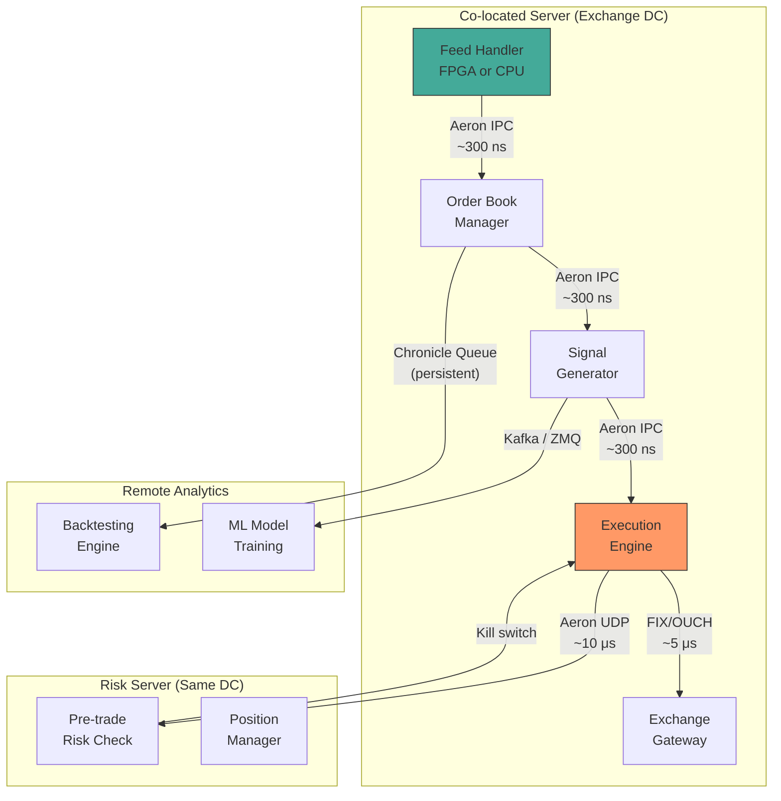
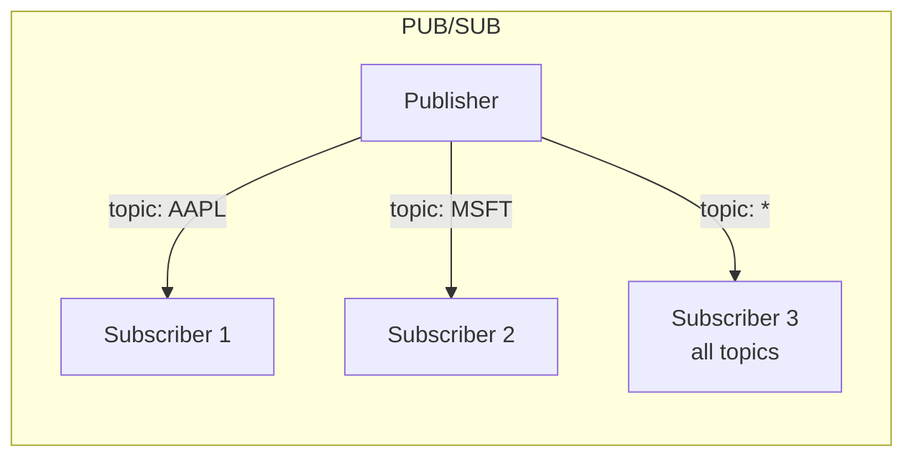
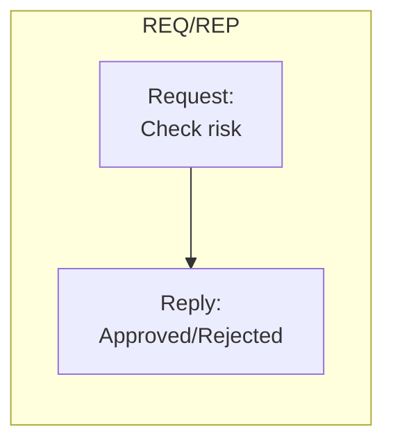
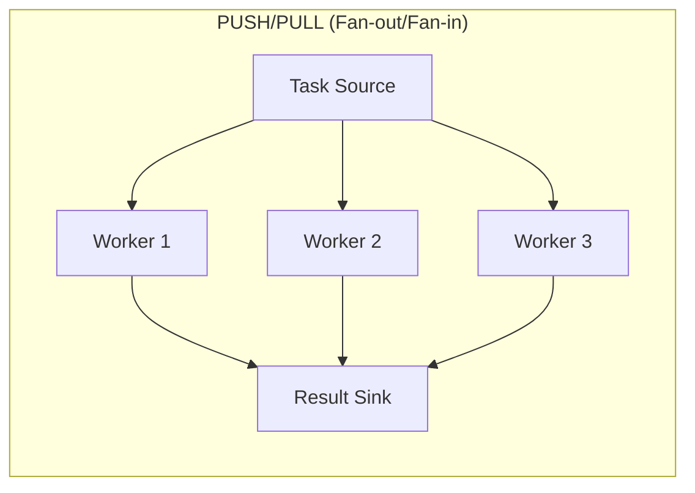
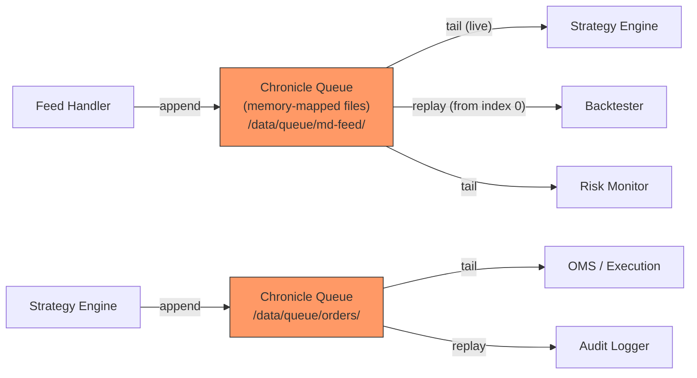
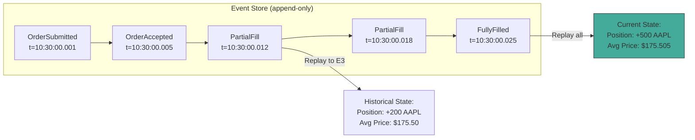
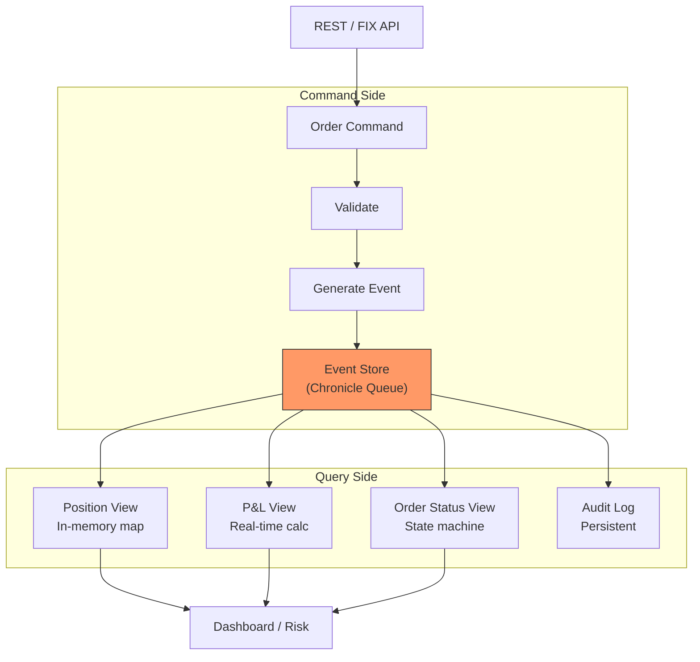
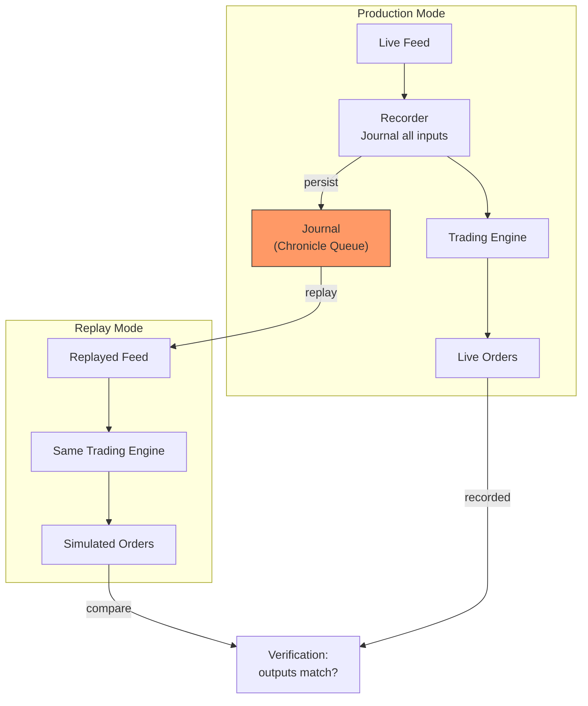
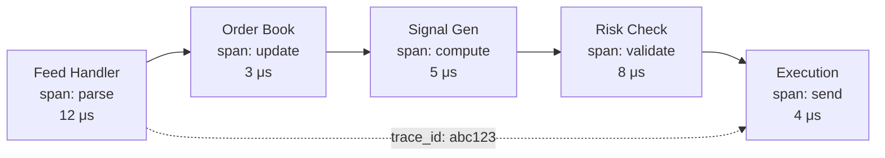
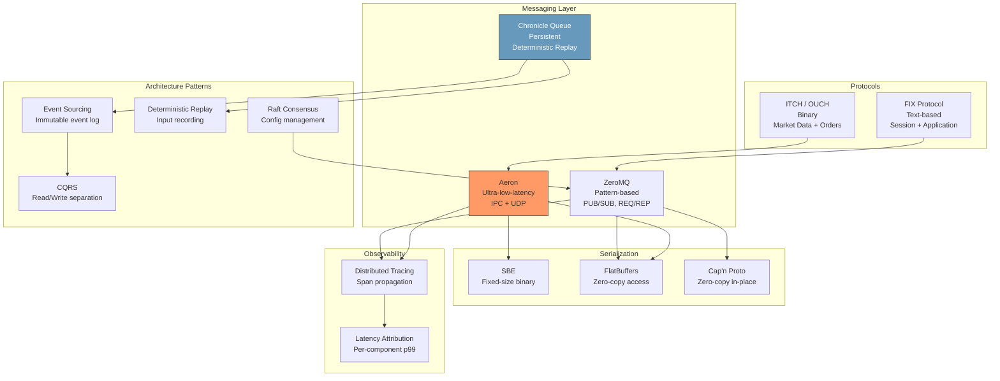

# Module 16: Distributed Systems & Message Queues for Quantitative Finance

**Prerequisites:** Module 10 (C++ for Low-Latency Systems) or Module 11 (Rust for Systems Programming), Module 13 (Low-Latency Systems Architecture)
**Builds toward:** Module 30 (Execution Algorithms), Module 32 (Backtesting Infrastructure)

---

## Table of Contents

1. [Motivation: Why Distributed?](#1-motivation-why-distributed)
2. [Aeron: Ultra-Low-Latency Messaging](#2-aeron-ultra-low-latency-messaging)
3. [ZeroMQ: Versatile Message Patterns](#3-zeromq-versatile-message-patterns)
4. [Chronicle Queue: Persistent Replay](#4-chronicle-queue-persistent-replay)
5. [Message Serialization](#5-message-serialization)
6. [Event Sourcing & CQRS](#6-event-sourcing--cqrs)
7. [Deterministic Replay](#7-deterministic-replay)
8. [Raft Consensus & Configuration Management](#8-raft-consensus--configuration-management)
9. [FIX Protocol](#9-fix-protocol)
10. [ITCH & OUCH Protocols](#10-itch--ouch-protocols)
11. [Monitoring & Observability](#11-monitoring--observability)
12. [Exercises](#12-exercises)
13. [Summary](#13-summary)

---

## 1. Motivation: Why Distributed?

A modern quantitative trading system is not a single process on a single machine. It is a distributed system spanning multiple processes, machines, and often multiple data centers. The distribution arises from fundamental constraints:

**Separation of concerns.** Market data parsing, order book management, signal generation, risk management, execution, and logging have different latency requirements, failure modes, and resource profiles. Running them in a single process means a bug in logging can crash the order router.

**Hardware heterogeneity.** FPGAs parse market data (Module 14), CPUs run strategy logic, GPUs train ML models. Each requires its own process and communication channel.

**Regulatory requirements.** Pre-trade risk checks, audit logging, and compliance monitoring must be independent of the trading process -- often mandated by regulation to be on separate infrastructure.

**Geographic distribution.** Co-located servers near the exchange for latency, remote servers for risk and analytics, disaster recovery sites for continuity.

The challenge is maintaining **microsecond-level latency** across process boundaries while ensuring **reliability** and **deterministic behavior** for debugging and regulatory replay.

| Communication Boundary | Typical Latency | Technology |
|---|---|---|
| Intra-thread (function call) | ~1 ns | Direct call |
| Inter-thread (same process) | ~50--100 ns | Lock-free ring buffer (Module 12) |
| Inter-process (same machine) | ~0.3--1 $\mu$s | Shared memory (Aeron IPC, Chronicle) |
| Inter-machine (same rack) | ~5--15 $\mu$s | Kernel bypass UDP (Aeron, DPDK) |
| Inter-machine (same DC) | ~30--80 $\mu$s | TCP/UDP |
| Inter-datacenter | ~1--50 ms | WAN (fiber: ~5 $\mu$s/km) |



---

## 2. Aeron: Ultra-Low-Latency Messaging

### 2.1 Architecture

Aeron is an efficient, reliable messaging transport designed for high-throughput, low-latency communication. Developed by Real Logic (Martin Thompson), it is the standard messaging layer for latency-sensitive trading systems.

**Key design principles:**
- **Lock-free data structures.** All core data paths use lock-free algorithms (ring buffers with CAS operations), eliminating mutex contention.
- **Zero-copy.** Messages are written directly into memory-mapped log buffers; consumers read from the same buffers without copying.
- **Media driver separation.** The I/O layer (media driver) runs in a dedicated thread or process, isolating network I/O from application logic.
- **Reliable delivery.** NAK-based flow control with configurable retransmission ensures delivery without the overhead of TCP's ACK-per-packet model.

**Transport modes:**

| Transport | Use Case | Latency | Delivery |
|---|---|---|---|
| IPC (shared memory) | Same machine, inter-process | ~300 ns | Reliable |
| UDP unicast | Machine-to-machine | ~5--10 $\mu$s | Reliable (NAK-based) |
| UDP multicast | One-to-many distribution | ~5--10 $\mu$s | Reliable (NAK-based) |

### 2.2 Core Concepts

**Publications and Subscriptions.** A publisher writes messages to a **publication** (identified by channel + stream ID). A subscriber reads from a **subscription** on the same channel and stream. The media driver handles the underlying transport.

**Log Buffers.** Each publication has a log buffer -- a memory-mapped file divided into three term buffers (triple-buffered). The publisher appends messages to the active term; when full, it rotates to the next. This ensures continuous operation without blocking.

**Back Pressure.** If a subscriber falls behind, the publication's offer will return `BACK_PRESSURED`, signaling the publisher to slow down. This is critical in trading: if the risk server cannot keep up, the execution engine must not silently drop risk checks.

### 2.3 C++ Example: Market Data Distribution

```cpp
// Aeron C++ publisher: distributes parsed market data to strategy processes
// Uses IPC transport for same-machine, sub-microsecond latency

#include <aeron/Aeron.h>
#include <aeron/Publication.h>
#include <aeron/Subscription.h>
#include <aeron/concurrent/AtomicBuffer.h>
#include <cstring>
#include <chrono>
#include <iostream>

// Market data message (fixed-size for zero-copy efficiency)
struct alignas(8) MarketDataMsg {
    int64_t  timestamp_ns;
    int64_t  symbol_id;       // enumerated symbol index
    int32_t  bid_price;       // fixed-point, 4 decimal places
    int32_t  ask_price;
    int32_t  bid_size;
    int32_t  ask_size;
    int32_t  last_price;
    int32_t  last_size;
    uint8_t  msg_type;        // 1=quote, 2=trade, 3=bbo
    uint8_t  padding[7];
};
static_assert(sizeof(MarketDataMsg) == 48, "Message must be 48 bytes");


class MarketDataPublisher {
public:
    MarketDataPublisher(const std::string& channel, int stream_id) {
        // Configure Aeron context
        aeron::Context ctx;
        ctx.aeronDir("/dev/shm/aeron-trading");  // shared memory directory

        aeron_ = aeron::Aeron::connect(ctx);

        // Add publication (non-blocking)
        int64_t pub_id = aeron_->addPublication(channel, stream_id);

        // Wait for publication to become connected
        while (!(publication_ = aeron_->findPublication(pub_id))) {
            std::this_thread::yield();
        }
    }

    // Publish a market data message
    // Returns: bytes offered (>0), or negative error code
    int64_t publish(const MarketDataMsg& msg) {
        aeron::concurrent::AtomicBuffer buffer(
            reinterpret_cast<uint8_t*>(const_cast<MarketDataMsg*>(&msg)),
            sizeof(MarketDataMsg)
        );

        int64_t result = publication_->offer(buffer);

        if (result == aeron::BACK_PRESSURED) {
            // Subscriber is slow -- critical: do NOT silently drop
            // Log and potentially trigger slow-consumer alert
            return result;
        }
        if (result == aeron::NOT_CONNECTED) {
            // No subscribers -- may be acceptable during startup
            return result;
        }

        return result;  // > 0: new stream position (success)
    }

private:
    std::shared_ptr<aeron::Aeron> aeron_;
    std::shared_ptr<aeron::Publication> publication_;
};


class MarketDataSubscriber {
public:
    using Callback = std::function<void(const MarketDataMsg&)>;

    MarketDataSubscriber(
        const std::string& channel,
        int stream_id,
        Callback callback
    ) : callback_(std::move(callback)) {
        aeron::Context ctx;
        ctx.aeronDir("/dev/shm/aeron-trading");

        aeron_ = aeron::Aeron::connect(ctx);

        int64_t sub_id = aeron_->addSubscription(channel, stream_id);
        while (!(subscription_ = aeron_->findSubscription(sub_id))) {
            std::this_thread::yield();
        }
    }

    // Poll for messages (call from busy-spin loop)
    int poll(int fragment_limit = 10) {
        auto handler = [this](
            aeron::concurrent::AtomicBuffer& buffer,
            aeron::util::index_t offset,
            aeron::util::index_t length,
            aeron::Header& header
        ) {
            // Zero-copy: cast directly from the log buffer
            const auto* msg = reinterpret_cast<const MarketDataMsg*>(
                buffer.buffer() + offset
            );
            callback_(*msg);
        };

        return subscription_->poll(handler, fragment_limit);
    }

private:
    std::shared_ptr<aeron::Aeron> aeron_;
    std::shared_ptr<aeron::Subscription> subscription_;
    Callback callback_;
};


// Usage example
int main() {
    // IPC channel for same-machine communication
    std::string channel = "aeron:ipc";
    int stream_id = 1001;  // market data stream

    // Publisher (in feed handler process)
    MarketDataPublisher publisher(channel, stream_id);

    MarketDataMsg msg{};
    msg.timestamp_ns = std::chrono::duration_cast<std::chrono::nanoseconds>(
        std::chrono::high_resolution_clock::now().time_since_epoch()
    ).count();
    msg.symbol_id = 42;         // e.g., AAPL
    msg.bid_price = 1755000;    // $175.50
    msg.ask_price = 1755100;    // $175.51
    msg.bid_size  = 500;
    msg.ask_size  = 300;
    msg.msg_type  = 1;          // quote update

    int64_t result = publisher.publish(msg);
    std::cout << "Published at position: " << result << "\n";

    return 0;
}
```

### 2.4 Aeron Latency Characteristics

Measured on a Xeon 8380 with isolated cores and busy-polling:

| Transport | Message Size | Latency (p50) | Latency (p99) | Latency (p99.9) |
|---|---|---|---|---|
| IPC | 48 bytes | 280 ns | 350 ns | 420 ns |
| IPC | 1024 bytes | 310 ns | 380 ns | 460 ns |
| UDP unicast (same rack) | 48 bytes | 5.2 $\mu$s | 6.8 $\mu$s | 8.1 $\mu$s |
| UDP multicast (same rack) | 48 bytes | 5.4 $\mu$s | 7.1 $\mu$s | 8.5 $\mu$s |

The IPC transport achieves sub-microsecond latency because it avoids the kernel entirely -- both publisher and subscriber access the same memory-mapped log buffer in `/dev/shm`.

---

## 3. ZeroMQ: Versatile Message Patterns

### 3.1 Overview

ZeroMQ (0MQ) is a high-level messaging library that provides socket-like abstractions for common distributed patterns. While not as low-latency as Aeron for the hot path, ZeroMQ excels in its pattern diversity and ease of use, making it ideal for:

- Strategy parameter distribution (PUB/SUB)
- Request-reply risk checks (REQ/REP)
- Work distribution for backtesting (PUSH/PULL)
- Internal monitoring and logging pipelines

### 3.2 Socket Patterns







### 3.3 Python Examples

```python
"""
ZeroMQ patterns for trading system communication.
Covers PUB/SUB (market data fan-out), REQ/REP (risk checks),
and PUSH/PULL (backtesting work distribution).
"""

import zmq
import json
import time
import struct
from dataclasses import dataclass, asdict
from typing import Optional
import threading


# ============================================================
# Pattern 1: PUB/SUB -- Market Data / Signal Distribution
# ============================================================

class SignalPublisher:
    """
    Publishes trading signals to all subscribed strategy processes.
    Uses topic-based filtering so each strategy only receives
    signals for its subscribed symbols.
    """

    def __init__(self, endpoint: str = "tcp://*:5555"):
        self.ctx = zmq.Context()
        self.socket = self.ctx.socket(zmq.PUB)
        self.socket.setsockopt(zmq.SNDHWM, 100_000)  # high-water mark
        self.socket.bind(endpoint)
        # PUB sockets need a brief warm-up to establish connections
        time.sleep(0.1)

    def publish_signal(
        self,
        symbol: str,
        signal_name: str,
        value: float,
        timestamp_ns: int,
    ) -> None:
        """
        Publish a signal with topic = symbol.
        Subscribers can filter by symbol prefix.
        """
        # ZMQ PUB/SUB filters on the first frame (topic)
        topic = symbol.encode("utf-8")
        payload = json.dumps({
            "symbol": symbol,
            "signal": signal_name,
            "value": value,
            "timestamp_ns": timestamp_ns,
        }).encode("utf-8")

        self.socket.send_multipart([topic, payload])

    def close(self):
        self.socket.close()
        self.ctx.term()


class SignalSubscriber:
    """
    Subscribes to trading signals for specific symbols.
    """

    def __init__(
        self,
        endpoint: str = "tcp://localhost:5555",
        symbols: Optional[list[str]] = None,
    ):
        self.ctx = zmq.Context()
        self.socket = self.ctx.socket(zmq.SUB)
        self.socket.connect(endpoint)

        if symbols:
            for sym in symbols:
                self.socket.setsockopt(zmq.SUBSCRIBE, sym.encode("utf-8"))
        else:
            # Subscribe to all topics
            self.socket.setsockopt(zmq.SUBSCRIBE, b"")

    def receive(self, timeout_ms: int = 1000) -> Optional[dict]:
        """
        Receive next signal. Returns None on timeout.
        """
        if self.socket.poll(timeout_ms):
            topic, payload = self.socket.recv_multipart()
            return json.loads(payload.decode("utf-8"))
        return None

    def close(self):
        self.socket.close()
        self.ctx.term()


# ============================================================
# Pattern 2: REQ/REP -- Pre-trade Risk Check
# ============================================================

class RiskCheckServer:
    """
    Synchronous risk check server.
    Receives order proposals, validates against position limits,
    and returns approve/reject decisions.
    """

    def __init__(
        self,
        endpoint: str = "tcp://*:5556",
        position_limits: Optional[dict[str, int]] = None,
    ):
        self.ctx = zmq.Context()
        self.socket = self.ctx.socket(zmq.REP)
        self.socket.bind(endpoint)

        # Position limits per symbol (max shares)
        self.limits = position_limits or {}
        self.positions: dict[str, int] = {}

    def run(self) -> None:
        """Run the risk check server (blocking)."""
        while True:
            request = self.socket.recv_json()

            symbol = request["symbol"]
            side = request["side"]         # "BUY" or "SELL"
            quantity = request["quantity"]

            # Current position
            current = self.positions.get(symbol, 0)
            proposed = current + (quantity if side == "BUY" else -quantity)

            limit = self.limits.get(symbol, float("inf"))

            if abs(proposed) <= limit:
                # Approve
                self.positions[symbol] = proposed
                self.socket.send_json({
                    "approved": True,
                    "new_position": proposed,
                    "reason": None,
                })
            else:
                # Reject
                self.socket.send_json({
                    "approved": False,
                    "new_position": current,
                    "reason": f"Position limit breach: "
                              f"|{proposed}| > {limit}",
                })


class RiskCheckClient:
    """
    Client for pre-trade risk check.
    Sends an order proposal and waits for approve/reject.
    """

    def __init__(self, endpoint: str = "tcp://localhost:5556"):
        self.ctx = zmq.Context()
        self.socket = self.ctx.socket(zmq.REQ)
        self.socket.setsockopt(zmq.RCVTIMEO, 5000)  # 5s timeout
        self.socket.connect(endpoint)

    def check_order(
        self,
        symbol: str,
        side: str,
        quantity: int,
        price: float,
    ) -> dict:
        """
        Submit an order for risk check.

        Returns
        -------
        dict
            {'approved': bool, 'new_position': int, 'reason': str|None}
        """
        self.socket.send_json({
            "symbol": symbol,
            "side": side,
            "quantity": quantity,
            "price": price,
        })
        return self.socket.recv_json()

    def close(self):
        self.socket.close()
        self.ctx.term()


# ============================================================
# Pattern 3: PUSH/PULL -- Backtesting Work Distribution
# ============================================================

class BacktestVentilator:
    """
    Distributes backtesting work units (date ranges) across
    multiple worker processes.
    """

    def __init__(self, endpoint: str = "tcp://*:5557"):
        self.ctx = zmq.Context()
        self.socket = self.ctx.socket(zmq.PUSH)
        self.socket.bind(endpoint)

    def distribute(self, work_items: list[dict]) -> int:
        """
        Send work items to workers via round-robin load balancing.

        Parameters
        ----------
        work_items : list[dict]
            Each item: {'symbol': str, 'start_date': str,
                        'end_date': str, 'params': dict}

        Returns
        -------
        int
            Number of work items distributed
        """
        for item in work_items:
            self.socket.send_json(item)
        return len(work_items)


class BacktestWorker:
    """
    Worker process that receives backtesting tasks and
    pushes results to a sink.
    """

    def __init__(
        self,
        pull_endpoint: str = "tcp://localhost:5557",
        push_endpoint: str = "tcp://localhost:5558",
    ):
        self.ctx = zmq.Context()
        self.pull_socket = self.ctx.socket(zmq.PULL)
        self.pull_socket.connect(pull_endpoint)

        self.push_socket = self.ctx.socket(zmq.PUSH)
        self.push_socket.connect(push_endpoint)

    def run(self, backtest_fn) -> None:
        """
        Run worker loop: receive task, execute backtest, push result.

        Parameters
        ----------
        backtest_fn : callable
            Function(work_item: dict) -> dict (results)
        """
        while True:
            work_item = self.pull_socket.recv_json()

            if work_item.get("_sentinel"):
                break  # poison pill to stop worker

            result = backtest_fn(work_item)
            self.push_socket.send_json(result)


# ============================================================
# Pattern 4: Inproc -- Ultra-fast intra-process communication
# ============================================================

def inproc_pipeline_example():
    """
    Demonstrates inproc transport for thread-to-thread communication
    within a single process. Latency: ~1-2 microseconds.
    """
    ctx = zmq.Context()

    def producer(ctx):
        socket = ctx.socket(zmq.PUSH)
        socket.bind("inproc://pipeline")
        for i in range(1000):
            socket.send(struct.pack("!qd", i, 175.50 + i * 0.01))
        socket.send(b"")  # sentinel
        socket.close()

    def consumer(ctx):
        socket = ctx.socket(zmq.PULL)
        socket.connect("inproc://pipeline")
        count = 0
        while True:
            msg = socket.recv()
            if not msg:
                break
            seq, price = struct.unpack("!qd", msg)
            count += 1
        socket.close()
        return count

    # Run in separate threads (inproc requires same context)
    t_prod = threading.Thread(target=producer, args=(ctx,))
    t_cons = threading.Thread(target=consumer, args=(ctx,))
    t_cons.start()
    time.sleep(0.01)  # let consumer bind
    t_prod.start()
    t_prod.join()
    t_cons.join()
    ctx.term()
```

### 3.4 ZeroMQ Transport Comparison

| Transport | Syntax | Use Case | Latency |
|---|---|---|---|
| `tcp://` | `tcp://host:port` | Inter-machine | ~30--80 $\mu$s |
| `ipc://` | `ipc:///tmp/feed.sock` | Inter-process (Unix socket) | ~10--20 $\mu$s |
| `inproc://` | `inproc://name` | Inter-thread (same process) | ~1--2 $\mu$s |
| `pgm://` | `pgm://eth0;239.0.0.1:5555` | Reliable multicast | ~20--50 $\mu$s |

---

## 4. Chronicle Queue: Persistent Replay

### 4.1 Architecture

Chronicle Queue (developed by Chronicle Software) is a persisted, memory-mapped message queue designed for deterministic replay of trading events. It stores every message to disk as it is published, enabling:

- **Post-trade analysis:** Replay the exact sequence of events that led to a trade.
- **Debugging:** Reproduce production bugs by replaying production inputs.
- **Regulatory compliance:** Maintain a tamper-proof audit trail with nanosecond timestamps.
- **Backtesting:** Feed historical data through the same code path as production.

**Key properties:**
- **Memory-mapped persistence:** Messages are written to memory-mapped files, making disk I/O asynchronous (the OS flushes pages in the background). Write latency is dominated by the memcpy to the mapped region, not disk I/O.
- **Deterministic ordering:** Messages are assigned a monotonically increasing index. Replay reads sequentially from any index.
- **Zero-GC in Java:** Uses off-heap memory and flyweight patterns to avoid garbage collection pauses.
- **Shared-memory IPC:** Multiple processes can read and write the same queue via memory-mapped files, similar to Aeron IPC.

### 4.2 Conceptual API and Data Flow



### 4.3 Queue File Layout

Chronicle Queue stores data in **cycle files**, one file per time period (e.g., one per day for daily cycling):

```text
/data/queue/md-feed/
    20240315.cq4                    # March 15 messages
    20240315.cq4t                   # Index file (binary search by index)
    20240318.cq4                    # March 18 messages (skipping weekend)
    metadata.cq4t                   # Queue metadata (cycle format, etc.)
```

Each `.cq4` file is a memory-mapped binary file. Messages are appended sequentially with a header containing the message length and index. The `.cq4t` index file maps logical indices to file offsets for random access.

**Write latency.** Appending a message to Chronicle Queue:
- Memcpy to mapped region: ~100--200 ns
- OS page flush (asynchronous): ~10--100 $\mu$s (does not block the writer)
- fsync (if required for durability): ~1 ms

For trading, the write-path latency is the memcpy cost (~200 ns), since OS page flushing happens asynchronously. Data survives process crashes (mapped pages are flushed by the OS on crash) but not machine crashes (unless fsync is used).

### 4.4 Java Example: Event Journal

```java
// Chronicle Queue: writing and reading market events
// Java example (Chronicle Queue is a Java library;
// C++ wrapper available via Chronicle Wire)

import net.openhft.chronicle.queue.ChronicleQueue;
import net.openhft.chronicle.queue.ExcerptAppender;
import net.openhft.chronicle.queue.ExcerptTailer;
import net.openhft.chronicle.wire.DocumentContext;

public class MarketEventJournal {

    // Append a market event
    public static void writeEvent(
        ChronicleQueue queue,
        long timestampNs,
        String symbol,
        double price,
        int quantity,
        char side
    ) {
        try (ExcerptAppender appender = queue.createAppender()) {
            try (DocumentContext dc = appender.writingDocument()) {
                dc.wire()
                  .write("ts").int64(timestampNs)
                  .write("sym").text(symbol)
                  .write("px").float64(price)
                  .write("qty").int32(quantity)
                  .write("side").int8((byte) side);
            }
        }
    }

    // Tail the queue (live reading, blocks when caught up)
    public static void tailQueue(ChronicleQueue queue) {
        try (ExcerptTailer tailer = queue.createTailer()) {
            while (true) {
                try (DocumentContext dc = tailer.readingDocument()) {
                    if (!dc.isPresent()) {
                        // No new messages; yield and retry
                        Thread.yield();
                        continue;
                    }
                    long ts = dc.wire().read("ts").int64();
                    String sym = dc.wire().read("sym").text();
                    double px = dc.wire().read("px").float64();
                    int qty = dc.wire().read("qty").int32();
                    char side = (char) dc.wire().read("side").int8();

                    // Process the event...
                    System.out.printf(
                        "%d %s %.2f %d %c%n", ts, sym, px, qty, side
                    );
                }
            }
        }
    }

    // Replay from a specific index (for backtesting)
    public static void replayFromIndex(
        ChronicleQueue queue, long startIndex
    ) {
        try (ExcerptTailer tailer = queue.createTailer()) {
            tailer.moveToIndex(startIndex);
            // Read sequentially from here...
        }
    }

    public static void main(String[] args) {
        ChronicleQueue queue = ChronicleQueue.single("/data/queue/md-feed");

        // Write sample events
        writeEvent(queue, System.nanoTime(), "AAPL", 175.50, 100, 'B');
        writeEvent(queue, System.nanoTime(), "MSFT", 420.10, 200, 'S');

        // Tail from the beginning
        tailQueue(queue);
    }
}
```

---

## 5. Message Serialization

### 5.1 The Serialization Tax

Every message crossing a process boundary must be serialized (written to bytes) by the sender and deserialized (parsed from bytes) by the receiver. In a latency-sensitive system, serialization overhead directly adds to the tick-to-trade pipeline:

$$t_{\text{total}} = t_{\text{serialize}} + t_{\text{transport}} + t_{\text{deserialize}}$$

For a 100-byte message on Aeron IPC (~300 ns transport), a serialization framework that takes 500 ns per direction contributes $500 + 500 = 1{,}000$ ns -- more than 3x the transport cost.

### 5.2 Framework Comparison

| Framework | Serialize (ns) | Deserialize (ns) | Wire Size (bytes) | Zero-Copy | Schema Evolution |
|---|---|---|---|---|---|
| Raw struct (`memcpy`) | ~5 | ~5 | 48 (padded) | Yes | No |
| FlatBuffers | ~100 | ~5 (zero-copy) | 56 | Yes | Yes |
| Cap'n Proto | ~50 | ~0 (in-place) | 64 | Yes | Yes |
| SBE | ~30 | ~20 | 48 (no padding waste) | Partial | Yes |
| Protocol Buffers | ~800 | ~600 | 35 (varint) | No | Yes |
| JSON | ~5,000 | ~8,000 | 120+ | No | Yes |
| MessagePack | ~1,200 | ~1,000 | 50 | No | Partial |

For the hot path, FlatBuffers, Cap'n Proto, and SBE are the viable options. Protocol Buffers and JSON are used only for non-latency-sensitive paths (configuration, logging, monitoring).

### 5.3 FlatBuffers

FlatBuffers (developed by Google) serializes data into a flat binary buffer that can be read without parsing -- the "deserialization" cost is zero because accessors read directly from the buffer at computed offsets.

**Schema definition:**

```flatbuffers
// market_data.fbs -- FlatBuffers schema for market data messages

namespace trading.messages;

enum Side : byte { Buy = 0, Sell = 1, Unknown = 2 }
enum MsgType : byte { Quote = 0, Trade = 1, BBO = 2 }

table MarketDataMsg {
    timestamp_ns: long;
    symbol_id:    ushort;
    bid_price:    int;      // fixed-point, 4 decimal places
    ask_price:    int;
    bid_size:     int;
    ask_size:     int;
    last_price:   int;
    last_size:    int;
    msg_type:     MsgType = Quote;
    side:         Side = Unknown;
}

root_type MarketDataMsg;
```

**Python usage:**

```python
"""
FlatBuffers serialization for trading messages.
Zero-copy deserialization: accessors read directly from the buffer.
"""

import flatbuffers
# Generated by: flatc --python market_data.fbs
from trading.messages import MarketDataMsg as MdMsg

import time
import struct


def serialize_market_data(
    timestamp_ns: int,
    symbol_id: int,
    bid_price: int,
    ask_price: int,
    bid_size: int,
    ask_size: int,
) -> bytes:
    """
    Serialize a market data message to FlatBuffers binary format.

    Returns
    -------
    bytes
        Serialized FlatBuffer (typically 56-64 bytes)
    """
    builder = flatbuffers.Builder(128)

    MdMsg.Start(builder)
    MdMsg.AddTimestampNs(builder, timestamp_ns)
    MdMsg.AddSymbolId(builder, symbol_id)
    MdMsg.AddBidPrice(builder, bid_price)
    MdMsg.AddAskPrice(builder, ask_price)
    MdMsg.AddBidSize(builder, bid_size)
    MdMsg.AddAskSize(builder, ask_size)
    MdMsg.AddMsgType(builder, 0)  # Quote
    msg = MdMsg.End(builder)

    builder.Finish(msg)
    return bytes(builder.Output())


def deserialize_market_data(buf: bytes) -> dict:
    """
    Deserialize a FlatBuffer market data message.
    Zero-copy: accessors read directly from the buffer.

    Returns
    -------
    dict
        Parsed fields
    """
    msg = MdMsg.MarketDataMsg.GetRootAs(buf, 0)

    return {
        "timestamp_ns": msg.TimestampNs(),
        "symbol_id":    msg.SymbolId(),
        "bid_price":    msg.BidPrice(),
        "ask_price":    msg.AskPrice(),
        "bid_size":     msg.BidSize(),
        "ask_size":     msg.AskSize(),
        "msg_type":     msg.MsgType(),
    }
```

### 5.4 SBE (Simple Binary Encoding)

SBE is the serialization standard of the FIX Trading Community, designed specifically for financial messaging. It uses a fixed-size, fixed-offset encoding with no indirection, making it the most efficient option for fixed-schema messages.

**SBE schema (XML):**

```xml
<?xml version="1.0" encoding="UTF-8"?>
<sbe:messageSchema xmlns:sbe="http://fixprotocol.io/2016/sbe"
    package="trading.messages" id="1" version="1"
    semanticVersion="1.0" byteOrder="littleEndian">

    <types>
        <type name="Timestamp" primitiveType="uint64"
              semanticType="UTCTimestamp" />
        <type name="Price4" primitiveType="int32"
              description="Price with 4 implied decimals" />
        <type name="Qty" primitiveType="int32" />
        <enum name="Side" encodingType="uint8">
            <validValue name="Buy">0</validValue>
            <validValue name="Sell">1</validValue>
        </enum>
    </types>

    <sbe:message name="MarketData" id="1">
        <field name="timestampNs"  id="1" type="Timestamp" />
        <field name="symbolId"     id="2" type="uint16" />
        <field name="bidPrice"     id="3" type="Price4" />
        <field name="askPrice"     id="4" type="Price4" />
        <field name="bidSize"      id="5" type="Qty" />
        <field name="askSize"      id="6" type="Qty" />
        <field name="lastPrice"    id="7" type="Price4" />
        <field name="lastSize"     id="8" type="Qty" />
        <field name="side"         id="9" type="Side" />
    </sbe:message>
</sbe:messageSchema>
```

SBE messages are fixed-size (33 bytes for this schema + 8-byte SBE header = 41 bytes). Encoding and decoding are simple struct-like reads at fixed offsets, achieving ~20--30 ns per operation.

### 5.5 Cap'n Proto

Cap'n Proto (developed by the creator of Protocol Buffers) takes zero-copy to the extreme: the serialized format **is** the in-memory representation. There is literally zero encoding/decoding cost -- you write a struct to memory and send the memory directly.

**Schema:**

```capnp
# market_data.capnp

@0xdbb9ad1f14bf0b36;  # unique file ID

struct MarketDataMsg {
    timestampNs @0 : UInt64;
    symbolId    @1 : UInt16;
    bidPrice    @2 : Int32;
    askPrice    @3 : Int32;
    bidSize     @4 : Int32;
    askSize     @5 : Int32;
    lastPrice   @6 : Int32;
    lastSize    @7 : Int32;

    enum Side {
        buy  @0;
        sell @1;
    }
    side @8 : Side;
}
```

**Performance note.** Cap'n Proto's wire format includes 8-byte alignment padding and 8-byte pointers for variable-length fields, making messages ~20% larger than SBE for fixed-size schemas. However, for schemas with variable-length fields (strings, lists), Cap'n Proto is more space-efficient than FlatBuffers.

---

## 6. Event Sourcing & CQRS

### 6.1 Event Sourcing for Trading Systems

Event sourcing stores the complete sequence of **events** (state changes) rather than the current state. The current state is derived by replaying events from the beginning. This is a natural fit for trading systems because:

- **Audit trail:** Every order, fill, cancel, and amendment is an immutable event, satisfying regulatory requirements.
- **Debugging:** Reproduce any historical state by replaying events up to the point of interest.
- **Temporal queries:** "What was my position at 10:30:15.123456?" -- replay events up to that timestamp.



### 6.2 CQRS (Command Query Responsibility Segregation)

CQRS separates the **write model** (command side) from the **read model** (query side). In trading:

- **Command side:** Accepts order commands, validates them, generates events, and appends to the event store.
- **Query side:** Maintains materialized views (positions, P&L, order status) updated by consuming events.



### 6.3 Python Event Store Implementation

```python
"""
Simple event sourcing framework for trading systems.
Events are immutable, ordered, and persisted.
"""

from dataclasses import dataclass, field, asdict
from typing import Protocol, Any
from datetime import datetime
import json
from pathlib import Path


# ============ Event Definitions ============

@dataclass(frozen=True)
class OrderSubmitted:
    event_type: str = field(default="OrderSubmitted", init=False)
    timestamp_ns: int = 0
    order_id: str = ""
    symbol: str = ""
    side: str = ""           # "BUY" or "SELL"
    quantity: int = 0
    price: float = 0.0
    order_type: str = "LIMIT"


@dataclass(frozen=True)
class OrderFilled:
    event_type: str = field(default="OrderFilled", init=False)
    timestamp_ns: int = 0
    order_id: str = ""
    fill_id: str = ""
    symbol: str = ""
    side: str = ""
    fill_quantity: int = 0
    fill_price: float = 0.0


@dataclass(frozen=True)
class OrderCancelled:
    event_type: str = field(default="OrderCancelled", init=False)
    timestamp_ns: int = 0
    order_id: str = ""
    reason: str = ""


# ============ Event Store ============

class EventStore:
    """
    Append-only event store backed by a newline-delimited JSON file.
    Production systems would use Chronicle Queue or Kafka.
    """

    def __init__(self, path: str):
        self.path = Path(path)
        self.path.parent.mkdir(parents=True, exist_ok=True)
        self._events: list[dict] = []
        self._load()

    def _load(self):
        if self.path.exists():
            with open(self.path) as f:
                for line in f:
                    self._events.append(json.loads(line))

    def append(self, event) -> int:
        """Append an event and return its sequence number."""
        event_dict = asdict(event)
        event_dict["_seq"] = len(self._events)

        with open(self.path, "a") as f:
            f.write(json.dumps(event_dict) + "\n")

        self._events.append(event_dict)
        return event_dict["_seq"]

    def replay(
        self,
        from_seq: int = 0,
        to_seq: int | None = None,
    ) -> list[dict]:
        """Replay events in [from_seq, to_seq)."""
        end = to_seq if to_seq is not None else len(self._events)
        return self._events[from_seq:end]

    def __len__(self):
        return len(self._events)


# ============ Position Projection ============

class PositionProjection:
    """
    Read model: maintains current positions by replaying events.
    Subscribes to the event store and updates on each new event.
    """

    def __init__(self):
        self.positions: dict[str, int] = {}   # symbol -> net quantity
        self.avg_prices: dict[str, float] = {} # symbol -> avg fill price
        self.fill_counts: dict[str, int] = {}
        self._last_seq = -1

    def apply(self, event: dict) -> None:
        """Apply a single event to update the projection."""
        et = event.get("event_type")

        if et == "OrderFilled":
            sym = event["symbol"]
            qty = event["fill_quantity"]
            px = event["fill_price"]
            side = event["side"]

            signed_qty = qty if side == "BUY" else -qty

            current_pos = self.positions.get(sym, 0)
            current_cost = self.avg_prices.get(sym, 0.0) * abs(current_pos)

            new_pos = current_pos + signed_qty
            if abs(new_pos) > 0 and (
                (current_pos >= 0 and signed_qty > 0) or
                (current_pos <= 0 and signed_qty < 0)
            ):
                # Adding to position: update average price
                new_cost = current_cost + px * qty
                self.avg_prices[sym] = new_cost / abs(new_pos)

            self.positions[sym] = new_pos
            self.fill_counts[sym] = self.fill_counts.get(sym, 0) + 1

        self._last_seq = event.get("_seq", self._last_seq + 1)

    def rebuild(self, event_store: EventStore) -> None:
        """Rebuild projection from scratch by replaying all events."""
        self.positions.clear()
        self.avg_prices.clear()
        self.fill_counts.clear()
        self._last_seq = -1

        for event in event_store.replay():
            self.apply(event)

    def catchup(self, event_store: EventStore) -> int:
        """Apply only new events since last catchup."""
        new_events = event_store.replay(from_seq=self._last_seq + 1)
        for event in new_events:
            self.apply(event)
        return len(new_events)
```

---

## 7. Deterministic Replay

### 7.1 The Replay Principle

Deterministic replay is the ability to reproduce the exact behavior of a trading system by feeding it the same sequence of inputs. This requires:

1. **Recording all inputs:** Every market data message, every timer expiration, every configuration change, every random seed.
2. **Eliminating non-determinism:** The system must produce the same outputs given the same inputs, regardless of wall-clock time, thread scheduling, or system load.
3. **Injecting recorded inputs during replay:** Replace live feeds and timers with recorded events from the journal.

$$\text{Replay}(\text{Inputs}_{t_1 \to t_2}) \equiv \text{Live}(\text{Inputs}_{t_1 \to t_2})$$

### 7.2 Sources of Non-Determinism

| Source | Mitigation |
|---|---|
| Wall clock (`gettimeofday`) | Replace with event timestamps from the journal |
| Thread scheduling | Single-threaded event loop, or deterministic multi-threading |
| Random number generators | Record seed; use deterministic PRNG |
| Floating-point non-associativity | Use fixed-point arithmetic or enforce operation order |
| Hash map iteration order | Use ordered maps or fixed-seed hash functions |
| Network arrival order | Total ordering via sequence numbers in the event store |

### 7.3 Recording and Replay Architecture



### 7.4 Implementation Pattern

```python
"""
Deterministic replay framework.
Records all inputs with timestamps; replays by injecting recorded inputs.
"""

from dataclasses import dataclass
from typing import Protocol, Any, Callable
import time


class Clock(Protocol):
    """Abstract clock -- live or replayed."""
    def now_ns(self) -> int: ...


class LiveClock:
    def now_ns(self) -> int:
        return time.time_ns()


class ReplayClock:
    """Clock driven by journal timestamps."""
    def __init__(self):
        self._current_ns = 0

    def advance_to(self, timestamp_ns: int):
        self._current_ns = timestamp_ns

    def now_ns(self) -> int:
        return self._current_ns


@dataclass
class JournalEntry:
    sequence: int
    timestamp_ns: int
    source: str          # "MARKET_DATA", "TIMER", "CONFIG"
    payload: bytes


class TradingEngine:
    """
    Deterministic trading engine.
    All non-determinism is injected via the Clock and input journal.
    """

    def __init__(self, clock: Clock):
        self.clock = clock
        self.positions: dict[str, int] = {}
        self.orders_sent: list[dict] = []
        self._ema_state: dict[str, float] = {}

    def on_market_data(self, symbol: str, price: float, qty: int):
        """
        Process a market data event.
        Uses self.clock.now_ns() instead of wall clock.
        """
        ts = self.clock.now_ns()

        # EMA update (deterministic: fixed-point would be better)
        alpha = 0.05
        prev = self._ema_state.get(symbol, price)
        ema = alpha * price + (1 - alpha) * prev
        self._ema_state[symbol] = ema

        # Simple mean-reversion signal
        deviation = (price - ema) / ema
        if deviation < -0.001:  # price below EMA by 10 bps
            self.orders_sent.append({
                "timestamp_ns": ts,
                "symbol": symbol,
                "side": "BUY",
                "price": price,
                "quantity": 100,
            })

    def on_timer(self, timer_id: int):
        """Process a timer event (deterministic: timer fires are journal entries)."""
        pass

    def verify_against(self, expected_orders: list[dict]) -> bool:
        """Verify replay output matches recorded production output."""
        if len(self.orders_sent) != len(expected_orders):
            return False
        for actual, expected in zip(self.orders_sent, expected_orders):
            if actual != expected:
                return False
        return True
```

---

## 8. Raft Consensus & Configuration Management

### 8.1 The Configuration Problem

A distributed trading system needs consistent configuration across all nodes:
- Symbol filters (which instruments each node handles)
- Risk limits (position limits, order rate limits)
- Strategy parameters (thresholds, alpha values)
- Circuit breakers (kill switches)

Configuration changes must be **atomic** (all nodes see the same update at the same logical time) and **consistent** (no node operates with stale config after a change is committed).

### 8.2 Raft Consensus

Raft (Ongaro & Ousterhout, 2014) is a consensus algorithm designed for understandability. It ensures that a replicated log of configuration changes is applied consistently across all nodes, even in the presence of failures.

**Core guarantees:**
- **Leader election:** At most one leader at any time. The leader handles all client requests.
- **Log replication:** The leader appends entries to its log and replicates them to followers. An entry is committed once a majority acknowledges it.
- **Safety:** If a log entry is committed at index $i$ with term $t$, no other entry with a different command will be committed at index $i$.

The commit condition for $n$ nodes:

$$\text{Committed} \iff \text{replicated to } \geq \left\lfloor \frac{n}{2} \right\rfloor + 1 \text{ nodes}$$

For a 3-node cluster, this requires 2 acknowledgments; for 5 nodes, 3 acknowledgments.

### 8.3 etcd for Trading Configuration

**etcd** is a distributed key-value store built on Raft. It provides:

- **Strong consistency:** Linearizable reads and writes.
- **Watch API:** Clients subscribe to key changes, receiving notifications when configuration is updated.
- **Lease-based TTL:** Keys can auto-expire, useful for heartbeats and lock management.

```python
"""
Trading system configuration management using etcd.
All nodes watch the same configuration keys and react atomically.
"""

import etcd3
import json
from typing import Callable, Any


class TradingConfig:
    """
    Distributed configuration client backed by etcd.
    Watches for changes and invokes callbacks.
    """

    PREFIX = "/trading/config/"

    def __init__(self, host: str = "localhost", port: int = 2379):
        self.client = etcd3.client(host=host, port=port)
        self._watchers: dict[str, list[Callable]] = {}

    # ---- Read/Write ----

    def get(self, key: str) -> Any:
        """Get a configuration value (strongly consistent read)."""
        value, _ = self.client.get(self.PREFIX + key)
        if value is None:
            return None
        return json.loads(value.decode("utf-8"))

    def set(self, key: str, value: Any) -> None:
        """
        Set a configuration value (linearizable write).
        All watchers on all nodes will be notified.
        """
        self.client.put(
            self.PREFIX + key,
            json.dumps(value).encode("utf-8"),
        )

    # ---- Transactional updates ----

    def update_risk_limits(
        self,
        symbol: str,
        max_position: int,
        max_order_rate: int,
    ) -> bool:
        """
        Atomically update risk limits for a symbol.
        Uses etcd transaction to ensure consistency.
        """
        key = f"{self.PREFIX}risk/{symbol}"
        new_value = json.dumps({
            "max_position": max_position,
            "max_order_rate": max_order_rate,
        }).encode("utf-8")

        # Atomic put (could add compare-and-swap for versioning)
        self.client.put(key, new_value)
        return True

    def kill_switch(self, enabled: bool) -> None:
        """
        Activate or deactivate the global kill switch.
        All trading nodes watch this key and halt immediately.
        """
        self.client.put(
            f"{self.PREFIX}kill_switch",
            json.dumps({"enabled": enabled}).encode("utf-8"),
        )

    # ---- Watch for changes ----

    def watch(
        self,
        key_prefix: str,
        callback: Callable[[str, Any], None],
    ) -> int:
        """
        Watch a key prefix for changes. Invokes callback(key, new_value)
        on any create/update/delete under the prefix.

        Returns
        -------
        int
            Watch ID (for cancellation)
        """
        full_prefix = self.PREFIX + key_prefix

        def _event_handler(event):
            for ev in event.events:
                k = ev.key.decode("utf-8").removeprefix(self.PREFIX)
                v = json.loads(ev.value.decode("utf-8")) if ev.value else None
                callback(k, v)

        watch_id = self.client.add_watch_prefix_callback(
            full_prefix, _event_handler
        )
        return watch_id

    def close(self):
        self.client.close()


# ============ Usage Example ============

def on_config_change(key: str, value: Any):
    """Callback invoked when any config key changes."""
    print(f"Config changed: {key} = {value}")

    if key == "kill_switch" and value.get("enabled"):
        print("KILL SWITCH ACTIVATED -- halting all trading")
        # In production: cancel all open orders, disable new orders


# Setup
config = TradingConfig(host="etcd-node-1.internal")

# Watch for all configuration changes
config.watch("", on_config_change)

# Set risk limits (propagates to all nodes via Raft)
config.update_risk_limits("AAPL", max_position=10000, max_order_rate=100)

# Emergency kill switch
config.kill_switch(enabled=True)
```

---

## 9. FIX Protocol

### 9.1 Overview

The Financial Information eXchange (FIX) protocol is the industry standard for electronic trading communication. FIX operates at two layers:

**Session layer:** Manages connection establishment, heartbeats, sequence number tracking, and message recovery. Ensures reliable, ordered delivery over TCP.

**Application layer:** Defines the message types for trading workflows: orders, executions, cancels, market data, position reports.

### 9.2 FIX Message Structure

A FIX message is a sequence of `tag=value` pairs separated by the SOH delimiter (ASCII 0x01, shown as `|`):

```text
8=FIX.4.4|9=176|35=D|49=SENDER_COMP|56=TARGET_COMP|34=42|
52=20240315-10:30:00.123456|11=ORD001|55=AAPL|54=1|
38=100|40=2|44=175.50|59=0|10=185|
```

**Key tags:**

| Tag | Name | Description |
|---|---|---|
| 8 | BeginString | Protocol version (FIX.4.4, FIXT.1.1) |
| 9 | BodyLength | Message body length in bytes |
| 35 | MsgType | D=NewOrder, 8=ExecutionReport, F=CancelRequest |
| 49 | SenderCompID | Sender identifier |
| 56 | TargetCompID | Target identifier |
| 34 | MsgSeqNum | Sequence number for gap detection |
| 11 | ClOrdID | Client order ID |
| 55 | Symbol | Instrument symbol |
| 54 | Side | 1=Buy, 2=Sell, 5=SellShort |
| 38 | OrderQty | Order quantity |
| 40 | OrdType | 1=Market, 2=Limit, 3=Stop |
| 44 | Price | Limit price |
| 59 | TimeInForce | 0=Day, 1=GTC, 3=IOC, 4=FOK |
| 10 | CheckSum | 3-byte checksum (modulo 256 sum of all preceding bytes) |

### 9.3 Session Management

The FIX session layer provides:

1. **Logon (35=A):** Establishes the session with authentication.
2. **Heartbeat (35=0):** Periodic keepalive (typically every 30s).
3. **Sequence number tracking:** Each message has a monotonically increasing MsgSeqNum. If a gap is detected, the receiver requests retransmission (ResendRequest, 35=2).
4. **Logout (35=5):** Graceful session termination.

### 9.4 Python QuickFIX Example

```python
"""
FIX protocol implementation using QuickFIX/Python.
Demonstrates session management and order submission.
"""

import quickfix as fix
import quickfix44 as fix44
import time
from datetime import datetime


class TradingApplication(fix.Application):
    """
    FIX application that sends orders and processes execution reports.
    """

    def __init__(self):
        super().__init__()
        self.session_id = None
        self.order_id_counter = 0
        self.executions: list[dict] = []

    # ---- Session callbacks ----

    def onCreate(self, session_id):
        """Called when a FIX session is created."""
        self.session_id = session_id
        print(f"Session created: {session_id}")

    def onLogon(self, session_id):
        """Called when logon is successful."""
        print(f"Logged on: {session_id}")

    def onLogout(self, session_id):
        """Called on logout."""
        print(f"Logged out: {session_id}")

    def toAdmin(self, message, session_id):
        """Called before sending admin messages (Logon, Heartbeat)."""
        msg_type = fix.MsgType()
        message.getHeader().getField(msg_type)
        if msg_type.getValue() == fix.MsgType_Logon:
            # Add credentials if required
            message.setField(fix.Password("secret"))

    def fromAdmin(self, message, session_id):
        """Called when admin messages are received."""
        pass

    def toApp(self, message, session_id):
        """Called before sending application messages."""
        print(f"Sending: {message}")

    def fromApp(self, message, session_id):
        """
        Called when application messages are received.
        This is where execution reports arrive.
        """
        msg_type = fix.MsgType()
        message.getHeader().getField(msg_type)

        if msg_type.getValue() == fix.MsgType_ExecutionReport:
            self._handle_execution_report(message)

    # ---- Order operations ----

    def send_new_order(
        self,
        symbol: str,
        side: str,        # "BUY" or "SELL"
        quantity: int,
        price: float,
        order_type: str = "LIMIT",
        tif: str = "DAY",
    ) -> str:
        """
        Send a new order via FIX.

        Returns
        -------
        str
            Client order ID
        """
        self.order_id_counter += 1
        cl_ord_id = f"ORD{self.order_id_counter:06d}"

        msg = fix44.NewOrderSingle()

        # Required fields
        msg.setField(fix.ClOrdID(cl_ord_id))
        msg.setField(fix.Symbol(symbol))
        msg.setField(
            fix.Side(fix.Side_BUY if side == "BUY" else fix.Side_SELL)
        )
        msg.setField(fix.OrderQty(quantity))
        msg.setField(fix.TransactTime())

        # Order type
        if order_type == "LIMIT":
            msg.setField(fix.OrdType(fix.OrdType_LIMIT))
            msg.setField(fix.Price(price))
        elif order_type == "MARKET":
            msg.setField(fix.OrdType(fix.OrdType_MARKET))

        # Time in force
        tif_map = {
            "DAY": fix.TimeInForce_DAY,
            "GTC": fix.TimeInForce_GOOD_TILL_CANCEL,
            "IOC": fix.TimeInForce_IMMEDIATE_OR_CANCEL,
            "FOK": fix.TimeInForce_FILL_OR_KILL,
        }
        msg.setField(fix.TimeInForce(tif_map.get(tif, fix.TimeInForce_DAY)))

        # Send via session
        fix.Session.sendToTarget(msg, self.session_id)
        return cl_ord_id

    def send_cancel(self, orig_cl_ord_id: str, symbol: str, side: str):
        """Send a cancel request for an existing order."""
        self.order_id_counter += 1
        cl_ord_id = f"CXL{self.order_id_counter:06d}"

        msg = fix44.OrderCancelRequest()
        msg.setField(fix.OrigClOrdID(orig_cl_ord_id))
        msg.setField(fix.ClOrdID(cl_ord_id))
        msg.setField(fix.Symbol(symbol))
        msg.setField(
            fix.Side(fix.Side_BUY if side == "BUY" else fix.Side_SELL)
        )
        msg.setField(fix.TransactTime())

        fix.Session.sendToTarget(msg, self.session_id)

    # ---- Execution report handling ----

    def _handle_execution_report(self, message):
        """Parse an execution report (MsgType=8)."""
        exec_data = {}

        field_extractors = [
            (fix.ClOrdID(),      "cl_ord_id"),
            (fix.OrderID(),      "order_id"),
            (fix.ExecID(),       "exec_id"),
            (fix.ExecType(),     "exec_type"),
            (fix.OrdStatus(),    "ord_status"),
            (fix.Symbol(),       "symbol"),
            (fix.Side(),         "side"),
            (fix.OrderQty(),     "order_qty"),
            (fix.LastQty(),      "last_qty"),
            (fix.LastPx(),       "last_price"),
            (fix.CumQty(),       "cum_qty"),
            (fix.AvgPx(),        "avg_price"),
        ]

        for field_obj, key in field_extractors:
            try:
                message.getField(field_obj)
                exec_data[key] = field_obj.getValue()
            except fix.FieldNotFound:
                exec_data[key] = None

        self.executions.append(exec_data)

        exec_type = exec_data.get("exec_type")
        if exec_type == fix.ExecType_FILL:
            print(
                f"FILL: {exec_data['symbol']} "
                f"{exec_data['last_qty']}@{exec_data['last_price']}"
            )
        elif exec_type == fix.ExecType_CANCELED:
            print(f"CANCELLED: {exec_data['cl_ord_id']}")


# ============ Session Configuration ============

FIX_CONFIG = """
[DEFAULT]
ConnectionType=initiator
HeartBtInt=30
ReconnectInterval=5
FileStorePath=./fix_store
FileLogPath=./fix_log

[SESSION]
BeginString=FIX.4.4
SenderCompID=MY_FIRM
TargetCompID=EXCHANGE
SocketConnectHost=fix.exchange.com
SocketConnectPort=9876
StartTime=00:00:00
EndTime=23:59:59
UseDataDictionary=Y
DataDictionary=FIX44.xml
"""
```

### 9.5 FIX Performance Considerations

FIX is a text-based protocol, which introduces parsing overhead:

| Operation | Latency |
|---|---|
| Compose NewOrderSingle | ~2--5 $\mu$s |
| Parse ExecutionReport | ~3--8 $\mu$s |
| Checksum computation | ~0.2 $\mu$s |
| TCP send (kernel) | ~1--5 $\mu$s |
| **Total round-trip** | **~15--40 $\mu$s** |

For latency-sensitive venues, FIX is being replaced by binary protocols (ITCH/OUCH, SBE-encoded FIX) that reduce parsing to sub-microsecond.

---

## 10. ITCH & OUCH Protocols

### 10.1 NASDAQ ITCH 5.0

ITCH is a **binary, read-only** market data protocol. It provides a complete view of the order book by streaming every add, modify, delete, and execute event. Unlike FIX market data (which sends snapshots), ITCH enables receivers to reconstruct the full order book from the event stream.

**Packet structure:**

```text
┌─────────────────────────────────────────────────┐
│ MoldUDP64 Header (20 bytes)                     │
│ ┌─────────────────────────────────────────────┐ │
│ │ Session (10 bytes)                          │ │
│ │ Sequence Number (8 bytes)                   │ │
│ │ Message Count (2 bytes)                     │ │
│ └─────────────────────────────────────────────┘ │
├─────────────────────────────────────────────────┤
│ Message 1                                       │
│ ┌─────────────────────────────────────────────┐ │
│ │ Message Length (2 bytes, big-endian)         │ │
│ │ Message Type (1 byte: 'A','D','E','U',...)  │ │
│ │ Message Body (variable length)              │ │
│ └─────────────────────────────────────────────┘ │
├─────────────────────────────────────────────────┤
│ Message 2                                       │
│ ┌─────────────────────────────────────────────┐ │
│ │ ...                                         │ │
│ └─────────────────────────────────────────────┘ │
├─────────────────────────────────────────────────┤
│ ...                                             │
└─────────────────────────────────────────────────┘
```

**ITCH message types:**

| Type | Code | Size | Description |
|---|---|---|---|
| Add Order | 'A' | 36 bytes | New order added to the book |
| Add Order (MPID) | 'F' | 40 bytes | Add with market participant ID |
| Order Executed | 'E' | 31 bytes | Partial/full execution |
| Order Executed (Price) | 'C' | 36 bytes | Execution at non-display price |
| Order Cancel | 'X' | 23 bytes | Partial cancel (reduce size) |
| Order Delete | 'D' | 19 bytes | Full order removal |
| Order Replace | 'U' | 35 bytes | Modify price/size (atomic delete+add) |
| Trade (Non-Cross) | 'P' | 44 bytes | Anonymous trade report |
| System Event | 'S' | 12 bytes | Market open/close events |

### 10.2 NASDAQ OUCH 5.0

OUCH is the corresponding **binary order entry** protocol. Where ITCH is read-only (market data), OUCH is write-focused (order management).

**OUCH message types (client to exchange):**

| Message | Code | Description |
|---|---|---|
| Enter Order | 'O' | Submit a new order |
| Replace Order | 'U' | Modify price/quantity |
| Cancel Order | 'X' | Cancel an existing order |

**OUCH message types (exchange to client):**

| Message | Code | Description |
|---|---|---|
| Order Accepted | 'A' | Order acknowledged |
| Order Executed | 'E' | Fill notification |
| Order Canceled | 'C' | Cancel confirmed |
| Order Replaced | 'U' | Replace confirmed |
| Order Rejected | 'J' | Order rejected (with reason) |

**Enter Order format (49 bytes):**

| Offset | Length | Field |
|---|---|---|
| 0 | 1 | Message Type ('O') |
| 1 | 14 | Order Token (client-assigned ID) |
| 15 | 1 | Buy/Sell Indicator ('B' or 'S') |
| 16 | 4 | Shares (big-endian uint32) |
| 20 | 8 | Stock Symbol (right-padded spaces) |
| 28 | 4 | Price (4 implied decimal places) |
| 32 | 4 | Time In Force (seconds, 0=market hours) |
| 36 | 4 | Firm (MPID) |
| 40 | 1 | Display ('Y'=displayed, 'N'=non-displayed) |
| 41 | 1 | Capacity ('A'=agency, 'P'=principal) |
| 42 | 1 | Intermarket Sweep ('Y' or 'N') |
| 43 | 1 | Minimum Quantity flag |
| 44 | 1 | Cross Type |
| 45 | 4 | Customer Type |

### 10.3 ITCH vs. FIX Market Data

| Characteristic | ITCH 5.0 | FIX Market Data |
|---|---|---|
| Encoding | Binary (fixed offsets) | Text (tag=value) |
| Parse latency | ~20 ns (FPGA) / ~200 ns (CPU) | ~3--8 $\mu$s |
| Wire size | 19--44 bytes/msg | 100--500 bytes/msg |
| Transport | UDP multicast (MoldUDP64) | TCP |
| Data model | Full event stream (rebuild book) | Snapshots + incremental |
| Recovery | Retransmit request (SoupBinTCP) | ResendRequest (FIX session) |

---

## 11. Monitoring & Observability

### 11.1 Distributed Tracing

In a distributed trading system, a single tick-to-trade event spans multiple processes and machines. **Distributed tracing** assigns a unique trace ID to each incoming market data event and propagates it through the pipeline, enabling end-to-end latency measurement.



### 11.2 Latency Attribution

Latency attribution breaks down the total tick-to-trade latency into per-component contributions:

```python
"""
Latency attribution framework for distributed trading systems.
Each component stamps entry/exit timestamps; the aggregator
computes per-component and end-to-end latency.
"""

from dataclasses import dataclass, field
from typing import Optional
import time


@dataclass
class TraceSpan:
    """A single span in a distributed trace."""
    trace_id: str
    span_name: str
    component: str
    start_ns: int
    end_ns: int = 0
    parent_span: Optional[str] = None
    metadata: dict = field(default_factory=dict)

    @property
    def duration_ns(self) -> int:
        return self.end_ns - self.start_ns

    @property
    def duration_us(self) -> float:
        return self.duration_ns / 1000.0


class LatencyTracer:
    """
    Collect and analyze latency spans across the trading pipeline.
    """

    def __init__(self):
        self.spans: dict[str, list[TraceSpan]] = {}

    def start_span(
        self,
        trace_id: str,
        span_name: str,
        component: str,
    ) -> TraceSpan:
        span = TraceSpan(
            trace_id=trace_id,
            span_name=span_name,
            component=component,
            start_ns=time.time_ns(),
        )
        if trace_id not in self.spans:
            self.spans[trace_id] = []
        self.spans[trace_id].append(span)
        return span

    def end_span(self, span: TraceSpan) -> None:
        span.end_ns = time.time_ns()

    def get_latency_breakdown(self, trace_id: str) -> dict:
        """
        Compute per-component latency for a trace.

        Returns
        -------
        dict
            {component: duration_us, ..., 'total': total_us}
        """
        spans = self.spans.get(trace_id, [])
        if not spans:
            return {}

        breakdown = {}
        for span in spans:
            breakdown[f"{span.component}/{span.span_name}"] = span.duration_us

        total = max(s.end_ns for s in spans) - min(s.start_ns for s in spans)
        breakdown["total"] = total / 1000.0

        return breakdown

    def compute_percentiles(
        self,
        component: str,
        span_name: str,
    ) -> dict:
        """
        Compute latency percentiles for a specific component
        across all traces.

        Returns
        -------
        dict
            {p50: float, p90: float, p99: float, p999: float}
            Values in microseconds.
        """
        import numpy as np

        durations = []
        for trace_spans in self.spans.values():
            for span in trace_spans:
                if span.component == component and \
                   span.span_name == span_name:
                    durations.append(span.duration_us)

        if not durations:
            return {}

        arr = np.array(durations)
        return {
            "p50":  float(np.percentile(arr, 50)),
            "p90":  float(np.percentile(arr, 90)),
            "p99":  float(np.percentile(arr, 99)),
            "p999": float(np.percentile(arr, 99.9)),
            "max":  float(np.max(arr)),
            "count": len(durations),
        }
```

### 11.3 Metrics and Alerting

Key metrics for a trading system:

| Metric | Description | Alert Threshold |
|---|---|---|
| `tick_to_trade_p99` | 99th percentile tick-to-trade latency | > 2x baseline |
| `message_rate` | Inbound market data messages/sec | < 50% of expected |
| `queue_depth` | Aeron subscription behind publisher | > 10,000 messages |
| `risk_check_rejects` | Orders rejected by risk server/min | > 10/min |
| `sequence_gap_count` | Missed ITCH sequence numbers | > 0 |
| `position_limit_usage` | Current position / max position | > 80% |
| `heartbeat_age` | Time since last heartbeat from component | > 5s |
| `fix_session_status` | FIX session connected/disconnected | Disconnected |

---

## 12. Exercises

**Exercise 1: Aeron Latency Benchmark.**
Set up an Aeron IPC publisher and subscriber on the same machine. Measure round-trip latency (publisher sends a message with a timestamp, subscriber reads it and computes the delta) for message sizes of 32, 64, 128, 256, and 1024 bytes. Plot the latency distribution (histogram) for each size. Compare against:
- A Unix domain socket (`AF_UNIX`) implementation.
- A ZeroMQ `inproc` implementation.
- A shared-memory ring buffer (from Module 12).
Identify the dominant latency component at each message size (memory copy, cache invalidation, or synchronization).

**Exercise 2: ZeroMQ Risk Aggregation.**
Extend the REQ/REP risk check server (Section 3.3) to support portfolio-level risk limits in addition to per-symbol limits. Implement:
- Gross exposure limit: $\sum_i |P_i \cdot Q_i| < \text{max\_gross}$
- Net exposure limit: $|\sum_i P_i \cdot Q_i| < \text{max\_net}$
- Sector concentration limit: exposure to any GICS sector < 30% of gross
Use a PUSH/PULL pattern to distribute risk computation across multiple workers (one per sector). Measure the added latency of the portfolio-level check vs. the per-symbol check.

**Exercise 3: Event Sourcing Snapshot Optimization.**
The event sourcing position projection (Section 6.3) must replay all events from the beginning to rebuild state, which becomes slow as the event count grows. Implement a **snapshot** mechanism:
- Periodically serialize the current state (positions, P&L) to a snapshot file.
- On startup, load the most recent snapshot and replay only events after the snapshot sequence number.
Benchmark the startup time with and without snapshots for 1M, 10M, and 100M events.

**Exercise 4: Deterministic Replay Verification.**
Implement a deterministic replay test harness for the trading engine in Section 7.4:
- Record all inputs (market data, timers, config changes) during a simulated trading session.
- Replay the recorded inputs and verify that all outputs (orders) are identical.
- Introduce non-determinism (e.g., replace the deterministic clock with `time.time_ns()`) and show that the replay diverges.
- Fix the non-determinism and confirm replay matches again.

**Exercise 5: FIX Session State Machine.**
Implement the FIX session state machine (without QuickFIX) handling:
- Logon/Logout handshake with sequence number negotiation.
- Heartbeat/TestRequest exchange.
- Sequence number gap detection and ResendRequest.
- Graceful disconnect on sequence number mismatch.
Write a test that simulates a gap (skip MsgSeqNum 5) and verifies the ResendRequest is sent correctly.

**Exercise 6: ITCH Order Book Reconstruction.**
Download a public ITCH data file (NASDAQ provides sample data). Write a parser that:
- Processes all message types (Add, Delete, Execute, Replace, Trade).
- Reconstructs the full order book for a selected symbol (e.g., AAPL).
- Validates the reconstructed book against Trade messages (trade price should be at the best bid/ask).
- Computes VWAP from Trade messages and verifies against the known closing VWAP.
Measure the parsing throughput in messages/second.

**Exercise 7: Serialization Benchmark.**
Implement the same market data message (Section 5) using FlatBuffers, Cap'n Proto (if available), SBE, Protocol Buffers, and raw `struct.pack`. For each, measure:
- Serialization latency (ns/message).
- Deserialization latency (ns/message).
- Wire size (bytes/message).
- Schema evolution: add a new optional field and verify backward compatibility.
Plot the results as a scatter plot (latency vs. wire size) and identify the Pareto frontier.

**Exercise 8: Chronicle-Style Persistent Queue.**
Implement a simplified Chronicle Queue in Python using `mmap`:
- Append messages to a memory-mapped file with length-prefixed framing.
- Support a tailer that reads from any position (live tail or historical replay).
- Support multiple concurrent readers (each with independent position).
- Benchmark write throughput (messages/second) and compare against writing to a regular file, writing to a ZeroMQ IPC socket, and writing to an Aeron IPC publication.

**Exercise 9: Distributed Configuration Consistency.**
Deploy a 3-node etcd cluster (using Docker). Implement a test that:
- Writes a configuration update on node 1.
- Reads the configuration on nodes 2 and 3.
- Measures the replication latency (time from write on node 1 to read on node 3).
- Kills node 2 and verifies that writes still succeed (majority quorum: 2 of 3).
- Kills node 3 and verifies that writes fail (no majority: 1 of 3).
- Restarts node 2 and verifies it catches up with missed updates.

**Exercise 10: End-to-End Distributed Trading System.**
Build a minimal distributed trading system that integrates the components from this module:
- Feed handler process reads market data and publishes via Aeron IPC.
- Strategy process subscribes to Aeron, computes signals, and sends orders via ZeroMQ REQ to a risk server.
- Risk server validates orders and forwards approved ones to an execution simulator.
- All events are journaled to a Chronicle-style persistent queue.
- After the simulation, replay the journal and verify that all positions and P&L match.
Measure the end-to-end latency from market data arrival to order submission.

---

## 13. Summary

This module developed the distributed communication and messaging infrastructure for quantitative trading systems. The central design tension is between **latency** (microseconds matter), **reliability** (no lost messages, no silent drops), and **observability** (every event must be traceable and replayable).

**Technology selection by use case:**

| Use Case | Technology | Latency | Persistence |
|---|---|---|---|
| Hot-path market data (same machine) | Aeron IPC | ~300 ns | No (ephemeral) |
| Hot-path market data (cross-machine) | Aeron UDP | ~5--10 $\mu$s | No |
| Strategy parameter updates | ZeroMQ PUB/SUB | ~10--30 $\mu$s | No |
| Pre-trade risk checks | ZeroMQ REQ/REP | ~15--40 $\mu$s | No |
| Event journal / audit trail | Chronicle Queue | ~200 ns (write) | Yes |
| Backtesting work distribution | ZeroMQ PUSH/PULL | ~30--80 $\mu$s | No |
| Configuration management | etcd (Raft) | ~1--5 ms | Yes (replicated) |
| Exchange connectivity | FIX / OUCH | ~15--40 $\mu$s | Session-level |
| Exchange market data | ITCH (MoldUDP64) | ~20--200 ns (parse) | Retransmit on gap |

**Concept map:**



The messaging layer is the nervous system of a trading platform. Its design determines not only the achievable latency (can we respond in microseconds?) but also the operational properties of the system (can we replay yesterday's trading session? can we debug a production issue? can we prove to the regulator that our risk checks were in place?). Getting this layer right is a prerequisite for everything that follows in Modules 30--34.

---

*Next: [Module 17 — Equilibrium Asset Pricing](../asset-pricing/17_equilibrium_pricing.md)*
