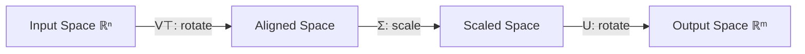
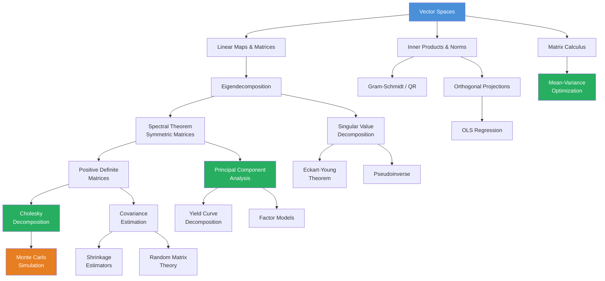

# Module 01: Linear Algebra for Quantitative Finance

**Prerequisites:** High-school algebra
**Builds toward:** Modules 02, 03, 06, 17, 22, 24, 26

---

## Table of Contents

1. [Motivation: Why Linear Algebra Is the Language of Finance](#1-motivation-why-linear-algebra-is-the-language-of-finance)
2. [Vector Spaces](#2-vector-spaces)
3. [Linear Maps & Matrix Representations](#3-linear-maps--matrix-representations)
4. [Inner Product Spaces, Norms & Orthogonality](#4-inner-product-spaces-norms--orthogonality)
5. [Eigenvalues, Eigenvectors & Spectral Decomposition](#5-eigenvalues-eigenvectors--spectral-decomposition)
6. [Singular Value Decomposition (SVD)](#6-singular-value-decomposition-svd)
7. [Principal Component Analysis (PCA)](#7-principal-component-analysis-pca)
8. [Matrix Calculus](#8-matrix-calculus)
9. [Positive Definite Matrices & Cholesky Decomposition](#9-positive-definite-matrices--cholesky-decomposition)
10. [Numerical Stability & Conditioning](#10-numerical-stability--conditioning)
11. [Implementation: Python](#11-implementation-python)
12. [Implementation: C++](#12-implementation-c)
13. [Exercises](#13-exercises)

---

## 1. Motivation: Why Linear Algebra Is the Language of Finance

Every object in quantitative finance has a natural linear-algebraic representation:

| Financial Object | Linear Algebra Representation |
|---|---|
| Portfolio of $n$ assets | Vector $\mathbf{w} \in \mathbb{R}^n$ (weight vector) |
| Asset returns over $T$ periods | Matrix $\mathbf{R} \in \mathbb{R}^{T \times n}$ |
| Covariance of returns | Symmetric positive semi-definite matrix $\boldsymbol{\Sigma} \in \mathbb{R}^{n \times n}$ |
| Factor model loadings | Matrix $\mathbf{B} \in \mathbb{R}^{n \times k}$ (exposures to $k$ factors) |
| Yield curve movements | Eigenvectors of yield covariance matrix (level, slope, curvature) |
| Risk decomposition | Eigendecomposition of $\boldsymbol{\Sigma}$ |
| Dimensionality reduction | Truncated SVD / PCA |
| Optimal portfolio weights | Solution to quadratic program involving $\boldsymbol{\Sigma}$ |
| Correlated simulation paths | Cholesky factor $\mathbf{L}$ where $\boldsymbol{\Sigma} = \mathbf{L}\mathbf{L}^\top$ |

This module develops every concept in the table above from first principles.

---

## 2. Vector Spaces

### 2.1 Definition and Axioms

A **vector space** over a field $\mathbb{F}$ (for us, $\mathbb{F} = \mathbb{R}$) is a set $V$ equipped with two operations — **vector addition** $(+: V \times V \to V)$ and **scalar multiplication** $(\cdot: \mathbb{F} \times V \to V)$ — satisfying the following eight axioms. For all $\mathbf{u}, \mathbf{v}, \mathbf{w} \in V$ and $\alpha, \beta \in \mathbb{F}$:

| # | Axiom | Statement |
|---|-------|-----------|
| A1 | Commutativity of addition | $\mathbf{u} + \mathbf{v} = \mathbf{v} + \mathbf{u}$ |
| A2 | Associativity of addition | $(\mathbf{u} + \mathbf{v}) + \mathbf{w} = \mathbf{u} + (\mathbf{v} + \mathbf{w})$ |
| A3 | Additive identity | $\exists\, \mathbf{0} \in V : \mathbf{u} + \mathbf{0} = \mathbf{u}$ |
| A4 | Additive inverse | $\exists\, (-\mathbf{u}) \in V : \mathbf{u} + (-\mathbf{u}) = \mathbf{0}$ |
| S1 | Compatibility of scalars | $\alpha(\beta \mathbf{u}) = (\alpha\beta)\mathbf{u}$ |
| S2 | Multiplicative identity | $1 \cdot \mathbf{u} = \mathbf{u}$ |
| D1 | Distributivity over vector addition | $\alpha(\mathbf{u} + \mathbf{v}) = \alpha\mathbf{u} + \alpha\mathbf{v}$ |
| D2 | Distributivity over scalar addition | $(\alpha + \beta)\mathbf{u} = \alpha\mathbf{u} + \beta\mathbf{u}$ |

### 2.2 Financial Examples of Vector Spaces

**Example 1 — Portfolio weight space.** Let $V = \mathbb{R}^n$ represent the weights of $n$ assets. A portfolio $\mathbf{w} = (w_1, w_2, \ldots, w_n)^\top$ is a vector. Adding two portfolios and scaling a portfolio produce valid portfolios. The zero vector $\mathbf{0}$ is the empty portfolio (all cash). This is the standard vector space $\mathbb{R}^n$.

**Example 2 — Return series as vectors.** Fix a time horizon of $T$ days. The return series of asset $i$ is a vector $\mathbf{r}_i = (r_{i,1}, r_{i,2}, \ldots, r_{i,T})^\top \in \mathbb{R}^T$. The portfolio return is the linear combination:

$$r_{p,t} = \sum_{i=1}^n w_i \, r_{i,t} = \mathbf{w}^\top \mathbf{r}_t$$

This is a linear map from weight space $\mathbb{R}^n$ to return space $\mathbb{R}$.

**Non-example — Long-only constraint.** The set $\{\mathbf{w} \in \mathbb{R}^n : w_i \geq 0 \;\forall\, i\}$ is *not* a vector space (it is not closed under additive inverses: $-\mathbf{w}$ violates the non-negativity constraint). It is, however, a **convex cone**, which becomes important in Module 06 (Optimization).

### 2.3 Subspaces

A non-empty subset $W \subseteq V$ is a **subspace** of $V$ if it is itself a vector space under the same operations. Equivalently, $W$ is a subspace if and only if it is closed under addition and scalar multiplication:

$$\forall\, \mathbf{u}, \mathbf{v} \in W, \; \forall\, \alpha \in \mathbb{F}: \quad \mathbf{u} + \mathbf{v} \in W \quad \text{and} \quad \alpha\mathbf{u} \in W$$

(Closure under scalar multiplication with $\alpha = 0$ guarantees $\mathbf{0} \in W$.)

**Key subspaces of a matrix $\mathbf{A} \in \mathbb{R}^{m \times n}$:**

- **Column space** (range): $\text{Col}(\mathbf{A}) = \{\mathbf{A}\mathbf{x} : \mathbf{x} \in \mathbb{R}^n\} \subseteq \mathbb{R}^m$
- **Null space** (kernel): $\text{Null}(\mathbf{A}) = \{\mathbf{x} \in \mathbb{R}^n : \mathbf{A}\mathbf{x} = \mathbf{0}\} \subseteq \mathbb{R}^n$
- **Row space**: $\text{Row}(\mathbf{A}) = \text{Col}(\mathbf{A}^\top) \subseteq \mathbb{R}^n$
- **Left null space**: $\text{Null}(\mathbf{A}^\top) \subseteq \mathbb{R}^m$

These four subspaces satisfy the **fundamental theorem of linear algebra** (Strang):

$$\mathbb{R}^n = \text{Row}(\mathbf{A}) \oplus \text{Null}(\mathbf{A}), \qquad \mathbb{R}^m = \text{Col}(\mathbf{A}) \oplus \text{Null}(\mathbf{A}^\top)$$

where $\oplus$ denotes direct sum (orthogonal complement).

### 2.4 Linear Independence, Span, Basis, Dimension

**Linear independence.** Vectors $\mathbf{v}_1, \ldots, \mathbf{v}_k$ are **linearly independent** if:

$$\alpha_1 \mathbf{v}_1 + \alpha_2 \mathbf{v}_2 + \cdots + \alpha_k \mathbf{v}_k = \mathbf{0} \quad \Longrightarrow \quad \alpha_1 = \alpha_2 = \cdots = \alpha_k = 0$$

**Financial interpretation.** The return series of $n$ assets are linearly independent if no asset's returns can be perfectly replicated by a linear combination of the others. If they are linearly dependent, there exists a portfolio $\mathbf{w} \neq \mathbf{0}$ with zero cost and zero return in every state — a form of redundancy.

**Span.** The **span** of $\{\mathbf{v}_1, \ldots, \mathbf{v}_k\}$ is the set of all linear combinations:

$$\text{span}(\mathbf{v}_1, \ldots, \mathbf{v}_k) = \left\{\sum_{i=1}^k \alpha_i \mathbf{v}_i : \alpha_i \in \mathbb{F}\right\}$$

**Basis.** A **basis** for $V$ is a linearly independent set that spans $V$. Every basis of a finite-dimensional vector space has the same cardinality, called the **dimension** of $V$, denoted $\dim(V)$.

**Theorem (Rank-Nullity).** For $\mathbf{A} \in \mathbb{R}^{m \times n}$:

$$\text{rank}(\mathbf{A}) + \text{nullity}(\mathbf{A}) = n$$

where $\text{rank}(\mathbf{A}) = \dim(\text{Col}(\mathbf{A}))$ and $\text{nullity}(\mathbf{A}) = \dim(\text{Null}(\mathbf{A}))$.

*Proof.* Let $\{\mathbf{u}_1, \ldots, \mathbf{u}_r\}$ be a basis for $\text{Null}(\mathbf{A})$, where $r = \text{nullity}(\mathbf{A})$. Extend to a basis $\{\mathbf{u}_1, \ldots, \mathbf{u}_r, \mathbf{v}_1, \ldots, \mathbf{v}_s\}$ for $\mathbb{R}^n$ (so $r + s = n$). We claim $\{\mathbf{A}\mathbf{v}_1, \ldots, \mathbf{A}\mathbf{v}_s\}$ is a basis for $\text{Col}(\mathbf{A})$.

*Spanning:* Any $\mathbf{y} \in \text{Col}(\mathbf{A})$ has the form $\mathbf{y} = \mathbf{A}\mathbf{x}$ for some $\mathbf{x} = \sum_{i=1}^r \alpha_i \mathbf{u}_i + \sum_{j=1}^s \beta_j \mathbf{v}_j$. Then $\mathbf{y} = \mathbf{A}\mathbf{x} = \sum_{j=1}^s \beta_j \mathbf{A}\mathbf{v}_j$ since $\mathbf{A}\mathbf{u}_i = \mathbf{0}$.

*Independence:* Suppose $\sum_{j=1}^s \beta_j \mathbf{A}\mathbf{v}_j = \mathbf{0}$. Then $\mathbf{A}\left(\sum_j \beta_j \mathbf{v}_j\right) = \mathbf{0}$, so $\sum_j \beta_j \mathbf{v}_j \in \text{Null}(\mathbf{A})$. Write $\sum_j \beta_j \mathbf{v}_j = \sum_i \alpha_i \mathbf{u}_i$. By linear independence of the full basis, all $\alpha_i = 0$ and all $\beta_j = 0$. $\square$

### 2.5 Change of Basis

Let $\mathcal{B} = \{\mathbf{b}_1, \ldots, \mathbf{b}_n\}$ and $\mathcal{C} = \{\mathbf{c}_1, \ldots, \mathbf{c}_n\}$ be two bases for $\mathbb{R}^n$. The **change-of-basis matrix** $\mathbf{P}_{\mathcal{C} \leftarrow \mathcal{B}}$ satisfies:

$$[\mathbf{v}]_\mathcal{C} = \mathbf{P}_{\mathcal{C} \leftarrow \mathcal{B}} \, [\mathbf{v}]_\mathcal{B}$$

where $[\mathbf{v}]_\mathcal{B}$ denotes the coordinate vector of $\mathbf{v}$ with respect to basis $\mathcal{B}$. The columns of $\mathbf{P}_{\mathcal{C} \leftarrow \mathcal{B}}$ are the coordinate representations of the $\mathcal{B}$-basis vectors in the $\mathcal{C}$-basis.

**Financial application.** Changing from individual asset coordinates to factor coordinates is a change of basis. If $\mathbf{B} \in \mathbb{R}^{n \times k}$ is a factor loading matrix, we express asset returns in factor space: $\mathbf{r} \approx \mathbf{B}\mathbf{f} + \boldsymbol{\epsilon}$.

---

## 3. Linear Maps & Matrix Representations

### 3.1 Linear Transformations

A function $T: V \to W$ between vector spaces is a **linear map** (linear transformation) if:

$$T(\alpha \mathbf{u} + \beta \mathbf{v}) = \alpha \, T(\mathbf{u}) + \beta \, T(\mathbf{v}) \quad \forall\, \mathbf{u}, \mathbf{v} \in V, \; \forall\, \alpha, \beta \in \mathbb{F}$$

Equivalently: $T$ preserves addition and scalar multiplication.

**Financial examples of linear maps:**

1. **Portfolio return:** $T(\mathbf{w}) = \mathbf{r}^\top \mathbf{w}$ maps weights $\mathbf{w} \in \mathbb{R}^n$ to a scalar return. This is a linear functional ($T: \mathbb{R}^n \to \mathbb{R}$).

2. **Factor exposure:** $T(\mathbf{w}) = \mathbf{B}^\top \mathbf{w}$ maps portfolio weights to factor exposures. If $\mathbf{B} \in \mathbb{R}^{n \times k}$, then $T: \mathbb{R}^n \to \mathbb{R}^k$.

3. **Covariance transformation:** $T(\mathbf{w}) = \boldsymbol{\Sigma} \mathbf{w}$ maps portfolio weights to the vector of covariances of each asset with the portfolio. The portfolio variance is $\sigma_p^2 = \mathbf{w}^\top \boldsymbol{\Sigma} \mathbf{w} = \mathbf{w}^\top T(\mathbf{w})$.

### 3.2 Matrix Representation

Every linear map $T: \mathbb{R}^n \to \mathbb{R}^m$ can be represented by a unique matrix $\mathbf{A} \in \mathbb{R}^{m \times n}$ such that $T(\mathbf{x}) = \mathbf{A}\mathbf{x}$. The $j$-th column of $\mathbf{A}$ is $T(\mathbf{e}_j)$, where $\mathbf{e}_j$ is the $j$-th standard basis vector.

**Properties of the matrix representation:**

| Property of $T$ | Matrix condition |
|---|---|
| $T$ is injective (one-to-one) | $\text{Null}(\mathbf{A}) = \{\mathbf{0}\}$ (full column rank) |
| $T$ is surjective (onto) | $\text{Col}(\mathbf{A}) = \mathbb{R}^m$ (full row rank) |
| $T$ is bijective (invertible) | $\mathbf{A}$ is square and $\det(\mathbf{A}) \neq 0$ |
| Composition $S \circ T$ | Matrix product $\mathbf{B}\mathbf{A}$ |
| Inverse $T^{-1}$ | Matrix inverse $\mathbf{A}^{-1}$ |

### 3.3 Rank and the Return Matrix

The **rank** of a matrix is the dimension of its column space, equivalently the number of linearly independent columns (or rows). For a return matrix $\mathbf{R} \in \mathbb{R}^{T \times n}$ (where $T$ time periods and $n$ assets):

- If $\text{rank}(\mathbf{R}) = n$, all asset return series are linearly independent — no perfect replication is possible.
- If $\text{rank}(\mathbf{R}) < n$, there exist non-trivial portfolios with identically zero returns over the sample — redundant assets or perfect multicollinearity.
- In factor models, $\text{rank}(\mathbf{R}) \approx k \ll n$ suggests the returns are driven by $k$ latent factors.

---

## 4. Inner Product Spaces, Norms & Orthogonality

### 4.1 Inner Products

An **inner product** on a real vector space $V$ is a function $\langle \cdot, \cdot \rangle: V \times V \to \mathbb{R}$ satisfying:

1. **Symmetry:** $\langle \mathbf{u}, \mathbf{v} \rangle = \langle \mathbf{v}, \mathbf{u} \rangle$
2. **Linearity in first argument:** $\langle \alpha\mathbf{u} + \beta\mathbf{v}, \mathbf{w} \rangle = \alpha \langle \mathbf{u}, \mathbf{w} \rangle + \beta \langle \mathbf{v}, \mathbf{w} \rangle$
3. **Positive definiteness:** $\langle \mathbf{u}, \mathbf{u} \rangle \geq 0$ with equality iff $\mathbf{u} = \mathbf{0}$

The standard inner product on $\mathbb{R}^n$ is the dot product:

$$\langle \mathbf{u}, \mathbf{v} \rangle = \mathbf{u}^\top \mathbf{v} = \sum_{i=1}^n u_i v_i$$

**Covariance as an inner product.** Define $\langle X, Y \rangle = \text{Cov}(X, Y) = \mathbb{E}[(X - \mu_X)(Y - \mu_Y)]$ on the space of zero-mean, finite-variance random variables. This is an inner product (technically a semi-inner product, since $\langle X, X \rangle = 0$ implies $X = 0$ only a.s., not pointwise). Under this inner product:

- $\|X\| = \sqrt{\langle X, X \rangle} = \sigma_X$ (standard deviation is the norm)
- $\cos\theta = \frac{\langle X, Y \rangle}{\|X\| \cdot \|Y\|} = \rho_{XY}$ (correlation is the cosine of the angle)
- $X \perp Y \iff \text{Cov}(X, Y) = 0$ (uncorrelated = orthogonal)

This geometric interpretation is foundational: **diversification is orthogonalization**.

### 4.2 Norms

A **norm** on $V$ is a function $\|\cdot\|: V \to [0, \infty)$ satisfying:

1. $\|\mathbf{v}\| = 0 \iff \mathbf{v} = \mathbf{0}$ (definiteness)
2. $\|\alpha \mathbf{v}\| = |\alpha| \|\mathbf{v}\|$ (absolute homogeneity)
3. $\|\mathbf{u} + \mathbf{v}\| \leq \|\mathbf{u}\| + \|\mathbf{v}\|$ (triangle inequality)

Every inner product induces a norm via $\|\mathbf{v}\| = \sqrt{\langle \mathbf{v}, \mathbf{v} \rangle}$. Important norms on $\mathbb{R}^n$:

$$\|\mathbf{x}\|_1 = \sum_{i=1}^n |x_i| \qquad \text{(L1 norm — promotes sparsity, used in LASSO)}$$

$$\|\mathbf{x}\|_2 = \sqrt{\sum_{i=1}^n x_i^2} \qquad \text{(L2 / Euclidean norm — used in ridge regression)}$$

$$\|\mathbf{x}\|_\infty = \max_{i} |x_i| \qquad \text{(max norm — worst-case exposure)}$$

**Matrix norms:**

$$\|\mathbf{A}\|_F = \sqrt{\sum_{i,j} a_{ij}^2} = \sqrt{\text{tr}(\mathbf{A}^\top \mathbf{A})} \qquad \text{(Frobenius norm)}$$

$$\|\mathbf{A}\|_2 = \sigma_{\max}(\mathbf{A}) \qquad \text{(spectral norm — largest singular value)}$$

### 4.3 The Cauchy-Schwarz Inequality

For any inner product space:

$$|\langle \mathbf{u}, \mathbf{v} \rangle| \leq \|\mathbf{u}\| \cdot \|\mathbf{v}\|$$

with equality iff $\mathbf{u}$ and $\mathbf{v}$ are linearly dependent.

*Proof.* For $\mathbf{v} \neq \mathbf{0}$, define $\mathbf{w} = \mathbf{u} - \frac{\langle \mathbf{u}, \mathbf{v} \rangle}{\langle \mathbf{v}, \mathbf{v} \rangle} \mathbf{v}$. Then:

$$0 \leq \langle \mathbf{w}, \mathbf{w} \rangle = \langle \mathbf{u}, \mathbf{u} \rangle - 2\frac{\langle \mathbf{u}, \mathbf{v} \rangle^2}{\langle \mathbf{v}, \mathbf{v} \rangle} + \frac{\langle \mathbf{u}, \mathbf{v} \rangle^2}{\langle \mathbf{v}, \mathbf{v} \rangle} = \|\mathbf{u}\|^2 - \frac{\langle \mathbf{u}, \mathbf{v} \rangle^2}{\|\mathbf{v}\|^2}$$

Rearranging: $\langle \mathbf{u}, \mathbf{v} \rangle^2 \leq \|\mathbf{u}\|^2 \|\mathbf{v}\|^2$. $\square$

**Financial consequence.** With the covariance inner product, Cauchy-Schwarz gives $|\rho_{XY}| \leq 1$. Correlation is bounded. Equality ($|\rho| = 1$) occurs iff one return is a perfect linear function of the other.

### 4.4 Orthogonality and the Gram-Schmidt Process

Vectors $\mathbf{u}$ and $\mathbf{v}$ are **orthogonal** if $\langle \mathbf{u}, \mathbf{v} \rangle = 0$, written $\mathbf{u} \perp \mathbf{v}$. A set $\{\mathbf{q}_1, \ldots, \mathbf{q}_k\}$ is **orthonormal** if:

$$\langle \mathbf{q}_i, \mathbf{q}_j \rangle = \delta_{ij} = \begin{cases} 1 & i = j \\ 0 & i \neq j \end{cases}$$

**Gram-Schmidt process.** Given linearly independent $\{\mathbf{v}_1, \ldots, \mathbf{v}_k\}$, construct orthonormal $\{\mathbf{q}_1, \ldots, \mathbf{q}_k\}$:

$$\mathbf{u}_1 = \mathbf{v}_1, \qquad \mathbf{q}_1 = \frac{\mathbf{u}_1}{\|\mathbf{u}_1\|}$$

$$\mathbf{u}_j = \mathbf{v}_j - \sum_{i=1}^{j-1} \langle \mathbf{v}_j, \mathbf{q}_i \rangle \, \mathbf{q}_i, \qquad \mathbf{q}_j = \frac{\mathbf{u}_j}{\|\mathbf{u}_j\|}$$

Each $\mathbf{u}_j$ is the component of $\mathbf{v}_j$ orthogonal to $\text{span}(\mathbf{q}_1, \ldots, \mathbf{q}_{j-1})$.

**QR decomposition.** Gram-Schmidt applied to the columns of $\mathbf{A} \in \mathbb{R}^{m \times n}$ (with $m \geq n$ and full column rank) yields $\mathbf{A} = \mathbf{Q}\mathbf{R}$, where $\mathbf{Q} \in \mathbb{R}^{m \times n}$ has orthonormal columns and $\mathbf{R} \in \mathbb{R}^{n \times n}$ is upper triangular with positive diagonal entries.

**Financial application.** If the columns of $\mathbf{A}$ are factor return series, the QR decomposition orthogonalizes the factors. $\mathbf{Q}$'s columns are uncorrelated synthetic factors that span the same space. This is one approach to removing multicollinearity from factor models.

### 4.5 Orthogonal Projections

The **orthogonal projection** of $\mathbf{v}$ onto a subspace $W$ is the unique vector $\text{proj}_W(\mathbf{v}) \in W$ that minimizes $\|\mathbf{v} - \mathbf{w}\|$ over all $\mathbf{w} \in W$. If $\{\mathbf{q}_1, \ldots, \mathbf{q}_k\}$ is an orthonormal basis for $W$:

$$\text{proj}_W(\mathbf{v}) = \sum_{i=1}^k \langle \mathbf{v}, \mathbf{q}_i \rangle \, \mathbf{q}_i = \mathbf{Q}\mathbf{Q}^\top \mathbf{v}$$

The matrix $\mathbf{P} = \mathbf{Q}\mathbf{Q}^\top$ is the **projection matrix**: it satisfies $\mathbf{P}^2 = \mathbf{P}$ (idempotent) and $\mathbf{P}^\top = \mathbf{P}$ (symmetric).

**Financial application — Regression as projection.** Ordinary least squares regression $\mathbf{y} = \mathbf{X}\boldsymbol{\beta} + \boldsymbol{\epsilon}$ finds the projection of $\mathbf{y}$ onto the column space of $\mathbf{X}$. The hat matrix $\mathbf{H} = \mathbf{X}(\mathbf{X}^\top\mathbf{X})^{-1}\mathbf{X}^\top$ is the projection matrix. The residual $\boldsymbol{\epsilon} = \mathbf{y} - \mathbf{H}\mathbf{y} = (\mathbf{I} - \mathbf{H})\mathbf{y}$ is orthogonal to the column space of $\mathbf{X}$.

---

## 5. Eigenvalues, Eigenvectors & Spectral Decomposition

### 5.1 Definitions

Let $\mathbf{A} \in \mathbb{R}^{n \times n}$ be a square matrix. A scalar $\lambda \in \mathbb{C}$ is an **eigenvalue** of $\mathbf{A}$ if there exists a non-zero vector $\mathbf{v} \in \mathbb{C}^n$ such that:

$$\mathbf{A}\mathbf{v} = \lambda\mathbf{v}$$

The vector $\mathbf{v}$ is the corresponding **eigenvector**. Equivalently, $\lambda$ is an eigenvalue iff:

$$\det(\mathbf{A} - \lambda\mathbf{I}) = 0$$

This determinant, viewed as a polynomial in $\lambda$, is the **characteristic polynomial**:

$$p(\lambda) = \det(\mathbf{A} - \lambda\mathbf{I}) = (-1)^n \lambda^n + (-1)^{n-1}\text{tr}(\mathbf{A})\lambda^{n-1} + \cdots + \det(\mathbf{A})$$

By the fundamental theorem of algebra, $p(\lambda)$ has exactly $n$ roots (counted with multiplicity) in $\mathbb{C}$.

### 5.2 Properties of Eigenvalues

For $\mathbf{A} \in \mathbb{R}^{n \times n}$ with eigenvalues $\lambda_1, \ldots, \lambda_n$:

$$\text{tr}(\mathbf{A}) = \sum_{i=1}^n a_{ii} = \sum_{i=1}^n \lambda_i$$

$$\det(\mathbf{A}) = \prod_{i=1}^n \lambda_i$$

**Financial interpretation.** For a covariance matrix $\boldsymbol{\Sigma}$: $\text{tr}(\boldsymbol{\Sigma}) = \sum_i \sigma_i^2$ is the total variance, and each eigenvalue $\lambda_i$ represents the variance explained by the $i$-th principal component. Since $\text{tr}(\boldsymbol{\Sigma}) = \sum_i \lambda_i$, PCA decomposes total portfolio variance into independent components.

### 5.3 The Spectral Theorem for Symmetric Matrices

**Theorem (Spectral Theorem).** Let $\mathbf{A} \in \mathbb{R}^{n \times n}$ be symmetric ($\mathbf{A} = \mathbf{A}^\top$). Then:

1. All eigenvalues of $\mathbf{A}$ are real.
2. Eigenvectors corresponding to distinct eigenvalues are orthogonal.
3. $\mathbf{A}$ has an orthonormal basis of eigenvectors.

Consequently, $\mathbf{A}$ admits the **spectral decomposition** (eigendecomposition):

$$\mathbf{A} = \mathbf{Q}\boldsymbol{\Lambda}\mathbf{Q}^\top = \sum_{i=1}^n \lambda_i \, \mathbf{q}_i \mathbf{q}_i^\top$$

where $\mathbf{Q} = [\mathbf{q}_1 \mid \cdots \mid \mathbf{q}_n]$ is orthogonal ($\mathbf{Q}^\top\mathbf{Q} = \mathbf{I}$) and $\boldsymbol{\Lambda} = \text{diag}(\lambda_1, \ldots, \lambda_n)$.

*Proof sketch.*

**(1)** Let $\mathbf{A}\mathbf{v} = \lambda\mathbf{v}$ with $\mathbf{v} \neq \mathbf{0}$ (possibly complex). Then:

$$\bar{\mathbf{v}}^\top \mathbf{A} \mathbf{v} = \lambda \bar{\mathbf{v}}^\top \mathbf{v} = \lambda \|\mathbf{v}\|^2$$

Taking the conjugate transpose: $\overline{\bar{\mathbf{v}}^\top \mathbf{A} \mathbf{v}} = \mathbf{v}^\top \mathbf{A}^\top \bar{\mathbf{v}} = \mathbf{v}^\top \mathbf{A} \bar{\mathbf{v}} = \bar{\lambda} \|\mathbf{v}\|^2$ (using $\mathbf{A} = \mathbf{A}^\top$ and $\mathbf{A}$ is real). But $\bar{\mathbf{v}}^\top \mathbf{A} \mathbf{v}$ is a scalar, so its conjugate equals $\bar{\lambda}\|\mathbf{v}\|^2 = \lambda\|\mathbf{v}\|^2$. Since $\|\mathbf{v}\|^2 > 0$, we get $\bar{\lambda} = \lambda$, so $\lambda \in \mathbb{R}$.

**(2)** Let $\mathbf{A}\mathbf{u} = \lambda\mathbf{u}$ and $\mathbf{A}\mathbf{v} = \mu\mathbf{v}$ with $\lambda \neq \mu$. Then:

$$\lambda \langle \mathbf{u}, \mathbf{v} \rangle = \langle \mathbf{A}\mathbf{u}, \mathbf{v} \rangle = \langle \mathbf{u}, \mathbf{A}^\top \mathbf{v} \rangle = \langle \mathbf{u}, \mathbf{A}\mathbf{v} \rangle = \mu \langle \mathbf{u}, \mathbf{v} \rangle$$

So $(\lambda - \mu)\langle \mathbf{u}, \mathbf{v} \rangle = 0$. Since $\lambda \neq \mu$, we must have $\langle \mathbf{u}, \mathbf{v} \rangle = 0$. $\square$

**(3)** Follows from (1), (2), and the fact that the eigenspaces of a symmetric matrix span $\mathbb{R}^n$ (requires induction on dimension using the restriction of $\mathbf{A}$ to orthogonal complements of eigenspaces).

### 5.4 Positive Definite and Positive Semi-Definite Matrices

A symmetric matrix $\mathbf{A}$ is:

- **Positive definite (PD):** $\mathbf{x}^\top \mathbf{A} \mathbf{x} > 0 \;\; \forall\, \mathbf{x} \neq \mathbf{0}$ $\iff$ all eigenvalues $\lambda_i > 0$
- **Positive semi-definite (PSD):** $\mathbf{x}^\top \mathbf{A} \mathbf{x} \geq 0 \;\; \forall\, \mathbf{x}$ $\iff$ all eigenvalues $\lambda_i \geq 0$

*Proof ($\Rightarrow$).* If $\mathbf{A}$ is PD and $\mathbf{A}\mathbf{v} = \lambda\mathbf{v}$, then $\lambda \|\mathbf{v}\|^2 = \mathbf{v}^\top \mathbf{A} \mathbf{v} > 0$, so $\lambda > 0$.

*Proof ($\Leftarrow$).* If all $\lambda_i > 0$, write $\mathbf{x} = \sum_i c_i \mathbf{q}_i$. Then $\mathbf{x}^\top \mathbf{A} \mathbf{x} = \sum_i \lambda_i c_i^2 > 0$ for $\mathbf{x} \neq \mathbf{0}$. $\square$

**Covariance matrices are PSD.** For any random vector $\mathbf{r}$ with covariance matrix $\boldsymbol{\Sigma}$:

$$\mathbf{w}^\top \boldsymbol{\Sigma} \mathbf{w} = \text{Var}(\mathbf{w}^\top \mathbf{r}) \geq 0$$

A covariance matrix is PD if and only if no non-trivial portfolio has zero variance — i.e., the assets are not perfectly multicollinear.

### 5.5 Eigendecomposition of the Covariance Matrix

Let $\boldsymbol{\Sigma} = \mathbf{Q}\boldsymbol{\Lambda}\mathbf{Q}^\top$ be the eigendecomposition of a PSD covariance matrix, with eigenvalues ordered $\lambda_1 \geq \lambda_2 \geq \cdots \geq \lambda_n \geq 0$. The eigenvector $\mathbf{q}_i$ defines the $i$-th **principal portfolio** — the portfolio with the $i$-th largest variance among all portfolios orthogonal to the first $i-1$ principal portfolios.

The **proportion of variance explained** by the first $k$ components:

$$\text{PVE}(k) = \frac{\sum_{i=1}^k \lambda_i}{\sum_{i=1}^n \lambda_i} = \frac{\sum_{i=1}^k \lambda_i}{\text{tr}(\boldsymbol{\Sigma})}$$

In equity markets, the first principal component (the "market factor") typically explains 40-60% of return variance. The first 3-5 components often explain 70-85%.

---

## 6. Singular Value Decomposition (SVD)

### 6.1 Statement and Derivation

**Theorem (SVD).** Every matrix $\mathbf{A} \in \mathbb{R}^{m \times n}$ (not necessarily square) can be factored as:

$$\mathbf{A} = \mathbf{U} \boldsymbol{\Sigma} \mathbf{V}^\top$$

where:
- $\mathbf{U} \in \mathbb{R}^{m \times m}$ is orthogonal (columns are **left singular vectors**)
- $\boldsymbol{\Sigma} \in \mathbb{R}^{m \times n}$ is diagonal with non-negative entries $\sigma_1 \geq \sigma_2 \geq \cdots \geq \sigma_{\min(m,n)} \geq 0$ (the **singular values**)
- $\mathbf{V} \in \mathbb{R}^{n \times n}$ is orthogonal (columns are **right singular vectors**)

*Full derivation.*

**Step 1.** Consider $\mathbf{A}^\top\mathbf{A} \in \mathbb{R}^{n \times n}$. This is symmetric and PSD (since $\mathbf{x}^\top \mathbf{A}^\top \mathbf{A} \mathbf{x} = \|\mathbf{A}\mathbf{x}\|^2 \geq 0$). By the spectral theorem, it has eigendecomposition:

$$\mathbf{A}^\top \mathbf{A} = \mathbf{V} \boldsymbol{\Lambda} \mathbf{V}^\top$$

with eigenvalues $\lambda_1 \geq \cdots \geq \lambda_n \geq 0$ and orthonormal eigenvectors $\mathbf{v}_1, \ldots, \mathbf{v}_n$.

**Step 2.** Define singular values $\sigma_i = \sqrt{\lambda_i}$. Let $r = \text{rank}(\mathbf{A})$, so $\sigma_1 \geq \cdots \geq \sigma_r > 0$ and $\sigma_{r+1} = \cdots = \sigma_n = 0$.

**Step 3.** For $i = 1, \ldots, r$, define:

$$\mathbf{u}_i = \frac{1}{\sigma_i} \mathbf{A} \mathbf{v}_i$$

These are orthonormal in $\mathbb{R}^m$:

$$\langle \mathbf{u}_i, \mathbf{u}_j \rangle = \frac{1}{\sigma_i \sigma_j} \mathbf{v}_i^\top \mathbf{A}^\top \mathbf{A} \mathbf{v}_j = \frac{1}{\sigma_i \sigma_j} \mathbf{v}_i^\top (\lambda_j \mathbf{v}_j) = \frac{\lambda_j}{\sigma_i \sigma_j} \delta_{ij} = \delta_{ij}$$

**Step 4.** Extend $\{\mathbf{u}_1, \ldots, \mathbf{u}_r\}$ to an orthonormal basis $\{\mathbf{u}_1, \ldots, \mathbf{u}_m\}$ of $\mathbb{R}^m$ (the additional vectors span $\text{Null}(\mathbf{A}^\top)$).

**Step 5.** Verify: $\mathbf{A}\mathbf{v}_i = \sigma_i \mathbf{u}_i$ for $i \leq r$ and $\mathbf{A}\mathbf{v}_i = \mathbf{0}$ for $i > r$. In matrix form: $\mathbf{A}\mathbf{V} = \mathbf{U}\boldsymbol{\Sigma}$, hence $\mathbf{A} = \mathbf{U}\boldsymbol{\Sigma}\mathbf{V}^\top$. $\square$

### 6.2 Geometric Interpretation

The SVD says that every linear map can be decomposed into three steps:

1. **Rotate** (by $\mathbf{V}^\top$): align with the right singular vectors
2. **Scale** (by $\boldsymbol{\Sigma}$): stretch/compress along each coordinate axis
3. **Rotate** (by $\mathbf{U}$): align with the left singular vectors

The singular values measure how much each axis is stretched. The right singular vectors are the input directions; the left singular vectors are the output directions.



### 6.3 Compact and Truncated Forms

**Compact SVD** (rank-$r$ factorization):

$$\mathbf{A} = \mathbf{U}_r \boldsymbol{\Sigma}_r \mathbf{V}_r^\top = \sum_{i=1}^r \sigma_i \, \mathbf{u}_i \mathbf{v}_i^\top$$

where $\mathbf{U}_r \in \mathbb{R}^{m \times r}$, $\boldsymbol{\Sigma}_r \in \mathbb{R}^{r \times r}$, $\mathbf{V}_r \in \mathbb{R}^{n \times r}$.

**Truncated SVD** (best rank-$k$ approximation, $k < r$):

$$\mathbf{A}_k = \sum_{i=1}^k \sigma_i \, \mathbf{u}_i \mathbf{v}_i^\top$$

### 6.4 The Eckart-Young-Mirsky Theorem

**Theorem.** The truncated SVD $\mathbf{A}_k$ is the best rank-$k$ approximation to $\mathbf{A}$ in both the Frobenius and spectral norms:

$$\mathbf{A}_k = \arg\min_{\text{rank}(\mathbf{B}) \leq k} \|\mathbf{A} - \mathbf{B}\|_F$$

with $\|\mathbf{A} - \mathbf{A}_k\|_F = \sqrt{\sigma_{k+1}^2 + \cdots + \sigma_r^2}$ and $\|\mathbf{A} - \mathbf{A}_k\|_2 = \sigma_{k+1}$.

*Proof.* We prove the Frobenius norm case. Let $\mathbf{B}$ be any matrix with $\text{rank}(\mathbf{B}) \leq k$. Then $\text{Null}(\mathbf{B})$ has dimension $\geq n - k$. Consider the subspace $W = \text{span}(\mathbf{v}_1, \ldots, \mathbf{v}_{k+1})$, which has dimension $k + 1$. By dimension counting, $W \cap \text{Null}(\mathbf{B})$ is non-trivial: there exists a unit vector $\mathbf{z} \in W \cap \text{Null}(\mathbf{B})$.

Write $\mathbf{z} = \sum_{i=1}^{k+1} c_i \mathbf{v}_i$ with $\sum c_i^2 = 1$. Then $\mathbf{B}\mathbf{z} = \mathbf{0}$, so:

$$\|\mathbf{A} - \mathbf{B}\|_F^2 \geq \|(\mathbf{A} - \mathbf{B})\mathbf{z}\|^2 = \|\mathbf{A}\mathbf{z}\|^2 = \left\|\sum_{i=1}^{k+1} c_i \sigma_i \mathbf{u}_i\right\|^2 = \sum_{i=1}^{k+1} c_i^2 \sigma_i^2 \geq \sigma_{k+1}^2 \sum c_i^2 = \sigma_{k+1}^2$$

For the Frobenius bound: $\|\mathbf{A} - \mathbf{B}\|_F^2 \geq \sum_{i=k+1}^r \sigma_i^2$ (requires a more careful subspace argument applied to each dimension). And $\|\mathbf{A} - \mathbf{A}_k\|_F^2 = \sum_{i=k+1}^r \sigma_i^2$ achieves this bound. $\square$

### 6.5 SVD and the Four Fundamental Subspaces

| Subspace | Basis | Dimension |
|----------|-------|-----------|
| $\text{Col}(\mathbf{A})$ | $\mathbf{u}_1, \ldots, \mathbf{u}_r$ | $r$ |
| $\text{Null}(\mathbf{A}^\top)$ | $\mathbf{u}_{r+1}, \ldots, \mathbf{u}_m$ | $m - r$ |
| $\text{Row}(\mathbf{A})$ | $\mathbf{v}_1, \ldots, \mathbf{v}_r$ | $r$ |
| $\text{Null}(\mathbf{A})$ | $\mathbf{v}_{r+1}, \ldots, \mathbf{v}_n$ | $n - r$ |

### 6.6 The Pseudoinverse

The **Moore-Penrose pseudoinverse** $\mathbf{A}^+ \in \mathbb{R}^{n \times m}$ is:

$$\mathbf{A}^+ = \mathbf{V} \boldsymbol{\Sigma}^+ \mathbf{U}^\top$$

where $\boldsymbol{\Sigma}^+$ is obtained by transposing $\boldsymbol{\Sigma}$ and inverting the non-zero diagonal entries. For the system $\mathbf{A}\mathbf{x} = \mathbf{b}$:

- If the system is consistent, $\mathbf{x} = \mathbf{A}^+\mathbf{b}$ is the minimum-norm solution.
- If the system is inconsistent, $\mathbf{x} = \mathbf{A}^+\mathbf{b}$ is the least-squares solution with minimum norm.

---

## 7. Principal Component Analysis (PCA)

### 7.1 PCA as a Variance Maximization Problem

Given centered data $\mathbf{X} \in \mathbb{R}^{T \times n}$ (where row $t$ is the return vector at time $t$, with sample mean subtracted), PCA seeks orthogonal directions of maximum variance.

**First principal component.** Find the unit vector $\mathbf{w}_1 \in \mathbb{R}^n$ that maximizes the variance of the projected data:

$$\mathbf{w}_1 = \arg\max_{\|\mathbf{w}\| = 1} \text{Var}(\mathbf{X}\mathbf{w}) = \arg\max_{\|\mathbf{w}\| = 1} \frac{1}{T-1} \|\mathbf{X}\mathbf{w}\|^2 = \arg\max_{\|\mathbf{w}\| = 1} \mathbf{w}^\top \hat{\boldsymbol{\Sigma}} \mathbf{w}$$

where $\hat{\boldsymbol{\Sigma}} = \frac{1}{T-1}\mathbf{X}^\top\mathbf{X}$ is the sample covariance matrix.

**Solution via Lagrange multipliers.** Maximize $\mathcal{L}(\mathbf{w}, \lambda) = \mathbf{w}^\top \hat{\boldsymbol{\Sigma}} \mathbf{w} - \lambda(\mathbf{w}^\top\mathbf{w} - 1)$.

$$\frac{\partial \mathcal{L}}{\partial \mathbf{w}} = 2\hat{\boldsymbol{\Sigma}}\mathbf{w} - 2\lambda\mathbf{w} = \mathbf{0} \quad \Longrightarrow \quad \hat{\boldsymbol{\Sigma}}\mathbf{w} = \lambda\mathbf{w}$$

So $\mathbf{w}$ is an eigenvector of $\hat{\boldsymbol{\Sigma}}$, and the maximized variance is $\mathbf{w}^\top \hat{\boldsymbol{\Sigma}} \mathbf{w} = \lambda$. The maximum is achieved by taking $\mathbf{w}_1 = \mathbf{q}_1$, the eigenvector corresponding to the largest eigenvalue $\lambda_1$.

**Subsequent components.** The $k$-th principal component maximizes variance subject to orthogonality to all previous components. By induction, $\mathbf{w}_k = \mathbf{q}_k$ (the eigenvector for the $k$-th largest eigenvalue).

### 7.2 PCA via SVD of the Data Matrix

The SVD of the centered data matrix $\mathbf{X} = \mathbf{U}\boldsymbol{\Sigma}\mathbf{V}^\top$ gives:

$$\hat{\boldsymbol{\Sigma}}_{\text{cov}} = \frac{1}{T-1}\mathbf{X}^\top\mathbf{X} = \frac{1}{T-1}\mathbf{V}\boldsymbol{\Sigma}^2\mathbf{V}^\top$$

So the principal components are the columns of $\mathbf{V}$ (right singular vectors), and the eigenvalues of the covariance matrix are $\lambda_i = \sigma_i^2 / (T-1)$.

The **scores** (projected data) are the columns of $\mathbf{X}\mathbf{V} = \mathbf{U}\boldsymbol{\Sigma}$ (scaled left singular vectors).

**Computational note.** For $T \ll n$ (many assets, few time periods), it is more efficient to eigendecompose $\mathbf{X}\mathbf{X}^\top \in \mathbb{R}^{T \times T}$ (small matrix) than $\mathbf{X}^\top\mathbf{X} \in \mathbb{R}^{n \times n}$ (large matrix). The relationship: if $\mathbf{X}\mathbf{X}^\top \mathbf{u} = \lambda \mathbf{u}$, then $\mathbf{v} = \mathbf{X}^\top\mathbf{u} / \|\mathbf{X}^\top\mathbf{u}\|$ is the corresponding eigenvector of $\mathbf{X}^\top\mathbf{X}$.

### 7.3 Application: Yield Curve PCA

The term structure of interest rates (yield curve) is described by yields at maturities $\{3\text{m}, 6\text{m}, 1\text{y}, 2\text{y}, 5\text{y}, 10\text{y}, 30\text{y}\}$. PCA on the daily yield changes reveals three dominant factors:

| Component | Eigenvalue Share | Interpretation | Shape |
|-----------|-----------------|----------------|-------|
| PC1 | ~85% | **Level** (parallel shift) | Roughly constant across maturities |
| PC2 | ~10% | **Slope** (steepening/flattening) | Monotonically increasing from short to long |
| PC3 | ~3% | **Curvature** (butterfly) | Concave — high at short and long ends, low in middle |

Together, these three components explain ~98% of yield curve variation. This is a remarkable dimensionality reduction: from 7 correlated yields to 3 uncorrelated factors.

**Mathematical formulation.** Let $\Delta \mathbf{y}_t = (\Delta y_{t,3m}, \Delta y_{t,6m}, \ldots, \Delta y_{t,30y})^\top$ be the vector of daily yield changes. The covariance matrix $\boldsymbol{\Sigma} \in \mathbb{R}^{7 \times 7}$ has eigendecomposition $\boldsymbol{\Sigma} = \mathbf{Q}\boldsymbol{\Lambda}\mathbf{Q}^\top$. The factor representation:

$$\Delta \mathbf{y}_t \approx \mathbf{Q}_3 \mathbf{f}_t, \qquad \mathbf{f}_t = \mathbf{Q}_3^\top \Delta \mathbf{y}_t$$

where $\mathbf{Q}_3$ contains the first 3 eigenvectors and $\mathbf{f}_t \in \mathbb{R}^3$ is the factor score vector.

### 7.4 Application: Equity Factor Models

For a universe of $n$ stocks with return matrix $\mathbf{R} \in \mathbb{R}^{T \times n}$, PCA extracts statistical factors. The first $k$ principal portfolios define a factor model:

$$r_{i,t} = \alpha_i + \sum_{j=1}^k \beta_{ij} f_{j,t} + \epsilon_{i,t}$$

where $f_{j,t}$ is the $j$-th principal component score and $\beta_{ij}$ is the loading. This is a **statistical factor model** (as opposed to the fundamental factor models of Fama-French, covered in Module 17).

**Choosing $k$.** Common approaches:
- **Scree plot:** plot eigenvalues, look for an "elbow"
- **Kaiser criterion:** retain components with $\lambda_i > 1$ (for correlation-matrix PCA)
- **Parallel analysis:** compare eigenvalues to those from random data (Monte Carlo permutation)
- **Cumulative PVE threshold:** retain enough components to explain, say, 90% of variance

---

## 8. Matrix Calculus

### 8.1 Gradients

For a scalar-valued function $f: \mathbb{R}^n \to \mathbb{R}$, the **gradient** is the vector of partial derivatives:

$$\nabla f(\mathbf{x}) = \begin{pmatrix} \frac{\partial f}{\partial x_1} \\ \vdots \\ \frac{\partial f}{\partial x_n} \end{pmatrix} \in \mathbb{R}^n$$

The gradient points in the direction of steepest ascent and is orthogonal to the level sets of $f$.

**Key gradient identities (using numerator layout):**

$$\nabla_\mathbf{x} (\mathbf{a}^\top \mathbf{x}) = \mathbf{a}$$

$$\nabla_\mathbf{x} (\mathbf{x}^\top \mathbf{A} \mathbf{x}) = (\mathbf{A} + \mathbf{A}^\top)\mathbf{x} = 2\mathbf{A}\mathbf{x} \quad \text{if } \mathbf{A} \text{ is symmetric}$$

$$\nabla_\mathbf{x} (\mathbf{x}^\top \mathbf{x}) = 2\mathbf{x}$$

*Derivation of $\nabla_\mathbf{x} (\mathbf{x}^\top \mathbf{A} \mathbf{x})$.* Let $f(\mathbf{x}) = \mathbf{x}^\top \mathbf{A}\mathbf{x} = \sum_{i,j} x_i a_{ij} x_j$. Then:

$$\frac{\partial f}{\partial x_k} = \sum_j a_{kj} x_j + \sum_i x_i a_{ik} = [\mathbf{A}\mathbf{x}]_k + [\mathbf{A}^\top\mathbf{x}]_k$$

In vector form: $\nabla f = (\mathbf{A} + \mathbf{A}^\top)\mathbf{x}$. For symmetric $\mathbf{A}$: $\nabla f = 2\mathbf{A}\mathbf{x}$. $\square$

### 8.2 The Jacobian

For a vector-valued function $\mathbf{f}: \mathbb{R}^n \to \mathbb{R}^m$, the **Jacobian** is the $m \times n$ matrix of partial derivatives:

$$\mathbf{J} = \frac{\partial \mathbf{f}}{\partial \mathbf{x}} = \begin{pmatrix} \frac{\partial f_1}{\partial x_1} & \cdots & \frac{\partial f_1}{\partial x_n} \\ \vdots & \ddots & \vdots \\ \frac{\partial f_m}{\partial x_1} & \cdots & \frac{\partial f_m}{\partial x_n} \end{pmatrix}$$

The chain rule generalizes: if $\mathbf{g}: \mathbb{R}^n \to \mathbb{R}^m$ and $\mathbf{f}: \mathbb{R}^m \to \mathbb{R}^p$, then:

$$\frac{\partial (\mathbf{f} \circ \mathbf{g})}{\partial \mathbf{x}} = \frac{\partial \mathbf{f}}{\partial \mathbf{g}} \cdot \frac{\partial \mathbf{g}}{\partial \mathbf{x}} \quad (p \times n) = (p \times m)(m \times n)$$

### 8.3 The Hessian

For $f: \mathbb{R}^n \to \mathbb{R}$, the **Hessian** is the $n \times n$ matrix of second partial derivatives:

$$\mathbf{H}_f = \nabla^2 f = \begin{pmatrix} \frac{\partial^2 f}{\partial x_1^2} & \cdots & \frac{\partial^2 f}{\partial x_1 \partial x_n} \\ \vdots & \ddots & \vdots \\ \frac{\partial^2 f}{\partial x_n \partial x_1} & \cdots & \frac{\partial^2 f}{\partial x_n^2} \end{pmatrix}$$

By Schwarz's theorem (Clairaut's theorem), $\mathbf{H}_f$ is symmetric for twice continuously differentiable functions.

- $\mathbf{H}_f \succ 0$ (PD) at a critical point $\Longrightarrow$ local minimum
- $\mathbf{H}_f \prec 0$ (negative definite) $\Longrightarrow$ local maximum
- $\mathbf{H}_f$ indefinite $\Longrightarrow$ saddle point

**Example.** For $f(\mathbf{x}) = \mathbf{x}^\top \mathbf{A}\mathbf{x}$ with symmetric $\mathbf{A}$: $\nabla^2 f = 2\mathbf{A}$. The quadratic form is convex iff $\mathbf{A}$ is PSD. Portfolio variance $\sigma_p^2 = \mathbf{w}^\top\boldsymbol{\Sigma}\mathbf{w}$ has Hessian $2\boldsymbol{\Sigma} \succeq 0$, confirming that variance is a convex function of portfolio weights.

### 8.4 Application: Deriving Optimal Portfolio Weights

**Minimum-variance portfolio** (no constraints on expected return). Minimize $\mathbf{w}^\top\boldsymbol{\Sigma}\mathbf{w}$ subject to $\mathbf{w}^\top\mathbf{1} = 1$.

Lagrangian: $\mathcal{L}(\mathbf{w}, \lambda) = \mathbf{w}^\top\boldsymbol{\Sigma}\mathbf{w} - \lambda(\mathbf{w}^\top\mathbf{1} - 1)$

First-order condition:

$$\frac{\partial \mathcal{L}}{\partial \mathbf{w}} = 2\boldsymbol{\Sigma}\mathbf{w} - \lambda\mathbf{1} = \mathbf{0} \quad \Longrightarrow \quad \mathbf{w} = \frac{\lambda}{2}\boldsymbol{\Sigma}^{-1}\mathbf{1}$$

Applying the constraint $\mathbf{w}^\top\mathbf{1} = 1$:

$$\frac{\lambda}{2}\mathbf{1}^\top\boldsymbol{\Sigma}^{-1}\mathbf{1} = 1 \quad \Longrightarrow \quad \frac{\lambda}{2} = \frac{1}{\mathbf{1}^\top\boldsymbol{\Sigma}^{-1}\mathbf{1}}$$

$$\boxed{\mathbf{w}_{\text{mv}} = \frac{\boldsymbol{\Sigma}^{-1}\mathbf{1}}{\mathbf{1}^\top\boldsymbol{\Sigma}^{-1}\mathbf{1}}}$$

**Mean-variance efficient portfolio.** Minimize $\mathbf{w}^\top\boldsymbol{\Sigma}\mathbf{w}$ subject to $\mathbf{w}^\top\boldsymbol{\mu} = \mu_p$ (target return) and $\mathbf{w}^\top\mathbf{1} = 1$.

Lagrangian: $\mathcal{L} = \mathbf{w}^\top\boldsymbol{\Sigma}\mathbf{w} - \lambda_1(\mathbf{w}^\top\boldsymbol{\mu} - \mu_p) - \lambda_2(\mathbf{w}^\top\mathbf{1} - 1)$

First-order condition:

$$2\boldsymbol{\Sigma}\mathbf{w} = \lambda_1\boldsymbol{\mu} + \lambda_2\mathbf{1} \quad \Longrightarrow \quad \mathbf{w} = \frac{1}{2}\boldsymbol{\Sigma}^{-1}(\lambda_1\boldsymbol{\mu} + \lambda_2\mathbf{1})$$

Substituting into the constraints yields the system:

$$\begin{pmatrix} \boldsymbol{\mu}^\top\boldsymbol{\Sigma}^{-1}\boldsymbol{\mu} & \boldsymbol{\mu}^\top\boldsymbol{\Sigma}^{-1}\mathbf{1} \\ \mathbf{1}^\top\boldsymbol{\Sigma}^{-1}\boldsymbol{\mu} & \mathbf{1}^\top\boldsymbol{\Sigma}^{-1}\mathbf{1} \end{pmatrix} \begin{pmatrix} \lambda_1/2 \\ \lambda_2/2 \end{pmatrix} = \begin{pmatrix} \mu_p \\ 1 \end{pmatrix}$$

Defining $A = \boldsymbol{\mu}^\top\boldsymbol{\Sigma}^{-1}\boldsymbol{\mu}$, $B = \boldsymbol{\mu}^\top\boldsymbol{\Sigma}^{-1}\mathbf{1}$, $C = \mathbf{1}^\top\boldsymbol{\Sigma}^{-1}\mathbf{1}$, $D = AC - B^2 > 0$:

$$\boxed{\mathbf{w}^* = \frac{1}{D}\left[(C\mu_p - B)\boldsymbol{\Sigma}^{-1}\boldsymbol{\mu} + (A - B\mu_p)\boldsymbol{\Sigma}^{-1}\mathbf{1}\right]}$$

The minimum variance at target return $\mu_p$ is:

$$\sigma_p^2 = \frac{A - 2B\mu_p + C\mu_p^2}{D} = \frac{C}{D}\left(\mu_p - \frac{B}{C}\right)^2 + \frac{1}{C}$$

This is a parabola in $(\sigma_p^2, \mu_p)$ space — the **efficient frontier**.

---

## 9. Positive Definite Matrices & Cholesky Decomposition

### 9.1 Characterizations of Positive Definiteness

For a symmetric matrix $\mathbf{A} \in \mathbb{R}^{n \times n}$, the following are equivalent:

1. $\mathbf{x}^\top\mathbf{A}\mathbf{x} > 0$ for all $\mathbf{x} \neq \mathbf{0}$
2. All eigenvalues are positive: $\lambda_i > 0$
3. All leading principal minors are positive (Sylvester's criterion): $\det(\mathbf{A}_{1:k, 1:k}) > 0$ for $k = 1, \ldots, n$
4. $\mathbf{A}$ has a unique Cholesky decomposition $\mathbf{A} = \mathbf{L}\mathbf{L}^\top$ with $\mathbf{L}$ lower triangular and positive diagonal
5. $\mathbf{A} = \mathbf{B}^\top\mathbf{B}$ for some invertible $\mathbf{B}$

### 9.2 Cholesky Decomposition: Derivation

**Theorem.** Every symmetric positive definite matrix $\mathbf{A} \in \mathbb{R}^{n \times n}$ has a unique factorization $\mathbf{A} = \mathbf{L}\mathbf{L}^\top$ where $\mathbf{L}$ is lower triangular with strictly positive diagonal entries.

*Constructive proof (by induction on $n$).*

**Base case ($n = 1$):** $a_{11} > 0$, so $L_{11} = \sqrt{a_{11}}$.

**Inductive step.** Partition:

$$\mathbf{A} = \begin{pmatrix} a_{11} & \mathbf{a}_{12}^\top \\ \mathbf{a}_{12} & \mathbf{A}_{22} \end{pmatrix}, \qquad \mathbf{L} = \begin{pmatrix} l_{11} & \mathbf{0}^\top \\ \boldsymbol{\ell}_{12} & \mathbf{L}_{22} \end{pmatrix}$$

From $\mathbf{A} = \mathbf{L}\mathbf{L}^\top$:

- $(1,1)$: $a_{11} = l_{11}^2 \;\Longrightarrow\; l_{11} = \sqrt{a_{11}}$ (positive since $a_{11} > 0$)
- $(2,1)$: $\mathbf{a}_{12} = l_{11}\boldsymbol{\ell}_{12} \;\Longrightarrow\; \boldsymbol{\ell}_{12} = \mathbf{a}_{12}/l_{11}$
- $(2,2)$: $\mathbf{A}_{22} = \boldsymbol{\ell}_{12}\boldsymbol{\ell}_{12}^\top + \mathbf{L}_{22}\mathbf{L}_{22}^\top \;\Longrightarrow\; \mathbf{L}_{22}\mathbf{L}_{22}^\top = \mathbf{A}_{22} - \boldsymbol{\ell}_{12}\boldsymbol{\ell}_{12}^\top$

The matrix $\mathbf{A}_{22} - \boldsymbol{\ell}_{12}\boldsymbol{\ell}_{12}^\top$ is the **Schur complement** of $a_{11}$ in $\mathbf{A}$. It is symmetric PD (since $\mathbf{A}$ is PD), so the inductive hypothesis applies. $\square$

**Algorithm (element-by-element):**

$$l_{ii} = \sqrt{a_{ii} - \sum_{k=1}^{i-1} l_{ik}^2}, \qquad l_{ji} = \frac{1}{l_{ii}}\left(a_{ji} - \sum_{k=1}^{i-1} l_{jk} l_{ik}\right) \quad \text{for } j > i$$

**Computational cost:** $\frac{n^3}{3}$ flops — half the cost of a general LU decomposition.

### 9.3 Application: Generating Correlated Random Variables

**Problem.** Generate $n$-dimensional random vectors $\mathbf{z} \sim \mathcal{N}(\boldsymbol{\mu}, \boldsymbol{\Sigma})$.

**Method.** Let $\boldsymbol{\Sigma} = \mathbf{L}\mathbf{L}^\top$ (Cholesky). Generate $\mathbf{u} \sim \mathcal{N}(\mathbf{0}, \mathbf{I}_n)$ (i.i.d. standard normals). Set $\mathbf{z} = \boldsymbol{\mu} + \mathbf{L}\mathbf{u}$.

**Verification:**

$$\mathbb{E}[\mathbf{z}] = \boldsymbol{\mu} + \mathbf{L}\mathbb{E}[\mathbf{u}] = \boldsymbol{\mu}$$

$$\text{Cov}(\mathbf{z}) = \mathbf{L}\,\text{Cov}(\mathbf{u})\,\mathbf{L}^\top = \mathbf{L}\mathbf{I}\mathbf{L}^\top = \mathbf{L}\mathbf{L}^\top = \boldsymbol{\Sigma} \quad \checkmark$$

This is the standard method for Monte Carlo simulation in multi-asset derivatives pricing, portfolio simulation, and risk management. See Module 08 (Numerical Methods) for variance reduction techniques.

### 9.4 Covariance Matrix Estimation Issues

In practice, the sample covariance matrix $\hat{\boldsymbol{\Sigma}} = \frac{1}{T-1}\mathbf{X}^\top\mathbf{X}$ may be:

1. **Singular** (when $T < n$): rank at most $T - 1$, not invertible — portfolio optimization is ill-posed.
2. **Ill-conditioned** (when $T \approx n$): condition number $\kappa = \lambda_{\max}/\lambda_{\min}$ is very large, leading to extreme and unstable portfolio weights.

**Remedies (brief — detailed in Module 24):**

- **Shrinkage estimators.** Ledoit-Wolf (2004) shrinks toward a structured target:

$$\hat{\boldsymbol{\Sigma}}_{\text{shrunk}} = (1 - \alpha)\hat{\boldsymbol{\Sigma}} + \alpha \mathbf{T}$$

where $\mathbf{T}$ is a structured target (e.g., scaled identity, single-factor model) and $\alpha \in [0, 1]$ is chosen to minimize expected squared Frobenius error.

- **Factor model covariance.** $\boldsymbol{\Sigma} = \mathbf{B}\boldsymbol{\Sigma}_f\mathbf{B}^\top + \mathbf{D}$ where $\mathbf{B}$ is the $n \times k$ factor loading matrix, $\boldsymbol{\Sigma}_f$ is the $k \times k$ factor covariance, and $\mathbf{D}$ is diagonal (specific risk). Since $k \ll n$, this is well-conditioned.

- **Random matrix theory.** The Marcenko-Pastur distribution describes the eigenvalue distribution of sample covariance matrices when $n/T \to \gamma > 0$. Eigenvalues that exceed the Marcenko-Pastur upper bound $\lambda_+ = \sigma^2(1 + \sqrt{\gamma})^2$ contain signal; those below are noise.

---

## 10. Numerical Stability & Conditioning

### 10.1 Condition Numbers

The **condition number** of an invertible matrix $\mathbf{A}$ measures its sensitivity to perturbations:

$$\kappa(\mathbf{A}) = \|\mathbf{A}\| \cdot \|\mathbf{A}^{-1}\| = \frac{\sigma_{\max}(\mathbf{A})}{\sigma_{\min}(\mathbf{A})}$$

(for the 2-norm). For the system $\mathbf{A}\mathbf{x} = \mathbf{b}$, the relative error in the solution satisfies:

$$\frac{\|\delta\mathbf{x}\|}{\|\mathbf{x}\|} \leq \kappa(\mathbf{A}) \frac{\|\delta\mathbf{b}\|}{\|\mathbf{b}\|}$$

A large condition number means small errors in the input (data, right-hand side) are amplified into large errors in the output. This is critical in finance:

- **Covariance matrices of correlated assets** often have condition numbers of $10^4$ to $10^8$, making portfolio optimization numerically fragile.
- **Regression with multicollinear factors** produces ill-conditioned design matrices, leading to unstable coefficient estimates.

### 10.2 Catastrophic Cancellation

When subtracting two nearly equal floating-point numbers, significant digits cancel, amplifying relative error. Example: computing variance via $\text{Var}(X) = \mathbb{E}[X^2] - (\mathbb{E}[X])^2$ is numerically unstable when $\mathbb{E}[X]$ is large relative to $\sigma_X$. The remedy is the **Welford online algorithm** or centering the data first.

### 10.3 Iterative Refinement

For the system $\mathbf{A}\mathbf{x} = \mathbf{b}$, if a computed solution $\hat{\mathbf{x}}$ has residual $\mathbf{r} = \mathbf{b} - \mathbf{A}\hat{\mathbf{x}}$, solve $\mathbf{A}\delta\mathbf{x} = \mathbf{r}$ and update $\hat{\mathbf{x}} \leftarrow \hat{\mathbf{x}} + \delta\mathbf{x}$. One round of iterative refinement typically recovers full machine precision, even for moderately ill-conditioned systems.

### 10.4 Numerical Stability of Key Algorithms

| Algorithm | Stability | Notes |
|-----------|-----------|-------|
| Cholesky ($\mathbf{A} = \mathbf{L}\mathbf{L}^\top$) | Backward stable | Preferred for PD systems |
| QR (Householder) | Backward stable | Preferred for least squares |
| Eigendecomposition (symmetric) | Backward stable | Divide-and-conquer or QR iteration |
| SVD | Backward stable | Gold standard but ~$10\times$ slower than Cholesky |
| Gaussian elimination (LU) | Not backward stable without pivoting | Partial pivoting ($\mathbf{PA} = \mathbf{LU}$) is stable in practice |
| Gram-Schmidt | Numerically unstable | Use modified Gram-Schmidt or Householder instead |
| Normal equations ($\mathbf{A}^\top\mathbf{A}\mathbf{x} = \mathbf{A}^\top\mathbf{b}$) | Squares the condition number | Avoid; use QR or SVD for least squares |

---

## 11. Implementation: Python

```python
"""
Module 01: Linear Algebra for Quantitative Finance — Python Implementation
Requires: numpy >= 2.0, scipy >= 1.12
"""

import numpy as np
from numpy.typing import NDArray
from scipy import linalg


# ---------------------------------------------------------------------------
# 1. Covariance Matrix Eigendecomposition & PCA
# ---------------------------------------------------------------------------

def pca_from_returns(
    returns: NDArray[np.float64],
    n_components: int | None = None,
) -> dict:
    """
    Perform PCA on a (T x n) return matrix.

    Parameters
    ----------
    returns : (T, n) array
        Each row is a return observation for n assets.
    n_components : int or None
        Number of principal components to retain. None retains all.

    Returns
    -------
    dict with keys:
        eigenvalues     : (k,) array of eigenvalues (descending)
        eigenvectors    : (n, k) array of principal component loadings
        scores          : (T, k) array of projected returns
        pve             : (k,) array of proportion of variance explained
    """
    T, n = returns.shape
    if n_components is None:
        n_components = min(T - 1, n)

    # Center the data (subtract column means)
    mean_returns = returns.mean(axis=0)
    X_centered = returns - mean_returns

    # Sample covariance matrix (unbiased estimator)
    cov_matrix = (X_centered.T @ X_centered) / (T - 1)

    # Eigendecomposition of symmetric PSD matrix
    # eigh returns eigenvalues in ascending order; we reverse
    eigenvalues, eigenvectors = linalg.eigh(cov_matrix)
    idx = np.argsort(eigenvalues)[::-1]
    eigenvalues = eigenvalues[idx]
    eigenvectors = eigenvectors[:, idx]

    # Truncate to n_components
    eigenvalues = eigenvalues[:n_components]
    eigenvectors = eigenvectors[:, :n_components]

    # Project data onto principal components
    scores = X_centered @ eigenvectors

    # Proportion of variance explained
    total_variance = np.trace(cov_matrix)
    pve = eigenvalues / total_variance

    return {
        "eigenvalues": eigenvalues,
        "eigenvectors": eigenvectors,
        "scores": scores,
        "pve": pve,
        "cumulative_pve": np.cumsum(pve),
    }


# ---------------------------------------------------------------------------
# 2. SVD-Based PCA (Numerically Superior for T < n)
# ---------------------------------------------------------------------------

def pca_via_svd(
    returns: NDArray[np.float64],
    n_components: int | None = None,
) -> dict:
    """
    PCA via the SVD of the centered data matrix.
    Preferred when T << n (few observations, many assets).
    """
    T, n = returns.shape
    if n_components is None:
        n_components = min(T - 1, n)

    X_centered = returns - returns.mean(axis=0)

    # Economy SVD: U is (T, k), S is (k,), Vt is (k, n), where k = min(T, n)
    U, S, Vt = linalg.svd(X_centered, full_matrices=False)

    # Eigenvalues of covariance = singular values squared / (T - 1)
    eigenvalues = (S ** 2) / (T - 1)

    # Principal component loadings are rows of Vt (columns of V)
    eigenvectors = Vt.T  # (n, k)

    # Truncate
    eigenvalues = eigenvalues[:n_components]
    eigenvectors = eigenvectors[:, :n_components]
    scores = X_centered @ eigenvectors

    total_variance = eigenvalues.sum()  # Only using retained components
    # For accurate PVE, use full sum
    full_total = (S ** 2).sum() / (T - 1)
    pve = eigenvalues / full_total

    return {
        "eigenvalues": eigenvalues,
        "eigenvectors": eigenvectors,
        "scores": scores,
        "pve": pve,
        "cumulative_pve": np.cumsum(pve),
    }


# ---------------------------------------------------------------------------
# 3. Cholesky Decomposition for Correlated Simulation
# ---------------------------------------------------------------------------

def generate_correlated_normals(
    cov_matrix: NDArray[np.float64],
    n_samples: int,
    mean: NDArray[np.float64] | None = None,
    rng: np.random.Generator | None = None,
) -> NDArray[np.float64]:
    """
    Generate multivariate normal samples using Cholesky decomposition.

    Parameters
    ----------
    cov_matrix : (n, n) positive definite covariance matrix
    n_samples  : number of samples to generate
    mean       : (n,) mean vector. Defaults to zero.
    rng        : numpy Generator for reproducibility

    Returns
    -------
    samples : (n_samples, n) array of correlated normal draws
    """
    if rng is None:
        rng = np.random.default_rng()

    n = cov_matrix.shape[0]
    if mean is None:
        mean = np.zeros(n)

    # Cholesky factor: Sigma = L @ L.T
    L = linalg.cholesky(cov_matrix, lower=True)

    # Generate independent standard normals
    Z = rng.standard_normal((n_samples, n))

    # Transform: X = mu + Z @ L.T (equivalent to mu + L @ z for each sample)
    samples = mean + Z @ L.T

    return samples


# ---------------------------------------------------------------------------
# 4. Minimum-Variance Portfolio
# ---------------------------------------------------------------------------

def minimum_variance_portfolio(
    cov_matrix: NDArray[np.float64],
) -> NDArray[np.float64]:
    """
    Compute the minimum-variance portfolio weights (fully invested).

    w_mv = Sigma^{-1} 1 / (1^T Sigma^{-1} 1)
    """
    n = cov_matrix.shape[0]
    ones = np.ones(n)

    # Solve Sigma @ x = 1 instead of inverting Sigma (numerically superior)
    # Using Cholesky since cov_matrix is PD
    sigma_inv_ones = linalg.cho_solve(
        linalg.cho_factor(cov_matrix), ones
    )

    weights = sigma_inv_ones / sigma_inv_ones.sum()
    return weights


# ---------------------------------------------------------------------------
# 5. Mean-Variance Efficient Portfolio
# ---------------------------------------------------------------------------

def mean_variance_portfolio(
    cov_matrix: NDArray[np.float64],
    expected_returns: NDArray[np.float64],
    target_return: float,
) -> NDArray[np.float64]:
    """
    Compute the mean-variance efficient portfolio for a target return.

    Solves: min w^T Sigma w  s.t.  w^T mu = target, w^T 1 = 1
    """
    n = cov_matrix.shape[0]
    ones = np.ones(n)

    cho = linalg.cho_factor(cov_matrix)
    sigma_inv_mu = linalg.cho_solve(cho, expected_returns)
    sigma_inv_ones = linalg.cho_solve(cho, ones)

    A = expected_returns @ sigma_inv_mu
    B = expected_returns @ sigma_inv_ones
    C = ones @ sigma_inv_ones
    D = A * C - B * B

    weights = ((C * target_return - B) * sigma_inv_mu
               + (A - B * target_return) * sigma_inv_ones) / D
    return weights


# ---------------------------------------------------------------------------
# 6. Ledoit-Wolf Shrinkage Estimator
# ---------------------------------------------------------------------------

def ledoit_wolf_shrinkage(
    returns: NDArray[np.float64],
) -> tuple[NDArray[np.float64], float]:
    """
    Ledoit-Wolf (2004) shrinkage of the sample covariance matrix
    toward the scaled identity matrix.

    Returns
    -------
    cov_shrunk : (n, n) shrunk covariance matrix
    alpha      : optimal shrinkage intensity
    """
    T, n = returns.shape
    X = returns - returns.mean(axis=0)

    # Sample covariance
    S = (X.T @ X) / T  # Using 1/T (not 1/(T-1)) to match Ledoit-Wolf formula

    # Shrinkage target: scaled identity
    mu_hat = np.trace(S) / n
    F = mu_hat * np.eye(n)

    # Compute optimal shrinkage intensity
    # delta = S - F
    delta = S - F

    # Sum of squared Frobenius norm of S (for normalization)
    sum_sq = np.sum(delta ** 2)

    # Estimate of pi (sum of asymptotic variances of entries of sqrt(T) * S)
    # Using the formula from Ledoit & Wolf (2004), Lemma 3.1
    X2 = X ** 2
    pi_hat = np.sum(X2.T @ X2 / T - S ** 2)

    # Shrinkage intensity (clamped to [0, 1])
    alpha = min(1.0, max(0.0, pi_hat / (T * sum_sq)))

    cov_shrunk = (1 - alpha) * S + alpha * F

    return cov_shrunk, alpha


# ---------------------------------------------------------------------------
# 7. Condition Number Diagnostics
# ---------------------------------------------------------------------------

def covariance_diagnostics(
    cov_matrix: NDArray[np.float64],
) -> dict:
    """
    Diagnostic report for a covariance matrix.
    """
    eigenvalues = linalg.eigvalsh(cov_matrix)
    eigenvalues_sorted = np.sort(eigenvalues)[::-1]

    return {
        "shape": cov_matrix.shape,
        "is_symmetric": np.allclose(cov_matrix, cov_matrix.T),
        "min_eigenvalue": eigenvalues_sorted[-1],
        "max_eigenvalue": eigenvalues_sorted[0],
        "condition_number": eigenvalues_sorted[0] / max(eigenvalues_sorted[-1], 1e-15),
        "is_positive_definite": eigenvalues_sorted[-1] > 0,
        "effective_rank": np.sum(eigenvalues_sorted > 1e-10 * eigenvalues_sorted[0]),
        "total_variance": np.trace(cov_matrix),
        "pve_top3": np.sum(eigenvalues_sorted[:3]) / np.sum(eigenvalues_sorted),
    }


# ---------------------------------------------------------------------------
# Example: Yield Curve PCA
# ---------------------------------------------------------------------------

def yield_curve_pca_example():
    """
    Simulated yield curve PCA demonstrating level/slope/curvature decomposition.
    """
    rng = np.random.default_rng(42)

    # Simulate realistic yield curve changes
    # Maturities: 3m, 6m, 1y, 2y, 5y, 10y, 30y
    maturities = np.array([0.25, 0.5, 1, 2, 5, 10, 30])
    n_maturities = len(maturities)
    T = 1000  # trading days

    # Construct a realistic correlation structure
    # Short rates are more correlated with each other, etc.
    tau = maturities[:, None] - maturities[None, :]
    corr = np.exp(-0.3 * np.abs(tau))

    # Volatilities decrease with maturity (stylized fact)
    vols = 0.05 * np.exp(-0.1 * maturities)
    cov_true = np.outer(vols, vols) * corr

    # Generate simulated yield changes
    dy = generate_correlated_normals(cov_true, T, rng=rng)

    # Run PCA
    result = pca_from_returns(dy, n_components=3)

    print("Yield Curve PCA Results:")
    print(f"  Eigenvalues: {result['eigenvalues']}")
    print(f"  PVE: {result['pve'] * 100}")
    print(f"  Cumulative PVE: {result['cumulative_pve'] * 100}")
    print(f"\n  PC1 (Level):     {result['eigenvectors'][:, 0]}")
    print(f"  PC2 (Slope):     {result['eigenvectors'][:, 1]}")
    print(f"  PC3 (Curvature): {result['eigenvectors'][:, 2]}")

    return result


if __name__ == "__main__":
    yield_curve_pca_example()
```

---

## 12. Implementation: C++

```cpp
/*
 * Module 01: Linear Algebra for Quantitative Finance — C++ Implementation
 * Requires: Eigen 3.4+ (header-only library)
 * Compile:  g++ -std=c++23 -O3 -march=native -I/path/to/eigen -o linalg linalg.cpp
 */

#include <Eigen/Dense>
#include <Eigen/Cholesky>
#include <iostream>
#include <random>
#include <vector>
#include <cmath>
#include <format>

using Eigen::MatrixXd;
using Eigen::VectorXd;
using Eigen::SelfAdjointEigenSolver;

// ---------------------------------------------------------------------------
// 1. PCA via Eigendecomposition of Covariance Matrix
// ---------------------------------------------------------------------------

struct PCAResult {
    VectorXd eigenvalues;       // (k,) descending
    MatrixXd eigenvectors;      // (n, k) principal component loadings
    MatrixXd scores;            // (T, k) projected data
    VectorXd pve;               // (k,) proportion of variance explained
};

PCAResult pca_from_returns(const MatrixXd& returns, int n_components = -1) {
    const int T = returns.rows();
    const int n = returns.cols();
    if (n_components < 0) n_components = std::min(T - 1, n);

    // Center the data
    VectorXd mean = returns.colwise().mean();
    MatrixXd X = returns.rowwise() - mean.transpose();

    // Sample covariance (unbiased)
    MatrixXd cov = (X.transpose() * X) / static_cast<double>(T - 1);

    // Eigendecomposition (Eigen returns in ascending order)
    SelfAdjointEigenSolver<MatrixXd> solver(cov);
    VectorXd evals = solver.eigenvalues().reverse();
    MatrixXd evecs = solver.eigenvectors().rowwise().reverse();

    // Truncate
    VectorXd eigenvalues = evals.head(n_components);
    MatrixXd eigenvectors = evecs.leftCols(n_components);
    MatrixXd scores = X * eigenvectors;

    double total_var = cov.trace();
    VectorXd pve = eigenvalues / total_var;

    return {eigenvalues, eigenvectors, scores, pve};
}

// ---------------------------------------------------------------------------
// 2. Cholesky-Based Correlated Normal Generation
// ---------------------------------------------------------------------------

MatrixXd generate_correlated_normals(
    const MatrixXd& cov_matrix,
    int n_samples,
    const VectorXd& mean,
    std::mt19937_64& rng
) {
    const int n = cov_matrix.rows();

    // Cholesky: Sigma = L * L^T
    Eigen::LLT<MatrixXd> llt(cov_matrix);
    if (llt.info() != Eigen::Success) {
        throw std::runtime_error("Cholesky decomposition failed: matrix not PD");
    }
    MatrixXd L = llt.matrixL();

    // Generate independent standard normals
    std::normal_distribution<double> dist(0.0, 1.0);
    MatrixXd Z(n_samples, n);
    for (int i = 0; i < n_samples; ++i) {
        for (int j = 0; j < n; ++j) {
            Z(i, j) = dist(rng);
        }
    }

    // Transform: each row gets mean + L * z
    // X = ones * mean^T + Z * L^T
    MatrixXd samples = Z * L.transpose();
    samples.rowwise() += mean.transpose();

    return samples;
}

// ---------------------------------------------------------------------------
// 3. Minimum-Variance Portfolio
// ---------------------------------------------------------------------------

VectorXd minimum_variance_portfolio(const MatrixXd& cov_matrix) {
    const int n = cov_matrix.rows();
    VectorXd ones = VectorXd::Ones(n);

    // Solve Sigma * x = 1 via Cholesky (PD system)
    Eigen::LLT<MatrixXd> llt(cov_matrix);
    VectorXd sigma_inv_ones = llt.solve(ones);

    return sigma_inv_ones / sigma_inv_ones.sum();
}

// ---------------------------------------------------------------------------
// 4. Mean-Variance Efficient Portfolio
// ---------------------------------------------------------------------------

VectorXd mean_variance_portfolio(
    const MatrixXd& cov_matrix,
    const VectorXd& expected_returns,
    double target_return
) {
    const int n = cov_matrix.rows();
    VectorXd ones = VectorXd::Ones(n);

    Eigen::LLT<MatrixXd> llt(cov_matrix);
    VectorXd sigma_inv_mu = llt.solve(expected_returns);
    VectorXd sigma_inv_ones = llt.solve(ones);

    double A = expected_returns.dot(sigma_inv_mu);
    double B = expected_returns.dot(sigma_inv_ones);
    double C = ones.dot(sigma_inv_ones);
    double D = A * C - B * B;

    VectorXd weights = ((C * target_return - B) * sigma_inv_mu
                        + (A - B * target_return) * sigma_inv_ones) / D;
    return weights;
}

// ---------------------------------------------------------------------------
// 5. Covariance Diagnostics
// ---------------------------------------------------------------------------

struct CovDiagnostics {
    double min_eigenvalue;
    double max_eigenvalue;
    double condition_number;
    bool is_positive_definite;
    int effective_rank;
    double total_variance;
};

CovDiagnostics covariance_diagnostics(const MatrixXd& cov_matrix) {
    SelfAdjointEigenSolver<MatrixXd> solver(cov_matrix, Eigen::EigenvaluesOnly);
    VectorXd evals = solver.eigenvalues();

    double max_eval = evals.maxCoeff();
    double min_eval = evals.minCoeff();

    int eff_rank = 0;
    double threshold = 1e-10 * max_eval;
    for (int i = 0; i < evals.size(); ++i) {
        if (evals(i) > threshold) ++eff_rank;
    }

    return {
        .min_eigenvalue = min_eval,
        .max_eigenvalue = max_eval,
        .condition_number = max_eval / std::max(min_eval, 1e-15),
        .is_positive_definite = min_eval > 0,
        .effective_rank = eff_rank,
        .total_variance = cov_matrix.trace(),
    };
}

// ---------------------------------------------------------------------------
// Main: Demonstration
// ---------------------------------------------------------------------------

int main() {
    std::mt19937_64 rng(42);

    // Construct a 5-asset covariance matrix
    constexpr int n = 5;
    MatrixXd corr(n, n);
    corr << 1.0,  0.8,  0.6,  0.3,  0.1,
            0.8,  1.0,  0.7,  0.4,  0.2,
            0.6,  0.7,  1.0,  0.5,  0.3,
            0.3,  0.4,  0.5,  1.0,  0.6,
            0.1,  0.2,  0.3,  0.6,  1.0;

    VectorXd vols(n);
    vols << 0.20, 0.25, 0.18, 0.30, 0.15;  // annual volatilities

    // Cov = diag(vols) * corr * diag(vols)
    MatrixXd cov = vols.asDiagonal() * corr * vols.asDiagonal();

    // Diagnostics
    auto diag = covariance_diagnostics(cov);
    std::cout << "=== Covariance Diagnostics ===\n";
    std::cout << "  Condition number:    " << diag.condition_number << "\n";
    std::cout << "  Positive definite:   " << (diag.is_positive_definite ? "yes" : "no") << "\n";
    std::cout << "  Effective rank:      " << diag.effective_rank << "\n";
    std::cout << "  Total variance:      " << diag.total_variance << "\n\n";

    // Minimum-variance portfolio
    VectorXd w_mv = minimum_variance_portfolio(cov);
    double var_mv = w_mv.transpose() * cov * w_mv;
    std::cout << "=== Minimum-Variance Portfolio ===\n";
    std::cout << "  Weights: " << w_mv.transpose() << "\n";
    std::cout << "  Volatility: " << std::sqrt(var_mv) * 100 << "%\n\n";

    // Mean-variance efficient portfolio
    VectorXd mu(n);
    mu << 0.08, 0.10, 0.07, 0.12, 0.06;  // expected annual returns

    VectorXd w_mv_eff = mean_variance_portfolio(cov, mu, 0.09);
    double var_eff = w_mv_eff.transpose() * cov * w_mv_eff;
    double ret_eff = w_mv_eff.dot(mu);
    std::cout << "=== Efficient Portfolio (target=9%) ===\n";
    std::cout << "  Weights:    " << w_mv_eff.transpose() << "\n";
    std::cout << "  Return:     " << ret_eff * 100 << "%\n";
    std::cout << "  Volatility: " << std::sqrt(var_eff) * 100 << "%\n\n";

    // PCA on simulated returns
    VectorXd zero_mean = VectorXd::Zero(n);
    MatrixXd returns = generate_correlated_normals(cov, 1000, zero_mean, rng);
    auto pca = pca_from_returns(returns, 3);

    std::cout << "=== PCA (top 3 components) ===\n";
    std::cout << "  Eigenvalues: " << pca.eigenvalues.transpose() << "\n";
    std::cout << "  PVE:         " << (pca.pve * 100).transpose() << "%\n";

    return 0;
}
```

---

## 13. Exercises

### Foundational

**Exercise 1.1.** Prove that the intersection of two subspaces is a subspace, but the union generally is not. Give a counterexample in $\mathbb{R}^2$.

**Exercise 1.2.** Let $\mathbf{A}$ be an $m \times n$ matrix with $m > n$ and $\text{rank}(\mathbf{A}) = n$. Show that $\mathbf{A}^\top\mathbf{A}$ is positive definite.

**Exercise 1.3.** Prove that for any matrix $\mathbf{A}$, $\text{rank}(\mathbf{A}^\top\mathbf{A}) = \text{rank}(\mathbf{A})$. *(Hint: show $\text{Null}(\mathbf{A}^\top\mathbf{A}) = \text{Null}(\mathbf{A})$.)*

**Exercise 1.4.** Let $\mathbf{P}$ be an orthogonal projection matrix. Prove:
- (a) $\mathbf{P}$ is idempotent: $\mathbf{P}^2 = \mathbf{P}$
- (b) $\mathbf{I} - \mathbf{P}$ is also a projection (onto the orthogonal complement)
- (c) The eigenvalues of $\mathbf{P}$ are 0 and 1 only

### Computational

**Exercise 1.5.** Implement the Gram-Schmidt process (both classical and modified) in Python. Generate a random $100 \times 10$ matrix, run both versions, and compare the orthogonality of the result by computing $\|\mathbf{Q}^\top\mathbf{Q} - \mathbf{I}\|_F$. Explain the difference.

**Exercise 1.6.** Download daily closing prices for 30 stocks (e.g., Dow Jones components) over 5 years. Compute log returns, perform PCA, and answer:
- How many components explain 90% of variance?
- Interpret the first three eigenvectors economically.
- Plot the scree plot and cumulative PVE.

**Exercise 1.7.** Write a function that computes the efficient frontier (100 points) for a given $\boldsymbol{\mu}$ and $\boldsymbol{\Sigma}$. Plot it in $(\sigma, \mu)$ space. Overlay the minimum-variance portfolio and the individual assets.

### Advanced

**Exercise 1.8.** Prove the Eckart-Young-Mirsky theorem for the spectral norm: $\mathbf{A}_k = \arg\min_{\text{rank}(\mathbf{B}) \leq k} \|\mathbf{A} - \mathbf{B}\|_2$, with $\|\mathbf{A} - \mathbf{A}_k\|_2 = \sigma_{k+1}$.

**Exercise 1.9 (Marcenko-Pastur).** Generate $T = 500$ observations of $n = 200$ i.i.d. standard normal variables. Compute the eigenvalues of the sample covariance matrix. Plot the histogram and overlay the Marcenko-Pastur density:

$$f(\lambda) = \frac{1}{2\pi\sigma^2 \gamma}\frac{\sqrt{(\lambda_+ - \lambda)(\lambda - \lambda_-)}}{\lambda}$$

where $\gamma = n/T$, $\lambda_\pm = \sigma^2(1 \pm \sqrt{\gamma})^2$.

**Exercise 1.10.** A portfolio manager has estimated returns $\boldsymbol{\mu}$ and covariance $\boldsymbol{\Sigma}$ for 50 assets, but $\boldsymbol{\Sigma}$ has condition number $10^7$. Compare the minimum-variance portfolio weights using:
- (a) Direct inversion of $\boldsymbol{\Sigma}$
- (b) Ledoit-Wolf shrinkage
- (c) Factor model covariance with $k = 5$ PCA factors

Which produces the most stable and economically reasonable weights? Measure stability via turnover under 1% perturbation of the input data.

---

## Summary



This module established the linear-algebraic foundations that recur throughout quantitative finance. The critical takeaways:

1. **Portfolios are vectors, risk models are matrices.** The geometry of inner product spaces (orthogonality = uncorrelation, norms = volatility, projections = regression) provides deep intuition.

2. **The spectral theorem is the most important theorem in quantitative finance.** It decomposes covariance into independent risk factors (PCA), enables Cholesky-based simulation, and underlies every factor model.

3. **SVD is the computational workhorse.** It is numerically stable, works for non-square matrices, and provides the best low-rank approximation (Eckart-Young).

4. **Numerical stability matters.** Ill-conditioned covariance matrices produce garbage portfolio weights. Shrinkage, factor models, and careful numerical linear algebra are not optional — they are essential.

---

*Next: [Module 02 — Probability Theory & Measure Theory](../foundations/02_probability_measure_theory.md)*
