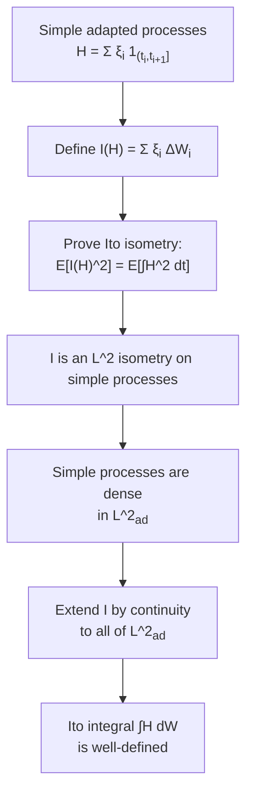
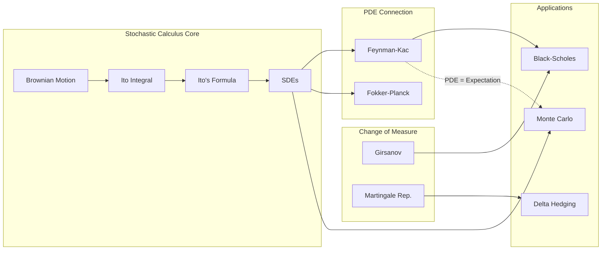
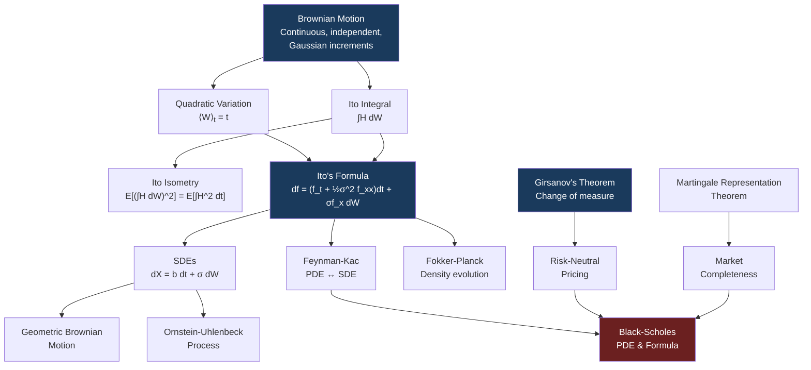

# Module 04: Stochastic Calculus

**Prerequisites:** Modules 01 (Linear Algebra), 02 (Probability & Measure Theory), 05 (ODEs & PDEs)
**Builds toward:** Modules 17, 18, 19, 20, 23, 25

---

## Table of Contents

1. [Brownian Motion](#1-brownian-motion)
2. [The Ito Integral](#2-the-ito-integral)
3. [Ito's Formula (The Stochastic Chain Rule)](#3-itos-formula-the-stochastic-chain-rule)
4. [Stochastic Differential Equations](#4-stochastic-differential-equations)
5. [Girsanov's Theorem](#5-girsanovs-theorem)
6. [Martingale Representation Theorem](#6-martingale-representation-theorem)
7. [Feynman-Kac Formula](#7-feynman-kac-formula)
8. [Fokker-Planck Equation](#8-fokker-planck-equation)
9. [Stratonovich Calculus](#9-stratonovich-calculus)
10. [Multi-dimensional Extension](#10-multi-dimensional-extension)
11. [Implementation: Python](#11-implementation-python)
12. [Implementation: C++](#12-implementation-c)
13. [Exercises](#13-exercises)
14. [Summary](#14-summary)

---

## 1. Brownian Motion

Brownian motion is the central stochastic process in quantitative finance. It provides the randomness engine behind virtually every continuous-time pricing model. This section develops the object rigorously, proves its key analytic properties, and explains why it is the natural model for log-price increments.

### 1.1 Formal Definition

**Definition 1.1 (Standard Brownian Motion).** A stochastic process $\{W_t\}_{t \geq 0}$ defined on a probability space $(\Omega, \mathcal{F}, \mathbb{P})$ is a *standard Brownian motion* (or *Wiener process*) if it satisfies:

1. **Initial condition.** $W_0 = 0$ almost surely.
2. **Independent increments.** For any $0 \leq t_1 < t_2 < \cdots < t_n$, the increments $W_{t_2} - W_{t_1}, W_{t_3} - W_{t_2}, \ldots, W_{t_n} - W_{t_{n-1}}$ are mutually independent.
3. **Gaussian increments.** For all $0 \leq s < t$, the increment $W_t - W_s \sim \mathcal{N}(0, t - s)$.
4. **Continuous paths.** The map $t \mapsto W_t(\omega)$ is continuous for $\mathbb{P}$-almost every $\omega \in \Omega$.

From conditions (2) and (3) one immediately obtains $\mathbb{E}[W_t] = 0$ and $\text{Cov}(W_s, W_t) = \min(s, t)$.

### 1.2 Construction: Levy-Ciesielski Wavelet Construction

One must verify that an object satisfying all four properties exists. The *Levy-Ciesielski construction* builds Brownian motion on $[0, 1]$ as a random series expansion in the Schauder basis.

Let $\{Z_n\}_{n \geq 0}$ be i.i.d. $\mathcal{N}(0,1)$ random variables. Define the *Schauder functions* $\{s_n\}$ as antiderivatives of the Haar wavelets. The $n$-th Schauder function $s_n$ is a piecewise-linear "hat" function supported on a dyadic subinterval of $[0,1]$. Then:

$$W_t = Z_0 \, t + \sum_{n=1}^{\infty} Z_n \, s_n(t)$$

converges uniformly in $t \in [0,1]$ almost surely. The resulting limit is a continuous function of $t$ and satisfies properties (1)--(3) by the orthonormality of the Schauder system.

**Extension to** $[0, \infty)$. Concatenate independent copies of the construction on $[0,1]$, $[1,2]$, $[2,3]$, etc., using the Kolmogorov extension theorem.

### 1.3 Properties of Brownian Paths

**Theorem 1.2 (Quadratic Variation).** For any partition $\Pi_n = \{0 = t_0^n < t_1^n < \cdots < t_{k_n}^n = T\}$ with mesh $|\Pi_n| \to 0$:

$$\langle W \rangle_T := \lim_{|\Pi_n| \to 0} \sum_{i=0}^{k_n - 1} (W_{t_{i+1}^n} - W_{t_i^n})^2 = T \quad \text{in } L^2 \text{ and in probability.}$$

*Proof.* Define $Q_n = \sum_{i} (\Delta W_i)^2$ where $\Delta W_i = W_{t_{i+1}^n} - W_{t_i^n}$. We compute:

$$\mathbb{E}[Q_n] = \sum_{i} \mathbb{E}[(\Delta W_i)^2] = \sum_i (t_{i+1}^n - t_i^n) = T.$$

For the variance:

$$\text{Var}(Q_n) = \sum_i \text{Var}((\Delta W_i)^2).$$

Since $\Delta W_i \sim \mathcal{N}(0, \Delta t_i)$, we have $(\Delta W_i)^2 / \Delta t_i \sim \chi^2(1)$, so $\text{Var}((\Delta W_i)^2) = 2(\Delta t_i)^2$. Therefore:

$$\text{Var}(Q_n) = 2 \sum_i (\Delta t_i)^2 \leq 2 |\Pi_n| \sum_i \Delta t_i = 2 |\Pi_n| \cdot T \to 0 \quad \text{as } |\Pi_n| \to 0.$$

By Chebyshev's inequality, $Q_n \to T$ in probability and in $L^2$. $\blacksquare$

**Corollary 1.3 (Infinite First Variation).** The total first variation of Brownian motion on $[0, T]$ is infinite a.s.:

$$\sum_i |W_{t_{i+1}} - W_{t_i}| \to \infty.$$

*Proof sketch.* By Cauchy-Schwarz, $\sum |\Delta W_i| \geq (\sum (\Delta W_i)^2) / \max_i |\Delta W_i|$. Since $\max_i |\Delta W_i| \to 0$ a.s. (by path continuity and the modulus of continuity) and $\sum (\Delta W_i)^2 \to T > 0$, the first variation must diverge. $\blacksquare$

**Theorem 1.4 (Nowhere Differentiability).** Almost surely, the map $t \mapsto W_t(\omega)$ is nowhere differentiable.

*Proof sketch.* Suppose $W$ is differentiable at some point $t_0$ with derivative $c$. Then for small $h$, $|W_{t_0 + h} - W_{t_0}| \leq (|c| + 1)|h|$. Partitioning $[t_0, t_0 + \delta]$ into $n$ subintervals of length $\delta/n$ gives:

$$\sum_{i=0}^{n-1} (W_{t_i + \delta/n} - W_{t_i})^2 \leq (|c|+1)^2 \frac{\delta^2}{n^2} \cdot n = (|c|+1)^2 \frac{\delta^2}{n} \to 0.$$

But the quadratic variation over $[t_0, t_0 + \delta]$ must equal $\delta > 0$, a contradiction. $\blacksquare$

**Theorem 1.5 (Holder Continuity).** For any $\gamma < 1/2$, Brownian motion is $\gamma$-Holder continuous on $[0, T]$ a.s. That is, there exists a random constant $C(\omega) < \infty$ such that:

$$|W_t - W_s| \leq C(\omega) |t - s|^{\gamma} \quad \forall \, s, t \in [0, T].$$

However, Brownian motion is *not* $1/2$-Holder continuous. The critical exponent is exactly $1/2$.

*Proof sketch ($\gamma$-Holder for $\gamma < 1/2$).* The key tool is the *Kolmogorov continuity theorem*. For Brownian motion, $\mathbb{E}[|W_t - W_s|^{2p}] = C_p |t - s|^p$ for any positive integer $p$ (since the $2p$-th moment of $\mathcal{N}(0, |t-s|)$ is $C_p |t-s|^p$). Choosing $p$ large enough that $p > 1 + 1/(2\gamma)$ gives the required moment condition $\mathbb{E}[|W_t - W_s|^{2p}] \leq C |t-s|^{1+\epsilon}$ with $\epsilon = p - 1 > 0$. The Kolmogorov theorem then yields $\gamma$-Holder continuity for $\gamma < (p-1)/(2p)$. Since $p$ can be taken arbitrarily large, $\gamma$ can approach $1/2$ from below.

*Why not $\gamma = 1/2$.* If $W$ were $1/2$-Holder, then $|W_{t+h} - W_t| \leq C\sqrt{h}$, and the quadratic variation over $[0, T]$ would satisfy $\sum (\Delta W_i)^2 \leq C^2 \sum \Delta t_i \cdot \max \Delta t_i / \Delta t_i = C^2 T$, which appears consistent --- but in fact the Holder constant $C$ would need to be finite uniformly, contradicting the law of the iterated logarithm: $\limsup_{h \to 0} |W_{t+h} - W_t| / \sqrt{2h \log\log(1/h)} = 1$ a.s., which shows local fluctuations exceed $C\sqrt{h}$ for any finite $C$.

**Theorem 1.9 (Law of the Iterated Logarithm).** For standard Brownian motion:

$$\limsup_{t \to \infty} \frac{W_t}{\sqrt{2t \log\log t}} = 1 \quad \text{a.s.}$$

This quantifies the precise rate of growth of Brownian paths --- faster than $\sqrt{t}$ by a factor of $\sqrt{2\log\log t}$, but no faster.

### 1.4 Filtration and the Markov Property

The *natural filtration* of Brownian motion is $\mathcal{F}_t^W = \sigma(W_s : 0 \leq s \leq t)$, augmented with the $\mathbb{P}$-null sets of $\mathcal{F}$ to satisfy the *usual conditions* (right-continuity and completeness).

**Theorem 1.6 (Markov Property).** For any bounded measurable $f$ and $s \leq t$:

$$\mathbb{E}[f(W_t) \mid \mathcal{F}_s^W] = \mathbb{E}[f(W_t) \mid W_s].$$

The future depends on the past only through the present.

*Proof.* Write $W_t = W_s + (W_t - W_s)$. By independent increments, $W_t - W_s$ is independent of $\mathcal{F}_s^W$. Therefore:

$$\mathbb{E}[f(W_t) \mid \mathcal{F}_s^W] = \mathbb{E}[f(W_s + (W_t - W_s)) \mid \mathcal{F}_s^W] = g(W_s)$$

where $g(x) = \mathbb{E}[f(x + Z)]$ with $Z = W_t - W_s \sim \mathcal{N}(0, t-s)$ independent of $\mathcal{F}_s^W$. Since $g(W_s)$ is $\sigma(W_s)$-measurable, the conditioning on $\mathcal{F}_s^W$ reduces to conditioning on $W_s$. $\blacksquare$

**Theorem 1.7 (Strong Markov Property).** The Markov property extends to *stopping times*: if $\tau$ is a.s. finite, then $\tilde{W}_t = W_{\tau + t} - W_{\tau}$ is a standard Brownian motion independent of $\mathcal{F}_{\tau}$.

**Theorem 1.8 (Reflection Principle).** For a standard Brownian motion and $a > 0$:

$$\mathbb{P}\!\left(\sup_{0 \leq s \leq t} W_s \geq a\right) = 2\,\mathbb{P}(W_t \geq a) = 2\left(1 - \Phi\!\left(\frac{a}{\sqrt{t}}\right)\right)$$

where $\Phi$ is the standard normal CDF.

*Proof.* Let $\tau_a = \inf\{t \geq 0 : W_t = a\}$. By the strong Markov property, the process $\hat{W}_t = 2a - W_{\tau_a + t}$ (reflection of $W$ at level $a$ after time $\tau_a$) is also a Brownian motion started at $a$. Now:

$$\mathbb{P}(W_t \geq a) = \mathbb{P}(\tau_a \leq t, \, W_t \geq a).$$

On the event $\{\tau_a \leq t\}$, by the symmetry of Brownian motion after $\tau_a$, $\mathbb{P}(W_t \geq a \mid \tau_a \leq t) = 1/2$. Therefore:

$$\mathbb{P}(\tau_a \leq t) = 2\,\mathbb{P}(W_t \geq a) = 2\!\left(1 - \Phi\!\left(\frac{a}{\sqrt{t}}\right)\right).$$

Since $\{\tau_a \leq t\} = \{\sup_{0 \leq s \leq t} W_s \geq a\}$, the result follows. $\blacksquare$

The reflection principle is the foundation for pricing barrier options and computing first-passage-time distributions (Module 19).

### 1.5 Financial Interpretation

In finance, Brownian motion models the *log-price increments* of an asset. If $S_t$ is the price of a stock, the hypothesis that $\log(S_t / S_0)$ contains a Brownian component encodes:

- **Independent increments** correspond to the *efficient market hypothesis* --- past returns do not predict future returns.
- **Gaussian increments** give tractable distributions for option pricing (though real returns exhibit heavier tails).
- **Continuous paths** mean no jumps --- a simplification relaxed in jump-diffusion models (Module 20).

The quadratic variation property $\langle W \rangle_t = t$ is the engine behind *realized volatility estimation*: summing squared high-frequency returns estimates integrated variance.

---

## 2. The Ito Integral

### 2.1 Why Riemann-Stieltjes Fails

In classical analysis, the Riemann-Stieltjes integral $\int_0^T f(t) \, dg(t)$ exists when either $f$ is continuous and $g$ has bounded variation, or both are "well-behaved." Brownian motion has *infinite* first variation (Corollary 1.3), so the Riemann-Stieltjes integral $\int_0^T f(t) \, dW_t$ is undefined in the classical sense.

A new theory of integration is required. Kiyosi Ito constructed such a theory in the 1940s. The essential difficulty is that the choice of evaluation point *within* each subinterval matters: evaluating the integrand at the left endpoint, midpoint, or right endpoint gives different limits. The Ito integral resolves this ambiguity by insisting on the left endpoint, which guarantees the non-anticipative (adapted) property critical for financial applications.

Moreover, the evaluation-point sensitivity is not merely a technicality. Consider $\int_0^T W_t \, dW_t$. If we use left-endpoint evaluation (Ito), we get $\frac{1}{2}(W_T^2 - T)$; midpoint evaluation (Stratonovich) gives $\frac{1}{2}W_T^2$. The difference of $T/2$ is deterministic but non-negligible --- it is the integrated effect of the quadratic variation.

### 2.2 Construction for Simple Processes

A *simple (elementary) process* is a process of the form:

$$H_t = \sum_{i=0}^{n-1} \xi_i \, \mathbf{1}_{(t_i, t_{i+1}]}(t)$$

where $0 = t_0 < t_1 < \cdots < t_n = T$ and each $\xi_i$ is $\mathcal{F}_{t_i}$-measurable and square-integrable. The Ito integral for simple processes is defined naturally:

$$\int_0^T H_t \, dW_t := \sum_{i=0}^{n-1} \xi_i (W_{t_{i+1}} - W_{t_i}).$$

The key feature: the integrand $\xi_i$ is evaluated at the *left* endpoint $t_i$, making it *non-anticipative* (adapted). This is essential for financial modeling --- a trading strategy at time $t$ can only use information available at time $t$.

### 2.3 Extension via the Ito Isometry

**Theorem 2.1 (Ito Isometry).** For any simple adapted process $H$:

$$\mathbb{E}\!\left[\left(\int_0^T H_t \, dW_t\right)^{\!2}\right] = \mathbb{E}\!\left[\int_0^T H_t^2 \, dt\right].$$

*Proof.* Write $I(H) = \sum_{i} \xi_i \Delta W_i$. Then:

$$I(H)^2 = \sum_i \sum_j \xi_i \xi_j \Delta W_i \Delta W_j.$$

For $i < j$: $\mathbb{E}[\xi_i \xi_j \Delta W_i \Delta W_j] = \mathbb{E}[\xi_i \xi_j \Delta W_i \, \mathbb{E}[\Delta W_j \mid \mathcal{F}_{t_j}]] = 0$ because $\Delta W_j$ is independent of $\mathcal{F}_{t_j}$ and has mean zero.

For $i = j$: $\mathbb{E}[\xi_i^2 (\Delta W_i)^2] = \mathbb{E}[\xi_i^2 \, \mathbb{E}[(\Delta W_i)^2 \mid \mathcal{F}_{t_i}]] = \mathbb{E}[\xi_i^2 \Delta t_i]$.

Therefore:

$$\mathbb{E}[I(H)^2] = \sum_i \mathbb{E}[\xi_i^2 \Delta t_i] = \mathbb{E}\!\left[\int_0^T H_t^2 \, dt\right]. \quad \blacksquare$$

The Ito isometry says that the map $H \mapsto I(H)$ is an *isometry* from the Hilbert space $L^2(\Omega \times [0,T])$ (with appropriate adaptedness constraints) into $L^2(\Omega)$.

**Extension.** Since simple processes are dense in the space $\mathcal{L}^2_{\text{ad}} = \{H \text{ adapted} : \mathbb{E}[\int_0^T H_t^2 \, dt] < \infty\}$, the Ito integral extends uniquely by continuity (completeness of $L^2$) to all of $\mathcal{L}^2_{\text{ad}}$.



### 2.4 Properties of the Ito Integral

Let $M_t = \int_0^t H_s \, dW_s$ for $H \in \mathcal{L}^2_{\text{ad}}$.

1. **Linearity.** $\int (aH + bK) \, dW = a \int H \, dW + b \int K \, dW$.
2. **Zero expectation.** $\mathbb{E}[M_t] = 0$ for all $t$.
3. **Martingale property.** The process $\{M_t\}_{t \geq 0}$ is a continuous square-integrable martingale with respect to $\{\mathcal{F}_t\}$.
4. **Quadratic variation.** $\langle M \rangle_t = \int_0^t H_s^2 \, ds$.
5. **Ito isometry (general form).** $\mathbb{E}[M_t^2] = \mathbb{E}[\int_0^t H_s^2 \, ds]$.

**Property (3) --- proof sketch.** For $s < t$ and simple $H$:

$$\mathbb{E}[M_t - M_s \mid \mathcal{F}_s] = \mathbb{E}\!\left[\sum_{i: t_i \geq s} \xi_i \Delta W_i \;\middle|\; \mathcal{F}_s\right] = 0$$

since each $\xi_i$ is $\mathcal{F}_{t_i}$-measurable and $\mathbb{E}[\Delta W_i \mid \mathcal{F}_{t_i}] = 0$. The general case follows by the density argument.

### 2.5 Ito vs. Stratonovich

The Ito integral evaluates the integrand at the *left* endpoint; the Stratonovich integral uses the *midpoint*. The two give different results:

$$\int_0^T W_t \, dW_t = \frac{1}{2}W_T^2 - \frac{1}{2}T \quad (\text{Ito}), \qquad \int_0^T W_t \circ dW_t = \frac{1}{2}W_T^2 \quad (\text{Stratonovich}).$$

Finance uses Ito because the non-anticipative property matches the reality of trading. Section 9 discusses Stratonovich in detail.

---

## 3. Ito's Formula (The Stochastic Chain Rule)

Ito's formula is the single most important result in stochastic calculus. It is the chain rule adapted to the presence of quadratic variation.

### 3.1 Statement

**Theorem 3.1 (Ito's Formula --- scalar case).** Let $f \in C^{1,2}([0,\infty) \times \mathbb{R})$ and let $W_t$ be a standard Brownian motion. Then:

$$df(t, W_t) = \frac{\partial f}{\partial t} \, dt + \frac{\partial f}{\partial x} \, dW_t + \frac{1}{2} \frac{\partial^2 f}{\partial x^2} \, dt.$$

More generally, if $X_t$ satisfies $dX_t = \mu_t \, dt + \sigma_t \, dW_t$, then:

$$df(t, X_t) = \left(\frac{\partial f}{\partial t} + \mu_t \frac{\partial f}{\partial x} + \frac{1}{2} \sigma_t^2 \frac{\partial^2 f}{\partial x^2}\right) dt + \sigma_t \frac{\partial f}{\partial x} \, dW_t.$$

### 3.2 Full Derivation

The derivation reveals *why* the extra $\tfrac{1}{2} f_{xx}$ term appears.

**Step 1 --- Taylor expansion.** For $f \in C^{1,2}$, expand around $(t, x)$:

$$f(t + \Delta t, x + \Delta x) - f(t, x) = f_t \, \Delta t + f_x \, \Delta x + \frac{1}{2} f_{tt} (\Delta t)^2 + f_{tx} \, \Delta t \, \Delta x + \frac{1}{2} f_{xx} (\Delta x)^2 + \cdots$$

**Step 2 --- substitution rules.** Set $\Delta x = \Delta W_t$. From the quadratic variation theorem, as $\Delta t \to 0$:

| Product | Order | Rule |
|---------|-------|------|
| $(\Delta t)^2$ | $o(\Delta t)$ | Discard |
| $\Delta t \cdot \Delta W$ | $o(\Delta t)$ | Discard (since $\Delta W \sim \sqrt{\Delta t}$, the product is $O((\Delta t)^{3/2})$) |
| $(\Delta W)^2$ | $\Delta t$ | **Replace by** $dt$ |

The last rule is the heart of stochastic calculus: $dW_t \cdot dW_t = dt$.

**Step 3 --- assemble.** Keeping only terms of order $\Delta t$ or larger:

$$\Delta f \approx f_t \, \Delta t + f_x \, \Delta W + \frac{1}{2} f_{xx} \, (\Delta W)^2 = f_t \, \Delta t + f_x \, \Delta W + \frac{1}{2} f_{xx} \, \Delta t.$$

Taking $\Delta t \to 0$ formally yields:

$$df = f_t \, dt + f_x \, dW + \frac{1}{2} f_{xx} \, dt = \left(f_t + \frac{1}{2} f_{xx}\right) dt + f_x \, dW.$$

**Step 4 --- general process.** For $dX = \mu \, dt + \sigma \, dW$, the substitution rules become:

| Product | Replacement |
|---------|-------------|
| $dt \cdot dt$ | $0$ |
| $dt \cdot dW$ | $0$ |
| $dW \cdot dW$ | $dt$ |
| $dX \cdot dX$ | $\sigma^2 \, dt$ |

Applying these to the Taylor expansion of $f(t, X_t)$ gives the general Ito formula. $\blacksquare$

### 3.3 Multi-dimensional Ito Formula

For $\mathbf{X}_t = (X_t^1, \ldots, X_t^n)^\top$ with $dX_t^i = \mu^i \, dt + \sum_j \sigma^{ij} \, dW_t^j$ and $f \in C^{1,2}$:

$$df = \frac{\partial f}{\partial t} dt + \sum_i \frac{\partial f}{\partial x_i} dX_t^i + \frac{1}{2} \sum_{i,j} \frac{\partial^2 f}{\partial x_i \partial x_j} d\langle X^i, X^j \rangle_t$$

where $d\langle X^i, X^j \rangle_t = \sum_k \sigma^{ik} \sigma^{jk} dt$.

### 3.4 Worked Examples

**Example 3.1:** Compute $d(W_t^2)$.

Set $f(x) = x^2$, so $f_t = 0$, $f_x = 2x$, $f_{xx} = 2$. Ito's formula gives:

$$d(W_t^2) = 2W_t \, dW_t + \frac{1}{2} \cdot 2 \, dt = 2W_t \, dW_t + dt.$$

Integrating: $W_T^2 = 2\int_0^T W_t \, dW_t + T$, which recovers the Ito integral $\int_0^T W_t \, dW_t = \frac{1}{2}(W_T^2 - T)$.

**Example 3.2:** Compute $d(e^{W_t})$.

Set $f(x) = e^x$. Then $f_x = f_{xx} = e^x$:

$$d(e^{W_t}) = e^{W_t} \, dW_t + \frac{1}{2} e^{W_t} \, dt = e^{W_t}\!\left(dW_t + \frac{1}{2} dt\right).$$

**Example 3.3:** Derive $d(S_t)$ for Geometric Brownian Motion $S_t = S_0 \exp\!\left((\mu - \frac{1}{2}\sigma^2)t + \sigma W_t\right)$.

Set $f(t, x) = S_0 \exp((\mu - \frac{1}{2}\sigma^2)t + \sigma x)$. Then:

$$f_t = (\mu - \tfrac{1}{2}\sigma^2) f, \quad f_x = \sigma f, \quad f_{xx} = \sigma^2 f.$$

By Ito's formula:

$$dS_t = \left[(\mu - \tfrac{1}{2}\sigma^2) + \tfrac{1}{2}\sigma^2\right] S_t \, dt + \sigma S_t \, dW_t = \mu S_t \, dt + \sigma S_t \, dW_t.$$

This confirms that the GBM SDE $dS = \mu S \, dt + \sigma S \, dW$ has the exponential solution.

---

## 4. Stochastic Differential Equations

### 4.1 Definition

A *stochastic differential equation* (SDE) on $[0, T]$ is written:

$$dX_t = b(t, X_t) \, dt + \sigma(t, X_t) \, dW_t, \qquad X_0 = x_0,$$

which is shorthand for the integral equation:

$$X_t = x_0 + \int_0^t b(s, X_s) \, ds + \int_0^t \sigma(s, X_s) \, dW_s.$$

Here $b: [0,T] \times \mathbb{R} \to \mathbb{R}$ is the *drift* coefficient and $\sigma: [0,T] \times \mathbb{R} \to \mathbb{R}$ is the *diffusion* coefficient.

### 4.2 Existence and Uniqueness

**Theorem 4.1 (Ito's Existence and Uniqueness Theorem).** Suppose $b$ and $\sigma$ satisfy:

1. **Lipschitz condition.** There exists $K > 0$ such that for all $t \in [0,T]$ and $x, y \in \mathbb{R}$:

$$|b(t,x) - b(t,y)| + |\sigma(t,x) - \sigma(t,y)| \leq K|x - y|.$$

2. **Linear growth condition.** There exists $C > 0$ such that for all $t, x$:

$$|b(t,x)|^2 + |\sigma(t,x)|^2 \leq C^2(1 + |x|^2).$$

Then the SDE has a unique *strong solution* $X_t$ that is adapted to $\mathcal{F}_t^W$ and satisfies $\mathbb{E}[\sup_{0 \leq t \leq T} |X_t|^2] < \infty$.

*Proof sketch.* The proof follows a Picard iteration scheme, analogous to the deterministic ODE case:

- Define $X_t^{(0)} = x_0$ and iterate:

$$X_t^{(n+1)} = x_0 + \int_0^t b(s, X_s^{(n)}) \, ds + \int_0^t \sigma(s, X_s^{(n)}) \, dW_s.$$

- Using the Lipschitz condition, the Ito isometry, and Gronwall's inequality, one shows:

$$\mathbb{E}\!\left[\sup_{0 \leq t \leq T} |X_t^{(n+1)} - X_t^{(n)}|^2\right] \leq \frac{(CT)^n}{n!} \cdot M$$

for some constant $M$, which implies convergence. $\blacksquare$

### 4.3 Strong vs. Weak Solutions

- A **strong solution** is a measurable functional of the driving Brownian motion: $X_t = F(t, \{W_s\}_{0 \leq s \leq t})$. It is adapted to the filtration $\mathcal{F}_t^W$ generated by $W$.
- A **weak solution** consists of a probability space $(\Omega', \mathcal{F}', \mathbb{P}')$, a Brownian motion $\tilde{W}$ on that space, and a process $X$ such that the SDE holds. The process $X$ need not be a functional of $\tilde{W}$ alone.

Strong implies weak, but not conversely. A classical counterexample is the *Tanaka SDE*:

$$dX_t = \text{sgn}(X_t) \, dW_t, \qquad X_0 = 0.$$

This has a weak solution (one can show $|W_t|$ is a weak solution, where $\tilde{W}_t = \int_0^t \text{sgn}(W_s) \, dW_s$) but no strong solution. The distinction matters in filtering theory and in models where the "physical" Brownian motion is observable.

**Uniqueness** also comes in two flavours: *pathwise uniqueness* (any two strong solutions driven by the same $W$ are indistinguishable) and *uniqueness in law* (any two weak solutions have the same finite-dimensional distributions). By the *Yamada-Watanabe theorem*, pathwise uniqueness plus existence of a weak solution implies existence of a strong solution.

### 4.4 Geometric Brownian Motion (GBM)

The GBM SDE is $dS_t = \mu S_t \, dt + \sigma S_t \, dW_t$ with $S_0 > 0$.

**Solution.** Set $Y_t = \log S_t$. By Ito's formula with $f(s) = \log s$, $f'(s) = 1/s$, $f''(s) = -1/s^2$:

$$dY_t = \frac{1}{S_t} dS_t + \frac{1}{2}\!\left(-\frac{1}{S_t^2}\right)(dS_t)^2 = (\mu - \tfrac{1}{2}\sigma^2) \, dt + \sigma \, dW_t.$$

Integrating:

$$\log S_t = \log S_0 + (\mu - \tfrac{1}{2}\sigma^2)t + \sigma W_t,$$

$$\boxed{S_t = S_0 \exp\!\left((\mu - \tfrac{1}{2}\sigma^2)t + \sigma W_t\right).}$$

The $-\frac{1}{2}\sigma^2$ correction (the *Ito correction*) is a direct consequence of the $\frac{1}{2}f_{xx}$ term in Ito's formula. It has a profound financial implication: the expected log-return $\mathbb{E}[\log(S_t/S_0)] = (\mu - \frac{1}{2}\sigma^2)t$ is *less* than the expected arithmetic return $\mu t$ by exactly $\frac{1}{2}\sigma^2 t$. This is the *variance drag* or *volatility tax*, and it means that higher volatility reduces the geometric growth rate of wealth even when the arithmetic expected return is unchanged.

**Moments of GBM.** Since $\log(S_t / S_0) \sim \mathcal{N}((\mu - \frac{1}{2}\sigma^2)t, \, \sigma^2 t)$, the moment generating function of the lognormal gives:

$$\mathbb{E}[S_t^n] = S_0^n \exp\!\left(n\mu t + \frac{1}{2}n(n-1)\sigma^2 t\right).$$

In particular, $\mathbb{E}[S_t] = S_0 e^{\mu t}$ and $\text{Var}(S_t) = S_0^2 e^{2\mu t}(e^{\sigma^2 t} - 1)$.

### 4.5 Ornstein-Uhlenbeck (OU) Process

The OU SDE models mean-reversion:

$$dX_t = \theta(\mu - X_t) \, dt + \sigma \, dW_t, \qquad X_0 = x_0.$$

**Solution.** Multiply by the integrating factor $e^{\theta t}$:

$$d(e^{\theta t} X_t) = e^{\theta t}(dX_t + \theta X_t \, dt) = e^{\theta t} \theta \mu \, dt + e^{\theta t} \sigma \, dW_t.$$

Integrate from $0$ to $t$:

$$e^{\theta t} X_t = x_0 + \theta \mu \int_0^t e^{\theta s} \, ds + \sigma \int_0^t e^{\theta s} \, dW_s.$$

$$\boxed{X_t = x_0 e^{-\theta t} + \mu(1 - e^{-\theta t}) + \sigma \int_0^t e^{-\theta(t-s)} \, dW_s.}$$

The stochastic integral is Gaussian with mean zero and variance $\frac{\sigma^2}{2\theta}(1 - e^{-2\theta t})$. As $t \to \infty$:

$$X_t \xrightarrow{d} \mathcal{N}\!\left(\mu, \frac{\sigma^2}{2\theta}\right).$$

This is the **stationary distribution** of the OU process. In finance, the OU process models interest rates (Vasicek model) and volatility (in certain stochastic volatility models).

---

## 5. Girsanov's Theorem

Girsanov's theorem is the mathematical backbone of risk-neutral pricing. It tells us how to change the drift of a stochastic process by changing the probability measure.

### 5.1 Statement

**Theorem 5.1 (Girsanov).** Let $W_t$ be a Brownian motion under $\mathbb{P}$ and let $\{\theta_t\}_{0 \leq t \leq T}$ be an adapted process satisfying Novikov's condition (below). Define:

$$Z_t = \exp\!\left(-\int_0^t \theta_s \, dW_s - \frac{1}{2}\int_0^t \theta_s^2 \, ds\right)$$

and set $d\mathbb{Q} = Z_T \, d\mathbb{P}$ (i.e., $Z_T$ is the Radon-Nikodym derivative $\frac{d\mathbb{Q}}{d\mathbb{P}}$). Then under $\mathbb{Q}$:

$$\tilde{W}_t := W_t + \int_0^t \theta_s \, ds$$

is a standard Brownian motion.

### 5.2 The Exponential Martingale (Doleans-Dade Exponential)

The process $Z_t$ is an example of the *stochastic exponential* or *Doleans-Dade exponential*:

$$Z_t = \mathcal{E}\!\left(-\int_0^{\cdot} \theta_s \, dW_s\right)_t.$$

In general, the stochastic exponential of a local martingale $M_t$ is $\mathcal{E}(M)_t = \exp(M_t - \frac{1}{2}\langle M \rangle_t)$, and it satisfies $d\mathcal{E}(M)_t = \mathcal{E}(M)_t \, dM_t$.

One can verify by Ito's formula: setting $f(t, m) = \exp(m - \frac{1}{2}\langle M \rangle_t)$, the drift term cancels, and $Z_t$ is a local martingale.

### 5.3 Novikov's Condition

**Theorem 5.2 (Novikov).** If

$$\mathbb{E}\!\left[\exp\!\left(\frac{1}{2}\int_0^T \theta_t^2 \, dt\right)\right] < \infty,$$

then $Z_t = \mathcal{E}(-\int_0^{\cdot} \theta \, dW)_t$ is a true martingale (not merely a local martingale), and $\mathbb{E}[Z_T] = 1$. This ensures that $\mathbb{Q}$ is a valid probability measure.

### 5.4 Proof Outline of Girsanov's Theorem

We verify that $\tilde{W}_t$ has the correct distribution under $\mathbb{Q}$.

**Step 1.** Show $\tilde{W}_t$ is a $\mathbb{Q}$-martingale. For $s < t$, we need $\mathbb{E}^{\mathbb{Q}}[\tilde{W}_t \mid \mathcal{F}_s] = \tilde{W}_s$. By Bayes' formula for conditional expectations under a change of measure:

$$\mathbb{E}^{\mathbb{Q}}[\tilde{W}_t \mid \mathcal{F}_s] = \frac{\mathbb{E}^{\mathbb{P}}[Z_t \tilde{W}_t \mid \mathcal{F}_s]}{\mathbb{E}^{\mathbb{P}}[Z_t \mid \mathcal{F}_s]} = \frac{\mathbb{E}^{\mathbb{P}}[Z_t \tilde{W}_t \mid \mathcal{F}_s]}{Z_s}.$$

**Step 2.** Compute $d(Z_t \tilde{W}_t)$ using the product rule (Ito's formula). We have:

$$dZ_t = -\theta_t Z_t \, dW_t, \qquad d\tilde{W}_t = dW_t + \theta_t \, dt.$$

By the Ito product rule:

$$d(Z_t \tilde{W}_t) = Z_t \, d\tilde{W}_t + \tilde{W}_t \, dZ_t + dZ_t \cdot d\tilde{W}_t.$$

Substituting:

$$= Z_t(dW_t + \theta_t \, dt) - \tilde{W}_t \theta_t Z_t \, dW_t - \theta_t Z_t \, dt$$

$$= Z_t \, dW_t + Z_t \theta_t \, dt - \tilde{W}_t \theta_t Z_t \, dW_t - \theta_t Z_t \, dt$$

$$= (Z_t - \tilde{W}_t \theta_t Z_t) \, dW_t.$$

This is a stochastic integral with respect to $dW_t$ (a $\mathbb{P}$-martingale increment), so $Z_t \tilde{W}_t$ is a $\mathbb{P}$-local martingale. Under appropriate integrability conditions (ensured by Novikov), it is a true $\mathbb{P}$-martingale.

**Step 3.** Therefore $\mathbb{E}^{\mathbb{P}}[Z_t \tilde{W}_t \mid \mathcal{F}_s] = Z_s \tilde{W}_s$, and dividing by $Z_s$ gives $\mathbb{E}^{\mathbb{Q}}[\tilde{W}_t \mid \mathcal{F}_s] = \tilde{W}_s$.

**Step 4.** Show that $\tilde{W}_t$ has the correct quadratic variation $\langle \tilde{W} \rangle_t = t$ under $\mathbb{Q}$, and invoke Levy's characterization: a continuous local martingale with quadratic variation $t$ is a Brownian motion. $\blacksquare$

### 5.5 Financial Application: Physical to Risk-Neutral Measure

Under the physical measure $\mathbb{P}$, a stock follows $dS_t = \mu S_t \, dt + \sigma S_t \, dW_t^{\mathbb{P}}$. To price derivatives, we need the *risk-neutral measure* $\mathbb{Q}$ under which the discounted stock price $e^{-rt}S_t$ is a martingale.

Set $\theta = \frac{\mu - r}{\sigma}$ (the **market price of risk** or **Sharpe ratio**). By Girsanov, $\tilde{W}_t = W_t^{\mathbb{P}} + \theta t$ is a $\mathbb{Q}$-Brownian motion, and:

$$dS_t = \mu S_t \, dt + \sigma S_t \, dW_t^{\mathbb{P}} = \mu S_t \, dt + \sigma S_t(d\tilde{W}_t - \theta \, dt)$$

$$= (\mu - \sigma\theta) S_t \, dt + \sigma S_t \, d\tilde{W}_t = rS_t \, dt + \sigma S_t \, d\tilde{W}_t.$$

Under $\mathbb{Q}$, the stock grows at rate $r$ (not $\mu$), and derivative prices are computed as discounted $\mathbb{Q}$-expectations:

$$V_0 = e^{-rT} \mathbb{E}^{\mathbb{Q}}[\text{payoff}(S_T)].$$

The Radon-Nikodym derivative is:

$$\frac{d\mathbb{Q}}{d\mathbb{P}} = \exp\!\left(-\frac{\mu - r}{\sigma} W_T^{\mathbb{P}} - \frac{1}{2}\left(\frac{\mu - r}{\sigma}\right)^2 T\right).$$

---

## 6. Martingale Representation Theorem

### 6.1 Statement

**Theorem 6.1 (Martingale Representation Theorem).** Let $\{W_t\}$ be a standard Brownian motion and $\{\mathcal{F}_t\}$ its augmented natural filtration. If $M_t$ is any square-integrable $\mathcal{F}_t$-martingale, then there exists a unique adapted process $\phi_t \in \mathcal{L}^2_{\text{ad}}$ such that:

$$M_t = M_0 + \int_0^t \phi_s \, dW_s \qquad \text{a.s., for all } t \geq 0.$$

Equivalently, every $L^2$ martingale adapted to the Brownian filtration is a stochastic integral with respect to $W$. The Brownian filtration carries no "extra randomness" beyond what is captured by stochastic integrals.

*Proof sketch.* The proof proceeds in two stages:

1. **Exponential martingales span.** For each $\lambda \in \mathbb{R}$, the process $E_t^{\lambda} = \exp(\lambda W_t - \frac{1}{2}\lambda^2 t)$ is a martingale with $E_t^{\lambda} = 1 + \lambda \int_0^t E_s^{\lambda} \, dW_s$ (by Ito's formula). The collection $\{E_T^{\lambda}\}_{\lambda \in \mathbb{R}}$ generates $L^2(\mathcal{F}_T)$ via the uniqueness of the Laplace transform.

2. **Closure argument.** Since each $E_T^{\lambda}$ has a stochastic integral representation, and these span $L^2(\mathcal{F}_T)$, by linearity and $L^2$-closure, every $L^2(\mathcal{F}_T)$-random variable has a stochastic integral representation. Setting $M_t = \mathbb{E}[\xi \mid \mathcal{F}_t]$ for $\xi \in L^2(\mathcal{F}_T)$ yields the result. $\blacksquare$

### 6.2 Significance: Market Completeness

In the Black-Scholes model, the only source of randomness is a single Brownian motion $W_t$. The Martingale Representation Theorem guarantees that *every* contingent claim (representable as a square-integrable $\mathcal{F}_T$-measurable random variable) can be written as a stochastic integral. This stochastic integral corresponds to a *replicating trading strategy*.

Concretely, if a derivative has discounted price $\tilde{V}_t = e^{-rt}V_t$ that is a $\mathbb{Q}$-martingale, then:

$$\tilde{V}_t = \tilde{V}_0 + \int_0^t \phi_s \, d\tilde{W}_s$$

for some adapted $\phi$. Translating back to the stock:

$$dV_t = r V_t \, dt + \phi_t \sigma S_t \, d\tilde{W}_t = r V_t \, dt + \underbrace{\frac{\phi_t \sigma S_t}{\sigma S_t}}_{\Delta_t}(dS_t - rS_t \, dt).$$

The process $\Delta_t = \phi_t$ represents the number of shares held at time $t$ --- the hedge ratio. The Martingale Representation Theorem therefore guarantees that the Black-Scholes market is **complete**: every contingent claim can be perfectly replicated.

### 6.3 Connection to Replicating Portfolios

A portfolio consisting of $\Delta_t$ shares of stock and $B_t$ units of the bank account satisfies:

$$V_t = \Delta_t S_t + B_t e^{rt}.$$

If the portfolio is self-financing ($dV_t = \Delta_t \, dS_t + B_t \, d(e^{rt})$), then by comparing with the martingale representation, one recovers the Black-Scholes delta-hedging strategy:

$$\Delta_t = \frac{\partial V}{\partial S}(t, S_t).$$

The Martingale Representation Theorem provides the *existence* of the hedge; the Feynman-Kac connection (next section) provides the *formula* for computing it.

**Remark on incomplete markets.** When additional sources of randomness are present (e.g., stochastic volatility driven by a second Brownian motion $W_t^2$ that is not perfectly correlated with the stock), the Martingale Representation Theorem no longer guarantees replication. The market is *incomplete*, and there exist infinitely many risk-neutral measures. Selecting among them requires additional criteria (e.g., minimal entropy, variance-optimal hedging). This is developed in Modules 20 and 23.

---

## 7. Feynman-Kac Formula

The Feynman-Kac formula is the bridge between stochastic differential equations and partial differential equations. It allows us to solve certain PDEs by computing expectations of SDEs and vice versa.

### 7.1 Statement

**Theorem 7.1 (Feynman-Kac).** Let $X_t$ solve $dX_t = b(t, X_t) \, dt + \sigma(t, X_t) \, dW_t$ and let $g: \mathbb{R} \to \mathbb{R}$ be measurable with polynomial growth. Define:

$$u(t, x) = \mathbb{E}\!\left[e^{-\int_t^T r(s, X_s) ds} g(X_T) \;\middle|\; X_t = x\right].$$

Then (under regularity conditions) $u$ solves the PDE:

$$\frac{\partial u}{\partial t} + b(t,x) \frac{\partial u}{\partial x} + \frac{1}{2}\sigma(t,x)^2 \frac{\partial^2 u}{\partial x^2} - r(t,x) \, u = 0,$$

with terminal condition $u(T, x) = g(x)$.

In the special case $r \equiv 0$:

$$u(t, x) = \mathbb{E}[g(X_T) \mid X_t = x]$$

solves $\frac{\partial u}{\partial t} + b \, u_x + \frac{1}{2}\sigma^2 u_{xx} = 0$ with $u(T, x) = g(x)$.

### 7.2 Derivation

**Step 1.** Define $Y_t = e^{-\int_0^t r(s, X_s) ds} u(t, X_t)$. We show $Y_t$ is a martingale.

**Step 2.** Apply Ito's formula to $u(t, X_t)$:

$$du = \left(u_t + b \, u_x + \frac{1}{2}\sigma^2 u_{xx}\right) dt + \sigma u_x \, dW_t.$$

**Step 3.** Apply the product rule to $Y_t = e^{-\int_0^t r \, ds} u(t, X_t)$:

$$dY_t = -r \, Y_t \, dt + e^{-\int_0^t r \, ds} du(t, X_t)$$

$$= e^{-\int_0^t r \, ds}\!\left[-r \, u + u_t + b \, u_x + \frac{1}{2}\sigma^2 u_{xx}\right] dt + e^{-\int_0^t r \, ds} \sigma u_x \, dW_t.$$

**Step 4.** If $u$ solves the Feynman-Kac PDE, then the $dt$ coefficient vanishes, and $Y_t$ is a local martingale. Under growth conditions, it is a true martingale.

**Step 5.** Therefore $Y_t = \mathbb{E}[Y_T \mid \mathcal{F}_t]$, i.e.:

$$e^{-\int_0^t r \, ds} u(t, X_t) = \mathbb{E}\!\left[e^{-\int_0^T r \, ds} g(X_T) \;\middle|\; \mathcal{F}_t\right].$$

Setting $t = 0$ recovers the Feynman-Kac representation. $\blacksquare$

### 7.3 Application: Deriving the Black-Scholes PDE

Under $\mathbb{Q}$, $dS_t = rS_t \, dt + \sigma S_t \, d\tilde{W}_t$. The price of a European option with payoff $g(S_T)$ is:

$$V(t, S) = e^{-r(T-t)} \mathbb{E}^{\mathbb{Q}}[g(S_T) \mid S_t = S].$$

By Feynman-Kac with $b(t,x) = rx$, $\sigma(t,x) = \sigma x$, and $r$ constant:

$$\frac{\partial V}{\partial t} + rS \frac{\partial V}{\partial S} + \frac{1}{2}\sigma^2 S^2 \frac{\partial^2 V}{\partial S^2} - rV = 0,$$

with $V(T, S) = g(S)$. This is the **Black-Scholes PDE**.

For a European call with $g(S) = (S - K)^+$, the solution is the Black-Scholes formula:

$$C(t, S) = S \, \Phi(d_1) - K e^{-r(T-t)} \Phi(d_2)$$

where $d_{1,2} = \frac{\log(S/K) + (r \pm \frac{1}{2}\sigma^2)(T-t)}{\sigma\sqrt{T-t}}$.

**The dual viewpoint.** Notice that the same pricing problem can be approached in two equivalent ways:

| Approach | Method | Tool |
|----------|--------|------|
| **PDE approach** | Solve the Black-Scholes PDE with boundary/terminal conditions | Finite differences, FEM |
| **Probabilistic approach** | Compute $e^{-r(T-t)}\mathbb{E}^{\mathbb{Q}}[g(S_T) \mid S_t = S]$ directly | Monte Carlo, analytic integration |

Feynman-Kac guarantees these give the same answer. In low dimensions ($d \leq 3$), PDE methods are often faster; in high dimensions, Monte Carlo dominates due to the curse of dimensionality.

---

## 8. Fokker-Planck Equation

While the Feynman-Kac formula gives the *backward* PDE (evolving backward in time from the terminal condition), the Fokker-Planck (or *forward Kolmogorov*) equation describes how the *probability density* of the process evolves forward in time.

### 8.1 Setup

Consider the SDE $dX_t = b(X_t) \, dt + \sigma(X_t) \, dW_t$ (time-homogeneous for simplicity). Let $p(x, t)$ denote the probability density of $X_t$, i.e., $\mathbb{P}(X_t \in A) = \int_A p(x, t) \, dx$.

### 8.2 Derivation

**Step 1.** For any smooth test function $\varphi$ with compact support, define:

$$\langle \varphi, p_t \rangle = \mathbb{E}[\varphi(X_t)] = \int \varphi(x) p(x, t) \, dx.$$

**Step 2.** Apply Ito's formula to $\varphi(X_t)$:

$$d\varphi(X_t) = \varphi'(X_t) b(X_t) \, dt + \varphi'(X_t) \sigma(X_t) \, dW_t + \frac{1}{2}\varphi''(X_t)\sigma(X_t)^2 \, dt.$$

**Step 3.** Take expectations (the stochastic integral has zero expectation):

$$\frac{d}{dt}\mathbb{E}[\varphi(X_t)] = \mathbb{E}\!\left[b(X_t)\varphi'(X_t) + \frac{1}{2}\sigma(X_t)^2 \varphi''(X_t)\right].$$

In density notation:

$$\int \varphi(x) \frac{\partial p}{\partial t}(x,t) \, dx = \int \!\left[b(x)\varphi'(x) + \frac{1}{2}\sigma(x)^2 \varphi''(x)\right] p(x,t) \, dx.$$

**Step 4.** Integrate by parts. For the first term:

$$\int b(x) \varphi'(x) p(x,t) \, dx = -\int \varphi(x) \frac{\partial}{\partial x}[b(x) p(x,t)] \, dx.$$

For the second term (integrating by parts twice):

$$\int \frac{1}{2}\sigma(x)^2 \varphi''(x) p(x,t) \, dx = \int \varphi(x) \frac{\partial^2}{\partial x^2}\!\left[\frac{1}{2}\sigma(x)^2 p(x,t)\right] dx.$$

**Step 5.** Since this holds for all test functions $\varphi$, by the fundamental lemma of the calculus of variations:

$$\boxed{\frac{\partial p}{\partial t} = -\frac{\partial}{\partial x}[b(x) p] + \frac{\partial^2}{\partial x^2}\!\left[\frac{1}{2}\sigma(x)^2 p\right].}$$

This is the **Fokker-Planck equation** (forward Kolmogorov equation).

### 8.3 Transition Densities

**GBM transition density.** For $dS = \mu S \, dt + \sigma S \, dW$, $\log S_t$ is Gaussian, and:

$$p(S, t \mid S_0, 0) = \frac{1}{S \sigma \sqrt{2\pi t}} \exp\!\left(-\frac{[\log(S/S_0) - (\mu - \frac{1}{2}\sigma^2)t]^2}{2\sigma^2 t}\right).$$

This is the *lognormal density*, which can be verified to satisfy the Fokker-Planck equation with $b(S) = \mu S$ and $\sigma(S) = \sigma S$. Note the $1/S$ prefactor arising from the Jacobian of the $\log$ transformation.

**Relationship between forward and backward equations.** Let $p(x, t \mid y, s)$ denote the transition density from state $y$ at time $s$ to state $x$ at time $t > s$. As a function of the *terminal* variables $(x, t)$, $p$ satisfies the Fokker-Planck (forward) equation. As a function of the *initial* variables $(y, s)$, $p$ satisfies the *backward Kolmogorov equation*:

$$-\frac{\partial p}{\partial s} = b(y) \frac{\partial p}{\partial y} + \frac{1}{2}\sigma(y)^2 \frac{\partial^2 p}{\partial y^2}.$$

The forward equation governs the evolution of probability distributions; the backward equation governs the evolution of expectations. The Feynman-Kac formula is the probabilistic counterpart of the backward equation.

**OU transition density.** For $dX = \theta(\mu - X) \, dt + \sigma \, dW$:

$$p(x, t \mid x_0, 0) = \frac{1}{\sqrt{2\pi v(t)}} \exp\!\left(-\frac{[x - m(t)]^2}{2v(t)}\right)$$

where $m(t) = x_0 e^{-\theta t} + \mu(1 - e^{-\theta t})$ and $v(t) = \frac{\sigma^2}{2\theta}(1 - e^{-2\theta t})$.

### 8.4 Stationary Solutions

Setting $\frac{\partial p}{\partial t} = 0$ gives the stationary Fokker-Planck equation:

$$0 = -\frac{d}{dx}[b(x) p_{\infty}(x)] + \frac{1}{2}\frac{d^2}{dx^2}[\sigma(x)^2 p_{\infty}(x)].$$

For the OU process with constant $\sigma$, integrating once:

$$\frac{1}{2}\sigma^2 p_{\infty}' = \theta(\mu - x) p_{\infty} + C_1.$$

With $C_1 = 0$ (assuming $p_{\infty} \to 0$ as $|x| \to \infty$), this is a first-order ODE with solution:

$$p_{\infty}(x) = \frac{1}{\sqrt{2\pi \sigma^2/(2\theta)}} \exp\!\left(-\frac{(x - \mu)^2}{2\sigma^2/(2\theta)}\right),$$

confirming the $\mathcal{N}(\mu, \sigma^2/(2\theta))$ stationary distribution derived in Section 4.5.

**General formula for stationary density.** For a one-dimensional diffusion $dX = b(x) \, dt + \sigma(x) \, dW$ with state-dependent diffusion, the stationary density (when it exists) takes the form:

$$p_{\infty}(x) = \frac{C}{\sigma(x)^2} \exp\!\left(\int^x \frac{2b(y)}{\sigma(y)^2} \, dy\right)$$

where $C$ is a normalisation constant. This is the *potential solution*, obtained by integrating the stationary Fokker-Planck equation once and setting the probability flux to zero. Existence of a normalisable $p_{\infty}$ requires that the integral $\int_{-\infty}^{\infty} p_{\infty}(x) \, dx$ converges, which imposes conditions on the balance between drift and diffusion at the boundaries.

**Application to CIR process.** The Cox-Ingersoll-Ross process $dX = \kappa(\theta - X) \, dt + \sigma\sqrt{X} \, dW$ (with $2\kappa\theta > \sigma^2$ to ensure positivity) has stationary density:

$$p_{\infty}(x) = \frac{\beta^{\alpha}}{\Gamma(\alpha)} x^{\alpha - 1} e^{-\beta x}, \quad x > 0,$$

where $\alpha = 2\kappa\theta/\sigma^2$ and $\beta = 2\kappa/\sigma^2$. This is a Gamma distribution, widely used in interest rate modeling (Module 18).

---

## 9. Stratonovich Calculus

### 9.1 Definition

The *Stratonovich integral* is defined using the midpoint evaluation:

$$\int_0^T X_t \circ dW_t := \lim_{|\Pi| \to 0} \sum_i \frac{X_{t_i} + X_{t_{i+1}}}{2}(W_{t_{i+1}} - W_{t_i}).$$

### 9.2 Relationship to the Ito Integral

**Theorem 9.1.** For a process $X_t$ satisfying $dX_t = a_t \, dt + b_t \, dW_t$:

$$\int_0^T X_t \circ dW_t = \int_0^T X_t \, dW_t + \frac{1}{2}\int_0^T b_t \, dt.$$

The correction term $\frac{1}{2}\int b_t \, dt = \frac{1}{2}\langle X, W \rangle_T$ is the *Ito-to-Stratonovich correction*.

*Proof sketch.* Expand $\frac{X_{t_i} + X_{t_{i+1}}}{2} = X_{t_i} + \frac{1}{2}(X_{t_{i+1}} - X_{t_i})$. The first part gives the Ito integral. The second part gives:

$$\frac{1}{2}\sum_i (X_{t_{i+1}} - X_{t_i})(W_{t_{i+1}} - W_{t_i}) \to \frac{1}{2}\langle X, W \rangle_T = \frac{1}{2}\int_0^T b_t \, dt. \quad \blacksquare$$

### 9.3 Stratonovich Chain Rule

The Stratonovich integral obeys the *classical* chain rule: for $f \in C^2$:

$$f(W_T) - f(W_0) = \int_0^T f'(W_t) \circ dW_t.$$

No second-order correction appears, which is why physicists and engineers prefer Stratonovich in applications where the noise is a limit of smooth processes (e.g., the Wong-Zakai theorem).

### 9.4 When to Use Which

| Criterion | Ito | Stratonovich |
|-----------|-----|-------------|
| Adapted / non-anticipative | Yes | No (uses future value) |
| Standard chain rule | No ($\frac{1}{2}f''$ correction) | Yes |
| Martingale property | $\int H \, dW$ is a martingale | Not in general |
| Finance applications | Standard | Rarely used |
| Physics / engineering | Less common | Standard |
| Numerical simulation | Euler-Maruyama | Heun / midpoint schemes |

**Rule of thumb for quantitative finance:** Always use Ito. The non-anticipative property reflects the physical reality of trading, and the martingale property is essential for pricing theory.

---

## 10. Multi-dimensional Extension

### 10.1 Correlated Brownian Motions

Let $\mathbf{W}_t = (W_t^1, \ldots, W_t^d)^\top$ be a $d$-dimensional Brownian motion with $dW_t^i \cdot dW_t^j = \rho_{ij} \, dt$. This can be constructed from independent Brownian motions $\mathbf{B}_t$ via the Cholesky decomposition:

$$\mathbf{W}_t = \mathbf{L} \mathbf{B}_t$$

where $\boldsymbol{\Sigma} = \mathbf{L}\mathbf{L}^\top$ is the correlation matrix (see Module 01, Section 9).

**Example (two correlated assets).** For assets with correlation $\rho$:

$$W_t^1 = B_t^1, \qquad W_t^2 = \rho \, B_t^1 + \sqrt{1 - \rho^2} \, B_t^2$$

where $B^1, B^2$ are independent. One can verify: $\mathbb{E}[dW^1 \cdot dW^2] = \rho \, dt$. The Cholesky factor is $\mathbf{L} = \begin{pmatrix} 1 & 0 \\ \rho & \sqrt{1-\rho^2}\end{pmatrix}$.

**Multi-dimensional Girsanov.** Girsanov's theorem extends naturally: if $\boldsymbol{\theta}_t \in \mathbb{R}^d$ is the vector of market prices of risk, then $d\tilde{\mathbf{W}}_t = d\mathbf{W}_t + \boldsymbol{\theta}_t \, dt$ is a $d$-dimensional $\mathbb{Q}$-Brownian motion, and the Radon-Nikodym derivative is:

$$\frac{d\mathbb{Q}}{d\mathbb{P}} = \exp\!\left(-\int_0^T \boldsymbol{\theta}_t^\top d\mathbf{W}_t - \frac{1}{2}\int_0^T \|\boldsymbol{\theta}_t\|^2 dt\right).$$

### 10.2 Multi-dimensional Ito Formula

For $\mathbf{X}_t \in \mathbb{R}^n$ with $dX_t^i = b^i \, dt + \sum_{j=1}^d \sigma^{ij} \, dW_t^j$ and $f \in C^{1,2}(\mathbb{R}_+ \times \mathbb{R}^n)$:

$$df = f_t \, dt + \sum_{i=1}^n f_{x_i} \, dX_t^i + \frac{1}{2}\sum_{i=1}^n \sum_{k=1}^n f_{x_i x_k} \, d\langle X^i, X^k \rangle_t$$

where $d\langle X^i, X^k \rangle_t = \sum_{j=1}^d \sigma^{ij} \sigma^{kj} \, dt = [\boldsymbol{\sigma}\boldsymbol{\sigma}^\top]_{ik} \, dt$.

In matrix notation, writing $\boldsymbol{\sigma}$ for the $n \times d$ diffusion matrix:

$$df = \left(f_t + \nabla f \cdot \mathbf{b} + \frac{1}{2}\text{tr}\!\left(\boldsymbol{\sigma}\boldsymbol{\sigma}^\top \mathbf{H}_f\right)\right) dt + \nabla f \cdot \boldsymbol{\sigma} \, d\mathbf{W}_t$$

where $\mathbf{H}_f$ is the Hessian matrix of $f$ with respect to $\mathbf{x}$.

### 10.3 Application: Multi-Asset Black-Scholes

For $n$ correlated assets with $dS_t^i = \mu^i S_t^i \, dt + \sigma^i S_t^i \, dW_t^i$ and $dW^i \cdot dW^j = \rho_{ij} \, dt$, the multi-dimensional Black-Scholes PDE for a derivative $V(t, S^1, \ldots, S^n)$ is:

$$\frac{\partial V}{\partial t} + \sum_i rS^i \frac{\partial V}{\partial S^i} + \frac{1}{2}\sum_{i,j} \rho_{ij}\sigma^i\sigma^j S^i S^j \frac{\partial^2 V}{\partial S^i \partial S^j} - rV = 0.$$

This PDE is typically solved by Monte Carlo simulation due to the curse of dimensionality for grid-based PDE solvers.

**Cross-gamma and correlation risk.** The cross-partial derivatives $\frac{\partial^2 V}{\partial S^i \partial S^j}$ (cross-gammas) are non-zero when the payoff depends on multiple assets jointly (e.g., basket options, spread options, best-of options). Hedging these cross-gammas requires trading in instruments that are sensitive to the correlation between assets --- a notoriously difficult task since correlation itself is not directly observable and tends to spike during market crises.

The following diagram summarises the relationships between the core results of stochastic calculus and their applications:



---

## 11. Implementation: Python

### 11.1 Euler-Maruyama Simulation of GBM

```python
"""
Euler-Maruyama simulation of Geometric Brownian Motion.

dS = mu * S * dt + sigma * S * dW

The Euler-Maruyama method discretises the SDE as:
    S_{n+1} = S_n + mu * S_n * dt + sigma * S_n * sqrt(dt) * Z_n
where Z_n ~ N(0,1).

We also compare with the exact (log-normal) solution to measure discretisation error.
"""

import numpy as np
import matplotlib.pyplot as plt
from typing import Tuple


def gbm_euler_maruyama(
    S0: float,
    mu: float,
    sigma: float,
    T: float,
    n_steps: int,
    n_paths: int,
    seed: int = 42,
) -> Tuple[np.ndarray, np.ndarray]:
    """
    Simulate GBM paths using the Euler-Maruyama scheme.

    Parameters
    ----------
    S0 : float
        Initial stock price.
    mu : float
        Drift coefficient (annualised).
    sigma : float
        Volatility coefficient (annualised).
    T : float
        Time horizon in years.
    n_steps : int
        Number of time discretisation steps.
    n_paths : int
        Number of Monte Carlo paths.
    seed : int
        Random seed for reproducibility.

    Returns
    -------
    t : np.ndarray, shape (n_steps + 1,)
        Time grid.
    S : np.ndarray, shape (n_paths, n_steps + 1)
        Simulated price paths.
    """
    rng = np.random.default_rng(seed)
    dt = T / n_steps
    sqrt_dt = np.sqrt(dt)

    # Pre-allocate path array
    t = np.linspace(0.0, T, n_steps + 1)
    S = np.empty((n_paths, n_steps + 1))
    S[:, 0] = S0

    # Generate all normal increments at once: shape (n_paths, n_steps)
    dZ = rng.standard_normal((n_paths, n_steps))

    # Euler-Maruyama iteration
    for i in range(n_steps):
        S[:, i + 1] = S[:, i] * (1.0 + mu * dt + sigma * sqrt_dt * dZ[:, i])

    return t, S


def gbm_exact(
    S0: float,
    mu: float,
    sigma: float,
    T: float,
    n_steps: int,
    n_paths: int,
    seed: int = 42,
) -> Tuple[np.ndarray, np.ndarray]:
    """
    Simulate GBM paths using the exact log-normal solution.

    S_t = S_0 * exp((mu - 0.5*sigma^2)*t + sigma*W_t)

    This avoids discretisation error entirely.
    """
    rng = np.random.default_rng(seed)
    dt = T / n_steps
    sqrt_dt = np.sqrt(dt)

    t = np.linspace(0.0, T, n_steps + 1)
    S = np.empty((n_paths, n_steps + 1))
    S[:, 0] = S0

    # Accumulate Brownian increments
    dZ = rng.standard_normal((n_paths, n_steps))
    W = np.zeros((n_paths, n_steps + 1))
    W[:, 1:] = np.cumsum(sqrt_dt * dZ, axis=1)

    # Exact solution at each time step
    for i in range(n_steps + 1):
        S[:, i] = S0 * np.exp((mu - 0.5 * sigma**2) * t[i] + sigma * W[:, i])

    return t, S


# ---------- Demonstration ----------
if __name__ == "__main__":
    # Parameters
    S0, mu, sigma, T = 100.0, 0.08, 0.20, 1.0
    n_steps, n_paths = 252, 10_000

    t_em, S_em = gbm_euler_maruyama(S0, mu, sigma, T, n_steps, n_paths)
    t_ex, S_ex = gbm_exact(S0, mu, sigma, T, n_steps, n_paths)

    # Report terminal distribution statistics
    print(f"Euler-Maruyama  E[S_T] = {S_em[:, -1].mean():.4f}, "
          f"Std[S_T] = {S_em[:, -1].std():.4f}")
    print(f"Exact solution  E[S_T] = {S_ex[:, -1].mean():.4f}, "
          f"Std[S_T] = {S_ex[:, -1].std():.4f}")
    # Theoretical: E[S_T] = S0*exp(mu*T), Std = S0*exp(mu*T)*sqrt(exp(sigma^2*T)-1)
    E_theory = S0 * np.exp(mu * T)
    Std_theory = E_theory * np.sqrt(np.exp(sigma**2 * T) - 1)
    print(f"Theoretical     E[S_T] = {E_theory:.4f}, Std[S_T] = {Std_theory:.4f}")
```

### 11.2 Milstein Scheme

The Milstein scheme adds a correction term that captures the second-order behaviour of the diffusion, achieving strong order 1.0 convergence (vs. 0.5 for Euler-Maruyama).

```python
"""
Milstein scheme for GBM:
    S_{n+1} = S_n + mu*S_n*dt + sigma*S_n*dW
              + 0.5*sigma*(sigma*S_n)*(dW^2 - dt)

For GBM, sigma'(S) * sigma(S) = sigma^2 * S, giving the Milstein correction:
    0.5 * sigma^2 * S_n * ((dW)^2 - dt)
"""

import numpy as np
from typing import Tuple


def gbm_milstein(
    S0: float,
    mu: float,
    sigma: float,
    T: float,
    n_steps: int,
    n_paths: int,
    seed: int = 42,
) -> Tuple[np.ndarray, np.ndarray]:
    """
    Milstein scheme for GBM, achieving strong order 1.0 convergence.

    Parameters and returns are identical to gbm_euler_maruyama.
    """
    rng = np.random.default_rng(seed)
    dt = T / n_steps
    sqrt_dt = np.sqrt(dt)

    t = np.linspace(0.0, T, n_steps + 1)
    S = np.empty((n_paths, n_steps + 1))
    S[:, 0] = S0

    dZ = rng.standard_normal((n_paths, n_steps))

    for i in range(n_steps):
        dW = sqrt_dt * dZ[:, i]
        # Euler-Maruyama part
        S_euler = S[:, i] * (1.0 + mu * dt + sigma * dW)
        # Milstein correction: 0.5 * sigma * (d sigma/dS * sigma * S) * (dW^2 - dt)
        # For GBM: d(sigma*S)/dS = sigma, so correction = 0.5*sigma^2*S*(dW^2 - dt)
        milstein_corr = 0.5 * sigma**2 * S[:, i] * (dW**2 - dt)
        S[:, i + 1] = S_euler + milstein_corr

    return t, S
```

### 11.3 Ornstein-Uhlenbeck Simulation

```python
"""
Exact simulation of the Ornstein-Uhlenbeck process.

dX = theta * (mu - X) * dt + sigma * dW

Since the conditional distribution is Gaussian (see Section 4.5),
we can sample exactly without discretisation error.
"""

import numpy as np
from typing import Tuple


def ou_exact(
    x0: float,
    theta: float,
    mu: float,
    sigma: float,
    T: float,
    n_steps: int,
    n_paths: int,
    seed: int = 42,
) -> Tuple[np.ndarray, np.ndarray]:
    """
    Exact simulation of the OU process using the Gaussian transition density.

    X_{t+dt} | X_t ~ N(m, v) where:
        m = X_t * exp(-theta*dt) + mu*(1 - exp(-theta*dt))
        v = sigma^2/(2*theta) * (1 - exp(-2*theta*dt))
    """
    rng = np.random.default_rng(seed)
    dt = T / n_steps

    t = np.linspace(0.0, T, n_steps + 1)
    X = np.empty((n_paths, n_steps + 1))
    X[:, 0] = x0

    # Pre-compute constants
    exp_neg_theta_dt = np.exp(-theta * dt)
    conditional_var = (sigma**2 / (2.0 * theta)) * (1.0 - np.exp(-2.0 * theta * dt))
    conditional_std = np.sqrt(conditional_var)

    dZ = rng.standard_normal((n_paths, n_steps))

    for i in range(n_steps):
        conditional_mean = X[:, i] * exp_neg_theta_dt + mu * (1.0 - exp_neg_theta_dt)
        X[:, i + 1] = conditional_mean + conditional_std * dZ[:, i]

    return t, X


if __name__ == "__main__":
    # Vasicek interest rate model parameters
    x0, theta, mu_ou, sigma_ou, T = 0.05, 0.5, 0.03, 0.01, 10.0
    t, X = ou_exact(x0, theta, mu_ou, sigma_ou, T, n_steps=2520, n_paths=5_000)

    stationary_mean = mu_ou
    stationary_var = sigma_ou**2 / (2.0 * theta)

    print(f"Simulated terminal mean:     {X[:, -1].mean():.6f}")
    print(f"Stationary mean:             {stationary_mean:.6f}")
    print(f"Simulated terminal variance: {X[:, -1].var():.6f}")
    print(f"Stationary variance:         {stationary_var:.6f}")
```

### 11.4 Numerical Verification of Ito's Formula

```python
"""
Numerical verification of Ito's formula for f(W) = W^2.

From Ito's formula: W_T^2 = 2 * int_0^T W_t dW_t + T
                     => int_0^T W_t dW_t = (W_T^2 - T) / 2

We compare the left-hand side (computed as a Riemann sum using left endpoints)
with the right-hand side (computed from the terminal value).
"""

import numpy as np


def verify_ito_formula(
    T: float = 1.0,
    n_steps: int = 10_000,
    n_paths: int = 50_000,
    seed: int = 42,
) -> None:
    """Verify Ito's formula: int W dW = (W_T^2 - T) / 2."""
    rng = np.random.default_rng(seed)
    dt = T / n_steps
    sqrt_dt = np.sqrt(dt)

    # Generate Brownian increments: shape (n_paths, n_steps)
    dW = sqrt_dt * rng.standard_normal((n_paths, n_steps))

    # Construct Brownian paths: shape (n_paths, n_steps + 1)
    W = np.zeros((n_paths, n_steps + 1))
    W[:, 1:] = np.cumsum(dW, axis=1)

    # Left-endpoint Riemann sum for int_0^T W_t dW_t
    # Sum over i: W_{t_i} * (W_{t_{i+1}} - W_{t_i})
    ito_integral = np.sum(W[:, :-1] * dW, axis=1)  # shape (n_paths,)

    # Right-hand side: (W_T^2 - T) / 2
    rhs = 0.5 * (W[:, -1]**2 - T)

    error = ito_integral - rhs
    print("Verification of Ito's formula: int W dW = (W_T^2 - T) / 2")
    print(f"  Mean absolute error:    {np.abs(error).mean():.2e}")
    print(f"  Max absolute error:     {np.abs(error).max():.2e}")
    print(f"  E[int W dW] (should=0): {ito_integral.mean():.4f}")
    print(f"  E[(W_T^2-T)/2] (=0):   {rhs.mean():.4f}")


if __name__ == "__main__":
    verify_ito_formula()
```

---

## 12. Implementation: C++

### 12.1 High-Performance SDE Simulation with Eigen

```cpp
/**
 * High-performance GBM and OU simulation using Eigen for vectorised operations.
 *
 * Compile:
 *   g++ -O3 -march=native -I/path/to/eigen -std=c++17 sde_simulation.cpp -o sde_sim
 *
 * Dependencies: Eigen 3.4+, C++17 standard library.
 */

#include <Eigen/Dense>
#include <iostream>
#include <random>
#include <chrono>
#include <cmath>
#include <vector>

using Eigen::MatrixXd;
using Eigen::VectorXd;
using Eigen::RowVectorXd;


/**
 * Simulate GBM paths using the exact log-normal solution.
 *
 * @param S0       Initial price
 * @param mu       Drift (annualised)
 * @param sigma    Volatility (annualised)
 * @param T        Time horizon (years)
 * @param n_steps  Number of time steps
 * @param n_paths  Number of Monte Carlo paths
 * @param seed     Random seed
 * @return         Matrix of size (n_paths x (n_steps+1)) containing price paths
 */
MatrixXd gbm_exact(double S0, double mu, double sigma,
                    double T, int n_steps, int n_paths, unsigned seed = 42) {
    const double dt = T / n_steps;
    const double sqrt_dt = std::sqrt(dt);
    const double drift_per_step = (mu - 0.5 * sigma * sigma) * dt;

    // Allocate output matrix: rows = paths, cols = time steps
    MatrixXd S(n_paths, n_steps + 1);
    S.col(0).setConstant(S0);

    // Random number generation
    std::mt19937_64 rng(seed);
    std::normal_distribution<double> normal(0.0, 1.0);

    // Generate Gaussian increments and compute cumulative log-returns
    MatrixXd log_S(n_paths, n_steps + 1);
    log_S.col(0).setConstant(std::log(S0));

    for (int i = 0; i < n_steps; ++i) {
        for (int p = 0; p < n_paths; ++p) {
            double dW = sqrt_dt * normal(rng);
            log_S(p, i + 1) = log_S(p, i) + drift_per_step + sigma * dW;
        }
    }

    // Exponentiate to get prices (vectorised via Eigen)
    S = log_S.array().exp().matrix();

    return S;
}


/**
 * Simulate correlated multi-asset GBM using Cholesky decomposition.
 *
 * @param S0       Initial prices, size n_assets
 * @param mu       Drift vector, size n_assets
 * @param sigma    Volatility vector, size n_assets
 * @param corr     Correlation matrix, size n_assets x n_assets
 * @param T        Time horizon
 * @param n_steps  Number of time steps
 * @param n_paths  Number of paths
 * @param seed     Random seed
 * @return         Vector of matrices, one per asset, each (n_paths x (n_steps+1))
 */
std::vector<MatrixXd> multi_asset_gbm(
        const VectorXd& S0, const VectorXd& mu, const VectorXd& sigma,
        const MatrixXd& corr, double T, int n_steps, int n_paths,
        unsigned seed = 42) {

    const int n_assets = static_cast<int>(S0.size());
    const double dt = T / n_steps;
    const double sqrt_dt = std::sqrt(dt);

    // Cholesky decomposition of correlation matrix
    Eigen::LLT<MatrixXd> llt(corr);
    if (llt.info() != Eigen::Success) {
        throw std::runtime_error("Cholesky decomposition failed: "
                                 "correlation matrix not positive definite.");
    }
    MatrixXd L = llt.matrixL();  // Lower-triangular Cholesky factor

    // Allocate output: one matrix per asset
    std::vector<MatrixXd> paths(n_assets, MatrixXd(n_paths, n_steps + 1));
    for (int a = 0; a < n_assets; ++a) {
        paths[a].col(0).setConstant(S0(a));
    }

    // Log-price storage
    MatrixXd log_S(n_paths, n_assets);
    for (int a = 0; a < n_assets; ++a) {
        log_S.col(a).setConstant(std::log(S0(a)));
    }

    std::mt19937_64 rng(seed);
    std::normal_distribution<double> normal(0.0, 1.0);

    VectorXd Z(n_assets);       // Independent normals
    VectorXd dW(n_assets);      // Correlated increments

    for (int i = 0; i < n_steps; ++i) {
        for (int p = 0; p < n_paths; ++p) {
            // Draw independent standard normals
            for (int a = 0; a < n_assets; ++a) {
                Z(a) = normal(rng);
            }
            // Correlate via Cholesky: dW = L * Z * sqrt(dt)
            dW = sqrt_dt * (L * Z);

            // Update each asset's log-price
            for (int a = 0; a < n_assets; ++a) {
                double drift = (mu(a) - 0.5 * sigma(a) * sigma(a)) * dt;
                log_S(p, a) += drift + sigma(a) * dW(a);
                paths[a](p, i + 1) = std::exp(log_S(p, a));
            }
        }
    }

    return paths;
}


int main() {
    // --- Single-asset GBM benchmark ---
    auto start = std::chrono::high_resolution_clock::now();

    constexpr double S0 = 100.0, mu = 0.08, sigma = 0.20, T = 1.0;
    constexpr int n_steps = 252, n_paths = 100'000;

    MatrixXd S = gbm_exact(S0, mu, sigma, T, n_steps, n_paths);

    auto end = std::chrono::high_resolution_clock::now();
    double elapsed = std::chrono::duration<double>(end - start).count();

    // Terminal statistics
    VectorXd S_T = S.col(n_steps);
    double mean_ST = S_T.mean();
    double std_ST = std::sqrt((S_T.array() - mean_ST).square().mean());

    std::cout << "=== Single-Asset GBM ===\n";
    std::cout << "Paths: " << n_paths << ", Steps: " << n_steps << "\n";
    std::cout << "E[S_T] = " << mean_ST
              << " (theory: " << S0 * std::exp(mu * T) << ")\n";
    std::cout << "Std[S_T] = " << std_ST << "\n";
    std::cout << "Elapsed: " << elapsed << " s\n\n";

    // --- Multi-asset GBM example ---
    VectorXd S0_multi(3);
    S0_multi << 100.0, 50.0, 200.0;

    VectorXd mu_multi(3);
    mu_multi << 0.08, 0.05, 0.10;

    VectorXd sigma_multi(3);
    sigma_multi << 0.20, 0.15, 0.25;

    MatrixXd corr(3, 3);
    corr << 1.0, 0.5, 0.3,
            0.5, 1.0, 0.4,
            0.3, 0.4, 1.0;

    auto paths = multi_asset_gbm(S0_multi, mu_multi, sigma_multi,
                                  corr, T, n_steps, 50'000);

    std::cout << "=== Multi-Asset GBM (3 assets, rho = [0.5, 0.3, 0.4]) ===\n";
    for (int a = 0; a < 3; ++a) {
        VectorXd terminal = paths[a].col(n_steps);
        std::cout << "Asset " << a + 1
                  << ": E[S_T] = " << terminal.mean()
                  << " (theory: " << S0_multi(a) * std::exp(mu_multi(a) * T) << ")\n";
    }

    return 0;
}
```

---

## 13. Exercises

**Exercise 1 (Quadratic Variation).** Prove that the quadratic variation of a deterministic $C^1$ function $f: [0, T] \to \mathbb{R}$ is zero. Conclude that finite-variation processes and Brownian motion occupy fundamentally different categories.

**Exercise 2 (Ito's Formula Application).** Use Ito's formula to compute:
- (a) $d(W_t^3)$
- (b) $d(e^{\alpha W_t - \frac{1}{2}\alpha^2 t})$ and show the result is a martingale (the *exponential martingale*).
- (c) $d(\sin(W_t))$

**Exercise 3 (Ito Isometry Computation).** Using the Ito isometry, compute $\mathbb{E}\!\left[\left(\int_0^T t \, dW_t\right)^2\right]$ and $\text{Var}\!\left(\int_0^T W_t \, dW_t\right)$.

**Exercise 4 (Solving an SDE).** Solve the SDE $dX_t = aX_t \, dt + bX_t \, dW_t$ with $X_0 = x_0$. What is the distribution of $X_t$? Under what condition is $\mathbb{E}[X_t] \to 0$ as $t \to \infty$?

**Exercise 5 (Ornstein-Uhlenbeck Autocovariance).** Show that the autocovariance of the stationary OU process is $\text{Cov}(X_t, X_{t+h}) = \frac{\sigma^2}{2\theta}e^{-\theta|h|}$. What spectral density does this imply?

**Exercise 6 (Girsanov Application).** Let $dX_t = 2 \, dt + dW_t$ under $\mathbb{P}$. Use Girsanov's theorem to find a measure $\mathbb{Q}$ under which $X_t$ is a standard Brownian motion. Write down the Radon-Nikodym derivative $\frac{d\mathbb{Q}}{d\mathbb{P}}$ explicitly. Verify Novikov's condition.

**Exercise 7 (Feynman-Kac Verification).** Verify that $u(t, x) = e^{x + \frac{1}{2}(T-t)}$ solves the PDE $u_t + \frac{1}{2}u_{xx} = 0$ with terminal condition $u(T, x) = e^x$. Confirm this matches $\mathbb{E}[e^{W_T} \mid W_t = x]$ using the moment generating function of the normal distribution.

**Exercise 8 (Fokker-Planck for GBM).** Write the Fokker-Planck equation for GBM ($dS = \mu S \, dt + \sigma S \, dW$) and verify that the lognormal density from Section 8.3 is indeed a solution.

**Exercise 9 (Convergence of Numerical Schemes).** Implement both Euler-Maruyama and Milstein for the CIR process $dX = \kappa(\theta - X) \, dt + \sigma\sqrt{X} \, dW$. Plot the strong error $\mathbb{E}[|X_T^{\text{approx}} - X_T^{\text{exact}}|]$ versus step size on a log-log plot for both schemes. What convergence orders do you observe? Does the Euler-Maruyama scheme ever produce negative values?

**Exercise 10 (Multi-Dimensional Project).** Consider a basket option on three correlated assets. Use the multi-dimensional GBM simulation from Section 12 to price a European call on the equally-weighted basket $B_T = \frac{1}{3}(S_T^1 + S_T^2 + S_T^3)$ with strike $K = 120$. Compare the Monte Carlo price with a lower bound obtained from Jensen's inequality. Compute standard errors and verify convergence as the number of paths increases.

---

## 14. Summary

### Concept Map



### Key Takeaways

1. **Brownian motion** is the fundamental building block: continuous, nowhere differentiable, with quadratic variation equal to $t$. The infinite first variation forces us to abandon classical integration.

2. **The Ito integral** is constructed as the $L^2$-limit of sums using left-endpoint (non-anticipative) evaluation. The Ito isometry $\mathbb{E}[(\int H \, dW)^2] = \mathbb{E}[\int H^2 \, dt]$ is the key technical tool.

3. **Ito's formula** is the stochastic chain rule: $df = (f_t + \frac{1}{2}\sigma^2 f_{xx}) \, dt + \sigma f_x \, dW$. The extra $\frac{1}{2}f_{xx}$ term arises because $(dW)^2 = dt$.

4. **SDEs** are solved via Ito's formula (for tractable cases like GBM and OU) or by existence-uniqueness theorems under Lipschitz/linear-growth conditions.

5. **Girsanov's theorem** changes the drift of a process by changing the probability measure. In finance, it transforms the physical measure $\mathbb{P}$ (drift $\mu$) into the risk-neutral measure $\mathbb{Q}$ (drift $r$), with the market price of risk $\theta = (\mu - r)/\sigma$ governing the change.

6. **The Martingale Representation Theorem** guarantees that every contingent claim in the Black-Scholes model can be replicated --- the market is complete.

7. **The Feynman-Kac formula** bridges SDEs and PDEs: the risk-neutral expectation of a payoff solves the Black-Scholes PDE. This duality is exploited in both analytic solutions and numerical methods.

8. **The Fokker-Planck equation** describes how probability densities evolve forward in time, complementing the backward Kolmogorov (Feynman-Kac) perspective.

9. **Stratonovich calculus** obeys the classical chain rule but sacrifices the non-anticipative and martingale properties. Finance uses Ito; physics uses Stratonovich.

10. **Numerical methods** (Euler-Maruyama, Milstein) discretise SDEs for Monte Carlo simulation. Strong convergence orders are 0.5 (EM) and 1.0 (Milstein). For GBM, the exact log-normal solution eliminates discretisation error entirely.

---

*Next: [Module 05 --- ODEs & PDEs](../foundations/05_differential_equations.md)*
