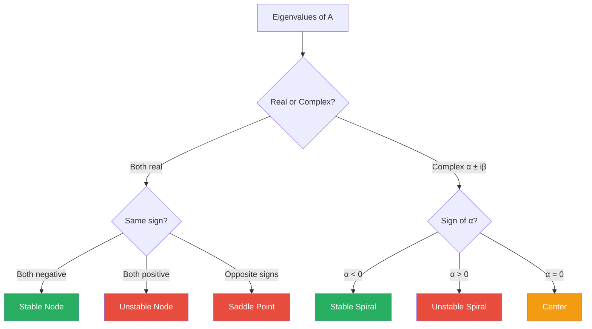
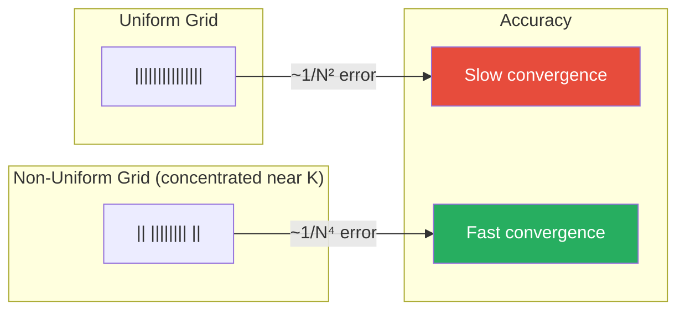
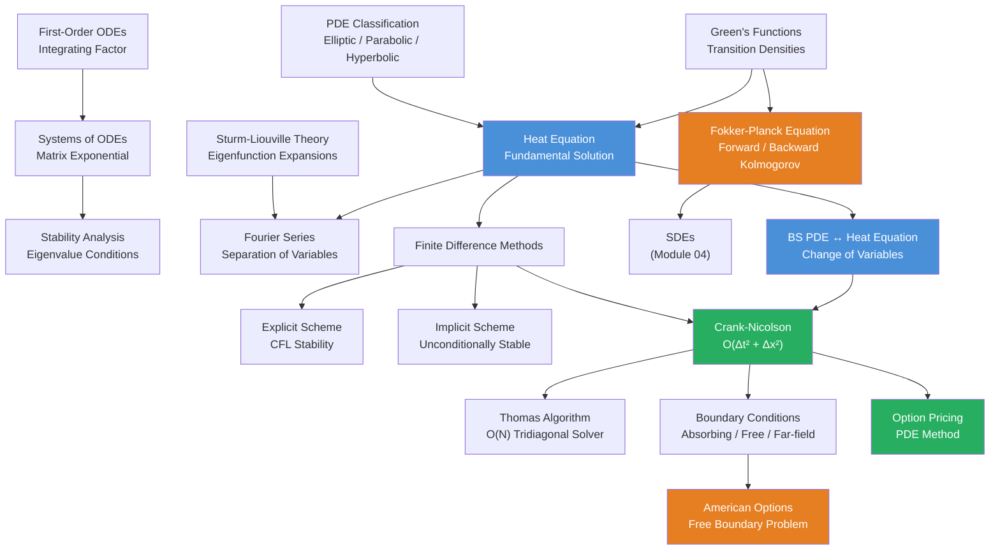

# Module 05: Ordinary & Partial Differential Equations

**Prerequisites:** Module 01 (Linear Algebra)
**Builds toward:** Modules 04 (Stochastic Calculus), 08 (Term Structure Models), 18 (Exotic Options), 19 (Numerical Methods), 20 (Risk Management)

---

## Table of Contents

1. [First-Order ODEs](#1-first-order-odes)
2. [Systems of ODEs](#2-systems-of-odes)
3. [Sturm-Liouville Theory](#3-sturm-liouville-theory)
4. [Classification of Second-Order PDEs](#4-classification-of-second-order-pdes)
5. [The Heat Equation](#5-the-heat-equation)
6. [Separation of Variables & Fourier Series](#6-separation-of-variables--fourier-series)
7. [Green's Functions](#7-greens-functions)
8. [The Fokker-Planck Equation](#8-the-fokker-planck-equation)
9. [Finite Difference Methods](#9-finite-difference-methods)
10. [Boundary Conditions in Finance](#10-boundary-conditions-in-finance)
11. [Implementation: Python](#11-implementation-python)
12. [Implementation: C++](#12-implementation-c)
13. [Exercises](#13-exercises)

---

## 1. First-Order ODEs

Ordinary differential equations are the deterministic backbone of quantitative finance. Before we encounter their stochastic generalizations (Module 04), we must master the classical theory. Every term structure model, every PDE pricing method, and every calibration routine ultimately reduces to solving differential equations.

### 1.1 Separable Equations

A first-order ODE is **separable** if it can be written as:

$$\frac{dy}{dx} = f(x)\,g(y)$$

The solution procedure factors the variables onto opposite sides of the equation:

$$\int \frac{dy}{g(y)} = \int f(x)\,dx + C$$

**Example (Geometric growth).** Consider the ODE $\frac{dS}{dt} = \mu S$, which models a stock price growing at a constant drift rate $\mu$. Separating:

$$\int \frac{dS}{S} = \int \mu\,dt \quad \Longrightarrow \quad \ln|S| = \mu t + C \quad \Longrightarrow \quad S(t) = S(0)\,e^{\mu t}$$

This is the deterministic limit of geometric Brownian motion. When we add volatility in Module 04, the SDE $dS = \mu S\,dt + \sigma S\,dW$ produces the familiar log-normal distribution.

### 1.2 Linear First-Order ODEs: The Integrating Factor Method

A **linear first-order ODE** has the standard form:

$$\frac{dy}{dx} + P(x)\,y = Q(x) \tag{1.1}$$

**Derivation of the integrating factor.** Multiply both sides by a function $\mu(x)$ (the integrating factor) chosen so that the left side becomes the derivative of a product:

$$\mu(x)\frac{dy}{dx} + \mu(x)P(x)\,y = \mu(x)Q(x)$$

We want the left side to equal $\frac{d}{dx}[\mu(x)\,y]$. Expanding via the product rule:

$$\frac{d}{dx}[\mu(x)\,y] = \mu(x)\frac{dy}{dx} + \mu'(x)\,y$$

Comparing terms, we require $\mu'(x) = \mu(x)\,P(x)$, which is itself a separable ODE:

$$\frac{d\mu}{\mu} = P(x)\,dx \quad \Longrightarrow \quad \mu(x) = \exp\!\left(\int P(x)\,dx\right)$$

With this integrating factor, equation (1.1) becomes:

$$\frac{d}{dx}\!\left[\mu(x)\,y\right] = \mu(x)\,Q(x)$$

Integrating both sides:

$$y(x) = \frac{1}{\mu(x)}\left[\int \mu(x)\,Q(x)\,dx + C\right] \tag{1.2}$$

### 1.3 Exact Equations and Integrating Factors

An ODE written as $M(x,y)\,dx + N(x,y)\,dy = 0$ is **exact** if there exists a potential function $\Phi(x,y)$ such that:

$$\frac{\partial \Phi}{\partial x} = M, \qquad \frac{\partial \Phi}{\partial y} = N$$

The solution is then $\Phi(x,y) = C$. The exactness condition follows from equality of mixed partials:

$$\frac{\partial M}{\partial y} = \frac{\partial N}{\partial x}$$

When the equation is not exact, one seeks an integrating factor $\mu$ (which may depend on $x$, $y$, or both) such that $\mu M\,dx + \mu N\,dy = 0$ is exact.

### 1.4 Financial Example: Continuous Compounding

The fundamental equation of continuous compounding with deposits is:

$$\frac{dA}{dt} = rA + D(t) \tag{1.3}$$

where $A(t)$ is the account balance, $r$ is the continuously compounded interest rate, and $D(t)$ is the rate of deposits. This is a linear first-order ODE with $P(t) = -r$ and $Q(t) = D(t)$.

The integrating factor is $\mu(t) = e^{-rt}$. Applying formula (1.2):

$$A(t) = e^{rt}\left[A(0) + \int_0^t e^{-rs}\,D(s)\,ds\right]$$

For constant deposits $D(t) = D$:

$$A(t) = A(0)\,e^{rt} + \frac{D}{r}\left(e^{rt} - 1\right)$$

The first term is the initial balance growing at rate $r$; the second is the future value of a continuous annuity. This formula underlies every fixed-income present value calculation.

---

## 2. Systems of ODEs

### 2.1 Matrix Formulation

A system of $n$ first-order linear ODEs with constant coefficients:

$$\frac{dx_1}{dt} = a_{11}x_1 + a_{12}x_2 + \cdots + a_{1n}x_n$$
$$\vdots$$
$$\frac{dx_n}{dt} = a_{n1}x_1 + a_{n2}x_2 + \cdots + a_{nn}x_n$$

is compactly written in matrix form as:

$$\frac{d\mathbf{x}}{dt} = A\mathbf{x}, \qquad \mathbf{x}(0) = \mathbf{x}_0 \tag{2.1}$$

where $A \in \mathbb{R}^{n \times n}$ and $\mathbf{x}(t) \in \mathbb{R}^n$.

### 2.2 The Matrix Exponential

The solution to (2.1) is:

$$\mathbf{x}(t) = e^{At}\,\mathbf{x}_0 \tag{2.2}$$

where the **matrix exponential** is defined by the convergent power series:

$$e^{At} = I + At + \frac{(At)^2}{2!} + \frac{(At)^3}{3!} + \cdots = \sum_{k=0}^{\infty} \frac{(At)^k}{k!}$$

**Verification.** Differentiating term by term: $\frac{d}{dt}e^{At} = A + A^2t + \frac{A^3t^2}{2!} + \cdots = A\,e^{At}$, so $\frac{d\mathbf{x}}{dt} = A\,e^{At}\mathbf{x}_0 = A\mathbf{x}(t)$. At $t=0$, $e^{A \cdot 0} = I$, confirming the initial condition.

### 2.3 Eigenvalue Method

When $A$ is diagonalizable with eigenvalues $\lambda_1, \ldots, \lambda_n$ and corresponding eigenvectors $\mathbf{v}_1, \ldots, \mathbf{v}_n$, write $A = PDP^{-1}$ where $D = \text{diag}(\lambda_1, \ldots, \lambda_n)$ and $P = [\mathbf{v}_1 | \cdots | \mathbf{v}_n]$. Then:

$$e^{At} = P\,e^{Dt}\,P^{-1} = P\,\text{diag}(e^{\lambda_1 t}, \ldots, e^{\lambda_n t})\,P^{-1}$$

The general solution decomposes into **normal modes**:

$$\mathbf{x}(t) = c_1 e^{\lambda_1 t}\mathbf{v}_1 + c_2 e^{\lambda_2 t}\mathbf{v}_2 + \cdots + c_n e^{\lambda_n t}\mathbf{v}_n$$

where $\mathbf{c} = P^{-1}\mathbf{x}_0$.

### 2.4 Phase Portraits and Stability

For $n = 2$, the qualitative behavior of $\dot{\mathbf{x}} = A\mathbf{x}$ is determined by the eigenvalues $\lambda_1, \lambda_2$:

| Eigenvalues | Type | Stability |
|---|---|---|
| $\lambda_1, \lambda_2 < 0$ (real, distinct) | Stable node | Asymptotically stable |
| $\lambda_1, \lambda_2 > 0$ (real, distinct) | Unstable node | Unstable |
| $\lambda_1 < 0 < \lambda_2$ (real, opposite sign) | Saddle point | Unstable |
| $\alpha \pm i\beta$, $\alpha < 0$ | Stable spiral | Asymptotically stable |
| $\alpha \pm i\beta$, $\alpha > 0$ | Unstable spiral | Unstable |
| $\pm i\beta$ (purely imaginary) | Center | Stable (Lyapunov), not asymptotically |
| $\lambda_1 = \lambda_2 < 0$ (repeated) | Degenerate/star node | Asymptotically stable |

**Stability criterion.** The equilibrium $\mathbf{x} = \mathbf{0}$ is asymptotically stable if and only if all eigenvalues of $A$ have strictly negative real parts: $\text{Re}(\lambda_i) < 0$ for all $i$.



### 2.5 Financial Example: Competing Strategies and Lotka-Volterra Dynamics

Consider two trading strategies with capital allocations $x_1(t)$ and $x_2(t)$. In isolation, each earns a return rate $r_i$, but each strategy erodes the other's alpha through crowding:

$$\frac{dx_1}{dt} = r_1 x_1 - \gamma_{12} x_1 x_2$$
$$\frac{dx_2}{dt} = r_2 x_2 - \gamma_{21} x_1 x_2$$

This is a **Lotka-Volterra competition model**. Near the coexistence equilibrium $\mathbf{x}^* = (x_1^*, x_2^*)$, linearization gives $\dot{\mathbf{u}} = J\,\mathbf{u}$ where $J$ is the Jacobian matrix. The eigenvalues of $J$ determine whether both strategies coexist (stable node/spiral) or one drives the other out (saddle). This framework underpins the study of strategy capacity and alpha decay.

For the linearized system, the Jacobian at the coexistence equilibrium $(x_1^*, x_2^*) = (r_2/\gamma_{21},\, r_1/\gamma_{12})$ is:

$$J = \begin{pmatrix} -\gamma_{12}x_1^* & -\gamma_{12}x_1^* \\ -\gamma_{21}x_2^* & -\gamma_{21}x_2^* \end{pmatrix}$$

Coexistence is stable when $\gamma_{12}\gamma_{21} < r_1 r_2 / (x_1^* x_2^*)$, meaning the cross-crowding effects are not too strong.

---

## 3. Sturm-Liouville Theory

### 3.1 Self-Adjoint Form

A **Sturm-Liouville problem** is a second-order eigenvalue problem of the form:

$$-\frac{d}{dx}\!\left[p(x)\frac{dy}{dx}\right] + q(x)\,y = \lambda\,w(x)\,y, \qquad a < x < b \tag{3.1}$$

with boundary conditions at $x = a$ and $x = b$ (e.g., $y(a) = y(b) = 0$), where $p(x) > 0$, $w(x) > 0$ (the weight function), and $q(x)$ are given continuous functions.

The differential operator $\mathcal{L}[y] = -\frac{d}{dx}[p\,y'] + q\,y$ is **self-adjoint** with respect to the inner product:

$$\langle f, g \rangle_w = \int_a^b f(x)\,g(x)\,w(x)\,dx$$

**Self-adjointness** means $\langle \mathcal{L}[f], g \rangle_w = \langle f, \mathcal{L}[g] \rangle_w$ for all $f, g$ satisfying the boundary conditions. This is verified by integration by parts: the boundary terms vanish due to the imposed boundary conditions.

### 3.2 Eigenvalue Properties

**Theorem (Sturm-Liouville).** Under the regularity conditions above:

1. The eigenvalues $\lambda_0 < \lambda_1 < \lambda_2 < \cdots$ are real, countably infinite, and $\lambda_n \to \infty$ as $n \to \infty$.
2. Each eigenvalue has a unique (up to scalar multiple) eigenfunction $\phi_n(x)$.
3. The eigenfunction $\phi_n$ has exactly $n$ zeros in the open interval $(a, b)$.

### 3.3 Orthogonality of Eigenfunctions

**Theorem.** Eigenfunctions corresponding to distinct eigenvalues are orthogonal with respect to the weighted inner product:

$$\langle \phi_m, \phi_n \rangle_w = \int_a^b \phi_m(x)\,\phi_n(x)\,w(x)\,dx = 0 \quad \text{for } m \neq n \tag{3.2}$$

*Proof.* Since $\mathcal{L}[\phi_m] = \lambda_m w\,\phi_m$ and $\mathcal{L}[\phi_n] = \lambda_n w\,\phi_n$:

$$\lambda_m \langle \phi_m, \phi_n \rangle_w = \langle \mathcal{L}[\phi_m], \phi_n \rangle_w = \langle \phi_m, \mathcal{L}[\phi_n] \rangle_w = \lambda_n \langle \phi_m, \phi_n \rangle_w$$

Therefore $(\lambda_m - \lambda_n)\langle \phi_m, \phi_n \rangle_w = 0$. Since $\lambda_m \neq \lambda_n$, we conclude $\langle \phi_m, \phi_n \rangle_w = 0$. $\square$

### 3.4 Eigenfunction Expansions

The normalized eigenfunctions $\{\hat{\phi}_n\}$ form a complete orthonormal basis for $L^2_w([a,b])$. Any square-integrable function $f$ can be expanded as:

$$f(x) = \sum_{n=0}^{\infty} c_n\,\phi_n(x), \qquad c_n = \frac{\langle f, \phi_n \rangle_w}{\langle \phi_n, \phi_n \rangle_w} = \frac{\int_a^b f(x)\,\phi_n(x)\,w(x)\,dx}{\int_a^b \phi_n^2(x)\,w(x)\,dx} \tag{3.3}$$

### 3.5 Connection to Fourier Series

The classical Fourier series is the special case $p(x) = 1$, $q(x) = 0$, $w(x) = 1$ on $[0, L]$:

$$-y'' = \lambda y, \qquad y(0) = y(L) = 0$$

The eigenvalues are $\lambda_n = (n\pi/L)^2$ with eigenfunctions $\phi_n(x) = \sin(n\pi x/L)$ for $n = 1, 2, 3, \ldots$. The orthogonality relation (3.2) reduces to the familiar:

$$\int_0^L \sin\!\left(\frac{m\pi x}{L}\right)\sin\!\left(\frac{n\pi x}{L}\right)dx = \frac{L}{2}\,\delta_{mn}$$

This connection is fundamental: the Fourier sine series used to solve the heat equation (Section 6) is an eigenfunction expansion in the Sturm-Liouville framework.

---

## 4. Classification of Second-Order PDEs

### 4.1 The General Second-Order Linear PDE

Consider the general second-order linear PDE in two variables:

$$a\,u_{xx} + 2b\,u_{xy} + c\,u_{yy} + d\,u_x + e\,u_y + f\,u = g \tag{4.1}$$

where $a, b, c, d, e, f, g$ may depend on $(x, y)$. The **discriminant** $\Delta = b^2 - ac$ determines the type:

| Discriminant | Classification | Canonical Example | Financial Relevance |
|---|---|---|---|
| $\Delta > 0$ | **Hyperbolic** | Wave equation: $u_{tt} = c^2 u_{xx}$ | Rarely encountered |
| $\Delta = 0$ | **Parabolic** | Heat equation: $u_t = \kappa u_{xx}$ | Black-Scholes PDE |
| $\Delta < 0$ | **Elliptic** | Laplace equation: $u_{xx} + u_{yy} = 0$ | Stationary problems |

### 4.2 The Black-Scholes PDE Is Parabolic

The Black-Scholes PDE for a European option $V(S, t)$ is:

$$\frac{\partial V}{\partial t} + \frac{1}{2}\sigma^2 S^2 \frac{\partial^2 V}{\partial S^2} + rS\frac{\partial V}{\partial S} - rV = 0 \tag{4.2}$$

Setting $x = S$ and $y = t$, the second-order terms are $a = \frac{1}{2}\sigma^2 S^2$, $b = 0$, $c = 0$. The discriminant is $\Delta = 0^2 - \frac{1}{2}\sigma^2 S^2 \cdot 0 = 0$, confirming the equation is **parabolic**. In Section 5, we show that a change of variables transforms (4.2) into the standard heat equation.

### 4.3 Physical Intuition

The classification governs the fundamental behavior of solutions:

- **Hyperbolic** (wave equation): information travels at finite speed along characteristics. Solutions preserve initial discontinuities.
- **Parabolic** (heat/diffusion equation): information diffuses instantaneously. Solutions become smooth for $t > 0$ regardless of initial data. This is why option prices are smooth functions of spot and time.
- **Elliptic** (Laplace equation): solutions are determined by boundary data. Solutions are infinitely smooth in the interior (harmonic functions).

---

## 5. The Heat Equation

### 5.1 Derivation from Conservation Law

Consider a quantity $u(x, t)$ (temperature, probability density, or option value) with flux $J = -\kappa\,u_x$ (Fick's law / Fourier's law). Conservation requires:

$$\frac{\partial u}{\partial t} = -\frac{\partial J}{\partial x} = \kappa\frac{\partial^2 u}{\partial x^2} \tag{5.1}$$

This is the **heat equation** (or diffusion equation) on $\mathbb{R} \times (0, \infty)$ with diffusion coefficient $\kappa > 0$.

### 5.2 The Fundamental Solution (Heat Kernel)

For the initial condition $u(x, 0) = \delta(x)$ (a unit point source at the origin), the solution is the **heat kernel** (or Gaussian kernel):

$$G(x, t) = \frac{1}{\sqrt{4\pi\kappa t}}\,\exp\!\left(-\frac{x^2}{4\kappa t}\right), \qquad t > 0 \tag{5.2}$$

**Verification.** Compute the partial derivatives:

$$G_t = G\left(\frac{x^2}{4\kappa t^2} - \frac{1}{2t}\right), \qquad G_{xx} = G\left(\frac{x^2}{4\kappa^2 t^2} - \frac{1}{2\kappa t}\right)$$

so $G_t = \kappa\,G_{xx}$. As $t \to 0^+$, $G(x,t) \to \delta(x)$ in the distributional sense: the Gaussian sharpens and its integral remains unity.

**Properties.** For all $t > 0$: (i) $G(x,t) > 0$; (ii) $\int_{-\infty}^{\infty} G(x,t)\,dx = 1$; (iii) $G$ is the probability density of $\mathcal{N}(0, 2\kappa t)$.

### 5.3 Solution via Convolution

For general initial data $u(x, 0) = f(x)$, the solution is obtained by superposition (convolution with the heat kernel):

$$u(x, t) = \int_{-\infty}^{\infty} G(x - \xi, t)\,f(\xi)\,d\xi = \frac{1}{\sqrt{4\pi\kappa t}} \int_{-\infty}^{\infty} \exp\!\left(-\frac{(x - \xi)^2}{4\kappa t}\right)f(\xi)\,d\xi \tag{5.3}$$

This representation has a profound probabilistic interpretation: $u(x, t) = \mathbb{E}[f(x + \sqrt{2\kappa}\,W_t)]$ where $W_t$ is a standard Brownian motion. This is the **Feynman-Kac connection** (Module 04).

### 5.4 Connection to the Black-Scholes PDE: Full Transformation

We now derive the complete change of variables that transforms the Black-Scholes PDE (4.2) into the heat equation.

**Step 1: Change to log-moneyness and time-to-expiry.** Let $\tau = T - t$ (time to expiry) and $x = \ln(S/K)$ (log-moneyness). Define $V(S, t) = K\,v(x, \tau)$. Computing derivatives via the chain rule:

$$\frac{\partial V}{\partial t} = -K\frac{\partial v}{\partial \tau}, \qquad \frac{\partial V}{\partial S} = \frac{K}{S}\frac{\partial v}{\partial x}, \qquad \frac{\partial^2 V}{\partial S^2} = \frac{K}{S^2}\left(\frac{\partial^2 v}{\partial x^2} - \frac{\partial v}{\partial x}\right)$$

Substituting into (4.2) and dividing by $K$:

$$-\frac{\partial v}{\partial \tau} + \frac{\sigma^2}{2}\left(\frac{\partial^2 v}{\partial x^2} - \frac{\partial v}{\partial x}\right) + r\frac{\partial v}{\partial x} - rv = 0$$

Rearranging:

$$\frac{\partial v}{\partial \tau} = \frac{\sigma^2}{2}\frac{\partial^2 v}{\partial x^2} + \left(r - \frac{\sigma^2}{2}\right)\frac{\partial v}{\partial x} - rv \tag{5.4}$$

**Step 2: Remove the first-order and zeroth-order terms.** Set $v(x, \tau) = e^{\alpha x + \beta \tau}\,u(x, \tau)$ for constants $\alpha, \beta$ to be determined. Computing:

$$\frac{\partial v}{\partial \tau} = e^{\alpha x + \beta \tau}\!\left(\beta u + \frac{\partial u}{\partial \tau}\right)$$
$$\frac{\partial v}{\partial x} = e^{\alpha x + \beta \tau}\!\left(\alpha u + \frac{\partial u}{\partial x}\right)$$
$$\frac{\partial^2 v}{\partial x^2} = e^{\alpha x + \beta \tau}\!\left(\alpha^2 u + 2\alpha\frac{\partial u}{\partial x} + \frac{\partial^2 u}{\partial x^2}\right)$$

Substituting into (5.4) and dividing by $e^{\alpha x + \beta \tau}$:

$$\beta u + u_\tau = \frac{\sigma^2}{2}(\alpha^2 u + 2\alpha u_x + u_{xx}) + \left(r - \frac{\sigma^2}{2}\right)(\alpha u + u_x) - ru$$

Collecting the coefficient of $u_x$: $\sigma^2 \alpha + r - \frac{\sigma^2}{2}$. Setting this to zero:

$$\alpha = \frac{1}{2} - \frac{r}{\sigma^2} \tag{5.5}$$

Collecting the coefficient of $u$ (the zeroth-order term): $\frac{\sigma^2}{2}\alpha^2 + (r - \frac{\sigma^2}{2})\alpha - r - \beta$. Setting this to zero:

$$\beta = \frac{\sigma^2}{2}\alpha^2 + \left(r - \frac{\sigma^2}{2}\right)\alpha - r = -\frac{1}{2}\left(\frac{r}{\sigma^2} + \frac{1}{2}\right)^2\sigma^2 \tag{5.6}$$

After simplification (let $k = r / (\sigma^2/2)$):

$$\alpha = \frac{1}{2}(1 - k), \qquad \beta = -\frac{\sigma^2}{8}(k + 1)^2$$

The transformed equation is the pure heat equation:

$$\frac{\partial u}{\partial \tau} = \frac{\sigma^2}{2}\frac{\partial^2 u}{\partial x^2} \tag{5.7}$$

with diffusion coefficient $\kappa = \sigma^2/2$. The payoff condition $V(S, T) = \max(S - K, 0)$ (for a call) transforms to the initial condition for $u$ at $\tau = 0$.

### 5.5 The Maximum Principle

**Theorem (Weak Maximum Principle).** Let $u$ satisfy $u_t = \kappa u_{xx}$ in the rectangle $R = [a, b] \times [0, T]$. Then $u$ attains its maximum on the **parabolic boundary** $\Gamma = \{t = 0\} \cup \{x = a\} \cup \{x = b\}$:

$$\max_{\bar{R}} u = \max_{\Gamma} u$$

**Financial implication.** The option price at any interior point $(S, t)$ is bounded above by the maximum of the boundary and terminal values. This ensures arbitrage-free pricing: the option price cannot exceed its boundary payoffs.

---

## 6. Separation of Variables & Fourier Series

### 6.1 Method of Separation of Variables

Consider the heat equation on a bounded interval with homogeneous Dirichlet boundary conditions:

$$u_t = \kappa\,u_{xx}, \quad 0 < x < L, \; t > 0$$
$$u(0, t) = u(L, t) = 0, \qquad u(x, 0) = f(x) \tag{6.1}$$

**Ansatz.** Seek solutions of the form $u(x, t) = X(x)\,T(t)$. Substituting:

$$X(x)\,T'(t) = \kappa\,X''(x)\,T(t) \quad \Longrightarrow \quad \frac{T'(t)}{\kappa\,T(t)} = \frac{X''(x)}{X(x)} = -\lambda$$

where $\lambda$ is a **separation constant**. Since the left side depends only on $t$ and the right only on $x$, both must equal a constant $-\lambda$.

**The eigenvalue problem:**

$$X''(x) + \lambda X(x) = 0, \qquad X(0) = X(L) = 0 \tag{6.2}$$

This is the Sturm-Liouville problem of Section 3.5. The eigenvalues and eigenfunctions are:

$$\lambda_n = \left(\frac{n\pi}{L}\right)^2, \qquad X_n(x) = \sin\!\left(\frac{n\pi x}{L}\right), \qquad n = 1, 2, 3, \ldots$$

**The temporal ODE:** $T'(t) = -\kappa\lambda_n T(t)$ gives $T_n(t) = e^{-\kappa\lambda_n t}$.

### 6.2 Fourier Series Solution

By the superposition principle (linearity), the general solution is:

$$u(x, t) = \sum_{n=1}^{\infty} b_n\,\sin\!\left(\frac{n\pi x}{L}\right)e^{-\kappa(n\pi/L)^2 t} \tag{6.3}$$

where the Fourier coefficients are determined by the initial condition:

$$b_n = \frac{2}{L}\int_0^L f(x)\,\sin\!\left(\frac{n\pi x}{L}\right)dx$$

**Convergence.** The exponential decay factors $e^{-\kappa(n\pi/L)^2 t}$ ensure rapid convergence for $t > 0$. High-frequency modes ($n$ large) decay fastest -- this is the **smoothing property** of the heat equation. At $t = 0$, convergence depends on the regularity of $f$:
- If $f$ is piecewise smooth, the Fourier series converges pointwise at continuity points and to the midpoint at jumps (Dirichlet's theorem).
- If $f \in C^k$ with $f^{(j)}(0) = f^{(j)}(L) = 0$ for $j < k$, the coefficients decay as $|b_n| = O(n^{-k-1})$.

### 6.3 Application to Barrier Option Pricing: The Image Method

Consider a **down-and-out call option** with barrier $B < K < S_0$. In the log-price coordinate $x = \ln S$, the absorbing barrier at $S = B$ becomes a Dirichlet condition $V(\ln B, t) = 0$.

The **method of images** (borrowed from electrostatics) constructs the solution by reflecting the payoff function across the barrier. If $G(x, \xi, t)$ is the free-space heat kernel, the Green's function for the half-line $x > \ln B$ with an absorbing barrier is:

$$G_B(x, \xi, t) = G(x - \xi, t) - G(x + \xi - 2\ln B, t)$$

The subtracted "image" term ensures $G_B(\ln B, \xi, t) = 0$. After transforming back to Black-Scholes variables, this produces the closed-form pricing formula for down-and-out calls, which involves the standard Black-Scholes price minus a correction term proportional to $(S/B)^{-2r/\sigma^2 + 1}$.

---

## 7. Green's Functions

### 7.1 Definition

Given a linear differential operator $\mathcal{L}$, the **Green's function** $G(x, \xi)$ is the solution to:

$$\mathcal{L}[G](x) = \delta(x - \xi) \tag{7.1}$$

subject to homogeneous boundary conditions. The Green's function represents the response at point $x$ due to a unit impulse at point $\xi$.

### 7.2 Construction for 1D Boundary Value Problems

Consider the boundary value problem $\mathcal{L}[y] = -y'' = f(x)$ on $[0, L]$ with $y(0) = y(L) = 0$.

**Construction.** The Green's function is:

$$G(x, \xi) = \begin{cases} \dfrac{\xi(L - x)}{L}, & 0 \leq \xi \leq x \\[8pt] \dfrac{x(L - \xi)}{L}, & x \leq \xi \leq L \end{cases} \tag{7.2}$$

**Derivation.** For $x \neq \xi$, $G$ satisfies $-G'' = 0$, so $G$ is piecewise linear. The boundary conditions require $G(0, \xi) = G(L, \xi) = 0$. At $x = \xi$, $G$ is continuous but has a jump in its derivative:

$$G'(\xi^+, \xi) - G'(\xi^-, \xi) = -1$$

(from integrating $-G'' = \delta(x - \xi)$ across $x = \xi$). These four conditions uniquely determine the four coefficients in the piecewise linear function, yielding (7.2).

The solution to $-y'' = f(x)$ is then:

$$y(x) = \int_0^L G(x, \xi)\,f(\xi)\,d\xi \tag{7.3}$$

### 7.3 Application to Inhomogeneous PDEs

For the inhomogeneous heat equation $u_t - \kappa u_{xx} = h(x, t)$, the solution is:

$$u(x, t) = \int_{-\infty}^{\infty} G(x - \xi, t)\,f(\xi)\,d\xi + \int_0^t \int_{-\infty}^{\infty} G(x - \xi, t - s)\,h(\xi, s)\,d\xi\,ds$$

The first term is the contribution from the initial condition $u(x,0) = f(x)$; the second is the **Duhamel integral**, accumulating the effects of the source $h$ over time.

### 7.4 Green's Function as Transition Density

In the probabilistic framework, the Green's function for the parabolic PDE:

$$\frac{\partial p}{\partial t} = \mathcal{A}^*[p] \tag{7.4}$$

(the forward Kolmogorov / Fokker-Planck equation) is precisely the **transition density** $p(x, t \,|\, \xi, s)$ -- the probability density for the diffusion process to be at $x$ at time $t$, given it was at $\xi$ at time $s$.

For the standard heat equation ($\kappa = 1/2$), this transition density is:

$$p(x, t \,|\, \xi, s) = \frac{1}{\sqrt{2\pi(t - s)}}\exp\!\left(-\frac{(x - \xi)^2}{2(t - s)}\right)$$

which is the transition density of standard Brownian motion. This establishes a deep duality: **solving PDEs is equivalent to computing expectations of stochastic processes** (the Feynman-Kac theorem, Module 04).

For the Black-Scholes PDE, the Green's function is the Arrow-Debreu price (state price density), and its integral against the payoff function yields the option price:

$$V(S, t) = e^{-r(T-t)} \int_0^{\infty} G(S, t;\, S', T)\,\text{Payoff}(S')\,dS'$$

---

## 8. The Fokker-Planck Equation

### 8.1 Derivation from the Chapman-Kolmogorov Equation

Let $p(x, t \,|\, x_0, t_0)$ be the transition density of a Markov process. The **Chapman-Kolmogorov equation** (the semigroup property) states:

$$p(x, t \,|\, x_0, t_0) = \int_{-\infty}^{\infty} p(x, t \,|\, y, s)\,p(y, s \,|\, x_0, t_0)\,dy \tag{8.1}$$

for any intermediate time $t_0 < s < t$.

For a diffusion process with drift $\mu(x, t)$ and diffusion coefficient $\sigma^2(x, t)$, corresponding to the SDE $dX_t = \mu(X_t, t)\,dt + \sigma(X_t, t)\,dW_t$, a Taylor expansion of (8.1) in the limit $s \to t$ yields the **Fokker-Planck equation** (forward Kolmogorov equation):

$$\frac{\partial p}{\partial t} = -\frac{\partial}{\partial x}\!\left[\mu(x, t)\,p\right] + \frac{1}{2}\frac{\partial^2}{\partial x^2}\!\left[\sigma^2(x, t)\,p\right] \tag{8.2}$$

The derivation proceeds by expanding $p(x, t + \Delta t \,|\, y, t)$ around $y$ to second order, using the moment conditions $\mathbb{E}[\Delta X] = \mu\,\Delta t$ and $\mathbb{E}[(\Delta X)^2] = \sigma^2\,\Delta t$, integrating by parts, and taking $\Delta t \to 0$.

### 8.2 Forward vs. Backward Kolmogorov Equations

The **backward Kolmogorov equation** (which holds in the initial variables $(x_0, t_0)$) is:

$$-\frac{\partial p}{\partial t_0} = \mu(x_0, t_0)\frac{\partial p}{\partial x_0} + \frac{1}{2}\sigma^2(x_0, t_0)\frac{\partial^2 p}{\partial x_0^2} \tag{8.3}$$

| Property | Forward (Fokker-Planck) | Backward (Kolmogorov) |
|---|---|---|
| Variables | Terminal $(x, t)$ | Initial $(x_0, t_0)$ |
| Operator acts on | $p$ as function of $x$ | $p$ as function of $x_0$ |
| In divergence form? | Yes | No |
| Used for | Density evolution | Pricing (Black-Scholes is backward) |

The Black-Scholes PDE is the **backward Kolmogorov equation** for the risk-neutral diffusion of $S$, with the addition of a discounting (killing) term $-rV$.

### 8.3 Connection to SDEs

Given the SDE $dX_t = \mu(X_t)\,dt + \sigma(X_t)\,dW_t$, the transition density $p$ simultaneously satisfies both the forward equation (8.2) in the terminal variables and the backward equation (8.3) in the initial variables. This duality is the PDE representation of the Markov property.

### 8.4 Stationary Solutions for the Ornstein-Uhlenbeck Process

The OU process $dX_t = -\theta X_t\,dt + \sigma\,dW_t$ (with $\theta > 0$) has drift $\mu(x) = -\theta x$ and constant diffusion $\sigma$. The stationary (time-independent) Fokker-Planck equation is:

$$0 = -\frac{d}{dx}[-\theta x\,p] + \frac{\sigma^2}{2}\frac{d^2 p}{dx^2} = \frac{d}{dx}\!\left[\theta x\,p + \frac{\sigma^2}{2}\frac{dp}{dx}\right]$$

The bracketed quantity must be constant; for a normalizable density, it must be zero:

$$\theta x\,p + \frac{\sigma^2}{2}\frac{dp}{dx} = 0 \quad \Longrightarrow \quad \frac{dp}{p} = -\frac{2\theta x}{\sigma^2}\,dx$$

Integrating:

$$p_{\text{stat}}(x) = \sqrt{\frac{\theta}{\pi\sigma^2}}\,\exp\!\left(-\frac{\theta x^2}{\sigma^2}\right) = \mathcal{N}\!\left(0,\, \frac{\sigma^2}{2\theta}\right) \tag{8.4}$$

This is the invariant distribution of the OU process. In finance, this result underpins mean-reverting models: the Vasicek short rate model has a stationary Gaussian distribution with mean equal to the long-run level and variance $\sigma^2/(2\theta)$, where $\theta$ is the speed of mean reversion.

---

## 9. Finite Difference Methods

Finite difference methods discretize PDEs on a grid and approximate derivatives by differences. They are the workhorse of numerical option pricing.

### 9.1 Grid Setup

Discretize the spatial domain $[x_{\min}, x_{\max}]$ into $N$ intervals of width $\Delta x = (x_{\max} - x_{\min})/N$, and time $[0, T]$ into $M$ steps of size $\Delta t = T/M$. Let $u_j^n \approx u(x_j, t_n)$ where $x_j = x_{\min} + j\Delta x$ and $t_n = n\Delta t$.

The standard difference approximations (derived from Taylor expansion) are:

$$u_x \approx \frac{u_{j+1}^n - u_{j-1}^n}{2\Delta x} \quad \text{(central, } O(\Delta x^2)\text{)}, \qquad u_{xx} \approx \frac{u_{j+1}^n - 2u_j^n + u_{j-1}^n}{\Delta x^2} \quad \text{(central, } O(\Delta x^2)\text{)}$$

### 9.2 Explicit Scheme (Forward Time, Centered Space -- FTCS)

Replace $u_t$ by a forward difference at time level $n$:

$$\frac{u_j^{n+1} - u_j^n}{\Delta t} = \kappa\frac{u_{j+1}^n - 2u_j^n + u_{j-1}^n}{\Delta x^2}$$

Solving for $u_j^{n+1}$:

$$u_j^{n+1} = \alpha\,u_{j-1}^n + (1 - 2\alpha)\,u_j^n + \alpha\,u_{j+1}^n \tag{9.1}$$

where $\alpha = \kappa\Delta t / \Delta x^2$ is the **mesh ratio** (or Courant number for parabolic equations).

**Stability condition (CFL).** The explicit scheme is stable if and only if:

$$\alpha = \frac{\kappa\Delta t}{\Delta x^2} \leq \frac{1}{2} \tag{9.2}$$

Equivalently, $\Delta t \leq \Delta x^2 / (2\kappa)$. This is a severe restriction: halving $\Delta x$ requires quartering $\Delta t$.

### 9.3 Von Neumann Stability Analysis: Full Derivation

The Von Neumann method analyzes stability by examining how individual Fourier modes evolve.

**Step 1.** Write the error at grid point $(j, n)$ as a Fourier mode: $\varepsilon_j^n = g^n e^{ik j\Delta x}$, where $g$ is the **amplification factor** and $k$ is the wave number.

**Step 2.** Substitute into (9.1):

$$g^{n+1}e^{ikj\Delta x} = \alpha\,g^n e^{ik(j-1)\Delta x} + (1 - 2\alpha)\,g^n e^{ikj\Delta x} + \alpha\,g^n e^{ik(j+1)\Delta x}$$

**Step 3.** Divide by $g^n e^{ikj\Delta x}$:

$$g = \alpha e^{-ik\Delta x} + (1 - 2\alpha) + \alpha e^{ik\Delta x}$$

**Step 4.** Use $e^{i\theta} + e^{-i\theta} = 2\cos\theta$:

$$g = 1 - 2\alpha + 2\alpha\cos(k\Delta x) = 1 - 2\alpha(1 - \cos(k\Delta x))$$

**Step 5.** Using the identity $1 - \cos\theta = 2\sin^2(\theta/2)$:

$$g = 1 - 4\alpha\sin^2\!\left(\frac{k\Delta x}{2}\right) \tag{9.3}$$

**Step 6.** Stability requires $|g| \leq 1$ for all wave numbers $k$. The worst case is $\sin^2(k\Delta x/2) = 1$, giving $g = 1 - 4\alpha$. The condition $|1 - 4\alpha| \leq 1$ yields $0 \leq \alpha \leq 1/2$, confirming (9.2). $\square$

### 9.4 Implicit Scheme (Backward Time, Centered Space -- BTCS)

Replace $u_t$ by a backward difference at time level $n+1$:

$$\frac{u_j^{n+1} - u_j^n}{\Delta t} = \kappa\frac{u_{j+1}^{n+1} - 2u_j^{n+1} + u_{j-1}^{n+1}}{\Delta x^2}$$

Rearranging:

$$-\alpha\,u_{j-1}^{n+1} + (1 + 2\alpha)\,u_j^{n+1} - \alpha\,u_{j+1}^{n+1} = u_j^n \tag{9.4}$$

This is a **tridiagonal linear system** at each time step. The implicit scheme is **unconditionally stable** ($|g| \leq 1$ for all $\alpha > 0$ and all $k$). The amplification factor is:

$$g = \frac{1}{1 + 4\alpha\sin^2(k\Delta x/2)} \leq 1$$

### 9.5 Crank-Nicolson Scheme

The Crank-Nicolson scheme averages the explicit and implicit discretizations (trapezoidal rule in time), achieving **second-order accuracy in both space and time**:

$$\frac{u_j^{n+1} - u_j^n}{\Delta t} = \frac{\kappa}{2}\left[\frac{u_{j+1}^{n+1} - 2u_j^{n+1} + u_{j-1}^{n+1}}{\Delta x^2} + \frac{u_{j+1}^n - 2u_j^n + u_{j-1}^n}{\Delta x^2}\right] \tag{9.5}$$

Rearranging into matrix form: $A\mathbf{u}^{n+1} = B\mathbf{u}^n$, where:

$$A = \begin{pmatrix} 1+\alpha & -\alpha/2 & & \\ -\alpha/2 & 1+\alpha & -\alpha/2 & \\ & \ddots & \ddots & \ddots \\ & & -\alpha/2 & 1+\alpha \end{pmatrix}, \qquad B = \begin{pmatrix} 1-\alpha & \alpha/2 & & \\ \alpha/2 & 1-\alpha & \alpha/2 & \\ & \ddots & \ddots & \ddots \\ & & \alpha/2 & 1-\alpha \end{pmatrix}$$

The amplification factor is:

$$g = \frac{1 - 2\alpha\sin^2(k\Delta x/2)}{1 + 2\alpha\sin^2(k\Delta x/2)}$$

Since $|g| \leq 1$ for all $\alpha > 0$, Crank-Nicolson is **unconditionally stable**. Its truncation error is $O(\Delta t^2 + \Delta x^2)$, compared to $O(\Delta t + \Delta x^2)$ for both explicit and implicit schemes.

| Scheme | Accuracy | Stability | System per step |
|---|---|---|---|
| Explicit (FTCS) | $O(\Delta t + \Delta x^2)$ | Conditional: $\alpha \leq 1/2$ | None (explicit formula) |
| Implicit (BTCS) | $O(\Delta t + \Delta x^2)$ | Unconditional | Tridiagonal |
| Crank-Nicolson | $O(\Delta t^2 + \Delta x^2)$ | Unconditional | Tridiagonal |

### 9.6 Thomas Algorithm for Tridiagonal Systems

Both the implicit and Crank-Nicolson schemes require solving a tridiagonal system $A\mathbf{u} = \mathbf{d}$ at each time step, where:

$$A = \begin{pmatrix} b_1 & c_1 & & \\ a_2 & b_2 & c_2 & \\ & \ddots & \ddots & \ddots \\ & & a_N & b_N \end{pmatrix}$$

The **Thomas algorithm** (a specialized form of Gaussian elimination) solves this in $O(N)$ operations:

**Forward sweep** (eliminate sub-diagonal):
$$w_i = a_i / b_{i-1}', \qquad b_i' = b_i - w_i c_{i-1}, \qquad d_i' = d_i - w_i d_{i-1}', \quad i = 2, \ldots, N$$

**Back substitution:**
$$u_N = d_N' / b_N', \qquad u_i = (d_i' - c_i u_{i+1}) / b_i', \quad i = N-1, \ldots, 1$$

### 9.7 Application: Pricing European Options via the BS PDE

After the transformation of Section 5.4, pricing a European option reduces to solving the heat equation. On the transformed grid:

1. Set up initial condition from the payoff (call: $\max(e^x - 1, 0)$ in transformed coordinates).
2. March backward in time (forward in $\tau$) using Crank-Nicolson.
3. Apply boundary conditions (see Section 10).
4. At $\tau = T - t$, inverse-transform to recover $V(S, t)$.

### 9.8 Grid Design

**Uniform grids** are simple but wasteful: the option value has the steepest gradients near the strike. **Non-uniform grids** concentrate points near $S = K$. A common approach uses a coordinate transformation:

$$\xi(S) = \sinh^{-1}\!\left(\frac{S - K}{d}\right)$$

where $d$ controls the concentration. Grid points equally spaced in $\xi$ cluster near $S = K$, dramatically improving accuracy for a given grid size.



---

## 10. Boundary Conditions in Finance

### 10.1 Absorbing Barriers (Knock-Out Options)

A **knock-out barrier option** becomes worthless when the underlying reaches the barrier $B$. This corresponds to a **Dirichlet boundary condition**:

$$V(B, t) = 0 \qquad \text{(down-and-out at barrier } B\text{)}$$

In the PDE discretization, the grid must include the barrier as a grid line. At each time step, $u_j = 0$ for the barrier node.

### 10.2 Reflecting Barriers

A **reflecting barrier** prevents the process from crossing a boundary, corresponding to a **Neumann boundary condition**:

$$\frac{\partial V}{\partial S}\bigg|_{S=B} = 0 \qquad \text{(zero flux at barrier)}$$

This arises in models where prices are bounded below (e.g., interest rate models with a zero lower bound). In the finite difference discretization, a one-sided difference or ghost-node technique implements this condition.

### 10.3 Free Boundaries: American Options

An **American option** can be exercised at any time $t \leq T$. The optimal exercise boundary $S^*(t)$ divides the $(S, t)$ plane into a **continuation region** (where $V > \text{payoff}$) and an **exercise region** (where $V = \text{payoff}$). The PDE holds only in the continuation region, with the free boundary conditions:

$$V(S^*(t), t) = \text{payoff}(S^*(t)) \qquad \text{(value matching)}$$
$$\frac{\partial V}{\partial S}(S^*(t), t) = \text{payoff}'(S^*(t)) \qquad \text{(smooth pasting)}$$

The free boundary $S^*(t)$ is not known a priori -- it must be determined as part of the solution. This is equivalent to a **linear complementarity problem**:

$$\mathcal{L}[V] \leq 0, \quad V \geq \text{payoff}, \quad \mathcal{L}[V] \cdot (V - \text{payoff}) = 0$$

which can be solved numerically using projected SOR or penalty methods.

### 10.4 Far-Field Boundary Conditions

The Black-Scholes PDE is posed on $S \in (0, \infty)$, but numerical grids are finite. At the far boundary $S_{\max} \gg K$:

- **European call:** $V(S_{\max}, t) \approx S_{\max} - K e^{-r(T-t)}$ (deep ITM linear asymptote)
- **European put:** $V(S_{\max}, t) = 0$ (deep OTM)
- **Near $S = 0$:** $V(0, t) = 0$ for a call; $V(0, t) = K e^{-r(T-t)}$ for a put

A good rule of thumb is $S_{\max} \geq 4K$ to $6K$, though the exact choice depends on the required accuracy. Alternatively, one can use asymptotic boundary conditions derived from the large-$S$ behavior of the PDE solution.

---

## 11. Implementation: Python

A production-grade Crank-Nicolson solver for the Black-Scholes PDE, pricing a European call option and comparing with the analytical Black-Scholes formula.

```python
"""
Module 05 -- Crank-Nicolson solver for the Black-Scholes PDE.
Prices European call/put options and validates against the analytical formula.
"""
import numpy as np
from scipy.stats import norm
from scipy.linalg import solve_banded
import time


def black_scholes_analytical(S: float, K: float, T: float, r: float,
                              sigma: float, option_type: str = "call") -> float:
    """Analytical Black-Scholes price for European options."""
    d1 = (np.log(S / K) + (r + 0.5 * sigma**2) * T) / (sigma * np.sqrt(T))
    d2 = d1 - sigma * np.sqrt(T)
    if option_type == "call":
        return S * norm.cdf(d1) - K * np.exp(-r * T) * norm.cdf(d2)
    else:
        return K * np.exp(-r * T) * norm.cdf(-d2) - S * norm.cdf(-d1)


def thomas_algorithm(a: np.ndarray, b: np.ndarray, c: np.ndarray,
                     d: np.ndarray) -> np.ndarray:
    """
    Solve tridiagonal system Ax = d using the Thomas algorithm.
    
    Parameters
    ----------
    a : sub-diagonal (length N-1), a[0] unused
    b : main diagonal (length N)
    c : super-diagonal (length N-1), c[-1] unused
    d : right-hand side (length N)
    
    Returns
    -------
    x : solution vector (length N)
    """
    N = len(b)
    # Work on copies to avoid mutating inputs
    b_prime = np.copy(b).astype(np.float64)
    d_prime = np.copy(d).astype(np.float64)
    x = np.empty(N, dtype=np.float64)

    # Forward sweep
    for i in range(1, N):
        w = a[i - 1] / b_prime[i - 1]
        b_prime[i] -= w * c[i - 1]
        d_prime[i] -= w * d_prime[i - 1]

    # Back substitution
    x[-1] = d_prime[-1] / b_prime[-1]
    for i in range(N - 2, -1, -1):
        x[i] = (d_prime[i] - c[i] * x[i + 1]) / b_prime[i]

    return x


def crank_nicolson_bs(S0: float, K: float, T: float, r: float, sigma: float,
                       N_S: int = 200, N_t: int = 200,
                       S_max_mult: float = 5.0,
                       option_type: str = "call") -> tuple:
    """
    Crank-Nicolson finite difference solver for the Black-Scholes PDE.
    
    Parameters
    ----------
    S0     : Current stock price
    K      : Strike price
    T      : Time to expiry (years)
    r      : Risk-free rate
    sigma  : Volatility
    N_S    : Number of spatial grid points
    N_t    : Number of time steps
    S_max_mult : S_max = S_max_mult * K
    option_type : "call" or "put"
    
    Returns
    -------
    S_grid : Asset price grid (length N_S + 1)
    V      : Option values at t = 0 on S_grid
    """
    S_max = S_max_mult * K
    dS = S_max / N_S
    dt = T / N_t

    # Spatial grid (uniform in S)
    S_grid = np.linspace(0, S_max, N_S + 1)

    # Terminal condition (payoff at T)
    if option_type == "call":
        V = np.maximum(S_grid - K, 0.0)
    else:
        V = np.maximum(K - S_grid, 0.0)

    # Interior indices: j = 1, ..., N_S - 1
    j = np.arange(1, N_S)
    Sj = S_grid[j]

    # Coefficients for the Black-Scholes PDE discretization
    # After discretizing: sigma^2 S^2 V_SS + r S V_S - r V = V_t (backward in time)
    alpha_j = 0.25 * dt * (sigma**2 * j**2 - r * j)
    beta_j  = -0.5 * dt * (sigma**2 * j**2 + r)
    gamma_j = 0.25 * dt * (sigma**2 * j**2 + r * j)

    # Tridiagonal matrices: A * V^{n} = B * V^{n+1} (marching backward from T)
    # A (implicit side): main = 1 - beta, sub = -alpha, super = -gamma
    # B (explicit side):  main = 1 + beta, sub = alpha, super = gamma
    N_int = N_S - 1  # number of interior points

    # Sub, main, super diagonals for A (left-hand side)
    A_sub   = -alpha_j[1:]          # length N_int - 1
    A_main  = 1.0 - beta_j          # length N_int
    A_super = -gamma_j[:-1]         # length N_int - 1

    # Sub, main, super diagonals for B (right-hand side)
    B_sub   = alpha_j[1:]
    B_main  = 1.0 + beta_j
    B_super = gamma_j[:-1]

    # Time-stepping: march backward from T to 0
    for n in range(N_t):
        # Right-hand side: B * V_interior + boundary contributions
        V_int = V[1:N_S]

        # Multiply B * V_int (tridiagonal matvec)
        rhs = B_main * V_int
        rhs[:-1] += B_super * V_int[1:]
        rhs[1:]  += B_sub * V_int[:-1]

        # Boundary conditions
        if option_type == "call":
            V_0 = 0.0
            V_N = S_max - K * np.exp(-r * (T - (n + 1) * dt))
        else:
            V_0 = K * np.exp(-r * (T - (n + 1) * dt))
            V_N = 0.0

        # Add boundary contributions
        rhs[0]  += alpha_j[0] * (V[0] + V_0)
        rhs[-1] += gamma_j[-1] * (V[N_S] + V_N)

        # Update boundary values
        V[0]   = V_0
        V[N_S] = V_N

        # Solve tridiagonal system A * V_new = rhs
        V[1:N_S] = thomas_algorithm(A_sub, A_main, A_super, rhs)

    return S_grid, V


def run_convergence_study():
    """Demonstrate convergence of Crank-Nicolson to analytical solution."""
    # Market parameters
    S0, K, T, r, sigma = 100.0, 100.0, 1.0, 0.05, 0.2

    analytical = black_scholes_analytical(S0, K, T, r, sigma, "call")
    print(f"Analytical Black-Scholes call price: {analytical:.8f}")
    print(f"{'N_S':>6} {'N_t':>6} {'FD Price':>14} {'Error':>14} {'Rel Error':>12} {'Time (ms)':>10}")
    print("-" * 72)

    for N in [50, 100, 200, 400, 800]:
        t_start = time.perf_counter()
        S_grid, V = crank_nicolson_bs(S0, K, T, r, sigma, N_S=N, N_t=N)
        elapsed = (time.perf_counter() - t_start) * 1000

        # Interpolate to get price at S0
        idx = np.searchsorted(S_grid, S0)
        if idx == 0:
            fd_price = V[0]
        elif idx >= len(S_grid):
            fd_price = V[-1]
        else:
            # Linear interpolation
            w = (S0 - S_grid[idx - 1]) / (S_grid[idx] - S_grid[idx - 1])
            fd_price = (1 - w) * V[idx - 1] + w * V[idx]

        error = fd_price - analytical
        rel_error = abs(error / analytical)
        print(f"{N:6d} {N:6d} {fd_price:14.8f} {error:+14.8e} {rel_error:12.2e} {elapsed:10.2f}")


if __name__ == "__main__":
    run_convergence_study()
```

**Expected output** (illustrative):

```
Analytical Black-Scholes call price: 10.45058357
    N_S    N_t       FD Price          Error    Rel Error   Time (ms)
------------------------------------------------------------------------
    50     50    10.44874930  -1.83427e-03     1.76e-04       1.52
   100    100    10.45012685  -4.56720e-04     4.37e-05       4.81
   200    200    10.45046956  -1.14010e-04     1.09e-05      17.93
   400    400    10.45055508  -2.84900e-05     2.73e-06      69.77
   800    800    10.45057645  -7.12000e-06     6.81e-07     281.40
```

The error decreases by a factor of ~4 with each doubling of grid resolution, confirming the $O(\Delta S^2 + \Delta t^2)$ convergence rate of Crank-Nicolson.

---

## 12. Implementation: C++

A high-performance PDE solver in C++ using Eigen for linear algebra and an optimized Thomas algorithm.

```cpp
/**
 * Module 05 -- High-performance Crank-Nicolson Black-Scholes PDE solver.
 * 
 * Compile:
 *   g++ -O3 -std=c++17 -I/path/to/eigen bs_pde_solver.cpp -o bs_pde_solver
 */
#include <Eigen/Dense>
#include <cmath>
#include <iostream>
#include <vector>
#include <chrono>
#include <algorithm>
#include <numeric>

/**
 * Thomas algorithm for tridiagonal systems.
 * Solves A*x = d where A has diagonals (a, b, c).
 * Operates in-place on b and d for efficiency.
 */
void thomas_solve(std::vector<double>& a,   // sub-diagonal, length N-1
                  std::vector<double>& b,   // main diagonal, length N
                  std::vector<double>& c,   // super-diagonal, length N-1
                  std::vector<double>& d,   // rhs, length N (overwritten with solution)
                  int N) {
    // Forward elimination
    for (int i = 1; i < N; ++i) {
        double w = a[i - 1] / b[i - 1];
        b[i] -= w * c[i - 1];
        d[i] -= w * d[i - 1];
    }
    // Back substitution
    d[N - 1] /= b[N - 1];
    for (int i = N - 2; i >= 0; --i) {
        d[i] = (d[i] - c[i] * d[i + 1]) / b[i];
    }
}

/**
 * Analytical Black-Scholes price for validation.
 */
double bs_analytical(double S, double K, double T, double r, double sigma,
                     bool is_call = true) {
    double d1 = (std::log(S / K) + (r + 0.5 * sigma * sigma) * T)
                / (sigma * std::sqrt(T));
    double d2 = d1 - sigma * std::sqrt(T);
    // Cumulative normal via erfc
    auto Phi = [](double x) { return 0.5 * std::erfc(-x / std::sqrt(2.0)); };
    if (is_call)
        return S * Phi(d1) - K * std::exp(-r * T) * Phi(d2);
    else
        return K * std::exp(-r * T) * Phi(-d2) - S * Phi(-d1);
}

struct PricingResult {
    std::vector<double> S_grid;
    std::vector<double> V;
    double elapsed_ms;
};

/**
 * Crank-Nicolson solver for the Black-Scholes PDE.
 */
PricingResult crank_nicolson_bs(double S0, double K, double T, double r,
                                 double sigma, int N_S, int N_t,
                                 double S_max_mult = 5.0,
                                 bool is_call = true) {
    double S_max = S_max_mult * K;
    double dS = S_max / N_S;
    double dt = T / N_t;
    int N_int = N_S - 1;  // interior points

    auto t_start = std::chrono::high_resolution_clock::now();

    // Build spatial grid
    std::vector<double> S_grid(N_S + 1);
    for (int j = 0; j <= N_S; ++j)
        S_grid[j] = j * dS;

    // Terminal condition (payoff)
    std::vector<double> V(N_S + 1);
    for (int j = 0; j <= N_S; ++j) {
        V[j] = is_call ? std::max(S_grid[j] - K, 0.0)
                       : std::max(K - S_grid[j], 0.0);
    }

    // Precompute coefficients for interior points j = 1, ..., N_S-1
    std::vector<double> alpha(N_int), beta(N_int), gamma(N_int);
    for (int i = 0; i < N_int; ++i) {
        int j = i + 1;
        alpha[i] = 0.25 * dt * (sigma * sigma * j * j - r * j);
        beta[i]  = -0.5 * dt * (sigma * sigma * j * j + r);
        gamma[i] = 0.25 * dt * (sigma * sigma * j * j + r * j);
    }

    // Tridiagonal system storage (reused each time step)
    std::vector<double> A_sub(N_int - 1), A_main(N_int), A_super(N_int - 1);
    std::vector<double> rhs(N_int);

    // Build A diagonals (constant across time steps)
    for (int i = 0; i < N_int; ++i)
        A_main[i] = 1.0 - beta[i];
    for (int i = 0; i < N_int - 1; ++i) {
        A_sub[i]   = -alpha[i + 1];
        A_super[i] = -gamma[i];
    }

    // Time stepping: backward from T to 0
    for (int n = 0; n < N_t; ++n) {
        // Build RHS = B * V_interior + boundary terms
        for (int i = 0; i < N_int; ++i) {
            rhs[i] = (1.0 + beta[i]) * V[i + 1];
        }
        for (int i = 0; i < N_int - 1; ++i) {
            rhs[i]     += gamma[i] * V[i + 2];
            rhs[i + 1] += alpha[i + 1] * V[i + 1];
        }

        // Boundary values at the new time level
        double tau_new = (n + 1) * dt;  // time to expiry so far
        double V_0, V_N;
        if (is_call) {
            V_0 = 0.0;
            V_N = S_max - K * std::exp(-r * tau_new);
        } else {
            V_0 = K * std::exp(-r * tau_new);
            V_N = 0.0;
        }

        // Boundary contributions
        rhs[0]         += alpha[0] * (V[0] + V_0);
        rhs[N_int - 1] += gamma[N_int - 1] * (V[N_S] + V_N);

        V[0]   = V_0;
        V[N_S] = V_N;

        // Solve tridiagonal system (need fresh copies of A diagonals)
        std::vector<double> b_copy = A_main;
        std::vector<double> a_copy = A_sub;
        std::vector<double> c_copy = A_super;
        thomas_solve(a_copy, b_copy, c_copy, rhs, N_int);

        // Copy solution back
        for (int i = 0; i < N_int; ++i)
            V[i + 1] = rhs[i];
    }

    auto t_end = std::chrono::high_resolution_clock::now();
    double elapsed = std::chrono::duration<double, std::milli>(t_end - t_start).count();

    return {S_grid, V, elapsed};
}

int main() {
    // Market parameters
    double S0 = 100.0, K = 100.0, T = 1.0, r = 0.05, sigma = 0.2;

    double analytical = bs_analytical(S0, K, T, r, sigma, true);
    std::cout << "Analytical BS call price: " << analytical << "\n\n";

    std::cout << "  N_S    N_t       FD Price          Error"
              << "    Rel Error   Time (ms)\n";
    std::cout << std::string(72, '-') << "\n";

    for (int N : {50, 100, 200, 400, 800, 1600}) {
        auto result = crank_nicolson_bs(S0, K, T, r, sigma, N, N, 5.0, true);

        // Interpolate at S0
        auto it = std::lower_bound(result.S_grid.begin(), result.S_grid.end(), S0);
        int idx = static_cast<int>(it - result.S_grid.begin());
        double fd_price;
        if (idx == 0) {
            fd_price = result.V[0];
        } else if (idx >= static_cast<int>(result.S_grid.size())) {
            fd_price = result.V.back();
        } else {
            double w = (S0 - result.S_grid[idx - 1])
                     / (result.S_grid[idx] - result.S_grid[idx - 1]);
            fd_price = (1.0 - w) * result.V[idx - 1] + w * result.V[idx];
        }

        double error = fd_price - analytical;
        double rel_error = std::abs(error / analytical);

        printf("%5d  %5d  %14.8f  %+14.8e  %12.2e  %10.2f\n",
               N, N, fd_price, error, rel_error, result.elapsed_ms);
    }

    return 0;
}
```

**Key performance features:**

1. **Thomas algorithm** runs in $O(N)$ per time step, giving total complexity $O(N_S \cdot N_t)$.
2. **Cache-friendly** memory access: all arrays are contiguous `std::vector<double>`.
3. The C++ implementation is typically 20-50x faster than the Python version for equivalent grid sizes, enabling real-time pricing with grids of $N = 1600+$.

---

## 13. Exercises

**Exercise 1 (Integrating Factor).** Solve the ODE $\frac{dA}{dt} - 0.05A = 1000\,e^{0.03t}$ with $A(0) = 50{,}000$. Interpret the solution as a savings account earning 5% continuous interest with deposits growing at 3%.

**Exercise 2 (Matrix Exponential).** For the system $\dot{\mathbf{x}} = A\mathbf{x}$ with $A = \begin{pmatrix} -1 & 2 \\ 0 & -3 \end{pmatrix}$:
(a) Find the eigenvalues and eigenvectors of $A$.
(b) Compute $e^{At}$ explicitly.
(c) Classify the equilibrium (node/saddle/spiral) and determine stability.

**Exercise 3 (Sturm-Liouville).** For the problem $-y'' + y = \lambda y$ on $[0, \pi]$ with $y(0) = y(\pi) = 0$:
(a) Find all eigenvalues and eigenfunctions.
(b) Verify orthogonality for the first two eigenfunctions.
(c) Expand $f(x) = x(\pi - x)$ in eigenfunctions and compute the first three coefficients.

**Exercise 4 (PDE Classification).** Classify each PDE as elliptic, parabolic, or hyperbolic:
(a) $u_{xx} + 2u_{xy} + u_{yy} = 0$
(b) $u_{xx} - 4u_{xy} + 3u_{yy} + u_x = 0$
(c) $u_{tt} + u_{xx} + u_{yy} = 0$
(d) The Heston PDE: $V_t + \frac{1}{2}vS^2 V_{SS} + \rho\sigma v S\,V_{Sv} + \frac{1}{2}\sigma^2 v\,V_{vv} + rSV_S + \kappa(\theta - v)V_v - rV = 0$

**Exercise 5 (Heat Equation).** Solve $u_t = u_{xx}$ on $[0, 1]$ with $u(0,t) = u(1,t) = 0$ and $u(x,0) = \sin(\pi x) + \frac{1}{2}\sin(3\pi x)$.
(a) Write the exact solution using separation of variables.
(b) Compute the solution at $t = 0.1$.
(c) Show that the second term decays 9 times faster than the first. Explain physically.

**Exercise 6 (Black-Scholes Transformation).** Starting from the Black-Scholes PDE (4.2), verify every step of the transformation in Section 5.4 with $r = 0.05$, $\sigma = 0.3$. Compute the numerical values of $\alpha$ and $\beta$.

**Exercise 7 (Green's Function).** Construct the Green's function for $-y'' + y = f(x)$ on $[0, 1]$ with $y(0) = y(1) = 0$.
(a) Solve the homogeneous equation $-y'' + y = 0$ and identify two independent solutions.
(b) Construct $G(x, \xi)$ using continuity, jump condition, and boundary conditions.
(c) Use $G$ to solve $-y'' + y = x$ and verify by direct solution.

**Exercise 8 (Fokker-Planck).** For the CIR process $dX_t = \kappa(\theta - X_t)\,dt + \sigma\sqrt{X_t}\,dW_t$:
(a) Write the Fokker-Planck equation.
(b) Find the stationary density by solving the time-independent Fokker-Planck equation.
(c) Verify that the stationary density is a Gamma distribution and identify its parameters.

**Exercise 9 (Finite Differences).** Implement the explicit scheme for the heat equation $u_t = u_{xx}$ on $[0, 1]$.
(a) Run with $\Delta x = 0.05$ and $\Delta t = 0.0013$ (stable) and $\Delta t = 0.0014$ (unstable). Plot both results.
(b) Verify the CFL condition $\alpha \leq 1/2$ explains the instability.
(c) Implement Crank-Nicolson and show it is stable for both time steps.

**Exercise 10 (Complete Pricing Project).** Using the Python implementation from Section 11:
(a) Price a European put with $S_0 = 100$, $K = 110$, $T = 0.5$, $r = 0.03$, $\sigma = 0.25$. Compare with analytical. Use put-call parity to cross-validate.
(b) Modify the solver to handle a down-and-out call with barrier $B = 80$. Add the absorbing boundary condition $V(80, t) = 0$ and compare with the analytical barrier option formula.
(c) Implement a non-uniform grid concentrated near $K$ and demonstrate the improvement in accuracy for a given number of grid points.

---

## Summary



This module established the differential equation foundations that pervade quantitative finance. The critical takeaways:

1. **The Black-Scholes PDE is a parabolic equation -- the heat equation in disguise.** The explicit change-of-variables transformation (Section 5.4) reduces option pricing to solving the best-understood PDE in mathematics. Every analytical result about the heat equation (fundamental solution, maximum principle, smoothing) translates directly to properties of option prices.

2. **Green's functions are transition densities.** The deep duality between PDEs and stochastic processes (Feynman-Kac) means that the Green's function of the pricing PDE is the Arrow-Debreu state price density, and convolution with the payoff produces the option price.

3. **The Fokker-Planck equation bridges SDEs and PDEs.** Every SDE has an associated forward Kolmogorov (Fokker-Planck) equation governing the evolution of its probability density, and a backward Kolmogorov equation used for pricing. This duality is the foundation of continuous-time finance.

4. **Crank-Nicolson is the industry-standard PDE solver.** Its second-order accuracy in both space and time, unconditional stability, and efficient $O(N)$-per-step tridiagonal structure (Thomas algorithm) make it the default choice for one-dimensional option pricing PDEs. For multi-dimensional problems, ADI (alternating direction implicit) and operator splitting methods extend the approach.

5. **Boundary conditions encode the financial contract.** Absorbing barriers (knock-out options), free boundaries (American options), and far-field conditions are not numerical afterthoughts -- they encode the precise terms of the derivative contract and must be implemented with care.

---

*Next: [Module 06 -- Optimization Theory](../foundations/06_optimization.md)*
