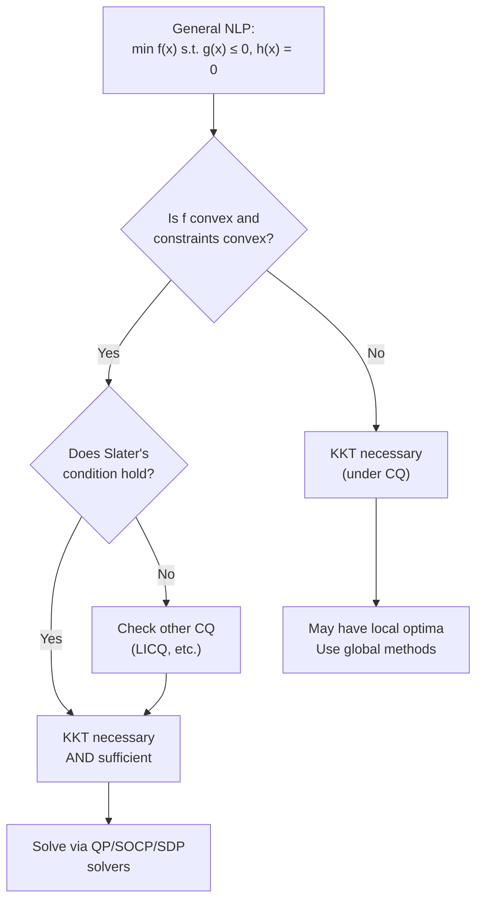
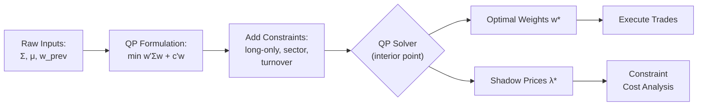
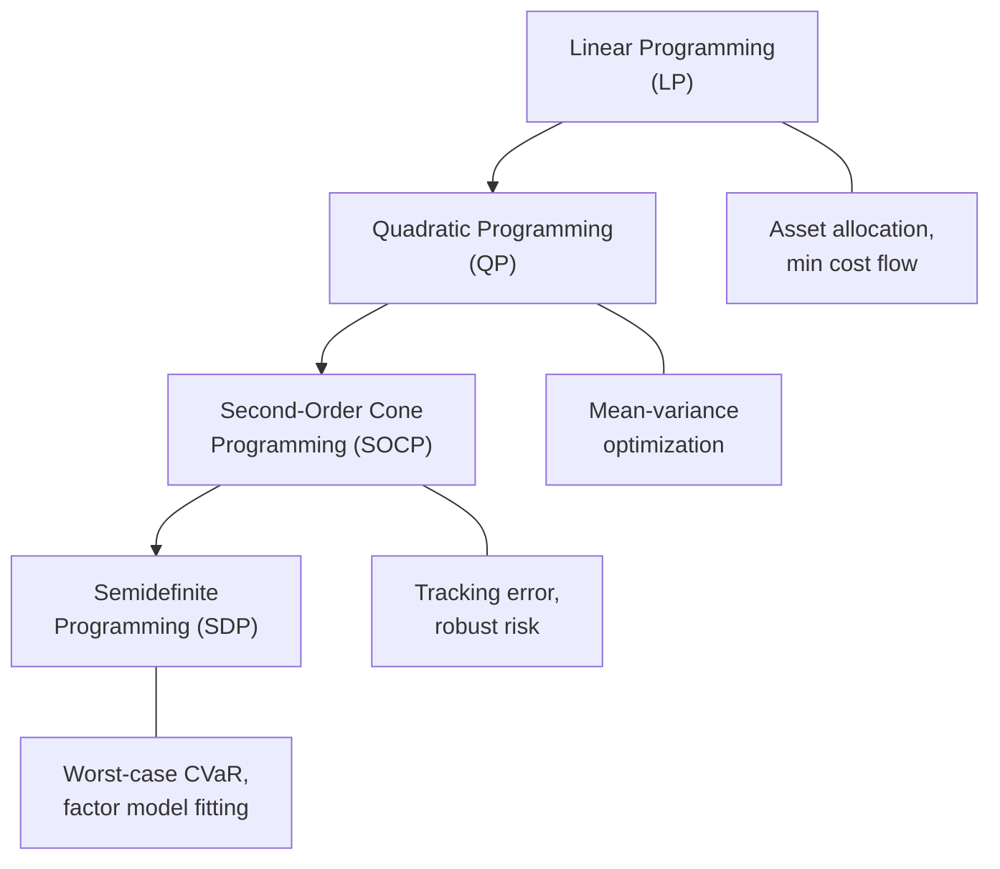
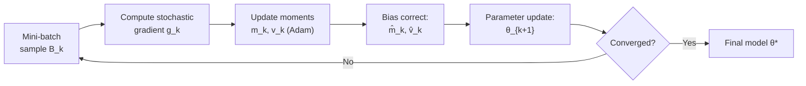
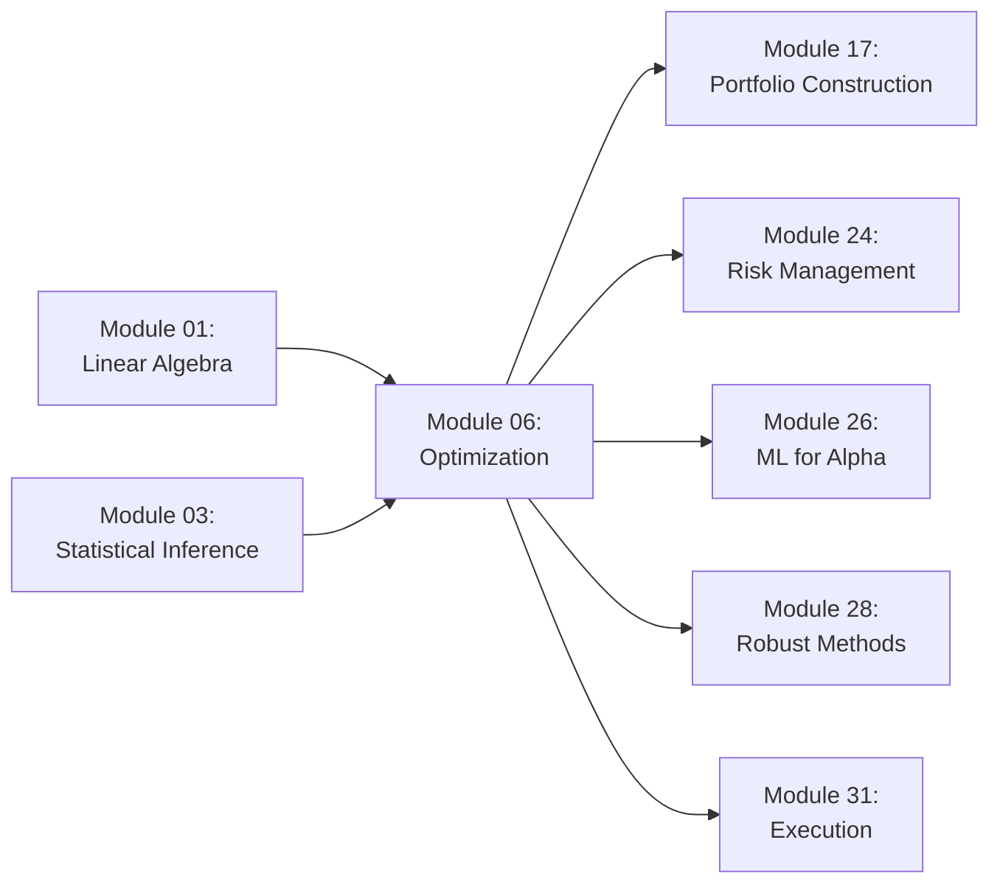

# Module 06: Optimization Theory

**Prerequisites:** Module 01 (Linear Algebra), Module 03 (Statistical Inference)
**Builds toward:** Modules 17, 24, 26, 28, 31

---

## Table of Contents

1. [Convex Sets and Convex Functions](#1-convex-sets-and-convex-functions)
2. [Unconstrained Optimization](#2-unconstrained-optimization)
3. [Constrained Optimization: KKT Theory](#3-constrained-optimization-kkt-theory)
4. [Duality](#4-duality)
5. [Quadratic Programming](#5-quadratic-programming)
6. [SOCP and SDP](#6-socp-and-sdp)
7. [ADMM](#7-admm)
8. [Stochastic Gradient Descent](#8-stochastic-gradient-descent)
9. [Non-Convex Optimization](#9-non-convex-optimization)
10. [Implementation: Python](#10-implementation-python)
11. [Implementation: C++](#11-implementation-c)
12. [Exercises](#12-exercises)

---

## 1. Convex Sets and Convex Functions

Convexity is the single most consequential structural property in optimization. When a problem is convex, every local minimum is a global minimum, and efficient polynomial-time algorithms exist to find it. Nearly every portfolio optimization, risk budgeting, and regression problem in quantitative finance is either convex or can be reformulated as such.

### 1.1 Convex Sets

**Definition.** A set $C \subseteq \mathbb{R}^n$ is **convex** if for all $\mathbf{x}, \mathbf{y} \in C$ and all $\theta \in [0, 1]$:

$$\theta \mathbf{x} + (1 - \theta)\mathbf{y} \in C$$

Geometrically, the line segment between any two points in $C$ lies entirely within $C$.

**Key examples of convex sets:**

| Set | Definition | Finance Application |
|-----|-----------|---------------------|
| **Hyperplane** | $\{\mathbf{x} : \mathbf{a}^\top \mathbf{x} = b\}$ | Budget constraint $\mathbf{1}^\top \mathbf{w} = 1$ |
| **Halfspace** | $\{\mathbf{x} : \mathbf{a}^\top \mathbf{x} \leq b\}$ | Sector exposure limit |
| **Polyhedron** | $\{\mathbf{x} : \mathbf{A}\mathbf{x} \leq \mathbf{b}\}$ | Feasible set of a linear program |
| **Ellipsoid** | $\{\mathbf{x} : (\mathbf{x} - \mathbf{c})^\top \mathbf{P}^{-1}(\mathbf{x} - \mathbf{c}) \leq 1\}$ | Confidence region for expected returns |
| **PSD cone** | $\mathbb{S}^n_+ = \{\mathbf{X} \in \mathbb{S}^n : \mathbf{X} \succeq 0\}$ | Set of valid covariance matrices |
| **Second-order cone** | $\{\, (\mathbf{x}, t) : \|\mathbf{x}\|_2 \leq t \,\}$ | Tracking error constraint |

**Preservation under operations.** Convexity is preserved under:

1. **Intersection.** If $C_1, C_2$ are convex, then $C_1 \cap C_2$ is convex. (Proof: take $\mathbf{x}, \mathbf{y} \in C_1 \cap C_2$; the convex combination lies in both $C_1$ and $C_2$.) The feasible set of a constrained optimization problem is an intersection of constraint sets.

2. **Affine mapping.** If $C$ is convex and $f(\mathbf{x}) = \mathbf{A}\mathbf{x} + \mathbf{b}$, then $f(C) = \{\mathbf{A}\mathbf{x} + \mathbf{b} : \mathbf{x} \in C\}$ is convex. The preimage $f^{-1}(C)$ is also convex.

3. **Perspective function.** The perspective function $P : \mathbb{R}^{n+1} \to \mathbb{R}^n$, $P(\mathbf{x}, t) = \mathbf{x}/t$ for $t > 0$, preserves convexity. This matters for formulations involving ratios (e.g., Sharpe ratio maximization).

### 1.2 Convex Functions

**Definition.** A function $f : \mathbb{R}^n \to \mathbb{R} \cup \{+\infty\}$ is **convex** if $\text{dom}(f)$ is convex and for all $\mathbf{x}, \mathbf{y} \in \text{dom}(f)$ and $\theta \in [0,1]$:

$$f(\theta \mathbf{x} + (1-\theta)\mathbf{y}) \leq \theta f(\mathbf{x}) + (1-\theta) f(\mathbf{y})$$

**First-order characterization.** If $f$ is differentiable, $f$ is convex if and only if:

$$f(\mathbf{y}) \geq f(\mathbf{x}) + \nabla f(\mathbf{x})^\top (\mathbf{y} - \mathbf{x}) \quad \forall\, \mathbf{x}, \mathbf{y} \in \text{dom}(f)$$

This is the **tangent inequality**: the tangent hyperplane is a global underestimator.

*Proof ($\Rightarrow$).* For any $\theta \in (0, 1]$, convexity gives $f(\mathbf{x} + \theta(\mathbf{y} - \mathbf{x})) \leq f(\mathbf{x}) + \theta(f(\mathbf{y}) - f(\mathbf{x}))$. Rearranging: $\frac{f(\mathbf{x} + \theta(\mathbf{y} - \mathbf{x})) - f(\mathbf{x})}{\theta} \leq f(\mathbf{y}) - f(\mathbf{x})$. Taking $\theta \to 0^+$ yields $\nabla f(\mathbf{x})^\top(\mathbf{y} - \mathbf{x}) \leq f(\mathbf{y}) - f(\mathbf{x})$. $\square$

**Second-order characterization.** If $f$ is twice differentiable, $f$ is convex if and only if:

$$\nabla^2 f(\mathbf{x}) \succeq 0 \quad \forall\, \mathbf{x} \in \text{dom}(f)$$

That is, the Hessian matrix is positive semidefinite everywhere.

**Strictly convex.** $f$ is **strictly convex** if the inequality in the definition is strict for $\theta \in (0,1)$ and $\mathbf{x} \neq \mathbf{y}$. Equivalently, $\nabla^2 f(\mathbf{x}) \succ 0$ for all $\mathbf{x}$ (sufficient but not necessary). A strictly convex function has at most one minimizer.

**Strongly convex.** $f$ is **$m$-strongly convex** (with modulus $m > 0$) if $f(\mathbf{x}) - \frac{m}{2}\|\mathbf{x}\|^2$ is convex, or equivalently:

$$f(\mathbf{y}) \geq f(\mathbf{x}) + \nabla f(\mathbf{x})^\top(\mathbf{y} - \mathbf{x}) + \frac{m}{2}\|\mathbf{y} - \mathbf{x}\|^2$$

Strong convexity guarantees a unique minimizer and enables faster convergence rates. Portfolio variance $\mathbf{w}^\top \boldsymbol{\Sigma} \mathbf{w}$ is $m$-strongly convex when $\boldsymbol{\Sigma}$ has smallest eigenvalue $\lambda_{\min} > 0$, with modulus $m = 2\lambda_{\min}$.

### 1.3 Jensen's Inequality

**Theorem (Jensen).** If $f$ is convex and $\mathbf{X}$ is a random variable with $\mathbb{E}[\mathbf{X}]$ well-defined, then:

$$f(\mathbb{E}[\mathbf{X}]) \leq \mathbb{E}[f(\mathbf{X})]$$

*Proof.* By the first-order condition at $\bar{\mathbf{x}} = \mathbb{E}[\mathbf{X}]$: $f(\mathbf{X}) \geq f(\bar{\mathbf{x}}) + \nabla f(\bar{\mathbf{x}})^\top (\mathbf{X} - \bar{\mathbf{x}})$. Taking expectations: $\mathbb{E}[f(\mathbf{X})] \geq f(\bar{\mathbf{x}}) + \nabla f(\bar{\mathbf{x}})^\top (\mathbb{E}[\mathbf{X}] - \bar{\mathbf{x}}) = f(\bar{\mathbf{x}}) = f(\mathbb{E}[\mathbf{X}])$. $\square$

**Financial consequence.** Since $f(x) = -\log(x)$ is convex, Jensen's inequality gives $\mathbb{E}[\log(R)] \leq \log(\mathbb{E}[R])$ for a positive return $R$. The expected log return (geometric mean) is always less than the log of the expected return (arithmetic mean). This is the **volatility drag** familiar to every portfolio manager.

### 1.4 Why Convexity Matters

**Theorem.** If $f$ is convex and $\mathbf{x}^*$ is a local minimum, then $\mathbf{x}^*$ is a global minimum.

*Proof.* Suppose $\mathbf{x}^*$ is a local minimum but not global: there exists $\mathbf{y}$ with $f(\mathbf{y}) < f(\mathbf{x}^*)$. By convexity, for any $\theta \in (0,1)$: $f(\mathbf{x}^* + \theta(\mathbf{y} - \mathbf{x}^*)) \leq (1 - \theta)f(\mathbf{x}^*) + \theta f(\mathbf{y}) < f(\mathbf{x}^*)$. But $\mathbf{x}^* + \theta(\mathbf{y} - \mathbf{x}^*)$ can be made arbitrarily close to $\mathbf{x}^*$ by taking $\theta$ small, contradicting local minimality. $\square$

---

## 2. Unconstrained Optimization

Consider the problem $\min_{\mathbf{x} \in \mathbb{R}^n} f(\mathbf{x})$ where $f$ is smooth.

### 2.1 Optimality Conditions

**Theorem (First-order necessary condition).** If $\mathbf{x}^*$ is a local minimum of $f$ and $f$ is differentiable at $\mathbf{x}^*$, then $\nabla f(\mathbf{x}^*) = \mathbf{0}$.

*Proof.* Suppose $\nabla f(\mathbf{x}^*) \neq \mathbf{0}$. Set $\mathbf{d} = -\nabla f(\mathbf{x}^*)$. By Taylor expansion: $f(\mathbf{x}^* + t\mathbf{d}) = f(\mathbf{x}^*) + t\nabla f(\mathbf{x}^*)^\top \mathbf{d} + o(t) = f(\mathbf{x}^*) - t\|\nabla f(\mathbf{x}^*)\|^2 + o(t)$. For sufficiently small $t > 0$, this is strictly less than $f(\mathbf{x}^*)$, contradicting local minimality. $\square$

**Theorem (Second-order necessary condition).** If $\mathbf{x}^*$ is a local minimum and $f$ is twice differentiable at $\mathbf{x}^*$, then $\nabla f(\mathbf{x}^*) = \mathbf{0}$ and $\nabla^2 f(\mathbf{x}^*) \succeq 0$.

*Proof.* From the first-order condition, $\nabla f(\mathbf{x}^*) = \mathbf{0}$. For any direction $\mathbf{d}$: $f(\mathbf{x}^* + t\mathbf{d}) = f(\mathbf{x}^*) + \frac{t^2}{2} \mathbf{d}^\top \nabla^2 f(\mathbf{x}^*) \mathbf{d} + o(t^2)$. If $\mathbf{d}^\top \nabla^2 f(\mathbf{x}^*) \mathbf{d} < 0$ for some $\mathbf{d}$, then for small $t > 0$ we get $f(\mathbf{x}^* + t\mathbf{d}) < f(\mathbf{x}^*)$, a contradiction. $\square$

**Second-order sufficient condition.** If $\nabla f(\mathbf{x}^*) = \mathbf{0}$ and $\nabla^2 f(\mathbf{x}^*) \succ 0$, then $\mathbf{x}^*$ is a strict local minimum.

### 2.2 Gradient Descent

**Algorithm.** Given initial point $\mathbf{x}_0$ and step size (learning rate) $\eta_k > 0$:

$$\mathbf{x}_{k+1} = \mathbf{x}_k - \eta_k \nabla f(\mathbf{x}_k)$$

**Convergence for convex $f$ with $L$-Lipschitz gradient.** If $\|\nabla f(\mathbf{x}) - \nabla f(\mathbf{y})\| \leq L\|\mathbf{x} - \mathbf{y}\|$ for all $\mathbf{x}, \mathbf{y}$ and we choose $\eta = 1/L$, then:

$$f(\mathbf{x}_k) - f(\mathbf{x}^*) \leq \frac{L \|\mathbf{x}_0 - \mathbf{x}^*\|^2}{2k} = O(1/k)$$

**Convergence for $m$-strongly convex $f$.** With $\eta = 1/L$:

$$f(\mathbf{x}_k) - f(\mathbf{x}^*) \leq \left(1 - \frac{m}{L}\right)^k (f(\mathbf{x}_0) - f(\mathbf{x}^*)) = O(\rho^k)$$

where $\rho = 1 - m/L < 1$. The ratio $\kappa = L/m$ is the **condition number** of $f$. Large $\kappa$ means slow convergence --- a direct connection to the conditioning of the covariance matrix in portfolio problems (Module 01, Section 10).

### 2.3 Newton's Method

Newton's method uses second-order information. At each iterate, it minimizes the local quadratic model:

$$\mathbf{x}_{k+1} = \mathbf{x}_k - [\nabla^2 f(\mathbf{x}_k)]^{-1} \nabla f(\mathbf{x}_k)$$

**Quadratic convergence.** Under standard assumptions (Lipschitz Hessian, $\nabla^2 f(\mathbf{x}^*) \succ 0$), when $\mathbf{x}_k$ is sufficiently close to $\mathbf{x}^*$:

$$\|\mathbf{x}_{k+1} - \mathbf{x}^*\| \leq C \|\mathbf{x}_k - \mathbf{x}^*\|^2$$

*Proof sketch.* Write $\mathbf{e}_k = \mathbf{x}_k - \mathbf{x}^*$. The Newton step satisfies $\mathbf{e}_{k+1} = \mathbf{e}_k - [\nabla^2 f(\mathbf{x}_k)]^{-1}\nabla f(\mathbf{x}_k)$. By Taylor expansion of $\nabla f$ around $\mathbf{x}^*$ (where $\nabla f(\mathbf{x}^*) = \mathbf{0}$): $\nabla f(\mathbf{x}_k) = \nabla^2 f(\mathbf{x}^*)\mathbf{e}_k + O(\|\mathbf{e}_k\|^2)$. Also $\nabla^2 f(\mathbf{x}_k) = \nabla^2 f(\mathbf{x}^*) + O(\|\mathbf{e}_k\|)$. Substituting: $\mathbf{e}_{k+1} = [\nabla^2 f(\mathbf{x}_k)]^{-1}\bigl(\nabla^2 f(\mathbf{x}_k)\mathbf{e}_k - \nabla f(\mathbf{x}_k)\bigr) = O(\|\mathbf{e}_k\|^2)$. $\square$

The cost is computing and inverting the $n \times n$ Hessian: $O(n^3)$ per iteration, prohibitive for large $n$.

### 2.4 Quasi-Newton Methods: L-BFGS

Quasi-Newton methods approximate $[\nabla^2 f]^{-1}$ without computing the Hessian explicitly.

**BFGS update.** Maintain an approximation $\mathbf{H}_k \approx [\nabla^2 f(\mathbf{x}_k)]^{-1}$. After computing the step $\mathbf{s}_k = \mathbf{x}_{k+1} - \mathbf{x}_k$ and gradient difference $\mathbf{y}_k = \nabla f(\mathbf{x}_{k+1}) - \nabla f(\mathbf{x}_k)$, update via the **rank-2 formula**:

$$\mathbf{H}_{k+1} = \left(\mathbf{I} - \frac{\mathbf{s}_k \mathbf{y}_k^\top}{\mathbf{y}_k^\top \mathbf{s}_k}\right) \mathbf{H}_k \left(\mathbf{I} - \frac{\mathbf{y}_k \mathbf{s}_k^\top}{\mathbf{y}_k^\top \mathbf{s}_k}\right) + \frac{\mathbf{s}_k \mathbf{s}_k^\top}{\mathbf{y}_k^\top \mathbf{s}_k}$$

**L-BFGS** (limited-memory BFGS) stores only the last $m$ pairs $\{(\mathbf{s}_i, \mathbf{y}_i)\}$ (typically $m = 5$ to $20$) and computes $\mathbf{H}_k \nabla f(\mathbf{x}_k)$ via a two-loop recursion in $O(mn)$ time. This is the workhorse for large-scale smooth optimization (calibration of term structure models, maximum-likelihood estimation with thousands of parameters).

### 2.5 Line Search

A **line search** selects $\eta_k$ at each step to ensure sufficient decrease.

**Armijo (sufficient decrease) condition:**

$$f(\mathbf{x}_k + \eta_k \mathbf{d}_k) \leq f(\mathbf{x}_k) + c_1 \eta_k \nabla f(\mathbf{x}_k)^\top \mathbf{d}_k$$

with $c_1 \in (0, 1)$, typically $c_1 = 10^{-4}$.

**Wolfe conditions** add a **curvature condition:**

$$\nabla f(\mathbf{x}_k + \eta_k \mathbf{d}_k)^\top \mathbf{d}_k \geq c_2 \nabla f(\mathbf{x}_k)^\top \mathbf{d}_k$$

with $0 < c_1 < c_2 < 1$ (typically $c_2 = 0.9$ for quasi-Newton, $c_2 = 0.1$ for conjugate gradient). The curvature condition prevents excessively short steps.

### 2.6 Convergence Rates Comparison

| Method | Per-Iteration Cost | Convergence (convex, $L$-smooth) | Convergence ($m$-strongly convex) |
|--------|-------------------|----------------------------------|-----------------------------------|
| Gradient Descent | $O(n)$ | $O(1/k)$ | $O((1 - m/L)^k)$ |
| Accelerated GD (Nesterov) | $O(n)$ | $O(1/k^2)$ | $O((1 - \sqrt{m/L})^k)$ |
| Newton's Method | $O(n^3)$ | Quadratic (local) | Quadratic (local) |
| L-BFGS | $O(mn)$ | Superlinear (local) | Superlinear (local) |

---

## 3. Constrained Optimization: KKT Theory

We now consider the general nonlinear program:

$$\min_{\mathbf{x} \in \mathbb{R}^n} f(\mathbf{x}) \quad \text{subject to} \quad g_i(\mathbf{x}) \leq 0, \; i = 1, \ldots, m, \quad h_j(\mathbf{x}) = 0, \; j = 1, \ldots, p$$

### 3.1 The Lagrangian

The **Lagrangian function** $L : \mathbb{R}^n \times \mathbb{R}^m \times \mathbb{R}^p \to \mathbb{R}$ is:

$$L(\mathbf{x}, \boldsymbol{\lambda}, \boldsymbol{\mu}) = f(\mathbf{x}) + \sum_{i=1}^m \lambda_i g_i(\mathbf{x}) + \sum_{j=1}^p \mu_j h_j(\mathbf{x})$$

where $\boldsymbol{\lambda} \in \mathbb{R}^m_+$ are the **inequality multipliers** and $\boldsymbol{\mu} \in \mathbb{R}^p$ are the **equality multipliers**.

### 3.2 Equality-Constrained Problems: Lagrange Multipliers

Consider first the equality-constrained case: $\min f(\mathbf{x})$ subject to $\mathbf{h}(\mathbf{x}) = \mathbf{0}$, where $\mathbf{h} : \mathbb{R}^n \to \mathbb{R}^p$.

**Theorem (Lagrange Multipliers).** Let $\mathbf{x}^*$ be a local minimum of $f$ subject to $\mathbf{h}(\mathbf{x}) = \mathbf{0}$. If the Jacobian $\nabla \mathbf{h}(\mathbf{x}^*)^\top \in \mathbb{R}^{n \times p}$ has full column rank (i.e., $\text{rank} = p$), then there exists $\boldsymbol{\mu}^* \in \mathbb{R}^p$ such that:

$$\nabla f(\mathbf{x}^*) + \sum_{j=1}^p \mu_j^* \nabla h_j(\mathbf{x}^*) = \mathbf{0}$$

*Proof (via implicit function theorem).* At a feasible point $\mathbf{x}^*$ where $\nabla \mathbf{h}(\mathbf{x}^*)^\top$ has full rank, partition $\mathbf{x} = (\mathbf{u}, \mathbf{v})$ where $\mathbf{u} \in \mathbb{R}^{n-p}$ and $\mathbf{v} \in \mathbb{R}^p$, with the Jacobian $\frac{\partial \mathbf{h}}{\partial \mathbf{v}}$ nonsingular at $\mathbf{x}^*$. By the implicit function theorem, near $\mathbf{x}^*$ the constraint $\mathbf{h}(\mathbf{u}, \mathbf{v}) = \mathbf{0}$ defines $\mathbf{v}$ as a smooth function $\mathbf{v}(\mathbf{u})$. Define $\phi(\mathbf{u}) = f(\mathbf{u}, \mathbf{v}(\mathbf{u}))$. Since $\mathbf{x}^*$ is a local minimum of $f$ on the constraint surface, $\mathbf{u}^*$ is an unconstrained local minimum of $\phi$. Therefore $\nabla_\mathbf{u} \phi(\mathbf{u}^*) = \mathbf{0}$, which gives $\nabla_\mathbf{u} f + (\frac{\partial \mathbf{v}}{\partial \mathbf{u}})^\top \nabla_\mathbf{v} f = \mathbf{0}$. From implicit differentiation, $\frac{\partial \mathbf{v}}{\partial \mathbf{u}} = -[\frac{\partial \mathbf{h}}{\partial \mathbf{v}}]^{-1} \frac{\partial \mathbf{h}}{\partial \mathbf{u}}$. Setting $\boldsymbol{\mu}^* = -[\frac{\partial \mathbf{h}}{\partial \mathbf{v}}]^{-\top} \nabla_\mathbf{v} f$ and combining yields $\nabla f(\mathbf{x}^*) + \sum_j \mu_j^* \nabla h_j(\mathbf{x}^*) = \mathbf{0}$. $\square$

### 3.3 KKT Conditions

**Theorem (Karush-Kuhn-Tucker).** Let $\mathbf{x}^*$ be a local minimum of the general nonlinear program above, and suppose a **constraint qualification** holds at $\mathbf{x}^*$. Then there exist multipliers $\boldsymbol{\lambda}^* \in \mathbb{R}^m$, $\boldsymbol{\mu}^* \in \mathbb{R}^p$ satisfying:

1. **Stationarity:** $\nabla f(\mathbf{x}^*) + \sum_{i=1}^m \lambda_i^* \nabla g_i(\mathbf{x}^*) + \sum_{j=1}^p \mu_j^* \nabla h_j(\mathbf{x}^*) = \mathbf{0}$
2. **Primal feasibility:** $g_i(\mathbf{x}^*) \leq 0$ for all $i$; $h_j(\mathbf{x}^*) = 0$ for all $j$
3. **Dual feasibility:** $\lambda_i^* \geq 0$ for all $i$
4. **Complementary slackness:** $\lambda_i^* g_i(\mathbf{x}^*) = 0$ for all $i$

**Complementary slackness** is the most economically meaningful condition: at optimality, either a constraint is active ($g_i(\mathbf{x}^*) = 0$) or its multiplier is zero ($\lambda_i^* = 0$). A binding constraint with $\lambda_i^* > 0$ is one that the optimizer "wishes it could relax."

### 3.4 Constraint Qualifications

KKT conditions require a constraint qualification (CQ) to guarantee that the multipliers exist:

**LICQ (Linear Independence CQ).** The gradients of all active inequality constraints and all equality constraints at $\mathbf{x}^*$ are linearly independent.

**Slater's condition (for convex problems).** There exists a strictly feasible point $\hat{\mathbf{x}}$ with $g_i(\hat{\mathbf{x}}) < 0$ for all $i$. When all constraints are affine, feasibility alone suffices.

### 3.5 KKT for Convex Problems: Necessary and Sufficient

**Theorem.** If $f, g_1, \ldots, g_m$ are convex and $h_1, \ldots, h_p$ are affine, and a CQ holds, then the KKT conditions are **necessary and sufficient** for global optimality.

*Proof of sufficiency.* Suppose $(\mathbf{x}^*, \boldsymbol{\lambda}^*, \boldsymbol{\mu}^*)$ satisfy KKT. For any feasible $\mathbf{x}$:

$$f(\mathbf{x}) \geq L(\mathbf{x}, \boldsymbol{\lambda}^*, \boldsymbol{\mu}^*) = f(\mathbf{x}) + \sum_i \lambda_i^* g_i(\mathbf{x}) + \sum_j \mu_j^* h_j(\mathbf{x})$$

Since $\lambda_i^* \geq 0$ and $g_i(\mathbf{x}) \leq 0$, and $h_j(\mathbf{x}) = 0$, we have $L(\mathbf{x}, \boldsymbol{\lambda}^*, \boldsymbol{\mu}^*) \leq f(\mathbf{x})$. By stationarity, $\mathbf{x}^*$ minimizes $L(\cdot, \boldsymbol{\lambda}^*, \boldsymbol{\mu}^*)$ (which is convex in $\mathbf{x}$), so $L(\mathbf{x}, \boldsymbol{\lambda}^*, \boldsymbol{\mu}^*) \geq L(\mathbf{x}^*, \boldsymbol{\lambda}^*, \boldsymbol{\mu}^*)$. By complementary slackness, $L(\mathbf{x}^*, \boldsymbol{\lambda}^*, \boldsymbol{\mu}^*) = f(\mathbf{x}^*)$. Combining: $f(\mathbf{x}) \geq f(\mathbf{x}^*)$. $\square$

### 3.6 Financial Example: Markowitz with Inequality Constraints

The portfolio selection problem with long-only and sector constraints:

$$\min_{\mathbf{w}} \; \frac{1}{2}\mathbf{w}^\top \boldsymbol{\Sigma} \mathbf{w} \quad \text{s.t.} \quad \boldsymbol{\mu}^\top \mathbf{w} \geq r_{\text{target}}, \quad \mathbf{1}^\top \mathbf{w} = 1, \quad \mathbf{w} \geq \mathbf{0}$$

The KKT conditions give:

$$\boldsymbol{\Sigma}\mathbf{w}^* - \lambda^* \boldsymbol{\mu} - \nu^* \mathbf{1} - \boldsymbol{\gamma}^* = \mathbf{0}, \quad \gamma_i^* w_i^* = 0, \quad \gamma_i^* \geq 0$$

The multiplier $\lambda^*$ on the return constraint is the marginal cost of requiring an additional unit of expected return, measured in units of variance --- it is the slope of the efficient frontier at the optimal portfolio.



---

## 4. Duality

Duality provides lower bounds on the optimal value, stopping criteria, and economic interpretations. Every constrained optimization problem has a dual.

### 4.1 The Lagrangian Dual

Given the primal problem $p^* = \min_\mathbf{x} f(\mathbf{x})$ subject to $g_i(\mathbf{x}) \leq 0$, $h_j(\mathbf{x}) = 0$, the **Lagrangian dual function** is:

$$g(\boldsymbol{\lambda}, \boldsymbol{\mu}) = \inf_{\mathbf{x}} L(\mathbf{x}, \boldsymbol{\lambda}, \boldsymbol{\mu}) = \inf_{\mathbf{x}} \left[ f(\mathbf{x}) + \sum_{i} \lambda_i g_i(\mathbf{x}) + \sum_{j} \mu_j h_j(\mathbf{x}) \right]$$

**Key property.** The dual function $g$ is always concave (as the pointwise infimum of affine functions of $(\boldsymbol{\lambda}, \boldsymbol{\mu})$), regardless of whether the primal problem is convex.

The **dual problem** is:

$$d^* = \max_{\boldsymbol{\lambda} \geq \mathbf{0}, \boldsymbol{\mu}} \; g(\boldsymbol{\lambda}, \boldsymbol{\mu})$$

### 4.2 Weak Duality

**Theorem (Weak Duality).** $d^* \leq p^*$.

*Proof.* Let $\mathbf{x}$ be any primal-feasible point and $(\boldsymbol{\lambda}, \boldsymbol{\mu})$ with $\boldsymbol{\lambda} \geq \mathbf{0}$. Then:

$$g(\boldsymbol{\lambda}, \boldsymbol{\mu}) = \inf_{\mathbf{z}} L(\mathbf{z}, \boldsymbol{\lambda}, \boldsymbol{\mu}) \leq L(\mathbf{x}, \boldsymbol{\lambda}, \boldsymbol{\mu}) = f(\mathbf{x}) + \sum_i \lambda_i \underbrace{g_i(\mathbf{x})}_{\leq 0} + \sum_j \mu_j \underbrace{h_j(\mathbf{x})}_{= 0} \leq f(\mathbf{x})$$

Since this holds for all primal-feasible $\mathbf{x}$ and all dual-feasible $(\boldsymbol{\lambda}, \boldsymbol{\mu})$, taking the supremum on the left and infimum on the right: $d^* \leq p^*$. $\square$

The difference $p^* - d^* \geq 0$ is called the **duality gap**.

### 4.3 Strong Duality

**Theorem (Strong Duality for Convex Programs).** If the primal is a convex optimization problem (convex $f, g_i$, affine $h_j$) and Slater's condition holds, then $d^* = p^*$ and the dual optimum is attained.

*Proof sketch.* Define $\mathcal{G} = \{(u_1, \ldots, u_m, v_1, \ldots, v_p, t) : \exists \mathbf{x} \text{ with } g_i(\mathbf{x}) \leq u_i,\, h_j(\mathbf{x}) = v_j,\, f(\mathbf{x}) \leq t\}$. This set is convex. The point $(\mathbf{0}, \mathbf{0}, p^*)$ is on the boundary of $\mathcal{G}$. By the supporting hyperplane theorem, there exists a hyperplane separating $(\mathbf{0}, \mathbf{0}, p^*)$ from the interior of $\mathcal{G}$. The normal to this hyperplane gives the dual multipliers $(\boldsymbol{\lambda}^*, \boldsymbol{\mu}^*)$ with $g(\boldsymbol{\lambda}^*, \boldsymbol{\mu}^*) = p^*$. Slater's condition ensures the separating hyperplane has a strictly positive component in the $t$-direction, guaranteeing that the multipliers are finite. $\square$

### 4.4 Dual of the Markowitz Problem

The unconstrained Markowitz problem $\min_{\mathbf{w}} \frac{1}{2}\mathbf{w}^\top \boldsymbol{\Sigma} \mathbf{w}$ subject to $\boldsymbol{\mu}^\top \mathbf{w} \geq r_{\text{target}}$, $\mathbf{1}^\top \mathbf{w} = 1$ has the Lagrangian:

$$L(\mathbf{w}, \lambda, \nu) = \frac{1}{2}\mathbf{w}^\top \boldsymbol{\Sigma} \mathbf{w} - \lambda(\boldsymbol{\mu}^\top \mathbf{w} - r_{\text{target}}) + \nu(\mathbf{1}^\top \mathbf{w} - 1)$$

Minimizing over $\mathbf{w}$ by setting $\nabla_\mathbf{w} L = \boldsymbol{\Sigma}\mathbf{w} - \lambda\boldsymbol{\mu} + \nu\mathbf{1} = \mathbf{0}$ gives $\mathbf{w}^*(\lambda, \nu) = \boldsymbol{\Sigma}^{-1}(\lambda\boldsymbol{\mu} - \nu\mathbf{1})$. Substituting back yields the dual function, which is a concave quadratic in $(\lambda, \nu)$. The dual maximization has a closed-form solution involving the quantities $A = \mathbf{1}^\top\boldsymbol{\Sigma}^{-1}\boldsymbol{\mu}$, $B = \boldsymbol{\mu}^\top\boldsymbol{\Sigma}^{-1}\boldsymbol{\mu}$, $C = \mathbf{1}^\top\boldsymbol{\Sigma}^{-1}\mathbf{1}$ --- the classical **two-fund theorem**.

**Interpretation.** The dual variable $\lambda^*$ is the **shadow price** of the return constraint: if $r_{\text{target}}$ increases by $\delta$, the minimum variance increases by approximately $\lambda^* \delta$. This is the marginal cost of return.

### 4.5 Shadow Prices

More generally, consider a parameterized problem $p^*(u) = \min f(\mathbf{x})$ subject to $g_i(\mathbf{x}) \leq u_i$, where $u_i = 0$ is the original problem. Under strong duality and differentiability of $p^*$:

$$\lambda_i^* = -\frac{\partial p^*}{\partial u_i}\bigg|_{u_i = 0}$$

The multiplier $\lambda_i^*$ is the rate at which the optimal objective improves per unit relaxation of constraint $i$. In portfolio terms:

- Multiplier on a sector limit: cost (in variance) of the last dollar forced into that sector.
- Multiplier on a turnover constraint: the cost of restricted trading.

---

## 5. Quadratic Programming

A **quadratic program** (QP) is the problem:

$$\min_{\mathbf{x} \in \mathbb{R}^n} \; \frac{1}{2}\mathbf{x}^\top \mathbf{Q}\mathbf{x} + \mathbf{c}^\top \mathbf{x} \quad \text{s.t.} \quad \mathbf{A}\mathbf{x} \leq \mathbf{b}, \quad \mathbf{A}_{\text{eq}}\mathbf{x} = \mathbf{b}_{\text{eq}}$$

where $\mathbf{Q} \succeq 0$ (convex QP). This is the most common optimization problem in quantitative finance.

### 5.1 Active Set Method

The active set method maintains a working set $\mathcal{W}_k$ of constraints treated as equalities at each iteration.

**Algorithm:**
1. Start with a feasible point $\mathbf{x}_0$ and working set $\mathcal{W}_0$ (active constraints at $\mathbf{x}_0$).
2. Solve the **equality-constrained QP** with constraints in $\mathcal{W}_k$ to get a step $\mathbf{d}_k$.
3. If $\mathbf{d}_k = \mathbf{0}$: compute multipliers. If all $\lambda_i \geq 0$ for $i \in \mathcal{W}_k$, **stop** (KKT satisfied). Otherwise, remove the constraint with most negative $\lambda_i$ from $\mathcal{W}_k$.
4. If $\mathbf{d}_k \neq \mathbf{0}$: take the largest step $\alpha_k \in (0, 1]$ that maintains feasibility. If a new constraint becomes active, add it to $\mathcal{W}_{k+1}$.

Active set methods are efficient for small-to-medium QPs and when a good initial working set is available (warm-starting from a previous portfolio solve).

### 5.2 Interior Point Method

Interior point methods approach the optimum through the interior of the feasible region by replacing inequality constraints with a logarithmic barrier:

$$\min_{\mathbf{x}} \; \frac{1}{2}\mathbf{x}^\top \mathbf{Q}\mathbf{x} + \mathbf{c}^\top \mathbf{x} - \frac{1}{t}\sum_{i=1}^m \log(b_i - \mathbf{a}_i^\top \mathbf{x})$$

As $t \to \infty$, the barrier solution converges to the constrained optimum. The parameter $t$ is increased iteratively. Each step solves a system of equations involving the KKT matrix:

$$\begin{pmatrix} \mathbf{Q} & \mathbf{A}^\top \\ \mathbf{A}\mathbf{S}^{-1}\mathbf{\Lambda} & -\mathbf{I} \end{pmatrix} \begin{pmatrix} \Delta\mathbf{x} \\ \Delta\boldsymbol{\lambda} \end{pmatrix} = -\begin{pmatrix} \mathbf{r}_1 \\ \mathbf{r}_2 \end{pmatrix}$$

where $\mathbf{S} = \text{diag}(s_i)$ (slacks) and $\mathbf{\Lambda} = \text{diag}(\lambda_i)$. Interior point methods converge in $O(\sqrt{m}\log(1/\epsilon))$ iterations, each requiring $O(n^3)$ work. They dominate for large-scale QPs.

### 5.3 Application: Mean-Variance Portfolio with Constraints

A realistic portfolio optimization includes many constraints:

$$\min_{\mathbf{w}} \; \frac{1}{2}\mathbf{w}^\top \boldsymbol{\Sigma} \mathbf{w} \quad \text{s.t.} \quad \begin{cases} \boldsymbol{\mu}^\top \mathbf{w} \geq r_{\text{target}} & \text{(return target)} \\ \mathbf{1}^\top \mathbf{w} = 1 & \text{(fully invested)} \\ \mathbf{0} \leq \mathbf{w} \leq \mathbf{u} & \text{(long-only, position limits)} \\ |\mathbf{S}_k^\top \mathbf{w}| \leq s_k & \text{(sector exposure limits)} \\ \|\mathbf{w} - \mathbf{w}_{\text{prev}}\|_1 \leq \tau & \text{(turnover constraint)} \end{cases}$$

The turnover constraint $\|\mathbf{w} - \mathbf{w}_{\text{prev}}\|_1 \leq \tau$ is not directly a linear inequality, but it can be reformulated by introducing auxiliary variables $\mathbf{t} \geq \mathbf{0}$:

$$w_i - w_{\text{prev},i} \leq t_i, \quad -(w_i - w_{\text{prev},i}) \leq t_i, \quad \mathbf{1}^\top \mathbf{t} \leq \tau$$

This converts the problem to a standard QP.



---

## 6. SOCP and SDP

### 6.1 Second-Order Cone Programming (SOCP)

A **second-order cone program** has the form:

$$\min_{\mathbf{x}} \; \mathbf{c}^\top \mathbf{x} \quad \text{s.t.} \quad \|\mathbf{A}_i \mathbf{x} + \mathbf{b}_i\|_2 \leq \mathbf{c}_i^\top \mathbf{x} + d_i, \quad i = 1, \ldots, m$$

The constraint $\|\mathbf{A}_i \mathbf{x} + \mathbf{b}_i\|_2 \leq \mathbf{c}_i^\top \mathbf{x} + d_i$ defines a **second-order cone** (also called a Lorentz cone or ice-cream cone). SOCPs generalize both LPs and QPs.

**Finance application: tracking error constraint.** Minimize transaction costs subject to tracking error relative to a benchmark $\mathbf{w}_b$:

$$\sqrt{(\mathbf{w} - \mathbf{w}_b)^\top \boldsymbol{\Sigma} (\mathbf{w} - \mathbf{w}_b)} \leq \sigma_{\text{TE}}$$

Using the Cholesky factor $\mathbf{L}$ with $\boldsymbol{\Sigma} = \mathbf{L}\mathbf{L}^\top$, this becomes $\|\mathbf{L}^\top(\mathbf{w} - \mathbf{w}_b)\|_2 \leq \sigma_{\text{TE}}$, a second-order cone constraint.

### 6.2 Semidefinite Programming (SDP)

A **semidefinite program** minimizes a linear objective over the intersection of the cone of positive semidefinite matrices with an affine subspace:

$$\min_{\mathbf{X} \in \mathbb{S}^n} \; \langle \mathbf{C}, \mathbf{X} \rangle \quad \text{s.t.} \quad \langle \mathbf{A}_i, \mathbf{X} \rangle = b_i, \quad \mathbf{X} \succeq 0$$

where $\langle \mathbf{A}, \mathbf{B} \rangle = \text{tr}(\mathbf{A}^\top \mathbf{B})$.

**Finance applications:**

- **Robust portfolio optimization.** When the covariance matrix $\boldsymbol{\Sigma}$ is uncertain and lies in a set $\mathcal{U} = \{\boldsymbol{\Sigma}_0 + \mathbf{\Delta} : \|\mathbf{\Delta}\|_F \leq \epsilon\}$, the worst-case variance problem $\min_\mathbf{w} \max_{\boldsymbol{\Sigma} \in \mathcal{U}} \mathbf{w}^\top \boldsymbol{\Sigma} \mathbf{w}$ can be reformulated as an SDP.

- **Worst-case CVaR.** Minimizing the worst-case Conditional Value-at-Risk over a family of distributions with known first and second moments leads to an SDP (Module 28).

The hierarchy of conic programs is: LP $\subset$ QP $\subset$ SOCP $\subset$ SDP. Each level strictly generalizes the previous one.



---

## 7. ADMM

The **Alternating Direction Method of Multipliers** (ADMM) is a first-order method that is well-suited to large-scale, distributed, and composite optimization problems.

### 7.1 Problem Formulation

ADMM solves problems of the form:

$$\min_{\mathbf{x}, \mathbf{z}} \; f(\mathbf{x}) + g(\mathbf{z}) \quad \text{s.t.} \quad \mathbf{A}\mathbf{x} + \mathbf{B}\mathbf{z} = \mathbf{c}$$

where $f$ and $g$ are convex but may be non-smooth (e.g., $g(\mathbf{z}) = \lambda\|\mathbf{z}\|_1$).

### 7.2 Algorithm Derivation

Form the **augmented Lagrangian**:

$$L_\rho(\mathbf{x}, \mathbf{z}, \mathbf{y}) = f(\mathbf{x}) + g(\mathbf{z}) + \mathbf{y}^\top(\mathbf{A}\mathbf{x} + \mathbf{B}\mathbf{z} - \mathbf{c}) + \frac{\rho}{2}\|\mathbf{A}\mathbf{x} + \mathbf{B}\mathbf{z} - \mathbf{c}\|_2^2$$

ADMM alternates between minimizing over $\mathbf{x}$ and $\mathbf{z}$, then updating the dual variable:

$$\mathbf{x}^{k+1} = \arg\min_{\mathbf{x}} \; L_\rho(\mathbf{x}, \mathbf{z}^k, \mathbf{y}^k)$$

$$\mathbf{z}^{k+1} = \arg\min_{\mathbf{z}} \; L_\rho(\mathbf{x}^{k+1}, \mathbf{z}, \mathbf{y}^k)$$

$$\mathbf{y}^{k+1} = \mathbf{y}^k + \rho(\mathbf{A}\mathbf{x}^{k+1} + \mathbf{B}\mathbf{z}^{k+1} - \mathbf{c})$$

**Scaled form.** Defining the scaled dual variable $\mathbf{u} = \mathbf{y}/\rho$ and combining the linear and quadratic terms, the updates become (for the common case $\mathbf{A} = \mathbf{I}$, $\mathbf{B} = -\mathbf{I}$, $\mathbf{c} = \mathbf{0}$):

$$\mathbf{x}^{k+1} = \arg\min_{\mathbf{x}} \left( f(\mathbf{x}) + \frac{\rho}{2}\|\mathbf{x} - \mathbf{z}^k + \mathbf{u}^k\|_2^2 \right)$$

$$\mathbf{z}^{k+1} = \arg\min_{\mathbf{z}} \left( g(\mathbf{z}) + \frac{\rho}{2}\|\mathbf{x}^{k+1} - \mathbf{z} + \mathbf{u}^k\|_2^2 \right)$$

$$\mathbf{u}^{k+1} = \mathbf{u}^k + \mathbf{x}^{k+1} - \mathbf{z}^{k+1}$$

### 7.3 Convergence

ADMM converges under mild conditions (convex $f$ and $g$, feasibility). The convergence rate is $O(1/k)$ for the objective and constraints. In practice, ADMM converges to moderate accuracy quickly but is slow to achieve high precision. The penalty parameter $\rho$ controls the trade-off between primal and dual residual convergence; adaptive schemes (e.g., varying $\rho$ based on the ratio of primal and dual residuals) are standard.

**Stopping criteria.** Define primal and dual residuals:

$$\mathbf{r}^k = \mathbf{A}\mathbf{x}^k + \mathbf{B}\mathbf{z}^k - \mathbf{c}, \qquad \mathbf{s}^k = \rho \mathbf{A}^\top \mathbf{B}(\mathbf{z}^k - \mathbf{z}^{k-1})$$

Terminate when $\|\mathbf{r}^k\|_2 \leq \epsilon^{\text{pri}}$ and $\|\mathbf{s}^k\|_2 \leq \epsilon^{\text{dual}}$.

### 7.4 Application: LASSO

The LASSO problem $\min_{\boldsymbol{\beta}} \frac{1}{2}\|\mathbf{y} - \mathbf{X}\boldsymbol{\beta}\|_2^2 + \lambda\|\boldsymbol{\beta}\|_1$ is split as:

$$f(\boldsymbol{\beta}) = \frac{1}{2}\|\mathbf{y} - \mathbf{X}\boldsymbol{\beta}\|_2^2, \qquad g(\mathbf{z}) = \lambda\|\mathbf{z}\|_1, \qquad \boldsymbol{\beta} = \mathbf{z}$$

The $\boldsymbol{\beta}$-update is a ridge regression: $\boldsymbol{\beta}^{k+1} = (\mathbf{X}^\top\mathbf{X} + \rho\mathbf{I})^{-1}(\mathbf{X}^\top\mathbf{y} + \rho(\mathbf{z}^k - \mathbf{u}^k))$.

The $\mathbf{z}$-update is the **soft-thresholding (proximal) operator**: $z_j^{k+1} = S_{\lambda/\rho}(\beta_j^{k+1} + u_j^k)$ where:

$$S_\kappa(a) = \text{sign}(a)\max(|a| - \kappa, 0)$$

This separability and closed-form structure is why ADMM is so powerful: it decomposes non-smooth composite problems into a sequence of simple steps.

### 7.5 Application: Distributed Portfolio Optimization

In a multi-desk setting, desk $i$ manages portfolio $\mathbf{w}_i$ with local risk model $\boldsymbol{\Sigma}_i$. The firm-level risk constraint requires coordination. ADMM with consensus constraints:

$$\min \sum_{i=1}^N f_i(\mathbf{w}_i) \quad \text{s.t.} \quad \mathbf{w}_i = \bar{\mathbf{w}} \;\forall\, i, \quad g(\bar{\mathbf{w}}) \leq 0$$

Each desk solves its local problem in parallel during the $\mathbf{x}$-update; the $\mathbf{z}$-update enforces the global constraint. This enables distributed optimization across trading desks without sharing proprietary alpha signals.

---

## 8. Stochastic Gradient Descent

When the objective has the form $f(\mathbf{x}) = \frac{1}{N}\sum_{i=1}^N f_i(\mathbf{x})$ (empirical risk over $N$ data points) and $N$ is large, computing the full gradient $\nabla f(\mathbf{x}) = \frac{1}{N}\sum_{i=1}^N \nabla f_i(\mathbf{x})$ is expensive. **Stochastic gradient descent** (SGD) replaces the full gradient with an unbiased estimate.

### 8.1 SGD Algorithm

At each iteration $k$, sample $i_k \sim \text{Uniform}(\{1, \ldots, N\})$ and update:

$$\mathbf{x}_{k+1} = \mathbf{x}_k - \eta_k \nabla f_{i_k}(\mathbf{x}_k)$$

Since $\mathbb{E}_{i_k}[\nabla f_{i_k}(\mathbf{x}_k)] = \nabla f(\mathbf{x}_k)$, this is an unbiased gradient estimate.

**Convergence for convex $f$.** With step size $\eta_k = O(1/\sqrt{k})$:

$$\mathbb{E}[f(\bar{\mathbf{x}}_K)] - f(\mathbf{x}^*) \leq O\left(\frac{1}{\sqrt{K}}\right)$$

where $\bar{\mathbf{x}}_K = \frac{1}{K}\sum_{k=1}^K \mathbf{x}_k$ is the average iterate. For $m$-strongly convex $f$ with $\eta_k = O(1/(mk))$:

$$\mathbb{E}[f(\mathbf{x}_K)] - f(\mathbf{x}^*) \leq O\left(\frac{1}{mK}\right)$$

The key trade-off: each SGD step is $O(n)$ (vs. $O(Nn)$ for full GD), but convergence is slower due to the variance of the stochastic gradient.

### 8.2 Variance Reduction: SAGA and SVRG

**SVRG (Stochastic Variance-Reduced Gradient).** Periodically compute the full gradient $\tilde{\nabla} = \nabla f(\tilde{\mathbf{x}})$ at a snapshot $\tilde{\mathbf{x}}$. Use the variance-reduced estimator:

$$\mathbf{v}_k = \nabla f_{i_k}(\mathbf{x}_k) - \nabla f_{i_k}(\tilde{\mathbf{x}}) + \tilde{\nabla}$$

Note $\mathbb{E}[\mathbf{v}_k] = \nabla f(\mathbf{x}_k)$, but $\text{Var}(\mathbf{v}_k) \to 0$ as $\mathbf{x}_k \to \tilde{\mathbf{x}} \to \mathbf{x}^*$. SVRG achieves linear convergence rate $O(\rho^k)$ for strongly convex $f$, combining the cheap per-iteration cost of SGD with the fast rate of full GD.

**SAGA** maintains individual gradient memory $\nabla f_i(\mathbf{x}_{k(i)})$ for each data point $i$, updated lazily. It achieves similar linear convergence without the explicit full-gradient snapshot.

### 8.3 Adam Optimizer

**Adam** (Adaptive Moment Estimation) maintains exponentially decaying averages of the first moment (mean) and second moment (uncentered variance) of the gradients:

$$\mathbf{m}_k = \beta_1 \mathbf{m}_{k-1} + (1 - \beta_1)\mathbf{g}_k$$

$$\mathbf{v}_k = \beta_2 \mathbf{v}_{k-1} + (1 - \beta_2)\mathbf{g}_k^2$$

where $\mathbf{g}_k = \nabla f_{i_k}(\mathbf{x}_k)$ and $\mathbf{g}_k^2$ is element-wise.

**Bias correction.** Since $\mathbf{m}_0 = \mathbf{v}_0 = \mathbf{0}$, the estimates are biased toward zero in early iterations:

$$\hat{\mathbf{m}}_k = \frac{\mathbf{m}_k}{1 - \beta_1^k}, \qquad \hat{\mathbf{v}}_k = \frac{\mathbf{v}_k}{1 - \beta_2^k}$$

**Update rule:**

$$\mathbf{x}_{k+1} = \mathbf{x}_k - \frac{\eta}{\sqrt{\hat{\mathbf{v}}_k} + \epsilon} \hat{\mathbf{m}}_k$$

Default hyperparameters: $\beta_1 = 0.9$, $\beta_2 = 0.999$, $\epsilon = 10^{-8}$, $\eta = 10^{-3}$.

Adam adapts the learning rate per-parameter: parameters with large gradients get smaller effective learning rates. This is critical for training deep learning models where gradient magnitudes vary across layers.

### 8.4 Learning Rate Schedules

| Schedule | Formula | Use Case |
|----------|---------|----------|
| **Constant** | $\eta_k = \eta_0$ | SGD (convergence to neighborhood) |
| **Step decay** | $\eta_k = \eta_0 \gamma^{\lfloor k / s \rfloor}$ | Standard deep learning |
| **Cosine annealing** | $\eta_k = \frac{\eta_0}{2}(1 + \cos(\pi k / T))$ | Modern transformers |
| **Warmup + decay** | Linear increase for $k_w$ steps, then decay | Large-batch training, transformers |
| **1-cycle** | Warmup to peak, cosine decay to near zero | Fast convergence (Smith, 2019) |

**Warmup** gradually increases the learning rate from a small value to the target $\eta_0$ over $k_w$ steps. This stabilizes training when the initial parameter values produce large, noisy gradients.

### 8.5 Application: Training Alpha Models

In Module 26 (Machine Learning for Alpha), the typical pipeline is:

1. **Features:** $\mathbf{X} \in \mathbb{R}^{N \times d}$ (e.g., $N = 10^6$ stock-day observations, $d = 200$ features).
2. **Labels:** $\mathbf{y} \in \mathbb{R}^N$ (forward returns or cross-sectional ranks).
3. **Model:** Neural network $f_\theta(\mathbf{x})$ with $|\theta| = 10^5$ to $10^7$ parameters.
4. **Loss:** $\mathcal{L}(\theta) = \frac{1}{N}\sum_{i=1}^N \ell(f_\theta(\mathbf{x}_i), y_i) + \lambda R(\theta)$.

Full-batch gradient descent is infeasible. SGD with mini-batches (batch size 256--2048), Adam optimizer, cosine annealing schedule, and gradient clipping is standard. Each training run involves $10^4$ to $10^5$ gradient steps.



---

## 9. Non-Convex Optimization

Many problems in quantitative finance are inherently non-convex: volatility surface calibration, mixture model estimation, neural network training, and combinatorial portfolio selection. Non-convexity means multiple local minima, saddle points, and no guarantee that standard methods find the global optimum.

### 9.1 Saddle Points in High Dimensions

In $\mathbb{R}^n$ with $n$ large, a critical point ($\nabla f = \mathbf{0}$) is far more likely to be a **saddle point** than a local minimum. At a critical point, the Hessian has $n$ eigenvalues. If each is independently equally likely to be positive or negative, the probability of all $n$ being positive (local minimum) is $2^{-n}$, which is astronomically small for $n = 10^4$ or more.

This observation (Dauphin et al., 2014) implies that the primary obstacle in training deep networks is not poor local minima but rather saddle points where gradient-based methods stall.

### 9.2 Escaping Saddle Points

**Perturbed gradient descent.** Add isotropic noise: $\mathbf{x}_{k+1} = \mathbf{x}_k - \eta\nabla f(\mathbf{x}_k) + \xi_k$ where $\xi_k \sim \mathcal{N}(\mathbf{0}, \sigma^2\mathbf{I})$. Jin et al. (2017) showed this finds an $\epsilon$-approximate second-order stationary point in polynomial time.

**Negative curvature exploitation.** At a saddle point, the Hessian has a negative eigenvalue. Computing the minimum eigenvector of $\nabla^2 f(\mathbf{x}_k)$ (via Lanczos iteration) and stepping along it escapes the saddle.

### 9.3 Global Methods

**Random restarts.** Run a local optimizer from $K$ random initial points and take the best solution. For volatility calibration with $p$ parameters, $K = 10p$ to $100p$ is a practical rule of thumb.

**Simulated annealing.** Accept worse solutions with probability $\exp(-\Delta f / T_k)$ where $T_k$ is a "temperature" that decreases over iterations. The cooling schedule controls the exploration-exploitation trade-off.

### 9.4 Application: Volatility Surface Calibration

Calibrating a stochastic volatility model (e.g., Heston, SABR) to market option prices requires solving:

$$\min_{\boldsymbol{\theta}} \sum_{i=1}^M \left( \sigma_{\text{model}}^{\text{imp}}(K_i, T_i; \boldsymbol{\theta}) - \sigma_{\text{market}}^{\text{imp}}(K_i, T_i) \right)^2$$

This objective is non-convex in $\boldsymbol{\theta}$ due to the nonlinear dependence of model implied volatility on parameters. The standard approach combines:

1. **Closed-form approximation** (e.g., Heston characteristic function + FFT) for fast evaluation.
2. **Levenberg-Marquardt** (damped Newton for least squares) for local refinement.
3. **Multi-start** or **differential evolution** for global search.

---

## 10. Implementation: Python

### 10.1 Gradient Descent and Newton's Method

```python
"""
Module 06: Gradient Descent and Newton's Method
Demonstrates unconstrained optimization on the Rosenbrock function
and on portfolio variance minimization.
"""

import numpy as np
from typing import Callable, Tuple, List, Optional


def gradient_descent(
    f: Callable[[np.ndarray], float],
    grad_f: Callable[[np.ndarray], np.ndarray],
    x0: np.ndarray,
    lr: float = 1e-3,
    tol: float = 1e-8,
    max_iter: int = 10_000,
    armijo_c1: float = 1e-4,
    use_line_search: bool = True,
) -> Tuple[np.ndarray, List[float]]:
    """
    Gradient descent with optional Armijo backtracking line search.

    Parameters
    ----------
    f : objective function
    grad_f : gradient of f
    x0 : initial point
    lr : initial learning rate (or fixed step size if no line search)
    tol : gradient norm tolerance for convergence
    max_iter : maximum number of iterations
    armijo_c1 : Armijo sufficient decrease parameter
    use_line_search : whether to use Armijo backtracking

    Returns
    -------
    x_opt : approximate minimizer
    history : list of objective values at each iteration
    """
    x = x0.copy().astype(float)
    history = [f(x)]

    for k in range(max_iter):
        g = grad_f(x)
        if np.linalg.norm(g) < tol:
            break

        # Search direction
        d = -g

        # Armijo backtracking line search
        if use_line_search:
            eta = 1.0
            fx = f(x)
            slope = g @ d  # negative of ||g||^2
            while f(x + eta * d) > fx + armijo_c1 * eta * slope:
                eta *= 0.5
                if eta < 1e-16:
                    break
        else:
            eta = lr

        x = x + eta * d
        history.append(f(x))

    return x, history


def newton_method(
    f: Callable[[np.ndarray], float],
    grad_f: Callable[[np.ndarray], np.ndarray],
    hess_f: Callable[[np.ndarray], np.ndarray],
    x0: np.ndarray,
    tol: float = 1e-10,
    max_iter: int = 100,
) -> Tuple[np.ndarray, List[float]]:
    """
    Newton's method with backtracking line search.

    Parameters
    ----------
    f : objective function
    grad_f : gradient of f
    hess_f : Hessian of f
    x0 : initial point
    tol : gradient norm tolerance
    max_iter : maximum iterations

    Returns
    -------
    x_opt : approximate minimizer
    history : list of objective values
    """
    x = x0.copy().astype(float)
    history = [f(x)]

    for k in range(max_iter):
        g = grad_f(x)
        if np.linalg.norm(g) < tol:
            break

        H = hess_f(x)
        # Solve H @ d = -g using Cholesky if possible, else LU
        try:
            L = np.linalg.cholesky(H)
            d = -np.linalg.solve(H, g)
        except np.linalg.LinAlgError:
            # Hessian not PD; regularize
            reg = 1e-6 * np.eye(len(x))
            d = -np.linalg.solve(H + reg, g)

        # Backtracking line search
        eta = 1.0
        fx = f(x)
        while f(x + eta * d) > fx + 1e-4 * eta * (g @ d):
            eta *= 0.5
            if eta < 1e-16:
                break

        x = x + eta * d
        history.append(f(x))

    return x, history


# --- Example: Rosenbrock function ---
def rosenbrock(x: np.ndarray) -> float:
    return (1 - x[0])**2 + 100 * (x[1] - x[0]**2)**2

def rosenbrock_grad(x: np.ndarray) -> np.ndarray:
    dx0 = -2 * (1 - x[0]) - 400 * x[0] * (x[1] - x[0]**2)
    dx1 = 200 * (x[1] - x[0]**2)
    return np.array([dx0, dx1])

def rosenbrock_hess(x: np.ndarray) -> np.ndarray:
    h00 = 2 - 400 * (x[1] - 3 * x[0]**2)
    h01 = -400 * x[0]
    h11 = 200.0
    return np.array([[h00, h01], [h01, h11]])


if __name__ == "__main__":
    x0 = np.array([-1.5, 1.5])

    x_gd, hist_gd = gradient_descent(rosenbrock, rosenbrock_grad, x0, max_iter=50_000)
    print(f"GD:     x* = {x_gd}, f(x*) = {rosenbrock(x_gd):.2e}, iters = {len(hist_gd)-1}")

    x_nt, hist_nt = newton_method(rosenbrock, rosenbrock_grad, rosenbrock_hess, x0)
    print(f"Newton: x* = {x_nt}, f(x*) = {rosenbrock(x_nt):.2e}, iters = {len(hist_nt)-1}")
```

### 10.2 ADMM for LASSO

```python
"""
Module 06: ADMM for LASSO regression.
Solves: min (1/2)||y - Xβ||² + λ||β||₁
"""

import numpy as np
from numpy.linalg import solve, norm


def soft_threshold(a: np.ndarray, kappa: float) -> np.ndarray:
    """Proximal operator for the L1 norm: S_κ(a) = sign(a) max(|a| - κ, 0)."""
    return np.sign(a) * np.maximum(np.abs(a) - kappa, 0.0)


def admm_lasso(
    X: np.ndarray,
    y: np.ndarray,
    lam: float,
    rho: float = 1.0,
    max_iter: int = 1000,
    atol: float = 1e-6,
    rtol: float = 1e-4,
) -> dict:
    """
    ADMM for LASSO: min (1/2)||y - Xβ||² + λ||β||₁

    Parameters
    ----------
    X : (N, d) design matrix
    y : (N,) response vector
    lam : L1 regularization strength
    rho : ADMM penalty parameter
    max_iter : maximum ADMM iterations
    atol, rtol : absolute and relative tolerances for convergence

    Returns
    -------
    dict with keys 'beta', 'z', 'history' containing primal/dual residuals
    """
    N, d = X.shape

    # Precompute factorization (X'X + ρI) — reused every iteration
    XtX = X.T @ X
    Xty = X.T @ y
    L_factor = np.linalg.cholesky(XtX + rho * np.eye(d))

    # Initialize
    beta = np.zeros(d)
    z = np.zeros(d)
    u = np.zeros(d)  # scaled dual variable

    history = {"primal_residual": [], "dual_residual": [], "objective": []}

    for k in range(max_iter):
        # β-update: solve (X'X + ρI)β = X'y + ρ(z - u)
        rhs = Xty + rho * (z - u)
        beta = np.linalg.solve(L_factor @ L_factor.T, rhs)

        # z-update: soft thresholding
        z_old = z.copy()
        z = soft_threshold(beta + u, lam / rho)

        # u-update: dual variable
        u = u + beta - z

        # Diagnostics
        r_norm = norm(beta - z)            # primal residual
        s_norm = norm(rho * (z - z_old))   # dual residual
        obj = 0.5 * norm(y - X @ beta)**2 + lam * norm(z, 1)

        history["primal_residual"].append(r_norm)
        history["dual_residual"].append(s_norm)
        history["objective"].append(obj)

        # Convergence check
        eps_pri = np.sqrt(d) * atol + rtol * max(norm(beta), norm(z))
        eps_dual = np.sqrt(d) * atol + rtol * norm(rho * u)

        if r_norm < eps_pri and s_norm < eps_dual:
            break

    return {"beta": z, "z": z, "n_iter": k + 1, "history": history}


if __name__ == "__main__":
    np.random.seed(42)
    N, d = 500, 100
    X = np.random.randn(N, d)
    beta_true = np.zeros(d)
    beta_true[:10] = np.array([3, -2, 1.5, -1, 0.8, -0.6, 2.5, -1.2, 0.9, -0.4])
    y = X @ beta_true + 0.5 * np.random.randn(N)

    result = admm_lasso(X, y, lam=0.5, rho=1.0)
    beta_hat = result["beta"]

    print(f"ADMM converged in {result['n_iter']} iterations")
    print(f"Nonzero coefficients: {np.sum(np.abs(beta_hat) > 1e-4)}")
    print(f"True nonzeros: {np.sum(np.abs(beta_true) > 0)}")
    print(f"Recovery error: ||β̂ - β_true|| = {norm(beta_hat - beta_true):.4f}")
```

### 10.3 Markowitz QP with CVXPY

```python
"""
Module 06: Mean-variance portfolio optimization using CVXPY.
Demonstrates QP with realistic constraints.
"""

import numpy as np
import cvxpy as cp


def markowitz_optimize(
    mu: np.ndarray,
    Sigma: np.ndarray,
    r_target: float,
    w_prev: np.ndarray | None = None,
    turnover_limit: float | None = None,
    sector_map: np.ndarray | None = None,
    sector_limits: np.ndarray | None = None,
    max_weight: float = 1.0,
) -> dict:
    """
    Solve the mean-variance QP with practical constraints.

    Parameters
    ----------
    mu : (n,) expected returns
    Sigma : (n, n) covariance matrix
    r_target : minimum expected return
    w_prev : (n,) previous portfolio weights (for turnover)
    turnover_limit : maximum L1 turnover
    sector_map : (n_sectors, n) binary matrix mapping assets to sectors
    sector_limits : (n_sectors,) maximum sector exposure
    max_weight : maximum single-asset weight

    Returns
    -------
    dict with 'weights', 'risk', 'return', 'shadow_prices'
    """
    n = len(mu)
    w = cp.Variable(n)
    
    # Objective: minimize portfolio variance
    objective = cp.Minimize(0.5 * cp.quad_form(w, Sigma))
    
    # Core constraints
    constraints = [
        mu @ w >= r_target,       # return target
        cp.sum(w) == 1,           # fully invested
        w >= 0,                   # long-only
        w <= max_weight,          # position limits
    ]
    
    # Turnover constraint
    if w_prev is not None and turnover_limit is not None:
        constraints.append(cp.norm(w - w_prev, 1) <= turnover_limit)
    
    # Sector constraints
    if sector_map is not None and sector_limits is not None:
        for k in range(sector_map.shape[0]):
            constraints.append(sector_map[k] @ w <= sector_limits[k])
    
    # Solve
    prob = cp.Problem(objective, constraints)
    prob.solve(solver=cp.OSQP, verbose=False)
    
    if prob.status not in ("optimal", "optimal_inaccurate"):
        raise ValueError(f"Optimization failed: {prob.status}")
    
    # Extract shadow prices (dual variables)
    shadow_prices = {
        "return_constraint": constraints[0].dual_value,
        "budget_constraint": constraints[1].dual_value,
    }
    
    return {
        "weights": w.value,
        "risk": np.sqrt(2 * prob.value),  # sqrt of variance = volatility
        "return": mu @ w.value,
        "shadow_prices": shadow_prices,
        "status": prob.status,
    }


if __name__ == "__main__":
    np.random.seed(123)
    n = 20

    # Generate synthetic data
    F = np.random.randn(n, 5) * 0.1  # factor loadings
    Sigma = F @ F.T + 0.02 * np.eye(n)  # factor model + idio
    mu = np.random.randn(n) * 0.05 + 0.08  # expected returns ~8%

    # Equal-weight previous portfolio
    w_prev = np.ones(n) / n

    # Sector map: 4 sectors
    sector_map = np.zeros((4, n))
    for i in range(n):
        sector_map[i % 4, i] = 1.0
    sector_limits = np.array([0.40, 0.35, 0.30, 0.40])

    result = markowitz_optimize(
        mu=mu,
        Sigma=Sigma,
        r_target=0.10,
        w_prev=w_prev,
        turnover_limit=0.5,
        sector_map=sector_map,
        sector_limits=sector_limits,
        max_weight=0.15,
    )

    print(f"Status:     {result['status']}")
    print(f"Return:     {result['return']:.4f}")
    print(f"Risk (vol): {result['risk']:.4f}")
    print(f"Nonzero weights: {np.sum(result['weights'] > 1e-4)}")
    print(f"Shadow price (return): {result['shadow_prices']['return_constraint']:.4f}")
    print(f"\nWeights: {np.round(result['weights'], 4)}")
```

---

## 11. Implementation: C++

### 11.1 Newton's Method with Eigen

```cpp
/**
 * Module 06: Newton's method for unconstrained optimization.
 * Uses Eigen for linear algebra. Demonstrates on Rosenbrock
 * and on quadratic (portfolio variance) objectives.
 *
 * Compile: g++ -std=c++17 -O2 -I/path/to/eigen newton.cpp -o newton
 */

#include <Eigen/Dense>
#include <cmath>
#include <functional>
#include <iostream>
#include <vector>

using Vec = Eigen::VectorXd;
using Mat = Eigen::MatrixXd;

struct OptResult {
    Vec x;
    double fval;
    int iterations;
    std::vector<double> history;
};

/**
 * Newton's method with backtracking line search.
 *
 * @param f     Objective function
 * @param grad  Gradient function
 * @param hess  Hessian function
 * @param x0    Initial point
 * @param tol   Gradient norm tolerance
 * @param max_iter  Maximum iterations
 * @return OptResult containing the solution and convergence history
 */
OptResult newton_method(
    std::function<double(const Vec&)> f,
    std::function<Vec(const Vec&)> grad,
    std::function<Mat(const Vec&)> hess,
    const Vec& x0,
    double tol = 1e-10,
    int max_iter = 100)
{
    Vec x = x0;
    std::vector<double> history;
    history.push_back(f(x));

    for (int k = 0; k < max_iter; ++k) {
        Vec g = grad(x);
        double gnorm = g.norm();
        if (gnorm < tol) break;

        Mat H = hess(x);

        // Attempt Cholesky; fall back to LDLT if H is not PD
        Eigen::LLT<Mat> llt(H);
        Vec d;
        if (llt.info() == Eigen::Success) {
            d = -llt.solve(g);
        } else {
            // Add regularization to make H positive definite
            double reg = 1e-6;
            while (true) {
                Mat H_reg = H + reg * Mat::Identity(x.size(), x.size());
                Eigen::LLT<Mat> llt_reg(H_reg);
                if (llt_reg.info() == Eigen::Success) {
                    d = -llt_reg.solve(g);
                    break;
                }
                reg *= 10.0;
            }
        }

        // Backtracking line search (Armijo condition)
        double eta = 1.0;
        double fx = f(x);
        double slope = g.dot(d);
        constexpr double c1 = 1e-4;
        constexpr double shrink = 0.5;

        while (f(x + eta * d) > fx + c1 * eta * slope) {
            eta *= shrink;
            if (eta < 1e-16) break;
        }

        x = x + eta * d;
        history.push_back(f(x));
    }

    return {x, f(x), static_cast<int>(history.size()) - 1, history};
}

// --- Rosenbrock function in n dimensions ---
double rosenbrock(const Vec& x) {
    double val = 0.0;
    for (int i = 0; i < x.size() - 1; ++i) {
        val += 100.0 * std::pow(x(i+1) - x(i)*x(i), 2)
             + std::pow(1.0 - x(i), 2);
    }
    return val;
}

Vec rosenbrock_grad(const Vec& x) {
    int n = x.size();
    Vec g = Vec::Zero(n);
    for (int i = 0; i < n - 1; ++i) {
        g(i)   += -400.0 * x(i) * (x(i+1) - x(i)*x(i)) - 2.0*(1.0 - x(i));
        g(i+1) += 200.0 * (x(i+1) - x(i)*x(i));
    }
    return g;
}

Mat rosenbrock_hess(const Vec& x) {
    int n = x.size();
    Mat H = Mat::Zero(n, n);
    for (int i = 0; i < n - 1; ++i) {
        H(i, i)     += 1200.0*x(i)*x(i) - 400.0*x(i+1) + 2.0;
        H(i, i+1)   += -400.0 * x(i);
        H(i+1, i)   += -400.0 * x(i);
        H(i+1, i+1) += 200.0;
    }
    return H;
}


int main() {
    // --- Test 1: Rosenbrock ---
    Vec x0(2);
    x0 << -1.5, 1.5;

    auto result = newton_method(rosenbrock, rosenbrock_grad, rosenbrock_hess, x0);
    std::cout << "=== Rosenbrock (Newton) ===" << std::endl;
    std::cout << "x* = [" << result.x.transpose() << "]" << std::endl;
    std::cout << "f(x*) = " << result.fval << std::endl;
    std::cout << "Iterations: " << result.iterations << std::endl;

    // --- Test 2: Portfolio variance minimization ---
    // min (1/2) w' Sigma w  s.t. 1'w = 1 (solved via Lagrangian)
    int n = 5;
    Mat F = Mat::Random(n, 2) * 0.1;
    Mat Sigma = F * F.transpose() + 0.02 * Mat::Identity(n, n);

    // Analytical solution: w* = Sigma^{-1} 1 / (1' Sigma^{-1} 1)
    Vec ones = Vec::Ones(n);
    Vec Sinv_ones = Sigma.llt().solve(ones);
    Vec w_star = Sinv_ones / ones.dot(Sinv_ones);

    std::cout << "\n=== Min-Variance Portfolio (Analytical) ===" << std::endl;
    std::cout << "w* = [" << w_star.transpose() << "]" << std::endl;
    std::cout << "Variance = " << 0.5 * w_star.transpose() * Sigma * w_star << std::endl;

    return 0;
}
```

### 11.2 Custom Active-Set QP Solver

```cpp
/**
 * Module 06: Minimal active-set QP solver for small-scale problems.
 * Solves: min (1/2) x'Qx + c'x  s.t. Ax <= b
 *
 * This is a pedagogical implementation. For production use,
 * prefer OSQP, Gurobi, or CPLEX.
 *
 * Compile: g++ -std=c++17 -O2 -I/path/to/eigen active_set_qp.cpp -o qp
 */

#include <Eigen/Dense>
#include <algorithm>
#include <iostream>
#include <set>
#include <vector>

using Vec = Eigen::VectorXd;
using Mat = Eigen::MatrixXd;

struct QPResult {
    Vec x;
    double obj;
    int iterations;
    bool converged;
};

/**
 * Solve the equality-constrained QP:
 *   min (1/2) x'Qx + c'x  s.t. A_eq x = b_eq
 * via the KKT system.
 */
Vec solve_eq_qp(const Mat& Q, const Vec& c, const Mat& A_eq, const Vec& b_eq) {
    int n = Q.rows();
    int p = A_eq.rows();

    // KKT system: [Q  A']  [x]   = [-c  ]
    //             [A  0 ]  [lam]   = [ b  ]
    Mat KKT = Mat::Zero(n + p, n + p);
    KKT.topLeftCorner(n, n) = Q;
    KKT.topRightCorner(n, p) = A_eq.transpose();
    KKT.bottomLeftCorner(p, n) = A_eq;

    Vec rhs(n + p);
    rhs.head(n) = -c;
    rhs.tail(p) = b_eq;

    Vec sol = KKT.fullPivLu().solve(rhs);
    return sol.head(n);
}

/**
 * Active-set method for convex QP with inequality constraints.
 *
 * @param Q  (n x n) positive semidefinite objective matrix
 * @param c  (n,) linear objective term
 * @param A  (m x n) inequality constraint matrix
 * @param b  (m,) inequality RHS
 * @param x0 feasible starting point
 * @return QPResult
 */
QPResult active_set_qp(
    const Mat& Q, const Vec& c,
    const Mat& A, const Vec& b,
    const Vec& x0,
    int max_iter = 500)
{
    int n = Q.rows();
    int m = A.rows();
    Vec x = x0;

    // Identify initial active set
    std::set<int> W;
    for (int i = 0; i < m; ++i) {
        if (std::abs(A.row(i).dot(x) - b(i)) < 1e-10) {
            W.insert(i);
        }
    }

    for (int iter = 0; iter < max_iter; ++iter) {
        // Build equality-constrained subproblem at current x:
        // min (1/2) d'Qd + (Qx + c)'d  s.t. A_W d = 0
        Vec grad = Q * x + c;

        if (W.empty()) {
            // Unconstrained step
            Vec d = -Q.fullPivLu().solve(grad);

            // Check feasibility of full step
            double alpha = 1.0;
            int blocking = -1;
            for (int i = 0; i < m; ++i) {
                double Ad = A.row(i).dot(d);
                if (Ad > 1e-12) {
                    double t = (b(i) - A.row(i).dot(x)) / Ad;
                    if (t < alpha) {
                        alpha = t;
                        blocking = i;
                    }
                }
            }
            x = x + alpha * d;
            if (blocking >= 0) W.insert(blocking);
            continue;
        }

        // Build A_W
        Mat A_W(W.size(), n);
        int row = 0;
        for (int idx : W) {
            A_W.row(row++) = A.row(idx);
        }
        Vec b_W = Vec::Zero(W.size());

        // Solve for step d
        Vec d;
        {
            int p = A_W.rows();
            Mat KKT = Mat::Zero(n + p, n + p);
            KKT.topLeftCorner(n, n) = Q;
            KKT.topRightCorner(n, p) = A_W.transpose();
            KKT.bottomLeftCorner(p, n) = A_W;

            Vec rhs = Vec::Zero(n + p);
            rhs.head(n) = -grad;

            Vec sol = KKT.fullPivLu().solve(rhs);
            d = sol.head(n);
        }

        if (d.norm() < 1e-12) {
            // Compute Lagrange multipliers for active constraints
            // grad + A_W' * lambda = 0  =>  lambda = -(A_W A_W')^{-1} A_W grad
            Mat A_W_t = A_W.transpose();
            Vec lambda = -(A_W * A_W_t).fullPivLu().solve(A_W * grad);

            // Check if all multipliers non-negative
            double min_lam = lambda.minCoeff();
            if (min_lam >= -1e-10) {
                // KKT conditions satisfied
                double obj = 0.5 * x.dot(Q * x) + c.dot(x);
                return {x, obj, iter + 1, true};
            }

            // Remove constraint with most negative multiplier
            int remove_idx = 0;
            row = 0;
            int remove_w = -1;
            for (int idx : W) {
                if (row == 0 || lambda(row) < lambda(remove_idx)) {
                    remove_idx = row;
                    remove_w = idx;
                }
                ++row;
            }
            // Find actual minimum
            row = 0;
            for (int idx : W) {
                if (lambda(row) == lambda.minCoeff()) {
                    remove_w = idx;
                    break;
                }
                ++row;
            }
            W.erase(remove_w);
        } else {
            // Step ratio: largest alpha in [0, 1] maintaining feasibility
            double alpha = 1.0;
            int blocking = -1;
            for (int i = 0; i < m; ++i) {
                if (W.count(i)) continue;
                double Ad = A.row(i).dot(d);
                if (Ad > 1e-12) {
                    double t = (b(i) - A.row(i).dot(x)) / Ad;
                    if (t < alpha) {
                        alpha = t;
                        blocking = i;
                    }
                }
            }
            x = x + alpha * d;
            if (blocking >= 0) W.insert(blocking);
        }
    }

    double obj = 0.5 * x.dot(Q * x) + c.dot(x);
    return {x, obj, max_iter, false};
}


int main() {
    // Min-variance portfolio: min (1/2) w'Σw s.t. 1'w = 1, w >= 0
    // Reformulate as: min (1/2) w'Σw s.t. -w <= 0 (long-only)
    // with equality 1'w = 1 handled by substitution w_n = 1 - sum(w_{1..n-1})

    int n = 4;
    Mat F(n, 2);
    F << 0.10, 0.05,
         0.08, -0.03,
         0.05, 0.10,
         -0.02, 0.08;
    Mat Sigma = F * F.transpose() + 0.01 * Mat::Identity(n, n);

    // Simple QP test: min (1/2) x'Qx + c'x s.t. x >= 0, sum(x) <= 1
    Mat Q = Sigma;
    Vec c = Vec::Zero(n);

    // Constraints: -x_i <= 0 (long-only) and sum(x) <= 1
    Mat A(n + 1, n);
    A.topLeftCorner(n, n) = -Mat::Identity(n, n);
    A.row(n) = Vec::Ones(n).transpose();
    Vec b(n + 1);
    b.head(n) = Vec::Zero(n);
    b(n) = 1.0;

    Vec x0 = Vec::Constant(n, 1.0 / n);  // equal weight start

    auto result = active_set_qp(Q, c, A, b, x0);

    std::cout << "=== Active-Set QP ===" << std::endl;
    std::cout << "Converged: " << (result.converged ? "yes" : "no") << std::endl;
    std::cout << "Iterations: " << result.iterations << std::endl;
    std::cout << "x* = [" << result.x.transpose() << "]" << std::endl;
    std::cout << "Objective = " << result.obj << std::endl;
    std::cout << "Sum of weights = " << result.x.sum() << std::endl;

    return 0;
}
```

---

## 12. Exercises

**Exercise 1 (Convexity verification).** Let $f(\mathbf{w}) = -\sum_{i=1}^n w_i \log w_i$ be the entropy function defined on $\{\mathbf{w} \in \mathbb{R}^n_+ : \mathbf{1}^\top \mathbf{w} = 1\}$. Show that $-f$ is strictly convex by computing the Hessian. What does this imply about maximum-entropy portfolio diversification?

**Exercise 2 (Gradient descent convergence).** Consider $f(\mathbf{x}) = \frac{1}{2}\mathbf{x}^\top \mathbf{A}\mathbf{x}$ where $\mathbf{A}$ is symmetric positive definite with eigenvalues $0 < m \leq \lambda_1 \leq \cdots \leq \lambda_n \leq L$. Show that gradient descent with step size $\eta = 2/(m + L)$ satisfies $\|\mathbf{x}_{k+1} - \mathbf{x}^*\| \leq \frac{L - m}{L + m}\|\mathbf{x}_k - \mathbf{x}^*\|$. What is the condition number of the portfolio variance objective when the covariance matrix has eigenvalues $\{0.001, 0.01, 0.1, 1.0\}$?

**Exercise 3 (KKT conditions).** Solve the following portfolio problem analytically using KKT conditions: minimize $w_1^2 + 2w_2^2$ subject to $w_1 + w_2 = 1$ and $w_1 \geq 0$, $w_2 \geq 0$. Identify all active constraints and verify complementary slackness.

**Exercise 4 (Duality).** For the LP $\min \mathbf{c}^\top \mathbf{x}$ subject to $\mathbf{A}\mathbf{x} = \mathbf{b}$, $\mathbf{x} \geq \mathbf{0}$, derive the dual problem. Show that the dual of the dual is the primal.

**Exercise 5 (Shadow prices).** A portfolio manager solves $\min \frac{1}{2}\mathbf{w}^\top\boldsymbol{\Sigma}\mathbf{w}$ subject to $\boldsymbol{\mu}^\top\mathbf{w} \geq 0.10$, $\mathbf{1}^\top\mathbf{w} = 1$, $0 \leq w_i \leq 0.25$. The shadow price on the return constraint is $\lambda^* = 0.15$. Interpret this number. If the return target increases to $0.11$, approximately how much does the minimum variance change?

**Exercise 6 (ADMM implementation).** Extend the ADMM LASSO implementation to solve the elastic net: $\min \frac{1}{2}\|\mathbf{y} - \mathbf{X}\boldsymbol{\beta}\|^2 + \lambda_1\|\boldsymbol{\beta}\|_1 + \frac{\lambda_2}{2}\|\boldsymbol{\beta}\|_2^2$. Hint: absorb the $L_2$ penalty into the $\boldsymbol{\beta}$-update.

**Exercise 7 (Newton vs. gradient descent).** Implement both methods for the log-sum-exp function $f(\mathbf{x}) = \log\left(\sum_{i=1}^n e^{x_i}\right)$ with $n = 50$. Compare the number of iterations and wall-clock time. How does the Hessian of log-sum-exp relate to the covariance of the softmax distribution?

**Exercise 8 (QP reformulation).** A portfolio manager wants to minimize tracking error $(\mathbf{w} - \mathbf{w}_b)^\top\boldsymbol{\Sigma}(\mathbf{w} - \mathbf{w}_b)$ while requiring expected return $\boldsymbol{\mu}^\top\mathbf{w} \geq r$ and full investment $\mathbf{1}^\top\mathbf{w} = 1$. Write this as a standard QP in the form $\min \frac{1}{2}\mathbf{x}^\top\mathbf{Q}\mathbf{x} + \mathbf{c}^\top\mathbf{x}$, identifying $\mathbf{Q}$ and $\mathbf{c}$.

**Exercise 9 (Non-convex calibration).** The SABR model implied volatility depends on parameters $(\alpha, \rho, \nu)$. Explain why the calibration objective is non-convex and describe a multi-start strategy. Implement a simple version using `scipy.optimize.differential_evolution` with 10 market option quotes.

**Exercise 10 (Convergence rates).** Verify empirically that SGD with constant step size converges to a neighborhood of the optimum (not the exact optimum), while SGD with $\eta_k = c/k$ converges to the exact optimum but more slowly. Use the quadratic objective $f(\mathbf{x}) = \frac{1}{N}\sum_{i=1}^N \frac{1}{2}(\mathbf{a}_i^\top\mathbf{x} - b_i)^2$ with $N = 1000$, $\mathbf{x} \in \mathbb{R}^{10}$.

---

## Summary

This module developed the theory and practice of optimization, the computational engine of quantitative finance.

**Key results:**
- **Convexity** guarantees that local optima are global optima and enables efficient algorithms.
- **KKT conditions** are necessary (under CQ) and sufficient (for convex problems) for optimality; the multipliers have direct financial interpretations as shadow prices.
- **Strong duality** holds for convex programs under Slater's condition; it provides lower bounds, stopping criteria, and economic insights via shadow prices.
- **QP** is the workhorse of portfolio optimization; active-set and interior-point methods solve it efficiently.
- **SOCP/SDP** extend the modeling power to robust optimization and distributional uncertainty.
- **ADMM** decomposes large-scale composite problems (LASSO, distributed portfolios) into sequences of simple steps.
- **SGD and Adam** are essential for training the machine learning models in Module 26.
- **Non-convex optimization** requires global search strategies (multi-start, simulated annealing) and arises in volatility calibration.



**Next:** [Module 07 — Information Theory](07_information_theory.md) develops the entropy-based machinery for quantifying uncertainty and information flow, complementing the optimization tools from this module.
